<!--
本テンプレートは、要求定義から詳細レベルの画面・データベース・API・JOB・モジュール・クエリ設計、トレーサビリティまでを単一文書で作成するための雛形である。
- コピーして「<システム名>_統合設計書.md」として使用する。
- 各章または記入ブロック直前の定義ルールコメントを確認して記入する。
- Cloudflare Workers Paid、Cloudflare D1（SQLite互換）、Cloudflare Queuesを技術基盤とする。
- D1 Binding・SQLの実行主体はデータアクセスモジュールだけとし、API・JOB・その他モジュールからの直接アクセスを禁止する。
- 記入例は 社員名簿管理システム_統合設計書.md、分割版は テンプレート/README.md を参照する。
-->
# 統合設計書 テンプレート

## 目次

| No | セクション | 定義するもの |
|---|---|---|
| 0 | はじめに | 本書の目的、前提、設計確定範囲 |
| 1 | 要求定義 | 背景・課題、目的、業務要求、非機能要求、制約、対象範囲 |
| 2 | 機能要件 | 機能一覧、ユースケース（機能要求・認可を含む）、データモデル、共通コード |
| 3 | シーケンス設計 | シーケンス図作成要否、主要処理の連携、分岐、D1原子実行境界 |
| 4 | 画面設計 | 全画面のHTML/PNGモックアップ、項目、イベント、状態、入力チェック、遷移、メッセージ |
| 5 | データベース設計 | D1/SQLiteのテーブル、制約、索引、トリガー、原子実行 |
| 6 | API設計 | 全APIの入出力、処理フロー、処理詳細、エラー |
| 7 | JOB設計 | Cron・Queues、処理フロー、処理詳細、冪等性、再配信、監視 |
| 8 | モジュール設計 | 責務、公開IF、処理フロー、処理詳細、M-006限定DBアクセス |
| 9 | クエリ設計 | M-006が実行するSQL、bind、結果、索引、競合制御 |
| 10 | 要求・設計トレーサビリティ | 要求から画面/API/モジュール/JOB/SQL/DBへの対応 |
| 11 | 設計レビュー用チェックリスト | 詳細設計とアーキテクチャ境界の確認観点 |
| 12 | 詳細設計への引継ぎ事項 | 実装・環境・性能・試験で確定する事項 |
| 13 | 設計の落とし込み関係 | オンライン/バッチからモジュール・SQL・DBへの経路 |

---

<!-- 本書は要求定義〜クエリ設計を統合した設計書。0.はじめに 〜 13.落とし込み関係 の全14章構成。本ファイルは第0章【はじめに】のテンプレートである -->
<!-- はじめに(§0)は、本書の目的・サンプルとしての前提・本書で確定する設計と実装時に確定する事項の境界を示し、以降の章(要求定義〜落とし込み関係)を読むための枠組みと工程分担の目安を与える。個別のFR/NFR/UC/SCR/API/TBL/MOD詳細は各章が正本のため、§0では概観のみを示し、IDや詳細仕様を再記載しない -->
<!-- 各見出し(#/##)直上のコメントに「定義内容(そのセクションの意味)」「定義する条件」「項目説明(各列・各項目の意味)」「定義ルール」をセットで記載する。編集時はコメントを読んでから該当セクションを埋める -->

<!--
【0. はじめに】
定義内容: 本統合設計書の目的・前提・本書で確定する詳細レベルの設計と実装時に確定する事項の境界を示し、読み手に本書全体の枠組みと工程分担の目安を与える章。
定義する条件: 全統合設計書で必須。冒頭(第0章)に置く。
項目説明:
- 0.1 本書の目的 / 0.2 サンプル・技術基盤としての前提 / 0.3 設計確定範囲と実装時確定範囲 の3サブ節で構成する。
定義ルール:
- §0では個別章(1〜13)の内容を先取りして詳細記載しない。概観と読み方のみを示す。
- 会社・組織・対象・権限・業務フロー・画面・API・データがすべて架空である旨を明記する。
-->
# 0. はじめに

<!--
【0.1 本書の目的】
定義内容: 本書が対象とするシステムと、統合する設計成果物、および成果物間の落とし込み関係を示す目的を記載する。
定義する条件: 全統合設計書で必須。
項目説明:
- 目的本文: 対象システム名と、本書が統合する設計成果物の範囲(要求定義〜クエリ設計)を1〜3行で示す。
- 成果物リスト: 本書が統合する設計成果物を番号付きで列挙する。
- 落とし込み補足: 成果物を個別に記載するだけでなく、上流(要求)から下流(モジュール・DB)への落とし込み関係を示す旨と、記載粒度の水準を述べる。
定義ルール:
- 成果物リストは本書の章立て(要求定義〜クエリ設計)と対応させる。
- 要求・設計のトレース表は第10章、設計の落とし込み経路は第13章を正本とする。ここでは示す旨のみ述べ、対応表を再掲しない。
- 記載粒度の水準(状態パターン・代替/例外フロー・エラー・DB制約・処理フロー等)を1行で示す。
-->
## 0.1 本書の目的

本書は、架空の「(対象システム名)」を対象に、(統合する設計成果物の範囲を1〜3行)を単一文書へ統合し、各設計成果物が相互にどのようにつながるかを示す統合設計書である。統合する設計成果物は次のとおり。

1. (成果物1)
2. (成果物2)
3. (成果物3)
4. (成果物4)
5. (成果物5)
6. (成果物6)
7. (成果物7: JOB設計)
8. (成果物8: モジュール設計)
9. (成果物9: クエリ設計)

本書は各成果物を個別に記載するだけでなく、(上流ID)から(下流ID)への追跡を第10章「要求・設計トレーサビリティ」、オンラインまたはバッチの実行境界からモジュール・SQL・DBへの落とし込みを第13章「設計の落とし込み関係」で示す。画面・データベース・API・JOB・モジュール・クエリは実装判断に必要な詳細設計レベルまで定義する。

<!--
【0.2 サンプル・技術基盤としての前提】
定義内容: 本書が架空サンプルであることと、対象システム・主な利用者・対象業務・認証・対象外・設計粒度・固定技術基盤の前提を表で示す。
定義する条件: 全統合設計書で必須。
項目説明:
- 前提表: 「項目」列に前提の観点、「前提」列に内容を記載する。
  - 対象システム: 本書が扱うシステム名。
  - 主な利用者: 利用者ロール。
  - 対象業務: システム化する業務の範囲。
  - 認証: 認証方式の前提。
  - 対象外: システム化しない業務。
  - 設計粒度: 本書の設計レベル。
  - バックエンド実行基盤: Cloudflare Workersを固定前提とする。
  - 永続化DB: Cloudflare D1（SQLite互換）を固定前提とする。
  - 非同期実行基盤: Cloudflare Queuesを固定前提とする。
定義ルール:
- 会社・組織・対象・権限・業務フロー・画面・API・データがすべて架空である旨を表の直前に1行で明記する。
- 対象/対象外は §1(要求定義)の対象範囲と矛盾させない。
-->
## 0.2 サンプル・技術基盤としての前提

本書に記載する会社・組織・(対象)・権限・業務フロー・画面・API・データはすべて架空である。

| 項目 | 前提 |
|---|---|
| 対象システム |  |
| 主な利用者 |  |
| 対象業務 |  |
| 認証 |  |
| 対象外 |  |
| 設計粒度 |  |
| バックエンド実行基盤 | 本番はCloudflare Workers Paid |
| 永続化DB | Cloudflare D1（SQLite互換）。WorkerのD1 binding名は`DB` |
| 非同期実行基盤 | Cloudflare Queues。Cron `scheduled()`は初回メッセージ投入だけ、業務処理は`queue()` consumerで実行 |
| JOB固定値 | 1チャンク最大40件、D1 Statement内部予算900/上限1000、Queue `max_batch_size=1`・`max_concurrency=1`・`max_retries=3`・DLQ |
| データアクセス境界 | `env.DB`とD1 Workers Binding APIを扱うのはM-006だけ。API・JOB・他モジュールの直接アクセスは禁止 |

<!--
【0.3 設計確定範囲と実装時確定範囲】
定義内容: 設計対象(シーケンス/画面/DB/API/JOB/モジュール/クエリ)ごとに、本書で詳細レベルまで定義する内容と実装・環境設計で確定する内容の境界を表で示す。
定義する条件: 全統合設計書で必須。
項目説明:
- 対象: 設計対象の種別(シーケンス/画面/DB/API/JOB/モジュール/クエリ)。
- 本書で詳細レベルまで定義する内容: 本書で実装判断に必要な粒度まで確定する範囲。
- 実装・環境設計で確定する内容: 採用フレームワーク、配置、環境値、運用実装等へ委ねる範囲。
定義ルール:
- 対象は本書の設計章(§3〜§9)の設計対象と対応させる。
- Cloudflare Workers Paid、Cloudflare D1（SQLite互換）、Cloudflare Queues、標準D1 binding名`DB`は本書の確定前提とし、製品選定として後続工程へ戻さない。
- API/JOBからDBへの直接アクセス禁止、`env.DB`・`prepare()`・`bind()`・`batch()`等のD1 Workers Binding APIとSQL実行をM-006だけに限定する等の確定アーキテクチャ境界は、本書で定義する範囲として各対象行に明記する。
- D1のSQLite型・制約、Prepared Statement、`?1`〜`?100`の連番bind検査、複数文更新を不可分にする`batch()`境界、Cron→Queueチャンク方式と固定Queue設定は本書で確定し、Wrangler環境別ID、デプロイ、監視閾値等だけを実装・環境設計へ引き継ぐ。
- 境界表の直後に、単一文書版と分割版で本文を共有し、境界表は工程分担の目安である旨を1行注記する。
-->
## 0.3 設計確定範囲と実装時確定範囲

| 対象 | 本書で詳細レベルまで定義する内容 | 実装・環境設計で確定する内容 |
|---|---|---|
| シーケンス | API/JOB→業務モジュール→M-006→D1の連携、分岐、TX-ID | 実装class/function名、telemetry実装 |
| 画面 | 全SCRの8詳細、利用API、全ERR→MSG対応。D1/SQLを直接参照しない | UI framework/version、component実装、配備asset設定 |
| DB | Cloudflare D1/SQLite、TBL/FTS、STRICT型、制約、index、trigger、migration、TX-ID | 環境別D1 database ID、適用・backup/recovery手順 |
| API | Workers Paidの`fetch`境界、HTTP契約、単一公開IF呼出、処理フロー/詳細、全例外変換。`env.DB`/M-006/SQLを参照しない | Workers対応言語/framework/version、route、middleware実装 |
| JOB | Cron UTC→初回Queue投入→40件チャンクconsumer、継続message、M-002単一公開IF、900/1000予算、固定Queue再配信・DLQ | 環境別Queue/DLQ ID、Cron式、alert通知先 |
| モジュール | 集約型公開IF契約、処理フロー/詳細、M-006限定 `env.DB`/Prepared/bind/batch、論理例外 | class/file配置、DI framework、Workers bundle構成 |
| クエリ | D1/SQLiteの実SQL、`?1`〜`?100`の連番と`.bind()`引数数、D1実行方式、結果/例外、batch順序 | SQL実測値、900予算の監視値 |

※本設計書は単一文書版と設計種別別の分割版で同じ本文を共有する。境界表は工程分担の目安を示す。

---

<!-- 統合設計書 第1節【要求定義】のテンプレート。利用者・管理者・組織が対象システムに求めること(why / want)を定義する。後続工程のID(機能F・画面SCR・API・DB・モジュール等)は参照せず、設計詳細(画面項目・API仕様・DB項目・処理ロジック・実装方式)は書かない。 -->
<!-- 各セクション直上のコメントに「定義内容(そのセクションの意味)」「定義する条件」「項目説明(各列・各項目の意味)」「定義ルール」をセットで記載する。編集時はコメントを読んでから該当セクションを埋める。本文は空欄プレースホルダ(| BR-XXX | | 等)にする。 -->

<!--
【1. 要求定義】
定義内容: 対象システムの背景・課題、システム化の目的、利用者と役割、業務要求、非機能要求、制約、対象範囲を定義し、以降の全設計の起点(要求ベースライン)を一意に定める。
定義する条件: 全プロジェクトで必須。
項目説明: 1.1〜1.7 の各サブ節で、背景/目的(OBJ)/利用者/業務要求(BR)/非機能要求(NFR)/制約/対象範囲を扱う。
定義ルール:
- 見出しは「# 1. 要求定義」(H1)開始、サブ節は「## 1.x」。
- 要求レベルの why(なぜ)/want(何がほしい)のみを書き、how(画面・API・DB・処理・技術名)は書かない。
- OBJ・BR・NFR・利用者ロール名は全節で厳密一致させ、本節で新しいIDを発明しない。
- 一覧・項目・条件はテーブル、複数ポイントの説明は箇条書き(- )で書く。
-->
# 1. 要求定義

<!--
【1.1 背景・課題】
定義内容: システム化前の現状で発生している課題・非効率・リスクを箇条書きで示す。
定義する条件: 全プロジェクトで必須。
項目説明: 各項目=現状で発生している課題・非効率・リスクを1件1行で記載する。
定義ルール:
- 課題は利用者・組織の観点で記載する。解決手段(システム機能・実装方式)や後続工程ID(OBJ/BR/F/SCR等)は書かない。
- 1.2 システム化の目的(OBJ)と対応が取れる粒度で記載する(課題→目的でトレースできること)。
- 1件1行で、事実として確認できた課題のみを記載する(推測で埋めない)。
-->
## 1.1 背景・課題

- （現状の課題1をプレースホルダとして記載。例: 情報が分散し最新版を特定しにくい）
- （現状の課題2）
- （現状の課題3）

<!--
【1.2 システム化の目的】
定義内容: 1.1 の背景・課題を解決するために、システム化で達成する目的を一覧で示す。
定義する条件: 全プロジェクトで必須。
項目説明:
- 目的ID: この目的の識別子(OBJ-XXX 連番)。
- 目的: システム化により達成したい状態(1行)。
定義ルール:
- 1.1 の課題と対応が取れること(課題を解決する目的になっていること)。
- 達成したい状態(what/why)のみを書き、手段・実装方式(how)は書かない。
- OBJ-ID は連番、欠番の再利用は禁止。全節で同一IDを参照する。
-->
## 1.2 システム化の目的

| 目的ID | 目的 |
|---|---|
| OBJ-XXX |  |

<!--
【1.3 利用者と役割】
定義内容: システムを利用する利用者(ロール)と、その利用目的・権限範囲を示す。
定義する条件: 全プロジェクトで必須。
項目説明:
- 利用者: ロール名。
- 主な利用目的: そのロールがシステムで達成したいこと。
- 主な権限: 業務観点での参照・更新可能範囲。
定義ルール:
- 権限は業務観点で記載する(実装上の認可制御(認可方式・画面/API制御)は要件・設計で定義するため書かない)。
- ロール名は全節で厳密一致させる。
- 固定ロールコードを採用する場合はロール名にコードを併記し、コードは§2.4 共通コード定義、詳細な操作・スコープ・項目規則は§2.2の各ユースケースを正本として参照できるようにする。
-->
## 1.3 利用者と役割

| 利用者 | 主な利用目的 | 主な権限 |
|---|---|---|
| （ロール名） |  |  |

<!--
【1.4 業務要求】
定義内容: 利用者・組織が対象システムに求める業務上の要求を、優先度・受入条件とともに一覧化する。
定義する条件: 全プロジェクトで必須。
項目説明:
- 要求ID: この業務要求の識別子(BR-XXX 連番)。
- 業務要求: 利用者・組織が求めること(1行、主語=ロールで記載)。
- 優先度: 必須/任意 等の区分。
- 受入条件の概要: 要求の充足を判断できる条件(テスト可能な表現)。
定義ルール:
- 要求レベルの why(なぜ)/want(何がほしい)のみを書く。画面・API・DB・処理方式は書かない。
- 受入条件は「〜されること/〜できること」の充足可否を判断できる粒度で書く。
- BR-ID は連番、欠番の再利用は禁止。全節で同一IDを参照する。
-->
## 1.4 業務要求

| 要求ID | 業務要求 | 優先度 | 受入条件の概要 |
|---|---|---:|---|
| BR-XXX |  |  |  |

<!--
【1.5 非機能要求】
定義内容: 機能横断または特定機能に対する品質要求(セキュリティ・認可・監査・個人情報保護・可用性・性能・整合性・保守性など)を分類ごとに一覧化する。
定義する条件: 全プロジェクトで必須。
項目説明:
- 要求ID: この非機能要求の識別子(NFR-XXX 連番)。
- 分類: 品質特性の分類(セキュリティ/認可/監査/性能 等)。
- 要求: 満たすべき品質(1行)。
定義ルール:
- 要求レベルの品質基準を記載し、実装方式・技術名(how)は書かない(具体的な達成基準・測定条件は要件定義のNFRで詳細化する)。
- NFR-ID は連番、欠番の再利用は禁止。全節で同一IDを参照する。
-->
## 1.5 非機能要求

| 要求ID | 分類 | 要求 |
|---|---|---|
| NFR-XXX |  |  |

<!--
【1.6 制約】
定義内容: 要求が成り立つための前提・制約・範囲上の取り決めを箇条書きで示す。
定義する条件: 制約がある場合に定義する。無ければ「なし」と記載する。
項目説明: 各項目=システム・データ・運用・外部連携に関する制約や取り決めを1件1行で記載する。
定義ルール:
- 原則として実装方式・技術名は書かない。ただし、承認済みの固定プラットフォーム制約（本テンプレートではCloudflare Workers / Cloudflare D1）とデータアクセス禁止境界は、要求レベルの制約として明記する。
- データの保持方針(履歴・状態管理・一意性など)や外部前提(認証基盤の利用など)を記載する。
- DBアクセス主体を限定するアーキテクチャ制約がある場合は、要求レベルの禁止事項として明記する。
-->
## 1.6 制約

- （制約1をプレースホルダとして記載。例: ○○は一意とする）
- （制約2）
- （制約3）
- 本番バックエンドはCloudflare Workers Paid、永続化DBはCloudflare D1（SQLite互換）、非同期基盤はCloudflare Queues、D1 binding名は`DB`を使用する。API・JOB・他モジュールからD1へ直接アクセスせず、`env.DB`参照とSQL実行はM-006 D1データアクセスだけに限定する。
- 定期処理はUTC Cronから初回Queueメッセージだけを投入し、Queue consumerが最大40件ずつ処理する。D1 Statementは1 invocationあたり内部予算900・Paid上限1000、bindは1 SQLあたり最大100とする。
- Queue consumerは `max_batch_size=1`、`max_concurrency=1`、`max_retries=3`、DLQを用い、`cursor`・`chainRunId`・`chunkNo`・`businessDate`で継続・冪等実行できることを制約とする。

<!--
【1.7 対象範囲】
定義内容: 本システムが対象とする業務範囲(対象)と、対象としない業務範囲(対象外)を明示する。
定義する条件: 全プロジェクトで必須。
項目説明:
- 対象: 本システムで実現する業務。
- 対象外: 本システムで実現しない業務(別システム・手作業で行うもの)。
定義ルール:
- 対象外を必ず明記し、スコープを一意にする(対象外の記載漏れを残さない)。
- 業務範囲(what)で記載し、機能ID・実装方式は書かない。
-->
## 1.7 対象範囲

### 対象

- （対象とする業務1）
- （対象とする業務2）

### 対象外

- （対象外とする業務1）
- （対象外とする業務2）

---

<!-- 本節は統合設計書「第2節 機能要件」のテンプレート版。各セクション/サブセクション直上のHTMLコメントに「定義内容 / 定義する条件 / 項目説明 / 定義ルール」をセットで記載する。編集時はコメントを読んでから該当セクションを埋める。本文は空欄プレースホルダ(<...>・XXX・例示行)とし、実データは記入サンプル版側で埋める。Cloudflare Workers / D1とデータアクセス境界は§0・§1の確定制約として扱い、本節で別方式へ再定義しない。 -->
<!-- 見出しは本節「# 2. 機能要件」(H1)開始、サブは「## 2.x」、ユースケースは「### 【UC-XXX】…」(H3)。担当節(第2節)以外の内容は書かない。一覧・項目・条件・分岐・処理は必ずテーブルで書く。物理名(英語のテーブル名・カラム名・メソッド名)は書かない(振る舞いとデータのみ)。 -->

<!--
【2. 機能要件】
定義内容: システムが提供する機能の一覧と、対象範囲内で想定される利用者・外部システム・定期/非同期起動の全振る舞い(ユースケース)、業務情報のデータモデル、共通コード定義を定義する。機能要求と認可は独立節を設けず各ユースケース内で定義する。要求定義(§1)を実現する「何をするか」を、設計詳細(how)を含めずに定義する。
定義する条件: 全システムで必須。
項目説明:
- 2.1 機能一覧: 提供する機能を | 機能ID(F-XXX) | 機能名 | 概要 | 主な利用者 | で列挙する。
- 2.2 ユースケース: 全機能と全起動契機をUC一覧で対応付け、各UCを ### 【UC-XXX】単位で定義する。UC記載様式(対応機能/主アクター/目的/事前条件/起動契機/正常終了/異常終了)＋事前/事後条件・入力/出力データ・状態パターン(SP-x)・基本/代替(ALT)/例外(EXC)フローで構成する。機能要求と認可(操作権限・閲覧スコープ・項目許可)もこれらのセクションで定義する。
- 2.3 データモデル: 全UCが扱う業務情報を日本語論理名のエンティティ・主要属性・関連(多重度)で定義する。
- 2.4 共通コード定義: 複数設計層で共通利用する静的な業務コードと表示名を定義する(固定ロールコードを含む)。
定義ルール:
- 機能ID(F-XXX)・UC-XXX は一覧の最大値+1で採番し、欠番を再利用しない。他節からは UC-XXX を完全修飾で参照する。
- 2.1の全F-IDを1件以上のUCへ対応させ、2.2の全UC-IDを1件以上のF-IDへ対応させる。UC一覧と個別UCはID単位で一対一にし、孤立した機能・UCを残さない。
- 利用者の画面操作だけでなく、クライアント共通操作、外部システム起動、Cron/Queue/JOB等の定期・非同期起動も抽出対象とする。主アクター、業務目的、起動契機のいずれかが独立する場合は別UCとする。
- 同じ業務目的の達成途中で呼ぶ選択肢取得等の補助APIは独立UCにせず親UCの基本/代替フローへ含める。画面・API・JOB・DBを使わない場合も、UC一覧の主な実現境界へ「なし」またはクライアント内完結と明記する。
- 状態パターン(SP-x)は正常(基本フロー)を SP-1 とし、代替(ALT)・例外(EXC)を続けて判定優先順に採番する。すべてのSPが基本/ALT/EXCフローのいずれかに対応し、すべてのALT/EXCがいずれかのSPから参照されるよう双方向に網羅する(SP-x は §2.2 を正本とし、§3 シーケンス・§4 画面から完全修飾 UC-XXX/SP-x で参照する)。
- 画面項目・API仕様・DB構造・処理ロジックなどの設計詳細は書かない(振る舞いとデータのみ)。物理名は書かない。
- 画面・API・モジュール・DBで同じ列挙値を使う場合は、2.4をコード値の正本とし、更新可能マスターと混在させない。
- 認可をロール名だけの記載で終わらせず、UC共通の規則(複数ロール時の合成規則、閲覧スコープの優先順位、ロールなしの拒否)は2.2冒頭で、許可ロール・組織階層の範囲・本人判定・基準日・項目許可・範囲外要求の扱いは各UCの事前条件・入力/出力データ・代替/例外フローで一意にする。固定ロールコードは2.4を正本とする。
- 満たすべき機能要求(必須・一意性・形式・初期状態・記録要件等)は独立の要件一覧を設けず、該当UCの事前条件・事後条件・入力/出力データ・状態パターン・フローへ、達成可否を判定できる粒度で定義する。
- 各UCのシーケンス図作成要否は§3.1.1で定義する。
-->
# 2. 機能要件

本システムが提供する機能の一覧、想定される全ユースケースの振る舞い、業務情報のデータモデル、共通コード定義を定義する。機能要求と認可条件は各ユースケースの事前条件・事後条件・入力/出力データ・状態パターン・基本/代替/例外フローで定義し(UC共通の認可規則は§2.2冒頭、固定ロールコードは§2.4を正本とする)、シーケンス図作成要否は§3.1.1で定義する。画面項目・API仕様・DB構造・処理ロジックなどの設計詳細は書かない(それらは後続の節で定義する)。

<!--
【2.1 機能一覧】
定義内容: 本システムが提供する機能を、機能ID・機能名・概要・主な利用者の一覧で示す。
定義する条件: 全システムで必須。
項目説明:
- 機能ID: 機能の識別子(F-XXX 連番)。他節(画面/API/ユースケース)からはこのIDで参照する。
- 機能名: 機能の日本語名称。
- 概要: 機能が提供する内容(1行)。
- 主な利用者: その機能を主に利用する利用者ロール(人事担当者/部門管理者/一般社員/システム管理者/全利用者)。
定義ルール:
- 機能IDは F-XXX の連番。採番は最大値+1、欠番の再利用は禁止。
- 概要は1行で簡潔に書く。画面項目・API・DB項目・処理ロジックは書かない。
- 主な利用者は要件レベルの粗い利用者区分のみ記載する(画面のロール制御・APIの認可仕様は書かない)。
-->
## 2.1 機能一覧

| 機能ID | 機能名 | 概要 | 主な利用者 |
|---|---|---|---|
| F-XXX | <機能名> | <機能の内容を1行で> | <主な利用者> |

<!--
【2.2 ユースケース】
定義内容: §1の対象範囲と2.1の全機能を実現する、利用者・外部システム・時刻起動とシステムの具体的な振る舞い(シナリオ)を、漏れなくユースケース単位で定義する。
定義する条件: 全システムで必須。
項目説明(各UCの構成):
- UC一覧: UC-ID / ユースケース / 主アクター・起動元 / 起動契機 / 対応機能(F-ID) / 主な実現境界を1行1UCで示す。
- 見出し: 「### 【UC-XXX】<ユースケース名>（<対象>向け）」。UC IDは全体で一意な連番(UC-001, UC-002 …)。SCR / API はこのIDを「トレース元」として参照する。<対象>は主アクター。
- 概要ヘッダ表: 対応機能 / 主アクター / 目的 / 事前条件(要約) / 起動契機 / 正常終了 / 異常終了 の7行で、ユースケースを俯瞰する。
- 事前条件: 開始前に成立している状態(操作者に必要なロール・閲覧スコープ・基準日の条件を含む)。事後条件: 正常完了後に成立している状態。(それぞれ別テーブル)
- 入力データ: この振る舞いが扱う入力(情報/要否/内容)。出力データ: 結果として提供する出力(情報/内容)。(それぞれ別テーブル) ロール・スコープ別に許可項目が異なる場合はここで一意に定義する。
- 状態パターン(SP-x): 振る舞いの分岐を左右するエンティティの状態区分・主要な入力条件の組み合わせ(パターン)を、判定優先順のマトリクスで定義する。列=状態軸＋結果(事後状態)＋対応フロー。各パターンは対応する1つのフロー(基本フロー/ALT-x/EXC-x)を持つ。
- 基本フロー: 正常系のStep順の 操作/処理・結果。代替フロー(ALT-x): 正常系から外れるが目的を達成する別シナリオ。例外フロー(EXC-x): エラーで処理が中断するシナリオ(発生Step・条件・エラーメッセージ・対応)。
定義ルール:
- UC一覧には対象範囲内の全UCを列挙し、一覧の全UC-IDに個別定義を1件ずつ作成する。個別定義だけのUC、一覧だけのUCを禁止する。
- 全F-IDをUC一覧の対応機能へ1回以上記載する。1つの機能に独立したアクター・目的・起動契機が複数ある場合は1対多でUCを分ける。
- 利用者操作、クライアント共通操作、外部イベント、Cron/Queue/JOBを同じ抽出基準で確認する。同じ目的内の正常・代替・例外は別UCへ分割せず、SP/ALT/EXCで網羅する。
- 各UCは「### 【UC-XXX】…」で並べ、UC間は水平線(---)で区切る。UCが1つでも本形式に従う。
- 各UC内の 概要ヘッダ表・事前条件・事後条件・入力データ・出力データ・状態パターン・各フローは、それぞれ太字ラベル＋テーブルで個別に記載する。
- 状態パターンは 出力データの直後・基本フローの前に「**状態パターン**」ラベル＋テーブルで配置する。列は「主要な状態軸」＋「結果(事後状態)」＋「対応フロー」とし、行を状態の組み合わせ(パターン)として判定優先順に並べる。判定に無関係な軸は「－」(不問)と書く。
- 状態パターンとフローは双方向に網羅する。すべてのパターンは対応フロー(基本フロー/ALT-x/EXC-x)を1つ持ち、すべてのALT-x/EXC-xはいずれかのパターンから参照される(パターンの追加が代替・例外フローの網羅漏れを検出する装置になる)。
- 状態値・区分は要件レベルの日本語名で書く(設計層IDは参照しない)。ローカルID(SP-x/ALT-x/EXC-x)は連番を維持し欠番の再利用は禁止。他節からは UC-XXX/SP-1・UC-XXX/ALT-1・UC-XXX/EXC-1 と完全修飾して参照する。
- ALTの分岐Step・EXCの発生Stepは基本フローのStep番号に対応させる。
- 例外フローは1行1条件で個別に定義し(複合条件を「または」で束ねない)、各行に業務レベルのエラーメッセージ(利用者に伝える内容)を記載する。画面固有のMSG表示仕様は画面設計側で定義する。
- 認可は本節を正本とする。UC共通の規則(複数ロール時の権限合成、閲覧スコープの優先順位と確定規則、ロールなしの拒否)は2.2冒頭へ記載し、各UCの事前条件に許可ロールと閲覧スコープ・基準日を、入力/出力データにロール・スコープ別の許可項目を、代替/例外フローに権限不足・範囲外要求の扱いを定義する。「認証済みのため常に許可」と省略しない。
- 機能要求(必須・一意性・形式・初期状態・記録要件等)は該当UCの事前条件・事後条件・入力/出力データ・状態パターン・フローへ、達成可否を判定できる粒度で定義する。
- 画面項目定義・APIパラメータ・DB構造などの設計詳細は書かない(振る舞いとデータのみ)。
- 複数UCは下の「### 【UC-XXX】…」ブロックをUC単位で連番追加し(UC-001, UC-002 …)、UC間を --- で区切る。
-->
## 2.2 ユースケース

対象範囲内の全機能と、利用者・外部システム・定期/非同期処理から予見される全起動契機を、ユースケース単位で定義する。

<UC共通の認可規則(複数ロール時の権限合成、閲覧スコープの優先順位と確定規則、ロールなしの拒否、固定ロールコードの正本参照)を記載する>

| UC-ID | ユースケース | 主アクター／起動元 | 起動契機 | 対応機能(F-ID) | 主な実現境界 |
|---|---|---|---|---|---|
| UC-XXX | <ユースケース名> | <利用者／外部システム／時刻> | <起動契機> | F-XXX | SCR-XXX／API-XXX／JOB-XXX／クライアント内完結／なし |

### 【UC-XXX】<ユースケース名>（<対象>向け）
<このユースケースの概要を1行で記載する>

| 項目 | 内容 |
|---|---|
| 対応機能 | F-XXX |
| 主アクター | <主アクター> |
| 目的 | <このユースケースで達成する業務目的> |
| 事前条件 | <開始前に成立している状態の要約> |
| 起動契機 | <利用者/システムがこの振る舞いを開始するきっかけ> |
| 正常終了 | <正常完了時の結果> |
| 異常終了 | <中断・拒否時の扱い> |

**事前条件**

| No | 条件 |
|---|---|
| 1 | <開始前に成立している条件> |
| 2 | <操作者に必要なロール・閲覧スコープ・基準日の条件> |

**事後条件**

| No | 条件 |
|---|---|
| 1 | <正常完了後に成立している条件> |

**入力データ**

| 情報 | 要否 | 内容 |
|---|---|---|
| <入力情報> | 必須／任意 | <内容> |

**出力データ**

| 情報 | 内容 |
|---|---|
| <出力情報> | <内容> |

**状態パターン**

| パターンID | <状態軸1> | <状態軸2> | 結果(事後状態) | 対応フロー |
|---|---|---|---|---|
| SP-1 | <値> | <値> | <事後状態> | 基本フロー／ALT-x／EXC-x |

**基本フロー**

| Step | アクター | 操作/処理 | 結果 |
|---|---|---|---|
| 1 | <アクター> | <操作/処理> | <結果> |

**代替フロー**

| ALT ID | 分岐Step | 条件 | フロー |
|---|---|---|---|
| ALT-1 | <Step> | <条件> | <目的を達成する別シナリオ> |

**例外フロー**

| EXC ID | 発生Step | 条件 | エラーメッセージ | 対応 |
|---|---|---|---|---|
| EXC-1 | <Step> | <1行1条件> | <業務レベルのエラーメッセージ> | <対応> |

<!-- 上の「### 【UC-XXX】…」ブロックを UC 単位で連番追加し(UC-001, UC-002 …)、UC間を --- で区切る。 -->

<!--
【2.3 データモデル】
定義内容: 2.2の全ユースケースが参照・更新する業務情報を、日本語論理名のエンティティ・主要属性・関連(多重度)として定義し、データベース設計(§5)の論理正本にする。
定義する条件: 永続化する業務データを扱うシステムでは必須。
項目説明:
- エンティティ: 業務上意味を持つデータのまとまりの論理名。
- 意味・役割: エンティティが表す業務上の対象・目的。
- 業務識別子: 業務上インスタンスを識別する属性(内部IDは書かない)。
- 主要属性: 業務判断に使う代表的な属性の論理名。
- 主な利用UC: そのエンティティを参照・更新するユースケース(UC-XXX)。
- 関連・多重度: エンティティ間の業務的な関係と「1 対 0..*」等の多重度。
定義ルール:
- エンティティ名・属性名は日本語の論理名だけを使用し、物理テーブル名・物理カラム名・SQLite型・制約・索引は書かない(物理設計は§5 データベース設計を正本とする)。
- 2.2の全UCが扱う業務データを漏れなくエンティティへ対応させ、エンティティと物理テーブルの対応は§5.2 テーブル一覧で定める。
- 区分値の集合は2.4 共通コード定義を正本として参照し、本節で値を再定義しない。
- 技術目的だけのデータ(更新ガード等)は本節に含めず、データベース設計だけで定義する。
- ER図はエンティティと関連(多重度)だけを示し、属性は2.3.1の表を正本とする。
-->
## 2.3 データモデル

<全ユースケースが扱う業務情報の論理構造の説明>

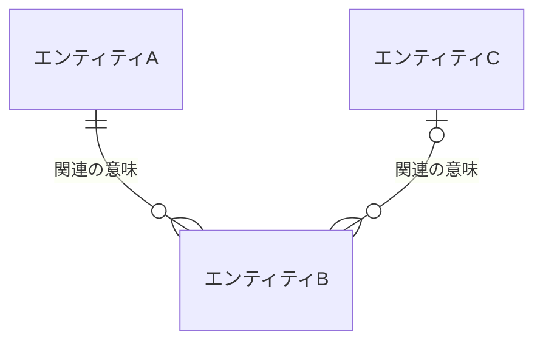

### 2.3.1 エンティティ定義

| エンティティ | 意味・役割 | 業務識別子 | 主要属性 | 主な利用UC |
|---|---|---|---|---|
| <エンティティ名> | <業務上の対象・目的> | <業務識別属性> | <属性1、属性2、…> | UC-XXX |

### 2.3.2 関連定義

| 関連 | 多重度 | 意味・制約 |
|---|---|---|
| <エンティティA> − <エンティティB>（<関連名>） | 1 対 0..* | <業務的な意味・整合条件> |

<!--
【2.4 共通コード定義】
定義内容: 画面の選択肢、APIの列挙値、モジュール検証、DB制約で共通利用する静的な業務コードを定義する。固定ロールコード等の認可用コードも本表を正本とする。
定義する条件: 更新可能マスターではなく、リリース単位で固定される業務区分を複数設計層で利用する場合に定義する。
項目説明:
- 区分種別: コード集合の業務上の名称。
- コード: API・モジュール・DBで受け渡す一意な値。
- 表示名: 画面・帳票で使用する利用者向け名称。
- 利用条件: 指定可能な機能、任意性、状態などの条件。
定義ルール:
- コード値・表示名・利用条件を1行1値で列挙し、「など」「定義済み」のまま残さない。
- 画面/API/モジュール/DBは本表を正本として参照し、各章で別の値集合を再定義しない。
- 更新可能な組織・役職等は本表に含めず、マスター設計で定義する。
-->
## 2.4 共通コード定義

| 区分種別 | コード | 表示名 | 利用条件 |
|---|---|---|---|
| <区分名> | `<CODE>` | <表示名> | <指定可能な機能・条件> |

- 選択肢の供給方法（アプリケーション定義またはマスターAPI）と、API・モジュール・DBの検証責務を明記する。
- 固定ロールコードを採用する場合は本表で定義し、ロール別の操作・スコープ・項目規則は2.2の各UCで定義する。


---

<!-- 本節は統合設計書「3. シーケンス設計」のテンプレート版。各サブセクション直上の定義ルールコメント(定義内容/定義する条件/項目説明/定義ルール)に従い、空欄プレースホルダを実データで置き換えて使う -->
<!-- シーケンスは構成要素の存在・図中正式名称・接続順・受け渡し・条件分岐・結果返却と、画面/DB/API/JOB/モジュール設計IDへの対応の正本。各要素の入出力・項目・内部処理等の詳細仕様は個別節を正本とし、本節へ重複記載しない -->
<!-- 本番基盤はCloudflare Workers Paid + Cloudflare D1 + Cloudflare Queues。DBは単一のparticipant「Cloudflare D1」(alias DB)に集約し、DBとのメッセージは必ずM-006から送受信する。D1へ向かう往路メッセージの末尾に、参照する§2.3のエンティティ名(日本語論理名)を全角括弧で列挙する(復路には付けない)。物理テーブル名・カラム名・SQL・D1メソッド名は書かない -->
<!-- エラー・メッセージは責務レベルの動詞で書く。具体的なERR-ID・MSG-ID・文言・HTTPステータスは図に書かない(採番・文言は §6 API設計/§4 画面設計 で定義し、トレーサビリティで対応付ける) -->

<!--
【3. シーケンス設計】
定義内容: §3.1.1で図が必要と判定されたユースケースにおける論理構成要素間の連携を、正常系・代替/例外系に分けて時系列(Mermaid sequenceDiagram)で定義し、連携定義(条件分岐・データ参照更新・D1原子実行境界)で補足する。
定義する条件: 複数要素の連携・分岐・D1原子更新を伴うUCで必須。静的表示・単純CRUDは省略可(§3.1.1に省略理由を記す)。
項目説明:
- 3.1 論理構成要素: 全図のactor/participantを図中表示名と宣言種別単位で一度だけ登録し、設計ID・詳細正本・使用シーケンス・連携責務を定義する。3.1.1で各UCのシーケンス図作成要否を、3.1.2でシーケンスごとのSCR/API/M/JOB/DB対応を定義する。
- 3.2〜 各シーケンス: 正常系・代替/例外系を Mermaid sequenceDiagram で示し、直後に連携定義(条件分岐・データ参照更新・D1原子実行境界・補足事項)を表で補足する。
定義ルール:
- 各図の直後の条件分岐「根拠」列に、対象UCの状態パターンを完全修飾(UC-XXX/SP-x)で示し、正常/代替/例外の分岐と双方向に網羅する(SP-x の定義は §2.2 が正本)。
- 全図の全actor/participantは§3.1にちょうど1行存在させ、宣言種別と図中表示名を完全一致させる。§3.1の全行は1件以上の図で使用し、未登録要素・未使用要素・名称揺れを禁止する。
- オンライン経路は「アクター→SCR→M-001→Cloudflare Worker API→M-002（ログインはM-003）」を省略しない。M-001内完結UCはAPIなしを明記する。APIへの要求矢印にはAPI-IDを付記する。
- JOB経路は「Cron Trigger→scheduledハンドラー→Queue→queueハンドラー→JOB→M-002」を省略せず、起動基盤・メッセージ基盤・ハンドラー・JOB本体を別participantにする。
- DBは単一participant「Cloudflare D1」(alias DB)に集約し、往路メッセージ末尾に参照する§2.3のエンティティ名を全角括弧で列挙する(復路には付けない)。D1と送受信できるparticipantはM-006だけとし、API・JOB・他モジュールからD1への矢印を禁止する。
- メッセージは業務上の動詞で書く。物理テーブル名・カラム名・SQL・メソッド名・具体的なERR-ID/MSG-ID・HTTPステータスは図に書かない。
- 認可結果を後続データ取得へ渡すシーケンスは、§2.2の各UCで定義した認可を正本として論理スコープ、操作者業務主体、許可組織等の集合、基準日、項目許可を受け渡すことを示す。複数ロールやロールなしを「認証済みのため常に許可」と省略しない。
- 正規化対象の更新では、正規化、正規化後検証、差分判定、履歴生成、永続化の順序を示す。
- 更新可能マスターでは手動利用可否と有効期間を区別し、即時無効化、任意終了日、将来の期間終了予約を同じ意味で示す。
- 複数SQLを不可分にする場合、業務モジュールは論理的な原子更新範囲をM-006へ1回で依頼し、M-006が1回の `env.DB.batch()` で実行する。図には物理メソッド名を書かず、直後のD1原子実行境界表にTX-ID、SQL-ID順序、全体ロールバック条件を記す。
-->
# 3. シーケンス設計

<!--
【3 節冒頭】
定義内容: 本節が扱うシーケンスの範囲と、§3.1.1で図が必要と判定された各ユースケースの正常・代替・例外系の割り当てを1〜3行で示す。
定義する条件: 全体で必須。
定義ルール:
- §3.1.1で図が必要と判定されたUC-XXXを根拠とし、上位要件にない振る舞いを追加しない。「不要」のUCは§3.1.1の理由と一致させる。
- 各状態パターン(UC-XXX/SP-x)は 正常系 / 代替・例外系 のいずれかで表現し、各シーケンス直後の連携定義(条件分岐)の根拠列に完全修飾で紐付ける。
-->

本節は、§3.1.1で図が必要と判定されたユースケース XXX の連携(利用者・画面・Workers上のAPI/JOB・機能・M-006・Cloudflare D1・監査)を時系列に検証する。各状態パターンは正常系または代替・例外系のいずれかで表現し、各図の直後の連携定義でデータ参照・更新とD1原子実行境界を補足する。

<!--
【3.1 論理構成要素】
定義内容: 本節の全シーケンス図に登場するactor/participantを図中表示名単位で一覧化し、画面・DB・API・JOB・モジュールの設計IDと接続責務の正本にする。
定義する条件: 本節で必須。
項目説明:
- 図中表示名: Mermaidの`as`以降に記載する正式名称。対応するSCR/API/M/JOBのIDを含める。
- 宣言: Mermaidの`actor` / `participant`。
- 種別: アクター / 画面 / 画面グループ / DB / API / 起動基盤 / JOBハンドラー / メッセージ基盤 / JOB / モジュール / 外部システム / クライアント状態。
- ID/参照・詳細正本: §4〜§8の設計IDと詳細定義箇所。
- 使用シーケンス: 当該表示名を宣言する全§3.x。
- 連携責務・制約: 接続責務、直接接続可能先、禁止事項。
定義ルール:
- 全図からactor/participant宣言を抽出した集合と本表の集合を、宣言種別・図中表示名で完全一致させる。本表だけの行、図だけの要素、同一要素の名称揺れを残さない。
- 行はアクター、画面(§4)、DB(§5)、API(§6)、JOB(§7)、モジュール(§8)、外部システム・クライアント状態の順に、本表を正本として詳細化する章の順で並べる。
- ロール差がある場合、アクターは「利用者」でなく具体的なロール名または同じ権限経路を利用するロール集合にする。
- SCR・Cloudflare D1・API・JOB・Mは§4.1・§5.1・§6.2・§7.2・§8.2のIDと正式名称に一致させる。
- データベースは単一の「Cloudflare D1」要素に集約し、エンティティごとに要素を分けない。保持する業務データは§2.3 データモデルのエンティティと対応させる。
- D1アクセスはM-006に限定する。Workersの `env.DB`、Prepared Statement、SQL-ID、物理表はシーケンス図へ記載せず、§8・§9を正本とする。
- 物理名(英語テーブル名・カラム名・メソッド名)は書かない。エンティティは§2.3の日本語論理名で表す。
- 役割はこのシーケンスでの連携責務だけを記載する(詳細仕様は各節の正本を参照)。
-->
## 3.1 論理構成要素

| 図中表示名 | 宣言 | 種別 | ID/参照 | 詳細正本 | 使用シーケンス | 連携責務・制約 |
|---|---|---|---|---|---|---|
| XXX担当者 | actor | アクター | <ロール/UC参照> | §1・§2.2・§2.4 | §3.2・§3.3・§3.5 | <操作責務> |
| XXX利用者 | actor | アクター | <ロール/UC参照> | §1・§2.2・§2.4 | §3.4 | <操作責務> |
| SCR-XXX XXX画面 | participant | 画面 | SCR-XXX | §4.x | §3.2〜§3.5 | 入力・表示をM-001へ委譲する |
| Cloudflare D1 | participant | DB | Cloudflare D1 / SQLite | §2.3・§5.1 | §3.2〜§3.6 | §2.3のエンティティを保持し、M-006以外との直接接続を禁止する |
| Cloudflare Worker API | participant | API | API-XXX〜API-YYY | §6.1・§6.2 | §3.2〜§3.5 | HTTP境界処理後に単一業務モジュール公開IFを1回呼ぶ。DBへ直接アクセスしない |
| Cloudflare Cron Trigger | participant | 起動基盤 | JOB-XXX/Cron | §7.x | §3.6 | scheduledハンドラーを起動する |
| Worker scheduledハンドラー | participant | JOBハンドラー | JOB-XXX/scheduled | §7.x | §3.6 | 初回Queueメッセージだけを投入する |
| Cloudflare Queues | participant | メッセージ基盤 | JOB-XXX Queue | §7.x | §3.6 | 初回・継続・再配信メッセージを配送する |
| Worker queueハンドラー | participant | JOBハンドラー | JOB-XXX/queue | §7.x | §3.6 | JOBを1回呼び、ack・retry・継続投入を制御する |
| JOB-XXX XXX JOB | participant | JOB | JOB-XXX | §7.x | §3.6 | M-002公開IFへチャンク処理を委譲し、M-006・D1へ直接アクセスしない |
| M-001 プレゼンテーション | participant | モジュール | M-001 | §8.x | §3.2〜§3.5 | 画面イベントをAPIへ送り、API応答を画面状態へ反映する |
| M-002 XXXアプリケーション | participant | モジュール | M-002 | §8.x | §3.2〜§3.6 | ユースケース進行と原子更新境界を制御する |
| M-003 認証・認可 | participant | モジュール | M-003 | §8.x | §3.2〜§3.5 | 認証・認可・閲覧範囲を判定する |
| M-004 XXXドメイン | participant | モジュール | M-004 | §8.x | §3.5 | 業務状態・期間整合を判定する |
| M-005 マスター管理 | participant | モジュール | M-005 | §8.x | §3.5 | マスターの取得・有効性・更新可否を判定する |
| M-006 D1データアクセス | participant | モジュール | M-006 | §8.x・§9 | §3.2〜§3.6 | D1 BindingとSQL実行を一元化し、D1へ接続する唯一の要素 |
| M-007 監査ログ | participant | モジュール | M-007 | §8.x | §3.2・§3.5 | 監査イベントを生成しM-006へ保存委譲する |

<!--
【3.1.1 シーケンス図作成要否】
定義内容: 各ユースケースについて、本節でシーケンス図を作成するか否かと、その理由を定義する。
定義する条件: 全システムで必須(§2.2の全ユースケースを対象に判定する)。
項目説明:
- UC-ID: 対象ユースケース(§2.2 のUC-XXX を参照)。
- ユースケース: ユースケースの呼称。
- 図の要否: 必要／不要。
- 理由: 要否の判断根拠(連携の複雑さ・整合性の必要性・画面内完結など)。
定義ルール:
- UC-IDは §2.2 で定義済みのIDのみを用いる(新規IDを発明しない)。
- §2.2の全UC-IDを重複・欠落なく1行ずつ記載し、「不要」のUCにも省略理由を必ず記載する。
- 複数の論理構成要素が連携する、複数データを整合更新する、権限制御と条件を組み合わせる等は「必要」とする。
- 画面内で完結し画面設計で表現できるものは「不要」とし、理由を記載する。
-->
### 3.1.1 シーケンス図作成要否

| UC-ID | ユースケース | 図の要否 | 理由 |
|---|---|---|---|
| UC-XXX | <ユースケース名> | 必要／不要 | <要否の判断根拠> |

定期・非同期JOBを含むUCは「必要」とし、本節に `scheduled()`が初回Queue messageだけを投入する経路、`queue()` consumerがM-002を1 messageにつき1回呼ぶ経路、40件/900 Statementで継続messageへ分割する経路、Queue redelivery/DLQの例外経路を記載する。CronからM-002またはD1へ直接進むシーケンスは作成しない。

<!--
【3.1.2 シーケンス・詳細設計対応】
定義内容: §3.1.1で図が必要と判定された全UC/SPについて、各シーケンス(§3.x)とSCR・M-001・API・JOB・主処理モジュール/IF・下位モジュール・永続化先の対応を定義し、§4〜§8で詳細化する構成の正本にする。
定義する条件: 本節で必須。
項目説明:
- シーケンス: 対応する§3.x。UC/SP: 対象ユースケースと状態パターン(完全修飾)。
- アクター／起動元・画面・M-001・API・JOB・主処理モジュール／IF・下位モジュール・永続化・外部: 当該シーケンスが使用する構成要素のID。
定義ルール:
- §3.1.1で「必要」と判定した全UC/SPを重複・欠落なく列挙する。
- 使用しない境界(画面・API・JOB)は「なし」を明記する。
- ID・名称は§3.1および§4.1・§6.2・§7.2・§8.2と一致させる。
-->
### 3.1.2 シーケンス・詳細設計対応

| シーケンス | UC/SP | アクター／起動元 | 画面・M-001 | API | JOB | 主処理モジュール／IF | 下位モジュール | 永続化・外部 |
|---|---|---|---|---|---|---|---|---|
| §3.x <オンライン処理> | UC-XXX/SP-x | <アクター> | SCR-XXX / M-001 | API-XXX（補助APIも列挙） | なし | M-XXX/IF-XX | M-XXX・M-006 | Cloudflare D1 |
| §3.y <非同期処理> | UC-YYY/SP-y | Cron Trigger / Queues | なし | なし | JOB-XXX | M-002/IF-XX | M-006 | Cloudflare D1 |

上表は§3.1.1で図が必要な全UC/SPを重複・欠落なく列挙する。APIを使わないクライアント内処理、画面/APIを使わないJOBは「なし」を明記する。

<!--
【3.2 <対象>・正常系】
定義内容: 対象ユースケースの正常系(状態パターン SP-1)の連携を、Mermaid sequenceDiagram で時系列に定義し、直後に連携定義を補足する。
定義する条件: §3.1.1でシーケンス図が「必要」と判定された各UCで必須。
項目説明:
- 図: autonumber を付し、actor/participant で論理要素を宣言し、往路→復路の連携を業務上の動詞で記す。
- 連携定義: 条件分岐 / データ参照・更新 / D1原子実行境界 を小表で補足する。
定義ルール:
- participantは§3.1に登録した図中表示名をそのまま使用する。オンライン経路ではSCR、M-001、Cloudflare Worker API、主処理モジュールを省略しない。D1は単一participant(alias DB)に集約する。
- M-001からAPIへの要求矢印には§3.1.2と一致するAPI-IDを付記する。
- D1への往路メッセージ末尾に、参照する§2.3のエンティティ名(日本語論理名)を全角括弧で列挙する(復路には付けない)。D1との矢印はM-006だけに接続する。
- メッセージは業務上の動詞にし、変数操作・具体的SQL・物理メソッド名・具体的ERR-ID/MSG-ID・HTTPステータスは書かない。
- 認可確認は更新処理より前に置く。複数エンティティ更新は1つの原子更新要求としてM-006へ渡し、1回のD1 batchに含めるSQL-ID順序を原子実行境界表に記す。
- 本図が表現する状態パターン(UC-XXX/SP-1)を連携定義(条件分岐)の根拠列に完全修飾で記す。
-->
## 3.2 XXX・正常系

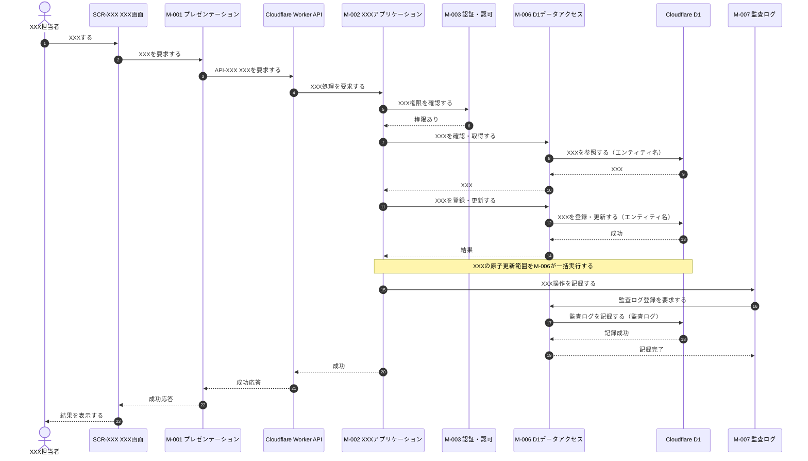

**連携定義**

条件分岐

| 条件ID | 判定箇所 | 条件 | 成立時 | 不成立時 | 根拠 |
|---|---|---|---|---|---|
| COND-01 | XXX機能 |  |  | (3.3で表現) | UC-XXX/SP-1 (不成立=SP-x) |

データ参照・更新

| エンティティ | CRUD | 目的 | 実行主体 |
|---|---|---|---|
| XXX | R / C / U / D |  | データアクセス |

D1原子実行境界

| TX-ID | 論理開始 | 実行SQL-ID・順序 | D1実行方式 | 成功条件 | 全体ロールバック条件 | 実行主体 |
|---|---|---|---|---|---|---|
| TX-XXX | M-XXXが不可分な更新をM-006へ依頼 | SQL-XXX → SQL-YYY | M-006による1回の `env.DB.batch()` | 全Statement成功 | いずれかのStatement失敗(UC-XXX/SP-x) | M-006 |

<!--
【3.3 <対象>・入力不正/重複(代替・例外系)】
定義内容: 対象ユースケースの代替・例外系(権限・入力・マスター・重複・保存異常など)を、alt 分岐を用いた Mermaid sequenceDiagram で定義し、直後に状態パターン対応表を補足する。
定義する条件: 対象UCに代替・例外がある場合に必須(なければ理由を記載)。
項目説明:
- 図: alt/else で各失敗分岐を表現し、正常系(3.2)と同じ判定順で並べる。
- 状態パターン対応: 各分岐がどの状態パターン(UC-XXX/SP-x)に対応し、どの処理を行うかを表で示す。
定義ルール:
- 1つの状態パターンに1つの分岐を対応させ、束ね表現(「または」で複数条件を1分岐)を避ける。
- エラーは責務レベルの動詞で書き、具体的ERR-ID/MSG-ID/文言/HTTPステータスを図に書かない。
- 例外時にデータを更新しないこと(中途半端なデータを残さないこと)を Note で明示する。
-->
## 3.3 XXX・入力不正/重複

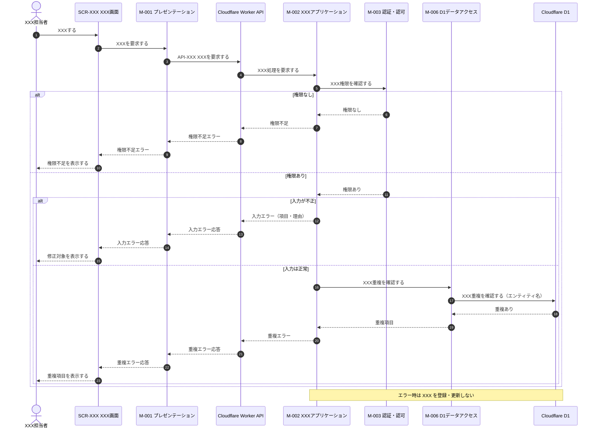

**状態パターン対応**

| 分岐 | 条件 | 状態パターン | 本シーケンスでの処理 |
|---|---|---|---|
| a |  | UC-XXX/SP-x |  |

<!--
【3.4 <対象>・検索(参照系)】
定義内容: 対象ユースケースの検索・参照連携を Mermaid sequenceDiagram で定義し、直後に連携定義を補足する。
定義する条件: 検索・参照系UCで必須。
項目説明:
- 図: 認可(閲覧可能範囲)取得→条件検索→表示項目の限定→表示、の順で記す。
- 連携定義: 条件分岐 / データ参照・更新 / D1原子実行境界(参照のみは理由付きで「なし」)。
定義ルール:
- 認可(閲覧可能範囲)取得を検索より前に置く。閲覧条件外は結果に含めないことを表現する。
- 個人情報保護のため、権限に応じて表示項目を制限することを Note で明示する。
- 参照のみでD1更新がない場合は、D1原子実行境界を理由付きで「なし」とする。
-->
## 3.4 XXX・検索

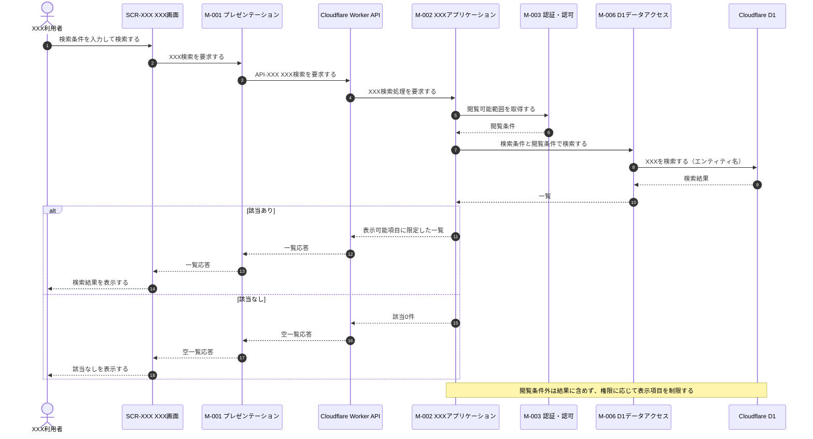

**連携定義**

条件分岐

| 条件ID | 判定箇所 | 条件 | 成立時 | 不成立時 | 根拠 |
|---|---|---|---|---|---|
| COND-01 | XXX機能 |  |  |  | UC-XXX/SP-x |

データ参照・更新

| エンティティ | CRUD | 目的 | 実行主体 |
|---|---|---|---|
| XXX | R |  | データアクセス |

D1原子実行境界

| 内容 |
|---|
| なし(参照のみ。更新を伴わないため) |

<!--
【3.5 <対象>・異動(期間整合)】
定義内容: 対象ユースケースの更新連携(履歴の期間整合を伴うもの)を Mermaid sequenceDiagram で定義し、直後に連携定義を補足する。
定義する条件: 履歴の期間整合・複数エンティティ更新を伴うUCで必須。
項目説明:
- 図: 権限確認→対象状態確認→マスター有効性→期間整合判定→履歴の終了と新規登録→変更履歴・監査、の順で記す。
- 連携定義: 条件分岐(各失敗を状態パターンに紐付け) / データ参照・更新 / D1原子実行境界。
定義ルール:
- 期間整合の判定(既存履歴との重複がないこと)を明示的なステップとして置く。
- 現履歴の終了と新履歴の登録・変更履歴を1つの原子更新要求とし、M-006が1回のD1 batchで実行するSQL-ID順序を原子実行境界表に記す。
- 監査ログを業務D1 batchと同一/別のどちらにするかを補足に記し、別の場合は確定順と失敗時方針を示す。
-->
## 3.5 XXX・異動

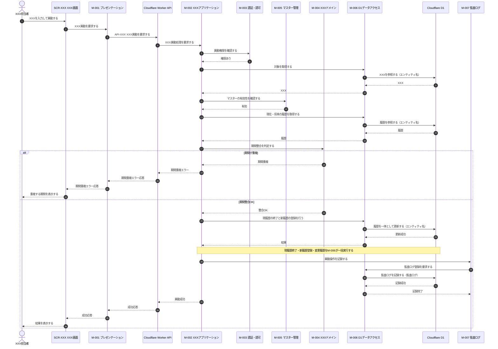

**連携定義**

条件分岐

| 条件ID | 判定箇所 | 条件 | 成立時 | 不成立時 | 根拠 |
|---|---|---|---|---|---|
| COND-01 | XXX機能 |  |  |  | UC-XXX/SP-x |

データ参照・更新

| エンティティ | CRUD | 目的 | 実行主体 |
|---|---|---|---|
| XXX | R / U / C |  | データアクセス |

D1原子実行境界

| TX-ID | 論理開始 | 実行SQL-ID・順序 | D1実行方式 | 成功条件 | 全体ロールバック条件 | 実行主体 |
|---|---|---|---|---|---|---|
| TX-XXX | M-XXXが不可分な履歴更新をM-006へ依頼 | SQL-XXX → SQL-YYY → SQL-ZZZ | M-006による1回の `env.DB.batch()` | 全Statement成功 | いずれかのStatement失敗 | M-006 |

補足事項

| 観点 | 内容 |
|---|---|
| 同期/非同期 |  |
| 競合制御 | 楽観ロックの条件付き更新、UNIQUE/CHECK/trigger等のD1制約、およびbatch失敗時の全体ロールバックを§5・§9と一致させる |
| 監査ログ |  |

<!--
【3.6 定期・非同期JOB】
定義内容: Cronから初回Queue投入、Queue consumerによる最大40件のチャンク処理、次message投入、ack、再配信/DLQまでを示す。
定義する条件: scheduledまたはQueueを使用する全UCで必須。
定義ルール: §3.1と同じ図中表示名でCron Trigger、scheduledハンドラー、Queue、queueハンドラー、JOB本体を個別に宣言する。scheduledから業務モジュール・M-006・D1へ直接矢印を引かない。JOB本体はM-002だけを呼び、D1との矢印はM-006だけに接続する。
-->
## 3.6 定期・非同期JOB

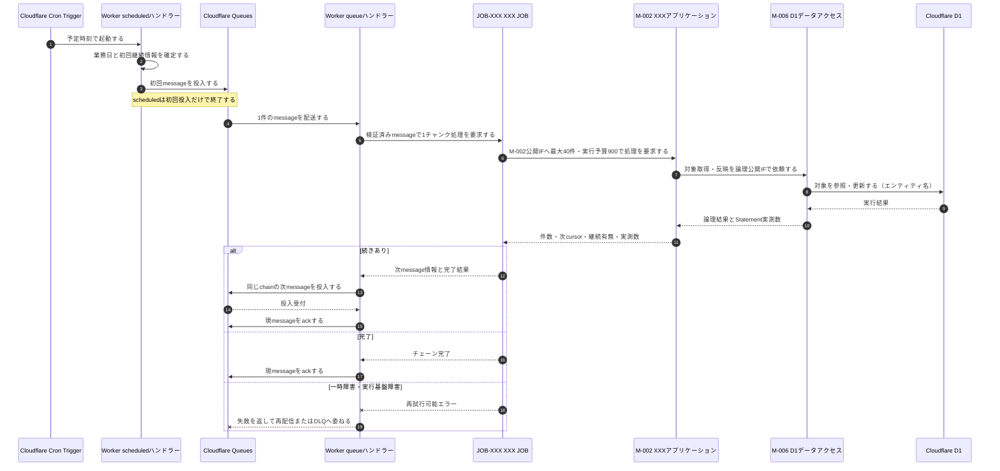

**連携定義**

| 観点 | 固定設計 |
|---|---|
| 初回message | `cursor=null`、`chainRunId`、`chunkNo=1`、`businessDate` |
| 継続message | M-002が返したcursor、同じchainRunId/businessDate、連続するchunkNo |
| consumer設定 | `max_batch_size=1`、`max_concurrency=1`、`max_retries=3`、DLQ必須 |
| チャンク上限 | 最大40件、D1 Statement内部予算900、Paid hard limit 1,000 |
| 成功順序 | チャンク確定 → 続きがあれば次message投入確定 → 現message ack |
| 再試行 | allowlistだけ即時再試行（exponential backoff + full jitter）。結果不明は状態/version再読込み。過負荷、timeout、CPU、memoryは即時再試行せずQueue redelivery |
| データアクセス | JOB → M-002 → M-006 → Cloudflare D1。JOB・scheduled・QueueからD1への直接経路なし |

D1原子実行境界は、当該チャンク内の対象単位ごとに§3.x/§8/§9のTX-IDへ追跡する。Queue message全体を1つのD1 transactionとはみなさず、再配信は `chainRunId + chunkNo`と対象version/冪等キーで無害化する。

---

<!--
テンプレート先行:
- 画面設計のフォーマット・粒度・記載ルールを変更する場合は、最初に本テンプレートを更新し、その後に記入サンプルへ反映する。
- 記入サンプル側だけで見出し・表列・ID規則を追加しない。本テンプレートを画面設計書式の正本とする。
- 4.3 以降は全画面で同じ9サブセクションを反復し、一部画面だけを「代表画面」として詳細化しない。
-->
<!--
本節は統合設計書「4. 画面設計」の詳細設計テンプレートである。シーケンス(§3)の利用者操作、入力、API呼出契機、
正常・代替・例外結果を画面仕様へ具体化する。画面はWorkers上のAPIだけを利用し、Cloudflare D1、`env.DB`、物理テーブル、SQL、M-006を直接参照しない。
画面ID・画面名・利用API・M-001との接続順は§3.1・§3.1.2を構成上の正本とし、本章ではレイアウト・項目・イベント・状態・遷移を詳細化する。
画面IDは SCR-XXX、項目IDは画面内ローカルの ITM-XX、イベントIDは画面内ローカルの EVT-XX とする。
表示文言は全画面共通のものを§4.0.1、個別画面だけのものを各画面の「メッセージ一覧」の正本とし、他サブセクションでは MSG-XX だけを参照する。
-->

# 4. 画面設計

本章は、全画面のURL、権限、画面レイアウト、初期表示、項目、イベント、入力チェック、状態・表示制御、遷移、メッセージを詳細設計レベルで定義する。

<!--
【4.0 共通API応答制御】
定義内容: 全画面へ横断適用する認証切れ、相関ID、要求取消し等のAPI応答制御を定義する。
定義する条件: APIを利用する画面設計で必須。
定義ルール:
- UNAUTHENTICATEDは各画面のシステムエラーへ集約せず、認証情報破棄、操作停止、ログイン画面遷移、検証済み戻り先の順で統一する。
- 戻り先は同一オリジンかつ許可ルートだけに制限し、認証情報・個人情報を含む入力値を引き継がない。
- 個別画面のイベント表では、本節と異なる制御を行う場合だけ差分を記載する。
-->
## 4.0 共通API応答制御

| 応答・事象 | 全画面共通処理 | 遷移・表示 | 個別画面で定義する差分 |
|---|---|---|---|
| UNAUTHENTICATED | 保持中の認証情報を破棄し、進行中要求を取消し、画面操作を無効化する | 共通認証切れMSGを表示してログイン画面へ遷移。戻り先は検証済み内部URLだけを保持 | なし / 差分内容 |
| 相関IDありエラー | traceIdを問い合わせ表示・クライアントログ相関へ利用し、内部例外本文は表示しない | 個別画面の業務またはシステムエラー | 表示MSG、再実行可否 |

<!--
【4.0.1 共通メッセージ一覧】
定義内容: 共通API応答制御から全画面で参照するメッセージ文言の正本。
定義する条件: §4.0でMSG-IDを参照する場合に必須。
定義ルール: MSG-IDは個別画面を含む文書全体で一意とし、個別画面のメッセージ一覧へ重複定義しない。
-->
### 4.0.1 共通メッセージ一覧

| MSG ID | 種別 | 文言 | 対応ERR |
|---|---|---|---|
| MSG-XX | エラー / 情報 | <全画面共通文言> | <エラーコード> / - |

<!--
【4.0.2 画面・API・ERR・MSG横断整合】
定義内容: 画面が利用するAPIと、APIが返すERR、画面が表示するMSGの正逆両方向の網羅を検証する。
定義する条件: APIを1件以上利用する場合に必須。
定義ルール:
- 正方向: 基本情報・初期表示・イベントで参照する全API-IDが§6.2/§6.xに存在し、各§6.x.7の全エラーコードが§4.0.1または当該画面の失敗時・状態・メッセージ一覧へ対応すること。
- 逆方向: 基本情報の利用APIが必ず初期表示またはイベントから呼ばれ、対応ERRが「-」でない全MSGが当該画面の利用APIの§6.x.7に存在すること。
- UNAUTHENTICATED等を§4.0で共通処理する場合も、対応先を「共通」として表へ記載し、個別画面で重複定義しない。
- API-ID、Method、Path、目的は§6を正本とし、画面側の呼出契機・入力・成功時・失敗時と矛盾させない。
-->
### 4.0.2 画面・API・ERR・MSG横断整合

| 画面ID | API-ID | 呼出箇所 | §6 Method / Path | ERRコード | 画面側処理 | MSG-ID | 整合結果 |
|---|---|---|---|---|---|---|---|
| SCR-XXX | API-XXX | 初期表示 / EVT-XX | GET `/api/xxx` | `<ERROR_CODE>` | §4.0共通 / §4.x.5失敗時 / §4.x.7状態 | MSG-XX | OK / NG（理由） |

確認後、API未使用、APIエラー未処理、生成元APIのないERR対応MSG、未定義IDが1件もないことを記録する。

<!--
【4.1 画面一覧】
定義内容: 本システムの全画面を一覧化する。
定義する条件: 画面を持つシステムで必須。
項目説明:
- 画面ID: SCR-XXX の連番。
- 画面名: 日本語名称。
- URL / ルート: 画面を一意に識別するルート。
- 目的: 画面の責務。
- 主な利用者: 利用可能なロール。
- トレース元: §2 の UC-XXX と F-XXX。
定義ルール:
- 全画面を漏れなく記載し、4.3以降の個別画面と一対一に対応させる。
- URL、ロール、UC、機能IDは個別画面の基本情報と一致させる。
-->
## 4.1 画面一覧

| 画面ID | 画面名 | URL / ルート | 目的 | 主な利用者 | トレース元 |
|---|---|---|---|---|---|
| SCR-XXX | XXX画面 |  |  |  | UC-XXX(F-XXX) |

<!--
【4.2 画面遷移】
定義内容: 画面間の遷移とトリガを俯瞰する。
定義する条件: 画面設計で必須。
定義ルール:
- Mermaid flowchart で記載する。
- ノードに SCR-ID と画面名、エッジに遷移トリガを記載する。
- 詳細な条件、API、引継ぎ値は各画面の「画面イベント」「画面遷移」で定義する。
-->
## 4.2 画面遷移

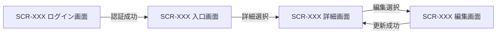

<!--
【4.3以降 個別画面の反復規則】
定義内容: 各画面を同一粒度で詳細定義する。
定義する条件: 4.1に登録した全画面で必須。
構成:
1. 基本情報
2. 画面レイアウト
3. 初期表示
4. 画面項目
5. 画面イベント
6. 入力チェック
7. 画面状態・表示制御
8. 画面遷移
9. メッセージ一覧
定義ルール:
- 画面ごとに以下の9サブセクションを複製し、番号だけを当該章番号へ置換する。
- 画面レイアウトは編集可能なHTMLと設計書へ埋め込むPNGを`mockups/`配下へ同じベース名で配置する。業務上の代表状態を1点以上必須とし、空状態・確認・エラー等で配置、表示、活性の差分をレビューする必要がある場合は`-empty`、`-confirm`等の接尾辞で状態別モックアップを追加する。
- モックアップには表示対象の全ITM、一覧の全列、主要ボタン、ページャー、メッセージ領域、認証済み画面の共通ヘッダーを含める。非表示保持項目や未定義の操作は描画しない。
- モックアップのデータは架空値とし、個人情報、アクセストークン、内部接続情報を含めない。色だけに依存せず、文言・アイコン・バッジを併用して状態を識別可能にする。
- HTMLは外部CDNやネットワークアクセスへ依存しない静的原本とし、PNGを再生成した場合はHTMLとの一致を目視確認する。
- 項目ID(ITM-XX)とイベントID(EVT-XX)は画面内ローカル連番。他文書からは SCR-XXX/ITM-XX、SCR-XXX/EVT-XX と完全修飾する。
- 初期表示・イベントで呼ぶAPIは API-ID のみで示し、API内部処理やDB/SQLを記載しない。
- 基本情報の利用API、初期表示・イベントのAPI、§6.2/§6.x、§4.0.2を正逆両方向に照合し、未使用API参照と呼出箇所のない利用APIを残さない。
- 状態パターンは §2 の UC-XXX/SP-x を正本として参照し、画面側で業務条件を再定義しない。
- システムエラー等、§2にない技術的画面状態は「該当なし(技術例外)」と明記する。
- 全イベントについて発火条件、前提、API、成功時、失敗時、二重実行防止を判定可能にする。
- 固定コードの選択項目は§2.4のコード・表示名を参照し、更新可能マスターの選択項目は取得APIを明記する。選択肢供給元を「定義済み」のままにしない。
- ロール別に選択可能な出力項目等は、候補集合、既定値、表示順、送信順を画面項目と入力チェックで定義する。
- 認可は§2.2の各ユースケース(事前条件・入力/出力データ・代替/例外フロー)と§2.4のロールコードを正本とし、ロール・スコープ別の表示項目、編集可能項目、操作導線を個別画面へ具体化する。画面の非表示制御を唯一の認可手段にせず、APIの権限エラー時制御も定義する。
- 文字列を正規化する項目は、前後空白除去・Unicode正規化・空文字判定・長さ/形式検証・変更有無判定・送信の順序を定義する。任意項目の未入力、空白だけの入力、既存値の明示解除を区別する。
- 更新可能マスターでは、手動利用可否と有効期間の意味、指定日時点で候補となる条件、即時無効化と将来の期間終了予約を画面上で区別する。無効化時の終了日が任意なら、未指定時の送信・保持規則も定義する。
- ページングAPIを使う一覧はページャー項目、初期page/pageSize、ページ切替イベント、total/hasNext反映、応答待ち制御を定義し、2ページ目以降へ到達可能にする。
- 適用日を基準に有効性が変わるマスター候補は、基準日をAPIへ渡し、日付変更時の再取得、旧選択の解除、候補基準日と送信日の一致検証を定義する。
- 各利用APIの§6.x.7にある全ERRを、§4.0共通制御または当該画面の失敗時・状態・MSGへ漏れなく割り当てる。対応ERR付きMSGから利用APIへの逆引きも成立させ、画面起因だけのMSGは対応ERRを「-」とする。
-->
## 4.3 SCR-XXX XXX画面

<!--
【4.x.1 基本情報】
定義内容: 画面の識別情報、URL、権限、トレース、表示契機、利用APIを定義する。
定義する条件: 全画面で必須。
-->
### 4.3.1 基本情報

| 項目 | 内容 |
|---|---|
| 画面ID | SCR-XXX |
| 画面名 | XXX画面 |
| URL / ルート |  |
| 目的 |  |
| トレース元 | UC-XXX(F-XXX) |
| 利用可能ロール |  |
| 表示契機 |  |
| 利用API | API-XXX |

<!--
【4.x.2 画面レイアウト】
定義内容: 画面の構造、情報のまとまり、主要操作、代表状態を視覚的に定義する。
定義する条件: 全画面で代表状態を1点以上必須とする。配置・表示・活性が大きく異なり、視覚的なレビューが必要な状態は状態別に追加する。
作成物:
- `mockups/SCR-XXX.html`: 修正・再生成用の静的HTML原本。
- `mockups/SCR-XXX.png`: 本節へ埋め込むレビュー用画像。
定義ルール:
- PNG内の項目・一覧列・操作は§4.x.4の画面項目と一致させ、項目ラベルへITM-IDを併記する。
- 認証済み画面は共通ヘッダーを含め、未認証画面は認証済み利用者名やログアウト操作を表示しない。
- 代表状態、ロール、選択状態、空状態等の前提を表で明示する。
-->
### 4.3.2 画面レイアウト

次の記法で生成済みPNGを埋め込む。

```markdown

```

| 項目 | 内容 |
|---|---|
| 代表状態 | <利用ロール、データ有無、入力・選択状態> |
| 配置要点 | <情報グループの順序、主要操作の位置、状態を識別する表示> |
| 編集可能な原本 | `mockups/SCR-XXX.html` |

<!--
【4.x.3 初期表示】
定義内容: 画面表示直後の処理順、API、初期値、成功時・失敗時の表示を定義する。
定義する条件: 全画面で必須。API呼出しがなければ「なし」とする。
項目説明:
- No: 実行順。
- 処理: 画面側の初期化内容。
- API: 呼び出すAPI。
- 正常時: 設定・表示内容。
- 異常時: 状態とMSG。
-->
### 4.3.3 初期表示

| No | 処理 | API | 正常時 | 異常時 |
|---:|---|---|---|---|
| 1 |  | API-XXX / なし |  | MSG-XX を表示 |

<!--
【4.x.4 画面項目】
定義内容: 入力、表示、一覧、ボタン等の全項目を定義する。
定義する条件: 全画面で必須。
項目説明:
- 項目ID: 画面内ローカル ITM-XX。
- 種別: テキスト、日付、選択、表示、一覧、ボタン、リンク等。
- 必須: 必須、任意、―。
- 入力・表示規則: 最大長、形式、初期値、選択元、権限制御、活性条件。
定義ルール:
- 物理カラム名を書かない。
- 入力項目だけでなく表示項目、一覧操作、メッセージ領域も含める。
- 選択項目はコード正本または取得API、表示名、未選択時の送信値を明記する。
-->
### 4.3.4 画面項目

| 項目ID | 項目名 | 種別 | 必須 | 入力・表示規則 |
|---|---|---|---|---|
| ITM-01 |  |  | 必須 / 任意 / ― |  |

<!--
【4.x.5 画面イベント】
定義内容: 利用者操作または画面契機ごとの処理を定義する。
定義する条件: 全画面で必須。
項目説明:
- イベントID: 画面内ローカル EVT-XX。
- 発火条件: 操作・契機。
- 前提/入力: 参照するITM、選択行、画面状態。
- API: 呼び出すAPI。画面内完結なら「なし」。
- 成功時: 状態更新、表示、遷移。
- 失敗時: MSGと状態。
- 多重実行防止: ボタン無効化等。
-->
### 4.3.5 画面イベント

| イベントID | イベント名 | 発火条件 | 前提・入力 | API | 成功時 | 失敗時 | 多重実行防止 |
|---|---|---|---|---|---|---|---|
| EVT-01 |  |  | ITM-XX | API-XXX / なし |  | MSG-XX を表示 | 応答まで操作を無効化 |

<!--
【4.x.6 入力チェック】
定義内容: クライアント側で行う単項目・相関チェックを定義する。
定義する条件: 入力項目がある画面で必須。入力がなければ「なし」とする。
項目説明:
- 対象: ITM-ID。
- タイミング: 入力時、フォーカス離脱時、イベント実行時等。
- チェック内容: 必須、形式、長さ、範囲、相関。
- 違反時: MSGとフォーカス・送信制御。
定義ルール:
- 業務上の存在・一意性・権限等、サーバー判定はAPI応答として扱い本表へ混在させない。
-->
### 4.3.6 入力チェック

| No | 対象 | タイミング | チェック内容 | 違反時 |
|---:|---|---|---|---|
| 1 | ITM-XX | EVT-XX 実行時 |  | MSG-XX を表示し送信しない |

<!--
【4.x.7 画面状態・表示制御】
定義内容: 状態ごとの項目活性、表示内容、ロール制御、対応SPを定義する。
定義する条件: 全画面で必須。
定義ルール:
- 正常、0件、処理中、業務エラー、権限エラー、技術例外を必要に応じて網羅する。
- UCの状態パターンは完全修飾 UC-XXX/SP-x で参照する。
-->
### 4.3.7 画面状態・表示制御

| 状態 | 条件・契機 | 入力・操作制御 | 表示内容 | 対応状態パターン |
|---|---|---|---|---|
| 初期表示 | 画面表示時 |  |  | UC-XXX/SP-x |
| 処理中 | API応答待ち | 入力・主操作を無効化 | MSG-XX | UC-XXX/SP-x |
| システムエラー | 技術例外 | 再実行可否をイベント仕様に従って制御 | MSG-XX | 該当なし(技術例外) |

<!--
【4.x.8 画面遷移】
定義内容: 遷移元イベント、遷移先、条件、引継ぎ値を定義する。
定義する条件: 全画面で必須。遷移がなければ「なし」とする。
-->
### 4.3.8 画面遷移

| 遷移元イベント | 遷移先 | 条件 | 引継ぎ値 |
|---|---|---|---|
| EVT-XX | SCR-XXX |  |  |

<!--
【4.x.9 メッセージ一覧】
定義内容: 当該画面だけで表示する文言の正本。全画面共通文言は§4.0.1を参照する。
定義する条件: 全画面で必須。
定義ルール:
- MSG-IDは文書内で一意とし、既存IDを変更・再利用しない。
- 他サブセクションでは文言を再掲せずMSG-IDで参照する。
- 対応ERRはAPI設計のエラーコード、エラー起因でなければ「-」。
- 対応ERRは当該画面の利用APIの§6.x.7に存在しなければならない。利用APIの各ERRにも§4.0共通または当該画面のMSGが必ず1つ以上対応する。
-->
### 4.3.9 メッセージ一覧

| MSG ID | 種別 | 文言 | 対応ERR |
|---|---|---|---|
| MSG-XX | 完了 / 確認 / 警告 / エラー / 情報 |  | <エラーコード> / - |

---

<!-- 本節は統合設計書「5. データベース設計」の詳細テンプレート。Cloudflare D1（SQLite）の全テーブル、物理カラム、制約、インデックス、trigger、FTS5、原子実行境界、migrationを確定する。 -->
<!-- テーブル・カラム・DDLの正本は本節、M-006が実行するランタイムSQL本文の正本は§9とする。D1 bindingへのアクセスはM-006だけに許可し、API・JOB・他モジュールからの直接・間接アクセスを禁止する。 -->
<!-- 業務データの論理構造(エンティティ・属性・関連)は§2.3 データモデル、シーケンス上のDB要素名と接続境界は§3.1の単一participant「Cloudflare D1」を正本とし、本章でそれらのSQLite物理構造を詳細化する。M-006以外からD1へ到達する経路を追加しない。 -->

# 5. データベース設計

<!-- 必須。D1/SQLiteで固定する事項と環境差分を分離し、PostgreSQL等の別DBMSを前提とする型・演算子・拡張・ロックを混在させない。 -->
## 5.1 採用DBMS・物理設計方針

| 項目 | 設計 |
|---|---|
| DBMS / SQL方言 | Cloudflare D1 / SQLite SQL |
| Workers binding | binding名は `DB`。`env.DB`を受領・参照できるのはM-006だけとし、環境別database ID・preview IDは§12で管理する |
| 実行API | M-006だけがD1 Workers Binding APIの `prepare()`、`bind()`、`first()` / `all()` / `run()` / `raw()`、`batch()`を使用する |
| 本番plan・実行予算 | Cloudflare Workers Paid。D1のhard limitは1 Worker invocation当たり1,000 Statement、Queue consumerの内部予算は900 Statementとする。`batch()`内の各Statement、再読込み、即時再試行も1件ずつ実測値へ加算し、残り100件を制御・障害確認用に予約する |
| bind上限 | 1 Statement当たり最大100値。placeholderを使うSQLは `?1`〜`?N`（`1 <= N <= 100`）を欠番なく定義し、`.bind()`引数数をNと一致させる |
| 文字コード | UTF-8。文字列の業務正規化規則は§8、検索用正規化・照合規則は本節と§9で一致させる |
| 物理型 | SQLiteの `INTEGER` / `REAL` / `TEXT` / `BLOB` / `NULL`だけを使用し、原則 `STRICT` tableとする |
| 日付・日時 | 日付は `TEXT` の `YYYY-MM-DD`、日時はUTC正規化した `TEXT` のISO 8601とする。書式、精度、比較・ソート可能性、生成主体を列ごとに定義する |
| 主キー | 原則アプリケーション生成の不変IDを `TEXT` で保持し、形式 `CHECK` と一意性を定義する。採番方式をテーブルごとに記載する |
| 真偽値 | `INTEGER NOT NULL CHECK (value IN (0, 1))`。Workersとの境界でBooleanと0/1の変換をM-006に集約する |
| JSON | 必要時だけ `TEXT` で保持し、`CHECK (json_valid(column))`、許可構造、NULL方針、検索・index方針を定義する |
| 外部キー | 全参照関係に `FOREIGN KEY` と `ON DELETE` / `ON UPDATE` 方針を定義する。D1の外部キー検査を無効化するランタイム処理は禁止する |
| 楽観ロック | `version INTEGER`を条件付きUPDATEのWHEREへ含め、D1結果の変更行数1を成功、0を競合としてM-006から論理例外へ変換する |
| 論理削除 | 必要性、削除日時、検索除外条件、UNIQUE/INDEXへの影響をテーブル単位で定義する。安易に全表へ付与しない |
| 原子実行 | 単一StatementはD1の自動コミット。複数Statementを不可分にする場合は、M-006がPrepared Statementを構築・bindし、1回の `env.DB.batch()` で実行する |
| 競合・整合性 | 条件付きDML、UNIQUE、FOREIGN KEY、CHECK、trigger、冪等キーで保証する。`FOR UPDATE`、advisory lock、分離レベル、SERIALIZABLE、排他制約を前提にしない |
| DBアクセス境界 | `API / JOB → 業務モジュール → M-006 → env.DB → SQL-ID → D1`。API・JOB・M-006以外のモジュールはD1オブジェクト、TBL-ID、SQL-ID、物理名を受領しない |

### 5.1.1 論理型・SQLite物理型マッピング

| 論理値 | SQLite物理型 | 保存形式・制約 | Workers/M-006変換時の注意 |
|---|---|---|---|
| ID | TEXT | 採番方式に対応する長さ・文字集合のCHECK、PK/UNIQUE | 文字列のままbindし、数値へ暗黙変換しない |
| 文字列 | TEXT | NOT NULL、最大長、空文字可否、正規化済み条件 | `undefined`をbindしない。省略とNULLを公開IFで区別する |
| 整数 | INTEGER | 最小・最大のCHECK | JavaScriptの安全な整数範囲を超える値はNumberで扱わず、採用しないかTEXT方針を明記する |
| 小数 | REAL / INTEGER | 許容誤差を認める値だけREAL。金額等は最小単位のINTEGERを優先 | NaN、Infinityを許可しない |
| 真偽値 | INTEGER | `CHECK (column IN (0, 1))` | M-006でBoolean ⇔ 0/1を変換する |
| 日付 | TEXT | `YYYY-MM-DD`、NOT NULL/NULL、範囲CHECK | 比較前に同一書式へ正規化する |
| 日時 | TEXT | UTC ISO 8601、精度固定 | APIのタイムゾーン付き値を業務モジュールで正規化し、M-006は確定値をbindする |
| バイナリ | BLOB | サイズ上限・用途 | D1へは `ArrayBuffer` としてbindし、typed array等はM-006で事前変換する |
| JSON | TEXT | `json_valid`と必要なキー・型のCHECK/trigger | stringify/parse失敗を論理的なデータアクセス例外へ変換する |

`VARCHAR`、`UUID`、`BOOLEAN`、`DATE`、`TIMESTAMP(TZ)`、`BIGINT`、配列、`JSONB`等を物理型として記載しない。型名だけで制約されたとみなさず、`STRICT`、NOT NULL、CHECK、UNIQUE等で保存条件を実装する。

### 5.1.2 M-006 bind・物理型対応

| M-006公開IF | SQL-ID | bind順 | placeholder | 論理入力 | `.bind()`引数位置 | SQLite値型 | NULL/変換 |
|---|---|---:|---|---|---|---|---|
| M-006/IF-XX | SQL-XXX | 1 | `?1` | input.xxx | 第1引数 `xxxValue` | TEXT | 不可、<正規化> |
| M-006/IF-XX | SQL-XXX | 2 | `?2` | input.yyy | 第2引数 `yyyValue` | INTEGER | 可 / 不可、<0/1変換等> |

§9のSQL単位表を正本として全bind値を正逆照合する。placeholderを使うSQLは `?1`から最大ordinal `?N`までを連続させ、`?0`、`?101`以上、欠番、表だけにある値、本文だけにある値を禁止する。同じplaceholderの本文内再利用は許可するが、Nは最大ordinal、`.bind()`引数数はNとする。placeholderを使わないSQLはbind表を「なし」とし、`.bind()`を呼ばない。M-006は `.bind(xxxValue, yyyValue)` の固定順で渡し、名前付き`:name`/`@name`/`$name`と匿名`?`を実SQLへ使用しない。物理列型、CHECK、NULL可否と本表のSQLite値型・変換を一致させる。

## 5.2 テーブル一覧

<!-- 必須。§2.3のエンティティ、DDL、SQL、M-006の参照対象を正逆照合し、全テーブルとFTS virtual tableを過不足なく列挙する。技術テーブルは対応エンティティを「−」とする。 -->

| TBL-ID | テーブル・virtual table物理名 | 論理名 | 対応エンティティ(§2.3) | 種別 | `STRICT` | 目的 |
|---|---|---|---|---|---|---|
| TBL-XXX | entity_a |  | <エンティティ名> / −（技術テーブル） | マスター / トランザクション / 履歴 / ログ | Yes / FTS5のため対象外 |  |

<!-- 5.3以降のテーブル定義ブロックを全テーブル分繰り返す。代表表だけでなく、DDL・SQLが参照する全カラムを定義する。 -->
## 5.3 TBL-XXX `{テーブル物理名}`

### 5.3.1 基本情報

| 項目 | 内容 |
|---|---|
| TBL-ID / 論理名 | TBL-XXX / <論理名> |
| 目的 / 種別 | <目的> / マスター・トランザクション・履歴・ログ |
| DDL | `CREATE TABLE ... STRICT`。完全なDDLまたはmigration参照を記載 |
| 更新主体 | M-006の対象IF、SQL-ID |
| 保持・削除 | 保持期間、論理/物理削除、個人情報廃棄方針 |

### 5.3.2 カラム定義

| カラム | 論理名 | SQLite型 | NULL | DEFAULT | 制約・保存形式 |
|---|---|---|---|---|---|
| entity_id | エンティティID | TEXT | 不可 | なし | PK、ID形式CHECK |
| entity_code | エンティティコード | TEXT | 不可 | なし | UNIQUE、最大長・空文字CHECK |
| is_active | 手動利用可否 | INTEGER | 不可 | `1` | `CHECK (is_active IN (0, 1))` |
| effective_from | 有効開始日 | TEXT | 不可 | なし | `YYYY-MM-DD` |
| effective_to | 有効終了日 | TEXT | 可 | `NULL` | 期限なしはNULL、`effective_from <= effective_to` |

### 5.3.3 キー・参照・不変条件

| 制約ID | 種別 | 対象・条件 | 違反時のM-006論理結果 |
|---|---|---|---|
| PK-XXX | PRIMARY KEY | `(entity_id)` | DATA_CONSTRAINT_VIOLATION |
| UQ-XXX | UNIQUE | `(entity_code)`または部分/式UNIQUE | DUPLICATE_ENTITY |
| FK-XXX | FOREIGN KEY | `(parent_id) REFERENCES parent(parent_id)`、削除動作 | RELATED_ENTITY_NOT_FOUND / DATA_CONSTRAINT_VIOLATION |
| CK-XXX | CHECK | <列挙値、範囲、日付順、自己参照禁止> | DATA_CONSTRAINT_VIOLATION |
| TRG-XXX | TRIGGER | <複数行・期間・階層等の不変条件。違反時は `RAISE(ABORT, '<stable-code>')`> | <業務例外コード> |

#### 期間・階層整合性（該当する場合）

- 同一所有者の期間重複は、期間重複を検出するINSERT/UPDATE triggerまたは競合を起こす一意なモデルで保証する。PostgreSQLの排他制約・範囲型は使用しない。
- 終了日がある場合は `effective_from <= effective_to` とし、同一の正規化書式で比較する。
- 手動利用可否と有効期間を独立させ、指定日時点の利用可能条件、即時無効化、将来終了予約、終了日未指定時の現値保持をSQL-IDと同期する。
- 参照期間をマスター有効期間が包含する不変条件、マスターの無効化・期間短縮時の拒否/連動方針をtriggerまたは同一batch内の失敗可能Statementで保証する。
- 階層マスターは親子期間包含、親無効化時の子方針、循環禁止を定義し、複数更新を1回のD1 batchへ含める。

### 5.3.4 固定コード初期データ（該当する場合）

| コード | 表示名 | 初期利用可否 | 変更規則 |
|---|---|---|---|
| `<FIXED_CODE>` | <表示名> | 1 / 0 | <コード・名称変更、無効化の可否> |

- §2.4の全固定コード(利用者ロール等の認可用コードを含む)をmigrationで冪等投入し、環境別手作業を前提にしない。既存行不一致時の上書き/失敗方針を定義する。
- 固定コードのCHECK、初期データ、モジュール検証、API契約を同時に変更する。

<!-- 全テーブル定義後に、制約・インデックス・triggerを一意のIDで一覧化する。 -->
## 5.X 制約・インデックス・trigger一覧

| ID | 対象 | 種別 | SQLite DDL・条件 | 対応SQL-ID / 目的 |
|---|---|---|---|---|
| IDX-XXX | entity_a(entity_code) | INDEX / UNIQUE / PARTIAL / EXPRESSION | `CREATE ... INDEX ...`、列順、照合、`WHERE`、式を完全記載 | SQL-XXX / <目的> |
| TRG-XXX | entity_history | BEFORE INSERT / UPDATE / DELETE | 発火条件、参照範囲、`RAISE(ABORT, '<stable-code>')`を完全記載 | SQL-XXX / 期間重複防止等 |

- 部分indexはWHERE述語、式indexは実際の式、複合indexは列順とASC/DESCを記載し、§9のWHERE/ORDER BYと一致させる。
- D1/SQLiteで利用できないDB固有拡張、演算子クラス、GIN/GiST、排他制約を記載しない。
- triggerの安定エラー文字列をM-006の例外変換表に登録し、API/JOBがD1の生エラーを受け取らないようにする。

## 5.X FTS5設計（全文検索を使う場合）

| 項目 | 設計 |
|---|---|
| FTS-ID / virtual table | FTS-XXX / `<name>_fts` |
| DDL | `CREATE VIRTUAL TABLE ... USING fts5(...)` の完全定義 |
| 検索対象・非対象 | 対象列、個人情報、権限により検索不可とする列 |
| tokenizer / 正規化 | tokenizer設定、Unicode・大小文字・記号・部分一致の意味 |
| content同期 | content table、INSERT/UPDATE/DELETE triggerまたはM-006 batch内同期SQL |
| 検索SQL | `MATCH`を用いるSQL-ID、ランキング、同順位順、ページング |
| 再構築 | migration・復旧時のrebuild手順と検証件数 |

全文検索を使わない場合は「不採用」と理由を記載する。Unicodeを含む大文字小文字非区別検索を、SQLite `LIKE`だけで同等とみなさない。

## 5.X D1原子実行境界

<!-- 複数Statementを不可分にする全処理を列挙し、§3、§8、§9のTX-IDと一致させる。 -->

| TX-ID | 業務処理・公開IF | Prepared Statement順 | D1実行方式 | 成功条件 | 全体ロールバック条件 | 公開例外 |
|---|---|---|---|---|---|---|
| TX-XXX | M-XXX/IF-XX | SQL-XXX → SQL-YYY → SQL-ZZZ | M-006が1回の `env.DB.batch()` で実行 | 全Statement成功。原子性に必要なguardは不成立時に同じbatch内でSQLエラーとなる | いずれかのStatement/制約/trigger/guard失敗 | <論理例外> |

- D1 batchへ渡す全StatementをM-006が事前に `prepare().bind()` し、定義順に実行する。失敗時はbatch全体がロールバックされ、API/JOBはbatchを直接開始・終了しない。
- 後続Statementのbind値はbatch開始前に確定する。先行StatementのRETURNING/D1結果を受け取ってから同じbatchの後続Statementへbindする設計は禁止し、必要なID・日時・操作tokenは事前生成するか、SQLiteのtrigger等でDB内連携する。
- batch成功後のアプリケーション判定では、すでに完了したbatchをロールバックできない。変更行数0等を原子性のguardにする場合、その不成立が同じbatch内でconstraint/trigger/guard StatementのSQLエラーになる実装を定義する。単なる成功結果の `changes=0` を後から判定して全体ロールバックできるとは記載しない。
- 単一Statementの処理はTX-IDを「なし（単一Statement・自動コミット）」とし、明示的な `BEGIN` / `COMMIT` / `ROLLBACK` SQLをランタイム設計へ混在させない。

## 5.X 共通カラム

<!-- 更新可能テーブルと追記専用テーブルで適用列を分ける。列を持たないテーブルへ機械的に追加しない。 -->

### 更新可能テーブル共通

| カラム | 論理名 | SQLite型 | NULL | 制約・保存形式 |
|---|---|---|---|---|
| created_at | 登録日時 | TEXT | 不可 | UTC ISO 8601、精度固定 |
| created_by | 登録者ID | TEXT | 可 | ID形式CHECK、システム処理はNULL等の規則 |
| updated_at | 更新日時 | TEXT | 不可 | UTC ISO 8601、精度固定 |
| updated_by | 更新者ID | TEXT | 可 | ID形式CHECK |
| version | 更新バージョン | INTEGER | 不可 | 初期値1、`version >= 1`、条件付き更新成功時に1加算、JS安全整数上限を超えない運用 |
| deleted_at | 論理削除日時 | TEXT | 可 | UTC ISO 8601、NULL=有効。採用テーブルだけに付与 |

### 追記専用テーブル共通

| カラム | 論理名 | SQLite型 | NULL | 制約・保存形式 |
|---|---|---|---|---|
| created_at | 登録日時 | TEXT | 不可 | UTC ISO 8601、精度固定 |
| created_by | 登録者ID | TEXT | 可 | ID形式CHECK |

## 5.X migration・検証

| Migration ID | 適用順 | 変更DDL・初期データ | 前提 | 検証SQL/期待値 | 復旧・前進修正方針 |
|---|---:|---|---|---|---|
| MIG-XXX | 1 |  |  | SQL-XXX / <期待値> |  |

- DDL・固定データはD1 migrationとして版管理し、Workers起動時またはAPI/JOBから実行しない。環境別適用手順と適用履歴は§12で定義する。
- destructiveなSQLite schema変更は、退避table作成、データ変換、件数・制約検証、切替、旧table処理まで順序を定義する。
- PostgreSQL dump等をそのままD1へ投入せず、SQLite互換DDL・型・値へ変換して検証する。

## 5.X 命名規則

| 対象 | 規則 |
|---|---|
| テーブル / virtual table |  |
| カラム |  |
| 主キー / 外部キー |  |
| CHECK / UNIQUE / trigger |  |
| インデックス |  |
| Migration ID | MIG-XXX |
| 原子実行境界 | TX-XXX |
| バインドplaceholder | §9で順序付き `?1`, `?2`, ... を使用 |

---

<!-- 本節は統合設計書「6. API設計」の詳細設計テンプレート。API一覧に登録した全APIについて、§6.x の個別APIブロックを複製して定義する。代表APIだけを詳細化してはならない -->
<!-- APIはCloudflare Workers上のHTTP通信境界に限定する。認証・認可、HTTP/JSONの構文検証、相関ID付与、単一の業務モジュール呼出、HTTPレスポンス変換だけを担当し、業務判断・原子実行境界・監査・データアクセスは呼出先モジュールへ委譲する -->
<!-- APIおよびJOBからCloudflare D1へ直接アクセスしてはならない。API/JOB本文からenv.DB、D1 Workers Binding API、テーブル(TBL)、クエリ(SQL)を参照・実行することも禁止する。個別APIの処理詳細には呼び出す単一のM-ID/IF-ID、論理処理名、引数、論理結果からHTTP結果への変換だけを記載する -->
<!-- APIの存在、シーケンスごとのAPI-ID、M-001からの呼出順、主処理モジュールへの接続は§3.1・§3.1.2を構成上の正本とし、本章ではHTTP契約と境界処理を詳細化する -->

# 6. API設計

<!--
【6.1 API共通設計】
定義内容: 全APIへ適用する通信境界、認証認可、形式、エラー、ページング、競合、冪等性、依存方向を定義する。
定義する条件: APIを持つシステムで必須。
定義ルール:
- API境界は原則として1つの業務モジュールの公開処理だけを呼び出す。複数モジュールの調整は業務モジュール内で行う。
- API/JOBはD1・`env.DB`・D1 Workers Binding API・TBL・SQLへ直接アクセスまたは直接参照しない。D1 batchや原子実行の開始・終了も行わない。
- 個別APIは共通事項を再定義せず、差分だけを記載する。
-->
## 6.1 API共通設計

| 観点 | 仕様 |
|---|---|
| 実行基盤 | 本番Cloudflare Workers Paid。HTTPハンドラーはWorkerの `fetch` 経路で実行する |
| ベースパス | `/api` |
| データ形式 | 原則 `application/json; charset=utf-8`。ファイル応答は個別APIで定義する |
| 認証 | 認証APIを除き、認証トークンを `Authorization: Bearer {token}` で受け付ける |
| 認可 | API境界で認証主体を確定し、§2.2の各UCで定義した操作権限・閲覧スコープ・項目制御に対する最終認可は呼出先業務モジュールへ委譲する |
| 相関ID | `X-Request-ID` を受理し、未指定時はAPI境界で生成する。応答と業務モジュール呼出へ同じ値を伝播する |
| 日付・日時 | 日付は `YYYY-MM-DD`、日時はタイムゾーン付きISO 8601 |
| エラー形式 | `errorCode`、`message`、`fieldErrors[]`、`traceId` を持つ共通JSON |
| ページング | ページングを採用する個別APIでは、`page` は1始まり・既定1、`pageSize` は既定20・上限100とし、応答に `page`、`pageSize`、`total`、`hasNext` を返す |
| 更新競合 | 更新要求の `version` と現在版を業務モジュールで比較し、不一致時は409を返して上書きしない |
| 部分更新 | 省略項目は現値保持、明示nullは個別APIで解除可能としたNULL可項目だけに許可する。業務モジュールが現値とマージしてからデータアクセスモジュールへ渡す |
| 冪等性 | GETの再実行可否、更新系の二重実行防止方式を定義する。`Idempotency-Key` を採用する場合は、キー、要求ハッシュ、処理状態、応答をモジュール管理下の永続領域へ保存する方式まで定義する |
| 個人情報 | 認証主体の権限と利用目的に必要な項目だけを返す。返却可能項目の判定は業務モジュールの論理結果に従う |
| 依存方向 | `画面 → M-001 プレゼンテーション → Cloudflare Worker API → 単一業務モジュール → M-006 → Cloudflare D1`。APIはM-006、D1 binding、SQL、物理表を認識しない |
| Binding注入 | Workerの構成境界は `env` をM-006の生成経路だけへ渡し、APIには業務モジュール公開IFだけを注入する。APIの型・引数・状態に `env.DB` またはD1オブジェクトを含めない |
| 完了保証 | 応答に必要な業務更新は業務モジュール呼出を `await` して完了後に応答する。`ctx.waitUntil()` に必須の永続化を委ねない |

### 6.1.1 API境界の責務

- HTTPヘッダー、パス、クエリ、ボディを受理し、認証主体と論理入力を組み立てる。
- §6.x.4 の構文・形式バリデーションを実施する。
- 個別APIで定義した単一の業務モジュール公開処理を1回呼び出す。
- 業務モジュールの論理結果をHTTPステータス・レスポンス項目・共通エラー形式へ変換する。
- `env.DB`参照、D1 API呼出、テーブル参照、クエリ実行、業務状態判定、D1 batch制御、監査記録を行わない。
- Workerコンテキストを業務モジュールへ横流しせず、認証主体・相関ID・論理入力・期限等の必要な論理値だけを渡す。

### 6.1.2 共通エラーレスポンス

| 項目名 | 型 | 必須 | 説明 |
|---|---|---|---|
| errorCode | string | Yes | 機械判定用エラーコード |
| message | string | Yes | 利用者向けメッセージ |
| fieldErrors | array | Yes | 項目エラー。項目に閉じない場合は空配列 |
| fieldErrors[].field | string | No | 対象項目名 |
| fieldErrors[].reason | string | No | エラー理由コード |
| traceId | string | Yes | 問い合わせ・ログ相関用ID |

### 6.1.3 固定コードAPI参照表

固定コード値の唯一の正本は§2.4とし、本表にはAPI項目名、NULL可否、§2.4で定義した許可値を転記して物理契約との対応を示す。API境界と呼出先業務モジュールの双方で列挙外を拒否する。

| API項目名 | NULL | §2.4の許可値 |
|---|---|---|
| `<codeItem>` | 可 / 不可 | `<CODE_A>` / `<CODE_B>` |

<!--
【6.1.4 認可・閲覧範囲のAPI適用】
定義内容: §2.2の各UCで定義した認可条件を、API利用条件・データスコープ・返却/更新項目へ対応づける。
定義する条件: ロール、所属、本人性または項目でAPI契約が変わる場合に必須。
定義ルール: 全ロールを列挙し、スコープ、利用可能API、対象条件、項目許可、複数ロール合成、ロールなしDENYを省略しない。
-->
### 6.1.4 認可・閲覧範囲のAPI適用

固定ロールコードの正本は§2.4、操作権限、閲覧スコープおよび項目許可の正本は§2.2の各ユースケースとする。API境界は認証主体を渡し、業務モジュールが次表と§2.2から最終認可結果を確定する。

| ロールコード | データ閲覧スコープ | API利用条件・項目制御 |
|---|---|---|
| `<ROLE_CODE>` | `ALL` / `ORGANIZATION` / `SELF` | <利用可能API、対象条件、返却項目または更新可能項目> |

- 複数ロール時の操作権限・項目許可の合成、スコープ優先順位、許可組織集合、ロールなし時のDENYを§2.2と同じ規則で明記する。
- マスター候補取得等で管理者だけが無効データを取得できる場合は、通常参照と管理参照の条件を分けて記載する。

<!--
【6.1.5 マスター利用可否の共通契約】
定義内容: 更新可能マスターの手動利用可否、有効期間、候補条件、更新・無効化の共通意味を定義する。
定義する条件: 手動利用可否と有効期間を持つマスターAPIがある場合に必須。
定義ルール: 未来開始前・期限到来後・手動無効を区別し、即時無効化と将来終了予約、任意終了日未指定時の扱いを一意にする。
-->
### 6.1.5 マスター利用可否の共通契約

- 手動利用可否と有効期間を独立して定義し、指定日時点で業務利用可能となる論理条件を記載する。
- 未来開始前、期限到来後、手動無効の各状態を区別する。
- 即時無効化時に更新する項目、終了日の必須/任意、終了日未指定時の現値保持、更新操作による将来終了予約を明記する。

<!--
【6.2 API一覧】
定義内容: 全APIのID、HTTPメソッド、パス、目的、権限、呼出先業務モジュールを一覧化する。
定義する条件: 必須。
定義ルール:
- 1行を1つのHTTPメソッド・1つのパスに対応させる。登録と更新を1行へ併記しない。
- 呼出モジュールは1 APIにつき原則1件とし、定義済みのM-ID/IF-IDまで完全修飾する。
-->
## 6.2 API一覧

| API-ID | Method | Path | 目的 | 主な権限 | 呼出モジュール |
|---|---|---|---|---|---|
| API-XXX | GET / POST / PUT / PATCH / DELETE | `/api/xxx` |  |  | M-002/IF-XX（ログイン以外）/ M-003/IF-XX（ログイン） |

<!--
【6.x 個別API】
定義内容: API一覧に登録した各APIの完全な物理契約と、単一モジュール呼出までの境界処理を定義する。
定義する条件: API一覧の全行について必須。このブロックをAPI件数分反復する。
構成: 基本情報、リクエスト項目、レスポンス項目、バリデーション、処理フロー、番号対応の処理詳細、エラー定義。
定義ルール:
- JSONキー、ヘッダー名、HTTPパス以外の実装クラス名・物理メソッド名は記載しない。
- 処理フローと処理詳細の番号・名称・出現順を一致させる。
- モジュール呼出は処理詳細に定義済みのM-ID/IF-IDと論理処理名で記載し、APIから下位データアクセスへ分岐させない。
- 固定業務コードは§2.4を正本として許可値を列挙し、未知コードとロール非許可値を区別する。
- 認可は§2.2の各UC定義を正本とし、個別APIで許可ロール、対象スコープ、返却項目または更新可能項目を省略せず列挙する。複数ロール時の合成は業務モジュールへ委譲し、API境界だけで確定しない。
- 文字列入力は、API境界の型・ペイロード上限検証と、業務モジュールで行う前後空白除去・Unicode正規化・正規化後の空文字/長さ/形式検証を区別して記載する。部分更新では省略、明示null、空文字を区別する。
- 省略可能な検索・出力条件は個別APIごとに既定値を明記し、`ALL`等の全件指定と省略時既定値を同一視しない。
- 更新可能マスターの取得・更新APIは、手動利用可否と有効期間の関係、指定日時点の候補条件、即時無効化、終了日未指定時の現値保持を明記する。
- `createdAt`・`updatedAt`等の永続化結果日時は呼出先モジュールの結果を変換し、APIサーバーの現在時刻で代用しない。
- 項目選択型のファイルAPIは、fieldコード、ヘッダー、論理取得項目、整形、ロール別許可集合、既定順、指定順の扱いを個別API内に定義する。
- 基本情報は「API-ID / API名」「Method / Path」「冪等性 / 正常応答」の複合行を標準とする。既存設計との同期で分割行を使う場合は章内の全APIで統一し、情報を欠落させない。
- 呼出先公開IFが宣言する全業務例外、API境界の全検証例外・認証例外・技術例外を§6.x.7へ正確に1回ずつ割り当てる。発生元のないエラー、未変換の公開IF例外、同じ条件の重複割当を禁止する。
- 各§6.x.7のエラーは、そのAPIを利用する全画面の§4.0.2で共通制御またはMSGへ割り当てられていることを逆引き確認する。
-->
## 6.x XXX API

### 6.x.1 基本情報

| 項目 | 内容 |
|---|---|
| API-ID / API名 | API-XXX / <API名> |
| Method / Path | `<GET / POST / PUT / PATCH / DELETE>` / `/api/xxx` |
| 目的 |  |
| 実行権限 |  |
| トレース元 | F-XXX / UC-XXX |
| 呼出モジュール | M-002/IF-XX <論理処理名> / M-003/IF-XX <ログイン論理処理名>（ログインだけ） |
| 冪等性 / 正常応答 | <再実行・キー方針> / 200・201・204 |

### 6.x.2 リクエスト項目

<!-- 項目名はAPI上の物理名。場所は path / query / header / body。項目がない場合は「なし」を1行記載する -->

| 項目名 | 場所 | 型 | 必須 | 説明・制約 |
|---|---|---|---|---|
| xxxId | path | string | Yes |  |
| xxx | body | string | Yes / No |  |

### 6.x.3 レスポンス項目

| 項目名 | 場所 | 型 | 必須 | 説明 |
|---|---|---|---|---|
| xxxId | body | string | Yes |  |

<!-- 項目選択型ファイルAPIでは次表を追加し、fieldコードから出力列までを一意に対応づける -->

| fieldコード | 出力ヘッダー | 論理取得項目 | NULL・表示整形 | 許可ロール |
|---|---|---|---|---|
| `<fieldCode>` | <ヘッダー> | <業務モジュール結果の項目> | <空欄、日付、コード表示名等> | <ロール> |

省略時のfieldコード順、指定時に要求順を維持するか、CSV/XLSXのContent-Type、ファイル名、文字コード・BOM・改行・エスケープ、シート・セル型、数式注入防止を個別APIで定義する。

### 6.x.4 バリデーション

<!-- API境界で行う構文・形式検証を定義する。存在、重複、状態遷移、権限範囲、文字列の業務正規化後検証等はモジュールへ委譲する。固定コードは§2.4、認可は§2.2の各UC定義、出力fieldコードは個別APIの対応表との一致を検証する -->

| No | 対象 | 検証内容 | 違反時エラー |
|---:|---|---|---|
| 1 | xxx | 必須、型、形式、長さ、範囲等 | VALIDATION_ERROR |

### 6.x.5 処理フロー

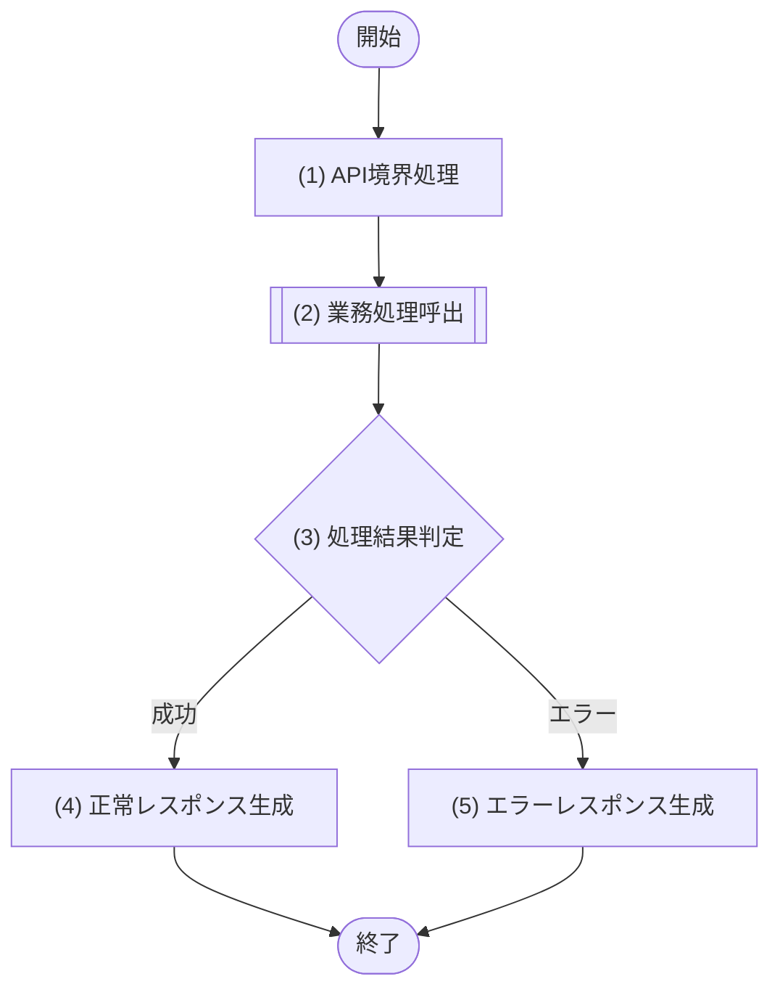

### 6.x.6 処理詳細

| No | 処理名 | 種別 | 処理詳細 | 呼出先公開IF・論理処理名 | 引数・参照値 | 結果変換 |
|---:|---|---|---|---|---|---|
| 1 | API境界処理 | 境界 | 認証主体、相関ID、パス・クエリ・ボディから論理入力を生成する | - | HTTPリクエスト | 論理入力 |
| 2 | 業務処理呼出 | モジュール呼出 | 個別APIの業務処理を単一モジュールへ委譲する | M-002/IF-XX XXX処理（ログインはM-003/IF-XX ログイン処理） | 認証主体、相関ID、論理入力 | 論理処理結果 |
| 3 | 処理結果判定 | 判定 | (2)の論理処理結果が成功か、業務エラーかを判定する | - | (2)の結果 | 成功時は(4)、エラー時は(5) |
| 4 | 正常レスポンス生成 | 境界 | 成功結果を§6.x.3の項目と正常HTTPステータスへ変換する | - | (2)の成功結果 | 正常レスポンス |
| 5 | エラーレスポンス生成 | 境界 | 公開IFの業務例外または境界例外を§6.x.7の一意な行と共通エラー形式へ変換する | - | (2)のエラー結果または境界例外、traceId | エラーレスポンス |

### 6.x.7 エラー定義

| HTTP | エラーコード | 発生元 | 発生条件 | API境界の処理 |
|---:|---|---|---|---|
| 400 | VALIDATION_ERROR | API境界 | §6.x.4の検証違反 | 共通エラー形式へ変換する |
| 401 | UNAUTHENTICATED | API境界 | 認証情報がない、または無効 | 共通エラー形式へ変換する |
| 403 | FORBIDDEN | M-XXX/IF-XX | 呼出先公開IFが操作不可を返した | 共通エラー形式へ変換する |
| 404 | `<RESOURCE_NOT_FOUND>` | M-XXX/IF-XX | 呼出先公開IFの対象不存在例外 | 共通エラー形式へ変換する |
| 409 | `<BUSINESS_CONFLICT>` | M-XXX/IF-XX | 呼出先公開IFの競合・状態不整合例外 | 共通エラー形式へ変換する |
| 500 | INTERNAL_ERROR | API境界 / M-XXX/IF-XX | 想定外の内部異常 | 内部情報を隠して共通エラー形式へ変換する |

公開IFの例外一覧と本表を正逆照合し、該当しない404/409等の例示行は削除する。各エラーコードは§4.0.2で、利用画面の共通制御またはMSGへ対応づける。

<!-- API一覧の全件について、上記 §6.x.1〜§6.x.7 を反復する -->

---

<!-- 本節は統合設計書「7. JOB設計」の詳細テンプレート。Cloudflare Workers Paid、Cloudflare Queues、Cloudflare D1を前提とし、Cron→scheduledハンドラー→Queue→queueハンドラー→JOB本体→M-002の40件単位処理を定義する。 -->
<!-- JOBハンドラーとJOB本体はCloudflare D1、env.DB、D1 API、物理データ構造、SQL、M-006へ直接アクセスしない。queueハンドラーはJOB本体を1回呼び、JOB本体からM-002の公開IFへデータ処理を委譲する。 -->
<!-- JOBの存在・正式名称とCron Trigger→scheduledハンドラー→Queues→queueハンドラー→JOB→M-002の接続順は§3.1・§3.1.2を構成上の正本とし、本章ではイベント・メッセージ・ハンドラー処理を詳細化する。 -->

# 7. JOB設計

## 7.1 JOB設計方針

- 本番基盤はCloudflare Workers Paid + Cloudflare D1 + Cloudflare Queuesで固定する。
- Cron Triggerの `scheduled()` handlerは初回Queue messageを生成・投入するだけとし、対象取得、業務処理、M-002呼出、D1処理を行わない。認証済みの手動再実行も同じ初回message投入経路を使用する。
- Queuesの`queue()`ハンドラーは1 messageにつき定義済みJOB本体をちょうど1回呼び、JOB本体はM-002の指定公開IFをちょうど1回呼び出す。ハンドラーとJOB本体は対象を反復せず、対象抽出・個別更新・D1原子実行をM-002以下へ委譲する。
- 1チャンクの対象上限は40件、D1 Statement内部予算は1 Worker invocation当たり900件とする。Paid planのhard limit 1,000件との差100件は制御、状態再読込み、障害確認用に残し、正常処理で使い切らない。
- D1 Statement数はM-002以下で、`batch()`内の各Statement、状態/version再読込み、即時再試行を各1件として実測し、JOB本体を介してqueueハンドラーへ論理結果として返す。queueハンドラーは900超過を契約違反として扱う。
- 継続messageは `cursor`、`chainRunId`、`chunkNo`、`businessDate`を必須契約とする。初回は `cursor=null`、`chunkNo=1`、継続時は同じ `chainRunId` / `businessDate`と次cursor、連続するchunkNoを使用する。
- Queue consumer設定は `max_batch_size=1`、`max_concurrency=1`、`max_retries=3`、DLQ必須とする。queueハンドラーは成功したmessageだけをackし、失敗を握りつぶさない。
- 即時再試行はM-006内のCloudflare推奨retryable allowlistに一致する一時障害だけに限定し、回数上限付きexponential backoff + full jitterを使用する。書込み結果不明時は状態/versionを再読込みしてから判断する。
- 過負荷、Worker timeout、CPU超過、memory超過は同一invocationで即時再試行せず、Queue redeliveryへ委ねる。最大再試行後はDLQへ移し、運用手順に従う。
- 必須のQueue投入とM-002呼出を完了までawaitする。必須処理を未完了のまま `ctx.waitUntil()` へ退避して終了またはackしない。
- `scheduled`ハンドラーへはQueue producerだけ、`queue`ハンドラーへはJOB本体だけ、JOB本体へはM-002公開IFだけを注入し、いずれにも`env.DB`、D1オブジェクト、SQL-ID、TBL-ID、M-006を渡さない。

## 7.2 JOB一覧

| JOB-ID | JOB名 | 目的 | 起動・継続経路 | 唯一の業務呼出先 |
|---|---|---|---|---|
| JOB-XXX | XXX JOB | <目的> | `scheduled()` / 手動 → 初回Queue投入 → `queue()`ハンドラー → JOB本体 → 継続Queue | M-002/IF-XX（JOB本体が1 messageにつき1回。scheduled/queueハンドラーは直接呼ばない） |

<!-- 7.3のブロックをJOB-IDごとに複製する。処理フローの番号・名称は処理詳細と完全一致させる。 -->
## 7.3 JOB-XXX XXX JOB

### 7.3.1 基本情報

| 項目 | 内容 |
|---|---|
| JOB-ID / JOB名 | JOB-XXX / XXX JOB |
| 目的 / トレース元 | <目的> / UC-XXX・§3.x |
| 本番基盤 | Cloudflare Workers Paid + Cloudflare D1 + Cloudflare Queues |
| Workers handler | `scheduled()`（初回message投入のみ） / `queue()`（JOB本体呼出・ack/retry・継続制御） / 認証済み手動入口（初回message投入のみ） |
| Cron Trigger | <Trigger名>、UTC Cron式、UTC予定時刻、業務IANAタイムゾーン、`controller.scheduledTime`からbusinessDateを確定する規則 |
| Queue / consumer | <Queue名> / <consumer名> |
| Queue設定 | `max_batch_size=1`、`max_concurrency=1`、`max_retries=3`、`dead_letter_queue="<DLQ名>"`。環境別Wrangler設定を§12と一致させる |
| チャンク上限 | 最大40対象 / Queue message。40件またはD1 Statement実測900件の先に達した方で終了する |
| D1 Statement上限 | 内部予算900 / Worker invocation、Workers Paid hard limit 1,000。100件を予約する |
| 多重・重複制御 | `chainRunId + chunkNo`を冪等キーとし、Queueのat-least-once配信、次message投入後の現message再配信、手動再実行をM-002以下で安全に判定する |
| 呼出モジュール / 公開IF | M-002 XXXアプリケーション / M-002/IF-XX `<チャンク処理名>` |
| 禁止事項 | JOBからM-006、D1、`env.DB`、D1 API、SQL、物理表へ直接アクセスしない |

### 7.3.2 起動パラメータ・継続message

#### scheduled / 手動入力

| 項目 | 型 | 必須 | 値・検証 |
|---|---|---:|---|
| scheduledTime | Integer | Cron時Yes | `controller.scheduledTime`（UTC epoch ms）。Cron式と許容時間差を検証する |
| businessDate | String | Yes | `YYYY-MM-DD`。Cron時はscheduledTimeと業務IANAタイムゾーンから一意に確定し、手動時は明示指定・認可する |
| rerunKey | String | 手動時Yes | 手動再実行を元chainと区別または関連付ける安定キー。空文字・再利用規則を定義する |

#### Queue message body

| 項目 | 型 | 必須 | 初回 | 継続・検証規則 |
|---|---|---:|---|---|
| cursor | String / null | Yes | `null` | M-002が返したopaqueな次cursor。JOBは分解・改変しない |
| chainRunId | String | Yes | JOB-ID、businessDate、scheduledTimeまたはrerunKeyから安定採番 | 全チャンクで不変。長さ・文字集合・採番衝突を検証する |
| chunkNo | Integer | Yes | `1` | 前messageのchunkNo + 1。1以上の安全整数かつ上限を定義する |
| businessDate | String | Yes | 確定済み業務日 | 全チャンクで不変、`YYYY-MM-DD`、再配信でも再計算しない |

Queue envelopeのmessage IDとdelivery attemptは相関・運用判定だけに用いる。業務冪等性はbodyの `chainRunId + chunkNo`で保証し、配信ごとに変わり得る値へ依存しない。

### 7.3.3 処理対象

| 対象 | 抽出条件 | 除外条件 | 処理単位・順序 |
|---|---|---|---|
| <論理対象> | M-002/IF-XXでbusinessDateとcursorから決定 | M-002の業務条件で決定 | 安定順の最大40件。JOBは対象ID一覧、物理条件、内部cursorを生成しない |

### 7.3.4 処理フロー

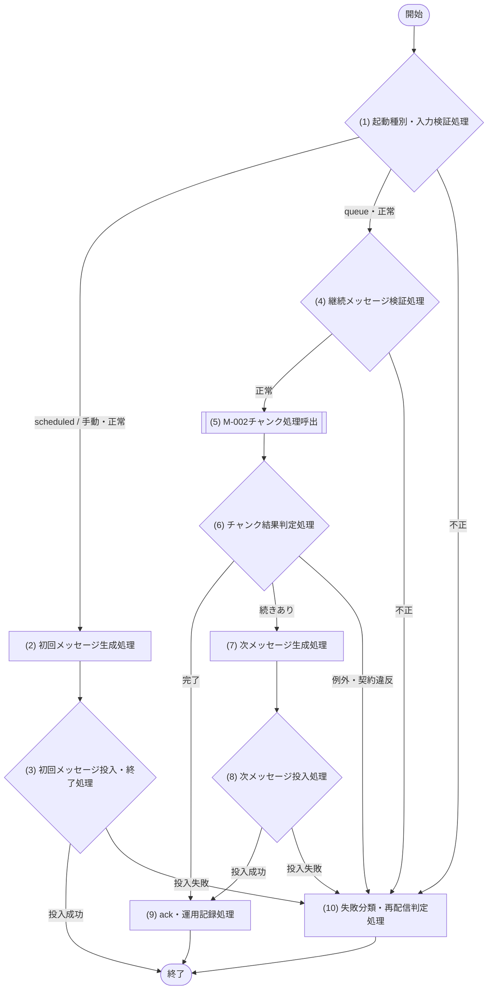

### 7.3.5 処理詳細

#### (1) 起動種別・入力検証処理

- handler種別をscheduled、queue、認証済み手動のいずれかへ一意に分類する。
- scheduledはCron式、scheduledTime、業務IANAタイムゾーンからbusinessDateを確定する。手動は実行権限、businessDate、rerunKeyを検証する。
- queueはbatch内message数が1件であることを確認し、(4)へ渡す。
- 不正入力ではM-002を呼ばず、(10)へ進む。scheduled/manualから業務処理へ直接分岐してはならない。

#### (2) 初回メッセージ生成処理

| 項目 | 設定値 |
|---|---|
| cursor | `null` |
| chainRunId | JOB-ID、businessDate、scheduledTimeまたはrerunKeyから安定・一意に採番 |
| chunkNo | `1` |
| businessDate | (1)で確定した値 |

同じCron eventまたは同じ手動rerunKeyからは同じchainRunIdを再生成し、Queue投入の再試行で別chainを作らない。

#### (3) 初回メッセージ投入・終了処理

初回messageのQueue投入Promiseをawaitする。成功時はchainRunId、businessDate、投入messageの安全な相関情報を記録して終了し、M-002を呼ばない。失敗時はack相当の成功扱いをせず(10)へ進む。必須投入を `ctx.waitUntil()` へ退避しない。

#### (4) 継続メッセージ検証処理

`cursor`、`chainRunId`、`chunkNo`、`businessDate`の存在、型、長さ、値域、相関を検証する。cursorはnullまたはopaque stringのまま扱い、内容を解釈しない。schema不正は非retryable入力エラーとしてM-002を呼ばず(10)へ進む。

#### (5) M-002チャンク処理呼出

| M-ID / IF-ID | 処理名 | 呼出回数 |
|---|---|---:|
| M-002/IF-XX | <チャンク処理名> | 当該Queue messageでちょうど1回 |

| 引数 | 値 |
|---|---|
| cursor | message.cursor |
| chainRunId | message.chainRunId |
| chunkNo | message.chunkNo |
| businessDate | message.businessDate |
| maxItems | `40` |
| statementBudget | `900` |

| 結果 | 型 | 契約 |
|---|---|---|
| targetCount / successCount / skipCount / failureCount | Integer | 各0以上、targetCountは40以下、targetCount = successCount + skipCount + failureCount |
| nextCursor | String / null | hasNext=trueでは非空、falseではnull |
| hasNext | Boolean | 安定順で未処理対象が残る場合true |
| statementCount | Integer | 当該Worker invocationで実測したD1 Statement数。0〜900 |
| duplicate | Boolean | 同じchainRunId + chunkNoの再配信を既処理として扱ったか |
| writeOutcome | Enum | `CONFIRMED` / `NOT_APPLICABLE`。結果不明のまま正常を返さない |
| failureSummaries | Object[] | 対象を特定できる安全なIDと公開エラー分類。個人情報・生D1例外を含めない |

呼出をawaitする。M-002は最大40件かつ900 Statement以内で対象取得・処理・状態確認を完了し、D1アクセスはM-006公開IFだけを通す。

| M-002公開例外 | 発生条件 | retryable | (10)の扱い |
|---|---|---:|---|
| `<BUSINESS_EXCEPTION>` | §8の公開IFと同一 | No | 業務失敗を記録しack / 手動対応。要件に応じた扱いを一意に記載 |
| `<RETRYABLE_TEMPORARY>` | allowlist即時再試行後も一時障害 | Yes | 例外を返してQueue redelivery |
| `<WRITE_OUTCOME_UNRESOLVED>` | 状態/version再読込みでも確定不能 | Yes | 同一invocationで書込みを再送せずQueue redelivery |
| `<PLATFORM_OVERLOAD_OR_LIMIT>` | 過負荷、timeout、CPU、memory等 | Yes | 即時再試行せずQueue redelivery |
| `<NON_RETRYABLE_SYSTEM>` | 設定不備、契約違反、恒久障害 | No | ack可否とDLQ/運用隔離を具体化 |

完成版では§8の当該M-002公開IFが宣言する全例外を、本表へ重複なくちょうど1回割り当てる。

#### (6) チャンク結果判定処理

次の順序で副作用なしに判定する。

1. 型、非負性、件数式、targetCount <= 40、statementCount <= 900を検証する。不成立は契約違反として(10)へ進む。
2. writeOutcomeが確定済みであることを検証する。結果不明の正常扱いを禁止する。
3. failureCountと公開契約から業務上の完了/失敗を決定する。
4. hasNext=falseかつnextCursor=nullなら完了として(9)へ進む。
5. hasNext=trueかつnextCursorが非空なら続きありとして(7)へ進む。それ以外は契約違反として(10)へ進む。

#### (7) 次メッセージ生成処理

| 項目 | 設定値 |
|---|---|
| cursor | (5)のnextCursor |
| chainRunId | 現messageと同じ値 |
| chunkNo | 現message.chunkNo + 1 |
| businessDate | 現messageと同じ値 |

次messageの論理冪等キーを `chainRunId + (chunkNo + 1)`として固定する。件数、Statement数、対象ID一覧をcursorへ追加せず、M-002が発行したopaque値をそのまま引き継ぐ。

#### (8) 次メッセージ投入処理

次messageのQueue投入Promiseをawaitする。投入成功後だけ(9)へ進む。投入後・現message ack前に障害が起きた場合は現messageが再配信され得るため、M-002は `chainRunId + chunkNo`、次チャンクは `chainRunId + chunkNo + 1`で重複を無害化する。投入失敗は(10)へ進み、現messageをackしない。

#### (9) ack・運用記録処理

チャンク処理が確定し、hasNext=trueの場合は次message投入も確定した後で、現messageをackする。chainRunId、chunkNo、businessDate、message ID、delivery attempt、件数、statementCount、duplicate、hasNext、所要時間、公開エラー分類を記録する。cursor、生D1例外、SQL、個人情報はログへ出さない。

#### (10) 失敗分類・再配信判定処理

| 失敗分類 | 同一invocationの即時再試行 | Queue messageの扱い |
|---|---|---|
| Cloudflare推奨retryable allowlist一致の一時D1障害 | M-006内だけで、回数上限付きexponential backoff + full jitter | 解消しなければthrow/retryし、`max_retries=3`後にDLQ |
| 書込み結果不明 | 先にM-006経由で状態/versionを再読込み。未確定と判断できた場合だけallowlist規則内で再試行 | 判定不能ならthrow/retry、最大再試行後DLQ |
| 過負荷 / Worker timeout / CPU超過 / memory超過 | しない | Queue redelivery。最大再試行後DLQ |
| 業務エラー / schema不正 / 恒久設定不備 | しない | 無限再配信しない。ackして運用隔離するか、明示的にDLQへ送る方式を完成版で一意に定義 |
| M-002結果の契約違反 / 40件・900 Statement超過 | しない | 現messageを正常ackせず運用隔離。再配信で解消しない場合のDLQ送付方式を完成版で固定 |
| scheduled / 手動の入力不正 | しない | Queueへ投入せず実行失敗を返し、監査・アラート |
| scheduled / 手動の初回投入失敗 | しない（producer SDK/基盤の安全な再試行規則がある場合だけ別途定義） | 実行失敗を返しアラート。同じchainRunIdで再実行 |

Queue retry時は例外を握りつぶさず、redelivery対象messageを成功ackしない。DLQの監視、調査、businessDate固定の再投入、重複安全性、復旧承認者を§12へ定義する。

### 7.3.6 D1原子実行・冪等性・継続性

| 観点 | 設計 |
|---|---|
| D1アクセス | M-002以下がM-006公開IFを使用する。JOBはD1/SQL/M-006を参照しない |
| 原子実行 | 対象単位のTX-IDはM-002が宣言し、対応M-006公開IFが1回のD1 `batch()`で実行する |
| チャンク冪等性 | `chainRunId + chunkNo`の一意性、対象version、業務冪等キーをM-002/M-006で保証する |
| 継続順序 | 現チャンク確定 → 次message投入確定 → 現message ack。途中障害による重複は冪等キーで無害化する |
| statement予算 | maxItems=40、statementBudget=900。再読込み・即時再試行を含む実測値を返し、1,000へ到達させない |
| 多重起動 | `max_concurrency=1`に加え、異なるconsumer/手動再投入も想定して永続的冪等性で防ぐ。設定だけを排他保証としない |

### 7.3.7 監視・運用

| 観点 | 必須設計 |
|---|---|
| メトリクス | chain開始/完了/失敗、chunk数、1 chunk件数、statementCount最大・累計、900接近回数、Queue遅延、delivery attempt、DLQ件数、重複件数 |
| アラート | 初回投入失敗、連続chunk失敗、statementCount予算超過、Queue滞留、`max_retries=3`到達/DLQ、未完了chain、timeout/CPU/memory失敗 |
| 相関 | JOB-ID、chainRunId、chunkNo、businessDate、message ID、traceIdを全handler・M-002結果で相関する |
| DLQ復旧 | 原因除去、状態/version確認、businessDate固定、同一chainRunId/適切なchunkNoでの再投入、二重反映検証、承認・証跡 |
| 設定同期 | WranglerのCron UTC式、producer/consumer binding、`max_batch_size=1`、`max_concurrency=1`、`max_retries=3`、DLQを§12・環境設定・試験で正逆照合する |

---

<!--
【8. モジュール設計】
定義内容: Cloudflare Workers上の対象システムを構成する論理モジュールの責務・依存関係と、各公開インターフェースの入出力・例外・処理フロー・処理詳細・D1原子実行・競合制御を、実装可能な詳細設計レベルで定義する。
定義する条件: 全システムで必須。
構成: 8.1 論理モジュール構成 / 8.2 モジュール責務 / 8.3 依存・データアクセスルール / 8.4 公開インターフェース一覧 / 8.5 個別モジュール詳細 / 8.6 レビュー観点。
定義ルール:
- モジュールIDは M-XXX、公開インターフェースIDは各モジュール内で IF-XX とし、他文書からは M-XXX/IF-XX で参照する。
- モジュールの存在・正式名称・上位からの接続順は§3.1・§3.1.2と一致させ、本章では責務・公開IF・内部処理を詳細化する。
- 画面はM-001だけを呼び、M-001はCloudflare Worker APIだけを呼び出す。APIはログイン以外をM-002、ログインをM-003に委譲する。JOBはM-002に委譲する。
- API・JOB はCloudflare D1へ直接アクセスせず、`env.DB`、D1 API、SQL、テーブルを直接参照しない。API・JOB の処理フロー・処理詳細には SQL-ID、テーブル物理名、TBL-ID、D1 binding処理を記載してはならない。
- Workerの `env.DB` bindingを受領・参照し、D1の `prepare()` / `bind()` / `first()` / `all()` / `run()` / `raw()` / `batch()`を呼び出せるのはM-006だけとする。M-001〜M-005・M-007・M-008へD1オブジェクトを渡さない。
- 8章の個別モジュール設計でSQL-IDを記載できるのは、概要・公開IF対応表・処理詳細を含むM-006ブロック内だけとする。他モジュールはM-006の公開インターフェースをM-006/IF-XXで呼び出す。
- M-007 も監査ログを直接保存せず M-006 に委譲する。M-008 だけが外部認証基盤を直接呼び出せる。
- 複数Statementを不可分にする1つのTX-IDは、1つのM-006公開IFで受け付け、M-006がPrepared Statement配列へ変換して1回の `env.DB.batch()` で実行する。上位モジュールが複数M-006 IFを順に呼んで1つのbatchとみなしてはならない。
- フローの全番号付きノードを同じ番号・名称で処理詳細に展開し、暗黙の取得・判定・更新を残さない。複数IFが完全に同一のフローを使う場合だけ、共通フローとIF別対応表による定義を許可する。
- M-002は§2.4の固定コード、§2.2の各UCで定義した操作権限・閲覧スコープ・項目許可集合、項目選択APIのロール別許可集合、期間・状態等の業務妥当性を明示的に検証してからM-006を呼び出す。
- 登録・更新日時を公開結果へ返すIFは、M-006が返す永続化結果日時を上位へ伝播し、別モジュールの現在時刻で代用しない。無更新時の日時も取得元を定義する。
-->
# 8. モジュール設計

<!--
【8.1 論理モジュール構成】
定義内容: 画面・Workers API・Workers JOB・モジュール・SQL・D1 binding・Cloudflare D1・外部システムの許可された依存方向を示す。
定義する条件: 必須。
定義ルール:
- API はログイン以外を M-002、ログインを M-003 にだけ委譲する。
- JOB は M-002 にだけ委譲する。
- SQL、D1 binding、Cloudflare D1の直前に必ずM-006を置き、`env.DB`を他要素へ接続しない。
- 外部認証基盤の直前には必ず M-008 を置く。
-->
## 8.1 論理モジュール構成

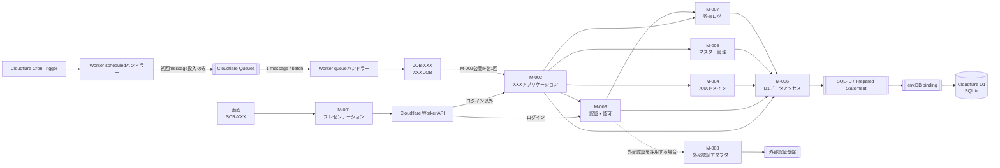

`scheduled()`と手動再実行入口はQueue producerだけを受け取り、M-002・M-006・D1へ接続しない。queueハンドラーは `max_batch_size=1` / `max_concurrency=1`でJOB本体を1回呼び、JOB本体が`cursor`、`chainRunId`、`chunkNo`、`businessDate`をM-002へ渡す。D1への許可経路は図示したM-006経由だけとする。M-008と外部認証基盤は外部認証採用時だけ残し、採用時は先に§3.1へ両participantを登録してログインシーケンスへ接続する。

<!--
【8.2 モジュール責務】
定義内容: 各モジュールの主な責務と非責務を一覧化する。
定義する条件: 全モジュールを1行ずつ定義する。
項目説明: モジュールID / モジュール名 / 主な責務 / 担当しないこと。
定義ルール:
- `env.DB`参照・Prepared Statement生成・bind・D1実行はM-006の責務として一意に置く。
- 外部認証基盤呼び出しは M-008 の責務として一意に置く。
- 業務フロー制御、業務判定、マスター判定、認証認可、監査データ生成を分離する。
-->
## 8.2 モジュール責務

| モジュールID | モジュール名 | 主な責務 | 担当しないこと |
|---|---|---|---|
| M-001 | プレゼンテーション | 画面表示・入力受付・API呼び出し・画面状態制御 | API内部処理、業務判定、D1/SQL/TBL参照 |
| M-002 | XXXアプリケーション | ログイン以外の業務ユースケース制御、D1原子更新の論理境界宣言、下位モジュールの調停 | SQL実行、`env.DB`参照、D1 Statement生成、画面表示、認証基盤呼び出し |
| M-003 | 認証・認可 | ログイン制御、認証状態・操作権限・閲覧範囲の判定 | 業務データ更新、SQL/D1実行、認証基盤への直接接続 |
| M-004 | XXXドメイン | 業務状態・期間・一意性・更新可否等のドメイン判定 | HTTP制御、SQL/D1実行、認可判断 |
| M-005 | マスター管理 | マスター取得・有効性・重複・更新可否の判定 | ユースケース全体制御、SQL/D1実行 |
| M-006 | D1データアクセス | `env.DB` bindingの受領、`prepare()` / `bind()` /実行/`batch()`、D1結果・例外の論理形式への変換 | 業務ルール・認可・画面制御、D1オブジェクトの上位返却 |
| M-007 | 監査ログ | 監査イベント生成、記録要否・記録内容の決定 | D1直接保存、`env.DB`参照、SQL実行、業務データ更新 |
| M-008 | 外部認証アダプター | 外部認証基盤呼び出しと外部形式から内部形式への変換 | D1/SQL実行、業務認可の最終判定 |

具象化時は§3.1に存在するM-IDと本表を完全一致させる。上表のM-008は条件付き候補であり、外部認証を採用しない場合はM-008行・§8.1の経路・個別設計を削除する。採用する場合は§3.1とログインシーケンスへ`M-008 外部認証アダプター`および外部認証基盤を先に追加する。

<!--
【8.3 依存・データアクセスルール】
定義内容: モジュール間呼び出し、D1/SQL、外部システム、D1原子実行に関する禁止・許可ルールを規範として定義する。
定義する条件: 必須。
定義ルール: 「原則」ではなく、レビューで適否を一意に判定できる禁止・許可表現で記載する。
-->
## 8.3 依存・データアクセスルール

1. 画面はM-001だけを呼び、M-001はCloudflare Worker APIだけを呼び出す。画面とM-001は業務モジュール・SQL・D1を直接呼び出してはならない。
2. API はログイン以外を M-002、ログインを M-003 にだけ委譲する。API から M-004〜M-008 を直接呼び出してはならない。
3. queueハンドラーはJOB本体だけを呼び、JOB本体はM-002にだけ委譲する。queueハンドラーとJOB本体はM-003〜M-008、SQL、D1を直接呼び出してはならない。
4. 個別API・JOBの処理フロー、処理詳細、入出力、注入契約には、実行依存として `env.DB`、D1オブジェクト/API、SQL-ID、TBL-ID、テーブル物理名、SQL文、binding情報を記載してはならない。アーキテクチャ上の共通禁止事項、クエリ予算、トレース説明はこの限りでない。
5. `env.DB`を受領・参照し、D1の `prepare()` / `bind()` / `first()` / `all()` / `run()` / `raw()` / `batch()`を呼び出せるのはM-006だけとする。
6. 8章の個別モジュール処理でSQL-IDを記載できるのは、M-006の処理詳細だけとする。M-001〜M-005・M-007・M-008の処理詳細にはSQL-IDを記載してはならない。M-006の概要・公開IF対応表、および6・9・10章の正規トレースでの参照は許可する。
7. M-002〜M-005・M-007 がデータを参照・更新するときは、M-006 の公開インターフェースを呼び出す。
8. M-007 は監査イベントを生成して M-006 に渡し、自ら監査ログストアや DB へ接続しない。
9. M-008 だけが外部認証基盤を直接呼び出せる。他モジュールは M-008 の公開インターフェースを利用する。
10. 原子更新境界はM-002がTX-IDとして業務単位で宣言し、対応する1つのM-006公開IFが全Prepared Statementを1回の `env.DB.batch()` で実行する。単一StatementはD1自動コミットとし、明示的BEGIN/COMMIT/ROLLBACKを設計しない。
11. モジュール間の循環依存を禁止する。処理結果を見て分岐するときは取得・更新処理と判定処理を別ノードにする。
12. M-003は§2.2の各UCの認可定義を正本として、有効ロール、操作、対象、基準日から`ALL` / `ORGANIZATION` / `SELF`等の論理スコープを解決する。複数ロールの合成、組織子孫集合、本人紐付けなし、ロールなしの動作を公開IF契約へ明記する。
13. M-002がスコープ付きデータ取得をM-006へ依頼するときは、`scopeType`、操作者業務主体ID、許可組織ID集合、基準日を暗黙値にせず毎回渡す。M-006は受領済み条件をSQLへバインドするだけで認可を拡張しない。
14. Worker構成境界は `env` をM-006生成経路だけへ渡し、API・JOBにはM-002/M-003の公開IFだけを注入する。M-006以外の入力・出力・状態・例外へD1型を露出しない。
15. M-006が実行するSQLは§9の静的SQL-IDから選択し、値は順序付きplaceholderへ `bind()` する。動的な値の文字列連結、未定義SQL、任意SQL実行IFを禁止する。
16. API応答またはJOB完了に必要な更新は、呼出元が公開IFの完了をawaitする。必須永続化を `ctx.waitUntil()` へ退避しない。
17. placeholderを使うSQLは `?1`〜`?N`（`1 <= N <= 100`）を欠番なく使用し、最大ordinal N、§9のbind定義数、M-006の `.bind()` 引数数を一致させる。placeholderなしのSQLでは `.bind()` を呼ばない。
18. JOB本体が呼ぶM-002公開IFは、`cursor`、`chainRunId`、`chunkNo`、`businessDate`、`maxItems=40`、`statementBudget=900`を入力とし、処理件数、次cursor、継続有無、当該Worker invocationのD1 Statement実測数を返す。900到達前にチャンクを終了し、Paid planのhard limit 1,000を使い切らない。
19. D1への即時再試行は、Cloudflare公式資料を確認して§12で版管理したretryable allowlistに一致する一時障害だけに限定し、回数上限付きexponential backoff + full jitterを用いる。過負荷、Worker timeout、CPU超過、memory超過は即時再試行せず、Queue redeliveryへ返す。
20. 書込み結果が不明な障害では、同じ書込みを再送する前にM-006が状態またはversionを再読込みし、確定済み・未確定・競合を判定する。再読込みもStatement実測数へ加算し、判定不能時はQueue redeliveryへ返す。

<!--
【8.4 公開インターフェース一覧】
定義内容: 全モジュールが公開するインターフェースを一覧化し、呼出元と処理種別を示す。
定義する条件: 必須。全公開IFを1行ずつ記載する。
項目説明:
- IF ID: モジュール内ローカルID(IF-XX)。完全修飾IDは M-XXX/IF-XX。
- 公開機能名: 論理名。「〜取得」「〜判定」「〜登録」「〜更新」「〜実行」等。
- 呼出元: 許可された呼出元(API / JOB / M-XXX)。
- 処理種別: 参照 / 更新 / 判定 / 制御 / 外部連携 / 表示制御。
-->
## 8.4 公開インターフェース一覧

| モジュール | IF ID | 公開機能名 | 呼出元 | 処理種別 |
|---|---|---|---|---|
| M-XXX | IF-01 |  |  | 参照 / 更新 / 判定 / 制御 / 外部連携 / 表示制御 |

<!--
【8.5 個別モジュール詳細】
定義内容: 各モジュールの全公開IFを集約表で契約化し、各IFまたは完全に同一のIF群について処理フローと番号対応の処理詳細を定義する。
定義する条件: 全モジュール・全公開IFで必須。
定義ルール:
- 8.X.1 モジュール概要、8.X.2 公開インターフェース詳細（集約表）、8.X.3以降にIF別または共通の処理フロー・処理詳細・原子性/競合/冪等性を配置する。
- 8.X.2は1行1IFで「IF / 概要 / 入力 / 出力 / 例外 / 原子性・競合・冪等性」を欠落なく記載する。入力・出力・例外を別小節へ分散させず、一覧から全契約を比較できる形式を正本とする。
- 複数IFの処理手順が完全に同じ場合だけ、モジュール単位の共通処理フローとIF別処理詳細対応表へ集約できる。この場合も全IFの差異を表の各行に記載する。
- フローの番号付きノードと処理詳細の見出しを、番号・名称とも厳密一致させる。
- 他モジュール呼び出しは M-XXX/IF-XX、外部システム呼び出しは外部システム名で示す。
- SQL-ID・D1実行方式・bind対応表はM-006の処理詳細だけに置く。他モジュールでは「利用SQL」節自体を作らない。
- 固定コード入力は§2.4との一致判定、項目選択入力はロール別許可集合・既定順・要求順の扱いを、担当業務モジュールの処理詳細に記載する。
- 認可を扱うIFは§2.2の該当UCとの対応を示し、入力目的ごとの許可ロール、対象スコープ、返却項目/更新可能項目、複数ロール時の合成、拒否条件を処理詳細へ記載する。
- 文字列を正規化する更新IFは、前後空白除去、Unicode正規化、正規化後の空文字・長さ・形式検証、現値との正規化後比較、変更履歴生成、M-006呼出の順をフローまたは処理詳細で固定する。省略、明示null、空文字を区別する。
- 更新可能マスターを扱うIFは、手動利用可否と有効期間を独立に判定し、即時無効化、将来の期間終了予約、終了日未指定時の現値保持を処理詳細へ記載する。
- 参照結果を判定して更新するIFは、条件付きDML、期待変更行数、UNIQUE/CHECK/FOREIGN KEY/trigger、同一D1 batchでTOCTOUを防ぐ。再試行対象・上限・最終例外を定義し、画面/APIで検証済みでも業務モジュールで再検証する。
- 将来予約・期間履歴・階層・上長等の時間依存参照を扱うIFは、後続更新で不変条件が破れないよう逆参照検証、置換/取消方針、マスター期間包含を定義する。
- M-006の出力契約には、上位APIが必要とする永続化結果（版数、登録・更新日時等）をSQLのRETURNING結果またはD1 Resultメタデータから漏れなく含める。
- 構造化した変更概要を保存・表示する場合は、schemaVersion、変更イベントごとのfieldCode/operation生成表、許可キー・値、重複排除と並び順、実変更なし時の非生成、個人情報を保存しない規則、API表示文字列への変換、不正データ時の安全な代替表示を業務モジュールの共通契約として定義する。
- 変更者表示は必須文字列となるフォールバック表を定義する。JOB、社員に紐づくAPI利用者、社員未紐付け/論理削除済み利用者、想定外の操作者欠落を区別し、想定外時の運用警告も定義する。
-->
## 8.5 個別モジュール詳細

<!-- 以下の一般モジュール形式を§3.1に登録したM-001〜M-005・M-007と、外部認証採用時だけM-008について反復し、その後のM-006専用形式でデータアクセスを定義する。 -->

### 8.X M-XXX <モジュール名>

#### 8.X.1 モジュール概要

| 項目 | 内容 |
|---|---|
| モジュールID | M-XXX |
| モジュール名 |  |
| 目的 |  |
| 主な呼出元 |  |
| 呼出可能先 |  |
| 状態保持 | なし / あり(保持内容・範囲) |

#### 8.X.2 公開インターフェース詳細

| IF | 概要 | 入力 | 出力 | 例外 | 原子性・競合・冪等性 |
|---|---|---|---|---|---|
| IF-01 <公開機能名> | <目的・事前/事後条件> | <項目、型、必須/任意、NULL/省略、制約> | <項目、型、0件時> | <公開例外コードを全列挙> | 参照のみ / TX-XXX、競合条件、再実行方針 |
| IF-XX JOBチャンク処理 | 安定順の次チャンクを処理する | cursor:String/null、chainRunId:String、chunkNo:Integer、businessDate:Date、maxItems=`40`、statementBudget=`900` | 件数、nextCursor、hasNext、statementCount、duplicate、writeOutcome、失敗分類 | 業務例外、retryable一時例外、WRITE_OUTCOME_UNRESOLVED、実行基盤例外、契約違反を全列挙 | 対象単位TX-ID、chainRunId+chunkNo、version/冪等キー。最大40件・900 Statement |

M-002がJOB本体から呼ばれる場合はJOBチャンク処理行を残し、他モジュールまたは非該当システムでは削除する。該当時は後続の処理フロー・処理詳細を当該IF用に複製する。

このIFの処理フロー・処理詳細には、入力検証、冪等状態確認、安定順対象取得、40件/900 Statementの予算判定、対象単位処理、書込み結果不明時の状態/version再読込み、次cursor生成、集計結果生成を番号付きで全て置く。D1アクセスは各ノードからM-006公開IFへ委譲し、SQL-IDや物理名はM-002側へ記載しない。

#### 8.X.3 IF-01 <公開機能名> 処理フロー

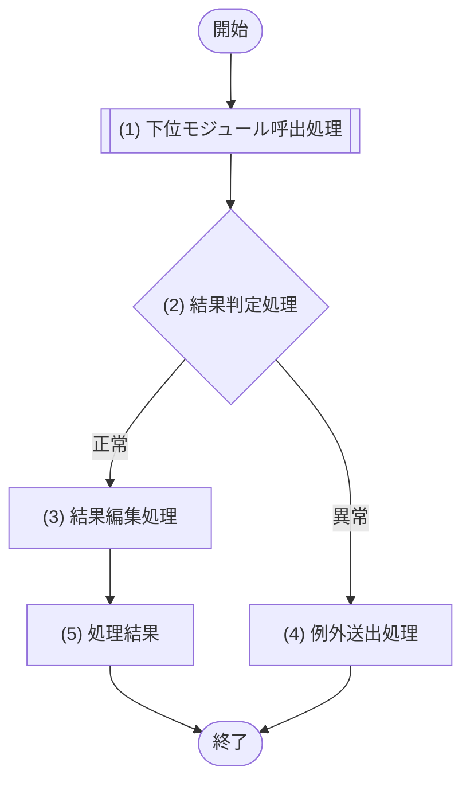

#### 8.X.4 IF-01 <公開機能名> 処理詳細

| No | 処理名 | 呼出先 | 入力・参照値 | 処理内容 | 出力・分岐・例外 |
|---:|---|---|---|---|---|
| 1 | 下位モジュール呼出処理 | M-XXX/IF-XX | 入力.xxx | 論理入力を渡して公開IFを1回呼び出す | 下位結果 |
| 2 | 結果判定処理 | - | (1)の結果 | 成功・業務例外を副作用なしで判定する | 成功は(3)、異常は(4) |
| 3 | 結果編集処理 | - | (1)の成功結果 | 公開契約へ編集する | (5)へ |
| 4 | 例外送出処理 | - | (1)の業務例外 | §8.X.2に宣言した一意な公開例外へ変換する | 公開例外 |
| 5 | 処理結果 | - | (3)の結果 | 公開契約の結果を返す | 出力 |

処理フローの全番号・名称・分岐を本表へ同じ順で記載する。判定行ではデータ取得・更新・外部呼出を行わず、暗黙の処理を文章へ埋め込まない。

#### 8.X.5 原子性・競合・冪等性

| IF | TX-ID / M-006公開IF | 競合保証 | 失敗・再試行 | 冪等性 |
|---|---|---|---|---|
| IF-01 | なし / TX-XXX・M-006/IF-XX | version、UNIQUE、trigger等の論理要件 | 再試行対象、上限、最終公開例外 | 同一入力再実行時の結果 |

### 8.Y M-006 D1データアクセス

#### 8.Y.1 モジュール概要

| 項目 | 内容 |
|---|---|
| モジュールID | M-006 |
| 目的 | 静的SQL-IDをD1 Prepared Statementとして実行し、物理結果・例外を論理契約へ変換する |
| 主な呼出元 | M-002〜M-005、M-007（許可した公開IFだけ） |
| 呼出可能先 | Cloudflare D1のみ |
| Binding | `env.DB`。M-006生成時だけ受領し、外部へ公開・返却・共有しない |
| 状態保持 | リクエスト/JOB実行をまたぐ可変状態なし。Prepared Statement、bind値、D1結果は呼出単位 |

#### 8.Y.2 公開インターフェース詳細

| IF | 概要 | 論理入力 | 論理出力 | 論理例外 | SQL・D1実行 | TX-ID |
|---|---|---|---|---|---|---|
| IF-01 <取得名> | <取得目的> | <物理名を含まない検索条件> | <論理行/一覧、0件時、Statement実行数> | DATA_ACCESS_ERROR等 | SQL-XXX / `first()`・`all()`・`raw()` | なし（参照） |
| IF-02 <原子更新名> | <不可分な更新目的> | <検証済み更新command> | <永続化日時・version、Statement実行数等> | CONFLICT、DUPLICATE、DATA_ACCESS_ERROR等 | SQL-XXX → SQL-YYY / 1回の `batch()` | TX-XXX |

TX-IDを持つ更新は1行1公開IFとし、上位が複数M-006 IFを連続呼出して原子更新を組み立てない。任意SQL文字列、D1Database、D1PreparedStatement、D1Resultを公開入力・出力へ含めない。

#### 8.Y.3 共通処理フロー

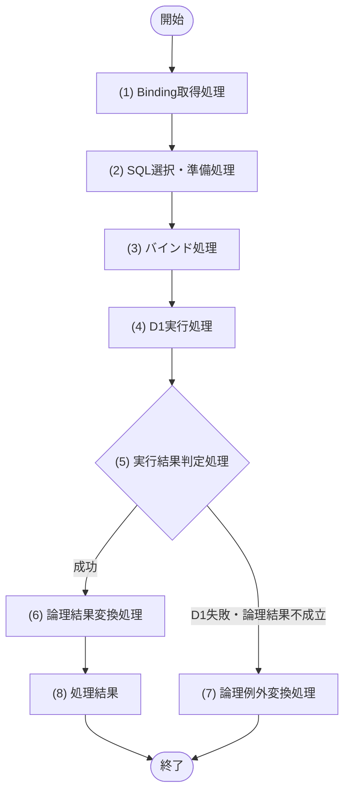

#### 8.Y.4 共通処理詳細（IF別対応表）

| No | 処理名 | 対象IF | D1 API | 処理内容 | 結果・例外 |
|---:|---|---|---|---|---|
| 1 | Binding取得処理 | 全IF | `env.DB` | M-006内部に注入済みのbindingを取得する。接続pool・接続開始は行わない | binding欠落は設定例外 |
| 2 | SQL選択・準備処理 | 全IF | `prepare()` | §9のSQL-IDに対応する静的SQLを選び、Statementを準備する。入力値でSQL本文を連結しない | Prepared Statement |
| 3 | バインド処理 | 全IF | `bind()` | §9の `?1`〜`?N`（1〜100、欠番なし）と論理入力を型・NULL規則どおりbindし、最大ordinal Nと引数数を一致させる。placeholderなしでは呼ばない | bind済みStatement。`undefined`は禁止。ordinal・定義・引数数不一致は実行前の設計/実装エラー |
| 4 | D1実行処理 | 参照IF | `first()` / `all()` / `raw()` | §9で指定した方法を1回実行する | D1結果 |
| 4 | D1実行処理 | 単一更新IF | `run()` | 単一Statementを自動コミットで実行する | D1結果メタデータ |
| 4 | D1実行処理 | TX-XXX更新IF | `batch()` | 全Statementを事前にprepare/bindし、定義順の配列を1回だけ実行する | 同順の結果配列。1件失敗時は全体ロールバック |
| 5 | 実行結果判定処理 | 全IF | - | 成否、0/1/複数行、変更行数、期待件数を副作用なしで判定する。batch後の件数不一致はロールバック済みとはみなさない | 成功は(6)、失敗は(7) |
| 6 | 論理結果変換処理 | 全IF | - | SQLiteのINTEGER真偽、TEXT日時/JSON、NULL、列名を公開IFの論理型へ変換する | M-006論理出力 |
| 7 | 論理例外変換処理 | 全IF | - | constraint/trigger/期待件数/D1障害を安定した論理例外へ変換し、生エラー・SQL・個人情報を上位へ出さない | §8.Y.2の論理例外 |
| 8 | 処理結果 | 全IF | - | D1オブジェクトを含まない論理結果を返す | 呼出元へ返却 |

#### 8.Y.5 SQL・bind・結果対応

| IF | Statement順 | SQL-ID | D1実行 | bind順: placeholder → 論理入力 → `.bind()`引数 | 期待結果・変更件数 | 論理出力/例外 |
|---|---:|---|---|---|---|---|
| IF-01 | 1 | SQL-XXX | `all()` | 1:`?1`→入力.xxx→第1引数、2:`?2`→入力.yyy→第2引数 | 0..n行 | 一覧 |
| IF-02 | 1 | SQL-YYY | `batch()` | 1:`?1`→入力.xxx→第1引数 | 変更1行。不成立時はTRG-XXX/guard StatementがSQLエラーにする | guard失敗はCONFLICTかつTX-XXX全体ロールバック |
| IF-02 | 2 | SQL-ZZZ | 同じ `batch()` | 1:`?1`→入力.xxxから事前確定した値→第1引数 | 追加1行 | 失敗はTX-XXX全体ロールバック |

SQL本文、全placeholder、列別変換は§9を正本とする。本表はM-006 IF、実行方式、順序、期待結果、論理契約を正逆に結ぶ。

#### 8.Y.6 D1例外変換

| D1/SQLiteの検出事象 | 判定情報 | M-006論理例外 | 再試行 | ログ方針 |
|---|---|---|---|---|
| UNIQUE違反 | 制約ID/安定識別子 | <DUPLICATE_XXX> | しない | SQL値・個人情報を除外 |
| CHECK/FOREIGN KEY/trigger ABORT | 制約ID/trigger安定コード | <BUSINESS_CONFLICT> / DATA_CONSTRAINT_VIOLATION | しない | traceId、SQL-ID、制約ID |
| 楽観更新0行 | `meta.changes=0`等の期待件数不一致 | UPDATE_CONFLICT | しない | traceId、SQL-ID |
| allowlist一致の一時的D1障害 | §12で確認日・根拠を版管理したCloudflare推奨retryable分類 | DATA_ACCESS_TEMPORARY | 回数上限付きexponential backoff + full jitter。再試行分もStatement数へ加算 | 生本文を上位へ返さない |
| 書込み結果不明 | 通信断等により成否を断定できない | WRITE_OUTCOME_UNKNOWN | 状態/versionをM-006経由で再読込み後、未確定時だけ再試行。判定不能は上位へ返す | traceId、冪等キー、判定分類だけを記録 |
| 過負荷 / Worker timeout / CPU超過 / memory超過 | Workers/Queuesの実行失敗分類 | DATA_ACCESS_TEMPORARY / 実行基盤失敗 | 同一invocationで即時再試行しない。JOB本体へ例外を返し、queueハンドラーのredeliveryへ委ねる | traceIdと安全な診断情報 |
| その他 | 未分類 | DATA_ACCESS_ERROR | 再試行しない | traceIdと安全な診断情報 |

#### 8.Y.7 D1原子実行・競合・冪等性

| TX-ID | M-006 IF | SQL-ID順 | 成功条件 | 全体失敗条件 | 競合・冪等性 |
|---|---|---|---|---|---|
| TX-XXX | M-006/IF-02 | SQL-YYY → SQL-ZZZ | 全Statement成功。競合guard不成立はbatch内SQLエラーになる | Statement、constraint、trigger、guardのいずれか失敗 | version/冪等キー/UNIQUE、再試行方針 |

batch成功後のアプリケーション判定では完了済みbatchをロールバックできない。不可分な変更件数・version・不変条件は同じbatch内のconstraint・trigger・guard Statement等でSQLエラー化する。成功した `changes=0` を後からCONFLICTへ変換できても、先行/後続書込みの全体ロールバック保証にはならない。

同じbatchの後続Statementは、先行Statementの結果を受け取ってからbindできない。ID・日時・操作token等は呼出前に確定して全Statementへ事前bindするか、SQLite trigger等のDB内処理へ置く。

JOB本体からの呼出では、M-002がM-006の各結果からD1 Statement実行数（`batch()`内各要素、再読込み、即時再試行を含む）を集計する。1チャンクは最大40件かつ900 Statement以内で止め、残件があれば次cursorを返す。hard limit 1,000を正常系の処理枠として使用しない。

<!--
【8.6 レビュー観点】
定義内容: モジュール設計完了時の必須確認事項を示す。
定義する条件: 必須。
-->
## 8.6 レビュー観点

- [ ] 全モジュール・全公開IFが8.4と、各モジュールの集約型「公開インターフェース詳細」で一対一対応し、入力・出力・全例外・原子性/競合/冪等性が1行で比較できる。
- [ ] 全処理フローの番号付きノードが、同じ番号・名称の処理詳細を持つ。共通フロー方式では全IFの差異が対応表に列挙されている。
- [ ] API はログイン以外を M-002、ログインを M-003 にだけ委譲している。
- [ ] JOB は M-002 にだけ委譲している。
- [ ] API・JOBに `env.DB`、D1オブジェクト/API、SQL-ID、TBL-ID、テーブル物理名、binding処理がない。
- [ ] `env.DB`、`prepare()`、`bind()`、`first()`/`all()`/`run()`/`raw()`、`batch()`はM-006だけにあり、SQL-IDはM-006の処理詳細内だけにある。
- [ ] M-007 の永続化は M-006 経由、外部認証基盤呼び出しは M-008 だけである。
- [ ] 更新系IFはTX-ID、M-006の単一公開IF、SQL-ID順、D1実行方式、全体ロールバック条件、競合制御、冪等性を定義している。
- [ ] 複数Statementの不可分更新は1回のD1 `batch()`であり、複数M-006 IF呼出を1つのbatchと誤定義していない。
- [ ] batch成功後の判定でロールバックできる前提がなく、不可分な検証を同一batch内の条件付きDML・制約・triggerで行う。
- [ ] 取得・判定・更新が別ノードで、判定ノードに暗黙のデータアクセスがない。
- [ ] 固定コードを受ける業務IFが§2.4との一致を検証し、DB制約だけに検証を依存していない。
- [ ] M-003の認可IFが§2.4の全ロールコードと§2.2の各UCの操作権限、スコープ優先、組織子孫、本人条件、項目許可を具体化し、M-002からM-006へ全スコープ条件が伝播している。
- [ ] APIの`createdAt`・`updatedAt`等がM-006の永続化結果から上位へ伝播し、無更新時にも日時の取得元が定義されている。
- [ ] 項目選択型出力のfieldコード、ロール別許可、既定順・要求順、論理取得項目・ヘッダー変換が一意に対応している。
- [ ] 構造化変更概要の保存スキーマと表示変換が一意で、変更前後の実値・個人情報・未知JSONをAPIやログへ露出しない。
- [ ] 全変更イベントのfieldCode/operation、重複排除、固定順、実変更なし、変更者フォールバックが定義されている。
- [ ] 正規化対象文字列の処理順と、マスターの手動利用可否・有効期間・即時無効化がAPI/DB/SQLと一致している。
- [ ] 条件付きDML・期待変更件数・UNIQUE/CHECK/FOREIGN KEY/trigger・同一D1 batchでTOCTOU、将来予約の逆参照、階層・マスター期間包含が保護され、再試行可能なD1障害だけに上限がある。
- [ ] M-006の公開入出力・例外にD1型、生SQL、生エラーが漏れず、Workersの必須永続化が `ctx.waitUntil()` に退避されていない。
- [ ] JOB本体用M-002 IFの入力・出力が§7のcursor/chainRunId/chunkNo/businessDate、40件、900 Statementと一致し、Statement実測数にbatch要素・再読込み・即時再試行が含まれる。
- [ ] retryable allowlist、exponential backoff + full jitter、書込み結果不明時の状態/version再読込み、過負荷/timeout/CPU/memory時のQueue redeliveryがM-006例外変換とM-002公開例外へ一意に対応する。

---

<!-- 本節は統合設計書「9. クエリ設計」の詳細テンプレート。M-006がCloudflare D1へ実行するSQLite SQLをSQL-ID単位で定義する。 -->
<!-- SQLを参照・prepare・bind・実行できるのはM-006だけとする。API・JOB・他モジュールはSQL-ID、TBL-ID、物理名、env.DB、D1オブジェクトを参照せず、論理モジュール公開IFだけを呼び出す。 -->

# 9. クエリ設計

## 9.1 クエリ設計方針

<!-- 必須。D1 Prepared Statement、順序付きbinding、結果・例外・原子実行・性能の共通原則を定義する。 -->

- SQLは§5のCloudflare D1 / SQLite方言、物理名、型、日時、制約、index、triggerに従う。
- SQL-IDは `SQL-XXX` とし、1 IDに実行可能な1 Statementを定義する。複数Statementの原子実行はSQLを連結せず、§5/§8のTX-IDに従ってM-006がPrepared Statement配列を1回の `env.DB.batch()` へ渡す。
- batchの全Statementとbind値は実行前に確定する。先行StatementのRETURNING/結果を同じbatchの後続Statementへbindする依存を禁止し、必要な共有値は事前生成するかSQLite trigger等でDB内連携する。
- 使用元はM-006公開IFだけとし、SQL本文・SQL-ID・物理構造をAPI、JOB、M-001〜M-005・M-007・M-008へ公開しない。
- ランタイムSQLは本節で版管理する静的本文から選択する。値、列名、表名、ORDER BY、演算子を未検証の入力から文字列連結しない。構造差が必要な場合は許可済みの固定SQL-IDへ分割する。
- D1 binding placeholderは順序付き `?1`〜`?N`（`1 <= N <= 100`）だけを標準とする。`?0`、`?101`以上、匿名 `?`、名前付き `:name` / `@name` / `$name` はD1 Prepared Statementの実SQLとして使用しない。
- 各SQLに「bind順 / placeholder / 論理入力 / SQLite値型 / NULL / 変換」を定義する。本文にplaceholderがある場合は `?1`から最大ordinal `?N`までを欠番なく全て定義し、N、bind定義数、M-006の `.bind(value1, ..., valueN)` 引数数を一致させる。同じplaceholderの本文内再利用は許可するが、余剰引数、入力表だけ/本文だけの値は禁止する。placeholderなしではbind表を「なし」として `.bind()` を呼ばない。
- D1へ `undefined`、配列、任意オブジェクトを直接bindしない。NULLは明示的な `null`、BooleanはINTEGER 0/1、JSON/可変ID集合は検証済みJSON TEXTへ変換し、SQLごとに採番したplaceholder（例: `json_each(?3)`）で展開する。
- 部分一致入力は上位の業務モジュールで `%`、`_`、escape文字自体をリテラル用にescapeし、SQLに同じ `ESCAPE` 句を記載する。PostgreSQLの `ILIKE` は使用しない。Unicodeの大小文字・表記ゆれ検索は正規化検索キーまたはFTS5で設計し、SQLite `LIKE` / `COLLATE NOCASE`だけで同等とみなさない。
- SELECTは列を明示し、0件、期待最大行数、安定したORDER BY、同順位キー、ページング、結果変換を定義する。`SELECT *`を禁止する。
- UPDATE/DELETEは期待変更件数を定義する。楽観ロックは `WHERE id = ?1 AND version = ?2` 等の条件付きDMLと変更行数で検出し、`FOR UPDATE`、advisory lock、分離レベル、SERIALIZABLEを使用しない。
- 複数行・期間・階層等の不変条件はUNIQUE/CHECK/FOREIGN KEY/triggerまたは同一batch内で失敗可能なStatementにより保証する。事前SELECTだけを競合保証としない。
- APIへ永続化日時・版数を返す場合は `RETURNING` でDB確定値を取得するか、同一の論理契約で確定する別SQLを定義する。M-006結果とAPI出力を一致させる。
- `first()` / `all()` / `raw()` / `run()` / `batch()`の選択、期待結果、D1メタデータの利用、論理例外変換をSQLごとに定義する。D1の生結果・生例外を上位へ返さない。
- 一覧と個別定義、§5のTBL/IDX/constraint、§8のM-006 IF/TX-ID、§10のトレースを正逆照合し、未使用SQLと未定義SQL参照を残さない。

### 9.1.1 bind値変換規則

| 論理値 | `.bind()`へ渡す値 | SQLite側 | 禁止・注意 |
|---|---|---|---|
| String / ID | 検証済みstring | TEXT | 暗黙の数値化、未正規化値 |
| Integer | JS安全整数範囲内のnumber | INTEGER | BigInt・範囲外Numberを方針なしで使用しない |
| Boolean | 0 / 1 | INTEGER | true/false保存を物理型とみなさない |
| Date | `YYYY-MM-DD` string | TEXT | ローカル依存書式 |
| DateTime | UTC ISO 8601 string | TEXT | タイムゾーンなし・精度不統一 |
| NULL | `null` | NULL | `undefined`をbindしない |
| Binary | ArrayBuffer | BLOB | typed array等は事前変換し、上限未定義のままにしない |
| JSON / ID集合 | 検証・上限適用済みJSON string | TEXT + `json_valid` / `json_each` | 配列・objectを直接bindしない |

### 9.1.2 D1実行上限・JOB内部予算

| 観点 | 固定値・計数規則 |
|---|---|
| 本番plan | Cloudflare Workers Paid + Cloudflare D1 |
| D1 Statement hard limit | 1 Worker invocation当たり1,000。`batch()`内の各Statement、状態/version再読込み、即時再試行を各1件として実測する |
| Queue consumer内部予算 | 900 Statement。次の対象を処理すると900を超える可能性がある時点でチャンクを終了し、次cursorを返す |
| bind値上限 | 1 Statement当たり100。使用可能ordinalは `?1`〜`?100` |
| JOBチャンク上限 | 1 Queue message当たり最大40対象。40件または900 Statementの先に達した方で終了する |
| 追加確認対象 | SQL本文100 KB、bound string/BLOBまたは1 row 2 MB、SQL/batch実行30秒、LIKE/GLOB pattern 50 byteの現行D1上限を§12で確認日付き管理する |

Statement数の見積りだけで合格とせず、M-006がD1実行のたびに実測しM-002へ返す。上限値は2026-07-14時点のCloudflare公式資料を基準とし、plan・platform変更時は§12の確認記録を更新してから本節を変更管理する。

## 9.2 クエリ一覧

<!-- M-006が実行する全SQLを1行ずつ登録する。D1実行は個別定義と一致させる。 -->

| SQL-ID | クエリ名 | 種別 | M-006公開IF | D1実行 | 対象TBL/FTS | TX-ID・順序 |
|---|---|---|---|---|---|---|
| SQL-XXX |  | SELECT / INSERT / UPDATE / DELETE | M-006/IF-XX | `first()` / `all()` / `raw()` / `run()` / `batch()`の要素 | TBL-XXX / FTS-XXX | なし / TX-XXX #1 |

## 9.3 SQL-XXX <クエリ名>

<!-- 9.2の全SQLについて本ブロックを反復する。SQL本文、bind、結果、例外を単独で実装・試験できる粒度で記載する。 -->

### 9.3.1 基本情報

| 項目 | 内容 |
|---|---|
| SQL-ID / クエリ名 | SQL-XXX / <クエリ名> |
| 目的 |  |
| 使用元 | M-006/IF-XX <公開機能名> の処理詳細No.x |
| 対象 | TBL-XXX、IDX-XXX、TRG-XXX、FTS-XXX |
| D1実行 | `first()` / `all()` / `raw()` / `run()` / TX-XXXの `batch()` 要素 |
| TX-ID / 順序 | なし（単一Statement・自動コミット/参照） / TX-XXX #n |
| 期待結果 | 1行 / 0..1行 / 0..n行 / 変更1行等 |
| 0件・0行変更時 | <正常空結果 / 不存在 / 楽観競合等、M-006論理結果> |
| 安定順・ページング | ORDER BY、同順位キー、LIMIT/OFFSETまたはkeyset。非該当は「なし」 |
| 利用index | PK / IDX-XXX / FTS-XXX。WHERE・ORDER BY・部分条件との一致 |
| constraint/trigger | 成功を保証する制約ID、違反時の安定コードとM-006例外 |
| 機微情報 | 取得・更新する個人情報、ログ/エラーへ出さない値 |

### 9.3.2 bind対応

| bind順 | placeholder | 論理入力・取得元 | `.bind()`値 | SQLite値型 | NULL | 値域・相関・変換 |
|---:|---|---|---|---|---|---|
| 1 | `?1` | 入力.xxx | `xxxValue` | TEXT | 不可 | <正規化、長さ、列挙等> |

M-006の実行は `.bind(xxxValue)` の順とし、本表のbind順、`?NNN`、SQL本文の参照を一致させる。使用ordinalは `?1`〜`?100`、最大ordinalまで欠番なし、最大ordinalと `.bind()` 引数数一致を機械検査する。同じ値を複数箇所で使う場合は同じ `?NNN` を再利用するか別placeholderへ重複bindするかを明記する。

### 9.3.3 SQL本文

```sql
SELECT
    entity_id,
    entity_code
FROM entity_a
WHERE entity_id = ?1;
```

SQL末尾を含む実行本文を完全記載する。コメント中の疑似SQL、`...`、名前付きplaceholder、複数Statement連結を完成版へ残さない。

### 9.3.4 結果・例外変換

| D1結果・事象 | 判定 | M-006論理出力 / 例外 | 上位での意味 |
|---|---|---|---|
| 1行 | 必須列・型・NULLが契約どおり | <論理結果> | 正常 |
| 0行 | SQL固有の0件条件 | 空 / NOT_FOUND / UPDATE_CONFLICT | §8の公開IF契約に従う |
| 複数行 | 1行期待に違反 | DATA_INTEGRITY_ERROR | 生データを返さない |
| `meta.changes=1`等 | 期待変更件数一致 | DB確定日時・version等 | 正常更新 |
| constraint/trigger失敗 | 制約ID/安定コードを識別 | <DUPLICATE/CONFLICT等> | §8.Y例外変換に従う |
| D1障害 | 再試行可能分類/その他 | DATA_ACCESS_TEMPORARY / DATA_ACCESS_ERROR | 上限、backoff、最終例外 |

### 9.3.5 性能・検証

| 観点 | 設計・検証値 |
|---|---|
| 想定件数 / 選択率 |  |
| index利用 | D1検証環境の `EXPLAIN QUERY PLAN` 等でIDX-XXX利用を確認 |
| rows read / written | D1結果メタデータ・運用計測の上限 |
| 応答時間 | データ量別目標と試験条件 |
| 境界試験 | 0件、1件、上限、上限超過、NULL、Unicode、LIKE escape、競合、constraint/trigger失敗 |
| bind検査 | `?1`開始、`?100`以下、最大ordinalまで連続、全placeholder定義済み、`.bind()`引数数一致を静的検査する |
| Statement計数 | 通常、`batch()`、再読込み、即時再試行を含む1 Worker invocationの実測数と、Queue consumer 900以内を確認する |

## 9.X D1 batch対応表

<!-- §5・§8の全TX-IDを1行ずつ定義し、Statement順とbind済みSQLを固定する。 -->

| TX-ID | M-006公開IF | Statement順 | 事前prepare/bind | `batch()`成功条件 | 全体ロールバック条件 | 結果配列の変換 |
|---|---|---|---|---|---|---|
| TX-XXX | M-006/IF-XX | SQL-XXX #1 → SQL-YYY #2 | 各SQLの§9.x.2どおり全件を事前構築 | 全Statement成功。原子guard不成立は同じbatch内でSQLエラーになる | いずれかのStatement/constraint/trigger/guard失敗 | result[0]→<結果>、result[1]→<結果> |

batch成功後の判定で全体ロールバックできると仮定しない。期待件数不一致でbatch全体を中止すべき場合は、同一batch内でSQLiteエラーを発生させるconstraint/trigger/guard Statementを§5と本節に実行可能な形で定義する。成功した `changes=0` の事後判定だけでは原子性を保証しない。

## 9.X 検索方式補足

### LIKE検索

```sql
WHERE normalized_search_key LIKE ?1 ESCAPE '\'
```

`?1`は第1引数のエスケープ済み検索pattern（TEXT）へ固定する。escape順、前後に付与する `%`、文字列正規化、大小文字・Unicodeの意味、index利用可否を明記する。`ILIKE`、PostgreSQL演算子、配列bindは使用しない。

### FTS5検索（採用時）

```sql
SELECT
    entity_id,
    rank
FROM entity_fts
WHERE entity_fts MATCH ?1
ORDER BY rank, entity_id
LIMIT ?2 OFFSET ?3;
```

| bind順 | placeholder | 論理入力 | `.bind()`引数 | SQLite値型 |
|---:|---|---|---|---|
| 1 | `?1` | input.ftsQuery | 第1引数 | TEXT |
| 2 | `?2` | input.limit | 第2引数 | INTEGER |
| 3 | `?3` | input.offset | 第3引数 | INTEGER |

FTS5 query構文として許可する入力、特殊文字の扱い、tokenizer、権限フィルター、content同期、安定順、最大件数を§5のFTS-IDと同期する。採用時はSQL-IDを発行して§9.3形式で完全定義する。採用しない場合は本項を削除し、代替検索方式を記載する。

---

<!-- 本節は0〜13章体系の「10. 要求・設計トレーサビリティ」テンプレート。業務要求・非機能要求からCloudflare D1またはクライアント内完結までを、IDによって双方向に追跡できる状態にする。 -->
<!-- API・JOBからD1・env.DB・テーブル・SQLへの直接経路は記載しない。APIはログイン以外をM-002、ログインをM-003、JOBはM-002を呼び、SQLとD1 bindingは必ずM-006を使用元とする。 -->

<!--
【10. 要求・設計トレーサビリティ】
定義内容: 業務要求・非機能要求を起点に、機能、ユースケース、シーケンス、画面、API、モジュール、JOB、SQL、DBへの対応を定義する。
定義する条件: 0〜9章の各設計が作成され、すべての要求と全F/UCについて実現手段を特定できる段階で作成・更新する。
項目説明:
- 要求: BR-IDまたはNFR-IDと要求名。1行1要求とする。
- 機能: 要求を実現するF-ID。
- ユースケース: 要求を実現するUC-ID。
- シーケンス: 対応する3章の節番号（§3.x）。
- 画面: 対応するSCR-ID。画面を使用しない場合は「なし」。
- API: 対応するAPI-ID。APIを使用しない場合は「なし」。
- モジュール: 処理に関与するM-ID。SQL実行主体はデータアクセスモジュールに限定する。
- JOB: 対応するJOB-ID。定期・非同期処理がない場合は「なし」。
- SQL: 9章で定義したSQL-ID。SQLを実行しない場合は「なし」。
- DB: 5章で定義したD1のTBL-IDまたはFTS-ID。
定義ルール:
- すべてのBR-IDと、F/UCの根拠となるNFR-IDを省略せず、1要求につき1行以上記載する。
- 2.1の全F-IDと2.2の全UC-IDをマトリクスへ1回以上記載し、クライアント内完結やシステム起動のUCも対応要求へ逆引きできるようにする。
- IDは各章の一覧・個別設計と完全一致させ、未定義IDを記載しない。
- SQL欄に記載するSQL-IDは、モジュール欄のデータアクセスモジュールから実行されるものだけとする。
- API・JOBをM-006、SQL、D1 bindingまたはDBの使用元として記載しない。APIはログイン以外をM-002、ログインをM-003、JOBはM-002の公開処理のみを呼び出す。
- 正引き（BR→各設計）と逆引き（各設計→BR）の両方で欠落・過剰対応がないことを確認する。
-->
# 10. 要求・設計トレーサビリティ

## 10.1 追跡ルール

- 各行は「要求(BR/NFR) → 機能 → ユースケース → シーケンス → 画面/Workers API/Workers JOB → 業務モジュール → M-006公開IF → SQL → Cloudflare D1」の実現経路を表す。クライアント内完結では不要な境界を「なし」とする。
- 複数IDは読点区切りで列挙し、横断適用を「全件」だけで済ませず、追跡に必要な具体IDを併記する。
- SQLとDBの対応は9章、モジュールとSQLの対応は8章および9章を正本とする。
- API・JOBからM-006・D1・`env.DB`・TBL・SQLへの直接アクセスは禁止し、本表にも直接依存を表す記載を行わない。
- 定期JOBは「Cron Trigger → `scheduled()`初回Queue投入 → Cloudflare Queues → `queue()`ハンドラー → JOB本体 → M-002/IF → M-006/IF → SQL → D1」を追跡し、scheduled・queueハンドラー・JOB本体からM-006/D1への短絡経路を記載しない。
- 2.1の全F-IDと2.2の全UC-IDが本表に1回以上現れ、UC一覧・個別定義・シーケンス要否と一致することを正逆確認する。

## 10.2 トレーサビリティマトリクス

| 要求(BR/NFR) | 機能(F) | ユースケース(UC) | シーケンス(SEQ) | 画面(SCR) | API | モジュール(M) | JOB | SQL | DB |
|---|---|---|---|---|---|---|---|---|---|
| BR-XXX / NFR-XXX 要求名 | F-XXX | UC-XXX | §3.x | SCR-XXX / なし | API-XXX / なし | M-XXX → M-006/IF-XX / クライアント内完結 | JOB-XXX / なし | SQL-XXX / なし | TBL-XXX / FTS-XXX / なし |

<!--
【10.3 SQL逆引き確認】
定義内容: 9章の全SQLを起点に、対応要求とM-006公開IFへ逆引きできることを確認する。
定義する条件: SQLが1件以上ある場合に必須。
定義ルール: 全SQL-IDを欠落なく扱い、直接使用元はM-006/IF-XXだけとする。複数要求で共用する場合は全BRを列挙する。
-->
## 10.3 SQL逆引き確認

正引きマトリクスに記載した全SQLについて、クエリ設計から要求と実行インターフェースへ逆引きできることを確認する。SQLの直接使用元はデータアクセスモジュールだけとし、API・JOB・他モジュールを記載しない。

| SQL-ID | 対応要求(BR/NFR) | 直接使用元（M-006公開IF） | D1実行 | TX-ID・順序 | `?NNN` bind対応 | 逆引き結果 |
|---|---|---|---|---|---|---|
| SQL-XXX | BR-XXX | M-006/IF-XX | `first()` / `all()` / `run()` / `batch()`要素 | なし / TX-XXX #n | §9.x.2とM-006処理詳細が一致 | 対応あり / 未対応 |

- 9章に定義した全SQL-IDが本表に1回以上現れ、すべての直接使用元がM-006の定義済み公開IFであることを確認する。
- 1つのSQLを複数要求で共用する場合はBR-IDをすべて列挙し、要求との対応がない内部運用SQLは用途と採用理由を明記する。

## 10.4 D1原子実行境界の逆引き確認

| TX-ID | 対応BR/UC | 宣言元業務IF | 実行元M-006 IF | SQL-ID順 | D1実行 | 対象TBL | 逆引き結果 |
|---|---|---|---|---|---|---|---|
| TX-XXX | BR-XXX / UC-XXX | M-002/IF-XX | M-006/IF-XX | SQL-XXX → SQL-YYY | 1回の `env.DB.batch()` | TBL-XXX | 対応あり / 未対応 |

- §3、§5、§8、§9にある全TX-IDを欠落なく1回以上記載し、1つの原子境界が1つのM-006公開IFと1回のD1 batchへ対応することを確認する。
- 単一StatementはTX-IDなし・D1自動コミットとして追跡し、API/JOBをbatch実行主体にしない。

## 10.5 JOB継続チェーン逆引き確認

| JOB-ID | 対応BR/UC/SEQ | scheduled初回投入 | Queue設定 | queueハンドラー／JOB業務呼出 | message契約 | 上限 | 冪等キー・再配信 |
|---|---|---|---|---|---|---|---|
| JOB-XXX | BR-XXX / UC-XXX / §3.6 | <Cron Trigger> → `scheduled()` → <Queue名> | batch=1、concurrency=1、retries=3、DLQ=<名> | `queue()`→JOB-XXX→M-002/IF-XX（各1回） | cursor / chainRunId / chunkNo / businessDate | 40件、900/1,000 Statement | chainRunId + chunkNo / Queue redelivery |

- §7の全JOBを本表へ1回ずつ登録し、§3.6、Wrangler設定、§12、§13.6と正逆一致させる。
- retryable allowlist、exponential backoff + full jitter、書込み結果不明時の状態/version再読込み、過負荷・timeout・CPU・memory時のQueue redeliveryを§7/§8へ逆引きできることを確認する。

---

<!-- 本節は0〜13章体系の「11. 設計レビュー用チェックリスト」テンプレート。すべてのチェックボックスはレビュー実施時に判定し、テンプレートおよび記入サンプルでは未チェックのままとする。 -->

<!--
【11. 設計レビュー用チェックリスト】
定義内容: 0〜10章の成果物を詳細設計として確定するための、検証可能なレビュー観点を定義する。
定義する条件: 各章の個別設計が作成済みで、章間トレースとアーキテクチャ境界を確認できる段階で使用する。
項目説明: 各行は1つの合否判定を表す。適合時にチェックし、不適合時は未チェックのまま指摘票へ章・ID・理由を記録する。
定義ルール:
- レビュー開始前のチェックボックスはすべて未チェックとする。
- 「記載があるか」だけでなく、一覧と個別設計、処理フローと処理詳細、正引きと逆引きの整合まで確認する。
- 未定、要確認、TBD、参照先不明が1件でも残る場合は確定しない。
- 本番をCloudflare Workers Paid + Cloudflare D1（SQLite）+ Cloudflare Queuesに固定し、API・JOBからD1・`env.DB`・TBL・SQLへの直接アクセスを禁止する。D1 binding参照とSQL実行主体をM-006だけに限定する。
-->
# 11. 設計レビュー用チェックリスト

<!--
【11.1 全体・上流設計】
定義内容: 0〜3章および全章共通の構成、ID、要求・機能・シーケンスの整合を確認する。
定義する条件: 個別詳細のレビュー前に実施する。
項目説明: 章構成、要求網羅、UCの状態・分岐、シーケンスの責務境界を確認する。
定義ルール: 0〜13章の章番号と相互参照を正本に合わせ、上流IDから下流IDまで欠落なく追跡する。
-->
## 11.1 全体・上流設計

- [ ] 0〜13章の章番号、章名、一覧リンク、節参照が一致しているか
- [ ] すべてのOBJ・BR・NFRがF・UCまたは制約へ対応し、対象外との矛盾がないか
- [ ] 2.1の全F-IDが1件以上のUCへ対応し、2.2のUC一覧と個別定義が一対一で、利用者・外部システム・クライアント共通操作・定期/非同期起動のアクター、目的、起動契機に未定義UCがないか
- [ ] 2.3のエンティティ・関連が2.2の全UCの入出力データを網羅し、日本語論理名だけで定義され、物理テーブル・型・制約が混在していないか
- [ ] 各UCに事前条件、事後条件、入力、出力、基本・代替・例外フロー、状態パターンが定義されているか
- [ ] 2.2の全UC-IDが3.1.1で重複・欠落なくシーケンス図要否を判定され、10章のトレーサビリティへ1回以上現れるか
- [ ] 各シーケンスで参加者、呼出順、判定分岐、例外、D1原子実行境界、監査記録が識別でき、D1との矢印がM-006だけに接続しているか
- [ ] §3.1の全actor/participantと全図の宣言が宣言種別・図中表示名で完全一致し、§3.1.2からSCR・API・M/IF・JOB・Cloudflare D1へ正逆に追跡できるか
- [ ] §3.1の行がアクター、画面(§4)、DB(§5)、API(§6)、JOB(§7)、モジュール(§8)、外部システム・クライアント状態の章順に並び、D1往路メッセージのエンティティ名が§2.3と一致しているか
- [ ] オンライン図がアクター→SCR→M-001→Cloudflare Worker API→M-002（ログインはM-003）を省略せず、API要求矢印に§3.1.2と一致するAPI-IDがあるか
- [ ] JOB図がCron Trigger・scheduledハンドラー・Queues・queueハンドラー・JOB本体・M-002を分離しているか
- [ ] 一覧にあるIDの個別設計が存在し、個別設計にあるIDが一覧へ逆引きできるか
- [ ] 未定、要確認、TBD、未定義ID、参照切れが残っていないか
- [ ] Workers/D1の固定前提と環境別binding・trigger・database ID等の差分が分離され、PostgreSQL等の別基盤前提が残っていないか

<!--
【11.2 画面設計】
定義内容: SCR単位の初期表示、項目、イベント、検証、状態、遷移、メッセージを確認する。
定義する条件: 4章の全SCRが個別定義された後に実施する。
項目説明: 各SCRの8つの詳細要素と、対応API・UC・権限制御を確認する。
定義ルール: 画面はAPIだけを介して業務処理を要求し、モジュール、DB、TBL、SQLを直接参照しない。
-->
## 11.2 画面設計

- [ ] 画面一覧の全SCR-IDに、基本情報、初期表示、画面項目、イベント、入力チェック、状態・表示制御、画面遷移、メッセージが定義されているか
- [ ] 各項目に項目ID、表示名、種別、必須、編集可否、桁・形式、初期値、表示条件、対応API項目が定義されているか
- [ ] 初期表示で呼び出すAPI、呼出順、ローディング、0件、認証切れ、取得失敗時の状態が定義されているか
- [ ] 各イベントに起動条件、事前状態、入力値、呼出API、成功時、失敗時、二重操作防止が定義されているか
- [ ] クライアント入力チェックとAPI側チェックの責務境界、および項目エラーの表示位置が明確か
- [ ] 権限、対象データ状態、処理中、競合、システムエラーによる表示・活性制御が定義されているか
- [ ] 正常・代替・例外時の遷移先と、遷移しない場合の画面状態が定義されているか
- [ ] メッセージIDが重複せず、表示契機、表示位置、表示後操作が定義されているか
- [ ] 基本情報・初期表示・イベントで参照する全API-IDが§6.2/§6.xに存在し、基本情報の利用APIが必ず初期表示またはイベントから使われる正逆対応になっているか
- [ ] 利用APIの§6.x.7にある全ERRが§4.0共通制御または当該画面の状態・MSGへ対応し、対応ERR付きMSGから生成元APIへ逆引きして未定義・未使用・重複がないか
- [ ] 画面からモジュール、D1、`env.DB`、TBL、SQLへの直接参照がないか
- [ ] 固定コード選択肢が2.4のコード・表示名を参照し、項目選択型出力のロール別候補・既定順・送信順が定義されているか
- [ ] ページングAPIを使う全一覧にページ切替操作があり、適用日基準のマスター候補が日付変更時に同じ基準日で再取得されるか

<!--
【11.3 API設計】
定義内容: API単位の契約、検証、処理フロー、処理詳細、エラーと責務境界を確認する。
定義する条件: 6章の全APIが個別定義された後に実施する。
項目説明: API一覧と個別設計、HTTP契約、M-ID呼出、フロー番号の一致を確認する。
定義ルール: APIはWorkersのHTTP境界処理だけを担当し、データ処理は公開モジュールへ委譲する。D1・env.DB・D1 API・TBL・SQLへ直接アクセスしない。
-->
## 11.3 API設計

- [ ] API一覧の全API-IDにMethod、Path、目的、権限、呼出モジュールが定義されているか
- [ ] 各APIに基本情報、リクエスト、レスポンス、バリデーション、処理フロー、処理詳細、エラー定義があるか
- [ ] リクエスト・レスポンスの全項目に名称、型、必須、桁・形式、制約、機密性が定義されているか
- [ ] 認証、認可、入力検証、相関ID、結果変換の順序が処理フローで識別できるか
- [ ] 処理フローの番号と処理詳細の番号・名称が一対一で一致するか
- [ ] 各処理詳細の呼出先が定義済みM-ID・公開IFであり、呼出引数と結果の対応が明確か
- [ ] HTTPステータス、業務エラーコード、競合、認証切れ、システムエラーの応答が区別されているか
- [ ] 呼出先公開IFの全業務例外と、API境界の検証・認証・技術例外が§6.x.7へ正確に1回ずつ割り当てられ、発生元のないERRや未変換例外がないか
- [ ] 一覧系のページング・ソート・0件、更新系の楽観ロック・冪等性が定義されているか
- [ ] APIからD1、`env.DB`、D1 API/オブジェクト、TBL、SQL、M-006、batch制御への直接参照がないか
- [ ] Worker構成境界からAPIへは業務モジュール公開IFだけが注入され、必須永続化をawaitせず `ctx.waitUntil()` へ退避していないか
- [ ] 項目選択型ファイルAPIのfieldコード・ヘッダー・論理取得項目・整形・ロール別許可・既定順が一意に対応しているか
- [ ] ファイルAPIのContent-Type、ファイル名、文字コード・改行・エスケープ、シート・セル型、数式注入防止が定義されているか
- [ ] 登録・更新日時が永続化結果から伝播し、API境界の現在時刻で代用されていないか

<!--
【11.4 データベース設計】
定義内容: Cloudflare D1/SQLite方針、§2.3データモデルとの対応、STRICT table、制約、index、trigger、FTS5、原子実行、migrationを確認する。
定義する条件: 5章のテーブル・制約・索引が確定した後に実施する。
項目説明: 物理名、型、NULL、キー、期間整合、更新競合、索引を確認する。
定義ルール: D1アクセス境界としてM-006だけを許可し、PostgreSQL固有の型・演算子・拡張・ロックを使用しない。
-->
## 11.4 データベース設計

- [ ] DBMSがCloudflare D1 / SQLite、binding名が`DB`であり、文字コード、タイムゾーン、主キー、日時、論理削除、楽観ロックの共通方針が定義されているか
- [ ] 全通常tableが原則STRICTで、物理型がINTEGER/REAL/TEXT/BLOB/NULLのSQLite型に限定され、ID・Boolean・日付日時・JSON・安全整数の保存/変換規則が定義されているか
- [ ] 全tableにTBL-ID、論理名、目的、カラム、NULL、PK、FK、ON DELETE/UPDATE、UNIQUE、CHECK、triggerとM-006例外変換が定義されているか
- [ ] 5.2の全テーブルが§2.3のエンティティへ対応し(技術テーブル・FTSは「−」)、対応のないエンティティ・テーブルが残っていないか
- [ ] 履歴の有効期間重複、現行行の一意性、退職状態、ロール期間の整合を保証できるか
- [ ] 将来予約が参照するマスター・上長・階層の時間整合と、無効化・期間短縮・退職による逆参照不整合を防止できるか
- [ ] 妥当性参照と更新を、条件付きDML・期待変更件数・UNIQUE/CHECK/FOREIGN KEY/trigger・同一D1 batchで保護し、事前SELECTだけに依存していないか
- [ ] 検索、結合、更新、JOB抽出に必要な索引と利用目的が定義されているか
- [ ] 業務変更履歴と監査ログの責務、保持項目、個人情報制限が分離されているか
- [ ] `env.DB`を受領・参照してD1 APIを呼べる主体がM-006だけであると明記され、API/JOB/他モジュールへD1型が露出していないか
- [ ] 2.4の固定コードを保存するカラムに許可値とNULL可否が一致するCHECK制約があるか
- [ ] 2.4の固定ロールコードと2.2の各UCで定義したロールなしDENY、複数ロール合成、閲覧スコープ、組織子孫・本人条件、項目許可が画面・API・モジュール・DBで一致するか
- [ ] 全TX-IDが1つのM-006公開IFと1回の `env.DB.batch()`、SQL-ID順、成功条件、全体ロールバック条件へ対応しているか
- [ ] batch成功後にロールバックできる前提がなく、不可分な検証を同一batch内の制約・trigger・失敗可能Statementで実施しているか
- [ ] 全文検索採用時はFTS5のDDL、tokenizer、権限対象、content同期、MATCH SQL、rebuildが定義され、不採用時は理由があるか
- [ ] DDL/固定データがD1 migrationで版管理され、API/JOB/Workers起動時にschema変更せず、PostgreSQL dumpやUUID/VARCHAR/TIMESTAMPTZ/JSONB/GIN/GiST/排他制約等が残っていないか

<!--
【11.5 モジュール設計】
定義内容: M-ID単位の責務、集約型公開IF契約、処理フロー、処理詳細、依存、D1原子実行とSQL対応を確認する。
定義する条件: 8章の全モジュールと9章の全SQLが定義された後に実施する。
項目説明: モジュール一覧・個別設計・公開IF・M→SQL/SQL→Mの双方向対応を確認する。
定義ルール: `env.DB`参照、D1 Prepared Statement/bind/実行はM-006だけに許可し、他モジュールはその論理公開IFを呼び出す。
-->
## 11.5 モジュール設計

- [ ] §8.2のM-ID・正式名称・接続順が§3.1・§3.1.2と完全一致し、外部認証を採用する場合だけM-008と外部認証基盤がログインシーケンスにも存在するか
- [ ] 全M-IDに目的、責務、非責務、主な呼出元、呼出可能先、状態保持が定義されているか
- [ ] 各モジュールの集約型公開IF詳細に全IFの概要、入力、出力、全例外、処理種別、原子性・競合・冪等性が1行1IFで定義されているか
- [ ] 処理フローの番号・名称と処理詳細が一対一で一致し、判定と処理が分離されているか
- [ ] 上位モジュールが業務制御、ドメイン、認可、マスター、監査の責務を越境していないか
- [ ] M-006だけが `env.DB`、`prepare()`、`bind()`、`first()`/`all()`/`run()`/`raw()`、`batch()`、TBL、SQLを扱い、他のM-IDにD1型・SQL-IDが露出していないか
- [ ] MOD→SQLの正引きで各データアクセス公開IFから実行SQLを一意に特定できるか
- [ ] SQL→MODの逆引きで各SQL-IDの使用元がデータアクセスモジュールの公開IFへ一意に戻るか
- [ ] 更新処理のTX-ID、M-006単一公開IF、SQL-ID順、D1実行、全体ロールバック、楽観競合、監査ログの別batch方針が定義されているか
- [ ] M-006のSQL・bind・結果対応で、順序付き`?1`,`?2`,...と論理入力、`.bind(...)`引数順、SQLite値型、NULL規則が固定され、名前付きplaceholderが実SQLにないか
- [ ] placeholderが `?1`〜`?100`だけで、最大ordinalまで欠番なく全て定義され、最大ordinal・bind定義数・`.bind()`引数数が一致し、placeholderなしでは`.bind()`を呼ばないか
- [ ] JOB本体が呼ぶM-002 IFがcursor/chainRunId/chunkNo/businessDate、maxItems=40、statementBudget=900を受け、処理件数・次cursor・継続有無・Statement実測数を返すか
- [ ] 即時再試行が確認日付きretryable allowlistだけに限定され、上限付きexponential backoff + full jitter、結果不明時の状態/version再読込み、過負荷/timeout/CPU/memory時のQueue redeliveryが定義されているか
- [ ] M-006の公開IFが任意SQL/D1オブジェクトを受け渡さず、D1制約・trigger・変更行数・障害を安定した論理例外へ変換しているか
- [ ] 業務モジュールが2.4の固定コードとロール別出力許可を検証し、必要な永続化日時をM-006から上位へ伝播しているか
- [ ] 構造化変更概要の保存スキーマ、個人情報除外、表示文字列変換、不正データ時の安全化が一貫しているか
- [ ] 認可モジュールが2.2の各UCの操作・スコープ・項目規則を具体化し、業務モジュールからデータアクセスへ全スコープ条件を毎回渡しているか
- [ ] 全変更イベントのfieldCode/operation、固定順、実変更なし、変更者フォールバックが一意に定義されているか
- [ ] 正規化対象文字列の処理順、マスターの手動利用可否・有効期間・即時無効化がAPI・DB・SQLと一致するか
- [ ] 画面/API検証済みの値も業務モジュールで再検証し、参照後更新のTOCTOU、将来予約置換、逆参照検証が具体化されているか
- [ ] 1つの原子更新を複数M-006 IFの逐次呼出で表現せず、1公開IF内で全Prepared Statementを事前bindして1回だけ `batch()` しているか

<!--
【11.6 JOB設計】
定義内容: JOB単位の起動、対象、M-002単一公開処理呼出、集計結果判定、再実行、監視を確認する。
定義する条件: 7章にJOBが1件以上ある場合に実施する。
項目説明: JOB一覧と個別設計、M-ID呼出、運用制御を確認する。
定義ルール: scheduledは初回Queue投入だけを担当し、queueハンドラーは1 messageにつきJOB本体を1回、JOB本体はM-002の単一公開IFを1回呼ぶ。対象抽出・反復・対象単位再試行・D1原子実行はM-002/M-006内部に閉じ、queueハンドラーとJOB本体はD1・env.DB・TBL・SQLへ直接アクセスしない。
-->
## 11.6 JOB設計

- [ ] 全JOB-IDに目的、トレース元、Workers handler、起動契機、スケジュール、タイムゾーン、多重起動、M-002公開IFが定義されているか
- [ ] Cron Triggerの式と予定時刻がUTCで記載され、業務IANAタイムゾーン、`controller.scheduledTime`からの基準日、手動再実行時の基準固定が定義されているか
- [ ] `scheduled()`がcursor=null、chainRunId、chunkNo=1、businessDateの初回message投入だけを行い、M-002・M-006・D1を呼ばないか
- [ ] Queue設定が`max_batch_size=1`、`max_concurrency=1`、`max_retries=3`、DLQ必須で、§7・§12・Wrangler設定に一致するか
- [ ] 継続messageのcursor、chainRunId、chunkNo、businessDate、同一chainでの不変項目、chunkNo連続性、opaque cursorの扱いが定義されているか
- [ ] 1チャンクが最大40件、D1 Statement内部予算900、Paid hard limit 1,000であり、batch要素・再読込み・即時再試行を含む実測数が900以内か
- [ ] 起動パラメータ、既定値、処理対象、抽出条件、除外条件、処理単位が定義されているか
- [ ] 処理フローの番号・名称と処理詳細が一対一で一致し、起動条件、M-002呼出、正常・警告・失敗の集計判定、終了処理が表現されているか
- [ ] 呼出先M-002公開IFの全例外がJOB終了分類とQueue ack/retryへ正確に1回ずつ割り当てられ、未処理例外・発生元のない分類がないか
- [ ] queueハンドラーが1 messageにつきJOB本体を1回、JOB本体がM-002の単一公開IFを1回だけ呼んで完了をawaitし、両者が対象ループ・対象単位再試行・D1 batchを持たず、引数と結果が明確か
- [ ] 現チャンク確定→次message投入確定→現message ackの順であり、投入後ack前の再配信をchainRunId+chunkNoの冪等性で無害化するか
- [ ] 即時再試行はallowlistだけの上限付きexponential backoff + full jitterで、書込み結果不明は状態/version再読込み、過負荷/timeout/CPU/memoryは即時再試行せずQueue redelivery、3回後DLQか
- [ ] D1原子実行、冪等性、競合分類、個別再試行、安定キーによる継続はM-002/M-006の公開処理契約にあり、JOB側には多重起動と手動再実行だけが定義されているか
- [ ] 終了状態、対象・成功・スキップ・失敗件数、失敗対象、相関ID、監視メトリクス、アラート条件、および集計不変条件が定義されているか
- [ ] JOBからD1、`env.DB`、D1 API/オブジェクト、TBL、SQL、M-006への直接参照がなく、必須更新を未完了の `ctx.waitUntil()` に委ねていないか

<!--
【11.7 クエリ設計】
定義内容: SQL-ID単位の順序付きbind、SQLite SQL本文、D1実行、出力、件数、性能、競合と使用元を確認する。
定義する条件: 9章の全SQLが個別定義された後に実施する。
項目説明: SQL一覧と個別設計、M-ID使用元、物理DB定義との整合を確認する。
定義ルール: SQL使用元はデータアクセスモジュールだけとし、API-ID・JOB-IDを使用元にしない。
-->
## 11.7 クエリ設計

- [ ] SQL一覧の全SQL-IDにクエリ名、種別、M-006公開IF、D1実行方式、対象TBL/FTS、TX-ID・順序が定義されているか
- [ ] 各SQL-IDに基本情報、bind対応、完全なSQLite SQL本文、結果/例外変換、実行・性能・競合が定義されているか
- [ ] 値の文字列連結を行わず、全入力値が順序付き`?1`,`?2`,...と論理入力・SQLite値型・NULL・変換・`.bind(...)`順へ1対1に固定されているか
- [ ] 全`?NNN`が`?1`〜`?100`、最大ordinalまで連続、本文・bind表の双方で定義済み、最大ordinalと`.bind()`引数数一致になっているか
- [ ] Worker invocation当たりのStatementがPaid hard limit 1,000、Queue内部予算900として、batch内各Statement・再読込み・即時再試行を含め実測・試験されているか
- [ ] 実SQLに名前付き`:name`/`@name`/`$name`や監査困難な匿名`?`がなく、配列/object/`undefined`を直接bindしていないか
- [ ] LIKEを使う文字列条件でメタ文字escapeとESCAPE句が一致し、`ILIKE`を使わず、Unicode検索を正規化検索キーまたはFTS5で設計しているか
- [ ] SELECTの結果列、0件時、安定ソート、ページング、利用索引、個人情報範囲が定義されているか
- [ ] INSERT・UPDATEの期待変更件数、UNIQUE/trigger、楽観競合、更新0件時、TX-ID参加とD1結果変換が定義されているか
- [ ] 対象テーブル・カラム・型・制約・索引が5章の定義と一致しているか
- [ ] 全SQL-IDの使用元がデータアクセスモジュールだけで、API-ID・JOB-ID・他モジュールが使用元になっていないか
- [ ] M→SQLとSQL→Mの双方向対応に未使用SQL、重複割当、未定義参照がないか
- [ ] 上位が必要とする登録・更新日時がRETURNINGまたは参照結果にあり、項目選択型出力SQLが安全な固定射影を返しているか
- [ ] 各TX-IDの全Statementが事前prepare/bindされ、1回の `batch()`、定義順、結果配列対応、全体失敗条件へ正逆一致しているか

<!--
【11.8 章間トレース・アーキテクチャ】
定義内容: 10章のマトリクスと13章の落とし込み経路が、各個別設計と一致することを確認する。
定義する条件: 0〜10章の個別レビュー後に最終確認として実施する。
項目説明: BRからDBまでの正引き・逆引きと、禁止された直接依存の不存在を確認する。
定義ルール: 許可経路はWorkers API/JOB → 業務モジュール → M-006 → env.DB → SQL → Cloudflare D1とし、binding参照・SQL実行はM-006に限定する。
-->
## 11.8 章間トレース・アーキテクチャ

- [ ] すべてのBR-IDが10章に行として存在し、F・UC・シーケンス・SCR・API・M・JOB・SQL・DBへ追跡できるか
- [ ] SCR、API、M、JOB、SQL、DBから対応BRへ逆引きでき、孤立した詳細設計がないか
- [ ] Workers API/JOB → M-002/M-003 → M-006 → env.DB → SQL → Cloudflare D1の経路が7〜10章および13章で同じか
- [ ] Cron → scheduled初回Queue投入 → Queues → queueハンドラー → JOB本体 → M-002 → M-006 → D1の経路と、40件/900 Statement/継続message/Queue設定が2・3・7・8・10・12・13章で一致するか
- [ ] APIまたはJOBからD1・`env.DB`・D1 API・M-006・TBL・SQLへの直接依存が、図・表・処理詳細のいずれにも存在しないか
- [ ] `env.DB`参照とSQL実行の主体がM-006だけであり、MOD→SQL、SQL→MOD、TX→batchが双方向一致するか

---

<!-- 本節は0〜13章体系の「12. 詳細設計への引継ぎ事項」テンプレート。4〜9章で確定した画面、DB、API、JOB、モジュール、SQLの再設計事項は記載しない。 -->

<!--
【12. 詳細設計への引継ぎ事項】
定義内容: 設計済み仕様を実装・運用・試験へ移すために、固定済みのCloudflare Workers / D1を変更せず、後続工程で確定する言語/toolchain、環境別Cloudflare設定、容量・実行計画、試験実装だけを定義する。
定義する条件: 0〜11章がレビュー可能な詳細粒度に達し、環境・規模・試験方式などプロジェクト条件に依存する事項だけが残った段階で作成する。
項目説明:
- 引継ぎ分類: 言語・フレームワーク、運用環境、容量・実行計画、試験実装のいずれか。
- 後続工程で確定する事項: 既存設計の意味を変更せずに決める実装・運用上の選択。
- 入力・制約: 判断時に使用する設計章、非機能要求、組織標準。
- 完了条件: 引継ぎ完了を客観的に判定する条件。
定義ルール:
- 画面、DB、API、JOB、モジュール、SQLの仕様追加・再定義を引継ぎ事項にしない。
- 認可、文字列正規化、変更履歴生成、マスター利用可否・有効期間、将来予約・逆参照・階層の時間整合、D1 batch・競合・再試行等、章間で確定した契約を言語・toolchain選定時に再解釈しない。試験実装ではこれらの境界値・競合・組合せを入力制約として扱う。
- 後続工程で新しいSCR/API/M/JOB/SQL-IDを発行しない。設計変更が必要な場合は該当章へフィードバックする。
- 引継ぎ分類は下表の4分類だけとし、「その他」で未確定事項を残さない。
-->
# 12. 詳細設計への引継ぎ事項

## 12.1 引継ぎ対象

| 引継ぎ分類 | 後続工程で確定する事項 | 入力・制約 | 完了条件 |
|---|---|---|---|
| 言語・フレームワーク | Workers対応言語、compatibility date/flags、framework・主要library・Wranglerのversion、依存管理、build/bundle方式 | 実行基盤はCloudflare Workersで固定。Web標準API、Workers互換性、保守期限、セキュリティ基準 | 採用一覧、compatibility設定、version固定・更新方針が承認済み |
| 運用環境 | Wranglerの環境別routes/domains、vars/secrets、D1 binding `DB` とdatabase ID、Cron Trigger（UTC）、Queue producer/consumer/DLQ、deploy、migration、log/metrics、D1 backup/recoveryの設定 | Workers Paid + D1 + Queues、M-006限定bindingアクセス、§5/§7/§9/§13。Queueはbatch=1、concurrency=1、retries=3、DLQ必須 | 環境別設定一覧、binding/trigger/Queue差分、migration・deploy・復旧・監視手順が承認済み |
| 容量・実行計画 | データ量・同時利用・増加率、D1 rows read/written・query時間、Workers request/CPU/memory、40件/Queue message、900 Statement内部予算、1,000 hard limit、Queue/Cron実行、保存容量の計測・警戒値 | NFR、Cloudflare Workers Paid/D1/Queuesの現行limits、想定件数、ピーク条件、§7/§9の実測 | Statement実測、rows read/written・CPU等の閾値、負荷/継続chain試験、plan変更判断基準が承認済み |
| 試験実装 | Workers/D1ローカル・preview・test環境、migration適用、D1制約/trigger/batch rollback、Cron UTC/Queue再配信、テストデータ、mock、自動化、CI、証跡・coverage | 1〜11章、受入条件、品質基準。実D1との差異を明示 | 要求・設計ID、SQL-ID、TX-IDに紐づく試験実装計画と完了判定が承認済み |

## 12.2 引継ぎ境界

- 4章の画面仕様、5章のDB定義、6章のAPI契約、7章のJOB処理、8章のモジュール処理、9章のSQLは確定済み設計として実装入力にする。
- 本番=Cloudflare Workers Paid + Cloudflare D1/SQLite + Cloudflare Queues、binding名=`DB`、M-006だけが `env.DB` とD1 APIを使用する境界、`?1`〜`?100`の連続binding、D1 batch原子性、Cron UTC、scheduledは初回Queue投入のみ、consumerは40件/900 Statement、Queueはbatch=1/concurrency=1/retries=3/DLQ必須、という設計は確定済みであり後続工程の選択肢に戻さない。
- OS、container、connection pool、PostgreSQL固有機能を前提とする設計へ置き換えない。Cloudflareのplan/limit/version等の変動値は確認日と参照元を運用設定へ記録する。
- 後続工程で既存仕様の不足や矛盾を検出した場合は、引継ぎ表へ追記せず、該当章を変更管理の対象として改訂する。

## 12.3 Cloudflare現行値・再試行分類の確認記録

| 確認対象 | 設計基準値 | 確認日 | 公式参照・変更時アクション |
|---|---|---|---|
| D1 queries / Worker invocation | Workers Paid: 1,000、内部予算900 | 2026-07-14 | Cloudflare D1 Limitsをrelease/deploy前に再確認し、変更時は§5〜§13を変更管理 |
| D1 bound parameters / query | 100（`?1`〜`?100`） | 2026-07-14 | D1 Limits / Prepared Statementsを再確認 |
| D1その他 | SQL 100 KB、string/BLOB・row 2 MB、SQL/batch 30秒、LIKE/GLOB pattern 50 byte | 2026-07-14 | 負荷・境界試験値と同期 |
| Queue consumer | batch=1、concurrency=1、max retries=3、DLQ必須 | <設定確認日> | Wrangler実値、dashboard、deploy後readbackを§7と照合 |
| retryable allowlist | <Cloudflare公式の分類をコード単位で列挙> | <確認日> | 公式D1 error/retry guidanceのURL・版を記録。未列挙エラーを即時再試行しない |
| backoff | exponential backoff + full jitter、<最大回数/初期ms/上限ms> | <確認日> | 単体・障害注入試験で待機範囲とStatement計数を検証 |

書込み結果不明時の状態/version再読込み、過負荷・Worker timeout・CPU/memory超過時の非即時再試行とQueue redelivery、DLQ復旧手順を試験項目へ含める。

---

<!-- 本節は0〜13章体系の「13. 設計の落とし込み関係」テンプレート。要求からCloudflare D1までの実現経路とM-006限定データアクセス境界を1枚で示す。 -->

<!--
【13. 設計の落とし込み関係】
定義内容: 代表要求を、要求→機能・UC→シーケンス→画面/Workers API/Workers JOB→業務モジュール→M-006→D1 Prepared Statement→Cloudflare D1の順で具体化する経路として図示する。
定義する条件: 10章のトレーサビリティマトリクスと11章のレビュー観点が作成済みで、代表経路を具体IDで示せる段階で作成する。
項目説明:
- 要求・機能・UC・シーケンス: 業務の目的、振る舞い、連携順序。
- 画面/API/JOB: オンライン操作と定期・非同期起動の境界。
- モジュール: 業務処理とデータ処理の公開IF。
- SQL・D1: M-006だけが扱う順序付きbind、D1実行、物理実装。
定義ルール:
- 実在する代表BRを選び、各段階のIDを10章と一致させる。
- 画面はM-001だけを呼び、M-001はCloudflare Worker APIを呼ぶ。APIとJOB本体はモジュール公開IFを呼ぶ。
- API・JOBからM-006、D1、`env.DB`、TBL、SQLへの直接矢印を描かない。
- `env.DB`・SQL実行の直前にM-006を置き、D1 bindingを受領・参照する主体とSQLの使用元がM-006だけであることを示す。
- 詳細設計への引継ぎは12章を参照する。
-->
# 13. 設計の落とし込み関係

## 13.1 代表経路

~~~text
要求定義        BR-XXX 要求名
        ▼
機能・UC        F-XXX / UC-XXX（基本・代替・例外・状態パターン）
        ▼
シーケンス      §3.x（責務、呼出順、判定、例外、D1原子実行境界）
        ▼
実行境界        オンライン: SCR-XXX → M-001 → Cloudflare Worker API（Workers fetch / API-XXX）
                定期・非同期: Cron → Workers scheduled（初回Queue投入のみ）→ Queues → queueハンドラー → JOB-XXX / なし
        ▼ API・JOBは定義済み公開IFをM-ID/IF-IDで各1回だけ呼び出す
モジュール      API: M-002/IF-XX（ログインはM-003/IF-XX） / JOB: M-002/IF-XX → 下位業務モジュール → データアクセス M-006/IF-XX
        ▼ M-006だけが env.DB.prepare(SQL-XXX).bind(xxxValue, yyyValue, ...) を実行する
クエリ          SQL-XXX（D1実行方式、TX-ID・順序）
        ▼ env.DB / 1 Statementまたは1回のbatch
データベース    Cloudflare D1（TBL-XXX / FTS-XXX、SQLite）
~~~

## 13.2 データアクセス境界

- 許可する境界経路は「SCR → M-001 → Cloudflare Worker API → M-002（ログインだけM-003）」、「Cron Trigger → scheduledハンドラー → Queues → queueハンドラー → JOB → M-002」、「M-002〜M-005・M-007 → M-006」、および「M-006 → env.DB/Prepared Statement → Cloudflare D1」だけとする。scheduledはQueue producer以外を呼ばない。
- API・JOBは `env.DB`、D1 API/オブジェクト、M-006、TBL、SQL-ID、D1 batchを参照・開始しない。Worker構成境界からは業務モジュール公開IFだけを受け取る。
- M-006だけが§9の静的SQL-IDを `prepare()` し、論理入力を順序付き `?1`,`?2`,...へ固定順で `.bind(...)` して、指定された `first()` / `all()` / `raw()` / `run()` / `batch()` を実行する。
- SQLの入力・出力・競合・性能・D1実行は§9、SQLを実行するM-006公開IFは§8、物理型・制約・trigger・FTS5は§5を正本とする。
- 実装基盤・運用環境・容量・試験実装の未確定事項は12章へ引き継ぐ。

<!--
【13.3 認可済み条件の伝播】
定義内容: 代表参照経路で、認可モジュールが生成した条件が業務モジュールを介してデータアクセスへ届く往復経路を示す。
定義する条件: データスコープまたは項目単位認可を採用する場合に必須。
定義ルール: M-002→M-003→認可データ取得用M-006 IF→M-003→M-002→業務データ取得用M-006 IFの往復を区別し、API/JOBからM-006への直接経路を描かない。
-->
## 13.3 認可済み条件の伝播（認可がある場合）

- 代表的な参照経路を「SCR → M-001 → API → M-002公開IF → M-003認可IF → 認可データ取得用M-006公開IF → M-003 → M-002 → 業務データ取得用M-006公開IF」の完全修飾IDで示す。
- M-003が返す論理スコープ、操作者業務主体ID、許可組織等の集合、基準日、項目許可を列挙し、M-002からM-006へどの値を伝播するか示す。
- API・JOBが認可データ取得を理由にM-006、SQL、`env.DB`、D1へ直接接続しないことを明記する。

## 13.4 D1原子実行の落とし込み

~~~text
業務原子境界    M-002/IF-XX が TX-XXX を宣言
        ▼ 1つの論理commandを1回呼出
データアクセス  M-006/IF-XX
        ▼ 全Statementを事前にprepare・bind
クエリ順        SQL-XXX #1 → SQL-YYY #2 → SQL-ZZZ #3
        ▼ env.DB.batch([...]) を1回実行
D1              全Statement成功時だけ確定 / 1件失敗時はbatch全体ロールバック
~~~

- 1つのTX-IDを複数M-006公開IFの逐次呼出で組み立てない。§3、§5、§8、§9、§10でM-006 IF、SQL順、成功条件、全体失敗条件を一致させる。
- batch成功後の上位判定でロールバックできると仮定せず、不可分な期待件数・期間・階層等は条件付きDML、UNIQUE/CHECK/FOREIGN KEY/trigger、または同一batch内の失敗可能Statementで保証する。

## 13.5 順序付きbindの落とし込み

| M-006 IF | SQL-ID | bind順 | placeholder | 論理入力 | `.bind()`引数 | SQLite値型 |
|---|---|---:|---|---|---|---|
| M-006/IF-XX | SQL-XXX | 1 | `?1` | input.xxx | 第1引数 `xxxValue` | TEXT |
| M-006/IF-XX | SQL-XXX | 2 | `?2` | input.yyy | 第2引数 `yyyValue` | INTEGER |

- §9の全placeholderとM-006処理詳細を正逆照合し、`?1`〜`?100`だけ、最大ordinalまで欠番なし、全値定義済み、最大ordinal=bind定義数=`.bind()`引数数とする。名前付き`:name`/`@name`/`$name`と匿名`?`を実SQLに使わず、配列/object/`undefined`を直接bindしない。

## 13.6 Cron・Queue・JOB継続の落とし込み

~~~text
Cron Trigger      UTC予定時刻
        ▼ scheduled() は初回messageだけを生成・投入
Cloudflare Queue cursor=null / chainRunId / chunkNo=1 / businessDate
        ▼ max_batch_size=1・max_concurrency=1
queueハンドラー  JOB-XXX を1 messageにつき1回呼出
        ▼ JOB本体が業務処理を委譲
JOB-XXX          M-002/IF-XX を1回呼出
        ▼ maxItems=40・statementBudget=900
M-002             対象処理・次cursor・hasNext・Statement実測数
        ▼ 永続化はM-006公開IFだけ
M-006 → D1        Paid hard limit 1,000 / invocation
        ▼ 続きあり: 同じchainRunId/businessDate、chunkNo+1、次cursor
Cloudflare Queue 次message投入確定後に現messageをack
~~~

| 障害 | 落とし込み |
|---|---|
| retryable allowlist一致 | M-006内で上限付きexponential backoff + full jitter。未解消はQueue redelivery |
| 書込み結果不明 | M-006が状態/versionを再読込みし、確定状態を判定してから再試行可否を決める |
| 過負荷 / timeout / CPU / memory | 同一invocationで即時再試行せずQueue redelivery |
| 再配信上限 | `max_retries=3`、その後DLQ。復旧はbusinessDateと冪等キーを維持 |
| 重複 | `chainRunId + chunkNo`、対象version、業務冪等キーで無害化 |

§3.1.1、§3.6、§7、§8、§10.5、§11、§12と本節で、message項目、40件、900/1,000 Statement、Queue設定、retry/DLQ規則を一致させる。
