[← 設計書一覧（社員名簿管理システム）](README.md)

# 2. 機能要件

社員名簿管理システムが提供する機能の一覧、対象範囲内で想定される全ユースケースの振る舞い、業務情報のデータモデル、共通区分定義を定義する。機能要求と認可条件は各ユースケースの事前条件・事後条件・入力/出力データ・状態パターン・基本/代替/例外フローで定義し（UC共通の認可規則は§2.2冒頭、固定の業務区分は§2.4を正本とする）、基本/代替/例外フローは各ユースケースのシーケンス図でも示す。画面項目・API仕様・DB構造・処理ロジックなどの設計詳細は後続の節で定義する。

## 2.1 機能一覧

| 機能ID | 機能名 | 概要 | 主な利用者 |
|---|---|---|---|
| F-001 | ログイン | 社内認証基盤を利用してシステムへログインする | 全利用者 |
| F-002 | 社員検索 | 条件を指定して閲覧可能な社員を検索する | 全利用者 |
| F-003 | 社員詳細参照 | 社員の基本情報・所属・役職・在籍状態を参照する | 全利用者 |
| F-004 | 社員登録 | 新しい社員の基本情報と初期所属を登録する | 人事担当者 |
| F-005 | 社員基本情報更新 | 氏名・連絡先などの社員基本情報を更新する | 人事担当者、条件付きで本人 |
| F-006 | 社員異動 | 所属・役職・上長を有効日付きで変更する | 人事担当者 |
| F-007 | 退職処理 | 退職日を登録し、社員状態を退職へ変更する | 人事担当者 |
| F-008 | 変更履歴参照 | 社員情報の変更履歴を参照する | 人事担当者、システム管理者 |
| F-009 | 検索結果出力 | 検索結果を許可された項目で出力する | 人事担当者、部門管理者 |
| F-010 | 組織マスター管理 | 組織の登録・変更・無効化を行う | システム管理者 |
| F-011 | 役職マスター管理 | 役職の登録・変更・無効化を行う | システム管理者 |
| F-012 | 権限管理 | 利用者へロールを割り当てる | システム管理者 |
| F-013 | ログアウト | 認証状態と個人情報を破棄して未認証状態へ戻す | 全利用者 |
| F-014 | 退職日到来反映 | 退職日が到来した退職予定を日次処理で退職状態へ反映する | システム（定期起動） |

## 2.2 ユースケース

§1.7の対象範囲、F-001〜F-014、利用者操作、クライアント共通操作、外部イベント、定期・非同期起動を照合し、想定される全ユースケースを定義する（外部イベント起点の独立したユースケースは本システムになく、認証失効はUC-013の起動契機に含める）。選択肢取得等の補助APIは親ユースケースのフローに含め、独立した主アクター・目的・起動契機を持つログアウトと退職日到来反映は別ユースケースとする。

認可は本節を正本とする。複数ロールを保有する利用者の操作権限・項目許可は各ロールの許可の和集合とし、閲覧スコープは 全社員 > 管轄組織配下 > 本人 の優先順位で決定する（管轄組織配下が複数成立する場合は許可組織の和集合）。認証済みでも業務日時点で有効なロールが1件もない利用者はすべての保護機能を拒否する。管轄組織配下の子孫判定は業務日時点で利用可能な現在の組織階層をルートからたどって行い、操作者の主所属が存在しない場合は許可組織集合を空として閲覧を拒否する。本人は認証利用者と社員の紐付けが存在する場合だけ成立し、紐付けがない場合は閲覧を拒否する。親組織変更は将来の認可判定へ反映し、過去時点の階層照会は本システムの対象外とする。利用者ロール（人事担当者・部門管理者・一般社員・システム管理者）は§2.4 共通区分定義を正本とし、ロール別の個別条件は各ユースケースの事前条件・入力/出力データ・代替/例外フローで定義する。認証切れはクライアント共通操作として全保護ユースケースへ一律に適用し、UC-002ではSP-3・EXC-1として代表的に明示する。

| UC-ID | ユースケース | 主アクター／起動元 | 起動契機 | 対応機能(F-ID) |
|---|---|---|---|---|
| UC-001 | 社員を登録する | 人事担当者 | 社員登録の指示 | F-004 |
| UC-002 | 社員を検索する | 全利用者 | 検索実行 | F-002 |
| UC-003 | 社員を異動する | 人事担当者 | 異動登録の指示 | F-006 |
| UC-004 | 社員を退職にする | 人事担当者 | 退職処理の指示 | F-007 |
| UC-005 | ログインする | 全利用者 | 認証情報の送信 | F-001 |
| UC-006 | 社員詳細を参照する | 全利用者 | 社員の選択 | F-003 |
| UC-007 | 社員基本情報を更新する | 人事担当者・一般社員（本人） | 基本情報更新の指示 | F-005 |
| UC-008 | 変更履歴を参照する | 人事担当者・システム管理者 | 変更履歴の参照 | F-008 |
| UC-009 | 検索結果を出力する | 人事担当者・部門管理者 | 検索結果の出力 | F-009 |
| UC-010 | 組織マスターを管理する | システム管理者 | 登録・更新・無効化 | F-010 |
| UC-011 | 役職マスターを管理する | システム管理者 | 登録・更新・無効化 | F-011 |
| UC-012 | 権限を管理する | システム管理者 | 割当更新 | F-012 |
| UC-013 | ログアウトする | 全利用者 | 共通ヘッダーのログアウト、認証失効 | F-013 |
| UC-014 | 退職日到来を自動反映する | 定期起動 | 日次の定期起動 | F-014 |

### 【UC-001】社員を登録する（人事担当者向け）
入社する社員の基本情報と初期所属を、一意性・組織・役職有効性を確認したうえで登録する（F-004）。

| 項目 | 内容 |
|---|---|
| 対応機能 | F-004 |
| 主アクター | 人事担当者 |
| 目的 | 入社する社員の基本情報と初期所属を登録する |
| 事前条件 | 人事担当者として認証済みで登録権限を持ち、選択対象の組織・役職が入社日時点で有効であること |
| 起動契機 | 人事担当者が社員登録を選択する |
| 正常終了 | 社員基本情報と初期所属履歴が登録され、社員詳細を表示する |
| 異常終了 | 登録せず、入力不備・一意性違反・組織・役職無効・権限不足を通知する |

**事前条件**

| No | 条件 |
|---|---|
| 1 | 人事担当者として認証済みであること |
| 2 | 社員登録の権限（人事担当者ロール、業務日時点で有効）を保有していること |
| 3 | 選択対象の組織・役職が入社日時点で有効に存在すること |

**事後条件**

| No | 条件 |
|---|---|
| 1 | 社員基本情報が在籍中の状態で登録される |
| 2 | 初期所属履歴（所属組織・役職・適用開始日）が社員基本情報と一体で登録される |
| 3 | 登録者・登録日時・対象社員・操作概要を含む登録内容が変更履歴に記録される |
| 4 | 登録者・登録日時・対象社員・操作概要を含む登録操作が監査ログに記録される |

**入力データ**

| 情報 | 要否 | 内容 |
|---|---|---|
| 社員番号 | 必須 | 会社内で一意な業務識別子 |
| 氏名（姓・名） | 必須 | 社員の氏名 |
| 氏名カナ（姓・名） | 任意 | 社員の氏名カナ |
| メールアドレス | 必須 | 所定形式かつ一意 |
| 入社日 | 必須 | 有効な日付 |
| 雇用区分 | 必須 | §2.4の雇用区分から選択 |
| 所属組織 | 必須 | 入社日時点で有効な組織から選択 |
| 役職 | 必須 | 入社日時点で有効な役職から選択 |

**出力データ**

| 情報 | 内容 |
|---|---|
| 登録結果 | 登録の成否 |
| 社員詳細 | 登録された社員の基本情報・初期所属 |
| エラー内容 | 入力不備・重複・組織・役職無効・権限不足などの理由 |

**状態パターン**

| パターンID | 実行権限 | 入力妥当性 | 一意性（社員番号・メール） | 組織・役職有効性 | 任意項目（カナ） | 結果(事後状態) | 対応フロー |
|---|---|---|---|---|---|---|---|
| SP-1 | あり | 妥当 | 一意 | 有効 | 入力 | 在籍中で登録 | 基本フロー |
| SP-2 | あり | 妥当 | 一意 | 有効 | 省略 | 在籍中で登録 | ALT-1 |
| SP-3 | なし | － | － | － | － | 未登録 | EXC-1 |
| SP-4 | あり | 不備あり | － | － | － | 未登録 | EXC-2 |
| SP-5 | あり | 妥当 | 社員番号が重複 | － | － | 未登録 | EXC-3 |
| SP-6 | あり | 妥当 | メールが重複 | － | － | 未登録 | EXC-4 |
| SP-7 | あり | 妥当 | 一意 | 無効 | － | 未登録 | EXC-5 |

**基本フロー**

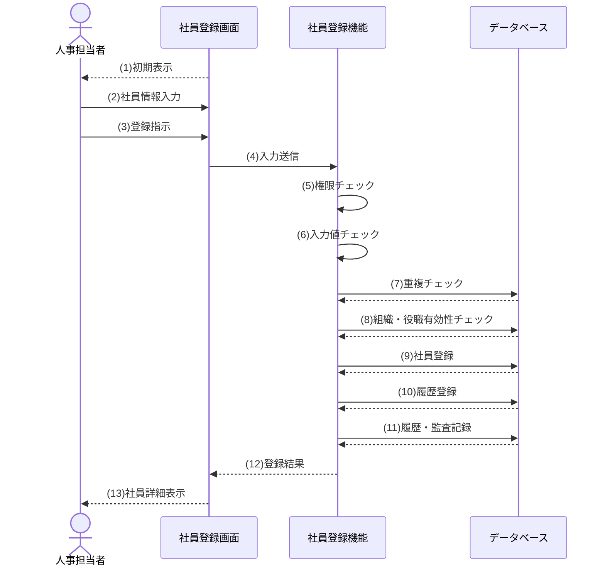

| # | シーケンス | 内容 |
|---|---|---|
| 1 | 初期表示 | 社員登録画面が有効な組織・役職を選択肢とした登録フォームを初期表示する |
| 2 | 社員情報入力 | 人事担当者が社員番号・氏名・メールアドレス・入社日・雇用区分・所属組織・役職などの社員情報を入力する |
| 3 | 登録指示 | 人事担当者が入力内容の登録を指示する |
| 4 | 入力送信 | 入力内容を機能へ送信する |
| 5 | 権限チェック | 実行権限を検証する |
| 6 | 入力値チェック | 入力値の形式・必須項目を検証する |
| 7 | 重複チェック | 社員番号・メールアドレスの重複を検証する |
| 8 | 組織・役職有効性チェック | 組織・役職が入社日時点で有効であることを検証する |
| 9 | 社員登録 | 社員基本情報を在籍中で登録する |
| 10 | 履歴登録 | 初期所属履歴を登録する |
| 11 | 履歴・監査記録 | 変更履歴・監査ログを記録する |
| 12 | 登録結果 | 登録結果を画面へ返す |
| 13 | 社員詳細表示 | 登録された社員詳細を人事担当者へ表示する |

**代替フロー**

| ALT ID | 分岐Step | 条件 | フロー |
|---|---|---|---|
| ALT-1 | 2 | 任意項目（氏名カナ）を入力せずに登録した | 任意項目を未設定として扱い、基本フローの権限チェック以降を継続して登録する |

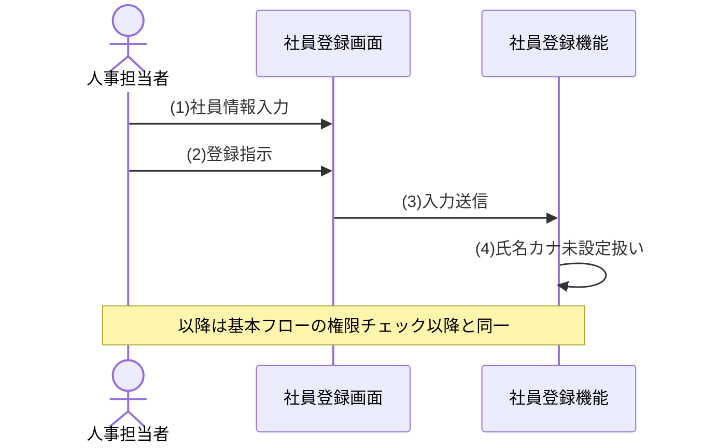

| # | シーケンス | 内容 |
|---|---|---|
| 1 | 社員情報入力 | 人事担当者が氏名カナを入力せず社員情報を入力する |
| 2 | 登録指示 | 人事担当者が入力内容の登録を指示する |
| 3 | 入力送信 | 入力内容を機能へ送信する |
| 4 | 氏名カナ未設定扱い | 氏名カナを未設定として扱う |

**例外フロー**

| EXC ID | 発生Step | 条件 | フロー |
|---|---|---|---|
| EXC-1 | 5 | 実行権限がない | 登録せず処理を中断する |


| # | シーケンス | 内容 |
|---|---|---|
| 1 | 権限チェック | 実行権限を検証する |
| 2 | 権限不足・中断 | 権限不足を画面へ返し処理を中断する |
| 3 | 権限不足表示 | 権限が無い旨を人事担当者へ表示する |

| EXC ID | 発生Step | 条件 | フロー |
|---|---|---|---|
| EXC-2 | 6 | 必須項目の未入力または形式不正 | 対象項目と理由を表示し、登録しない |

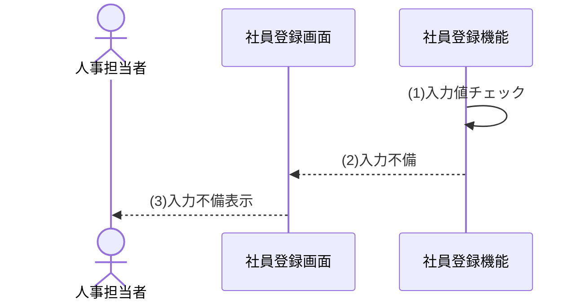

| # | シーケンス | 内容 |
|---|---|---|
| 1 | 入力値チェック | 入力値の形式・必須項目を検証する |
| 2 | 入力不備 | 入力不備の対象項目と理由を画面へ返す |
| 3 | 入力不備表示 | 対象項目と理由を人事担当者へ表示する |

| EXC ID | 発生Step | 条件 | フロー |
|---|---|---|---|
| EXC-3 | 7 | 社員番号が既に登録済み | 重複を表示し、登録しない |

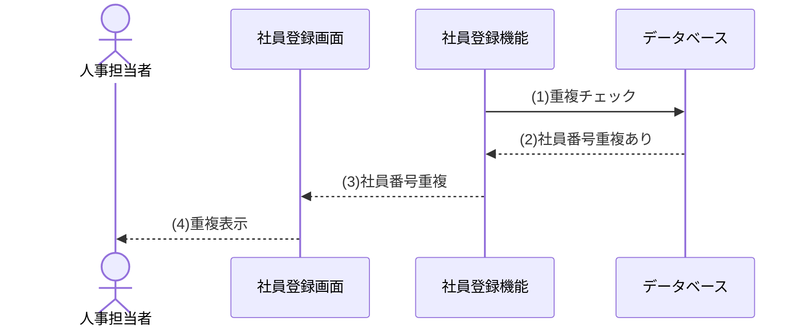

| # | シーケンス | 内容 |
|---|---|---|
| 1 | 重複チェック | 社員番号・メールアドレスの重複を検証する |
| 2 | 社員番号重複あり | 社員番号が既に登録済みであることを機能へ返す |
| 3 | 社員番号重複 | 社員番号の重複を画面へ返す |
| 4 | 重複表示 | 重複項目を人事担当者へ表示する |

| EXC ID | 発生Step | 条件 | フロー |
|---|---|---|---|
| EXC-4 | 7 | メールアドレスが既に登録済み | 重複を表示し、登録しない |

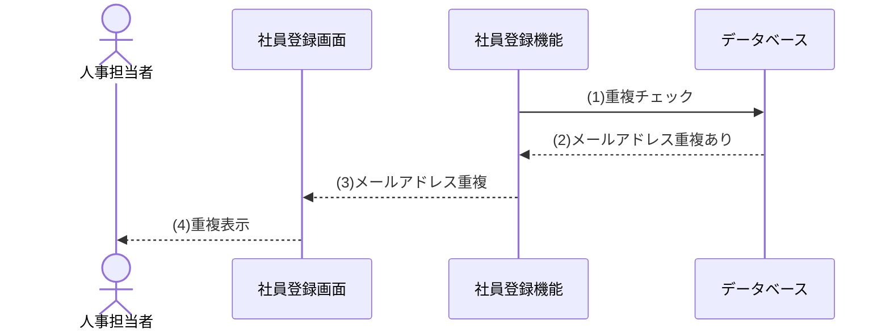

| # | シーケンス | 内容 |
|---|---|---|
| 1 | 重複チェック | 社員番号・メールアドレスの重複を検証する |
| 2 | メールアドレス重複あり | メールアドレスが既に登録済みであることを機能へ返す |
| 3 | メールアドレス重複 | メールアドレスの重複を画面へ返す |
| 4 | 重複表示 | 重複項目を人事担当者へ表示する |

| EXC ID | 発生Step | 条件 | フロー |
|---|---|---|---|
| EXC-5 | 8 | 選択した組織または役職が入社日時点で無効 | 再選択を促し、登録しない |

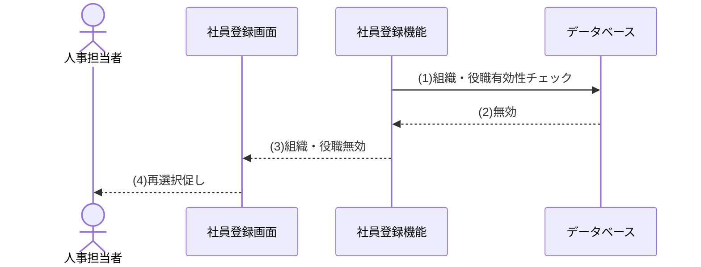

| # | シーケンス | 内容 |
|---|---|---|
| 1 | 組織・役職有効性チェック | 組織・役職が入社日時点で有効であることを検証する |
| 2 | 無効 | 組織・役職が入社日時点で無効であることを機能へ返す |
| 3 | 組織・役職無効 | 組織・役職が入社日に利用できないことを画面へ返す |
| 4 | 再選択促し | 組織・役職の再選択を人事担当者へ促す |

---
### 【UC-002】社員を検索する（全利用者向け）
利用者が条件を指定し、閲覧権限の範囲内で社員を検索して一覧表示する（F-002）。

| 項目 | 内容 |
|---|---|
| 対応機能 | F-002 |
| 主アクター | 全利用者（人事担当者・部門管理者・一般社員・システム管理者） |
| 目的 | 権限範囲内の社員を条件検索する |
| 事前条件 | 認証済みで、有効ロールから閲覧スコープが確定していること |
| 起動契機 | 利用者が検索条件を入力し検索を実行する |
| 正常終了 | 条件と権限に一致する社員一覧を表示する |
| 異常終了 | 検索を実行せず、認証切れ・権限不足を通知する（該当0件・閲覧範囲外の組織指定は0件として通知する） |

**事前条件**

| No | 条件 |
|---|---|
| 1 | 利用者が認証済みであること |
| 2 | 業務日時点で有効なロール（人事担当者・部門管理者・一般社員・システム管理者のいずれか）を1件以上保有していること |
| 3 | 閲覧スコープが有効ロールから確定していること。人事担当者・システム管理者は全社員、部門管理者は業務日時点の主所属組織とその全子孫組織の所属社員（管轄組織配下）、一般社員は操作者に紐づく本人だけとし、複数成立時は本節冒頭の優先順位・和集合の規則で決定する |
| 4 | 検索・表示の認可基準日は業務日であり、任意の過去日指定を受け付けないこと |

**事後条件**

| No | 条件 |
|---|---|
| 1 | 条件と閲覧権限に一致する社員一覧が表示される |
| 2 | 表示項目は全スコープ共通の一覧項目（社員番号、氏名、所属組織、役職、在籍状態）に限定される |

**入力データ**

| 情報 | 要否 | 内容 |
|---|---|---|
| 社員番号 | 任意 | 検索キーの社員番号 |
| 氏名 | 任意 | 姓名を対象とした検索キー |
| 所属組織 | 任意 | 閲覧可能な範囲で業務日時点に利用可能な組織から選択（有効候補の参照は全認証済みロールに許可） |
| 役職 | 任意 | 業務日時点に利用可能な役職から選択（有効候補の参照は全認証済みロールに許可） |
| 在籍状態 | 任意 | 在籍中・退職・すべて |

**出力データ**

| 情報 | 内容 |
|---|---|
| 社員一覧 | 条件・権限に一致する社員の一覧（全スコープ共通に社員番号、氏名、所属組織、役職、在籍状態だけを表示） |
| 該当件数 | 条件に一致した件数 |
| メッセージ | 該当なし・認証切れなどの通知 |

**状態パターン**

| パターンID | 認証状態 | 閲覧権限内の該当 | 結果(事後状態) | 対応フロー |
|---|---|---|---|---|
| SP-1 | 有効 | 該当あり | 権限内の社員一覧を表示 | 基本フロー |
| SP-2 | 有効 | 該当なし（条件不一致・全件権限外・閲覧範囲外の組織指定） | 0件を表示 | ALT-1 |
| SP-3 | 無効（認証切れ） | － | 検索不可 | EXC-1 |
| SP-4 | 有効 | 閲覧スコープ不成立（有効ロールなし） | 検索不可 | EXC-2 |
| SP-5 | 有効 | 閲覧スコープ不成立（主所属なし） | 検索不可 | EXC-3 |
| SP-6 | 有効 | 閲覧スコープ不成立（本人紐付けなし） | 検索不可 | EXC-4 |

**基本フロー**

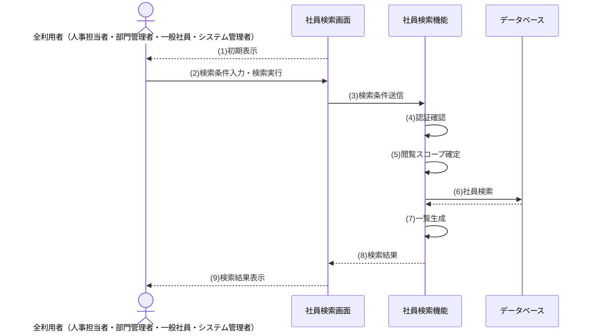

| # | シーケンス | 内容 |
|---|---|---|
| 1 | 初期表示 | 社員検索画面が業務日時点で利用可能な組織・役職を選択肢とした検索フォームを初期表示する |
| 2 | 検索条件入力・検索実行 | 利用者が社員番号・氏名・所属組織・役職・在籍状態などの検索条件を入力し検索を実行する |
| 3 | 検索条件送信 | 検索条件を機能へ送信する |
| 4 | 認証確認 | 認証状態を検証する |
| 5 | 閲覧スコープ確定 | 有効ロールから閲覧可能範囲を確定する |
| 6 | 社員検索 | 検索条件と閲覧条件に一致する社員を検索する |
| 7 | 一覧生成 | 表示可能項目に限定した社員一覧を生成する |
| 8 | 検索結果 | 社員一覧と該当件数を画面へ返す |
| 9 | 検索結果表示 | 社員一覧と該当件数を利用者へ表示する |

**代替フロー**

| ALT ID | 分岐Step | 条件 | フロー |
|---|---|---|---|
| ALT-1 | 6 | 条件・権限に一致する社員が存在しない、または検索条件に閲覧範囲外の組織が指定された | 0件である旨を表示し、一覧を空で返す（閲覧範囲外の組織指定は存在を秘匿して0件として扱う） |

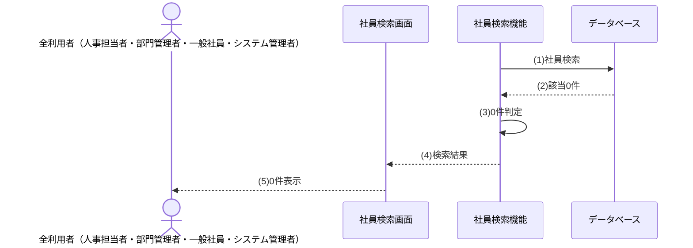

| # | シーケンス | 内容 |
|---|---|---|
| 1 | 社員検索 | 検索条件と閲覧条件に一致する社員を検索する |
| 2 | 該当0件 | 条件・権限に一致する社員が存在しないことを機能へ返す |
| 3 | 0件判定 | 該当社員が存在しないと判定する（閲覧範囲外の組織指定は存在を秘匿し0件として扱う） |
| 4 | 検索結果 | 空の一覧と該当件数0件を画面へ返す |
| 5 | 0件表示 | 該当0件である旨を利用者へ表示する |

**例外フロー**

| EXC ID | 発生Step | 条件 | フロー |
|---|---|---|---|
| EXC-1 | 4 | 認証が無効（認証切れ等） | 検索を実行せず、ログインへ誘導する |

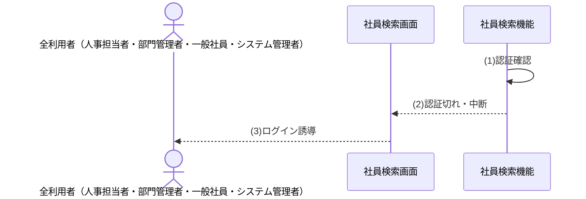

| # | シーケンス | 内容 |
|---|---|---|
| 1 | 認証確認 | 認証状態を検証する |
| 2 | 認証切れ・中断 | 認証切れを画面へ返し検索を実行せず中断する |
| 3 | ログイン誘導 | 認証切れの旨を利用者へ表示しログインへ誘導する |

| EXC ID | 発生Step | 条件 | フロー |
|---|---|---|---|
| EXC-2 | 5 | 業務日時点の有効ロールがない | 検索を実行せず処理を中断する |

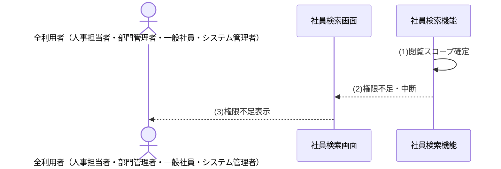

| # | シーケンス | 内容 |
|---|---|---|
| 1 | 閲覧スコープ確定 | 有効ロールから閲覧可能範囲を確定する |
| 2 | 権限不足・中断 | 権限不足を画面へ返し検索を実行せず中断する |
| 3 | 権限不足表示 | 権限が無い旨を利用者へ表示する |

| EXC ID | 発生Step | 条件 | フロー |
|---|---|---|---|
| EXC-3 | 5 | 組織範囲の起点となる主所属が存在しない | 検索を実行せず処理を中断する |


| # | シーケンス | 内容 |
|---|---|---|
| 1 | 閲覧スコープ確定 | 有効ロールから閲覧可能範囲を確定する |
| 2 | 権限不足・中断 | 権限不足を画面へ返し検索を実行せず中断する |
| 3 | 権限不足表示 | 権限が無い旨を利用者へ表示する |

| EXC ID | 発生Step | 条件 | フロー |
|---|---|---|---|
| EXC-4 | 5 | 本人範囲の本人紐付けが存在しない | 検索を実行せず処理を中断する |


| # | シーケンス | 内容 |
|---|---|---|
| 1 | 閲覧スコープ確定 | 有効ロールから閲覧可能範囲を確定する |
| 2 | 権限不足・中断 | 権限不足を画面へ返し検索を実行せず中断する |
| 3 | 権限不足表示 | 権限が無い旨を利用者へ表示する |

---
### 【UC-003】社員を異動する（人事担当者向け）
在籍中の社員の所属・役職を、指定日を基準に履歴として整合的に変更する（F-006）。

| 項目 | 内容 |
|---|---|
| 対応機能 | F-006 |
| 主アクター | 人事担当者 |
| 目的 | 指定日付で社員の所属・役職を変更する |
| 事前条件 | 異動権限を持ち、対象社員が在籍中で、異動先の組織・役職が異動日時点で有効であること。指定上長は在籍中かつ退職予定未登録であること |
| 起動契機 | 人事担当者が社員異動を選択する |
| 正常終了 | 現所属履歴を終了し、新しい所属履歴を登録する |
| 異常終了 | 更新せず、権限不足・退職済み・組織・役職無効・期間重複・過去日の指定を通知する |

**事前条件**

| No | 条件 |
|---|---|
| 1 | 人事担当者（業務日時点で有効な異動権限を保有）として認証済みで、全社員を対象とする異動の権限を保有していること |
| 2 | 対象社員が存在し、在籍中であること |
| 3 | 異動先の組織・役職が異動日時点で有効であり、指定時の上長社員が在籍中かつ退職予定未登録であること。新所属は終了日未指定のため、退職予定がある上長は異動日が退職日前でも指定しない |

**事後条件**

| No | 条件 |
|---|---|
| 1 | 異動日の直前に有効な所属履歴が異動日の前日で終了する |
| 2 | 異動日以降に開始する既存の将来所属予約を取消し、異動日を開始日とする新しい所属履歴が登録される |
| 3 | 異動内容が変更履歴に記録される |
| 4 | 異動操作が監査ログに記録される |

**入力データ**

| 情報 | 要否 | 内容 |
|---|---|---|
| 対象社員 | 必須 | 異動対象の社員 |
| 異動先組織 | 必須 | 有効な組織から選択 |
| 異動先役職 | 必須 | 有効な役職から選択 |
| 異動日（適用開始日） | 必須 | 業務日当日または未来の有効な日付。過去日の遡及異動は本機能の対象外 |
| 上長社員 | 任意 | 異動先の上長 |

**出力データ**

| 情報 | 内容 |
|---|---|
| 異動結果 | 異動の成否 |
| 更新後所属 | 異動後の所属・役職 |
| エラー内容 | 権限不足・退職済み・組織・役職無効・期間重複・異動日不正の理由 |

**状態パターン**

| パターンID | 実行権限 | 対象社員状態 | 組織・役職有効性 | 期間整合性 | 異動日区分 | 結果(事後状態) | 対応フロー |
|---|---|---|---|---|---|---|---|
| SP-1 | あり | 在籍中 | 有効 | 整合 | 当日 | 所属履歴を更新 | 基本フロー |
| SP-2 | あり | 在籍中 | 有効 | 整合 | 未来日付 | 将来の所属履歴として登録 | ALT-1 |
| SP-3 | なし | － | － | － | － | 未更新 | EXC-1 |
| SP-4 | あり | 退職済み／存在しない | － | － | － | 未更新 | EXC-2 |
| SP-5 | あり | 在籍中 | 無効 | － | － | 未更新 | EXC-3 |
| SP-6 | あり | 在籍中 | 有効 | 重複あり | － | 未更新 | EXC-4 |
| SP-7 | あり | 在籍中 | － | － | 範囲外 | 未更新 | EXC-5 |

**基本フロー**

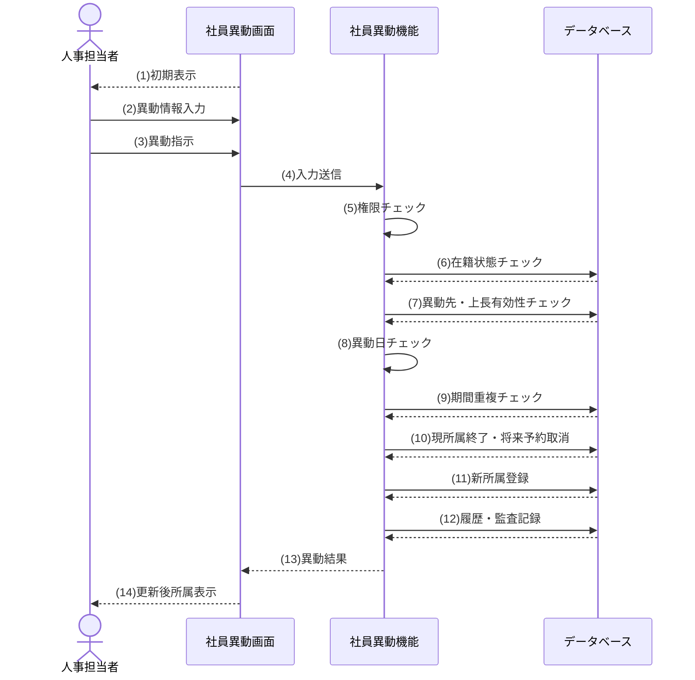

| # | シーケンス | 内容 |
|---|---|---|
| 1 | 初期表示 | 社員異動画面が有効な異動先組織・役職を選択肢とした異動フォームを初期表示する |
| 2 | 異動情報入力 | 人事担当者が対象社員・異動先組織・異動先役職・異動日・上長社員などの異動情報を入力する |
| 3 | 異動指示 | 人事担当者が入力内容の異動を指示する |
| 4 | 入力送信 | 入力内容を機能へ送信する |
| 5 | 権限チェック | 実行権限を検証する |
| 6 | 在籍状態チェック | 対象社員が在籍中であることを検証する |
| 7 | 異動先・上長有効性チェック | 異動先の組織・役職が異動日時点で有効であり、指定上長が在籍中かつ退職予定未登録であることを検証する |
| 8 | 異動日チェック | 異動日が業務日以降かつ対象社員の在籍期間内であることを検証する |
| 9 | 期間重複チェック | 所属履歴の期間重複を検証する |
| 10 | 現所属終了・将来予約取消 | 異動日直前に有効な所属を前日で終了し、異動日以降の将来所属予約を取消す |
| 11 | 新所属登録 | 異動日を開始日とする新所属履歴を登録する |
| 12 | 履歴・監査記録 | 変更履歴・監査ログを記録する |
| 13 | 異動結果 | 異動結果を画面へ返す |
| 14 | 更新後所属表示 | 更新後の所属を人事担当者へ表示する |

**代替フロー**

| ALT ID | 分岐Step | 条件 | フロー |
|---|---|---|---|
| ALT-1 | 8 | 異動日が未来日付である | 異動日直前の所属を前日で終了予約し、異動日以降の既存将来予約を取消して、新所属を将来の適用開始日で登録する |

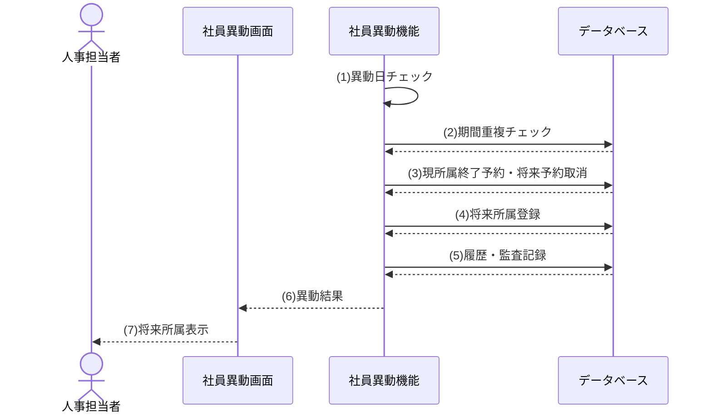

| # | シーケンス | 内容 |
|---|---|---|
| 1 | 異動日チェック | 異動日が業務日以降の未来日付かつ対象社員の在籍期間内であることを検証する |
| 2 | 期間重複チェック | 所属履歴の期間重複を検証する |
| 3 | 現所属終了予約・将来予約取消 | 異動日直前に有効な所属を前日で終了予約し、異動日以降の既存将来予約を取消す |
| 4 | 将来所属登録 | 異動日を適用開始日とする将来の所属履歴を登録する |
| 5 | 履歴・監査記録 | 変更履歴・監査ログを記録する |
| 6 | 異動結果 | 異動結果を画面へ返す |
| 7 | 将来所属表示 | 将来の所属履歴として登録された内容を人事担当者へ表示する |

**例外フロー**

| EXC ID | 発生Step | 条件 | フロー |
|---|---|---|---|
| EXC-1 | 5 | 実行権限がない | 更新せず処理を中断する |

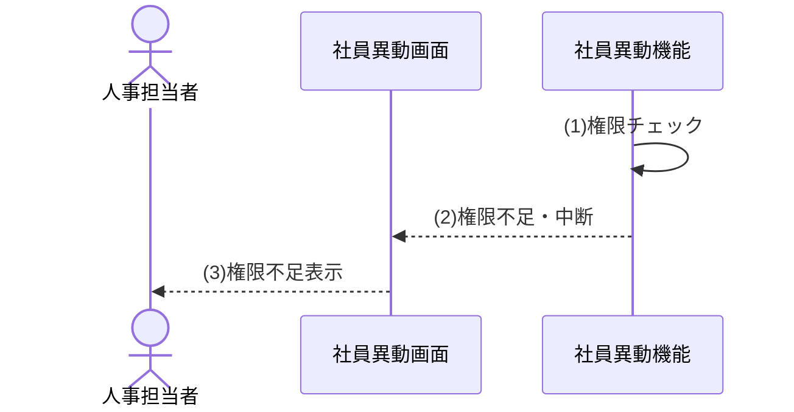

| # | シーケンス | 内容 |
|---|---|---|
| 1 | 権限チェック | 実行権限を検証する |
| 2 | 権限不足・中断 | 権限不足を画面へ返し処理を中断する |
| 3 | 権限不足表示 | 権限が無い旨を人事担当者へ表示する |

| EXC ID | 発生Step | 条件 | フロー |
|---|---|---|---|
| EXC-2 | 6 | 対象社員が退職済み（または存在しない） | 更新しない |

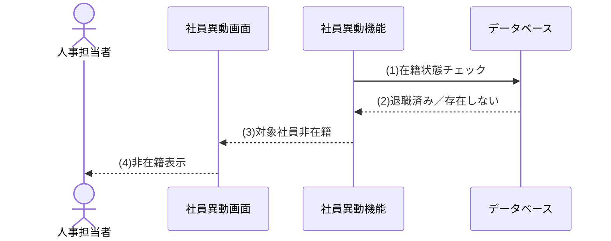

| # | シーケンス | 内容 |
|---|---|---|
| 1 | 在籍状態チェック | 対象社員が在籍中であることを検証する |
| 2 | 退職済み／存在しない | 対象社員が退職済みまたは存在しないことを機能へ返す |
| 3 | 対象社員非在籍 | 対象社員が在籍していないことを画面へ返す |
| 4 | 非在籍表示 | 対象社員が在籍していないため異動できない旨を人事担当者へ表示する |

| EXC ID | 発生Step | 条件 | フロー |
|---|---|---|---|
| EXC-3 | 7 | 異動先の組織・役職が異動日時点で無効、または指定上長が不存在・本人・非在籍・退職予定登録済み | 再選択を促し、更新しない |

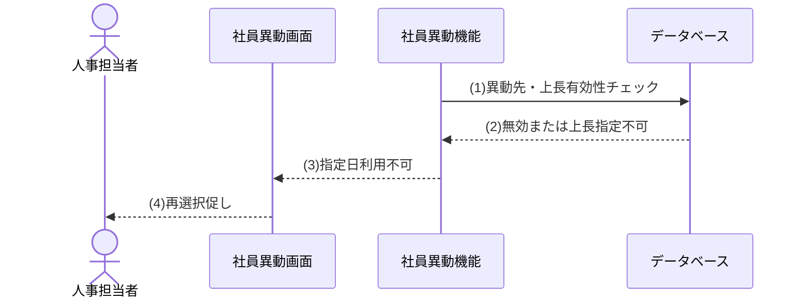

| # | シーケンス | 内容 |
|---|---|---|
| 1 | 異動先・上長有効性チェック | 異動先の組織・役職が異動日時点で有効であり、指定上長が在籍中かつ退職予定未登録であることを検証する |
| 2 | 無効または上長指定不可 | 組織・役職が異動日時点で無効、または上長が不存在・本人・非在籍・退職予定登録済みであることを機能へ返す |
| 3 | 指定日利用不可 | 指定日に利用できない組織・役職・上長を画面へ返す |
| 4 | 再選択促し | 指定日に利用できない項目の再選択を人事担当者へ促す |

| EXC ID | 発生Step | 条件 | フロー |
|---|---|---|---|
| EXC-4 | 9 | 所属履歴の有効期間が重複する | 更新しない |

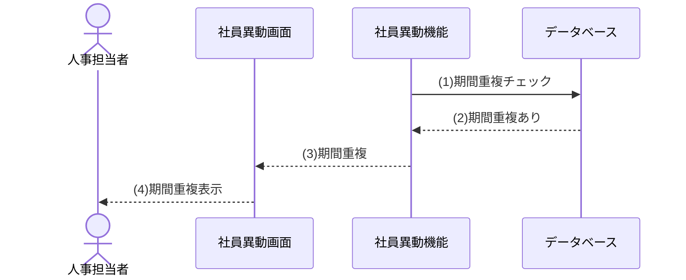

| # | シーケンス | 内容 |
|---|---|---|
| 1 | 期間重複チェック | 所属履歴の期間重複を検証する |
| 2 | 期間重複あり | 指定した異動日が既存の所属期間と重複することを機能へ返す |
| 3 | 期間重複 | 既存の所属期間との重複を画面へ返す |
| 4 | 期間重複表示 | 指定した異動日が既存の所属期間と重複することを人事担当者へ表示する |

| EXC ID | 発生Step | 条件 | フロー |
|---|---|---|---|
| EXC-5 | 8 | 異動日が有効範囲外（業務日より前、対象社員の入社日より前、または退職予定日より後） | 更新しない。遡及訂正は別途データ訂正手続で扱う |

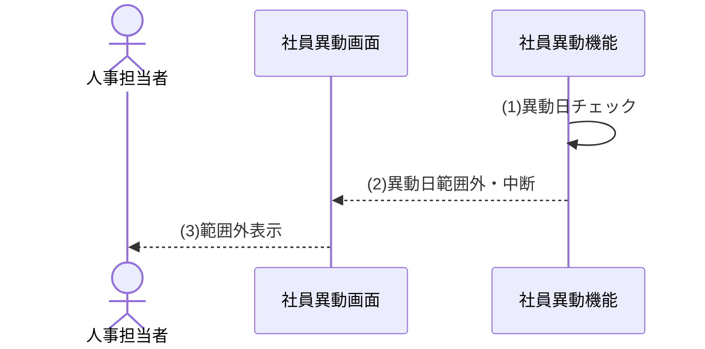

| # | シーケンス | 内容 |
|---|---|---|
| 1 | 異動日チェック | 異動日が業務日以降かつ対象社員の在籍期間内であることを検証する |
| 2 | 異動日範囲外・中断 | 異動日が業務日より前・入社日より前・退職予定日より後のいずれかで範囲外であることを画面へ返し処理を中断する |
| 3 | 範囲外表示 | 異動日が登録できないことと指定可能な範囲を人事担当者へ表示する |

---
### 【UC-004】社員を退職にする（人事担当者向け）
在籍中の社員に退職日を登録し、当日以前は即時退職、未来日は退職予定として受け付ける（F-007）。未来日の到来自動反映はUC-014を正本とする。

| 項目 | 内容 |
|---|---|
| 対応機能 | F-007 |
| 主アクター | 人事担当者 |
| 目的 | 退職日を登録して社員状態を退職へ変更する |
| 事前条件 | 退職処理権限を持ち、対象社員が在籍中であること |
| 起動契機 | 人事担当者が退職処理を選択する |
| 正常終了 | 当日以前は退職状態・所属履歴終了を反映し、未来日は在籍状態を維持して退職予定を登録する |
| 異常終了 | 更新せず、権限不足・退職済み・不正な退職日を通知する |

**事前条件**

| No | 条件 |
|---|---|
| 1 | 人事担当者として、全社員を対象とする退職処理の権限を保有していること |
| 2 | 対象社員が存在し、在籍中であること |
| 3 | 対象社員を上長とする所属が退職日当日以後も有効となる場合、先にその部下の上長変更を完了していること |

**事後条件**

| No | 条件 |
|---|---|
| 1 | 退職日が当日以前の場合、社員状態が退職に変更される |
| 2 | 退職日が未来日の場合、社員状態と現所属を維持したまま退職予定が登録される |
| 3 | 退職日の到来時に有効な所属履歴が終了し、退職日より後に開始する将来所属予約が取消される |
| 4 | 退職予定の登録および退職確定が変更履歴・監査ログに記録される |
| 5 | 退職日到来以後は新規ログインが拒否される |

**入力データ**

| 情報 | 要否 | 内容 |
|---|---|---|
| 対象社員 | 必須 | 退職対象の社員 |
| 退職日 | 必須 | 有効な日付（入社日以降） |
| 退職区分 | 任意 | §2.4の退職区分から選択。未指定も許容する |

**出力データ**

| 情報 | 内容 |
|---|---|
| 退職結果 | 退職処理の成否 |
| 更新後状態 | 退職状態・退職日 |
| エラー内容 | 権限不足・退職済み・不正な退職日の理由 |

**状態パターン**

| パターンID | 実行権限 | 対象社員状態 | 退職日妥当性 | 退職日区分 | 結果(事後状態) | 対応フロー |
|---|---|---|---|---|---|---|
| SP-1 | あり | 在籍中 | 妥当 | 当日以前 | 退職状態で更新 | 基本フロー |
| SP-2 | あり | 在籍中 | 妥当 | 未来日付 | 退職予約として登録 | ALT-1 |
| SP-3 | なし | － | － | － | 未更新 | EXC-1 |
| SP-4 | あり | 退職済み／存在しない | － | － | 未更新 | EXC-2 |
| SP-5 | あり | 在籍中 | 不正（入社日より前等） | － | 未更新 | EXC-3 |

**基本フロー**

```mermaid
sequenceDiagram
    actor U as 人事担当者
    participant SCR as 退職処理画面
    participant FUNC as 退職処理機能
    participant DB as データベース
    SCR-->>U: (1)初期表示
    U->>SCR: (2)退職日入力
    U->>SCR: (3)退職処理指示
    SCR->>FUNC: (4)入力送信
    FUNC->>FUNC: (5)権限チェック
    FUNC->>DB: (6)在籍状態確認
    DB-->>FUNC: 
    FUNC->>DB: (7)退職日・上長割当チェック
    DB-->>FUNC: 
    FUNC->>FUNC: (8)退職日区分判定
    FUNC->>DB: (9)退職状態更新
    DB-->>FUNC: 
    FUNC->>DB: (10)所属履歴終了・予約取消
    DB-->>FUNC: 
    FUNC->>DB: (11)履歴・監査記録
    DB-->>FUNC: 
    FUNC-->>SCR: (12)退職結果
    SCR-->>U: (13)更新後状態表示
```

| # | シーケンス | 内容 |
|---|---|---|
| 1 | 初期表示 | 退職処理画面が対象社員の情報と退職日入力欄を初期表示する |
| 2 | 退職日入力 | 人事担当者が退職日（と任意の退職区分）を入力する |
| 3 | 退職処理指示 | 人事担当者が退職処理を指示する |
| 4 | 入力送信 | 入力内容を機能へ送信する |
| 5 | 権限チェック | 実行権限を検証する |
| 6 | 在籍状態確認 | 対象社員が在籍中であることを検証する |
| 7 | 退職日・上長割当チェック | 退職日が入社日以降で妥当であり、対象社員を上長とする退職日当日以後の所属参照がないことを検証する |
| 8 | 退職日区分判定 | 退職日が当日以前か未来日付かを判定する |
| 9 | 退職状態更新 | 社員状態を退職に変更し退職日を登録する |
| 10 | 所属履歴終了・予約取消 | 退職日に有効な所属履歴を終了し、退職日より後の将来所属予約を取消す |
| 11 | 履歴・監査記録 | 変更履歴・監査ログを記録する |
| 12 | 退職結果 | 退職結果と更新後の状態を画面へ返す |
| 13 | 更新後状態表示 | 更新後の状態を人事担当者へ表示する |

**代替フロー**

| ALT ID | 分岐Step | 条件 | フロー |
|---|---|---|---|
| ALT-1 | 8 | 退職日が未来日付である | 退職日・退職区分を退職予定として登録し、社員状態と現所属は変更しない。退職日到来後の反映はUC-014へ委ねる |

```mermaid
sequenceDiagram
    actor U as 人事担当者
    participant SCR as 退職処理画面
    participant FUNC as 退職処理機能
    participant DB as データベース
    FUNC->>FUNC: (1)退職日区分判定
    FUNC->>DB: (2)退職予定登録
    DB-->>FUNC: 
    FUNC->>DB: (3)履歴・監査記録
    DB-->>FUNC: 
    FUNC-->>SCR: (4)退職予定登録結果
    SCR-->>U: (5)退職予定表示
```

| # | シーケンス | 内容 |
|---|---|---|
| 1 | 退職日区分判定 | 退職日が未来日付であると判定する |
| 2 | 退職予定登録 | 退職日・退職区分を退職予定として登録する |
| 3 | 履歴・監査記録 | 退職予定の登録を変更履歴・監査ログに記録する |
| 4 | 退職予定登録結果 | 退職予定の登録結果を画面へ返す |
| 5 | 退職予定表示 | 退職予定として登録された状態を人事担当者へ表示する |

**例外フロー**

| EXC ID | 発生Step | 条件 | フロー |
|---|---|---|---|
| EXC-1 | 5 | 実行権限がない | 更新せず処理を中断する |

```mermaid
sequenceDiagram
    actor U as 人事担当者
    participant SCR as 退職処理画面
    participant FUNC as 退職処理機能
    FUNC->>FUNC: (1)権限チェック
    FUNC-->>SCR: (2)権限不足・中断
    SCR-->>U: (3)権限不足表示
```

| # | シーケンス | 内容 |
|---|---|---|
| 1 | 権限チェック | 実行権限を検証する |
| 2 | 権限不足・中断 | 権限不足を画面へ返し処理を中断する |
| 3 | 権限不足表示 | 権限が無い旨を人事担当者へ表示する |

| EXC ID | 発生Step | 条件 | フロー |
|---|---|---|---|
| EXC-2 | 6 | 対象社員が既に退職済み（または存在しない） | 更新しない |

```mermaid
sequenceDiagram
    actor U as 人事担当者
    participant SCR as 退職処理画面
    participant FUNC as 退職処理機能
    participant DB as データベース
    FUNC->>DB: (1)在籍状態確認
    DB-->>FUNC: (2)退職済み（または存在しない）
    FUNC-->>SCR: (3)退職済み通知
    SCR-->>U: (4)退職済み表示
```

| # | シーケンス | 内容 |
|---|---|---|
| 1 | 在籍状態確認 | 対象社員が在籍中であることを検証する |
| 2 | 退職済み（または存在しない） | 対象社員が退職済みまたは存在しないことを機能へ返す |
| 3 | 退職済み通知 | 対象社員が退職済みである旨を画面へ返す |
| 4 | 退職済み表示 | 対象社員が退職済みである旨を人事担当者へ表示する |

| EXC ID | 発生Step | 条件 | フロー |
|---|---|---|---|
| EXC-3 | 7 | 退職日が不正（入社日より前等）、または対象社員を上長とする所属が退職日当日以後も有効 | 更新しない |

```mermaid
sequenceDiagram
    actor U as 人事担当者
    participant SCR as 退職処理画面
    participant FUNC as 退職処理機能
    participant DB as データベース
    FUNC->>DB: (1)退職日・上長割当チェック
    DB-->>FUNC: (2)退職日不正または上長割当残存
    FUNC-->>SCR: (3)退職日・上長割当不正
    SCR-->>U: (4)退職日・上長割当不正表示
```

| # | シーケンス | 内容 |
|---|---|---|
| 1 | 退職日・上長割当チェック | 退職日が入社日以降で妥当であり、対象社員を上長とする退職日当日以後の所属参照がないことを検証する |
| 2 | 退職日不正または上長割当残存 | 退職日が不正、または退職日当日以後も有効な上長割当が残ることを機能へ返す |
| 3 | 退職日・上長割当不正 | 退職日または上長割当の不正を画面へ返す |
| 4 | 退職日・上長割当不正表示 | 退職日または上長割当の不正と、先に上長変更が必要である旨を人事担当者へ表示する |

---
### 【UC-005】ログインする（全利用者向け）
全利用者が社内認証基盤による認証を経て、システムへログインし、ログイン状態を確立する（F-001）。

| 項目 | 内容 |
|---|---|
| 対応機能 | F-001 |
| 主アクター | 全利用者（人事担当者・部門管理者・一般社員・システム管理者） |
| 目的 | 社内認証基盤で認証し、システムを利用可能な状態にする |
| 事前条件 | 利用者アカウントが登録済みで、ログイン画面を表示していること |
| 起動契機 | 利用者が認証情報を入力しログインを実行する |
| 正常終了 | 認証に成功し、ログイン状態となってログイン後の画面へ遷移する |
| 異常終了 | ログインさせず、認証情報の誤り・アカウント無効/ロックによるログイン不可を通知する |

**事前条件**

| No | 条件 |
|---|---|
| 1 | 利用者アカウントがシステムに登録されていること |
| 2 | 社内認証基盤が利用可能であること |

**事後条件**

| No | 条件 |
|---|---|
| 1 | 認証に成功した利用者がログイン状態となる |
| 2 | 業務日時点で有効な利用者ロールの集合が確定し、以後の権限判定に用いられる。複数ロール保有時の操作権限・項目許可は各ロールの和集合となる。業務日時点で有効なロールが1件もない利用者はログインを拒否する（SP-5・EXC-4） |
| 3 | ログイン操作が監査ログに記録される |

**入力データ**

| 情報 | 要否 | 内容 |
|---|---|---|
| ログインID | 必須 | 認証に用いる利用者の識別子 |
| 認証情報 | 必須 | 社内認証基盤で検証するパスワード等の認証情報 |

**出力データ**

| 情報 | 内容 |
|---|---|
| ログイン結果 | 認証の成否 |
| ログイン状態 | 確立されたログイン状態（成功時） |
| エラー内容 | 認証情報の誤り・アカウント無効/ロックの理由 |

**状態パターン**

| パターンID | 認証情報 | アカウント状態 | 結果(事後状態) | 対応フロー |
|---|---|---|---|---|
| SP-1 | 正しい | 有効 | ログイン成功（ログイン状態確立） | 基本フロー |
| SP-2 | 誤り | － | ログイン失敗 | EXC-1 |
| SP-3 | 正しい | 無効・ロック | ログイン不可 | EXC-2 |
| SP-4 | 正しい | 退職日到来済み | ログイン不可 | EXC-3 |
| SP-5 | 正しい | 有効ロール0件 | ログイン不可 | EXC-4 |

**基本フロー**

```mermaid
sequenceDiagram
    actor U as 全利用者
    participant SCR as ログイン画面
    participant FUNC as ログイン機能
    participant DB as データベース
    SCR-->>U: (1)初期表示
    U->>SCR: (2)認証情報入力
    U->>SCR: (3)ログイン実行
    SCR->>FUNC: (4)ログイン要求
    FUNC->>FUNC: (5)認証要求
    FUNC->>FUNC: (6)認証確認
    FUNC->>DB: (7)アカウント有効性チェック
    DB-->>FUNC: 
    FUNC->>DB: (8)ログイン監査記録
    DB-->>FUNC: 
    FUNC->>FUNC: (9)ログイン状態確立
    FUNC-->>SCR: (10)ログイン結果
    SCR-->>U: (11)トップ画面表示
```

| # | シーケンス | 内容 |
|---|---|---|
| 1 | 初期表示 | ログイン画面が認証情報の入力フォームを初期表示する |
| 2 | 認証情報入力 | 利用者がログインID・認証情報を入力する |
| 3 | ログイン実行 | 利用者がログインを実行する |
| 4 | ログイン要求 | 入力内容を機能へ送信しログインを要求する |
| 5 | 認証要求 | 社内認証基盤へ認証を要求し認証結果を受け取る |
| 6 | 認証確認 | 認証結果を検証する |
| 7 | アカウント有効性チェック | アカウントの有効性・退職日未到来・有効ロール1件以上を検証する |
| 8 | ログイン監査記録 | ログイン成功操作を監査ログに記録する |
| 9 | ログイン状態確立 | 利用者をログイン状態にする |
| 10 | ログイン結果 | ログイン成功を画面へ返す |
| 11 | トップ画面表示 | ログイン後のトップ画面を利用者へ表示する |

**代替フロー**

代替フローなし

**例外フロー**

| EXC ID | 発生Step | 条件 | フロー |
|---|---|---|---|
| EXC-1 | 6 | 認証情報が誤っている | ログインさせず、再入力を促す |

```mermaid
sequenceDiagram
    actor U as 全利用者
    participant SCR as ログイン画面
    participant FUNC as ログイン機能
    FUNC->>FUNC: (1)認証確認
    FUNC-->>SCR: (2)認証情報誤り
    SCR-->>U: (3)認証情報誤り表示
```

| # | シーケンス | 内容 |
|---|---|---|
| 1 | 認証確認 | 認証結果を検証する |
| 2 | 認証情報誤り | 認証情報の誤りを画面へ返す |
| 3 | 認証情報誤り表示 | 認証情報の誤りを利用者へ表示し再入力を促す |

| EXC ID | 発生Step | 条件 | フロー |
|---|---|---|---|
| EXC-2 | 7 | アカウントが無効・ロックされている | ログインさせず処理を中断する |

```mermaid
sequenceDiagram
    actor U as 全利用者
    participant SCR as ログイン画面
    participant FUNC as ログイン機能
    participant DB as データベース
    FUNC->>DB: (1)アカウント有効性チェック
    DB-->>FUNC: (2)無効・ロック
    FUNC-->>SCR: (3)アカウント利用不可
    SCR-->>U: (4)アカウント利用不可表示
```

| # | シーケンス | 内容 |
|---|---|---|
| 1 | アカウント有効性チェック | アカウントの有効性・退職日未到来・有効ロール1件以上を検証する |
| 2 | 無効・ロック | アカウントが無効またはロックされていることを機能へ返す |
| 3 | アカウント利用不可 | アカウントが利用できない旨を画面へ返す |
| 4 | アカウント利用不可表示 | アカウントが利用できない旨と管理者への問い合わせを利用者へ表示する |

| EXC ID | 発生Step | 条件 | フロー |
|---|---|---|---|
| EXC-3 | 7 | 紐づく社員の退職日が到来済み | ログインさせず処理を中断する |

```mermaid
sequenceDiagram
    actor U as 全利用者
    participant SCR as ログイン画面
    participant FUNC as ログイン機能
    participant DB as データベース
    FUNC->>DB: (1)アカウント有効性チェック
    DB-->>FUNC: (2)退職日到来済み
    FUNC-->>SCR: (3)アカウント利用不可
    SCR-->>U: (4)アカウント利用不可表示
```

| # | シーケンス | 内容 |
|---|---|---|
| 1 | アカウント有効性チェック | アカウントの有効性・退職日未到来・有効ロール1件以上を検証する |
| 2 | 退職日到来済み | 紐づく社員の退職日が業務日時点で到来済みであることを機能へ返す |
| 3 | アカウント利用不可 | アカウントが利用できない旨を画面へ返す |
| 4 | アカウント利用不可表示 | アカウントが利用できない旨と管理者への問い合わせを利用者へ表示する |

| EXC ID | 発生Step | 条件 | フロー |
|---|---|---|---|
| EXC-4 | 7 | 業務日時点で有効な利用者ロールが0件 | ログインさせず処理を中断する |

```mermaid
sequenceDiagram
    actor U as 全利用者
    participant SCR as ログイン画面
    participant FUNC as ログイン機能
    participant DB as データベース
    FUNC->>DB: (1)アカウント有効性チェック
    DB-->>FUNC: (2)有効ロール0件
    FUNC-->>SCR: (3)アカウント利用不可
    SCR-->>U: (4)アカウント利用不可表示
```

| # | シーケンス | 内容 |
|---|---|---|
| 1 | アカウント有効性チェック | アカウントの有効性・退職日未到来・有効ロール1件以上を検証する |
| 2 | 有効ロール0件 | 業務日時点で有効な利用者ロールが1件も存在しないことを機能へ返す |
| 3 | アカウント利用不可 | アカウントが利用できない旨を画面へ返す |
| 4 | アカウント利用不可表示 | アカウントが利用できない旨と管理者への問い合わせを利用者へ表示する |

---
### 【UC-006】社員詳細を参照する（全利用者向け）
利用者が選択した社員の基本情報・所属・役職・在籍状態を、閲覧権限の範囲内で参照する（F-003）。

| 項目 | 内容 |
|---|---|
| 対応機能 | F-003 |
| 主アクター | 全利用者（人事担当者・部門管理者・一般社員・システム管理者） |
| 目的 | 対象社員の詳細情報を権限範囲内で参照する |
| 事前条件 | 認証済みで閲覧スコープが確定し、参照対象の社員が特定されていること |
| 起動契機 | 利用者が一覧等から社員を選択し詳細参照を実行する |
| 正常終了 | 権限に応じた項目で社員詳細を表示する |
| 異常終了 | 参照させず、対象不存在・閲覧権限なしを通知する |

**事前条件**

| No | 条件 |
|---|---|
| 1 | 利用者が認証済みであること |
| 2 | 参照対象の社員が特定されていること |
| 3 | 閲覧スコープが利用者の権限から確定していること。人事担当者・システム管理者は全社員、部門管理者は業務日時点の主所属組織とその全子孫組織の所属社員、一般社員は操作者に紐づく本人だけとし、複数成立時は本節冒頭の優先順位・和集合の規則で決定する |
| 4 | 詳細参照の認可基準日は業務日であり、任意の過去日指定を受け付けないこと |

**事後条件**

| No | 条件 |
|---|---|
| 1 | 対象社員の基本情報・所属・役職・在籍状態が表示される |
| 2 | 表示項目は権限・閲覧スコープ別の許可項目に限定される |

**入力データ**

| 情報 | 要否 | 内容 |
|---|---|---|
| 対象社員 | 必須 | 参照対象の社員 |

**出力データ**

| 情報 | 内容 |
|---|---|
| 社員詳細（全社員・本人） | 人事担当者・システム管理者と本人を参照する一般社員には基本情報・所属・役職・在籍状態の全項目を表示する |
| 社員詳細（管轄組織配下） | 部門管理者には社員番号、氏名、所属組織、役職、上長、在籍状態だけを表示し、氏名カナ、メールアドレス、電話番号、入社日、退職日、退職区分、雇用区分その他の個人・人事情報を含めない |
| メッセージ | 対象不存在・閲覧権限なしなどの通知 |

**状態パターン**

| パターンID | 対象社員存在 | 閲覧権限 | 結果(事後状態) | 対応フロー |
|---|---|---|---|---|
| SP-1 | 存在 | 範囲内 | 権限に応じた項目で詳細表示 | 基本フロー |
| SP-2 | 存在しない | － | 参照不可 | EXC-1 |
| SP-3 | 存在 | 範囲外 | 参照不可 | EXC-2 |

**基本フロー**

```mermaid
sequenceDiagram
    actor U as 全利用者（人事担当者・部門管理者・一般社員・システム管理者）
    participant SCR as 社員詳細画面
    participant FUNC as 社員詳細参照機能
    participant DB as データベース
    SCR-->>U: (1)初期表示
    U->>SCR: (2)対象社員選択・詳細参照
    SCR->>FUNC: (3)参照要求
    FUNC->>DB: (4)対象社員存在確認
    DB-->>FUNC: 
    FUNC->>FUNC: (5)閲覧権限チェック
    FUNC->>DB: (6)社員詳細取得
    DB-->>FUNC: 
    FUNC-->>SCR: (7)社員詳細
    SCR-->>U: (8)社員詳細表示
```

| # | シーケンス | 内容 |
|---|---|---|
| 1 | 初期表示 | 社員詳細画面が参照対象を選択して詳細参照できる状態で初期表示する |
| 2 | 対象社員選択・詳細参照 | 利用者が対象社員を選択し詳細参照を実行する |
| 3 | 参照要求 | 参照要求を機能へ送信する |
| 4 | 対象社員存在確認 | 対象社員が存在することを確認する |
| 5 | 閲覧権限チェック | 利用者の閲覧権限（範囲）を検証する |
| 6 | 社員詳細取得 | 権限に応じた表示可能項目で社員詳細を取得する |
| 7 | 社員詳細 | 社員詳細を画面へ返す |
| 8 | 社員詳細表示 | 基本情報・所属・役職・在籍状態を利用者へ表示する |

**代替フロー**

代替フローなし

**例外フロー**

| EXC ID | 発生Step | 条件 | フロー |
|---|---|---|---|
| EXC-1 | 4 | 対象社員が存在しない | 参照させず、一覧へ戻す |

```mermaid
sequenceDiagram
    actor U as 全利用者（人事担当者・部門管理者・一般社員・システム管理者）
    participant SCR as 社員詳細画面
    participant FUNC as 社員詳細参照機能
    participant DB as データベース
    FUNC->>DB: (1)対象社員存在確認
    DB-->>FUNC: (2)該当なし
    FUNC-->>SCR: (3)対象不存在
    SCR-->>U: (4)対象不存在表示
```

| # | シーケンス | 内容 |
|---|---|---|
| 1 | 対象社員存在確認 | 対象社員が存在することを確認する |
| 2 | 該当なし | 対象社員が存在しないことを機能へ返す |
| 3 | 対象不存在 | 対象社員が存在しないことを画面へ返す |
| 4 | 対象不存在表示 | 対象が見つからない旨を利用者へ表示し一覧へ戻す |

| EXC ID | 発生Step | 条件 | フロー |
|---|---|---|---|
| EXC-2 | 5 | 対象社員の閲覧権限がない（閲覧スコープの範囲外。有効な権限なし・主所属なし・本人紐付けなしにより許可範囲が確定しない場合を含む） | 参照させず処理を中断する |

```mermaid
sequenceDiagram
    actor U as 全利用者（人事担当者・部門管理者・一般社員・システム管理者）
    participant SCR as 社員詳細画面
    participant FUNC as 社員詳細参照機能
    FUNC->>FUNC: (1)閲覧権限チェック
    FUNC-->>SCR: (2)閲覧権限なし・中断
    SCR-->>U: (3)権限不足表示
```

| # | シーケンス | 内容 |
|---|---|---|
| 1 | 閲覧権限チェック | 利用者の閲覧権限（範囲）を検証する |
| 2 | 閲覧権限なし・中断 | 閲覧権限がないことを画面へ返し処理を中断する |
| 3 | 権限不足表示 | 参照権限がない旨を利用者へ表示する |

---
### 【UC-007】社員基本情報を更新する（人事担当者・一般社員（本人）向け）
人事担当者（一部項目は本人）が社員の氏名・連絡先などの基本情報を、一意性を確認したうえで更新する（F-005）。

| 項目 | 内容 |
|---|---|
| 対応機能 | F-005 |
| 主アクター | 人事担当者・一般社員（本人） |
| 目的 | 社員の氏名・連絡先などの基本情報を更新する |
| 事前条件 | 更新権限を持ち、対象社員が存在し、更新前の社員基本情報を取得済みであること |
| 起動契機 | 人事担当者（または本人）が社員基本情報の更新を指示する |
| 正常終了 | 検証を経て社員基本情報が更新され、変更履歴・監査ログが記録される |
| 異常終了 | 更新せず、権限不足・入力不備・メール重複を通知する |

**事前条件**

| No | 条件 |
|---|---|
| 1 | 人事担当者または対象社員本人として、業務日時点で有効なロールで認証済みであること |
| 2 | 対象社員が存在すること |
| 3 | 更新対象が許可範囲内であること（人事担当者は全社員、一般社員は本人の社員情報だけ） |
| 4 | 更新前の社員基本情報を取得していること |

**事後条件**

| No | 条件 |
|---|---|
| 1 | 社員基本情報が更新される |
| 2 | 更新内容が変更履歴に記録される |
| 3 | 更新操作が監査ログに記録される |

**入力データ**

| 情報 | 要否 | 内容 |
|---|---|---|
| 対象社員 | 必須 | 更新対象の社員 |
| 氏名（姓・名） | 任意 | 更新後の氏名（人事担当者だけが更新可能） |
| 氏名カナ（姓・名） | 任意 | 更新後の氏名カナ（人事担当者だけが更新可能） |
| メールアドレス | 任意 | 所定形式かつ一意（人事担当者と本人が更新可能） |
| 連絡先 | 任意 | 電話番号（人事担当者と本人が更新可能） |
| 雇用区分 | 任意 | 人事担当者だけが雇用区分を変更可能 |

**出力データ**

| 情報 | 内容 |
|---|---|
| 更新結果 | 更新の成否 |
| 更新後社員情報 | 更新後の基本情報 |
| エラー内容 | 権限不足・入力不備・メール重複の理由 |

**状態パターン**

| パターンID | 実行権限 | 対象社員存在 | 入力妥当性 | メール一意性 | 結果(事後状態) | 対応フロー |
|---|---|---|---|---|---|---|
| SP-1 | あり | 存在 | 妥当 | 一意 | 基本情報を更新 | 基本フロー |
| SP-2 | 実行権限がない | － | － | － | 未更新 | EXC-1 |
| SP-3 | 更新対象が許可範囲外 | － | － | － | 未更新 | EXC-2 |
| SP-4 | 許可されていない項目を含む | － | － | － | 未更新 | EXC-3 |
| SP-5 | あり | 存在しない | － | － | 未更新 | EXC-4 |
| SP-6 | あり | 存在 | 不備あり | － | 未更新 | EXC-5 |
| SP-7 | あり | 存在 | 妥当 | 重複 | 未更新 | EXC-6 |

**基本フロー**

```mermaid
sequenceDiagram
    actor U as 人事担当者・一般社員（本人）
    participant SCR as 社員編集画面
    participant FUNC as 社員基本情報更新機能
    participant DB as データベース
    SCR-->>U: (1)初期表示
    U->>SCR: (2)基本情報編集
    U->>SCR: (3)更新指示
    SCR->>FUNC: (4)入力送信
    FUNC->>FUNC: (5)権限チェック
    FUNC->>DB: (6)対象社員存在チェック
    DB-->>FUNC: 
    FUNC->>FUNC: (7)入力値チェック
    FUNC->>DB: (8)メール重複チェック
    DB-->>FUNC: 
    FUNC->>DB: (9)基本情報更新
    DB-->>FUNC: 
    FUNC->>DB: (10)履歴・監査記録
    DB-->>FUNC: 
    FUNC-->>SCR: (11)更新結果
    SCR-->>U: (12)更新後情報表示
```

| # | シーケンス | 内容 |
|---|---|---|
| 1 | 初期表示 | 社員編集画面が対象社員の許可された基本情報を初期表示する |
| 2 | 基本情報編集 | 人事担当者または本人が許可された基本情報を編集する |
| 3 | 更新指示 | 更新を指示する |
| 4 | 入力送信 | 入力内容を機能へ送信する |
| 5 | 権限チェック | 実行権限・更新対象範囲・更新項目が許可範囲内であることを検証する |
| 6 | 対象社員存在チェック | 対象社員が存在することを検証する |
| 7 | 入力値チェック | 入力値の形式・必須項目を検証する |
| 8 | メール重複チェック | メールアドレスの重複を検証する |
| 9 | 基本情報更新 | 社員基本情報を更新する |
| 10 | 履歴・監査記録 | 変更履歴・監査ログを記録する |
| 11 | 更新結果 | 更新結果を画面へ返す |
| 12 | 更新後情報表示 | 更新後の情報を人事担当者または本人へ表示する |

**代替フロー**

代替フローなし

**例外フロー**

| EXC ID | 発生Step | 条件 | フロー |
|---|---|---|---|
| EXC-1 | 5 | 実行権限がない | 更新せず処理を中断する |

```mermaid
sequenceDiagram
    actor U as 人事担当者・一般社員（本人）
    participant SCR as 社員編集画面
    participant FUNC as 社員基本情報更新機能
    FUNC->>FUNC: (1)権限チェック
    FUNC-->>SCR: (2)権限不足・中断
    SCR-->>U: (3)権限不足表示
```

| # | シーケンス | 内容 |
|---|---|---|
| 1 | 権限チェック | 実行権限を検証する |
| 2 | 権限不足・中断 | 権限不足を画面へ返し処理を中断する |
| 3 | 権限不足表示 | 権限が無い旨を人事担当者または本人へ表示する |

| EXC ID | 発生Step | 条件 | フロー |
|---|---|---|---|
| EXC-2 | 5 | 更新対象が許可範囲外 | 更新せず処理を中断する |

```mermaid
sequenceDiagram
    actor U as 人事担当者・一般社員（本人）
    participant SCR as 社員編集画面
    participant FUNC as 社員基本情報更新機能
    FUNC->>FUNC: (1)権限チェック
    FUNC-->>SCR: (2)許可範囲外・中断
    SCR-->>U: (3)権限不足表示
```

| # | シーケンス | 内容 |
|---|---|---|
| 1 | 権限チェック | 更新対象が許可範囲内であることを検証する |
| 2 | 許可範囲外・中断 | 更新対象が許可範囲外であることを画面へ返し処理を中断する |
| 3 | 権限不足表示 | 権限が無い旨を人事担当者または本人へ表示する |

| EXC ID | 発生Step | 条件 | フロー |
|---|---|---|---|
| EXC-3 | 5 | 許可されていない項目の更新が1件でも含まれる | 許可項目だけの部分更新は行わず、更新せず処理を中断する |

```mermaid
sequenceDiagram
    actor U as 人事担当者・一般社員（本人）
    participant SCR as 社員編集画面
    participant FUNC as 社員基本情報更新機能
    FUNC->>FUNC: (1)権限チェック
    FUNC-->>SCR: (2)許可項目外・中断
    SCR-->>U: (3)権限不足表示
```

| # | シーケンス | 内容 |
|---|---|---|
| 1 | 権限チェック | 更新項目が許可範囲内であることを検証する |
| 2 | 許可項目外・中断 | 許可されていない項目が含まれるため、部分更新せず処理を中断することを画面へ返す |
| 3 | 権限不足表示 | 権限が無い旨を人事担当者または本人へ表示する |

| EXC ID | 発生Step | 条件 | フロー |
|---|---|---|---|
| EXC-4 | 6 | 対象社員が存在しない | 更新せず、対象の再確認を促す |

```mermaid
sequenceDiagram
    actor U as 人事担当者・一般社員（本人）
    participant SCR as 社員編集画面
    participant FUNC as 社員基本情報更新機能
    participant DB as データベース
    FUNC->>DB: (1)対象社員存在チェック
    DB-->>FUNC: (2)該当なし
    FUNC-->>SCR: (3)対象不存在
    SCR-->>U: (4)対象再確認促し
```

| # | シーケンス | 内容 |
|---|---|---|
| 1 | 対象社員存在チェック | 対象社員が存在することを検証する |
| 2 | 該当なし | 対象社員が存在しないことを機能へ返す |
| 3 | 対象不存在 | 対象社員が見つからないことを画面へ返す |
| 4 | 対象再確認促し | 対象社員が見つからない旨を表示し対象の再確認を人事担当者または本人へ促す |

| EXC ID | 発生Step | 条件 | フロー |
|---|---|---|---|
| EXC-5 | 7 | 必須項目の未入力または形式不正 | 対象項目と理由を表示し、更新しない |

```mermaid
sequenceDiagram
    actor U as 人事担当者・一般社員（本人）
    participant SCR as 社員編集画面
    participant FUNC as 社員基本情報更新機能
    FUNC->>FUNC: (1)入力値チェック
    FUNC-->>SCR: (2)入力不備
    SCR-->>U: (3)入力不備表示
```

| # | シーケンス | 内容 |
|---|---|---|
| 1 | 入力値チェック | 入力値の形式・必須項目を検証する |
| 2 | 入力不備 | 入力不備の対象項目と理由を画面へ返す |
| 3 | 入力不備表示 | 対象項目と理由を人事担当者または本人へ表示する |

| EXC ID | 発生Step | 条件 | フロー |
|---|---|---|---|
| EXC-6 | 8 | メールアドレスが既に登録済み | 重複を表示し、更新しない |

```mermaid
sequenceDiagram
    actor U as 人事担当者・一般社員（本人）
    participant SCR as 社員編集画面
    participant FUNC as 社員基本情報更新機能
    participant DB as データベース
    FUNC->>DB: (1)メール重複チェック
    DB-->>FUNC: (2)重複あり
    FUNC-->>SCR: (3)メール重複
    SCR-->>U: (4)重複表示
```

| # | シーケンス | 内容 |
|---|---|---|
| 1 | メール重複チェック | メールアドレスの重複を検証する |
| 2 | 重複あり | メールアドレスが既に登録済みであることを機能へ返す |
| 3 | メール重複 | メールアドレスの重複を画面へ返す |
| 4 | 重複表示 | 重複を人事担当者または本人へ表示する |

---
### 【UC-008】変更履歴を参照する（人事担当者・システム管理者向け）
人事担当者・システム管理者が社員情報の変更履歴を、参照権限の範囲内で時系列に参照する（F-008）。

| 項目 | 内容 |
|---|---|
| 対応機能 | F-008 |
| 主アクター | 人事担当者・システム管理者 |
| 目的 | 社員情報の変更履歴を参照する |
| 事前条件 | 変更履歴の参照権限を持ち、対象社員が特定されていること |
| 起動契機 | 利用者が変更履歴の参照を実行する |
| 正常終了 | 対象の変更履歴を時系列で一覧表示する（0件のときは0件と表示する） |
| 異常終了 | 参照させず、参照権限なしを通知する |

**事前条件**

| No | 条件 |
|---|---|
| 1 | 人事担当者またはシステム管理者として認証済みであること |
| 2 | 変更履歴の参照権限（業務日時点で有効な人事担当者またはシステム管理者のロール）を保有し、対象社員を必須指定していること |

**事後条件**

| No | 条件 |
|---|---|
| 1 | 対象の変更履歴が変更日時の新しい順で一覧表示される |
| 2 | 該当する変更履歴がない場合は0件として表示される |

**入力データ**

| 情報 | 要否 | 内容 |
|---|---|---|
| 対象社員 | 必須 | 参照対象の社員 |
| 期間 | 任意 | 変更日時の絞り込み期間 |
| 変更種別 | 任意 | 登録・更新・異動・退職などの種別 |

**出力データ**

| 情報 | 内容 |
|---|---|
| 変更履歴一覧 | 変更日時・変更者・変更種別・変更内容の一覧 |
| 該当件数 | 条件に一致した件数 |
| メッセージ | 該当なし・参照権限なしなどの通知 |

**状態パターン**

| パターンID | 参照権限 | 対象社員存在 | 履歴の有無 | 結果(事後状態) | 対応フロー |
|---|---|---|---|---|---|
| SP-1 | あり | 存在 | あり | 変更履歴一覧を表示 | 基本フロー |
| SP-2 | なし | － | － | 参照不可 | EXC-1 |
| SP-3 | あり | 存在しない | － | 参照不可 | EXC-2 |
| SP-4 | あり | 存在 | なし | 0件を表示 | ALT-1 |

**基本フロー**

```mermaid
sequenceDiagram
    actor U as 人事担当者・システム管理者
    participant SCR as 変更履歴画面
    participant FUNC as 変更履歴参照機能
    participant DB as データベース
    SCR-->>U: (1)初期表示
    U->>SCR: (2)参照条件指定
    U->>SCR: (3)参照実行
    SCR->>FUNC: (4)条件送信
    FUNC->>FUNC: (5)参照権限チェック
    FUNC->>DB: (6)対象社員存在確認
    DB-->>FUNC: 
    FUNC->>DB: (7)変更履歴取得
    DB-->>FUNC: 
    FUNC->>FUNC: (8)一覧生成
    FUNC-->>SCR: (9)変更履歴一覧
    SCR-->>U: (10)変更履歴一覧表示
```

| # | シーケンス | 内容 |
|---|---|---|
| 1 | 初期表示 | 変更履歴画面が参照条件の入力フォームを初期表示する |
| 2 | 参照条件指定 | 利用者が対象社員・期間・変更種別などの参照条件を指定する |
| 3 | 参照実行 | 利用者が変更履歴の参照を実行する |
| 4 | 条件送信 | 参照条件を機能へ送信する |
| 5 | 参照権限チェック | 変更履歴の参照権限を検証する |
| 6 | 対象社員存在確認 | 対象社員が存在することを検証する |
| 7 | 変更履歴取得 | 条件に一致する変更履歴を取得する |
| 8 | 一覧生成 | 変更日時の新しい順に一覧を生成する |
| 9 | 変更履歴一覧 | 変更履歴一覧と該当件数を画面へ返す |
| 10 | 変更履歴一覧表示 | 変更履歴一覧と該当件数を利用者へ表示する |

**代替フロー**

| ALT ID | 分岐Step | 条件 | フロー |
|---|---|---|---|
| ALT-1 | 7 | 条件に一致する変更履歴が存在しない | 該当する履歴が0件である旨を表示し、一覧を空で返す |

```mermaid
sequenceDiagram
    actor U as 人事担当者・システム管理者
    participant SCR as 変更履歴画面
    participant FUNC as 変更履歴参照機能
    participant DB as データベース
    FUNC->>DB: (1)変更履歴取得
    DB-->>FUNC: (2)該当0件
    FUNC-->>SCR: (3)0件通知
    SCR-->>U: (4)0件表示
```

| # | シーケンス | 内容 |
|---|---|---|
| 1 | 変更履歴取得 | 条件に一致する変更履歴を取得する |
| 2 | 該当0件 | 条件に一致する変更履歴が0件であることを機能へ返す |
| 3 | 0件通知 | 該当する履歴が0件である旨を画面へ返す |
| 4 | 0件表示 | 該当する履歴が0件である旨を利用者へ表示する |

**例外フロー**

| EXC ID | 発生Step | 条件 | フロー |
|---|---|---|---|
| EXC-1 | 5 | 変更履歴の参照権限がない | 参照させず処理を中断する |

```mermaid
sequenceDiagram
    actor U as 人事担当者・システム管理者
    participant SCR as 変更履歴画面
    participant FUNC as 変更履歴参照機能
    FUNC->>FUNC: (1)参照権限チェック
    FUNC-->>SCR: (2)参照権限なし・中断
    SCR-->>U: (3)参照権限なし表示
```

| # | シーケンス | 内容 |
|---|---|---|
| 1 | 参照権限チェック | 変更履歴の参照権限を検証する |
| 2 | 参照権限なし・中断 | 参照権限がないことを画面へ返し処理を中断する |
| 3 | 参照権限なし表示 | 参照権限がない旨を利用者へ表示する |

| EXC ID | 発生Step | 条件 | フロー |
|---|---|---|---|
| EXC-2 | 6 | 対象社員が存在しない | 参照させず処理を中断する |

```mermaid
sequenceDiagram
    actor U as 人事担当者・システム管理者
    participant SCR as 変更履歴画面
    participant FUNC as 変更履歴参照機能
    participant DB as データベース
    FUNC->>DB: (1)対象社員存在確認
    DB-->>FUNC: (2)該当なし
    FUNC-->>SCR: (3)対象社員なし・中断
    SCR-->>U: (4)対象社員なし表示
```

| # | シーケンス | 内容 |
|---|---|---|
| 1 | 対象社員存在確認 | 対象社員が存在することを検証する |
| 2 | 該当なし | 対象社員が存在しないことを機能へ返す |
| 3 | 対象社員なし・中断 | 対象社員が見つからないことを画面へ返し処理を中断する |
| 4 | 対象社員なし表示 | 対象社員が見つからない旨を利用者へ表示する |

---
### 【UC-009】検索結果を出力する（人事担当者・部門管理者向け）
人事担当者・部門管理者が社員検索結果を、許可された項目に限定して出力し、出力操作を監査記録する（F-009）。

| 項目 | 内容 |
|---|---|
| 対応機能 | F-009 |
| 主アクター | 人事担当者・部門管理者 |
| 目的 | 社員検索結果を許可された項目で出力する |
| 事前条件 | 出力権限を持ち、社員検索により出力対象が確定していること |
| 起動契機 | 利用者が検索結果に対して出力を実行する |
| 正常終了 | 許可項目に限定した出力データを生成し、出力操作を監査ログに記録する |
| 異常終了 | 出力せず、出力権限なし・出力上限超過を通知する（出力対象0件は0件、出力上限超過は条件の絞り込みを求めて通知する） |

**事前条件**

| No | 条件 |
|---|---|
| 1 | 人事担当者または部門管理者として認証済みであること |
| 2 | 検索結果の出力権限（業務日時点で有効な人事担当者または部門管理者ロール）を保有していること。人事担当者は全社員、部門管理者は業務日時点の主所属組織とその全子孫組織の所属社員だけを出力対象にできること |
| 3 | 社員検索を実行し、出力対象（検索条件・結果）が確定していること |

**事後条件**

| No | 条件 |
|---|---|
| 1 | 出力範囲内の社員について、許可された項目に限定した出力データが生成される |
| 2 | 出力操作（出力者・出力条件・出力件数）が監査ログに記録される |

**入力データ**

| 情報 | 要否 | 内容 |
|---|---|---|
| 出力対象 | 必須 | 出力対象の検索条件・結果 |
| 出力項目 | 任意 | 許可された範囲で選択する出力項目 |
| 出力形式 | 任意 | 定義済み形式から選択 |

**出力データ**

| 情報 | 内容 |
|---|---|
| 出力結果 | 出力の成否 |
| 出力データ | 許可項目に限定した検索結果の出力 |
| メッセージ | 出力対象なし・出力権限なしなどの通知 |

**状態パターン**

| パターンID | 出力権限 | 出力対象 | 結果(事後状態) | 対応フロー |
|---|---|---|---|---|
| SP-1 | あり | あり | 許可項目で出力し監査記録 | 基本フロー |
| SP-2 | あり | 0件 | 出力対象なしを通知 | ALT-1 |
| SP-3 | なし | － | 出力不可 | EXC-1 |
| SP-4 | あり | 上限超過（10,000件超） | 出力不可（条件の絞り込みを要求） | EXC-2 |

**基本フロー**

```mermaid
sequenceDiagram
    actor U as 人事担当者・部門管理者
    participant SCR as 社員検索画面
    participant FUNC as 検索結果出力機能
    participant DB as データベース
    SCR-->>U: (1)初期表示
    U->>SCR: (2)出力実行
    SCR->>FUNC: (3)出力要求
    FUNC->>FUNC: (4)権限チェック
    FUNC->>DB: (5)出力件数確認
    DB-->>FUNC: 
    FUNC->>DB: (6)出力データ生成
    DB-->>FUNC: 
    FUNC->>DB: (7)監査記録
    DB-->>FUNC: 
    FUNC-->>SCR: (8)出力結果
    SCR-->>U: (9)出力データ提供
```

| # | シーケンス | 内容 |
|---|---|---|
| 1 | 初期表示 | 社員検索画面が確定した検索結果と出力操作を初期表示する |
| 2 | 出力実行 | 利用者が検索結果に対し出力を実行する |
| 3 | 出力要求 | 出力を機能へ要求する |
| 4 | 権限チェック | 出力権限を検証する |
| 5 | 出力件数確認 | 出力対象の件数を確認する |
| 6 | 出力データ生成 | 許可された項目に限定して出力データを生成する |
| 7 | 監査記録 | 出力操作を監査ログに記録する |
| 8 | 出力結果 | 出力結果を画面へ返す |
| 9 | 出力データ提供 | 出力データを利用者へ提供する |

**代替フロー**

| ALT ID | 分岐Step | 条件 | フロー |
|---|---|---|---|
| ALT-1 | 5 | 出力対象が0件である | 出力対象がない旨を通知し、出力データを生成しない |

```mermaid
sequenceDiagram
    actor U as 人事担当者・部門管理者
    participant SCR as 社員検索画面
    participant FUNC as 検索結果出力機能
    participant DB as データベース
    FUNC->>DB: (1)出力件数確認
    DB-->>FUNC: (2)出力対象0件
    FUNC-->>SCR: (3)出力対象なし
    SCR-->>U: (4)出力対象なし表示
```

| # | シーケンス | 内容 |
|---|---|---|
| 1 | 出力件数確認 | 出力対象の件数を確認する |
| 2 | 出力対象0件 | 出力対象が0件であることを機能へ返す |
| 3 | 出力対象なし | 出力対象がないことを画面へ返す |
| 4 | 出力対象なし表示 | 出力対象がない旨を利用者へ表示する |

**例外フロー**

| EXC ID | 発生Step | 条件 | フロー |
|---|---|---|---|
| EXC-1 | 4 | 検索結果の出力権限がない | 出力せず処理を中断する |

```mermaid
sequenceDiagram
    actor U as 人事担当者・部門管理者
    participant SCR as 社員検索画面
    participant FUNC as 検索結果出力機能
    FUNC->>FUNC: (1)権限チェック
    FUNC-->>SCR: (2)権限不足・中断
    SCR-->>U: (3)権限不足表示
```

| # | シーケンス | 内容 |
|---|---|---|
| 1 | 権限チェック | 出力権限を検証する |
| 2 | 権限不足・中断 | 権限不足を画面へ返し処理を中断する |
| 3 | 権限不足表示 | 権限が無い旨を利用者へ表示する |

| EXC ID | 発生Step | 条件 | フロー |
|---|---|---|---|
| EXC-2 | 5 | 出力対象が10,000件を超える | 出力せず、条件の絞り込みを促す |

```mermaid
sequenceDiagram
    actor U as 人事担当者・部門管理者
    participant SCR as 社員検索画面
    participant FUNC as 検索結果出力機能
    participant DB as データベース
    FUNC->>DB: (1)出力件数確認
    DB-->>FUNC: (2)上限超過
    FUNC-->>SCR: (3)出力上限超過
    SCR-->>U: (4)上限超過・絞り込み促し
```

| # | シーケンス | 内容 |
|---|---|---|
| 1 | 出力件数確認 | 出力対象の件数を確認する |
| 2 | 上限超過 | 出力対象が上限を超えることを機能へ返す |
| 3 | 出力上限超過 | 出力上限超過を画面へ返す |
| 4 | 上限超過・絞り込み促し | 出力上限超過と条件の絞り込みを利用者へ促す |

---
### 【UC-010】組織マスターを管理する（システム管理者向け）
システム管理者が組織マスターの登録・更新・無効化を、組織コードの一意性を確認したうえで行う（F-010）。

| 項目 | 内容 |
|---|---|
| 対応機能 | F-010 |
| 主アクター | システム管理者 |
| 目的 | 組織マスターを登録・更新・無効化する |
| 事前条件 | 組織マスター管理権限を持ち、更新・無効化時は対象組織が存在すること |
| 起動契機 | システム管理者が組織マスターの登録・更新・無効化を指示する |
| 正常終了 | 組織マスターが登録・更新され、または無効化される |
| 異常終了 | 反映せず、権限不足・対象組織不存在・入力不備・組織コード重複・階層または所属参照不整合を通知する |

**事前条件**

| No | 条件 |
|---|---|
| 1 | システム管理者（業務日時点で有効）として認証済みで、組織マスター管理の権限を保有していること。無効を含む管理用一覧の参照もシステム管理者だけに許可される |
| 2 | 更新・無効化の場合、対象組織が存在すること |

**事後条件**

| No | 条件 |
|---|---|
| 1 | 登録・更新の場合、組織マスターが登録または更新される |
| 2 | 無効化の場合、対象組織の利用状態が即時に無効になる。有効終了日は指定した場合だけ更新し、未指定時は変更しない |
| 3 | 操作が監査ログに記録される |

**入力データ**

| 情報 | 要否 | 内容 |
|---|---|---|
| 操作区分 | 必須 | 登録・更新・無効化のいずれか |
| 組織コード | 必須 | 会社内で一意な組織識別コード |
| 組織名 | 必須 | 組織の名称（登録・更新時） |
| 上位組織 | 任意 | 親組織 |
| 有効期間 | 任意 | 有効開始日・終了日 |

**出力データ**

| 情報 | 内容 |
|---|---|
| 反映結果 | 登録・更新・無効化の成否 |
| 更新後組織 | 反映後の組織マスター内容 |
| エラー内容 | 権限不足・対象組織不存在・入力不備・組織コード重複の理由 |

**状態パターン**

| パターンID | 実行権限 | 操作区分 | 対象組織 | 入力妥当性 | 組織コード一意性 | 結果(事後状態) | 対応フロー |
|---|---|---|---|---|---|---|---|
| SP-1 | あり | 登録・更新 | 存在（更新時） | 妥当 | 一意 | 組織を登録・更新 | 基本フロー |
| SP-2 | あり | 無効化 | 存在 | 妥当 | － | 即時に利用停止し、指定時だけ有効終了日を更新 | ALT-1 |
| SP-3 | なし | － | － | － | － | 未反映 | EXC-1 |
| SP-4 | あり | 更新・無効化 | 不存在 | － | － | 未反映（対象組織なし） | EXC-2 |
| SP-5 | あり | 登録・更新 | 存在（更新時） | 必須・形式が不正 | － | 未反映 | EXC-3 |
| SP-6 | あり | 登録・更新 | 存在（更新時） | 有効期間・所属参照が不正 | － | 未反映 | EXC-4 |
| SP-7 | あり | 登録・更新 | 存在（更新時） | 親子階層・子組織が不整合 | － | 未反映 | EXC-5 |
| SP-8 | あり | 登録・更新 | 存在（更新時） | 妥当 | 重複 | 未反映 | EXC-6 |

**基本フロー**

```mermaid
sequenceDiagram
    actor U as システム管理者
    participant SCR as 組織マスター画面
    participant FUNC as 組織マスター管理機能
    participant DB as データベース
    SCR-->>U: (1)初期表示
    U->>SCR: (2)組織情報入力
    U->>SCR: (3)登録・更新指示
    SCR->>FUNC: (4)入力送信
    FUNC->>FUNC: (5)権限チェック
    FUNC->>DB: (6)対象組織存在確認
    DB-->>FUNC: 
    FUNC->>FUNC: (7)入力値チェック
    FUNC->>DB: (8)組織コード一意性チェック
    DB-->>FUNC: 
    FUNC->>DB: (9)組織登録・更新
    DB-->>FUNC: 
    FUNC->>DB: (10)監査記録
    DB-->>FUNC: 
    FUNC-->>SCR: (11)反映結果
    SCR-->>U: (12)組織表示
```

| # | シーケンス | 内容 |
|---|---|---|
| 1 | 初期表示 | 組織マスター画面が組織情報の登録・更新フォームを初期表示する |
| 2 | 組織情報入力 | システム管理者が操作区分・組織コード・組織名・上位組織・有効期間などの組織情報を入力する |
| 3 | 登録・更新指示 | システム管理者が入力内容の登録・更新を指示する |
| 4 | 入力送信 | 入力内容を機能へ送信する |
| 5 | 権限チェック | 実行権限を検証する |
| 6 | 対象組織存在確認 | 更新・無効化の場合、対象組織が存在することを検証する |
| 7 | 入力値チェック | 入力値・親子の有効期間包含・循環・有効な子組織と現在・将来所属への影響を検証する |
| 8 | 組織コード一意性チェック | 組織コードの一意性を検証する |
| 9 | 組織登録・更新 | 組織マスターを登録・更新する |
| 10 | 監査記録 | 操作を監査ログに記録する |
| 11 | 反映結果 | 反映結果を画面へ返す |
| 12 | 組織表示 | 反映後の組織をシステム管理者へ表示する |

**代替フロー**

| ALT ID | 分岐Step | 条件 | フロー |
|---|---|---|---|
| ALT-1 | 9 | 操作区分が無効化である | 登録・更新に代えて対象組織の利用状態を即時に無効へ更新し、有効終了日は指定時だけ有効開始日以降であることを検証して更新する。以降は基本フローの監査記録以降と同一 |

```mermaid
sequenceDiagram
    actor U as システム管理者
    participant SCR as 組織マスター画面
    participant FUNC as 組織マスター管理機能
    participant DB as データベース
    FUNC->>FUNC: (1)無効化判定
    FUNC->>DB: (2)組織無効化
    DB-->>FUNC: 
    Note over U,FUNC: 以降は基本フローの監査記録以降と同一
```

| # | シーケンス | 内容 |
|---|---|---|
| 1 | 無効化判定 | 操作区分が無効化であることを判定する |
| 2 | 組織無効化 | 対象組織の利用状態を即時に無効へ更新し、有効終了日は指定時だけ有効開始日以降であることを検証して更新し、未指定時は保持する |

**例外フロー**

| EXC ID | 発生Step | 条件 | フロー |
|---|---|---|---|
| EXC-1 | 5 | 実行権限がない | 反映せず処理を中断する |

```mermaid
sequenceDiagram
    actor U as システム管理者
    participant SCR as 組織マスター画面
    participant FUNC as 組織マスター管理機能
    FUNC->>FUNC: (1)権限チェック
    FUNC-->>SCR: (2)権限不足・中断
    SCR-->>U: (3)権限不足表示
```

| # | シーケンス | 内容 |
|---|---|---|
| 1 | 権限チェック | 実行権限を検証する |
| 2 | 権限不足・中断 | 権限不足を画面へ返し処理を中断する |
| 3 | 権限不足表示 | 権限が無い旨をシステム管理者へ表示する |

| EXC ID | 発生Step | 条件 | フロー |
|---|---|---|---|
| EXC-2 | 6 | 更新・無効化の対象組織が存在しない（同時削除・変更を含む） | 反映せず、最新の一覧再取得を促す |

```mermaid
sequenceDiagram
    actor U as システム管理者
    participant SCR as 組織マスター画面
    participant FUNC as 組織マスター管理機能
    participant DB as データベース
    FUNC->>DB: (1)対象組織存在確認
    DB-->>FUNC: (2)該当なし
    FUNC-->>SCR: (3)対象組織不存在
    SCR-->>U: (4)対象組織不存在表示
```

| # | シーケンス | 内容 |
|---|---|---|
| 1 | 対象組織存在確認 | 更新・無効化の場合、対象組織が存在することを検証する |
| 2 | 該当なし | 同時削除・変更を含め対象組織が存在しないことを機能へ返す |
| 3 | 対象組織不存在 | 対象組織が存在しないことを画面へ返し処理を中断する |
| 4 | 対象組織不存在表示 | 対象組織が見つからないことを表示し、一覧の再取得をシステム管理者へ促す |

| EXC ID | 発生Step | 条件 | フロー |
|---|---|---|---|
| EXC-3 | 7 | 必須項目・形式が不正 | 対象項目と理由を表示し、反映しない |

```mermaid
sequenceDiagram
    actor U as システム管理者
    participant SCR as 組織マスター画面
    participant FUNC as 組織マスター管理機能
    FUNC->>FUNC: (1)入力値チェック
    FUNC-->>SCR: (2)入力不備
    SCR-->>U: (3)入力不備表示
```

| # | シーケンス | 内容 |
|---|---|---|
| 1 | 入力値チェック | 入力値の必須項目・形式を検証する |
| 2 | 入力不備 | 必須項目・形式の不備の対象項目と理由を画面へ返す |
| 3 | 入力不備表示 | 対象項目と理由をシステム管理者へ表示する |

| EXC ID | 発生Step | 条件 | フロー |
|---|---|---|---|
| EXC-4 | 7 | 有効期間が不正、または現在・将来の所属参照期間を包含できない | 対象項目と理由を表示し、反映しない |

```mermaid
sequenceDiagram
    actor U as システム管理者
    participant SCR as 組織マスター画面
    participant FUNC as 組織マスター管理機能
    FUNC->>FUNC: (1)入力値チェック
    FUNC-->>SCR: (2)有効期間・所属参照不備
    SCR-->>U: (3)有効期間・所属参照不備表示
```

| # | シーケンス | 内容 |
|---|---|---|
| 1 | 入力値チェック | 有効期間と現在・将来の所属参照期間の包含を検証する |
| 2 | 有効期間・所属参照不備 | 有効期間が不正、または現在・将来の所属参照期間を包含できないことを画面へ返す |
| 3 | 有効期間・所属参照不備表示 | 有効期間・所属参照の対象項目と理由をシステム管理者へ表示する |

| EXC ID | 発生Step | 条件 | フロー |
|---|---|---|---|
| EXC-5 | 7 | 上位組織が不整合・循環、または有効な子組織が孤立する | 対象項目と理由を表示し、反映しない |

```mermaid
sequenceDiagram
    actor U as システム管理者
    participant SCR as 組織マスター画面
    participant FUNC as 組織マスター管理機能
    FUNC->>FUNC: (1)入力値チェック
    FUNC-->>SCR: (2)組織階層不整合
    SCR-->>U: (3)組織階層不整合表示
```

| # | シーケンス | 内容 |
|---|---|---|
| 1 | 入力値チェック | 上位組織の整合性・循環・有効な子組織への影響を検証する |
| 2 | 組織階層不整合 | 上位組織の不整合・循環、または有効な子組織が孤立することを画面へ返す |
| 3 | 組織階層不整合表示 | 組織階層の不整合を表示し、親子関係と期間の見直しをシステム管理者へ促す |

| EXC ID | 発生Step | 条件 | フロー |
|---|---|---|---|
| EXC-6 | 8 | 組織コードが既に登録済み | 重複を表示し、反映しない |

```mermaid
sequenceDiagram
    actor U as システム管理者
    participant SCR as 組織マスター画面
    participant FUNC as 組織マスター管理機能
    participant DB as データベース
    FUNC->>DB: (1)組織コード一意性チェック
    DB-->>FUNC: (2)重複あり
    FUNC-->>SCR: (3)組織コード重複
    SCR-->>U: (4)組織コード重複表示
```

| # | シーケンス | 内容 |
|---|---|---|
| 1 | 組織コード一意性チェック | 組織コードの一意性を検証する |
| 2 | 重複あり | 組織コードが既に登録済みであることを機能へ返す |
| 3 | 組織コード重複 | 組織コードの重複を画面へ返し処理を中断する |
| 4 | 組織コード重複表示 | 組織コードの重複をシステム管理者へ表示する |

---
### 【UC-011】役職マスターを管理する（システム管理者向け）
システム管理者が役職マスターの登録・更新・無効化を、役職コードの一意性を確認したうえで行う（F-011）。

| 項目 | 内容 |
|---|---|
| 対応機能 | F-011 |
| 主アクター | システム管理者 |
| 目的 | 役職マスターを登録・更新・無効化する |
| 事前条件 | 役職マスター管理権限を持ち、更新・無効化時は対象役職が存在すること |
| 起動契機 | システム管理者が役職マスターの登録・更新・無効化を指示する |
| 正常終了 | 役職マスターが登録・更新され、または無効化される |
| 異常終了 | 反映せず、権限不足・対象不存在・入力不備・役職コード重複・所属参照不整合を通知する |

**事前条件**

| No | 条件 |
|---|---|
| 1 | システム管理者ロールとして認証済みで、役職マスター管理の権限を保有していること。無効を含む管理用一覧の参照もシステム管理者だけに許可される |
| 2 | 更新・無効化の場合、対象役職が存在すること |

**事後条件**

| No | 条件 |
|---|---|
| 1 | 登録・更新の場合、役職マスターが登録または更新される |
| 2 | 無効化の場合、対象役職の利用状態が即時に無効になる。有効終了日は指定した場合だけ更新し、未指定時は変更しない |
| 3 | 操作が監査ログに記録される |

**入力データ**

| 情報 | 要否 | 内容 |
|---|---|---|
| 操作区分 | 必須 | 登録・更新・無効化のいずれか |
| 役職コード | 必須 | 会社内で一意な役職識別コード |
| 役職名 | 必須 | 役職の名称（登録・更新時） |
| 役職ランク | 任意 | 役職の序列・等級 |
| 有効期間 | 任意 | 有効開始日・終了日 |

**出力データ**

| 情報 | 内容 |
|---|---|
| 反映結果 | 登録・更新・無効化の成否 |
| 更新後役職 | 反映後の役職マスター内容 |
| エラー内容 | 権限不足・入力不備・役職コード重複の理由 |

**状態パターン**

| パターンID | 実行権限 | 対象存在 | 操作区分 | 入力妥当性 | 役職コード一意性 | 結果(事後状態) | 対応フロー |
|---|---|---|---|---|---|---|---|
| SP-1 | あり | 存在（登録時は対象なし） | 登録・更新 | 妥当 | 一意 | 役職を登録・更新 | 基本フロー |
| SP-2 | あり | 存在 | 無効化 | 妥当 | － | 即時に利用停止し、指定時だけ有効終了日を更新 | ALT-1 |
| SP-3 | なし | － | － | － | － | 未反映 | EXC-1 |
| SP-4 | あり | 不存在 | 更新・無効化 | － | － | 未反映 | EXC-2 |
| SP-5 | あり | 存在 | 登録・更新 | 不備あり | － | 未反映 | EXC-3 |
| SP-6 | あり | 存在 | 登録・更新 | 妥当 | 重複 | 未反映 | EXC-4 |

**基本フロー**

```mermaid
sequenceDiagram
    actor U as システム管理者
    participant SCR as 役職マスター画面
    participant FUNC as 役職マスター管理機能
    participant DB as データベース
    SCR-->>U: (1)初期表示
    U->>SCR: (2)役職情報入力
    U->>SCR: (3)登録・更新指示
    SCR->>FUNC: (4)入力送信
    FUNC->>FUNC: (5)権限チェック
    FUNC->>DB: (6)対象存在確認
    DB-->>FUNC: 
    FUNC->>FUNC: (7)入力値チェック
    FUNC->>DB: (8)役職コード一意性チェック
    DB-->>FUNC: 
    FUNC->>DB: (9)役職登録・更新
    DB-->>FUNC: 
    FUNC->>DB: (10)監査記録
    DB-->>FUNC: 
    FUNC-->>SCR: (11)反映結果
    SCR-->>U: (12)反映後役職表示
```

| # | シーケンス | 内容 |
|---|---|---|
| 1 | 初期表示 | 役職マスター画面が管理用の登録・更新・無効化フォームを初期表示する |
| 2 | 役職情報入力 | システム管理者が操作区分・役職コード・役職名・役職ランク・有効期間などの役職情報を入力する |
| 3 | 登録・更新指示 | システム管理者が入力内容の登録・更新を指示する |
| 4 | 入力送信 | 入力内容を機能へ送信する |
| 5 | 権限チェック | 実行権限を検証する |
| 6 | 対象存在確認 | 更新・無効化の場合、対象役職の存在を検証する |
| 7 | 入力値チェック | 入力値の形式・必須項目・有効期間、および無効化・期間短縮による現在・将来所属への影響を検証する |
| 8 | 役職コード一意性チェック | 役職コードの一意性を検証する |
| 9 | 役職登録・更新 | 役職マスターを登録・更新する |
| 10 | 監査記録 | 監査ログを記録する |
| 11 | 反映結果 | 反映結果を画面へ返す |
| 12 | 反映後役職表示 | 反映後の役職をシステム管理者へ表示する |

**代替フロー**

| ALT ID | 分岐Step | 条件 | フロー |
|---|---|---|---|
| ALT-1 | 9 | 操作区分が無効化である | 基本フローの役職登録・更新に代えて、対象役職の利用状態を即時に無効へ更新する。有効終了日は指定時だけ有効開始日以降であることを検証して更新し、未指定時は保持する。以降は監査記録から継続する |

```mermaid
sequenceDiagram
    actor U as システム管理者
    participant SCR as 役職マスター画面
    participant FUNC as 役職マスター管理機能
    participant DB as データベース
    FUNC->>FUNC: (1)無効化判定
    FUNC->>DB: (2)利用停止更新
    DB-->>FUNC: 
    FUNC->>DB: (3)有効終了日更新
    DB-->>FUNC: 
    Note over U,FUNC: 以降は基本フローの監査記録以降と同一
```

| # | シーケンス | 内容 |
|---|---|---|
| 1 | 無効化判定 | 操作区分が無効化であることを判定する |
| 2 | 利用停止更新 | 対象役職の利用状態を即時に無効へ更新する |
| 3 | 有効終了日更新 | 有効終了日を指定時だけ有効開始日以降であることを検証して更新し、未指定時は保持する |

**例外フロー**

| EXC ID | 発生Step | 条件 | フロー |
|---|---|---|---|
| EXC-1 | 5 | 実行権限がない | 反映せず処理を中断する |

```mermaid
sequenceDiagram
    actor U as システム管理者
    participant SCR as 役職マスター画面
    participant FUNC as 役職マスター管理機能
    FUNC->>FUNC: (1)権限チェック
    FUNC-->>SCR: (2)権限不足・中断
    SCR-->>U: (3)権限不足表示
```

| # | シーケンス | 内容 |
|---|---|---|
| 1 | 権限チェック | 実行権限を検証する |
| 2 | 権限不足・中断 | 権限不足を画面へ返し処理を中断する |
| 3 | 権限不足表示 | 権限が無い旨をシステム管理者へ表示する |

| EXC ID | 発生Step | 条件 | フロー |
|---|---|---|---|
| EXC-2 | 6 | 更新・無効化の対象役職が存在しない | 反映せず、最新の再取得を促す |

```mermaid
sequenceDiagram
    actor U as システム管理者
    participant SCR as 役職マスター画面
    participant FUNC as 役職マスター管理機能
    participant DB as データベース
    FUNC->>DB: (1)対象存在確認
    DB-->>FUNC: (2)対象なし
    FUNC-->>SCR: (3)対象不存在
    SCR-->>U: (4)対象不存在表示・再取得促し
```

| # | シーケンス | 内容 |
|---|---|---|
| 1 | 対象存在確認 | 対象役職の存在を検証する |
| 2 | 対象なし | 対象役職が存在しないことを機能へ返す |
| 3 | 対象不存在 | 対象役職が見つからないことを画面へ返す |
| 4 | 対象不存在表示・再取得促し | 対象が見つからない旨を表示し、最新の再取得をシステム管理者へ促す |

| EXC ID | 発生Step | 条件 | フロー |
|---|---|---|---|
| EXC-3 | 7 | 必須項目・形式・有効期間が不正、または現在・将来所属が参照不能となる | 対象項目と理由を表示し、反映しない |

```mermaid
sequenceDiagram
    actor U as システム管理者
    participant SCR as 役職マスター画面
    participant FUNC as 役職マスター管理機能
    FUNC->>FUNC: (1)入力値チェック
    FUNC-->>SCR: (2)入力不備・参照不整合
    SCR-->>U: (3)入力不備表示
```

| # | シーケンス | 内容 |
|---|---|---|
| 1 | 入力値チェック | 入力値の形式・必須項目・有効期間、および無効化・期間短縮による現在・将来所属への影響を検証する |
| 2 | 入力不備・参照不整合 | 入力不備または所属参照不整合の対象項目と理由を画面へ返す |
| 3 | 入力不備表示 | 対象項目と理由をシステム管理者へ表示する |

| EXC ID | 発生Step | 条件 | フロー |
|---|---|---|---|
| EXC-4 | 8 | 役職コードが既に登録済み | 重複を表示し、反映しない |

```mermaid
sequenceDiagram
    actor U as システム管理者
    participant SCR as 役職マスター画面
    participant FUNC as 役職マスター管理機能
    participant DB as データベース
    FUNC->>DB: (1)役職コード一意性チェック
    DB-->>FUNC: (2)重複あり
    FUNC-->>SCR: (3)役職コード重複
    SCR-->>U: (4)重複表示
```

| # | シーケンス | 内容 |
|---|---|---|
| 1 | 役職コード一意性チェック | 役職コードの一意性を検証する |
| 2 | 重複あり | 役職コードが既に登録済みであることを機能へ返す |
| 3 | 役職コード重複 | 役職コードの重複を画面へ返す |
| 4 | 重複表示 | 重複をシステム管理者へ表示する |

---
### 【UC-012】権限を管理する（システム管理者向け）
システム管理者が利用者へのロール割当を、対象利用者の存在とロールの妥当性を確認したうえで更新し、監査記録する（F-012）。

| 項目 | 内容 |
|---|---|
| 対応機能 | F-012 |
| 主アクター | システム管理者 |
| 目的 | 利用者へロールを割り当て、権限を管理する |
| 事前条件 | 権限管理の権限を持ち、ロール割当の対象利用者を特定していること |
| 起動契機 | システム管理者が利用者のロール割当を指示する |
| 正常終了 | 対象利用者のロール割当が更新され、社員変更履歴と監査ログに記録される |
| 異常終了 | 更新せず、権限不足・対象不存在・対象アカウント無効・無効なロール指定・不正な有効期間を通知する |

**事前条件**

| No | 条件 |
|---|---|
| 1 | システム管理者として認証済みで、権限管理の権限を保有していること |
| 2 | ロールを管理する対象利用者を特定していること |

**事後条件**

| No | 条件 |
|---|---|
| 1 | 対象利用者のロール割当が更新される |
| 2 | 更新後のロールが以後の権限判定に反映される |
| 3 | 対象社員の権限変更が社員変更履歴に記録される |
| 4 | 操作が監査ログに記録される |

**入力データ**

| 情報 | 要否 | 内容 |
|---|---|---|
| 対象利用者 | 必須 | ロールを割り当てる利用者アカウント |
| 割当ロール | 必須 | §2.4の利用者ロール（固定4種）から選択 |
| 有効期間 | 任意 | ロール割当の有効開始日・終了日。開始日は未指定時に業務日、指定時は業務日以降とし、過去日の遡及更新は対象外 |

**出力データ**

| 情報 | 内容 |
|---|---|
| 更新結果 | ロール割当更新の成否 |
| 更新後ロール | 対象利用者の更新後ロール割当 |
| エラー内容 | 権限不足・対象不存在・無効なロール指定・期間不正の理由 |

**状態パターン**

| パターンID | 実行権限 | 対象利用者 | ロール・期間妥当性 | 結果(事後状態) | 対応フロー |
|---|---|---|---|---|---|
| SP-1 | あり | 存在 | 妥当 | ロール割当を更新し、変更履歴・監査ログを記録 | 基本フロー |
| SP-2 | なし | － | － | 未更新 | EXC-1 |
| SP-3 | あり | 存在しない | － | 未更新 | EXC-2 |
| SP-4 | あり | アカウント無効 | － | 未更新 | EXC-3 |
| SP-5 | あり | 存在 | 無効なロール | 未更新 | EXC-4 |
| SP-6 | あり | 存在 | 有効開始日が業務日より前 | 未更新 | EXC-5 |
| SP-7 | あり | 存在 | 割当期間が重複 | 未更新 | EXC-6 |

**基本フロー**

```mermaid
sequenceDiagram
    actor U as システム管理者
    participant SCR as 権限管理画面
    participant FUNC as 権限管理機能
    participant DB as データベース
    SCR-->>U: (1)初期表示
    U->>SCR: (2)対象利用者・割当ロール指定
    U->>SCR: (3)更新指示
    SCR->>FUNC: (4)入力送信
    FUNC->>FUNC: (5)権限チェック
    FUNC->>DB: (6)対象利用者存在確認
    DB-->>FUNC: 
    FUNC->>DB: (7)アカウント有効性チェック
    DB-->>FUNC: 
    FUNC->>FUNC: (8)ロール・期間妥当性チェック
    FUNC->>DB: (9)ロール割当更新
    DB-->>FUNC: 
    FUNC->>DB: (10)権限変更履歴記録
    DB-->>FUNC: 
    FUNC->>DB: (11)監査記録
    DB-->>FUNC: 
    FUNC-->>SCR: (12)更新結果
    SCR-->>U: (13)更新後ロール表示
```

| # | シーケンス | 内容 |
|---|---|---|
| 1 | 初期表示 | 権限管理画面が対象利用者と割当ロールの指定フォームを初期表示する |
| 2 | 対象利用者・割当ロール指定 | システム管理者が対象利用者・割当ロール・有効期間を指定する |
| 3 | 更新指示 | システム管理者がロール割当の更新を指示する |
| 4 | 入力送信 | 入力内容を機能へ送信する |
| 5 | 権限チェック | 実行権限を検証する |
| 6 | 対象利用者存在確認 | 対象利用者アカウントの存在を検証する |
| 7 | アカウント有効性チェック | 対象利用者アカウントが有効であることを検証する |
| 8 | ロール・期間妥当性チェック | 指定ロールと有効期間（開始日は業務日以降）の妥当性を検証する |
| 9 | ロール割当更新 | 利用者のロール割当を更新する |
| 10 | 権限変更履歴記録 | 対象社員の権限変更を社員変更履歴に記録する |
| 11 | 監査記録 | 操作を監査ログに記録する |
| 12 | 更新結果 | 更新結果を画面へ返す |
| 13 | 更新後ロール表示 | 更新後のロールをシステム管理者へ表示する |

**代替フロー**

代替フローなし

**例外フロー**

| EXC ID | 発生Step | 条件 | フロー |
|---|---|---|---|
| EXC-1 | 5 | 実行権限がない | 更新せず処理を中断する |

```mermaid
sequenceDiagram
    actor U as システム管理者
    participant SCR as 権限管理画面
    participant FUNC as 権限管理機能
    FUNC->>FUNC: (1)権限チェック
    FUNC-->>SCR: (2)権限不足・中断
    SCR-->>U: (3)権限不足表示
```

| # | シーケンス | 内容 |
|---|---|---|
| 1 | 権限チェック | 実行権限を検証する |
| 2 | 権限不足・中断 | 権限不足を画面へ返し処理を中断する |
| 3 | 権限不足表示 | 権限管理の権限が無い旨をシステム管理者へ表示する |

| EXC ID | 発生Step | 条件 | フロー |
|---|---|---|---|
| EXC-2 | 6 | 対象の利用者が存在しない | 更新しない |

```mermaid
sequenceDiagram
    actor U as システム管理者
    participant SCR as 権限管理画面
    participant FUNC as 権限管理機能
    participant DB as データベース
    FUNC->>DB: (1)対象利用者存在確認
    DB-->>FUNC: (2)該当なし
    FUNC-->>SCR: (3)対象不存在
    SCR-->>U: (4)対象不存在表示
```

| # | シーケンス | 内容 |
|---|---|---|
| 1 | 対象利用者存在確認 | 対象利用者アカウントの存在を検証する |
| 2 | 該当なし | 対象利用者が存在しないことを機能へ返す |
| 3 | 対象不存在 | 対象利用者が見つからないことを画面へ返す |
| 4 | 対象不存在表示 | 対象利用者が見つからない旨をシステム管理者へ表示する |

| EXC ID | 発生Step | 条件 | フロー |
|---|---|---|---|
| EXC-3 | 7 | 対象の利用者アカウントが無効である | 更新しない |

```mermaid
sequenceDiagram
    actor U as システム管理者
    participant SCR as 権限管理画面
    participant FUNC as 権限管理機能
    participant DB as データベース
    FUNC->>DB: (1)アカウント有効性チェック
    DB-->>FUNC: (2)アカウント無効
    FUNC-->>SCR: (3)アカウント無効
    SCR-->>U: (4)アカウント無効表示
```

| # | シーケンス | 内容 |
|---|---|---|
| 1 | アカウント有効性チェック | 対象利用者アカウントが有効であることを検証する |
| 2 | アカウント無効 | 対象利用者アカウントが無効であることを機能へ返す |
| 3 | アカウント無効 | アカウントが無効であることを画面へ返す |
| 4 | アカウント無効表示 | アカウントが無効である旨をシステム管理者へ表示する |

| EXC ID | 発生Step | 条件 | フロー |
|---|---|---|---|
| EXC-4 | 8 | 指定したロールが無効（未定義・無効） | 更新しない |

```mermaid
sequenceDiagram
    actor U as システム管理者
    participant SCR as 権限管理画面
    participant FUNC as 権限管理機能
    FUNC->>FUNC: (1)ロール・期間妥当性チェック
    FUNC-->>SCR: (2)無効なロール指定
    SCR-->>U: (3)無効なロール表示
```

| # | シーケンス | 内容 |
|---|---|---|
| 1 | ロール・期間妥当性チェック | 指定ロールと有効期間の妥当性を検証する |
| 2 | 無効なロール指定 | 指定ロールが無効であることを画面へ返す |
| 3 | 無効なロール表示 | 指定ロールが無効である旨を表示し、有効なロールの選択をシステム管理者へ促す |

| EXC ID | 発生Step | 条件 | フロー |
|---|---|---|---|
| EXC-5 | 8 | 有効開始日が業務日より前である | 更新しない |

```mermaid
sequenceDiagram
    actor U as システム管理者
    participant SCR as 権限管理画面
    participant FUNC as 権限管理機能
    FUNC->>FUNC: (1)ロール・期間妥当性チェック
    FUNC-->>SCR: (2)有効期間不正
    SCR-->>U: (3)有効期間不正表示
```

| # | シーケンス | 内容 |
|---|---|---|
| 1 | ロール・期間妥当性チェック | 指定ロールと有効期間の妥当性を検証する |
| 2 | 有効期間不正 | 有効開始日が業務日より前で有効期間が不正であることを画面へ返す |
| 3 | 有効期間不正表示 | 有効期間が不正である旨をシステム管理者へ表示する |

| EXC ID | 発生Step | 条件 | フロー |
|---|---|---|---|
| EXC-6 | 8 | 割当期間が既存割当と重複する | 更新しない |

```mermaid
sequenceDiagram
    actor U as システム管理者
    participant SCR as 権限管理画面
    participant FUNC as 権限管理機能
    FUNC->>FUNC: (1)ロール・期間妥当性チェック
    FUNC-->>SCR: (2)有効期間不正
    SCR-->>U: (3)有効期間不正表示
```

| # | シーケンス | 内容 |
|---|---|---|
| 1 | ロール・期間妥当性チェック | 指定ロールと有効期間の妥当性を検証する |
| 2 | 有効期間不正 | 割当期間が既存の割当と重複し有効期間が不正であることを画面へ返す |
| 3 | 有効期間不正表示 | 有効期間が不正である旨をシステム管理者へ表示する |

---
### 【UC-013】ログアウトする（全利用者向け）
利用者の明示操作または認証の失効を契機に、利用中の認証状態と画面内の個人情報を破棄し、未認証状態へ安全に戻す（F-013）。

| 項目 | 内容 |
|---|---|
| 対応機能 | F-013 |
| 主アクター | 全利用者 |
| 目的 | 利用中の認証状態と画面内情報を破棄し、第三者が継続利用できない未認証状態へ戻す |
| 事前条件 | 認証済み画面を利用中、または認証の失効を検知していること |
| 起動契機 | 共通ヘッダーのログアウト押下、認証失効の検知、認証の有効期限到来、タブ終了またはアプリケーション再読込 |
| 正常終了 | 進行中の操作、認証状態、戻り先、画面内の個人情報が破棄され、ログイン画面を表示する |
| 異常終了 | 破棄処理を再実行し、認証済み画面へ戻さず未認証状態へ収束する |

**事前条件**

| No | 条件 |
|---|---|
| 1 | 認証済み画面を利用中、または認証状態の消失・失効を検知できること |

**事後条件**

| No | 条件 |
|---|---|
| 1 | 進行中の操作と画面操作が停止する |
| 2 | 保持中の認証状態と検証済みの戻り先が破棄される |
| 3 | 画面項目や一時的な表示データに残る個人情報が破棄される |
| 4 | 未認証状態でログイン画面を表示し、保護された画面の操作を継続できない |

**入力データ**

| 情報 | 要否 | 内容 |
|---|---|---|
| 終了契機 | 必須 | 明示ログアウト、認証失効、タブ終了、アプリケーション再読込のいずれか |
| 保持認証状態 | 任意 | 保持中の認証状態。既にない場合も許容する |
| 画面一時状態 | 任意 | 検証済みの戻り先、入力値、表示中の個人情報、進行中の操作 |

**出力データ**

| 情報 | 内容 |
|---|---|
| 認証状態 | 未認証 |
| 遷移先 | ログイン画面 |

**状態パターン**

| パターンID | 起動契機 | 認証状態 | 結果(事後状態) | 対応フロー |
|---|---|---|---|---|
| SP-1 | 明示ログアウト | 認証済み | 認証情報を破棄してログイン画面へ遷移 | 基本フロー |
| SP-2 | 二重押下・再実行 | 既に未認証 | 同じ未認証状態を維持 | ALT-1 |
| SP-3 | 認証失効・有効期限到来 | 失効 | 認証情報を破棄し、失効通知後にログイン画面へ遷移 | ALT-2 |
| SP-4 | タブ終了・再読込 | 認証状態不問 | 認証状態が引き継がれず、次回表示をログイン画面から開始 | ALT-3 |

**基本フロー**

```mermaid
sequenceDiagram
    actor U as 全利用者
    participant SCR as 認証済み画面／ログイン画面
    participant FUNC as ログアウト機能
    SCR-->>U: (1)初期表示
    U->>SCR: (2)ログアウト指示
    SCR->>FUNC: (3)ログアウト要求
    FUNC->>FUNC: (4)進行中操作取消
    FUNC->>FUNC: (5)認証状態破棄
    FUNC->>FUNC: (6)個人情報破棄
    FUNC-->>SCR: (7)ログイン画面遷移
    SCR-->>U: (8)ログイン画面表示
```

| # | シーケンス | 内容 |
|---|---|---|
| 1 | 初期表示 | 認証済み画面が共通ヘッダーのログアウトを含む状態で表示される |
| 2 | ログアウト指示 | 利用者が共通ヘッダーのログアウトを指示する |
| 3 | ログアウト要求 | ログアウト操作を機能へ送信する |
| 4 | 進行中操作取消 | 新規操作を無効化し、進行中の操作を取り消す |
| 5 | 認証状態破棄 | 保持中の認証状態と検証済みの戻り先を破棄する |
| 6 | 個人情報破棄 | 画面入力値と表示中の個人情報を破棄する |
| 7 | ログイン画面遷移 | ログイン画面への遷移結果を画面へ返す |
| 8 | ログイン画面表示 | ログイン画面を利用者へ表示する |

**代替フロー**

| ALT ID | 分岐Step | 条件 | フロー |
|---|---|---|---|
| ALT-1 | 2 | 二重押下または既に未認証である | 破棄処理を再度実行し、同じ未認証状態でログイン画面を表示する |

```mermaid
sequenceDiagram
    actor U as 全利用者
    participant SCR as 認証済み画面／ログイン画面
    participant FUNC as ログアウト機能
    U->>SCR: (1)ログアウト再指示
    SCR->>FUNC: (2)ログアウト要求
    FUNC->>FUNC: (3)未認証確認
    FUNC->>FUNC: (4)破棄処理再実行
    FUNC-->>SCR: (5)ログイン画面遷移
    SCR-->>U: (6)ログイン画面表示
```

| # | シーケンス | 内容 |
|---|---|---|
| 1 | ログアウト再指示 | 利用者が共通ヘッダーのログアウトを重ねて指示する |
| 2 | ログアウト要求 | ログアウト操作を機能へ送信する |
| 3 | 未認証確認 | 既に未認証であることを確認する |
| 4 | 破棄処理再実行 | 破棄処理を再度実行する |
| 5 | ログイン画面遷移 | ログイン画面への遷移結果を画面へ返す |
| 6 | ログイン画面表示 | 同じ未認証状態のままログイン画面を利用者へ表示する |

| ALT ID | 分岐Step | 条件 | フロー |
|---|---|---|---|
| ALT-2 | 2 | 認証の失効または有効期限到来を検知した | 認証の失効を通知し、以降は基本フローの破棄処理を実行する |

```mermaid
sequenceDiagram
    actor U as 全利用者
    participant SCR as 認証済み画面／ログイン画面
    participant FUNC as ログアウト機能
    FUNC->>FUNC: (1)認証失効検知
    FUNC-->>SCR: (2)認証失効通知
    SCR-->>U: (3)認証失効表示
    Note over U,FUNC: 以降は基本フローの進行中操作取消以降と同一
```

| # | シーケンス | 内容 |
|---|---|---|
| 1 | 認証失効検知 | 認証の失効または有効期限到来を検知する |
| 2 | 認証失効通知 | 認証の失効を画面へ返す |
| 3 | 認証失効表示 | 認証の失効を利用者へ表示する |

| ALT ID | 分岐Step | 条件 | フロー |
|---|---|---|---|
| ALT-3 | 2 | タブ終了またはアプリケーション再読込が発生した | 認証状態を引き継がず、次回表示時にログイン画面から開始する |

```mermaid
sequenceDiagram
    actor U as 全利用者
    participant SCR as 認証済み画面／ログイン画面
    participant FUNC as ログアウト機能
    U->>SCR: (1)タブ終了・再読込
    U->>SCR: (2)次回表示
    SCR->>FUNC: (3)認証状態確認
    FUNC->>FUNC: (4)認証状態引継なし確認
    FUNC-->>SCR: (5)ログイン画面開始
    SCR-->>U: (6)ログイン画面表示
```

| # | シーケンス | 内容 |
|---|---|---|
| 1 | タブ終了・再読込 | 利用者がタブを終了する、またはアプリケーションを再読込する |
| 2 | 次回表示 | 利用者が次回にアプリケーションを表示する |
| 3 | 認証状態確認 | 認証状態の保持有無を機能へ確認する |
| 4 | 認証状態引継なし確認 | 認証状態を引き継いでいないことを確認する |
| 5 | ログイン画面開始 | ログイン画面から開始する結果を画面へ返す |
| 6 | ログイン画面表示 | ログイン画面を利用者へ表示する |

**例外フロー**

例外フローなし。どの起動契機でも未認証状態への収束を優先する。

---
### 【UC-014】退職日到来を自動反映する（システム向け）
日次の定期起動を契機に、UC-004で登録された退職予定のうち退職日が到来した社員を抽出し、退職状態・所属履歴・変更履歴へ反映する（F-014）。

| 項目 | 内容 |
|---|---|
| 対応機能 | F-014 |
| 主アクター | 定期起動 |
| 目的 | 退職日が到来した退職予定を漏れなく退職状態へ反映する |
| 事前条件 | 日次の定期起動が有効で、UC-004により退職予定が登録され得ること |
| 起動契機 | 日次の定期起動 |
| 正常終了 | 退職日が到来した対象を判定し、反映可能な社員を退職状態へ更新して処理を完了する |
| 異常終了 | 反映できない対象は失敗として記録し、次回の日次処理で再評価する |

**事前条件**

| No | 条件 |
|---|---|
| 1 | 日次の定期起動が有効であること |
| 2 | 実行時刻から業務日を一意に決定できること |
| 3 | UC-004により退職予定が登録され得ること |

**事後条件**

| No | 条件 |
|---|---|
| 1 | 反映対象社員の状態が退職となり、退職日に有効な所属が終了する |
| 2 | 退職日より後に開始する将来所属が取消される |
| 3 | 退職確定が変更履歴・監査ログに記録される |
| 4 | 反映できない対象は失敗として記録し、次回の日次処理で再評価する |

**入力データ**

| 情報 | 要否 | 内容 |
|---|---|---|
| 業務日 | 必須 | 退職日到来判定の基準となる業務日 |

**出力データ**

| 情報 | 内容 |
|---|---|
| 処理件数 | 対象・成功・失敗の件数 |
| 運用通知 | 失敗した対象と失敗分類。個人情報は含めない |

**状態パターン**

| パターンID | 到来対象 | 反映結果 | 結果(事後状態) | 対応フロー |
|---|---|---|---|---|
| SP-1 | 到来対象あり | 反映成功 | 対象を退職反映して処理完了 | 基本フロー |
| SP-2 | 到来対象なし | 対象なし | 無更新で処理完了 | ALT-1 |
| SP-3 | 到来対象あり（社員単位不整合を含む） | 個別失敗 | 失敗を記録し他対象を継続 | ALT-2 |

**基本フロー**

```mermaid
sequenceDiagram
    actor U as 定期起動
    participant FUNC as 退職日到来反映機能
    participant DB as データベース
    U->>FUNC: (1)日次起動
    FUNC->>FUNC: (2)業務日確定
    FUNC->>DB: (3)到来対象抽出
    DB-->>FUNC: 
    FUNC->>DB: (4)対象状態確認
    DB-->>FUNC: 
    FUNC->>DB: (5)退職反映
    DB-->>FUNC: 
    FUNC->>DB: (6)監査記録
    DB-->>FUNC: 
    FUNC->>FUNC: (7)処理結果確定
```

| # | シーケンス | 内容 |
|---|---|---|
| 1 | 日次起動 | 日次の定期起動で退職日到来反映を起動する |
| 2 | 業務日確定 | 実行時刻から業務日を確定する |
| 3 | 到来対象抽出 | 退職日が業務日までに到来した在籍社員を抽出する |
| 4 | 対象状態確認 | 対象ごとに在籍・退職日・所属を再確認する |
| 5 | 退職反映 | 退職確定・所属終了・将来所属取消・変更履歴を社員単位で反映する |
| 6 | 監査記録 | 反映した対象の監査を記録する |
| 7 | 処理結果確定 | 対象・成功・失敗の件数を確定し処理を完了する |

**代替フロー**

| ALT ID | 分岐Step | 条件 | フロー |
|---|---|---|---|
| ALT-1 | 3 | 到来対象が0件である | 更新を行わず基本フローの処理結果確定以降を継続して正常完了する |

```mermaid
sequenceDiagram
    actor U as 定期起動
    participant FUNC as 退職日到来反映機能
    participant DB as データベース
    FUNC->>DB: (1)到来対象抽出
    DB-->>FUNC: (2)該当0件
    Note over U,FUNC: 以降は基本フローの処理結果確定と同一
```

| # | シーケンス | 内容 |
|---|---|---|
| 1 | 到来対象抽出 | 退職日が業務日までに到来した対象を抽出する |
| 2 | 該当0件 | 到来対象が存在しないことを反映処理へ返す |

| ALT ID | 分岐Step | 条件 | フロー |
|---|---|---|---|
| ALT-2 | 4 | 上長逆参照等の恒久的な社員単位不整合を検知した | 当該対象を失敗として記録して次対象へ進み、未反映対象は次回の日次処理で再評価する |

```mermaid
sequenceDiagram
    actor U as 定期起動
    participant FUNC as 退職日到来反映機能
    participant DB as データベース
    FUNC->>DB: (1)対象状態確認
    DB-->>FUNC: (2)社員単位の不整合
    FUNC->>FUNC: (3)個別失敗記録
    Note over U,FUNC: 以降は基本フローの退職反映以降と同一（次対象を継続）
```

| # | シーケンス | 内容 |
|---|---|---|
| 1 | 対象状態確認 | 対象ごとに在籍・退職日・所属を再確認する |
| 2 | 社員単位の不整合 | 上長逆参照等の恒久的な社員単位不整合を検知したことを反映処理へ返す |
| 3 | 個別失敗記録 | 当該対象を失敗として記録し次対象へ進む |

---
## 2.3 データモデル

UC-001〜UC-014が参照・更新する業務情報を、日本語論理名のエンティティと関連で定義する。本節を業務データの論理構造の正本とし、物理設計（テーブル・型・制約・索引等）は後続の設計フェーズで定義する。雇用区分・退職区分・利用者ロールなどの区分値の集合は§2.4 共通区分定義を正本とし、認可の適用規則は§2.2の各ユースケースで定義する。

```mermaid
erDiagram
    "社員" ||--o{ "社員所属履歴" : "所属する"
    "組織" ||--o{ "社員所属履歴" : "配属先"
    "役職" ||--o{ "社員所属履歴" : "就く"
    "社員" |o--o{ "社員所属履歴" : "上長"
    "組織" |o--o{ "組織" : "上位組織"
    "社員" ||--o{ "社員変更履歴" : "変更対象"
    "社員" |o--o| "利用者アカウント" : "ログイン主体"
    "利用者アカウント" ||--o{ "利用者ロール" : "ロール割当"
    "ロール" ||--o{ "利用者ロール" : "割当対象"
    "利用者アカウント" |o--o{ "監査ログ" : "操作記録"
```

### 2.3.1 エンティティ定義

| エンティティ | 意味・役割 | 業務識別子 | 主要属性 | 主な利用UC |
|---|---|---|---|---|
| 社員 | 雇用契約のある人物の基本情報・在籍状態・退職予定を表す | 社員番号 | 姓、名、姓カナ、名カナ、メールアドレス、連絡先電話番号、入社日、退職日、退職区分、雇用区分、在籍状態 | UC-001〜UC-009、UC-014 |
| 社員所属履歴 | 社員がどの組織にどの役職・上長で所属したかの有効期間履歴を表す | 対象社員＋適用開始日 | 所属組織、役職、上長社員、適用開始日、適用終了日 | UC-001〜UC-004、UC-006、UC-009、UC-014 |
| 組織 | 組織の階層と利用可能期間を表す | 組織コード | 組織名、上位組織、有効開始日、有効終了日、利用可否 | UC-001〜UC-003、UC-006、UC-009、UC-010、UC-012 |
| 役職 | 役職の序列と利用可能期間を表す | 役職コード | 役職名、役職レベル、有効開始日、有効終了日、利用可否 | UC-001〜UC-003、UC-006、UC-009、UC-011 |
| 社員変更履歴 | 社員に対する業務上の変更概要の追記記録を表す | 対象社員＋変更日時 | 変更種別、変更概要、変更日時、変更者、実行元 | 記録: UC-001、UC-003、UC-004、UC-007、UC-012、UC-014 ／ 参照: UC-008 |
| 利用者アカウント | 外部認証主体とシステム利用状態、社員との対応を表す | 外部認証主体 | 対象社員、利用状態 | UC-005、UC-012 |
| ロール | システム上の役割(固定4種)を表す | ロールコード | ロール名、利用状態 | UC-005、UC-012 |
| 利用者ロール | 利用者へのロール割当の有効期間を表す | 利用者＋ロール＋有効開始日 | 有効開始日、有効終了日 | UC-005、UC-012 |
| 監査ログ | 誰がいつ何を操作しどんな結果になったかの証跡を表す | 発生日時＋操作＋対象 | 操作者、操作、対象種別、対象、発生日時、結果、実行元、相関ID | UC-001、UC-003〜UC-005、UC-007、UC-009〜UC-012、UC-014 |

### 2.3.2 関連定義

| 関連 | 多重度 | 意味・制約 |
|---|---|---|
| 社員 − 社員所属履歴（所属する） | 1 対 0..* | 社員は所属履歴を複数持つ。同一社員の適用期間は重複しない |
| 組織 − 社員所属履歴（配属先） | 1 対 0..* | 所属履歴は配属先組織を1つ参照する。参照期間は組織の利用可能期間に包含される |
| 役職 − 社員所属履歴（就く） | 1 対 0..* | 所属履歴は役職を1つ参照する。参照期間は役職の利用可能期間に包含される |
| 社員 − 社員所属履歴（上長） | 0..1 対 0..* | 上長は任意。本人自身を上長に指定できない |
| 組織 − 組織（上位組織） | 0..1 対 0..* | 組織は階層を構成する。循環を禁止し、上位組織の利用可能期間は下位組織の期間を包含する |
| 社員 − 社員変更履歴（変更対象） | 1 対 0..* | 社員への変更概要を追記記録し、変更しない |
| 社員 − 利用者アカウント（ログイン主体） | 0..1 対 0..1 | 社員と利用者アカウントは互いに最大1件対応する。社員と紐付かない社員外管理者のアカウントを許容する |
| 利用者アカウント − 利用者ロール（ロール割当） | 1 対 0..* | 割当は有効期間を持ち、同一ロールの現行割当を重複させない |
| ロール − 利用者ロール（割当対象） | 1 対 0..* | ロールは§2.4の利用者ロール固定4種だけとする |
| 利用者アカウント − 監査ログ（操作記録） | 0..1 対 0..* | 操作証跡を追記記録する。JOB実行および認証前失敗では操作者を特定しない |

## 2.4 共通区分定義

画面の選択肢、入力の妥当性、検索・出力で共通利用する固定の業務区分を次のとおり定義する。これらは組織・役職のような更新可能マスターではなく、変更時に本表と各利用箇所を同時に見直す静的な業務区分である。

| 区分種別 | 区分値 | 利用条件 |
|---|---|---|
| 雇用区分 | 正社員 | 社員登録・基本情報更新で指定可 |
| 雇用区分 | 契約社員 | 社員登録・基本情報更新で指定可 |
| 雇用区分 | パート・アルバイト | 社員登録・基本情報更新で指定可 |
| 雇用区分 | 派遣社員 | 社員登録・基本情報更新で指定可 |
| 雇用区分 | その他 | 社員登録・基本情報更新で指定可 |
| 退職区分 | 自己都合 | 退職処理で指定可 |
| 退職区分 | 会社都合 | 退職処理で指定可 |
| 退職区分 | 定年 | 退職処理で指定可 |
| 退職区分 | 契約満了 | 退職処理で指定可 |
| 退職区分 | その他 | 退職処理で指定可 |
| 在籍状態 | 在籍中 | 登録時の初期値。検索・表示・出力に使用 |
| 在籍状態 | 退職 | 退職確定後、検索・表示・出力に使用 |
| 利用者ロール | 人事担当者 | 社員の登録・更新・異動・退職、全社員の参照、変更履歴参照、検索結果出力を担う利用者へ割当可 |
| 利用者ロール | 部門管理者 | 管轄組織配下の社員参照と検索結果出力を担う利用者へ割当可 |
| 利用者ロール | 一般社員 | 本人情報の参照と本人連絡先の更新を行う利用者へ割当可 |
| 利用者ロール | システム管理者 | 全社員の参照、変更履歴参照、組織・役職・権限の管理を担う利用者へ割当可 |
| 閲覧スコープ | 全社員 | 人事担当者・システム管理者に成立。全社員を参照・出力対象とする。優先順位は 全社員 > 管轄組織配下 > 本人 |
| 閲覧スコープ | 管轄組織配下 | 部門管理者に成立。業務日時点の主所属組織とその全子孫組織の所属社員を対象とする |
| 閲覧スコープ | 本人 | 一般社員に成立。操作者に紐づく本人だけを対象とする |

- 区分値は固定とし、システム機能から追加・変更・削除しない。ロールの利用可否・割当可否、およびロール別の操作可否・閲覧スコープ・項目許可は§2.2の各ユースケースで定義する。
