[← 設計書一覧（社員名簿管理システム）](README.md)

# 2. 機能要件

本章では、本システムの機能要件を定義する。
機能、ユースケース、データモデル、共通区分および未決事項を示す。


**目次**

- [2.1 機能一覧](#21-機能一覧)
- [2.2 権限要件](#22-権限要件)
  - [2.2.1 アクター定義](#221-アクター定義)
  - [2.2.2 権限マトリクス](#222-権限マトリクス)
- [2.3 ユースケース](#23-ユースケース)
  - [2.3.1 ユースケース一覧](#231-ユースケース一覧)
  - [2.3.2 【UC-001】社員を登録する（人事担当者向け）](#232-uc-001社員を登録する人事担当者向け)
  - [2.3.3 【UC-002】社員を検索する（全利用者向け）](#233-uc-002社員を検索する全利用者向け)
  - [2.3.4 【UC-003】社員を異動する（人事担当者向け）](#234-uc-003社員を異動する人事担当者向け)
  - [2.3.5 【UC-004】社員を退職にする（人事担当者向け）](#235-uc-004社員を退職にする人事担当者向け)
  - [2.3.6 【UC-005】ログインする（全利用者向け）](#236-uc-005ログインする全利用者向け)
  - [2.3.7 【UC-006】社員詳細を参照する（全利用者向け）](#237-uc-006社員詳細を参照する全利用者向け)
  - [2.3.8 【UC-007】社員基本情報を更新する（人事担当者・一般社員（本人）向け）](#238-uc-007社員基本情報を更新する人事担当者一般社員本人向け)
  - [2.3.9 【UC-008】変更履歴を参照する（人事担当者・システム管理者向け）](#239-uc-008変更履歴を参照する人事担当者システム管理者向け)
  - [2.3.10 【UC-009】検索結果を出力する（人事担当者・部門管理者向け）](#2310-uc-009検索結果を出力する人事担当者部門管理者向け)
  - [2.3.11 【UC-010】組織マスターを管理する（システム管理者向け）](#2311-uc-010組織マスターを管理するシステム管理者向け)
  - [2.3.12 【UC-011】役職マスターを管理する（システム管理者向け）](#2312-uc-011役職マスターを管理するシステム管理者向け)
  - [2.3.13 【UC-012】権限を管理する（システム管理者向け）](#2313-uc-012権限を管理するシステム管理者向け)
  - [2.3.14 【UC-013】ログアウトする（全利用者向け）](#2314-uc-013ログアウトする全利用者向け)
  - [2.3.15 【UC-014】退職日到来を自動反映する（定期起動向け）](#2315-uc-014退職日到来を自動反映する定期起動向け)
  - [2.3.16 【UC-015】利用者アカウントを管理する（システム管理者向け）](#2316-uc-015利用者アカウントを管理するシステム管理者向け)
  - [2.3.17 【UC-016】SaaS利用を登録する（利用希望者向け）](#2317-uc-016saas利用を登録する利用希望者向け)
  - [2.3.18 【UC-017】メールアドレスを確認する（利用希望者・招待先利用者向け）](#2318-uc-017メールアドレスを確認する利用希望者招待先利用者向け)
  - [2.3.19 【UC-018】初期会社を登録する（確認済み利用者向け）](#2319-uc-018初期会社を登録する確認済み利用者向け)
  - [2.3.20 【UC-019】会社情報を管理する（オーナー向け）](#2320-uc-019会社情報を管理するオーナー向け)
  - [2.3.21 【UC-020】システム管理者を招待する（オーナー向け）](#2321-uc-020システム管理者を招待するオーナー向け)
  - [2.3.22 【UC-021】招待を再送・取消する（オーナー向け）](#2322-uc-021招待を再送取消するオーナー向け)
  - [2.3.23 【UC-022】招待へ回答する（招待先利用者向け）](#2323-uc-022招待へ回答する招待先利用者向け)
  - [2.3.24 【UC-023】システム管理者を有効化・却下する（オーナー向け）](#2324-uc-023システム管理者を有効化却下するオーナー向け)
  - [2.3.25 【UC-024】管理責任者を管理する（オーナー向け）](#2325-uc-024管理責任者を管理するオーナー向け)
  - [2.3.26 【UC-025】認証情報を管理する（全利用者向け）](#2326-uc-025認証情報を管理する全利用者向け)
  - [2.3.27 【UC-026】利用テナントを切り替える（複数会社参加者向け）](#2327-uc-026利用テナントを切り替える複数会社参加者向け)
  - [2.3.28 【UC-027】社員情報を一括取込する（人事担当者向け）](#2328-uc-027社員情報を一括取込する人事担当者向け)
  - [2.3.29 【UC-028】テナントの利用終了を管理する（オーナー・SaaS運営管理者向け）](#2329-uc-028テナントの利用終了を管理するオーナーsaas運営管理者向け)
  - [2.3.30 【UC-029】SaaSを運営管理する（SaaS運営管理者向け）](#2330-uc-029saasを運営管理するsaas運営管理者向け)
- [2.4 データモデル](#24-データモデル)
  - [2.4.1 エンティティ定義](#241-エンティティ定義)
  - [2.4.2 関連定義](#242-関連定義)
- [2.5 共通区分定義](#25-共通区分定義)
  - [2.5.1 雇用区分](#251-雇用区分)
  - [2.5.2 退職区分](#252-退職区分)
  - [2.5.3 在籍状態](#253-在籍状態)
  - [2.5.4 利用者ロール](#254-利用者ロール)
  - [2.5.5 テナント状態](#255-テナント状態)
  - [2.5.6 招待状態](#256-招待状態)
  - [2.5.7 テナント参加状態](#257-テナント参加状態)
  - [2.5.8 閲覧スコープ](#258-閲覧スコープ)
- [2.6 未決事項](#26-未決事項)

## 2.1 機能一覧

本節では、本システムが提供する機能を定義する。
各機能の概要と主な利用者を示す。

| 機能ID | 機能名 | 概要 | 主な利用者 |
|---|---|---|---|
| F-001 | ログイン | 確認済みアカウントを認証し、利用可能なテナントへログインする | 全利用者 |
| F-002 | 社員検索 | 条件を指定して閲覧可能な社員を検索する | 全利用者 |
| F-003 | 社員詳細参照 | 社員の基本情報・所属・役職・在籍状態を参照する | 全利用者 |
| F-004 | 社員登録 | 新しい社員の基本情報と初期所属を登録する | 人事担当者 |
| F-005 | 社員基本情報更新 | 氏名、氏名カナ、メールアドレス、電話番号、雇用区分を権限範囲内で更新する | 人事担当者、条件付きで本人 |
| F-006 | 社員異動 | 所属・役職・上長を有効日付きで変更する | 人事担当者 |
| F-007 | 退職処理 | 退職日を登録し、社員状態を退職へ変更する | 人事担当者 |
| F-008 | 変更履歴参照 | 社員情報の変更履歴を参照する | 人事担当者、システム管理者 |
| F-009 | 検索結果出力 | 検索結果を許可された項目で出力する | 人事担当者、部門管理者 |
| F-010 | 組織マスター管理 | 組織の登録・変更・無効化を行う | システム管理者 |
| F-011 | 役職マスター管理 | 役職の登録・変更・無効化を行う | システム管理者 |
| F-012 | 権限管理 | 利用者へロールを割り当てる | システム管理者 |
| F-013 | ログアウト | 認証状態と個人情報を破棄して未認証状態へ戻す | 全利用者 |
| F-014 | 退職日到来反映 | 退職日が到来した退職予定を日次処理で退職状態へ反映する | 定期起動 |
| F-015 | 利用者アカウント管理 | 利用者アカウントの発行・利用停止・再有効化を行う | システム管理者 |
| F-016 | SaaS利用登録 | 利用者アカウントを仮登録する | 利用希望者 |
| F-017 | メールアドレス確認 | 期限付き依頼でメールアドレスの所持を確認する | 利用希望者、招待先利用者 |
| F-018 | 初期会社登録 | テナントと会社を作成し、登録者をオーナーにする | 確認済み利用者 |
| F-019 | 会社情報管理 | 会社基本情報・会社設定を参照・更新する | オーナー |
| F-020 | 管理者招待 | システム管理者候補へ期限付き招待を送信する | オーナー |
| F-021 | 招待管理 | 招待を検索・再送・取消する | オーナー |
| F-022 | 招待回答 | 招待先が承諾または辞退する | 招待先利用者 |
| F-023 | 管理者有効化 | 承諾済み候補を有効化または却下する | オーナー |
| F-024 | 管理責任者管理 | 管理者の停止・再有効化とオーナー移譲を行う | オーナー |
| F-025 | 認証情報管理 | パスワード再設定と多要素認証設定を行う | 全利用者 |
| F-026 | テナント切替 | 複数会社参加者が操作対象会社を切り替える | 複数会社参加者 |
| F-027 | CSV一括取込 | 社員情報を検証後に一括登録・更新する | 人事担当者 |
| F-028 | テナントライフサイクル | データ出力、利用停止、解約、削除予定を管理する | オーナー、SaaS運営管理者 |
| F-029 | SaaS運営管理 | テナント状態・上限と承認付きサポートアクセスを管理する | SaaS運営管理者 |

## 2.2 権限要件

本節では、アクターおよびロールごとの機能実行権限を定義する。
アクターの意味合いと、機能要件を操作とする権限マトリクスを示す。

### 2.2.1 アクター定義

---

本項では、権限マトリクスで使用するアクターの意味合いを定義する。

| アクター | 意味合い |
|---|---|
| 利用希望者 | SaaSの利用登録を開始する者。メールアドレスの確認前で、テナントには参加していない |
| 確認済み利用者 | SaaSの利用登録後にメールアドレスの確認を完了し、初期会社登録を行う者 |
| 招待先利用者 | 特定テナントのシステム管理者候補として招待され、メールアドレスの確認または招待への回答を行う者 |
| 一般社員 | テナントに参加し、自身と紐づく社員情報を持つ利用者 |
| 部門管理者 | テナント内で、自身の主所属組織とその配下組織を管轄する利用者 |
| 人事担当者 | テナント内の社員名簿を維持管理する業務責任を持つ利用者 |
| システム管理者 | テナント内の組織・役職、利用者アカウントおよびロールを管理する利用者 |
| オーナー | 会社を代表し、テナントの会社情報、管理者および契約を管理する利用者 |
| 複数会社参加者 | 複数のテナントに有効に参加し、操作対象のテナントを選択する必要がある利用者 |
| SaaS運営管理者 | 顧客テナントの参加者ではなく、SaaS提供者としてサービス全体を運営管理する者 |
| 定期起動 | 人または利用者アカウントではなく、予定された時刻または周期の到来により処理を開始するシステム主体 |

### 2.2.2 権限マトリクス

---

本項では、アクターおよびロールごとの機能実行可否を定義する。

| 操作（機能要件） | 利用希望者 | 確認済み利用者 | 招待先利用者 | 一般社員 | 部門管理者 | 人事担当者 | システム管理者 | オーナー | 複数会社参加者 | SaaS運営管理者 | 定期起動 |
|---|:---:|:---:|:---:|:---:|:---:|:---:|:---:|:---:|:---:|:---:|:---:|
| F-001 ログイン | － | ○ | ○ | ○ | ○ | ○ | ○ | ○ | ○ | ○ | － |
| F-002 社員検索 | － | － | － | △（本人） | △（管轄組織配下） | ○ | ○ | － | － | － | － |
| F-003 社員詳細参照 | － | － | － | △（本人） | △（管轄組織配下） | ○ | ○ | － | － | － | － |
| F-004 社員登録 | － | － | － | － | － | ○ | － | － | － | － | － |
| F-005 社員基本情報更新 | － | － | － | △（本人の許可項目） | － | ○ | － | － | － | － | － |
| F-006 社員異動 | － | － | － | － | － | ○ | － | － | － | － | － |
| F-007 退職処理 | － | － | － | － | － | ○ | － | － | － | － | － |
| F-008 変更履歴参照 | － | － | － | － | － | ○ | ○ | － | － | － | － |
| F-009 検索結果出力 | － | － | － | － | △（管轄組織配下・許可項目） | ○ | － | － | － | － | － |
| F-010 組織マスター管理 | － | － | － | － | － | － | ○ | － | － | － | － |
| F-011 役職マスター管理 | － | － | － | － | － | － | ○ | － | － | － | － |
| F-012 権限管理 | － | － | － | － | － | － | ○ | － | － | － | － |
| F-013 ログアウト | － | ○ | ○ | ○ | ○ | ○ | ○ | ○ | ○ | ○ | － |
| F-014 退職日到来反映 | － | － | － | － | － | － | － | － | － | － | ○ |
| F-015 利用者アカウント管理 | － | － | － | － | － | － | ○ | － | － | － | － |
| F-016 SaaS利用登録 | ○ | － | － | － | － | － | － | － | － | － | － |
| F-017 メールアドレス確認 | ○ | － | ○ | － | － | － | － | － | － | － | － |
| F-018 初期会社登録 | － | ○ | － | － | － | － | － | － | － | － | － |
| F-019 会社情報管理 | － | － | － | － | － | － | － | ○ | － | － | － |
| F-020 管理者招待 | － | － | － | － | － | － | － | ○ | － | － | － |
| F-021 招待管理 | － | － | － | － | － | － | － | ○ | － | － | － |
| F-022 招待回答 | － | － | ○ | － | － | － | － | － | － | － | － |
| F-023 管理者有効化 | － | － | － | － | － | － | － | ○ | － | － | － |
| F-024 管理責任者管理 | － | － | － | － | － | － | － | ○ | － | － | － |
| F-025 認証情報管理 | － | ○ | ○ | ○ | ○ | ○ | ○ | ○ | ○ | ○ | － |
| F-026 テナント切替 | － | － | － | － | － | － | － | － | ○ | － | － |
| F-027 CSV一括取込 | － | － | － | － | － | ○ | － | － | － | － | － |
| F-028 テナントライフサイクル | － | － | － | － | － | － | － | △（契約者側操作） | － | △（運営側操作） | － |
| F-029 SaaS運営管理 | － | － | － | － | － | － | － | － | － | ○ | － |

- `○`：当該アクター／ロールで実行できる。`△`：セル内の対象範囲・項目・操作に限り実行できる。`－`：当該アクター／ロール単独では実行できない。
- アカウントが複数ロールを持つ場合は、有効なロールの許可のすべて合わせたものを適用する。状態条件、対象範囲および項目許可は本節を正式なルールとし、権限不足・範囲外要求に対する振る舞いは各UCの状態パターン・例外フローを正式なルールとする。


## 2.3 ユースケース

本節では、本システムのユースケースを定義する。
各ユースケースの条件、入出力、状態および正常・代替・例外フローを示す。

### 2.3.1 ユースケース一覧

---

| UC-ID | ユースケース | 主アクター | 対応機能 |
|---|---|---|---|
| UC-001 | 社員を登録する | 人事担当者 | F-004 |
| UC-002 | 社員を検索する | 全利用者（人事担当者・部門管理者・一般社員・システム管理者） | F-002 |
| UC-003 | 社員を異動する | 人事担当者 | F-006 |
| UC-004 | 社員を退職にする | 人事担当者 | F-007 |
| UC-005 | ログインする | 全利用者（人事担当者・部門管理者・一般社員・システム管理者） | F-001 |
| UC-006 | 社員詳細を参照する | 全利用者（人事担当者・部門管理者・一般社員・システム管理者） | F-003 |
| UC-007 | 社員基本情報を更新する | 人事担当者・一般社員（本人） | F-005 |
| UC-008 | 変更履歴を参照する | 人事担当者・システム管理者 | F-008 |
| UC-009 | 検索結果を出力する | 人事担当者・部門管理者 | F-009 |
| UC-010 | 組織マスターを管理する | システム管理者 | F-010 |
| UC-011 | 役職マスターを管理する | システム管理者 | F-011 |
| UC-012 | 権限を管理する | システム管理者 | F-012 |
| UC-013 | ログアウトする | 全利用者 | F-013 |
| UC-014 | 退職日到来を自動反映する | 定期起動 | F-014 |
| UC-015 | 利用者アカウントを管理する | システム管理者 | F-015 |
| UC-016 | SaaS利用を登録する | 利用希望者 | F-016 |
| UC-017 | メールアドレスを確認する | 利用希望者・招待先利用者 | F-017 |
| UC-018 | 初期会社を登録する | 確認済み利用者 | F-018 |
| UC-019 | 会社情報を管理する | オーナー | F-019 |
| UC-020 | システム管理者を招待する | オーナー | F-020 |
| UC-021 | 招待を再送・取消する | オーナー | F-021 |
| UC-022 | 招待へ回答する | 招待先利用者 | F-022 |
| UC-023 | システム管理者を有効化・却下する | オーナー | F-023 |
| UC-024 | 管理責任者を管理する | オーナー | F-024 |
| UC-025 | 認証情報を管理する | 全利用者 | F-025 |
| UC-026 | 利用テナントを切り替える | 複数会社参加者 | F-026 |
| UC-027 | 社員情報を一括取込する | 人事担当者 | F-027 |
| UC-028 | テナントの利用終了を管理する | オーナー・SaaS運営管理者 | F-028 |
| UC-029 | SaaSを運営管理する | SaaS運営管理者 | F-029 |

---

### 2.3.2 【UC-001】社員を登録する（人事担当者向け）
入社する社員の基本情報と初期所属を、データの重複がなく、組織や役職が有効であることを確認したうえで登録する。

| 項目 | 内容 |
|---|---|
| 対応機能 | F-004 |
| 主アクター | 人事担当者 |
| 起動契機 | 人事担当者が社員登録を選択する |
| 正常終了 | 社員基本情報と初期所属履歴が登録され、登録結果と社員詳細が人事担当者へ提供される |
| 異常終了 | 登録せず、入力不備・データの重複エラー・組織・役職無効・権限不足を通知する |

#### 1. 事前条件
| No | 条件 |
|---|---|
| 1 | なし（ユースケース内で必要な検証をすべて実施するため） |

#### 2. 事後条件
| No | 条件 |
|---|---|
| 1 | 社員基本情報が在籍中の状態で登録される |
| 2 | 初期所属履歴（所属組織・役職・適用開始日）が社員基本情報と一体で登録される |
| 3 | 登録者・登録日時・対象社員・操作概要を含む登録内容が変更履歴に記録される |
| 4 | 登録者・登録日時・対象社員・操作概要を含む登録操作が監査ログに記録される |

#### 3. 入力データ
| 入力ID | 入力名 | 必須区分 | 内容 |
|---|---|---|---|
| UC-001/IN-01 | 社員番号 | 必須 | 会社内で他のデータと重複しない管理番号 |
| UC-001/IN-02 | 氏名（姓・名） | 必須 | 社員の氏名 |
| UC-001/IN-03 | 氏名カナ（姓・名） | 任意 | 社員の氏名カナ |
| UC-001/IN-04 | メールアドレス | 必須 | 形式はTBD-001の決定に従い、他社員と重複しない |
| UC-001/IN-05 | 入社日 | 必須 | カレンダー上に存在する日付。許容範囲と文字列表現はTBD-001の決定に従う |
| UC-001/IN-06 | 雇用区分 | 必須 | [共通区分定義](02_機能要件.md#25-共通区分定義)の雇用区分から選択 |
| UC-001/IN-07 | 所属組織 | 必須 | 登録済みかつ利用状態が有効で、入社日が有効な期間内となる組織から選択する（終了日未設定は期限なし） |
| UC-001/IN-08 | 役職 | 必須 | 登録済みかつ利用状態が有効で、入社日が有効な期間内となる役職から選択する（終了日未設定は期限なし） |

#### 4. 出力データ
| 出力ID | 出力名 | 内容 |
|---|---|---|
| UC-001/OUT-01 | 登録結果 | 登録の成否 |
| UC-001/OUT-02 | 社員詳細 | 登録された社員の基本情報・初期所属 |
| UC-001/OUT-03 | エラー内容 | 入力不備、社員番号重複、メール重複、組織・役職無効、権限不足の理由 |

#### 5. 状態定義
| 項目 | 意味 | 内容 |
|---|---|---|
| 実行権限 | 業務日時点で社員登録を実行できる人事担当者ロールの保有状態 | <ul><li>あり：有効な実行権限を保有</li><li>なし：保有していない</li></ul> |
| 入力状態 | 必須項目、形式および日付等の入力規則への適合状態 | <ul><li>規則適合：すべて適合</li><li>不備あり：いずれかに未入力または形式不備がある</li></ul> |
| 社員番号重複状態 | 社員番号の既存社員との重複状態 | <ul><li>一意：既存社員の社員番号と一致しない</li><li>重複：既存社員の社員番号と一致する</li></ul> |
| メール重複状態 | メールアドレスの既存社員との重複状態 | <ul><li>一意：既存社員のメールアドレスと一致しない</li><li>重複：既存社員のメールアドレスと一致する</li></ul> |
| 組織状態 | 選択した組織が入社日時点で利用できる状態 | <ul><li>有効：登録済み・利用状態有効で、入社日が有効期間内</li><li>無効：未登録・利用状態無効・開始日前・終了日後のいずれか</li></ul> |
| 役職状態 | 選択した役職が入社日時点で利用できる状態 | <ul><li>有効：登録済み・利用状態有効で、入社日が有効期間内</li><li>無効：未登録・利用状態無効・開始日前・終了日後のいずれか</li></ul> |
| 任意項目（カナ） | 氏名カナの入力有無 | <ul><li>入力：氏名カナを設定</li><li>省略：未設定</li></ul> |

#### 6. <状態パターン>
| パターンID | 実行権限 | 入力状態 | 社員番号重複状態 | メール重複状態 | 組織状態 | 役職状態 | 任意項目（カナ） | 対応フロー | 遷移後状態 |
| --- | --- | --- | --- | --- | --- | --- | --- | --- | --- |
| SP-1 | あり | 規則適合 | 一意 | 一意 | 有効 | 有効 | 入力 | 基本フロー | 在籍中で登録 |
| SP-2 | あり | 規則適合 | 一意 | 一意 | 有効 | 有効 | 省略 | ALT-1 | 在籍中で登録 |
| SP-3 | なし | － | － | － | － | － | － | EXC-1 | 未登録 |
| SP-4 | あり | 不備あり | － | － | － | － | － | EXC-2 | 未登録 |
| SP-5 | あり | 規則適合 | 重複 | － | － | － | － | EXC-3 | 未登録 |
| SP-6 | あり | 規則適合 | 一意 | 重複 | － | － | － | EXC-4 | 未登録 |
| SP-7 | あり | 規則適合 | 一意 | 一意 | 無効 | － | － | EXC-5 | 未登録 |
| SP-8 | あり | 規則適合 | 一意 | 一意 | 有効 | 無効 | － | EXC-5 | 未登録 |

#### 7. 基本フロー
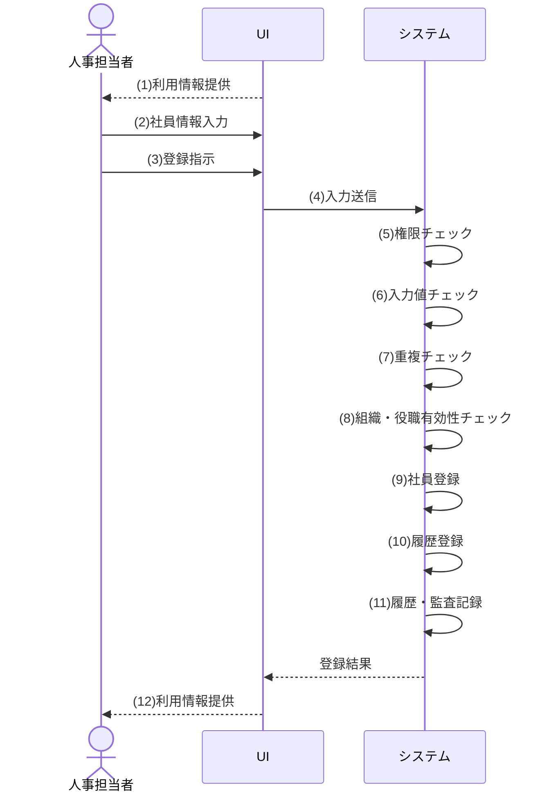

| Step | 要求 | 内容 |
|---|---|---|
| 1 | 利用情報提供 | システムが有効な組織・役職を選択肢とした登録に必要な情報を提供する |
| 2 | 社員情報入力 | 人事担当者が社員番号、氏名、任意の氏名カナ、メールアドレス、入社日、雇用区分、所属組織、役職を入力する |
| 3 | 登録指示 | 人事担当者が入力内容の登録を指示する |
| 4 | 入力送信 | 入力内容を機能へ送信する |
| 5 | 権限チェック | 実行権限を検証する |
| 6 | 入力値チェック | 入力値の形式・必須項目を検証する |
| 7 | 重複チェック | 社員番号・メールアドレスの重複を検証する |
| 8 | 組織・役職有効性チェック | 組織・役職が登録済みかつ利用状態が有効で、入社日が有効な期間内であることを検証する（終了日未設定は期限なし） |
| 9 | 社員登録 | 入力された氏名カナを含む社員基本情報を在籍中で登録する |
| 10 | 履歴登録 | 初期所属履歴を登録する |
| 11 | 履歴・監査記録 | 変更履歴・監査ログを記録する |
| 12 | 利用情報提供 | システムが登録された社員の詳細を人事担当者へ提供する |

#### 8. 代替フロー
| ALT ID | ALT-1 |
|---|---|
| フロー名 | 任意項目（氏名カナ）が入力されていない時 |
| 分岐Step | 9 |
| 発生条件 | 任意項目（氏名カナ）が入力されていない |
| 処理内容 | 氏名カナを未設定のまま、その他の社員基本情報を在籍中で登録する |
| 合流先／正常終了 | 基本フローのStep 10「履歴登録」へ合流 |
| 事後状態 | 在籍中で登録 |

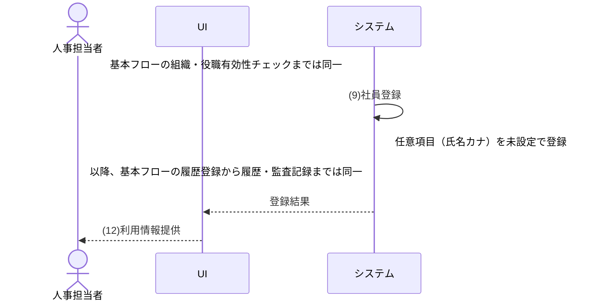

| Step | 要求 | 内容 |
|---|---|---|
| 9 | 社員登録 | 氏名カナを未設定のまま、その他の社員基本情報を在籍中で登録する |
| 12 | 利用情報提供 | システムが氏名カナを未設定で登録された社員の詳細を人事担当者へ提供する |

#### 9. 例外フロー
| EXC ID | EXC-1 |
|---|---|
| フロー名 | 実行権限がない時 |
| 発生Step | 5 |
| 発生条件 | 実行権限がない |
| 要求する振る舞い | 登録せず処理を中断する |
| 通知内容 | 該当したエラーの条件、処理が完了しなかった理由、および利用者が修正・確認すべき内容を通知する |
| 事後状態 | 未登録 |
| 再入力／再実行 | 認証・権限の回復後に再実行可 |
| 復帰先／異常終了 | 異常終了。再実行時は基本フロー開始へ |

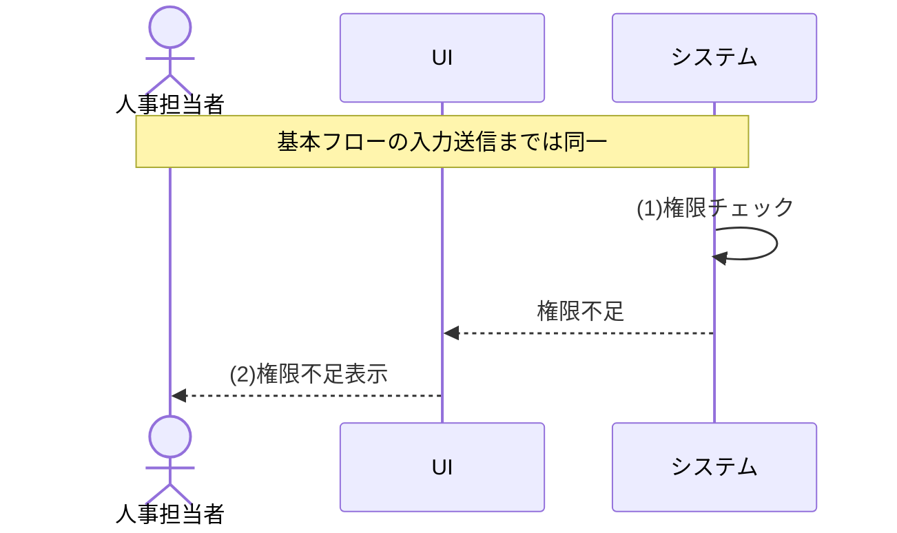

| Step | 要求 | 内容 |
|---|---|---|
| 1 | 権限チェック | 実行権限を検証し、条件「実行権限がない」へのあてはまるか確認する |
| 2 | 権限不足表示 | 権限が無い旨を人事担当者へ表示する |

| EXC ID | EXC-2 |
|---|---|
| フロー名 | 必須項目の未入力または形式不正時 |
| 発生Step | 6 |
| 発生条件 | 必須項目の未入力または形式不正 |
| 要求する振る舞い | 対象項目と理由を表示し、登録しない |
| 通知内容 | 該当したエラーの条件、処理が完了しなかった理由、および利用者が修正・確認すべき内容を通知する |
| 事後状態 | 未登録 |
| 再入力／再実行 | 原因を解消後に再実行可。同じ処理を繰り返し要求したときの動作はTBD-006 |
| 復帰先／異常終了 | 異常終了。再実行時は基本フロー開始へ |

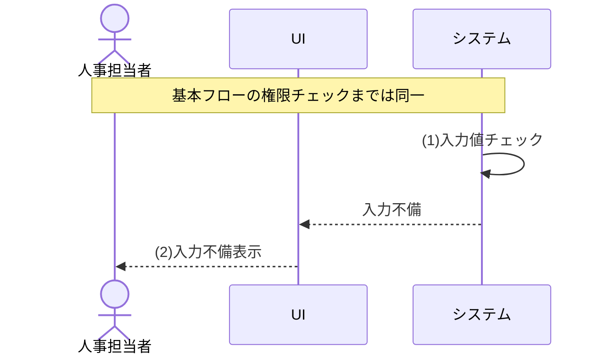

| Step | 要求 | 内容 |
|---|---|---|
| 1 | 入力値チェック | 入力値の形式・必須項目を検証し、条件「必須項目の未入力または形式不正」へのあてはまるか確認する |
| 2 | 入力不備表示 | 対象項目と理由を人事担当者へ表示する |

| EXC ID | EXC-3 |
|---|---|
| フロー名 | 社員番号が既に登録済み時 |
| 発生Step | 7 |
| 発生条件 | 社員番号が既に登録済み |
| 要求する振る舞い | 重複を表示し、登録しない |
| 通知内容 | 該当したエラーの条件、処理が完了しなかった理由、および利用者が修正・確認すべき内容を通知する |
| 事後状態 | 未登録 |
| 再入力／再実行 | 原因を解消後に再実行可。同じ処理を繰り返し要求したときの動作はTBD-006 |
| 復帰先／異常終了 | 異常終了。再実行時は基本フロー開始へ |

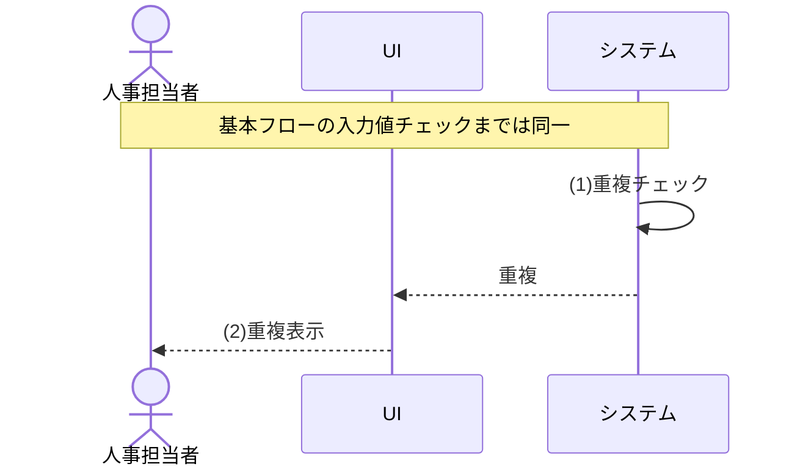

| Step | 要求 | 内容 |
|---|---|---|
| 1 | 重複チェック | 社員番号・メールアドレスの重複を検証し、社員番号が既に登録済みであることを判定する |
| 2 | 重複表示 | 重複項目を人事担当者へ表示する |

| EXC ID | EXC-4 |
|---|---|
| フロー名 | メールアドレスが既に登録済み時 |
| 発生Step | 7 |
| 発生条件 | メールアドレスが既に登録済み |
| 要求する振る舞い | 重複を表示し、登録しない |
| 通知内容 | 該当したエラーの条件、処理が完了しなかった理由、および利用者が修正・確認すべき内容を通知する |
| 事後状態 | 未登録 |
| 再入力／再実行 | 原因を解消後に再実行可。同じ処理を繰り返し要求したときの動作はTBD-006 |
| 復帰先／異常終了 | 異常終了。再実行時は基本フロー開始へ |


| Step | 要求 | 内容 |
|---|---|---|
| 1 | 重複チェック | 社員番号・メールアドレスの重複を検証し、メールアドレスが既に登録済みであることを判定する |
| 2 | 重複表示 | 重複項目を人事担当者へ表示する |

| EXC ID | EXC-5 |
|---|---|
| フロー名 | 選択した組織または役職が未登録、利用状態が無効、入社日が有効な期間より前、または入社日が有効な期間より後時 |
| 発生Step | 8 |
| 発生条件 | 選択した組織または役職が未登録、利用状態が無効、入社日が有効な期間より前、または入社日が有効な期間より後である |
| 要求する振る舞い | 再選択を促し、登録しない |
| 通知内容 | 該当したエラーの条件、処理が完了しなかった理由、および利用者が修正・確認すべき内容を通知する |
| 事後状態 | 未登録 |
| 再入力／再実行 | 原因を修正後に再入力・再実行可 |
| 復帰先／異常終了 | 異常終了。再実行時は基本フロー開始へ |

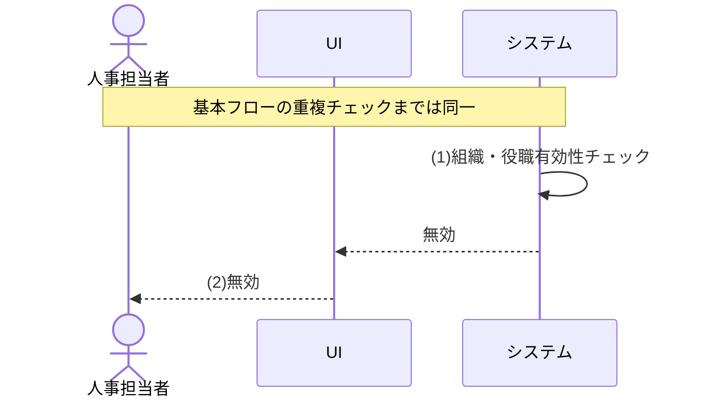

| Step | 要求 | 内容 |
|---|---|---|
| 1 | 組織・役職有効性チェック | 組織・役職について、未登録、利用状態が無効、入社日が有効な期間より前、または入社日が有効な期間より後のいずれかを判定する（終了日未設定は期限なし） |
| 2 | 無効 | 選択した組織または役職が無効で登録できないこと、および該当理由を人事担当者へ通知する |

---
### 2.3.3 【UC-002】社員を検索する（全利用者向け）
利用者が条件を指定し、閲覧権限の範囲内で社員を検索して一覧表示する。

| 項目 | 内容 |
|---|---|
| 対応機能 | F-002 |
| 主アクター | 全利用者（人事担当者・部門管理者・一般社員・システム管理者） |
| 起動契機 | 利用者が検索条件を入力し検索を実行する |
| 正常終了 | 条件と権限に一致する社員一覧を表示する |
| 異常終了 | 検索を実行せず、認証切れ・権限不足を通知する（該当0件・閲覧範囲外の組織指定は0件として通知する） |

#### 1. 事前条件
| No | 条件 |
|---|---|
| 1 | 検索・表示の認可基準日は業務日であり、任意の過去日指定を受け付けないこと |

#### 2. 事後条件
| No | 条件 |
|---|---|
| 1 | 条件と閲覧権限に一致する社員一覧が表示される |
| 2 | 表示項目は全スコープ共通の一覧項目（社員番号、氏名、所属組織、役職、在籍状態）に限定される |

#### 3. 入力データ
| 入力ID | 入力名 | 必須区分 | 内容 |
|---|---|---|---|
| UC-002/IN-01 | 社員番号 | 任意 | 検索キーの社員番号 |
| UC-002/IN-02 | 氏名 | 任意 | 姓名を対象とした検索キー |
| UC-002/IN-03 | 所属組織 | 任意 | 閲覧可能な範囲で業務日時点に利用可能な組織から選択（有効候補の参照は全認証済みロールに許可） |
| UC-002/IN-04 | 役職 | 任意 | 業務日時点に利用可能な役職から選択（有効候補の参照は全認証済みロールに許可） |
| UC-002/IN-05 | 在籍状態 | 任意 | 在籍中・退職・すべて |

#### 4. 出力データ
| 出力ID | 出力名 | 内容 |
|---|---|---|
| UC-002/OUT-01 | 社員一覧 | 条件・権限に一致する社員の一覧（全スコープ共通に社員番号、氏名、所属組織、役職、在籍状態だけを表示） |
| UC-002/OUT-02 | 該当件数 | 条件に一致した件数 |
| UC-002/OUT-03 | メッセージ | 該当0件、認証失効、権限不足、閲覧スコープ不成立の通知 |

#### 5. 状態定義
| 項目 | 意味 | 内容 |
|---|---|---|
| 認証状態 | 検索要求時の認証が継続中か失効済みかを表す状態 | <ul><li>有効：認証が継続中</li><li>無効（認証切れ）：認証が失効または有効期限切れ</li></ul> |
| 閲覧スコープ状態 | 閲覧スコープの成立状態 | <ul><li>成立：閲覧可能範囲が確定</li><li>不成立（有効ロールなし）：有効ロール0件</li><li>不成立（主所属なし）：部門管理者の起点組織なし</li><li>不成立（本人紐付けなし）：一般社員の本人特定不可</li></ul> |
| 検索一致状態 | 検索条件と閲覧スコープを適用した結果 | <ul><li>該当あり：権限内に1件以上</li><li>該当なし（条件不一致）：閲覧スコープ内の社員に検索条件と一致する社員がいない</li><li>該当なし（全件権限外）：検索条件に一致する社員がすべて閲覧権限外</li><li>該当なし（閲覧範囲外の組織指定）：指定組織が閲覧範囲外</li><li>判定不能：スコープ不成立</li></ul> |

#### 6. <状態パターン>
| パターンID | 認証状態 | 閲覧スコープ状態 | 検索一致状態 | 対応フロー | 遷移後状態 |
| --- | --- | --- | --- | --- | --- |
| SP-1 | 有効 | 成立 | 該当あり | 基本フロー | 権限内の社員一覧を表示 |
| SP-2 | 有効 | 成立 | 該当なし（条件不一致） | ALT-1 | 0件を表示 |
| SP-3 | 無効（認証切れ） | － | － | EXC-1 | 検索不可 |
| SP-4 | 有効 | 不成立（有効ロールなし） | 判定不能 | EXC-2 | 検索不可 |
| SP-5 | 有効 | 不成立（主所属なし） | 判定不能 | EXC-3 | 検索不可 |
| SP-6 | 有効 | 不成立（本人紐付けなし） | 判定不能 | EXC-4 | 検索不可 |
| SP-7 | 有効 | 成立 | 該当なし（全件権限外） | ALT-1 | 0件を表示 |
| SP-8 | 有効 | 成立 | 該当なし（閲覧範囲外の組織指定） | ALT-1 | 0件を表示 |

#### 7. 基本フロー
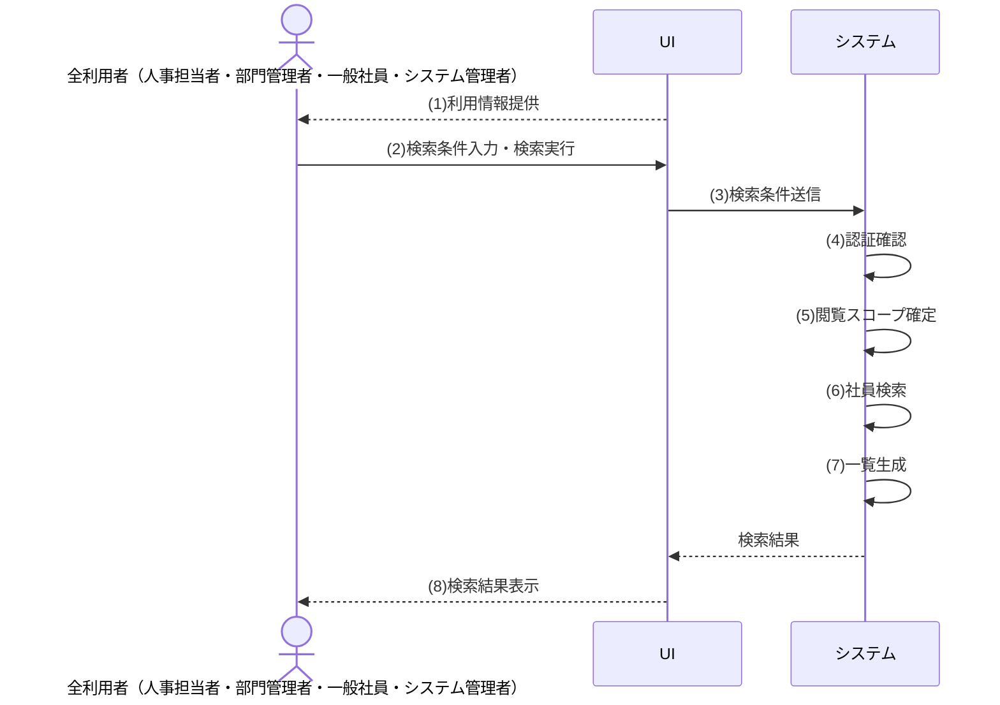

| Step | 要求 | 内容 |
|---|---|---|
| 1 | 利用情報提供 | システムが業務日時点で利用可能な組織・役職を選択肢とした検索条件として指定可能な情報を提供する |
| 2 | 検索条件入力・検索実行 | 利用者が社員番号、氏名、所属組織、役職、在籍状態の検索条件を入力し検索を実行する |
| 3 | 検索条件送信 | 検索条件を機能へ送信する |
| 4 | 認証確認 | 認証状態を検証する |
| 5 | 閲覧スコープ確定 | 有効ロールから閲覧可能範囲を確定する |
| 6 | 社員検索 | 検索条件と閲覧条件に一致する社員を検索する |
| 7 | 一覧生成 | 表示可能項目に限定した社員一覧を生成する |
| 8 | 検索結果表示 | 社員一覧と該当件数を利用者へ表示する |

#### 8. 代替フロー
| ALT ID | ALT-1 |
|---|---|
| フロー名 | 条件・権限に一致する社員が存在しない、または検索条件に閲覧範囲外の組織が指定された時 |
| 分岐Step | 6 |
| 発生条件 | 条件・権限に一致する社員が存在しない、または検索条件に閲覧範囲外の組織が指定された |
| 処理内容 | 0件である旨を表示し、一覧を空で返す（閲覧範囲外の組織指定は存在を秘匿して0件として扱う） |
| 合流先／正常終了 | 本代替フローで正常終了 |
| 事後状態 | 0件を表示 |

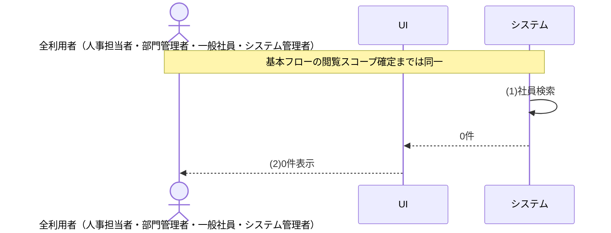

| Step | 要求 | 内容 |
|---|---|---|
| 1 | 社員検索 | 検索条件と閲覧条件に一致する社員を検索し、条件・権限に一致する社員が存在しないことを判定する |
| 2 | 0件表示 | 該当0件である旨を利用者へ表示する |

#### 9. 例外フロー
| EXC ID | EXC-1 |
|---|---|
| フロー名 | 認証が無効（認証切れ等）時 |
| 発生Step | 4 |
| 発生条件 | 認証が無効（認証切れ等） |
| 要求する振る舞い | 検索を実行せず、ログインへ誘導する |
| 通知内容 | 該当したエラーの条件、処理が完了しなかった理由、および利用者が修正・確認すべき内容を通知する |
| 事後状態 | 検索不可 |
| 再入力／再実行 | 認証・権限の回復後に再実行可 |
| 復帰先／異常終了 | 異常終了。再実行時は基本フロー開始へ |

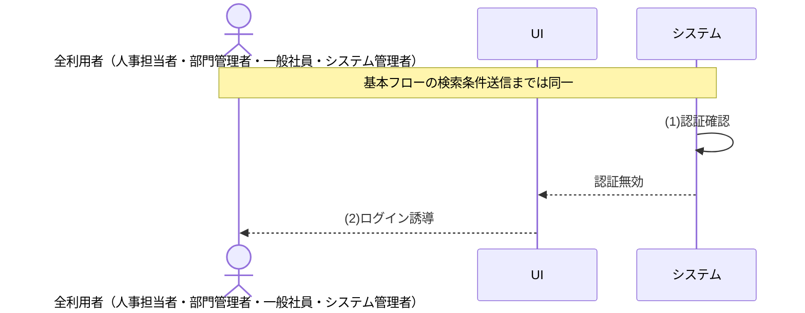

| Step | 要求 | 内容 |
|---|---|---|
| 1 | 認証確認 | 認証状態を検証し、条件「認証が無効（認証切れ等）」へのあてはまるか確認する |
| 2 | ログイン誘導 | 認証切れの旨を利用者へ表示しログインへ誘導する |

| EXC ID | EXC-2 |
|---|---|
| フロー名 | 業務日時点の有効ロールがない時 |
| 発生Step | 5 |
| 発生条件 | 業務日時点の有効ロールがない |
| 要求する振る舞い | 検索を実行せず処理を中断する |
| 通知内容 | 該当したエラーの条件、処理が完了しなかった理由、および利用者が修正・確認すべき内容を通知する |
| 事後状態 | 検索不可 |
| 再入力／再実行 | 原因を解消後に再実行可。同じ処理を繰り返し要求したときの動作はTBD-006 |
| 復帰先／異常終了 | 異常終了。再実行時は基本フロー開始へ |

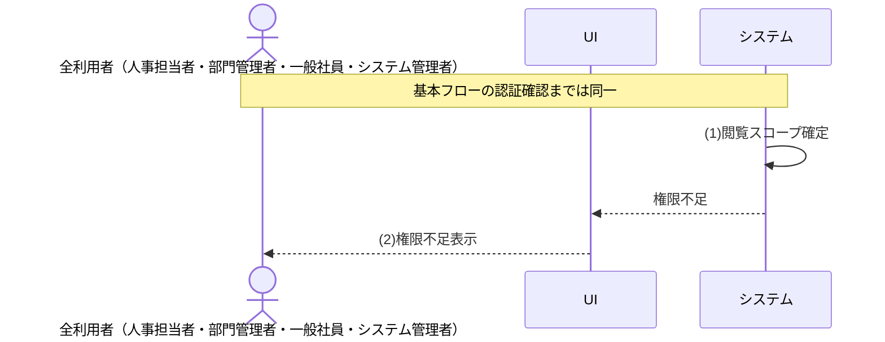

| Step | 要求 | 内容 |
|---|---|---|
| 1 | 閲覧スコープ確定 | 有効ロールから閲覧可能範囲を確定し、条件「業務日時点の有効ロールがない」へのあてはまるか確認する |
| 2 | 権限不足表示 | 権限が無い旨を利用者へ表示する |

| EXC ID | EXC-3 |
|---|---|
| フロー名 | 組織範囲の起点となる主所属が存在しない時 |
| 発生Step | 5 |
| 発生条件 | 組織範囲の起点となる主所属が存在しない |
| 要求する振る舞い | 検索を実行せず処理を中断する |
| 通知内容 | 該当したエラーの条件、処理が完了しなかった理由、および利用者が修正・確認すべき内容を通知する |
| 事後状態 | 検索不可 |
| 再入力／再実行 | 原因を解消後に再実行可。同じ処理を繰り返し要求したときの動作はTBD-006 |
| 復帰先／異常終了 | 異常終了。再実行時は基本フロー開始へ |


| Step | 要求 | 内容 |
|---|---|---|
| 1 | 閲覧スコープ確定 | 有効ロールから閲覧可能範囲を確定し、条件「組織範囲の起点となる主所属が存在しない」へのあてはまるか確認する |
| 2 | 権限不足表示 | 権限が無い旨を利用者へ表示する |

| EXC ID | EXC-4 |
|---|---|
| フロー名 | 本人範囲の本人紐付けが存在しない時 |
| 発生Step | 5 |
| 発生条件 | 本人範囲の本人紐付けが存在しない |
| 要求する振る舞い | 検索を実行せず処理を中断する |
| 通知内容 | 該当したエラーの条件、処理が完了しなかった理由、および利用者が修正・確認すべき内容を通知する |
| 事後状態 | 検索不可 |
| 再入力／再実行 | 原因を解消後に再実行可。同じ処理を繰り返し要求したときの動作はTBD-006 |
| 復帰先／異常終了 | 異常終了。再実行時は基本フロー開始へ |


| Step | 要求 | 内容 |
|---|---|---|
| 1 | 閲覧スコープ確定 | 有効ロールから閲覧可能範囲を確定し、条件「本人範囲の本人紐付けが存在しない」へのあてはまるか確認する |
| 2 | 権限不足表示 | 権限が無い旨を利用者へ表示する |

---
### 2.3.4 【UC-003】社員を異動する（人事担当者向け）
在籍中の社員の所属・役職を指定日基準の履歴として整合的に変更し、未適用の将来異動予約の取消も行う。

| 項目 | 内容 |
|---|---|
| 対応機能 | F-006 |
| 主アクター | 人事担当者 |
| 起動契機 | 人事担当者が社員異動または将来異動予約の取消を選択する |
| 正常終了 | 現所属履歴を終了して新しい所属履歴を登録する。将来異動予約の取消では予約を取消して現所属を継続する |
| 異常終了 | 更新せず、権限不足・退職済み・組織・役職無効・上長指定不可・異動日範囲外（過去日・入社日より前・退職予定日より後）・期間重複を通知する |

#### 1. 事前条件
| No | 条件 |
|---|---|
| 1 | なし（ユースケース内で必要な検証をすべて実施するため） |

#### 2. 事後条件
| No | 条件 |
|---|---|
| 1 | 異動登録では、異動日の直前に有効な所属履歴が異動日の前日で終了する |
| 2 | 異動登録では、異動日以降に開始する既存の将来所属予約を取消し、異動日を開始日とする新しい所属履歴が登録される |
| 3 | 将来異動予約の取消では、未適用の将来所属予約が取消され、現所属履歴の終了予約が解除されて現所属が継続する |
| 4 | 異動内容（将来異動予約の取消を含む）が変更履歴に記録される |
| 5 | 異動操作（将来異動予約の取消を含む）が監査ログに記録される |

#### 3. 入力データ
| 入力ID | 入力名 | 必須区分 | 内容 |
|---|---|---|---|
| UC-003/IN-01 | 操作区分 | 必須 | 異動登録・将来異動予約取消のいずれか |
| UC-003/IN-02 | 対象社員 | 必須 | 異動対象の社員 |
| UC-003/IN-03 | 異動先組織 | 必須（異動登録時） | 登録済みかつ利用状態が有効で、異動日が有効な期間内となる組織から選択する（終了日未設定は期限なし） |
| UC-003/IN-04 | 異動先役職 | 必須（異動登録時） | 登録済みかつ利用状態が有効で、異動日が有効な期間内となる役職から選択する（終了日未設定は期限なし） |
| UC-003/IN-05 | 異動日（適用開始日） | 必須（異動登録時） | 業務日当日または未来のカレンダー上に存在する日付。過去日の遡及異動は本機能の対象外 |
| UC-003/IN-06 | 上長社員 | 任意（異動登録時） | 異動対象社員の上司として指定する社員。上長社員を指定しない登録も許容する |

#### 4. 出力データ
| 出力ID | 出力名 | 内容 |
|---|---|---|
| UC-003/OUT-01 | 異動結果 | 異動・予約取消の成否 |
| UC-003/OUT-02 | 更新後所属 | 異動後の所属・役職（予約取消では継続する現所属） |
| UC-003/OUT-03 | エラー内容 | 権限不足・退職済み・組織・役職無効・上長指定不可・異動日範囲外・期間重複の理由 |

**\<操作定義\>**

| 操作 | 説明 |
|---|---|
| 異動登録 | 新しい所属を登録する |
| 予約取消 | 未適用の将来異動予約を取り消す |

#### 5. 状態定義
| 項目 | 意味 | 内容 |
|---|---|---|
| 実行権限 | 業務日時点で社員異動を実行できる人事担当者ロールの保有状態 | <ul><li>あり：有効な実行権限を保有</li><li>なし：保有していない</li></ul> |
| 対象社員状態 | 異動対象社員の存在・在籍状態 | <ul><li>在籍中：登録済みで退職日未到来</li><li>退職済み：登録済みで退職状態</li><li>退職日到来済み：退職状態への反映前だが、退職日が異動日以前</li><li>存在しない：未登録または同時削除済み</li></ul> |
| 組織状態 | 異動先の組織が異動日時点で利用できる状態 | <ul><li>有効：登録済み・利用状態有効で、異動日が有効期間内</li><li>無効：未登録・利用状態無効・開始日前・終了日後のいずれか</li></ul> |
| 役職状態 | 異動先の役職が異動日時点で利用できる状態 | <ul><li>有効：登録済み・利用状態有効で、異動日が有効期間内</li><li>無効：未登録・利用状態無効・開始日前・終了日後のいずれか</li></ul> |
| 上長社員状態 | 異動対象社員の上司として指定する社員の状態 | <ul><li>未指定：上長社員を指定しない</li><li>在籍中・退職予定なし：登録済みで、異動対象社員本人ではなく、異動日時点で入社済み・在籍中かつ退職日未設定</li><li>不存在：該当社員が未登録</li><li>異動対象社員本人：上長社員と異動対象社員が同一</li><li>異動日時点で入社前：上長社員の入社日が異動日より後</li><li>退職済み：上長社員が退職状態</li><li>退職日到来済み：上長社員の退職日が異動日以前</li><li>退職予定あり：異動日より後の退職日が登録済み</li></ul> |
| 異動日区分 | 異動日と業務日・対象社員の在籍期間との関係 | <ul><li>当日：業務日当日かつ在籍期間内</li><li>未来日付：業務日より後かつ在籍期間内</li><li>入社日より前：異動日が対象社員の入社日より前</li><li>業務日より前：異動日が入社日以後かつ業務日より前</li><li>退職予定日より後：異動日が対象社員の退職予定日より後</li></ul> |
| 所属期間重複状態 | 新旧の所属履歴間の期間重複状態 | <ul><li>整合：重複なし</li><li>重複あり：同一社員の所属期間が1日以上重複</li></ul> |

#### 6. <状態パターン>
| パターンID | 実行権限 | 対象社員状態 | 操作 | 組織状態 | 役職状態 | 上長社員状態 | 異動日区分 | 所属期間重複状態 | 対応フロー | 遷移後状態 |
| --- | --- | --- | --- | --- | --- | --- | --- | --- | --- | --- |
| SP-1 | あり | 在籍中 | 異動登録 | 有効 | 有効 | 未指定 | 当日 | 整合 | 基本フロー | 上長未設定で所属履歴を更新 |
| SP-2 | あり | 在籍中 | 異動登録 | 有効 | 有効 | 在籍中・退職予定なし | 当日 | 整合 | 基本フロー | 上長を設定して所属履歴を更新 |
| SP-3 | あり | 在籍中 | 異動登録 | 有効 | 有効 | 未指定 | 未来日付 | 整合 | ALT-1 | 上長未設定の将来所属履歴として登録 |
| SP-4 | あり | 在籍中 | 異動登録 | 有効 | 有効 | 在籍中・退職予定なし | 未来日付 | 整合 | ALT-1 | 上長を設定した将来所属履歴として登録 |
| SP-5 | あり | 在籍中 | 予約取消 | － | － | － | － | － | ALT-2 | 将来異動予約を取消し現所属を継続 |
| SP-6 | なし | － | － | － | － | － | － | － | EXC-1 | 未更新 |
| SP-7 | あり | 退職済み | － | － | － | － | － | － | EXC-2 | 未更新 |
| SP-8 | あり | 在籍中 | 異動登録 | 無効 | － | － | － | － | EXC-3 | 未更新 |
| SP-9 | あり | 在籍中 | 異動登録 | 有効 | 有効 | 不存在 | － | － | EXC-6 | 未更新 |
| SP-10 | あり | 在籍中 | 異動登録 | 有効 | 有効 | 異動対象社員本人 | － | － | EXC-7 | 未更新 |
| SP-11 | あり | 在籍中 | 異動登録 | 有効 | 有効 | 異動日時点で入社前 | － | － | EXC-8 | 未更新 |
| SP-12 | あり | 在籍中 | 異動登録 | 有効 | 有効 | 退職済み | － | － | EXC-9 | 未更新 |
| SP-13 | あり | 在籍中 | 異動登録 | 有効 | 有効 | 退職予定あり | － | － | EXC-10 | 未更新 |
| SP-14 | あり | 在籍中 | 異動登録 | 有効 | 有効 | 未指定 | 入社日より前 | － | EXC-5 | 未更新 |
| SP-15 | あり | 在籍中 | 異動登録 | 有効 | 有効 | 在籍中・退職予定なし | 入社日より前 | － | EXC-5 | 未更新 |
| SP-16 | あり | 在籍中 | 異動登録 | 有効 | 有効 | 未指定 | 当日 | 重複あり | EXC-4 | 未更新 |
| SP-17 | あり | 在籍中 | 異動登録 | 有効 | 有効 | 在籍中・退職予定なし | 当日 | 重複あり | EXC-4 | 未更新 |
| SP-18 | あり | 在籍中 | 異動登録 | 有効 | 無効 | － | － | － | EXC-3 | 未更新 |
| SP-19 | あり | 存在しない | － | － | － | － | － | － | EXC-2 | 未更新 |
| SP-20 | あり | 在籍中 | 異動登録 | 有効 | 有効 | 退職日到来済み | － | － | EXC-9 | 未更新 |
| SP-21 | あり | 在籍中 | 異動登録 | 有効 | 有効 | 未指定 | 業務日より前 | － | EXC-5 | 未更新 |
| SP-22 | あり | 在籍中 | 異動登録 | 有効 | 有効 | 在籍中・退職予定なし | 業務日より前 | － | EXC-5 | 未更新 |
| SP-23 | あり | 在籍中 | 異動登録 | 有効 | 有効 | 未指定 | 退職予定日より後 | － | EXC-5 | 未更新 |
| SP-24 | あり | 在籍中 | 異動登録 | 有効 | 有効 | 在籍中・退職予定なし | 退職予定日より後 | － | EXC-5 | 未更新 |
| SP-25 | あり | 在籍中 | 異動登録 | 有効 | 有効 | 未指定 | 未来日付 | 重複あり | EXC-4 | 未更新 |
| SP-26 | あり | 在籍中 | 異動登録 | 有効 | 有効 | 在籍中・退職予定なし | 未来日付 | 重複あり | EXC-4 | 未更新 |
| SP-27 | あり | 退職日到来済み | － | － | － | － | － | － | EXC-2 | 未更新 |

#### 7. 基本フロー
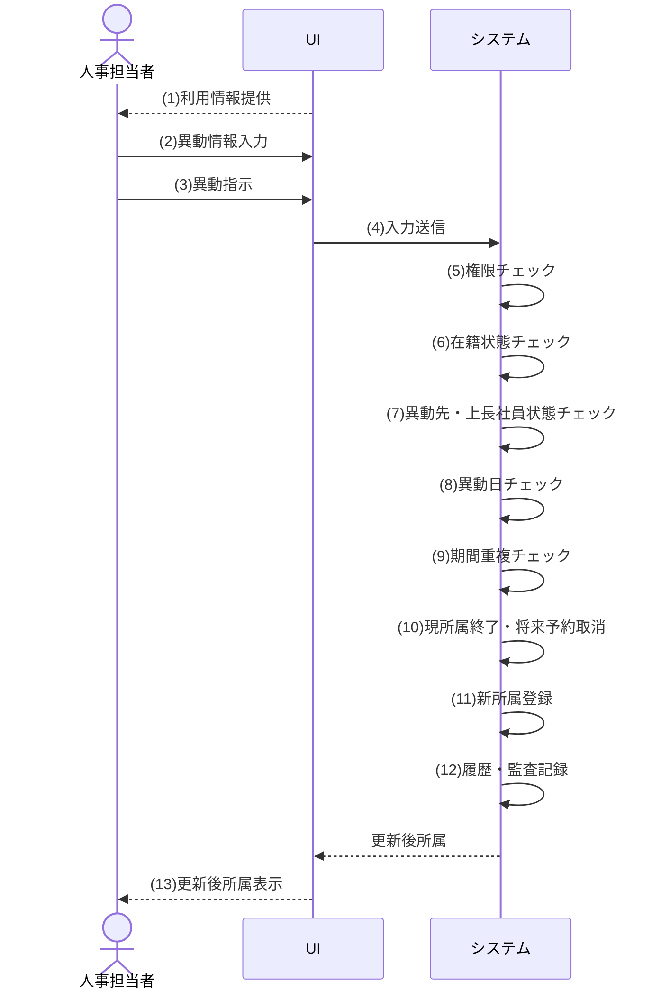

| Step | 要求 | 内容 |
|---|---|---|
| 1 | 利用情報提供 | システムが有効な異動先組織・役職を選択肢とした異動に必要な情報を提供する |
| 2 | 異動情報入力 | 人事担当者が対象社員、異動先組織、異動先役職、異動日、任意の上長社員を入力する |
| 3 | 異動指示 | 人事担当者が入力内容の異動を指示する |
| 4 | 入力送信 | 入力内容を機能へ送信する |
| 5 | 権限チェック | 実行権限を検証する |
| 6 | 在籍状態チェック | 対象社員が登録済み・在籍中で、業務日時点で退職日が未設定または業務日より後であることを検証する |
| 7 | 異動先・上長社員状態チェック | 異動先の組織・役職が登録済みかつ利用状態が有効で、異動日が有効な期間内であることを検証する（終了日未設定は期限なし）。上長未指定時は上長なしとして扱い、指定時は上長社員が登録済みで、異動対象社員本人ではなく、異動日時点で入社済み・在籍中かつ退職日未設定であることを検証する |
| 8 | 異動日チェック | 異動日が業務日以降かつ対象社員の在籍期間内であることを検証する |
| 9 | 期間重複チェック | 所属履歴の期間重複を検証する |
| 10 | 現所属終了・将来予約取消 | 異動日直前に有効な所属を前日で終了し、異動日以降の将来所属予約を取消す |
| 11 | 新所属登録 | 異動日を開始日とする新所属履歴を登録する |
| 12 | 履歴・監査記録 | 変更履歴・監査ログを記録する |
| 13 | 更新後所属表示 | 更新後の所属を人事担当者へ表示する |

#### 8. 代替フロー
| ALT ID | ALT-1 |
|---|---|
| フロー名 | 異動日が未来日付時 |
| 分岐Step | 8 |
| 発生条件 | 異動日が未来日付である |
| 処理内容 | 異動日直前の所属を前日で終了予約し、異動日以降の既存将来予約を取消して、新所属を将来の適用開始日で登録する |
| 合流先／正常終了 | 本代替フローで正常終了 |
| 事後状態 | 上長未設定の将来所属履歴として登録／上長を設定した将来所属履歴として登録 |

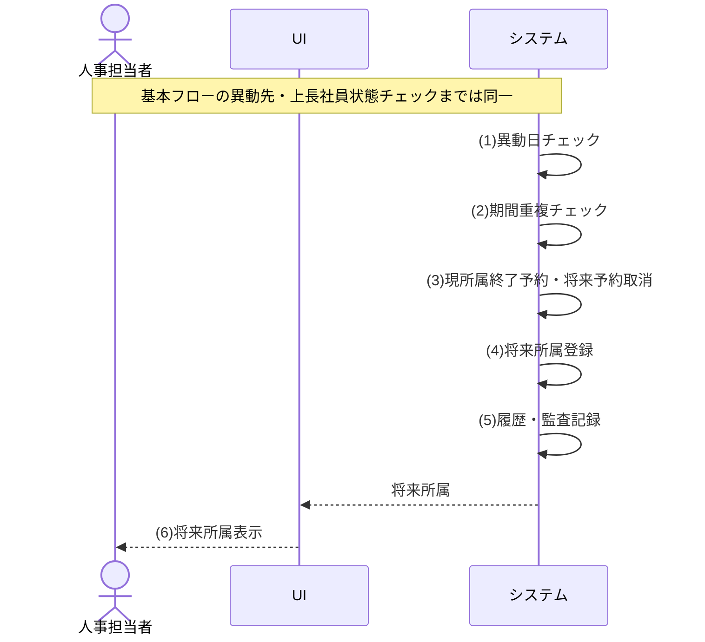

| Step | 要求 | 内容 |
|---|---|---|
| 1 | 異動日チェック | 異動日が業務日以降の未来日付かつ対象社員の在籍期間内であることを検証する |
| 2 | 期間重複チェック | 所属履歴の期間重複を検証する |
| 3 | 現所属終了予約・将来予約取消 | 異動日直前に有効な所属を前日で終了予約し、異動日以降の既存将来予約を取消す |
| 4 | 将来所属登録 | 異動日を適用開始日とする将来の所属履歴を登録する |
| 5 | 履歴・監査記録 | 変更履歴・監査ログを記録する |
| 6 | 将来所属表示 | 将来の所属履歴として登録された内容を人事担当者へ表示する |

| ALT ID | ALT-2 |
|---|---|
| フロー名 | 操作区分が将来異動予約の取消時 |
| 分岐Step | 3 |
| 発生条件 | 操作区分が将来異動予約の取消である |
| 処理内容 | 権限・在籍確認のうえ未適用の将来所属予約を取消し、現所属の終了予約を解除して現所属を継続する |
| 合流先／正常終了 | 本代替フローで正常終了 |
| 事後状態 | 将来異動予約を取消し現所属を継続 |

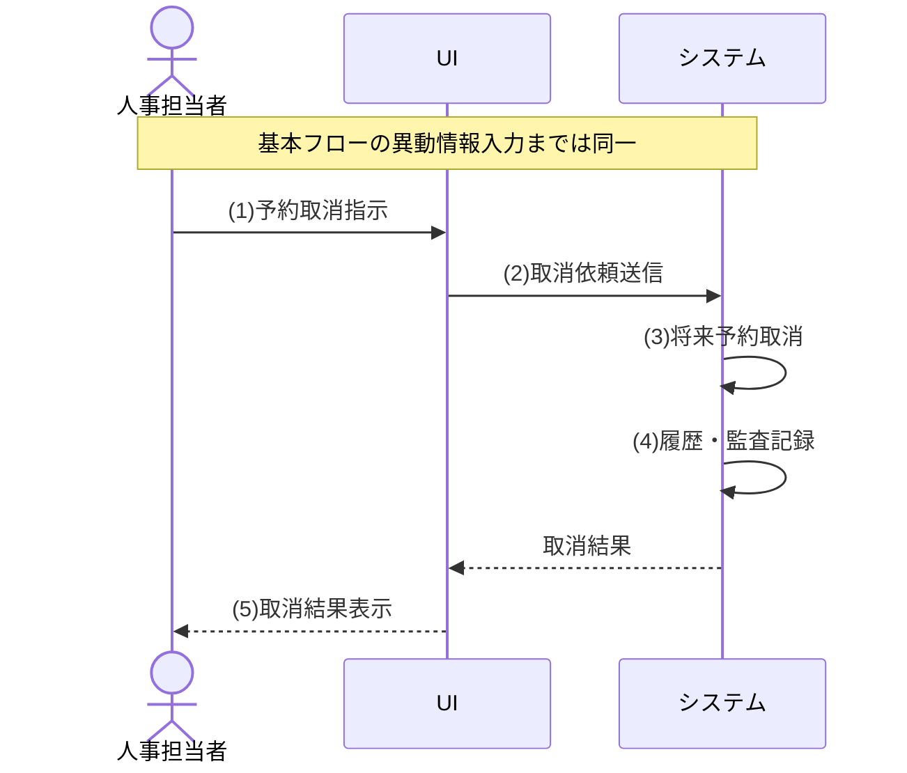

| Step | 要求 | 内容 |
|---|---|---|
| 1 | 予約取消指示 | 人事担当者が対象社員の将来異動予約の取消を指示する |
| 2 | 取消依頼送信 | 取消内容を機能へ送信する |
| 3 | 将来予約取消 | 未適用の将来所属予約を取消し、現所属の終了予約を解除する |
| 4 | 履歴・監査記録 | 予約取消を変更履歴・監査ログに記録する |
| 5 | 取消結果表示 | 予約が取消され現所属が継続する旨を人事担当者へ表示する |

#### 9. 例外フロー
| EXC ID | EXC-1 |
|---|---|
| フロー名 | 実行権限がない時 |
| 発生Step | 5 |
| 発生条件 | 実行権限がない |
| 要求する振る舞い | 更新せず処理を中断する |
| 通知内容 | 該当したエラーの条件、処理が完了しなかった理由、および利用者が修正・確認すべき内容を通知する |
| 事後状態 | 未更新 |
| 再入力／再実行 | 認証・権限の回復後に再実行可 |
| 復帰先／異常終了 | 異常終了。再実行時は基本フロー開始へ |


| Step | 要求 | 内容 |
|---|---|---|
| 1 | 権限チェック | 実行権限を検証し、条件「実行権限がない」へのあてはまるか確認する |
| 2 | 権限不足表示 | 権限が無い旨を人事担当者へ表示する |

| EXC ID | EXC-2 |
|---|---|
| フロー名 | 対象社員が退職済み（または存在しない）時 |
| 発生Step | 6 |
| 発生条件 | 対象社員が退職済み（または存在しない） |
| 要求する振る舞い | 更新しない |
| 通知内容 | 該当したエラーの条件、処理が完了しなかった理由、および利用者が修正・確認すべき内容を通知する |
| 事後状態 | 未更新 |
| 再入力／再実行 | 原因を解消後に再実行可。同じ処理を繰り返し要求したときの動作はTBD-006 |
| 復帰先／異常終了 | 異常終了。再実行時は基本フロー開始へ |

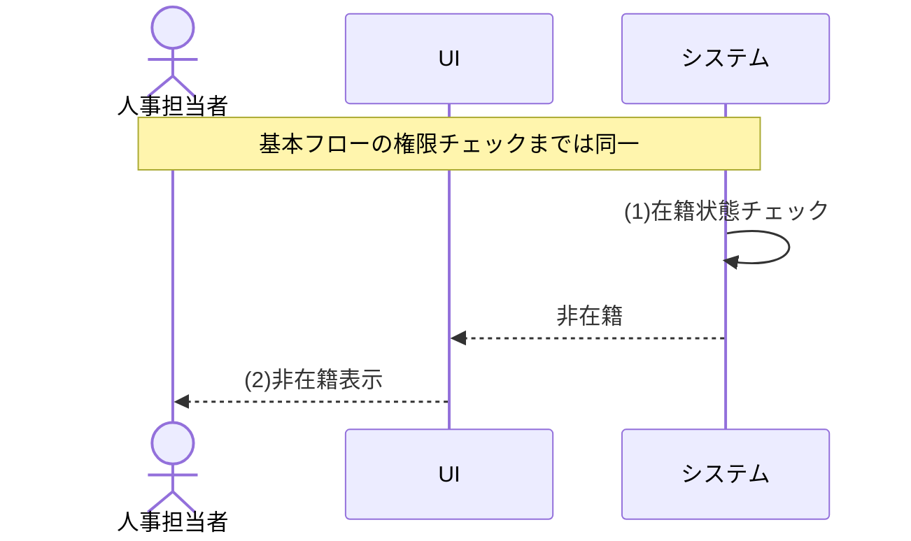

| Step | 要求 | 内容 |
|---|---|---|
| 1 | 在籍状態チェック | 対象社員について、未登録、退職済み、または退職日が業務日時点で到来済みのいずれかを判定する |
| 2 | 非在籍表示 | 対象社員が在籍していないため異動できない旨を人事担当者へ表示する |

| EXC ID | EXC-3 |
|---|---|
| フロー名 | 異動先の組織または役職が未登録、利用状態が無効、異動日が有効な期間より前、または異動日が有効な期間より後時 |
| 発生Step | 7 |
| 発生条件 | 異動先の組織または役職が未登録、利用状態が無効、異動日が有効な期間より前、または異動日が有効な期間より後である |
| 要求する振る舞い | 再選択を促し、更新しない |
| 通知内容 | 該当したエラーの条件、処理が完了しなかった理由、および利用者が修正・確認すべき内容を通知する |
| 事後状態 | 未更新 |
| 再入力／再実行 | 原因を修正後に再入力・再実行可 |
| 復帰先／異常終了 | 異常終了。再実行時は基本フロー開始へ |

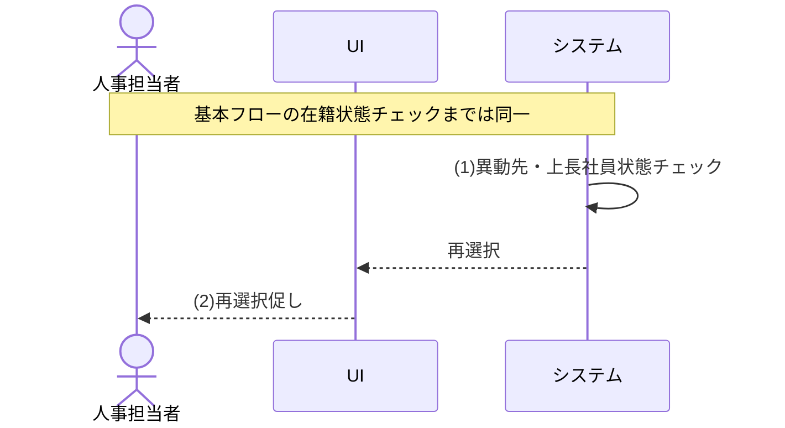

| Step | 要求 | 内容 |
|---|---|---|
| 1 | 異動先・上長社員状態チェック | 異動先の組織・役職について、未登録、利用状態が無効、異動日が有効な期間より前、または異動日が有効な期間より後のいずれかを判定する（終了日未設定は期限なし） |
| 2 | 再選択促し | 異動日時点で利用できない組織・役職の再選択を人事担当者へ促す |

| EXC ID | EXC-4 |
|---|---|
| フロー名 | 所属履歴の有効期間が重複時 |
| 発生Step | 9 |
| 発生条件 | 所属履歴の有効期間が重複する |
| 要求する振る舞い | 更新しない |
| 通知内容 | 該当したエラーの条件、処理が完了しなかった理由、および利用者が修正・確認すべき内容を通知する |
| 事後状態 | 未更新 |
| 再入力／再実行 | 原因を解消後に再実行可。同じ処理を繰り返し要求したときの動作はTBD-006 |
| 復帰先／異常終了 | 異常終了。再実行時は基本フロー開始へ |

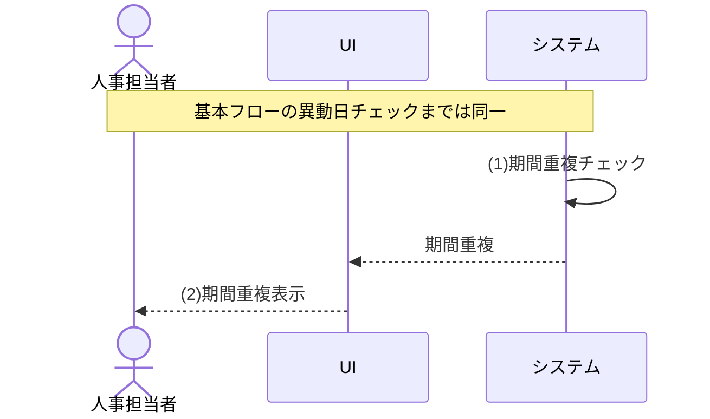

| Step | 要求 | 内容 |
|---|---|---|
| 1 | 期間重複チェック | 所属履歴の期間重複を検証し、指定した異動日が既存の所属期間と重複することを判定する |
| 2 | 期間重複表示 | 指定した異動日が既存の所属期間と重複することを人事担当者へ表示する |

| EXC ID | EXC-5 |
|---|---|
| フロー名 | 異動日が有効範囲外（業務日より前、対象社員の入社日より前、または退職予定日より後）時 |
| 発生Step | 8 |
| 発生条件 | 異動日が有効範囲外（業務日より前、対象社員の入社日より前、または退職予定日より後） |
| 要求する振る舞い | 更新しない。遡及訂正は別途データ訂正手続で扱う |
| 通知内容 | 該当したエラーの条件、処理が完了しなかった理由、および利用者が修正・確認すべき内容を通知する |
| 事後状態 | 未更新 |
| 再入力／再実行 | 原因を解消後に再実行可。同じ処理を繰り返し要求したときの動作はTBD-006 |
| 復帰先／異常終了 | 異常終了。再実行時は基本フロー開始へ |

```mermaid
sequenceDiagram
    actor U as 人事担当者
    participant UI as UI
    participant FUNC as システム
    Note over U,FUNC: 基本フローの異動先・上長社員状態チェックまでは同一
    FUNC->>FUNC: (1)異動日チェック
    FUNC-->>UI: 範囲外
    UI-->>U: (2)範囲外表示
```

| Step | 要求 | 内容 |
|---|---|---|
| 1 | 異動日チェック | 異動日が業務日以降かつ対象社員の在籍期間内であることを検証し、条件「異動日が有効範囲外（業務日より前、対象社員の入社日より前、または退職予定日より後）」へのあてはまるか確認する |
| 2 | 範囲外表示 | 異動日が登録できないことと指定可能な範囲を人事担当者へ表示する |

| EXC ID | EXC-6 |
|---|---|
| フロー名 | 上長社員として指定した社員が存在しない時 |
| 発生Step | 7 |
| 発生条件 | 上長社員として指定した社員が存在しない |
| 要求する振る舞い | 再選択を促し、更新しない |
| 通知内容 | 該当したエラーの条件、処理が完了しなかった理由、および利用者が修正・確認すべき内容を通知する |
| 事後状態 | 未更新 |
| 再入力／再実行 | 原因を修正後に再入力・再実行可 |
| 復帰先／異常終了 | 異常終了。再実行時は基本フロー開始へ |

```mermaid
sequenceDiagram
    actor U as 人事担当者
    participant UI as UI
    participant FUNC as システム
    Note over U,FUNC: 基本フローの在籍状態チェックまでは同一
    FUNC->>FUNC: (1)異動先・上長社員状態チェック
    FUNC-->>UI: 上長再選択
    UI-->>U: (2)上長再選択促し
```

| Step | 要求 | 内容 |
|---|---|---|
| 1 | 異動先・上長社員状態チェック | 上長社員として指定した社員が未登録であることを判定する |
| 2 | 上長再選択促し | 指定した上長社員が存在しないことを表示し、再選択を人事担当者へ促す |

| EXC ID | EXC-7 |
|---|---|
| フロー名 | 上長社員として異動対象社員本人を指定している時 |
| 発生Step | 7 |
| 発生条件 | 上長社員として異動対象社員本人を指定している |
| 要求する振る舞い | 再選択を促し、更新しない |
| 通知内容 | 該当したエラーの条件、処理が完了しなかった理由、および利用者が修正・確認すべき内容を通知する |
| 事後状態 | 未更新 |
| 再入力／再実行 | 原因を修正後に再入力・再実行可 |
| 復帰先／異常終了 | 異常終了。再実行時は基本フロー開始へ |

```mermaid
sequenceDiagram
    actor U as 人事担当者
    participant UI as UI
    participant FUNC as システム
    Note over U,FUNC: 基本フローの在籍状態チェックまでは同一
    FUNC->>FUNC: (1)異動先・上長社員状態チェック
    FUNC-->>UI: 上長再選択
    UI-->>U: (2)上長再選択促し
```

| Step | 要求 | 内容 |
|---|---|---|
| 1 | 異動先・上長社員状態チェック | 指定した上長社員と異動対象社員が同一であることを判定する |
| 2 | 上長再選択促し | 異動対象社員本人は上長に指定できないことを表示し、再選択を人事担当者へ促す |

| EXC ID | EXC-8 |
|---|---|
| フロー名 | 指定した上長社員が異動日時点で入社前時 |
| 発生Step | 7 |
| 発生条件 | 指定した上長社員が異動日時点で入社前である |
| 要求する振る舞い | 再選択を促し、更新しない |
| 通知内容 | 該当したエラーの条件、処理が完了しなかった理由、および利用者が修正・確認すべき内容を通知する |
| 事後状態 | 未更新 |
| 再入力／再実行 | 原因を修正後に再入力・再実行可 |
| 復帰先／異常終了 | 異常終了。再実行時は基本フロー開始へ |

```mermaid
sequenceDiagram
    actor U as 人事担当者
    participant UI as UI
    participant FUNC as システム
    Note over U,FUNC: 基本フローの在籍状態チェックまでは同一
    FUNC->>FUNC: (1)異動先・上長社員状態チェック
    FUNC-->>UI: 上長再選択
    UI-->>U: (2)上長再選択促し
```

| Step | 要求 | 内容 |
|---|---|---|
| 1 | 異動先・上長社員状態チェック | 指定した上長社員の入社日が異動日より後であることを判定する |
| 2 | 上長再選択促し | 異動日時点で入社前の社員は上長に指定できないことを表示し、再選択を人事担当者へ促す |

| EXC ID | EXC-9 |
|---|---|
| フロー名 | 指定した上長社員が退職済み、または退職日が異動日時点で到来済み時 |
| 発生Step | 7 |
| 発生条件 | 指定した上長社員が退職済み、または退職日が異動日時点で到来済みである |
| 要求する振る舞い | 再選択を促し、更新しない |
| 通知内容 | 該当したエラーの条件、処理が完了しなかった理由、および利用者が修正・確認すべき内容を通知する |
| 事後状態 | 未更新 |
| 再入力／再実行 | 原因を修正後に再入力・再実行可 |
| 復帰先／異常終了 | 異常終了。再実行時は基本フロー開始へ |

```mermaid
sequenceDiagram
    actor U as 人事担当者
    participant UI as UI
    participant FUNC as システム
    Note over U,FUNC: 基本フローの在籍状態チェックまでは同一
    FUNC->>FUNC: (1)異動先・上長社員状態チェック
    FUNC-->>UI: 上長再選択
    UI-->>U: (2)上長再選択促し
```

| Step | 要求 | 内容 |
|---|---|---|
| 1 | 異動先・上長社員状態チェック | 指定した上長社員が退職済み、または退職日が異動日以前であることを判定する |
| 2 | 上長再選択促し | 退職済みまたは退職日到来済みの社員は上長に指定できないことを表示し、再選択を人事担当者へ促す |

| EXC ID | EXC-10 |
|---|---|
| フロー名 | 指定した上長社員に異動日より後の退職日が登録されている時 |
| 発生Step | 7 |
| 発生条件 | 指定した上長社員に異動日より後の退職日が登録されている |
| 要求する振る舞い | 再選択を促し、更新しない |
| 通知内容 | 該当したエラーの条件、処理が完了しなかった理由、および利用者が修正・確認すべき内容を通知する |
| 事後状態 | 未更新 |
| 再入力／再実行 | 原因を修正後に再入力・再実行可 |
| 復帰先／異常終了 | 異常終了。再実行時は基本フロー開始へ |

```mermaid
sequenceDiagram
    actor U as 人事担当者
    participant UI as UI
    participant FUNC as システム
    Note over U,FUNC: 基本フローの在籍状態チェックまでは同一
    FUNC->>FUNC: (1)異動先・上長社員状態チェック
    FUNC-->>UI: 上長再選択
    UI-->>U: (2)上長再選択促し
```

| Step | 要求 | 内容 |
|---|---|---|
| 1 | 異動先・上長社員状態チェック | 指定した上長社員に異動日より後の退職日が登録されていることを判定する。新しい所属履歴は終了日未設定で登録するため、異動日が退職予定日前でも上長には指定しない |
| 2 | 上長再選択促し | 退職予定のある社員は上長に指定できないことを表示し、再選択を人事担当者へ促す |

---
### 2.3.5 【UC-004】社員を退職にする（人事担当者向け）
在籍中の社員に退職日を登録し、当日以前は即時退職、未来日は退職予定として受け付ける。未到来の退職予定の取消も本UCで行い、未来日の到来自動反映はUC-014を正式なルールとする。退職確定後の退職取消・復職はオンライン機能の対象外として別途データ訂正手続で扱い、再入社は新規の社員番号によるUC-001の登録で行う。

| 項目 | 内容 |
|---|---|
| 対応機能 | F-007 |
| 主アクター | 人事担当者 |
| 起動契機 | 人事担当者が退職処理または退職予定の取消を選択する |
| 正常終了 | 当日以前は退職状態・所属履歴終了を反映し、未来日は在籍状態を維持して退職予定を登録する。退職予定の取消では予定を取消して在籍を継続する |
| 異常終了 | 更新せず、権限不足・退職済み・不正な退職日・上長割当残存（先に部下の上長変更が必要）を通知する |

#### 1. 事前条件
| No | 条件 |
|---|---|
| 1 | なし（ユースケース内で必要な検証をすべて実施するため） |

#### 2. 事後条件
| No | 条件 |
|---|---|
| 1 | 退職日が当日以前の場合、社員状態が退職に変更される |
| 2 | 退職日が未来日の場合、社員状態と現所属を維持したまま退職予定が登録される |
| 3 | 退職予定の取消では、未到来の退職予定（退職日・退職区分）が取消され、在籍中の状態と現所属が継続する |
| 4 | 退職日の到来時に有効な所属履歴が終了し、退職日より後に開始する将来所属予約が取消される |
| 5 | 退職予定の登録・取消および退職確定が変更履歴・監査ログに記録される |
| 6 | 退職日到来以後は新規ログインが拒否される |

#### 3. 入力データ
| 入力ID | 入力名 | 必須区分 | 内容 |
|---|---|---|---|
| UC-004/IN-01 | 操作区分 | 必須 | 退職登録・退職予定取消のいずれか |
| UC-004/IN-02 | 対象社員 | 必須 | 退職対象の社員 |
| UC-004/IN-03 | 退職日 | 必須（退職登録時） | 暦上存在し、入社日以後の日付。文字列表現はTBD-001の決定に従う |
| UC-004/IN-04 | 退職区分 | 任意（退職登録時） | [共通区分定義](02_機能要件.md#25-共通区分定義)の退職区分から選択。未指定も許容する |

#### 4. 出力データ
| 出力ID | 出力名 | 内容 |
|---|---|---|
| UC-004/OUT-01 | 退職結果 | 退職処理・予定取消の成否 |
| UC-004/OUT-02 | 更新後状態 | 退職状態・退職日（予定取消では継続する在籍状態） |
| UC-004/OUT-03 | エラー内容 | 権限不足・退職済み・不正な退職日・上長割当残存の理由 |

**\<操作定義\>**

| 操作 | 説明 |
|---|---|
| 退職登録 | 退職日を登録する |
| 予定取消 | 未到来の退職予定を取り消す |

#### 5. 状態定義
| 項目 | 意味 | 内容 |
|---|---|---|
| 実行権限 | 業務日時点で退職処理を実行できる人事担当者ロールの保有状態 | <ul><li>あり：有効な実行権限を保有</li><li>なし：保有していない</li></ul> |
| 対象社員状態 | 退職対象社員の存在・在籍状態 | <ul><li>在籍中：登録済みで退職日未到来</li><li>退職済み：登録済みで退職状態</li><li>退職日到来済み：退職状態への反映前だが、登録済み退職日が業務日以前</li><li>存在しない：未登録または同時削除済み</li></ul> |
| 退職日状態 | 指定退職日と入社日の前後関係 | <ul><li>規則適合：日付として正しく、退職日が入社日以後</li><li>入社日より前：退職日が入社日より前</li><li>日付形式不正：日付として解釈できない</li></ul> |
| 上長割当 | 対象社員を上長とする退職日当日以後の所属参照の有無 | <ul><li>残存なし：該当する所属参照なし</li><li>残存あり：1件以上あり</li></ul> |
| 退職日区分 | 指定退職日と業務日の関係 | <ul><li>当日以前：業務日以前</li><li>未来日付：業務日より後</li></ul> |

#### 6. <状態パターン>
| パターンID | 実行権限 | 対象社員状態 | 操作 | 退職日状態 | 上長割当 | 退職日区分 | 対応フロー | 遷移後状態 |
| --- | --- | --- | --- | --- | --- | --- | --- | --- |
| SP-1 | あり | 在籍中 | 退職登録 | 規則適合 | 残存なし | 当日以前 | 基本フロー | 退職状態で更新 |
| SP-2 | あり | 在籍中 | 退職登録 | 規則適合 | 残存なし | 未来日付 | ALT-1 | 退職予約として登録 |
| SP-3 | あり | 在籍中 | 予定取消 | － | － | － | ALT-2 | 退職予定を取消し在籍継続 |
| SP-4 | なし | － | － | － | － | － | EXC-1 | 未更新 |
| SP-5 | あり | 退職済み | － | － | － | － | EXC-2 | 未更新 |
| SP-6 | あり | 在籍中 | 退職登録 | 入社日より前 | － | － | EXC-3 | 未更新 |
| SP-7 | あり | 在籍中 | 退職登録 | 規則適合 | 残存あり | － | EXC-4 | 未更新 |
| SP-8 | あり | 存在しない | － | － | － | － | EXC-2 | 未更新 |
| SP-9 | あり | 在籍中 | 退職登録 | 日付形式不正 | － | － | EXC-3 | 未更新 |
| SP-10 | あり | 退職日到来済み | － | － | － | － | EXC-2 | 未更新 |

#### 7. 基本フロー
```mermaid
sequenceDiagram
    actor U as 人事担当者
    participant UI as UI
    participant FUNC as システム
    UI-->>U: (1)利用情報提供
    U->>UI: (2)退職日入力
    U->>UI: (3)退職処理指示
    UI->>FUNC: (4)入力送信
    FUNC->>FUNC: (5)権限チェック
    FUNC->>FUNC: (6)在籍状態確認
    FUNC->>FUNC: (7)退職日・上長割当チェック
    FUNC->>FUNC: (8)退職日区分判定
    FUNC->>FUNC: (9)退職状態更新
    FUNC->>FUNC: (10)所属履歴終了・予約取消
    FUNC->>FUNC: (11)履歴・監査記録
    FUNC-->>UI: 更新後状態
    UI-->>U: (12)更新後状態表示
```

| Step | 要求 | 内容 |
|---|---|---|
| 1 | 利用情報提供 | システムが退職対象社員の情報と指定可能な退職日条件を提供する |
| 2 | 退職日入力 | 人事担当者が退職日（と任意の退職区分）を入力する |
| 3 | 退職処理指示 | 人事担当者が退職処理を指示する |
| 4 | 入力送信 | 入力内容を機能へ送信する |
| 5 | 権限チェック | 実行権限を検証する |
| 6 | 在籍状態確認 | 対象社員が登録済み・在籍中で、業務日時点で退職日が未設定または業務日より後であることを検証する |
| 7 | 退職日・上長割当チェック | 退職日が暦上存在して入社日以後であり、対象社員を上長とする退職日当日以後の所属参照がないことを検証する |
| 8 | 退職日区分判定 | 退職日が当日以前か未来日付かを判定する |
| 9 | 退職状態更新 | 社員状態を退職に変更し退職日を登録する |
| 10 | 所属履歴終了・予約取消 | 退職日に有効な所属履歴を終了し、退職日より後の将来所属予約を取消す |
| 11 | 履歴・監査記録 | 変更履歴・監査ログを記録する |
| 12 | 更新後状態表示 | 更新後の状態を人事担当者へ表示する |

#### 8. 代替フロー
| ALT ID | ALT-1 |
|---|---|
| フロー名 | 退職日が未来日付時 |
| 分岐Step | 8 |
| 発生条件 | 退職日が未来日付である |
| 処理内容 | 退職日・退職区分を退職予定として登録し、社員状態と現所属は変更しない。退職日到来後の反映はUC-014へ委ねる |
| 合流先／正常終了 | 本代替フローで正常終了 |
| 事後状態 | 退職予約として登録 |

```mermaid
sequenceDiagram
    actor U as 人事担当者
    participant UI as UI
    participant FUNC as システム
    Note over U,FUNC: 基本フローの退職日・上長割当チェックまでは同一
    FUNC->>FUNC: (1)退職日区分判定
    FUNC->>FUNC: (2)退職予定登録
    FUNC->>FUNC: (3)履歴・監査記録
    FUNC-->>UI: 退職予定
    UI-->>U: (4)退職予定表示
```

| Step | 要求 | 内容 |
|---|---|---|
| 1 | 退職日区分判定 | 退職日が未来日付であると判定する |
| 2 | 退職予定登録 | 退職日・退職区分を退職予定として登録する |
| 3 | 履歴・監査記録 | 退職予定の登録を変更履歴・監査ログに記録する |
| 4 | 退職予定表示 | 退職予定として登録された状態を人事担当者へ表示する |

| ALT ID | ALT-2 |
|---|---|
| フロー名 | 操作区分が退職予定の取消時 |
| 分岐Step | 3 |
| 発生条件 | 操作区分が退職予定の取消である |
| 処理内容 | 権限・在籍確認のうえ未到来の退職予定を取消し、在籍中の状態と現所属を継続する |
| 合流先／正常終了 | 本代替フローで正常終了 |
| 事後状態 | 退職予定を取消し在籍継続 |

```mermaid
sequenceDiagram
    actor U as 人事担当者
    participant UI as UI
    participant FUNC as システム
    Note over U,FUNC: 基本フローの退職日入力までは同一
    U->>UI: (1)予定取消指示
    UI->>FUNC: (2)取消依頼送信
    FUNC->>FUNC: (3)退職予定取消
    FUNC->>FUNC: (4)履歴・監査記録
    FUNC-->>UI: 取消結果
    UI-->>U: (5)取消結果表示
```

| Step | 要求 | 内容 |
|---|---|---|
| 1 | 予定取消指示 | 人事担当者が対象社員の退職予定の取消を指示する |
| 2 | 取消依頼送信 | 取消内容を機能へ送信する |
| 3 | 退職予定取消 | 未到来の退職予定（退職日・退職区分）を取消す |
| 4 | 履歴・監査記録 | 退職予定の取消を変更履歴・監査ログに記録する |
| 5 | 取消結果表示 | 退職予定が取消され在籍が継続する旨を人事担当者へ表示する |

#### 9. 例外フロー
| EXC ID | EXC-1 |
|---|---|
| フロー名 | 実行権限がない時 |
| 発生Step | 5 |
| 発生条件 | 実行権限がない |
| 要求する振る舞い | 更新せず処理を中断する |
| 通知内容 | 該当したエラーの条件、処理が完了しなかった理由、および利用者が修正・確認すべき内容を通知する |
| 事後状態 | 未更新 |
| 再入力／再実行 | 認証・権限の回復後に再実行可 |
| 復帰先／異常終了 | 異常終了。再実行時は基本フロー開始へ |

```mermaid
sequenceDiagram
    actor U as 人事担当者
    participant UI as UI
    participant FUNC as システム
    Note over U,FUNC: 基本フローの入力送信までは同一
    FUNC->>FUNC: (1)権限チェック
    FUNC-->>UI: 権限不足
    UI-->>U: (2)権限不足表示
```

| Step | 要求 | 内容 |
|---|---|---|
| 1 | 権限チェック | 実行権限を検証し、条件「実行権限がない」へのあてはまるか確認する |
| 2 | 権限不足表示 | 権限が無い旨を人事担当者へ表示する |

| EXC ID | EXC-2 |
|---|---|
| フロー名 | 対象社員が既に退職済み（または存在しない）時 |
| 発生Step | 6 |
| 発生条件 | 対象社員が既に退職済み（または存在しない） |
| 要求する振る舞い | 更新しない |
| 通知内容 | 該当したエラーの条件、処理が完了しなかった理由、および利用者が修正・確認すべき内容を通知する |
| 事後状態 | 未更新 |
| 再入力／再実行 | 原因を解消後に再実行可。同じ処理を繰り返し要求したときの動作はTBD-006 |
| 復帰先／異常終了 | 異常終了。再実行時は基本フロー開始へ |

```mermaid
sequenceDiagram
    actor U as 人事担当者
    participant UI as UI
    participant FUNC as システム
    Note over U,FUNC: 基本フローの権限チェックまでは同一
    FUNC->>FUNC: (1)在籍状態確認
    FUNC-->>UI: 退職済み
    UI-->>U: (2)退職済み表示
```

| Step | 要求 | 内容 |
|---|---|---|
| 1 | 在籍状態確認 | 対象社員について、未登録、退職済み、または退職日が業務日時点で到来済みのいずれかを判定する |
| 2 | 退職済み表示 | 対象社員が退職済みである旨を人事担当者へ表示する |

| EXC ID | EXC-3 |
|---|---|
| フロー名 | 退職日が不正（入社日より前等）時 |
| 発生Step | 7 |
| 発生条件 | 退職日が不正（入社日より前等） |
| 要求する振る舞い | 更新しない |
| 通知内容 | 該当したエラーの条件、処理が完了しなかった理由、および利用者が修正・確認すべき内容を通知する |
| 事後状態 | 未更新 |
| 再入力／再実行 | 原因を解消後に再実行可。同じ処理を繰り返し要求したときの動作はTBD-006 |
| 復帰先／異常終了 | 異常終了。再実行時は基本フロー開始へ |

```mermaid
sequenceDiagram
    actor U as 人事担当者
    participant UI as UI
    participant FUNC as システム
    Note over U,FUNC: 基本フローの在籍状態確認までは同一
    FUNC->>FUNC: (1)退職日・上長割当チェック
    FUNC-->>UI: 退職日不正
    UI-->>U: (2)退職日不正表示
```

| Step | 要求 | 内容 |
|---|---|---|
| 1 | 退職日・上長割当チェック | 退職日が暦上存在して入社日以後であることを検証し、退職日が暦上存在しない、または入社日より前であることを判定する |
| 2 | 退職日不正表示 | 退職日が不正である旨と指定可能な範囲を人事担当者へ表示する |

| EXC ID | EXC-4 |
|---|---|
| フロー名 | 対象社員を上長とする所属が退職日当日以後も有効時 |
| 発生Step | 7 |
| 発生条件 | 対象社員を上長とする所属が退職日当日以後も有効 |
| 要求する振る舞い | 先に部下の上長変更を求め、更新しない |
| 通知内容 | 該当したエラーの条件、処理が完了しなかった理由、および利用者が修正・確認すべき内容を通知する |
| 事後状態 | 未更新 |
| 再入力／再実行 | 原因を解消後に再実行可。同じ処理を繰り返し要求したときの動作はTBD-006 |
| 復帰先／異常終了 | 異常終了。再実行時は基本フロー開始へ |

```mermaid
sequenceDiagram
    actor U as 人事担当者
    participant UI as UI
    participant FUNC as システム
    Note over U,FUNC: 基本フローの在籍状態確認までは同一
    FUNC->>FUNC: (1)退職日・上長割当チェック
    FUNC-->>UI: 上長割当残存
    UI-->>U: (2)上長割当残存表示
```

| Step | 要求 | 内容 |
|---|---|---|
| 1 | 退職日・上長割当チェック | 退職日が暦上存在して入社日以後であることを検証し、対象社員を上長とする退職日当日以後も有効な所属参照が残ることを判定する |
| 2 | 上長割当残存表示 | 退職日当日以後も有効な上長割当が残ることと、先に部下の上長変更が必要である旨を人事担当者へ表示する |

---
### 2.3.6 【UC-005】ログインする（全利用者向け）
全利用者がアカウント認証基盤による認証を経て、システムへログインし、ログイン状態を確立する。

| 項目 | 内容 |
|---|---|
| 対応機能 | F-001 |
| 主アクター | 全利用者（人事担当者・部門管理者・一般社員・システム管理者） |
| 起動契機 | 利用者が認証情報を入力しログインを実行する |
| 正常終了 | 認証・利用者状態・有効ロールの確認に成功し、利用可能な認証済み状態となる |
| 異常終了 | ログインさせず、認証情報の誤り・アカウント無効/ロック・退職日到来済み・有効な利用者ロールなしによるログイン不可を通知する |

#### 1. 事前条件
| No | 条件 |
|---|---|
| 1 | アカウント認証基盤が利用可能であること |

#### 2. 事後条件
| No | 条件 |
|---|---|
| 1 | 認証に成功した利用者がログイン状態となる |
| 2 | ロールの利用状態が有効で、業務日が取消されていない割当の有効な期間内となる利用者ロールの集合が確定し、以後の権限判定に用いられる（終了日未設定は期限なし）。複数ロール保有時の操作権限・項目許可は各ロールの和集合となり、該当ロールが0件の場合はログインを拒否する（SP-5・EXC-4） |
| 3 | ログイン操作が監査ログに記録される |

#### 3. 入力データ
| 入力ID | 入力名 | 必須区分 | 内容 |
|---|---|---|---|
| UC-005/IN-01 | ログインID | 必須 | 認証に用いる利用者の識別子 |
| UC-005/IN-02 | 認証情報 | 必須 | アカウント認証基盤で検証するパスワード等の認証情報 |

#### 4. 出力データ
| 出力ID | 出力名 | 内容 |
|---|---|---|
| UC-005/OUT-01 | ログイン結果 | 認証の成否 |
| UC-005/OUT-02 | ログイン状態 | 確立されたログイン状態（成功時） |
| UC-005/OUT-03 | エラー内容 | 認証情報の誤り・アカウント無効/ロック・退職日到来済み・有効な利用者ロールなしの理由 |

#### 5. 状態定義
| 項目 | 意味 | 内容 |
|---|---|---|
| 認証情報 | アカウント認証基盤によるログインID・認証情報の検証結果 | <ul><li>正しい：認証成功</li><li>誤り：認証失敗</li></ul> |
| アカウント自体の状態 | アカウントの登録・有効状態およびロック状態 | <ul><li>有効：登録済み・利用状態有効かつロックなし</li><li>未登録：ログインIDに対応するアカウントがない</li><li>利用停止：アカウントの利用状態が無効</li><li>ロック中：アカウント認証基盤でロック中</li></ul> |
| 対応社員状態 | アカウントに対応する社員の在籍状態 | <ul><li>在籍中：退職日未到来</li><li>退職済み：退職状態</li><li>退職日到来済み：退職日が業務日以前</li><li>該当なし：アカウント未登録など</li></ul> |
| ロール割当状態 | 業務日時点での有効な利用者ロールの保有状態 | <ul><li>1件以上：有効ロールあり</li><li>0件：有効ロールなし</li><li>該当なし：アカウント未登録など</li></ul> |

#### 6. <状態パターン>
| パターンID | 認証情報 | アカウント自体の状態 | 対応社員状態 | ロール割当状態 | 対応フロー | 遷移後状態 |
| --- | --- | --- | --- | --- | --- | --- |
| SP-1 | 正しい | 有効 | 在籍中 | 1件以上 | 基本フロー | ログイン成功（ログイン状態確立） |
| SP-2 | 誤り | － | － | － | EXC-1 | ログイン失敗 |
| SP-3 | 正しい | 未登録 | 該当なし | 該当なし | EXC-2 | ログイン不可 |
| SP-4 | 正しい | 有効 | 退職済み | － | EXC-3 | ログイン不可 |
| SP-5 | 正しい | 有効 | 在籍中 | 0件 | EXC-4 | ログイン不可 |
| SP-6 | 正しい | 利用停止 | － | － | EXC-2 | ログイン不可 |
| SP-7 | 正しい | ロック中 | － | － | EXC-2 | ログイン不可 |
| SP-8 | 正しい | 有効 | 退職日到来済み | － | EXC-3 | ログイン不可 |

#### 7. 基本フロー
```mermaid
sequenceDiagram
    actor U as 全利用者（人事担当者・部門管理者・一般社員・システム管理者）
    participant UI as UI
    participant FUNC as システム
    UI-->>U: (1)利用情報提供
    U->>UI: (2)認証情報入力
    U->>UI: (3)ログイン実行
    UI->>FUNC: (4)ログイン要求
    UI->>FUNC: (5)認証要求
    FUNC->>FUNC: (6)認証確認
    FUNC->>FUNC: (7)アカウント有効性チェック
    FUNC->>FUNC: (8)ログイン監査記録
    FUNC->>FUNC: (9)ログイン状態確立
    FUNC-->>UI: ログイン結果
    UI-->>U: (10)利用情報提供
```

| Step | 要求 | 内容 |
|---|---|---|
| 1 | 利用情報提供 | システムが認証情報を受け付け可能な状態を提供する |
| 2 | 認証情報入力 | 利用者がログインID・認証情報を入力する |
| 3 | ログイン実行 | 利用者がログインを実行する |
| 4 | ログイン要求 | 入力内容を機能へ送信しログインを要求する |
| 5 | 認証要求 | アカウント認証基盤へ認証を要求し認証結果を受け取る |
| 6 | 認証確認 | 認証結果を検証する |
| 7 | アカウント有効性チェック | アカウントが登録済み・利用状態有効・ロックなしであることを検証する。社員と紐づく場合は社員が在籍中で退職日未到来であること、さらにロールの利用状態が有効で業務日が割当の有効期間内となる取消されていない利用者ロールが1件以上あることを検証する |
| 8 | ログイン監査記録 | ログイン成功操作を監査ログに記録する |
| 9 | ログイン状態確立 | 利用者をログイン状態にする |
| 10 | 利用情報提供 | システムがログイン後の内容を利用者へ提供する |

#### 8. 代替フロー
代替フローなし

#### 9. 例外フロー
| EXC ID | EXC-1 |
|---|---|
| フロー名 | 認証情報が誤っている時 |
| 発生Step | 6 |
| 発生条件 | 認証情報が誤っている |
| 要求する振る舞い | ログインさせず、再入力を促す |
| 通知内容 | 該当したエラーの条件、処理が完了しなかった理由、および利用者が修正・確認すべき内容を通知する |
| 事後状態 | ログイン失敗 |
| 再入力／再実行 | 原因を修正後に再入力・再実行可 |
| 復帰先／異常終了 | 異常終了。再実行時は基本フロー開始へ |

```mermaid
sequenceDiagram
    actor U as 全利用者（人事担当者・部門管理者・一般社員・システム管理者）
    participant UI as UI
    participant FUNC as システム
    Note over U,FUNC: 基本フローの認証要求までは同一
    FUNC->>FUNC: (1)認証確認
    FUNC-->>UI: 認証情報誤り
    UI-->>U: (2)認証情報誤り表示
```

| Step | 要求 | 内容 |
|---|---|---|
| 1 | 認証確認 | 認証結果を検証し、条件「認証情報が誤っている」へのあてはまるか確認する |
| 2 | 認証情報誤り表示 | 認証情報の誤りを利用者へ表示し再入力を促す |

| EXC ID | EXC-2 |
|---|---|
| フロー名 | アカウントが無効・ロックされている時 |
| 発生Step | 7 |
| 発生条件 | アカウントが無効・ロックされている |
| 要求する振る舞い | ログインさせず処理を中断する |
| 通知内容 | 該当したエラーの条件、処理が完了しなかった理由、および利用者が修正・確認すべき内容を通知する |
| 事後状態 | ログイン不可 |
| 再入力／再実行 | 原因を解消後に再実行可。同じ処理を繰り返し要求したときの動作はTBD-006 |
| 復帰先／異常終了 | 異常終了。再実行時は基本フロー開始へ |

```mermaid
sequenceDiagram
    actor U as 全利用者（人事担当者・部門管理者・一般社員・システム管理者）
    participant UI as UI
    participant FUNC as システム
    Note over U,FUNC: 基本フローの認証確認までは同一
    FUNC->>FUNC: (1)アカウント有効性チェック
    FUNC-->>UI: アカウント利用不可
    UI-->>U: (2)アカウント利用不可表示
```

| Step | 要求 | 内容 |
|---|---|---|
| 1 | アカウント有効性チェック | アカウントが未登録、利用状態が無効、またはアカウント認証基盤でロック中のいずれかを判定する |
| 2 | アカウント利用不可表示 | アカウントが利用できない旨と管理者への問い合わせを利用者へ表示する |

| EXC ID | EXC-3 |
|---|---|
| フロー名 | 紐づく社員の退職日が到来済み時 |
| 発生Step | 7 |
| 発生条件 | 紐づく社員の退職日が到来済み |
| 要求する振る舞い | ログインさせず処理を中断する |
| 通知内容 | 該当したエラーの条件、処理が完了しなかった理由、および利用者が修正・確認すべき内容を通知する |
| 事後状態 | ログイン不可 |
| 再入力／再実行 | 原因を解消後に再実行可。同じ処理を繰り返し要求したときの動作はTBD-006 |
| 復帰先／異常終了 | 異常終了。再実行時は基本フロー開始へ |

```mermaid
sequenceDiagram
    actor U as 全利用者（人事担当者・部門管理者・一般社員・システム管理者）
    participant UI as UI
    participant FUNC as システム
    Note over U,FUNC: 基本フローの認証確認までは同一
    FUNC->>FUNC: (1)アカウント有効性チェック
    FUNC-->>UI: アカウント利用不可
    UI-->>U: (2)アカウント利用不可表示
```

| Step | 要求 | 内容 |
|---|---|---|
| 1 | アカウント有効性チェック | 社員と紐づくアカウントについて、社員が退職済み、または退職日が業務日時点で到来済みであることを判定する |
| 2 | アカウント利用不可表示 | アカウントが利用できない旨と管理者への問い合わせを利用者へ表示する |

| EXC ID | EXC-4 |
|---|---|
| フロー名 | 業務日時点で有効な利用者ロールが0件時 |
| 発生Step | 7 |
| 発生条件 | 業務日時点で有効な利用者ロールが0件 |
| 要求する振る舞い | ログインさせず処理を中断する |
| 通知内容 | 該当したエラーの条件、処理が完了しなかった理由、および利用者が修正・確認すべき内容を通知する |
| 事後状態 | ログイン不可 |
| 再入力／再実行 | 原因を解消後に再実行可。同じ処理を繰り返し要求したときの動作はTBD-006 |
| 復帰先／異常終了 | 異常終了。再実行時は基本フロー開始へ |

```mermaid
sequenceDiagram
    actor U as 全利用者（人事担当者・部門管理者・一般社員・システム管理者）
    participant UI as UI
    participant FUNC as システム
    Note over U,FUNC: 基本フローの認証確認までは同一
    FUNC->>FUNC: (1)アカウント有効性チェック
    FUNC-->>UI: アカウント利用不可
    UI-->>U: (2)アカウント利用不可表示
```

| Step | 要求 | 内容 |
|---|---|---|
| 1 | アカウント有効性チェック | ロールが未定義・利用状態無効、割当が不存在・取消済み、業務日が割当の有効な期間より前、または有効な期間より後となり、有効な利用者ロールが0件であることを判定する |
| 2 | アカウント利用不可表示 | アカウントが利用できない旨と管理者への問い合わせを利用者へ表示する |

---
### 2.3.7 【UC-006】社員詳細を参照する（全利用者向け）
利用者が選択した社員の基本情報・所属・役職・在籍状態を、閲覧権限の範囲内で参照する。

| 項目 | 内容 |
|---|---|
| 対応機能 | F-003 |
| 主アクター | 全利用者（人事担当者・部門管理者・一般社員・システム管理者） |
| 起動契機 | 利用者が一覧等から社員を選択し詳細参照を実行する |
| 正常終了 | 権限に応じた項目で社員詳細を表示する |
| 異常終了 | 参照させず、閲覧権限なし・対象不存在を通知する（閲覧範囲外の社員は存在を秘匿し対象不存在として扱う） |

#### 1. 事前条件
| No | 条件 |
|---|---|
| 1 | 参照対象の社員が特定されていること |
| 2 | 詳細参照の認可基準日は業務日であり、任意の過去日指定を受け付けないこと |

#### 2. 事後条件
| No | 条件 |
|---|---|
| 1 | 対象社員の基本情報・所属・役職・在籍状態が表示される |
| 2 | 表示項目は権限・閲覧スコープ別の許可項目に限定される |

#### 3. 入力データ
| 入力ID | 入力名 | 必須区分 | 内容 |
|---|---|---|---|
| UC-006/IN-01 | 対象社員 | 必須 | 参照対象の社員 |

#### 4. 出力データ
| 出力ID | 出力名 | 内容 |
|---|---|---|
| UC-006/OUT-01 | 社員詳細（全社員・本人） | 人事担当者・システム管理者と本人を参照する一般社員には基本情報・所属・役職・在籍状態の全項目を表示する |
| UC-006/OUT-02 | 社員詳細（管轄組織配下） | 部門管理者には社員番号、氏名、所属組織、役職、上長、在籍状態だけを表示し、氏名カナ、メールアドレス、電話番号、入社日、退職日、退職区分、雇用区分その他の個人・人事情報を含めない |
| UC-006/OUT-03 | メッセージ | 対象不存在または閲覧権限なしの通知。閲覧範囲外は対象不存在として通知する |

#### 5. 状態定義
| 項目 | 意味 | 内容 |
|---|---|---|
| 閲覧スコープ | 有効ロール、主所属および本人紐付けから確定する閲覧可能範囲 | <ul><li>成立：全社員、管轄組織配下または本人の範囲が確定</li><li>不成立（有効ロールなし）：業務日時点で有効な閲覧権限がない</li><li>不成立（主所属なし）：部門管理者の起点組織がない</li><li>不成立（本人紐付けなし）：一般社員の本人を特定できない</li></ul> |
| 対象社員の該当 | 指定社員が確定した閲覧スコープ内に存在する状態 | <ul><li>スコープ内に存在：指定社員が存在し閲覧範囲内</li><li>存在しない：指定社員が未登録または同時削除済み</li><li>閲覧範囲外：指定社員は存在するが閲覧スコープ外</li></ul> |

#### 6. <状態パターン>
| パターンID | 閲覧スコープ | 対象社員の該当 | 対応フロー | 遷移後状態 |
| --- | --- | --- | --- | --- |
| SP-1 | 成立 | スコープ内に存在 | 基本フロー | 権限に応じた項目で詳細表示 |
| SP-2 | 不成立（有効ロールなし） | － | EXC-1 | 参照不可 |
| SP-3 | 成立 | 存在しない | EXC-2 | 参照不可 |
| SP-4 | 不成立（主所属なし） | － | EXC-1 | 参照不可 |
| SP-5 | 不成立（本人紐付けなし） | － | EXC-1 | 参照不可 |
| SP-6 | 成立 | 閲覧範囲外 | EXC-2 | 参照不可 |

#### 7. 基本フロー
```mermaid
sequenceDiagram
    actor U as 全利用者（人事担当者・部門管理者・一般社員・システム管理者）
    participant UI as UI
    participant FUNC as システム
    UI-->>U: (1)利用情報提供
    FUNC->>FUNC: (2)対象社員選択・詳細参照
    UI->>FUNC: (3)参照要求
    FUNC->>FUNC: (4)閲覧権限チェック
    FUNC->>FUNC: (5)対象社員確認
    FUNC->>FUNC: (6)社員詳細取得
    FUNC-->>UI: 社員詳細
    UI-->>U: (7)社員詳細表示
```

| Step | 要求 | 内容 |
|---|---|---|
| 1 | 利用情報提供 | システムが参照対象を選択して詳細参照できる状態で提供する |
| 2 | 対象社員選択・詳細参照 | 利用者が対象社員を選択し詳細参照を実行する |
| 3 | 参照要求 | 参照要求を機能へ送信する |
| 4 | 閲覧権限チェック | 利用者の閲覧権限（範囲）を検証する |
| 5 | 対象社員確認 | 対象社員が閲覧スコープ内に存在することを確認する |
| 6 | 社員詳細取得 | 権限に応じた表示可能項目で社員詳細を取得する |
| 7 | 社員詳細表示 | 基本情報・所属・役職・在籍状態を利用者へ表示する |

#### 8. 代替フロー
代替フローなし

#### 9. 例外フロー
| EXC ID | EXC-1 |
|---|---|
| フロー名 | 閲覧スコープが成立しない（有効な権限なし・主所属なし・本人紐付けなし）時 |
| 発生Step | 4 |
| 発生条件 | 閲覧スコープが成立しない（有効な権限なし・主所属なし・本人紐付けなし） |
| 要求する振る舞い | 参照させず処理を中断する |
| 通知内容 | 該当したエラーの条件、処理が完了しなかった理由、および利用者が修正・確認すべき内容を通知する |
| 事後状態 | 参照不可 |
| 再入力／再実行 | 認証・権限の回復後に再実行可 |
| 復帰先／異常終了 | 異常終了。再実行時は基本フロー開始へ |

```mermaid
sequenceDiagram
    actor U as 全利用者（人事担当者・部門管理者・一般社員・システム管理者）
    participant UI as UI
    participant FUNC as システム
    Note over U,FUNC: 基本フローの参照要求までは同一
    FUNC->>FUNC: (1)閲覧権限チェック
    FUNC-->>UI: 権限不足
    UI-->>U: (2)権限不足表示
```

| Step | 要求 | 内容 |
|---|---|---|
| 1 | 閲覧権限チェック | 利用者の閲覧権限（範囲）を検証し、条件「閲覧スコープが成立しない（有効な権限なし・主所属なし・本人紐付けなし）」へのあてはまるか確認する |
| 2 | 権限不足表示 | 参照権限がない旨を利用者へ表示する |

| EXC ID | EXC-2 |
|---|---|
| フロー名 | 対象社員が閲覧スコープ内に存在しない（不存在と閲覧範囲外を含み、範囲外は存在を秘匿する）時 |
| 発生Step | 5 |
| 発生条件 | 対象社員が閲覧スコープ内に存在しない（不存在と閲覧範囲外を含み、範囲外は存在を秘匿する） |
| 要求する振る舞い | 参照させず、一覧へ戻す |
| 通知内容 | 該当したエラーの条件、処理が完了しなかった理由、および利用者が修正・確認すべき内容を通知する |
| 事後状態 | 参照不可 |
| 再入力／再実行 | 原因を解消後に再実行可。同じ処理を繰り返し要求したときの動作はTBD-006 |
| 復帰先／異常終了 | 異常終了。再実行時は基本フロー開始へ |

```mermaid
sequenceDiagram
    actor U as 全利用者（人事担当者・部門管理者・一般社員・システム管理者）
    participant UI as UI
    participant FUNC as システム
    Note over U,FUNC: 基本フローの閲覧権限チェックまでは同一
    FUNC->>FUNC: (1)対象社員確認
    FUNC-->>UI: 対象不存在
    UI-->>U: (2)対象不存在表示
```

| Step | 要求 | 内容 |
|---|---|---|
| 1 | 対象社員確認 | 対象社員が閲覧スコープ内に存在することを確認し、対象社員がスコープ内に存在しないことを判定する（閲覧範囲外は存在を秘匿し該当なしとして扱う） |
| 2 | 対象不存在表示 | 対象が見つからない旨を利用者へ表示し一覧へ戻す |

---
### 2.3.8 【UC-007】社員基本情報を更新する（人事担当者・一般社員（本人）向け）
人事担当者は氏名、氏名カナ、メールアドレス、電話番号、雇用区分を、本人はメールアドレスと電話番号を、重複条件を確認したうえで更新する。

| 項目 | 内容 |
|---|---|
| 対応機能 | F-005 |
| 主アクター | 人事担当者・一般社員（本人） |
| 起動契機 | 人事担当者（または本人）が社員基本情報の更新を指示する |
| 正常終了 | 検証を経て社員基本情報が更新され、変更履歴・監査ログが記録される |
| 異常終了 | 更新せず、権限不足・対象社員不存在・入力不備・メール重複を通知する |

#### 1. 事前条件
| No | 条件 |
|---|---|
| 1 | 更新対象を指定していること |

#### 2. 事後条件
| No | 条件 |
|---|---|
| 1 | 社員基本情報が更新される |
| 2 | 更新内容が変更履歴に記録される |
| 3 | 更新操作が監査ログに記録される |

#### 3. 入力データ
| 入力ID | 入力名 | 必須区分 | 内容 |
|---|---|---|---|
| UC-007/IN-01 | 対象社員 | 必須 | 更新対象の社員 |
| UC-007/IN-02 | 氏名（姓・名） | 任意 | 更新後の氏名（人事担当者だけが更新可能） |
| UC-007/IN-03 | 氏名カナ（姓・名） | 任意 | 更新後の氏名カナ（人事担当者だけが更新可能） |
| UC-007/IN-04 | メールアドレス | 任意 | 形式はTBD-001の決定に従い、他社員と重複しない（人事担当者と本人が更新可能） |
| UC-007/IN-05 | 連絡先 | 任意 | 電話番号（人事担当者と本人が更新可能） |
| UC-007/IN-06 | 雇用区分 | 任意 | 人事担当者だけが雇用区分を変更可能 |

#### 4. 出力データ
| 出力ID | 出力名 | 内容 |
|---|---|---|
| UC-007/OUT-01 | 更新結果 | 更新の成否 |
| UC-007/OUT-02 | 更新後社員情報 | 更新後の基本情報 |
| UC-007/OUT-03 | エラー内容 | 権限不足・対象社員不存在・入力不備・メール重複の理由 |

#### 5. 状態定義
| 項目 | 意味 | 内容 |
|---|---|---|
| 実行権限 | 操作者ロール、対象社員との関係および更新項目から決まる更新許可状態 | <ul><li>あり：対象と項目の両方を更新可能</li><li>実行権限がない：有効な更新権限なし</li><li>更新対象が許可範囲外：対象社員を更新不可</li><li>許可されていない項目を含む：ロールに許可されない更新項目を指定</li></ul> |
| 対象社員存在 | 更新対象社員の登録状態 | <ul><li>存在：登録済み</li><li>存在しない：未登録または同時削除済み</li></ul> |
| 入力状態 | 更新項目の必須・形式・業務規則への適合状態 | <ul><li>規則適合：すべて適合</li><li>不備あり：いずれかに未入力、形式不備または業務規則違反がある</li></ul> |
| メール重複状態 | 更新後メールアドレスの既存社員との重複状態 | <ul><li>一意：重複なし</li><li>重複：既存社員のメールアドレスと一致</li></ul> |

#### 6. <状態パターン>
| パターンID | 実行権限 | 対象社員存在 | 入力状態 | メール重複状態 | 対応フロー | 遷移後状態 |
| --- | --- | --- | --- | --- | --- | --- |
| SP-1 | あり | 存在 | 規則適合 | 一意 | 基本フロー | 基本情報を更新 |
| SP-2 | 実行権限がない | － | － | － | EXC-1 | 未更新 |
| SP-3 | 更新対象が許可範囲外 | － | － | － | EXC-2 | 未更新 |
| SP-4 | 許可されていない項目を含む | － | － | － | EXC-3 | 未更新 |
| SP-5 | あり | 存在しない | － | － | EXC-4 | 未更新 |
| SP-6 | あり | 存在 | 不備あり | － | EXC-5 | 未更新 |
| SP-7 | あり | 存在 | 規則適合 | 重複 | EXC-6 | 未更新 |

#### 7. 基本フロー
```mermaid
sequenceDiagram
    actor U as 人事担当者・一般社員（本人）
    participant UI as UI
    participant FUNC as システム
    UI-->>U: (1)利用情報提供
    FUNC->>FUNC: (2)基本情報編集
    U->>UI: (3)更新指示
    UI->>FUNC: (4)入力送信
    FUNC->>FUNC: (5)権限チェック
    FUNC->>FUNC: (6)対象社員存在チェック
    FUNC->>FUNC: (7)入力値チェック
    FUNC->>FUNC: (8)メール重複チェック
    FUNC->>FUNC: (9)基本情報更新
    FUNC->>FUNC: (10)履歴・監査記録
    FUNC-->>UI: 更新後情報
    UI-->>U: (11)更新後情報表示
```

| Step | 要求 | 内容 |
|---|---|---|
| 1 | 利用情報提供 | システムが対象社員の許可された基本情報を提供する |
| 2 | 基本情報編集 | 人事担当者または本人が許可された基本情報を編集する |
| 3 | 更新指示 | 更新を指示する |
| 4 | 入力送信 | 入力内容を機能へ送信する |
| 5 | 権限チェック | 実行権限・更新対象範囲・更新項目が許可範囲内であることを検証する |
| 6 | 対象社員存在チェック | 対象社員が存在することを検証する |
| 7 | 入力値チェック | 入力値の形式・必須項目を検証する |
| 8 | メール重複チェック | メールアドレスの重複を検証する |
| 9 | 基本情報更新 | 社員基本情報を更新する |
| 10 | 履歴・監査記録 | 変更履歴・監査ログを記録する |
| 11 | 更新後情報表示 | 更新後の情報を人事担当者または本人へ表示する |

#### 8. 代替フロー
代替フローなし

#### 9. 例外フロー
| EXC ID | EXC-1 |
|---|---|
| フロー名 | 実行権限がない時 |
| 発生Step | 5 |
| 発生条件 | 実行権限がない |
| 要求する振る舞い | 更新せず処理を中断する |
| 通知内容 | 該当したエラーの条件、処理が完了しなかった理由、および利用者が修正・確認すべき内容を通知する |
| 事後状態 | 未更新 |
| 再入力／再実行 | 認証・権限の回復後に再実行可 |
| 復帰先／異常終了 | 異常終了。再実行時は基本フロー開始へ |

```mermaid
sequenceDiagram
    actor U as 人事担当者・一般社員（本人）
    participant UI as UI
    participant FUNC as システム
    Note over U,FUNC: 基本フローの入力送信までは同一
    FUNC->>FUNC: (1)権限チェック
    FUNC-->>UI: 権限不足
    UI-->>U: (2)権限不足表示
```

| Step | 要求 | 内容 |
|---|---|---|
| 1 | 権限チェック | 実行権限を検証し、条件「実行権限がない」へのあてはまるか確認する |
| 2 | 権限不足表示 | 権限が無い旨を人事担当者または本人へ表示する |

| EXC ID | EXC-2 |
|---|---|
| フロー名 | 更新対象が許可範囲外時 |
| 発生Step | 5 |
| 発生条件 | 更新対象が許可範囲外 |
| 要求する振る舞い | 更新せず処理を中断する |
| 通知内容 | 該当したエラーの条件、処理が完了しなかった理由、および利用者が修正・確認すべき内容を通知する |
| 事後状態 | 未更新 |
| 再入力／再実行 | 原因を解消後に再実行可。同じ処理を繰り返し要求したときの動作はTBD-006 |
| 復帰先／異常終了 | 異常終了。再実行時は基本フロー開始へ |

```mermaid
sequenceDiagram
    actor U as 人事担当者・一般社員（本人）
    participant UI as UI
    participant FUNC as システム
    Note over U,FUNC: 基本フローの入力送信までは同一
    FUNC->>FUNC: (1)権限チェック
    FUNC-->>UI: 権限不足
    UI-->>U: (2)権限不足表示
```

| Step | 要求 | 内容 |
|---|---|---|
| 1 | 権限チェック | 更新対象が許可範囲内であることを検証し、条件「更新対象が許可範囲外」へのあてはまるか確認する |
| 2 | 権限不足表示 | 権限が無い旨を人事担当者または本人へ表示する |

| EXC ID | EXC-3 |
|---|---|
| フロー名 | 許可されていない項目の更新が1件でも含まれる時 |
| 発生Step | 5 |
| 発生条件 | 許可されていない項目の更新が1件でも含まれる |
| 要求する振る舞い | 許可項目だけの部分更新は行わず、更新せず処理を中断する |
| 通知内容 | 該当したエラーの条件、処理が完了しなかった理由、および利用者が修正・確認すべき内容を通知する |
| 事後状態 | 未更新 |
| 再入力／再実行 | 原因を解消後に再実行可。同じ処理を繰り返し要求したときの動作はTBD-006 |
| 復帰先／異常終了 | 異常終了。再実行時は基本フロー開始へ |

```mermaid
sequenceDiagram
    actor U as 人事担当者・一般社員（本人）
    participant UI as UI
    participant FUNC as システム
    Note over U,FUNC: 基本フローの入力送信までは同一
    FUNC->>FUNC: (1)権限チェック
    FUNC-->>UI: 権限不足
    UI-->>U: (2)権限不足表示
```

| Step | 要求 | 内容 |
|---|---|---|
| 1 | 権限チェック | 更新項目が許可範囲内であることを検証し、条件「許可されていない項目の更新が1件でも含まれる」へのあてはまるか確認する |
| 2 | 権限不足表示 | 権限が無い旨を人事担当者または本人へ表示する |

| EXC ID | EXC-4 |
|---|---|
| フロー名 | 対象社員が存在しない時 |
| 発生Step | 6 |
| 発生条件 | 対象社員が存在しない |
| 要求する振る舞い | 更新せず、対象の再確認を促す |
| 通知内容 | 該当したエラーの条件、処理が完了しなかった理由、および利用者が修正・確認すべき内容を通知する |
| 事後状態 | 未更新 |
| 再入力／再実行 | 原因を修正後に再入力・再実行可 |
| 復帰先／異常終了 | 異常終了。再実行時は基本フロー開始へ |

```mermaid
sequenceDiagram
    actor U as 人事担当者・一般社員（本人）
    participant UI as UI
    participant FUNC as システム
    Note over U,FUNC: 基本フローの権限チェックまでは同一
    FUNC->>FUNC: (1)対象社員存在チェック
    FUNC-->>UI: 対象再確認
    UI-->>U: (2)対象再確認促し
```

| Step | 要求 | 内容 |
|---|---|---|
| 1 | 対象社員存在チェック | 対象社員が存在することを検証し、対象社員が存在しないことを判定する |
| 2 | 対象再確認促し | 対象社員が見つからない旨を表示し対象の再確認を人事担当者または本人へ促す |

| EXC ID | EXC-5 |
|---|---|
| フロー名 | 必須項目の未入力または形式不正時 |
| 発生Step | 7 |
| 発生条件 | 必須項目の未入力または形式不正 |
| 要求する振る舞い | 対象項目と理由を表示し、更新しない |
| 通知内容 | 該当したエラーの条件、処理が完了しなかった理由、および利用者が修正・確認すべき内容を通知する |
| 事後状態 | 未更新 |
| 再入力／再実行 | 原因を解消後に再実行可。同じ処理を繰り返し要求したときの動作はTBD-006 |
| 復帰先／異常終了 | 異常終了。再実行時は基本フロー開始へ |

```mermaid
sequenceDiagram
    actor U as 人事担当者・一般社員（本人）
    participant UI as UI
    participant FUNC as システム
    Note over U,FUNC: 基本フローの対象社員存在チェックまでは同一
    FUNC->>FUNC: (1)入力値チェック
    FUNC-->>UI: 入力不備
    UI-->>U: (2)入力不備表示
```

| Step | 要求 | 内容 |
|---|---|---|
| 1 | 入力値チェック | 入力値の形式・必須項目を検証し、条件「必須項目の未入力または形式不正」へのあてはまるか確認する |
| 2 | 入力不備表示 | 対象項目と理由を人事担当者または本人へ表示する |

| EXC ID | EXC-6 |
|---|---|
| フロー名 | メールアドレスが既に登録済み時 |
| 発生Step | 8 |
| 発生条件 | メールアドレスが既に登録済み |
| 要求する振る舞い | 重複を表示し、更新しない |
| 通知内容 | 該当したエラーの条件、処理が完了しなかった理由、および利用者が修正・確認すべき内容を通知する |
| 事後状態 | 未更新 |
| 再入力／再実行 | 原因を解消後に再実行可。同じ処理を繰り返し要求したときの動作はTBD-006 |
| 復帰先／異常終了 | 異常終了。再実行時は基本フロー開始へ |

```mermaid
sequenceDiagram
    actor U as 人事担当者・一般社員（本人）
    participant UI as UI
    participant FUNC as システム
    Note over U,FUNC: 基本フローの入力値チェックまでは同一
    FUNC->>FUNC: (1)メール重複チェック
    FUNC-->>UI: 重複
    UI-->>U: (2)重複表示
```

| Step | 要求 | 内容 |
|---|---|---|
| 1 | メール重複チェック | メールアドレスの重複を検証し、メールアドレスが既に登録済みであることを判定する |
| 2 | 重複表示 | 重複を人事担当者または本人へ表示する |

---
### 2.3.9 【UC-008】変更履歴を参照する（人事担当者・システム管理者向け）
人事担当者・システム管理者が社員情報の変更履歴を、参照権限の範囲内で時系列に参照する。

| 項目 | 内容 |
|---|---|
| 対応機能 | F-008 |
| 主アクター | 人事担当者・システム管理者 |
| 起動契機 | 利用者が変更履歴の参照を実行する |
| 正常終了 | 対象の変更履歴を時系列で一覧表示する（0件のときは0件と表示する） |
| 異常終了 | 参照させず、参照権限なし・対象社員不存在を通知する |

#### 1. 事前条件
| No | 条件 |
|---|---|
| 1 | 対象社員が指定されていること |

#### 2. 事後条件
| No | 条件 |
|---|---|
| 1 | 対象の変更履歴が変更日時の新しい順で一覧表示される |
| 2 | 該当する変更履歴がない場合は0件として表示される |

#### 3. 入力データ
| 入力ID | 入力名 | 必須区分 | 内容 |
|---|---|---|---|
| UC-008/IN-01 | 対象社員 | 必須 | 参照対象の社員 |
| UC-008/IN-02 | 期間 | 任意 | 変更日時の絞り込み期間 |
| UC-008/IN-03 | 変更種別 | 任意 | 社員登録、基本情報更新、異動、退職予定登録・取消、退職確定、権限変更のいずれか |

#### 4. 出力データ
| 出力ID | 出力名 | 内容 |
|---|---|---|
| UC-008/OUT-01 | 変更履歴一覧 | 変更日時・変更者・変更種別・変更内容の一覧 |
| UC-008/OUT-02 | 該当件数 | 条件に一致した件数 |
| UC-008/OUT-03 | メッセージ | 該当0件、参照権限なし、対象社員不存在の通知 |

#### 5. 状態定義
| 項目 | 意味 | 内容 |
|---|---|---|
| 参照権限 | 業務日時点で変更履歴を参照できるロールの保有状態 | <ul><li>あり：有効な人事担当者またはシステム管理者ロールを保有</li><li>なし：保有していない</li></ul> |
| 対象社員存在 | 履歴参照対象社員の登録状態 | <ul><li>存在：登録済み</li><li>存在しない：未登録または同時削除済み</li></ul> |
| 履歴の有無 | 指定条件に一致する変更履歴の存在状態 | <ul><li>あり：1件以上</li><li>なし：0件</li></ul> |

#### 6. <状態パターン>
| パターンID | 参照権限 | 対象社員存在 | 履歴の有無 | 対応フロー | 遷移後状態 |
| --- | --- | --- | --- | --- | --- |
| SP-1 | あり | 存在 | あり | 基本フロー | 変更履歴一覧を表示 |
| SP-2 | なし | － | － | EXC-1 | 参照不可 |
| SP-3 | あり | 存在しない | － | EXC-2 | 参照不可 |
| SP-4 | あり | 存在 | なし | ALT-1 | 0件を表示 |

#### 7. 基本フロー
```mermaid
sequenceDiagram
    actor U as 人事担当者・システム管理者
    participant UI as UI
    participant FUNC as システム
    UI-->>U: (1)利用情報提供
    U->>UI: (2)参照条件指定
    U->>UI: (3)参照実行
    UI->>FUNC: (4)条件送信
    FUNC->>FUNC: (5)参照権限チェック
    FUNC->>FUNC: (6)対象社員存在確認
    FUNC->>FUNC: (7)変更履歴取得
    FUNC->>FUNC: (8)一覧生成
    FUNC-->>UI: 変更履歴一覧
    UI-->>U: (9)変更履歴一覧表示
```

| Step | 要求 | 内容 |
|---|---|---|
| 1 | 利用情報提供 | システムが参照条件として指定可能な情報を提供する |
| 2 | 参照条件指定 | 利用者が対象社員、任意の期間、任意の変更種別を指定する |
| 3 | 参照実行 | 利用者が変更履歴の参照を実行する |
| 4 | 条件送信 | 参照条件を機能へ送信する |
| 5 | 参照権限チェック | 変更履歴の参照権限を検証する |
| 6 | 対象社員存在確認 | 対象社員が存在することを検証する |
| 7 | 変更履歴取得 | 条件に一致する変更履歴を取得する |
| 8 | 一覧生成 | 変更日時の新しい順に一覧を生成する |
| 9 | 変更履歴一覧表示 | 変更履歴一覧と該当件数を利用者へ表示する |

#### 8. 代替フロー
| ALT ID | ALT-1 |
|---|---|
| フロー名 | 条件に一致する変更履歴が存在しない時 |
| 分岐Step | 7 |
| 発生条件 | 条件に一致する変更履歴が存在しない |
| 処理内容 | 該当する履歴が0件である旨を表示し、一覧を空で返す |
| 合流先／正常終了 | 本代替フローで正常終了 |
| 事後状態 | 0件を表示 |

```mermaid
sequenceDiagram
    actor U as 人事担当者・システム管理者
    participant UI as UI
    participant FUNC as システム
    Note over U,FUNC: 基本フローの対象社員存在確認までは同一
    FUNC->>FUNC: (1)変更履歴取得
    FUNC-->>UI: 0件
    UI-->>U: (2)0件表示
```

| Step | 要求 | 内容 |
|---|---|---|
| 1 | 変更履歴取得 | 条件に一致する変更履歴を取得し、条件に一致する変更履歴が0件であることを判定する |
| 2 | 0件表示 | 該当する履歴が0件である旨を利用者へ表示する |

#### 9. 例外フロー
| EXC ID | EXC-1 |
|---|---|
| フロー名 | 変更履歴の参照権限がない時 |
| 発生Step | 5 |
| 発生条件 | 変更履歴の参照権限がない |
| 要求する振る舞い | 参照させず処理を中断する |
| 通知内容 | 該当したエラーの条件、処理が完了しなかった理由、および利用者が修正・確認すべき内容を通知する |
| 事後状態 | 参照不可 |
| 再入力／再実行 | 認証・権限の回復後に再実行可 |
| 復帰先／異常終了 | 異常終了。再実行時は基本フロー開始へ |

```mermaid
sequenceDiagram
    actor U as 人事担当者・システム管理者
    participant UI as UI
    participant FUNC as システム
    Note over U,FUNC: 基本フローの条件送信までは同一
    FUNC->>FUNC: (1)参照権限チェック
    FUNC-->>UI: 参照権限なし
    UI-->>U: (2)参照権限なし表示
```

| Step | 要求 | 内容 |
|---|---|---|
| 1 | 参照権限チェック | 変更履歴の参照権限を検証し、条件「変更履歴の参照権限がない」へのあてはまるか確認する |
| 2 | 参照権限なし表示 | 参照権限がない旨を利用者へ表示する |

| EXC ID | EXC-2 |
|---|---|
| フロー名 | 対象社員が存在しない時 |
| 発生Step | 6 |
| 発生条件 | 対象社員が存在しない |
| 要求する振る舞い | 参照させず処理を中断する |
| 通知内容 | 該当したエラーの条件、処理が完了しなかった理由、および利用者が修正・確認すべき内容を通知する |
| 事後状態 | 参照不可 |
| 再入力／再実行 | 原因を解消後に再実行可。同じ処理を繰り返し要求したときの動作はTBD-006 |
| 復帰先／異常終了 | 異常終了。再実行時は基本フロー開始へ |

```mermaid
sequenceDiagram
    actor U as 人事担当者・システム管理者
    participant UI as UI
    participant FUNC as システム
    Note over U,FUNC: 基本フローの参照権限チェックまでは同一
    FUNC->>FUNC: (1)対象社員存在確認
    FUNC-->>UI: 対象社員なし
    UI-->>U: (2)対象社員なし表示
```

| Step | 要求 | 内容 |
|---|---|---|
| 1 | 対象社員存在確認 | 対象社員が存在することを検証し、対象社員が存在しないことを判定する |
| 2 | 対象社員なし表示 | 対象社員が見つからない旨を利用者へ表示する |

---
### 2.3.10 【UC-009】検索結果を出力する（人事担当者・部門管理者向け）
人事担当者・部門管理者が社員検索結果を、許可された項目に限定して出力し、出力操作を監査記録する。

| 項目 | 内容 |
|---|---|
| 対応機能 | F-009 |
| 主アクター | 人事担当者・部門管理者 |
| 起動契機 | 利用者が検索結果に対して出力を実行する |
| 正常終了 | 許可項目に限定した出力データを生成し、出力操作を監査ログに記録する |
| 異常終了 | 出力せず、出力権限なし・出力上限超過を通知する（出力対象0件は0件、出力上限超過は条件の絞り込みを求めて通知する） |

#### 1. 事前条件
| No | 条件 |
|---|---|
| 1 | 社員検索を実行し、出力対象（検索条件・結果）が確定していること |

#### 2. 事後条件
| No | 条件 |
|---|---|
| 1 | 出力範囲内の社員について、許可された項目に限定した出力データが生成される |
| 2 | 出力操作（出力者・出力条件・出力件数）が監査ログに記録される |

#### 3. 入力データ
| 入力ID | 入力名 | 必須区分 | 内容 |
|---|---|---|---|
| UC-009/IN-01 | 出力対象 | 必須 | 出力対象の検索条件・結果 |
| UC-009/IN-02 | 出力項目 | 任意 | 出力データに定義するスコープ別許可項目の範囲で選択する出力項目 |
| UC-009/IN-03 | 出力形式 | 任意 | 業務利用可能な形式から選択する。形式・文字コード・列順・未指定時の扱いはTBD-004の決定事項に従う |

#### 4. 出力データ
| 出力ID | 出力名 | 内容 |
|---|---|---|
| UC-009/OUT-01 | 出力結果 | 出力の成否 |
| UC-009/OUT-02 | 出力データ（全社員） | 人事担当者には検索結果の基本情報・所属・役職・在籍状態の全項目を出力可とする |
| UC-009/OUT-03 | 出力データ（管轄組織配下） | 部門管理者には社員番号、氏名、所属組織、役職、在籍状態だけを出力可とし、氏名カナ、メールアドレス、電話番号、入社日、退職日、退職区分、雇用区分その他の個人・人事情報を含めない |
| UC-009/OUT-04 | メッセージ | 出力対象0件、出力権限なし、出力上限超過の通知 |

#### 5. 状態定義
| 項目 | 意味 | 内容 |
|---|---|---|
| 出力権限 | 業務日時点で検索結果を出力できるロールと閲覧スコープの成立状態 | <ul><li>あり：有効な人事担当者または部門管理者ロールを保有しスコープ成立</li><li>ロールなし：有効な人事担当者または部門管理者ロールを保有していない</li><li>閲覧スコープ不成立：部門管理者の起点組織を確定できない</li></ul> |
| 出力対象 | 閲覧スコープと検索条件を適用した出力対象件数 | <ul><li>あり：1件以上10,000件以下</li><li>0件：対象なし</li><li>上限超過（10,000件超）：出力上限を超過</li></ul> |

#### 6. <状態パターン>
| パターンID | 出力権限 | 出力対象 | 対応フロー | 遷移後状態 |
| --- | --- | --- | --- | --- |
| SP-1 | あり | あり | 基本フロー | 許可項目で出力し監査記録 |
| SP-2 | あり | 0件 | ALT-1 | 出力対象なしを通知 |
| SP-3 | ロールなし | － | EXC-1 | 出力不可 |
| SP-4 | あり | 上限超過（10,000件超） | EXC-2 | 出力不可（条件の絞り込みを要求） |
| SP-5 | 閲覧スコープ不成立 | － | EXC-1 | 出力不可 |

#### 7. 基本フロー
```mermaid
sequenceDiagram
    actor U as 人事担当者・部門管理者
    participant UI as UI
    participant FUNC as システム
    UI-->>U: (1)利用情報提供
    U->>UI: (2)出力実行
    UI->>FUNC: (3)出力要求
    FUNC->>FUNC: (4)権限チェック
    FUNC->>FUNC: (5)出力件数確認
    FUNC->>FUNC: (6)出力データ生成
    FUNC->>FUNC: (7)監査記録
    FUNC-->>UI: 出力データ
    UI-->>U: (8)出力データ提供
```

| Step | 要求 | 内容 |
|---|---|---|
| 1 | 利用情報提供 | システムが確定した検索結果と出力操作を提供する |
| 2 | 出力実行 | 利用者が出力項目・出力形式を指定し、検索結果の出力を実行する |
| 3 | 出力要求 | 出力を機能へ要求する |
| 4 | 権限チェック | 出力権限を検証する |
| 5 | 出力件数確認 | 出力対象の件数を確認する |
| 6 | 出力データ生成 | 許可された項目に限定して出力データを生成する |
| 7 | 監査記録 | 出力操作を監査ログに記録する |
| 8 | 出力データ提供 | 出力データを利用者へ提供する |

#### 8. 代替フロー
| ALT ID | ALT-1 |
|---|---|
| フロー名 | 出力対象が0件時 |
| 分岐Step | 5 |
| 発生条件 | 出力対象が0件である |
| 処理内容 | 出力対象がない旨を通知し、出力データを生成しない |
| 合流先／正常終了 | 本代替フローで正常終了 |
| 事後状態 | 出力対象なしを通知 |

```mermaid
sequenceDiagram
    actor U as 人事担当者・部門管理者
    participant UI as UI
    participant FUNC as システム
    Note over U,FUNC: 基本フローの権限チェックまでは同一
    FUNC->>FUNC: (1)出力件数確認
    FUNC-->>UI: 出力対象なし
    UI-->>U: (2)出力対象なし表示
```

| Step | 要求 | 内容 |
|---|---|---|
| 1 | 出力件数確認 | 出力対象の件数を確認し、出力対象が0件であることを判定する |
| 2 | 出力対象なし表示 | 出力対象がない旨を利用者へ表示する |

#### 9. 例外フロー
| EXC ID | EXC-1 |
|---|---|
| フロー名 | 検索結果の出力権限がない時 |
| 発生Step | 4 |
| 発生条件 | 検索結果の出力権限がない |
| 要求する振る舞い | 出力せず処理を中断する |
| 通知内容 | 該当したエラーの条件、処理が完了しなかった理由、および利用者が修正・確認すべき内容を通知する |
| 事後状態 | 出力不可 |
| 再入力／再実行 | 認証・権限の回復後に再実行可 |
| 復帰先／異常終了 | 異常終了。再実行時は基本フロー開始へ |

```mermaid
sequenceDiagram
    actor U as 人事担当者・部門管理者
    participant UI as UI
    participant FUNC as システム
    Note over U,FUNC: 基本フローの出力要求までは同一
    FUNC->>FUNC: (1)権限チェック
    FUNC-->>UI: 権限不足
    UI-->>U: (2)権限不足表示
```

| Step | 要求 | 内容 |
|---|---|---|
| 1 | 権限チェック | 出力権限を検証し、条件「検索結果の出力権限がない」へのあてはまるか確認する |
| 2 | 権限不足表示 | 権限が無い旨を利用者へ表示する |

| EXC ID | EXC-2 |
|---|---|
| フロー名 | 出力対象が10,000件を超える時 |
| 発生Step | 5 |
| 発生条件 | 出力対象が10,000件を超える |
| 要求する振る舞い | 出力せず、条件の絞り込みを促す |
| 通知内容 | 該当したエラーの条件、処理が完了しなかった理由、および利用者が修正・確認すべき内容を通知する |
| 事後状態 | 出力不可（条件の絞り込みを要求） |
| 再入力／再実行 | 原因を修正後に再入力・再実行可 |
| 復帰先／異常終了 | 異常終了。再実行時は基本フロー開始へ |

```mermaid
sequenceDiagram
    actor U as 人事担当者・部門管理者
    participant UI as UI
    participant FUNC as システム
    Note over U,FUNC: 基本フローの権限チェックまでは同一
    FUNC->>FUNC: (1)出力件数確認
    FUNC-->>UI: 上限超過・絞り込み
    UI-->>U: (2)上限超過・絞り込み促し
```

| Step | 要求 | 内容 |
|---|---|---|
| 1 | 出力件数確認 | 出力対象の件数を確認し、出力対象が上限を超えることを判定する |
| 2 | 上限超過・絞り込み促し | 出力上限超過と条件の絞り込みを利用者へ促す |

---
### 2.3.11 【UC-010】組織マスターを管理する（システム管理者向け）
システム管理者が組織マスターの登録・更新・無効化を、組織コードの一意性を確認したうえで行う。

| 項目 | 内容 |
|---|---|
| 対応機能 | F-010 |
| 主アクター | システム管理者 |
| 起動契機 | システム管理者が組織マスターの登録・更新・無効化を指示する |
| 正常終了 | 組織マスターが登録・更新され、または無効化される |
| 異常終了 | 反映せず、権限不足・対象組織不存在・入力不備・組織コード重複・階層または所属参照不整合を通知する |

#### 1. 事前条件
| No | 条件 |
|---|---|
| 1 | なし（ユースケース内で必要な検証をすべて実施するため） |

#### 2. 事後条件
| No | 条件 |
|---|---|
| 1 | 登録・更新の場合、組織マスターが登録または更新される |
| 2 | 無効化の場合、対象組織の利用状態が即時に無効になる。有効終了日は指定した場合だけ更新し、未指定時は変更しない |
| 3 | 操作が監査ログに記録される |

#### 3. 入力データ
| 入力ID | 入力名 | 必須区分 | 内容 |
|---|---|---|---|
| UC-010/IN-01 | 操作区分 | 必須 | 登録・更新・無効化のいずれか |
| UC-010/IN-02 | 組織コード | 必須 | 会社内で一意な組織識別コード |
| UC-010/IN-03 | 組織名 | 必須 | 組織の名称（登録・更新時） |
| UC-010/IN-04 | 上位組織 | 任意 | 親組織 |
| UC-010/IN-05 | 有効期間 | 有効開始日は必須、有効終了日は任意 | 開始日・終了日を含む。有効終了日未設定は期限なしとし、設定時は有効開始日以後とする |

#### 4. 出力データ
| 出力ID | 出力名 | 内容 |
|---|---|---|
| UC-010/OUT-01 | 反映結果 | 登録・更新・無効化の成否 |
| UC-010/OUT-02 | 更新後組織 | 反映後の組織マスター内容 |
| UC-010/OUT-03 | エラー内容 | 権限不足・対象組織不存在・入力不備・組織コード重複・有効期間や所属参照の不整合・組織階層の不整合の理由 |

**\<操作定義\>**

| 操作 | 説明 |
|---|---|
| 登録 | 新しい組織を追加する |
| 更新 | 既存組織を変更する |
| 無効化 | 既存組織の利用状態を無効へ変更する |

#### 5. 状態定義
| 項目 | 意味 | 内容 |
|---|---|---|
| 実行権限 | 業務日時点で組織マスターを管理できるシステム管理者ロールの保有状態 | <ul><li>あり：有効な実行権限を保有</li><li>なし：保有していない</li></ul> |
| 対象組織 | 更新・無効化対象となる組織の登録状態 | <ul><li>対象外：登録では既存対象を指定しない</li><li>存在：更新・無効化対象が登録済み</li><li>不存在：更新・無効化対象が未登録または同時削除済み</li></ul> |
| 基本入力状態 | 必須項目と形式への適合状態 | <ul><li>適合：すべて適合</li><li>不正：未入力または形式不備</li><li>－：対象外</li></ul> |
| 有効期間・所属参照状態 | 期間順序と所属参照の包含条件の適合状態 | <ul><li>適合：適合</li><li>不正：期間順序・包含条件違反</li><li>－：対象外</li></ul> |
| 組織階層状態 | 組織の親子階層の整合状態 | <ul><li>適合：循環・孤立なし</li><li>不正：上位組織不正・循環・子組織孤立</li><li>－：対象外</li></ul> |
| 組織コード重複状態 | 組織コードの既存組織との重複状態 | <ul><li>一意：重複なし</li><li>重複：既存組織コードと一致</li></ul> |

#### 6. <状態パターン>
| パターンID | 実行権限 | 操作 | 対象組織 | 基本入力状態 | 有効期間・所属参照状態 | 組織階層状態 | 組織コード重複状態 | 対応フロー | 遷移後状態 |
| --- | --- | --- | --- | --- | --- | --- | --- | --- | --- |
| SP-1 | あり | 登録 | 対象外 | 適合 | 適合 | 適合 | 一意 | 基本フロー | 組織を登録 |
| SP-2 | あり | 無効化 | 存在 | 適合 | 適合 | 適合 | － | ALT-1 | 即時に利用停止し、指定時だけ有効終了日を更新 |
| SP-3 | なし | － | － | － | － | － | － | EXC-1 | 未反映 |
| SP-4 | あり | 更新 | 不存在 | － | － | － | － | EXC-2 | 未反映（対象組織なし） |
| SP-5 | あり | 登録 | 対象外 | 不正 | － | － | － | EXC-3 | 未反映 |
| SP-6 | あり | 登録 | 対象外 | 適合 | 不正 | － | － | EXC-4 | 未反映 |
| SP-7 | あり | 登録 | 対象外 | 適合 | 適合 | 不正 | － | EXC-5 | 未反映 |
| SP-8 | あり | 登録 | 対象外 | 適合 | 適合 | 適合 | 重複 | EXC-6 | 未反映 |
| SP-9 | あり | 無効化 | 不存在 | － | － | － | － | EXC-2 | 未反映（対象組織なし） |
| SP-10 | あり | 更新 | 存在 | 適合 | 適合 | 適合 | － | 基本フロー | 組織を更新 |
| SP-11 | あり | 更新 | 存在 | 不正 | － | － | － | EXC-3 | 未反映 |
| SP-12 | あり | 無効化 | 存在 | 不正 | － | － | － | EXC-3 | 未反映 |
| SP-13 | あり | 更新 | 存在 | 適合 | 不正 | － | － | EXC-4 | 未反映 |
| SP-14 | あり | 無効化 | 存在 | 適合 | 不正 | － | － | EXC-4 | 未反映 |
| SP-15 | あり | 更新 | 存在 | 適合 | 適合 | 不正 | － | EXC-5 | 未反映 |
| SP-16 | あり | 無効化 | 存在 | 適合 | 適合 | 不正 | － | EXC-5 | 未反映 |

#### 7. 基本フロー
```mermaid
sequenceDiagram
    actor U as システム管理者
    participant UI as UI
    participant FUNC as システム
    UI-->>U: (1)利用情報提供
    U->>UI: (2)組織情報入力
    U->>UI: (3)登録・更新指示
    UI->>FUNC: (4)入力送信
    FUNC->>FUNC: (5)権限チェック
    FUNC->>FUNC: (6)対象組織存在確認
    FUNC->>FUNC: (7)入力値チェック
    FUNC->>FUNC: (8)組織コード一意性チェック
    FUNC->>FUNC: (9)組織登録・更新
    FUNC->>FUNC: (10)監査記録
    FUNC-->>UI: 組織
    UI-->>U: (11)組織表示
```

| Step | 要求 | 内容 |
|---|---|---|
| 1 | 利用情報提供 | システムが組織の登録・更新に必要な情報を提供する |
| 2 | 組織情報入力 | システム管理者が操作区分、組織コード、組織名、任意の上位組織、有効開始日、任意の有効終了日を入力する |
| 3 | 登録・更新指示 | システム管理者が入力内容の登録・更新を指示する |
| 4 | 入力送信 | 入力内容を機能へ送信する |
| 5 | 権限チェック | 実行権限を検証する |
| 6 | 対象組織存在確認 | 更新・無効化の場合、対象組織が存在することを検証する |
| 7 | 入力値チェック | 有効開始日が設定され、有効終了日が未設定または開始日以後であることを検証する。上位組織指定時は、上位組織が登録済み・利用状態有効で、その有効期間が対象組織の有効期間全体を含み、循環が生じないことを検証する。無効化・期間短縮・上位組織変更後も、利用状態が有効な子組織と現在・将来所属の参照期間をすべて含むことを検証する（各期間は開始日・終了日を含み、終了日未設定は期限なし） |
| 8 | 組織コード一意性チェック | 組織コードの一意性を検証する |
| 9 | 組織登録・更新 | 組織マスターを登録・更新する |
| 10 | 監査記録 | 操作を監査ログに記録する |
| 11 | 組織表示 | 反映後の組織をシステム管理者へ表示する |

#### 8. 代替フロー
| ALT ID | ALT-1 |
|---|---|
| フロー名 | 操作区分が無効化時 |
| 分岐Step | 9 |
| 発生条件 | 操作区分が無効化である |
| 処理内容 | 登録・更新に代えて対象組織の利用状態を即時に無効へ更新し、有効終了日は指定時だけ有効開始日以降であることを検証して更新する。以降は基本フローの監査記録以降と同一 |
| 合流先／正常終了 | 基本フローのStep 10「監査記録」へ合流 |
| 事後状態 | 即時に利用停止し、指定時だけ有効終了日を更新 |

```mermaid
sequenceDiagram
    actor U as システム管理者
    participant UI as UI
    participant FUNC as システム
    Note over U,FUNC: 基本フローの組織コード一意性チェックまでは同一
    FUNC->>FUNC: (9)組織登録・更新
    Note over U,FUNC: 以降、基本フローの監査記録までは同一
    FUNC-->>UI: 組織
    UI-->>U: (11)組織表示
```

| Step | 要求 | 内容 |
|---|---|---|
| 9 | 組織登録・更新 | 操作区分が無効化の場合、対象組織の利用状態を即時に無効へ更新し、有効終了日は指定時だけ有効開始日以降であることを検証して更新し、未指定時は保持する |
| 11 | 組織表示 | システムが無効化を反映した組織をシステム管理者へ表示する |

#### 9. 例外フロー
| EXC ID | EXC-1 |
|---|---|
| フロー名 | 実行権限がない時 |
| 発生Step | 5 |
| 発生条件 | 実行権限がない |
| 要求する振る舞い | 反映せず処理を中断する |
| 通知内容 | 該当したエラーの条件、処理が完了しなかった理由、および利用者が修正・確認すべき内容を通知する |
| 事後状態 | 未反映 |
| 再入力／再実行 | 認証・権限の回復後に再実行可 |
| 復帰先／異常終了 | 異常終了。再実行時は基本フロー開始へ |

```mermaid
sequenceDiagram
    actor U as システム管理者
    participant UI as UI
    participant FUNC as システム
    Note over U,FUNC: 基本フローの入力送信までは同一
    FUNC->>FUNC: (1)権限チェック
    FUNC-->>UI: 権限不足
    UI-->>U: (2)権限不足表示
```

| Step | 要求 | 内容 |
|---|---|---|
| 1 | 権限チェック | 実行権限を検証し、条件「実行権限がない」へのあてはまるか確認する |
| 2 | 権限不足表示 | 権限が無い旨をシステム管理者へ表示する |

| EXC ID | EXC-2 |
|---|---|
| フロー名 | 更新・無効化の対象組織が存在しない（同時削除・変更を含む）時 |
| 発生Step | 6 |
| 発生条件 | 更新・無効化の対象組織が存在しない（同時削除・変更を含む） |
| 要求する振る舞い | 反映せず、最新の一覧再取得を促す |
| 通知内容 | 該当したエラーの条件、処理が完了しなかった理由、および利用者が修正・確認すべき内容を通知する |
| 事後状態 | 未反映（対象組織なし） |
| 再入力／再実行 | 原因を修正後に再入力・再実行可 |
| 復帰先／異常終了 | 異常終了。再実行時は基本フロー開始へ |

```mermaid
sequenceDiagram
    actor U as システム管理者
    participant UI as UI
    participant FUNC as システム
    Note over U,FUNC: 基本フローの権限チェックまでは同一
    FUNC->>FUNC: (1)対象組織存在確認
    FUNC-->>UI: 対象組織不存在
    UI-->>U: (2)対象組織不存在表示
```

| Step | 要求 | 内容 |
|---|---|---|
| 1 | 対象組織存在確認 | 更新・無効化の場合、対象組織が存在することを検証し、同時削除・変更を含め対象組織が存在しないことを判定する |
| 2 | 対象組織不存在表示 | 対象組織が見つからないことを表示し、一覧の再取得をシステム管理者へ促す |

| EXC ID | EXC-3 |
|---|---|
| フロー名 | 必須項目・形式が不正時 |
| 発生Step | 7 |
| 発生条件 | 必須項目・形式が不正 |
| 要求する振る舞い | 対象項目と理由を表示し、反映しない |
| 通知内容 | 該当したエラーの条件、処理が完了しなかった理由、および利用者が修正・確認すべき内容を通知する |
| 事後状態 | 未反映 |
| 再入力／再実行 | 原因を解消後に再実行可。同じ処理を繰り返し要求したときの動作はTBD-006 |
| 復帰先／異常終了 | 異常終了。再実行時は基本フロー開始へ |

```mermaid
sequenceDiagram
    actor U as システム管理者
    participant UI as UI
    participant FUNC as システム
    Note over U,FUNC: 基本フローの対象組織存在確認までは同一
    FUNC->>FUNC: (1)入力値チェック
    FUNC-->>UI: 入力不備
    UI-->>U: (2)入力不備表示
```

| Step | 要求 | 内容 |
|---|---|---|
| 1 | 入力値チェック | 入力値の必須項目・形式を検証し、条件「必須項目・形式が不正」へのあてはまるか確認する |
| 2 | 入力不備表示 | 対象項目と理由をシステム管理者へ表示する |

| EXC ID | EXC-4 |
|---|---|
| フロー名 | 有効終了日が開始日より前、上位組織の有効期間が対象組織を包含しない、または変更後の有効期間が現在・将来の所属参照期間を包含できない時 |
| 発生Step | 7 |
| 発生条件 | 有効終了日が開始日より前、上位組織の有効期間が対象組織を包含しない、または変更後の有効期間が現在・将来の所属参照期間を包含できない |
| 要求する振る舞い | 対象項目と理由を表示し、反映しない |
| 通知内容 | 該当したエラーの条件、処理が完了しなかった理由、および利用者が修正・確認すべき内容を通知する |
| 事後状態 | 未反映 |
| 再入力／再実行 | 原因を解消後に再実行可。同じ処理を繰り返し要求したときの動作はTBD-006 |
| 復帰先／異常終了 | 異常終了。再実行時は基本フロー開始へ |

```mermaid
sequenceDiagram
    actor U as システム管理者
    participant UI as UI
    participant FUNC as システム
    Note over U,FUNC: 基本フローの対象組織存在確認までは同一
    FUNC->>FUNC: (1)入力値チェック
    FUNC-->>UI: 有効期間・所属参照不備
    UI-->>U: (2)有効期間・所属参照不備表示
```

| Step | 要求 | 内容 |
|---|---|---|
| 1 | 入力値チェック | 有効終了日が開始日より前、上位組織の有効期間が対象組織を包含しない、または変更後の有効期間が現在・将来の所属参照期間を包含できないことを判定する（終了日未設定は期限なし） |
| 2 | 有効期間・所属参照不備表示 | 有効期間・所属参照の対象項目と理由をシステム管理者へ表示する |

| EXC ID | EXC-5 |
|---|---|
| フロー名 | 上位組織が未登録・利用状態無効、上位組織指定により循環が生じる、または変更後に利用状態が有効な子組織の上位組織が利用できなくなる時 |
| 発生Step | 7 |
| 発生条件 | 上位組織が未登録・利用状態無効、上位組織指定により循環が生じる、または変更後に利用状態が有効な子組織の上位組織が利用できなくなる |
| 要求する振る舞い | 対象項目と理由を表示し、反映しない |
| 通知内容 | 該当したエラーの条件、処理が完了しなかった理由、および利用者が修正・確認すべき内容を通知する |
| 事後状態 | 未反映 |
| 再入力／再実行 | 原因を解消後に再実行可。同じ処理を繰り返し要求したときの動作はTBD-006 |
| 復帰先／異常終了 | 異常終了。再実行時は基本フロー開始へ |

```mermaid
sequenceDiagram
    actor U as システム管理者
    participant UI as UI
    participant FUNC as システム
    Note over U,FUNC: 基本フローの対象組織存在確認までは同一
    FUNC->>FUNC: (1)入力値チェック
    FUNC-->>UI: 組織階層不整合
    UI-->>U: (2)組織階層不整合表示
```

| Step | 要求 | 内容 |
|---|---|---|
| 1 | 入力値チェック | 上位組織が未登録・利用状態無効、上位組織指定により循環が生じる、または変更後に利用状態が有効な子組織の上位組織が利用できなくなることを判定する |
| 2 | 組織階層不整合表示 | 組織階層の不整合を表示し、親子関係と期間の見直しをシステム管理者へ促す |

| EXC ID | EXC-6 |
|---|---|
| フロー名 | 組織コードが既に登録済み時 |
| 発生Step | 8 |
| 発生条件 | 組織コードが既に登録済み |
| 要求する振る舞い | 重複を表示し、反映しない |
| 通知内容 | 該当したエラーの条件、処理が完了しなかった理由、および利用者が修正・確認すべき内容を通知する |
| 事後状態 | 未反映 |
| 再入力／再実行 | 原因を解消後に再実行可。同じ処理を繰り返し要求したときの動作はTBD-006 |
| 復帰先／異常終了 | 異常終了。再実行時は基本フロー開始へ |

```mermaid
sequenceDiagram
    actor U as システム管理者
    participant UI as UI
    participant FUNC as システム
    Note over U,FUNC: 基本フローの入力値チェックまでは同一
    FUNC->>FUNC: (1)組織コード一意性チェック
    FUNC-->>UI: 組織コード重複
    UI-->>U: (2)組織コード重複表示
```

| Step | 要求 | 内容 |
|---|---|---|
| 1 | 組織コード一意性チェック | 組織コードの一意性を検証し、組織コードが既に登録済みであることを判定する |
| 2 | 組織コード重複表示 | 組織コードの重複をシステム管理者へ表示する |

---
### 2.3.12 【UC-011】役職マスターを管理する（システム管理者向け）
システム管理者が役職マスターの登録・更新・無効化を、役職コードの一意性を確認したうえで行う。

| 項目 | 内容 |
|---|---|
| 対応機能 | F-011 |
| 主アクター | システム管理者 |
| 起動契機 | システム管理者が役職マスターの登録・更新・無効化を指示する |
| 正常終了 | 役職マスターが登録・更新され、または無効化される |
| 異常終了 | 反映せず、権限不足・対象不存在・入力不備・役職コード重複・所属参照不整合を通知する |

#### 1. 事前条件
| No | 条件 |
|---|---|
| 1 | なし（ユースケース内で必要な検証をすべて実施するため） |

#### 2. 事後条件
| No | 条件 |
|---|---|
| 1 | 登録・更新の場合、役職マスターが登録または更新される |
| 2 | 無効化の場合、対象役職の利用状態が即時に無効になる。有効終了日は指定した場合だけ更新し、未指定時は変更しない |
| 3 | 操作が監査ログに記録される |

#### 3. 入力データ
| 入力ID | 入力名 | 必須区分 | 内容 |
|---|---|---|---|
| UC-011/IN-01 | 操作区分 | 必須 | 登録・更新・無効化のいずれか |
| UC-011/IN-02 | 役職コード | 必須 | 会社内で一意な役職識別コード |
| UC-011/IN-03 | 役職名 | 必須 | 役職の名称（登録・更新時） |
| UC-011/IN-04 | 役職レベル | 任意 | 役職の序列・等級 |
| UC-011/IN-05 | 有効期間 | 有効開始日は必須、有効終了日は任意 | 開始日・終了日を含む。有効終了日未設定は期限なしとし、設定時は有効開始日以後とする |

#### 4. 出力データ
| 出力ID | 出力名 | 内容 |
|---|---|---|
| UC-011/OUT-01 | 反映結果 | 登録・更新・無効化の成否 |
| UC-011/OUT-02 | 更新後役職 | 反映後の役職マスター内容 |
| UC-011/OUT-03 | エラー内容 | 権限不足・対象役職不存在・入力不備・所属参照の不整合・役職コード重複の理由 |

**\<操作定義\>**

| 操作 | 説明 |
|---|---|
| 登録 | 新しい役職を追加する |
| 更新 | 既存役職を変更する |
| 無効化 | 既存役職の利用状態を無効へ変更する |

#### 5. 状態定義
| 項目 | 意味 | 内容 |
|---|---|---|
| 実行権限 | 業務日時点で役職マスターを管理できるシステム管理者ロールの保有状態 | <ul><li>あり：有効な実行権限を保有</li><li>なし：保有していない</li></ul> |
| 対象存在 | 更新・無効化対象となる役職の登録状態 | <ul><li>対象外：登録では既存対象を指定しない</li><li>存在：更新・無効化対象が登録済み</li><li>不存在：更新・無効化対象が未登録または同時削除済み</li></ul> |
| 入力状態 | 必須・形式、有効期間および所属参照の整合状態 | <ul><li>規則適合：すべて適合</li><li>不備あり：必須・形式不備、有効期間の順序違反、または所属参照の包含条件違反</li></ul> |
| 役職コード重複状態 | 役職コードの既存役職との重複状態 | <ul><li>一意：重複なし</li><li>重複：既存役職コードと一致</li></ul> |

#### 6. <状態パターン>
| パターンID | 実行権限 | 対象存在 | 操作 | 入力状態 | 役職コード重複状態 | 対応フロー | 遷移後状態 |
| --- | --- | --- | --- | --- | --- | --- | --- |
| SP-1 | あり | 対象外 | 登録 | 規則適合 | 一意 | 基本フロー | 役職を登録 |
| SP-2 | あり | 存在 | 無効化 | 規則適合 | － | ALT-1 | 即時に利用停止し、指定時だけ有効終了日を更新 |
| SP-3 | なし | － | － | － | － | EXC-1 | 未反映 |
| SP-4 | あり | 不存在 | 更新 | － | － | EXC-2 | 未反映 |
| SP-5 | あり | 対象外 | 登録 | 不備あり | － | EXC-3 | 未反映 |
| SP-6 | あり | 対象外 | 登録 | 規則適合 | 重複 | EXC-4 | 未反映 |
| SP-7 | あり | 不存在 | 無効化 | － | － | EXC-2 | 未反映 |
| SP-8 | あり | 存在 | 更新 | 規則適合 | － | 基本フロー | 役職を更新 |
| SP-9 | あり | 存在 | 更新 | 不備あり | － | EXC-3 | 未反映 |
| SP-10 | あり | 存在 | 無効化 | 不備あり | － | EXC-3 | 未反映 |

#### 7. 基本フロー
```mermaid
sequenceDiagram
    actor U as システム管理者
    participant UI as UI
    participant FUNC as システム
    UI-->>U: (1)利用情報提供
    U->>UI: (2)役職情報入力
    U->>UI: (3)登録・更新指示
    UI->>FUNC: (4)入力送信
    FUNC->>FUNC: (5)権限チェック
    FUNC->>FUNC: (6)対象存在確認
    FUNC->>FUNC: (7)入力値チェック
    FUNC->>FUNC: (8)役職コード一意性チェック
    FUNC->>FUNC: (9)役職登録・更新
    FUNC->>FUNC: (10)監査記録
    FUNC-->>UI: 反映後役職
    UI-->>U: (11)反映後役職表示
```

| Step | 要求 | 内容 |
|---|---|---|
| 1 | 利用情報提供 | システムが役職の登録・更新・無効化に必要な情報を提供する |
| 2 | 役職情報入力 | システム管理者が操作区分、役職コード、役職名、任意の役職レベル、有効開始日、任意の有効終了日を入力する |
| 3 | 登録・更新指示 | システム管理者が入力内容の登録・更新を指示する |
| 4 | 入力送信 | 入力内容を機能へ送信する |
| 5 | 権限チェック | 実行権限を検証する |
| 6 | 対象存在確認 | 更新・無効化の場合、対象役職の存在を検証する |
| 7 | 入力値チェック | 有効開始日が設定され、有効終了日が未設定または開始日以後であることを検証する。無効化・期間短縮後も、現在・将来所属の参照期間をすべて含むことを検証する（各期間は開始日・終了日を含み、終了日未設定は期限なし） |
| 8 | 役職コード一意性チェック | 役職コードの一意性を検証する |
| 9 | 役職登録・更新 | 役職マスターを登録・更新する |
| 10 | 監査記録 | 監査ログを記録する |
| 11 | 反映後役職表示 | 反映後の役職をシステム管理者へ表示する |

#### 8. 代替フロー
| ALT ID | ALT-1 |
|---|---|
| フロー名 | 操作区分が無効化時 |
| 分岐Step | 9 |
| 発生条件 | 操作区分が無効化である |
| 処理内容 | 基本フローの役職登録・更新に代えて、対象役職の利用状態を即時に無効へ更新する。有効終了日は指定時だけ有効開始日以降であることを検証して更新し、未指定時は保持する。以降は監査記録から継続する |
| 合流先／正常終了 | 基本フローのStep 10「監査記録」へ合流 |
| 事後状態 | 即時に利用停止し、指定時だけ有効終了日を更新 |

```mermaid
sequenceDiagram
    actor U as システム管理者
    participant UI as UI
    participant FUNC as システム
    Note over U,FUNC: 基本フローの役職コード一意性チェックまでは同一
    FUNC->>FUNC: (9)役職登録・更新
    Note over U,FUNC: 以降、基本フローの監査記録までは同一
    FUNC-->>UI: 反映後役職
    UI-->>U: (11)反映後役職表示
```

| Step | 要求 | 内容 |
|---|---|---|
| 9 | 役職登録・更新 | 操作区分が無効化の場合、対象役職の利用状態を即時に無効へ更新し、有効終了日は指定時だけ有効開始日以降であることを検証して更新し、未指定時は保持する |
| 11 | 反映後役職表示 | システムが無効化を反映した役職をシステム管理者へ表示する |

#### 9. 例外フロー
| EXC ID | EXC-1 |
|---|---|
| フロー名 | 実行権限がない時 |
| 発生Step | 5 |
| 発生条件 | 実行権限がない |
| 要求する振る舞い | 反映せず処理を中断する |
| 通知内容 | 該当したエラーの条件、処理が完了しなかった理由、および利用者が修正・確認すべき内容を通知する |
| 事後状態 | 未反映 |
| 再入力／再実行 | 認証・権限の回復後に再実行可 |
| 復帰先／異常終了 | 異常終了。再実行時は基本フロー開始へ |

```mermaid
sequenceDiagram
    actor U as システム管理者
    participant UI as UI
    participant FUNC as システム
    Note over U,FUNC: 基本フローの入力送信までは同一
    FUNC->>FUNC: (1)権限チェック
    FUNC-->>UI: 権限不足
    UI-->>U: (2)権限不足表示
```

| Step | 要求 | 内容 |
|---|---|---|
| 1 | 権限チェック | 実行権限を検証し、条件「実行権限がない」へのあてはまるか確認する |
| 2 | 権限不足表示 | 権限が無い旨をシステム管理者へ表示する |

| EXC ID | EXC-2 |
|---|---|
| フロー名 | 更新・無効化の対象役職が存在しない時 |
| 発生Step | 6 |
| 発生条件 | 更新・無効化の対象役職が存在しない |
| 要求する振る舞い | 反映せず、最新の再取得を促す |
| 通知内容 | 該当したエラーの条件、処理が完了しなかった理由、および利用者が修正・確認すべき内容を通知する |
| 事後状態 | 未反映 |
| 再入力／再実行 | 原因を修正後に再入力・再実行可 |
| 復帰先／異常終了 | 異常終了。再実行時は基本フロー開始へ |

```mermaid
sequenceDiagram
    actor U as システム管理者
    participant UI as UI
    participant FUNC as システム
    Note over U,FUNC: 基本フローの権限チェックまでは同一
    FUNC->>FUNC: (1)対象存在確認
    FUNC-->>UI: 対象不存在表示・再取得
    UI-->>U: (2)対象不存在表示・再取得促し
```

| Step | 要求 | 内容 |
|---|---|---|
| 1 | 対象存在確認 | 対象役職の存在を検証し、対象役職が存在しないことを判定する |
| 2 | 対象不存在表示・再取得促し | 対象が見つからない旨を表示し、最新の再取得をシステム管理者へ促す |

| EXC ID | EXC-3 |
|---|---|
| フロー名 | 必須項目・形式が不正、有効終了日が開始日より前、または変更後の有効期間が現在・将来所属の参照期間を包含できない時 |
| 発生Step | 7 |
| 発生条件 | 必須項目・形式が不正、有効終了日が開始日より前、または変更後の有効期間が現在・将来所属の参照期間を包含できない |
| 要求する振る舞い | 対象項目と理由を表示し、反映しない |
| 通知内容 | 該当したエラーの条件、処理が完了しなかった理由、および利用者が修正・確認すべき内容を通知する |
| 事後状態 | 未反映 |
| 再入力／再実行 | 原因を解消後に再実行可。同じ処理を繰り返し要求したときの動作はTBD-006 |
| 復帰先／異常終了 | 異常終了。再実行時は基本フロー開始へ |

```mermaid
sequenceDiagram
    actor U as システム管理者
    participant UI as UI
    participant FUNC as システム
    Note over U,FUNC: 基本フローの対象存在確認までは同一
    FUNC->>FUNC: (1)入力値チェック
    FUNC-->>UI: 入力不備
    UI-->>U: (2)入力不備表示
```

| Step | 要求 | 内容 |
|---|---|---|
| 1 | 入力値チェック | 必須項目・形式が不正、有効終了日が開始日より前、または変更後の有効期間が現在・将来所属の参照期間を包含できないことを判定する（終了日未設定は期限なし） |
| 2 | 入力不備表示 | 対象項目と理由をシステム管理者へ表示する |

| EXC ID | EXC-4 |
|---|---|
| フロー名 | 役職コードが既に登録済み時 |
| 発生Step | 8 |
| 発生条件 | 役職コードが既に登録済み |
| 要求する振る舞い | 重複を表示し、反映しない |
| 通知内容 | 該当したエラーの条件、処理が完了しなかった理由、および利用者が修正・確認すべき内容を通知する |
| 事後状態 | 未反映 |
| 再入力／再実行 | 原因を解消後に再実行可。同じ処理を繰り返し要求したときの動作はTBD-006 |
| 復帰先／異常終了 | 異常終了。再実行時は基本フロー開始へ |

```mermaid
sequenceDiagram
    actor U as システム管理者
    participant UI as UI
    participant FUNC as システム
    Note over U,FUNC: 基本フローの入力値チェックまでは同一
    FUNC->>FUNC: (1)役職コード一意性チェック
    FUNC-->>UI: 重複
    UI-->>U: (2)重複表示
```

| Step | 要求 | 内容 |
|---|---|---|
| 1 | 役職コード一意性チェック | 役職コードの一意性を検証し、役職コードが既に登録済みであることを判定する |
| 2 | 重複表示 | 重複をシステム管理者へ表示する |

---
### 2.3.13 【UC-012】権限を管理する（システム管理者向け）
システム管理者が利用者へのロール割当を、対象利用者の存在とロールの適合状態を確認したうえで更新し、監査記録する。

| 項目 | 内容 |
|---|---|
| 対応機能 | F-012 |
| 主アクター | システム管理者 |
| 起動契機 | システム管理者が利用者のロール割当を指示する |
| 正常終了 | 対象利用者のロール割当が更新され、社員変更履歴と監査ログに記録される |
| 異常終了 | 更新せず、権限不足・対象不存在・対象アカウント無効・無効なロール指定・不正な有効期間・最終システム管理者の剥奪を通知する |

#### 1. 事前条件
| No | 条件 |
|---|---|
| 1 | ロールを管理する対象利用者を特定していること |

#### 2. 事後条件
| No | 条件 |
|---|---|
| 1 | 対象利用者のロール割当が更新される |
| 2 | 更新後のロールが以後の権限判定に反映される |
| 3 | 対象社員の権限変更が社員変更履歴に記録される |
| 4 | 操作が監査ログに記録される |
| 5 | 更新後も、利用状態が有効なアカウントに、利用状態が有効なシステム管理者ロールが業務日を含む有効期間で割り当てられた利用者が1名以上存在すること（自己を対象とした剥奪・期間終了を含め、0名となる更新は拒否する） |

#### 3. 入力データ
| 入力ID | 入力名 | 必須区分 | 内容 |
|---|---|---|---|
| UC-012/IN-01 | 対象利用者 | 必須 | ロールを割り当てる利用者アカウント |
| UC-012/IN-02 | 割当ロール | 必須 | [共通区分定義](02_機能要件.md#25-共通区分定義)に定義され、利用状態が有効な利用者ロール（固定6種）から選択 |
| UC-012/IN-03 | 有効期間 | 任意 | ロール割当の有効開始日・終了日。開始日は未指定時に業務日、指定時は業務日以降とする。終了日は未指定時に期限なし、指定時は開始日以後とし、既存の同一ロール割当期間と重複させない |

#### 4. 出力データ
| 出力ID | 出力名 | 内容 |
|---|---|---|
| UC-012/OUT-01 | 更新結果 | ロール割当更新の成否 |
| UC-012/OUT-02 | 更新後ロール | 対象利用者の更新後ロール割当 |
| UC-012/OUT-03 | エラー内容 | 権限不足・対象不存在・対象アカウント無効・無効なロール指定・期間不正・最終システム管理者剥奪の理由 |

#### 5. 状態定義
| 項目 | 意味 | 内容 |
|---|---|---|
| 実行権限 | 業務日時点で利用者ロールを管理できるシステム管理者ロールの保有状態 | <ul><li>あり：有効な実行権限を保有</li><li>なし：保有していない</li></ul> |
| 対象利用者 | ロール割当対象アカウントの存在・利用状態 | <ul><li>存在：登録済みかつ利用状態有効</li><li>存在しない：未登録または同時削除済み</li><li>アカウント無効：登録済みだが利用状態無効</li></ul> |
| ロール状態 | 指定ロールの定義・利用状態 | <ul><li>有効：定義済みかつ利用状態有効</li><li>無効：未定義または利用状態無効</li></ul> |
| 割当期間順序 | 有効期間の前後関係の適正状態 | <ul><li>適正：開始日が業務日以後で、終了日が未設定または開始日以後</li><li>不正：開始日が業務日より前、または終了日が開始日より前</li><li>－：対象外</li></ul> |
| 割当重複状態 | 既存の同一ロール割当との重複状態 | <ul><li>重複なし：1日も重複しない</li><li>重複あり：1日以上重複</li><li>－：対象外</li></ul> |
| システム管理者残存状態 | 更新後に業務日時点で有効なシステム管理者が残る状態 | <ul><li>1名以上：有効なシステム管理者が1名以上残る</li><li>0名：最終システム管理者の剥奪により有効なシステム管理者が残らない</li></ul> |

#### 6. <状態パターン>
| パターンID | 実行権限 | 対象利用者 | ロール状態 | 割当期間順序 | 割当重複状態 | システム管理者残存状態 | 対応フロー | 遷移後状態 |
| --- | --- | --- | --- | --- | --- | --- | --- | --- |
| SP-1 | あり | 存在 | 有効 | 適正 | 重複なし | 1名以上 | 基本フロー | ロール割当を更新し、変更履歴・監査ログを記録 |
| SP-2 | なし | － | － | － | － | － | EXC-1 | 未更新 |
| SP-3 | あり | 存在しない | － | － | － | － | EXC-2 | 未更新 |
| SP-4 | あり | アカウント無効 | － | － | － | － | EXC-3 | 未更新 |
| SP-5 | あり | 存在 | 無効 | － | － | － | EXC-4 | 未更新 |
| SP-6 | あり | 存在 | 有効 | 不正 | － | － | EXC-5 | 未更新 |
| SP-7 | あり | 存在 | 有効 | 適正 | 重複あり | － | EXC-6 | 未更新 |
| SP-8 | あり | 存在 | 有効 | 適正 | 重複なし | 0名 | EXC-7 | 未更新 |

#### 7. 基本フロー
```mermaid
sequenceDiagram
    actor U as システム管理者
    participant UI as UI
    participant FUNC as システム
    UI-->>U: (1)利用情報提供
    U->>UI: (2)対象利用者・割当ロール指定
    U->>UI: (3)更新指示
    UI->>FUNC: (4)入力送信
    FUNC->>FUNC: (5)権限チェック
    FUNC->>FUNC: (6)対象利用者存在確認
    FUNC->>FUNC: (7)アカウント有効性チェック
    FUNC->>FUNC: (8)ロール・期間適合状態チェック
    FUNC->>FUNC: (9)ロール割当更新
    FUNC->>FUNC: (10)権限変更履歴記録
    FUNC->>FUNC: (11)監査記録
    FUNC-->>UI: 更新後ロール
    UI-->>U: (12)更新後ロール表示
```

| Step | 要求 | 内容 |
|---|---|---|
| 1 | 利用情報提供 | システムが対象利用者と割当可能なロールを提供する |
| 2 | 対象利用者・割当ロール指定 | システム管理者が対象利用者・割当ロール・有効期間を指定する |
| 3 | 更新指示 | システム管理者がロール割当の更新を指示する |
| 4 | 入力送信 | 入力内容を機能へ送信する |
| 5 | 権限チェック | 実行権限を検証する |
| 6 | 対象利用者存在確認 | 対象利用者アカウントの存在を検証する |
| 7 | アカウント有効性チェック | 対象利用者アカウントが登録済みで、利用状態が有効であることを検証する |
| 8 | ロール・期間適合状態チェック | 指定ロールが定義済みかつ利用状態有効であること、有効開始日が業務日以後であること、有効終了日が未設定または開始日以後であること、既存の同一ロール割当期間と重複しないことを検証する。更新後も、利用状態が有効なアカウントに業務日時点で有効なシステム管理者ロールを割り当てられた利用者が1名以上残ることを検証する |
| 9 | ロール割当更新 | 利用者のロール割当を更新する |
| 10 | 権限変更履歴記録 | 対象社員の権限変更を社員変更履歴に記録する |
| 11 | 監査記録 | 操作を監査ログに記録する |
| 12 | 更新後ロール表示 | 更新後のロールをシステム管理者へ表示する |

#### 8. 代替フロー
代替フローなし

#### 9. 例外フロー
| EXC ID | EXC-1 |
|---|---|
| フロー名 | 実行権限がない時 |
| 発生Step | 5 |
| 発生条件 | 実行権限がない |
| 要求する振る舞い | 更新せず処理を中断する |
| 通知内容 | 該当したエラーの条件、処理が完了しなかった理由、および利用者が修正・確認すべき内容を通知する |
| 事後状態 | 未更新 |
| 再入力／再実行 | 認証・権限の回復後に再実行可 |
| 復帰先／異常終了 | 異常終了。再実行時は基本フロー開始へ |

```mermaid
sequenceDiagram
    actor U as システム管理者
    participant UI as UI
    participant FUNC as システム
    Note over U,FUNC: 基本フローの入力送信までは同一
    FUNC->>FUNC: (1)権限チェック
    FUNC-->>UI: 権限不足
    UI-->>U: (2)権限不足表示
```

| Step | 要求 | 内容 |
|---|---|---|
| 1 | 権限チェック | 実行権限を検証し、条件「実行権限がない」へのあてはまるか確認する |
| 2 | 権限不足表示 | 権限管理の権限が無い旨をシステム管理者へ表示する |

| EXC ID | EXC-2 |
|---|---|
| フロー名 | 対象の利用者が存在しない時 |
| 発生Step | 6 |
| 発生条件 | 対象の利用者が存在しない |
| 要求する振る舞い | 更新しない |
| 通知内容 | 該当したエラーの条件、処理が完了しなかった理由、および利用者が修正・確認すべき内容を通知する |
| 事後状態 | 未更新 |
| 再入力／再実行 | 原因を解消後に再実行可。同じ処理を繰り返し要求したときの動作はTBD-006 |
| 復帰先／異常終了 | 異常終了。再実行時は基本フロー開始へ |

```mermaid
sequenceDiagram
    actor U as システム管理者
    participant UI as UI
    participant FUNC as システム
    Note over U,FUNC: 基本フローの権限チェックまでは同一
    FUNC->>FUNC: (1)対象利用者存在確認
    FUNC-->>UI: 対象不存在
    UI-->>U: (2)対象不存在表示
```

| Step | 要求 | 内容 |
|---|---|---|
| 1 | 対象利用者存在確認 | 対象利用者アカウントの存在を検証し、対象利用者が存在しないことを判定する |
| 2 | 対象不存在表示 | 対象利用者が見つからない旨をシステム管理者へ表示する |

| EXC ID | EXC-3 |
|---|---|
| フロー名 | 対象の利用者アカウントが無効時 |
| 発生Step | 7 |
| 発生条件 | 対象の利用者アカウントが無効である |
| 要求する振る舞い | 更新しない |
| 通知内容 | 該当したエラーの条件、処理が完了しなかった理由、および利用者が修正・確認すべき内容を通知する |
| 事後状態 | 未更新 |
| 再入力／再実行 | 原因を解消後に再実行可。同じ処理を繰り返し要求したときの動作はTBD-006 |
| 復帰先／異常終了 | 異常終了。再実行時は基本フロー開始へ |

```mermaid
sequenceDiagram
    actor U as システム管理者
    participant UI as UI
    participant FUNC as システム
    Note over U,FUNC: 基本フローの対象利用者存在確認までは同一
    FUNC->>FUNC: (1)アカウント有効性チェック
    FUNC-->>UI: アカウント無効
    UI-->>U: (2)アカウント無効表示
```

| Step | 要求 | 内容 |
|---|---|---|
| 1 | アカウント有効性チェック | 対象利用者アカウントの利用状態が無効であることを判定する |
| 2 | アカウント無効表示 | アカウントが無効である旨をシステム管理者へ表示する |

| EXC ID | EXC-4 |
|---|---|
| フロー名 | 指定したロールが無効（未定義・無効）時 |
| 発生Step | 8 |
| 発生条件 | 指定したロールが無効（未定義・無効） |
| 要求する振る舞い | 更新しない |
| 通知内容 | 該当したエラーの条件、処理が完了しなかった理由、および利用者が修正・確認すべき内容を通知する |
| 事後状態 | 未更新 |
| 再入力／再実行 | 原因を解消後に再実行可。同じ処理を繰り返し要求したときの動作はTBD-006 |
| 復帰先／異常終了 | 異常終了。再実行時は基本フロー開始へ |

```mermaid
sequenceDiagram
    actor U as システム管理者
    participant UI as UI
    participant FUNC as システム
    Note over U,FUNC: 基本フローのアカウント有効性チェックまでは同一
    FUNC->>FUNC: (1)ロール・期間適合状態チェック
    FUNC-->>UI: 無効なロール
    UI-->>U: (2)無効なロール表示
```

| Step | 要求 | 内容 |
|---|---|---|
| 1 | ロール・期間適合状態チェック | 指定ロールが未定義または利用状態無効であることを判定する |
| 2 | 無効なロール表示 | 指定ロールが無効である旨を表示し、有効なロールの選択をシステム管理者へ促す |

| EXC ID | EXC-5 |
|---|---|
| フロー名 | 有効開始日が業務日より前、または有効終了日が開始日より前時 |
| 発生Step | 8 |
| 発生条件 | 有効開始日が業務日より前、または有効終了日が開始日より前である |
| 要求する振る舞い | 更新しない |
| 通知内容 | 該当したエラーの条件、処理が完了しなかった理由、および利用者が修正・確認すべき内容を通知する |
| 事後状態 | 未更新 |
| 再入力／再実行 | 原因を解消後に再実行可。同じ処理を繰り返し要求したときの動作はTBD-006 |
| 復帰先／異常終了 | 異常終了。再実行時は基本フロー開始へ |

```mermaid
sequenceDiagram
    actor U as システム管理者
    participant UI as UI
    participant FUNC as システム
    Note over U,FUNC: 基本フローのアカウント有効性チェックまでは同一
    FUNC->>FUNC: (1)ロール・期間適合状態チェック
    FUNC-->>UI: 有効期間不正
    UI-->>U: (2)有効期間不正表示
```

| Step | 要求 | 内容 |
|---|---|---|
| 1 | ロール・期間適合状態チェック | 有効開始日が業務日より前、または有効終了日が指定され開始日より前であることを判定する |
| 2 | 有効期間不正表示 | 有効期間が不正である旨をシステム管理者へ表示する |

| EXC ID | EXC-6 |
|---|---|
| フロー名 | 割当期間が既存割当と重複時 |
| 発生Step | 8 |
| 発生条件 | 割当期間が既存割当と重複する |
| 要求する振る舞い | 更新しない |
| 通知内容 | 該当したエラーの条件、処理が完了しなかった理由、および利用者が修正・確認すべき内容を通知する |
| 事後状態 | 未更新 |
| 再入力／再実行 | 原因を解消後に再実行可。同じ処理を繰り返し要求したときの動作はTBD-006 |
| 復帰先／異常終了 | 異常終了。再実行時は基本フロー開始へ |

```mermaid
sequenceDiagram
    actor U as システム管理者
    participant UI as UI
    participant FUNC as システム
    Note over U,FUNC: 基本フローのアカウント有効性チェックまでは同一
    FUNC->>FUNC: (1)ロール・期間適合状態チェック
    FUNC-->>UI: 有効期間不正
    UI-->>U: (2)有効期間不正表示
```

| Step | 要求 | 内容 |
|---|---|---|
| 1 | ロール・期間適合状態チェック | 指定した割当期間が、既存の同一ロール割当期間と1日以上重複することを判定する（開始日・終了日を含み、終了日未設定は期限なし） |
| 2 | 有効期間不正表示 | 有効期間が不正である旨をシステム管理者へ表示する |

| EXC ID | EXC-7 |
|---|---|
| フロー名 | 更新後に業務日時点で有効なシステム管理者ロールを保有する利用者が0名となる（自己を対象とした剥奪・期間終了を含む）時 |
| 発生Step | 8 |
| 発生条件 | 更新後に業務日時点で有効なシステム管理者ロールを保有する利用者が0名となる（自己を対象とした剥奪・期間終了を含む） |
| 要求する振る舞い | 更新しない |
| 通知内容 | 該当したエラーの条件、処理が完了しなかった理由、および利用者が修正・確認すべき内容を通知する |
| 事後状態 | 未更新 |
| 再入力／再実行 | 原因を解消後に再実行可。同じ処理を繰り返し要求したときの動作はTBD-006 |
| 復帰先／異常終了 | 異常終了。再実行時は基本フロー開始へ |

```mermaid
sequenceDiagram
    actor U as システム管理者
    participant UI as UI
    participant FUNC as システム
    Note over U,FUNC: 基本フローのアカウント有効性チェックまでは同一
    FUNC->>FUNC: (1)ロール・期間適合状態チェック
    FUNC-->>UI: 最終システム管理者保護
    UI-->>U: (2)最終システム管理者保護表示
```

| Step | 要求 | 内容 |
|---|---|---|
| 1 | ロール・期間適合状態チェック | 更新後に、利用状態が有効なアカウントへ業務日を含む有効期間でシステム管理者ロールを割り当てられた利用者が0名となることを判定する |
| 2 | 最終システム管理者保護表示 | 最後の有効なシステム管理者のロールは剥奪できない旨をシステム管理者へ表示する |

---
### 2.3.14 【UC-013】ログアウトする（全利用者向け）
利用者の明示操作または認証の失効を契機に、利用中の認証状態と利用者端末内の個人情報を破棄し、未認証状態へ戻す。

| 項目 | 内容 |
|---|---|
| 対応機能 | F-013 |
| 主アクター | 全利用者 |
| 起動契機 | 利用者による明示ログアウト指示 |
| 正常終了 | 進行中の操作、認証状態、戻り先、利用者端末内の個人情報が破棄され、再利用には認証情報の再提示が必要な未認証状態となる |
| 異常終了 | 破棄処理を再実行し、認証済み状態へ戻さず未認証状態へ収束する |

#### 1. 事前条件
| No | 条件 |
|---|---|
| 1 | なし（ユースケース内で必要な検証をすべて実施するため） |

#### 2. 事後条件
| No | 条件 |
|---|---|
| 1 | 進行中の操作が停止する |
| 2 | 保持中の認証状態と検証済みの戻り先が破棄される |
| 3 | 利用者端末内の一時情報に残る個人情報が破棄される |
| 4 | 未認証状態となり、保護対象の操作を継続できない |

#### 3. 入力データ
| 入力ID | 入力名 | 必須区分 | 内容 |
|---|---|---|---|
| UC-013/IN-01 | 終了契機 | 必須 | 明示ログアウト |
| UC-013/IN-02 | 保持認証状態 | 任意 | 保持中の認証状態。既にない場合も許容する |
| UC-013/IN-03 | 利用者端末一時情報 | 任意 | 検証済みの戻り先、入力値、提供済みの個人情報、進行中の操作 |

#### 4. 出力データ
| 出力ID | 出力名 | 内容 |
|---|---|---|
| UC-013/OUT-01 | 認証状態 | 未認証 |
| UC-013/OUT-02 | 再利用条件 | 認証情報の再提示が必要な未認証状態 |

#### 5. 状態定義
| 項目 | 意味 | 内容 |
|---|---|---|
| 認証状態 | 起動時点の認証状態 | <ul><li>認証済み：有効な認証あり</li><li>既に未認証：認証情報破棄済み</li></ul> |

#### 6. <状態パターン>
| パターンID | 認証状態 | 対応フロー | 遷移後状態 |
| --- | --- | --- | --- |
| SP-1 | 認証済み | 基本フロー | 認証情報を破棄して未認証状態へ移行 |
| SP-2 | 既に未認証 | ALT-1 | 同じ未認証状態を維持 |

#### 7. 基本フロー
```mermaid
sequenceDiagram
    actor U as 全利用者
    participant UI as UI
    participant FUNC as システム
    UI-->>U: (1)利用情報提供
    U->>UI: (2)ログアウト指示
    UI->>FUNC: (3)ログアウト要求
    FUNC->>FUNC: (4)進行中操作取消
    FUNC->>FUNC: (5)認証状態破棄
    FUNC->>FUNC: (6)個人情報破棄
    FUNC-->>UI: 未認証状態
    UI-->>U: (7)未認証状態提供
```

| Step | 要求 | 内容 |
|---|---|---|
| 1 | 利用情報提供 | 認証済み状態でログアウトを指示できる |
| 2 | ログアウト指示 | 利用者がログアウトを指示する |
| 3 | ログアウト要求 | ログアウト操作を機能へ送信する |
| 4 | 進行中操作取消 | 新規操作を無効化し、進行中の操作を取り消す |
| 5 | 認証状態破棄 | 保持中の認証状態と検証済みの戻り先を破棄する |
| 6 | 個人情報破棄 | 利用者端末内の入力値と提供済みの個人情報を破棄する |
| 7 | 未認証状態提供 | 認証情報の再提示が必要な未認証状態を利用者へ提供する |

#### 8. 代替フロー
| ALT ID | ALT-1 |
|---|---|
| フロー名 | 重複指示または既に未認証時 |
| 分岐Step | 2 |
| 発生条件 | 重複指示または既に未認証である |
| 処理内容 | 破棄処理を再度実行し、同じ未認証状態を維持する |
| 合流先／正常終了 | 本代替フローで正常終了 |
| 事後状態 | 同じ未認証状態を維持 |

```mermaid
sequenceDiagram
    actor U as 全利用者
    participant UI as UI
    participant FUNC as システム
    Note over U,FUNC: 基本フローの利用情報提供までは同一
    U->>UI: (1)ログアウト再指示
    UI->>FUNC: (2)ログアウト要求
    FUNC->>FUNC: (3)未認証確認
    U->>UI: (4)破棄処理再実行
    FUNC-->>UI: 未認証状態
    UI-->>U: (5)未認証状態提供
```

| Step | 要求 | 内容 |
|---|---|---|
| 1 | ログアウト再指示 | 利用者がログアウトを重ねて指示する |
| 2 | ログアウト要求 | ログアウト操作を機能へ送信する |
| 3 | 未認証確認 | 既に未認証であることを確認する |
| 4 | 破棄処理再実行 | 破棄処理を再度実行する |
| 5 | 未認証状態提供 | 同じ未認証状態を利用者へ提供する |


#### 9. 例外フロー
例外フローなし。どの起動契機でも未認証状態への収束を優先する。

---
### 2.3.15 【UC-014】退職日到来を自動反映する（定期起動向け）
日次の定期起動を契機に、UC-004で登録された退職予定のうち退職日が到来した社員を抽出し、退職状態・所属履歴・変更履歴へ反映する。

| 項目 | 内容 |
|---|---|
| 対応機能 | F-014 |
| 主アクター | 定期起動 |
| 起動契機 | 日次の定期起動 |
| 正常終了 | 退職日が到来した対象を判定し、反映可能な社員を退職状態へ更新して処理を完了する |
| 異常終了 | 反映できない対象は失敗として記録し、次回の日次処理で再評価する |

#### 1. 事前条件
| No | 条件 |
|---|---|
| 1 | 日次の定期起動が有効であること |
| 2 | 実行時刻から業務日を一意に決定できること |
| 3 | UC-004により退職予定が登録され得ること |

#### 2. 事後条件
| No | 条件 |
|---|---|
| 1 | 反映対象社員の状態が退職となり、退職日に有効な所属が終了する |
| 2 | 退職日より後に開始する将来所属が取消される |
| 3 | 退職確定が変更履歴・監査ログに記録される |
| 4 | 反映できない対象は失敗として記録し、次回の日次処理で再評価する |

#### 3. 入力データ
| 入力ID | 入力名 | 必須区分 | 内容 |
|---|---|---|---|
| UC-014/IN-01 | 業務日 | 必須 | 退職日到来判定の基準となる業務日 |

#### 4. 出力データ
| 出力ID | 出力名 | 内容 |
|---|---|---|
| UC-014/OUT-01 | 処理件数 | 対象・成功・失敗の件数 |
| UC-014/OUT-02 | 運用通知 | 失敗した対象と失敗分類。個人情報は含めない |

#### 5. 状態定義
| 項目 | 意味 | 内容 |
|---|---|---|
| 到来対象 | 業務日までに退職日が到来した在籍社員の抽出状態 | <ul><li>到来対象あり：1件以上</li><li>到来対象なし：0件</li><li>到来対象あり（社員単位不整合を含む）：1件以上あり、その一部に反映不能な不整合がある</li></ul> |
| 反映結果 | 抽出対象に対する退職反映の結果。到来対象ごとに状態パターンに示す対応結果だけが成立する | <ul><li>反映成功：対象を正常更新</li><li>対象なし：更新対象なし</li><li>個別失敗：特定社員だけ反映できず失敗記録</li></ul> |

#### 6. <状態パターン>
| パターンID | 到来対象 | 反映結果 | 対応フロー | 遷移後状態 |
| --- | --- | --- | --- | --- |
| SP-1 | 到来対象あり | 反映成功 | 基本フロー | 対象を退職反映して処理完了 |
| SP-2 | 到来対象なし | 対象なし | ALT-1 | 無更新で処理完了 |
| SP-3 | 到来対象あり（社員単位不整合を含む） | 個別失敗 | ALT-2 | 失敗を記録し他対象を継続 |

#### 7. 基本フロー
```mermaid
sequenceDiagram
    actor U as 定期起動
    participant FUNC as システム
    U->>FUNC: (1)日次起動
    FUNC->>FUNC: (2)業務日確定
    FUNC->>FUNC: (3)到来対象抽出
    FUNC->>FUNC: (4)対象状態確認
    FUNC->>FUNC: (5)退職反映
    FUNC->>FUNC: (6)監査記録
    FUNC->>FUNC: (7)処理結果確定
```

| Step | 要求 | 内容 |
|---|---|---|
| 1 | 日次起動 | 日次の定期起動で退職日到来反映を起動する |
| 2 | 業務日確定 | 実行時刻から業務日を確定する |
| 3 | 到来対象抽出 | 退職日が業務日までに到来した在籍社員を抽出する |
| 4 | 対象状態確認 | 対象ごとに在籍・退職日・所属を再確認する |
| 5 | 退職反映 | 退職確定・所属終了・将来所属取消・変更履歴を社員単位で反映する |
| 6 | 監査記録 | 反映した対象の監査を記録する |
| 7 | 処理結果確定 | 対象・成功・失敗の件数を確定し処理を完了する |

#### 8. 代替フロー
| ALT ID | ALT-1 |
|---|---|
| フロー名 | 到来対象が0件時 |
| 分岐Step | 3 |
| 発生条件 | 到来対象が0件である |
| 処理内容 | 更新を行わず基本フローの処理結果確定以降を継続して正常完了する |
| 合流先／正常終了 | 基本フローのStep 7「処理結果確定」へ合流 |
| 事後状態 | 無更新で処理完了 |

```mermaid
sequenceDiagram
    actor U as 定期起動
    participant FUNC as システム
    Note over U,FUNC: 基本フローの業務日確定までは同一
    FUNC->>FUNC: (1)到来対象抽出
    Note over U,FUNC: 以降は基本フローの処理結果確定以降と同一
```

| Step | 要求 | 内容 |
|---|---|---|
| 1 | 到来対象抽出 | 退職日が業務日までに到来した対象を抽出し、到来対象が存在しないことを判定する |

| ALT ID | ALT-2 |
|---|---|
| フロー名 | 上長逆参照等の恒久的な社員単位不整合を検知した時 |
| 分岐Step | 4 |
| 発生条件 | 上長逆参照等の恒久的な社員単位不整合を検知した |
| 処理内容 | 当該対象を失敗として記録して次対象へ進み、未反映対象は次回の日次処理で再評価する |
| 合流先／正常終了 | 次対象がある場合は基本フローのStep 4「対象状態確認」へ戻り、ない場合はStep 7「処理結果確定」へ合流 |
| 事後状態 | 失敗を記録し他対象を継続 |

```mermaid
sequenceDiagram
    actor U as 定期起動
    participant FUNC as システム
    Note over U,FUNC: 基本フローの到来対象抽出までは同一
    FUNC->>FUNC: (1)対象状態確認
    FUNC->>FUNC: (2)個別失敗記録
    Note over U,FUNC: 次対象がある場合は基本フローの対象状態確認以降と同一。ない場合は処理結果確定へ合流
```

| Step | 要求 | 内容 |
|---|---|---|
| 1 | 対象状態確認 | 対象ごとに在籍・退職日・所属を再確認し、上長逆参照等の恒久的な社員単位不整合を検知したことを判定する |
| 2 | 個別失敗記録 | 当該対象を失敗として記録し次対象へ進む |

---
### 2.3.16 【UC-015】利用者アカウントを管理する（システム管理者向け）
システム管理者が利用者アカウントの発行・利用停止・再有効化を、確認済みメールアドレス・対応社員の一意性を確認したうえで行う。

| 項目 | 内容 |
|---|---|
| 対応機能 | F-015 |
| 主アクター | システム管理者 |
| 起動契機 | システム管理者が利用者アカウントの発行・利用停止・再有効化を指示する |
| 正常終了 | 利用者アカウントが発行され、または利用状態が変更され、監査ログに記録される |
| 異常終了 | 反映せず、権限不足・対象アカウント不存在・アカウント重複・対応社員不正を通知する |

#### 1. 事前条件
| No | 条件 |
|---|---|
| 1 | なし（ユースケース内で必要な検証をすべて実施するため） |

#### 2. 事後条件
| No | 条件 |
|---|---|
| 1 | 発行の場合、利用者アカウントが利用可能な状態で登録される（ロールはUC-012で割り当てるまで未割当のままとする） |
| 2 | 利用停止の場合、対象アカウントの利用状態が無効になり、以後のログイン（UC-005）が拒否される |
| 3 | 再有効化の場合、対象アカウントの利用状態が有効に戻る |
| 4 | 利用者アカウントの発行と利用状態の変更は本UCだけが行う（UC-001の社員登録ではアカウントを自動発行しない） |
| 5 | 操作が監査ログに記録される |

#### 3. 入力データ
| 入力ID | 入力名 | 必須区分 | 内容 |
|---|---|---|---|
| UC-015/IN-01 | 操作区分 | 必須 | 発行・利用停止・再有効化のいずれか |
| UC-015/IN-02 | 確認済みメールアドレス | 必須（発行時） | アカウント認証基盤上の認証主体。システム内で一意 |
| UC-015/IN-03 | 対応社員 | 任意（発行時） | アカウントに対応付ける在籍中の社員。社員と紐付かない社員外管理者のアカウントは未指定とする |
| UC-015/IN-04 | 対象アカウント | 必須（利用停止・再有効化時） | 利用状態を変更する利用者アカウント |

#### 4. 出力データ
| 出力ID | 出力名 | 内容 |
|---|---|---|
| UC-015/OUT-01 | 反映結果 | 発行・利用停止・再有効化の成否 |
| UC-015/OUT-02 | 更新後アカウント | 反映後のアカウント内容（対応社員・利用状態） |
| UC-015/OUT-03 | エラー内容 | 権限不足・対象アカウント不存在・確認済みメールアドレスまたは対応社員の重複・対応社員不正の理由 |

**\<操作定義\>**

| 操作 | 説明 |
|---|---|
| 発行 | 新しい利用者アカウントを登録する |
| 利用停止 | 既存アカウントの利用状態を無効へ変更する |
| 再有効化 | 既存アカウントの利用状態を有効へ変更する |

#### 5. 状態定義
| 項目 | 意味 | 内容 |
|---|---|---|
| 実行権限 | 業務日時点で利用者アカウントを管理できるシステム管理者ロールの保有状態 | <ul><li>あり：有効な実行権限を保有</li><li>なし：保有していない</li></ul> |
| 対象アカウント | 利用停止・再有効化対象アカウントの登録状態 | <ul><li>存在：登録済み</li><li>不存在：未登録または同時削除済み</li></ul> |
| 確認済みメールアドレス重複状態 | 確認済みメールアドレスの既存アカウントとの重複状態 | <ul><li>一意：既存アカウントの確認済みメールアドレスと一致しない</li><li>重複：既存アカウントの確認済みメールアドレスと一致する</li></ul> |
| 対応社員重複状態 | 対応社員の既存アカウントとの重複状態 | <ul><li>対象外：対応社員を指定しない</li><li>一意：対応社員に既存アカウントがない</li><li>重複：対応社員に既存アカウントがある</li></ul> |
| 対応社員状態 | 指定した対応社員の存在・在籍状態 | <ul><li>未指定：対応社員を指定しない</li><li>在籍中：登録済み・入社日到来済み・退職状態ではなく、退職日が未設定または業務日より後</li><li>不存在：対応社員が未登録または同時削除済み</li><li>入社日前：対応社員の入社日が業務日より後</li><li>退職済み：対応社員が退職状態</li><li>退職日到来済み：対応社員の退職日が業務日以前</li></ul> |

#### 6. <状態パターン>
| パターンID | 実行権限 | 操作 | 対象アカウント | 確認済みメールアドレス重複状態 | 対応社員重複状態 | 対応社員状態 | 対応フロー | 遷移後状態 |
| --- | --- | --- | --- | --- | --- | --- | --- | --- |
| SP-1 | あり | 発行 | － | 一意 | 一意 | 在籍中 | 基本フロー | アカウントを利用可能な状態で登録 |
| SP-2 | あり | 利用停止 | 存在 | － | － | － | ALT-1 | 利用状態を無効へ変更 |
| SP-3 | なし | － | － | － | － | － | EXC-1 | 未反映 |
| SP-4 | あり | 利用停止 | 不存在 | － | － | － | EXC-2 | 未反映 |
| SP-5 | あり | 発行 | － | 重複 | － | － | EXC-3 | 未反映 |
| SP-6 | あり | 発行 | － | 一意 | 重複 | － | EXC-3 | 未反映 |
| SP-7 | あり | 発行 | － | 一意 | 一意 | 不存在 | EXC-4 | 未反映 |
| SP-8 | あり | 発行 | － | 一意 | 対象外 | 未指定 | 基本フロー | アカウントを利用可能な状態で登録 |
| SP-9 | あり | 再有効化 | 存在 | － | － | － | ALT-1 | 利用状態を有効へ変更 |
| SP-10 | あり | 再有効化 | 不存在 | － | － | － | EXC-2 | 未反映 |
| SP-11 | あり | 発行 | － | 一意 | 一意 | 入社日前 | EXC-4 | 未反映 |
| SP-12 | あり | 発行 | － | 一意 | 一意 | 退職済み | EXC-4 | 未反映 |
| SP-13 | あり | 発行 | － | 一意 | 一意 | 退職日到来済み | EXC-4 | 未反映 |

#### 7. 基本フロー
```mermaid
sequenceDiagram
    actor U as システム管理者
    participant UI as UI
    participant FUNC as システム
    UI-->>U: (1)利用情報提供
    U->>UI: (2)アカウント情報入力
    U->>UI: (3)反映指示
    UI->>FUNC: (4)入力送信
    FUNC->>FUNC: (5)権限チェック
    FUNC->>FUNC: (6)対象アカウント存在確認
    FUNC->>FUNC: (7)一意性チェック
    FUNC->>FUNC: (8)対応社員チェック
    FUNC->>FUNC: (9)アカウント登録
    FUNC->>FUNC: (10)監査記録
    FUNC-->>UI: 反映後アカウント
    UI-->>U: (11)反映後アカウント表示
```

| Step | 要求 | 内容 |
|---|---|---|
| 1 | 利用情報提供 | システムがアカウント管理に必要な情報を提供する |
| 2 | アカウント情報入力 | システム管理者が操作区分、発行時の確認済みメールアドレスと任意の対応社員、または利用状態変更時の対象アカウントを入力する |
| 3 | 反映指示 | システム管理者が入力内容の反映を指示する |
| 4 | 入力送信 | 入力内容を機能へ送信する |
| 5 | 権限チェック | 実行権限を検証する |
| 6 | 対象アカウント存在確認 | 利用停止・再有効化の場合、対象の利用者アカウントが存在することを検証する |
| 7 | 一意性チェック | 発行の場合、確認済みメールアドレスと対応社員に既存の利用者アカウントが無いことを検証する |
| 8 | 対応社員チェック | 対応社員を指定した場合に、その社員が登録済み・在籍中で、業務日時点で退職日が未設定または業務日より後であることを検証する |
| 9 | アカウント登録 | 利用者アカウントを利用可能な状態で登録する |
| 10 | 監査記録 | 操作を監査ログに記録する |
| 11 | 反映後アカウント表示 | 反映後のアカウント内容をシステム管理者へ表示する |

#### 8. 代替フロー
| ALT ID | ALT-1 |
|---|---|
| フロー名 | 操作区分が利用停止または再有効化時 |
| 分岐Step | 9 |
| 発生条件 | 操作区分が利用停止または再有効化である |
| 処理内容 | 登録に代えて対象アカウントの利用状態を無効（利用停止）または有効（再有効化）へ更新する。以降は基本フローの監査記録以降と同一 |
| 合流先／正常終了 | 基本フローのStep 10「監査記録」へ合流 |
| 事後状態 | 利用状態を無効へ変更、または有効へ変更 |

```mermaid
sequenceDiagram
    actor U as システム管理者
    participant UI as UI
    participant FUNC as システム
    Note over U,FUNC: 基本フローの対応社員チェックまでは同一
    FUNC->>FUNC: (9)アカウント登録
    Note over U,FUNC: 以降、基本フローの監査記録までは同一
    FUNC-->>UI: 反映後アカウント
    UI-->>U: (11)反映後アカウント表示
```

| Step | 要求 | 内容 |
|---|---|---|
| 9 | アカウント登録 | 操作区分が利用停止または再有効化の場合、対象アカウントの利用状態を無効（利用停止）または有効（再有効化）へ更新する |
| 11 | 反映後アカウント表示 | システムが利用停止または再有効化を反映したアカウント内容をシステム管理者へ表示する |

#### 9. 例外フロー
| EXC ID | EXC-1 |
|---|---|
| フロー名 | 実行権限がない時 |
| 発生Step | 5 |
| 発生条件 | 実行権限がない |
| 要求する振る舞い | 反映せず処理を中断する |
| 通知内容 | 該当したエラーの条件、処理が完了しなかった理由、および利用者が修正・確認すべき内容を通知する |
| 事後状態 | 未反映 |
| 再入力／再実行 | 認証・権限の回復後に再実行可 |
| 復帰先／異常終了 | 異常終了。再実行時は基本フロー開始へ |

```mermaid
sequenceDiagram
    actor U as システム管理者
    participant UI as UI
    participant FUNC as システム
    Note over U,FUNC: 基本フローの入力送信までは同一
    FUNC->>FUNC: (1)権限チェック
    FUNC-->>UI: 権限不足
    UI-->>U: (2)権限不足表示
```

| Step | 要求 | 内容 |
|---|---|---|
| 1 | 権限チェック | 実行権限を検証し、条件「実行権限がない」へのあてはまるか確認する |
| 2 | 権限不足表示 | アカウント管理の権限が無い旨をシステム管理者へ表示する |

| EXC ID | EXC-2 |
|---|---|
| フロー名 | 対象の利用者アカウントが存在しない時 |
| 発生Step | 6 |
| 発生条件 | 対象の利用者アカウントが存在しない |
| 要求する振る舞い | 反映しない |
| 通知内容 | 該当したエラーの条件、処理が完了しなかった理由、および利用者が修正・確認すべき内容を通知する |
| 事後状態 | 未反映 |
| 再入力／再実行 | 原因を解消後に再実行可。同じ処理を繰り返し要求したときの動作はTBD-006 |
| 復帰先／異常終了 | 異常終了。再実行時は基本フロー開始へ |

```mermaid
sequenceDiagram
    actor U as システム管理者
    participant UI as UI
    participant FUNC as システム
    Note over U,FUNC: 基本フローの権限チェックまでは同一
    FUNC->>FUNC: (1)対象アカウント存在確認
    FUNC-->>UI: 対象不存在
    UI-->>U: (2)対象不存在表示
```

| Step | 要求 | 内容 |
|---|---|---|
| 1 | 対象アカウント存在確認 | 利用停止・再有効化の場合、対象の利用者アカウントが存在することを検証し、対象の利用者アカウントが存在しないことを判定する |
| 2 | 対象不存在表示 | 対象アカウントが見つからない旨をシステム管理者へ表示する |

| EXC ID | EXC-3 |
|---|---|
| フロー名 | 確認済みメールアドレスまたは対応社員に既存の利用者アカウントが存在時 |
| 発生Step | 7 |
| 発生条件 | 確認済みメールアドレスまたは対応社員に既存の利用者アカウントが存在する |
| 要求する振る舞い | 重複を表示し、反映しない |
| 通知内容 | 該当したエラーの条件、処理が完了しなかった理由、および利用者が修正・確認すべき内容を通知する |
| 事後状態 | 未反映 |
| 再入力／再実行 | 認証・権限の回復後に再実行可 |
| 復帰先／異常終了 | 異常終了。再実行時は基本フロー開始へ |

```mermaid
sequenceDiagram
    actor U as システム管理者
    participant UI as UI
    participant FUNC as システム
    Note over U,FUNC: 基本フローの対象アカウント存在確認までは同一
    FUNC->>FUNC: (1)一意性チェック
    FUNC-->>UI: 重複
    UI-->>U: (2)重複表示
```

| Step | 要求 | 内容 |
|---|---|---|
| 1 | 一意性チェック | 発行の場合、確認済みメールアドレスと対応社員に既存の利用者アカウントが無いことを検証し、確認済みメールアドレスまたは対応社員に既存の利用者アカウントが存在することを判定する |
| 2 | 重複表示 | 重複するアカウントが既に存在する旨をシステム管理者へ表示する |

| EXC ID | EXC-4 |
|---|---|
| フロー名 | 指定した対応社員が存在しない、または在籍中でない時 |
| 発生Step | 8 |
| 発生条件 | 指定した対応社員が存在しない、または在籍中でない |
| 要求する振る舞い | 再確認を促し、反映しない |
| 通知内容 | 該当したエラーの条件、処理が完了しなかった理由、および利用者が修正・確認すべき内容を通知する |
| 事後状態 | 未反映 |
| 再入力／再実行 | 原因を修正後に再入力・再実行可 |
| 復帰先／異常終了 | 異常終了。再実行時は基本フロー開始へ |

```mermaid
sequenceDiagram
    actor U as システム管理者
    participant UI as UI
    participant FUNC as システム
    Note over U,FUNC: 基本フローの一意性チェックまでは同一
    FUNC->>FUNC: (1)対応社員チェック
    FUNC-->>UI: 対応社員再確認
    UI-->>U: (2)対応社員再確認促し
```

| Step | 要求 | 内容 |
|---|---|---|
| 1 | 対応社員チェック | 対応社員を指定した場合に、社員が未登録、非在籍、または退職日が業務日時点で到来済みのいずれかを判定する |
| 2 | 対応社員再確認促し | 対応社員の再確認をシステム管理者へ促す |


---

### 2.3.17 【UC-016】SaaS利用を登録する（利用希望者向け）
未登録の利用希望者を本人確認前の仮アカウントとして受け付ける。

| 項目 | 内容 |
|---|---|
| 対応機能 | F-016 |
| 主アクター | 利用希望者 |
| 起動契機 | SaaS利用を登録するための指示または事象 |
| 正常終了 | 仮アカウントと期限付き確認依頼が作成される |
| 異常終了 | 新規登録せずログイン・修正方法を通知する |

#### 1. 事前条件
| No | 条件 |
|---:|---|
| 1 | なし（ユースケース内で必要な検証をすべて実施するため） |

#### 2. 事後条件
| No | 条件 |
|---:|---|
| 1 | 仮アカウントと期限付き確認依頼が作成される |
| 2 | 変更内容、操作者、日時、対象テナント、成否が変更履歴または監査ログへ記録される |

#### 3. 入力データ
| 入力ID | 入力名 | 必須区分 | 内容 |
|---|---|---|---|
| UC-016/IN-01 | 業務入力 | 必須 | 氏名、メールアドレス、パスワード、規約同意 |
| UC-016/IN-02 | 要求識別 | 必須 | 同じ要求の再送を識別し、重複結果を作らないための識別情報 |

#### 4. 出力データ
| 出力ID | 出力名 | 内容 |
|---|---|---|
| UC-016/OUT-01 | 正常結果 | 仮アカウントと期限付き確認依頼が作成される |
| UC-016/OUT-02 | エラー内容 | 登録済みメール、入力不備、試行制限の場合に原因と安全な再実行方法を提供する |

#### 5. 状態定義
| 項目 | 意味 | 内容 |
|---|---|---|
| 実行条件 | 主アクターとテナントが本UCを開始できる状態 | 成立：事前条件と権限を満たす／不成立：いずれかが無効 |
| 業務条件 | 入力の区分値が共通区分定義に含まれ、対象がUC固有条件を満たす状態 | 成立：基本フロー／代替：ALT-1／不成立：EXC-1 |

#### 6. <状態パターン>
| パターンID | 実行条件 | 業務条件 | 対応フロー | 遷移後状態 |
| --- | --- | --- | --- | --- |
| SP-1 | 成立 | 成立 | 基本フロー | 仮アカウントと期限付き確認依頼が作成される |
| SP-2 | 成立 | 代替 | ALT-1 | 既存仮登録を再利用して確認依頼を再送する |
| SP-3 | 不成立または成立 | 不成立 | EXC-1 | 処理前状態を維持 |

**競合・重複実行要件**

| 観点 | 要求 |
|---|---|
| 同一要求の再実行 | 同一の処理要求が再度送信されても結果は初回と同じになり、データや履歴が二重に作成されたり、通知が重複して送信されたりしない |
| 同時実行 | 別の操作によってデータが先に変更されていた場合は、勝手に上書きせず、最新の状態を確認するように画面で促す |
| 一部失敗 | 処理の途中でエラーが発生した場合は関連するデータをすべて元の状態に戻す。ただし、メール送信のみが失敗した場合は後から再送できるようにする |

#### 7. 基本フロー
```mermaid
sequenceDiagram
    actor U as 利用希望者
    participant UI as UI
    participant FUNC as システム
    UI-->>U: (1)利用情報提供
    U->>UI: (2)情報入力・実行指示
    UI->>FUNC: (3)要求送信
    FUNC->>FUNC: (4)認証・テナント・権限検証
    FUNC->>FUNC: (5)入力・対象状態検証
    FUNC->>FUNC: (6)業務結果・履歴・監査反映
    FUNC-->>UI: 処理結果
    UI-->>U: (7)結果提供
```

| Step | 要求 | 内容 |
|---:|---|---|
| 1 | 利用情報提供 | 開始に必要な状態、選択肢、制約を提供する |
| 2 | 情報入力・実行指示 | 氏名、メールアドレス、パスワード、規約同意を入力・選択し実行を指示する |
| 3 | 要求送信 | 入力、対象、要求識別、参照版をシステムへ渡す |
| 4 | 認証・認可検証 | アカウント、テナント、参加、ロール、対象範囲を検証する |
| 5 | 入力・対象状態検証 | 利用者アカウント状態、テナント境界状態、一体更新状態と対象の最新状態を検証し、登録済みメールアドレス、入力不備、試行制限のいずれにも該当しないことを確認する |
| 6 | 結果反映 | 仮アカウントと期限付き確認依頼が作成されるように業務結果と必要な証跡を一体で反映する |
| 7 | 結果提供 | 正常結果と完了後状態を提供する |

#### 8. 代替フロー
| ALT ID | ALT-1 |
|---|---|
| フロー名 | 正常な別経路 |
| 分岐Step | 5 |
| 発生条件 | 同じ仮登録が存在する |
| 処理内容 | 既存仮登録を再利用して確認依頼を再送する |
| 事後状態 | 代替処理後の整合した状態 |

```mermaid
%%{init: {"themeVariables": {"noteBkgColor": "transparent", "noteBorderColor": "transparent"}}}%%
sequenceDiagram
    actor U as 利用希望者
    participant UI as UI
    participant FUNC as システム
    Note over U,FUNC: 基本フローの入力・対象状態検証までは同一
    FUNC->>FUNC: (1)代替条件判定
    FUNC->>FUNC: (2)代替結果反映
    FUNC-->>UI: 代替処理結果
    UI-->>U: (3)結果提供
```

| Step | 要求 | 内容 |
|---:|---|---|
| 1 | 代替条件判定 | 同じ仮登録が存在することを判定する |
| 2 | 代替結果反映 | 既存仮登録を再利用して確認依頼を再送する |
| 3 | 結果提供 | 代替処理後の状態と次に可能な操作を提供する |

#### 9. 例外フロー
| EXC ID | EXC-1 |
|---|---|
| フロー名 | 業務条件不成立 |
| 発生Step | 4または5 |
| 発生条件 | 認証・権限の不成立、登録済みメール、入力不備、試行制限 |
| 要求する振る舞い | 新規登録せずログイン・修正方法を通知する |
| 事後状態 | 処理前状態を維持 |
| 再実行 | 原因解消後に可 |

```mermaid
%%{init: {"themeVariables": {"noteBkgColor": "transparent", "noteBorderColor": "transparent"}}}%%
sequenceDiagram
    actor U as 利用希望者
    participant UI as UI
    participant FUNC as システム
    Note over U,FUNC: 基本フローの要求送信までは同一
    FUNC->>FUNC: (1)不成立条件判定
    FUNC-->>UI: エラー条件該当
    UI-->>U: (2)原因・回復方法通知
```

| Step | 要求 | 内容 |
|---:|---|---|
| 1 | 不成立条件判定 | 登録済みメール、入力不備、試行制限であることを判定し業務結果を反映しない |
| 2 | エラー通知 | 新規登録せずログイン・修正方法を通知する。内部情報や権限外対象の存在は開示しない |

---

### 2.3.18 【UC-017】メールアドレスを確認する（利用希望者・招待先利用者向け）
メールアドレスの所持を確認する。

| 項目 | 内容 |
|---|---|
| 対応機能 | F-017 |
| 主アクター | 利用希望者・招待先利用者 |
| 起動契機 | メールアドレスを確認するための指示または事象 |
| 正常終了 | アカウントのメールアドレスが確認済みになる |
| 異常終了 | 確認せず再送方法を通知する |

#### 1. 事前条件
| No | 条件 |
|---:|---|
| 1 | なし（ユースケース内で必要な検証をすべて実施するため） |

#### 2. 事後条件
| No | 条件 |
|---:|---|
| 1 | アカウントのメールアドレスが確認済みになる |
| 2 | 変更内容、操作者、日時、対象テナント、成否が変更履歴または監査ログへ記録される |

#### 3. 入力データ
| 入力ID | 入力名 | 必須区分 | 内容 |
|---|---|---|---|
| UC-017/IN-01 | 業務入力 | 必須 | 単回利用の確認依頼 |
| UC-017/IN-02 | 要求識別 | 必須 | 同じ要求の再送を識別し、重複結果を作らないための識別情報 |

#### 4. 出力データ
| 出力ID | 出力名 | 内容 |
|---|---|---|
| UC-017/OUT-01 | 正常結果 | アカウントのメールアドレスが確認済みになる |
| UC-017/OUT-02 | エラー内容 | 期限切れ、使用済み、改変済みの場合に原因と安全な再実行方法を提供する |

#### 5. 状態定義
| 項目 | 意味 | 内容 |
|---|---|---|
| 実行条件 | 主アクターとテナントが本UCを開始できる状態 | 成立：事前条件と権限を満たす／不成立：いずれかが無効 |
| 業務条件 | 入力の区分値が共通区分定義に含まれ、対象がUC固有条件を満たす状態 | 成立：基本フロー／代替：ALT-1／不成立：EXC-1 |

#### 6. <状態パターン>
| パターンID | 実行条件 | 業務条件 | 対応フロー | 遷移後状態 |
| --- | --- | --- | --- | --- |
| SP-1 | 成立 | 成立 | 基本フロー | アカウントのメールアドレスが確認済みになる |
| SP-2 | 成立 | 代替 | ALT-1 | 同じ確認済み結果を提供する |
| SP-3 | 不成立または成立 | 不成立 | EXC-1 | 処理前状態を維持 |

**競合・重複実行要件**

| 観点 | 要求 |
|---|---|
| 同一要求の再実行 | 同一の処理要求が再度送信されても結果は初回と同じになり、データや履歴が二重に作成されたり、通知が重複して送信されたりしない |
| 同時実行 | 別の操作によってデータが先に変更されていた場合は、勝手に上書きせず、最新の状態を確認するように画面で促す |
| 一部失敗 | 処理の途中でエラーが発生した場合は関連するデータをすべて元の状態に戻す |

#### 7. 基本フロー
```mermaid
sequenceDiagram
    actor U as 利用希望者・招待先利用者
    participant UI as UI
    participant FUNC as システム
    UI-->>U: (1)利用情報提供
    U->>UI: (2)情報入力・実行指示
    UI->>FUNC: (3)要求送信
    FUNC->>FUNC: (4)認証・テナント・権限検証
    FUNC->>FUNC: (5)入力・対象状態検証
    FUNC->>FUNC: (6)業務結果・履歴・監査反映
    FUNC-->>UI: 処理結果
    UI-->>U: (7)結果提供
```

| Step | 要求 | 内容 |
|---:|---|---|
| 1 | 利用情報提供 | 開始に必要な状態、選択肢、制約を提供する |
| 2 | 情報入力・実行指示 | 単回利用の確認依頼を入力・選択し実行を指示する |
| 3 | 要求送信 | 入力、対象、要求識別、参照版をシステムへ渡す |
| 4 | 認証・認可検証 | アカウント、テナント、参加、ロール、対象範囲を検証する |
| 5 | 入力・対象状態検証 | 利用者アカウント状態、招待状態、招待回答状態と確認依頼の最新状態を検証する。すでに同じ依頼で確認済みの場合は同じ確認済み結果を提供する |
| 6 | 結果反映 | アカウントのメールアドレスが確認済みになるように業務結果と必要な証跡を一体で反映する |
| 7 | 結果提供 | 正常結果と完了後状態を提供する |

#### 8. 代替フロー
| ALT ID | ALT-1 |
|---|---|
| フロー名 | 正常な別経路 |
| 分岐Step | 5 |
| 発生条件 | 確認済み依頼を再使用する |
| 処理内容 | 同じ確認済み結果を提供する |
| 事後状態 | 代替処理後の整合した状態 |

```mermaid
%%{init: {"themeVariables": {"noteBkgColor": "transparent", "noteBorderColor": "transparent"}}}%%
sequenceDiagram
    actor U as 利用希望者・招待先利用者
    participant UI as UI
    participant FUNC as システム
    Note over U,FUNC: 基本フローの入力・対象状態検証までは同一
    FUNC->>FUNC: (1)代替条件判定
    FUNC->>FUNC: (2)代替結果反映
    FUNC-->>UI: 代替処理結果
    UI-->>U: (3)結果提供
```

| Step | 要求 | 内容 |
|---:|---|---|
| 1 | 代替条件判定 | 確認済み依頼を再使用することを判定する |
| 2 | 代替結果反映 | 同じ確認済み結果を提供する |
| 3 | 結果提供 | 代替処理後の状態と次に可能な操作を提供する |

#### 9. 例外フロー
| EXC ID | EXC-1 |
|---|---|
| フロー名 | 業務条件不成立 |
| 発生Step | 4または5 |
| 発生条件 | 認証・権限の不成立、期限切れ、使用済み、改変済み |
| 要求する振る舞い | 確認せず再送方法を通知する |
| 事後状態 | 処理前状態を維持 |
| 再実行 | 原因解消後に可 |

```mermaid
%%{init: {"themeVariables": {"noteBkgColor": "transparent", "noteBorderColor": "transparent"}}}%%
sequenceDiagram
    actor U as 利用希望者・招待先利用者
    participant UI as UI
    participant FUNC as システム
    Note over U,FUNC: 基本フローの要求送信までは同一
    FUNC->>FUNC: (1)不成立条件判定
    FUNC-->>UI: エラー条件該当
    UI-->>U: (2)原因・回復方法通知
```

| Step | 要求 | 内容 |
|---:|---|---|
| 1 | 不成立条件判定 | 期限切れ、使用済み、改変済みであることを判定し業務結果を反映しない |
| 2 | エラー通知 | 確認せず再送方法を通知する。内部情報や権限外対象の存在は開示しない |

---

### 2.3.19 【UC-018】初期会社を登録する（確認済み利用者向け）
テナント・会社・初期オーナーを一体で作成する。

| 項目 | 内容 |
|---|---|
| 対応機能 | F-018 |
| 主アクター | 確認済み利用者 |
| 起動契機 | 初期会社を登録するための指示または事象 |
| 正常終了 | 試用中テナントと有効なOWNER参加が作成される |
| 異常終了 | 部分状態を残さず再実行方法を通知する |

#### 1. 事前条件
| No | 条件 |
|---:|---|
| 1 | なし（ユースケース内で必要な検証をすべて実施するため） |

#### 2. 事後条件
| No | 条件 |
|---:|---|
| 1 | 試用中テナントと有効なOWNER参加が作成される |
| 2 | 変更内容、操作者、日時、対象テナント、成否が変更履歴または監査ログへ記録される |

#### 3. 入力データ
| 入力ID | 入力名 | 必須区分 | 内容 |
|---|---|---|---|
| UC-018/IN-01 | 業務入力 | 必須 | 会社名、所在地、連絡先、タイムゾーン、言語 |
| UC-018/IN-02 | 要求識別 | 必須 | 同じ要求の再送を識別し、重複結果を作らないための識別情報 |

#### 4. 出力データ
| 出力ID | 出力名 | 内容 |
|---|---|---|
| UC-018/OUT-01 | 正常結果 | 試用中テナントと有効なOWNER参加が作成される |
| UC-018/OUT-02 | エラー内容 | 必須不足、重複実行、一体登録失敗の場合に原因と安全な再実行方法を提供する |

#### 5. 状態定義
| 項目 | 意味 | 内容 |
|---|---|---|
| 実行条件 | 主アクターとテナントが本UCを開始できる状態 | 成立：事前条件と権限を満たす／不成立：いずれかが無効 |
| 業務条件 | 入力の区分値が共通区分定義に含まれ、対象がUC固有条件を満たす状態 | 成立：基本フロー／代替：ALT-1／不成立：EXC-1 |

#### 6. <状態パターン>
| パターンID | 実行条件 | 業務条件 | 対応フロー | 遷移後状態 |
| --- | --- | --- | --- | --- |
| SP-1 | 成立 | 成立 | 基本フロー | 試用中テナントと有効なOWNER参加が作成される |
| SP-2 | 成立 | 代替 | ALT-1 | 完了済み情報を保持して未完了項目から再開する |
| SP-3 | 不成立または成立 | 不成立 | EXC-1 | 処理前状態を維持 |

**競合・重複実行要件**

| 観点 | 要求 |
|---|---|
| 同一要求の再実行 | 同一の処理要求が再度送信されても結果は初回と同じになり、データや履歴が二重に作成されたり、通知が重複して送信されたりしない |
| 同時実行 | 別の操作によってデータが先に変更されていた場合は、勝手に上書きせず、最新の状態を確認するように画面で促す |
| 一部失敗 | 処理の途中でエラーが発生した場合は関連するデータをすべて元の状態に戻す。ただし、メール送信のみが失敗した場合は後から再送できるようにする |

#### 7. 基本フロー
```mermaid
sequenceDiagram
    actor U as 確認済み利用者
    participant UI as UI
    participant FUNC as システム
    UI-->>U: (1)利用情報提供
    U->>UI: (2)情報入力・実行指示
    UI->>FUNC: (3)要求送信
    FUNC->>FUNC: (4)認証・テナント・権限検証
    FUNC->>FUNC: (5)入力・対象状態検証
    FUNC->>FUNC: (6)業務結果・履歴・監査反映
    FUNC-->>UI: 処理結果
    UI-->>U: (7)結果提供
```

| Step | 要求 | 内容 |
|---:|---|---|
| 1 | 利用情報提供 | 開始に必要な状態、選択肢、制約を提供する |
| 2 | 情報入力・実行指示 | 会社名、所在地、連絡先、タイムゾーン、言語を入力・選択し実行を指示する |
| 3 | 要求送信 | 入力、対象、要求識別、参照版をシステムへ渡す |
| 4 | 認証・認可検証 | アカウント、テナント、参加、ロール、対象範囲を検証する |
| 5 | 入力・対象状態検証 | テナント境界状態、オーナー残存状態、一体更新状態と対象の最新状態を検証する |
| 6 | 結果反映 | 試用中テナントと有効なOWNER参加が作成されるように業務結果と必要な証跡を一体で反映する |
| 7 | 結果提供 | 正常結果と完了後状態を提供する |

#### 8. 代替フロー
| ALT ID | ALT-1 |
|---|---|
| フロー名 | 正常な別経路 |
| 分岐Step | 5 |
| 発生条件 | 初期設定を途中から再開する |
| 処理内容 | 完了済み情報を保持して未完了項目から再開する |
| 事後状態 | 代替処理後の整合した状態 |

```mermaid
%%{init: {"themeVariables": {"noteBkgColor": "transparent", "noteBorderColor": "transparent"}}}%%
sequenceDiagram
    actor U as 確認済み利用者
    participant UI as UI
    participant FUNC as システム
    Note over U,FUNC: 基本フローの入力・対象状態検証までは同一
    FUNC->>FUNC: (1)代替条件判定
    FUNC->>FUNC: (2)代替結果反映
    FUNC-->>UI: 代替処理結果
    UI-->>U: (3)結果提供
```

| Step | 要求 | 内容 |
|---:|---|---|
| 1 | 代替条件判定 | 初期設定を途中から再開することを判定する |
| 2 | 代替結果反映 | 完了済み情報を保持して未完了項目から再開する |
| 3 | 結果提供 | 代替処理後の状態と次に可能な操作を提供する |

#### 9. 例外フロー
| EXC ID | EXC-1 |
|---|---|
| フロー名 | 業務条件不成立 |
| 発生Step | 4または5 |
| 発生条件 | 認証・権限の不成立、必須不足、重複実行、一体登録失敗 |
| 要求する振る舞い | 部分状態を残さず再実行方法を通知する |
| 事後状態 | 処理前状態を維持 |
| 再実行 | 原因解消後に可 |

```mermaid
%%{init: {"themeVariables": {"noteBkgColor": "transparent", "noteBorderColor": "transparent"}}}%%
sequenceDiagram
    actor U as 確認済み利用者
    participant UI as UI
    participant FUNC as システム
    Note over U,FUNC: 基本フローの要求送信までは同一
    FUNC->>FUNC: (1)不成立条件判定
    FUNC-->>UI: エラー条件該当
    UI-->>U: (2)原因・回復方法通知
```

| Step | 要求 | 内容 |
|---:|---|---|
| 1 | 不成立条件判定 | 必須不足、重複実行、一体登録失敗であることを判定し業務結果を反映しない |
| 2 | エラー通知 | 部分状態を残さず再実行方法を通知する。内部情報や権限外対象の存在は開示しない |

---

### 2.3.20 【UC-019】会社情報を管理する（オーナー向け）
会社情報とテナント設定を正確に保つ。

| 項目 | 内容 |
|---|---|
| 対応機能 | F-019 |
| 主アクター | オーナー |
| 起動契機 | 会社情報を管理するための指示または事象 |
| 正常終了 | 許可された項目が更新され履歴・監査が残る |
| 異常終了 | 上書きせず修正または再読込を求める |

#### 1. 事前条件
| No | 条件 |
|---:|---|
| 1 | なし（ユースケース内で必要な検証をすべて実施するため） |

#### 2. 事後条件
| No | 条件 |
|---:|---|
| 1 | 許可された項目が更新され履歴・監査が残る |
| 2 | 変更内容、操作者、日時、対象テナント、成否が変更履歴または監査ログへ記録される |

#### 3. 入力データ
| 入力ID | 入力名 | 必須区分 | 内容 |
|---|---|---|---|
| UC-019/IN-01 | 業務入力 | 必須 | 会社基本情報、会社設定、参照版 |
| UC-019/IN-02 | 要求識別 | 必須 | 同じ要求の再送を識別し、重複結果を作らないための識別情報 |

#### 4. 出力データ
| 出力ID | 出力名 | 内容 |
|---|---|---|
| UC-019/OUT-01 | 正常結果 | 許可された項目が更新され履歴・監査が残る |
| UC-019/OUT-02 | エラー内容 | 入力不備、権限不足、同時更新の場合に原因と安全な再実行方法を提供する |

#### 5. 状態定義
| 項目 | 意味 | 内容 |
|---|---|---|
| 実行条件 | 主アクターとテナントが本UCを開始できる状態 | 成立：事前条件と権限を満たす／不成立：いずれかが無効 |
| 業務条件 | 入力の区分値が共通区分定義に含まれ、対象がUC固有条件を満たす状態 | 成立：基本フロー／代替：ALT-1／不成立：EXC-1 |

#### 6. <状態パターン>
| パターンID | 実行条件 | 業務条件 | 対応フロー | 遷移後状態 |
| --- | --- | --- | --- | --- |
| SP-1 | 成立 | 成立 | 基本フロー | 許可された項目が更新され履歴・監査が残る |
| SP-2 | 成立 | 代替 | ALT-1 | 必須項目を保持して任意項目を解除する |
| SP-3 | 不成立または成立 | 不成立 | EXC-1 | 処理前状態を維持 |

**競合・重複実行要件**

| 観点 | 要求 |
|---|---|
| 同一要求の再実行 | 同一の処理要求が再度送信されても結果は初回と同じになり、データや履歴が二重に作成されたり、通知が重複して送信されたりしない |
| 同時実行 | 別の操作によってデータが先に変更されていた場合は、勝手に上書きせず、最新の状態を確認するように画面で促す |
| 一部失敗 | 処理の途中でエラーが発生した場合は関連するデータをすべて元の状態に戻す |

#### 7. 基本フロー
```mermaid
sequenceDiagram
    actor U as オーナー
    participant UI as UI
    participant FUNC as システム
    UI-->>U: (1)利用情報提供
    U->>UI: (2)情報入力・実行指示
    UI->>FUNC: (3)要求送信
    FUNC->>FUNC: (4)認証・テナント・権限検証
    FUNC->>FUNC: (5)入力・対象状態検証
    FUNC->>FUNC: (6)業務結果・履歴・監査反映
    FUNC-->>UI: 処理結果
    UI-->>U: (7)結果提供
```

| Step | 要求 | 内容 |
|---:|---|---|
| 1 | 利用情報提供 | 開始に必要な状態、選択肢、制約を提供する |
| 2 | 情報入力・実行指示 | 会社基本情報、会社設定、参照版を入力・選択し実行を指示する |
| 3 | 要求送信 | 入力、対象、要求識別、参照版をシステムへ渡す |
| 4 | 認証・認可検証 | アカウント、テナント、参加、ロール、対象範囲を検証する |
| 5 | 入力・対象状態検証 | テナント状態、テナント参加状態、テナント境界状態、一体更新状態と対象の最新状態を検証する |
| 6 | 結果反映 | 許可された項目が更新され履歴・監査が残るように業務結果と必要な証跡を一体で反映する |
| 7 | 結果提供 | 正常結果と完了後状態を提供する |

#### 8. 代替フロー
| ALT ID | ALT-1 |
|---|---|
| フロー名 | 正常な別経路 |
| 分岐Step | 5 |
| 発生条件 | 任意項目を未設定にする |
| 処理内容 | 必須項目を保持して任意項目を解除する |
| 事後状態 | 代替処理後の整合した状態 |

```mermaid
%%{init: {"themeVariables": {"noteBkgColor": "transparent", "noteBorderColor": "transparent"}}}%%
sequenceDiagram
    actor U as オーナー
    participant UI as UI
    participant FUNC as システム
    Note over U,FUNC: 基本フローの入力・対象状態検証までは同一
    FUNC->>FUNC: (1)代替条件判定
    FUNC->>FUNC: (2)代替結果反映
    FUNC-->>UI: 代替処理結果
    UI-->>U: (3)結果提供
```

| Step | 要求 | 内容 |
|---:|---|---|
| 1 | 代替条件判定 | 任意項目を未設定にすることを判定する |
| 2 | 代替結果反映 | 必須項目を保持して任意項目を解除する |
| 3 | 結果提供 | 代替処理後の状態と次に可能な操作を提供する |

#### 9. 例外フロー
| EXC ID | EXC-1 |
|---|---|
| フロー名 | 業務条件不成立 |
| 発生Step | 4または5 |
| 発生条件 | 認証・権限の不成立、入力不備、権限不足、同時更新 |
| 要求する振る舞い | 上書きせず修正または再読込を求める |
| 事後状態 | 処理前状態を維持 |
| 再実行 | 原因解消後に可 |

```mermaid
%%{init: {"themeVariables": {"noteBkgColor": "transparent", "noteBorderColor": "transparent"}}}%%
sequenceDiagram
    actor U as オーナー
    participant UI as UI
    participant FUNC as システム
    Note over U,FUNC: 基本フローの要求送信までは同一
    FUNC->>FUNC: (1)不成立条件判定
    FUNC-->>UI: エラー条件該当
    UI-->>U: (2)原因・回復方法通知
```

| Step | 要求 | 内容 |
|---:|---|---|
| 1 | 不成立条件判定 | 入力不備、権限不足、同時更新であることを判定し業務結果を反映しない |
| 2 | エラー通知 | 上書きせず修正または再読込を求める。内部情報や権限外対象の存在は開示しない |

---

### 2.3.21 【UC-020】システム管理者を招待する（オーナー向け）
管理者候補へ安全にテナント参加を依頼する。

| 項目 | 内容 |
|---|---|
| 対応機能 | F-020 |
| 主アクター | オーナー |
| 起動契機 | システム管理者を招待するための指示または事象 |
| 正常終了 | 72時間有効な単回利用招待と配送結果が作成される |
| 異常終了 | 招待を作成せず既存状態または対応方法を示す |

#### 1. 事前条件
| No | 条件 |
|---:|---|
| 1 | なし（ユースケース内で必要な検証をすべて実施するため） |

#### 2. 事後条件
| No | 条件 |
|---:|---|
| 1 | 72時間有効な単回利用招待と配送結果が作成される |
| 2 | 変更内容、操作者、日時、対象テナント、成否が変更履歴または監査ログへ記録される |

#### 3. 入力データ
| 入力ID | 入力名 | 必須区分 | 内容 |
|---|---|---|---|
| UC-020/IN-01 | 業務入力 | 必須 | 招待先メールアドレス、氏名、任意メッセージ。同一テナント・同一メールアドレスの有効な招待または参加が存在する場合は受け付けず、終了済み招待は重複判定から除く |
| UC-020/IN-02 | 要求識別 | 必須 | 同じ要求の再送を識別し、重複結果を作らないための識別情報 |

#### 4. 出力データ
| 出力ID | 出力名 | 内容 |
|---|---|---|
| UC-020/OUT-01 | 正常結果 | 72時間有効な単回利用招待と配送結果が作成される |
| UC-020/OUT-02 | エラー内容 | 有効招待・参加の重複、上限超過の場合に原因と安全な再実行方法を提供する |

#### 5. 状態定義
| 項目 | 意味 | 内容 |
|---|---|---|
| 実行条件 | 主アクターとテナントが本UCを開始できる状態 | <ul><li>成立：事前条件と権限を満たす</li><li>不成立：いずれかを満たさない</li></ul> |
| 既存アカウント・招待状態 | 同一メールアドレスのアカウント・招待・参加の存在状態 | <ul><li>新規：すべて存在しない</li><li>既存アカウント：アカウントはあるが、有効な招待・参加はない</li><li>招待・参加あり：有効な招待または参加がある</li></ul> |
| テナント管理者上限 | 招待後の管理者数が上限に到達するか | <ul><li>上限内：上限を超えない</li><li>上限超過：上限を超える</li><li>－：判定不要</li></ul> |

#### 6. <状態パターン>
| パターンID | 実行条件 | 既存アカウント・招待状態 | テナント管理者上限 | 対応フロー | 遷移後状態 |
| --- | --- | --- | --- | --- | --- |
| SP-1 | 成立 | 新規 | 上限内 | 基本フロー | 72時間有効な単回利用招待と配送結果が作成される |
| SP-2 | 成立 | 既存アカウント | 上限内 | ALT-1 | アカウントを重複作成せず招待だけを作成する |
| SP-3 | 不成立 | － | － | EXC-1 | 処理前状態を維持 |
| SP-4 | 成立 | 招待・参加あり | － | EXC-1 | 処理前状態を維持 |
| SP-5 | 成立 | － | 上限超過 | EXC-1 | 処理前状態を維持 |

**競合・重複実行要件**

| 観点 | 要求 |
|---|---|
| 同一要求の再実行 | 同一の処理要求が再度送信されても結果は初回と同じになり、データや履歴が二重に作成されたり、通知が重複して送信されたりしない |
| 同時実行 | 別の操作によってデータが先に変更されていた場合は、勝手に上書きせず、最新の状態を確認するように画面で促す |
| 一部失敗 | 処理の途中でエラーが発生した場合は関連するデータをすべて元の状態に戻す。ただし、メール送信のみが失敗した場合は後から再送できるようにする |

#### 7. 基本フロー
```mermaid
sequenceDiagram
    actor U as オーナー
    participant UI as UI
    participant FUNC as システム
    UI-->>U: (1)利用情報提供
    U->>UI: (2)情報入力・実行指示
    UI->>FUNC: (3)要求送信
    FUNC->>FUNC: (4)認証・テナント・権限検証
    FUNC->>FUNC: (5)入力・対象状態検証
    FUNC->>FUNC: (6)業務結果・履歴・監査反映
    FUNC-->>UI: 処理結果
    UI-->>U: (7)結果提供
```

| Step | 要求 | 内容 |
|---:|---|---|
| 1 | 利用情報提供 | 開始に必要な状態、選択肢、制約を提供する |
| 2 | 情報入力・実行指示 | 招待先メールアドレス、氏名、任意メッセージを入力・選択し実行を指示する |
| 3 | 要求送信 | 入力、対象、要求識別、参照版をシステムへ渡す |
| 4 | 認証・認可検証 | アカウント、テナント、参加、ロール、対象範囲を検証する |
| 5 | 入力・対象状態検証 | 招待状態、招待回答状態と対象の最新状態を検証し、同一テナント・同一メールアドレスの有効な招待・参加がないこと、および招待後も管理者上限内であることを確認する。終了済み招待は重複判定から除く |
| 6 | 結果反映 | 72時間有効な単回利用招待と配送結果が作成されるように業務結果と必要な証跡を一体で反映する |
| 7 | 結果提供 | 正常結果と完了後状態を提供する |

#### 8. 代替フロー
| ALT ID | ALT-1 |
|---|---|
| フロー名 | 正常な別経路 |
| 分岐Step | 5 |
| 発生条件 | 招待先が既存アカウントを持つ |
| 処理内容 | アカウントを重複作成せず招待だけを作成する |
| 事後状態 | 代替処理後の整合した状態 |

```mermaid
%%{init: {"themeVariables": {"noteBkgColor": "transparent", "noteBorderColor": "transparent"}}}%%
sequenceDiagram
    actor U as オーナー
    participant UI as UI
    participant FUNC as システム
    Note over U,FUNC: 基本フローの入力・対象状態検証までは同一
    FUNC->>FUNC: (1)代替条件判定
    FUNC->>FUNC: (2)代替結果反映
    FUNC-->>UI: 代替処理結果
    UI-->>U: (3)結果提供
```

| Step | 要求 | 内容 |
|---:|---|---|
| 1 | 代替条件判定 | 招待先が既存アカウントを持つことを判定する |
| 2 | 代替結果反映 | アカウントを重複作成せず招待だけを作成する |
| 3 | 結果提供 | 代替処理後の状態と次に可能な操作を提供する |

#### 9. 例外フロー
| EXC ID | EXC-1 |
|---|---|
| フロー名 | 業務条件不成立 |
| 発生Step | 4または5 |
| 発生条件 | 認証・権限の不成立、有効招待・参加の重複、上限超過 |
| 要求する振る舞い | 招待を作成せず既存状態または対応方法を示す |
| 事後状態 | 処理前状態を維持 |
| 再実行 | 原因解消後に可 |

```mermaid
%%{init: {"themeVariables": {"noteBkgColor": "transparent", "noteBorderColor": "transparent"}}}%%
sequenceDiagram
    actor U as オーナー
    participant UI as UI
    participant FUNC as システム
    Note over U,FUNC: 基本フローの要求送信までは同一
    FUNC->>FUNC: (1)不成立条件判定
    FUNC-->>UI: エラー条件該当
    UI-->>U: (2)原因・回復方法通知
```

| Step | 要求 | 内容 |
|---:|---|---|
| 1 | 不成立条件判定 | 有効招待・参加の重複、上限超過であることを判定し業務結果を反映しない |
| 2 | エラー通知 | 招待を作成せず既存状態または対応方法を示す。内部情報や権限外対象の存在は開示しない |

---

### 2.3.22 【UC-021】招待を再送・取消する（オーナー向け）
未完了招待の配送と失効を管理する。

| 項目 | 内容 |
|---|---|
| 対応機能 | F-021 |
| 主アクター | オーナー |
| 起動契機 | 招待を再送・取消するための指示または事象 |
| 正常終了 | 旧依頼が無効化され再送、または招待が取消済みになる |
| 異常終了 | 操作せず現在状態を通知する |

#### 1. 事前条件
| No | 条件 |
|---:|---|
| 1 | なし（ユースケース内で必要な検証をすべて実施するため） |

#### 2. 事後条件
| No | 条件 |
|---:|---|
| 1 | 旧依頼が無効化され再送、または招待が取消済みになる |
| 2 | 変更内容、操作者、日時、対象テナント、成否が変更履歴または監査ログへ記録される |

#### 3. 入力データ
| 入力ID | 入力名 | 必須区分 | 内容 |
|---|---|---|---|
| UC-021/IN-01 | 業務入力 | 必須 | 対象招待、再送または取消、参照版 |
| UC-021/IN-02 | 要求識別 | 必須 | 同じ要求の再送を識別し、重複結果を作らないための識別情報 |

#### 4. 出力データ
| 出力ID | 出力名 | 内容 |
|---|---|---|
| UC-021/OUT-01 | 正常結果 | 旧依頼が無効化され再送、または招待が取消済みになる |
| UC-021/OUT-02 | エラー内容 | 承諾・辞退・期限切れ等の終了状態の場合に原因と安全な再実行方法を提供する |

#### 5. 状態定義
| 項目 | 意味 | 内容 |
|---|---|---|
| 実行条件 | 主アクターとテナントが本UCを開始できる状態 | 成立：事前条件と権限を満たす／不成立：いずれかが無効 |
| 業務条件 | 入力の区分値が共通区分定義に含まれ、対象がUC固有条件を満たす状態 | 成立：基本フロー／代替：ALT-1／不成立：EXC-1 |

#### 6. <状態パターン>
| パターンID | 実行条件 | 業務条件 | 対応フロー | 遷移後状態 |
| --- | --- | --- | --- | --- |
| SP-1 | 成立 | 成立 | 基本フロー | 旧依頼が無効化され再送、または招待が取消済みになる |
| SP-2 | 成立 | 代替 | ALT-1 | 招待を維持して新しい配送試行を記録する |
| SP-3 | 不成立または成立 | 不成立 | EXC-1 | 処理前状態を維持 |

**競合・重複実行要件**

| 観点 | 要求 |
|---|---|
| 同一要求の再実行 | 同一の処理要求が再度送信されても結果は初回と同じになり、データや履歴が二重に作成されたり、通知が重複して送信されたりしない |
| 同時実行 | 別の操作によってデータが先に変更されていた場合は、勝手に上書きせず、最新の状態を確認するように画面で促す |
| 一部失敗 | 処理の途中でエラーが発生した場合は関連するデータをすべて元の状態に戻す。ただし、メール送信のみが失敗した場合は後から再送できるようにする |

#### 7. 基本フロー
```mermaid
sequenceDiagram
    actor U as オーナー
    participant UI as UI
    participant FUNC as システム
    UI-->>U: (1)利用情報提供
    U->>UI: (2)情報入力・実行指示
    UI->>FUNC: (3)要求送信
    FUNC->>FUNC: (4)認証・テナント・権限検証
    FUNC->>FUNC: (5)入力・対象状態検証
    FUNC->>FUNC: (6)業務結果・履歴・監査反映
    FUNC-->>UI: 処理結果
    UI-->>U: (7)結果提供
```

| Step | 要求 | 内容 |
|---:|---|---|
| 1 | 利用情報提供 | 開始に必要な状態、選択肢、制約を提供する |
| 2 | 情報入力・実行指示 | 対象招待、再送または取消、参照版を入力・選択し実行を指示する |
| 3 | 要求送信 | 入力、対象、要求識別、参照版をシステムへ渡す |
| 4 | 認証・認可検証 | アカウント、テナント、参加、ロール、対象範囲を検証する |
| 5 | 入力・対象状態検証 | 招待状態、招待回答状態、一体更新状態と対象の最新状態を検証する |
| 6 | 結果反映 | 旧依頼が無効化され再送、または招待が取消済みになるように業務結果と必要な証跡を一体で反映する |
| 7 | 結果提供 | 正常結果と完了後状態を提供する |

#### 8. 代替フロー
| ALT ID | ALT-1 |
|---|---|
| フロー名 | 正常な別経路 |
| 分岐Step | 5 |
| 発生条件 | 配送失敗の招待を再送する |
| 処理内容 | 招待を維持して新しい配送試行を記録する |
| 事後状態 | 代替処理後の整合した状態 |

```mermaid
%%{init: {"themeVariables": {"noteBkgColor": "transparent", "noteBorderColor": "transparent"}}}%%
sequenceDiagram
    actor U as オーナー
    participant UI as UI
    participant FUNC as システム
    Note over U,FUNC: 基本フローの入力・対象状態検証までは同一
    FUNC->>FUNC: (1)代替条件判定
    FUNC->>FUNC: (2)代替結果反映
    FUNC-->>UI: 代替処理結果
    UI-->>U: (3)結果提供
```

| Step | 要求 | 内容 |
|---:|---|---|
| 1 | 代替条件判定 | 配送失敗の招待を再送することを判定する |
| 2 | 代替結果反映 | 招待を維持して新しい配送試行を記録する |
| 3 | 結果提供 | 代替処理後の状態と次に可能な操作を提供する |

#### 9. 例外フロー
| EXC ID | EXC-1 |
|---|---|
| フロー名 | 業務条件不成立 |
| 発生Step | 4または5 |
| 発生条件 | 認証・権限の不成立、承諾・辞退・期限切れ等の終了状態 |
| 要求する振る舞い | 操作せず現在状態を通知する |
| 事後状態 | 処理前状態を維持 |
| 再実行 | 原因解消後に可 |

```mermaid
%%{init: {"themeVariables": {"noteBkgColor": "transparent", "noteBorderColor": "transparent"}}}%%
sequenceDiagram
    actor U as オーナー
    participant UI as UI
    participant FUNC as システム
    Note over U,FUNC: 基本フローの要求送信までは同一
    FUNC->>FUNC: (1)不成立条件判定
    FUNC-->>UI: エラー条件該当
    UI-->>U: (2)原因・回復方法通知
```

| Step | 要求 | 内容 |
|---:|---|---|
| 1 | 不成立条件判定 | 承諾・辞退・期限切れ等の終了状態であることを判定し業務結果を反映しない |
| 2 | エラー通知 | 操作せず現在状態を通知する。内部情報や権限外対象の存在は開示しない |

---

### 2.3.23 【UC-022】招待へ回答する（招待先利用者向け）
招待先本人の参加意思を記録する。

| 項目 | 内容 |
|---|---|
| 対応機能 | F-022 |
| 主アクター | 招待先利用者 |
| 起動契機 | 招待へ回答するための指示または事象 |
| 正常終了 | 承諾なら有効化待ち参加、辞退なら終了状態になる |
| 異常終了 | 回答を反映せず再招待等を案内する |

#### 1. 事前条件
| No | 条件 |
|---:|---|
| 1 | なし（ユースケース内で必要な検証をすべて実施するため） |

#### 2. 事後条件
| No | 条件 |
|---:|---|
| 1 | 承諾なら有効化待ち参加、辞退なら終了状態になる |
| 2 | 変更内容、操作者、日時、対象テナント、成否が変更履歴または監査ログへ記録される |

#### 3. 入力データ
| 入力ID | 入力名 | 必須区分 | 内容 |
|---|---|---|---|
| UC-022/IN-01 | 業務入力 | 必須 | 招待、承諾または辞退、確認済みアカウント |
| UC-022/IN-02 | 要求識別 | 必須 | 同じ要求の再送を識別し、重複結果を作らないための識別情報 |

#### 4. 出力データ
| 出力ID | 出力名 | 内容 |
|---|---|---|
| UC-022/OUT-01 | 正常結果 | 承諾なら有効化待ち参加、辞退なら終了状態になる |
| UC-022/OUT-02 | エラー内容 | 宛先不一致、期限切れ、取消済みの場合に原因と安全な再実行方法を提供する |

#### 5. 状態定義
| 項目 | 意味 | 内容 |
|---|---|---|
| 実行条件 | 主アクターとテナントが本UCを開始できる状態 | 成立：事前条件と権限を満たす／不成立：いずれかが無効 |
| 業務条件 | 入力の区分値が共通区分定義に含まれ、対象がUC固有条件を満たす状態 | 成立：基本フロー／代替：ALT-1／不成立：EXC-1 |

#### 6. <状態パターン>
| パターンID | 実行条件 | 業務条件 | 対応フロー | 遷移後状態 |
| --- | --- | --- | --- | --- |
| SP-1 | 成立 | 成立 | 基本フロー | 承諾なら有効化待ち参加、辞退なら終了状態になる |
| SP-2 | 成立 | 代替 | ALT-1 | 新規アカウントを作らず既存アカウントへ参加を関連付ける |
| SP-3 | 不成立または成立 | 不成立 | EXC-1 | 処理前状態を維持 |

**競合・重複実行要件**

| 観点 | 要求 |
|---|---|
| 同一要求の再実行 | 同一の処理要求が再度送信されても結果は初回と同じになり、データや履歴が二重に作成されたり、通知が重複して送信されたりしない |
| 同時実行 | 別の操作によってデータが先に変更されていた場合は、勝手に上書きせず、最新の状態を確認するように画面で促す |
| 一部失敗 | 処理の途中でエラーが発生した場合は関連するデータをすべて元の状態に戻す。ただし、メール送信のみが失敗した場合は後から再送できるようにする |

#### 7. 基本フロー
```mermaid
sequenceDiagram
    actor U as 招待先利用者
    participant UI as UI
    participant FUNC as システム
    UI-->>U: (1)利用情報提供
    U->>UI: (2)情報入力・実行指示
    UI->>FUNC: (3)要求送信
    FUNC->>FUNC: (4)認証・テナント・権限検証
    FUNC->>FUNC: (5)入力・対象状態検証
    FUNC->>FUNC: (6)業務結果・履歴・監査反映
    FUNC-->>UI: 処理結果
    UI-->>U: (7)結果提供
```

| Step | 要求 | 内容 |
|---:|---|---|
| 1 | 利用情報提供 | 開始に必要な状態、選択肢、制約を提供する |
| 2 | 情報入力・実行指示 | 招待、承諾または辞退、確認済みアカウントを入力・選択し実行を指示する |
| 3 | 要求送信 | 入力、対象、要求識別、参照版をシステムへ渡す |
| 4 | 認証・認可検証 | アカウント、テナント、参加、ロール、対象範囲を検証する |
| 5 | 入力・対象状態検証 | 招待状態、招待回答状態、管理者有効化状態、一体更新状態と対象の最新状態を検証する |
| 6 | 結果反映 | 承諾なら有効化待ち参加、辞退なら終了状態になるように業務結果と必要な証跡を一体で反映する |
| 7 | 結果提供 | 正常結果と完了後状態を提供する |

#### 8. 代替フロー
| ALT ID | ALT-1 |
|---|---|
| フロー名 | 正常な別経路 |
| 分岐Step | 5 |
| 発生条件 | 既存アカウントで承諾する |
| 処理内容 | 新規アカウントを作らず既存アカウントへ参加を関連付ける |
| 事後状態 | 代替処理後の整合した状態 |

```mermaid
%%{init: {"themeVariables": {"noteBkgColor": "transparent", "noteBorderColor": "transparent"}}}%%
sequenceDiagram
    actor U as 招待先利用者
    participant UI as UI
    participant FUNC as システム
    Note over U,FUNC: 基本フローの入力・対象状態検証までは同一
    FUNC->>FUNC: (1)代替条件判定
    FUNC->>FUNC: (2)代替結果反映
    FUNC-->>UI: 代替処理結果
    UI-->>U: (3)結果提供
```

| Step | 要求 | 内容 |
|---:|---|---|
| 1 | 代替条件判定 | 既存アカウントで承諾することを判定する |
| 2 | 代替結果反映 | 新規アカウントを作らず既存アカウントへ参加を関連付ける |
| 3 | 結果提供 | 代替処理後の状態と次に可能な操作を提供する |

#### 9. 例外フロー
| EXC ID | EXC-1 |
|---|---|
| フロー名 | 業務条件不成立 |
| 発生Step | 4または5 |
| 発生条件 | 認証・権限の不成立、宛先不一致、期限切れ、取消済み |
| 要求する振る舞い | 回答を反映せず再招待等を案内する |
| 事後状態 | 処理前状態を維持 |
| 再実行 | 原因解消後に可 |

```mermaid
%%{init: {"themeVariables": {"noteBkgColor": "transparent", "noteBorderColor": "transparent"}}}%%
sequenceDiagram
    actor U as 招待先利用者
    participant UI as UI
    participant FUNC as システム
    Note over U,FUNC: 基本フローの要求送信までは同一
    FUNC->>FUNC: (1)不成立条件判定
    FUNC-->>UI: エラー条件該当
    UI-->>U: (2)原因・回復方法通知
```

| Step | 要求 | 内容 |
|---:|---|---|
| 1 | 不成立条件判定 | 宛先不一致、期限切れ、取消済みであることを判定し業務結果を反映しない |
| 2 | エラー通知 | 回答を反映せず再招待等を案内する。内部情報や権限外対象の存在は開示しない |

---

### 2.3.24 【UC-023】システム管理者を有効化・却下する（オーナー向け）
承諾者を確認して管理権限の付与可否を決める。

| 項目 | 内容 |
|---|---|
| 対応機能 | F-023 |
| 主アクター | オーナー |
| 起動契機 | システム管理者を有効化・却下するための指示または事象 |
| 正常終了 | 有効化ならACTIVE・SYSTEM_ADMIN、却下なら終了状態になる |
| 異常終了 | 判断を反映せず現在状態を通知する |

#### 1. 事前条件
| No | 条件 |
|---:|---|
| 1 | なし（ユースケース内で必要な検証をすべて実施するため） |

#### 2. 事後条件
| No | 条件 |
|---:|---|
| 1 | 有効化ならACTIVE・SYSTEM_ADMIN、却下なら終了状態になる |
| 2 | 変更内容、操作者、日時、対象テナント、成否が変更履歴または監査ログへ記録される |

#### 3. 入力データ
| 入力ID | 入力名 | 必須区分 | 内容 |
|---|---|---|---|
| UC-023/IN-01 | 業務入力 | 必須 | 対象参加、有効化または却下、参照版 |
| UC-023/IN-02 | 要求識別 | 必須 | 同じ要求の再送を識別し、重複結果を作らないための識別情報 |

#### 4. 出力データ
| 出力ID | 出力名 | 内容 |
|---|---|---|
| UC-023/OUT-01 | 正常結果 | 有効化ならACTIVE・SYSTEM_ADMIN、却下なら終了状態になる |
| UC-023/OUT-02 | エラー内容 | テナント停止、上限超過、状態競合の場合に原因と安全な再実行方法を提供する |

#### 5. 状態定義
| 項目 | 意味 | 内容 |
|---|---|---|
| 実行条件 | 主アクターとテナントが本UCを開始できる状態 | 成立：事前条件と権限を満たす／不成立：いずれかが無効 |
| 業務条件 | 入力の区分値が共通区分定義に含まれ、対象がUC固有条件を満たす状態 | 成立：基本フロー／代替：ALT-1／不成立：EXC-1 |

#### 6. <状態パターン>
| パターンID | 実行条件 | 業務条件 | 対応フロー | 遷移後状態 |
| --- | --- | --- | --- | --- |
| SP-1 | 成立 | 成立 | 基本フロー | 有効化ならACTIVE・SYSTEM_ADMIN、却下なら終了状態になる |
| SP-2 | 成立 | 代替 | ALT-1 | 権限を付与せず本人へ結果を通知する |
| SP-3 | 不成立または成立 | 不成立 | EXC-1 | 処理前状態を維持 |

**競合・重複実行要件**

| 観点 | 要求 |
|---|---|
| 同一要求の再実行 | 同一の処理要求が再度送信されても結果は初回と同じになり、データや履歴が二重に作成されたり、通知が重複して送信されたりしない |
| 同時実行 | 別の操作によってデータが先に変更されていた場合は、勝手に上書きせず、最新の状態を確認するように画面で促す |
| 一部失敗 | 処理の途中でエラーが発生した場合は関連するデータをすべて元の状態に戻す。ただし、メール送信のみが失敗した場合は後から再送できるようにする |

#### 7. 基本フロー
```mermaid
sequenceDiagram
    actor U as オーナー
    participant UI as UI
    participant FUNC as システム
    UI-->>U: (1)利用情報提供
    U->>UI: (2)情報入力・実行指示
    UI->>FUNC: (3)要求送信
    FUNC->>FUNC: (4)認証・テナント・権限検証
    FUNC->>FUNC: (5)入力・対象状態検証
    FUNC->>FUNC: (6)業務結果・履歴・監査反映
    FUNC-->>UI: 処理結果
    UI-->>U: (7)結果提供
```

| Step | 要求 | 内容 |
|---:|---|---|
| 1 | 利用情報提供 | 開始に必要な状態、選択肢、制約を提供する |
| 2 | 情報入力・実行指示 | 対象参加、有効化または却下、参照版を入力・選択し実行を指示する |
| 3 | 要求送信 | 入力、対象、要求識別、参照版をシステムへ渡す |
| 4 | 認証・認可検証 | アカウント、テナント、参加、ロール、対象範囲を検証する |
| 5 | 入力・対象状態検証 | テナント参加状態、テナント境界状態、オーナー残存状態、管理者有効化状態、一体更新状態と対象の最新状態を検証する |
| 6 | 結果反映 | 有効化ならACTIVE・SYSTEM_ADMIN、却下なら終了状態になるように業務結果と必要な証跡を一体で反映する |
| 7 | 結果提供 | 正常結果と完了後状態を提供する |

#### 8. 代替フロー
| ALT ID | ALT-1 |
|---|---|
| フロー名 | 正常な別経路 |
| 分岐Step | 5 |
| 発生条件 | 承諾者を却下する |
| 処理内容 | 権限を付与せず本人へ結果を通知する |
| 事後状態 | 代替処理後の整合した状態 |

```mermaid
%%{init: {"themeVariables": {"noteBkgColor": "transparent", "noteBorderColor": "transparent"}}}%%
sequenceDiagram
    actor U as オーナー
    participant UI as UI
    participant FUNC as システム
    Note over U,FUNC: 基本フローの入力・対象状態検証までは同一
    FUNC->>FUNC: (1)代替条件判定
    FUNC->>FUNC: (2)代替結果反映
    FUNC-->>UI: 代替処理結果
    UI-->>U: (3)結果提供
```

| Step | 要求 | 内容 |
|---:|---|---|
| 1 | 代替条件判定 | 承諾者を却下することを判定する |
| 2 | 代替結果反映 | 権限を付与せず本人へ結果を通知する |
| 3 | 結果提供 | 代替処理後の状態と次に可能な操作を提供する |

#### 9. 例外フロー
| EXC ID | EXC-1 |
|---|---|
| フロー名 | 業務条件不成立 |
| 発生Step | 4または5 |
| 発生条件 | 認証・権限の不成立、テナント停止、上限超過、状態競合 |
| 要求する振る舞い | 判断を反映せず現在状態を通知する |
| 事後状態 | 処理前状態を維持 |
| 再実行 | 原因解消後に可 |

```mermaid
%%{init: {"themeVariables": {"noteBkgColor": "transparent", "noteBorderColor": "transparent"}}}%%
sequenceDiagram
    actor U as オーナー
    participant UI as UI
    participant FUNC as システム
    Note over U,FUNC: 基本フローの要求送信までは同一
    FUNC->>FUNC: (1)不成立条件判定
    FUNC-->>UI: エラー条件該当
    UI-->>U: (2)原因・回復方法通知
```

| Step | 要求 | 内容 |
|---:|---|---|
| 1 | 不成立条件判定 | テナント停止、上限超過、状態競合であることを判定し業務結果を反映しない |
| 2 | エラー通知 | 判断を反映せず現在状態を通知する。内部情報や権限外対象の存在は開示しない |

---

### 2.3.25 【UC-024】管理責任者を管理する（オーナー向け）
管理者の利用可否とオーナー責任を安全に変更する。

| 項目 | 内容 |
|---|---|
| 対応機能 | F-024 |
| 主アクター | オーナー |
| 起動契機 | 管理責任者を管理するための指示または事象 |
| 正常終了 | 参加・ロールが一体で変更され必要なセッションが失効する |
| 異常終了 | 変更せず必要な代替操作を通知する |

#### 1. 事前条件
| No | 条件 |
|---:|---|
| 1 | なし（ユースケース内で必要な検証をすべて実施するため） |

#### 2. 事後条件
| No | 条件 |
|---:|---|
| 1 | 参加・ロールが一体で変更され必要なセッションが失効する |
| 2 | 変更内容、操作者、日時、対象テナント、成否が変更履歴または監査ログへ記録される |

#### 3. 入力データ
| 入力ID | 入力名 | 必須区分 | 内容 |
|---|---|---|---|
| UC-024/IN-01 | 業務入力 | 必須 | 対象参加、停止・再有効化・移譲、理由、参照版 |
| UC-024/IN-02 | 要求識別 | 必須 | 同じ要求の再送を識別し、重複結果を作らないための識別情報 |

#### 4. 出力データ
| 出力ID | 出力名 | 内容 |
|---|---|---|
| UC-024/OUT-01 | 正常結果 | 参加・ロールが一体で変更され必要なセッションが失効する |
| UC-024/OUT-02 | エラー内容 | 最後のオーナー、移譲先無効、再認証失敗の場合に原因と安全な再実行方法を提供する |

#### 5. 状態定義
| 項目 | 意味 | 内容 |
|---|---|---|
| 実行条件 | 主アクターとテナントが本UCを開始できる状態 | 成立：事前条件と権限を満たす／不成立：いずれかが無効 |
| 業務条件 | 入力の区分値が共通区分定義に含まれ、対象がUC固有条件を満たす状態 | 成立：基本フロー／代替：ALT-1／不成立：EXC-1 |

#### 6. <状態パターン>
| パターンID | 実行条件 | 業務条件 | 対応フロー | 遷移後状態 |
| --- | --- | --- | --- | --- |
| SP-1 | 成立 | 成立 | 基本フロー | 参加・ロールが一体で変更され必要なセッションが失効する |
| SP-2 | 成立 | 代替 | ALT-1 | アカウント・テナント・上限を再確認して有効へ戻す |
| SP-3 | 不成立または成立 | 不成立 | EXC-1 | 処理前状態を維持 |

**競合・重複実行要件**

| 観点 | 要求 |
|---|---|
| 同一要求の再実行 | 同一の処理要求が再度送信されても結果は初回と同じになり、データや履歴が二重に作成されたり、通知が重複して送信されたりしない |
| 同時実行 | 別の操作によってデータが先に変更されていた場合は、勝手に上書きせず、最新の状態を確認するように画面で促す |
| 一部失敗 | 処理の途中でエラーが発生した場合は関連するデータをすべて元の状態に戻す。ただし、メール送信のみが失敗した場合は後から再送できるようにする |

#### 7. 基本フロー
```mermaid
sequenceDiagram
    actor U as オーナー
    participant UI as UI
    participant FUNC as システム
    UI-->>U: (1)利用情報提供
    U->>UI: (2)情報入力・実行指示
    UI->>FUNC: (3)要求送信
    FUNC->>FUNC: (4)認証・テナント・権限検証
    FUNC->>FUNC: (5)入力・対象状態検証
    FUNC->>FUNC: (6)業務結果・履歴・監査反映
    FUNC-->>UI: 処理結果
    UI-->>U: (7)結果提供
```

| Step | 要求 | 内容 |
|---:|---|---|
| 1 | 利用情報提供 | 開始に必要な状態、選択肢、制約を提供する |
| 2 | 情報入力・実行指示 | 対象参加、停止・再有効化・移譲、理由、参照版を入力・選択し実行を指示する |
| 3 | 要求送信 | 入力、対象、要求識別、参照版をシステムへ渡す |
| 4 | 認証・認可検証 | アカウント、テナント、参加、ロール、対象範囲を検証する |
| 5 | 入力・対象状態検証 | テナント参加状態、オーナー残存状態、停止・認証情報反映状態、一体更新状態と対象の最新状態を検証する |
| 6 | 結果反映 | 参加・ロールが一体で変更され必要なセッションが失効するように業務結果と必要な証跡を一体で反映する |
| 7 | 結果提供 | 正常結果と完了後状態を提供する |

#### 8. 代替フロー
| ALT ID | ALT-1 |
|---|---|
| フロー名 | 正常な別経路 |
| 分岐Step | 5 |
| 発生条件 | 停止済み管理者を再有効化する |
| 処理内容 | アカウント・テナント・上限を再確認して有効へ戻す |
| 事後状態 | 代替処理後の整合した状態 |

```mermaid
%%{init: {"themeVariables": {"noteBkgColor": "transparent", "noteBorderColor": "transparent"}}}%%
sequenceDiagram
    actor U as オーナー
    participant UI as UI
    participant FUNC as システム
    Note over U,FUNC: 基本フローの入力・対象状態検証までは同一
    FUNC->>FUNC: (1)代替条件判定
    FUNC->>FUNC: (2)代替結果反映
    FUNC-->>UI: 代替処理結果
    UI-->>U: (3)結果提供
```

| Step | 要求 | 内容 |
|---:|---|---|
| 1 | 代替条件判定 | 停止済み管理者を再有効化することを判定する |
| 2 | 代替結果反映 | アカウント・テナント・上限を再確認して有効へ戻す |
| 3 | 結果提供 | 代替処理後の状態と次に可能な操作を提供する |

#### 9. 例外フロー
| EXC ID | EXC-1 |
|---|---|
| フロー名 | 業務条件不成立 |
| 発生Step | 4または5 |
| 発生条件 | 認証・権限の不成立、最後のオーナー、移譲先無効、再認証失敗 |
| 要求する振る舞い | 変更せず必要な代替操作を通知する |
| 事後状態 | 処理前状態を維持 |
| 再実行 | 原因解消後に可 |

```mermaid
%%{init: {"themeVariables": {"noteBkgColor": "transparent", "noteBorderColor": "transparent"}}}%%
sequenceDiagram
    actor U as オーナー
    participant UI as UI
    participant FUNC as システム
    Note over U,FUNC: 基本フローの要求送信までは同一
    FUNC->>FUNC: (1)不成立条件判定
    FUNC-->>UI: エラー条件該当
    UI-->>U: (2)原因・回復方法通知
```

| Step | 要求 | 内容 |
|---:|---|---|
| 1 | 不成立条件判定 | 最後のオーナー、移譲先無効、再認証失敗であることを判定し業務結果を反映しない |
| 2 | エラー通知 | 変更せず必要な代替操作を通知する。内部情報や権限外対象の存在は開示しない |

---

### 2.3.26 【UC-025】認証情報を管理する（全利用者向け）
本人確認後にパスワード・多要素認証を設定する。

| 項目 | 内容 |
|---|---|
| 対応機能 | F-025 |
| 主アクター | 全利用者 |
| 起動契機 | 認証情報を管理するための指示または事象 |
| 正常終了 | 認証情報が更新され必要な既存セッションが失効する |
| 異常終了 | 変更せず再依頼または再試行を案内する |

#### 1. 事前条件
| No | 条件 |
|---:|---|
| 1 | なし（ユースケース内で必要な検証をすべて実施するため） |

#### 2. 事後条件
| No | 条件 |
|---:|---|
| 1 | 認証情報が更新され必要な既存セッションが失効する |
| 2 | 変更内容、操作者、日時、対象テナント、成否が変更履歴または監査ログへ記録される |

#### 3. 入力データ
| 入力ID | 入力名 | 必須区分 | 内容 |
|---|---|---|---|
| UC-025/IN-01 | 業務入力 | 必須 | 再設定依頼、新しいパスワード、多要素認証情報 |
| UC-025/IN-02 | 要求識別 | 必須 | 同じ要求の再送を識別し、重複結果を作らないための識別情報 |

#### 4. 出力データ
| 出力ID | 出力名 | 内容 |
|---|---|---|
| UC-025/OUT-01 | 正常結果 | 認証情報が更新され必要な既存セッションが失効する |
| UC-025/OUT-02 | エラー内容 | 期限切れ、脆弱なパスワード、確認コード不一致の場合に原因と安全な再実行方法を提供する |

#### 5. 状態定義
| 項目 | 意味 | 内容 |
|---|---|---|
| 実行条件 | 主アクターとテナントが本UCを開始できる状態 | 成立：事前条件と権限を満たす／不成立：いずれかが無効 |
| 業務条件 | 入力の区分値が共通区分定義に含まれ、対象がUC固有条件を満たす状態 | 成立：基本フロー／代替：ALT-1／不成立：EXC-1 |

#### 6. <状態パターン>
| パターンID | 実行条件 | 業務条件 | 対応フロー | 遷移後状態 |
| --- | --- | --- | --- | --- |
| SP-1 | 成立 | 成立 | 基本フロー | 認証情報が更新され必要な既存セッションが失効する |
| SP-2 | 成立 | 代替 | ALT-1 | 既存要素を失効して再登録する |
| SP-3 | 不成立または成立 | 不成立 | EXC-1 | 処理前状態を維持 |

**競合・重複実行要件**

| 観点 | 要求 |
|---|---|
| 同一要求の再実行 | 同一の処理要求が再度送信されても結果は初回と同じになり、データや履歴が二重に作成されたり、通知が重複して送信されたりしない |
| 同時実行 | 別の操作によってデータが先に変更されていた場合は、勝手に上書きせず、最新の状態を確認するように画面で促す |
| 一部失敗 | 処理の途中でエラーが発生した場合は関連するデータをすべて元の状態に戻す。ただし、メール送信のみが失敗した場合は後から再送できるようにする |

#### 7. 基本フロー
```mermaid
sequenceDiagram
    actor U as 全利用者
    participant UI as UI
    participant FUNC as システム
    UI-->>U: (1)利用情報提供
    U->>UI: (2)情報入力・実行指示
    UI->>FUNC: (3)要求送信
    FUNC->>FUNC: (4)認証・テナント・権限検証
    FUNC->>FUNC: (5)入力・対象状態検証
    FUNC->>FUNC: (6)業務結果・履歴・監査反映
    FUNC-->>UI: 処理結果
    UI-->>U: (7)結果提供
```

| Step | 要求 | 内容 |
|---:|---|---|
| 1 | 利用情報提供 | 開始に必要な状態、選択肢、制約を提供する |
| 2 | 情報入力・実行指示 | 再設定依頼、新しいパスワード、多要素認証情報を入力・選択し実行を指示する |
| 3 | 要求送信 | 入力、対象、要求識別、参照版をシステムへ渡す |
| 4 | 認証・認可検証 | アカウント、テナント、参加、ロール、対象範囲を検証する |
| 5 | 入力・対象状態検証 | 利用者アカウント状態、停止・認証情報反映状態と対象の最新状態を検証し、再設定依頼の期限、パスワード条件、確認コードが成立することを確認する |
| 6 | 結果反映 | 認証情報が更新され必要な既存セッションが失効するように業務結果と必要な証跡を一体で反映する |
| 7 | 結果提供 | 正常結果と完了後状態を提供する |

#### 8. 代替フロー
| ALT ID | ALT-1 |
|---|---|
| フロー名 | 正常な別経路 |
| 分岐Step | 5 |
| 発生条件 | 回復手段を使って多要素認証を再設定する |
| 処理内容 | 既存要素を失効して再登録する |
| 事後状態 | 代替処理後の整合した状態 |

```mermaid
%%{init: {"themeVariables": {"noteBkgColor": "transparent", "noteBorderColor": "transparent"}}}%%
sequenceDiagram
    actor U as 全利用者
    participant UI as UI
    participant FUNC as システム
    Note over U,FUNC: 基本フローの入力・対象状態検証までは同一
    FUNC->>FUNC: (1)代替条件判定
    FUNC->>FUNC: (2)代替結果反映
    FUNC-->>UI: 代替処理結果
    UI-->>U: (3)結果提供
```

| Step | 要求 | 内容 |
|---:|---|---|
| 1 | 代替条件判定 | 回復手段を使って多要素認証を再設定することを判定する |
| 2 | 代替結果反映 | 既存要素を失効して再登録する |
| 3 | 結果提供 | 代替処理後の状態と次に可能な操作を提供する |

#### 9. 例外フロー
| EXC ID | EXC-1 |
|---|---|
| フロー名 | 業務条件不成立 |
| 発生Step | 4または5 |
| 発生条件 | 認証・権限の不成立、期限切れ、脆弱なパスワード、確認コード不一致 |
| 要求する振る舞い | 変更せず再依頼または再試行を案内する |
| 事後状態 | 処理前状態を維持 |
| 再実行 | 原因解消後に可 |

```mermaid
%%{init: {"themeVariables": {"noteBkgColor": "transparent", "noteBorderColor": "transparent"}}}%%
sequenceDiagram
    actor U as 全利用者
    participant UI as UI
    participant FUNC as システム
    Note over U,FUNC: 基本フローの要求送信までは同一
    FUNC->>FUNC: (1)不成立条件判定
    FUNC-->>UI: エラー条件該当
    UI-->>U: (2)原因・回復方法通知
```

| Step | 要求 | 内容 |
|---:|---|---|
| 1 | 不成立条件判定 | 期限切れ、脆弱なパスワード、確認コード不一致であることを判定し業務結果を反映しない |
| 2 | エラー通知 | 変更せず再依頼または再試行を案内する。内部情報や権限外対象の存在は開示しない |

---

### 2.3.27 【UC-026】利用テナントを切り替える（複数会社参加者向け）
以後の操作対象テナントを明示的に確定する。

| 項目 | 内容 |
|---|---|
| 対応機能 | F-026 |
| 主アクター | 複数会社参加者 |
| 起動契機 | 利用テナントを切り替えるための指示または事象 |
| 正常終了 | 認証を維持して有効な切替先テナントへ変更される |
| 異常終了 | 切り替えず利用可能なテナントを通知する |

#### 1. 事前条件
| No | 条件 |
|---:|---|
| 1 | なし（ユースケース内で必要な検証をすべて実施するため） |

#### 2. 事後条件
| No | 条件 |
|---:|---|
| 1 | 認証を維持して有効な切替先テナントへ変更される |
| 2 | 変更内容、操作者、日時、対象テナント、成否が変更履歴または監査ログへ記録される |

#### 3. 入力データ
| 入力ID | 入力名 | 必須区分 | 内容 |
|---|---|---|---|
| UC-026/IN-01 | 業務入力 | 必須 | 切替先テナント |
| UC-026/IN-02 | 要求識別 | 必須 | 同じ要求の再送を識別し、重複結果を作らないための識別情報 |

#### 4. 出力データ
| 出力ID | 出力名 | 内容 |
|---|---|---|
| UC-026/OUT-01 | 正常結果 | 認証を維持して有効な切替先テナントへ変更される |
| UC-026/OUT-02 | エラー内容 | 参加停止、テナント停止、対象不存在の場合に原因と安全な再実行方法を提供する |

#### 5. 状態定義
| 項目 | 意味 | 内容 |
|---|---|---|
| 実行条件 | 主アクターとテナントが本UCを開始できる状態 | 成立：事前条件と権限を満たす／不成立：いずれかが無効 |
| 業務条件 | 入力の区分値が共通区分定義に含まれ、対象がUC固有条件を満たす状態 | 成立：基本フロー／代替：ALT-1／不成立：EXC-1 |

#### 6. <状態パターン>
| パターンID | 実行条件 | 業務条件 | 対応フロー | 遷移後状態 |
| --- | --- | --- | --- | --- |
| SP-1 | 成立 | 成立 | 基本フロー | 認証を維持して有効な切替先テナントへ変更される |
| SP-2 | 成立 | 代替 | ALT-1 | 状態を変えず現在のテナントを提供する |
| SP-3 | 不成立または成立 | 不成立 | EXC-1 | 処理前状態を維持 |

**競合・重複実行要件**

| 観点 | 要求 |
|---|---|
| 同一要求の再実行 | 同一の処理要求が再度送信されても結果は初回と同じになり、データや履歴が二重に作成されたり、通知が重複して送信されたりしない |
| 同時実行 | 別の操作によってデータが先に変更されていた場合は、勝手に上書きせず、最新の状態を確認するように画面で促す |
| 一部失敗 | 処理の途中でエラーが発生した場合は関連するデータをすべて元の状態に戻す |

#### 7. 基本フロー
```mermaid
sequenceDiagram
    actor U as 複数会社参加者
    participant UI as UI
    participant FUNC as システム
    UI-->>U: (1)利用情報提供
    U->>UI: (2)情報入力・実行指示
    UI->>FUNC: (3)要求送信
    FUNC->>FUNC: (4)認証・テナント・権限検証
    FUNC->>FUNC: (5)入力・対象状態検証
    FUNC->>FUNC: (6)業務結果・履歴・監査反映
    FUNC-->>UI: 処理結果
    UI-->>U: (7)結果提供
```

| Step | 要求 | 内容 |
|---:|---|---|
| 1 | 利用情報提供 | 開始に必要な状態、選択肢、制約を提供する |
| 2 | 情報入力・実行指示 | 切替先テナントを入力・選択し実行を指示する |
| 3 | 要求送信 | 入力、対象、要求識別、参照版をシステムへ渡す |
| 4 | 認証・認可検証 | アカウント、テナント、参加、ロール、対象範囲を検証する |
| 5 | 入力・対象状態検証 | テナント状態、テナント参加状態、テナント境界状態と対象の最新状態を検証する |
| 6 | 結果反映 | 認証を維持して有効な切替先テナントへ変更されるように業務結果と必要な証跡を一体で反映する |
| 7 | 結果提供 | 正常結果と完了後状態を提供する |

#### 8. 代替フロー
| ALT ID | ALT-1 |
|---|---|
| フロー名 | 正常な別経路 |
| 分岐Step | 5 |
| 発生条件 | 現在と同じテナントを選択する |
| 処理内容 | 状態を変えず現在のテナントを提供する |
| 事後状態 | 代替処理後の整合した状態 |

```mermaid
%%{init: {"themeVariables": {"noteBkgColor": "transparent", "noteBorderColor": "transparent"}}}%%
sequenceDiagram
    actor U as 複数会社参加者
    participant UI as UI
    participant FUNC as システム
    Note over U,FUNC: 基本フローの入力・対象状態検証までは同一
    FUNC->>FUNC: (1)代替条件判定
    FUNC->>FUNC: (2)代替結果反映
    FUNC-->>UI: 代替処理結果
    UI-->>U: (3)結果提供
```

| Step | 要求 | 内容 |
|---:|---|---|
| 1 | 代替条件判定 | 現在と同じテナントを選択することを判定する |
| 2 | 代替結果反映 | 状態を変えず現在のテナントを提供する |
| 3 | 結果提供 | 代替処理後の状態と次に可能な操作を提供する |

#### 9. 例外フロー
| EXC ID | EXC-1 |
|---|---|
| フロー名 | 業務条件不成立 |
| 発生Step | 4または5 |
| 発生条件 | 認証・権限の不成立、参加停止、テナント停止、対象不存在 |
| 要求する振る舞い | 切り替えず利用可能なテナントを通知する |
| 事後状態 | 処理前状態を維持 |
| 再実行 | 原因解消後に可 |

```mermaid
%%{init: {"themeVariables": {"noteBkgColor": "transparent", "noteBorderColor": "transparent"}}}%%
sequenceDiagram
    actor U as 複数会社参加者
    participant UI as UI
    participant FUNC as システム
    Note over U,FUNC: 基本フローの要求送信までは同一
    FUNC->>FUNC: (1)不成立条件判定
    FUNC-->>UI: エラー条件該当
    UI-->>U: (2)原因・回復方法通知
```

| Step | 要求 | 内容 |
|---:|---|---|
| 1 | 不成立条件判定 | 参加停止、テナント停止、対象不存在であることを判定し業務結果を反映しない |
| 2 | エラー通知 | 切り替えず利用可能なテナントを通知する。内部情報や権限外対象の存在は開示しない |

---

### 2.3.28 【UC-027】社員情報を一括取込する（人事担当者向け）
多数の社員情報を検証後に一括登録・更新する。

| 項目 | 内容 |
|---|---|
| 対応機能 | F-027 |
| 主アクター | 人事担当者 |
| 起動契機 | 社員情報を一括取込するための指示または事象 |
| 正常終了 | 全行が一体で反映され件数・履歴・監査が記録される |
| 異常終了 | 全件未反映とし行・列・理由を提供する |

#### 1. 事前条件
| No | 条件 |
|---:|---|
| 1 | なし（ユースケース内で必要な検証をすべて実施するため） |

#### 2. 事後条件
| No | 条件 |
|---:|---|
| 1 | 全行が一体で反映され件数・履歴・監査が記録される |
| 2 | 変更内容、操作者、日時、対象テナント、成否が変更履歴または監査ログへ記録される |

#### 3. 入力データ
| 入力ID | 入力名 | 必須区分 | 内容 |
|---|---|---|---|
| UC-027/IN-01 | 業務入力 | 必須 | CSV、取込種別、検証のみまたは反映の指定。各行は必須項目・形式・社員番号とメールアドレスの一意性・組織と役職の有効性・操作権限をすべて満たすこと |
| UC-027/IN-02 | 要求識別 | 必須 | 同じ要求の再送を識別し、重複結果を作らないための識別情報 |

#### 4. 出力データ
| 出力ID | 出力名 | 内容 |
|---|---|---|
| UC-027/OUT-01 | 正常結果 | 全行が一体で反映され件数・履歴・監査が記録される |
| UC-027/OUT-02 | エラー内容 | 形式不正、1件以上の行エラー、権限喪失の場合に原因と安全な再実行方法を提供する |

#### 5. 状態定義
| 項目 | 意味 | 内容 |
|---|---|---|
| 実行条件 | 主アクターとテナントが本UCを開始できる状態 | <ul><li>成立：事前条件と権限を満たす</li><li>不成立：いずれかを満たさない</li></ul> |
| 全行検証状態 | CSV内の全行が取込条件を満たす状態 | <ul><li>全件適合：全行が必須項目・形式・社員番号とメールアドレスの一意性・参照先の有効性・操作権限を満たす</li><li>不備あり：1行以上がいずれかの条件を満たさない</li></ul> |

#### 6. <状態パターン>
| パターンID | 実行条件 | 全行検証状態 | 対応フロー | 遷移後状態 |
| --- | --- | --- | --- | --- |
| SP-1 | 成立 | 全件適合 | 基本フロー | 全行を一体で反映し、件数・履歴・監査を記録 |
| SP-2 | 成立 | 不備あり | ALT-1 | 行・列・理由を提示し、全件未反映 |
| SP-3 | 不成立 | － | EXC-1 | 処理前状態を維持 |

**競合・重複実行要件**

| 観点 | 要求 |
|---|---|
| 同一要求の再実行 | 同一の処理要求が再度送信されても結果は初回と同じになり、データや履歴が二重に作成されたり、通知が重複して送信されたりしない |
| 同時実行 | 別の操作によってデータが先に変更されていた場合は、勝手に上書きせず、最新の状態を確認するように画面で促す |
| 一部失敗 | 処理の途中でエラーが発生した場合は関連するデータをすべて元の状態に戻す |

#### 7. 基本フロー
```mermaid
sequenceDiagram
    actor U as 人事担当者
    participant UI as UI
    participant FUNC as システム
    UI-->>U: (1)利用情報提供
    U->>UI: (2)情報入力・実行指示
    UI->>FUNC: (3)要求送信
    FUNC->>FUNC: (4)認証・テナント・権限検証
    FUNC->>FUNC: (5)入力・対象状態検証
    FUNC->>FUNC: (6)業務結果・履歴・監査反映
    FUNC-->>UI: 処理結果
    UI-->>U: (7)結果提供
```

| Step | 要求 | 内容 |
|---:|---|---|
| 1 | 利用情報提供 | 開始に必要な状態、選択肢、制約を提供する |
| 2 | 情報入力・実行指示 | CSV、取込種別、検証結果、反映確認を入力・選択し実行を指示する |
| 3 | 要求送信 | 入力、対象、要求識別、参照版をシステムへ渡す |
| 4 | 認証・認可検証 | アカウント、テナント、参加、ロール、対象範囲を検証する |
| 5 | 入力・対象状態検証 | メールアドレスの重複、有効期間状態、テナント境界状態と対象の最新状態を検証し、全行が必須項目・形式・社員番号とメールアドレスの一意性・参照先の有効性・操作権限を満たすことを確認する |
| 6 | 結果反映 | 全行が一体で反映され件数・履歴・監査が記録されるように業務結果と必要な証跡を一体で反映する |
| 7 | 結果提供 | 正常結果と完了後状態を提供する |

#### 8. 代替フロー
| ALT ID | ALT-1 |
|---|---|
| フロー名 | 正常な別経路 |
| 分岐Step | 5 |
| 発生条件 | 検証だけを行う、または反映指示だが1行以上の不備がある |
| 処理内容 | 新規・更新・変更なし・エラーを提示して反映しない |
| 事後状態 | 代替処理後の整合した状態 |

```mermaid
%%{init: {"themeVariables": {"noteBkgColor": "transparent", "noteBorderColor": "transparent"}}}%%
sequenceDiagram
    actor U as 人事担当者
    participant UI as UI
    participant FUNC as システム
    Note over U,FUNC: 基本フローの入力・対象状態検証までは同一
    FUNC->>FUNC: (1)代替条件判定
    FUNC->>FUNC: (2)代替結果反映
    FUNC-->>UI: 代替処理結果
    UI-->>U: (3)結果提供
```

| Step | 要求 | 内容 |
|---:|---|---|
| 1 | 代替条件判定 | 検証だけを行うことを判定する |
| 2 | 代替結果反映 | 新規・更新・変更なし・エラーを提示して反映しない |
| 3 | 結果提供 | 代替処理後の状態と次に可能な操作を提供する |

#### 9. 例外フロー
| EXC ID | EXC-1 |
|---|---|
| フロー名 | 業務条件不成立 |
| 発生Step | 4または5 |
| 発生条件 | 認証・権限の不成立、形式不正、1件以上の行エラー、権限喪失 |
| 要求する振る舞い | 全件未反映とし行・列・理由を提供する |
| 事後状態 | 処理前状態を維持 |
| 再実行 | 原因解消後に可 |

```mermaid
%%{init: {"themeVariables": {"noteBkgColor": "transparent", "noteBorderColor": "transparent"}}}%%
sequenceDiagram
    actor U as 人事担当者
    participant UI as UI
    participant FUNC as システム
    Note over U,FUNC: 基本フローの要求送信までは同一
    FUNC->>FUNC: (1)不成立条件判定
    FUNC-->>UI: エラー条件該当
    UI-->>U: (2)原因・回復方法通知
```

| Step | 要求 | 内容 |
|---:|---|---|
| 1 | 不成立条件判定 | 形式不正、1件以上の行エラー、権限喪失であることを判定し業務結果を反映しない |
| 2 | エラー通知 | 全件未反映とし行・列・理由を提供する。内部情報や権限外対象の存在は開示しない |

---

### 2.3.29 【UC-028】テナントの利用終了を管理する（オーナー・SaaS運営管理者向け）
データ取得機会を確保して利用停止・解約・削除予定を管理する。

| 項目 | 内容 |
|---|---|
| 対応機能 | F-028 |
| 主アクター | オーナー・SaaS運営管理者 |
| 起動契機 | テナントの利用終了を管理するための指示または事象 |
| 正常終了 | テナントが指定したライフサイクル状態へ遷移する |
| 異常終了 | 遷移せず現在状態と必要対応を通知する |

#### 1. 事前条件
| No | 条件 |
|---:|---|
| 1 | なし（ユースケース内で必要な検証をすべて実施するため） |

#### 2. 事後条件
| No | 条件 |
|---:|---|
| 1 | テナントが指定したライフサイクル状態へ遷移する |
| 2 | 変更内容、操作者、日時、対象テナント、成否が変更履歴または監査ログへ記録される |

#### 3. 入力データ
| 入力ID | 入力名 | 必須区分 | 内容 |
|---|---|---|---|
| UC-028/IN-01 | 業務入力 | 必須 | データ出力範囲、停止・解約・取消、理由、予定日、再認証 |
| UC-028/IN-02 | 要求識別 | 必須 | 同じ要求の再送を識別し、重複結果を作らないための識別情報 |

#### 4. 出力データ
| 出力ID | 出力名 | 内容 |
|---|---|---|
| UC-028/OUT-01 | 正常結果 | テナントが指定したライフサイクル状態へ遷移する |
| UC-028/OUT-02 | エラー内容 | 状態不一致、法的保全、再認証・承認不足の場合に原因と安全な再実行方法を提供する |

#### 5. 状態定義
| 項目 | 意味 | 内容 |
|---|---|---|
| 実行条件 | 主アクターとテナントが本UCを開始できる状態 | 成立：事前条件と権限を満たす／不成立：いずれかが無効 |
| 業務条件 | 入力の区分値が共通区分定義に含まれ、対象がUC固有条件を満たす状態 | 成立：基本フロー／代替：ALT-1／不成立：EXC-1 |

#### 6. <状態パターン>
| パターンID | 実行条件 | 業務条件 | 対応フロー | 遷移後状態 |
| --- | --- | --- | --- | --- |
| SP-1 | 成立 | 成立 | 基本フロー | テナントが指定したライフサイクル状態へ遷移する |
| SP-2 | 成立 | 代替 | ALT-1 | 元の利用可能状態へ戻して期限を解除する |
| SP-3 | 不成立または成立 | 不成立 | EXC-1 | 処理前状態を維持 |

**競合・重複実行要件**

| 観点 | 要求 |
|---|---|
| 同一要求の再実行 | 同一の処理要求が再度送信されても結果は初回と同じになり、データや履歴が二重に作成されたり、通知が重複して送信されたりしない |
| 同時実行 | 別の操作によってデータが先に変更されていた場合は、勝手に上書きせず、最新の状態を確認するように画面で促す |
| 一部失敗 | 処理の途中でエラーが発生した場合は関連するデータをすべて元の状態に戻す。ただし、メール送信のみが失敗した場合は後から再送できるようにする |

#### 7. 基本フロー
```mermaid
sequenceDiagram
    actor U as オーナー・SaaS運営管理者
    participant UI as UI
    participant FUNC as システム
    UI-->>U: (1)利用情報提供
    U->>UI: (2)情報入力・実行指示
    UI->>FUNC: (3)要求送信
    FUNC->>FUNC: (4)認証・テナント・権限検証
    FUNC->>FUNC: (5)入力・対象状態検証
    FUNC->>FUNC: (6)業務結果・履歴・監査反映
    FUNC-->>UI: 処理結果
    UI-->>U: (7)結果提供
```

| Step | 要求 | 内容 |
|---:|---|---|
| 1 | 利用情報提供 | 開始に必要な状態、選択肢、制約を提供する |
| 2 | 情報入力・実行指示 | データ出力範囲、停止・解約・取消、理由、予定日、再認証を入力・選択し実行を指示する |
| 3 | 要求送信 | 入力、対象、要求識別、参照版をシステムへ渡す |
| 4 | 認証・認可検証 | アカウント、テナント、参加、ロール、対象範囲を検証する |
| 5 | 入力・対象状態検証 | テナント状態、テナント境界状態、オーナー残存状態、停止・認証情報反映状態、一体更新状態と対象の最新状態を検証する |
| 6 | 結果反映 | テナントが指定したライフサイクル状態へ遷移するように業務結果と必要な証跡を一体で反映する |
| 7 | 結果提供 | 正常結果と完了後状態を提供する |

#### 8. 代替フロー
| ALT ID | ALT-1 |
|---|---|
| フロー名 | 正常な別経路 |
| 分岐Step | 5 |
| 発生条件 | 解約成立前に申請を取り消す |
| 処理内容 | 元の利用可能状態へ戻して期限を解除する |
| 事後状態 | 代替処理後の整合した状態 |

```mermaid
%%{init: {"themeVariables": {"noteBkgColor": "transparent", "noteBorderColor": "transparent"}}}%%
sequenceDiagram
    actor U as オーナー・SaaS運営管理者
    participant UI as UI
    participant FUNC as システム
    Note over U,FUNC: 基本フローの入力・対象状態検証までは同一
    FUNC->>FUNC: (1)代替条件判定
    FUNC->>FUNC: (2)代替結果反映
    FUNC-->>UI: 代替処理結果
    UI-->>U: (3)結果提供
```

| Step | 要求 | 内容 |
|---:|---|---|
| 1 | 代替条件判定 | 解約成立前に申請を取り消すことを判定する |
| 2 | 代替結果反映 | 元の利用可能状態へ戻して期限を解除する |
| 3 | 結果提供 | 代替処理後の状態と次に可能な操作を提供する |

#### 9. 例外フロー
| EXC ID | EXC-1 |
|---|---|
| フロー名 | 業務条件不成立 |
| 発生Step | 4または5 |
| 発生条件 | 認証・権限の不成立、状態不一致、法的保全、再認証・承認不足 |
| 要求する振る舞い | 遷移せず現在状態と必要対応を通知する |
| 事後状態 | 処理前状態を維持 |
| 再実行 | 原因解消後に可 |

```mermaid
%%{init: {"themeVariables": {"noteBkgColor": "transparent", "noteBorderColor": "transparent"}}}%%
sequenceDiagram
    actor U as オーナー・SaaS運営管理者
    participant UI as UI
    participant FUNC as システム
    Note over U,FUNC: 基本フローの要求送信までは同一
    FUNC->>FUNC: (1)不成立条件判定
    FUNC-->>UI: エラー条件該当
    UI-->>U: (2)原因・回復方法通知
```

| Step | 要求 | 内容 |
|---:|---|---|
| 1 | 不成立条件判定 | 状態不一致、法的保全、再認証・承認不足であることを判定し業務結果を反映しない |
| 2 | エラー通知 | 遷移せず現在状態と必要対応を通知する。内部情報や権限外対象の存在は開示しない |

---

### 2.3.30 【UC-029】SaaSを運営管理する（SaaS運営管理者向け）
サービス運営と顧客承認付き調査を統制する。

| 項目 | 内容 |
|---|---|
| 対応機能 | F-029 |
| 主アクター | SaaS運営管理者 |
| 起動契機 | SaaSを運営管理するための指示または事象 |
| 正常終了 | 状態・上限または期限付きアクセスが反映され全操作が監査される |
| 異常終了 | 変更・参照せず試行を監査記録する |

#### 1. 事前条件
| No | 条件 |
|---:|---|
| 1 | なし（ユースケース内で必要な検証をすべて実施するため） |

#### 2. 事後条件
| No | 条件 |
|---:|---|
| 1 | 状態・上限または期限付きアクセスが反映され全操作が監査される |
| 2 | 変更内容、操作者、日時、対象テナント、成否が変更履歴または監査ログへ記録される |

#### 3. 入力データ
| 入力ID | 入力名 | 必須区分 | 内容 |
|---|---|---|---|
| UC-029/IN-01 | 業務入力 | 必須 | 対象テナント、状態・上限、理由、承認付きサポート範囲・期限 |
| UC-029/IN-02 | 要求識別 | 必須 | 同じ要求の再送を識別し、重複結果を作らないための識別情報 |

#### 4. 出力データ
| 出力ID | 出力名 | 内容 |
|---|---|---|
| UC-029/OUT-01 | 正常結果 | 状態・上限または期限付きアクセスが反映され全操作が監査される |
| UC-029/OUT-02 | エラー内容 | 運営権限・顧客承認不足、範囲外、競合の場合に原因と安全な再実行方法を提供する |

#### 5. 状態定義
| 項目 | 意味 | 内容 |
|---|---|---|
| 実行条件 | 主アクターとテナントが本UCを開始できる状態 | 成立：事前条件と権限を満たす／不成立：いずれかが無効 |
| 業務条件 | 入力の区分値が共通区分定義に含まれ、対象がUC固有条件を満たす状態 | 成立：基本フロー／代替：ALT-1／不成立：EXC-1 |

#### 6. <状態パターン>
| パターンID | 実行条件 | 業務条件 | 対応フロー | 遷移後状態 |
| --- | --- | --- | --- | --- |
| SP-1 | 成立 | 成立 | 基本フロー | 状態・上限または期限付きアクセスが反映され全操作が監査される |
| SP-2 | 成立 | 代替 | ALT-1 | 適用前は現状を維持して予定として記録する |
| SP-3 | 不成立または成立 | 不成立 | EXC-1 | 処理前状態を維持 |

**競合・重複実行要件**

| 観点 | 要求 |
|---|---|
| 同一要求の再実行 | 同一の処理要求が再度送信されても結果は初回と同じになり、データや履歴が二重に作成されたり、通知が重複して送信されたりしない |
| 同時実行 | 別の操作によってデータが先に変更されていた場合は、勝手に上書きせず、最新の状態を確認するように画面で促す |
| 一部失敗 | 処理の途中でエラーが発生した場合は関連するデータをすべて元の状態に戻す。ただし、メール送信のみが失敗した場合は後から再送できるようにする |

#### 7. 基本フロー
```mermaid
sequenceDiagram
    actor U as SaaS運営管理者
    participant UI as UI
    participant FUNC as システム
    UI-->>U: (1)利用情報提供
    U->>UI: (2)情報入力・実行指示
    UI->>FUNC: (3)要求送信
    FUNC->>FUNC: (4)認証・テナント・権限検証
    FUNC->>FUNC: (5)入力・対象状態検証
    FUNC->>FUNC: (6)業務結果・履歴・監査反映
    FUNC-->>UI: 処理結果
    UI-->>U: (7)結果提供
```

| Step | 要求 | 内容 |
|---:|---|---|
| 1 | 利用情報提供 | 開始に必要な状態、選択肢、制約を提供する |
| 2 | 情報入力・実行指示 | 対象テナント、状態・上限、理由、承認付きサポート範囲・期限を入力・選択し実行を指示する |
| 3 | 要求送信 | 入力、対象、要求識別、参照版をシステムへ渡す |
| 4 | 認証・認可検証 | アカウント、テナント、参加、ロール、対象範囲を検証する |
| 5 | 入力・対象状態検証 | テナント状態、テナント境界状態、停止・認証情報反映状態、一体更新状態と対象の最新状態を検証する |
| 6 | 結果反映 | 状態・上限または期限付きアクセスが反映され全操作が監査されるように業務結果と必要な証跡を一体で反映する |
| 7 | 結果提供 | 正常結果と完了後状態を提供する |

#### 8. 代替フロー
| ALT ID | ALT-1 |
|---|---|
| フロー名 | 正常な別経路 |
| 分岐Step | 5 |
| 発生条件 | 将来日の状態変更を予約する |
| 処理内容 | 適用前は現状を維持して予定として記録する |
| 事後状態 | 代替処理後の整合した状態 |

```mermaid
%%{init: {"themeVariables": {"noteBkgColor": "transparent", "noteBorderColor": "transparent"}}}%%
sequenceDiagram
    actor U as SaaS運営管理者
    participant UI as UI
    participant FUNC as システム
    Note over U,FUNC: 基本フローの入力・対象状態検証までは同一
    FUNC->>FUNC: (1)代替条件判定
    FUNC->>FUNC: (2)代替結果反映
    FUNC-->>UI: 代替処理結果
    UI-->>U: (3)結果提供
```

| Step | 要求 | 内容 |
|---:|---|---|
| 1 | 代替条件判定 | 将来日の状態変更を予約することを判定する |
| 2 | 代替結果反映 | 適用前は現状を維持して予定として記録する |
| 3 | 結果提供 | 代替処理後の状態と次に可能な操作を提供する |

#### 9. 例外フロー
| EXC ID | EXC-1 |
|---|---|
| フロー名 | 業務条件不成立 |
| 発生Step | 4または5 |
| 発生条件 | 認証・権限の不成立、運営権限・顧客承認不足、範囲外、競合 |
| 要求する振る舞い | 変更・参照せず試行を監査記録する |
| 事後状態 | 処理前状態を維持 |
| 再実行 | 原因解消後に可 |

```mermaid
%%{init: {"themeVariables": {"noteBkgColor": "transparent", "noteBorderColor": "transparent"}}}%%
sequenceDiagram
    actor U as SaaS運営管理者
    participant UI as UI
    participant FUNC as システム
    Note over U,FUNC: 基本フローの要求送信までは同一
    FUNC->>FUNC: (1)不成立条件判定
    FUNC-->>UI: エラー条件該当
    UI-->>U: (2)原因・回復方法通知
```

| Step | 要求 | 内容 |
|---:|---|---|
| 1 | 不成立条件判定 | 運営権限・顧客承認不足、範囲外、競合であることを判定し業務結果を反映しない |
| 2 | エラー通知 | 変更・参照せず試行を監査記録する。内部情報や権限外対象の存在は開示しない |

## 2.4 データモデル

本節では、本システムが扱う業務情報を定義する。
各エンティティの属性と関連を示す。

```mermaid
erDiagram
    "テナント" ||--|| "会社" : "表す"
    "利用者アカウント" ||--o{ "テナント参加" : "参加する"
    "テナント" ||--o{ "テナント参加" : "受け入れる"
    "テナント参加" ||--o{ "利用者ロール" : "ロール割当"
    "テナント" ||--o{ "招待" : "発行する"
    "テナント" ||--o{ "社員" : "保有する"
    "社員" ||--o{ "社員所属履歴" : "所属する"
    "組織" ||--o{ "社員所属履歴" : "配属先"
    "役職" ||--o{ "社員所属履歴" : "就く"
    "社員" |o--o{ "社員所属履歴" : "上長"
    "組織" |o--o{ "組織" : "上位組織"
    "社員" ||--o{ "社員変更履歴" : "変更対象"
    "社員" |o--o| "利用者アカウント" : "ログイン主体"
    "利用者アカウント" ||--o{ "利用者ロール" : "ロール割当"
    "ロール" ||--o{ "利用者ロール" : "割当対象"
    "利用者アカウント" |o--o{ "監査ログ" : "操作記録"
```

### 2.4.1 エンティティ定義

| エンティティ | 意味・役割 | 管理番号 | 主要属性 | 主な利用UC |
|---|---|---|---|---|
| テナント | 契約・設定・権限・データを会社ごとに分離する単位 | テナント識別子 | 利用状態、プラン、利用上限、タイムゾーン、解約・削除予定 | UC-018〜UC-020、UC-023〜UC-029（全既存UCの所属境界） |
| 会社 | 顧客が管理する会社基本情報・設定を表す | テナント＋会社識別子 | 会社名、法人番号、所在地、連絡先、ロゴ、言語、社員番号方針 | UC-018、UC-019 |
| テナント参加 | アカウントが特定テナントへ参加する関係と利用状態を表す | テナント＋利用者 | 参加状態、有効化日時、停止日時、関連社員 | UC-018、UC-022〜UC-026 |
| 招待 | テナント参加を依頼する期限付き・単回利用の情報を表す | 招待識別子 | テナント、宛先、招待者、予定ロール、状態、期限、回答日時 | UC-020〜UC-023 |
| 社員 | 雇用契約のある人物の基本情報・在籍状態・退職予定を表す | 社員番号 | 姓、名、姓カナ、名カナ、メールアドレス、連絡先電話番号、入社日、退職日、退職区分、雇用区分、在籍状態 | UC-001〜UC-009、UC-014（参照: UC-015） |
| 社員所属履歴 | 社員がどの組織にどの役職・上長で所属したかの有効期間履歴を表す | 対象社員＋適用開始日 | 所属組織、役職、上長社員、適用開始日、適用終了日 | UC-001〜UC-004、UC-006、UC-009、UC-014（参照: UC-010・UC-011） |
| 組織 | 組織の階層と利用可能期間を表す | 組織コード | 組織名、上位組織、有効開始日、有効終了日、利用可否 | UC-001〜UC-003、UC-006、UC-009、UC-010 |
| 役職 | 役職の序列と利用可能期間を表す | 役職コード | 役職名、役職レベル、有効開始日、有効終了日、利用可否 | UC-001〜UC-003、UC-006、UC-009、UC-011 |
| 社員変更履歴 | 社員に対する業務上の変更概要の追記記録を表す | 対象社員＋変更日時 | 変更種別、変更概要、変更日時、変更者、実行元 | 記録: UC-001、UC-003、UC-004、UC-007、UC-012、UC-014 ／ 参照: UC-008 |
| 利用者アカウント | ログイン主体、確認済みメール、システム全体の利用状態を表す | 確認済みメールアドレス | 氏名、認証状態、多要素認証状態、利用状態 | UC-005、UC-015〜UC-018、UC-022〜UC-026 |
| ロール | システム上の役割(固定6種)を表す | ロールコード | ロール名、利用状態 | UC-005、UC-012 |
| 利用者ロール | 利用者へのロール割当の有効期間を表す | 利用者＋ロール＋有効開始日 | 有効開始日、有効終了日 | UC-005、UC-012 |
| 監査ログ | 誰がいつ何を操作しどんな結果になったかの証跡を表す | 発生日時＋操作＋対象 | 操作者、操作、対象種別、対象、発生日時、結果、実行元、相関ID | UC-001、UC-003〜UC-005、UC-007、UC-009〜UC-012、UC-014、UC-015 |

### 2.4.2 関連定義

| 関連 | 多重度 | 意味・制約 |
|---|---|---|
| テナント − 会社（会社情報） | 1 対 1 | 1テナントはMVPで1会社情報を持つ |
| 利用者アカウント − テナント参加（参加する） | 1 対 0..* | 1アカウントは複数テナントへ参加できる |
| テナント − テナント参加（受け入れる） | 1 対 0..* | 参加は必ず1テナントに属し、テナントをまたいで利用できない |
| テナント参加 − 利用者ロール（割当） | 1 対 0..* | ロールは利用者全体ではなくテナントごとの参加へ割り当てる |
| テナント − 招待（発行する） | 1 対 0..* | 招待は発行元テナントだけで有効である |
| 社員 − 社員所属履歴（所属する） | 1 対 0..* | 社員は所属履歴を複数持つ。同一社員の適用期間は重複しない |
| 組織 − 社員所属履歴（配属先） | 1 対 0..* | 所属履歴は配属先組織を1つ参照する。参照期間は組織の利用可能期間に包含される |
| 役職 − 社員所属履歴（就く） | 1 対 0..* | 所属履歴は役職を1つ参照する。参照期間は役職の利用可能期間に包含される |
| 社員 − 社員所属履歴（上長） | 0..1 対 0..* | 上長は任意。本人自身を上長に指定できない |
| 組織 − 組織（上位組織） | 0..1 対 0..* | 組織は階層を構成する。循環を禁止し、上位組織の利用可能期間は下位組織の期間を包含する |
| 社員 − 社員変更履歴（変更対象） | 1 対 0..* | 社員への変更概要を追記記録し、変更しない |
| 社員 − 利用者アカウント（ログイン主体） | 0..1 対 0..1 | 社員と利用者アカウントは互いに最大1件対応する。社員と紐付かない社員外管理者のアカウントを許容する |
| 利用者アカウント − 利用者ロール（ロール割当） | 1 対 0..* | 割当は有効期間を持ち、同一ロールの現行割当を重複させない |
| ロール − 利用者ロール（割当対象） | 1 対 0..* | ロールは[共通区分定義](02_機能要件.md#25-共通区分定義)の利用者ロール固定6種だけとする |
| 利用者アカウント − 監査ログ（操作記録） | 0..1 対 0..* | 操作証跡を追記記録する。JOB実行および認証前失敗では操作者を特定しない |

## 2.5 共通区分定義

本節では、本システムで共通利用する固定区分を定義する。
各区分の値と意味合いを示す。

- 区分値は固定とし、システム機能から追加・変更・削除しない。ロールの利用可否・割当可否、およびロール別の操作可否・閲覧スコープ・項目許可は[ユースケース](02_機能要件.md#23-ユースケース)の各ユースケースで定義する。

### 2.5.1 雇用区分

---

本項では、社員の雇用形態を表す区分値を定義する。

| 区分値 | 意味合い |
|---|---|
| 正社員 | 本システム上、雇用期間の定めがない社員として扱う区分 |
| 契約社員 | 本システム上、定められた雇用期間に基づいて雇用される社員として扱う区分 |
| パート・アルバイト | 本システム上、所定労働日数または所定労働時間が通常の社員より短い社員として扱う区分 |
| 派遣社員 | 本システム上、派遣元との雇用関係に基づいて受け入れる社員として扱う区分 |
| その他 | 雇用区分の他の値に該当しない社員として扱う区分 |

### 2.5.2 退職区分

---

本項では、雇用関係を終了する理由を表す区分値を定義する。

| 区分値 | 意味合い |
|---|---|
| 自己都合 | 社員本人の意思を主な理由として雇用関係を終了する区分 |
| 会社都合 | 会社側の事情を主な理由として雇用関係を終了する区分 |
| 定年 | 定められた年齢への到達を理由として雇用関係を終了する区分 |
| 契約満了 | 定められた雇用期間の満了を理由として雇用関係を終了する区分 |
| その他 | 退職区分の他の値に該当しない理由で雇用関係を終了する区分 |

### 2.5.3 在籍状態

---

本項では、社員の雇用関係の状態を表す区分値を定義する。

| 区分値 | 意味合い |
|---|---|
| 在籍中 | 雇用関係が継続している社員の状態 |
| 退職 | 雇用関係の終了が確定した社員の状態 |

### 2.5.4 利用者ロール

---

本項では、利用者の立場と責務を表す区分値を定義する。

| 区分値 | 意味合い |
|---|---|
| 人事担当者 | 社員情報と人事異動を管理する責務を表すロール |
| 部門管理者 | 管轄組織に所属する社員を管理する責務を表すロール |
| 一般社員 | 自身に関する社員情報を利用する立場を表すロール |
| システム管理者 | テナント内の組織、役職、権限および利用者アカウントを管理する責務を表すロール |
| オーナー | 会社情報、管理者および契約に対するテナントの最終責任者を表すロール |
| SaaS運営管理者 | SaaS全体の運営とテナント管理を担うサービス提供者側の責務を表すロール |

### 2.5.5 テナント状態

---

本項では、テナントのサービス利用段階を表す区分値を定義する。

| 区分値 | 意味合い |
|---|---|
| 仮登録 | SaaS利用登録後、会社の初期登録が完了していない状態 |
| 試用中 | 正式契約前の試用期間にある状態 |
| 利用中 | 契約に基づく通常のサービス提供期間にある状態 |
| 停止中 | サービス提供が一時的に停止されている状態 |
| 解約申請中 | 解約申請の受付後、解約が成立する前の状態 |
| 解約猶予 | 解約成立後、データ削除までの猶予期間にある状態 |
| 削除予定 | 猶予期間が終了し、顧客データの削除を予定している状態 |
| 削除済み | 顧客データの削除が完了した状態 |

### 2.5.6 招待状態

---

本項では、システム管理者への招待の進行状態を表す区分値を定義する。

| 区分値 | 意味合い |
|---|---|
| 送信済み | 招待が送信され、招待先利用者の回答を待っている状態 |
| 承諾済み | 招待先利用者が招待を承諾し、オーナーの判断を待っている状態 |
| 有効化済み | オーナーが招待先利用者のテナント参加を有効化した状態 |
| 辞退済み | 招待先利用者が招待を辞退した状態 |
| 取消済み | オーナーが未完了の招待を取り消した状態 |
| 期限切れ | 回答期限を経過したため招待が終了した状態 |
| 却下済み | オーナーが招待先利用者のテナント参加を却下した状態 |

### 2.5.7 テナント参加状態

---

本項では、利用者のテナントへの参加状態を表す区分値を定義する。

| 区分値 | 意味合い |
|---|---|
| 有効化待ち | 招待を承諾した利用者について、テナント参加の有効化を待っている状態 |
| 利用中 | 利用者がテナントへ参加している状態 |
| 停止中 | テナント参加が一時的に停止されている状態 |
| 参加終了 | テナントへの参加が終了した状態 |

### 2.5.8 閲覧スコープ

---

本項では、利用者が参照できる社員の範囲を表す区分値を定義する。

| 区分値 | 意味合い |
|---|---|
| 全社員 | 対象テナントの全社員を範囲とする閲覧スコープ |
| 管轄組織配下 | 業務日時点の主所属組織とその全子孫組織に所属する社員を範囲とする閲覧スコープ |
| 本人 | 操作者に紐づく社員本人だけを範囲とする閲覧スコープ |

## 2.6 未決事項

本節では、要件定義時点で確定していない事項を管理する。
各事項の選択肢、影響、決定主体および期限を示す。

| 未決事項ID | 対象要件・箇所 | 未決内容 | 確定できない理由 | 想定される選択肢 | 決定が必要な理由 | 影響範囲 | 決定主体 | 決定期限 | 機能設計着手への影響 |
|---|---|---|---|---|---|---|---|---|---|
| TBD-001 | UC-001、UC-003、UC-004、UC-007、UC-010、UC-011、UC-015／入力データ | 社員番号、氏名、氏名カナ、メールアドレス、電話番号、組織コード・名称、役職コード・名称、確認済みメールアドレスの文字種・桁数・正規化規則、および日付の文字列表現・許容範囲 | 形式・桁数・正規化・日付範囲の根拠が資料にない | 項目ごとに許可文字・桁数・正規化・比較前処理・日付範囲を定義する／外部の社内標準を正本として参照する | 入力検証、重複判定、受入試験の境界値を確定できない | 画面設計、API設計、データ設計、試験 | 要件責任者、業務担当者 | 対象UCの機能設計着手前 | 解消後に対象UCへ着手可能 |
| TBD-002 | UC-002／入力・出力・基本フロー | 社員番号・氏名の一致方式、複数条件のAND/OR、条件未指定時の扱い、既定の並び順、同順位時の順序、1回の提供件数 | 上位要求は条件検索のみを要求し、検索意味と境界を定義していない | 完全一致・前方一致・部分一致／全条件AND・一部OR／未指定時は権限範囲全件・実行不可 | 検索条件、結果件数、ページング、受入結果が設計者ごとに変わる | UC-002、UC-006、UC-009、画面・API・クエリ・試験 | 要件責任者、業務担当者 | 検索機能設計着手前 | 解消後に検索関連設計へ着手可能 |
| TBD-003 | UC-008／入力・出力 | 期間の開始・終了境界、期間未指定時の対象期間、変更種別の完全な値集合、同一日時の二次順序 | 資料に期間・区分・同順位順序の根拠がない | 両端を含む／開始のみ・終了のみ許可／全期間／期間上限を設定 | 履歴検索と受入試験を一意にできない | UC-008、画面・API・クエリ・試験 | 要件責任者、監査担当者 | 履歴参照設計着手前 | 解消後にUC-008へ着手可能 |
| TBD-004 | UC-009／入力・出力 | 業務利用可能な出力形式、文字コード、改行、列順、ファイル名、出力項目未指定時の既定 | 本文は10,000件の件数上限を定義しているが、利用者が受け取る出力物の要件を定義していない | CSV／表計算形式／複数形式、既定列を採用／未指定不可 | 利用者が受け取る成果物と受入条件は設計事項ではなく要求決定が必要 | UC-009、画面・API・出力処理・試験 | 要件責任者、業務担当者、情報セキュリティ担当者 | 出力機能設計着手前 | 解消後にUC-009へ着手可能 |
| TBD-005 | UC-007／入力・フロー | 更新項目未指定、空文字、明示的な値削除の区別、変更項目0件時の扱い | 任意入力の省略意味と削除操作が定義されていない | 未指定は現状維持・空値は削除／空値を不正とする／変更0件を正常終了・例外終了 | 更新要求と保存後状態を一意に決められない | UC-007、画面・API・データ・試験 | 要件責任者、業務担当者 | 更新機能設計着手前 | 解消後にUC-007へ着手可能 |
| TBD-006 | UC-001、UC-003、UC-004、UC-007、UC-010〜UC-012、UC-014、UC-015／更新系全般 | 同一対象への同時要求、同一要求の再送、履歴・監査を含む一部成功時に成立させる業務結果 | 上位要求は整合性を求めるが、競合時にどの要求を成立させるか、重複実行結果、業務上の不可分範囲を定義していない | 先に成立した1件のみ成功／後の要求で再判定／同一要求は同一結果／業務更新と履歴を一体化・監査だけ別扱い | 競合、冪等性、失敗後状態、再実行試験を確定できない | 全更新UC、API・モジュール・データ・JOB・試験 | 要件責任者、業務担当者、監査担当者 | 更新系機能設計着手前 | 致命的。解消まで更新系の確定設計不可 |
| TBD-007 | UC-003／上長社員状態・業務条件 | 上長に指定する社員と異動先組織の関係、上長階層の循環、上長の将来異動時の扱い | 本人指定と在籍期間は定義済みだが、組織関係と間接循環の許否がない | 同一組織だけ／上位組織も可／組織不問、間接循環を禁止／許可、異動日時点だけ判定／将来期間も判定 | 上長選択条件と組織階層を一意に設計できない | UC-003、UC-004、データ・検索・試験 | 要件責任者、人事業務担当者 | 異動機能設計着手前 | 解消後に上長関連設計へ着手可能 |
| TBD-008 | UC-010、UC-011／入力・フロー | 登録後の組織コード・役職コード変更可否、名称重複可否、役職レベルの値域・比較意味 | 一意な識別コードであること以外のライフサイクルがない | コード変更禁止／許可、名称重複可／不可、役職レベルを順序値として定義／自由値 | マスター更新、参照整合、履歴表示を確定できない | UC-010、UC-011、異動・検索・データ・試験 | 要件責任者、マスター管理担当者 | マスター機能設計着手前 | 解消後にマスター設計へ着手可能 |
| TBD-009 | UC-012／入力・フロー | ロール割当が既存集合の置換・追加・個別取消のどれか、複数ロール同時変更、未来割当の変更・取消方法 | 「割当更新」の操作単位が定義されていない | 全置換／追加と取消を個別指定／1回1ロール、未来割当を上書き／取消履歴を残す | 入力、状態遷移、競合、監査内容を確定できない | UC-005、UC-012、UC-015、認可・画面・API・データ・試験 | 要件責任者、権限管理責任者 | 権限管理設計着手前 | 解消後にUC-012へ着手可能 |
| TBD-010 | UC-001、UC-003、UC-004、UC-007、UC-009〜UC-012、UC-014、UC-015／変更履歴・監査 | 記録対象となる成功・失敗操作、変更前後値の範囲、機密情報の除外、保持期間、閲覧・廃棄条件 | NFR-003は証跡記録のみで詳細を定義していない | 成功だけ／拒否・失敗も記録、全変更前後値／変更項目だけ、保持期間を社内規程参照／個別定義 | 監査設計、個人情報保護、受入・運用条件を確定できない | 変更履歴、監査ログ、全更新UC、試験・運用 | 要件責任者、監査担当者、情報セキュリティ担当者 | 監査設計着手前 | 解消後に監査関連設計へ着手可能 |
| TBD-011 | 全UC、UC-014／日付・時刻 | 業務日のタイムゾーン、日次処理の業務日切替時刻、休業日の扱い、失敗対象をいつまで再評価するか | 「業務日」「日次」だけで基準時刻がない | 日本標準時の暦日／社内営業日、日付変更時／指定時刻、解消まで再評価／期限後に運用対応 | 日付境界、定期処理対象、受入試験を一意にできない | 全UC、JOB、API、データ、試験・運用 | 要件責任者、業務運用責任者 | 日付を扱う機能設計着手前 | 解消後に日付関連設計へ着手可能 |
| TBD-012 | UC-004／対象外境界 | 退職確定後のデータ訂正手続の実施主体、受付条件、履歴・監査、他機能への引渡し | 本文は別手続を参照するが、参照先資料・責任機能が存在しない | 本システム外の運用手続／別UCを上位要求で追加／訂正不可 | 本機能の異常終了後の業務継続と責務境界が不明 | UC-004、UC-014、運用・監査・試験 | 要件責任者、人事業務担当者 | 退職機能の運用設計着手前 | 対象外境界の確定後に着手可能 |
| TBD-013 | NFR-005、NFR-006／関連要件 | 「業務時間中」「復旧可能」「業務上支障のない応答時間」の数値基準 | 上位要求に営業時間、目標時間、復旧目標がない | 営業時間・応答時間・可用性・復旧目標を数値化／別SLAを正本として参照 | 性能・可用性の設計判断と受入判定ができない | 全機能、基盤・性能・運用・試験 | 要件責任者、運用責任者 | 非機能設計着手前 | 非機能設計は解消後に確定可能 |
| TBD-014 | UC-018、UC-019／会社情報 | 法人番号の重複を禁止するか警告に留めるか | グループ会社、検証利用、同一法人の複数契約の扱いが未決 | 重複禁止／警告して許可／無条件許可 | 会社登録の一意性と運用を確定できない | 会社登録、検索、DB制約、試験 | 事業責任者 | 会社DB設計前 | 解消後に一意制約を確定可能 |
| TBD-015 | UC-020〜UC-023／招待 | 管理者有効化を会社設定で自動化できるか | 本要件は手動有効化を採用したが将来プランが未決 | 常に手動／会社設定で自動／ドメイン一致時だけ自動 | 状態遷移と通知が変わる | 招待、参加、権限、画面、試験 | プロダクト責任者、セキュリティ責任者 | 招待詳細設計前 | MVPは手動で着手可。拡張は未着手 |
| TBD-016 | UC-024／オーナー | 複数オーナーを許可する場合の移譲・追加・解除手続 | 最低1名のみ確定し、複数時の承認要件がない | 1名限定／複数可・単独承認／複数可・二者承認 | 最終責任者保護と権限試験が変わる | 権限、移譲、通知、監査 | 事業責任者、セキュリティ責任者 | 権限詳細設計前 | 暫定的に複数可・最低1名で着手可 |
| TBD-017 | UC-028／解約 | 解約猶予、データ出力、物理削除、法的保全の期間 | 契約・法令・監査方針が未確定 | 猶予30日／90日／契約別、監査ログ1年／7年等 | JOB、容量、通知、復旧、削除試験を確定できない | 契約、データ、JOB、運用、試験 | 法務、事業責任者、監査担当者 | 解約設計着手前 | 解消まで削除処理の確定設計不可 |
| TBD-018 | UC-029／サポートアクセス | 顧客承認と運営承認の必要人数、緊急時手続 | 通常・緊急アクセスの統制方針が未確定 | オーナー1名／顧客・運営二者／緊急時事後承認 | 運営側の個人情報参照条件を確定できない | サポート、認可、監査、運用 | セキュリティ責任者、法務 | 運用設計前 | 顧客データ参照機能は解消後に着手可能 |


---
### 2.4.15 【UC-030】セッションを自動終了する
認証の失効、有効期限の到来、または利用者端末のタブ終了やアプリケーション再読込等のシステム事象を検知し、保持中の認証状態や個人情報を破棄して未認証状態へ移行する。

| 項目 | 内容 |
|---|---|
| 対応機能 | F-030 |
| 主アクター | システム |
| 起動契機 | 認証失効の検知、認証の有効期限到来、タブ終了、アプリケーション再読込 |
| 正常終了 | 進行中の操作、認証状態、戻り先、個人情報が破棄され、未認証状態となる |
| 異常終了 | 破棄処理を再試行し未認証状態へ収束させる |

#### 1. 事前条件
| No | 条件 |
|---|---|
| 1 | 認証済み状態であること |

#### 2. 事後条件
| No | 条件 |
|---|---|
| 1 | 進行中の操作が停止する |
| 2 | 保持中の認証状態、検証済みの戻り先、一時的な個人情報が破棄される |
| 3 | 未認証状態となり、保護対象の操作を継続できない |

#### 3. 状態定義
| 項目 | 意味 | 内容 |
|---|---|---|
| 起動契機 | 処理を開始するシステム事象の種類 | <ul><li>認証無効化：認証の失効または期限到来</li><li>画面終了：タブ終了または再読込</li></ul> |

#### 4. <状態パターン>
| パターンID | 起動契機 | 対応フロー | 遷移後状態 |
| --- | --- | --- | --- |
| SP-1 | 認証無効化 | 基本フロー | 認証情報を破棄し、失効を通知して未認証状態へ移行 |
| SP-2 | 画面終了 | ALT-1 | 認証状態を引き継がず、次回利用時に未認証状態へ移行 |

#### 5. 基本フロー
```mermaid
sequenceDiagram
    participant FUNC as システム
    participant UI as UI
    actor U as 全利用者
    FUNC->>FUNC: (1)認証無効化検知
    FUNC->>FUNC: (2)進行中操作取消
    FUNC->>FUNC: (3)認証状態・個人情報破棄
    FUNC-->>UI: 認証失効・未認証状態
    UI-->>U: (4)結果表示
```

| Step | 要求 | 内容 |
|---|---|---|
| 1 | 認証無効化検知 | 認証の失効または有効期限到来を検知する |
| 2 | 進行中操作取消 | 新規操作を無効化し、進行中の操作を取り消す |
| 3 | 認証状態・個人情報破棄 | 保持中の認証状態、戻り先、個人情報を破棄する |
| 4 | 結果表示 | 認証の失効と未認証状態を利用者へ表示する |

#### 6. 代替フロー
| ALT ID | ALT-1 |
|---|---|
| フロー名 | タブ終了またはアプリケーション再読込が発生した時 |
| 分岐Step | 1 |
| 発生条件 | タブ終了またはアプリケーション再読込が発生した |
| 処理内容 | 認証状態を引き継がず、次回アクセス時に未認証状態として扱う |
| 事後状態 | 次回利用時に認証情報の再提示を要求 |

```mermaid
sequenceDiagram
    actor U as 全利用者
    participant UI as UI
    participant FUNC as システム
    U->>UI: (1)タブ終了・再読込
    U->>UI: (2)次回利用
    UI->>FUNC: (3)状態確認
    FUNC->>FUNC: (4)引継なし確認
    FUNC-->>UI: 未認証状態
    UI-->>U: (5)未認証状態提供
```

| Step | 要求 | 内容 |
|---|---|---|
| 1 | タブ終了・再読込 | 利用者がタブを終了する、または再読込する |
| 2 | 次回利用 | 利用者が次回にシステムを利用する |
| 3 | 状態確認 | 認証状態の保持有無を確認する |
| 4 | 引継なし確認 | 認証状態を引き継いでいないことを確認する |
| 5 | 未認証状態提供 | 認証情報の再提示が必要な状態を提供する |

#### 7. 例外フロー
例外フローなし。未認証状態への収束を優先する。
