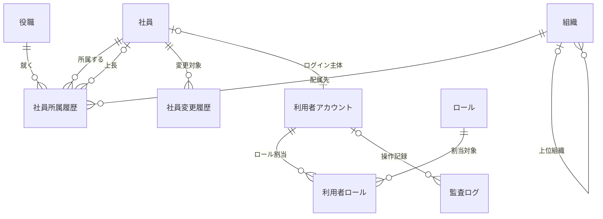

[← 設計書一覧（社員名簿管理システム）](README.md)

# 2. 機能要件

社員名簿管理システムが提供する機能の一覧、対象範囲内で想定される全ユースケースの振る舞い、業務情報のデータモデル、社員登録の機能要求詳細、シーケンス図作成要否を定義する。画面項目・API仕様・DB構造・処理ロジックなどの設計詳細は後続の節で定義する。

## 2.1 機能一覧

| 機能ID | 機能名 | 概要 | 主な利用者 |
|---|---|---|---|
| F-001 | ログイン | 社内認証基盤を利用してシステムへログインする | 全利用者 |
| F-002 | 社員検索 | 条件を指定して閲覧可能な社員を検索する | 全利用者 |
| F-003 | 社員詳細参照 | 社員の基本情報・所属・役職・在籍状態を参照する | 全利用者 |
| F-004 | 社員登録 | 新しい社員の基本情報と初期所属を登録する | 人事担当者 |
| F-005 | 社員基本情報更新 | 氏名・連絡先などの社員基本情報を更新する | 人事担当者、条件付きで本人 |
| F-006 | 社員異動 | 所属・役職・上長を有効日付きで変更する | 人事担当者 |
| F-007 | 退職処理 | 退職日を登録し、社員状態を退職へ変更する | 人事担当者 |
| F-008 | 変更履歴参照 | 社員情報の変更履歴を参照する | 人事担当者、システム管理者 |
| F-009 | 検索結果出力 | 検索結果を許可された項目で出力する | 人事担当者、部門管理者 |
| F-010 | 組織マスター管理 | 組織の登録・変更・無効化を行う | システム管理者 |
| F-011 | 役職マスター管理 | 役職の登録・変更・無効化を行う | システム管理者 |
| F-012 | 権限管理 | 利用者へロールを割り当てる | システム管理者 |
| F-013 | ログアウト | ブラウザー内の認証状態と個人情報を破棄して未認証状態へ戻す | 全利用者 |
| F-014 | 退職日到来反映 | 退職日が到来した退職予定を日次処理で退職状態へ反映する | システム（Cron Trigger／Queue） |

## 2.2 ユースケース

§1.7の対象範囲、F-001〜F-014、利用者操作、クライアント共通操作、定期・非同期起動を照合し、想定される全ユースケースを定義する。選択肢取得等の補助APIは親ユースケースのフローに含め、独立した主アクター・目的・起動契機を持つログアウトと退職日到来反映は別ユースケースとする。

| UC-ID | ユースケース | 主アクター／起動元 | 起動契機 | 対応機能(F-ID) | 主な実現境界 |
|---|---|---|---|---|---|
| UC-001 | 社員を登録する | 人事担当者 | 社員登録の指示 | F-004 | SCR-003、API-003（API-008・API-009は候補取得） |
| UC-002 | 社員を検索する | 全利用者 | 検索実行 | F-002 | SCR-001、API-001 |
| UC-003 | 社員を異動する | 人事担当者 | 異動登録の指示 | F-006 | SCR-005、API-005（API-001・API-002・API-008・API-009は補助） |
| UC-004 | 社員を退職にする | 人事担当者 | 退職処理の指示 | F-007 | SCR-006、API-006 |
| UC-005 | ログインする | 全利用者 | 認証情報の送信 | F-001 | SCR-010、API-010 |
| UC-006 | 社員詳細を参照する | 全利用者 | 社員の選択 | F-003 | SCR-002、API-002 |
| UC-007 | 社員基本情報を更新する | 人事担当者・一般社員（本人） | 基本情報更新の指示 | F-005 | SCR-004、API-004 |
| UC-008 | 変更履歴を参照する | 人事担当者・システム管理者 | 変更履歴の参照 | F-008 | SCR-007、API-007 |
| UC-009 | 検索結果を出力する | 人事担当者・部門管理者 | 検索結果の出力 | F-009 | SCR-001、API-018 |
| UC-010 | 組織マスターを管理する | システム管理者 | 一覧参照・登録・更新・無効化 | F-010 | SCR-008、API-008・API-011・API-012 |
| UC-011 | 役職マスターを管理する | システム管理者 | 一覧参照・登録・更新・無効化 | F-011 | SCR-009、API-009・API-013・API-014 |
| UC-012 | 権限を管理する | システム管理者 | ロール参照・割当更新 | F-012 | SCR-011、API-015〜API-017 |
| UC-013 | ログアウトする | 全利用者 | 共通ヘッダーのログアウト、認証失効 | F-013 | M-001のクライアント内処理。API・JOB・DBなし |
| UC-014 | 退職日到来を自動反映する | Cron Trigger／Cloudflare Queues | 日次Cron、Queue配信・再配信 | F-014 | JOB-001、M-002/IF-07。画面・APIなし |

### 【UC-001】社員を登録する（人事担当者向け）
入社する社員の基本情報と初期所属を、一意性・マスター有効性を確認したうえで登録する（F-004）。

| 項目 | 内容 |
|---|---|
| 対応機能 | F-004 |
| 主アクター | 人事担当者 |
| 目的 | 入社する社員の基本情報と初期所属を登録する |
| 事前条件 | 人事担当者として認証済みで登録権限を持ち、選択対象の組織・役職マスターが入社日時点で有効であること |
| 起動契機 | 人事担当者が社員登録を選択する |
| 正常終了 | 社員基本情報と初期所属履歴が登録され、社員詳細を表示する |
| 異常終了 | 登録せず、入力不備・一意性違反・マスター無効・権限不足を通知する |

**事前条件**

| No | 条件 |
|---|---|
| 1 | 人事担当者として社内認証基盤で認証済みであること |
| 2 | 社員登録の権限を保有していること |
| 3 | 選択対象の組織・役職マスターが入社日時点で有効に存在すること |

**事後条件**

| No | 条件 |
|---|---|
| 1 | 社員基本情報が在籍中の状態で登録される |
| 2 | 初期所属履歴（所属組織・役職・適用開始日）が登録される |
| 3 | 登録内容が変更履歴に記録される |
| 4 | 登録操作が監査ログに記録される |

**入力データ**

| 情報 | 要否 | 内容 |
|---|---|---|
| 社員番号 | 必須 | 会社内で一意な業務識別子 |
| 氏名（姓・名） | 必須 | 社員の氏名 |
| 氏名カナ（姓・名） | 任意 | 社員の氏名カナ |
| メールアドレス | 必須 | 所定形式かつ一意 |
| 入社日 | 必須 | 有効な日付 |
| 雇用区分 | 必須 | §2.6の雇用区分から選択 |
| 所属組織 | 必須 | 有効な組織から選択 |
| 役職 | 必須 | 有効な役職から選択 |

**出力データ**

| 情報 | 内容 |
|---|---|
| 登録結果 | 登録の成否 |
| 社員詳細 | 登録された社員の基本情報・初期所属 |
| エラー内容 | 入力不備・重複・マスター無効・権限不足などの理由 |

**状態パターン**

| パターンID | 実行権限 | 入力妥当性 | 一意性（社員番号・メール） | マスター有効性 | 任意項目（カナ） | 結果(事後状態) | 対応フロー |
|---|---|---|---|---|---|---|---|
| SP-1 | あり | 妥当 | 一意 | 有効 | 入力 | 在籍中で登録 | 基本フロー |
| SP-2 | あり | 妥当 | 一意 | 有効 | 省略 | 在籍中で登録 | ALT-1 |
| SP-3 | なし | － | － | － | － | 未登録 | EXC-1 |
| SP-4 | あり | 不備あり | － | － | － | 未登録 | EXC-2 |
| SP-5 | あり | 妥当 | 社員番号が重複 | － | － | 未登録 | EXC-3 |
| SP-6 | あり | 妥当 | メールが重複 | － | － | 未登録 | EXC-4 |
| SP-7 | あり | 妥当 | 一意 | 無効 | － | 未登録 | EXC-5 |

**基本フロー**

| Step | アクター | 操作/処理 | 結果 |
|---|---|---|---|
| 1 | 人事担当者 | 社員登録画面を開く | 登録フォームが表示される |
| 2 | システム | 有効な組織・役職マスターを取得する | 選択肢が表示される |
| 3 | 人事担当者 | 社員情報を入力し登録を指示する | 入力内容が送信される |
| 4 | システム | 実行権限を確認する | 権限ありと判定 |
| 5 | システム | 入力値の形式・必須項目を検証する | 妥当と判定 |
| 6 | システム | 社員番号・メールアドレスの重複を確認する | 重複なしと判定 |
| 7 | システム | 組織・役職マスターが入社日時点で有効であることを同一登録TX内で再確認する | 有効と判定 |
| 8 | システム | 社員基本情報を在籍中で登録する | 社員が登録される |
| 9 | システム | 初期所属履歴を登録する | 所属履歴が登録される |
| 10 | システム | 変更履歴・監査ログを記録する | 記録される |
| 11 | システム | 登録結果を表示する | 社員詳細が表示される |

**代替フロー**

| ALT ID | 分岐Step | 条件 | フロー |
|---|---|---|---|
| ALT-1 | 3 | 任意項目（氏名カナ）を入力せずに登録した | 任意項目を未設定として扱い、基本フローStep4以降を継続して登録する |

**例外フロー**

| EXC ID | 発生Step | 条件 | エラーメッセージ | 対応 |
|---|---|---|---|---|
| EXC-1 | 4 | 実行権限がない | 社員を登録する権限がありません。 | 登録せず処理を中断する |
| EXC-2 | 5 | 必須項目の未入力または形式不正 | 入力内容に誤りがあります。対象項目をご確認ください。 | 対象項目と理由を表示し、登録しない |
| EXC-3 | 6 | 社員番号が既に登録済み | 社員番号は既に登録されています。 | 重複を表示し、登録しない |
| EXC-4 | 6 | メールアドレスが既に登録済み | メールアドレスは既に登録されています。 | 重複を表示し、登録しない |
| EXC-5 | 7 | 選択した組織または役職が入社日時点で無効 | 選択した組織または役職は入社日に利用できません。最新の内容を選択してください。 | 再選択を促し、登録しない |

---

### 【UC-002】社員を検索する（全利用者向け）
利用者が条件を指定し、閲覧権限の範囲内で社員を検索して一覧表示する（F-002）。

| 項目 | 内容 |
|---|---|
| 対応機能 | F-002 |
| 主アクター | 全利用者（人事担当者・部門管理者・一般社員・システム管理者） |
| 目的 | 権限範囲内の社員を条件検索する |
| 事前条件 | 認証済みで、閲覧可能な範囲が定まっていること |
| 起動契機 | 利用者が検索条件を入力し検索を実行する |
| 正常終了 | 条件と権限に一致する社員一覧を表示する |
| 異常終了 | 検索を実行せず、認証切れを通知する（該当0件は0件として通知する） |

**事前条件**

| No | 条件 |
|---|---|
| 1 | 利用者が社内認証基盤で認証済みであること |
| 2 | 利用者に閲覧可能な範囲（ロール・所属）が定まっていること |

**事後条件**

| No | 条件 |
|---|---|
| 1 | 条件と閲覧権限に一致する社員一覧が表示される |
| 2 | 表示項目は利用者ロールに応じて表示可能な項目に限定される |

**入力データ**

| 情報 | 要否 | 内容 |
|---|---|---|
| 社員番号 | 任意 | 検索キーの社員番号 |
| 氏名 | 任意 | 姓名を対象とした検索キー |
| 所属組織 | 任意 | 閲覧可能な組織から選択 |
| 役職 | 任意 | 役職から選択 |
| 在籍状態 | 任意 | 在籍中・退職・すべて |

**出力データ**

| 情報 | 内容 |
|---|---|
| 社員一覧 | 条件・権限に一致する社員の一覧（表示可能項目に限定） |
| 該当件数 | 条件に一致した件数 |
| メッセージ | 該当なし・認証切れなどの通知 |

**状態パターン**

| パターンID | 認証状態 | 閲覧権限内の該当 | 結果(事後状態) | 対応フロー |
|---|---|---|---|---|
| SP-1 | 有効 | 該当あり | 権限内の社員一覧を表示 | 基本フロー |
| SP-2 | 有効 | 該当なし（条件不一致または全件権限外） | 0件を表示 | ALT-1 |
| SP-3 | 無効（セッション切れ等） | － | 検索不可 | EXC-1 |

**基本フロー**

| Step | アクター | 操作/処理 | 結果 |
|---|---|---|---|
| 1 | 利用者 | 社員検索画面で検索条件を入力し検索を実行する | 条件が送信される |
| 2 | システム | 認証状態を確認する | 認証有効と判定 |
| 3 | システム | 利用者の閲覧可能範囲を取得する | 閲覧条件が定まる |
| 4 | システム | 検索条件と閲覧条件で社員を検索する | 該当社員が抽出される |
| 5 | システム | 表示可能項目に限定した一覧を生成する | 一覧が生成される |
| 6 | システム | 検索結果を表示する | 社員一覧と該当件数が表示される |

**代替フロー**

| ALT ID | 分岐Step | 条件 | フロー |
|---|---|---|---|
| ALT-1 | 4 | 条件・権限に一致する社員が存在しない | 0件である旨を表示し、一覧を空で返す |

**例外フロー**

| EXC ID | 発生Step | 条件 | エラーメッセージ | 対応 |
|---|---|---|---|---|
| EXC-1 | 2 | 認証が無効（セッション切れ等） | セッションの有効期限が切れました。再度ログインしてください。 | 検索を実行せず、ログインへ誘導する |

---

### 【UC-003】社員を異動する（人事担当者向け）
在籍中の社員の所属・役職を、指定日を基準に履歴として整合的に変更する（F-006）。

| 項目 | 内容 |
|---|---|
| 対応機能 | F-006 |
| 主アクター | 人事担当者 |
| 目的 | 指定日付で社員の所属・役職を変更する |
| 事前条件 | 異動権限を持ち、対象社員が在籍中で、異動先の組織・役職マスターが異動日時点で有効であること。指定上長は在籍中かつ退職予定未登録であること |
| 起動契機 | 人事担当者が社員異動を選択する |
| 正常終了 | 現所属履歴を終了し、新しい所属履歴を登録する |
| 異常終了 | 更新せず、権限不足・退職済み・マスター無効・期間重複・過去日の指定を通知する |

**事前条件**

| No | 条件 |
|---|---|
| 1 | 人事担当者として認証済みで、異動の権限を保有していること |
| 2 | 対象社員が存在し、在籍中であること |
| 3 | 異動先の組織・役職マスターが異動日時点で有効であり、指定時の上長社員が在籍中かつ退職予定未登録であること。新所属は終了日未指定のため、退職予定がある上長は異動日が退職日前でも指定しない |

**事後条件**

| No | 条件 |
|---|---|
| 1 | 異動日の直前に有効な所属履歴が異動日の前日で終了する |
| 2 | 異動日以降に開始する既存の将来所属予約を取消し、異動日を開始日とする新しい所属履歴が登録される |
| 3 | 異動内容が変更履歴に記録される |
| 4 | 異動操作が監査ログに記録される |

**入力データ**

| 情報 | 要否 | 内容 |
|---|---|---|
| 対象社員 | 必須 | 異動対象の社員 |
| 異動先組織 | 必須 | 有効な組織から選択 |
| 異動先役職 | 必須 | 有効な役職から選択 |
| 異動日（適用開始日） | 必須 | 業務日当日または未来の有効な日付。過去日の遡及異動は本機能の対象外 |
| 上長社員 | 任意 | 異動先の上長 |

**出力データ**

| 情報 | 内容 |
|---|---|
| 異動結果 | 異動の成否 |
| 更新後所属 | 異動後の所属・役職 |
| エラー内容 | 権限不足・退職済み・マスター無効・期間重複・異動日不正の理由 |

**状態パターン**

| パターンID | 実行権限 | 対象社員状態 | マスター有効性 | 期間整合性 | 異動日区分 | 結果(事後状態) | 対応フロー |
|---|---|---|---|---|---|---|---|
| SP-1 | あり | 在籍中 | 有効 | 整合 | 当日 | 所属履歴を更新 | 基本フロー |
| SP-2 | あり | 在籍中 | 有効 | 整合 | 未来日付 | 将来の所属履歴として登録 | ALT-1 |
| SP-3 | なし | － | － | － | － | 未更新 | EXC-1 |
| SP-4 | あり | 退職済み／存在しない | － | － | － | 未更新 | EXC-2 |
| SP-5 | あり | 在籍中 | 無効 | － | － | 未更新 | EXC-3 |
| SP-6 | あり | 在籍中 | 有効 | 重複あり | － | 未更新 | EXC-4 |
| SP-7 | あり | 在籍中 | － | － | 過去日 | 未更新 | EXC-5 |

**基本フロー**

| Step | アクター | 操作/処理 | 結果 |
|---|---|---|---|
| 1 | 人事担当者 | 社員異動画面で異動先・異動日を入力し異動を指示する | 入力が送信される |
| 2 | システム | 実行権限を確認する | 権限ありと判定 |
| 3 | システム | 対象社員の在籍状態を確認する | 在籍中と判定 |
| 4 | システム | 異動先組織・役職マスターの異動日時点の有効性と、指定上長が在籍中かつ退職予定未登録であることを確認する | 有効と判定 |
| 5 | システム | 異動日が業務日以降であることと所属履歴の期間重複を確認する | 日付妥当かつ重複なしと判定 |
| 6 | システム | 異動日の直前に有効な所属を前日で終了し、異動日以降の将来所属予約を取消す | 指定日以降を置換可能な状態になる |
| 7 | システム | 異動日を開始日とする新所属履歴を登録する | 新履歴が登録される |
| 8 | システム | 変更履歴・監査ログを記録する | 記録される |
| 9 | システム | 更新後の所属を表示する | 異動結果が表示される |

**代替フロー**

| ALT ID | 分岐Step | 条件 | フロー |
|---|---|---|---|
| ALT-1 | 5 | 異動日が未来日付である | 異動日直前の所属を前日で終了予約し、異動日以降の既存将来予約を取消して、新所属を将来の適用開始日で登録する（基本フローStep6以降に相当） |

**例外フロー**

| EXC ID | 発生Step | 条件 | エラーメッセージ | 対応 |
|---|---|---|---|---|
| EXC-1 | 2 | 実行権限がない | 社員を異動する権限がありません。 | 更新せず処理を中断する |
| EXC-2 | 3 | 対象社員が退職済み（または存在しない） | 対象の社員は在籍していないため異動できません。 | 更新しない |
| EXC-3 | 4 | 異動先の組織・役職が異動日時点で無効、または指定上長が不存在・本人・非在籍・退職予定登録済み | 選択した組織・役職または上長は指定日に利用できません。 | 再選択を促し、更新しない |
| EXC-4 | 5 | 所属履歴の有効期間が重複する | 指定した異動日は既存の所属期間と重複します。 | 更新しない |
| EXC-5 | 5 | 異動日が業務日より前である | 過去日を指定した異動は登録できません。本日以降の日付を指定してください。 | 更新しない。遡及訂正は別途データ訂正手続で扱う |

---

### 【UC-004】社員を退職にする（人事担当者向け）
在籍中の社員に退職日を登録し、当日以前は即時退職、未来日は退職予定として受け付ける（F-007）。未来日の到来自動反映はUC-014を正本とする。

| 項目 | 内容 |
|---|---|
| 対応機能 | F-007 |
| 主アクター | 人事担当者 |
| 目的 | 退職日を登録して社員状態を退職へ変更する |
| 事前条件 | 退職処理権限を持ち、対象社員が在籍中であること |
| 起動契機 | 人事担当者が退職処理を選択する |
| 正常終了 | 当日以前は退職状態・所属履歴終了を反映し、未来日は在籍状態を維持して退職予定を登録する |
| 異常終了 | 更新せず、権限不足・退職済み・不正な退職日を通知する |

**事前条件**

| No | 条件 |
|---|---|
| 1 | 人事担当者として認証済みで、退職処理の権限を保有していること |
| 2 | 対象社員が存在し、在籍中であること |
| 3 | 対象社員を上長とする所属が退職日当日以後も有効となる場合、先にその部下の上長変更を完了していること |

**事後条件**

| No | 条件 |
|---|---|
| 1 | 退職日が当日以前の場合、社員状態が退職に変更される |
| 2 | 退職日が未来日の場合、社員状態と現所属を維持したまま退職予定が登録される |
| 3 | 退職日の到来時に有効な所属履歴が終了し、退職日より後に開始する将来所属予約が取消される |
| 4 | 退職予定の登録および退職確定が変更履歴・監査ログに記録される |
| 5 | 退職日到来以後は新規ログインおよび発行済みトークンによる保護API利用が拒否される |

**入力データ**

| 情報 | 要否 | 内容 |
|---|---|---|
| 対象社員 | 必須 | 退職対象の社員 |
| 退職日 | 必須 | 有効な日付（入社日以降） |
| 退職区分 | 任意 | §2.6の退職区分から選択。未指定も許容する |

**出力データ**

| 情報 | 内容 |
|---|---|
| 退職結果 | 退職処理の成否 |
| 更新後状態 | 退職状態・退職日 |
| エラー内容 | 権限不足・退職済み・不正な退職日の理由 |

**状態パターン**

| パターンID | 実行権限 | 対象社員状態 | 退職日妥当性 | 退職日区分 | 結果(事後状態) | 対応フロー |
|---|---|---|---|---|---|---|
| SP-1 | あり | 在籍中 | 妥当 | 当日以前 | 退職状態で更新 | 基本フロー |
| SP-2 | あり | 在籍中 | 妥当 | 未来日付 | 退職予約として登録 | ALT-1 |
| SP-3 | なし | － | － | － | 未更新 | EXC-1 |
| SP-4 | あり | 退職済み／存在しない | － | － | 未更新 | EXC-2 |
| SP-5 | あり | 在籍中 | 不正（入社日より前等） | － | 未更新 | EXC-3 |

**基本フロー**

| Step | アクター | 操作/処理 | 結果 |
|---|---|---|---|
| 1 | 人事担当者 | 退職処理画面で退職日を入力し退職処理を指示する | 入力が送信される |
| 2 | システム | 実行権限を確認する | 権限ありと判定 |
| 3 | システム | 対象社員の在籍状態を確認する | 在籍中と判定 |
| 4 | システム | 退職日と、対象社員を上長とする退職日当日以後の所属参照がないことを確認する | 妥当と判定 |
| 5 | システム | 社員状態を退職に変更し退職日を登録する | 状態が退職になる |
| 6 | システム | 退職日に有効な所属履歴を終了し、退職日より後の将来所属予約を取消す | 所属履歴が整合する |
| 7 | システム | 変更履歴・監査ログを記録する | 記録される |
| 8 | システム | 更新後の状態を表示する | 退職結果が表示される |

**代替フロー**

| ALT ID | 分岐Step | 条件 | フロー |
|---|---|---|---|
| ALT-1 | 4 | 退職日が未来日付である | 退職日・退職区分を退職予定として登録し、社員状態と現所属は変更しない。退職日到来後の反映はUC-014／JOB-001へ委ねる |

**例外フロー**

| EXC ID | 発生Step | 条件 | エラーメッセージ | 対応 |
|---|---|---|---|---|
| EXC-1 | 2 | 実行権限がない | 退職処理を行う権限がありません。 | 更新せず処理を中断する |
| EXC-2 | 3 | 対象社員が既に退職済み（または存在しない） | 対象の社員は既に退職しています。 | 更新しない |
| EXC-3 | 4 | 退職日が不正（入社日より前等）、または対象社員を上長とする所属が退職日当日以後も有効 | 退職日または上長割当が不正です。必要な上長変更を先に完了してください。 | 更新しない |

---

### 【UC-005】ログインする（全利用者向け）
全利用者が社内認証基盤による認証を経て、システムへログインしセッションを確立する（F-001）。本UCでいうセッションは、API-010が発行する有効期限付きアクセストークンにより維持する認証状態を指す。

| 項目 | 内容 |
|---|---|
| 対応機能 | F-001 |
| 主アクター | 全利用者（人事担当者・部門管理者・一般社員・システム管理者） |
| 目的 | 社内認証基盤で認証し、システムを利用可能な状態にする |
| 事前条件 | 利用者アカウントが登録済みで、ログイン画面（SCR-010）を表示していること |
| 起動契機 | 利用者が認証情報を入力しログインを実行する |
| 正常終了 | 認証に成功し、セッションが発行されてログイン後の画面へ遷移する |
| 異常終了 | ログインさせず、認証情報の誤り・アカウント無効/ロック、またはトークン生成・成功監査失敗によるログイン処理未完了を通知する |

**事前条件**

| No | 条件 |
|---|---|
| 1 | 利用者アカウントがシステムに登録されていること |
| 2 | 社内認証基盤が利用可能であること |

**事後条件**

| No | 条件 |
|---|---|
| 1 | 認証に成功した利用者へセッションが発行される |
| 2 | 利用者のロール（利用者ロール）が有効化され、以後の権限判定に用いられる |
| 3 | ログイン操作が監査ログに記録される |

**入力データ**

| 情報 | 要否 | 内容 |
|---|---|---|
| ログインID | 必須 | 認証に用いる利用者の識別子 |
| 認証情報 | 必須 | 社内認証基盤で検証するパスワード等の認証情報 |

**出力データ**

| 情報 | 内容 |
|---|---|
| ログイン結果 | 認証の成否 |
| セッション | 発行されたセッション（成功時） |
| エラー内容 | 認証情報の誤り・アカウント無効/ロック、またはログイン処理の内部完了失敗の理由 |

**状態パターン**

| パターンID | 認証情報 | アカウント状態 | トークン生成・成功監査 | 結果(事後状態) | 対応フロー |
|---|---|---|---|---|---|
| SP-1 | 正しい | 有効 | 成功 | ログイン成功（セッション発行） | 基本フロー |
| SP-2 | 誤り | － | 未実施 | ログイン失敗 | EXC-1 |
| SP-3 | － | 無効・ロック | 未実施 | ログイン不可 | EXC-2 |
| SP-4 | 正しい | 有効 | トークン生成または成功監査に失敗 | ログイン失敗（セッション未発行） | EXC-3 |

**基本フロー**

| Step | アクター | 操作/処理 | 結果 |
|---|---|---|---|
| 1 | 利用者 | ログイン画面で認証情報を入力しログインを実行する | 認証情報が送信される |
| 2 | システム | 社内認証基盤に認証を要求する | 認証結果を受け取る |
| 3 | システム | 認証結果を検証する | 認証成功と判定 |
| 4 | システム | 利用者アカウントの有効性（無効・ロック）と、社員紐付きの場合は業務日時点で退職日が未到来であることを確認する | 有効と判定 |
| 5 | システム | 返却前のアクセストークン候補を生成する | トークン候補はまだ利用者へ返さない |
| 6 | システム | ログイン成功操作を監査ログに記録する | 記録される。記録失敗時はトークン候補を破棄する |
| 7 | システム | 監査記録成功後、アクセストークン候補を利用者ロールと紐づくセッションとして発行する | セッションが確立する |
| 8 | システム | ログイン後の画面を表示する | トップ画面へ遷移する |

**代替フロー**

代替フローなし

**例外フロー**

| EXC ID | 発生Step | 条件 | エラーメッセージ | 対応 |
|---|---|---|---|---|
| EXC-1 | 3 | 認証情報が誤っている | ログインIDまたはパスワードが正しくありません。 | ログインさせず、再入力を促す |
| EXC-2 | 4 | アカウントが無効・ロック、または紐づく社員の退職日が到来済み | アカウントが無効またはロックされています。管理者にお問い合わせください。 | ログインさせず処理を中断する。発行済みトークンも後続認可時に拒否する |
| EXC-3 | 5・6 | トークン候補の生成または成功監査の記録に失敗した | ログイン処理を完了できませんでした。時間をおいて再度お試しください。 | トークン候補を破棄して利用者へ返さず、トークン生成失敗は可能な限り失敗監査へ分類して記録し、監査自体の失敗は運用アラートへ記録する |

---

### 【UC-006】社員詳細を参照する（全利用者向け）
利用者が選択した社員の基本情報・所属・役職・在籍状態を、閲覧権限の範囲内で参照する（F-003）。

| 項目 | 内容 |
|---|---|
| 対応機能 | F-003 |
| 主アクター | 全利用者（人事担当者・部門管理者・一般社員・システム管理者） |
| 目的 | 対象社員の詳細情報を権限範囲内で参照する |
| 事前条件 | 認証済みで、参照対象の社員が特定されていること |
| 起動契機 | 利用者が一覧等から社員を選択し詳細参照を実行する |
| 正常終了 | 権限に応じた項目で社員詳細を表示する |
| 異常終了 | 参照させず、対象不存在・閲覧権限なしを通知する |

**事前条件**

| No | 条件 |
|---|---|
| 1 | 利用者が社内認証基盤で認証済みであること |
| 2 | 参照対象の社員が特定されていること |

**事後条件**

| No | 条件 |
|---|---|
| 1 | 対象社員の基本情報・所属・役職・在籍状態が表示される |
| 2 | 表示項目は利用者ロールに応じて表示可能な項目に限定される |

**入力データ**

| 情報 | 要否 | 内容 |
|---|---|---|
| 対象社員 | 必須 | 参照対象の社員 |

**出力データ**

| 情報 | 内容 |
|---|---|
| 社員詳細 | 基本情報・所属・役職・在籍状態（表示可能項目に限定） |
| メッセージ | 対象不存在・閲覧権限なしなどの通知 |

**状態パターン**

| パターンID | 対象社員存在 | 閲覧権限 | 結果(事後状態) | 対応フロー |
|---|---|---|---|---|
| SP-1 | 存在 | 範囲内 | 権限に応じた項目で詳細表示 | 基本フロー |
| SP-2 | 存在しない | － | 参照不可 | EXC-1 |
| SP-3 | 存在 | 範囲外 | 参照不可 | EXC-2 |

**基本フロー**

| Step | アクター | 操作/処理 | 結果 |
|---|---|---|---|
| 1 | 利用者 | 社員詳細画面で対象社員を選択し詳細参照を実行する | 参照要求が送信される |
| 2 | システム | 対象社員の存在を確認する | 存在すると判定 |
| 3 | システム | 利用者の閲覧権限（範囲）を確認する | 権限内と判定 |
| 4 | システム | 権限に応じた表示可能項目で社員詳細を取得する | 詳細が取得される |
| 5 | システム | 社員詳細を表示する | 基本情報・所属・役職・在籍状態が表示される |

**代替フロー**

代替フローなし

**例外フロー**

| EXC ID | 発生Step | 条件 | エラーメッセージ | 対応 |
|---|---|---|---|---|
| EXC-1 | 2 | 対象社員が存在しない | 対象の社員が見つかりません。 | 参照させず、一覧へ戻す |
| EXC-2 | 3 | 対象社員の閲覧権限がない（範囲外） | この社員を参照する権限がありません。 | 参照させず処理を中断する |

---

### 【UC-007】社員基本情報を更新する（人事担当者・一般社員（本人）向け）
人事担当者（一部項目は本人）が社員の氏名・連絡先などの基本情報を、一意性と更新競合を確認したうえで更新する（F-005）。

| 項目 | 内容 |
|---|---|
| 対応機能 | F-005 |
| 主アクター | 人事担当者（一部項目は本人による更新も可） |
| 目的 | 社員の氏名・連絡先などの基本情報を更新する |
| 事前条件 | 更新権限を持ち、対象社員が存在し、更新前の社員基本情報を取得済みであること |
| 起動契機 | 人事担当者（または本人）が社員基本情報の更新を指示する |
| 正常終了 | 検証を経て社員基本情報が更新され、変更履歴・監査ログが記録される |
| 異常終了 | 更新せず、権限不足・入力不備・メール重複・更新競合を通知する |

**事前条件**

| No | 条件 |
|---|---|
| 1 | 人事担当者（または本人）として社内認証基盤で認証済みであること |
| 2 | 対象社員が存在すること |
| 3 | 更新前の社員基本情報（版数を含む）を取得していること |

**事後条件**

| No | 条件 |
|---|---|
| 1 | 社員基本情報が更新される |
| 2 | 更新内容が変更履歴に記録される |
| 3 | 更新操作が監査ログに記録される |

**入力データ**

| 情報 | 要否 | 内容 |
|---|---|---|
| 対象社員 | 必須 | 更新対象の社員 |
| 氏名（姓・名） | 任意 | 更新後の氏名 |
| 氏名カナ（姓・名） | 任意 | 更新後の氏名カナ |
| メールアドレス | 任意 | 所定形式かつ一意 |
| 連絡先 | 任意 | 電話番号などの連絡先 |
| 雇用区分 | 任意 | 人事担当者だけが§2.6の雇用区分へ変更可能 |
| 版数（取得時点の値） | 必須 | 更新競合検出のための取得時点の版数 |

**出力データ**

| 情報 | 内容 |
|---|---|
| 更新結果 | 更新の成否 |
| 更新後社員情報 | 更新後の基本情報 |
| エラー内容 | 権限不足・入力不備・メール重複・更新競合の理由 |

**状態パターン**

| パターンID | 実行権限 | 入力妥当性 | メール一意性 | 更新競合 | 結果(事後状態) | 対応フロー |
|---|---|---|---|---|---|---|
| SP-1 | あり | 妥当 | 一意 | なし | 基本情報を更新 | 基本フロー |
| SP-2 | なし | － | － | － | 未更新 | EXC-1 |
| SP-3 | あり | 不備あり | － | － | 未更新 | EXC-2 |
| SP-4 | あり | 妥当 | 重複 | － | 未更新 | EXC-3 |
| SP-5 | あり | 妥当 | 一意 | あり | 未更新（最新再取得を要求） | EXC-4 |

**基本フロー**

| Step | アクター | 操作/処理 | 結果 |
|---|---|---|---|
| 1 | 人事担当者または一般社員（本人） | 社員編集画面で許可された基本情報を編集し更新を指示する | 入力が送信される |
| 2 | システム | 実行権限を確認する | 権限ありと判定 |
| 3 | システム | 入力値の形式・必須項目を検証する | 妥当と判定 |
| 4 | システム | メールアドレスの重複を確認する | 重複なしと判定 |
| 5 | システム | 取得時の版数と現在の版数が一致するか確認する | 競合なしと判定 |
| 6 | システム | 社員基本情報を更新する | 基本情報が更新される |
| 7 | システム | 変更履歴・監査ログを記録する | 記録される |
| 8 | システム | 更新後の情報を表示する | 更新結果が表示される |

**代替フロー**

代替フローなし

**例外フロー**

| EXC ID | 発生Step | 条件 | エラーメッセージ | 対応 |
|---|---|---|---|---|
| EXC-1 | 2 | 実行権限がない | 社員情報を更新する権限がありません。 | 更新せず処理を中断する |
| EXC-2 | 3 | 必須項目の未入力または形式不正 | 入力内容に誤りがあります。対象項目をご確認ください。 | 対象項目と理由を表示し、更新しない |
| EXC-3 | 4 | メールアドレスが既に登録済み | メールアドレスは既に登録されています。 | 重複を表示し、更新しない |
| EXC-4 | 5 | 取得時点から他の更新があり版数が一致しない | 他の利用者による更新があったため、最新の内容を再取得してください。 | 更新せず、最新の再取得を促す |

---

### 【UC-008】変更履歴を参照する（人事担当者・システム管理者向け）
人事担当者・システム管理者が社員情報の変更履歴を、参照権限の範囲内で時系列に参照する（F-008）。

| 項目 | 内容 |
|---|---|
| 対応機能 | F-008 |
| 主アクター | 人事担当者・システム管理者 |
| 目的 | 社員情報の変更履歴を参照する |
| 事前条件 | 変更履歴の参照権限を持ち、対象社員が特定されていること |
| 起動契機 | 利用者が変更履歴の参照を実行する |
| 正常終了 | 対象の変更履歴を時系列で一覧表示する（0件のときは0件と表示する） |
| 異常終了 | 参照させず、参照権限なしを通知する |

**事前条件**

| No | 条件 |
|---|---|
| 1 | 人事担当者またはシステム管理者として認証済みであること |
| 2 | 変更履歴の参照権限を保有していること |

**事後条件**

| No | 条件 |
|---|---|
| 1 | 対象の変更履歴が変更日時の新しい順で一覧表示される |
| 2 | 該当する変更履歴がない場合は0件として表示される |

**入力データ**

| 情報 | 要否 | 内容 |
|---|---|---|
| 対象社員 | 必須 | 参照対象の社員 |
| 期間 | 任意 | 変更日時の絞り込み期間 |
| 変更種別 | 任意 | 登録・更新・異動・退職などの種別 |

**出力データ**

| 情報 | 内容 |
|---|---|
| 変更履歴一覧 | 変更日時・変更者・変更種別・変更内容の一覧 |
| 該当件数 | 条件に一致した件数 |
| メッセージ | 該当なし・参照権限なしなどの通知 |

**状態パターン**

| パターンID | 参照権限 | 履歴の有無 | 結果(事後状態) | 対応フロー |
|---|---|---|---|---|
| SP-1 | あり | あり | 変更履歴一覧を表示 | 基本フロー |
| SP-2 | あり | なし | 0件を表示 | ALT-1 |
| SP-3 | なし | － | 参照不可 | EXC-1 |

**基本フロー**

| Step | アクター | 操作/処理 | 結果 |
|---|---|---|---|
| 1 | 利用者 | 変更履歴画面で対象・条件を指定し参照を実行する | 条件が送信される |
| 2 | システム | 変更履歴の参照権限を確認する | 権限ありと判定 |
| 3 | システム | 条件に一致する変更履歴を取得する | 該当履歴が抽出される |
| 4 | システム | 変更日時の新しい順に一覧を生成する | 一覧が生成される |
| 5 | システム | 変更履歴一覧を表示する | 履歴一覧と該当件数が表示される |

**代替フロー**

| ALT ID | 分岐Step | 条件 | フロー |
|---|---|---|---|
| ALT-1 | 3 | 条件に一致する変更履歴が存在しない | 該当する履歴が0件である旨を表示し、一覧を空で返す（基本フローStep5に相当） |

**例外フロー**

| EXC ID | 発生Step | 条件 | エラーメッセージ | 対応 |
|---|---|---|---|---|
| EXC-1 | 2 | 変更履歴の参照権限がない | 変更履歴を参照する権限がありません。 | 参照させず処理を中断する |

---

### 【UC-009】検索結果を出力する（人事担当者・部門管理者向け）
人事担当者・部門管理者が社員検索結果を、許可された項目に限定して出力し、出力操作を監査記録する（F-009）。

| 項目 | 内容 |
|---|---|
| 対応機能 | F-009 |
| 主アクター | 人事担当者・部門管理者 |
| 目的 | 社員検索結果を許可された項目で出力する |
| 事前条件 | 出力権限を持ち、社員検索により出力対象が確定していること |
| 起動契機 | 利用者が検索結果に対して出力を実行する |
| 正常終了 | 許可項目に限定した出力データを生成し、出力操作を監査ログに記録する |
| 異常終了 | 出力せず、出力権限なしを通知する（出力対象0件は0件として通知する） |

**事前条件**

| No | 条件 |
|---|---|
| 1 | 人事担当者または部門管理者として認証済みであること |
| 2 | 検索結果の出力権限を保有していること |
| 3 | 社員検索を実行し、出力対象（検索条件・結果）が確定していること |

**事後条件**

| No | 条件 |
|---|---|
| 1 | 許可された項目に限定した出力データが生成される |
| 2 | 出力操作（出力者・出力条件・出力件数）が監査ログに記録される |

**入力データ**

| 情報 | 要否 | 内容 |
|---|---|---|
| 出力対象 | 必須 | 出力対象の検索条件・結果 |
| 出力項目 | 任意 | 許可された範囲で選択する出力項目 |
| 出力形式 | 任意 | 定義済み形式から選択 |

**出力データ**

| 情報 | 内容 |
|---|---|
| 出力結果 | 出力の成否 |
| 出力データ | 許可項目に限定した検索結果の出力 |
| メッセージ | 出力対象なし・出力権限なしなどの通知 |

**状態パターン**

| パターンID | 出力権限 | 出力対象 | 結果(事後状態) | 対応フロー |
|---|---|---|---|---|
| SP-1 | あり | あり | 許可項目で出力し監査記録 | 基本フロー |
| SP-2 | あり | 0件 | 出力対象なしを通知 | ALT-1 |
| SP-3 | なし | － | 出力不可 | EXC-1 |

**基本フロー**

| Step | アクター | 操作/処理 | 結果 |
|---|---|---|---|
| 1 | 利用者 | 社員検索画面で検索結果に対し出力を実行する | 出力要求が送信される |
| 2 | システム | 検索結果の出力権限を確認する | 権限ありと判定 |
| 3 | システム | 出力対象の件数を確認する | 1件以上と判定 |
| 4 | システム | 許可された項目に限定して出力データを生成する | 出力データが生成される |
| 5 | システム | 出力操作を監査ログに記録する | 記録される |
| 6 | システム | 出力データを提供する | 出力が完了する |

**代替フロー**

| ALT ID | 分岐Step | 条件 | フロー |
|---|---|---|---|
| ALT-1 | 3 | 出力対象が0件である | 出力対象がない旨を通知し、出力データを生成しない |

**例外フロー**

| EXC ID | 発生Step | 条件 | エラーメッセージ | 対応 |
|---|---|---|---|---|
| EXC-1 | 2 | 検索結果の出力権限がない | 検索結果を出力する権限がありません。 | 出力せず処理を中断する |

---

### 【UC-010】組織マスターを管理する（システム管理者向け）
システム管理者が組織マスターの登録・更新・無効化を、組織コードの一意性を確認したうえで行う（F-010）。

| 項目 | 内容 |
|---|---|
| 対応機能 | F-010 |
| 主アクター | システム管理者 |
| 目的 | 組織マスターを登録・更新・無効化する |
| 事前条件 | 組織マスター管理権限を持ち、更新・無効化時は対象組織が存在すること |
| 起動契機 | システム管理者が組織マスターの登録・更新・無効化を指示する |
| 正常終了 | 組織マスターが登録・更新され、または無効化される |
| 異常終了 | 反映せず、権限不足・入力不備・組織コード重複・階層または所属参照不整合を通知する |

**事前条件**

| No | 条件 |
|---|---|
| 1 | システム管理者として認証済みで、組織マスター管理の権限を保有していること |
| 2 | 更新・無効化の場合、対象組織が存在すること |

**事後条件**

| No | 条件 |
|---|---|
| 1 | 登録・更新の場合、組織マスターが登録または更新される |
| 2 | 無効化の場合、対象組織の利用状態が即時に無効になる。有効終了日は指定した場合だけ更新し、未指定時は変更しない |
| 3 | 操作が監査ログに記録される |

**入力データ**

| 情報 | 要否 | 内容 |
|---|---|---|
| 操作区分 | 必須 | 登録・更新・無効化のいずれか |
| 組織コード | 必須 | 会社内で一意な組織識別コード |
| 組織名 | 必須 | 組織の名称（登録・更新時） |
| 上位組織 | 任意 | 親組織 |
| 有効期間 | 任意 | 有効開始日・終了日 |

**出力データ**

| 情報 | 内容 |
|---|---|
| 反映結果 | 登録・更新・無効化の成否 |
| 更新後組織 | 反映後の組織マスター内容 |
| エラー内容 | 権限不足・入力不備・組織コード重複の理由 |

**状態パターン**

| パターンID | 実行権限 | 操作区分 | 入力妥当性 | 組織コード一意性 | 結果(事後状態) | 対応フロー |
|---|---|---|---|---|---|---|
| SP-1 | あり | 登録・更新 | 妥当 | 一意 | 組織を登録・更新 | 基本フロー |
| SP-2 | あり | 無効化 | 妥当 | － | 即時に利用停止し、指定時だけ有効終了日を更新 | ALT-1 |
| SP-3 | なし | － | － | － | 未反映 | EXC-1 |
| SP-4 | あり | 登録・更新 | 不備あり | － | 未反映 | EXC-2 |
| SP-5 | あり | 登録・更新 | 妥当 | 重複 | 未反映 | EXC-3 |

**基本フロー**

| Step | アクター | 操作/処理 | 結果 |
|---|---|---|---|
| 1 | システム管理者 | 組織マスター画面で組織情報を入力し登録・更新を指示する | 入力が送信される |
| 2 | システム | 実行権限を確認する | 権限ありと判定 |
| 3 | システム | 入力値、親子の有効期間包含、循環、有効な子組織と現在・将来所属への影響を検証する | 妥当と判定 |
| 4 | システム | 組織コードの一意性を確認する | 一意と判定 |
| 5 | システム | 組織マスターを登録・更新する | 組織が登録・更新される |
| 6 | システム | 操作を監査ログに記録する | 記録される |
| 7 | システム | 反映後の組織を表示する | 反映結果が表示される |

**代替フロー**

| ALT ID | 分岐Step | 条件 | フロー |
|---|---|---|---|
| ALT-1 | 2 | 操作区分が無効化である | 対象組織の利用状態を即時に無効へ更新する。有効終了日は任意とし、指定時だけ有効開始日以降であることを検証して更新し、未指定時は保持する。その後、監査ログを記録する（基本フローStep6以降に相当） |

**例外フロー**

| EXC ID | 発生Step | 条件 | エラーメッセージ | 対応 |
|---|---|---|---|---|
| EXC-1 | 2 | 実行権限がない | 組織マスターを管理する権限がありません。 | 反映せず処理を中断する |
| EXC-2 | 3 | 必須項目・形式・有効期間が不正、親子階層が不整合、または有効な子組織・現在/将来所属が参照不能となる | 入力内容または参照中の組織階層に不整合があります。 | 対象項目と理由を表示し、反映しない |
| EXC-3 | 4 | 組織コードが既に登録済み | 組織コードは既に登録されています。 | 重複を表示し、反映しない |

---

### 【UC-011】役職マスターを管理する（システム管理者向け）
システム管理者が役職マスターの登録・更新・無効化を、役職コードの一意性を確認したうえで行う（F-011）。

| 項目 | 内容 |
|---|---|
| 対応機能 | F-011 |
| 主アクター | システム管理者 |
| 目的 | 役職マスターを登録・更新・無効化する |
| 事前条件 | 役職マスター管理権限を持ち、更新・無効化時は対象役職が存在すること |
| 起動契機 | システム管理者が役職マスターの登録・更新・無効化を指示する |
| 正常終了 | 役職マスターが登録・更新され、または無効化される |
| 異常終了 | 反映せず、権限不足・入力不備・役職コード重複・所属参照不整合を通知する |

**事前条件**

| No | 条件 |
|---|---|
| 1 | システム管理者として認証済みで、役職マスター管理の権限を保有していること |
| 2 | 更新・無効化の場合、対象役職が存在すること |

**事後条件**

| No | 条件 |
|---|---|
| 1 | 登録・更新の場合、役職マスターが登録または更新される |
| 2 | 無効化の場合、対象役職の利用状態が即時に無効になる。有効終了日は指定した場合だけ更新し、未指定時は変更しない |
| 3 | 操作が監査ログに記録される |

**入力データ**

| 情報 | 要否 | 内容 |
|---|---|---|
| 操作区分 | 必須 | 登録・更新・無効化のいずれか |
| 役職コード | 必須 | 会社内で一意な役職識別コード |
| 役職名 | 必須 | 役職の名称（登録・更新時） |
| 役職ランク | 任意 | 役職の序列・等級 |
| 有効期間 | 任意 | 有効開始日・終了日 |

**出力データ**

| 情報 | 内容 |
|---|---|
| 反映結果 | 登録・更新・無効化の成否 |
| 更新後役職 | 反映後の役職マスター内容 |
| エラー内容 | 権限不足・入力不備・役職コード重複の理由 |

**状態パターン**

| パターンID | 実行権限 | 操作区分 | 入力妥当性 | 役職コード一意性 | 結果(事後状態) | 対応フロー |
|---|---|---|---|---|---|---|
| SP-1 | あり | 登録・更新 | 妥当 | 一意 | 役職を登録・更新 | 基本フロー |
| SP-2 | あり | 無効化 | 妥当 | － | 即時に利用停止し、指定時だけ有効終了日を更新 | ALT-1 |
| SP-3 | なし | － | － | － | 未反映 | EXC-1 |
| SP-4 | あり | 登録・更新 | 不備あり | － | 未反映 | EXC-2 |
| SP-5 | あり | 登録・更新 | 妥当 | 重複 | 未反映 | EXC-3 |

**基本フロー**

| Step | アクター | 操作/処理 | 結果 |
|---|---|---|---|
| 1 | システム管理者 | 役職マスター画面で役職情報を入力し登録・更新を指示する | 入力が送信される |
| 2 | システム | 実行権限を確認する | 権限ありと判定 |
| 3 | システム | 入力値と、無効化・期間短縮による現在・将来所属への影響を検証する | 妥当と判定 |
| 4 | システム | 役職コードの一意性を確認する | 一意と判定 |
| 5 | システム | 役職マスターを登録・更新する | 役職が登録・更新される |
| 6 | システム | 操作を監査ログに記録する | 記録される |
| 7 | システム | 反映後の役職を表示する | 反映結果が表示される |

**代替フロー**

| ALT ID | 分岐Step | 条件 | フロー |
|---|---|---|---|
| ALT-1 | 2 | 操作区分が無効化である | 対象役職の利用状態を即時に無効へ更新する。有効終了日は任意とし、指定時だけ有効開始日以降であることを検証して更新し、未指定時は保持する。その後、監査ログを記録する（基本フローStep6以降に相当） |

**例外フロー**

| EXC ID | 発生Step | 条件 | エラーメッセージ | 対応 |
|---|---|---|---|---|
| EXC-1 | 2 | 実行権限がない | 役職マスターを管理する権限がありません。 | 反映せず処理を中断する |
| EXC-2 | 3 | 必須項目・形式・有効期間が不正、または現在/将来所属が参照不能となる | 入力内容または参照中の所属に不整合があります。 | 対象項目と理由を表示し、反映しない |
| EXC-3 | 4 | 役職コードが既に登録済み | 役職コードは既に登録されています。 | 重複を表示し、反映しない |

---

### 【UC-012】権限を管理する（システム管理者向け）
システム管理者が利用者へのロール割当を、対象利用者の存在とロールの妥当性を確認したうえで更新し、監査記録する（F-012）。

| 項目 | 内容 |
|---|---|
| 対応機能 | F-012 |
| 主アクター | システム管理者 |
| 目的 | 利用者へロールを割り当て、権限を管理する |
| 事前条件 | 権限管理の権限を持ち、ロール割当の対象利用者を特定していること |
| 起動契機 | システム管理者が利用者のロール割当を指示する |
| 正常終了 | 対象利用者のロール割当が更新され、社員変更履歴と監査ログに記録される |
| 異常終了 | 更新せず、権限不足・対象不存在・対象アカウント無効・無効なロール指定・不正な有効期間を通知する |

**事前条件**

| No | 条件 |
|---|---|
| 1 | システム管理者として認証済みで、権限管理の権限を保有していること |
| 2 | ロール（利用者ロール）を管理する対象利用者を特定していること |

**事後条件**

| No | 条件 |
|---|---|
| 1 | 対象利用者のロール割当（利用者ロール）が更新される |
| 2 | 更新後のロールが以後の権限判定に反映される |
| 3 | 対象社員の権限変更が社員変更履歴に記録される |
| 4 | 操作が監査ログに記録される |

**入力データ**

| 情報 | 要否 | 内容 |
|---|---|---|
| 対象利用者 | 必須 | ロールを割り当てる利用者アカウント |
| 割当ロール | 必須 | 定義済みロールから選択 |
| 有効期間 | 任意 | ロール割当の有効開始日・終了日。開始日は未指定時に業務日、指定時は業務日以降とし、過去日の遡及更新は対象外 |

**出力データ**

| 情報 | 内容 |
|---|---|
| 更新結果 | ロール割当更新の成否 |
| 更新後ロール | 対象利用者の更新後ロール割当 |
| エラー内容 | 権限不足・対象不存在・無効なロール指定・期間不正の理由 |

**状態パターン**

| パターンID | 実行権限 | 対象利用者 | ロール・期間妥当性 | 結果(事後状態) | 対応フロー |
|---|---|---|---|---|---|
| SP-1 | あり | 存在 | 妥当 | ロール割当を更新し、変更履歴・監査ログを記録 | 基本フロー |
| SP-2 | なし | － | － | 未更新 | EXC-1 |
| SP-3 | あり | 存在しない | － | 未更新 | EXC-2 |
| SP-4 | あり | 存在 | 無効なロール | 未更新 | EXC-3 |
| SP-5 | あり | 存在 | ロール妥当・期間不正 | 未更新 | EXC-4 |
| SP-6 | あり | アカウント無効 | － | 未更新 | EXC-5 |

**基本フロー**

| Step | アクター | 操作/処理 | 結果 |
|---|---|---|---|
| 1 | システム管理者 | 権限管理画面で対象利用者と割当ロールを指定し更新を指示する | 入力が送信される |
| 2 | システム | 実行権限を確認する | 権限ありと判定 |
| 3 | システム | 対象利用者アカウントの存在を確認する | 存在すると判定 |
| 4 | システム | 指定ロールと有効期間（開始日は業務日以降）の妥当性を確認する | 妥当と判定 |
| 5 | システム | 利用者のロール割当を更新する | ロール割当が更新される |
| 6 | システム | 対象社員の権限変更を社員変更履歴に記録する | ロール割当と同一トランザクションで記録される |
| 7 | システム | 操作を監査ログに記録する | 独立トランザクションで記録される |
| 8 | システム | 更新後のロールを表示する | 更新結果が表示される |

**代替フロー**

代替フローなし

**例外フロー**

| EXC ID | 発生Step | 条件 | エラーメッセージ | 対応 |
|---|---|---|---|---|
| EXC-1 | 2 | 実行権限がない | 権限を管理する権限がありません。 | 更新せず処理を中断する |
| EXC-2 | 3 | 対象の利用者が存在しない | 対象の利用者が見つかりません。 | 更新しない |
| EXC-3 | 4 | 指定したロールが無効（未定義・無効） | 指定したロールは無効です。有効なロールを選択してください。 | 更新しない |
| EXC-4 | 4 | 有効開始日が業務日より前、または割当期間が重複する | 指定したロールの有効期間が不正です。 | 更新しない |
| EXC-5 | 3 | 対象の利用者アカウントが無効である | 対象の利用者アカウントは無効です。 | 更新しない |

---

### 【UC-013】ログアウトする（全利用者向け）
利用者の明示操作または認証失効を契機に、ブラウザータブ内の認証状態と個人情報を破棄し、未認証状態へ安全に収束させる（F-013）。サーバーAPI、JOB、データベースは使用しない。

| 項目 | 内容 |
|---|---|
| 対応機能 | F-013 |
| 主アクター | 全利用者（認証失効時はシステム） |
| 目的 | 利用中の認証状態と画面内情報を破棄し、第三者が継続利用できない未認証状態へ戻す |
| 事前条件 | SCR-001〜SCR-009またはSCR-011を表示中、または保持トークンの失効を検知していること |
| 起動契機 | 共通ヘッダーのログアウト押下、UNAUTHENTICATED応答、アクセストークン期限到来、タブ終了またはアプリケーション再読込 |
| 正常終了 | 進行中要求、アクセストークン、戻り先、画面内の個人情報が破棄され、SCR-010を表示する |
| 異常終了 | 破棄処理を再実行し、認証済み画面へ戻さず未認証状態へ収束する |

**事前条件**

| No | 条件 |
|---|---|
| 1 | 認証済み画面を利用中、または認証状態の消失・失効を検知できること |
| 2 | アクセストークンの保持場所がブラウザータブ内のアプリケーションメモリだけであること |

**事後条件**

| No | 条件 |
|---|---|
| 1 | 進行中のAPI要求と画面操作が停止する |
| 2 | メモリ上のアクセストークンと検証済み戻り先が破棄される |
| 3 | 画面項目・一時表示データに残る個人情報が破棄される |
| 4 | 未認証状態でSCR-010を表示し、保護画面の操作を継続できない |

**入力データ**

| 情報 | 要否 | 内容 |
|---|---|---|
| 終了契機 | 必須 | 明示ログアウト、認証失効、タブ終了、アプリケーション再読込のいずれか |
| 保持認証状態 | 任意 | メモリ上のアクセストークン。既にない場合も許容する |
| 画面一時状態 | 任意 | 検証済み戻り先、入力値、表示中の個人情報、進行中要求 |

**出力データ**

| 情報 | 内容 |
|---|---|
| 認証状態 | 未認証 |
| 遷移先 | SCR-010 |
| サーバー応答 | なし。新規APIを呼び出さない |

**状態パターン**

| パターンID | 起動契機 | 認証状態 | 結果(事後状態) | 対応フロー |
|---|---|---|---|---|
| SP-1 | 明示ログアウト | 認証済み | 認証情報を破棄してSCR-010へ遷移 | 基本フロー |
| SP-2 | 二重押下・再実行 | 既に未認証 | 同じ未認証状態を維持 | ALT-1 |
| SP-3 | UNAUTHENTICATED・期限到来 | 失効 | 認証情報を破棄し、失効通知後にSCR-010へ遷移 | ALT-2 |
| SP-4 | タブ終了・再読込 | 認証状態不問 | メモリ消失後、次回表示をSCR-010から開始 | ALT-3 |

**基本フロー**

| Step | アクター | 操作/処理 | 結果 |
|---|---|---|---|
| 1 | 利用者 | 共通ヘッダーのログアウトを指示する | M-001へログアウトイベントが渡る |
| 2 | システム | 新規操作を無効化し、進行中要求を取り消す | 後続の画面反映を停止する |
| 3 | システム | メモリ上のアクセストークンと検証済み戻り先を破棄する | 認証状態が未認証になる |
| 4 | システム | 画面入力値・表示中の個人情報を破棄する | 保護対象情報が画面に残らない |
| 5 | システム | SCR-010へ遷移する | ログイン画面を表示する |

**代替フロー**

| ALT ID | 分岐Step | 条件 | フロー |
|---|---|---|---|
| ALT-1 | 1 | 二重押下または既に未認証である | 破棄処理を冪等に再実行し、同じ未認証状態でSCR-010を表示する |
| ALT-2 | 1 | APIのUNAUTHENTICATED応答または期限到来を検知した | MSG-12の通知を行い、基本フローStep2〜5を実行する |
| ALT-3 | 1 | タブ終了またはアプリケーション再読込が発生した | メモリ上の認証状態を引き継がず、次回表示時にSCR-010から開始する |

**例外フロー**

例外フローなし。どの起動契機でもサーバー処理へ依存せず、未認証状態への収束を優先する。

---

### 【UC-014】退職日到来を自動反映する（システム向け）
日次CronとQueue配信を契機に、UC-004で登録された退職予定のうち基準日が到来した社員を抽出し、退職状態・所属履歴・変更履歴へ冪等に反映する（F-014）。

| 項目 | 内容 |
|---|---|
| 対応機能 | F-014 |
| 主アクター | Cloudflare Cron Trigger／Cloudflare Queues |
| 目的 | 退職日が到来した退職予定を漏れなく退職状態へ反映する |
| 事前条件 | 日次スケジュールとQueue consumerが有効で、UC-004/SP-2により退職予定が登録され得ること |
| 起動契機 | 日次Cron Trigger、継続Queueメッセージ、失敗メッセージの再配信またはDLQ再投入 |
| 正常終了 | 基準日以前の対象を全チャンクで判定し、反映可能な社員を退職状態へ更新してチェーンを完了する |
| 異常終了 | 不正メッセージを通知して終了するか、一時障害を再配信し、規定回数後はDLQへ移送して運用通知する |

**事前条件**

| No | 条件 |
|---|---|
| 1 | Cron Trigger、Queue Producer、Queue consumer、DLQが構成されていること |
| 2 | Asia/Tokyoの業務日を実行時刻から一意に決定できること |
| 3 | データ更新はJOBから直接行わず、M-002/IF-07を経由してM-006だけがD1へアクセスすること |

**事後条件**

| No | 条件 |
|---|---|
| 1 | 反映対象社員の状態が退職となり、退職日に有効な所属が終了する |
| 2 | 退職日より後に開始する将来所属が取消される |
| 3 | 退職確定が変更履歴・監査ログに記録される |
| 4 | 既反映・競合対象は二重更新せず、失敗対象は運用通知および次回日次処理の再評価対象となる |
| 5 | 後続対象がある場合だけ継続メッセージを投入し、全対象判定後にチェーンを完了する |

**入力データ**

| 情報 | 要否 | 内容 |
|---|---|---|
| 業務日 | 必須 | Asia/Tokyoで確定した退職日到来判定の基準日 |
| チェーン実行識別 | 必須 | 同一日次実行を追跡する識別子 |
| 継続位置 | 任意 | 初回は未指定、継続時は前チャンクの次位置 |
| チャンク番号 | 必須 | 初回1、継続ごとに1加算 |
| 配信メタデータ | 必須 | QueueメッセージIDと配信試行回数。追跡・再配信判定に使用する |

**出力データ**

| 情報 | 内容 |
|---|---|
| 処理件数 | 対象・成功・スキップ・失敗件数 |
| 継続情報 | 後続有無と次位置 |
| 実行結果 | チェーン完了、継続、再配信、DLQ、恒久メッセージエラーのいずれか |
| 運用通知 | 失敗対象ID、エラー分類、実行文数等。個人情報は含めない |

**状態パターン**

| パターンID | メッセージ | 到来対象・後続 | 実行結果 | 結果(事後状態) | 対応フロー |
|---|---|---|---|---|---|
| SP-1 | 妥当 | 1〜40件・後続なし | 反映成功 | 対象を反映してチェーン完了 | 基本フロー |
| SP-2 | 妥当 | 0件・後続なし | 成功 | 無更新でチェーン完了 | ALT-1 |
| SP-3 | 妥当 | 40件・後続あり | 反映成功 | 次チャンクを投入 | ALT-2 |
| SP-4 | 妥当 | 既反映・版数競合を含む | スキップ | 二重更新せず次対象へ継続 | ALT-3 |
| SP-5 | 妥当 | 恒久的な社員単位不整合を含む | 個別失敗 | 失敗を通知し他対象を継続 | ALT-4 |
| SP-6 | 不正 | － | 恒久メッセージエラー | 業務処理せず通知して終了 | EXC-1 |
| SP-7 | 妥当 | － | 一時障害・結果契約違反 | 現メッセージを再配信 | EXC-2 |
| SP-8 | 妥当 | － | 再配信上限到達 | DLQへ移送して未完了を通知 | EXC-3 |

**基本フロー**

| Step | アクター | 操作/処理 | 結果 |
|---|---|---|---|
| 1 | Cron Trigger | 日次スケジュールで処理を起動する | 初回Queueメッセージの生成契機となる |
| 2 | システム | 実行時刻から業務日とチェーン識別を確定し、初回メッセージを投入する | Queueへ投入される |
| 3 | Cloudflare Queues | メッセージをconsumerへ配信する | JOB-001が入力を検証する |
| 4 | システム | JOB-001からM-002/IF-07を1メッセージにつき1回呼び出す | 1チャンクの処理を委譲する |
| 5 | システム | M-006経由で到来対象を安定順に最大40件取得する | 対象一覧と後続有無が確定する |
| 6 | システム | 対象ごとに在籍・退職日・所属・版数を再確認し、退職確定、所属終了、将来所属取消、変更履歴を社員単位で原子反映する | 成功・スキップ・失敗を集計する |
| 7 | システム | 成功対象の監査を記録し、件数・後続情報・実行文数をJOB-001へ返す | 公開結果が確定する |
| 8 | システム | 後続なしを確認して現メッセージを完了し、チェーン完了を記録する | 日次処理が終了する |

**代替フロー**

| ALT ID | 分岐Step | 条件 | フロー |
|---|---|---|---|
| ALT-1 | 5 | 到来対象が0件である | 更新を行わず基本フローStep8へ進み、正常完了する |
| ALT-2 | 7 | 後続対象がある | 次位置と次チャンク番号を持つ継続メッセージを投入し、投入成功後に現メッセージを完了する。次配信でStep3から継続する |
| ALT-3 | 6 | 既反映または版数競合を検知した | 対象をスキップして二重更新せず、同じチャンクの次対象へ進む |
| ALT-4 | 6 | 上長逆参照等の恒久的な社員単位不整合を検知した | 対象IDと分類だけを失敗として通知し、同じチャンクの次対象へ進む。未反映対象は次回日次処理でも再評価する |

**例外フロー**

| EXC ID | 発生Step | 条件 | エラーメッセージ | 対応 |
|---|---|---|---|---|
| EXC-1 | 3 | Queueメッセージのスキーマ・日付・継続位置が不正 | 退職日到来反映メッセージが不正です。 | M-002を呼ばず通知し、再配信ループを止める |
| EXC-2 | 4〜7 | 再試行可能なデータアクセス障害、結果未返却、実行文予算超過または公開結果契約違反 | 退職日到来反映を再試行します。 | 現メッセージをQueue再配信へ委ねる |
| EXC-3 | 3〜7 | 規定回数の再配信後も成功しない | 退職日到来反映が再試行上限に達しました。 | DLQへ移送して即時運用通知し、原因是正後に同一メッセージを再投入する |

## 2.3 データモデル

UC-001〜UC-014が参照・更新する業務情報を、日本語論理名のエンティティと関連で定義する。本節を業務データの論理構造の正本とし、物理テーブル・カラム・型・制約・索引はデータベース設計(§5)で詳細化する。エンティティと物理テーブルの対応は§5.2 テーブル一覧に示す。雇用区分・退職区分などの区分値の集合は§2.6 共通コード定義、ロール・認可の適用規則は§2.7 認可ポリシーを正本とする。D1バッチ内の再検証だけに使う更新ガードは業務データではないため本節に含めず、データベース設計だけで定義する。

### 2.3.1 エンティティ定義

| エンティティ | 意味・役割 | 業務識別子 | 主要属性 | 主な利用UC |
|---|---|---|---|---|
| 社員 | 雇用契約のある人物の基本情報・在籍状態・退職予定を表す | 社員番号 | 姓、名、姓カナ、名カナ、メールアドレス、連絡先電話番号、入社日、退職日、退職区分、雇用区分、在籍状態 | UC-001〜UC-009、UC-014 |
| 社員所属履歴 | 社員がどの組織にどの役職・上長で所属したかの有効期間履歴を表す | 対象社員＋適用開始日 | 所属組織、役職、上長社員、適用開始日、適用終了日 | UC-001〜UC-004、UC-006、UC-009、UC-014 |
| 組織 | 組織の階層と利用可能期間を表す | 組織コード | 組織名、上位組織、有効開始日、有効終了日、利用可否 | UC-001〜UC-003、UC-006、UC-009、UC-010、UC-012 |
| 役職 | 役職の序列と利用可能期間を表す | 役職コード | 役職名、役職レベル、有効開始日、有効終了日、利用可否 | UC-001〜UC-003、UC-006、UC-009、UC-011 |
| 社員変更履歴 | 社員に対する業務上の変更概要の追記記録を表す | 対象社員＋変更日時 | 変更種別、変更概要、変更日時、変更者、実行元 | 記録: UC-001、UC-003、UC-004、UC-007、UC-012、UC-014 ／ 参照: UC-008 |
| 利用者アカウント | 外部認証主体とシステム利用状態、社員との対応を表す | 外部認証主体 | 対象社員、利用状態 | UC-005、UC-012 |
| ロール | システム上の役割(固定4種)を表す | ロールコード | ロール名、利用状態 | UC-005、UC-012 |
| 利用者ロール | 利用者へのロール割当の有効期間を表す | 利用者＋ロール＋有効開始日 | 有効開始日、有効終了日 | UC-005、UC-012 |
| 監査ログ | 誰がいつ何を操作しどんな結果になったかの証跡を表す | 発生日時＋操作＋対象 | 操作者、操作、対象種別、対象、発生日時、結果、実行元、相関ID | UC-001、UC-003〜UC-005、UC-007、UC-009〜UC-012、UC-014 |

### 2.3.2 関連定義

| 関連 | 多重度 | 意味・制約 |
|---|---|---|
| 社員 − 社員所属履歴（所属する） | 1 対 0..* | 社員は所属履歴を複数持つ。同一社員の適用期間は重複しない |
| 組織 − 社員所属履歴（配属先） | 1 対 0..* | 所属履歴は配属先組織を1つ参照する。参照期間は組織の利用可能期間に包含される |
| 役職 − 社員所属履歴（就く） | 1 対 0..* | 所属履歴は役職を1つ参照する。参照期間は役職の利用可能期間に包含される |
| 社員 − 社員所属履歴（上長） | 0..1 対 0..* | 上長は任意。本人自身を上長に指定できない |
| 組織 − 組織（上位組織） | 0..1 対 0..* | 組織は階層を構成する。循環を禁止し、上位組織の利用可能期間は下位組織の期間を包含する |
| 社員 − 社員変更履歴（変更対象） | 1 対 0..* | 社員への変更概要を追記記録し、変更しない |
| 社員 − 利用者アカウント（ログイン主体） | 0..1 対 0..1 | 社員と利用者アカウントは互いに最大1件対応する。社員と紐付かない社員外管理者のアカウントを許容する |
| 利用者アカウント − 利用者ロール（ロール割当） | 1 対 0..* | 割当は有効期間を持ち、同一ロールの現行割当を重複させない |
| ロール − 利用者ロール（割当対象） | 1 対 0..* | ロールは§2.7.1の固定4種だけとする |
| 利用者アカウント − 監査ログ（操作記録） | 0..1 対 0..* | 操作証跡を追記記録する。JOB実行および認証前失敗では操作者を特定しない |

## 2.4 機能要求詳細：社員登録

| 要件ID | 要件 |
|---|---|
| FR-REG-001 | 社員番号は必須であり、会社内で一意であること |
| FR-REG-002 | 氏名（姓・名）は必須であること |
| FR-REG-003 | メールアドレスは必須であり、所定形式かつ一意であること |
| FR-REG-004 | 入社日は必須であること |
| FR-REG-005 | 初期所属組織は有効な組織から選択すること |
| FR-REG-006 | 初期役職は有効な役職から選択すること |
| FR-REG-007 | 登録時の社員状態を在籍中とすること |
| FR-REG-008 | 社員基本情報と初期所属履歴を一体として登録すること |
| FR-REG-009 | 登録者・登録日時・対象社員・操作概要を変更履歴および監査ログへ記録すること |
| FR-REG-010 | 権限のない利用者は社員登録を実行できないこと |
| FR-REG-011 | 雇用区分は§2.6で定義したコードのいずれかであること |

## 2.5 シーケンス図作成要否

| UC-ID | ユースケース | 図の要否 | 理由 |
|---|---|---|---|
| UC-001 | 社員を登録する | 必要 | 画面・社員管理・マスター・データ・監査が連携し、一意性確認と複数データの一体登録が必要なため |
| UC-002 | 社員を検索する | 必要 | 権限制御（閲覧範囲）と検索条件を組み合わせてデータを検索するため |
| UC-003 | 社員を異動する | 必要 | 所属履歴の期間整合性を保ちつつ現履歴終了と新履歴登録を整合更新するため |
| UC-004 | 社員を退職にする | 必要 | 社員状態と所属履歴を整合して更新し、監査を記録するため |
| UC-005 | ログインする | 必要 | 外部認証基盤連携・セッション発行・認可情報取得の連携を確認するため |
| UC-006 | 社員詳細を参照する | 必要 | 閲覧権限による表示項目の制限と対象存在確認の連携を確認するため |
| UC-007 | 社員基本情報を更新する | 必要 | 入力検証・一意性・更新競合(版数照合)の検知を伴う更新の連携を確認するため |
| UC-008 | 変更履歴を参照する | 必要 | 参照権限の判定と変更履歴の取得の連携を確認するため |
| UC-009 | 検索結果を出力する | 必要 | 出力権限・許可項目への限定と監査記録の連携を確認するため |
| UC-010 | 組織マスターを管理する | 必要 | 権限・一意性・有効期間を伴う登録/更新/無効化の連携を確認するため |
| UC-011 | 役職マスターを管理する | 必要 | 権限・一意性・有効期間を伴う登録/更新/無効化の連携を確認するため |
| UC-012 | 権限を管理する | 必要 | 対象利用者・ロール妥当性の確認とロール割当更新・監査の連携を確認するため |
| UC-013 | ログアウトする | 必要 | APIを呼ばずに進行中要求、メモリ上の認証状態、画面内個人情報を破棄して未認証状態へ収束するクライアント内順序を確認するため |
| UC-014 | 退職日到来を自動反映する | 必要 | Cron、Queues、JOB、M-002、M-006の連携、チャンク継続、冪等性、再配信、DLQを確認するため |

## 2.6 共通コード定義

画面の選択肢、APIの列挙値、モジュールの妥当性検証、DB制約で共通利用する固定コードを次のとおり定義する。これらは組織・役職のような更新可能マスターではなく、設計変更時に本表と各利用箇所を同時改訂する静的な業務コードである。

| 区分種別 | コード | 表示名 | 利用条件 |
|---|---|---|---|
| 雇用区分 | `REGULAR` | 正社員 | 社員登録・基本情報更新で指定可 |
| 雇用区分 | `CONTRACT` | 契約社員 | 社員登録・基本情報更新で指定可 |
| 雇用区分 | `PART_TIME` | パート・アルバイト | 社員登録・基本情報更新で指定可 |
| 雇用区分 | `TEMPORARY` | 派遣社員 | 社員登録・基本情報更新で指定可 |
| 雇用区分 | `OTHER` | その他 | 社員登録・基本情報更新で指定可 |
| 退職区分 | `VOLUNTARY` | 自己都合 | 退職処理で指定可 |
| 退職区分 | `COMPANY` | 会社都合 | 退職処理で指定可 |
| 退職区分 | `RETIREMENT_AGE` | 定年 | 退職処理で指定可 |
| 退職区分 | `CONTRACT_END` | 契約満了 | 退職処理で指定可 |
| 退職区分 | `OTHER` | その他 | 退職処理で指定可 |
| 在籍状態 | `ACTIVE` | 在籍中 | 登録時の初期値、検索・表示・出力に使用 |
| 在籍状態 | `RETIRED` | 退職 | 退職確定後、検索・表示・出力に使用 |

- 画面は本表のコードと表示名をアプリケーション定義から生成し、DBを参照して選択肢を取得しない。
- APIはコード値を受け渡し、M-002が本表との一致を業務検証する。表示名への変換は画面表示または出力データ生成時に行う。
- 検索条件の`ALL`は絞り込みなしを表すAPI制御値であり、在籍状態として保存しない。

## 2.7 認可ポリシー

本節をロールコード、操作権限、社員データの閲覧範囲および項目制御の正本とする。認証済みでも、業務日時点で有効なロールが1件もない利用者はすべての保護機能を拒否する。

### 2.7.1 固定ロール

| ロールコード | 表示名 | 責務 |
|---|---|---|
| `HR` | 人事担当者 | 社員の登録・更新・異動・退職、全社員の参照、変更履歴参照、検索結果出力 |
| `DEPARTMENT_MANAGER` | 部門管理者 | 管轄組織配下の社員参照と検索結果出力 |
| `EMPLOYEE` | 一般社員 | 本人情報の参照と本人連絡先の更新 |
| `SYSTEM_ADMIN` | システム管理者 | 全社員の参照、変更履歴参照、組織・役職・権限の管理 |

- ロールコードと表示名は固定値とし、アプリケーション機能から追加・変更・削除しない。ロールの利用可否は有効フラグ、利用者への割当可否は割当有効期間で制御する。

### 2.7.2 操作権限

| 機能 | 許可ロール | 対象・条件 |
|---|---|---|
| ログイン | 全利用者 | 認証前に実行可。認証後、業務日時点の有効ロールを確定する |
| 社員検索・社員詳細参照 | `HR`, `DEPARTMENT_MANAGER`, `EMPLOYEE`, `SYSTEM_ADMIN` | §2.7.3の閲覧スコープと§2.7.4の返却項目を適用する |
| 社員登録・社員異動・退職処理 | `HR` | 全社員を対象とする |
| 社員基本情報更新 | `HR`, `EMPLOYEE` | `HR`は全社員、`EMPLOYEE`は本人だけを対象とし、§2.7.4の更新可能項目だけを許可する |
| 変更履歴参照 | `HR`, `SYSTEM_ADMIN` | 必須指定した対象社員の履歴を参照する |
| 検索結果出力 | `HR`, `DEPARTMENT_MANAGER` | `HR`は全社員、`DEPARTMENT_MANAGER`は管轄組織配下だけを出力する |
| 組織・役職の有効候補参照 | 全認証済みロール | 閲覧スコープ内かつ指定日時点で利用可能な候補だけを返す。無効を含む管理用参照は`SYSTEM_ADMIN`だけに許可する |
| 組織・役職マスター管理、ロール一覧・利用者ロール参照・ロール割当更新 | `SYSTEM_ADMIN` | 管理対象全件を対象とする |

複数ロールを持つ場合、操作権限は各ロールの許可の和集合とする。このため、例えば`SYSTEM_ADMIN`と`EMPLOYEE`を併有する利用者は、システム管理操作に加えて本人連絡先更新を実行できる。

### 2.7.3 社員閲覧スコープ

| ロールコード | `scopeType` | 閲覧可能範囲 | 基準日 |
|---|---|---|---|
| `HR` | `ALL` | 全社員 | 業務日 |
| `SYSTEM_ADMIN` | `ALL` | 全社員 | 業務日 |
| `DEPARTMENT_MANAGER` | `ORGANIZATION` | 操作者の業務日時点の主所属組織と、その組織を祖先に持つ全子孫組織の所属社員 | 業務日 |
| `EMPLOYEE` | `SELF` | 操作者に紐づく本人社員だけ | 業務日 |

- 複数ロール時のスコープ優先度は`ALL` > `ORGANIZATION` > `SELF`とする。`ORGANIZATION`が複数成立する場合は許可組織IDの和集合を用いる。
- 社員検索・詳細・更新・出力の認可基準日は業務日に固定し、任意の過去日指定は受け付けない。組織・役職候補だけはAPIの`effectiveOn`（省略時は業務日）を利用可否判定に使用する。
- `ORGANIZATION`の子孫判定は、業務日時点で利用可能な現在の組織階層をルートからたどって行う。操作者の主所属が存在しない場合、許可組織集合を空として閲覧を拒否する。親組織変更は将来の認可判定へ反映し、過去時点の階層照会は本システムの対象外とする。
- `SELF`は認証利用者と社員の紐付けが存在する場合だけ成立する。紐付けがない場合は閲覧を拒否する。
- 検索条件に閲覧範囲外の組織が指定された場合は0件として秘匿し、社員IDを直接指定する詳細参照・更新では権限不足として拒否する。

### 2.7.4 社員項目制御

| 適用機能・スコープ | 許可項目 |
|---|---|
| 社員検索一覧（全スコープ共通） | 社員ID、社員番号、氏名、所属組織、役職、在籍状態 |
| 社員詳細（`HR`または`SYSTEM_ADMIN`の`ALL`） | 社員詳細APIで定義する全項目 |
| 社員詳細（`DEPARTMENT_MANAGER`の`ORGANIZATION`） | 社員ID、社員番号、氏名、所属組織、役職、上長、在籍状態、版数 |
| 社員詳細（`EMPLOYEE`の`SELF`） | 本人について社員詳細APIで定義する全項目 |
| 社員基本情報更新（`HR`） | 姓、名、姓カナ、名カナ、メールアドレス、電話番号、雇用区分 |
| 社員基本情報更新（`EMPLOYEE`の`SELF`） | メールアドレス、電話番号 |

- 部門管理者向け社員詳細には、氏名カナ、メールアドレス、電話番号、入社日、退職日、退職区分、雇用区分その他の個人・人事情報を含めない。
- 要求された更新項目が許可集合を1件でも外れる場合は、許可項目だけを部分更新せず要求全体を権限不足として拒否する。
