[← 設計書一覧（社員名簿管理システム）](README.md)

# 3. シーケンス設計

本節は、社員名簿管理システムの全ユースケース(UC-001〜UC-014)における論理構成要素間の連携を、正常系・代替/例外系に分けて時系列で検証する。各状態パターン(SP-x)は正常系または代替・例外系のいずれかで表現し、各図の直後の連携定義でデータ参照・更新とトランザクション境界を補足する。3.2〜3.3で社員登録(UC-001)、3.4で社員検索(UC-002)、3.5で社員異動(UC-003)、3.6で社員退職受付(UC-004)と退職日到来自動反映(UC-014)、3.7でログイン(UC-005)、3.8で社員詳細参照(UC-006)、3.9で社員基本情報更新(UC-007)、3.10で変更履歴参照(UC-008)、3.11で検索結果出力(UC-009)、3.12で組織マスター管理(UC-010)、3.13で役職マスター管理(UC-011)、3.14で権限管理(UC-012)、3.15でログアウト(UC-013)を展開する。各ユースケースのシーケンス図作成要否は§3.1.1に定める。

## 3.1 論理構成要素

§3.2〜§3.15の全`actor`・`participant`を次表に一度だけ登録する。「図中表示名」はMermaid宣言と完全一致させ、§4〜§8の設計ID・正式名称を変更せず使用する。行はアクター、画面（§4）、データベース（§5）、API（§6）、JOB（§7）、モジュール（§8）、外部システム・クライアント状態の順に、本表を正本として詳細化する章の順で並べる。

| 図中表示名 | 宣言 | 種別 | ID/参照 | 詳細正本 | 使用シーケンス | 連携責務・制約 |
|---|---|---|---|---|---|---|
| 人事担当者 | actor | アクター | HR | §1.3・§2.2・§2.4 | §3.2・§3.3・§3.5・§3.6（オンライン） | 社員登録・異動・退職を操作する |
| 認証済み利用者 | actor | アクター | 全固定ロール | §1.3・§2.2・§2.4 | §3.4・§3.8 | 認可範囲内で社員を検索・参照する |
| 人事担当者または対象社員本人 | actor | アクター | HR / EMPLOYEE | §1.3・§2.2・§2.4 | §3.9 | 許可項目に限り社員基本情報を更新する |
| 人事担当者またはシステム管理者 | actor | アクター | HR / SYSTEM_ADMIN | §1.3・§2.2・§2.4 | §3.10 | 変更履歴を参照する |
| 人事担当者または部門管理者 | actor | アクター | HR / DEPARTMENT_MANAGER | §1.3・§2.2・§2.4 | §3.11 | 認可範囲内の検索結果を出力する |
| システム管理者 | actor | アクター | SYSTEM_ADMIN | §1.3・§2.2・§2.4 | §3.12〜§3.14 | マスター・権限を管理する |
| 全利用者 | actor | アクター | 全固定ロール | §1.3・§2.2・§2.4 | §3.7・§3.15 | ログイン・ログアウトを操作する |
| SCR-001 社員検索画面 | participant | 画面 | SCR-001 | §4.3 | §3.4・§3.11 | 検索条件・一覧・出力操作を扱う |
| SCR-002 社員詳細画面 | participant | 画面 | SCR-002 | §4.4 | §3.8 | 基本情報・所属・役職・在籍状態を表示する |
| SCR-003 社員登録画面 | participant | 画面 | SCR-003 | §4.5 | §3.2・§3.3 | 登録入力と結果を扱う |
| SCR-004 社員編集画面 | participant | 画面 | SCR-004 | §4.6 | §3.9 | 基本情報の編集と競合結果を扱う |
| SCR-005 社員異動画面 | participant | 画面 | SCR-005 | §4.7 | §3.5 | 異動入力と結果を扱う |
| SCR-006 退職処理画面 | participant | 画面 | SCR-006 | §4.8 | §3.6（オンライン） | 退職入力と結果を扱う |
| SCR-007 変更履歴画面 | participant | 画面 | SCR-007 | §4.9 | §3.10 | 変更履歴を表示する |
| SCR-008 組織マスター画面 | participant | 画面 | SCR-008 | §4.10 | §3.12 | 組織管理操作を扱う |
| SCR-009 役職マスター画面 | participant | 画面 | SCR-009 | §4.11 | §3.13 | 役職管理操作を扱う |
| SCR-010 ログイン画面 | participant | 画面 | SCR-010 | §4.12 | §3.7・§3.15 | 認証情報入力と未認証状態を表示する |
| SCR-011 権限管理画面 | participant | 画面 | SCR-011 | §4.13 | §3.14 | ロール割当操作を扱う |
| 認証済み画面（SCR-001〜SCR-009・SCR-011） | participant | 画面グループ | SCR-001〜SCR-009・SCR-011 | §4.0・§4.3〜§4.11・§4.13 | §3.15 | 共通ログアウト起点と画面内個人情報の破棄対象を表す |
| Cloudflare D1 | participant | DB | Cloudflare D1 / SQLite | §2.3・§5.1・§5.2 | §3.2〜§3.14（ログアウトを除く） | §2.3の全エンティティに対応する業務9表と技術表`TX_MUTATION_GUARD`を保持する。M-006以外との直接接続を禁止する |
| Cloudflare Worker API | participant | API | API-001〜API-018 | §6.1・§6.2 | §3.2〜§3.14（オンライン） | 認証主体・HTTP構文を確定し、図中矢印に示す単一業務モジュールへ委譲する。最終認可・業務検証・DBアクセスは行わない |
| Cloudflare Cron Trigger | participant | 起動基盤 | JOB-001/Cron | §7.3.1 | §3.6（非同期） | 日次の`scheduled`イベントを起動する |
| Worker scheduledハンドラー | participant | JOBハンドラー | JOB-001/scheduled | §7.3.4〜§7.3.6 | §3.6（非同期） | 初回Queueメッセージだけを投入する |
| Cloudflare Queues | participant | メッセージ基盤 | JOB-001 Queue | §7.1・§7.3 | §3.6（非同期） | 初回・継続・再配信メッセージを1件単位で配送する |
| Worker queueハンドラー | participant | JOBハンドラー | JOB-001/queue | §7.3.4〜§7.3.6 | §3.6（非同期） | メッセージを検証し、JOB-001を1回呼び、ack・retry・継続投入を制御する |
| JOB-001 退職日到来反映 | participant | JOB | JOB-001 | §7.2・§7.3 | §3.6（非同期） | M-002/IF-07へ1チャンクを委譲する。M-006・D1・SQLへ直接アクセスしない |
| M-001 プレゼンテーション | participant | モジュール | M-001 | §8.5 | §3.2〜§3.15（オンライン・クライアント） | 画面イベントをAPIへ送り、応答を画面状態へ反映する。ログアウトだけは内部完結する |
| M-002 社員管理アプリケーション | participant | モジュール | M-002 | §8.6 | §3.2〜§3.6・§3.8〜§3.14 | ログイン・ログアウト以外のユースケース進行を制御する |
| M-003 認証・認可 | participant | モジュール | M-003 | §8.7 | §3.2〜§3.14（オンライン） | ログイン、操作権限、閲覧範囲、ロール割当妥当性を判定する |
| M-004 社員ドメイン | participant | モジュール | M-004 | §8.8 | §3.2・§3.3・§3.5・§3.6・§3.9 | 入力・状態遷移・所属期間整合を判定する |
| M-005 マスター管理 | participant | モジュール | M-005 | §8.9 | §3.2〜§3.5・§3.12〜§3.14 | 組織・役職の取得、有効性・重複・更新可否を判定する |
| M-006 D1データアクセス | participant | モジュール | M-006 | §8.10・§9 | §3.2〜§3.14（ログアウトを除く） | D1 BindingとSQLite SQLの実行を一元化する。D1へ接続できる唯一の要素 |
| M-007 監査ログ | participant | モジュール | M-007 | §8.11 | §3.2・§3.5〜§3.7・§3.9・§3.11〜§3.14 | 監査イベントを生成し、保存をM-006へ委譲する |
| M-008 外部認証アダプター | participant | モジュール | M-008 | §8.12 | §3.7 | 社内認証基盤との接続差異を吸収する。外部認証へ接続できる唯一のモジュール |
| 社内認証基盤 | participant | 外部システム | 外部認証サービス | §0.2・§1.5・§1.6・§8.12 | §3.7 | 認証情報を検証する |
| ブラウザータブ内メモリ | participant | クライアント状態 | M-001内部 | §4.0・§8.5 | §3.15 | アクセストークンと検証済み戻り先をタブ内だけに保持する |

オンライン経路は図中で「アクター→SCR→M-001→Cloudflare Worker API→M-002（ログインのみM-003）→下位モジュール→M-006→Cloudflare D1」を省略せず表す。UC-013だけはM-001内で完結し、API・JOB・M-002〜M-008・D1を使用しない。非同期経路は「Cloudflare Cron Trigger→Worker `scheduled`ハンドラー→Cloudflare Queues→Worker `queue`ハンドラー→JOB-001→M-002→M-006→Cloudflare D1」とする。API・JOBからM-006、D1、SQLへの直接接続を禁止する。

### 3.1.1 シーケンス図作成要否

§2.2の全ユースケース(UC-001〜UC-014)について、本節でシーケンス図を作成するか否かと理由を定義する。

| UC-ID | ユースケース | 図の要否 | 理由 |
|---|---|---|---|
| UC-001 | 社員を登録する | 必要 | 画面・社員管理・マスター・データ・監査が連携し、一意性確認と複数データの一体登録が必要なため |
| UC-002 | 社員を検索する | 必要 | 権限制御（閲覧範囲）と検索条件を組み合わせてデータを検索するため |
| UC-003 | 社員を異動する | 必要 | 所属履歴の期間整合性を保ちつつ現履歴終了と新履歴登録を整合更新するため |
| UC-004 | 社員を退職にする | 必要 | 社員状態と所属履歴を整合して更新し、監査を記録するため |
| UC-005 | ログインする | 必要 | 外部認証基盤連携・セッション発行・認可情報取得の連携を確認するため |
| UC-006 | 社員詳細を参照する | 必要 | 閲覧権限による表示項目の制限と対象存在確認の連携を確認するため |
| UC-007 | 社員基本情報を更新する | 必要 | 入力検証・一意性・更新競合(版数照合)の検知を伴う更新の連携を確認するため |
| UC-008 | 変更履歴を参照する | 必要 | 参照権限の判定と変更履歴の取得の連携を確認するため |
| UC-009 | 検索結果を出力する | 必要 | 出力権限・許可項目への限定と監査記録の連携を確認するため |
| UC-010 | 組織マスターを管理する | 必要 | 権限・一意性・有効期間を伴う登録/更新/無効化の連携を確認するため |
| UC-011 | 役職マスターを管理する | 必要 | 権限・一意性・有効期間を伴う登録/更新/無効化の連携を確認するため |
| UC-012 | 権限を管理する | 必要 | 対象利用者・ロール妥当性の確認とロール割当更新・監査の連携を確認するため |
| UC-013 | ログアウトする | 必要 | APIを呼ばずに進行中要求、メモリ上の認証状態、画面内個人情報を破棄して未認証状態へ収束するクライアント内順序を確認するため |
| UC-014 | 退職日到来を自動反映する | 必要 | Cron、Queues、JOB、M-002、M-006の連携、チャンク継続、冪等性、再配信、DLQを確認するため |

### 3.1.2 シーケンス・詳細設計対応

図中のAPI矢印には次表のAPI-IDを付記する。補助取得APIを含め、画面・DB・API・JOB・モジュールの詳細設計は次表から逆引きする。

| シーケンス | UC | アクター／起動元 | 画面・M-001 | API | JOB | 主処理モジュール／IF | 下位モジュール | 永続化・外部 |
|---|---|---|---|---|---|---|---|---|
| §3.2 社員登録・正常系 | UC-001/SP-1・SP-2 | 人事担当者 | SCR-003 / M-001 | API-008・API-009（候補）、API-003 | なし | M-002/IF-10・IF-11・IF-03 | M-003・M-004・M-005・M-006・M-007 | Cloudflare D1 |
| §3.3 社員登録・例外系 | UC-001/SP-3〜SP-7 | 人事担当者 | SCR-003 / M-001 | API-003 | なし | M-002/IF-03 | M-003・M-004・M-005・M-006 | Cloudflare D1 |
| §3.4 社員検索 | UC-002 | 認証済み利用者 | SCR-001 / M-001 | API-001・API-008・API-009 | なし | M-002/IF-01・IF-10・IF-11 | M-003・M-005・M-006 | Cloudflare D1 |
| §3.5 社員異動 | UC-003 | 人事担当者 | SCR-005 / M-001 | API-001・API-002・API-005・API-008・API-009 | なし | M-002/IF-01・IF-02・IF-05・IF-10・IF-11 | M-003・M-004・M-005・M-006・M-007 | Cloudflare D1 |
| §3.6 社員退職（オンライン） | UC-004 | 人事担当者 | SCR-006 / M-001 | API-002・API-006 | なし | M-002/IF-02・IF-06 | M-003・M-004・M-006・M-007 | Cloudflare D1 |
| §3.6 退職日到来反映（非同期） | UC-014 | Cron Trigger / Queues | なし | なし | JOB-001 | M-002/IF-07 | M-004・M-006・M-007 | Cloudflare D1 |
| §3.7 ログイン | UC-005 | 全利用者 | SCR-010 / M-001 | API-010 | なし | M-003/IF-01 | M-006・M-007・M-008 | Cloudflare D1・社内認証基盤 |
| §3.8 社員詳細参照 | UC-006 | 認証済み利用者 | SCR-002 / M-001 | API-002 | なし | M-002/IF-02 | M-003・M-006 | Cloudflare D1 |
| §3.9 社員基本情報更新 | UC-007 | 人事担当者／対象社員本人 | SCR-004 / M-001 | API-002・API-004 | なし | M-002/IF-02・IF-04 | M-003・M-004・M-006・M-007 | Cloudflare D1 |
| §3.10 変更履歴参照 | UC-008 | 人事担当者／システム管理者 | SCR-007 / M-001 | API-002・API-007 | なし | M-002/IF-02・IF-08 | M-003・M-006 | Cloudflare D1 |
| §3.11 検索結果出力 | UC-009 | 人事担当者／部門管理者 | SCR-001 / M-001 | API-018 | なし | M-002/IF-09 | M-003・M-006・M-007 | Cloudflare D1 |
| §3.12 組織マスター管理 | UC-010 | システム管理者 | SCR-008 / M-001 | API-008・API-011・API-012 | なし | M-002/IF-10 | M-003・M-005・M-006・M-007 | Cloudflare D1 |
| §3.13 役職マスター管理 | UC-011 | システム管理者 | SCR-009 / M-001 | API-009・API-013・API-014 | なし | M-002/IF-11 | M-003・M-005・M-006・M-007 | Cloudflare D1 |
| §3.14 権限管理 | UC-012 | システム管理者 | SCR-011 / M-001 | API-001・API-008・API-015・API-016・API-017 | なし | M-002/IF-01・IF-10・IF-12 | M-003・M-005・M-006・M-007 | Cloudflare D1 |
| §3.15 ログアウト | UC-013 | 全利用者 | SCR-001〜SCR-009・SCR-011→SCR-010 / M-001/IF-04 | なし | なし | M-001/IF-04 | なし | なし |

### 3.1.3 Cloudflare D1共通再試行契約

D1書込みの即時再試行は、Cloudflareが再試行推奨として示す`D1 DB reset because its code was updated.`、`Internal error while starting up D1 DB storage caused object to be reset.`、`Network connection lost.`、`Internal error in D1 DB storage caused object to be reset.`、`Cannot resolve D1 DB due to transient issue on remote node.`だけを対象とする。M-002は初回に加えて最大2回、full jitterで0〜500ms、0〜1000ms待機してbatch全体を再試行する。

書込み送信後に成否が不明な場合は、再試行前にM-006経由で対象状態とversionを読み直す。意図した状態・versionならコミット済み成功、事前状態なら未反映として再試行、どちらでもなければ競合とする。version競合、制約違反、業務条件不成立は再試行しない。過負荷、タイムアウト、CPU、メモリ、実行文予算超過は即時再試行せず、オンラインAPIでは一時障害応答、JOBではretryable属性付き`DATA_ACCESS_ERROR`としてQueue再配信へ委ねる。

## 3.2 社員登録・正常系

UC-001(状態パターン UC-001/SP-1。氏名カナを省略する UC-001/SP-2 も同一の登録フローで処理する)。入力正常・権限あり・マスター有効・重複なしのとき、社員基本情報と初期所属履歴を単一トランザクションで登録し、社員詳細を表示する。

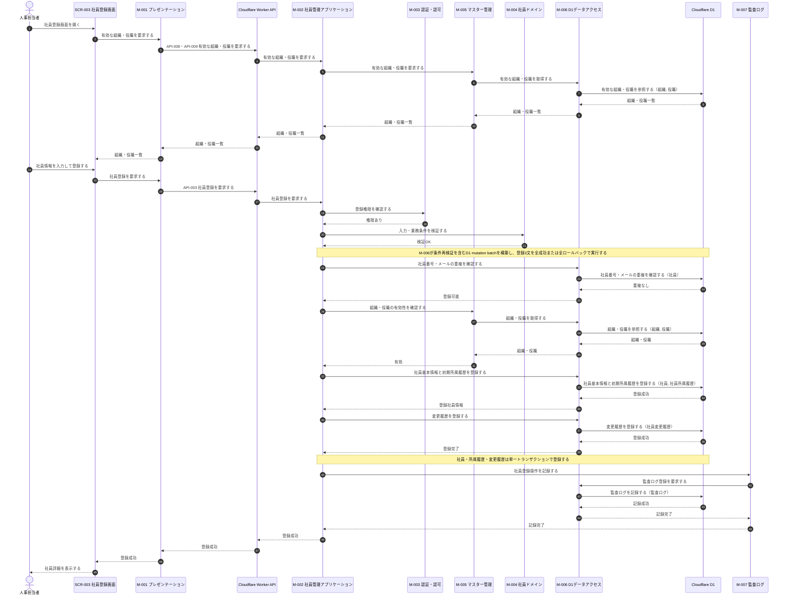
```mermaid
sequenceDiagram
    autonumber
    actor HR as 人事担当者
    participant UI as SCR-003 社員登録画面
    participant PRES as M-001 プレゼンテーション
    participant API as Cloudflare Worker API
    participant APP as M-002 社員管理アプリケーション
    participant AUTH as M-003 認証・認可
    participant MST as M-005 マスター管理
    participant DOM as M-004 社員ドメイン
    participant DATA as M-006 D1データアクセス
    participant DB as Cloudflare D1
    participant AUDIT as M-007 監査ログ

    HR->>UI: 社員登録画面を開く
    UI->>PRES: 有効な組織・役職を要求する
    PRES->>API: API-008・API-009 有効な組織・役職を要求する
    API->>APP: 有効な組織・役職を要求する
    APP->>MST: 有効な組織・役職を要求する
    MST->>DATA: 有効な組織・役職を取得する
    DATA->>DB: 有効な組織・役職を参照する（組織, 役職）
    DB-->>DATA: 組織・役職一覧
    DATA-->>MST: 組織・役職一覧
    MST-->>APP: 組織・役職一覧
    APP-->>API: 組織・役職一覧
    API-->>PRES: 組織・役職一覧
    PRES-->>UI: 組織・役職一覧
    HR->>UI: 社員情報を入力して登録する
    UI->>PRES: 社員登録を要求する
    PRES->>API: API-003 社員登録を要求する
    API->>APP: 社員登録を要求する
    APP->>AUTH: 登録権限を確認する
    AUTH-->>APP: 権限あり
    APP->>DOM: 入力・業務条件を検証する
    DOM-->>APP: 検証OK
    Note over APP,DB: M-006が条件再検証を含むD1 mutation batchを構築し、登録3文を全成功または全ロールバックで実行する
    APP->>DATA: 社員番号・メールの重複を確認する
    DATA->>DB: 社員番号・メールの重複を確認する（社員）
    DB-->>DATA: 重複なし
    DATA-->>APP: 登録可能
    APP->>MST: 組織・役職の有効性を確認する
    MST->>DATA: 組織・役職を取得する
    DATA->>DB: 組織・役職を参照する（組織, 役職）
    DB-->>DATA: 組織・役職
    DATA-->>MST: 組織・役職
    MST-->>APP: 有効
    APP->>DATA: 社員基本情報と初期所属履歴を登録する
    DATA->>DB: 社員基本情報と初期所属履歴を登録する（社員, 社員所属履歴）
    DB-->>DATA: 登録成功
    DATA-->>APP: 登録社員情報
    APP->>DATA: 変更履歴を登録する
    DATA->>DB: 変更履歴を登録する（社員変更履歴）
    DB-->>DATA: 登録成功
    DATA-->>APP: 登録完了
    Note over APP,DB: 社員・所属履歴・変更履歴は単一トランザクションで登録する
    APP->>AUDIT: 社員登録操作を記録する
    AUDIT->>DATA: 監査ログ登録を要求する
    DATA->>DB: 監査ログを記録する（監査ログ）
    DB-->>DATA: 記録成功
    DATA-->>AUDIT: 記録完了
    AUDIT-->>APP: 記録完了
    APP-->>API: 登録成功
    API-->>PRES: 登録成功
    PRES-->>UI: 登録成功
    UI-->>HR: 社員詳細を表示する
```

**連携定義**

条件分岐

| 条件ID | 判定箇所 | 条件 | 成立時 | 不成立時 | 根拠 |
|---|---|---|---|---|---|
| COND-01 | 認可機能 | 実行者が社員登録権限を持つ | 登録処理を継続する | 権限不足エラー(3.3で表現) | UC-001/SP-1 (不成立=UC-001/SP-3) |
| COND-02 | 社員ドメイン | 入力・業務条件が妥当 | 重複確認へ進む | 入力エラー(3.3で表現) | UC-001/SP-1 (不成立=UC-001/SP-4) |
| COND-03 | データアクセス | 社員番号・メールが重複しない | マスター確認へ進む | 重複エラー(3.3で表現) | UC-001/SP-1 (不成立=UC-001/SP-5,SP-6) |
| COND-04 | マスター管理機能 | 組織・役職がともに有効 | 登録を実行する | マスター無効エラー(3.3で表現) | UC-001/SP-1 (不成立=UC-001/SP-7) |

データ参照・更新

| エンティティ | CRUD | 目的 | 実行主体 |
|---|---|---|---|
| 組織 | R | 有効な組織の取得・有効性確認 | データアクセス |
| 役職 | R | 有効な役職の取得・有効性確認 | データアクセス |
| 社員 | R | 社員番号・メールアドレスの重複確認 | データアクセス |
| 社員 | C | 社員基本情報の登録(在籍状態=在籍中で登録) | データアクセス |
| 社員所属履歴 | C | 初期所属履歴の登録(適用開始日=入社日) | データアクセス |
| 社員変更履歴 | C | 登録操作の業務変更履歴記録 | データアクセス |
| 監査ログ | C | 社員登録操作の証跡記録 | データアクセス（M-007から委譲） |

トランザクション境界

| 境界ID | 開始 | 終了 | 対象更新 | ロールバック条件 | 管理主体 |
|---|---|---|---|---|---|
| TX-001 | M-006がD1 mutation batchを送信 | `batch()`成功 | 社員・社員所属履歴・社員変更履歴 | マスター条件・一意制約・参照制約またはいずれかの文が失敗した場合、D1がbatch全体をロールバック | M-002が境界を宣言しM-006が実行 |

補足事項

| 観点 | 内容 |
|---|---|
| 同期/非同期 | 画面〜登録完了まで同期。監査ログ記録は業務トランザクションと別に行う |
| 整合性 | 社員番号・メールアドレスの一意性と、入社日時点の組織・役職利用可否をSQLite制約・トリガー・条件付き文でbatch内に再検証する。再試行可否、結果不明時の確認、待機は§3.1.3の共通契約に従う |
| 監査ログ | 監査ログは業務コミット後に別トランザクションで記録する。記録失敗時も業務更新は戻さず、運用アラートを通知して成功結果を返す |

## 3.3 社員登録・入力不正/重複

UC-001 の代替・例外系(UC-001/SP-3〜SP-7)。権限確認→入力検証→重複確認→マスター有効性の順で判定し、同時に複数条件が不成立でもこの優先順で最初のエラーだけを返す。いずれかで不成立となった場合は該当エラーを表示して登録しない。

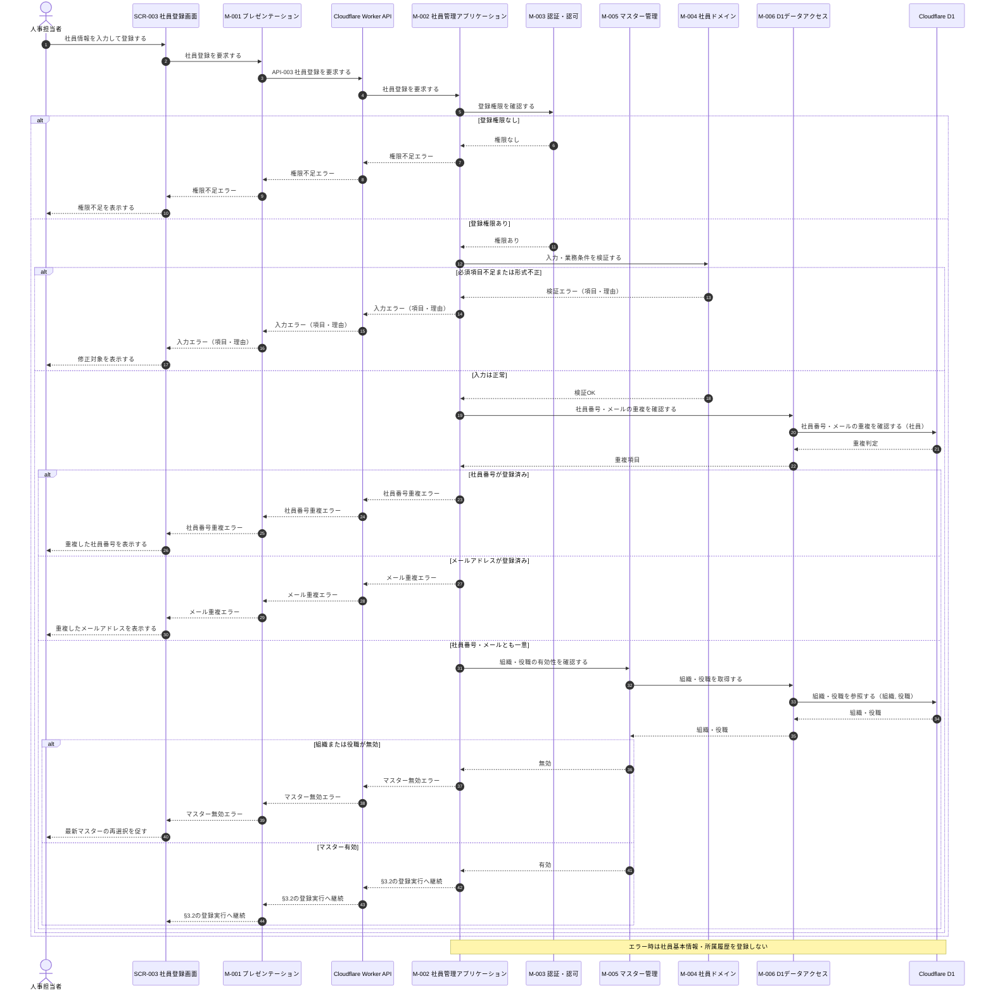
```mermaid
sequenceDiagram
    autonumber
    actor HR as 人事担当者
    participant UI as SCR-003 社員登録画面
    participant PRES as M-001 プレゼンテーション
    participant API as Cloudflare Worker API
    participant APP as M-002 社員管理アプリケーション
    participant AUTH as M-003 認証・認可
    participant MST as M-005 マスター管理
    participant DOM as M-004 社員ドメイン
    participant DATA as M-006 D1データアクセス
    participant DB as Cloudflare D1

    HR->>UI: 社員情報を入力して登録する
    UI->>PRES: 社員登録を要求する
    PRES->>API: API-003 社員登録を要求する
    API->>APP: 社員登録を要求する
    APP->>AUTH: 登録権限を確認する
    alt 登録権限なし
        AUTH-->>APP: 権限なし
        APP-->>API: 権限不足エラー
        API-->>PRES: 権限不足エラー
        PRES-->>UI: 権限不足エラー
        UI-->>HR: 権限不足を表示する
    else 登録権限あり
        AUTH-->>APP: 権限あり
        APP->>DOM: 入力・業務条件を検証する
        alt 必須項目不足または形式不正
            DOM-->>APP: 検証エラー（項目・理由）
            APP-->>API: 入力エラー（項目・理由）
            API-->>PRES: 入力エラー（項目・理由）
            PRES-->>UI: 入力エラー（項目・理由）
            UI-->>HR: 修正対象を表示する
        else 入力は正常
            DOM-->>APP: 検証OK
            APP->>DATA: 社員番号・メールの重複を確認する
            DATA->>DB: 社員番号・メールの重複を確認する（社員）
            DB-->>DATA: 重複判定
            DATA-->>APP: 重複項目
            alt 社員番号が登録済み
                APP-->>API: 社員番号重複エラー
                API-->>PRES: 社員番号重複エラー
                PRES-->>UI: 社員番号重複エラー
                UI-->>HR: 重複した社員番号を表示する
            else メールアドレスが登録済み
                APP-->>API: メール重複エラー
                API-->>PRES: メール重複エラー
                PRES-->>UI: メール重複エラー
                UI-->>HR: 重複したメールアドレスを表示する
            else 社員番号・メールとも一意
                APP->>MST: 組織・役職の有効性を確認する
                MST->>DATA: 組織・役職を取得する
                DATA->>DB: 組織・役職を参照する（組織, 役職）
                DB-->>DATA: 組織・役職
                DATA-->>MST: 組織・役職
                alt 組織または役職が無効
                    MST-->>APP: 無効
                    APP-->>API: マスター無効エラー
                    API-->>PRES: マスター無効エラー
                    PRES-->>UI: マスター無効エラー
                    UI-->>HR: 最新マスターの再選択を促す
                else マスター有効
                    MST-->>APP: 有効
                    APP-->>API: §3.2の登録実行へ継続
                    API-->>PRES: §3.2の登録実行へ継続
                    PRES-->>UI: §3.2の登録実行へ継続
                end
            end
        end
    end
    Note over APP,DB: エラー時は社員基本情報・所属履歴を登録しない
```

**状態パターン対応**

| 分岐 | 条件 | 状態パターン | 本シーケンスでの処理 |
|---|---|---|---|
| a | 登録権限なし | UC-001/SP-3 | 権限不足を表示し、登録しない |
| b | 必須項目不足または形式不正 | UC-001/SP-4 | 対象項目と理由を表示し、登録しない |
| c | 社員番号が登録済み | UC-001/SP-5 | 重複した社員番号を表示し、登録しない |
| d | メールアドレスが登録済み | UC-001/SP-6 | 重複したメールアドレスを表示し、登録しない |
| e | 組織または役職が無効 | UC-001/SP-7 | 最新マスターの再選択を促し、登録しない |
| f | 保存中に異常(TX-001失敗) | －（§2の業務状態パターン対象外） | 社員・所属履歴をともに未登録として扱う(TX-001 ロールバック。3.2 参照) |

データ参照・更新

| エンティティ | CRUD | 目的 | 実行主体 |
|---|---|---|---|
| 組織 | R | 組織の有効性確認 | データアクセス |
| 役職 | R | 役職の有効性確認 | データアクセス |
| 社員 | R | 社員番号・メールアドレスの重複確認 | データアクセス |

補足: 本シーケンスは参照のみで、いずれの分岐でも社員・所属履歴・変更履歴を登録しない(更新なし)。

## 3.4 社員検索

UC-002(状態パターン UC-002/SP-1〜SP-4)。認可機能から§2.2 UC-002で定義した閲覧スコープを取得し、検索条件と`scopeType`・操作者社員ID・許可組織ID集合・基準日を合わせて社員を検索し、全スコープ共通の安全な一覧項目だけを表示する。

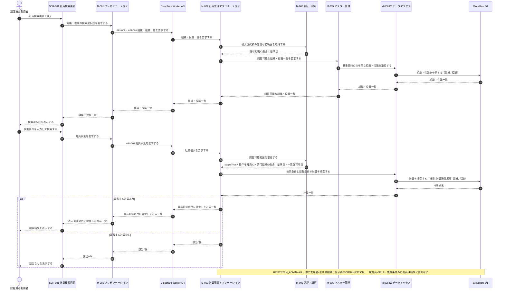
```mermaid
sequenceDiagram
    autonumber
    actor U as 認証済み利用者
    participant UI as SCR-001 社員検索画面
    participant PRES as M-001 プレゼンテーション
    participant API as Cloudflare Worker API
    participant APP as M-002 社員管理アプリケーション
    participant AUTH as M-003 認証・認可
    participant MST as M-005 マスター管理
    participant DATA as M-006 D1データアクセス
    participant DB as Cloudflare D1

    U->>UI: 社員検索画面を開く
    UI->>PRES: 組織・役職の検索選択肢を要求する
    PRES->>API: API-008・API-009 組織・役職一覧を要求する
    API->>APP: 組織・役職一覧を要求する
    APP->>AUTH: 検索選択肢の閲覧可能範囲を取得する
    AUTH-->>APP: 許可組織ID集合・基準日
    APP->>MST: 閲覧可能な組織・役職一覧を要求する
    MST->>DATA: 基準日時点の有効な組織・役職を取得する
    DATA->>DB: 組織・役職を参照する（組織, 役職）
    DB-->>DATA: 組織・役職一覧
    DATA-->>MST: 組織・役職一覧
    MST-->>APP: 閲覧可能な組織・役職一覧
    APP-->>API: 組織・役職一覧
    API-->>PRES: 組織・役職一覧
    PRES-->>UI: 組織・役職一覧
    UI-->>U: 検索選択肢を表示する
    U->>UI: 検索条件を入力して検索する
    UI->>PRES: 社員検索を要求する
    PRES->>API: API-001 社員検索を要求する
    API->>APP: 社員検索を要求する
    APP->>AUTH: 閲覧可能範囲を取得する
    AUTH-->>APP: scopeType・操作者社員ID・許可組織ID集合・基準日・一覧許可項目
    APP->>DATA: 検索条件と閲覧条件で社員を検索する
    DATA->>DB: 社員を検索する（社員, 社員所属履歴, 組織, 役職）
    DB-->>DATA: 検索結果
    DATA-->>APP: 社員一覧
    alt 該当する社員あり
        APP-->>API: 表示可能項目に限定した社員一覧
        API-->>PRES: 表示可能項目に限定した社員一覧
        PRES-->>UI: 表示可能項目に限定した社員一覧
        UI-->>U: 検索結果を表示する
    else 該当する社員なし
        APP-->>API: 該当0件
        API-->>PRES: 該当0件
        PRES-->>UI: 該当0件
        UI-->>U: 該当なしを表示する
    end
    Note over APP,DB: HR/SYSTEM_ADMIN=ALL、部門管理者=主所属組織と全子孫のORGANIZATION、一般社員=SELF。閲覧条件外の社員は結果に含めない
```

**連携定義**

条件分岐

| 条件ID | 判定箇所 | 条件 | 成立時 | 不成立時 | 根拠 |
|---|---|---|---|---|---|
| COND-01 | Cloudflare Worker API | 認証状態が有効である | 認可判定へ進む | UNAUTHENTICATEDを返しSCR-010へ遷移する | UC-002/SP-1・UC-002/SP-2 (不成立=UC-002/SP-3) |
| COND-02 | 認可機能 | 業務日時点で有効な固定ロールがあり、閲覧スコープを解決できる | 範囲内条件で検索する | ロールなし、主所属なし、本人紐付けなしを権限不足として拒否する | UC-002/SP-1 (不成立=UC-002/SP-4) |
| COND-03 | 社員管理アプリケーション | 検索結果が1件以上ある | 一覧を表示する | 該当なしを表示する | UC-002/SP-1 (不成立=UC-002/SP-2) |

データ参照・更新

| エンティティ | CRUD | 目的 | 実行主体 |
|---|---|---|---|
| 社員 | R | 検索条件・閲覧条件に一致する社員の取得 | データアクセス |
| 社員所属履歴 | R | 有効な所属・役職の付与 | データアクセス |
| 組織 | R | 検索選択肢の取得・検索結果への組織名付与 | データアクセス |
| 役職 | R | 検索選択肢の取得・検索結果への役職名付与 | データアクセス |

トランザクション境界

| 内容 |
|---|
| なし(参照のみ。更新を伴わないため) |

補足事項

| 観点 | 内容 |
|---|---|
| 性能 | 一覧は件数が多くなり得るためページング前提で取得する |
| 個人情報保護 | 閲覧条件外の社員は結果に含めず、権限に応じて返却項目を制限する |

## 3.5 社員異動

UC-003(状態パターン UC-003/SP-1〜SP-7。未来日付の異動は UC-003/SP-2 として基本フローに含み、業務日より前の遡及異動は UC-003/SP-7 として拒否する)。権限・在籍状態・異動日時点のマスターと上長有効性を確認し、異動日と既存の所属履歴の期間整合を判定したうえで、直前所属の終了、異動日以降の将来所属取消、新所属登録、変更履歴登録、社員版数更新を単一トランザクションで更新する。

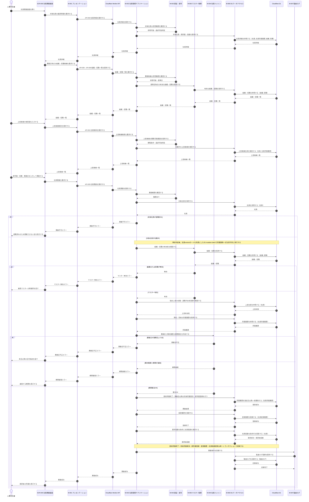
```mermaid
sequenceDiagram
    autonumber
    actor HR as 人事担当者
    participant UI as SCR-005 社員異動画面
    participant PRES as M-001 プレゼンテーション
    participant API as Cloudflare Worker API
    participant APP as M-002 社員管理アプリケーション
    participant AUTH as M-003 認証・認可
    participant MST as M-005 マスター管理
    participant DOM as M-004 社員ドメイン
    participant DATA as M-006 D1データアクセス
    participant DB as Cloudflare D1
    participant AUDIT as M-007 監査ログ

    HR->>UI: 社員異動画面を開く
    UI->>PRES: 対象社員の最新情報を要求する
    PRES->>API: API-002 社員詳細を要求する
    API->>APP: 社員詳細を要求する
    APP->>AUTH: 対象社員の参照権限を確認する
    AUTH-->>APP: 参照可能・返却可能項目
    APP->>DATA: 対象社員・現所属・版数を取得する
    DATA->>DB: 社員詳細を参照する（社員, 社員所属履歴, 組織, 役職）
    DB-->>DATA: 社員詳細
    DATA-->>APP: 社員詳細
    APP-->>API: 社員詳細
    API-->>PRES: 社員詳細
    PRES-->>UI: 社員詳細
    UI->>PRES: 異動日時点の組織・役職候補を要求する
    PRES->>API: API-008・API-009 組織・役職一覧を要求する
    API->>APP: 組織・役職一覧を要求する
    APP->>AUTH: 異動候補の参照権限を確認する
    AUTH-->>APP: 参照可能・基準日
    APP->>MST: 基準日時点の有効な組織・役職を要求する
    MST->>DATA: 有効な組織・役職を取得する
    DATA->>DB: 組織・役職を参照する（組織, 役職）
    DB-->>DATA: 組織・役職一覧
    DATA-->>MST: 組織・役職一覧
    MST-->>APP: 組織・役職一覧
    APP-->>API: 組織・役職一覧
    API-->>PRES: 組織・役職一覧
    PRES-->>UI: 組織・役職一覧
    HR->>UI: 上長候補の検索語を入力する
    UI->>PRES: 上長候補検索を要求する
    PRES->>API: API-001 社員検索を要求する
    API->>APP: 上長候補検索を要求する
    APP->>AUTH: 上長候補の閲覧可能範囲を取得する
    AUTH-->>APP: 閲覧条件・返却可能項目
    APP->>DATA: 在籍中の上長候補を検索する
    DATA->>DB: 上長候補社員を検索する（社員, 社員所属履歴）
    DB-->>DATA: 上長候補一覧
    DATA-->>APP: 上長候補一覧
    APP-->>API: 上長候補一覧
    API-->>PRES: 上長候補一覧
    PRES-->>UI: 上長候補一覧
    HR->>UI: 新所属・役職・異動日を入力して異動する
    UI->>PRES: 社員異動を要求する
    PRES->>API: API-005 社員異動を要求する
    API->>APP: 社員異動を要求する
    APP->>AUTH: 異動権限を確認する
    AUTH-->>APP: 権限あり
    APP->>DATA: 対象社員を取得する
    DATA->>DB: 社員を参照する（社員）
    DB-->>DATA: 社員
    DATA-->>APP: 社員
    alt 対象社員が退職済み
        APP-->>API: 異動不可エラー
        API-->>PRES: 異動不可エラー
        PRES-->>UI: 異動不可エラー
        UI-->>HR: 退職済みのため異動できない旨を表示する
    else 対象社員が在籍中
        Note over APP,DB: 事前判定後、社員versionガードを先頭にしたD1 mutation batchで所属置換一式を原子的に実行する
        APP->>MST: 組織・役職の有効性を確認する
        MST->>DATA: 組織・役職を取得する
        DATA->>DB: 組織・役職を参照する（組織, 役職）
        DB-->>DATA: 組織・役職
        DATA-->>MST: 組織・役職
        alt 組織または役職が無効
            MST-->>APP: 無効
            APP-->>API: マスター無効エラー
            API-->>PRES: マスター無効エラー
            PRES-->>UI: マスター無効エラー
            UI-->>HR: 最新マスターの再選択を促す
        else マスター有効
            MST-->>APP: 有効
            APP->>DATA: 指定上長の在籍・退職予定未登録を確認する
            DATA->>DB: 上長社員を参照する（社員）
            DB-->>DATA: 上長状態
            DATA-->>APP: 上長有効性
            APP->>DATA: 現在・将来の所属履歴を取得する
            DATA->>DB: 所属履歴を参照する（社員所属履歴）
            DB-->>DATA: 所属履歴
            DATA-->>APP: 所属履歴
            APP->>DOM: 異動日と既存履歴の期間整合を判定する
            alt 異動日が業務日より前
                DOM-->>APP: 異動日不正
                APP-->>API: 異動日不正エラー
                API-->>PRES: 異動日不正エラー
                PRES-->>UI: 異動日不正エラー
                UI-->>HR: 本日以降の日付指定を促す
            else 既存履歴と期間が重複
                DOM-->>APP: 期間重複
                APP-->>API: 期間重複エラー
                API-->>PRES: 期間重複エラー
                PRES-->>UI: 期間重複エラー
                UI-->>HR: 重複する期間を表示する
            else 期間整合OK
                DOM-->>APP: 整合OK
                APP->>DATA: 直前所属終了・異動日以降の将来所属取消・新所属登録を行う
                DATA->>DB: 所属履歴を指定日以降一体置換する（社員所属履歴）
                DB-->>DATA: 更新成功
                DATA-->>APP: 異動結果
                APP->>DATA: 変更履歴を登録する
                DATA->>DB: 変更履歴を登録する（社員変更履歴）
                DB-->>DATA: 登録成功
                DATA-->>APP: 登録完了
                APP->>DATA: 要求版数を条件に社員版数を更新する
                DATA->>DB: 社員版数を条件付き更新する（社員）
                DB-->>DATA: 更新成功・更新後版数
                DATA-->>APP: 更新後版数
                Note over APP,DB: 直前所属終了・将来所属取消・新所属登録・変更履歴・社員版数更新は単一トランザクションで更新する
                APP->>AUDIT: 異動操作を記録する
                AUDIT->>DATA: 監査ログ登録を要求する
                DATA->>DB: 監査ログを記録する（監査ログ）
                DB-->>DATA: 記録成功
                DATA-->>AUDIT: 記録完了
                APP-->>API: 異動成功
                API-->>PRES: 異動成功
                PRES-->>UI: 異動成功
                UI-->>HR: 更新後の所属を表示する
            end
        end
    end
```

**連携定義**

条件分岐

| 条件ID | 判定箇所 | 条件 | 成立時 | 不成立時 | 根拠 |
|---|---|---|---|---|---|
| COND-01 | 認可機能 | 実行者が社員異動権限を持つ | 対象社員の確認へ進む | 権限不足エラー | UC-003/SP-1 (不成立=UC-003/SP-3) |
| COND-02 | 社員管理アプリケーション | 対象社員が在籍中である | マスター確認へ進む | 異動不可エラー | UC-003/SP-1 (不成立=UC-003/SP-4) |
| COND-03 | マスター管理機能・社員管理アプリケーション | 新組織・新役職が異動日時点で有効で、指定上長が在籍中かつ退職予定未登録 | 期間整合判定へ進む | マスター・上長無効エラー | UC-003/SP-1 (不成立=UC-003/SP-5) |
| COND-04 | 社員ドメイン | 異動日が業務日以降である | 期間重複判定へ進む | 異動日不正エラー | UC-003/SP-1・SP-2 (不成立=UC-003/SP-7) |
| COND-05 | 社員ドメイン | 異動日と既存履歴に期間重複がない | 所属履歴を更新する | 期間重複エラー | UC-003/SP-1 (不成立=UC-003/SP-6) |
| COND-06 | データアクセス | 要求版数と社員の現在版数が一致する | 社員版数を更新してコミットする | 更新競合として全業務更新をロールバックする | NFR-007 / M-002/IF-05 |

データ参照・更新

| エンティティ | CRUD | 目的 | 実行主体 |
|---|---|---|---|
| 社員 | R | 初期表示用の最新情報・退職予定・版数、および退職処理時の在籍状態確認 | データアクセス |
| 組織 | R | 新組織の有効性確認 | データアクセス |
| 役職 | R | 新役職の有効性確認 | データアクセス |
| 社員所属履歴 | R | 現在・将来の履歴取得と期間整合の確認 | データアクセス |
| 社員所属履歴 | U | 現所属履歴の終了(適用終了日の設定) | データアクセス |
| 社員所属履歴 | D（論理） | 異動日以降に開始する既存将来所属の取消 | データアクセス |
| 社員所属履歴 | C | 新所属履歴の登録(適用開始日=異動日) | データアクセス |
| 社員変更履歴 | C | 異動操作の業務変更履歴記録 | データアクセス |
| 社員 | U | 要求版数を条件とする社員版数の更新 | データアクセス |
| 監査ログ | C | 異動操作の証跡記録 | データアクセス（M-007から委譲） |

トランザクション境界

| 境界ID | 開始 | 終了 | 対象更新 | ロールバック条件 | 管理主体 |
|---|---|---|---|---|---|
| TX-003 | M-006が社員versionガードを先頭にD1 mutation batchを送信 | `batch()`成功 | 社員版数・社員所属履歴(直前履歴終了・将来履歴取消・新履歴登録)・社員変更履歴 | version・マスター・上長・期間条件不成立、制約違反またはいずれかの文が失敗した場合、D1がbatch全体をロールバック | M-002が境界を宣言しM-006が実行 |

補足事項

| 観点 | 内容 |
|---|---|
| 同期/非同期 | 画面〜異動完了まで同期。監査ログ記録は業務トランザクションと別に行う |
| 競合制御 | D1単一データベースの逐次実行、先頭の社員versionガード、後続文のガード済みversion条件、SQLiteの期間重複トリガーを併用する。再試行可否、結果不明時の確認、待機は§3.1.3の共通契約に従う |
| 監査ログ | 監査ログは業務コミット後に別トランザクションで記録する。記録失敗時も異動結果は戻さず、運用アラートを通知して成功結果を返す |

## 3.6 社員退職

UC-004(状態パターン UC-004/SP-1〜SP-5。未来日付の退職は UC-004/SP-2 として退職予定を登録する)と、UC-014(状態パターン UC-014/SP-1〜SP-8)を扱う。当日以前は退職状態・所属履歴・変更履歴を即時反映し、未来日は退職予定だけを登録する。到来後はJOB-001が社員1件単位で冪等に退職確定を反映する。

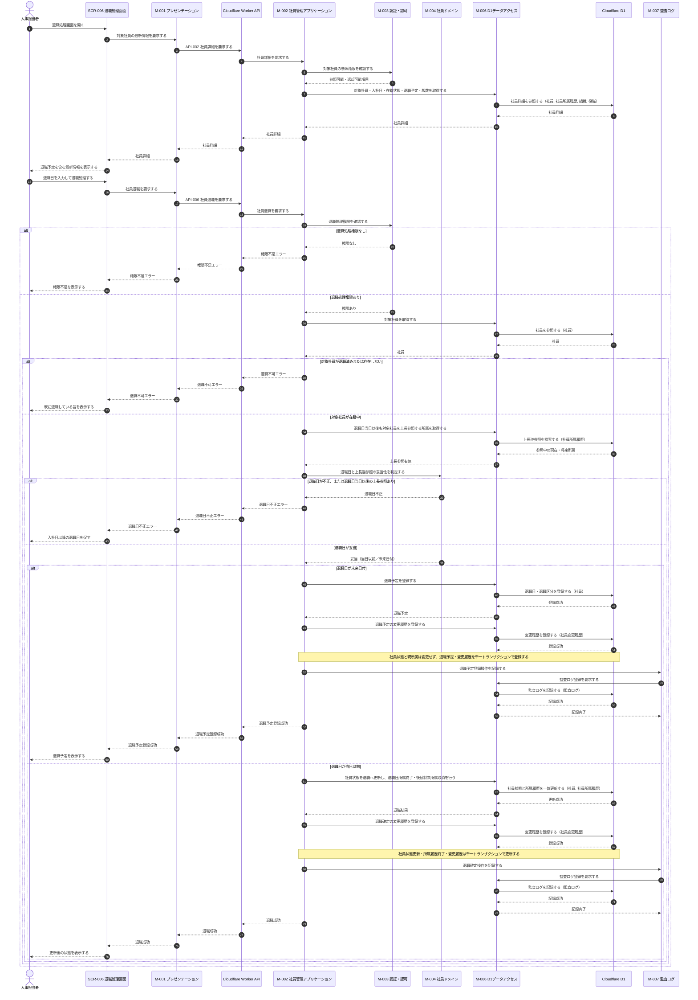
```mermaid
sequenceDiagram
    autonumber
    actor HR as 人事担当者
    participant UI as SCR-006 退職処理画面
    participant PRES as M-001 プレゼンテーション
    participant API as Cloudflare Worker API
    participant APP as M-002 社員管理アプリケーション
    participant AUTH as M-003 認証・認可
    participant DOM as M-004 社員ドメイン
    participant DATA as M-006 D1データアクセス
    participant DB as Cloudflare D1
    participant AUDIT as M-007 監査ログ

    HR->>UI: 退職処理画面を開く
    UI->>PRES: 対象社員の最新情報を要求する
    PRES->>API: API-002 社員詳細を要求する
    API->>APP: 社員詳細を要求する
    APP->>AUTH: 対象社員の参照権限を確認する
    AUTH-->>APP: 参照可能・返却可能項目
    APP->>DATA: 対象社員・入社日・在籍状態・退職予定・版数を取得する
    DATA->>DB: 社員詳細を参照する（社員, 社員所属履歴, 組織, 役職）
    DB-->>DATA: 社員詳細
    DATA-->>APP: 社員詳細
    APP-->>API: 社員詳細
    API-->>PRES: 社員詳細
    PRES-->>UI: 社員詳細
    UI-->>HR: 退職予定を含む最新情報を表示する
    HR->>UI: 退職日を入力して退職処理する
    UI->>PRES: 社員退職を要求する
    PRES->>API: API-006 社員退職を要求する
    API->>APP: 社員退職を要求する
    APP->>AUTH: 退職処理権限を確認する
    alt 退職処理権限なし
        AUTH-->>APP: 権限なし
        APP-->>API: 権限不足エラー
        API-->>PRES: 権限不足エラー
        PRES-->>UI: 権限不足エラー
        UI-->>HR: 権限不足を表示する
    else 退職処理権限あり
        AUTH-->>APP: 権限あり
        APP->>DATA: 対象社員を取得する
        DATA->>DB: 社員を参照する（社員）
        DB-->>DATA: 社員
        DATA-->>APP: 社員
        alt 対象社員が退職済みまたは存在しない
            APP-->>API: 退職不可エラー
            API-->>PRES: 退職不可エラー
            PRES-->>UI: 退職不可エラー
            UI-->>HR: 既に退職している旨を表示する
        else 対象社員が在籍中
            APP->>DATA: 退職日当日以後も対象社員を上長参照する所属を取得する
            DATA->>DB: 上長逆参照を検索する（社員所属履歴）
            DB-->>DATA: 参照中の現在・将来所属
            DATA-->>APP: 上長参照有無
            APP->>DOM: 退職日と上長逆参照の妥当性を判定する
            alt 退職日が不正、または退職日当日以後の上長参照あり
                DOM-->>APP: 退職日不正
                APP-->>API: 退職日不正エラー
                API-->>PRES: 退職日不正エラー
                PRES-->>UI: 退職日不正エラー
                UI-->>HR: 入社日以降の退職日を促す
            else 退職日が妥当
                DOM-->>APP: 妥当（当日以前／未来日付）
                alt 退職日が未来日付
                    APP->>DATA: 退職予定を登録する
                    DATA->>DB: 退職日・退職区分を登録する（社員）
                    DB-->>DATA: 登録成功
                    DATA-->>APP: 退職予定
                    APP->>DATA: 退職予定の変更履歴を登録する
                    DATA->>DB: 変更履歴を登録する（社員変更履歴）
                    DB-->>DATA: 登録成功
                    Note over APP,DB: 社員状態と現所属は変更せず、退職予定・変更履歴を単一トランザクションで登録する
                    APP->>AUDIT: 退職予定登録操作を記録する
                    AUDIT->>DATA: 監査ログ登録を要求する
                    DATA->>DB: 監査ログを記録する（監査ログ）
                    DB-->>DATA: 記録成功
                    DATA-->>AUDIT: 記録完了
                    APP-->>API: 退職予定登録成功
                    API-->>PRES: 退職予定登録成功
                    PRES-->>UI: 退職予定登録成功
                    UI-->>HR: 退職予定を表示する
                else 退職日が当日以前
                    APP->>DATA: 社員状態を退職へ更新し、退職日所属終了・後続将来所属取消を行う
                    DATA->>DB: 社員状態と所属履歴を一体更新する（社員, 社員所属履歴）
                    DB-->>DATA: 更新成功
                    DATA-->>APP: 退職結果
                    APP->>DATA: 退職確定の変更履歴を登録する
                    DATA->>DB: 変更履歴を登録する（社員変更履歴）
                    DB-->>DATA: 登録成功
                    Note over APP,DB: 社員状態更新・所属履歴終了・変更履歴は単一トランザクションで更新する
                    APP->>AUDIT: 退職確定操作を記録する
                    AUDIT->>DATA: 監査ログ登録を要求する
                    DATA->>DB: 監査ログを記録する（監査ログ）
                    DB-->>DATA: 記録成功
                    DATA-->>AUDIT: 記録完了
                    APP-->>API: 退職成功
                    API-->>PRES: 退職成功
                    PRES-->>UI: 退職成功
                    UI-->>HR: 更新後の状態を表示する
                end
            end
        end
    end
```

未来日の退職予定は、退職日到来後に次の非同期経路で確定する。

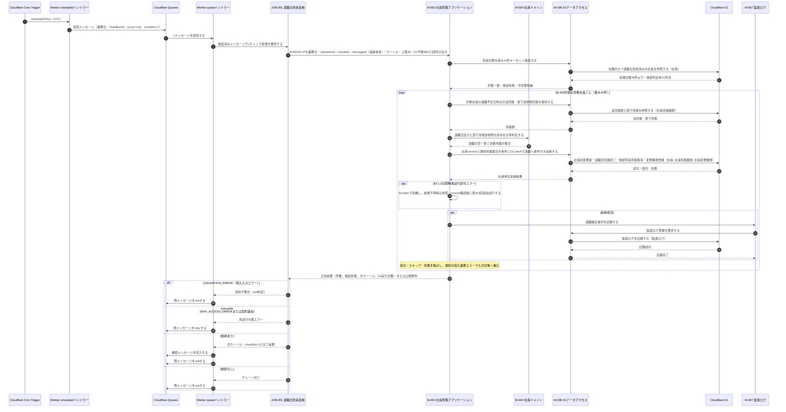
```mermaid
sequenceDiagram
    autonumber
    participant CRON as Cloudflare Cron Trigger
    participant SCHED as Worker scheduledハンドラー
    participant Q as Cloudflare Queues
    participant QUEUE as Worker queueハンドラー
    participant JOB as JOB-001 退職日到来反映
    participant APP as M-002 社員管理アプリケーション
    participant DOM as M-004 社員ドメイン
    participant DATA as M-006 D1データアクセス
    participant DB as Cloudflare D1
    participant AUDIT as M-007 監査ログ

    CRON->>SCHED: scheduledTime（UTC）
    SCHED->>Q: 初回メッセージ（業務日、chainRunId、cursor=null、chunkNo=1）
    Q->>QUEUE: 1メッセージを配信する
    QUEUE->>JOB: 検証済みメッセージで1チャンク処理を要求する
    JOB->>APP: M-002/IF-07を業務日・chainRunId・chunkNo・messageId（追跡専用）・カーソル・上限40・D1予算900で1回呼び出す
    APP->>DATA: 到来対象を最大41件キーセット取得する
    DATA->>DB: 在籍中かつ退職日到来済みの社員を参照する（社員）
    DB-->>DATA: 処理対象40件以下・後続判定用41件目
    DATA-->>APP: 対象一覧・後続有無・次位置候補
    loop M-002内部の対象社員ごと（最大40件）
        APP->>DATA: 対象社員の退職予定日時点の自所属・部下逆参照所属を取得する
        DATA->>DB: 自所属群と部下所属を参照する（社員所属履歴）
        DB-->>DATA: 自所属・部下所属
        DATA-->>APP: 所属群
        APP->>DOM: 退職日区分と部下所属逆参照の非存在を再判定する
        DOM-->>APP: 退職可否・終了対象所属ID集合
        APP->>DATA: 社員versionと期待所属集合を条件にD1 batchで退職へ条件付き反映する
        DATA->>DB: 社員状態更新・退職日所属終了・後続将来所属取消・変更履歴登録（社員, 社員所属履歴, 社員変更履歴）
        DB-->>DATA: 成功・競合・失敗
        DATA-->>APP: 社員単位反映結果
        opt §3.1.3の即時再試行許可エラー
            APP->>APP: full jitterで待機し、結果不明時は状態・version確認後に最大2回追加試行する
        end
        opt 反映成功
            APP->>AUDIT: 退職確定操作を記録する
            AUDIT->>DATA: 監査ログ登録を要求する
            DATA->>DB: 監査ログを記録する（監査ログ）
            DB-->>DATA: 記録成功
            DATA-->>AUDIT: 記録完了
        end
        Note over APP: 成功・スキップ・失敗を集計し、個別の恒久業務エラーでも次対象へ進む
    end
    APP-->>JOB: 正常結果（件数、後続有無、次カーソル、D1実行文数）または公開例外
    alt VALIDATION_ERROR（恒久入力エラー）
        JOB-->>QUEUE: 契約不整合（ack判定）
        QUEUE->>Q: 現メッセージをackする
    else retryable DATA_ACCESS_ERRORまたは契約違反
        JOB-->>QUEUE: 再試行可能エラー
        QUEUE->>Q: 現メッセージをretryする
    else 後続あり
        JOB-->>QUEUE: 次カーソル・chunkNo+1と完了結果
        QUEUE->>Q: 継続メッセージを投入する
        QUEUE->>Q: 現メッセージをackする
    else 後続なし
        JOB-->>QUEUE: チェーン完了
        QUEUE->>Q: 現メッセージをackする
    end
```

**連携定義**

条件分岐

| 条件ID | 判定箇所 | 条件 | 成立時 | 不成立時 | 根拠 |
|---|---|---|---|---|---|
| COND-01 | 認可機能 | 実行者が退職処理権限を持つ | 対象社員の確認へ進む | 権限不足エラー | UC-004/SP-1 (不成立=UC-004/SP-3) |
| COND-02 | 社員管理アプリケーション | 対象社員が存在し在籍中である | 退職日妥当性の判定へ進む | 退職不可エラー | UC-004/SP-1 (不成立=UC-004/SP-4) |
| COND-03 | 社員ドメイン | 退職日が入社日以降で、対象社員を上長とする所属が退職日当日以後に有効でない | 退職更新を実行する | 退職日・上長参照不正エラー | UC-004/SP-1 (不成立=UC-004/SP-5) |
| COND-04 | 社員ドメイン | 退職日が当日以前である | 即時に退職状態へ更新する | 退職予約として登録する | UC-004/SP-1 (不成立=UC-004/SP-2) |
| COND-05 | JOB-001 | Queueメッセージのスキーマ・日付・継続位置が妥当 | M-002/IF-07を呼び出す | 業務処理せず通知して終了する | UC-014/SP-1〜SP-5 (不成立=UC-014/SP-6) |
| COND-06 | 社員管理アプリケーション | 到来対象が1件以上ある | 最大40件を社員単位で判定・反映する | 無更新でチェーンを完了する | UC-014/SP-1・SP-3〜SP-5 (不成立=UC-014/SP-2) |
| COND-07 | 社員管理アプリケーション | 後続対象がある | 継続情報をJOB-001へ返す | チェーン完了を返す | UC-014/SP-3 (不成立=UC-014/SP-1・SP-2) |
| COND-08 | データアクセス | 対象が未反映でversion・業務条件が一致する | 退職確定を原子反映する | 既反映・競合として二重更新せずスキップする | UC-014/SP-1 (不成立=UC-014/SP-4・UC-014/SP-5) |
| COND-09 | JOB-001 | M-002公開結果とD1実行文数が契約内である | 継続投入または現メッセージ完了へ進む | Queue再配信し、上限到達後はDLQへ移送する | UC-014/SP-1〜SP-5 (不成立=UC-014/SP-7、再配信上限=UC-014/SP-8) |

データ参照・更新

| エンティティ | CRUD | 目的 | 実行主体 |
|---|---|---|---|
| 社員 | R | 対象社員の取得・在籍状態の確認 | データアクセス |
| 社員 | U | 未来日は退職予定登録、当日以前または到来時は在籍状態=退職への更新 | データアクセス |
| 社員所属履歴 | U | 当日以前または退職日到来時に有効な所属履歴を終了 | データアクセス |
| 社員所属履歴 | R | 初期表示の現所属取得、および対象社員を上長とする退職日当日以後の現在・将来所属を検証 | データアクセス |
| 組織 | R | 初期表示用の現所属組織名を取得 | データアクセス |
| 役職 | R | 初期表示用の現役職名を取得 | データアクセス |
| 社員所属履歴 | D（論理） | 退職日より後に開始する対象社員自身の将来所属を取消 | データアクセス |
| 社員変更履歴 | C | 退職予定登録・退職確定の業務変更履歴記録 | データアクセス |
| 監査ログ | C | 退職操作の証跡記録 | データアクセス（M-007から委譲） |

トランザクション境界

| 境界ID | 開始 | 終了 | 対象更新 | ロールバック条件 | 管理主体 |
|---|---|---|---|---|---|
| TX-004 | M-006が退職予定用D1 mutation batchを送信 | `batch()`成功 | 社員(退職日・退職区分)・社員変更履歴 | 上長逆参照・version・状態条件不成立またはいずれかの文が失敗した場合、D1がbatch全体をロールバック | M-002が境界を宣言しM-006が実行 |
| TX-005 | M-006が即時または到来退職用D1 mutation batchを送信 | `batch()`成功 | 社員(状態・退職日)・社員所属履歴(終了日・将来取消)・社員変更履歴 | 上長逆参照・version・状態条件不成立またはいずれかの文が失敗した場合、D1が社員1件のbatch全体をロールバック | M-002が境界を宣言しM-006が実行 |

補足事項

| 観点 | 内容 |
|---|---|
| 同期/非同期 | 当日以前の退職と未来日の退職予定受付は同期。未来日の退職確定はJOB-001が日次で非同期実行する |
| 退職予定 | 未来日は退職日・退職区分だけを登録し、社員状態と現所属を維持する(UC-004/SP-2)。JOB-001による到来後の確定はUC-014を正本とする |
| 競合制御 | D1の逐次実行、対象社員のversionガード、上長逆参照を再評価する条件付き文・トリガーにより、異動・部下所属登録との競合と退職済みへの二重処理を検知する |
| 利用停止 | 社員紐付きアカウントは退職日到来以後、ログインおよび発行済みトークンの後続認可で拒否する。退職確定JOBの遅延中も業務日と退職日で拒否する |
| 監査ログ | 監査ログは業務トランザクションのコミット後にM-007→M-006で独立追記し、失敗は運用アラート対象とする |
| チャンク・予算 | `queue` invocationごとにM-002/IF-07を1回だけ呼び、最大40社員を処理する。M-006実測のD1実行文数は900以下とし、後続ありでは退職日・社員IDの次カーソルをQueueメッセージへ引き継ぐ |
| 内部再試行 | M-002は§3.1.3の許可エラーだけを社員単位で最大2回追加試行する。過負荷・タイムアウト・CPU・メモリ・予算超過および再試行枯渇はretryable属性付き`DATA_ACCESS_ERROR`とし、JOBが現メッセージを再配信する |
| Queue冪等性 | consumerは`max_batch_size=1`、`max_concurrency=1`、`max_retries=3`とし、規定回数後はDLQへ移送する。`chainRunId+chunkNo`を論理実行識別子とし、重複配信の正しさはversionガード・未反映条件で保証する |
| 集計契約 | M-002は非負整数の件数、後続有無、次カーソル、D1実行文数を返し、対象件数=成功件数+スキップ件数+失敗件数、失敗対象一覧件数=失敗件数、対象件数≤40、D1実行文数≤900を保証する |

## 3.7 ログイン

UC-005(状態パターン UC-005/SP-1〜SP-4)。社内認証基盤で認証情報を検証し、利用者アカウント、社員紐付きの場合の退職日未到来、ロールを確認したうえで未返却のアクセストークン候補を生成する。成功監査を記録できた場合だけ候補を利用者へ返し、生成・監査失敗時は発行しない。業務データの更新は伴わない。

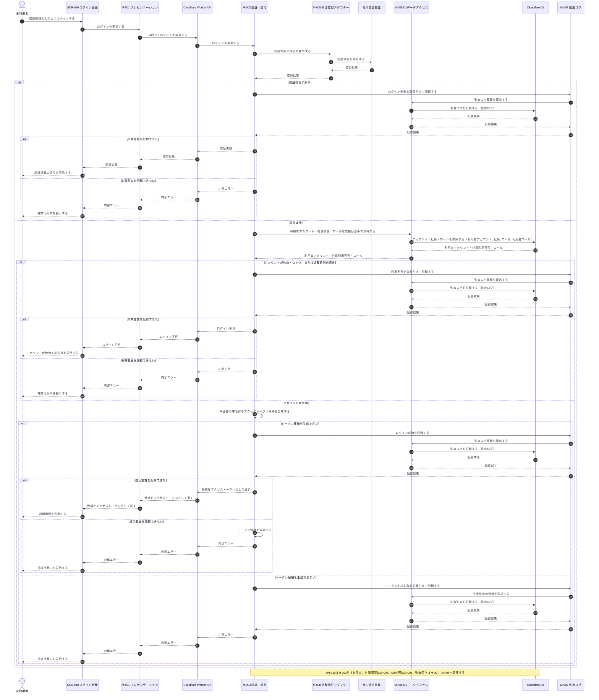
```mermaid
sequenceDiagram
    autonumber
    actor U as 全利用者
    participant UI as SCR-010 ログイン画面
    participant PRES as M-001 プレゼンテーション
    participant API as Cloudflare Worker API
    participant AUTH as M-003 認証・認可
    participant EXAUTH as M-008 外部認証アダプター
    participant IDP as 社内認証基盤
    participant DATA as M-006 D1データアクセス
    participant DB as Cloudflare D1
    participant AUDIT as M-007 監査ログ

    U->>UI: 認証情報を入力してログインする
    UI->>PRES: ログインを要求する
    PRES->>API: API-010 ログインを要求する
    API->>AUTH: ログインを要求する
    AUTH->>EXAUTH: 認証情報の検証を要求する
    EXAUTH->>IDP: 認証情報を検証する
    IDP-->>EXAUTH: 認証結果
    EXAUTH-->>AUTH: 認証結果
    alt 認証情報が誤り
        AUTH->>AUDIT: ログイン失敗を分類だけで記録する
        AUDIT->>DATA: 監査ログ登録を要求する
        DATA->>DB: 監査ログを記録する（監査ログ）
        DB-->>DATA: 記録結果
        DATA-->>AUDIT: 記録結果
        AUDIT-->>AUTH: 記録結果
        alt 失敗監査を記録できた
            AUTH-->>API: 認証失敗
            API-->>PRES: 認証失敗
            PRES-->>UI: 認証失敗
            UI-->>U: 認証情報の誤りを表示する
        else 失敗監査を記録できない
            AUTH-->>API: 内部エラー
            API-->>PRES: 内部エラー
            PRES-->>UI: 内部エラー
            UI-->>U: 再試行案内を表示する
        end
    else 認証成功
        AUTH->>DATA: 利用者アカウント・社員状態・ロールを業務日基準で取得する
        DATA->>DB: アカウント・社員・ロールを参照する（利用者アカウント, 社員, ロール, 利用者ロール）
        DB-->>DATA: 利用者アカウント・社員利用可否・ロール
        DATA-->>AUTH: 利用者アカウント・社員利用可否・ロール
        alt アカウントが無効・ロック、または退職日到来済み
            AUTH->>AUDIT: 利用不可を分類だけで記録する
            AUDIT->>DATA: 監査ログ登録を要求する
            DATA->>DB: 監査ログを記録する（監査ログ）
            DB-->>DATA: 記録結果
            DATA-->>AUDIT: 記録結果
            AUDIT-->>AUTH: 記録結果
            alt 失敗監査を記録できた
                AUTH-->>API: ログイン不可
                API-->>PRES: ログイン不可
                PRES-->>UI: ログイン不可
                UI-->>U: アカウントが無効である旨を表示する
            else 失敗監査を記録できない
                AUTH-->>API: 内部エラー
                API-->>PRES: 内部エラー
                PRES-->>UI: 内部エラー
                UI-->>U: 再試行案内を表示する
            end
        else アカウントが有効
            AUTH->>AUTH: 未返却の署名付きアクセストークン候補を生成する
            alt トークン候補を生成できた
                AUTH->>AUDIT: ログイン成功を記録する
                AUDIT->>DATA: 監査ログ登録を要求する
                DATA->>DB: 監査ログを記録する（監査ログ）
                DB-->>DATA: 記録成功
                DATA-->>AUDIT: 記録完了
                AUDIT-->>AUTH: 記録結果
                alt 成功監査を記録できた
                    AUTH-->>API: 候補をアクセストークンとして返す
                    API-->>PRES: 候補をアクセストークンとして返す
                    PRES-->>UI: 候補をアクセストークンとして返す
                    UI-->>U: 初期画面を表示する
                else 成功監査を記録できない
                    AUTH->>AUTH: トークン候補を破棄する
                    AUTH-->>API: 内部エラー
                    API-->>PRES: 内部エラー
                    PRES-->>UI: 内部エラー
                    UI-->>U: 再試行案内を表示する
                end
            else トークン候補を生成できない
                AUTH->>AUDIT: トークン生成失敗を分類だけで記録する
                AUDIT->>DATA: 失敗監査の登録を要求する
                DATA->>DB: 失敗監査を記録する（監査ログ）
                DB-->>DATA: 記録結果
                DATA-->>AUDIT: 記録結果
                AUDIT-->>AUTH: 記録結果
                AUTH-->>API: 内部エラー
                API-->>PRES: 内部エラー
                PRES-->>UI: 内部エラー
                UI-->>U: 再試行案内を表示する
            end
        end
    end
    Note over AUTH,DB: API-010はM-003だけを呼び、外部認証はM-008、DB参照はM-006、監査保存はM-007→M-006へ委譲する
```

**連携定義**

条件分岐

| 条件ID | 判定箇所 | 条件 | 成立時 | 不成立時 | 根拠 |
|---|---|---|---|---|---|
| COND-01 | 社内認証基盤 | 認証情報が正しい | アカウント有効性の確認へ進む | 認証失敗 | UC-005/SP-1 (不成立=UC-005/SP-2) |
| COND-02 | 認証・認可(M-003) | 利用者アカウントが有効で、社員紐付きの場合は業務日が退職日より前 | トークン候補生成へ進む | 失敗監査後にログイン不可を返す | UC-005/SP-1 (不成立=UC-005/SP-3) |
| COND-03 | 認証・認可(M-003) | 未返却のアクセストークン候補を生成できた | 成功監査へ進む | 可能な限り失敗監査を記録し、内部エラーを返す | UC-005/SP-1 (不成立=UC-005/SP-4) |
| COND-04 | 監査ログ機能(M-007) | ログイン成功の監査を記録できた | 生成済み候補を利用者へ返す | 候補を破棄し内部エラーを返す | UC-005/SP-1 (不成立=UC-005/SP-4) |

データ参照・更新

| エンティティ | CRUD | 目的 | 実行主体 |
|---|---|---|---|
| 利用者アカウント | R | 認証済み利用者のアカウント取得・有効性確認 | データアクセス |
| 社員 | R | 社員紐付き利用者の在籍状態・退職日到来確認 | データアクセス |
| ロール | R | 利用者に割り当てられたロールの取得 | データアクセス |
| 利用者ロール | R | 利用者とロールの対応取得 | データアクセス |
| 監査ログ | C | ログイン操作の証跡記録 | データアクセス（M-007から委譲） |

トランザクション境界

| 内容 |
|---|
| 利用者・ロールは参照のみ。成功・失敗の監査ログはM-006の独立トランザクションで記録し、記録失敗時はアクセストークンを発行しない |

補足事項

| 観点 | 内容 |
|---|---|
| 認証委譲 | 認証情報の検証は社内認証基盤(外部)へ委譲し、システムはパスワードを保持しない |
| アクセストークン | 認証成功・アカウント有効後にM-003が未返却候補を生成し、成功監査記録を満たした場合だけ利用者へ返す。生成または監査失敗時は候補を返さず破棄する。署名鍵・トークン本文をログまたはDBへ保存しない |
| アカウント無効 | 無効・ロック中のアカウントは認証成功であってもログインを許可しない(UC-005/SP-3) |
| 監査ログ | ログインの成否を監査ログに記録する。認証前で主体を特定できない失敗は実行者・対象をNULLとし、認証秘密情報を含めず失敗分類だけを記録する |

## 3.8 社員詳細参照

UC-006(状態パターン UC-006/SP-1〜SP-3)。対象社員の存在真偽だけを内部`ALL`条件で確認して取得値を破棄し、続いて§2.2 UC-006で定義した実閲覧スコープで社員・所属履歴・組織・役職を再取得する。存在しない場合と存在するが範囲外の場合を区別し、ロール・スコープ別の許可項目だけを表示する。参照のみで更新を伴わない。

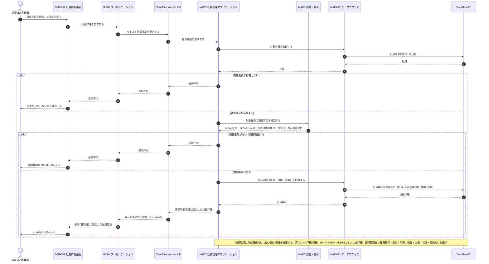
```mermaid
sequenceDiagram
    autonumber
    actor U as 認証済み利用者
    participant UI as SCR-002 社員詳細画面
    participant PRES as M-001 プレゼンテーション
    participant API as Cloudflare Worker API
    participant APP as M-002 社員管理アプリケーション
    participant AUTH as M-003 認証・認可
    participant DATA as M-006 D1データアクセス
    participant DB as Cloudflare D1

    U->>UI: 対象社員を選択して詳細を開く
    UI->>PRES: 社員詳細を要求する
    PRES->>API: API-002 社員詳細を要求する
    API->>APP: 社員詳細を要求する
    APP->>DATA: 対象社員を取得する
    DATA->>DB: 社員を参照する（社員）
    DB-->>DATA: 社員
    DATA-->>APP: 社員
    alt 対象社員が存在しない
        APP-->>API: 参照不可
        API-->>PRES: 参照不可
        PRES-->>UI: 参照不可
        UI-->>U: 対象が存在しない旨を表示する
    else 対象社員が存在する
        APP->>AUTH: 対象社員の閲覧可否を確認する
        AUTH-->>APP: scopeType・操作者社員ID・許可組織ID集合・基準日・表示可能項目
        alt 閲覧権限がない（閲覧範囲外）
            APP-->>API: 参照不可
            API-->>PRES: 参照不可
            PRES-->>UI: 参照不可
            UI-->>U: 閲覧権限がない旨を表示する
        else 閲覧権限がある
            APP->>DATA: 社員詳細（所属・組織・役職）を取得する
            DATA->>DB: 社員詳細を参照する（社員, 社員所属履歴, 組織, 役職）
            DB-->>DATA: 社員詳細
            DATA-->>APP: 社員詳細
            APP-->>API: 表示可能項目に限定した社員詳細
            API-->>PRES: 表示可能項目に限定した社員詳細
            PRES-->>UI: 表示可能項目に限定した社員詳細
            UI-->>U: 社員詳細を表示する
        end
    end
    Note over APP,DB: 初回取得は存在真偽だけに使い個人項目を破棄する。実スコープ再取得後、HR/SYSTEM_ADMINと本人は全詳細、部門管理者は社員番号・氏名・所属・役職・上長・状態・版数だけを返す
```

**連携定義**

条件分岐

| 条件ID | 判定箇所 | 条件 | 成立時 | 不成立時 | 根拠 |
|---|---|---|---|---|---|
| COND-01 | 社員管理アプリケーション | 対象社員が存在する | 閲覧権限の確認へ進む | 参照不可(存在しない) | UC-006/SP-1 (不成立=UC-006/SP-2) |
| COND-02 | 認可機能 | 実行者が対象社員の閲覧権限を持つ(閲覧範囲内) | 権限に応じた項目で詳細を表示する | 参照不可(閲覧範囲外) | UC-006/SP-1 (不成立=UC-006/SP-3) |

データ参照・更新

| エンティティ | CRUD | 目的 | 実行主体 |
|---|---|---|---|
| 社員 | R | 対象社員の存在確認・基本情報の取得 | データアクセス |
| 社員所属履歴 | R | 有効な所属・役職・在籍状態の取得 | データアクセス |
| 組織 | R | 所属組織名の付与 | データアクセス |
| 役職 | R | 役職名の付与 | データアクセス |

トランザクション境界

| 内容 |
|---|
| なし(参照のみ。更新を伴わないため) |

補足事項

| 観点 | 内容 |
|---|---|
| 個人情報保護 | `HR`・`SYSTEM_ADMIN`の`ALL`と`EMPLOYEE`本人の`SELF`は全詳細、`DEPARTMENT_MANAGER`の`ORGANIZATION`は社員ID・社員番号・氏名・所属・役職・上長・状態・版数だけを返す |
| 閲覧判定 | §2.2 UC-006の認可定義に従い、固定ロール、対象社員の基準日時点所属、操作者の主所属と全子孫、本人紐付けから閲覧可否を判定する |
| 性能 | 詳細は単一社員が対象のため、所属・組織・役職を一括で取得する |

## 3.9 社員基本情報更新

UC-007(状態パターン UC-007/SP-1〜SP-5)。`HR`は氏名・カナ・メール・電話・雇用区分、`EMPLOYEE`本人はメール・電話だけを更新でき、非許可項目が混在する要求は全体を拒否する。氏名・カナは前後空白除去・NFC・空文字・正規化後長さ/形式の順に検証し、正規化後の値で差分を判定する。メールの一意性・更新競合を確認し、社員基本情報の更新と変更履歴登録を単一トランザクションで更新する。

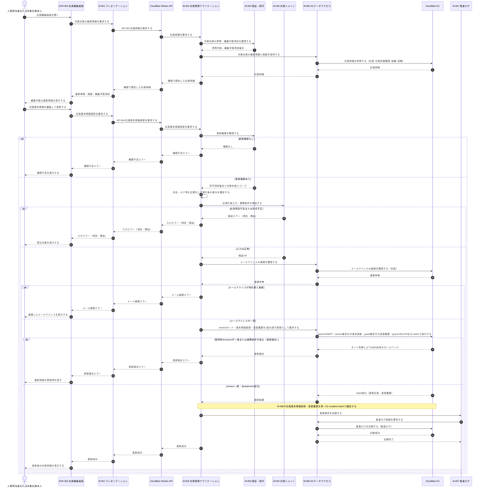
```mermaid
sequenceDiagram
    autonumber
    actor ACT as 人事担当者または対象社員本人
    participant UI as SCR-004 社員編集画面
    participant PRES as M-001 プレゼンテーション
    participant API as Cloudflare Worker API
    participant APP as M-002 社員管理アプリケーション
    participant AUTH as M-003 認証・認可
    participant DOM as M-004 社員ドメイン
    participant DATA as M-006 D1データアクセス
    participant DB as Cloudflare D1
    participant AUDIT as M-007 監査ログ

    ACT->>UI: 社員編集画面を開く
    UI->>PRES: 対象社員の最新情報を要求する
    PRES->>API: API-002 社員詳細を要求する
    API->>APP: 社員詳細を要求する
    APP->>AUTH: 対象社員の参照・編集可能項目を確認する
    AUTH-->>APP: 参照可能・編集可能項目集合
    APP->>DATA: 対象社員の最新情報と版数を取得する
    DATA->>DB: 社員詳細を参照する（社員, 社員所属履歴, 組織, 役職）
    DB-->>DATA: 社員詳細
    DATA-->>APP: 社員詳細
    APP-->>API: 権限で限定した社員詳細
    API-->>PRES: 権限で限定した社員詳細
    PRES-->>UI: 最新情報・版数・編集可能項目
    UI-->>ACT: 編集可能な最新情報を表示する
    ACT->>UI: 社員基本情報を編集して更新する
    UI->>PRES: 社員基本情報更新を要求する
    PRES->>API: API-004 社員基本情報更新を要求する
    API->>APP: 社員基本情報更新を要求する
    APP->>AUTH: 更新権限を確認する
    alt 更新権限なし
        AUTH-->>APP: 権限なし
        APP-->>API: 権限不足エラー
        API-->>PRES: 権限不足エラー
        PRES-->>UI: 権限不足エラー
        UI-->>ACT: 権限不足を表示する
    else 更新権限あり
        AUTH-->>APP: 許可項目集合と対象社員スコープ
        APP->>APP: 氏名・カナ等を正規化し正規化後の差分を確定する
        APP->>DOM: 正規化後入力・業務条件を検証する
        alt 必須項目不足または形式不正
            DOM-->>APP: 検証エラー（項目・理由）
            APP-->>API: 入力エラー（項目・理由）
            API-->>PRES: 入力エラー（項目・理由）
            PRES-->>UI: 入力エラー（項目・理由）
            UI-->>ACT: 修正対象を表示する
        else 入力は正常
            DOM-->>APP: 検証OK
            APP->>DATA: メールアドレスの重複を確認する
            DATA->>DB: メールアドレスの重複を確認する（社員）
            DB-->>DATA: 重複有無
            DATA-->>APP: 重複有無
            alt メールアドレスが他社員と重複
                APP-->>API: メール重複エラー
                API-->>PRES: メール重複エラー
                PRES-->>UI: メール重複エラー
                UI-->>ACT: 重複したメールアドレスを表示する
            else メールアドレスが一意
                APP->>DATA: versionガード・基本情報更新・変更履歴を1回の原子更新として要求する
                DATA->>DB: guard INSERT→version条件付き基本更新→guard条件付き変更履歴→guard DELETEをD1 batchで実行する
                alt 取得時のversion不一致または業務条件不成立（更新競合）
                    DB-->>DATA: ガード失敗によりbatch全体をロールバック
                    DATA-->>APP: 更新競合
                    APP-->>API: 更新競合エラー
                    API-->>PRES: 更新競合エラー
                    PRES-->>UI: 更新競合エラー
                    UI-->>ACT: 最新情報の再取得を促す
                else version一致・全statement成功
                    DB-->>DATA: batch成功（更新社員・変更履歴）
                    DATA-->>APP: 更新結果
                    Note over APP,DB: M-006が社員基本情報更新・変更履歴を単一D1 mutation batchで確定する
                    APP->>AUDIT: 更新操作を記録する
                    AUDIT->>DATA: 監査ログ登録を要求する
                    DATA->>DB: 監査ログを記録する（監査ログ）
                    DB-->>DATA: 記録成功
                    DATA-->>AUDIT: 記録完了
                    APP-->>API: 更新成功
                    API-->>PRES: 更新成功
                    PRES-->>UI: 更新成功
                    UI-->>ACT: 更新後の社員詳細を表示する
                end
            end
        end
    end
```

**連携定義**

条件分岐

| 条件ID | 判定箇所 | 条件 | 成立時 | 不成立時 | 根拠 |
|---|---|---|---|---|---|
| COND-01 | 認可機能 | `HR`の許可7項目、または`EMPLOYEE`本人のemail/phoneNumberだけで要求が構成される | 正規化・入力検証へ進む | 非許可項目を部分更新せず要求全体を権限不足とする | UC-007/SP-1 (不成立=UC-007/SP-2) |
| COND-02 | 社員ドメイン | 氏名・カナを前後空白除去・NFC後に空文字・長さ・形式検証し、その他入力・業務条件も妥当 | メール重複確認へ進む | 入力エラー | UC-007/SP-1 (不成立=UC-007/SP-3) |
| COND-03 | データアクセス | メールアドレスが他社員と重複しない | 更新競合の確認へ進む | メール重複エラー | UC-007/SP-1 (不成立=UC-007/SP-4) |
| COND-04 | データアクセス | 取得時の版数と現在値が一致する | 社員基本情報を更新する | 更新競合エラー(最新再取得を要求) | UC-007/SP-1 (不成立=UC-007/SP-5) |

データ参照・更新

| エンティティ | CRUD | 目的 | 実行主体 |
|---|---|---|---|
| 社員 | R | 初期表示用の最新情報・版数の取得、メールアドレス重複確認・更新競合判定 | データアクセス |
| 社員所属履歴 | R | 初期表示用の現所属を取得 | データアクセス |
| 組織 | R | 初期表示用の現所属組織名を取得 | データアクセス |
| 役職 | R | 初期表示用の現役職名を取得 | データアクセス |
| 社員 | U | 社員基本情報の更新(版数の加算を含む) | データアクセス |
| 社員変更履歴 | C | 更新操作の業務変更履歴記録 | データアクセス |
| 監査ログ | C | 更新操作の証跡記録 | データアクセス（M-007から委譲） |

トランザクション境界

| 境界ID | 開始 | 終了 | 対象更新 | ロールバック条件 | 管理主体 |
|---|---|---|---|---|---|
| TX-002 | M-006がversionガードを先頭にD1 mutation batchを送信 | `batch()`成功 | 社員(基本情報・version)・社員変更履歴 | ガード不成立、制約・トリガー違反、またはいずれかのstatement失敗時にD1がbatch全体をロールバック | M-002が論理境界を宣言しM-006が実行 |

補足事項

| 観点 | 内容 |
|---|---|
| 同期/非同期 | 画面〜更新完了まで同期。監査ログ記録は業務トランザクションと別に行う |
| 更新競合 | M-006がガードINSERTで取得時versionとDB現在versionを再照合し、不一致なら後続更新を実行せずbatchを失敗させ、最新情報の再取得を要求する(UC-007/SP-5) |
| 権限範囲 | `HR`は姓・名・姓カナ・名カナ・email・phoneNumber・employmentTypeCode、`EMPLOYEE`本人はemail・phoneNumberだけを更新できる。部門管理者・システム管理者単独では更新不可 |
| 正規化 | 姓・名・カナは前後空白除去、NFC、空文字、正規化後長さ・形式、現値との差分の順に処理し、履歴は正規化後の実変更項目だけで生成する |
| 監査ログ | 監査ログは業務コミット後に別トランザクションで記録する。記録失敗時も更新結果は戻さず、運用アラートを通知して成功結果を返す |

## 3.10 変更履歴参照

UC-008(状態パターン UC-008/SP-1〜SP-3)。認可機能で変更履歴の参照権限を確認し、権限がある場合に対象社員の変更履歴を取得して時系列で一覧表示する。参照権限がない場合は参照不可を表示し、履歴が0件の場合は該当なしを表示する。参照のみで更新は行わない。

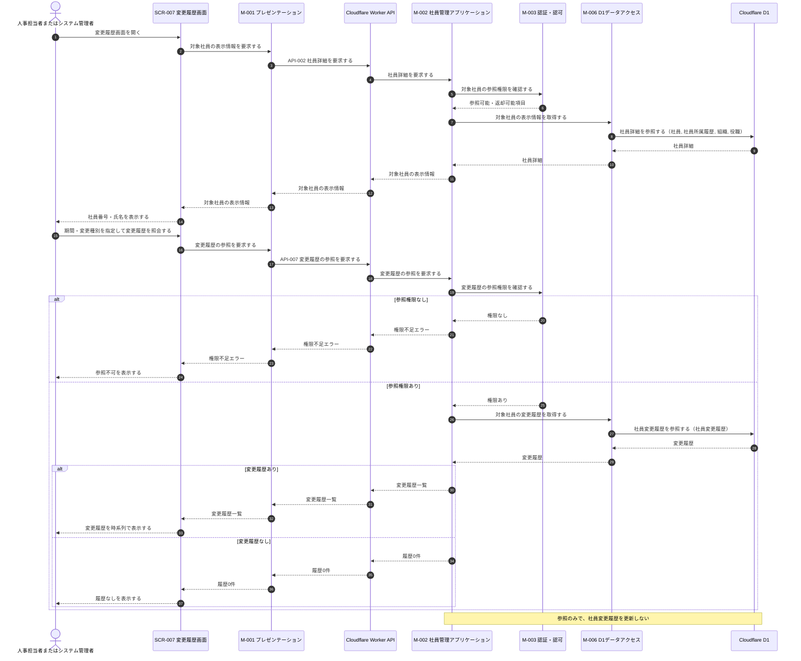
```mermaid
sequenceDiagram
    autonumber
    actor ACT as 人事担当者またはシステム管理者
    participant UI as SCR-007 変更履歴画面
    participant PRES as M-001 プレゼンテーション
    participant API as Cloudflare Worker API
    participant APP as M-002 社員管理アプリケーション
    participant AUTH as M-003 認証・認可
    participant DATA as M-006 D1データアクセス
    participant DB as Cloudflare D1

    ACT->>UI: 変更履歴画面を開く
    UI->>PRES: 対象社員の表示情報を要求する
    PRES->>API: API-002 社員詳細を要求する
    API->>APP: 社員詳細を要求する
    APP->>AUTH: 対象社員の参照権限を確認する
    AUTH-->>APP: 参照可能・返却可能項目
    APP->>DATA: 対象社員の表示情報を取得する
    DATA->>DB: 社員詳細を参照する（社員, 社員所属履歴, 組織, 役職）
    DB-->>DATA: 社員詳細
    DATA-->>APP: 社員詳細
    APP-->>API: 対象社員の表示情報
    API-->>PRES: 対象社員の表示情報
    PRES-->>UI: 対象社員の表示情報
    UI-->>ACT: 社員番号・氏名を表示する
    ACT->>UI: 期間・変更種別を指定して変更履歴を照会する
    UI->>PRES: 変更履歴の参照を要求する
    PRES->>API: API-007 変更履歴の参照を要求する
    API->>APP: 変更履歴の参照を要求する
    APP->>AUTH: 変更履歴の参照権限を確認する
    alt 参照権限なし
        AUTH-->>APP: 権限なし
        APP-->>API: 権限不足エラー
        API-->>PRES: 権限不足エラー
        PRES-->>UI: 権限不足エラー
        UI-->>ACT: 参照不可を表示する
    else 参照権限あり
        AUTH-->>APP: 権限あり
        APP->>DATA: 対象社員の変更履歴を取得する
        DATA->>DB: 社員変更履歴を参照する（社員変更履歴）
        DB-->>DATA: 変更履歴
        DATA-->>APP: 変更履歴
        alt 変更履歴あり
            APP-->>API: 変更履歴一覧
            API-->>PRES: 変更履歴一覧
            PRES-->>UI: 変更履歴一覧
            UI-->>ACT: 変更履歴を時系列で表示する
        else 変更履歴なし
            APP-->>API: 履歴0件
            API-->>PRES: 履歴0件
            PRES-->>UI: 履歴0件
            UI-->>ACT: 履歴なしを表示する
        end
    end
    Note over APP,DB: 参照のみで、社員変更履歴を更新しない
```

**連携定義**

条件分岐

| 条件ID | 判定箇所 | 条件 | 成立時 | 不成立時 | 根拠 |
|---|---|---|---|---|---|
| COND-01 | 認可機能 | 実行者が変更履歴の参照権限を持つ | 変更履歴の取得へ進む | 権限不足エラー | UC-008/SP-1 (不成立=UC-008/SP-3) |
| COND-02 | 社員管理アプリケーション | 対象社員の変更履歴が1件以上ある | 変更履歴一覧を表示する | 履歴なしを表示する | UC-008/SP-1 (不成立=UC-008/SP-2) |

データ参照・更新

| エンティティ | CRUD | 目的 | 実行主体 |
|---|---|---|---|
| 社員 | R | 初期表示用の社員番号・氏名を取得 | データアクセス |
| 社員所属履歴 | R | 初期表示用の現所属を取得 | データアクセス |
| 組織 | R | 初期表示用の現所属組織名を取得 | データアクセス |
| 役職 | R | 初期表示用の現役職名を取得 | データアクセス |
| 社員変更履歴 | R | 対象社員の変更履歴の取得 | データアクセス |

トランザクション境界

| 内容 |
|---|
| なし(参照のみ。更新を伴わないため) |

補足事項

| 観点 | 内容 |
|---|---|
| 性能 | 変更履歴は件数が多くなり得るため時系列順・ページング前提で取得する |
| 個人情報保護 | 参照権限の範囲を超える社員の変更履歴は取得対象に含めない |
| 監査ログ | 本変更履歴参照では業務監査ログを追加登録しない。相関ID・実行者・結果は個人情報を含めずアプリケーションアクセスログへ記録する |

## 3.11 検索結果出力

UC-009(状態パターン UC-009/SP-1〜SP-3)。認可機能で出力権限と閲覧可能範囲を確認し、出力条件と閲覧条件で社員を取得して、権限で許可された項目に限定した出力データを生成する。出力に成功した場合は監査ログを記録する。出力権限がない場合は出力不可を表示し、対象0件の場合は出力対象なしを通知する。

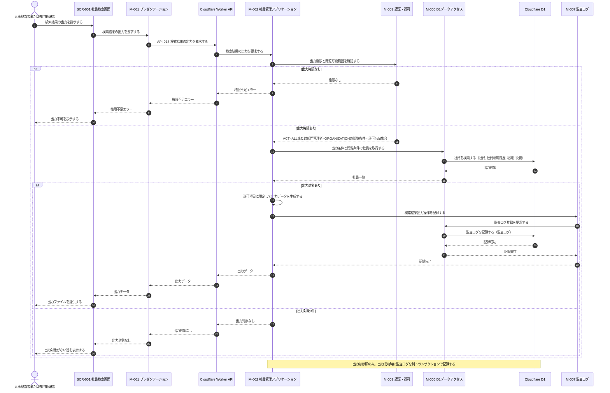
```mermaid
sequenceDiagram
    autonumber
    actor ACT as 人事担当者または部門管理者
    participant UI as SCR-001 社員検索画面
    participant PRES as M-001 プレゼンテーション
    participant API as Cloudflare Worker API
    participant APP as M-002 社員管理アプリケーション
    participant AUTH as M-003 認証・認可
    participant DATA as M-006 D1データアクセス
    participant DB as Cloudflare D1
    participant AUDIT as M-007 監査ログ

    ACT->>UI: 検索結果の出力を指示する
    UI->>PRES: 検索結果の出力を要求する
    PRES->>API: API-018 検索結果の出力を要求する
    API->>APP: 検索結果の出力を要求する
    APP->>AUTH: 出力権限と閲覧可能範囲を確認する
    alt 出力権限なし
        AUTH-->>APP: 権限なし
        APP-->>API: 権限不足エラー
        API-->>PRES: 権限不足エラー
        PRES-->>UI: 権限不足エラー
        UI-->>ACT: 出力不可を表示する
    else 出力権限あり
        AUTH-->>APP: ACT=ALLまたは部門管理者=ORGANIZATIONの閲覧条件・許可field集合
        APP->>DATA: 出力条件と閲覧条件で社員を取得する
        DATA->>DB: 社員を検索する（社員, 社員所属履歴, 組織, 役職）
        DB-->>DATA: 出力対象
        DATA-->>APP: 社員一覧
        alt 出力対象あり
            APP->>APP: 許可項目に限定して出力データを生成する
            APP->>AUDIT: 検索結果出力操作を記録する
            AUDIT->>DATA: 監査ログ登録を要求する
            DATA->>DB: 監査ログを記録する（監査ログ）
            DB-->>DATA: 記録成功
            DATA-->>AUDIT: 記録完了
            AUDIT-->>APP: 記録完了
            APP-->>API: 出力データ
            API-->>PRES: 出力データ
            PRES-->>UI: 出力データ
            UI-->>ACT: 出力ファイルを提供する
        else 出力対象0件
            APP-->>API: 出力対象なし
            API-->>PRES: 出力対象なし
            PRES-->>UI: 出力対象なし
            UI-->>ACT: 出力対象がない旨を表示する
        end
    end
    Note over APP,DB: 出力は参照のみ。出力成功時に監査ログを別トランザクションで記録する
```

**連携定義**

条件分岐

| 条件ID | 判定箇所 | 条件 | 成立時 | 不成立時 | 根拠 |
|---|---|---|---|---|---|
| COND-01 | 認可機能 | 実行者が検索結果の出力権限を持つ | 出力対象の取得へ進む | 権限不足エラー | UC-009/SP-1 (不成立=UC-009/SP-3) |
| COND-02 | 社員管理アプリケーション | 出力対象が1件以上ある | 許可項目で出力データを生成し監査記録する | 出力対象なしを通知する | UC-009/SP-1 (不成立=UC-009/SP-2) |

データ参照・更新

| エンティティ | CRUD | 目的 | 実行主体 |
|---|---|---|---|
| 社員 | R | 出力条件・閲覧条件に一致する社員の取得 | データアクセス |
| 社員所属履歴 | R | 有効な所属・役職の付与 | データアクセス |
| 組織 | R | 組織名の付与 | データアクセス |
| 役職 | R | 役職名の付与 | データアクセス |
| 監査ログ | C | 検索結果出力操作の証跡記録 | データアクセス（M-007から委譲） |

トランザクション境界

| 内容 |
|---|
| 業務データの更新はなし(参照のみ)。監査ログの記録は独立した単一トランザクションで実行する |

補足事項

| 観点 | 内容 |
|---|---|
| 同期/非同期 | 画面〜出力データ提供まで同期。監査ログ記録は出力処理と別トランザクションで行う |
| 個人情報保護 | 出力項目は実行者の権限で許可された項目に限定し、閲覧条件外の社員は出力対象に含めない |
| 検索既定値 | 在籍状態は省略時`ACTIVE`とし、要求で`ALL`を明示した場合だけ全状態を対象にする |
| 監査ログ | 出力は個人情報の抽出を伴うため別トランザクションで証跡を記録する。記録失敗時は運用アラートを通知し、生成済み出力は成功として返す |

## 3.12 組織マスター管理

UC-010(状態パターン UC-010/SP-1〜SP-5。無効化は UC-010/SP-2 として基本フローに含む)。管理者権限・入力妥当性・組織コードの一意性に加え、親子期間包含、有効な子組織および現在・将来所属への影響を確認したうえで、組織の登録・更新(無効化を含む)を単一トランザクションで反映し、操作を監査ログに記録する。手動利用可否は有効期間と独立するが、参照中の階層・所属を壊す無効化や期間短縮は拒否する。

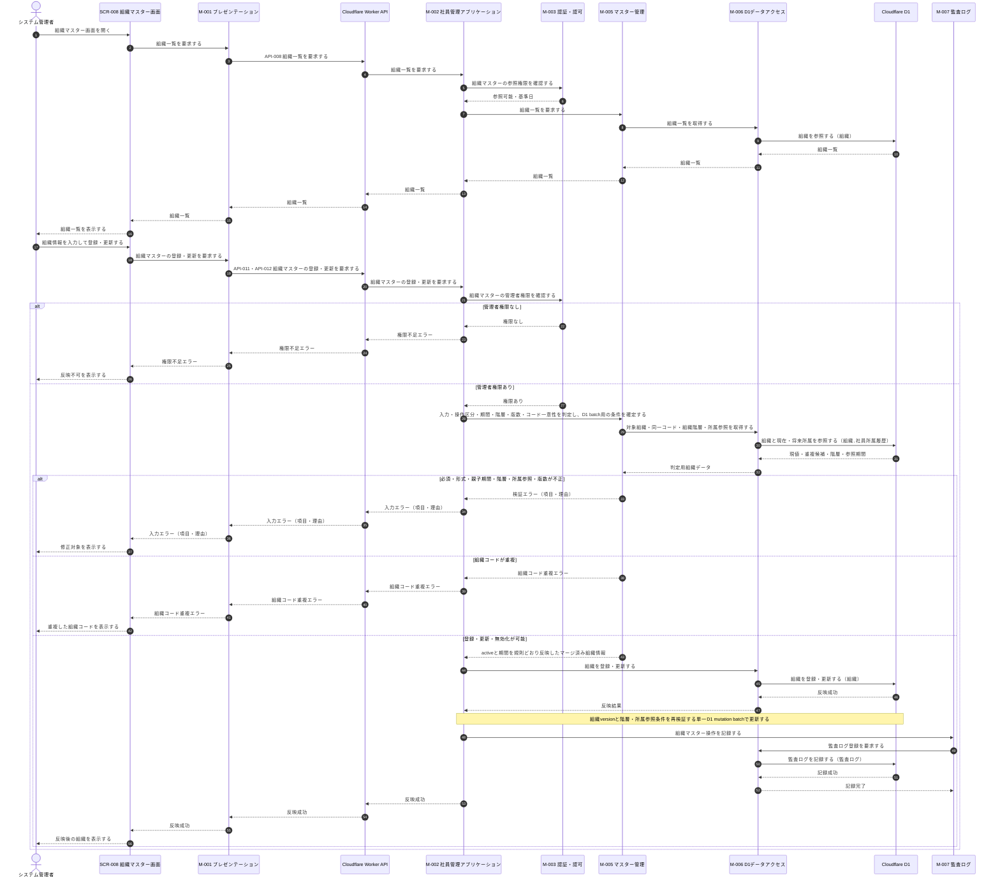
```mermaid
sequenceDiagram
    autonumber
    actor ADM as システム管理者
    participant UI as SCR-008 組織マスター画面
    participant PRES as M-001 プレゼンテーション
    participant API as Cloudflare Worker API
    participant APP as M-002 社員管理アプリケーション
    participant AUTH as M-003 認証・認可
    participant MST as M-005 マスター管理
    participant DATA as M-006 D1データアクセス
    participant DB as Cloudflare D1
    participant AUDIT as M-007 監査ログ

    ADM->>UI: 組織マスター画面を開く
    UI->>PRES: 組織一覧を要求する
    PRES->>API: API-008 組織一覧を要求する
    API->>APP: 組織一覧を要求する
    APP->>AUTH: 組織マスターの参照権限を確認する
    AUTH-->>APP: 参照可能・基準日
    APP->>MST: 組織一覧を要求する
    MST->>DATA: 組織一覧を取得する
    DATA->>DB: 組織を参照する（組織）
    DB-->>DATA: 組織一覧
    DATA-->>MST: 組織一覧
    MST-->>APP: 組織一覧
    APP-->>API: 組織一覧
    API-->>PRES: 組織一覧
    PRES-->>UI: 組織一覧
    UI-->>ADM: 組織一覧を表示する
    ADM->>UI: 組織情報を入力して登録・更新する
    UI->>PRES: 組織マスターの登録・更新を要求する
    PRES->>API: API-011・API-012 組織マスターの登録・更新を要求する
    API->>APP: 組織マスターの登録・更新を要求する
    APP->>AUTH: 組織マスターの管理者権限を確認する
    alt 管理者権限なし
        AUTH-->>APP: 権限なし
        APP-->>API: 権限不足エラー
        API-->>PRES: 権限不足エラー
        PRES-->>UI: 権限不足エラー
        UI-->>ADM: 反映不可を表示する
    else 管理者権限あり
        AUTH-->>APP: 権限あり
        APP->>MST: 入力・操作区分・期間・階層・版数・コード一意性を判定し、D1 batch用の条件を確定する
        MST->>DATA: 対象組織・同一コード・組織階層・所属参照を取得する
        DATA->>DB: 組織と現在・将来所属を参照する（組織, 社員所属履歴）
        DB-->>DATA: 現値・重複候補・階層・参照期間
        DATA-->>MST: 判定用組織データ
        alt 必須・形式・親子期間・階層・所属参照・版数が不正
            MST-->>APP: 検証エラー（項目・理由）
            APP-->>API: 入力エラー（項目・理由）
            API-->>PRES: 入力エラー（項目・理由）
            PRES-->>UI: 入力エラー（項目・理由）
            UI-->>ADM: 修正対象を表示する
        else 組織コードが重複
            MST-->>APP: 組織コード重複エラー
            APP-->>API: 組織コード重複エラー
            API-->>PRES: 組織コード重複エラー
            PRES-->>UI: 組織コード重複エラー
            UI-->>ADM: 重複した組織コードを表示する
        else 登録・更新・無効化が可能
                MST-->>APP: activeと期間を規則どおり反映したマージ済み組織情報
                APP->>DATA: 組織を登録・更新する
                DATA->>DB: 組織を登録・更新する（組織）
                DB-->>DATA: 反映成功
                DATA-->>APP: 反映結果
                Note over APP,DB: 組織versionと階層・所属参照条件を再検証する単一D1 mutation batchで更新する
                APP->>AUDIT: 組織マスター操作を記録する
                AUDIT->>DATA: 監査ログ登録を要求する
                DATA->>DB: 監査ログを記録する（監査ログ）
                DB-->>DATA: 記録成功
                DATA-->>AUDIT: 記録完了
                APP-->>API: 反映成功
                API-->>PRES: 反映成功
                PRES-->>UI: 反映成功
                UI-->>ADM: 反映後の組織を表示する
        end
    end
```

**連携定義**

条件分岐

| 条件ID | 判定箇所 | 条件 | 成立時 | 不成立時 | 根拠 |
|---|---|---|---|---|---|
| COND-01 | 認可機能 | 実行者が組織マスターの管理者権限を持つ | 入力検証へ進む | 権限不足エラー | UC-010/SP-1 (不成立=UC-010/SP-3) |
| COND-02 | マスター管理機能 | 必須・形式・親子期間包含・階層・有効な子組織・現在/将来所属参照・版数が妥当 | 組織コードの一意判定へ進む | 入力・期間・階層・参照・競合エラー | UC-010/SP-1 (不成立=UC-010/SP-4) |
| COND-03 | マスター管理機能 | 組織コードが一意 | 組織を登録・更新する | 組織コード重複エラー | UC-010/SP-1 (不成立=UC-010/SP-5) |
| COND-04 | マスター管理機能 | 操作が無効化指定である | 手動利用可否を即時無効化し、終了日は指定時だけ更新する | active現値を維持して登録・更新する | UC-010/SP-2 (成立=UC-010/SP-2、不成立=UC-010/SP-1) |

データ参照・更新

| エンティティ | CRUD | 目的 | 実行主体 |
|---|---|---|---|
| 組織 | R | 初期一覧取得、および組織コードの重複(一意性)確認 | データアクセス |
| 社員所属履歴 | R | 無効化・期間短縮後も現在・将来所属の参照期間が包含されることを確認 | データアクセス |
| 組織 | C | 新規組織の登録 | データアクセス |
| 組織 | U | 既存組織の更新／無効化(手動利用可否=無効、終了日は指定時だけ更新) | データアクセス |
| 監査ログ | C | 組織マスター操作の証跡記録 | データアクセス（M-007から委譲） |

トランザクション境界

| 境界ID | 開始 | 終了 | 対象更新 | ロールバック条件 | 管理主体 |
|---|---|---|---|---|---|
| TX-006 | M-006が組織version・階層・所属参照条件付きD1 mutation batchを送信 | `batch()`成功 | 組織 | 条件不成立、制約違反または登録・更新文の失敗時にD1がbatch全体をロールバック | M-002が境界を宣言しM-006が実行 |

補足事項

| 観点 | 内容 |
|---|---|
| 同期/非同期 | 画面〜反映完了まで同期。監査ログ記録は業務トランザクションと別に行う |
| 整合性 | 組織コード一意性に加え、上位組織はactive=trueかつ子の期間全体を包含する。D1の逐次実行とbatch内条件・SQLiteトリガーで循環、有効な子の孤児化、現在・将来所属の参照不能を拒否する |
| 利用可否・期間 | 指定日時点で利用可能なのは手動利用可かつ有効期間内の場合だけ。無効化・将来終了は、子組織と所属参照を壊さない場合だけ許可する |
| 監査ログ | 監査ログは業務コミット後に別トランザクションで記録する。記録失敗時も組織更新は戻さず、運用アラートを通知して成功結果を返す |

## 3.13 役職マスター管理

UC-011(状態パターン UC-011/SP-1〜SP-5。無効化は UC-011/SP-2 として基本フローに含む)。管理者権限・入力妥当性・役職コードの一意性と、現在・将来所属への影響を確認したうえで、役職の登録・更新(無効化を含む)を単一トランザクションで反映し、操作を監査ログに記録する。参照中の所属を無効にする無効化・期間短縮は拒否する。

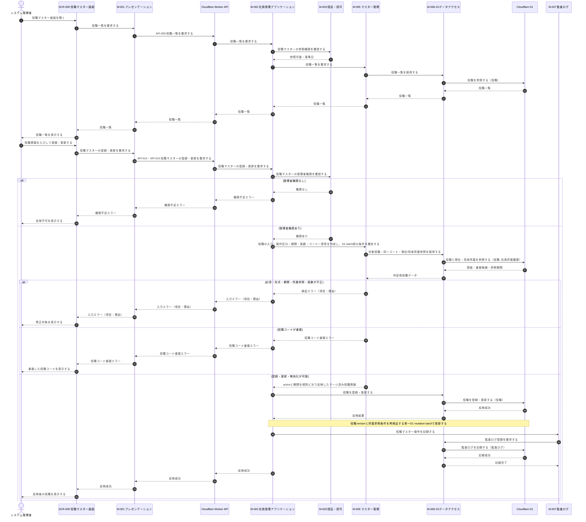
```mermaid
sequenceDiagram
    autonumber
    actor ADM as システム管理者
    participant UI as SCR-009 役職マスター画面
    participant PRES as M-001 プレゼンテーション
    participant API as Cloudflare Worker API
    participant APP as M-002 社員管理アプリケーション
    participant AUTH as M-003 認証・認可
    participant MST as M-005 マスター管理
    participant DATA as M-006 D1データアクセス
    participant DB as Cloudflare D1
    participant AUDIT as M-007 監査ログ

    ADM->>UI: 役職マスター画面を開く
    UI->>PRES: 役職一覧を要求する
    PRES->>API: API-009 役職一覧を要求する
    API->>APP: 役職一覧を要求する
    APP->>AUTH: 役職マスターの参照権限を確認する
    AUTH-->>APP: 参照可能・基準日
    APP->>MST: 役職一覧を要求する
    MST->>DATA: 役職一覧を取得する
    DATA->>DB: 役職を参照する（役職）
    DB-->>DATA: 役職一覧
    DATA-->>MST: 役職一覧
    MST-->>APP: 役職一覧
    APP-->>API: 役職一覧
    API-->>PRES: 役職一覧
    PRES-->>UI: 役職一覧
    UI-->>ADM: 役職一覧を表示する
    ADM->>UI: 役職情報を入力して登録・更新する
    UI->>PRES: 役職マスターの登録・更新を要求する
    PRES->>API: API-013・API-014 役職マスターの登録・更新を要求する
    API->>APP: 役職マスターの登録・更新を要求する
    APP->>AUTH: 役職マスターの管理者権限を確認する
    alt 管理者権限なし
        AUTH-->>APP: 権限なし
        APP-->>API: 権限不足エラー
        API-->>PRES: 権限不足エラー
        PRES-->>UI: 権限不足エラー
        UI-->>ADM: 反映不可を表示する
    else 管理者権限あり
        AUTH-->>APP: 権限あり
        APP->>MST: 役職の入力・操作区分・期間・版数・コード一意性を判定し、D1 batch用の条件を確定する
        MST->>DATA: 対象役職・同一コード・現在/将来所属参照を取得する
        DATA->>DB: 役職と現在・将来所属を参照する（役職, 社員所属履歴）
        DB-->>DATA: 現値・重複候補・参照期間
        DATA-->>MST: 判定用役職データ
        alt 必須・形式・期間・所属参照・版数が不正
            MST-->>APP: 検証エラー（項目・理由）
            APP-->>API: 入力エラー（項目・理由）
            API-->>PRES: 入力エラー（項目・理由）
            PRES-->>UI: 入力エラー（項目・理由）
            UI-->>ADM: 修正対象を表示する
        else 役職コードが重複
            MST-->>APP: 役職コード重複エラー
            APP-->>API: 役職コード重複エラー
            API-->>PRES: 役職コード重複エラー
            PRES-->>UI: 役職コード重複エラー
            UI-->>ADM: 重複した役職コードを表示する
        else 登録・更新・無効化が可能
                MST-->>APP: activeと期間を規則どおり反映したマージ済み役職情報
                APP->>DATA: 役職を登録・更新する
                DATA->>DB: 役職を登録・更新する（役職）
                DB-->>DATA: 反映成功
                DATA-->>APP: 反映結果
                Note over APP,DB: 役職versionと所属参照条件を再検証する単一D1 mutation batchで更新する
                APP->>AUDIT: 役職マスター操作を記録する
                AUDIT->>DATA: 監査ログ登録を要求する
                DATA->>DB: 監査ログを記録する（監査ログ）
                DB-->>DATA: 記録成功
                DATA-->>AUDIT: 記録完了
                APP-->>API: 反映成功
                API-->>PRES: 反映成功
                PRES-->>UI: 反映成功
                UI-->>ADM: 反映後の役職を表示する
        end
    end
```

**連携定義**

条件分岐

| 条件ID | 判定箇所 | 条件 | 成立時 | 不成立時 | 根拠 |
|---|---|---|---|---|---|
| COND-01 | 認可機能 | 実行者が役職マスターの管理者権限を持つ | 入力検証へ進む | 権限不足エラー | UC-011/SP-1 (不成立=UC-011/SP-3) |
| COND-02 | マスター管理機能 | 必須・形式・期間・現在/将来所属参照・版数が妥当 | 役職コードの一意判定へ進む | 入力・期間・参照・競合エラー | UC-011/SP-1 (不成立=UC-011/SP-4) |
| COND-03 | マスター管理機能 | 役職コードが一意 | 役職を登録・更新する | 役職コード重複エラー | UC-011/SP-1 (不成立=UC-011/SP-5) |
| COND-04 | マスター管理機能 | 操作が無効化指定である | 手動利用可否を即時無効化し、終了日は指定時だけ更新する | active現値を維持して登録・更新する | UC-011/SP-2 (成立=UC-011/SP-2、不成立=UC-011/SP-1) |

データ参照・更新

| エンティティ | CRUD | 目的 | 実行主体 |
|---|---|---|---|
| 役職 | R | 初期一覧取得、および役職コードの重複(一意性)確認 | データアクセス |
| 社員所属履歴 | R | 無効化・期間短縮後も現在・将来所属の参照期間が包含されることを確認 | データアクセス |
| 役職 | C | 新規役職の登録 | データアクセス |
| 役職 | U | 既存役職の更新／無効化(手動利用可否=無効、終了日は指定時だけ更新) | データアクセス |
| 監査ログ | C | 役職マスター操作の証跡記録 | データアクセス（M-007から委譲） |

トランザクション境界

| 境界ID | 開始 | 終了 | 対象更新 | ロールバック条件 | 管理主体 |
|---|---|---|---|---|---|
| TX-007 | M-006が役職version・所属参照条件付きD1 mutation batchを送信 | `batch()`成功 | 役職 | 条件不成立、制約違反または登録・更新文の失敗時にD1がbatch全体をロールバック | M-002が境界を宣言しM-006が実行 |

補足事項

| 観点 | 内容 |
|---|---|
| 同期/非同期 | 画面〜反映完了まで同期。監査ログ記録は業務トランザクションと別に行う |
| 整合性 | 役職コード一意性と現在・将来所属の参照期間包含をD1 batch内の条件付き文・SQLiteトリガーで再検証する |
| 利用可否・期間 | 指定日時点で利用可能なのは手動利用可かつ有効期間内の場合だけ。無効化・将来終了は所属参照を壊さない場合だけ許可する |
| 監査ログ | 監査ログは業務コミット後に別トランザクションで記録する。記録失敗時も役職更新は戻さず、運用アラートを通知して成功結果を返す |

## 3.14 権限管理

UC-012(状態パターン UC-012/SP-1〜SP-6)。管理者権限・対象社員と利用者アカウントの存在・アカウント有効性・指定ロール・業務日以降の有効期間の妥当性を確認したうえで、指定適用日以降を`active=true`の更新後ロール一式へ置き換える。既存の`active=false`ロール割当は参照表示し、置換時の終了・取消対象にできるが新規指定できない。ロール割当と社員変更履歴を同一トランザクションで更新し、監査ログを別トランザクションで記録する。

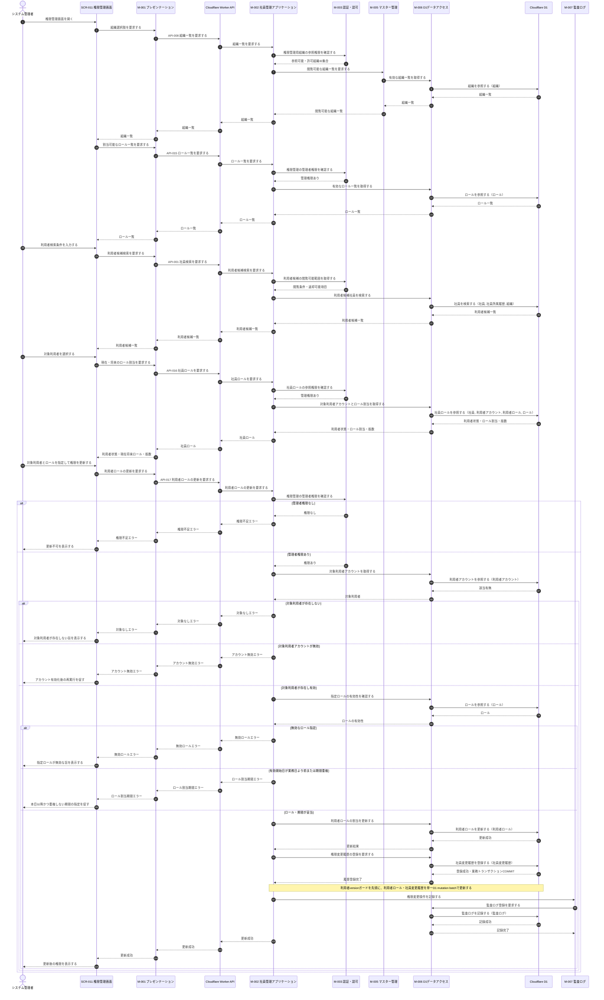
```mermaid
sequenceDiagram
    autonumber
    actor ADM as システム管理者
    participant UI as SCR-011 権限管理画面
    participant PRES as M-001 プレゼンテーション
    participant API as Cloudflare Worker API
    participant APP as M-002 社員管理アプリケーション
    participant AUTH as M-003 認証・認可
    participant MST as M-005 マスター管理
    participant DATA as M-006 D1データアクセス
    participant DB as Cloudflare D1
    participant AUDIT as M-007 監査ログ

    ADM->>UI: 権限管理画面を開く
    UI->>PRES: 組織選択肢を要求する
    PRES->>API: API-008 組織一覧を要求する
    API->>APP: 組織一覧を要求する
    APP->>AUTH: 権限管理用組織の参照権限を確認する
    AUTH-->>APP: 参照可能・許可組織ID集合
    APP->>MST: 閲覧可能な組織一覧を要求する
    MST->>DATA: 有効な組織一覧を取得する
    DATA->>DB: 組織を参照する（組織）
    DB-->>DATA: 組織一覧
    DATA-->>MST: 組織一覧
    MST-->>APP: 閲覧可能な組織一覧
    APP-->>API: 組織一覧
    API-->>PRES: 組織一覧
    PRES-->>UI: 組織一覧
    UI->>PRES: 割当可能なロール一覧を要求する
    PRES->>API: API-015 ロール一覧を要求する
    API->>APP: ロール一覧を要求する
    APP->>AUTH: 権限管理の管理者権限を確認する
    AUTH-->>APP: 管理権限あり
    APP->>DATA: 有効なロール一覧を取得する
    DATA->>DB: ロールを参照する（ロール）
    DB-->>DATA: ロール一覧
    DATA-->>APP: ロール一覧
    APP-->>API: ロール一覧
    API-->>PRES: ロール一覧
    PRES-->>UI: ロール一覧
    ADM->>UI: 利用者検索条件を入力する
    UI->>PRES: 利用者候補検索を要求する
    PRES->>API: API-001 社員検索を要求する
    API->>APP: 利用者候補検索を要求する
    APP->>AUTH: 利用者候補の閲覧可能範囲を取得する
    AUTH-->>APP: 閲覧条件・返却可能項目
    APP->>DATA: 利用者候補社員を検索する
    DATA->>DB: 社員を検索する（社員, 社員所属履歴, 組織）
    DB-->>DATA: 利用者候補一覧
    DATA-->>APP: 利用者候補一覧
    APP-->>API: 利用者候補一覧
    API-->>PRES: 利用者候補一覧
    PRES-->>UI: 利用者候補一覧
    ADM->>UI: 対象利用者を選択する
    UI->>PRES: 現在・将来のロール割当を要求する
    PRES->>API: API-016 社員ロールを要求する
    API->>APP: 社員ロールを要求する
    APP->>AUTH: 社員ロールの参照権限を確認する
    AUTH-->>APP: 管理権限あり
    APP->>DATA: 対象利用者アカウントとロール割当を取得する
    DATA->>DB: 社員ロールを参照する（社員, 利用者アカウント, 利用者ロール, ロール）
    DB-->>DATA: 利用者状態・ロール割当・版数
    DATA-->>APP: 利用者状態・ロール割当・版数
    APP-->>API: 社員ロール
    API-->>PRES: 社員ロール
    PRES-->>UI: 利用者状態・現在将来ロール・版数
    ADM->>UI: 対象利用者とロールを指定して権限を更新する
    UI->>PRES: 利用者ロールの更新を要求する
    PRES->>API: API-017 利用者ロールの更新を要求する
    API->>APP: 利用者ロールの更新を要求する
    APP->>AUTH: 権限管理の管理者権限を確認する
    alt 管理者権限なし
        AUTH-->>APP: 権限なし
        APP-->>API: 権限不足エラー
        API-->>PRES: 権限不足エラー
        PRES-->>UI: 権限不足エラー
        UI-->>ADM: 更新不可を表示する
    else 管理者権限あり
        AUTH-->>APP: 権限あり
        APP->>DATA: 対象利用者アカウントを取得する
        DATA->>DB: 利用者アカウントを参照する（利用者アカウント）
        DB-->>DATA: 該当有無
        DATA-->>APP: 対象利用者
        alt 対象利用者が存在しない
            APP-->>API: 対象なしエラー
            API-->>PRES: 対象なしエラー
            PRES-->>UI: 対象なしエラー
            UI-->>ADM: 対象利用者が存在しない旨を表示する
        else 対象利用者アカウントが無効
            APP-->>API: アカウント無効エラー
            API-->>PRES: アカウント無効エラー
            PRES-->>UI: アカウント無効エラー
            UI-->>ADM: アカウント有効化後の再実行を促す
        else 対象利用者が存在し有効
            APP->>DATA: 指定ロールの有効性を確認する
            DATA->>DB: ロールを参照する（ロール）
            DB-->>DATA: ロール
            DATA-->>APP: ロールの有効性
            alt 無効なロール指定
                APP-->>API: 無効ロールエラー
                API-->>PRES: 無効ロールエラー
                PRES-->>UI: 無効ロールエラー
                UI-->>ADM: 指定ロールが無効な旨を表示する
            else 有効開始日が業務日より前または期間重複
                APP-->>API: ロール割当期間エラー
                API-->>PRES: ロール割当期間エラー
                PRES-->>UI: ロール割当期間エラー
                UI-->>ADM: 本日以降かつ重複しない期間の指定を促す
            else ロール・期間が妥当
                APP->>DATA: 利用者ロールの割当を更新する
                DATA->>DB: 利用者ロールを更新する（利用者ロール）
                DB-->>DATA: 更新成功
                DATA-->>APP: 更新結果
                APP->>DATA: 権限変更履歴の登録を要求する
                DATA->>DB: 社員変更履歴を登録する（社員変更履歴）
                DB-->>DATA: 登録成功・業務トランザクションCOMMIT
                DATA-->>APP: 履歴登録完了
                Note over APP,DB: 利用者versionガードを先頭に、利用者ロール・社員変更履歴を単一D1 mutation batchで更新する
                APP->>AUDIT: 権限変更操作を記録する
                AUDIT->>DATA: 監査ログ登録を要求する
                DATA->>DB: 監査ログを記録する（監査ログ）
                DB-->>DATA: 記録成功
                DATA-->>AUDIT: 記録完了
                APP-->>API: 更新成功
                API-->>PRES: 更新成功
                PRES-->>UI: 更新成功
                UI-->>ADM: 更新後の権限を表示する
            end
        end
    end
```

**連携定義**

条件分岐

| 条件ID | 判定箇所 | 条件 | 成立時 | 不成立時 | 根拠 |
|---|---|---|---|---|---|
| COND-01 | 認可機能 | 実行者が権限管理の管理者権限を持つ | 対象利用者の確認へ進む | 権限不足エラー | UC-012/SP-1 (不成立=UC-012/SP-2) |
| COND-02 | 社員管理アプリケーション | 対象社員と利用者アカウントが存在する | アカウント有効性確認へ進む | 対象なしエラー | UC-012/SP-1 (不成立=UC-012/SP-3) |
| COND-03 | 社員管理アプリケーション | 対象利用者アカウントが有効である | 指定ロールの妥当性確認へ進む | アカウント無効エラー | UC-012/SP-1 (不成立=UC-012/SP-6) |
| COND-04 | 社員管理アプリケーション | 指定ロールが有効である | 有効期間の妥当性確認へ進む | 無効ロールエラー | UC-012/SP-1 (不成立=UC-012/SP-4) |
| COND-05 | 認証・認可／社員管理アプリケーション | 有効開始日が業務日以降で既存割当と重複しない | 利用者ロールの割当を更新する | ロール割当期間エラー | UC-012/SP-1 (不成立=UC-012/SP-5) |

データ参照・更新

| エンティティ | CRUD | 目的 | 実行主体 |
|---|---|---|---|
| 組織 | R | 利用者検索用の組織選択肢を取得 | データアクセス |
| 社員 | R | 利用者候補検索・対象社員の存在確認 | データアクセス |
| 社員所属履歴 | R | 利用者候補の現所属を取得 | データアクセス |
| 利用者アカウント | R | 対象利用者アカウントの存在・状態・版数を取得 | データアクセス |
| 利用者アカウント | U | ロール割当更新用版数の楽観ロック | データアクセス |
| ロール | R | 初期選択肢・既存割当表示の取得、および指定ロールの有効性確認 | データアクセス |
| 利用者ロール | R | 対象利用者の現在・将来ロール割当を取得 | データアクセス |
| 利用者ロール | U | 対象利用者へのロール割当の更新 | データアクセス |
| 社員変更履歴 | C | 対象社員の権限変更履歴の記録 | データアクセス |
| 監査ログ | C | 権限変更操作の証跡記録 | データアクセス（M-007から委譲） |

トランザクション境界

| 境界ID | 開始 | 終了 | 対象更新 | ロールバック条件 | 管理主体 |
|---|---|---|---|---|---|
| TX-008 | M-006が利用者versionガードを先頭にD1 mutation batchを送信 | `batch()`成功 | 利用者アカウント、利用者ロール、社員変更履歴 | version不一致、制約違反またはいずれかの文が失敗した場合にD1がbatch全体をロールバック | M-002が境界を宣言しM-006が実行 |

補足事項

| 観点 | 内容 |
|---|---|
| 同期/非同期 | 画面〜更新完了まで同期。監査ログ記録は業務トランザクションと別に行う |
| 設計状態 | 画面はSCR-011、APIはAPI-015〜017、業務処理はM-002/IF-12として詳細化済み |
| 監査ログ | 権限変更は影響が大きいため別トランザクションで証跡を記録する。記録失敗時も業務更新はロールバックせず、アラートを通知してAPIは更新成功として返す |

## 3.15 ログアウト

UC-013（状態パターン UC-013/SP-1〜SP-4）。共通ヘッダーの明示ログアウトまたは認証失効を契機に、M-001が進行中要求、ブラウザータブ内メモリのアクセストークン、検証済み戻り先、画面内個人情報を破棄し、SCR-010へ遷移する。新規API、JOB、M-002〜M-008、D1、SQLは呼び出さない。

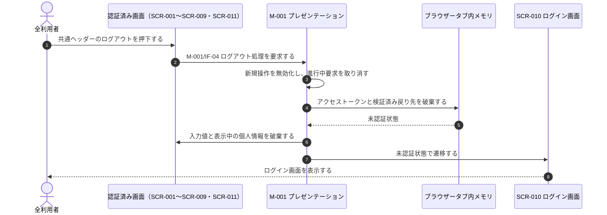
```mermaid
sequenceDiagram
    autonumber
    actor U as 全利用者
    participant UI as 認証済み画面（SCR-001〜SCR-009・SCR-011）
    participant PRES as M-001 プレゼンテーション
    participant MEM as ブラウザータブ内メモリ
    participant LOGIN as SCR-010 ログイン画面

    U->>UI: 共通ヘッダーのログアウトを押下する
    UI->>PRES: M-001/IF-04 ログアウト処理を要求する
    PRES->>PRES: 新規操作を無効化し、進行中要求を取り消す
    PRES->>MEM: アクセストークンと検証済み戻り先を破棄する
    MEM-->>PRES: 未認証状態
    PRES->>UI: 入力値と表示中の個人情報を破棄する
    PRES->>LOGIN: 未認証状態で遷移する
    LOGIN-->>U: ログイン画面を表示する
```

**連携定義**

条件分岐

| 条件ID | 判定箇所 | 条件 | 成立時 | 不成立時 | 根拠 |
|---|---|---|---|---|---|
| COND-01 | M-001 | 明示ログアウト時に認証状態が残っている | 基本フローで全状態を破棄する | 冪等に破棄を再実行してSCR-010へ遷移する | UC-013/SP-1（不成立=UC-013/SP-2） |
| COND-02 | M-001 | 起動契機がUNAUTHENTICATEDまたは期限到来である | MSG-12通知後に同じ破棄処理を行う | 明示ログアウトとして処理する | UC-013/SP-3（不成立=UC-013/SP-1） |
| COND-03 | M-001 | 起動契機がタブ終了または再読込である | メモリを引き継がず次回SCR-010から開始する | 現在タブ内でSCR-010へ遷移する | UC-013/SP-4 |

データ参照・更新

| 対象 | 操作 | 目的 | 実行主体 |
|---|---|---|---|
| 進行中API要求 | 取消 | ログアウト後の応答反映を防ぐ | M-001 |
| アクセストークン | メモリ破棄 | 認証状態を終了する | M-001 |
| 検証済み戻り先 | メモリ破棄 | ログイン後の意図しない復帰を防ぐ | M-001 |
| 画面入力・表示中個人情報 | 破棄 | 保護情報を画面に残さない | M-001 |
| Cloudflare D1 | なし | ログアウトでは永続データを参照・更新しない | - |

トランザクション境界

なし。クライアント内の冪等な状態破棄であり、API・JOB・D1トランザクションを使用しない。

補足事項

| 観点 | 内容 |
|---|---|
| API | ログアウトAPIは新設しない。M-001だけで完結し、M-002〜M-008を呼ばない |
| 冪等性 | 二重押下、認証失効後の明示操作、再読込をすべて同じ未認証状態へ収束させる |
| トークン保管 | アクセストークンはブラウザータブ内メモリだけに保持し、永続Web Storage、URL、DOM、ログへ保存しない |
| 遷移 | SCR-001〜SCR-009・SCR-011からSCR-010へ遷移し、認証情報・画面入力値・個人情報を戻り先へ引き継がない |
