[← 設計書一覧（社員名簿管理システム）](README.md)

# 5. API設計

**目次**

- [5.1 API共通設計](#51-api共通設計)
- [5.2 API一覧](#52-api一覧)
- [5.3 API-001 社員検索](#53-api-001-社員検索)
- [5.4 API-002 社員詳細取得](#54-api-002-社員詳細取得)
- [5.5 API-003 社員登録](#55-api-003-社員登録)
- [5.6 API-004 社員基本情報更新](#56-api-004-社員基本情報更新)
- [5.7 API-005 社員異動](#57-api-005-社員異動)
- [5.8 API-006 退職予定登録・即時退職](#58-api-006-退職予定登録即時退職)
- [5.9 API-007 変更履歴取得](#59-api-007-変更履歴取得)
- [5.10 API-008 組織一覧取得](#510-api-008-組織一覧取得)
- [5.11 API-009 役職一覧取得](#511-api-009-役職一覧取得)
- [5.12 API-010 ログイン](#512-api-010-ログイン)
- [5.13 API-011 組織登録](#513-api-011-組織登録)
- [5.14 API-012 組織更新・無効化](#514-api-012-組織更新無効化)
- [5.15 API-013 役職登録](#515-api-013-役職登録)
- [5.16 API-014 役職更新・無効化](#516-api-014-役職更新無効化)
- [5.17 API-015 ロール一覧取得](#517-api-015-ロール一覧取得)
- [5.18 API-016 社員ロール取得](#518-api-016-社員ロール取得)
- [5.19 API-017 社員ロール更新](#519-api-017-社員ロール更新)
- [5.20 API-018 検索結果出力](#520-api-018-検索結果出力)
- [5.21 API-019 利用者アカウント発行](#521-api-019-利用者アカウント発行)
- [5.22 API-020 利用者アカウント利用状態更新](#522-api-020-利用者アカウント利用状態更新)
- [5.23 API-021 退職予定取消](#523-api-021-退職予定取消)
- [5.24 API-022 将来異動予約取消](#524-api-022-将来異動予約取消)

## 5.1 API共通設計

本節は、本システムの全APIに適用する共通設計を定義し、APIは通信境界に限定して認証情報・HTTP入力の受付・構文検証・単一業務モジュール呼出・HTTP結果への変換だけを行う。APIの存在・API-ID・主処理モジュールへの接続は[API一覧](05_API設計.md#52-api一覧)を構成上の正本とし、本章はHTTP契約と境界処理を詳細化する。

UC-013 ログアウトはM-001のクライアント内処理で完結するため、ログアウトAPIを設けない。UC-014 退職日到来反映はJOB-001からM-002/IF-07へ委譲するため、API起動経路を設けない。いずれもAPIからDBへ迂回する経路を追加しない。

| 観点 | 仕様 |
|---|---|
| 実行基盤 | Cloudflare Workersの`fetch`ハンドラー。ルーティング後も同一Worker内のAPI境界責務を適用する |
| ベースパス | `/api` |
| データ形式 | 原則 `application/json; charset=utf-8`。API-018だけはファイルを返す |
| 認証 | API-010を除き、API-010で発行したトークンを `Authorization: Bearer {token}` で受け付ける(NFR-001) |
| 認可 | API境界で認証主体を確定し、ロール・所属・対象データによる最終判定は呼出先業務モジュールへ委譲する(NFR-002) |
| 相関ID | `X-Request-ID` を受理し、未指定時は生成する。応答とモジュール呼出へ同じ値を伝播する |
| 日付・日時 | 日付は `YYYY-MM-DD`、日時はタイムゾーン付きISO 8601 |
| エラー形式 | `errorCode`、`message`、`fieldErrors[]`、`traceId` を持つ共通JSON |
| ページング | ページングを採用する個別APIでは、`page` は1始まり・既定1、`pageSize` は既定20・上限100とし、応答に `page`、`pageSize`、`total`、`hasNext` を返す |
| 更新競合 | 更新要求の `version` と現在版をモジュールで比較し、不一致時は409を返して上書きしない(NFR-007) |
| 部分更新 | 更新項目の省略は現値保持、JSONの明示nullは個別APIで解除可能としたNULL可項目だけに許可する。モジュールが現値とマージしてから更新し、APIやSQLで省略をnullへ変換しない |
| 冪等性・二重実行防止 | GETは再実行可能とする。更新系はクライアントの二重送信抑止に加え、一意制約または要求versionによる楽観ロックで二重反映を防止する。POSTの通信再送を同一結果として保証しないため、タイムアウト時は対象照会後に再操作する |
| 個人情報 | モジュールが認証主体の権限と利用目的に基づいて許可した項目だけを返す(NFR-004) |
| 依存方向 | `画面 → M-001 プレゼンテーション → Cloudflare Worker API境界 → 単一業務モジュール → M-006 → D1` とする。D1 Worker BindingはAPI境界へ渡さない |
| Binding注入 | Workerの構成境界は `env` をM-006の生成経路だけへ渡し、APIには業務モジュール公開IFだけを注入する。APIの型・引数・状態に `env.DB` またはD1オブジェクトを含めない |
| 完了保証 | 応答に必要な業務更新は業務モジュール呼出を `await` して完了後に応答する。`ctx.waitUntil()` に必須の永続化を委ねない |

### 5.1.1 API境界の責務・禁止事項

- API-001〜009およびAPI-011〜022は[API一覧](05_API設計.md#52-api一覧)で完全修飾したM-002の公開IFだけを1回呼ぶ。API-010はM-003/IF-01だけを1回呼ぶ。
- 複数モジュール間の調整、業務条件判定、トランザクション、監査記録、データアクセスは呼出先モジュールが管理する。
- APIおよびJOBからDBへ直接アクセスしない。API/JOBはD1 Worker Binding `env.DB`、TBL・SQL、Prepared Statement、`batch()`を直接参照または実行しない。
- APIの処理詳細には呼出先M-ID/IF-ID、論理処理名、引数、論理結果からHTTP結果への変換だけを記載する。

### 5.1.2 共通エラーレスポンス

| 項目名 | 型 | 必須 | 説明 |
|---|---|---|---|
| errorCode | string | Yes | 機械判定用エラーコード |
| message | string | Yes | 利用者向けメッセージ |
| fieldErrors | array | Yes | 項目エラー。項目に閉じない場合は空配列 |
| fieldErrors[].field | string | No | 対象項目名 |
| fieldErrors[].reason | string | No | エラー理由コード |
| traceId | string | Yes | 問い合わせ・ログ相関用ID |

### 5.1.3 社員固定コードAPI参照表

固定コード値の唯一の正本は[共通区分定義](02_機能要件.md#24-共通区分定義)とし、本表はAPI入出力で用いる表記の参照表である。APIは列挙外を`VALIDATION_ERROR`として受け付けず、M-002も永続化前に同じ列挙で再検証する。

| API項目名 | NULL | [共通区分定義](02_機能要件.md#24-共通区分定義)の許可値 |
|---|---|---|
| employmentTypeCode | 不可 | `REGULAR` / `CONTRACT` / `PART_TIME` / `TEMPORARY` / `OTHER` |
| retirementTypeCode | 可 | `VOLUNTARY` / `COMPANY` / `RETIREMENT_AGE` / `CONTRACT_END` / `OTHER`。未指定はNULL |

### 5.1.4 認可・閲覧範囲のAPI適用

固定ロールコードの正本は[共通区分定義](02_機能要件.md#24-共通区分定義)、操作権限・閲覧スコープの正本は[ユースケース](02_機能要件.md#22-ユースケース)（ロール別条件は各UC）とし、APIはその認可結果をM-002から受け取る。複数ロール時は操作権限・許可項目の和集合、閲覧スコープは`ALL > ORGANIZATION > SELF`の優先順で確定し、有効ロール0件はすべて拒否する。

| ロールコード | データ閲覧スコープ | API利用条件・項目制御 |
|---|---|---|
| `HR` | `ALL` | API-001〜006・007・008・009・018・021・022。API-004は氏名、カナ、email、phoneNumber、employmentTypeCodeを更新可 |
| `DEPARTMENT_MANAGER` | 操作者の業務日時点の主所属組織と、その日時点で利用可能な全子孫を`ORGANIZATION` | API-001・002・008・009・018。API-004の更新権限は付与しない |
| `EMPLOYEE` | 操作者の社員IDによる`SELF` | API-001・002・008・009。API-004は本人のemailとphoneNumberのみ更新可 |
| `SYSTEM_ADMIN` | `ALL` | API-001・002・007・008・009・011〜017・019・020。API-004の更新権限とAPI-018の出力権限はこのロール単独では付与しない |

API-008は認可済み組織範囲内の候補、API-009は認証済み利用者に共通の役職候補を返す。いずれも`activeOnly=true`では指定基準日に利用可能な候補だけを返し、`activeOnly=false`は`SYSTEM_ADMIN`権限を必須とする。

社員検索・詳細・更新・出力の認可および所属参照は業務日固定とし、API-001・002・004・018に任意の`asOfDate`を設けない。API-008・009の`effectiveOn`は候補マスターの利用可否判定だけに用い、社員閲覧スコープの基準日は変更しない。

### 5.1.5 マスター利用可否の共通契約

組織・役職の`active`は有効期間と独立した手動利用可否である。指定日に選択・業務利用できる条件は`active=true AND effectiveFrom <= 指定日 AND (effectiveToは未指定 OR 指定日 <= effectiveTo)`とする。未来開始前や期限到来後でも`active=true`のレコードは存在し得る。`DISABLE`は即時に`active=false`とし、`effectiveTo`は任意として指定時のみ更新、未指定時は現値を維持する。`UPDATE`で将来の`effectiveTo`を予約できる。

## 5.2 API一覧

| API-ID | Method | Path | 目的 | 主な権限 | 呼出モジュール |
|---|---|---|---|---|---|
| API-001 | GET | `/api/employees` | 社員検索 | 認証済み利用者(権限範囲内) | M-002/IF-01 |
| API-002 | GET | `/api/employees/{employeeId}` | 社員詳細取得 | 認証済み利用者(権限範囲内) | M-002/IF-02 |
| API-003 | POST | `/api/employees` | 社員登録 | 人事担当者 | M-002/IF-03 |
| API-004 | PUT | `/api/employees/{employeeId}` | 社員基本情報更新 | 人事担当者、許可項目に限り本人 | M-002/IF-04 |
| API-005 | POST | `/api/employees/{employeeId}/assignments` | 社員異動 | 人事担当者 | M-002/IF-05 |
| API-006 | POST | `/api/employees/{employeeId}/retirement` | 退職予定登録・即時退職 | 人事担当者 | M-002/IF-06 |
| API-007 | GET | `/api/employees/{employeeId}/history` | 変更履歴取得 | 人事担当者、システム管理者 | M-002/IF-08 |
| API-008 | GET | `/api/organizations` | 組織一覧取得 | 認証済み利用者 | M-002/IF-10 |
| API-009 | GET | `/api/positions` | 役職一覧取得 | 認証済み利用者 | M-002/IF-11 |
| API-010 | POST | `/api/auth/login` | ログイン | 認証前の全利用者 | M-003/IF-01 |
| API-011 | POST | `/api/organizations` | 組織登録 | システム管理者 | M-002/IF-10 |
| API-012 | PUT | `/api/organizations/{organizationId}` | 組織更新・無効化 | システム管理者 | M-002/IF-10 |
| API-013 | POST | `/api/positions` | 役職登録 | システム管理者 | M-002/IF-11 |
| API-014 | PUT | `/api/positions/{positionId}` | 役職更新・無効化 | システム管理者 | M-002/IF-11 |
| API-015 | GET | `/api/roles` | ロール一覧取得 | システム管理者 | M-002/IF-12 |
| API-016 | GET | `/api/employees/{employeeId}/roles` | 社員ロール取得 | システム管理者 | M-002/IF-12 |
| API-017 | PUT | `/api/employees/{employeeId}/roles` | 社員ロール更新 | システム管理者 | M-002/IF-12 |
| API-018 | POST | `/api/employees/export` | 検索結果出力 | 人事担当者、部門管理者 | M-002/IF-09 |
| API-019 | POST | `/api/users` | 利用者アカウント発行 | システム管理者 | M-002/IF-13 |
| API-020 | PUT | `/api/users/{userId}/status` | 利用者アカウント利用状態更新 | システム管理者 | M-002/IF-13 |
| API-021 | DELETE | `/api/employees/{employeeId}/retirement` | 退職予定取消 | 人事担当者 | M-002/IF-06 |
| API-022 | DELETE | `/api/employees/{employeeId}/assignments/future` | 将来異動予約取消 | 人事担当者 | M-002/IF-05 |

## 5.3 API-001 社員検索

### 5.3.1 基本情報

| 項目 | 内容 |
|---|---|
| API-ID / API名 | API-001 / 社員検索 |
| Method / Path | GET `/api/employees` |
| 目的 | 検索条件と閲覧可能範囲に一致する社員をページ単位で返す |
| 実行権限 | 認証済み利用者。返却範囲・項目はロール、所属、本人条件で制御 |
| トレース元 | F-002 / UC-002 |
| 呼出モジュール | M-002/IF-01 社員検索 |
| 冪等性 / 正常応答 | あり / 200 OK |

### 5.3.2 リクエスト項目

| 項目名 | 場所 | 型 | 必須 | 説明・制約 |
|---|---|---|---|---|
| employeeNumber | query | string | No | 社員番号。100文字以内 |
| name | query | string | No | 姓名検索文字列。100文字以内 |
| organizationId | query | string | No | 組織ID |
| positionId | query | string | No | 役職ID |
| status | query | string | No | `ACTIVE` / `RETIRED` / `ALL`。既定`ACTIVE` |
| page | query | integer | No | 1以上。既定1 |
| pageSize | query | integer | No | 1〜100。既定20 |

### 5.3.3 レスポンス項目

| 項目名 | 場所 | 型 | 必須 | 説明 |
|---|---|---|---|---|
| items | body | array | Yes | 権限上返却可能な社員一覧 |
| items[].employeeId | body | string | Yes | 社員ID |
| items[].employeeNumber | body | string | Yes | 社員番号 |
| items[].displayName | body | string | Yes | 表示氏名 |
| items[].organizationName | body | string | No | 現所属組織名 |
| items[].positionName | body | string | No | 現役職名 |
| items[].status | body | string | Yes | 在籍状態 |
| page / pageSize / total / hasNext | body | integer / boolean | Yes | ページ情報 |

### 5.3.4 バリデーション

| No | 対象 | 検証内容 | 違反時エラー |
|---:|---|---|---|
| 1 | employeeNumber / name | 文字列かつ最大100文字 | VALIDATION_ERROR |
| 2 | organizationId / positionId | 指定時はUUID形式 | VALIDATION_ERROR |
| 3 | status | 許可値のいずれか | VALIDATION_ERROR |
| 4 | page / pageSize | 整数かつ許可範囲内 | VALIDATION_ERROR |

### 5.3.5 処理フロー


### 5.3.6 処理詳細

| No | 処理名 | 種別 | 処理詳細 | 呼出先公開IF・論理処理名 | 引数・参照値 | 結果変換 |
|---:|---|---|---|---|---|---|
| 1 | 検索要求生成 | 境界 | 認証主体、相関ID、検索・ページ条件から論理検索要求を生成する | - | 認証主体、query、traceId | 検索要求 |
| 2 | 社員検索呼出 | モジュール呼出 | 閲覧範囲の判定を含む検索を委譲する | M-002/IF-01 社員検索 | (1)の検索要求 | 社員一覧、件数、業務結果 |
| 3 | 検索結果判定 | 判定 | (2)の成功または業務エラーを判定する | - | (2)の結果 | 成功は(4)、エラーは(5) |
| 4 | 検索レスポンス生成 | 境界 | 許可済み項目とページ情報を200へ変換する | - | (2)の成功結果 | [レスポンス項目](05_API設計.md#533-レスポンス項目)のレスポンス |
| 5 | エラーレスポンス生成 | 境界 | 業務エラーを共通形式へ変換する | - | (2)のエラー、traceId | [エラー定義](05_API設計.md#537-エラー定義)のHTTPエラー |

### 5.3.7 エラー定義

| HTTP | エラーコード | 発生元 | 発生条件 | API境界の処理 |
|---:|---|---|---|---|
| 400 | VALIDATION_ERROR | API境界 | 検索・ページ条件が不正 | 共通形式へ変換 |
| 401 | UNAUTHENTICATED | API境界 | 認証情報が無効 | 共通形式へ変換 |
| 403 | FORBIDDEN | M-002/IF-01 | 検索権限がない | 共通形式へ変換 |
| 500 | INTERNAL_ERROR | API境界 / M-002/IF-01 | 想定外の内部異常 | 内部情報を隠して変換 |

## 5.4 API-002 社員詳細取得

### 5.4.1 基本情報

| 項目 | 内容 |
|---|---|
| API-ID / API名 | API-002 / 社員詳細取得 |
| Method / Path | GET `/api/employees/{employeeId}` |
| 目的 | 権限範囲内の社員基本情報・現所属・在籍状態を返す |
| 実行権限 | 認証済み利用者。対象範囲と返却項目を制御 |
| トレース元 | F-003 / UC-006 |
| 呼出モジュール | M-002/IF-02 社員詳細参照 |
| 冪等性 / 正常応答 | あり / 200 OK |

### 5.4.2 リクエスト項目

| 項目名 | 場所 | 型 | 必須 | 説明・制約 |
|---|---|---|---|---|
| employeeId | path | string | Yes | 社員ID |

### 5.4.3 レスポンス項目

| 項目名 | 場所 | 型 | 必須 | 説明 |
|---|---|---|---|---|
| employeeId / employeeNumber | body | string | Yes | 社員ID・社員番号 |
| fullName | body | string | Yes | 姓名を半角空白1文字で連結した表示氏名 |
| lastName / firstName | body | string | Yes | 氏名 |
| lastNameKana / firstNameKana | body | string | No | 氏名カナ。権限により非返却 |
| email | body | string | No | メールアドレス。権限により非返却 |
| phoneNumber | body | string | No | 連絡先電話番号。未登録または権限による非返却時は省略 |
| hireDate / retirementDate | body | string(date) | Yes / No | 入社日・退職日 |
| retirementTypeCode | body | string | No | 退職区分。未設定または権限による非返却時は省略。返却時は[共通区分定義](02_機能要件.md#24-共通区分定義)の許可値 |
| employmentTypeCode / status | body | string | Yes | 雇用区分・在籍状態 |
| currentAssignment | body | object | No | 基準日時点の所属。該当所属がない場合、または権限により全配下項目が非返却となる場合は省略 |
| currentAssignment.assignmentId | body | string | Yes | 所属履歴ID。現所属があり、かつ項目返却が許可された場合に返す |
| currentAssignment.organizationId | body | string | Yes | 現所属組織ID |
| currentAssignment.organizationName | body | string | No | 現所属組織名。論理削除済みマスター等で名称を解決できない場合は省略 |
| currentAssignment.positionId | body | string | Yes | 現役職ID |
| currentAssignment.positionName | body | string | No | 現役職名。論理削除済みマスター等で名称を解決できない場合は省略 |
| currentAssignment.managerEmployeeId | body | string | No | 上長社員ID。上長未設定時は省略 |
| currentAssignment.managerEmployeeName | body | string | No | 上長表示氏名。上長未設定または名称を解決できない場合は省略 |
| currentAssignment.effectiveFrom | body | string(date) | Yes | 現所属の適用開始日 |
| currentAssignment.effectiveTo | body | string(date) | No | 現所属の適用終了日。無期限は省略 |
| version | body | integer | Yes | 更新競合検知用版数 |

| 認可結果 | 返却項目 |
|---|---|
| `HR`または`SYSTEM_ADMIN` | [レスポンス項目](05_API設計.md#543-レスポンス項目)の全項目 |
| `DEPARTMENT_MANAGER` | `employeeId`、`employeeNumber`、`fullName`、`currentAssignment.organizationId`、`currentAssignment.organizationName`、`currentAssignment.positionId`、`currentAssignment.positionName`、`currentAssignment.managerEmployeeId`、`currentAssignment.managerEmployeeName`、`status`、`version`。組織・役職・上長の各物理項目を論理項目`organization`、`position`、`manager`として認可し、所属履歴ID、個人連絡先、カナ、雇用区分、入退社日、所属適用開始・終了日は返さない |
| `EMPLOYEE` | 対象社員IDが本人の場合だけ[レスポンス項目](05_API設計.md#543-レスポンス項目)の全項目 |

[レスポンス項目](05_API設計.md#543-レスポンス項目)の必須欄は、その項目が上表で返却許可された場合の必須性を表す。上表で許可されない項目はJSONプロパティ自体を省略し、NULLやマスク文字列へ置換しない。

### 5.4.4 バリデーション

| No | 対象 | 検証内容 | 違反時エラー |
|---:|---|---|---|
| 1 | employeeId | 必須かつシステムID形式 | VALIDATION_ERROR |

### 5.4.5 処理フロー

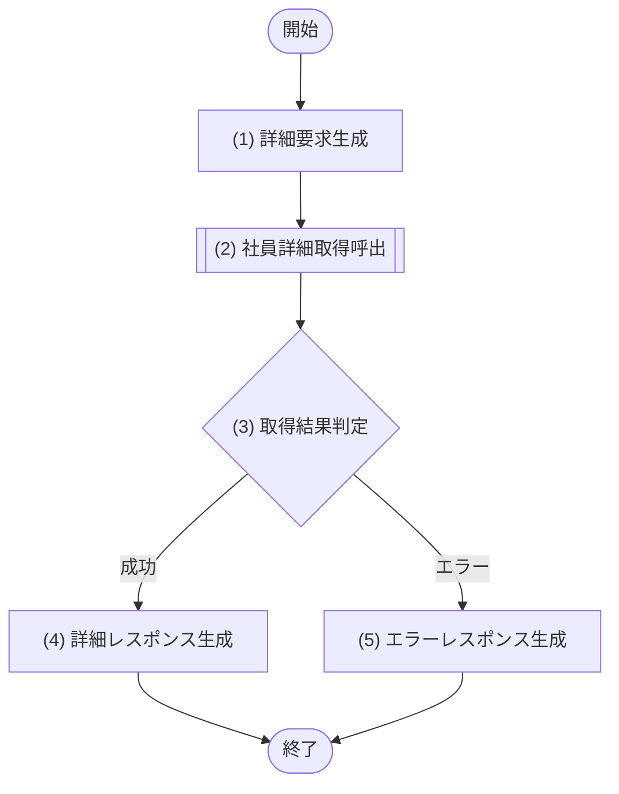

### 5.4.6 処理詳細

| No | 処理名 | 種別 | 処理詳細 | 呼出先公開IF・論理処理名 | 引数・参照値 | 結果変換 |
|---:|---|---|---|---|---|---|
| 1 | 詳細要求生成 | 境界 | 認証主体と社員IDから論理要求を生成する | - | 認証主体、employeeId、traceId | 詳細取得要求 |
| 2 | 社員詳細取得呼出 | モジュール呼出 | 閲覧スコープの確定を先行し、スコープを条件に含めた範囲付き取得と返却項目判定を委譲する。スコープ不成立は参照不可、範囲内に該当しない社員は存在を秘匿して不存在として扱う | M-002/IF-02 社員詳細参照 | (1)の要求 | 社員詳細または業務エラー |
| 3 | 取得結果判定 | 判定 | (2)の結果を判定する | - | (2)の結果 | 成功は(4)、エラーは(5) |
| 4 | 詳細レスポンス生成 | 境界 | 許可済み社員詳細を200へ変換する | - | (2)の成功結果 | [レスポンス項目](05_API設計.md#543-レスポンス項目)のレスポンス |
| 5 | エラーレスポンス生成 | 境界 | 不存在・権限等を共通形式へ変換する | - | (2)のエラー、traceId | [エラー定義](05_API設計.md#547-エラー定義)のHTTPエラー |

### 5.4.7 エラー定義

| HTTP | エラーコード | 発生元 | 発生条件 | API境界の処理 |
|---:|---|---|---|---|
| 400 | VALIDATION_ERROR | API境界 | 社員ID形式が不正 | 共通形式へ変換 |
| 401 | UNAUTHENTICATED | API境界 | 認証情報が無効 | 共通形式へ変換 |
| 403 | FORBIDDEN | M-002/IF-02 | 閲覧スコープが成立しない（有効ロールなし・主所属なし・本人紐付けなし） | 共通形式へ変換 |
| 404 | EMPLOYEE_NOT_FOUND | M-002/IF-02 | 対象社員が閲覧範囲内に存在しない（不存在と閲覧範囲外を含み、範囲外は存在を秘匿する） | 共通形式へ変換 |
| 500 | INTERNAL_ERROR | API境界 / M-002/IF-02 | 想定外の内部異常 | 内部情報を隠して変換 |

## 5.5 API-003 社員登録

### 5.5.1 基本情報

| 項目 | 内容 |
|---|---|
| API-ID / API名 | API-003 / 社員登録 |
| Method / Path | POST `/api/employees` |
| 目的 | 社員基本情報と初期所属を一体として登録する |
| 実行権限 | 人事担当者 |
| トレース元 | F-004 / UC-001 |
| 呼出モジュール | M-002/IF-03 社員登録 |
| 冪等性 / 正常応答 | なし（一意制約で二重登録防止） / 201 Created |

### 5.5.2 リクエスト項目

| 項目名 | 場所 | 型 | 必須 | 説明・制約 |
|---|---|---|---|---|
| employeeNumber | body | string | Yes | 社員番号。1〜20文字 |
| lastName / firstName | body | string | Yes | 姓・名。Unicode前後空白除去とNFC正規化後に各1〜100文字 |
| lastNameKana / firstNameKana | body | string | No | 提供時はUnicode前後空白除去とNFC正規化後に空でない全角カナ。各100文字以内 |
| email | body | string | Yes | メール形式。254文字以内 |
| hireDate | body | string(date) | Yes | 入社日 |
| employmentTypeCode | body | string | Yes | `REGULAR` / `CONTRACT` / `PART_TIME` / `TEMPORARY` / `OTHER` |
| initialAssignment.organizationId | body | string | Yes | 初期所属組織ID |
| initialAssignment.positionId | body | string | Yes | 初期役職ID |

初期所属の`effectiveFrom`はM-002が`hireDate`を設定し、`managerEmployeeId`はNULLを設定する。両項目は本APIの公開要求として受け付けない。

### 5.5.3 レスポンス項目

| 項目名 | 場所 | 型 | 必須 | 説明 |
|---|---|---|---|---|
| employeeId / employeeNumber | body | string | Yes | 登録社員のID・社員番号 |
| status | body | string | Yes | `ACTIVE` |
| version | body | integer | Yes | 初期版数 |
| createdAt | body | string(date-time) | Yes | 登録日時 |

### 5.5.4 バリデーション

| No | 対象 | 検証内容 | 違反時エラー |
|---:|---|---|---|
| 1 | employeeNumber / 氏名 | 必須・型を確認する。社員番号は半角英数字1〜20文字。氏名はM-002がUnicode前後空白trim → NFC → 空文字拒否 → 1〜100文字再検証 → 形式検証の順で検証する | VALIDATION_ERROR |
| 2 | 氏名カナ | 指定時はM-002が氏名と同じ正規化順で空文字、最大100文字、全角カナ形式を検証する | VALIDATION_ERROR |
| 3 | email | 必須、メール形式、最大254文字 | VALIDATION_ERROR |
| 4 | hireDate | 必須かつ日付形式。業務妥当性はモジュールで判定 | VALIDATION_ERROR |
| 5 | initialAssignment | 組織ID・役職IDが必須かつUUID形式。公開要求に開始日・上長を指定した場合は未定義項目として拒否する | VALIDATION_ERROR |
| 6 | employmentTypeCode | 必須かつ[共通区分定義](02_機能要件.md#24-共通区分定義)（[社員固定コードAPI参照表](05_API設計.md#513-社員固定コードapi参照表) API参照表）の許可値 | VALIDATION_ERROR |

### 5.5.5 処理フロー


### 5.5.6 処理詳細

| No | 処理名 | 種別 | 処理詳細 | 呼出先公開IF・論理処理名 | 引数・参照値 | 結果変換 |
|---:|---|---|---|---|---|---|
| 1 | 登録要求生成 | 境界 | 認証主体、相関ID、入力項目から論理登録要求を生成する | - | 認証主体、body、traceId | 社員登録要求 |
| 2 | 社員登録呼出 | モジュール呼出 | M-002が初期所属の開始日をhireDate、上長をNULLに自動設定したうえで、認可、業務検証、一意性、マスター有効性、一体登録、履歴・監査を行う | M-002/IF-03 社員登録 | (1)の要求 | 登録社員または業務エラー |
| 3 | 登録結果判定 | 判定 | (2)の成功または業務エラーを判定する | - | (2)の結果 | 成功は(4)、エラーは(5) |
| 4 | 登録レスポンス生成 | 境界 | 登録結果を201レスポンスへ変換する | - | (2)の登録社員 | [レスポンス項目](05_API設計.md#553-レスポンス項目)のレスポンス |
| 5 | エラーレスポンス生成 | 境界 | 重複・マスター無効等をHTTPエラーへ変換する | - | (2)のエラー、traceId | [エラー定義](05_API設計.md#557-エラー定義)のHTTPエラー |

### 5.5.7 エラー定義

| HTTP | エラーコード | 発生元 | 発生条件 | API境界の処理 |
|---:|---|---|---|---|
| 400 | VALIDATION_ERROR | API境界 | リクエスト形式・必須・単項目制約違反 | 共通形式へ変換 |
| 401 | UNAUTHENTICATED | API境界 | 認証情報が無効 | 共通形式へ変換 |
| 403 | FORBIDDEN | M-002/IF-03 | 社員登録権限がない | 共通形式へ変換 |
| 409 | EMPLOYEE_NUMBER_DUPLICATED | M-002/IF-03 | 社員番号が登録済み | employeeNumberの項目エラーへ変換 |
| 409 | EMAIL_DUPLICATED | M-002/IF-03 | メールアドレスが登録済み | emailの項目エラーへ変換 |
| 409 | MASTER_NOT_ACTIVE | M-002/IF-03 | 組織または役職が無効 | 共通形式へ変換 |
| 500 | INTERNAL_ERROR | API境界 / M-002/IF-03 | 想定外の内部異常 | 内部情報を隠して変換 |

## 5.6 API-004 社員基本情報更新

### 5.6.1 基本情報

| 項目 | 内容 |
|---|---|
| API-ID / API名 | API-004 / 社員基本情報更新 |
| Method / Path | PUT `/api/employees/{employeeId}` |
| 目的 | 社員基本情報を版数条件付きで更新する |
| 実行権限 | `HR`は氏名・カナ・email・phoneNumber・employmentTypeCode、`EMPLOYEE`は本人のemail・phoneNumberだけ更新可。`DEPARTMENT_MANAGER`・`SYSTEM_ADMIN`にはこのロール単独で更新権限を付与しない |
| トレース元 | F-005 / UC-007 |
| 呼出モジュール | M-002/IF-04 社員基本情報更新 |
| 冪等性 / 正常応答 | 正規化・現値マージ後に実差分なしなら正常な無更新。その他はversionで二重反映防止 / 200 OK |

### 5.6.2 リクエスト項目

| 項目名 | 場所 | 型 | 必須 | 説明・制約 |
|---|---|---|---|---|
| employeeId | path | string | Yes | 社員ID |
| lastName / firstName | body | string | No | `HR`だけ指定可。Unicode前後空白除去とNFC正規化後に各1〜100文字 |
| lastNameKana / firstNameKana | body | string / null | No | `HR`だけ指定可。文字列は氏名と同じ正規化後に空でない全角カナかつ100文字以内。明示nullで消去 |
| email | body | string | No | メール形式。254文字以内 |
| phoneNumber | body | string / null | No | 連絡先電話番号。文字列は前後空白除去後1〜30文字で、半角数字・`+`・`-`・半角空白・丸括弧だけを許可する。明示的なnullで登録値を解除する |
| employmentTypeCode | body | string | No | 指定時は`REGULAR` / `CONTRACT` / `PART_TIME` / `TEMPORARY` / `OTHER` |
| version | body | integer | Yes | 取得時版数。1以上 |

### 5.6.3 レスポンス項目

| 項目名 | 場所 | 型 | 必須 | 説明 |
|---|---|---|---|---|
| employeeId | body | string | Yes | 社員ID |
| updatedFields | body | array | Yes | 更新された論理項目名 |
| version | body | integer | Yes | 更新後版数 |
| updatedAt | body | string(date-time) | Yes | 更新日時 |

### 5.6.4 バリデーション

| No | 対象 | 検証内容 | 違反時エラー |
|---:|---|---|---|
| 1 | employeeId / version | 必須、ID形式、versionは1以上 | VALIDATION_ERROR |
| 2 | 更新項目 | 1項目以上を指定する。M-002は氏名・カナの文字列をUnicode前後空白trim → NFC → 空文字拒否 → 文字数再検証 → 形式検証の順で検証し、正規化後の値で現値と差分判定する | VALIDATION_ERROR |
| 3 | email / 氏名カナ | メール形式。カナは文字列時に全角カナ形式、消去は明示nullだけを許可 | VALIDATION_ERROR |
| 4 | phoneNumber | 指定時は文字列またはnull。文字列は前後空白除去後1〜30文字、許可文字は半角数字・`+`・`-`・半角空白・丸括弧。nullは登録値の解除 | VALIDATION_ERROR |
| 5 | employmentTypeCode | 指定時は[共通区分定義](02_機能要件.md#24-共通区分定義)（[社員固定コードAPI参照表](05_API設計.md#513-社員固定コードapi参照表) API参照表）の許可値 | VALIDATION_ERROR |

### 5.6.5 処理フロー

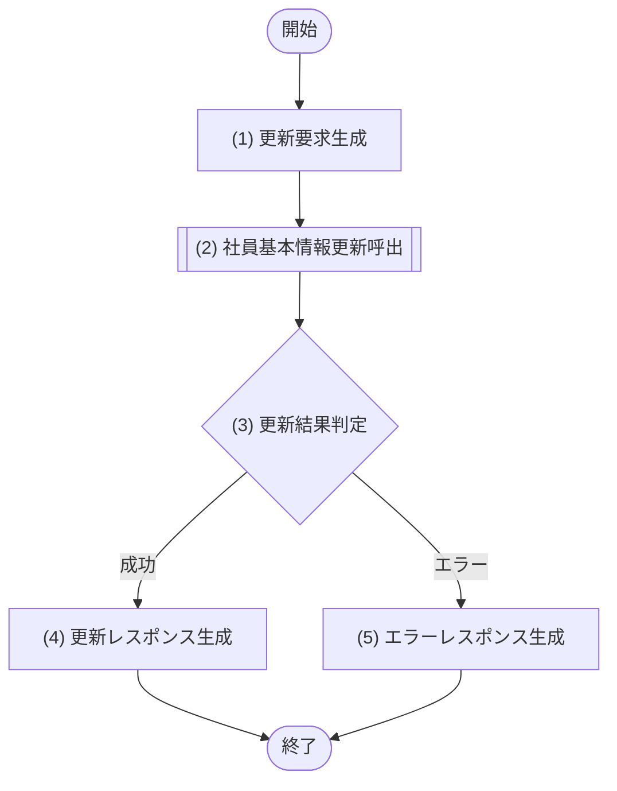

### 5.6.6 処理詳細

| No | 処理名 | 種別 | 処理詳細 | 呼出先公開IF・論理処理名 | 引数・参照値 | 結果変換 |
|---:|---|---|---|---|---|---|
| 1 | 更新要求生成 | 境界 | 認証主体、社員ID、更新項目、版数から論理要求を生成する | - | 認証主体、path、body、traceId | 基本情報更新要求 |
| 2 | 社員基本情報更新呼出 | モジュール呼出 | 本人条件、項目権限、一意性、版数更新、履歴・監査を委譲する | M-002/IF-04 社員基本情報更新 | (1)の要求 | 更新結果または業務エラー |
| 3 | 更新結果判定 | 判定 | (2)の結果を判定する | - | (2)の結果 | 成功は(4)、エラーは(5) |
| 4 | 更新レスポンス生成 | 境界 | 更新結果を200へ変換する | - | (2)の成功結果 | [レスポンス項目](05_API設計.md#563-レスポンス項目)のレスポンス |
| 5 | エラーレスポンス生成 | 境界 | 不存在・重複・競合等をHTTPエラーへ変換する | - | (2)のエラー、traceId | [エラー定義](05_API設計.md#567-エラー定義)のHTTPエラー |

### 5.6.7 エラー定義

| HTTP | エラーコード | 発生元 | 発生条件 | API境界の処理 |
|---:|---|---|---|---|
| 400 | VALIDATION_ERROR | API境界 | 入力形式または更新項目が不正 | 共通形式へ変換 |
| 401 | UNAUTHENTICATED | API境界 | 認証情報が無効 | 共通形式へ変換 |
| 403 | FORBIDDEN | M-002/IF-04 | 対象または項目を更新できない | 共通形式へ変換 |
| 404 | EMPLOYEE_NOT_FOUND | M-002/IF-04 | 対象社員が存在しない | 共通形式へ変換 |
| 409 | EMAIL_DUPLICATED | M-002/IF-04 | メールアドレスが他社員と重複 | emailの項目エラーへ変換 |
| 409 | UPDATE_CONFLICT | M-002/IF-04 | version不一致 | 最新情報の再取得を要求 |
| 500 | INTERNAL_ERROR | API境界 / M-002/IF-04 | 想定外の内部異常 | 内部情報を隠して変換 |

## 5.7 API-005 社員異動

### 5.7.1 基本情報

| 項目 | 内容 |
|---|---|
| API-ID / API名 | API-005 / 社員異動 |
| Method / Path | POST `/api/employees/{employeeId}/assignments` |
| 目的 | 所属・役職・上長を適用開始日付きで変更し、その適用日以降の既存将来所属予約を置き換える |
| 実行権限 | 人事担当者 |
| トレース元 | F-006 / UC-003 |
| 呼出モジュール | M-002/IF-05 社員異動 |
| 冪等性 / 正常応答 | なし（versionで二重異動防止） / 201 Created |

### 5.7.2 リクエスト項目

| 項目名 | 場所 | 型 | 必須 | 説明・制約 |
|---|---|---|---|---|
| employeeId | path | string | Yes | 対象社員ID |
| organizationId | body | string | Yes | 新所属組織ID |
| positionId | body | string | Yes | 新役職ID |
| managerEmployeeId | body | string | No | 新上長社員ID |
| effectiveFrom | body | string(date) | Yes | 異動日。業務日当日または未来日。過去日の遡及異動は不可 |
| version | body | integer | Yes | 対象社員の取得時版数 |

### 5.7.3 レスポンス項目

| 項目名 | 場所 | 型 | 必須 | 説明 |
|---|---|---|---|---|
| employeeId / assignmentId | body | string | Yes | 対象社員・新所属履歴ID |
| organizationId / positionId | body | string | Yes | 反映後の組織・役職ID |
| managerEmployeeId | body | string | No | 反映後の上長ID |
| effectiveFrom | body | string(date) | Yes | 適用開始日 |
| version | body | integer | Yes | 更新後社員版数 |

### 5.7.4 バリデーション

| No | 対象 | 検証内容 | 違反時エラー |
|---:|---|---|---|
| 1 | employeeId / 各ID | 社員・組織・役職IDは必須かつID形式。上長IDは指定時にID形式 | VALIDATION_ERROR |
| 2 | effectiveFrom | 必須かつ日付形式。業務日より前は業務検証で拒否する | VALIDATION_ERROR |
| 3 | version | 1以上の整数 | VALIDATION_ERROR |

### 5.7.5 処理フロー

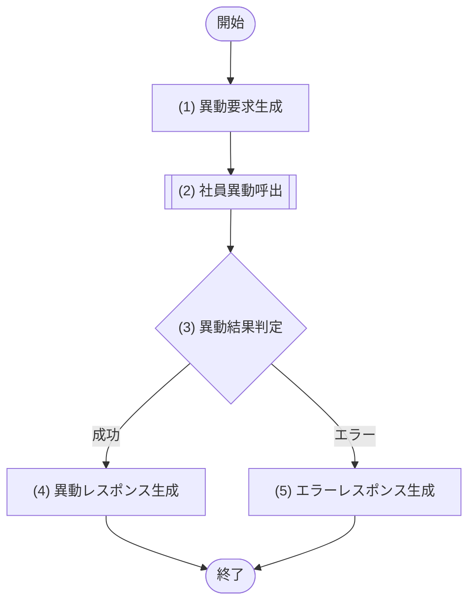

### 5.7.6 処理詳細

| No | 処理名 | 種別 | 処理詳細 | 呼出先公開IF・論理処理名 | 引数・参照値 | 結果変換 |
|---:|---|---|---|---|---|---|
| 1 | 異動要求生成 | 境界 | 認証主体、社員ID、異動内容、版数から論理要求を生成する | - | 認証主体、path、body、traceId | 社員異動要求 |
| 2 | 社員異動呼出 | モジュール呼出 | 在籍状態、異動日時点のマスター、指定上長の在籍・退職予定未登録、期間整合、版数を検証し、異動日前日の所属終了、異動日以降に開始する既存将来所属の取消、新所属登録、履歴を一つの原子更新として行い、成功後に監査する処理を委譲する | M-002/IF-05 社員異動 | (1)の要求 | 新所属または業務エラー |
| 3 | 異動結果判定 | 判定 | (2)の結果を判定する | - | (2)の結果 | 成功は(4)、エラーは(5) |
| 4 | 異動レスポンス生成 | 境界 | 新所属を201レスポンスへ変換する | - | (2)の成功結果 | [レスポンス項目](05_API設計.md#573-レスポンス項目)のレスポンス |
| 5 | エラーレスポンス生成 | 境界 | 不存在・状態・期間・競合等を変換する | - | (2)のエラー、traceId | [エラー定義](05_API設計.md#577-エラー定義)のHTTPエラー |

### 5.7.7 エラー定義

| HTTP | エラーコード | 発生元 | 発生条件 | API境界の処理 |
|---:|---|---|---|---|
| 400 | VALIDATION_ERROR | API境界 / M-002/IF-05 | リクエスト形式が不正、または組織・役職・上長が`effectiveFrom`直前に有効な所属とすべて同一で実差分がない | 共通形式へ変換 |
| 401 | UNAUTHENTICATED | API境界 | 認証情報が無効 | 共通形式へ変換 |
| 403 | FORBIDDEN | M-002/IF-05 | 異動権限がない | 共通形式へ変換 |
| 404 | EMPLOYEE_NOT_FOUND | M-002/IF-05 | 対象社員が存在しない | 共通形式へ変換 |
| 409 | EMPLOYEE_ALREADY_RETIRED | M-002/IF-05 | 対象社員が退職済み | 共通形式へ変換 |
| 409 | MASTER_NOT_ACTIVE | M-002/IF-05 | 組織・役職が異動日時点で無効、または指定上長が不存在・本人・非在籍・退職予定登録済み | 共通形式へ変換 |
| 409 | ASSIGNMENT_PERIOD_CONFLICT | M-002/IF-05 | 異動日直前の所属を一意に特定できない、または将来予約置換後も所属期間が重複・不整合 | 共通形式へ変換 |
| 409 | INVALID_TRANSFER_DATE | M-002/IF-05 | 異動日が業務日より前、入社日前、または退職予定日より後 | effectiveFromの項目エラーへ変換 |
| 409 | UPDATE_CONFLICT | M-002/IF-05 | version不一致 | 最新情報の再取得を要求 |
| 500 | INTERNAL_ERROR | API境界 / M-002/IF-05 | 想定外の内部異常 | 内部情報を隠して変換 |

## 5.8 API-006 退職予定登録・即時退職

### 5.8.1 基本情報

| 項目 | 内容 |
|---|---|
| API-ID / API名 | API-006 / 退職予定登録・即時退職 |
| Method / Path | POST `/api/employees/{employeeId}/retirement` |
| 目的 | 当日以前は即時退職、未来日は退職予定として登録する |
| 実行権限 | 人事担当者 |
| トレース元 | F-007 / UC-004 |
| 呼出モジュール | M-002/IF-06 退職受付 |
| 冪等性 / 正常応答 | 未来日の退職日・退職区分が現在予定と完全同一なら正常な無更新。その他はversionで二重反映防止 / 200 OK |

### 5.8.2 リクエスト項目

| 項目名 | 場所 | 型 | 必須 | 説明・制約 |
|---|---|---|---|---|
| employeeId | path | string | Yes | 対象社員ID |
| retirementDate | body | string(date) | Yes | 退職日。未来日付可 |
| retirementTypeCode | body | string | No | `VOLUNTARY` / `COMPANY` / `RETIREMENT_AGE` / `CONTRACT_END` / `OTHER`。省略時はNULL |
| version | body | integer | Yes | 対象社員の取得時版数 |

### 5.8.3 レスポンス項目

| 項目名 | 場所 | 型 | 必須 | 説明 |
|---|---|---|---|---|
| employeeId | body | string | Yes | 対象社員ID |
| retirementDate | body | string(date) | Yes | 登録した退職日 |
| retirementMode | body | string | Yes | `IMMEDIATE` / `SCHEDULED` |
| status | body | string | Yes | 即時退職は`RETIRED`、予定登録は到来まで`ACTIVE` |
| version | body | integer | Yes | 更新後版数 |

### 5.8.4 バリデーション

| No | 対象 | 検証内容 | 違反時エラー |
|---:|---|---|---|
| 1 | employeeId | 必須かつID形式 | VALIDATION_ERROR |
| 2 | retirementDate | 必須かつ日付形式。入社日との関係はモジュールで判定 | VALIDATION_ERROR |
| 3 | retirementTypeCode | 指定時は[共通区分定義](02_機能要件.md#24-共通区分定義)（[社員固定コードAPI参照表](05_API設計.md#513-社員固定コードapi参照表) API参照表）の許可値。省略時はNULL | VALIDATION_ERROR |
| 4 | version | 1以上の整数 | VALIDATION_ERROR |

### 5.8.5 処理フロー


### 5.8.6 処理詳細

| No | 処理名 | 種別 | 処理詳細 | 呼出先公開IF・論理処理名 | 引数・参照値 | 結果変換 |
|---:|---|---|---|---|---|---|
| 1 | 退職要求生成 | 境界 | 認証主体、社員ID、退職日、退職区分、版数から論理要求を生成する | - | 認証主体、path、body、traceId | 退職要求 |
| 2 | 退職処理呼出 | モジュール呼出 | 在籍状態、日付、版数、即時/予定分岐に加え、対象社員を上長として退職日当日以後も有効となる部下所属がないことを検証し、一体更新、履歴・監査を委譲する。該当所属がある場合は先に部下の上長変更を要求する。未来日の退職日・退職区分が現在予定と完全同一の場合は更新・履歴・監査なしの現在結果を受け取る | M-002/IF-06 退職受付 | (1)の要求 | 退職結果または業務エラー |
| 3 | 退職結果判定 | 判定 | (2)の結果を判定する | - | (2)の結果 | 成功は(4)、エラーは(5) |
| 4 | 退職レスポンス生成 | 境界 | 即時/予定と更新後状態を200へ変換する | - | (2)の成功結果 | [レスポンス項目](05_API設計.md#583-レスポンス項目)のレスポンス |
| 5 | エラーレスポンス生成 | 境界 | 不存在・日付・状態・競合等を変換する | - | (2)のエラー、traceId | [エラー定義](05_API設計.md#587-エラー定義)のHTTPエラー |

### 5.8.7 エラー定義

| HTTP | エラーコード | 発生元 | 発生条件 | API境界の処理 |
|---:|---|---|---|---|
| 400 | VALIDATION_ERROR | API境界 | リクエスト形式が不正 | 共通形式へ変換 |
| 400 | INVALID_RETIREMENT_DATE | M-002/IF-06 | 退職日が入社日より前、または対象社員を上長とする所属が退職日当日以後も有効であり先行する上長変更が必要 | 共通形式へ変換 |
| 401 | UNAUTHENTICATED | API境界 | 認証情報が無効 | 共通形式へ変換 |
| 403 | FORBIDDEN | M-002/IF-06 | 退職処理権限がない | 共通形式へ変換 |
| 404 | EMPLOYEE_NOT_FOUND | M-002/IF-06 | 対象社員が存在しない | 共通形式へ変換 |
| 409 | EMPLOYEE_ALREADY_RETIRED | M-002/IF-06 | 対象社員が退職済み | 共通形式へ変換 |
| 409 | UPDATE_CONFLICT | M-002/IF-06 | version不一致 | 最新情報の再取得を要求 |
| 500 | INTERNAL_ERROR | API境界 / M-002/IF-06 | 想定外の内部異常 | 内部情報を隠して変換 |

## 5.9 API-007 変更履歴取得

### 5.9.1 基本情報

| 項目 | 内容 |
|---|---|
| API-ID / API名 | API-007 / 変更履歴取得 |
| Method / Path | GET `/api/employees/{employeeId}/history` |
| 目的 | 対象社員の変更履歴を新しい順にページ単位で返す |
| 実行権限 | 人事担当者、システム管理者 |
| トレース元 | F-008 / UC-008 |
| 呼出モジュール | M-002/IF-08 変更履歴参照 |
| 冪等性 / 正常応答 | あり / 200 OK |

### 5.9.2 リクエスト項目

| 項目名 | 場所 | 型 | 必須 | 説明・制約 |
|---|---|---|---|---|
| employeeId | path | string | Yes | 対象社員ID |
| changedFrom / changedTo | query | string(date-time) | No | 変更日時の範囲。開始以上・終了未満（`changedFrom <= changedAt < changedTo`） |
| changeType | query | string | No | `REGISTER` / `BASIC_UPDATE` / `ASSIGNMENT` / `RETIREMENT_SCHEDULED` / `RETIREMENT_CONFIRMED` / `ROLE_UPDATE` |
| page | query | integer | No | 1以上。既定1 |
| pageSize | query | integer | No | 1〜100。既定20 |

### 5.9.3 レスポンス項目

| 項目名 | 場所 | 型 | 必須 | 説明 |
|---|---|---|---|---|
| items | body | array | Yes | 変更履歴一覧 |
| items[].historyId | body | string | Yes | 履歴ID |
| items[].changeType | body | string | Yes | 変更種別 |
| items[].changeSummary | body | string | Yes | M-002がschemaVersion=1の変更概要を正本順で`表示名：操作名`へ変換し、読点結合した文字列。不正・未知データは`変更内容あり` |
| items[].changedAt / changedBy | body | string | Yes | 変更日時・変更者表示。JOBは`SYSTEM(JOB-001)`、APIで社員表示名ありは氏名、社員未紐付け・論理削除済みは`SYSTEM_USER`、想定外の操作者欠落は`UNKNOWN_ACTOR`。必ず空でない文字列を返す |
| page / pageSize / total / hasNext | body | integer / boolean | Yes | ページ情報 |

### 5.9.4 バリデーション

| No | 対象 | 検証内容 | 違反時エラー |
|---:|---|---|---|
| 1 | employeeId | 必須かつID形式 | VALIDATION_ERROR |
| 2 | changedFrom / changedTo | 日時形式。両方指定時は`changedFrom < changedTo`（終了排他） | VALIDATION_ERROR |
| 3 | changeType | 指定時は許可値 | VALIDATION_ERROR |
| 4 | page / pageSize | 整数かつ許可範囲内 | VALIDATION_ERROR |

### 5.9.5 処理フロー


### 5.9.6 処理詳細

| No | 処理名 | 種別 | 処理詳細 | 呼出先公開IF・論理処理名 | 引数・参照値 | 結果変換 |
|---:|---|---|---|---|---|---|
| 1 | 履歴要求生成 | 境界 | 認証主体、社員ID、絞り込み、ページ条件から論理要求を生成する | - | 認証主体、path、query、traceId | 変更履歴取得要求 |
| 2 | 変更履歴取得呼出 | モジュール呼出 | 参照権限・対象範囲判定を含む履歴取得を委譲する | M-002/IF-08 変更履歴参照 | (1)の要求 | 履歴一覧または業務エラー |
| 3 | 取得結果判定 | 判定 | (2)の結果を判定する | - | (2)の結果 | 成功は(4)、エラーは(5) |
| 4 | 履歴レスポンス生成 | 境界 | M-002が実値・JSON本文を除外して表示文字列化したchangeSummaryを含む履歴とページ情報を200へ変換する。0件は空配列とする | - | (2)の成功結果 | [レスポンス項目](05_API設計.md#593-レスポンス項目)のレスポンス |
| 5 | エラーレスポンス生成 | 境界 | 権限・不存在等をHTTPエラーへ変換する | - | (2)のエラー、traceId | [エラー定義](05_API設計.md#597-エラー定義)のHTTPエラー |

### 5.9.7 エラー定義

| HTTP | エラーコード | 発生元 | 発生条件 | API境界の処理 |
|---:|---|---|---|---|
| 400 | VALIDATION_ERROR | API境界 | 絞り込み・ページ条件が不正 | 共通形式へ変換 |
| 401 | UNAUTHENTICATED | API境界 | 認証情報が無効 | 共通形式へ変換 |
| 403 | FORBIDDEN | M-002/IF-08 | 変更履歴参照権限がない | 共通形式へ変換 |
| 404 | EMPLOYEE_NOT_FOUND | M-002/IF-08 | 対象社員が存在しない | 共通形式へ変換 |
| 500 | INTERNAL_ERROR | API境界 / M-002/IF-08 | 想定外の内部異常 | 内部情報を隠して変換 |

## 5.10 API-008 組織一覧取得

### 5.10.1 基本情報

| 項目 | 内容 |
|---|---|
| API-ID / API名 | API-008 / 組織一覧取得 |
| Method / Path | GET `/api/organizations` |
| 目的 | 認可範囲内から、指定基準日に[マスター利用可否の共通契約](05_API設計.md#515-マスター利用可否の共通契約)の利用可能条件を満たす組織、または管理用の全組織を返す |
| 実行権限 | 認証済み利用者。無効組織を含む取得はシステム管理者のみ |
| トレース元 | F-010 / UC-010（F-002・F-004・F-006の選択肢取得にも利用） |
| 呼出モジュール | M-002/IF-10 組織管理 |
| 冪等性 / 正常応答 | あり / 200 OK |

### 5.10.2 リクエスト項目

| 項目名 | 場所 | 型 | 必須 | 説明・制約 |
|---|---|---|---|---|
| activeOnly | query | boolean | No | 既定true。falseはシステム管理者のみ |
| effectiveOn | query | string(date) | No | 有効性の基準日。既定は業務日 |

### 5.10.3 レスポンス項目

| 項目名 | 場所 | 型 | 必須 | 説明 |
|---|---|---|---|---|
| items | body | array | Yes | 組織一覧 |
| items[].organizationId / organizationCode | body | string | Yes | 組織ID・コード |
| items[].organizationName | body | string | Yes | 組織名 |
| items[].parentOrganizationId | body | string / null | Yes | 上位組織ID。最上位組織はnull。プロパティは常に返す |
| items[].effectiveFrom / effectiveTo | body | string(date) | Yes / No | 有効期間 |
| items[].active / version | body | boolean / integer | Yes | 利用状態・版数 |

### 5.10.4 バリデーション

| No | 対象 | 検証内容 | 違反時エラー |
|---:|---|---|---|
| 1 | activeOnly | boolean形式 | VALIDATION_ERROR |
| 2 | effectiveOn | 指定時は日付形式 | VALIDATION_ERROR |

### 5.10.5 処理フロー

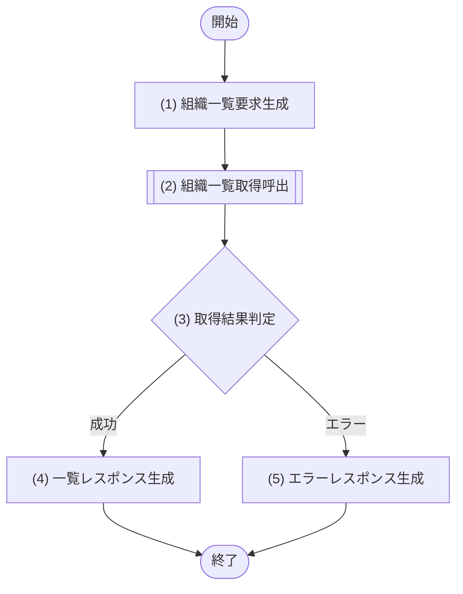

### 5.10.6 処理詳細

| No | 処理名 | 種別 | 処理詳細 | 呼出先公開IF・論理処理名 | 引数・参照値 | 結果変換 |
|---:|---|---|---|---|---|---|
| 1 | 組織一覧要求生成 | 境界 | 認証主体、基準日、利用状態から論理要求を生成する | - | 認証主体、query、traceId | 組織一覧取得要求 |
| 2 | 組織一覧取得呼出 | モジュール呼出 | 閲覧可能範囲と有効性を含む取得を委譲する | M-002/IF-10 組織管理 | (1)の要求 | 組織一覧または業務エラー |
| 3 | 取得結果判定 | 判定 | (2)の結果を判定する | - | (2)の結果 | 成功は(4)、エラーは(5) |
| 4 | 一覧レスポンス生成 | 境界 | 組織一覧を200へ変換する | - | (2)の成功結果 | [レスポンス項目](05_API設計.md#5103-レスポンス項目)のレスポンス |
| 5 | エラーレスポンス生成 | 境界 | 権限等をHTTPエラーへ変換する | - | (2)のエラー、traceId | [エラー定義](05_API設計.md#5107-エラー定義)のHTTPエラー |

### 5.10.7 エラー定義

| HTTP | エラーコード | 発生元 | 発生条件 | API境界の処理 |
|---:|---|---|---|---|
| 400 | VALIDATION_ERROR | API境界 | 基準日・利用状態条件が不正 | 共通形式へ変換 |
| 401 | UNAUTHENTICATED | API境界 | 認証情報が無効 | 共通形式へ変換 |
| 403 | FORBIDDEN | M-002/IF-10 | 無効組織を含む取得権限がない | 共通形式へ変換 |
| 500 | INTERNAL_ERROR | API境界 / M-002/IF-10 | 想定外の内部異常 | 内部情報を隠して変換 |

## 5.11 API-009 役職一覧取得

### 5.11.1 基本情報

| 項目 | 内容 |
|---|---|
| API-ID / API名 | API-009 / 役職一覧取得 |
| Method / Path | GET `/api/positions` |
| 目的 | 指定基準日に[マスター利用可否の共通契約](05_API設計.md#515-マスター利用可否の共通契約)の利用可能条件を満たす役職、または管理用の全役職を返す |
| 実行権限 | 認証済み利用者。無効役職を含む取得はシステム管理者のみ |
| トレース元 | F-011 / UC-011（F-002・F-004・F-006の選択肢取得にも利用） |
| 呼出モジュール | M-002/IF-11 役職管理 |
| 冪等性 / 正常応答 | あり / 200 OK |

### 5.11.2 リクエスト項目

| 項目名 | 場所 | 型 | 必須 | 説明・制約 |
|---|---|---|---|---|
| activeOnly | query | boolean | No | 既定true。falseはシステム管理者のみ |
| effectiveOn | query | string(date) | No | 有効性の基準日。既定は業務日 |

### 5.11.3 レスポンス項目

| 項目名 | 場所 | 型 | 必須 | 説明 |
|---|---|---|---|---|
| items | body | array | Yes | 役職一覧 |
| items[].positionId / positionCode | body | string | Yes | 役職ID・コード |
| items[].positionName / positionLevel | body | string / integer | Yes | 役職名・役職レベル。役職レベル未指定で登録された役職は0 |
| items[].effectiveFrom / effectiveTo | body | string(date) | Yes / No | 有効期間 |
| items[].active / version | body | boolean / integer | Yes | 利用状態・版数 |

### 5.11.4 バリデーション

| No | 対象 | 検証内容 | 違反時エラー |
|---:|---|---|---|
| 1 | activeOnly | boolean形式 | VALIDATION_ERROR |
| 2 | effectiveOn | 指定時は日付形式 | VALIDATION_ERROR |

### 5.11.5 処理フロー


### 5.11.6 処理詳細

| No | 処理名 | 種別 | 処理詳細 | 呼出先公開IF・論理処理名 | 引数・参照値 | 結果変換 |
|---:|---|---|---|---|---|---|
| 1 | 役職一覧要求生成 | 境界 | 認証主体、基準日、利用状態から論理要求を生成する | - | 認証主体、query、traceId | 役職一覧取得要求 |
| 2 | 役職一覧取得呼出 | モジュール呼出 | 閲覧可能範囲と有効性を含む取得を委譲する | M-002/IF-11 役職管理 | (1)の要求 | 役職一覧または業務エラー |
| 3 | 取得結果判定 | 判定 | (2)の結果を判定する | - | (2)の結果 | 成功は(4)、エラーは(5) |
| 4 | 一覧レスポンス生成 | 境界 | 役職一覧を200へ変換する | - | (2)の成功結果 | [レスポンス項目](05_API設計.md#5113-レスポンス項目)のレスポンス |
| 5 | エラーレスポンス生成 | 境界 | 権限等をHTTPエラーへ変換する | - | (2)のエラー、traceId | [エラー定義](05_API設計.md#5117-エラー定義)のHTTPエラー |

### 5.11.7 エラー定義

| HTTP | エラーコード | 発生元 | 発生条件 | API境界の処理 |
|---:|---|---|---|---|
| 400 | VALIDATION_ERROR | API境界 | 基準日・利用状態条件が不正 | 共通形式へ変換 |
| 401 | UNAUTHENTICATED | API境界 | 認証情報が無効 | 共通形式へ変換 |
| 403 | FORBIDDEN | M-002/IF-11 | 無効役職を含む取得権限がない | 共通形式へ変換 |
| 500 | INTERNAL_ERROR | API境界 / M-002/IF-11 | 想定外の内部異常 | 内部情報を隠して変換 |

## 5.12 API-010 ログイン

### 5.12.1 基本情報

| 項目 | 内容 |
|---|---|
| API-ID / API名 | API-010 / ログイン |
| Method / Path | POST `/api/auth/login` |
| 目的 | 社内認証基盤の認証結果と利用者状態を確認し、認証トークンを発行する |
| 実行権限 | 認証前の全利用者 |
| トレース元 | F-001 / UC-005 |
| 呼出モジュール | M-003/IF-01 ログイン |
| 冪等性 / 正常応答 | 永続的な業務副作用なし / 200 OK |

### 5.12.2 リクエスト項目

| 項目名 | 場所 | 型 | 必須 | 説明・制約 |
|---|---|---|---|---|
| loginId | body | string | Yes | 社内認証基盤のログイン識別子。1〜255文字 |
| password | body | string | Yes | 認証情報。1〜256文字。ログへ出力しない |

### 5.12.3 レスポンス項目

| 項目名 | 場所 | 型 | 必須 | 説明 |
|---|---|---|---|---|
| accessToken | body | string | Yes | API認証トークン |
| tokenType | body | string | Yes | `Bearer` |
| expiresAt | body | string(date-time) | Yes | 有効期限 |
| userId / employeeId | body | string | Yes / No | 利用者ID・紐付く社員ID |
| roles | body | array(string) | Yes | 有効なロールコード一覧 |

### 5.12.4 バリデーション

| No | 対象 | 検証内容 | 違反時エラー |
|---:|---|---|---|
| 1 | loginId | 必須、文字列、1〜255文字 | VALIDATION_ERROR |
| 2 | password | 必須、文字列、1〜256文字 | VALIDATION_ERROR |

### 5.12.5 処理フロー

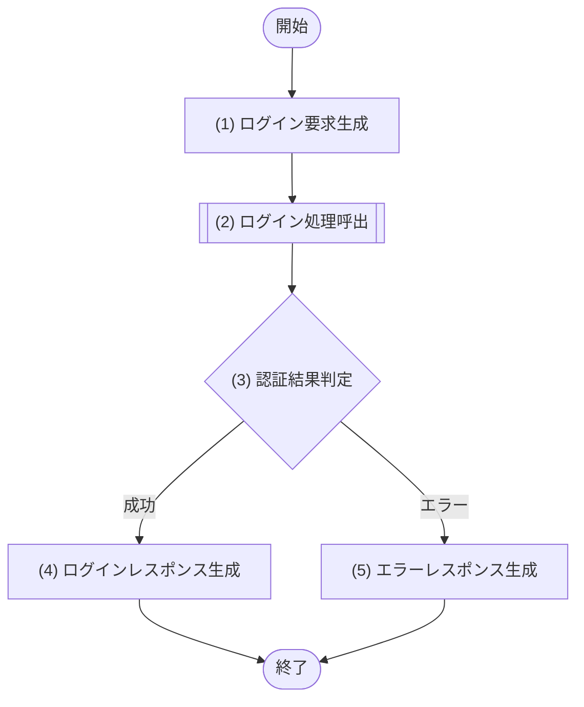

### 5.12.6 処理詳細

| No | 処理名 | 種別 | 処理詳細 | 呼出先公開IF・論理処理名 | 引数・参照値 | 結果変換 |
|---:|---|---|---|---|---|---|
| 1 | ログイン要求生成 | 境界 | 相関IDと認証情報から論理要求を生成し、呼出時点のAsia/Tokyo業務日をサーバー側で付与する。認証情報はログ対象外にする | - | body、traceId、サーバー業務日 | 業務日付きログイン要求 |
| 2 | ログイン処理呼出 | モジュール呼出 | 認証情報、相関ID、業務日を渡し、外部認証、業務日時点の利用者・在籍状態、ロール取得、トークン発行、監査を委譲する | M-003/IF-01 ログイン | (1)の要求 | 認証結果または業務エラー |
| 3 | 認証結果判定 | 判定 | (2)の結果を判定する | - | (2)の結果 | 成功は(4)、エラーは(5) |
| 4 | ログインレスポンス生成 | 境界 | トークンと認証主体情報を200へ変換し、`Cache-Control: no-store`を付与する | - | (2)の成功結果 | [レスポンス項目](05_API設計.md#5123-レスポンス項目)のレスポンス |
| 5 | エラーレスポンス生成 | 境界 | 認証失敗・アカウント無効・外部障害を変換する | - | (2)のエラー、traceId | [エラー定義](05_API設計.md#5127-エラー定義)のHTTPエラー |

### 5.12.7 エラー定義

| HTTP | エラーコード | 発生元 | 発生条件 | API境界の処理 |
|---:|---|---|---|---|
| 400 | VALIDATION_ERROR | API境界 | ログイン入力が不正 | 共通形式へ変換 |
| 401 | AUTHENTICATION_FAILED | M-003/IF-01 | 認証情報が一致しない | 詳細理由を隠して変換 |
| 403 | ACCOUNT_INACTIVE | M-003/IF-01 | 利用者アカウントが無効・ロック中、有効ロールなし、または紐づく社員が非ACTIVE・退職日到来 | 共通形式へ変換 |
| 503 | AUTHENTICATION_SERVICE_UNAVAILABLE | M-003/IF-01 | 社内認証基盤が利用不能 | 再試行可能なエラーへ変換 |
| 500 | INTERNAL_ERROR | API境界 / M-003/IF-01 | 想定外の内部異常 | 内部情報を隠して変換 |

## 5.13 API-011 組織登録

### 5.13.1 基本情報

| 項目 | 内容 |
|---|---|
| API-ID / API名 | API-011 / 組織登録 |
| Method / Path | POST `/api/organizations` |
| 目的 | 組織マスターを有効期間付きで登録する |
| 実行権限 | システム管理者 |
| トレース元 | F-010 / UC-010 |
| 呼出モジュール | M-002/IF-10 組織管理 |
| 冪等性 / 正常応答 | なし（組織コード一意制約で二重登録防止） / 201 Created |

### 5.13.2 リクエスト項目

| 項目名 | 場所 | 型 | 必須 | 説明・制約 |
|---|---|---|---|---|
| organizationCode | body | string | Yes | 組織コード。半角英数字またはハイフンの1〜30文字 |
| organizationName | body | string | Yes | 組織名。1〜200文字 |
| parentOrganizationId | body | string / null | No | 上位組織ID。最上位組織は省略または明示null |
| effectiveFrom | body | string(date) | Yes | 有効開始日 |
| effectiveTo | body | string(date) | No | 有効終了日 |

### 5.13.3 レスポンス項目

| 項目名 | 場所 | 型 | 必須 | 説明 |
|---|---|---|---|---|
| organizationId / organizationCode | body | string | Yes | 組織ID・コード |
| organizationName | body | string | Yes | 組織名 |
| parentOrganizationId | body | string / null | Yes | 上位組織ID。最上位組織はnull。プロパティは常に返す |
| effectiveFrom / effectiveTo | body | string(date) | Yes / No | 有効期間 |
| active / version | body | boolean / integer | Yes | 利用状態・版数。登録時のactiveは常にtrue |
| createdAt | body | string(date-time) | Yes | 登録日時 |

### 5.13.4 バリデーション

| No | 対象 | 検証内容 | 違反時エラー |
|---:|---|---|---|
| 1 | organizationCode / organizationName | 必須・型・最大長を検証する。organizationCodeは半角英数字またはハイフンの1〜30文字、organizationNameは1〜200文字 | VALIDATION_ERROR |
| 2 | parentOrganizationId | 指定時はID形式 | VALIDATION_ERROR |
| 3 | effectiveFrom / effectiveTo | 日付形式かつ開始≦終了 | VALIDATION_ERROR |

### 5.13.5 処理フロー


### 5.13.6 処理詳細

| No | 処理名 | 種別 | 処理詳細 | 呼出先公開IF・論理処理名 | 引数・参照値 | 結果変換 |
|---:|---|---|---|---|---|---|
| 1 | 組織登録要求生成 | 境界 | 認証主体と組織情報から論理要求を生成する | - | 認証主体、body、traceId | 組織登録要求 |
| 2 | 組織登録呼出 | モジュール呼出 | 管理権限、コード一意性、上位組織・階層循環、有効期間を検証する。上位組織指定時は上位が`active=true`かつその有効期間が登録組織の期間全体を包含することを必須とし、登録・監査を委譲する | M-002/IF-10 組織管理 | (1)の要求 | 登録組織または業務エラー |
| 3 | 登録結果判定 | 判定 | (2)の結果を判定する | - | (2)の結果 | 成功は(4)、エラーは(5) |
| 4 | 登録レスポンス生成 | 境界 | M-002が返した登録組織と`createdAt`を201レスポンスへ変換する | - | (2)の成功結果 | [レスポンス項目](05_API設計.md#5133-レスポンス項目)のレスポンス |
| 5 | エラーレスポンス生成 | 境界 | 重複・期間等をHTTPエラーへ変換する | - | (2)のエラー、traceId | [エラー定義](05_API設計.md#5137-エラー定義)のHTTPエラー |

### 5.13.7 エラー定義

| HTTP | エラーコード | 発生元 | 発生条件 | API境界の処理 |
|---:|---|---|---|---|
| 400 | VALIDATION_ERROR | API境界 | リクエスト形式が不正 | 共通形式へ変換 |
| 400 | MASTER_PERIOD_INVALID | M-002/IF-10 | 有効期間が業務上不正 | 共通形式へ変換 |
| 401 | UNAUTHENTICATED | API境界 | 認証情報が無効 | 共通形式へ変換 |
| 403 | FORBIDDEN | M-002/IF-10 | 組織管理権限がない | 共通形式へ変換 |
| 409 | ORGANIZATION_CODE_DUPLICATED | M-002/IF-10 | 組織コードが登録済み | organizationCodeの項目エラーへ変換 |
| 409 | ORGANIZATION_HIERARCHY_CONFLICT | M-002/IF-10 | 上位組織が不存在・無効、子の有効期間全体を包含しない、または循環する | parentOrganizationIdの項目エラーへ変換 |
| 500 | INTERNAL_ERROR | API境界 / M-002/IF-10 | 想定外の内部異常 | 内部情報を隠して変換 |

## 5.14 API-012 組織更新・無効化

### 5.14.1 基本情報

| 項目 | 内容 |
|---|---|
| API-ID / API名 | API-012 / 組織更新・無効化 |
| Method / Path | PUT `/api/organizations/{organizationId}` |
| 目的 | 組織マスターを更新し、または手動利用可否を即時無効化する |
| 実行権限 | システム管理者 |
| トレース元 | F-010 / UC-010 |
| 呼出モジュール | M-002/IF-10 組織管理 |
| 冪等性 / 正常応答 | なし（versionで二重反映防止） / 200 OK |

### 5.14.2 リクエスト項目

| 項目名 | 場所 | 型 | 必須 | 説明・制約 |
|---|---|---|---|---|
| organizationId | path | string | Yes | 対象組織ID |
| operation | body | string | Yes | `UPDATE` / `DISABLE` |
| organizationName | body | string | No | 更新後名称。1〜200文字 |
| parentOrganizationId | body | string / null | No | 更新後上位組織ID。省略は現値維持、最上位へ変更する場合は明示null |
| effectiveFrom | body | string(date) | No | 更新後有効開始日。省略時は現値維持 |
| effectiveTo | body | string(date) / null | No | `UPDATE`は将来終了日の予約または明示nullによる期限解除が可能。`DISABLE`では任意で、未指定は現値維持、指定日または明示nullはその値へ更新 |
| version | body | integer | Yes | 取得時版数 |

### 5.14.3 レスポンス項目

| 項目名 | 場所 | 型 | 必須 | 説明 |
|---|---|---|---|---|
| organizationId / organizationCode | body | string | Yes | 組織ID・コード |
| organizationName | body | string | Yes | 組織名 |
| parentOrganizationId | body | string / null | Yes | 更新後上位組織ID。最上位組織はnull。プロパティは常に返す |
| effectiveFrom / effectiveTo | body | string(date) | Yes / No | 有効期間 |
| active / version | body | boolean / integer | Yes | 更新後利用状態・版数 |
| updatedAt | body | string(date-time) | Yes | 更新日時 |

### 5.14.4 バリデーション

| No | 対象 | 検証内容 | 違反時エラー |
|---:|---|---|---|
| 1 | organizationId / version | ID形式、versionは1以上 | VALIDATION_ERROR |
| 2 | operation | 許可値のいずれか | VALIDATION_ERROR |
| 3 | UPDATE時の更新項目 | 1項目以上。名称は最大長以内。組織コードは変更不可 | VALIDATION_ERROR |
| 4 | effectiveFrom / effectiveTo | 日付形式。更新後に終了日がある場合は開始≦終了。`DISABLE`でeffectiveTo指定時も同条件、未指定は許可 | VALIDATION_ERROR |
| 5 | parentOrganizationId | 指定時はID形式 | VALIDATION_ERROR |

### 5.14.5 処理フロー


### 5.14.6 処理詳細

| No | 処理名 | 種別 | 処理詳細 | 呼出先公開IF・論理処理名 | 引数・参照値 | 結果変換 |
|---:|---|---|---|---|---|---|
| 1 | 組織更新要求生成 | 境界 | 認証主体、組織ID、操作区分、更新内容、版数から論理要求を生成する | - | 認証主体、path、body、traceId | 組織更新要求 |
| 2 | 組織更新呼出 | モジュール呼出 | 管理権限、存在、上位組織・階層循環、有効期間、版数を検証する。更新後の親子期間包含を必須とし、無効化・期間短縮によって有効な子組織または現在・将来所属が参照不能となる場合は更新せず、更新・無効化・監査を委譲する | M-002/IF-10 組織管理 | (1)の要求 | 更新組織または業務エラー |
| 3 | 更新結果判定 | 判定 | (2)の結果を判定する | - | (2)の結果 | 成功は(4)、エラーは(5) |
| 4 | 更新レスポンス生成 | 境界 | M-002が返した更新後組織と`updatedAt`を200へ変換する | - | (2)の成功結果 | [レスポンス項目](05_API設計.md#5143-レスポンス項目)のレスポンス |
| 5 | エラーレスポンス生成 | 境界 | 不存在・重複・期間・競合等を変換する | - | (2)のエラー、traceId | [エラー定義](05_API設計.md#5147-エラー定義)のHTTPエラー |

### 5.14.7 エラー定義

| HTTP | エラーコード | 発生元 | 発生条件 | API境界の処理 |
|---:|---|---|---|---|
| 400 | VALIDATION_ERROR | API境界 | リクエスト形式が不正 | 共通形式へ変換 |
| 400 | MASTER_PERIOD_INVALID | M-002/IF-10 | 更新後有効期間が不正、または現在・将来所属の参照期間を包含しない | 共通形式へ変換 |
| 401 | UNAUTHENTICATED | API境界 | 認証情報が無効 | 共通形式へ変換 |
| 403 | FORBIDDEN | M-002/IF-10 | 組織管理権限がない | 共通形式へ変換 |
| 404 | ORGANIZATION_NOT_FOUND | M-002/IF-10 | 対象組織が存在しない | 共通形式へ変換 |
| 409 | ORGANIZATION_HIERARCHY_CONFLICT | M-002/IF-10 | 上位組織が不存在・無効、期間非包含、自己・配下を指定、または無効化・期間短縮で有効な子組織が孤児化する | parentOrganizationIdの項目エラーへ変換 |
| 409 | UPDATE_CONFLICT | M-002/IF-10 | version不一致 | 最新情報の再取得を要求 |
| 500 | INTERNAL_ERROR | API境界 / M-002/IF-10 | 想定外の内部異常 | 内部情報を隠して変換 |

## 5.15 API-013 役職登録

### 5.15.1 基本情報

| 項目 | 内容 |
|---|---|
| API-ID / API名 | API-013 / 役職登録 |
| Method / Path | POST `/api/positions` |
| 目的 | 役職マスターを有効期間付きで登録する |
| 実行権限 | システム管理者 |
| トレース元 | F-011 / UC-011 |
| 呼出モジュール | M-002/IF-11 役職管理 |
| 冪等性 / 正常応答 | なし（役職コード一意制約で二重登録防止） / 201 Created |

### 5.15.2 リクエスト項目

| 項目名 | 場所 | 型 | 必須 | 説明・制約 |
|---|---|---|---|---|
| positionCode | body | string | Yes | 役職コード。半角英数字またはハイフンの1〜30文字 |
| positionName | body | string | Yes | 役職名。1〜200文字 |
| positionLevel | body | integer | No | 0以上の役職レベル |
| effectiveFrom | body | string(date) | Yes | 有効開始日 |
| effectiveTo | body | string(date) | No | 有効終了日 |

### 5.15.3 レスポンス項目

| 項目名 | 場所 | 型 | 必須 | 説明 |
|---|---|---|---|---|
| positionId / positionCode | body | string | Yes | 役職ID・コード |
| positionName / positionLevel | body | string / integer | Yes | 役職名・役職レベル。登録時に省略した役職レベルは0 |
| effectiveFrom / effectiveTo | body | string(date) | Yes / No | 有効期間 |
| active / version | body | boolean / integer | Yes | 利用状態・版数。登録時のactiveは常にtrue |
| createdAt | body | string(date-time) | Yes | 登録日時 |

### 5.15.4 バリデーション

| No | 対象 | 検証内容 | 違反時エラー |
|---:|---|---|---|
| 1 | positionCode / positionName | 必須・型・最大長を検証する。positionCodeは半角英数字またはハイフンの1〜30文字、positionNameは1〜200文字 | VALIDATION_ERROR |
| 2 | positionLevel | 指定時は0以上の整数 | VALIDATION_ERROR |
| 3 | effectiveFrom / effectiveTo | 日付形式かつ開始≦終了 | VALIDATION_ERROR |

### 5.15.5 処理フロー


### 5.15.6 処理詳細

| No | 処理名 | 種別 | 処理詳細 | 呼出先公開IF・論理処理名 | 引数・参照値 | 結果変換 |
|---:|---|---|---|---|---|---|
| 1 | 役職登録要求生成 | 境界 | 認証主体と役職情報から論理要求を生成する | - | 認証主体、body、traceId | 役職登録要求 |
| 2 | 役職登録呼出 | モジュール呼出 | 管理権限、コード一意性、有効期間、登録、監査を委譲する | M-002/IF-11 役職管理 | (1)の要求 | 登録役職または業務エラー |
| 3 | 登録結果判定 | 判定 | (2)の結果を判定する | - | (2)の結果 | 成功は(4)、エラーは(5) |
| 4 | 登録レスポンス生成 | 境界 | M-002が返した登録役職と`createdAt`を201レスポンスへ変換する | - | (2)の成功結果 | [レスポンス項目](05_API設計.md#5153-レスポンス項目)のレスポンス |
| 5 | エラーレスポンス生成 | 境界 | 重複・期間等をHTTPエラーへ変換する | - | (2)のエラー、traceId | [エラー定義](05_API設計.md#5157-エラー定義)のHTTPエラー |

### 5.15.7 エラー定義

| HTTP | エラーコード | 発生元 | 発生条件 | API境界の処理 |
|---:|---|---|---|---|
| 400 | VALIDATION_ERROR | API境界 | リクエスト形式が不正 | 共通形式へ変換 |
| 400 | MASTER_PERIOD_INVALID | M-002/IF-11 | 有効期間が業務上不正 | 共通形式へ変換 |
| 401 | UNAUTHENTICATED | API境界 | 認証情報が無効 | 共通形式へ変換 |
| 403 | FORBIDDEN | M-002/IF-11 | 役職管理権限がない | 共通形式へ変換 |
| 409 | POSITION_CODE_DUPLICATED | M-002/IF-11 | 役職コードが登録済み | positionCodeの項目エラーへ変換 |
| 500 | INTERNAL_ERROR | API境界 / M-002/IF-11 | 想定外の内部異常 | 内部情報を隠して変換 |

## 5.16 API-014 役職更新・無効化

### 5.16.1 基本情報

| 項目 | 内容 |
|---|---|
| API-ID / API名 | API-014 / 役職更新・無効化 |
| Method / Path | PUT `/api/positions/{positionId}` |
| 目的 | 役職マスターを更新し、または手動利用可否を即時無効化する |
| 実行権限 | システム管理者 |
| トレース元 | F-011 / UC-011 |
| 呼出モジュール | M-002/IF-11 役職管理 |
| 冪等性 / 正常応答 | なし（versionで二重反映防止） / 200 OK |

### 5.16.2 リクエスト項目

| 項目名 | 場所 | 型 | 必須 | 説明・制約 |
|---|---|---|---|---|
| positionId | path | string | Yes | 対象役職ID |
| operation | body | string | Yes | `UPDATE` / `DISABLE` |
| positionName | body | string | No | 更新後名称。1〜200文字 |
| positionLevel | body | integer | No | 更新後役職レベル。0以上 |
| effectiveFrom | body | string(date) | No | 更新後有効開始日。省略時は現値維持 |
| effectiveTo | body | string(date) / null | No | `UPDATE`は将来終了日の予約または明示nullによる期限解除が可能。`DISABLE`では任意で、未指定は現値維持、指定日または明示nullはその値へ更新 |
| version | body | integer | Yes | 取得時版数 |

### 5.16.3 レスポンス項目

| 項目名 | 場所 | 型 | 必須 | 説明 |
|---|---|---|---|---|
| positionId / positionCode | body | string | Yes | 役職ID・コード |
| positionName / positionLevel | body | string / integer | Yes | 役職名・役職レベル |
| effectiveFrom / effectiveTo | body | string(date) | Yes / No | 有効期間 |
| active / version | body | boolean / integer | Yes | 更新後利用状態・版数 |
| updatedAt | body | string(date-time) | Yes | 更新日時 |

### 5.16.4 バリデーション

| No | 対象 | 検証内容 | 違反時エラー |
|---:|---|---|---|
| 1 | positionId / version | ID形式、versionは1以上 | VALIDATION_ERROR |
| 2 | operation | 許可値のいずれか | VALIDATION_ERROR |
| 3 | UPDATE時の更新項目 | 1項目以上。名称・役職レベルの型と範囲を満たす。役職コードは変更不可 | VALIDATION_ERROR |
| 4 | effectiveFrom / effectiveTo | 日付形式。更新後に終了日がある場合は開始≦終了。`DISABLE`でeffectiveTo指定時も同条件、未指定は許可 | VALIDATION_ERROR |

### 5.16.5 処理フロー

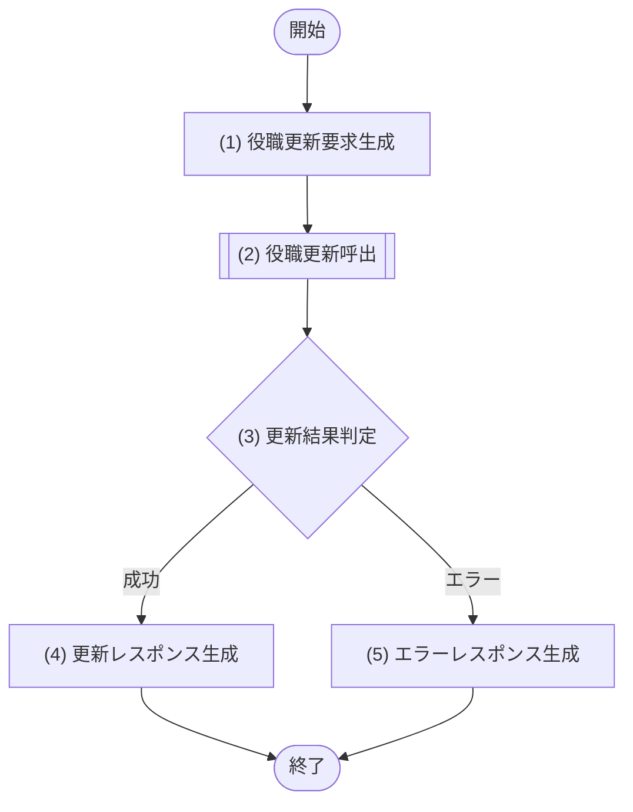

### 5.16.6 処理詳細

| No | 処理名 | 種別 | 処理詳細 | 呼出先公開IF・論理処理名 | 引数・参照値 | 結果変換 |
|---:|---|---|---|---|---|---|
| 1 | 役職更新要求生成 | 境界 | 認証主体、役職ID、操作区分、更新内容、版数から論理要求を生成する | - | 認証主体、path、body、traceId | 役職更新要求 |
| 2 | 役職更新呼出 | モジュール呼出 | 管理権限、存在、有効期間、版数を検証する。無効化・期間短縮によって現在・将来所属が参照不能となる場合は更新せず、更新・無効化・監査を委譲する | M-002/IF-11 役職管理 | (1)の要求 | 更新役職または業務エラー |
| 3 | 更新結果判定 | 判定 | (2)の結果を判定する | - | (2)の結果 | 成功は(4)、エラーは(5) |
| 4 | 更新レスポンス生成 | 境界 | M-002が返した更新後役職と`updatedAt`を200へ変換する | - | (2)の成功結果 | [レスポンス項目](05_API設計.md#5163-レスポンス項目)のレスポンス |
| 5 | エラーレスポンス生成 | 境界 | 不存在・重複・期間・競合等を変換する | - | (2)のエラー、traceId | [エラー定義](05_API設計.md#5167-エラー定義)のHTTPエラー |

### 5.16.7 エラー定義

| HTTP | エラーコード | 発生元 | 発生条件 | API境界の処理 |
|---:|---|---|---|---|
| 400 | VALIDATION_ERROR | API境界 | リクエスト形式が不正 | 共通形式へ変換 |
| 400 | MASTER_PERIOD_INVALID | M-002/IF-11 | 更新後有効期間が不正、または現在・将来所属の参照期間を包含しない | 共通形式へ変換 |
| 401 | UNAUTHENTICATED | API境界 | 認証情報が無効 | 共通形式へ変換 |
| 403 | FORBIDDEN | M-002/IF-11 | 役職管理権限がない | 共通形式へ変換 |
| 404 | POSITION_NOT_FOUND | M-002/IF-11 | 対象役職が存在しない | 共通形式へ変換 |
| 409 | UPDATE_CONFLICT | M-002/IF-11 | version不一致 | 最新情報の再取得を要求 |
| 500 | INTERNAL_ERROR | API境界 / M-002/IF-11 | 想定外の内部異常 | 内部情報を隠して変換 |

## 5.17 API-015 ロール一覧取得

### 5.17.1 基本情報

| 項目 | 内容 |
|---|---|
| API-ID / API名 | API-015 / ロール一覧取得 |
| Method / Path | GET `/api/roles` |
| 目的 | 権限割当に利用できるロール一覧を返す |
| 実行権限 | システム管理者 |
| トレース元 | F-012 / UC-012 |
| 呼出モジュール | M-002/IF-12 ロール管理 |
| 冪等性 / 正常応答 | あり / 200 OK |

### 5.17.2 リクエスト項目

| 項目名 | 場所 | 型 | 必須 | 説明・制約 |
|---|---|---|---|---|
| - | - | - | - | 個別パラメータなし |

### 5.17.3 レスポンス項目

| 項目名 | 場所 | 型 | 必須 | 説明 |
|---|---|---|---|---|
| items | body | array | Yes | ロール一覧 |
| items[].roleId / roleCode | body | string | Yes | ロールID・コード |
| items[].roleName | body | string | Yes | ロール名 |
| items[].active | body | boolean | Yes | 利用状態 |

### 5.17.4 バリデーション

| No | 対象 | 検証内容 | 違反時エラー |
|---:|---|---|---|
| - | - | 個別バリデーションなし。共通の認証・認可だけを適用 | - |

### 5.17.5 処理フロー

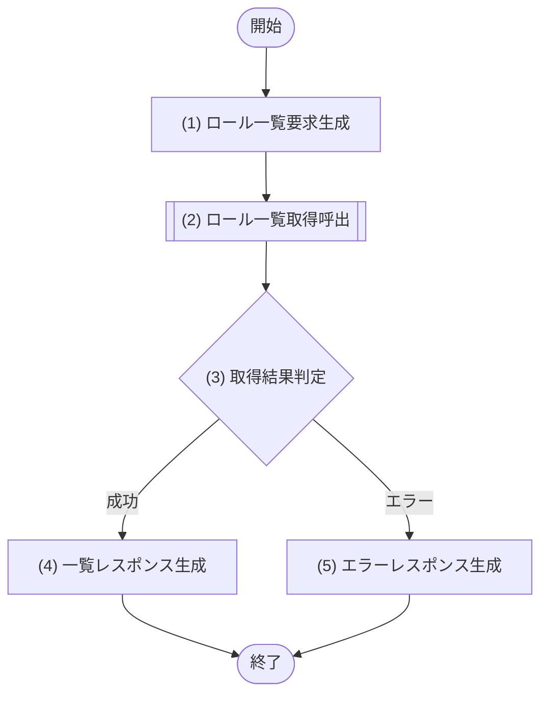

### 5.17.6 処理詳細

| No | 処理名 | 種別 | 処理詳細 | 呼出先公開IF・論理処理名 | 引数・参照値 | 結果変換 |
|---:|---|---|---|---|---|---|
| 1 | ロール一覧要求生成 | 境界 | 認証主体と相関IDから論理要求を生成する | - | 認証主体、traceId | ロール一覧取得要求 |
| 2 | ロール一覧取得呼出 | モジュール呼出 | 管理権限と有効性を含む一覧取得を委譲する | M-002/IF-12 ロール管理 | (1)の要求 | ロール一覧または業務エラー |
| 3 | 取得結果判定 | 判定 | (2)の結果を判定する | - | (2)の結果 | 成功は(4)、エラーは(5) |
| 4 | 一覧レスポンス生成 | 境界 | 有効ロール一覧を200へ変換する | - | (2)の成功結果 | [レスポンス項目](05_API設計.md#5173-レスポンス項目)のレスポンス |
| 5 | エラーレスポンス生成 | 境界 | 権限等をHTTPエラーへ変換する | - | (2)のエラー、traceId | [エラー定義](05_API設計.md#5177-エラー定義)のHTTPエラー |

### 5.17.7 エラー定義

| HTTP | エラーコード | 発生元 | 発生条件 | API境界の処理 |
|---:|---|---|---|---|
| 401 | UNAUTHENTICATED | API境界 | 認証情報が無効 | 共通形式へ変換 |
| 403 | FORBIDDEN | M-002/IF-12 | 権限管理権限がない | 共通形式へ変換 |
| 500 | INTERNAL_ERROR | API境界 / M-002/IF-12 | 想定外の内部異常 | 内部情報を隠して変換 |

## 5.18 API-016 社員ロール取得

### 5.18.1 基本情報

| 項目 | 内容 |
|---|---|
| API-ID / API名 | API-016 / 社員ロール取得 |
| Method / Path | GET `/api/employees/{employeeId}/roles` |
| 目的 | 対象社員に割り当てられたロールと有効期間を返す |
| 実行権限 | システム管理者 |
| トレース元 | F-012 / UC-012 |
| 呼出モジュール | M-002/IF-12 ロール管理 |
| 冪等性 / 正常応答 | あり / 200 OK |

### 5.18.2 リクエスト項目

| 項目名 | 場所 | 型 | 必須 | 説明・制約 |
|---|---|---|---|---|
| employeeId | path | string | Yes | 対象社員ID |

### 5.18.3 レスポンス項目

| 項目名 | 場所 | 型 | 必須 | 説明 |
|---|---|---|---|---|
| employeeId / userId | body | string | Yes | 社員ID・利用者ID |
| userActive | body | boolean | Yes | 利用者アカウント状態 |
| roles | body | array | Yes | ロール割当一覧 |
| roles[].roleId / roleCode / roleName | body | string | Yes | ロール識別情報 |
| roles[].active | body | boolean | Yes | ロールマスターの現在の利用状態。falseの既存割当も参照用に返すが、新しい更新後ロール一式には指定できない |
| roles[].effectiveFrom / effectiveTo | body | string(date) | Yes / No | 割当有効期間。開始日は必須、終了日なしは期限なし |
| version | body | integer | Yes | ロール割当更新競合用版数 |

### 5.18.4 バリデーション

| No | 対象 | 検証内容 | 違反時エラー |
|---:|---|---|---|
| 1 | employeeId | 必須かつID形式 | VALIDATION_ERROR |

### 5.18.5 処理フロー

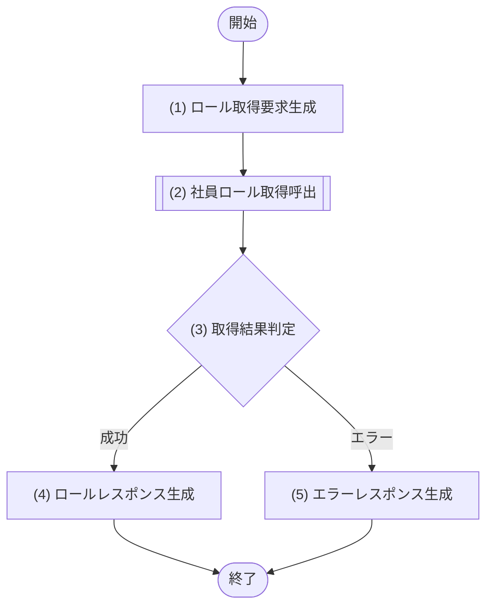

### 5.18.6 処理詳細

| No | 処理名 | 種別 | 処理詳細 | 呼出先公開IF・論理処理名 | 引数・参照値 | 結果変換 |
|---:|---|---|---|---|---|---|
| 1 | ロール取得要求生成 | 境界 | 認証主体、社員IDから論理要求を生成する | - | 認証主体、path、traceId | 社員ロール取得要求 |
| 2 | 社員ロール取得呼出 | モジュール呼出 | 管理権限、対象利用者存在、業務日時点で現在・将来の期間対象割当取得を委譲する。ロールマスターが現在`active=false`の既存割当も除外せず、`roles[].active=false`として受け取る | M-002/IF-12 ロール管理 | (1)の要求 | `active`を含むロール割当または業務エラー |
| 3 | 取得結果判定 | 判定 | (2)の結果を判定する | - | (2)の結果 | 成功は(4)、エラーは(5) |
| 4 | ロールレスポンス生成 | 境界 | 利用者状態とロール割当を200へ変換する。モジュールから受け取った`roleActive`を`roles[].active`へそのまま設定し、falseの既存割当も参照可能とする | - | (2)の成功結果 | [レスポンス項目](05_API設計.md#5183-レスポンス項目)のレスポンス |
| 5 | エラーレスポンス生成 | 境界 | 権限・不存在等をHTTPエラーへ変換する | - | (2)のエラー、traceId | [エラー定義](05_API設計.md#5187-エラー定義)のHTTPエラー |

### 5.18.7 エラー定義

| HTTP | エラーコード | 発生元 | 発生条件 | API境界の処理 |
|---:|---|---|---|---|
| 400 | VALIDATION_ERROR | API境界 | 社員IDが不正 | 共通形式へ変換 |
| 401 | UNAUTHENTICATED | API境界 | 認証情報が無効 | 共通形式へ変換 |
| 403 | FORBIDDEN | M-002/IF-12 | 権限管理権限がない | 共通形式へ変換 |
| 404 | EMPLOYEE_NOT_FOUND | M-002/IF-12 | 対象社員が存在しない | 共通形式へ変換 |
| 404 | USER_ACCOUNT_NOT_FOUND | M-002/IF-12 | 対象社員に利用者アカウントがない | 共通形式へ変換 |
| 500 | INTERNAL_ERROR | API境界 / M-002/IF-12 | 想定外の内部異常 | 内部情報を隠して変換 |

## 5.19 API-017 社員ロール更新

### 5.19.1 基本情報

| 項目 | 内容 |
|---|---|
| API-ID / API名 | API-017 / 社員ロール更新 |
| Method / Path | PUT `/api/employees/{employeeId}/roles` |
| 目的 | 指定適用日以降に有効な対象社員の現在・将来ロール割当を、共通期間を持つ更新後ロール一式へ置き換える |
| 実行権限 | システム管理者 |
| トレース元 | F-012 / UC-012 |
| 呼出モジュール | M-002/IF-12 ロール管理 |
| 冪等性 / 正常応答 | なし（versionで二重反映防止） / 200 OK |

### 5.19.2 リクエスト項目

| 項目名 | 場所 | 型 | 必須 | 説明・制約 |
|---|---|---|---|---|
| employeeId | path | string | Yes | 対象社員ID |
| roles | body | array | Yes | effectiveFrom以降の現在・将来割当を置き換える更新後ロール一式。1件以上。既存の将来予約も置換対象 |
| roles[].roleId | body | string | Yes | ロールID。同一要求内で重複不可。更新時点で`active=true`のロールだけを指定可 |
| effectiveFrom | body | string(date) | No | 更新適用日兼、更新後ロール一式の共通有効開始日。未指定は業務日、指定時は業務日以降。この日以降に開始する既存の将来割当は保持対象を除き取消し、開始済み割当は前日終了する。過去日の遡及更新は不可 |
| effectiveTo | body | string(date) | No | 更新後ロール一式の有効終了日 |
| version | body | integer | Yes | API-016で取得した版数 |

### 5.19.3 レスポンス項目

| 項目名 | 場所 | 型 | 必須 | 説明 |
|---|---|---|---|---|
| employeeId / userId | body | string | Yes | 社員ID・利用者ID |
| roles | body | array | Yes | 更新後ロール割当。構造はAPI-016の`roles[]`と同じで、各要素にロールマスターの利用状態`active`を含む |
| version | body | integer | Yes | 更新後版数 |
| updatedAt | body | string(date-time) | Yes | 変更ありは更新日時、完全同一割当で無更新の場合は現在の利用者アカウント更新日時 |

### 5.19.4 バリデーション

| No | 対象 | 検証内容 | 違反時エラー |
|---:|---|---|---|
| 1 | employeeId / version | ID形式、versionは1以上 | VALIDATION_ERROR |
| 2 | roles | 配列かつ1件以上 | VALIDATION_ERROR |
| 3 | roles[].roleId | 必須、ID形式、配列内重複なし | VALIDATION_ERROR |
| 4 | roles[].roleId | モジュールで全指定ロールの存在と`active=true`を確認する | ROLE_NOT_ACTIVE |
| 5 | effectiveFrom / effectiveTo | 指定時は日付形式かつ開始≦終了。業務日より前の開始日は業務検証で拒否する | VALIDATION_ERROR |

### 5.19.5 処理フロー

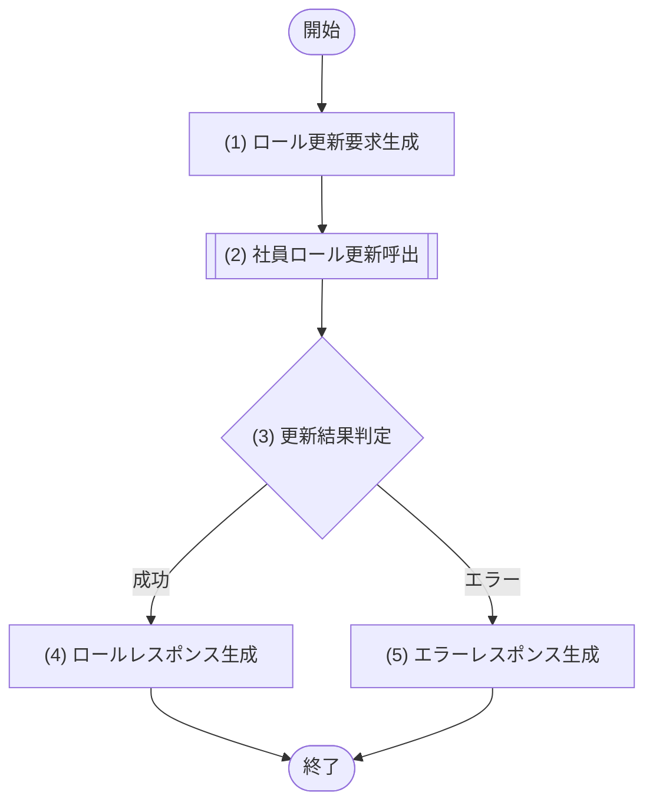

### 5.19.6 処理詳細

| No | 処理名 | 種別 | 処理詳細 | 呼出先公開IF・論理処理名 | 引数・参照値 | 結果変換 |
|---:|---|---|---|---|---|---|
| 1 | ロール更新要求生成 | 境界 | 認証主体、社員ID、割当一式、版数から論理要求を生成する | - | 認証主体、path、body、traceId | 社員ロール更新要求 |
| 2 | 社員ロール更新呼出 | モジュール呼出 | 管理権限、対象存在、指定された全ロールの`active=true`、期間、版数に加え、更新後も業務日時点で有効なシステム管理者ロールを保有する有効な利用者が1名以上残ることを確認し、指定適用日以降の現在・将来割当を一式置換して監査する処理を委譲する。既存の`active=false`割当は新たに指定できないが、その状態を理由に処理を拒否せず終了または将来予約の論理取消対象にできる | M-002/IF-12 ロール管理 | (1)の要求 | `active`を含む更新後割当または業務エラー |
| 3 | 更新結果判定 | 判定 | (2)の結果を判定する | - | (2)の結果 | 成功は(4)、エラーは(5) |
| 4 | ロールレスポンス生成 | 境界 | 更新後割当を200へ変換する。変更ありは版数更新結果、完全同一割当は取得済み利用者アカウントの`updatedAt`を使用する | - | (2)の成功結果 | [レスポンス項目](05_API設計.md#5193-レスポンス項目)のレスポンス |
| 5 | エラーレスポンス生成 | 境界 | 権限・不存在・ロール無効・競合等を変換する | - | (2)のエラー、traceId | [エラー定義](05_API設計.md#5197-エラー定義)のHTTPエラー |

### 5.19.7 エラー定義

| HTTP | エラーコード | 発生元 | 発生条件 | API境界の処理 |
|---:|---|---|---|---|
| 400 | VALIDATION_ERROR | API境界 | 割当配列・期間等の形式が不正 | 共通形式へ変換 |
| 401 | UNAUTHENTICATED | API境界 | 認証情報が無効 | 共通形式へ変換 |
| 403 | FORBIDDEN | M-002/IF-12 | 権限管理権限がない | 共通形式へ変換 |
| 404 | EMPLOYEE_NOT_FOUND | M-002/IF-12 | 対象社員が存在しない | 共通形式へ変換 |
| 404 | USER_ACCOUNT_NOT_FOUND | M-002/IF-12 | 対象社員に利用者アカウントがない | 共通形式へ変換 |
| 409 | USER_ACCOUNT_INACTIVE | M-002/IF-12 | 対象利用者アカウントが無効 | アカウント有効化後の再実行を要求 |
| 409 | ROLE_NOT_ACTIVE | M-002/IF-12 | 指定ロールが無効または未定義 | roleIdの項目エラーへ変換 |
| 409 | ROLE_ASSIGNMENT_PERIOD_CONFLICT | M-002/IF-12 | 有効開始日が業務日より前、または同一ロールの有効期間が重複 | 共通形式へ変換 |
| 409 | LAST_ACTIVE_ADMIN_REQUIRED | M-002/IF-12 | 更新後に業務日時点で有効なシステム管理者ロールを保有する有効な利用者が0名となる（自己を対象とした剥奪・期間終了を含む） | 共通形式へ変換 |
| 409 | UPDATE_CONFLICT | M-002/IF-12 | version不一致 | 最新情報の再取得を要求 |
| 500 | INTERNAL_ERROR | API境界 / M-002/IF-12 | 想定外の内部異常 | 内部情報を隠して変換 |

## 5.20 API-018 検索結果出力

### 5.20.1 基本情報

| 項目 | 内容 |
|---|---|
| API-ID / API名 | API-018 / 検索結果出力 |
| Method / Path | POST `/api/employees/export` |
| 目的 | 検索条件と閲覧可能範囲に一致する社員を許可項目だけでファイル出力する |
| 実行権限 | 人事担当者、部門管理者 |
| トレース元 | F-009 / UC-009 |
| 呼出モジュール | M-002/IF-09 検索結果出力 |
| 冪等性 / 正常応答 | 業務データへの副作用なし / 200 OK |

### 5.20.2 リクエスト項目

| 項目名 | 場所 | 型 | 必須 | 説明・制約 |
|---|---|---|---|---|
| employeeNumber / name | body | string | No | 社員番号・氏名条件。各100文字以内 |
| organizationId / positionId | body | string | No | 組織・役職条件 |
| status | body | string | No | `ACTIVE` / `RETIRED` / `ALL`。省略時は`ACTIVE`、`ALL`明示指定時だけ全状態 |
| fields | body | array(string) | No | [fields出力定義](05_API設計.md#52021-fields出力定義)の出力項目コード。省略時は標準5項目、指定時は1件以上で指定順を維持する |
| format | body | string | No | `CSV` / `XLSX`。省略時は`CSV` |

#### 5.20.2.1 fields出力定義

本表をAPI-018の項目コード、CSV/XLSXヘッダー、M-002/IF-09の論理出力との対応定義とする。NULLは空セルとし、姓名・カナは各構成値の前後空白を除いて半角空白1文字で連結する。

| fieldsコード | CSV/XLSXヘッダー | M-002/IF-09候補値 | ファイル整形 |
|---|---|---|---|
| `employeeNumber` | 社員番号 | employeeNumber | 文字列 |
| `fullName` | 氏名 | lastName、firstName | `lastName + " " + firstName` |
| `fullNameKana` | 氏名カナ | lastNameKana、firstNameKana | NULLを除いて半角空白で連結。両方NULLは空セル |
| `email` | メールアドレス | email | 文字列 |
| `phoneNumber` | 電話番号 | phoneNumber | 文字列。NULLは空セル |
| `hireDate` | 入社日 | hireDate | `YYYY-MM-DD` |
| `retirementDate` | 退職日 | retirementDate | `YYYY-MM-DD`。NULLは空セル |
| `employmentType` | 雇用区分 | employmentTypeCode | [共通区分定義](02_機能要件.md#24-共通区分定義)の表示名（正社員、契約社員等）へ変換 |
| `status` | 在籍状態 | status | [共通区分定義](02_機能要件.md#24-共通区分定義)の表示名（在籍中 / 退職）へ変換 |
| `organizationCode` | 組織コード | organizationCode | 文字列。現所属なしは空セル |
| `organizationName` | 組織名 | organizationName | 文字列。現所属なしは空セル |
| `positionCode` | 役職コード | positionCode | 文字列。現所属なしは空セル |
| `positionName` | 役職名 | positionName | 文字列。現所属なしは空セル |

| 権限・順序 | 定義 |
|---|---|
| 人事担当者 | 上表の全13項目を指定可能 |
| 部門管理者 | `employeeNumber`、`fullName`、`organizationCode`、`organizationName`、`positionCode`、`positionName`、`status`だけ指定可能 |
| fields省略時 | `employeeNumber`、`fullName`、`organizationName`、`positionName`、`status`の順 |
| fields指定時 | 要求配列の順をヘッダーと各データ行でそのまま維持 |

### 5.20.3 レスポンス項目

| 項目名 | 場所 | 型 | 必須 | 説明 |
|---|---|---|---|---|
| Content-Type | header | string | Yes | CSVまたはXLSXのメディアタイプ |
| Content-Disposition | header | string | Yes | UTF-8ファイル名を含むattachment指定 |
| X-Export-Count | header | integer | Yes | 出力件数 |
| file | body | binary | Yes | 出力ファイル本体 |

| 形式 | Content-Type | ファイル名・本体仕様 |
|---|---|---|
| CSV | `text/csv; charset=utf-8` | `employee_roster_yyyyMMdd_HHmmss.csv`（Asia/Tokyo）。UTF-8 BOM付き、ヘッダー1行、CRLF、RFC 4180の二重引用符エスケープ |
| XLSX | `application/vnd.openxmlformats-officedocument.spreadsheetml.sheet` | `employee_roster_yyyyMMdd_HHmmss.xlsx`（Asia/Tokyo）。シート名`社員名簿`、1行目をヘッダー、日付表示形式`yyyy-mm-dd` |

`Content-Disposition`は`attachment`とASCIIの`filename`に加え、同じファイル名をRFC 5987のUTF-8 `filename*`で設定する。CSVの文字列セルが`=`、`+`、`-`、`@`のいずれかで始まる場合は先頭へ`'`を付け、XLSXの文字列セルは数式ではなく文字列型として出力する。

### 5.20.4 バリデーション

| No | 対象 | 検証内容 | 違反時エラー |
|---:|---|---|---|
| 1 | 検索条件 | 型・最大長・status許可値を満たす | VALIDATION_ERROR |
| 2 | organizationId / positionId | 指定時はUUID形式 | VALIDATION_ERROR |
| 3 | fields | 指定時は配列、1件以上、[fields出力定義](05_API設計.md#52021-fields出力定義)の定義済み項目で重複なし。未知・重複は400 | VALIDATION_ERROR |
| 4 | fields権限 | M-002が実行者ロールの許可集合に含まれることを判定。1項目でも許可外なら403 | FORBIDDEN |
| 5 | format | 指定時は`CSV`または`XLSX` | VALIDATION_ERROR |

### 5.20.5 処理フロー

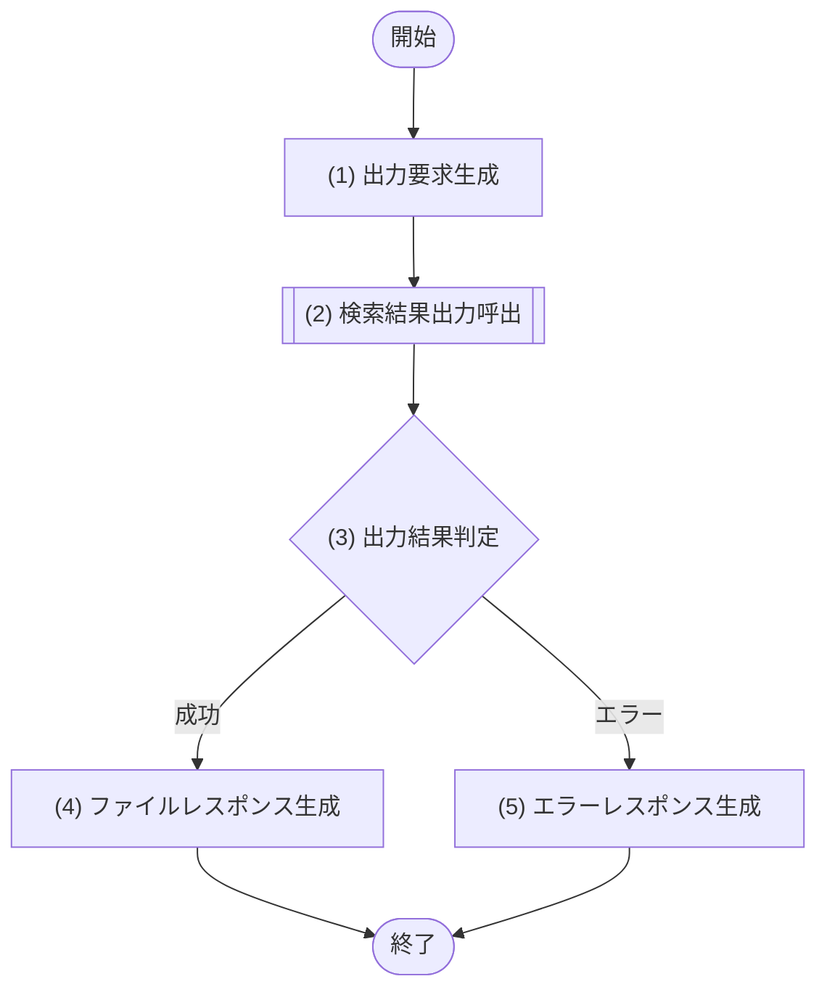

### 5.20.6 処理詳細

| No | 処理名 | 種別 | 処理詳細 | 呼出先公開IF・論理処理名 | 引数・参照値 | 結果変換 |
|---:|---|---|---|---|---|---|
| 1 | 出力要求生成 | 境界 | 認証主体、検索条件、形式と、未知・重複を除外済みのfieldsを論理要求へ設定する。fields省略時は標準5項目順、指定時は要求順を保持する | - | 認証主体、body、traceId | 検索結果出力要求 |
| 2 | 検索結果出力呼出 | モジュール呼出 | 出力権限、閲覧範囲、許可項目、件数上限、ファイル生成、監査を委譲する | M-002/IF-09 検索結果出力 | (1)の要求 | ファイル・件数または業務エラー |
| 3 | 出力結果判定 | 判定 | (2)の結果を判定する | - | (2)の結果 | 成功は(4)、エラーは(5) |
| 4 | ファイルレスポンス生成 | 境界 | M-002が[fields出力定義](05_API設計.md#52021-fields出力定義)の対応で生成した指定順ヘッダー・行をCSVまたはXLSXのファイル本体とHTTPヘッダーへ変換する | - | (2)の成功結果 | [レスポンス項目](05_API設計.md#5203-レスポンス項目)のレスポンス |
| 5 | エラーレスポンス生成 | 境界 | 権限・0件・上限超過等をHTTPエラーへ変換する | - | (2)のエラー、traceId | [エラー定義](05_API設計.md#5207-エラー定義)のHTTPエラー |

### 5.20.7 エラー定義

| HTTP | エラーコード | 発生元 | 発生条件 | API境界の処理 |
|---:|---|---|---|---|
| 400 | VALIDATION_ERROR | API境界 | 検索条件・形式が不正、またはfieldsが未知・重複 | 共通形式へ変換 |
| 401 | UNAUTHENTICATED | API境界 | 認証情報が無効 | 共通形式へ変換 |
| 403 | FORBIDDEN | M-002/IF-09 | 出力権限がない、または許可外項目を指定 | 共通形式へ変換 |
| 404 | EXPORT_TARGET_EMPTY | M-002/IF-09 | 出力対象が0件 | 共通形式へ変換 |
| 413 | EXPORT_LIMIT_EXCEEDED | M-002/IF-09 | 出力対象が10,000件を超える | 条件の絞り込みを要求 |
| 500 | INTERNAL_ERROR | API境界 / M-002/IF-09 | 想定外の内部異常 | 内部情報を隠して変換 |

## 5.21 API-019 利用者アカウント発行

### 5.21.1 基本情報

| 項目 | 内容 |
|---|---|
| API-ID / API名 | API-019 / 利用者アカウント発行 |
| Method / Path | POST `/api/users` |
| 目的 | 外部認証主体・対応社員の一意性を確認したうえで、利用者アカウントを利用可能な状態で発行する |
| 実行権限 | システム管理者 |
| トレース元 | F-015 / UC-015（SP-1） |
| 呼出モジュール | M-002/IF-13 利用者アカウント管理 |
| 冪等性 / 正常応答 | なし（外部認証主体・対応社員の一意制約で二重発行防止） / 201 Created |

### 5.21.2 リクエスト項目

| 項目名 | 場所 | 型 | 必須 | 説明・制約 |
|---|---|---|---|---|
| loginId | body | string | Yes | 社内認証基盤上の外部認証主体の識別子。1〜255文字。システム内で一意 |
| employeeId | body | string | No | 対応社員ID。在籍中の社員だけを指定可。社員と紐付かない社員外管理者のアカウントは省略する |

ロールは発行時に割り当てず、API-017（UC-012）で割り当てるまで未割当のままとする。

### 5.21.3 レスポンス項目

| 項目名 | 場所 | 型 | 必須 | 説明 |
|---|---|---|---|---|
| userId | body | string | Yes | 発行した利用者ID |
| loginId | body | string | Yes | 外部認証主体の識別子 |
| employeeId | body | string | No | 対応社員ID。未指定で発行した場合は省略 |
| active | body | boolean | Yes | 利用状態。発行時は常にtrue |
| version | body | integer | Yes | 初期版数 |
| createdAt | body | string(date-time) | Yes | 発行日時 |

### 5.21.4 バリデーション

| No | 対象 | 検証内容 | 違反時エラー |
|---:|---|---|---|
| 1 | loginId | 必須、文字列、1〜255文字 | VALIDATION_ERROR |
| 2 | employeeId | 指定時はID形式。存在・在籍中の判定はモジュールで行う | VALIDATION_ERROR |

### 5.21.5 処理フロー

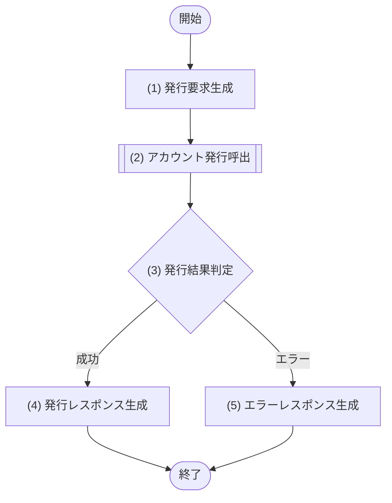

### 5.21.6 処理詳細

| No | 処理名 | 種別 | 処理詳細 | 呼出先公開IF・論理処理名 | 引数・参照値 | 結果変換 |
|---:|---|---|---|---|---|---|
| 1 | 発行要求生成 | 境界 | 認証主体、相関ID、入力項目から操作区分を発行とした論理要求を生成する | - | 認証主体、body、traceId | アカウント発行要求 |
| 2 | アカウント発行呼出 | モジュール呼出 | 管理権限、外部認証主体・対応社員の一意性、対応社員の存在・在籍中を検証し、利用可能な状態での登録（ロール未割当）と監査を委譲する | M-002/IF-13 利用者アカウント管理 | (1)の要求 | 発行アカウントまたは業務エラー |
| 3 | 発行結果判定 | 判定 | (2)の結果を判定する | - | (2)の結果 | 成功は(4)、エラーは(5) |
| 4 | 発行レスポンス生成 | 境界 | 発行結果を201レスポンスへ変換する | - | (2)の成功結果 | [レスポンス項目](05_API設計.md#5213-レスポンス項目)のレスポンス |
| 5 | エラーレスポンス生成 | 境界 | 権限・重複・対応社員不正等をHTTPエラーへ変換する | - | (2)のエラー、traceId | [エラー定義](05_API設計.md#5217-エラー定義)のHTTPエラー |

### 5.21.7 エラー定義

| HTTP | エラーコード | 発生元 | 発生条件 | API境界の処理 |
|---:|---|---|---|---|
| 400 | VALIDATION_ERROR | API境界 | リクエスト形式が不正 | 共通形式へ変換 |
| 401 | UNAUTHENTICATED | API境界 | 認証情報が無効 | 共通形式へ変換 |
| 403 | FORBIDDEN | M-002/IF-13 | アカウント管理権限がない | 共通形式へ変換 |
| 409 | ACCOUNT_DUPLICATE | M-002/IF-13 | 外部認証主体または対応社員に既存の利用者アカウントが存在する | 共通形式へ変換 |
| 409 | ACCOUNT_EMPLOYEE_INVALID | M-002/IF-13 | 指定した対応社員が存在しない、または在籍中でない | employeeIdの項目エラーへ変換 |
| 500 | INTERNAL_ERROR | API境界 / M-002/IF-13 | 想定外の内部異常 | 内部情報を隠して変換 |

## 5.22 API-020 利用者アカウント利用状態更新

### 5.22.1 基本情報

| 項目 | 内容 |
|---|---|
| API-ID / API名 | API-020 / 利用者アカウント利用状態更新 |
| Method / Path | PUT `/api/users/{userId}/status` |
| 目的 | 対象利用者アカウントの利用状態を、利用停止（無効）または再有効化（有効）へ版数条件付きで変更する |
| 実行権限 | システム管理者 |
| トレース元 | F-015 / UC-015（SP-2） |
| 呼出モジュール | M-002/IF-13 利用者アカウント管理 |
| 冪等性 / 正常応答 | なし（versionで二重反映防止） / 200 OK |

### 5.22.2 リクエスト項目

| 項目名 | 場所 | 型 | 必須 | 説明・制約 |
|---|---|---|---|---|
| userId | path | string | Yes | 対象利用者ID |
| operation | body | string | Yes | `SUSPEND`（利用停止） / `REACTIVATE`（再有効化） |
| version | body | integer | Yes | 取得時版数 |

### 5.22.3 レスポンス項目

| 項目名 | 場所 | 型 | 必須 | 説明 |
|---|---|---|---|---|
| userId | body | string | Yes | 対象利用者ID |
| employeeId | body | string | No | 対応社員ID。社員と紐付かないアカウントは省略 |
| active | body | boolean | Yes | 更新後利用状態。`SUSPEND`はfalse、`REACTIVATE`はtrue |
| version | body | integer | Yes | 更新後版数 |
| updatedAt | body | string(date-time) | Yes | 更新日時 |

### 5.22.4 バリデーション

| No | 対象 | 検証内容 | 違反時エラー |
|---:|---|---|---|
| 1 | userId / version | 必須、ID形式、versionは1以上 | VALIDATION_ERROR |
| 2 | operation | 許可値のいずれか | VALIDATION_ERROR |

### 5.22.5 処理フロー

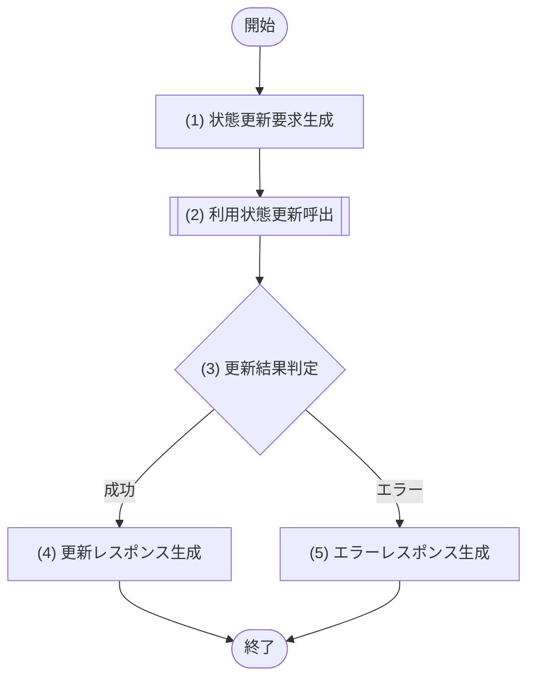

### 5.22.6 処理詳細

| No | 処理名 | 種別 | 処理詳細 | 呼出先公開IF・論理処理名 | 引数・参照値 | 結果変換 |
|---:|---|---|---|---|---|---|
| 1 | 状態更新要求生成 | 境界 | 認証主体、利用者ID、操作区分、版数から論理要求を生成する | - | 認証主体、path、body、traceId | 利用状態更新要求 |
| 2 | 利用状態更新呼出 | モジュール呼出 | 管理権限、対象アカウントの存在、版数を検証し、操作区分に応じた利用状態の変更（利用停止は無効、再有効化は有効）と監査を委譲する。利用停止後は以後のログイン（API-010）が拒否される | M-002/IF-13 利用者アカウント管理 | (1)の要求 | 更新後アカウントまたは業務エラー |
| 3 | 更新結果判定 | 判定 | (2)の結果を判定する | - | (2)の結果 | 成功は(4)、エラーは(5) |
| 4 | 更新レスポンス生成 | 境界 | 更新後の利用状態を200へ変換する | - | (2)の成功結果 | [レスポンス項目](05_API設計.md#5223-レスポンス項目)のレスポンス |
| 5 | エラーレスポンス生成 | 境界 | 権限・不存在・競合等をHTTPエラーへ変換する | - | (2)のエラー、traceId | [エラー定義](05_API設計.md#5227-エラー定義)のHTTPエラー |

### 5.22.7 エラー定義

| HTTP | エラーコード | 発生元 | 発生条件 | API境界の処理 |
|---:|---|---|---|---|
| 400 | VALIDATION_ERROR | API境界 | リクエスト形式が不正 | 共通形式へ変換 |
| 401 | UNAUTHENTICATED | API境界 | 認証情報が無効 | 共通形式へ変換 |
| 403 | FORBIDDEN | M-002/IF-13 | アカウント管理権限がない | 共通形式へ変換 |
| 404 | ACCOUNT_NOT_FOUND | M-002/IF-13 | 対象の利用者アカウントが存在しない | 共通形式へ変換 |
| 409 | UPDATE_CONFLICT | M-002/IF-13 | version不一致 | 最新情報の再取得を要求 |
| 500 | INTERNAL_ERROR | API境界 / M-002/IF-13 | 想定外の内部異常 | 内部情報を隠して変換 |

## 5.23 API-021 退職予定取消

### 5.23.1 基本情報

| 項目 | 内容 |
|---|---|
| API-ID / API名 | API-021 / 退職予定取消 |
| Method / Path | DELETE `/api/employees/{employeeId}/retirement` |
| 目的 | 未到来の退職予定（退職日・退職区分）を取消し、在籍中の状態と現所属を継続する |
| 実行権限 | 人事担当者 |
| トレース元 | F-007 / UC-004（ALT-2・SP-3） |
| 呼出モジュール | M-002/IF-06 退職受付 |
| 冪等性 / 正常応答 | なし（versionで二重反映防止） / 200 OK |

### 5.23.2 リクエスト項目

| 項目名 | 場所 | 型 | 必須 | 説明・制約 |
|---|---|---|---|---|
| employeeId | path | string | Yes | 対象社員ID |
| version | query | integer | Yes | 対象社員の取得時版数。DELETEはボディを持たないためクエリで受け付ける |

### 5.23.3 レスポンス項目

| 項目名 | 場所 | 型 | 必須 | 説明 |
|---|---|---|---|---|
| employeeId | body | string | Yes | 対象社員ID |
| status | body | string | Yes | `ACTIVE`（在籍継続） |
| canceledRetirementDate | body | string(date) | Yes | 取消した退職予定の退職日 |
| canceledRetirementTypeCode | body | string | No | 取消した退職区分。予定に未設定だった場合は省略。返却時は[共通区分定義](02_機能要件.md#24-共通区分定義)の許可値 |
| version | body | integer | Yes | 更新後版数 |
| updatedAt | body | string(date-time) | Yes | 取消日時 |

### 5.23.4 バリデーション

| No | 対象 | 検証内容 | 違反時エラー |
|---:|---|---|---|
| 1 | employeeId | 必須かつID形式 | VALIDATION_ERROR |
| 2 | version | 必須かつ1以上の整数 | VALIDATION_ERROR |

### 5.23.5 処理フロー

```mermaid
flowchart TD
  Start([開始]) --> P1["(1) 取消要求生成"] --> P2[["(2) 退職予定取消呼出"]] --> D1{"(3) 取消結果判定"}
  D1 -- "成功" --> P3["(4) 取消レスポンス生成"] --> End([終了])
  D1 -- "エラー" --> E1["(5) エラーレスポンス生成"] --> End
```

### 5.23.6 処理詳細

| No | 処理名 | 種別 | 処理詳細 | 呼出先公開IF・論理処理名 | 引数・参照値 | 結果変換 |
|---:|---|---|---|---|---|---|
| 1 | 取消要求生成 | 境界 | 認証主体、社員ID、版数から操作区分を退職予定取消とした論理要求を生成する | - | 認証主体、path、query、traceId | 退職予定取消要求 |
| 2 | 退職予定取消呼出 | モジュール呼出 | 退職処理権限、在籍状態、退職日未到来の退職予定の存在、版数を検証し、退職予定（退職日・退職区分）の取消、履歴・監査を委譲する。社員状態と現所属は変更せず在籍を継続する | M-002/IF-06 退職受付 | (1)の要求 | 取消結果または業務エラー |
| 3 | 取消結果判定 | 判定 | (2)の結果を判定する | - | (2)の結果 | 成功は(4)、エラーは(5) |
| 4 | 取消レスポンス生成 | 境界 | 取消結果と継続する在籍状態を200へ変換する | - | (2)の成功結果 | [レスポンス項目](05_API設計.md#5233-レスポンス項目)のレスポンス |
| 5 | エラーレスポンス生成 | 境界 | 権限・不存在・予定なし・競合等をHTTPエラーへ変換する | - | (2)のエラー、traceId | [エラー定義](05_API設計.md#5237-エラー定義)のHTTPエラー |

### 5.23.7 エラー定義

| HTTP | エラーコード | 発生元 | 発生条件 | API境界の処理 |
|---:|---|---|---|---|
| 400 | VALIDATION_ERROR | API境界 | リクエスト形式が不正 | 共通形式へ変換 |
| 401 | UNAUTHENTICATED | API境界 | 認証情報が無効 | 共通形式へ変換 |
| 403 | FORBIDDEN | M-002/IF-06 | 退職処理権限がない | 共通形式へ変換 |
| 404 | EMPLOYEE_NOT_FOUND | M-002/IF-06 | 対象社員が存在しない | 共通形式へ変換 |
| 404 | RETIREMENT_PLAN_NOT_FOUND | M-002/IF-06 | 対象社員に退職日未到来の退職予定が登録されていない | 共通形式へ変換 |
| 409 | EMPLOYEE_ALREADY_RETIRED | M-002/IF-06 | 対象社員が退職済み | 共通形式へ変換 |
| 409 | UPDATE_CONFLICT | M-002/IF-06 | version不一致 | 最新情報の再取得を要求 |
| 500 | INTERNAL_ERROR | API境界 / M-002/IF-06 | 想定外の内部異常 | 内部情報を隠して変換 |

## 5.24 API-022 将来異動予約取消

### 5.24.1 基本情報

| 項目 | 内容 |
|---|---|
| API-ID / API名 | API-022 / 将来異動予約取消 |
| Method / Path | DELETE `/api/employees/{employeeId}/assignments/future` |
| 目的 | 未適用の将来所属予約を取消し、現所属の終了予約を解除して現所属を継続する |
| 実行権限 | 人事担当者 |
| トレース元 | F-006 / UC-003（ALT-2・SP-3） |
| 呼出モジュール | M-002/IF-05 社員異動 |
| 冪等性 / 正常応答 | なし（versionで二重反映防止） / 200 OK |

### 5.24.2 リクエスト項目

| 項目名 | 場所 | 型 | 必須 | 説明・制約 |
|---|---|---|---|---|
| employeeId | path | string | Yes | 対象社員ID |
| version | query | integer | Yes | 対象社員の取得時版数。DELETEはボディを持たないためクエリで受け付ける |

### 5.24.3 レスポンス項目

| 項目名 | 場所 | 型 | 必須 | 説明 |
|---|---|---|---|---|
| employeeId | body | string | Yes | 対象社員ID |
| assignmentId | body | string | Yes | 継続する現所属の所属履歴ID |
| organizationId / positionId | body | string | Yes | 継続する現所属の組織・役職ID |
| managerEmployeeId | body | string | No | 継続する現所属の上長ID。上長未設定時は省略 |
| effectiveFrom | body | string(date) | Yes | 現所属の適用開始日 |
| effectiveTo | body | string(date) | No | 現所属の適用終了日。終了予約の解除により無期限となるため省略 |
| version | body | integer | Yes | 更新後版数 |
| updatedAt | body | string(date-time) | Yes | 取消日時 |

### 5.24.4 バリデーション

| No | 対象 | 検証内容 | 違反時エラー |
|---:|---|---|---|
| 1 | employeeId | 必須かつID形式 | VALIDATION_ERROR |
| 2 | version | 必須かつ1以上の整数 | VALIDATION_ERROR |

### 5.24.5 処理フロー

```mermaid
flowchart TD
  Start([開始]) --> P1["(1) 取消要求生成"] --> P2[["(2) 将来異動予約取消呼出"]] --> D1{"(3) 取消結果判定"}
  D1 -- "成功" --> P3["(4) 取消レスポンス生成"] --> End([終了])
  D1 -- "エラー" --> E1["(5) エラーレスポンス生成"] --> End
```

### 5.24.6 処理詳細

| No | 処理名 | 種別 | 処理詳細 | 呼出先公開IF・論理処理名 | 引数・参照値 | 結果変換 |
|---:|---|---|---|---|---|---|
| 1 | 取消要求生成 | 境界 | 認証主体、社員ID、版数から操作区分を将来異動予約取消とした論理要求を生成する | - | 認証主体、path、query、traceId | 将来異動予約取消要求 |
| 2 | 将来異動予約取消呼出 | モジュール呼出 | 異動権限、在籍状態、未適用の将来所属予約の存在、版数を検証し、将来所属予約の取消、現所属の終了予約解除、履歴・監査を一つの原子更新として委譲する | M-002/IF-05 社員異動 | (1)の要求 | 継続する現所属または業務エラー |
| 3 | 取消結果判定 | 判定 | (2)の結果を判定する | - | (2)の結果 | 成功は(4)、エラーは(5) |
| 4 | 取消レスポンス生成 | 境界 | 継続する現所属を200へ変換する | - | (2)の成功結果 | [レスポンス項目](05_API設計.md#5243-レスポンス項目)のレスポンス |
| 5 | エラーレスポンス生成 | 境界 | 権限・不存在・予約なし・競合等をHTTPエラーへ変換する | - | (2)のエラー、traceId | [エラー定義](05_API設計.md#5247-エラー定義)のHTTPエラー |

### 5.24.7 エラー定義

| HTTP | エラーコード | 発生元 | 発生条件 | API境界の処理 |
|---:|---|---|---|---|
| 400 | VALIDATION_ERROR | API境界 | リクエスト形式が不正 | 共通形式へ変換 |
| 401 | UNAUTHENTICATED | API境界 | 認証情報が無効 | 共通形式へ変換 |
| 403 | FORBIDDEN | M-002/IF-05 | 異動権限がない | 共通形式へ変換 |
| 404 | EMPLOYEE_NOT_FOUND | M-002/IF-05 | 対象社員が存在しない | 共通形式へ変換 |
| 404 | FUTURE_ASSIGNMENT_NOT_FOUND | M-002/IF-05 | 対象社員に未適用の将来所属予約が存在しない | 共通形式へ変換 |
| 409 | EMPLOYEE_ALREADY_RETIRED | M-002/IF-05 | 対象社員が退職済み | 共通形式へ変換 |
| 409 | UPDATE_CONFLICT | M-002/IF-05 | version不一致 | 最新情報の再取得を要求 |
| 500 | INTERNAL_ERROR | API境界 / M-002/IF-05 | 想定外の内部異常 | 内部情報を隠して変換 |
