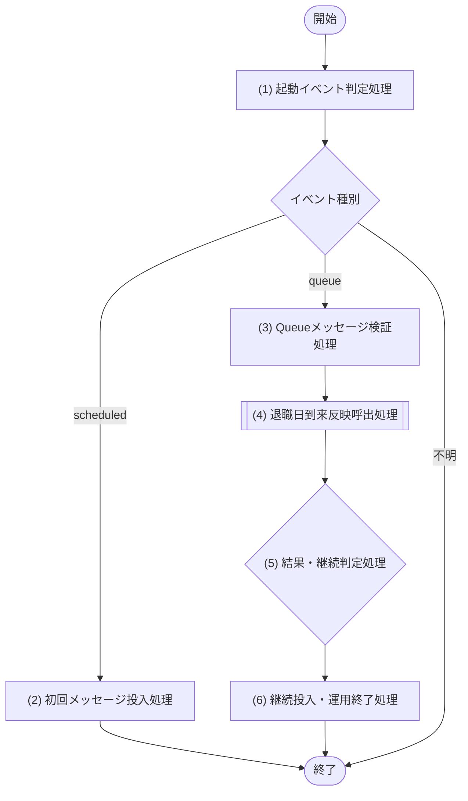

[← 設計書一覧（社員名簿管理システム）](README.md)

# 6. JOB設計

**目次**

- [6.1 JOB設計方針](#61-job設計方針)
- [6.2 JOB一覧](#62-job一覧)
- [6.3 JOB-001 退職日到来反映](#63-job-001-退職日到来反映)

## 6.1 JOB設計方針

- JOBの存在・正式名称は[JOB一覧](06_JOB設計.md#62-job一覧)を構成上の正本とし、本章は「Cron Trigger→scheduledハンドラー→Queues→queueハンドラー→JOB-001→M-002」の接続順、イベント、メッセージ、ハンドラー処理を詳細化する。
- JOB-001は本番のCloudflare Workers Paidで実行する。Cron Triggerを受ける`scheduled`ハンドラーは初回メッセージをCloudflare Queuesへ投入するだけとし、`queue`ハンドラーはメッセージ検証後にJOB-001本体を1回呼ぶ。JOB-001本体がM-002/IF-07へ40社員以下の1チャンクを委譲する。
- `scheduled`・`queue`の両ハンドラーからD1 Binding `env.DB`、永続化層、物理データ構造、Prepared Statement、`batch()`、トランザクションAPIへ直接アクセスすることを禁止する。
- データの抽出・更新はM-002 社員管理アプリケーションの公開処理へ委譲する。`queue`ハンドラーは1メッセージにつきJOB-001本体を1回、JOB-001本体はM-002/IF-07を1回だけ呼び、いずれも社員単位のループを持たない。
- M-002は最大40社員を1チャンクとして処理し、M-006だけがD1の参照とmutation batchを実行する。M-002はページを連続取得せず、後続対象がある場合はJOBへ次カーソルを返す。
- 1 Worker invocationのD1実行文数を900以下とする。Paidプラン上限1000に対して100を予約し、M-006が`batch()`内の各文、参照、再試行、結果確認、監査追記をすべて実測する。
- Queue consumerは`max_batch_size=1`、`max_concurrency=1`、`max_retries=3`とする。規定回数後も失敗するメッセージは専用Dead Letter Queue（DLQ）へ移送する。
- Queueはat-least-once配信として扱う。Cron再送、Queue重複配信、継続メッセージ投入後の応答断を許容し、M-002の未反映条件とM-006の社員versionガードで二重反映を防ぐ。
- 復旧はQueueの再配信またはDLQメッセージを同一内容で再投入して行う。基準日、カーソル、件数を任意変更する手動JOB起動経路は設けない。

## 6.2 JOB一覧

| JOB-ID | JOB名 | 目的 | 起動契機 | 呼出モジュール |
|---|---|---|---|---|
| JOB-001 | 退職日到来反映 | 未来日付で登録された退職予定を、退職日到来後に分割して退職状態へ反映する | Cron Triggerによる初回Queue投入、Cloudflare Queuesによるチャンク実行・再配信 | M-002/IF-07（`queue`経路だけ） |

## 6.3 JOB-001 退職日到来反映

### 6.3.1 基本情報

| 項目 | 内容 |
|---|---|
| JOB-ID | JOB-001 |
| JOB名 | 退職日到来反映 |
| 目的 | 未来日付で登録された退職予定を、基準日の到来後に社員状態、退職日に有効な所属の終了、後続将来所属の取消、変更履歴へ整合して反映する |
| トレース元 | F-014 / UC-014（起点: F-007 / UC-004/SP-2） |
| 実行基盤 | Cloudflare Workers Paidの`scheduled`ハンドラーおよび`queue`ハンドラー |
| 起動契機 | Cron Triggerで初回メッセージを投入し、後続対象がある間はQueueメッセージを連鎖投入する。失敗時はQueue再配信、規定回数後はDLQへ移送する |
| スケジュール | Cron式`15 15 * * *`（UTC 15:15 = Asia/Tokyo 翌日00:15） |
| 業務タイムゾーン | Asia/Tokyo。Cron式と`scheduledTime`はUTCとして扱い、基準日だけをAsia/Tokyoへ変換する |
| チャンク上限 | 1メッセージ当たり40社員。変更不可の固定値とする |
| D1実行文予算 | 1 `queue` invocation当たり900文。D1 Paid上限1000に対し100文を予約する |
| 重複実行 | 排他ロックに依存せず重複を許容する。未反映条件と社員versionガードを同じmutation batchへ組み込み、業務更新と変更履歴の二重反映を防ぐ |
| 呼出モジュール | M-002/IF-07 退職日到来反映 |

### 6.3.2 起動イベント・Queueメッセージ

`scheduled`経路の入力はCloudflareが付与する値だけを使用する。

| 項目名 | データ型 | 必須 | 生成元・検証 | 用途 |
|---|---|---|---|---|
| `controller.cron` | String | Yes | `15 15 * * *`との完全一致 | 想定したCron Triggerであることの確認 |
| `scheduledTime` | Integer | Yes | Cloudflareが付与するUTC Epoch milliseconds | Asia/Tokyoの基準日とチェーン実行IDの生成 |

初回・継続・再配信で同一のQueueメッセージ形式を使用する。

| 項目名 | データ型 | 必須 | 値・検証 | 用途 |
|---|---|---|---|---|
| `schemaVersion` | Integer | Yes | `1`固定 | メッセージ互換性の確認 |
| `chainRunId` | String | Yes | `JOB-001:<businessDate>:<scheduledTime>`を同一Cronイベントから決定的に生成。1〜100文字 | 同一日次チェーンの論理実行識別とログ相関 |
| `businessDate` | String | Yes | `YYYY-MM-DD`、Asia/Tokyoの実行日以下 | この日以前の退職予定を対象にする |
| `cursor` | Object / null | Yes | 初回は`null`。継続時は`retirementDate`と`employeeId`を持つ直前チャンクの次位置 | 安定キーによる後続取得 |
| `chunkNo` | Integer | Yes | 初回`1`、継続時は直前値+1、1以上 | チャンク順序と監視 |

QueueのCloudflareメタデータである`message.id`、`attempts`、`timestamp`も構造化ログへ記録するが、業務判定やD1のキーには使用しない。メッセージにバッチサイズ、再試行回数、任意の基準日上書きは持たせない。

### 6.3.3 処理対象

| 対象 | 抽出条件 | 除外条件 | 並び順 | 処理単位 |
|---|---|---|---|---|
| 退職予定社員 | 在籍中、退職日設定済み、退職日が基準日以前、カーソルより後 | 退職済み、退職日未設定、基準日より後 | 退職日昇順、社員ID昇順 | M-002内部で最大40社員。41件目は後続有無の判定だけに使用 |

### 6.3.4 処理フロー

### 6.3.5 処理詳細

#### (1) 起動イベント判定処理

Workerの入口でイベントを`scheduled`または`queue`に分類する。`scheduled`は(2)、`queue`は(3)へ進む。その他のイベント、Queue bindingの不一致、1回のMessageBatchに2件以上含まれる構成違反はM-002を呼び出さず例外終了し、設定不整合を通知する。どの分岐でもD1 Bindingを参照しない。

#### (2) 初回メッセージ投入処理

`controller.cron`を検証し、`scheduledTime`をAsia/Tokyoへ変換して`businessDate`を確定する。`schemaVersion=1`、同一Cronイベントなら常に同じ`JOB-001:<businessDate>:<scheduledTime>`となる`chainRunId`、`cursor=null`、`chunkNo=1`の初回メッセージを作成する。Queue Producer Bindingへの投入Promiseを直接`await`し、投入成功を確認してから`scheduled` invocationを終了する。投入失敗時は失敗を通知し、業務モジュールやD1を呼ばず例外終了する。必須投入を`ctx.waitUntil()`へ退避しない。

#### (3) Queueメッセージ検証処理

Queue consumerは受信した1メッセージのスキーマ、型、長さ、日付、`chunkNo`、カーソルの複合項目を検証する。`businessDate`がAsia/Tokyoの現在業務日より未来、`schemaVersion`が未対応、またはカーソルが不完全なら`PERMANENT_MESSAGE_ERROR`として失敗記録後に`ack()`し、再配信ループを止めて運用通知する。システム都合で検証できない場合だけ`retry()`とする。

#### (4) 退職日到来反映呼出処理

M-002/IF-07を1回だけ呼び出す。JOBは対象社員を取得せず、社員単位ループ、D1実行、トランザクション、即時再試行を行わない。

| M-ID | IF-ID | 処理名 |
|---|---|---|
| M-002 | IF-07 | 退職日到来反映 |

| 引数項目 | 値 |
|---|---|
| 業務日 | メッセージ.`businessDate` |
| チェーン実行ID | メッセージ.`chainRunId` |
| チャンク番号 | メッセージ.`chunkNo` |
| QueueメッセージID | Cloudflareメタデータ.`message.id`（追跡専用） |
| カーソル | メッセージ.`cursor` |
| チャンク上限 | `40`固定 |
| D1実行文予算 | `900`固定 |

| 結果項目 | データ型 | 契約 |
|---|---|---|
| 対象件数 | Integer | 0〜40。実際に処理判定した社員数 |
| 成功件数 | Integer | 退職確定に成功した件数 |
| スキップ件数 | Integer | 競合・既反映等により安全に無変更とした件数 |
| 失敗件数 | Integer | 業務上の恒久エラーとして分類した件数 |
| 失敗対象一覧 | Object[] | 社員ID・エラー分類・試行回数だけ。個人情報を含めず最大40件 |
| 後続有無 | Boolean | 41件目が存在する場合だけ`true` |
| 次カーソル | Object / null | 後続ありの場合は処理判定した最後の退職日・社員ID、後続なしの場合は`null` |
| D1実行文数 | Integer | M-006が当該invocationで実行した全D1文数。0〜900 |

M-002の公開例外は通常結果と混在させず、次のとおり扱う。

| M-002公開例外 | 発生条件 | retryable | JOBの扱い |
|---|---|---|---|
| `VALIDATION_ERROR` | JOB検証後もM-002の防御的入力検証で不正を検出 | No | `PERMANENT_MESSAGE_ERROR`として契約不整合を通知し、後続処理を行わず現メッセージを`ack()` |
| `DATA_ACCESS_ERROR` | 過負荷、タイムアウト、CPU・メモリ制約、実行文予算超過、再試行可能なD1一時障害 | Yes | エラー分類を記録し、正常結果として扱わず現メッセージを`retry()` |

M-002は対象取得1文に加え、1社員について参照、最大3回のmutation batch試行、結果不明時の確認参照、監査追記を含む保守的上限を21文として予約する。`1 + 21 × 40 = 841`文であり、内部予算900以内に収まる。M-006は`batch()`内の各Prepared Statementも1文として加算し、次社員の開始前に21文を予約できなければ`TRANSIENT_INFRASTRUCTURE_ERROR`を返し、M-002がretryable属性付き`DATA_ACCESS_ERROR`へ変換する。JOBはM-006の計数器へアクセスせず、M-002の公開結果だけを検証する。

書込みの即時再試行はM-006内だけで行い、D1が再試行推奨として公開する次のエラー分類だけを対象とし、初回に加えて最大2回とする。M-002はM-006が返す論理分類に従うだけで、自ら即時再試行を判断しない。

| 再試行対象エラー |
|---|
| `D1 DB reset because its code was updated.` |
| `Internal error while starting up D1 DB storage caused object to be reset.` |
| `Network connection lost.` |
| `Internal error in D1 DB storage caused object to be reset.` |
| `Cannot resolve D1 DB due to transient issue on remote node.` |

M-006は待機にexponential backoff + full jitterを用い、追加試行1回目は0〜500ms、2回目は0〜1000msから無作為に選ぶ。書込み送信後に結果が不明な場合は、M-006が現在状態とversionを再読込みしてcommit確認する。意図した状態・versionならコミット済み成功、事前状態なら未反映として再試行、どちらでもなければ競合とし、いずれもM-006が論理分類してM-002へ返す。過負荷、タイムアウト、CPU、メモリ、実行文予算超過はM-006が社員単位で即時再試行せず`TRANSIENT_INFRASTRUCTURE_ERROR`を返し、M-002がretryableな`DATA_ACCESS_ERROR`へ変換してQueueの遅延再配信へ委ねる。

#### (5) 結果・継続判定処理

M-002が`VALIDATION_ERROR`を返した場合は恒久エラー、retryableな`DATA_ACCESS_ERROR`を返した場合は再配信とし、通常結果が返った場合だけ次の順で公開結果を検証する。

| 判定順 | 条件 | 判定 |
|---|---|---|
| 1 | M-002がretryableな`DATA_ACCESS_ERROR`を返す、結果を返さない、D1実行文数が900超、または公開結果の型が不正 | 現メッセージを再配信 |
| 2 | 対象件数が0〜40でない、各件数が負、`対象件数 ≠ 成功件数 + スキップ件数 + 失敗件数`、または失敗一覧件数が不一致 | 契約違反として現メッセージを再配信 |
| 3 | 後続ありで次カーソルがない、または次カーソルが入力カーソル以下 | 契約違反として現メッセージを再配信 |
| 4 | 結果正常かつ後続あり | 継続メッセージ投入 |
| 5 | 結果正常かつ後続なし | チェーン完了 |

公開結果の契約が正常で失敗件数が1件以上の場合は、当該社員を運用通知して処理済み位置を前進させる。業務エラーでチェーン全体を繰り返さず、未反映の対象は次回の日次チェーンでも再評価される。

#### (6) 継続投入・運用終了処理

後続ありの場合は`schemaVersion`、`chainRunId`、`businessDate`を維持し、`cursor=次カーソル`、`chunkNo=入力+1`としたメッセージを同じQueueへ投入する。投入成功後だけ現メッセージを`ack()`する。投入後の応答断で現メッセージが再配信されても、M-002/M-006の冪等条件で二重反映を防ぐ。

後続なしの場合はチェーン完了を記録して`ack()`する。再配信判定の場合はエラー分類、`chainRunId`、`chunkNo`、`message.id`、試行回数を記録して`retry()`する。Cloudflare Queuesの初回配信後3回の再試行でも成功しない場合はDLQへ移送し、運用者は原因を是正してメッセージ本文を変更せず再投入する。

### 6.3.6 トランザクション・冪等性・排他

| 項目 | 設計 |
|---|---|
| トランザクション境界 | M-002/IF-07が社員1件単位の論理境界を宣言し、M-006がversion・未反映状態・上長逆参照条件付きD1 mutation batchで退職確定、所属終了、将来取消、変更履歴を実行する。JOBはD1 Bindingやトランザクションを扱わない |
| 原子性 | mutation batchのいずれかの文またはSQLite制約・トリガーが失敗した場合はD1が当該社員分を全ロールバックする。先頭ガード0件時は後続文も無変更となる条件をM-006が強制する |
| 冪等性 | 未反映条件と社員versionガード、および業務更新と変更履歴を同一mutation batchに含めることで保証する。成功済み社員はCron再送・Queue重複・DLQ再投入でも二重更新・二重履歴にならない |
| 排他 | Worker間ロックやプロセス内排他に依存しない。Queueの`max_concurrency=1`は負荷平準化に使い、正しさはD1条件付き更新で保証する |
| 結果不明 | 書込み後の通信断では必ずM-006経由で状態・versionを再確認し、コミット済みを再更新しない |

### 6.3.7 Queue構成・エラー・監視

| 観点 | 設計 |
|---|---|
| Queue Producer | `scheduled`・`queue`ハンドラーだけにQueue Producer Bindingを付与する。DB権限とは分離する |
| Queue Consumer | `max_batch_size=1`、`max_concurrency=1`、`max_retries=3`。1 MessageBatchでM-002呼出しは最大1回 |
| DLQ | JOB-001専用DLQを指定し、滞留1件以上で即時通知する。再投入時はメッセージ本文を変更しない |
| 一時障害 | [処理詳細](06_JOB設計.md#635-処理詳細)(4)の許可リストだけをM-006内で即時再試行する。それ以外の基盤障害はQueue再配信へ委ねる |
| 恒久業務エラー | 社員ID・エラー分類・試行回数だけを記録し、チャンク内の次社員へ進む。氏名、メール、電話番号をログへ出力しない |
| 再開位置 | メッセージの退職日・社員IDカーソルから再開する。失敗社員は次回日次チェーンの未反映抽出でも再評価する |
| 監視メトリクス | 初回投入成否、Queue遅延、配信試行回数、DLQ件数、チャンク所要時間、対象・成功・スキップ・失敗件数、後続有無、D1実行文数 |
| アラート条件 | Cron初回投入失敗、契約違反、失敗件数1以上、Queue再試行、DLQ滞留、D1実行文数900到達、`queue` invocation 12分超、日次チェーン開始・完了の欠落 |
| 運用ログ | `chainRunId`、`chunkNo`、`message.id`、基準日、開始/終了日時、件数、失敗対象ID、エラー分類、D1実行文数を構造化して記録する |
