[← 設計書一覧（社員名簿管理システム）](README.md)

# 7. モジュール設計

社員名簿管理システムを構成する M-001〜M-008 の責務、依存関係、公開インターフェース、内部フロー、原子更新境界、競合制御を詳細設計レベルで定義する。バックエンドはCloudflare Workers Paid、データベースはCloudflare D1（SQLite互換）、非同期基盤はCloudflare Queuesとする。API・JOBからのデータベース直接アクセスを禁止し、Workerの`env.DB` D1 bindingとDB実行をM-006に一元化する。モジュールの存在・正式名称・上位からの接続順は§7.1・§7.2を構成上の正本とし、本章は責務・公開IF・内部処理を詳細化する。

## 7.1 論理モジュール構成

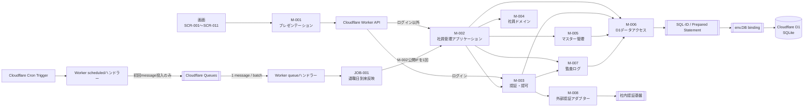

## 7.2 モジュール責務

| モジュールID | モジュール名 | 主な責務 | 担当しないこと |
|---|---|---|---|
| M-001 | プレゼンテーション | 画面表示、入力受付、API 呼び出し、API 応答の画面状態への反映、クライアント内認証状態の破棄 | 業務判定、認可の最終判定、モジュール直接呼び出し、DB/SQL/TBL 参照、サーバー側トークン失効 |
| M-002 | 社員管理アプリケーション | ログイン以外の業務ユースケース制御、原子更新プランの論理境界宣言、下位モジュールの調停 | SQL 実行、`env.DB`参照、D1ステートメント生成、画面表示、外部認証基盤呼び出し |
| M-003 | 認証・認可 | ログイン制御、操作権限・閲覧範囲・ロール割当妥当性の判定 | 社員業務データ更新、SQL 実行、外部認証基盤への直接接続 |
| M-004 | 社員ドメイン | 登録・更新・異動・退職に関する業務状態・期間・版数の判定 | HTTP 制御、認可判断、SQL 実行、DB 接続 |
| M-005 | マスター管理 | 組織・役職の取得、有効性・重複・更新可否の判定 | ユースケース全体制御、SQL 実行、DB 接続 |
| M-006 | D1データアクセス | Worker D1 bindingによる全DBアクセス、原子更新、結果の論理形式への変換 | 業務ルール、認可、画面制御、外部認証 |
| M-007 | 監査ログ | 監査イベントの生成、記録要否・記録項目の決定、M-006 への保存委譲 | DB 直接保存、SQL 実行、業務データ更新 |
| M-008 | 外部認証アダプター | 社内認証基盤の呼び出し、外部応答の内部認証結果への変換 | 業務認可の最終判定、DB 接続、SQL 実行 |

## 7.3 依存・データアクセスルール

1. 画面はM-001だけを呼び、M-001はCloudflare Worker APIだけを呼び出す。画面・M-001から業務モジュール、SQL、データベース、テーブルを直接参照しない。
2. API はログイン以外を M-002、ログインを M-003 にだけ委譲する。API から M-004〜M-008 を直接呼び出さない。
3. JOB は M-002 にだけ委譲する。JOB から M-003〜M-008、SQL、データベースを直接呼び出さない。
4. API・JOB の設計書および実装には SQL-ID、TBL-ID、テーブル物理名、SQL 文、DB 接続情報を持たせない。
5. Worker の`env.DB` D1 bindingとD1実行APIを扱えるのはM-006だけとする。API・JOB・M-001〜M-005・M-007・M-008にbindingやDB実行結果を渡さない。
6. SQL-ID を記載できるのは M-006 の処理詳細だけとする。M-001〜M-005・M-007・M-008 は M-006 の公開 IF を呼び出す。
7. M-007 は監査イベントを生成するが、永続化は M-006 に委譲する。監査ログ用の別 DB・ストアにも直接接続しない。
8. M-008 だけが社内認証基盤を直接呼び出せる。M-003 は M-008 を経由する。
9. M-002は所有者の要求version、期待更新対象ID集合、業務更新、履歴を一つの原子更新プランとしてM-006へ渡す。DB上のガード構成・実行順・取消はM-006が隠蔽する。
10. 依存は上位から下位への一方向とし、循環依存を禁止する。取得・更新処理と、その結果を評価する判定処理は別ノードにする。

## 7.4 公開インターフェース一覧

| モジュール | IF ID | 公開機能名 | 呼出元 | 処理種別 |
|---|---|---|---|---|
| M-001 | IF-01 | 画面初期表示 | 画面ルーター | 表示制御 |
| M-001 | IF-02 | API 要求送信 | 画面イベント | 制御 |
| M-001 | IF-03 | API 応答反映 | API クライアント | 表示制御 |
| M-001 | IF-04 | ログアウト | 共通ヘッダー・認証失効制御 | 制御 |
| M-002 | IF-01 | 社員検索 | API | 参照 |
| M-002 | IF-02 | 社員詳細参照 | API | 参照 |
| M-002 | IF-03 | 社員登録 | API | 更新 |
| M-002 | IF-04 | 社員基本情報更新 | API | 更新 |
| M-002 | IF-05 | 社員異動 | API | 更新 |
| M-002 | IF-06 | 退職受付 | API | 更新 |
| M-002 | IF-07 | 退職日到来反映 | JOB | 更新 |
| M-002 | IF-08 | 変更履歴参照 | API | 参照 |
| M-002 | IF-09 | 検索結果出力 | API | 参照 |
| M-002 | IF-10 | 組織管理 | API | 更新 |
| M-002 | IF-11 | 役職管理 | API | 更新 |
| M-002 | IF-12 | ロール管理 | API | 更新 |
| M-003 | IF-01 | ログイン | API | 外部連携 |
| M-003 | IF-02 | 操作権限確認 | M-002 | 判定 |
| M-003 | IF-03 | 閲覧可能範囲取得 | M-002 | 参照 |
| M-003 | IF-04 | ロール割当妥当性判定 | M-002 | 判定 |
| M-004 | IF-01 | 社員登録条件判定 | M-002 | 判定 |
| M-004 | IF-02 | 社員更新可否判定 | M-002 | 判定 |
| M-004 | IF-03 | 異動期間整合性判定 | M-002 | 判定 |
| M-004 | IF-04 | 退職日区分判定 | M-002 | 判定 |
| M-005 | IF-01 | 組織一覧取得 | M-002 | 参照 |
| M-005 | IF-02 | 役職一覧取得 | M-002 | 参照 |
| M-005 | IF-03 | マスター有効性判定 | M-002 | 判定 |
| M-005 | IF-04 | 組織更新可否判定 | M-002 | 判定 |
| M-005 | IF-05 | 役職更新可否判定 | M-002 | 判定 |
| M-006 | IF-01 | 社員検索 | M-002 | 参照 |
| M-006 | IF-02 | 社員検索件数取得 | M-002 | 参照 |
| M-006 | IF-03 | 社員詳細取得 | M-002 | 参照 |
| M-006 | IF-04 | 社員一意性確認 | M-002 | 参照 |
| M-006 | IF-05 | 社員登録（TX-001合成） | M-002 | 更新 |
| M-006 | IF-08 | 社員基本情報更新（TX-002合成） | M-002 | 更新 |
| M-006 | IF-09 | 基準日所属・上長参照所属取得 | M-002 | 参照 |
| M-006 | IF-11 | 退職予定登録（TX-004合成） | M-002 | 更新 |
| M-006 | IF-12 | 到来退職対象取得 | M-002 | 参照 |
| M-006 | IF-13 | 退職確定（TX-005合成） | M-002 | 更新 |
| M-006 | IF-14 | 社員変更履歴一覧取得 | M-002 | 参照 |
| M-006 | IF-15 | 社員変更履歴件数取得 | M-002 | 参照 |
| M-006 | IF-16 | 組織一覧取得 | M-003・M-005 | 参照 |
| M-006 | IF-17 | 組織取得 | M-005 | 参照 |
| M-006 | IF-18 | 組織コード重複確認 | M-005 | 参照 |
| M-006 | IF-19 | 組織登録 | M-002 | 更新 |
| M-006 | IF-20 | 組織更新 | M-002 | 更新 |
| M-006 | IF-21 | 役職一覧取得 | M-005 | 参照 |
| M-006 | IF-22 | 役職取得 | M-005 | 参照 |
| M-006 | IF-23 | 役職コード重複確認 | M-005 | 参照 |
| M-006 | IF-24 | 役職登録 | M-002 | 更新 |
| M-006 | IF-25 | 役職更新 | M-002 | 更新 |
| M-006 | IF-26 | 認証利用者・ロール取得 | M-003 | 参照 |
| M-006 | IF-27 | 有効ロール一覧取得 | M-002・M-003 | 参照 |
| M-006 | IF-28 | 社員ロール取得 | M-002・M-003 | 参照 |
| M-006 | IF-31 | 監査ログ登録 | M-007 | 更新 |
| M-006 | IF-32 | 出力用社員検索 | M-002 | 参照 |
| M-006 | IF-33 | 社員利用者取得 | M-002 | 参照 |
| M-006 | IF-34 | 社員異動（TX-003合成） | M-002 | 更新 |
| M-006 | IF-35 | ロール割当更新（TX-008合成） | M-002 | 更新 |
| M-007 | IF-01 | 操作監査記録 | M-002・M-003 | 更新 |
| M-008 | IF-01 | 外部認証 | M-003 | 外部連携 |

## 7.5 M-001 プレゼンテーション

### 7.5.1 モジュール概要

| 項目 | 内容 |
|---|---|
| モジュールID | M-001 |
| 目的 | 画面入力を API 要求へ変換し、API 応答を画面状態へ反映し、ログアウト時はクライアント内認証状態を安全に破棄する |
| 主な呼出元 | 画面ルーター、画面イベント、API クライアント |
| 呼出可能先 | API のみ |
| 状態保持 | 画面表示中に限る入力値・処理中状態・表示メッセージ、ブラウザータブ内メモリだけに保持するアクセストークンと検証済み戻り先 |

### 7.5.2 公開インターフェース詳細

| IF | 概要 | 入力 | 出力 | 例外 |
|---|---|---|---|---|
| M-001/IF-01 画面初期表示 | 初期値・選択肢・権限に応じて画面状態を生成する | 画面ID、利用者コンテキスト、遷移引数 | 初期画面状態 | SCREEN_INITIALIZE_FAILED |
| M-001/IF-02 API要求送信 | 入力を検証し、対応 API へ一度だけ送信する | 画面ID、イベントID、入力値 | 要求受付状態 | CLIENT_VALIDATION_ERROR、REQUEST_IN_PROGRESS |
| M-001/IF-03 API応答反映 | API 応答を成功・業務エラー・システムエラー状態へ変換する | 画面ID、イベントID、API応答 | 次画面状態 | RESPONSE_MAPPING_FAILED |
| M-001/IF-04 ログアウト | 進行中要求、認証状態、戻り先、画面内個人情報を破棄して未認証状態へ収束する | 起動契機（明示／認証失効／終了・再読込） | SCR-010への未認証画面状態 | なし（破棄を再実行して安全側へ収束） |

### 7.5.3 処理フロー

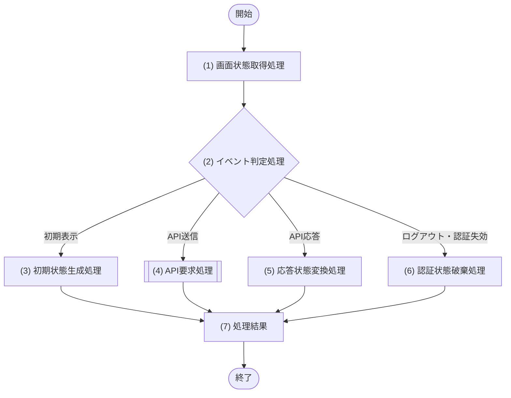

### 7.5.4 処理詳細

| No | 処理名 | 対象IF | 処理内容 |
|---:|---|---|---|
| 1 | 画面状態取得処理 | IF-01〜04 | 入力された画面IDの現在状態を取得する。モジュール・DB・SQLは参照しない |
| 2 | イベント判定処理 | IF-01〜04 | 呼出契機を初期表示・API送信・API応答・ログアウト/認証失効に分類する |
| 3 | 初期状態生成処理 | IF-01 | 画面定義と遷移引数から初期画面状態を生成する。初期データが必要な場合は後続で API を呼ぶ |
| 4 | API要求処理 | IF-02 | クライアント側入力チェック後、対応 API を呼び、応答待ち中は同一イベントを無効化する |
| 5 | 応答状態変換処理 | IF-03 | HTTP結果とエラーコードを画面状態・MSG-ID・遷移先へ変換する |
| 6 | 認証状態破棄処理 | IF-04 | 新規操作を無効化して進行中要求を取消し、メモリ上のアクセストークン・検証済み戻り先・画面内個人情報を破棄する。新規APIや他モジュールを呼ばず、二重実行も同じ未認証状態へ収束させる |
| 7 | 処理結果 | IF-01〜04 | 生成した画面状態、要求受付状態、またはSCR-010への未認証画面状態を返す |

### 7.5.5 トランザクション・排他制御

| 項目 | 内容 |
|---|---|
| トランザクション | なし |
| 排他制御 | API 応答待ち中は同一イベントの再送を禁止する |
| 冪等性 | 初期表示・応答反映・ログアウトは冪等。ログアウトの二重押下や認証失効後の再実行は同じ未認証状態へ収束する。更新 API の冪等性は各 API の契約に従う |

## 7.6 M-002 社員管理アプリケーション

### 7.6.1 モジュール概要

| 項目 | 内容 |
|---|---|
| モジュールID | M-002 |
| 目的 | ログイン以外の全業務ユースケースを進行制御し、認可・業務判定・データアクセス・監査を調停する |
| 主な呼出元 | API、JOB |
| 呼出可能先 | M-003、M-004、M-005、M-006、M-007 |
| 状態保持 | なし。処理中のコンテキストは呼出単位で保持する |

### 7.6.2 公開インターフェース詳細

| IF | 概要 | 入力 | 出力 | 例外 | 原子性・競合・冪等性 |
|---|---|---|---|---|---|
| IF-01 社員検索 | 閲覧範囲内の社員を条件・ページ指定で検索し一覧と総件数を返す | 実行者、検索条件、ページ条件 | 社員一覧、総件数 | FORBIDDEN | 参照のみ |
| IF-02 社員詳細参照 | 存在確認後に閲覧範囲と権限で項目をマスクした社員詳細を返す | 実行者、社員ID | 権限でマスク済みの社員詳細 | FORBIDDEN、EMPLOYEE_NOT_FOUND | 参照のみ |
| IF-03 社員登録 | 権限・入力・重複・マスター有効性を検証し社員・初期所属・履歴を1原子更新で登録する | 実行者、社員基本情報、初期所属（組織ID・役職IDのみ） | 登録社員（createdAtを含む） | FORBIDDEN、VALIDATION_ERROR、EMPLOYEE_NUMBER_DUPLICATED、EMAIL_DUPLICATED、MASTER_NOT_ACTIVE | 社員・所属・変更履歴を一つの原子更新プラン |
| IF-04 社員基本情報更新 | 楽観ロックで基本情報を正規化・差分更新し履歴を同一原子更新で追記する | 実行者、社員ID、版数、更新内容（phoneNumberの値または明示NULLを含む） | 更新社員、updatedFields、updatedAt | FORBIDDEN、VALIDATION_ERROR、EMPLOYEE_NOT_FOUND、UPDATE_CONFLICT、EMAIL_DUPLICATED | 楽観ロック、原子更新プラン |
| IF-05 社員異動 | 楽観ロックで基準日所属終了・将来所属取消・新所属登録を1原子更新で行う | 実行者、社員ID、版数、異動内容 | 更新後所属 | FORBIDDEN、EMPLOYEE_NOT_FOUND、EMPLOYEE_ALREADY_RETIRED、UPDATE_CONFLICT、MASTER_NOT_ACTIVE、ASSIGNMENT_PERIOD_CONFLICT、INVALID_TRANSFER_DATE | 楽観ロック、原子更新プラン |
| IF-06 退職受付 | 退職日区分に応じ退職予定登録または即時退職確定を原子更新で行う | 実行者、社員ID、版数、退職日、退職区分（任意・NULL可） | 退職結果または退職予定 | FORBIDDEN、VALIDATION_ERROR、EMPLOYEE_NOT_FOUND、EMPLOYEE_ALREADY_RETIRED、UPDATE_CONFLICT、INVALID_RETIREMENT_DATE | 楽観ロック、原子更新プラン |
| IF-07 退職日到来反映 | JOBチャンクで到来退職者を1名単位に退職確定する | 業務日、chainRunId、chunkNo、messageId（追跡専用）、カーソル、statementBudget=900、固定maxItems=40 | 対象件数、成功・スキップ・失敗件数、失敗対象、hasMore、nextCursor、statementCount/queryCount | VALIDATION_ERROR、DATA_ACCESS_ERROR（retryable） | Queueメッセージ1件につき1チャンク、最大40名。chainRunId+chunkNoを論理実行識別子とする |
| IF-08 変更履歴参照 | 権限確認後に社員の変更履歴を条件・ページ指定で取得する | 実行者、社員ID、日時範囲、変更種別、ページ条件 | 履歴一覧、総件数 | FORBIDDEN、EMPLOYEE_NOT_FOUND | 参照のみ |
| IF-09 検索結果出力 | 閲覧範囲内の社員をCSV/XLSXへ出力し監査を分離記録する | 実行者、検索条件、出力項目、出力形式（CSV/XLSX） | 出力データ、件数、ファイル名、媒体種別 | VALIDATION_ERROR、FORBIDDEN、EXPORT_TARGET_EMPTY、EXPORT_LIMIT_EXCEEDED | 参照のみ、監査は分離 |
| IF-10 組織管理 | 組織の一覧参照と登録・更新・無効化を操作区分で実行する | 実行者、操作区分(一覧/登録/更新/無効化)、基準日、無効含有、組織内容 | 組織一覧、またはcreatedAt/updatedAtを含む組織 | FORBIDDEN、ORGANIZATION_NOT_FOUND、ORGANIZATION_CODE_DUPLICATED、ORGANIZATION_HIERARCHY_CONFLICT、MASTER_PERIOD_INVALID、UPDATE_CONFLICT | 一覧は参照、更新系は原子更新プラン |
| IF-11 役職管理 | 役職の一覧参照と登録・更新・無効化を操作区分で実行する | 実行者、操作区分(一覧/登録/更新/無効化)、基準日、無効含有、役職内容 | 役職一覧、またはcreatedAt/updatedAtを含む役職 | FORBIDDEN、POSITION_NOT_FOUND、POSITION_CODE_DUPLICATED、MASTER_PERIOD_INVALID、UPDATE_CONFLICT | 一覧は参照、更新系は原子更新プラン |
| IF-12 ロール管理 | ロール一覧・社員別割当の参照と割当更新を実行する | 実行者、操作区分（一覧/社員別取得/更新）、対象社員、ロール割当、適用日、要求版数 | ロール一覧または社員ロール割当結果 | FORBIDDEN、EMPLOYEE_NOT_FOUND、USER_ACCOUNT_NOT_FOUND、USER_ACCOUNT_INACTIVE、ROLE_NOT_ACTIVE、ROLE_ASSIGNMENT_PERIOD_CONFLICT、UPDATE_CONFLICT | 参照または原子更新プラン |

M-002の全原子更新（TX-001〜TX-005・TX-008）で変更履歴を含める場合は、合成公開IFの内部構成SQL（社員変更履歴登録）を通じ、§7.6.10の`change_summary schemaVersion=1`論理契約で生成する。変更前後の実値・個人情報・自由記述を含めず、変更された論理項目の`fieldCode`と`operation`だけを記録する。

### 7.6.3 IF-01 社員検索

#### 処理フロー

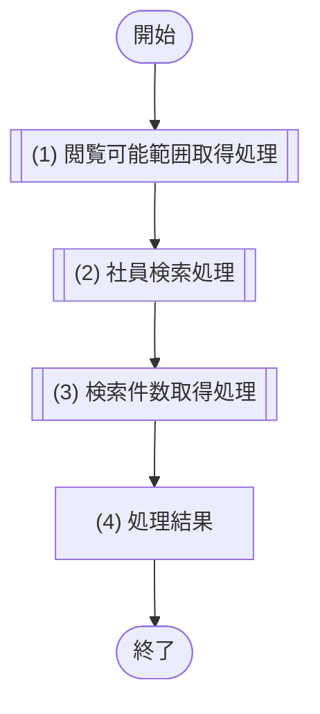

#### 処理詳細

| No | 処理名 | 呼出先 | 処理内容 |
|---:|---|---|---|
| 1 | 閲覧可能範囲取得処理 | M-003/IF-03 | `参照目的=EMPLOYEE_LIST`、`asOfDate=業務日`、`業務日`を渡し、実行者の`scopeType`、`actorEmployeeId`、`allowedOrganizationIds`、返却可能一覧項目を取得する |
| 2 | 社員検索処理 | M-006/IF-01 | status省略時は`ACTIVE`、`ALL`明示指定時だけ条件なし(null)へ正規化する。employeeNumber・nameはUnicode trim/NFC後のリテラル検索条件として渡す。部分一致と大文字小文字同一視はM-006公開IF契約へ委譲し、M-002ではDB表現へ変換しない。業務日固定の閲覧条件で取得する |
| 3 | 検索件数取得処理 | M-006/IF-02 | (2)と同じstatus既定値・同じ正規化済みリテラル検索条件・閲覧条件で総件数を取得する |
| 4 | 処理結果 | - | 権限で許可された項目だけを一覧・ページ情報として返す |

| 項目 | 内容 |
|---|---|
| トランザクション | 参照のみ。明示トランザクションなし |
| 排他・冪等性 | 排他なし、同一条件で冪等 |

### 7.6.4 IF-02 社員詳細参照

#### 処理フロー

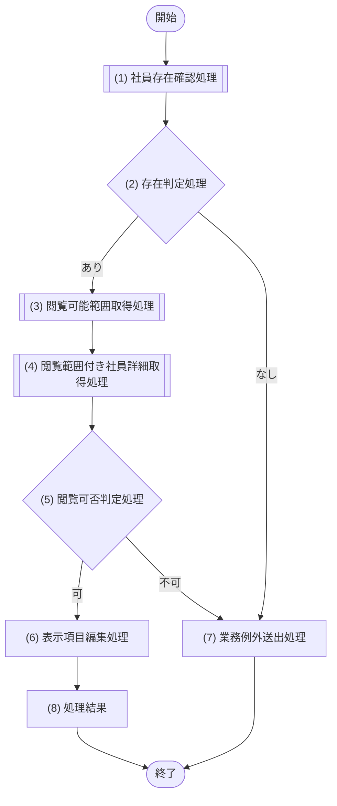

#### 処理詳細

| No | 処理名 | 呼出先 | 処理内容 |
|---:|---|---|---|
| 1 | 社員存在確認処理 | M-006/IF-03 | 社員ID、`scopeType=ALL`、`allowedOrganizationIds=[]`、`actorEmployeeId=NULL`、`asOfDate=業務日`を渡して存在だけを確認する。取得行の個人項目は参照・返却せず、存在真偽へ変換した直後に取得結果を破棄する |
| 2 | 存在判定処理 | - | (1)が0行なら対象社員は不存在と判定し、(7)へ進む。1行なら(3)へ進む |
| 3 | 閲覧可能範囲取得処理 | M-003/IF-03 | `参照目的=EMPLOYEE_DETAIL`、`asOfDate=業務日`、`業務日`で、実行者が参照できる社員範囲と返却可能項目を取得する |
| 4 | 閲覧範囲付き社員詳細取得処理 | M-006/IF-03 | 社員ID、(3)の`scopeType`、`actorEmployeeId`、`allowedOrganizationIds`、`asOfDate`をすべて渡して社員詳細を再取得する |
| 5 | 閲覧可否判定処理 | - | (4)が0行なら、存在するが閲覧範囲外と判定して(7)へ進む。1行なら(6)へ進む |
| 6 | 表示項目編集処理 | - | `HR`・`SYSTEM_ADMIN`は全項目、`DEPARTMENT_MANAGER`はemployeeId・employeeNumber・fullName・organization・position・manager・status・versionだけ、`EMPLOYEE`は本人SELFの場合だけ全項目を返す。複数ロール時は許可項目の和集合とし、不許可項目は取得結果から除去して応答・ログへ出さない |
| 7 | 業務例外送出処理 | - | (2)で不存在ならEMPLOYEE_NOT_FOUND、(5)で閲覧範囲外ならFORBIDDENを送出する |
| 8 | 処理結果 | - | 権限でマスク済みの社員詳細を返す |

| 項目 | 内容 |
|---|---|
| トランザクション | 参照のみ |
| 排他・冪等性 | 排他なし、冪等 |

### 7.6.5 IF-03 社員登録

#### 処理フロー

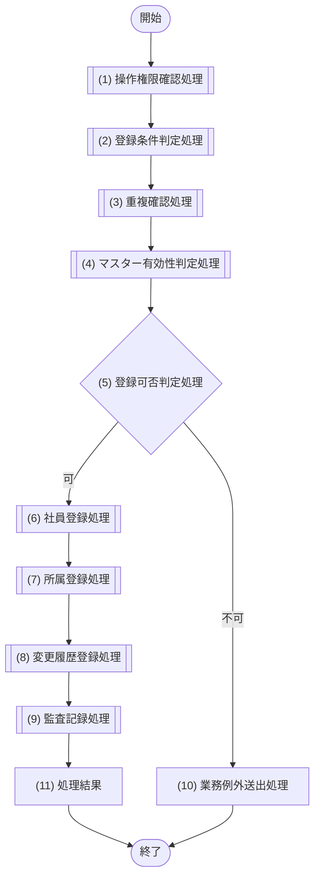

#### 処理詳細

| No | 処理名 | 呼出先 | 処理内容 |
|---:|---|---|---|
| 1 | 操作権限確認処理 | M-003/IF-02 | 社員登録権限を確認する |
| 2 | 登録条件判定処理 | M-004/IF-01 | 原子更新プランの業務境界を宣言する。`employeeNumber`は半角英数字だけの1〜20文字であることをM-002で再検証する。lastName・firstNameをUnicode前後空白trim → NFC → 空文字拒否 → 1〜100文字再検証 → 形式検証の順で正規化し、カナも提供時は同順で空文字・長さ・全角カナ形式を検証する。`employmentTypeCode`も§2.4の列挙で再検証する。そのうえで初期所属期間を`effectiveFrom=hireDate`、`effectiveTo=NULL`、`managerEmployeeId=NULL`として自動生成し、入社日・初期状態・生成期間の業務条件を判定する。公開入力にeffectiveFromまたはmanagerEmployeeIdが含まれる場合は未知項目として拒否する |
| 3 | 重複確認処理 | M-006/IF-04 | (2)の正規化済み社員番号・メールアドレスの重複状態を取得する |
| 4 | マスター有効性判定処理 | M-005/IF-03 | (3)で重複がない場合だけ、初期所属の組織ID・役職IDが入社日時点で有効か判定する |
| 5 | 登録可否判定処理 | - | 権限→入力・業務条件→社員番号/メール重複→マスター有効性の順で結果を評価し、同時に複数条件が不成立でも最初の公開エラーだけを返す。すべて成立した場合だけ登録可能と判定する |
| 6 | 社員登録処理 | M-006/IF-05 | 検証済み社員情報・初期所属・登録履歴を単一の合成公開IF（TX-001）へ渡し、1回の原子更新として依頼する。phoneNumberは未登録（NULL）とする |
| 7 | 所属登録処理 | - | (6)の合成公開IF（TX-001）が、組織ID・役職IDと(2)で自動生成した`effectiveFrom=hireDate`、`effectiveTo=NULL`、`managerEmployeeId=NULL`の初期所属を同一原子更新の内部で登録する。マスター期間と期間重複はM-006の論理結果で最終確認する |
| 8 | 変更履歴登録処理 | - | (6)の合成公開IF（TX-001）が、登録社員version=1を条件に§7.6.10のREGISTER履歴を同一原子更新の内部で追記する。全構成の成功時だけ確定する |
| 9 | 監査記録処理 | M-007/IF-01 | 業務更新成功後、登録操作の監査記録を依頼する |
| 10 | 業務例外送出処理 | - | 権限違反はFORBIDDEN、固定コード列挙外・初期所属期間等の業務入力違反はVALIDATION_ERROR、社員番号重複はEMPLOYEE_NUMBER_DUPLICATED、メール重複はEMAIL_DUPLICATED、無効マスターはMASTER_NOT_ACTIVEへ変換して送出する |
| 11 | 処理結果 | - | 登録社員ID・社員番号・状態・版数に加え、M-006/IF-05が返した`createdAt`をAPI-003の`createdAt`として返す |

| 項目 | 内容 |
|---|---|
| 原子性 | (6)〜(8)を一つの論理更新プランとし、部分成功を許さない。DB実行方式はM-006に隠蔽する |
| 排他制御 | 要求versionとM-006の原子更新結果で競合を検出する。§7.10.5に従いM-006が即時再試行可能な論理一時障害だけ原子更新のbatch全体を初回後最大2回再試行し、一意性違反は重複例外へ変換する。M-002はM-006の分類結果に従う。監査は別依頼 |
| 冪等性 | なし。社員番号・メールアドレスの重複で再登録を防止 |

### 7.6.6 IF-04 社員基本情報更新

#### 処理フロー

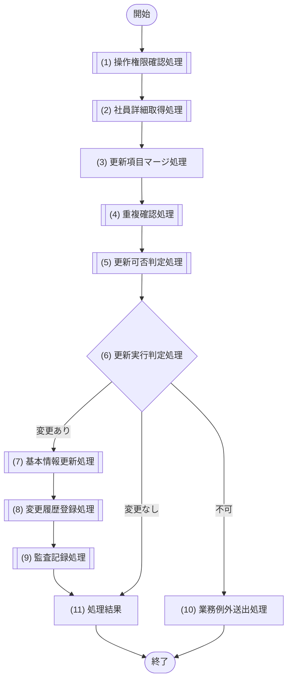

#### 処理詳細

| No | 処理名 | 呼出先 | 処理内容 |
|---:|---|---|---|
| 1 | 操作権限確認処理 | M-003/IF-02 | `HR`は氏名・カナ・email・phoneNumber・employmentTypeCode、`EMPLOYEE`は本人のemail・phoneNumberだけを許可する。`HR`時は`scopeType=ALL`、`actorEmployeeId=NULL`、`allowedOrganizationIds=[]`、本人更新時は`scopeType=SELF`、`actorEmployeeId=実行者.employeeId`、`allowedOrganizationIds=[]`とし、いずれも`asOfDate=業務日`を返す。`DEPARTMENT_MANAGER`・`SYSTEM_ADMIN`単独および許可外項目は拒否する |
| 2 | 社員詳細取得処理 | M-006/IF-03 | 社員IDと(1)の`scopeType`、`actorEmployeeId`、`allowedOrganizationIds`、`asOfDate`をすべて渡し、現在の社員情報・版数・更新日時を取得する |
| 3 | 更新項目マージ処理 | - | lastName・firstNameはUnicode前後空白trim → NFC → 空文字拒否 → 1〜100文字再検証 → 形式検証、カナの文字列も同順で空文字・長さ・全角カナ形式を検証する。カナ消去は明示nullだけを許可する。要求に存在しない項目は(2)の現値を保持し、`phoneNumber`は前後空白除去後1〜30文字・許可文字を検証しNULLを解除として保持する。`employmentTypeCode`も列挙を再検証する。すべての正規化・検証後に現値と比較して`updatedFields`を生成し、その差分だけを履歴生成対象とする |
| 4 | 重複確認処理 | M-006/IF-04 | (3)の入力形式が妥当な場合だけ、変更後メールの他社員との重複を確認する |
| 5 | 更新可否判定処理 | M-004/IF-02 | (4)で重複がない場合だけ、在籍状態・更新可能項目・要求版数の整合を判定する |
| 6 | 更新実行判定処理 | - | 公開エラーは認可→入力形式・業務入力→メール重複→versionの順で評価し、同時に複数条件が不成立でも最初の1件だけを返す。(1)〜(5)の結果から不許可・変更あり・変更なしを判定し、正規化後の`updatedFields`が空なら(7)〜(9)を実行せず(11)へ進む |
| 7 | 基本情報更新処理 | M-006/IF-08 | 要求versionとマージ済み全項目、BASIC_UPDATE履歴を単一の合成公開IF（TX-002）へ渡し、1回の原子更新として依頼して更新社員・更新日時を取得する |
| 8 | 変更履歴登録処理 | - | (7)の合成公開IF（TX-002）が、BASIC_UPDATE履歴を同一原子更新の内部で追記する |
| 9 | 監査記録処理 | M-007/IF-01 | 更新成功後に監査記録を依頼する |
| 10 | 業務例外送出処理 | - | 権限・更新禁止項目はFORBIDDEN、入力形式・固定コード列挙外はVALIDATION_ERROR、不存在はEMPLOYEE_NOT_FOUND、変更後メールの重複はEMAIL_DUPLICATED、M-004のCONFLICTまたはM-006の更新0件はUPDATE_CONFLICTへ変換し、(6)の優先順で送出する |
| 11 | 処理結果 | - | 変更ありは更新後社員情報・版数・`updatedFields`・M-006/IF-08の`updatedAt`、変更なしは(2)の現在版数・更新日時と空の`updatedFields`をAPI-004へ返す |

| 項目 | 内容 |
|---|---|
| 原子性 | (7)〜(8)は一つの論理更新プラン、(9)は成功後に分離して依頼する |
| 排他制御 | 要求版数による楽観ロック。更新件数0は CONFLICT |
| 冪等性 | 同一版数の再実行は競合として更新しない |

### 7.6.7 IF-05 社員異動

#### 処理フロー

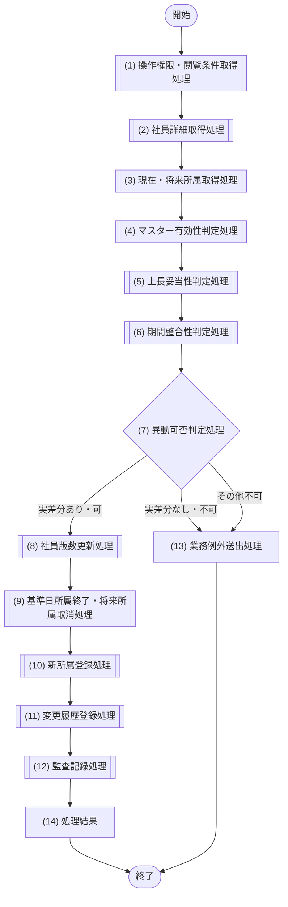

#### 処理詳細

| No | 処理名 | 呼出先 | 処理内容 |
|---:|---|---|---|
| 1 | 操作権限・閲覧条件取得処理 | M-003/IF-02、M-003/IF-03 | `HR`の社員異動権限を確認する。対象社員・指定上長の取得条件は`scopeType=ALL`、`actorEmployeeId=NULL`、`allowedOrganizationIds=[]`、対象ごとの基準日を返し、それ以外のロールだけならFORBIDDENとする |
| 2 | 社員詳細取得処理 | M-006/IF-03 | 対象社員ID、`scopeType=ALL`、`actorEmployeeId=NULL`、`allowedOrganizationIds=[]`、`asOfDate=業務日`を渡して存在・在籍状態・退職予定日・現在版数を取得する。不存在はEMPLOYEE_NOT_FOUND、退職済みはEMPLOYEE_ALREADY_RETIREDへ変換する |
| 3 | 現在・将来所属取得処理 | M-006/IF-09 | `closeDate=effectiveFrom-1日`を算出し、対象社員ID、`asOfDate=effectiveFrom`、`includeManagedAssignments=false`を渡す。異動日の直前日に有効な自所属と異動日以後に残る自所属を通常参照で取得し、前者1件を差分比較・終了対象、後者を置換対象として社員versionとともにスナップショット化する |
| 4 | マスター有効性判定処理 | M-005/IF-03 | 異動先組織・役職が異動日時点で有効か事前判定する。実行時はM-006の原子更新結果で同条件を最終確認する |
| 5 | 上長妥当性判定処理 | M-006/IF-03 | `managerEmployeeId`未指定時は省略する。指定時は対象社員自身でなく、入社済み、ACTIVE、`retirementDate IS NULL`を必須とする。新所属は終了日なしのため、異動日が退職予定日前でも退職予定済み上長を禁止する |
| 6 | 期間整合性判定処理 | M-004/IF-03 | 異動日が業務日・入社日以降かつ退職予定日以前であること、異動日の直前日に有効な自所属が一意であることを判定してその1件を実差分比較の正本とする。直前自所属の終了日がNULLまたはcloseDateより後なら終了更新対象、既にcloseDateなら比較専用、異動日以後に開始する自所属は論理取消対象として確定する |
| 7 | 異動可否判定処理 | - | 最初に(2)の現在版数と要求versionを比較し、不一致はUPDATE_CONFLICTとする。その後、権限・在籍状態・退職予定・組織/役職マスター・上長・期間の全条件を判定する。異動日の直前に有効な所属と、要求した組織ID・役職ID・上長社員IDをNULLも区別して比較し、3項目すべて同一なら実差分なしとしてVALIDATION_ERRORへ分岐する |
| 8 | 社員版数更新処理 | M-006/IF-34 | 要求version、異動日、(3)の期待所属ID集合、closeDate、新所属、ASSIGNMENT履歴を単一の合成公開IF（TX-003）へ渡し、1回の原子更新として所有者条件付きで依頼する |
| 9 | 基準日所属終了・将来所属取消処理 | - | (8)の合成公開IF（TX-003）が、closeDateと期待所属ID集合による基準日所属終了・将来所属取消を同一原子更新の内部で実行する |
| 10 | 新所属登録処理 | - | (8)の合成公開IF（TX-003）が、異動日開始・終了日NULLの新所属を同一原子更新の内部で登録する |
| 11 | 変更履歴登録処理 | - | (8)の合成公開IF（TX-003）が、ASSIGNMENT履歴を同一原子更新の内部で追記し、部分成功を許さない |
| 12 | 監査記録処理 | M-007/IF-01 | 異動成功後に監査記録を依頼する |
| 13 | 業務例外送出処理 | - | 実差分なしはVALIDATION_ERRORとし、定義済み業務エラーを送出する。M-006の原子更新失敗を公開エラーへ変換する |
| 14 | 処理結果 | - | 更新後所属と社員版数を返す |

| 項目 | 内容 |
|---|---|
| 原子性 | (3)〜(7)は参照・判定、(8)〜(11)は一つの論理更新プラン、(12)は業務更新成功後に分離して依頼する |
| 排他制御 | 社員要求version、更新対象ID集合、マスター・上長条件を論理更新プランに含めて競合を検出する。再試行分類はM-006の結果に従う |
| 冪等性 | 現所属と組織・役職・上長がすべて同一の要求はVALIDATION_ERRORとして更新・履歴・監査を行わない。変更後に同一旧版数で再実行した場合は競合 |

### 7.6.8 IF-06 退職受付

#### 処理フロー

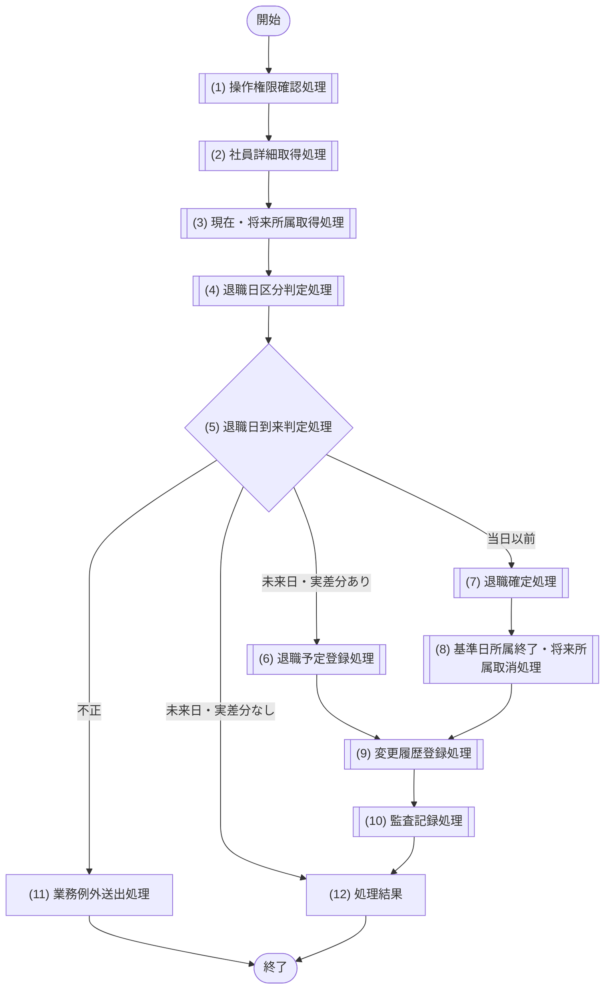

#### 処理詳細

| No | 処理名 | 呼出先 | 処理内容 |
|---:|---|---|---|
| 1 | 操作権限確認処理 | M-003/IF-02 | `HR`の退職処理権限を確認し、`scopeType=ALL`、`actorEmployeeId=NULL`、`allowedOrganizationIds=[]`、`asOfDate=業務日`の取得条件を確定する。それ以外のロールだけならFORBIDDENとする |
| 2 | 社員詳細取得処理 | M-006/IF-03 | 対象社員IDと(1)の`scopeType=ALL`、`actorEmployeeId=NULL`、`allowedOrganizationIds=[]`、`asOfDate=業務日`をすべて渡して存在・状態・入社日・現在の退職予定日・退職区分・版数を取得する。不存在はEMPLOYEE_NOT_FOUND、退職済みはEMPLOYEE_ALREADY_RETIREDへ変換する |
| 3 | 現在・将来所属取得処理 | M-006/IF-09 | 対象社員ID、`asOfDate=retirementDate`、`includeManagedAssignments=true`を渡し、自所属と退職日以後まで有効な部下所属を通常参照で取得する。終了対象は`effectiveFrom <= retirementDate <= effectiveTo`（終了日NULLは無期限）を満たす自所属だけとし、直前終了行を除外する。結果の自所属ID集合と部下参照件数を社員versionとともに原子更新プランの条件へ渡す |
| 4 | 退職日区分判定処理 | M-004/IF-04 | `retirementTypeCode`がNULL、または`VOLUNTARY` / `COMPANY` / `RETIREMENT_AGE` / `CONTRACT_END` / `OTHER`のいずれかであることをM-002で再検証したうえで、入社日、退職日に有効な自所属の一意性、未来/当日以前を判定する。退職日以後まで対象社員を上長として参照する部下所属が1件でもあれば、先に部下の異動・上長解除が必要としてINVALID_RETIREMENT_DATEとする。退職日より後の自所属は確定時の取消対象として許容する |
| 5 | 退職日到来判定処理 | - | 現在versionと要求versionが不一致ならUPDATE_CONFLICT。未来日の現在値と要求値が完全同一なら、(3)は参照だけなので原子更新プランを作らず(12)へ進む |
| 6 | 退職予定登録処理 | M-006/IF-11 | 要求version、退職予定、部下逆参照なしを所有者条件とする原子更新プランを依頼する |
| 7 | 退職確定処理 | M-006/IF-13 | 即時確定時、要求version、業務日、期待所属ID集合、closeDate、RETIREMENT_CONFIRMED履歴を単一の合成公開IF（TX-005）へ渡し、1回の原子更新として所有者条件付きで依頼する。予定受付は(6)のM-006/IF-11（TX-004）が担う |
| 8 | 基準日所属終了・将来所属取消処理 | - | 即時確定時、(7)の合成公開IF（TX-005）が、closeDateと期待所属ID集合による基準日所属終了・将来所属取消を同一原子更新の内部で実行する |
| 9 | 変更履歴登録処理 | - | 予定受付は(6)の合成公開IF（TX-004）がRETIREMENT_SCHEDULED履歴を、即時確定は(7)の合成公開IF（TX-005）がRETIREMENT_CONFIRMED履歴を、それぞれ同一原子更新の内部で追記する |
| 10 | 監査記録処理 | M-007/IF-01 | 退職受付の業務更新成功後に監査記録を依頼する |
| 11 | 業務例外送出処理 | - | 事前参照では更新取消処理は不要。M-006が原子更新失敗を返した場合は業務変更が未確定であることを前提に、固定コード列挙外をVALIDATION_ERROR、その他を定義済み業務エラーへ変換する |
| 12 | 処理結果 | - | 退職予定または退職確定の状態・版数を返す。未来日の完全同一再受付は現在の退職予定・状態・版数を正常な無更新結果として返す |

| 項目 | 内容 |
|---|---|
| 原子性 | (3)(4)は事前参照・判定。予定は(6)+(9)、即時は(7)〜(9)を一つの論理更新プランとし、監査は成功後に分離して依頼する |
| 排他制御 | 社員要求version、部下逆参照なし、対象ID集合を原子更新条件として競合を検出する。再試行は§7.10.5のallowlistに限定する |
| 冪等性 | 未来日の退職日・退職区分が現在の予定と完全同一なら正常な無更新とし、業務更新・履歴・監査を行わない。変更反映後に旧版数で異なる内容を再受付した場合は競合 |

### 7.6.9 IF-07 退職日到来反映

#### 処理フロー

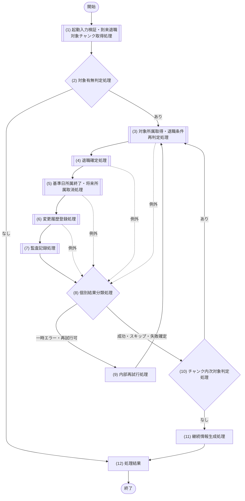

#### 処理詳細

| No | 処理名 | 呼出先 | 処理内容 |
|---:|---|---|---|
| 1 | 起動入力検証・到来退職対象チャンク取得処理 | M-006/IF-12 | chainRunId、chunkNo、statementBudget=900、業務日、両項目カーソルを検証し、maxItems=40で1回だけ呼ぶ。chainRunId+chunkNoを当該チャンクの論理実行識別子とし、messageIdは追跡にだけ使用する。先頭40件・hasMore・nextCursorを受け取り、同じinvocationで次ページを取得しない |
| 2 | 対象有無判定処理 | - | (1)の対象件数が1件以上か判定する |
| 3 | 対象所属取得・退職条件再判定処理 | M-006/IF-09、M-004/IF-04 | 対象社員ID、`asOfDate=退職予定日`、`includeManagedAssignments=true`を渡し、自所属群と退職日以後まで参照する部下所属を通常参照で取得する。終了対象は退職日当日に有効な自所属だけとし、直前終了行を除外する。部下所属が1件でもあればINVALID_RETIREMENT_DATE相当の非一時失敗とし、対象ID集合・件数・社員versionを後続の原子更新プランへ渡す |
| 4 | 退職確定処理 | M-006/IF-13 | 抽出時versionと期待所属ID集合、closeDate、RETIREMENT_CONFIRMED履歴を単一の合成公開IF（TX-005）へ渡し、当該社員1件の原子更新として所有者条件付きで依頼する |
| 5 | 基準日所属終了・将来所属取消処理 | - | (4)の合成公開IF（TX-005）が、closeDateと期待所属ID集合による基準日所属終了・将来所属取消を同一原子更新の内部で実行する |
| 6 | 変更履歴登録処理 | - | (4)の合成公開IF（TX-005）が、RETIREMENT_CONFIRMED履歴を同一原子更新の内部で追記する |
| 7 | 監査記録処理 | M-007/IF-01 | 社員更新成功後に監査記録を依頼する。監査失敗は通知し、確定済み社員処理は維持する |
| 8 | 個別結果分類処理 | - | コミット成功を成功、版数・状態競合または既反映をスキップ、一時エラーの再試行枯渇と非一時エラーを失敗へ分類する。対象件数は抽出した社員ごとに1回だけ加算する |
| 9 | 内部再試行処理 | - | §6.3.5に列挙した5エラーだけを対象に、M-006が指数バックオフ＋full jitterで初回後最大2回の即時再試行と、書込結果不明時の社員状態/version・履歴の再読込・commit確認を行う。M-002はM-006が返す論理分類（成功確定・未反映だけ再試行・競合・一時障害）に従って(3)へ戻すか確定するだけとし、自らbackoff・jitter・再読込を実行しない。overload、timeout、CPU・memory超過はM-006が即時再試行せず、M-002が例外を返しQueue再配信へ委ねる |
| 10 | チャンク内次対象判定処理 | - | 確定分類に応じて成功・スキップ・失敗件数を加算し、失敗時は社員ID・エラー分類・試行回数だけを失敗対象一覧へ記録する。未処理対象があれば(3)へ戻る |
| 11 | 継続情報生成処理 | - | M-006/IF-12のhasMoreを保持し、hasMore時はnextCursorをJOB-001経由でqueueハンドラーへ返す。M-002自身は継続ページを取得しない |
| 12 | 処理結果 | - | `対象件数 = 成功件数 + スキップ件数 + 失敗件数`を検証し、hasMore、nextCursor、M-006実測statementCount/queryCountを返す。1名最大21×40名＋ページ取得1=最大841で、内部上限900を超えない。失敗対象は社員ID・分類・試行回数だけとする。過負荷、timeout、CPU・memory超過、実行文予算超過等で正常結果を確定できない場合は通常結果を返さず、retryable属性付き`DATA_ACCESS_ERROR`を公開例外として返す |

| 項目 | 内容 |
|---|---|
| 原子性 | (4)〜(6)を社員1件ごとの一つの論理更新プランとし、他社員の成否から分離する |
| 排他制御 | JOB単一consumer＋社員要求version＋上長逆参照非存在条件＋対象ID集合照合 |
| 冪等性 | 反映済み状態を抽出対象外とし、条件付き更新の競合をスキップへ分類するため、同一業務日で再実行可能 |
| Queue実行 | Workers Paid。Cron scheduledは初回メッセージ投入のみ。consumerは`max_batch_size=1`、`max_concurrency=1`、`max_retries=3`、再配信枯渇はDLQ。hasMore時だけchainRunIdを維持し、chunkNoを1加算して新messageId・nextCursorのメッセージを投入する。messageIdは配信追跡専用で業務判定に使用しない |

### 7.6.10 IF-08 変更履歴参照

#### 処理フロー

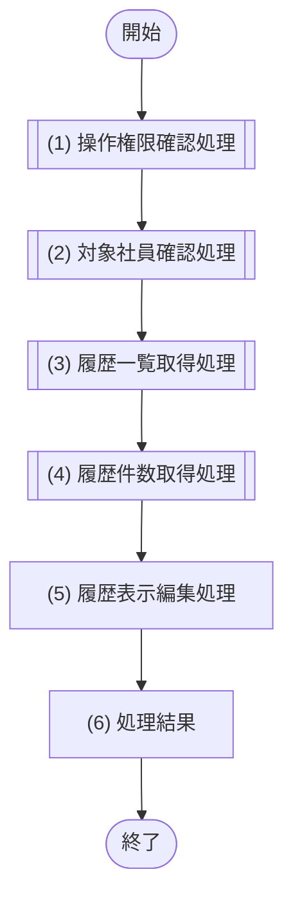

#### 処理詳細

| No | 処理名 | 呼出先 | 処理内容 |
|---:|---|---|---|
| 1 | 操作権限確認処理 | M-003/IF-02 | `HR`または`SYSTEM_ADMIN`の履歴参照権限を確認し、`scopeType=ALL`、`actorEmployeeId=NULL`、`allowedOrganizationIds=[]`、`asOfDate=業務日`を確定する。それ以外のロールだけならFORBIDDENとする |
| 2 | 対象社員確認処理 | M-006/IF-03 | 社員IDと(1)の`scopeType`、`actorEmployeeId`、`allowedOrganizationIds`、`asOfDate`をすべて渡して対象社員の存在を確認し、不存在はEMPLOYEE_NOT_FOUNDを送出する。これにより「社員は存在するが履歴0件」と区別する |
| 3 | 履歴一覧取得処理 | M-006/IF-14 | 社員ID・日時範囲・変更種別・ページ条件で履歴を取得する |
| 4 | 履歴件数取得処理 | M-006/IF-15 | (3)と同じ絞り込み条件で総件数を取得する |
| 5 | 履歴表示編集処理 | - | M-006/IF-14が返したsourceType・changedByUserId・社員表示名を使い、sourceType=JOBは`SYSTEM(JOB-001)`、sourceType=APIかつ社員表示名ありは氏名、changedByUserIdありで社員未紐付け・論理削除済みは`SYSTEM_USER`、APIなのにchangedByUserId欠落等の想定外は`UNKNOWN_ACTOR`として運用警告を発する。changedByは必ず空でない文字列とする。change_summaryは下記schemaVersion=1契約を検証し、fieldCode正本順に`表示名：操作名`を読点結合する。不正・未知時は`変更内容あり`へ安全化して運用警告を発し、実値・JSON本文をAPIまたはログへ出力しない |
| 6 | 処理結果 | - | 変換済みchangeSummary文字列を含む編集済み履歴一覧とページ情報を返す。対象社員が存在して履歴0件の場合は空配列と総件数0を返す |

#### change_summary schemaVersion=1 論理契約

保存JSONは`{"schemaVersion":1,"changes":[...]}`だけをルート構造とし、`changes[]`は`fieldCode`と`operation`だけを持つ。変更前後の実値、氏名・連絡先等の個人情報、自由記述を保存しない。生成時は同一fieldCodeを1件に限定し、表示時は入力配列順ではなく次表のfieldCode正本順へ並べる。既存不正データに同一fieldCodeが複数ある場合は最初の1件だけを表示対象として重複を除外し、運用警告を発する。

| fieldCode正本順 | 表示名 |
|---|---|
| employeeNumber | 社員番号 |
| name | 氏名 |
| nameKana | 氏名カナ |
| email | メールアドレス |
| phoneNumber | 連絡先 |
| employmentType | 雇用区分 |
| organization | 所属組織 |
| position | 役職 |
| manager | 上長 |
| retirementDate | 退職日 |
| retirementType | 退職区分 |
| status | 在籍状態 |
| roleAssignment | ロール割当 |

| operation | 表示名 |
|---|---|
| SET | 設定 |
| UPDATED | 変更 |
| CLEARED | 解除 |
| ADDED | 追加 |
| ENDED | 終了 |
| CONFIRMED | 確定 |

#### change_summary生成規則

M-002は変更後の永続化処理を呼ぶ前に、正規化済み論理値と取得済み現値から次表の`changes[]`を生成する。各イベント内で同一`fieldCode`を重複させず、上記fieldCode正本順に並べる。実変更がない場合は業務データ更新・変更履歴登録を行わない。

| changeType | changes[]生成規則 |
|---|---|
| `REGISTER` | `employeeNumber:SET`、`name:SET`、カナ提供時だけ`nameKana:SET`、`email:SET`、`employmentType:SET`、`organization:ADDED`、`position:ADDED` |
| `BASIC_UPDATE` | 正規化後の`updatedFields`だけを対象とし、`name`、`nameKana`、`email`、`employmentType`は`UPDATED`。`phoneNumber`はNULL→値を`SET`、値→NULLを`CLEARED`、それ以外の実変更を`UPDATED` |
| `ASSIGNMENT` | `organization`・`position`は旧所属なしなら`ADDED`、旧所属ありなら`UPDATED`。`manager`はNULL→値を`SET`、値→別値を`UPDATED`、値→NULLを`CLEARED`。実差分のないfieldCodeは含めない |
| `RETIREMENT_SCHEDULED` | 退職日がNULL→値なら`retirementDate:SET`、既存予定日→別日なら`retirementDate:UPDATED`。退職区分はNULL→値を`retirementType:SET`、値→別値を`retirementType:UPDATED`、値→NULLを`retirementType:CLEARED`とし、実差分のあるfieldCodeだけを含める |
| `RETIREMENT_CONFIRMED` | `retirementDate:CONFIRMED`、`status:UPDATED`、`organization:ENDED`、`position:ENDED`を設定する。退職区分は確定直前の現値と確定値をNULLも区別して比較し、NULL→値は`retirementType:SET`、値→別値は`retirementType:UPDATED`、値→NULLは`retirementType:CLEARED`、同一値は項目なしとする |
| `ROLE_UPDATE` | ロール集合に実差分がある場合だけ`roleAssignment:UPDATED` |

| 項目 | 内容 |
|---|---|
| トランザクション | 参照のみ |
| 排他・冪等性 | 排他なし、冪等 |

### 7.6.11 IF-09 検索結果出力

#### 処理フロー

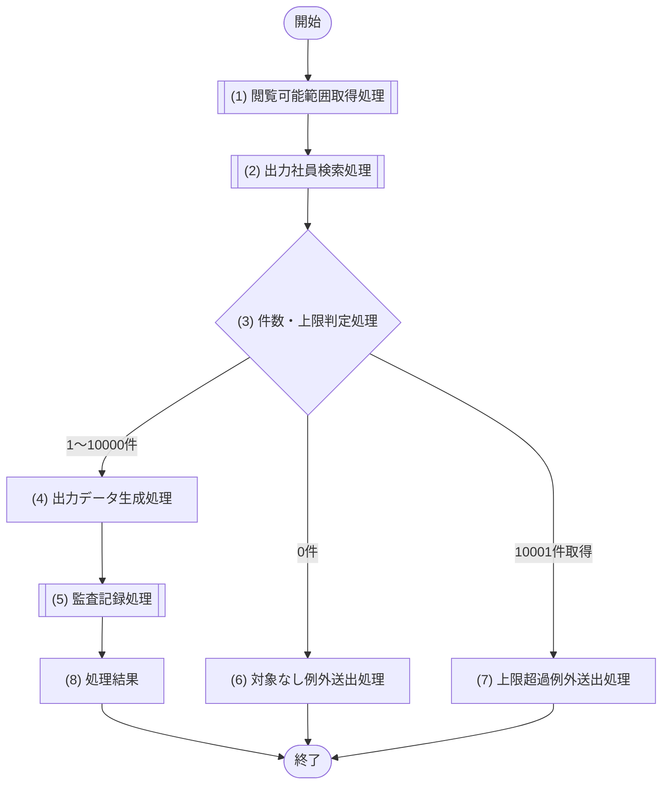

#### 処理詳細

| No | 処理名 | 呼出先 | 処理内容 |
|---:|---|---|---|
| 1 | 閲覧可能範囲取得処理 | M-003/IF-03 | `参照目的=EMPLOYEE_EXPORT`、`asOfDate=業務日`、`業務日`で出力権限と閲覧条件を取得する。`HR`は`scopeType=ALL`、`DEPARTMENT_MANAGER`は主所属＋全子孫の`scopeType=ORGANIZATION`とし、その他のロールだけならFORBIDDENとする。fieldsの未知・重複をVALIDATION_ERROR、人事担当者の全13項目または部門管理者の許可7項目に含まれない指定をFORBIDDENとする |
| 2 | 出力社員検索処理 | M-006/IF-32 | employeeNumber・nameはUnicode trim/NFC後のリテラル検索条件として渡す。部分一致はM-006公開IF契約へ委譲し、M-002ではDB表現へ変換しない。業務日固定で最大10,001件取得する |
| 3 | 件数・上限判定処理 | - | 0件、1〜10,000件、10,001件（実件数が上限超過）のいずれかを判定する |
| 4 | 出力データ生成処理 | - | 下表の候補値・ヘッダー・整形を適用し、(1)で確定した列順をヘッダーと全データ行で維持してCSV/XLSXを生成する。NULLは空セルとする |
| 5 | 監査記録処理 | M-007/IF-01 | 出力者・条件・項目・件数の監査を分離して依頼する |
| 6 | 対象なし例外送出処理 | - | EXPORT_TARGET_EMPTYを送出する |
| 7 | 上限超過例外送出処理 | - | EXPORT_LIMIT_EXCEEDEDを送出し、ファイルと成功監査ログを生成しない |
| 8 | 処理結果 | - | 出力データと件数を返す |

| fieldsコード | ヘッダー | M-006/IF-32候補値 | 整形 |
|---|---|---|---|
| employeeNumber | 社員番号 | employeeNumber | 文字列 |
| fullName | 氏名 | lastName、firstName | 前後空白除去後、半角空白1文字で連結 |
| fullNameKana | 氏名カナ | lastNameKana、firstNameKana | NULLを除いて半角空白で連結。両方NULLは空セル |
| email | メールアドレス | email | 文字列 |
| phoneNumber | 電話番号 | phoneNumber | 文字列 |
| hireDate | 入社日 | hireDate | `YYYY-MM-DD` |
| retirementDate | 退職日 | retirementDate | `YYYY-MM-DD` |
| employmentType | 雇用区分 | employmentTypeCode | §2.4の表示名（正社員、契約社員等）へ変換 |
| status | 在籍状態 | status | §2.4の表示名（在籍中 / 退職）へ変換 |
| organizationCode | 組織コード | organizationCode | 文字列 |
| organizationName | 組織名 | organizationName | 文字列 |
| positionCode | 役職コード | positionCode | 文字列 |
| positionName | 役職名 | positionName | 文字列 |

人事担当者は全13項目、部門管理者は`employeeNumber`、`fullName`、`organizationCode`、`organizationName`、`positionCode`、`positionName`、`status`だけを指定できる。fields省略時は`employeeNumber`、`fullName`、`organizationName`、`positionName`、`status`の順とする。

CSVはUTF-8 BOM付き・CRLF・RFC 4180で生成し、文字列セル先頭が`=`、`+`、`-`、`@`の場合は`'`を付ける。XLSXはシート名`社員名簿`、1行目をヘッダー、日付表示形式`yyyy-mm-dd`とし、文字列セルを数式として生成しない。ファイル名はAsia/Tokyoの生成日時による`employee_roster_yyyyMMdd_HHmmss`と拡張子で構成する。

| 項目 | 内容 |
|---|---|
| 副作用 | 業務データは参照のみ。監査は分離して依頼する |
| 排他・冪等性 | 排他なし。同一条件の再出力は可能で監査は都度記録 |

### 7.6.12 IF-10 組織管理

#### 処理フロー


#### 処理詳細

| No | 処理名 | 呼出先 | 処理内容 |
|---:|---|---|---|
| 1 | 操作権限確認処理 | M-003/IF-02、M-003/IF-03 | 一覧は全認証済みロールに組織参照を許可し、`参照目的=ORGANIZATION_CANDIDATE`、`asOfDate=effectiveOn（省略時は業務日）`、`業務日`でIF-03を呼ぶ。`activeOnly=true`では返されたALL/ORGANIZATION条件を使い、一般社員のSELFはIF-03で本人主所属IDのORGANIZATIONへ変換済みとする。`activeOnly=false`は`SYSTEM_ADMIN`かつ`scopeType=ALL`を必須とする。更新系は`SYSTEM_ADMIN`だけを許可する |
| 2 | 操作区分判定処理 | - | 一覧取得と登録・更新・無効化に分岐する |
| 3 | 有効組織取得処理 | M-005/IF-01 | activeOnly=1は`active=1`かつeffectiveOnが有効期間内の認可範囲組織、0は管理者向け全組織を取得する。effectiveOn省略時は業務日とする |
| 4 | 組織更新可否判定処理 | M-005/IF-04 | コード重複、親期間包含、循環、子孤児化、現在・将来所属参照を事前判定し、要求versionとマージ済み内容を原子更新条件にする |
| 5 | 更新可否・登録更新判定処理 | - | (4)の結果を評価し、登録可・更新/無効化可・不可に分岐する |
| 6 | 組織登録処理 | M-006/IF-19 | (4)で正規化した全項目と`active=1`を用いて組織を登録する。未来開始でも期限付きでもactiveは期間から導出せずtrueとし、登録日時を取得してコミットする |
| 7 | 組織更新処理 | M-006/IF-20 | (4)で現値とマージした全項目を版数条件付きで更新する。`DISABLE`は`active=0`を即時反映し、任意のeffectiveToは指定時だけ更新する。更新日時を取得してコミットする |
| 8 | 監査記録処理 | M-007/IF-01 | 業務更新成功後に監査記録を依頼する |
| 9 | 業務例外送出処理 | - | 内部判定結果とM-006の論理失敗をFORBIDDEN、ORGANIZATION_NOT_FOUND、ORGANIZATION_CODE_DUPLICATED、ORGANIZATION_HIERARCHY_CONFLICT（HTTP 409）、MASTER_PERIOD_INVALID、UPDATE_CONFLICTの公開エラーへ変換する。原子更新失敗時は業務変更が未確定であることを前提に送出する |
| 10 | 処理結果 | - | 一覧、または登録・更新後の組織を返す。API-011はM-006/IF-19の`createdAt`、API-012はM-006/IF-20の`updatedAt`をそれぞれ応答へ伝播する |

| 項目 | 内容 |
|---|---|
| 原子性 | 一覧は参照のみ。登録・更新はM-006へ一つの論理更新プランとして依頼し、監査は成功後に分離する |
| 排他制御 | 階層ロックは使用しない。組織要求version、階層・親子期間・所属参照条件を原子更新プランへ含める。§7.10.5に従いM-006が即時再試行可能な論理一時障害だけbatch全体を初回後最大2回再試行し、M-002はその分類結果に従う |
| 冪等性 | 登録は非冪等、更新は同一版数の再実行を競合とする |

### 7.6.13 IF-11 役職管理

#### 処理フロー

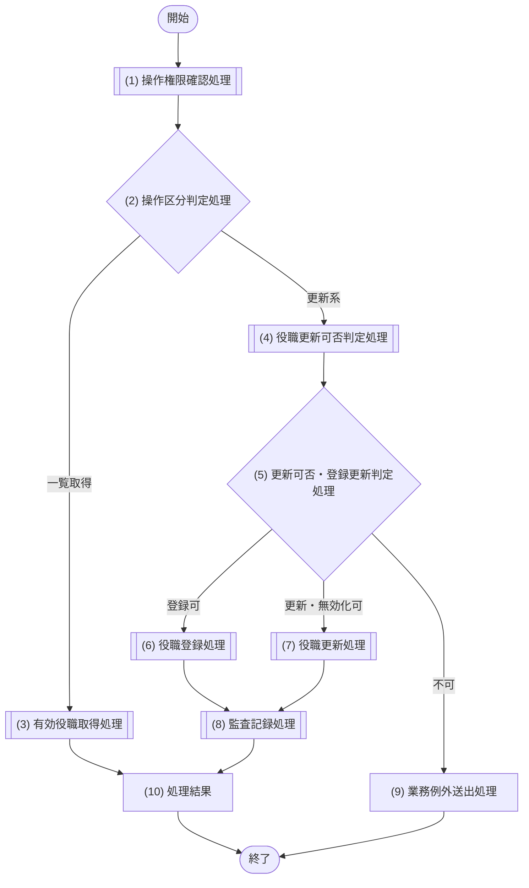

#### 処理詳細

| No | 処理名 | 呼出先 | 処理内容 |
|---:|---|---|---|
| 1 | 操作権限確認処理 | M-003/IF-02 | 一覧は全認証済みロールに役職参照を許可し、`activeOnly=false`だけは`SYSTEM_ADMIN`を必須とする。更新系は`SYSTEM_ADMIN`の役職マスター管理権限だけを許可する |
| 2 | 操作区分判定処理 | - | 一覧取得と登録・更新・無効化に分岐する |
| 3 | 有効役職取得処理 | M-005/IF-02 | 一覧取得時、activeOnly=trueは`active=1`かつ基準日が有効期間内の役職、falseはシステム管理者向けに期間・activeを問わない全役職を取得する |
| 4 | 役職更新可否判定処理 | M-005/IF-05 | コード重複、version、有効期間、現在・将来所属参照を事前判定し、要求versionとマージ済み内容を原子更新条件にする |
| 5 | 更新可否・登録更新判定処理 | - | (4)の結果を評価し、登録可・更新/無効化可・不可に分岐する |
| 6 | 役職登録処理 | M-006/IF-24 | (4)で正規化した全項目と`active=1`を用いて役職を登録する。未来開始でも期限付きでもactiveは期間から導出せずtrueとし、登録日時を取得してコミットする |
| 7 | 役職更新処理 | M-006/IF-25 | (4)で現値とマージした全項目を版数条件付きで更新する。`DISABLE`は`active=0`を即時反映し、任意のeffectiveToは指定時だけ更新する。更新日時を取得してコミットする |
| 8 | 監査記録処理 | M-007/IF-01 | 業務更新成功後に監査記録を依頼する |
| 9 | 業務例外送出処理 | - | 内部判定結果とM-006の論理失敗をFORBIDDEN、POSITION_NOT_FOUND、POSITION_CODE_DUPLICATED、MASTER_PERIOD_INVALID、UPDATE_CONFLICTの公開エラーへ変換する |
| 10 | 処理結果 | - | 一覧、または登録・更新後の役職を返す。API-013はM-006/IF-24の`createdAt`、API-014はM-006/IF-25の`updatedAt`をそれぞれ応答へ伝播する |

| 項目 | 内容 |
|---|---|
| 原子性 | 一覧は参照のみ。登録・更新はM-006へ一つの論理更新プランとして依頼し、監査は成功後に分離する |
| 排他制御 | 役職要求version、役職期間・所属参照条件を原子更新プランへ含め、§7.10.5に従いM-006が即時再試行可能な論理一時障害だけbatch全体を初回後最大2回再試行し、M-002はその分類結果に従う |
| 冪等性 | 登録は非冪等、更新は同一版数の再実行を競合とする |

### 7.6.14 IF-12 ロール管理

#### 処理フロー

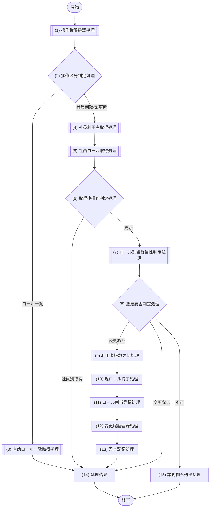

#### 処理詳細

| No | 処理名 | 呼出先 | 処理内容 |
|---:|---|---|---|
| 1 | 操作権限確認処理 | M-003/IF-02 | ロール一覧・社員別取得・更新に必要な権限を確認する |
| 2 | 操作区分判定処理 | - | API-015はロール一覧、API-016は社員別取得、API-017は更新へ分岐する |
| 3 | 有効ロール一覧取得処理 | M-006/IF-27 | 割当可能な有効ロールを取得する |
| 4 | 社員利用者取得処理 | M-006/IF-33 | 社員と対応利用者を一括取得する。0行はEMPLOYEE_NOT_FOUND、社員行あり・利用者列NULLはUSER_ACCOUNT_NOT_FOUNDとする。API-016は無効利用者もuserActive=falseで返し、API-017はUSER_ACCOUNT_INACTIVEとして更新しない |
| 5 | 社員ロール取得処理 | M-006/IF-28 | APIから基準日を受け付けず、業務日現在の期間有効割当と将来割当を取得する。各割当の`roleActive`は無効でも0のまま保持し、更新判定に渡す。利用者の現在`updatedAt`も取得する |
| 6 | 取得後操作判定処理 | - | 社員別取得は(14)へ、更新は(7)へ進める |
| 7 | ロール割当妥当性判定処理 | M-003/IF-04 | 共通適用日が業務日以降であること、更新後ロール一式に指定された全roleIdが`active=1`であること、現在/将来割当・期間を比較する。既存の`roleActive=false`割当は不正とせず参照・終了・論理取消対象にできるが、保持・追加対象にはできない。適用日より前に開始済みの保持対象外は前日終了、適用日当日以降に開始する保持対象外の将来予約は取消し、完全一致で保持するuser_role_idと追加対象を算出する |
| 8 | 変更要否判定処理 | - | 現割当との差分と要求版数一致を判定する |
| 9 | 利用者版数更新処理 | M-006/IF-35 | 要求version、適用日、期待・保持ロールID集合、新規割当、ROLE_UPDATE履歴を単一の合成公開IF（TX-008）へ渡し、1回の原子更新として所有者条件付きで依頼する |
| 10 | 現ロール終了処理 | - | (9)の合成公開IF（TX-008）が、期待ID集合と適用日による現行ロール終了を同一原子更新の内部で実行する。差分0件は正常 |
| 11 | ロール割当登録処理 | - | (9)の合成公開IF（TX-008）が、新規割当を同一原子更新の内部で登録する |
| 12 | 変更履歴登録処理 | - | (9)の合成公開IF（TX-008）が、ROLE_UPDATE履歴を同一原子更新の内部で追記する |
| 13 | 監査記録処理 | M-007/IF-01 | ロール変更成功後に監査記録を依頼する |
| 14 | 処理結果 | - | ロール一覧、社員別割当、または更新後割当と更新後利用者版数を返す。社員別割当の`roleActive`はM-006/IF-28の値を失わずAPI境界へ返す。API-017の変更あり時はM-006/IF-35が返した`updatedAt`、完全同一割当時はM-006/IF-28が返した`userUpdatedAt`を応答へ設定する |
| 15 | 業務例外送出処理 | - | FORBIDDEN、EMPLOYEE_NOT_FOUND、USER_ACCOUNT_NOT_FOUND、USER_ACCOUNT_INACTIVE、ROLE_NOT_ACTIVE、ROLE_ASSIGNMENT_PERIOD_CONFLICT、UPDATE_CONFLICT を送出する |

| 項目 | 内容 |
|---|---|
| 原子性 | 一覧・社員別取得は参照のみ。(9)〜(12)は一つの論理更新プラン、監査は成功後に分離する |
| 排他制御 | 利用者版数の楽観ロックとロール有効期間条件で競合を検知 |
| 冪等性 | 完全同一内容は正常な無更新として現在値・現在版数を返す。変更後に旧版数で再送した場合はUPDATE_CONFLICTとする |

## 7.7 M-003 認証・認可

### 7.7.1 モジュール概要

| 項目 | 内容 |
|---|---|
| モジュールID | M-003 |
| 目的 | 外部認証結果とシステム内ロールから認証状態・操作権限・閲覧範囲を決定する |
| 主な呼出元 | API(ログインのみ)、M-002 |
| 呼出可能先 | M-006、M-007、M-008 |
| 状態保持 | 認証要求中の相関情報のみ。利用者・ロールの正本は保持しない |

### 7.7.2 公開インターフェース詳細

| IF | 概要 | 入力 | 出力 | 例外 | 原子性・競合・冪等性 |
|---|---|---|---|---|---|
| IF-01 ログイン | 外部認証結果とシステム内ロールから認証状態・トークン・有効ロールを確定する | 認証情報、相関ID、業務日 | accessToken、tokenType、expiresAt、認証済み利用者、ロール | AUTHENTICATION_FAILED、ACCOUNT_INACTIVE、AUTHENTICATION_SERVICE_UNAVAILABLE、INTERNAL_ERROR | M-006経由の参照のみ、外部呼出しタイムアウト制御 |
| IF-02 操作権限確認 | 実行者ロールと操作条件を照合し許可可否とスコープ条件を返す | 利用者、操作、対象社員/組織、要求更新項目、業務日 | 許可/不許可、理由、操作用スコープ条件 | UNAUTHENTICATED、FORBIDDEN | M-006経由の参照のみ |
| IF-03 閲覧可能範囲取得 | 参照目的ごとの閲覧スコープと返却可能項目を解決する | 利用者、参照目的、業務日、組織・役職候補だけeffectiveOn（省略時業務日） | `scopeType`、`actorEmployeeId`、`allowedOrganizationIds`、確定済みデータ基準日、返却可能項目 | UNAUTHENTICATED、FORBIDDEN | M-006経由の参照のみ |
| IF-04 ロール割当妥当性判定 | 更新後ロール一式の有効性と期間整合を判定し保持・終了・追加差分を返す | 実行者、対象利用者ID、更新後ロール一式、共通有効期間、業務日 | 割当可否、変更要否、保持/終了・取消/追加の差分 | ROLE_NOT_ACTIVE、ROLE_ASSIGNMENT_PERIOD_CONFLICT | M-006経由の参照のみ |

### 7.7.3 IF-01 ログイン

#### 処理フロー

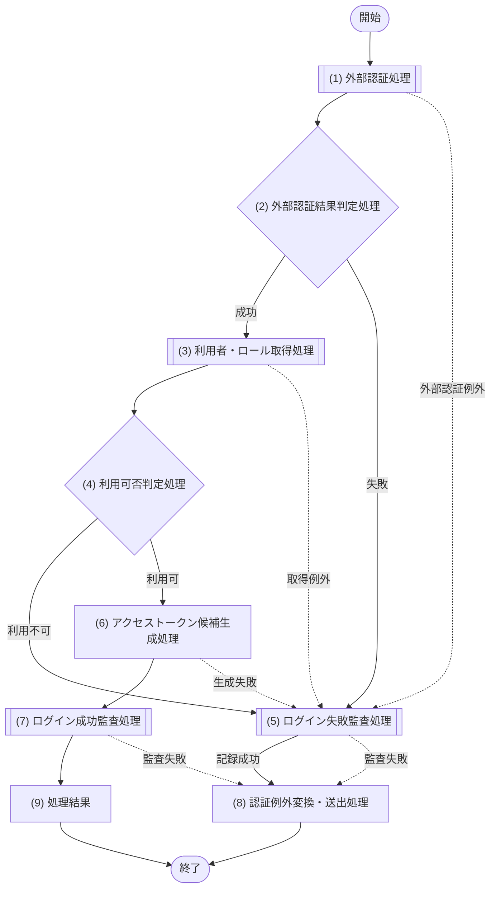

#### 処理詳細

| No | 処理名 | 呼出先 | 処理内容 |
|---:|---|---|---|
| 1 | 外部認証処理 | M-008/IF-01 | 認証情報を社内認証基盤へ渡し内部認証結果を受け取る |
| 2 | 外部認証結果判定処理 | - | (1)の認証成否、`failureReason=INVALID_CREDENTIALS / ACCOUNT_LOCKED / ACCOUNT_INACTIVE / PROVIDER_UNAVAILABLE`のいずれか、有効期限を判定する |
| 3 | 利用者・ロール取得処理 | M-006/IF-26 | 外部認証で確定した`identitySubject`、`userId=NULL`、`businessDate=業務日`、`roleAsOfDate=業務日`、`assignmentAsOfDate=業務日`を指定して有効利用者・ロールを取得する。社員に紐づく利用者は業務日時点でACTIVEかつ退職日前の場合だけ取得でき、0行は利用不可とする |
| 4 | 利用可否判定処理 | - | 利用者状態が有効で、`HR`、`DEPARTMENT_MANAGER`、`EMPLOYEE`、`SYSTEM_ADMIN`のいずれかを1件以上持ち、未知ロールコードを含まないことを判定する。未知ロールは権限へ変換せずフェイルクローズし、運用警告を発する |
| 5 | ログイン失敗監査処理 | M-007/IF-01 | 外部認証失敗・例外、利用者取得例外、利用不可、または(6)のトークン候補生成失敗の公開エラー送出前に、`sourceType=AUTH`、`result=FAILURE`で監査記録する。認証前または主体未特定なら実行者・対象IDはNULLを許可し、変更概要には失敗理由の分類だけを設定する。認証情報、外部応答本文、トークン、秘密情報、個人情報本文は含めない |
| 6 | アクセストークン候補生成処理 | - | 利用者・有効ロールの確定後、userId、employeeId、ロールコード、発行時刻、有効期限、jtiをクレームとする署名付きアクセストークン候補を生成するが、まだAPIへ返さない。有効期限は外部認証期限とシステム設定TTLの早い方、tokenTypeはBearerとする。署名秘密鍵はDBに格納せず実行環境から安全に注入し、kidによる鍵ローテーションに対応する。生成失敗は(5)で失敗監査し、秘密鍵・候補本文はログへ出力しない |
| 7 | ログイン成功監査処理 | M-007/IF-01 | (6)の候補生成成功後、`sourceType=AUTH`、`result=SUCCESS`、特定済み実行者・対象IDでログイン成功を監査記録する。記録失敗時は候補を破棄し、利用者へ返さない |
| 8 | 認証例外変換・送出処理 | - | (5)の記録成功時は、M-008の`failureReason=INVALID_CREDENTIALS`をAUTHENTICATION_FAILED、`ACCOUNT_LOCKED`または`ACCOUNT_INACTIVE`をACCOUNT_INACTIVE、`PROVIDER_UNAVAILABLE`をAUTHENTICATION_SERVICE_UNAVAILABLEへ一意に変換する。M-006/IF-26が0行で利用者無効・有効ロールなし・社員非ACTIVE・退職日到来のいずれかとなった場合もACCOUNT_INACTIVEとする。その他（トークン候補生成失敗、AUTH_RESPONSE_INVALID、利用者取得内部異常）はINTERNAL_ERRORへ変換して送出する。(5)または(7)がAUDIT_EVENT_INVALID／AUDIT_RECORD_FAILEDとなった場合もINTERNAL_ERRORを送出し、候補を破棄してアクセストークンを返さない |
| 9 | 処理結果 | - | (7)の成功後だけ、(6)の候補をaccessTokenとしてtokenType、expiresAt、認証済み利用者ID・社員ID、有効ロールコードとともにAPIへ返す |

| 項目 | 内容 |
|---|---|
| 副作用 | 利用者・ロールは参照のみ。監査記録はM-007へ依頼する |
| 排他制御 | なし。外部認証は相関IDで応答を対応づける |
| 冪等性 | 認証試行は都度評価・監査し、成功ごとに異なるjtiのトークンを発行するため非冪等 |

### 7.7.4 IF-02 操作権限確認

#### 処理フロー

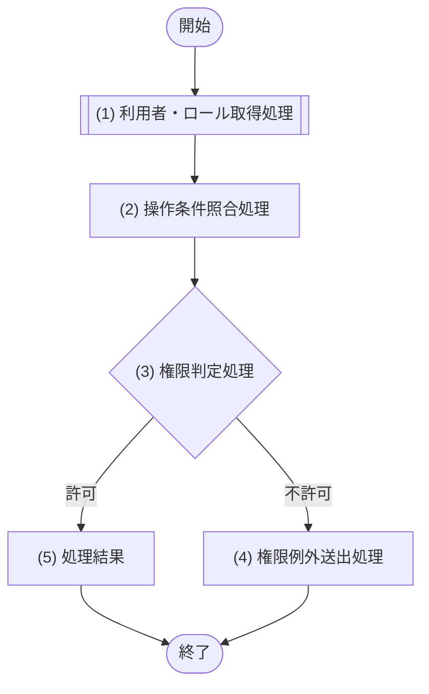

#### 処理詳細

| No | 処理名 | 呼出先 | 処理内容 |
|---:|---|---|---|
| 1 | 利用者・ロール取得処理 | M-006/IF-26 | `identitySubject=NULL`、`userId=実行者.userId`、`businessDate=業務日`、`roleAsOfDate=業務日`、`assignmentAsOfDate=業務日`を指定し、実行者の有効状態・ロール・所属を取得する。0行は、トークンの有効期限内でも利用者無効・社員非ACTIVE・退職日到来を含むUNAUTHENTICATEDとする |
| 2 | 操作条件照合処理 | - | 下表の操作種別ごとの必要ロール、本人条件、許可更新項目と照合する。DB制約にかかわらず未知ロールコードを1件でも検出した場合は権限へ変換せず、運用警告対象とする |
| 3 | 権限判定処理 | - | 複数ロールの操作権限・許可項目は和集合とし、いずれかの有効ロールが条件を満たす場合だけ許可する。有効ロール0件または未知ロール検出時は拒否する |
| 4 | 権限例外送出処理 | - | FORBIDDEN または UNAUTHENTICATED を送出する |
| 5 | 処理結果 | - | 許可と判定根拠をM-002へ返す。社員基本情報更新は`HR`なら`scopeType=ALL`・`actorEmployeeId=NULL`、`EMPLOYEE`本人なら`scopeType=SELF`・`actorEmployeeId=実行者.employeeId`とし、いずれも`allowedOrganizationIds=[]`・`asOfDate=業務日`を返す。社員登録・異動・退職・履歴参照は許可時にALL条件を返す |

#### 操作権限マトリクス

| 対象API・操作 | 許可条件 |
|---|---|
| API-001 社員検索、API-002 社員詳細取得 | 4固定ロールのいずれか。データ範囲・返却項目はIF-03で制限 |
| API-003 社員登録、API-005 社員異動、API-006 退職予定登録・即時退職 | `HR`だけ |
| API-004 社員基本情報更新 | `HR`は氏名・カナ・email・phoneNumber・employmentTypeCode。`EMPLOYEE`は対象社員が本人の場合のemail・phoneNumberだけ。`DEPARTMENT_MANAGER`・`SYSTEM_ADMIN`単独は不許可 |
| API-007 変更履歴取得 | `HR`または`SYSTEM_ADMIN` |
| API-008 組織一覧取得、API-009 役職一覧取得 | activeOnly=trueは4固定ロールのいずれか。activeOnly=falseは`SYSTEM_ADMIN`だけ |
| API-011〜017 マスター・ロール管理 | `SYSTEM_ADMIN`だけ |
| API-018 検索結果出力 | `HR`または`DEPARTMENT_MANAGER`。`SYSTEM_ADMIN`・`EMPLOYEE`単独は不許可 |

| 項目 | 内容 |
|---|---|
| トランザクション | 参照のみ |
| 排他・冪等性 | 排他なし、同一認可状態では冪等 |

### 7.7.5 IF-03 閲覧可能範囲取得

#### 処理フロー

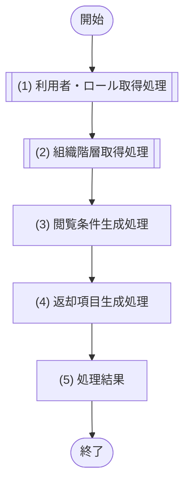

#### 処理詳細

| No | 処理名 | 呼出先 | 処理内容 |
|---:|---|---|---|
| 1 | 利用者・ロール取得処理 | M-006/IF-26 | 社員検索・詳細・更新・履歴・出力では`assignmentAsOfDate=業務日`を強制し、APIに過去基準日を公開しない。組織・役職候補だけ`assignmentAsOfDate=effectiveOn（省略時業務日）`とする。`businessDate`・`roleAsOfDate`は常に業務日とし、有効ロール0件、未知ロール、退職日到来はフェイルクローズする |
| 2 | 組織階層取得処理 | M-006/IF-16 | 最大スコープが`ORGANIZATION`となる場合、または`参照目的=ORGANIZATION_CANDIDATE`の場合だけ、社員系参照は業務日、候補参照はeffectiveOnを`asOfDate`とし、`includeInactive=0`、`scopeType=ALL`で利用可能な組織階層を取得する。組織ID・上位組織IDだけを用い、部門管理者は操作者の主所属を根とする全子孫を再帰展開する |
| 3 | 閲覧条件生成処理 | - | 社員データでは`HR`・`SYSTEM_ADMIN`を`ALL`、`DEPARTMENT_MANAGER`を主所属＋(2)の全子孫による`ORGANIZATION`、`EMPLOYEE`を本人社員IDによる`SELF`とする。主所属組織が(2)の利用可能階層に存在する場合だけ主所属をルートに含め、存在しなければ許可組織集合を空とする。`参照目的=ORGANIZATION_CANDIDATE`に限り、一般社員のSELFは(2)に存在する本人の要求基準日時点主所属組織IDだけを含む`ORGANIZATION`へ変換する。複数ロールは`ALL > ORGANIZATION > SELF`、許可組織集合は和集合とする。本人社員IDなしのSELFは対象なしとする |
| 4 | 返却項目生成処理 | - | 一覧はemployeeId・employeeNumber・fullName・organization・position・status。詳細は`HR`・`SYSTEM_ADMIN`が全項目、`DEPARTMENT_MANAGER`がemployeeId・employeeNumber・fullName・organization・position・manager・status・version、`EMPLOYEE`が本人の全項目。出力は`HR`の全13項目、`DEPARTMENT_MANAGER`の許可7項目とし、複数ロールは和集合を返す |
| 5 | 処理結果 | - | `scopeType`、`actorEmployeeId`（SELF以外はNULL）、論理配列`allowedOrganizationIds`、参照目的から確定した業務日またはeffectiveOn、返却可能項目をM-002へ返す |

| 項目 | 内容 |
|---|---|
| トランザクション | 参照のみ |
| 排他・冪等性 | 排他なし、同一認可状態では冪等 |

### 7.7.6 IF-04 ロール割当妥当性判定

#### 処理フロー

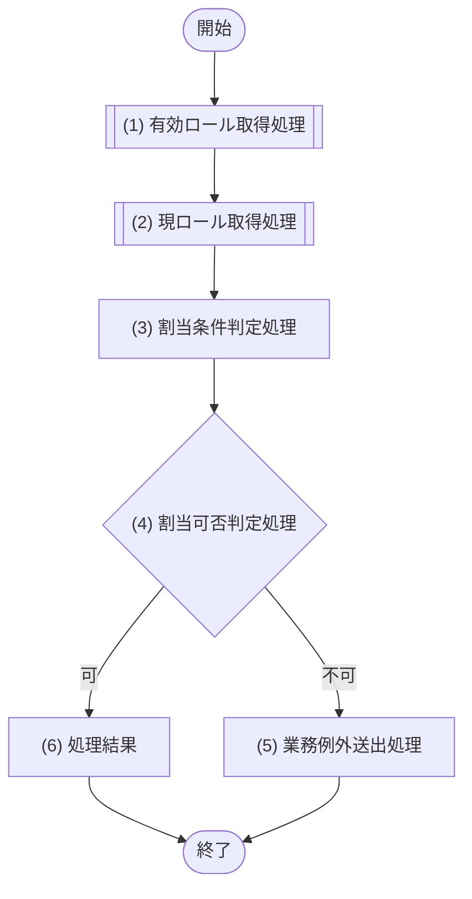

#### 処理詳細

| No | 処理名 | 呼出先 | 処理内容 |
|---:|---|---|---|
| 1 | 有効ロール取得処理 | M-006/IF-27 | 判定時点で新規割当可能な`active=1`ロールを取得する |
| 2 | 現ロール取得処理 | M-006/IF-28 | 対象利用者の現在・将来ロール割当をロールのactive状態付きで取得する。既存`active=0`ロールも差分計算から除外せず保持する |
| 3 | 割当条件判定処理 | - | 共通有効開始日が業務日以降であること、指定された更新後ロールがすべて`active=1`であること、期間重複・同一割当を判定する。指定ロールに`active=0`が1件でもあればROLE_NOT_ACTIVEとする。一方、既存`active=0`割当は新規指定不可だが、保持対象外として適用日前日終了または将来予約取消へ算出できる。指定適用日以降を更新後ロール一式へ置き換えるものとして、完全一致で保持するuser_role_id、適用日前日で終了する開始済み対象、論理取消する適用日当日以降の将来予約、追加対象を算出する。過去開始日はROLE_ASSIGNMENT_PERIOD_CONFLICTとする |
| 4 | 割当可否判定処理 | - | 全条件を満たすか判定する |
| 5 | 業務例外送出処理 | - | ROLE_NOT_ACTIVE、ROLE_ASSIGNMENT_PERIOD_CONFLICT を送出する |
| 6 | 処理結果 | - | 割当可否、変更要否、保持するuser_role_id配列、終了・取消対象、追加対象を返す。完全一致は正常な変更なしとして返す |

| 項目 | 内容 |
|---|---|
| トランザクション | 参照のみ。割当更新は M-002/IF-12 が行う |
| 排他・冪等性 | 排他なし、判定は冪等 |

## 7.8 M-004 社員ドメイン

### 7.8.1 モジュール概要

| 項目 | 内容 |
|---|---|
| モジュールID | M-004 |
| 目的 | 社員の登録・更新・異動・退職に関する業務条件を副作用なしで判定する |
| 主な呼出元 | M-002 |
| 呼出可能先 | なし。本サンプルでは呼出元M-002から判定に必要な取得済み情報をすべて受け取る |
| 状態保持 | なし |

### 7.8.2 公開インターフェース詳細

| IF | 概要 | 入力 | 出力 | 例外 | 原子性・競合・冪等性 |
|---|---|---|---|---|---|
| IF-01 社員登録条件判定 | 入社日・初期状態・自動生成初期所属期間が登録条件を満たすか副作用なしで判定する | 入社日、初期状態、自動生成初期所属期間（effectiveFrom=hireDate、effectiveTo=NULL、managerEmployeeId=NULL） | 登録可否、違反一覧 | INVALID_EMPLOYEE_STATE、INVALID_ASSIGNMENT_PERIOD | 参照のみ |
| IF-02 社員更新可否判定 | 現状態・要求版数・更新項目から更新可否を副作用なしで判定する | 現社員、要求版数、更新項目（phoneNumberの値または明示NULLを含む） | 更新可否、競合・禁止項目 | CONFLICT、UPDATE_NOT_ALLOWED | 参照のみ |
| IF-03 異動期間整合性判定 | 異動日と所属期間の整合性を副作用なしで判定し差分・終了日を算出する | 入社日、退職予定日、異動日、業務日、異動日前日に有効な自所属・異動日以後の自所属 | 異動可否、差分比較正本、終了更新対象、取消対象将来自所属、終了日、新開始日 | PERIOD_CONFLICT、INVALID_TRANSFER_DATE | 参照のみ |
| IF-04 退職日区分判定 | 退職日の妥当性と未来/当日以前区分を副作用なしで判定する | 入社日、現状態、退職日に有効な自所属・将来自所属、退職日以後まで対象社員を上長参照する部下所属、退職日、業務日 | 妥当性、未来/当日以前区分、終了対象自所属、取消対象将来自所属 | INVALID_RETIREMENT_DATE、ALREADY_RETIRED | 参照のみ |

### 7.8.3 共通処理フロー

M-004/IF-01〜IF-04 は、下記の副作用を持たない共通フローで処理する。各 IF の条件は 8.8.4 の対応表を正本とする。

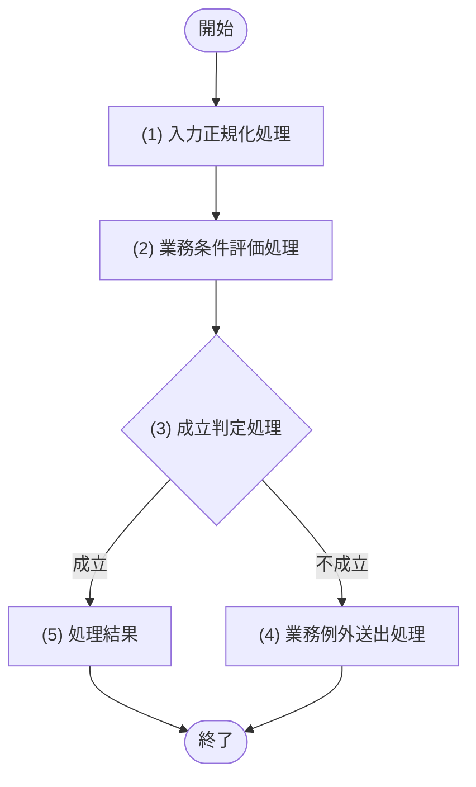

### 7.8.4 処理詳細

| No | 処理名 | 対象IF | 処理内容 |
|---:|---|---|---|
| 1 | 入力正規化処理 | IF-01〜04 | 日付・状態・版数・期間を比較可能な内部論理形式に正規化する。IF-02の電話番号は前後空白を除去し、明示NULLは解除値として保持する |
| 2 | 業務条件評価処理 | IF-01 | M-002が自動生成した初期所属期間が`effectiveFrom=hireDate`、`effectiveTo=NULL`、`managerEmployeeId=NULL`であることと、初期状態が在籍中であることを評価する |
| 2 | 業務条件評価処理 | IF-02 | 現状態で更新可能な項目か、要求版数と現版数が一致するか評価する。`phoneNumber`は更新許可項目とし、値指定時は前後空白除去後1〜30文字かつ半角数字・`+`・`-`・半角空白・丸括弧だけであることを必須とし、明示NULL時は登録解除として許可する |
| 2 | 業務条件評価処理 | IF-03 | 異動日が業務日・入社日以降かつ退職予定日以前で、`closeDate=異動日-1日`に有効な自所属を一意に算出できるか評価する。その直前自所属1件を組織・役職・上長の実差分比較正本とし、終了日がNULLまたはcloseDateより後の場合だけ終了更新対象とする。異動日以後に開始する自所属は期間競合ではなく一式置換の論理取消対象として返す |
| 2 | 業務条件評価処理 | IF-04 | 退職日が入社日以降で未退職であり、`effectiveFrom <= 退職日 <= effectiveTo`（終了日NULLは無期限）を満たす自所属を一意に特定できることと業務日との前後を評価し、退職日前日に終了した行は終了対象から除外する。退職日より後の将来自所属は論理取消対象として許容するが、対象社員を上長として退職日以後まで有効な部下所属が1件でもあればINVALID_RETIREMENT_DATEとする |
| 3 | 成立判定処理 | IF-01〜04 | 対象IFの全条件が成立するか判定する |
| 4 | 業務例外送出処理 | IF-01〜04 | 各IFの例外表に対応するコードと違反項目を返す |
| 5 | 処理結果 | IF-01〜04 | 判定結果と、異動終了日・退職日区分等の算出値を返す |

### 7.8.5 トランザクション・排他制御

| 項目 | 内容 |
|---|---|
| トランザクション | なし。全IFが副作用なし |
| 排他制御 | なし。版数は入力値として評価し、実更新時の競合検知は M-006 が行う |
| 冪等性 | 全IFであり |

## 7.9 M-005 マスター管理

### 7.9.1 モジュール概要

| 項目 | 内容 |
|---|---|
| モジュールID | M-005 |
| 目的 | 組織・役職マスターの取得結果を業務日時点で評価し、有効性・重複・更新可否を返す |
| 主な呼出元 | M-002 |
| 呼出可能先 | M-006 |
| 状態保持 | なし |

### 7.9.2 公開インターフェース詳細

| IF | 概要 | 入力 | 出力 | 例外 | 原子性・競合・冪等性 |
|---|---|---|---|---|---|
| IF-01 組織一覧取得 | 基準日と有効条件に合う組織一覧を取得する | 基準日、includeInactive、閲覧条件 | 条件に合う組織一覧 | DATA_ACCESS_ERROR | 参照のみ |
| IF-02 役職一覧取得 | 基準日と有効条件に合う役職一覧を取得する | 基準日、includeInactive | 条件に合う役職一覧 | DATA_ACCESS_ERROR | 参照のみ |
| IF-03 マスター有効性判定 | 組織・役職が基準日時点で有効かを判定する | 組織ID、役職ID、基準日 | `active=1`かつ基準日がISO日付の有効期間内か、無効理由 | MASTER_NOT_ACTIVE | 参照のみ |
| IF-04 組織更新可否判定 | 組織の重複・階層・期間・版数から更新可否を判定する | 操作区分、組織内容、上位組織ID、要求版数、業務日 | 更新可否、activeと有効期間を独立評価したマージ済み全項目、原子更新で再確認する論理期待値 | ORGANIZATION_NOT_FOUND、ORGANIZATION_CODE_DUPLICATED、ORGANIZATION_HIERARCHY_CONFLICT、MASTER_PERIOD_INVALID、UPDATE_CONFLICT | 参照のみ |
| IF-05 役職更新可否判定 | 役職の重複・期間・所属参照・版数から更新可否を判定する | 操作区分、役職内容、要求版数、業務日 | 更新可否、activeと有効期間を独立評価したマージ済み全項目、原子更新で再確認する論理期待値 | POSITION_NOT_FOUND、POSITION_CODE_DUPLICATED、MASTER_PERIOD_INVALID、UPDATE_CONFLICT | 参照のみ |

### 7.9.3 共通処理フロー

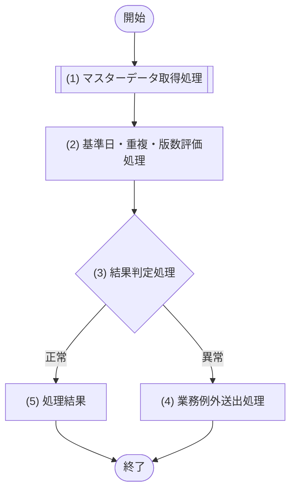

### 7.9.4 処理詳細

| 対象IF | (1) マスターデータ取得処理の呼出先 | (2) 基準日・重複・版数評価処理 | (5) 処理結果 |
|---|---|---|---|
| IF-01 | M-006/IF-16 | effectiveOn（省略時は業務日）を渡す。includeInactive=0は`active=1`かつ期間内、1は期間・activeを問わない閲覧可能組織へ限定する | 組織一覧 |
| IF-02 | M-006/IF-21 | includeInactive=0は`active=1`かつ基準日が有効期間内の役職、trueは期間・activeを問わない役職へ限定する | 役職一覧 |
| IF-03 | M-006/IF-17、M-006/IF-22 | 両マスターが存在し、`active=1`かつ`effectiveFrom <= 基準日 <= effectiveTo`（終了日NULLは無期限）かを事前評価する。社員登録・異動ではM-006の原子更新結果で再確認する | 有効性・無効対象 |
| IF-04 | M-006/IF-16〜18 | 組織コード、親期間包含、循環、子孤児化、現在・将来所属参照を事前評価し、要求versionと期待条件を返す | 組織更新可否、マージ済み全項目 |
| IF-05 | M-006/IF-22、M-006/IF-23 | 役職コードは登録時に半角英数字・ハイフンだけの1〜30文字であることを再検証する。M-006/IF-22が返す現在・将来所属参照集計に1件以上ある場合、active=0、参照最小開始日より遅い開始日、参照最遠終了日より早い終了日、または無期限参照に対する有限終了日はMASTER_PERIOD_INVALIDとする。登録はactive=1、positionLevel省略は0とする。更新時は省略項目を現値で補完し、明示nullは有効終了日だけに許可する。`UPDATE`はactive現値を維持し将来effectiveToを許可、`DISABLE`はactive=0を即時設定してeffectiveToは指定時だけ更新・未指定時は現値維持とし、版数・期間を評価する | 役職更新可否、マージ済み全項目 |

| No | 処理名 | 処理内容 |
|---:|---|---|
| 1 | マスターデータ取得処理 | 上表の M-006 公開IFから必要なマスターデータを取得する |
| 2 | 基準日・重複・版数評価処理 | 対象IFごとの条件を取得結果に適用する。部分更新は項目の存在有無を区別し、省略値を現値で補完して全列更新用の論理値を作る |
| 3 | 結果判定処理 | 正常結果を返せるか判定する |
| 4 | 業務例外送出処理 | 対象IFに応じ、MASTER_NOT_ACTIVE、各マスターのNOT_FOUND／CODE_DUPLICATED、ORGANIZATION_HIERARCHY_CONFLICT、MASTER_PERIOD_INVALID、UPDATE_CONFLICTの該当コードを送出する |
| 5 | 処理結果 | 一覧または判定結果を M-002 へ返す |

### 7.9.5 トランザクション・排他制御

| 項目 | 内容 |
|---|---|
| 副作用 | IF-01〜05は参照・判定だけを行い、DB更新方式を扱わない |
| 排他制御 | 所有者要求version、マスター期間、所属期待集合を原子更新条件として、事前参照後の将来所属追加を含む競合を検出する |
| 冪等性 | 全IFであり |

## 7.10 M-006 D1データアクセス

### 7.10.1 モジュール概要

| 項目 | 内容 |
|---|---|
| モジュールID | M-006 |
| 目的 | 本システムで唯一 Worker `env.DB` D1 bindingを参照し、SQLite SQLをprepared statementとして実行し、論理的な入出力へ変換して返す |
| 主な呼出元 | M-002、M-003、M-005、M-007 |
| 呼出可能先 | Cloudflare D1 binding `env.DB` のみ |
| 状態保持 | Workerリクエスト中のD1 binding参照、論理更新プラン、prepared statement配列のみ。リクエスト間に保持しない |

M-006 は業務ルール・認可を判断しない。呼出元の論理条件を08章のPrepared Statement別「固定バインド順」へ対応づけ、M-006内でだけ`env.DB.prepare(sql).bind(v1, v2, ...)`を生成する。D1へ名前付きplaceholderは渡さず、各Prepared Statementの実SQLは独立してordered `?1`、`?2`…を欠番なく使う。参照は`first()` / `all()`、単一文更新は`run()`、複数文業務更新は順序固定の`batch()`で実行する。SQL-ID は本節の処理詳細だけを正本とし、API・JOB・他モジュールへ公開しない。公開IFはM-006/IF-01〜IF-35のうちIF-06・IF-07・IF-10・IF-29・IF-30を除く30件とし、除外分は合成公開IFの内部構成SQLとする。

原子更新境界（TX-001〜TX-008）はM-002がTX-IDとして業務単位で宣言し、対応する**1つのM-006合成公開IF**が全構成SQLを1回の`env.DB.batch([...])`で実行する。M-002は原子更新ごとに単一の合成公開IF（社員登録=IF-05、社員基本情報更新=IF-08、社員異動=IF-34、退職予定登録=IF-11、退職確定=IF-13、ロール割当更新=IF-35、組織更新=IF-20、役職更新=IF-25）だけを呼び、複数のM-006公開IFを連続呼出して原子更新を組み立てない。所属履歴登録（SQL-006）・社員変更履歴登録（SQL-007）・基準日所属終了/将来所属取消（SQL-010）・現行ロール終了（SQL-029）・ロール割当登録（SQL-030）は、これら合成公開IFの内部構成SQLとして§7.10.4に記載し、単独呼出できる公開IFとしては列挙しない。M-002はSQL文、D1PreparedStatement、D1Resultを受け取らない。

### 7.10.2 公開インターフェース共通契約

| 項目 | 内容 |
|---|---|
| 入力 | 各IFの論理入力、実行者、更新時は所有者ID・要求version・後続SQL用guardedVersion・期待更新対象ID集合JSON |
| 出力 | 単一結果、一覧、件数、更新件数、登録識別子、実測`statementCount`（互換名`queryCount`）のいずれか |
| 共通例外 | DATA_ACCESS_ERROR、CONSTRAINT_VIOLATION、D1_BATCH_FAILED |
| 基盤一時障害 | M-006は`TRANSIENT_DB_ERROR`、`WRITE_OUTCOME_UNKNOWN`、`TRANSIENT_INFRASTRUCTURE_ERROR`の論理分類と即時再試行可否だけをM-002へ返す。HTTP応答またはQueue再配信は選択しない |
| 更新競合 | 期待1件のversion・状態条件付き所有者更新が0件の場合だけCONFLICTへ変換する。SQL-010・SQL-029の差分一括更新は0件正常を許可し、所有者versionガードと期待ID集合照合で競合を判定する |
| 型変換 | D1のTEXT ISO日付・日時を論理Date/Instant、INTEGER 0/1をboolean、JSON TEXTを検証済み論理値へ変換する |
| 情報保護 | SQL文・接続情報・DB例外原文を上位へ返さない |

### 7.10.3 共通処理フロー

M-006の各公開IF（IF-06/07/10/29/30を除く30件）は、8.10.4 の処理一覧で指定したクエリと実行種別を、次の共通フローで実行する。合成公開IFは複数の構成SQLを1回の`batch()`で実行する。

```mermaid
flowchart TD
  Start([開始]) --> P1["(1) 実行コンテキスト検証処理"] --> P2["(2) D1ステートメント準備処理"] --> P3[["(3) SQL・バッチ実行処理"]] --> D1{"(4) 実行結果判定処理"}
  D1 -- 正常 --> P4["(5) 結果変換処理"] --> P5["(7) 処理結果"] --> End([終了])
  D1 -- 異常 --> E1["(6) データアクセス例外変換処理"] --> End
```

### 7.10.4 処理詳細（全公開IFとSQL対応）

| No | 処理名 | 処理内容 |
|---:|---|---|
| 1 | 実行コンテキスト検証処理 | 呼出元、必須入力、ISO日付・日時、JSON配列形式、所有者versionガードと後続SQLのguardedVersion対応を検証する。IF-26は`identitySubject`と`userId`のXORとbusinessDateを検証し、3個の日付bindへ同じbusinessDateを設定する |
| 2 | D1ステートメント準備処理 | M-006内でだけ`env.DB`を取得し、Prepared Statementごとに`?1`から欠番なく採番した固定SQLを`prepare()`し、08章の構成文別固定順で値を`bind()`する。JSON配列は検証済みJSON TEXTとし、SQL文に値を連結しない。1 statementの最大bind数100を超えた計画は実行前に拒否する |
| 3 | SQL・バッチ実行処理 | 参照は`first()` / `all()`、単一文DMLは`run()`、複数文業務更新は固定順のprepared statement配列を`env.DB.batch()`で実行する。D1へ送信するたび実測statement数を加算し、Worker invocation内部上限900到達前に後続を止める |
| 4 | 実行結果判定処理 | `run()`の`D1Result.results`または`batch()`各要素の`results`からRETURNING行、`meta.changes`から更新件数を取得する。所有者更新1件、guard削除1件、差分対象ID集合、一意・CHECK・トリガー違反を判定する |
| 5 | 結果変換処理 | D1のTEXT / INTEGER / NULLと行構造を上位モジュール向けの論理結果へ変換する |
| 6 | データアクセス例外変換処理 | D1がバッチ全体を取り消した制約・トリガー失敗を固定マップでCONFLICT・DUPLICATED・期間/階層例外へ変換し、基盤エラーを8.10.5の論理一時障害へ分類する。SQL・個人情報・D1内部文言は上位へ返さない |
| 7 | 処理結果 | 変換済み結果、更新件数、呼出し中の`statementCount`（`queryCount`）を返す。DB内部情報は返さない |

次表は各公開IFの詳細である。IF別に概要・論理入力・論理出力・論理例外・SQL/D1実行・TX-IDを対応づけ、IF↔SQL対応のSQL-ID記載正本はこの表と`SQL・bind・結果対応`表とする。論理例外列は各IF固有の追加例外を示し、全IF共通のDATA_ACCESS_ERROR・CONSTRAINT_VIOLATION・D1_BATCH_FAILEDは§7.10.5の`D1例外変換`へ集約する。TX-IDを持つ更新は1行1公開IFとし、上位が複数M-006 IFを連続呼出して原子更新を組み立てない。

| IF | 概要 | 論理入力 | 論理出力 | 論理例外 | SQL・D1実行 | TX-ID |
|---|---|---|---|---|---|---|
| IF-01 | 社員検索 | リテラル検索語、業務日、閲覧条件、ページ条件 | 社員一覧 | DATA_ACCESS_ERROR | SQL-001 / `all()` | なし（参照） |
| IF-02 | 社員検索件数取得 | IF-01と同じ条件 | 総件数 | DATA_ACCESS_ERROR | SQL-002 / `first()` | なし（参照） |
| IF-03 | 社員詳細取得 | 社員ID、業務日、閲覧条件 | 社員詳細またはNULL | DATA_ACCESS_ERROR | SQL-003 / `first()`（過去日入力禁止） | なし（参照） |
| IF-04 | 社員一意性確認 | 社員番号、メール、除外社員ID | 重複フラグ | DATA_ACCESS_ERROR | SQL-004 / `first()` | なし（参照） |
| IF-05 | 社員登録 | 検証済み社員情報、初期所属、登録履歴、nowUtc、実行者 | 登録社員 | DUPLICATED（社員番号・メールUNIQUE）、CONSTRAINT_VIOLATION、DATA_ACCESS_ERROR | SQL-005→006→007 / 1回の`batch()` | TX-001 |
| IF-08 | 社員基本情報更新 | 社員ID、要求version、マージ済み内容、履歴 | 更新社員 | CONFLICT（version0件）、DUPLICATED（メールUNIQUE）、CONSTRAINT_VIOLATION、DATA_ACCESS_ERROR | SQL-008-A→B→SQL-007→008-C / 1回の`batch()` | TX-002 |
| IF-09 | 基準日所属・上長参照所属取得 | 社員ID、基準日、includeManagedAssignments | OWN/MANAGED所属 | DATA_ACCESS_ERROR | SQL-009 / `all()` | なし（参照） |
| IF-11 | 退職予定登録 | 社員ID、予定日、区分、要求version、履歴 | 更新社員 | CONFLICT（version0件）、期間例外（退職日CHECK・trigger）、CONSTRAINT_VIOLATION、DATA_ACCESS_ERROR | SQL-011-A→B→SQL-007→011-C / 1回の`batch()` | TX-004 |
| IF-12 | 到来退職対象取得 | 業務日、limit=40、再開位置 | 最大40件、hasMore、nextCursor | DATA_ACCESS_ERROR | SQL-012 / `all()`（limit+1で最大41件） | なし（参照） |
| IF-13 | 退職確定 | 社員、退職日、業務日、要求version、期待所属ID集合、履歴 | 更新社員 | CONFLICT（version・期待所属ID集合不一致）、期間例外、CONSTRAINT_VIOLATION、DATA_ACCESS_ERROR | SQL-013-A→B→SQL-010→SQL-007→013-C / 1回の`batch()` | TX-005 |
| IF-14 | 社員変更履歴一覧取得 | 社員ID、範囲、種別、ページ | 履歴一覧 | DATA_ACCESS_ERROR | SQL-014 / `all()` | なし（参照） |
| IF-15 | 社員変更履歴件数取得 | IF-14と同じ条件 | 総件数 | DATA_ACCESS_ERROR | SQL-015 / `first()` | なし（参照） |
| IF-16 | 組織一覧取得 | effectiveOn、includeInactive、閲覧条件 | 組織一覧 | DATA_ACCESS_ERROR | SQL-016 / `all()`（effectiveOn省略時は業務日） | なし（参照） |
| IF-17 | 組織取得 | 組織ID、参照基準日 | 組織・所属参照集計 | DATA_ACCESS_ERROR | SQL-017 / `first()` | なし（参照） |
| IF-18 | 組織コード重複確認 | コード、除外ID | 重複件数 | DATA_ACCESS_ERROR | SQL-018 / `first()` | なし（参照） |
| IF-19 | 組織登録 | 組織内容、active=1、nowUtc | 登録組織 | DUPLICATED（組織コードUNIQUE）、CONSTRAINT_VIOLATION（階層・期間trigger）、DATA_ACCESS_ERROR | SQL-019 / 単一`run()` | TX-006 |
| IF-20 | 組織更新 | 組織ID、要求version、マージ済み内容 | 更新組織 | CONFLICT（version0件）、DUPLICATED（組織コード）、CONSTRAINT_VIOLATION（階層・期間trigger）、DATA_ACCESS_ERROR | SQL-020-A→B→C / 1回の`batch()` | TX-006 |
| IF-21 | 役職一覧取得 | effectiveOn、includeInactive | 役職一覧 | DATA_ACCESS_ERROR | SQL-021 / `all()`（effectiveOn省略時は業務日） | なし（参照） |
| IF-22 | 役職取得 | 役職ID、参照基準日 | 役職・所属参照集計 | DATA_ACCESS_ERROR | SQL-022 / `first()` | なし（参照） |
| IF-23 | 役職コード重複確認 | コード、除外ID | 重複件数 | DATA_ACCESS_ERROR | SQL-023 / `first()` | なし（参照） |
| IF-24 | 役職登録 | 役職内容、active=1、nowUtc | 登録役職 | DUPLICATED（役職コードUNIQUE）、CONSTRAINT_VIOLATION（期間trigger）、DATA_ACCESS_ERROR | SQL-024 / 単一`run()` | TX-007 |
| IF-25 | 役職更新 | 役職ID、要求version、マージ済み内容 | 更新役職 | CONFLICT（version0件）、DUPLICATED（役職コード）、CONSTRAINT_VIOLATION（期間trigger）、DATA_ACCESS_ERROR | SQL-025-A→B→C / 1回の`batch()` | TX-007 |
| IF-26 | 認証利用者・ロール取得 | identitySubjectまたはuserId、業務日 | 利用者・業務日ロール・業務日所属 | DATA_ACCESS_ERROR | SQL-026 / `first()`（3日付bindへ同じ業務日） | なし（参照） |
| IF-27 | 有効ロール一覧取得 | なし | 有効ロール一覧 | DATA_ACCESS_ERROR | SQL-027 / `all()` | なし（参照） |
| IF-28 | 社員ロール取得 | 利用者ID、業務日 | 利用者version・業務日現在および将来ロール | DATA_ACCESS_ERROR | SQL-028 / `all()`（API基準日入力なし） | なし（参照） |
| IF-31 | 監査ログ登録 | 監査イベント、nowUtc | 登録監査 | DATA_ACCESS_ERROR | SQL-031 / 独立`run()` | なし（独立更新） |
| IF-32 | 出力用社員検索 | リテラル検索語、業務日、閲覧条件、上限 | 出力候補 | DATA_ACCESS_ERROR | SQL-032 / `all()`（過去日入力禁止） | なし（参照） |
| IF-33 | 社員利用者取得 | 社員ID | 社員・利用者存在状態 | DATA_ACCESS_ERROR | SQL-033 / `first()`（呼出元はM-002だけ） | なし（参照） |
| IF-34 | 社員異動 | 社員ID、要求version、異動日、期待所属ID集合、新所属、履歴 | 更新社員version・所属 | CONFLICT（version・期待所属ID集合不一致）、CONSTRAINT_VIOLATION（階層trigger）、DATA_ACCESS_ERROR | SQL-034-A→B→SQL-010→SQL-006→SQL-007→034-C / 1回の`batch()` | TX-003 |
| IF-35 | ロール割当更新 | 利用者ID、要求version、適用日、期待・保持ロールID集合、履歴 | 更新利用者version・割当 | CONFLICT（version・期待ロールID集合不一致）、DUPLICATED（重複割当）、CONSTRAINT_VIOLATION、DATA_ACCESS_ERROR | SQL-035-A→B→SQL-029→SQL-030→SQL-007→035-C / 1回の`batch()` | TX-008 |

M-006の公開IFは参照・単一更新・原子更新（合成）の3種とする。原子更新はTX-001〜TX-008に1対1対応し、各TXは上表の単一の合成公開IF（IF-05・IF-08・IF-11・IF-13・IF-34・IF-35、および組織/役職のIF-19・IF-20・IF-24・IF-25）が全構成SQLを1回の`batch()`で実行する。所属履歴登録（SQL-006）・社員変更履歴登録（SQL-007）・基準日所属終了/将来所属取消（SQL-010）・現行ロール終了（SQL-029）・ロール割当登録（SQL-030）は合成公開IFの内部構成SQLであり、単独呼出できる公開IFとしては列挙しない（IF-06・IF-07・IF-10・IF-29・IF-30に相当する番号は欠番とする）。

#### SQL・bind・結果対応

各構成文を別々に`prepare()`するため、構成文が変わるたびに`?1`から採番し直す。SQL本文・全placeholder・列別変換は§8を正本とし、本表は全公開IFのStatement順・実行方式・placeholder→論理入力→`.bind()`引数の対応・期待変更件数・論理契約を正逆に結ぶ。合成公開IFの各Statementは同一の`batch()`に含め、SQL-006/007/010/029/030は合成IFの内部構成Statementとして共有する（IF-06/07/10/29/30は欠番）。

| IF | Statement順 | SQL-ID | D1実行 | bind順: placeholder → 論理入力 → `.bind()`引数 | 期待結果・変更件数 | 論理出力/例外 |
|---|---:|---|---|---|---|---|
| IF-01 | 1 | SQL-001 | `all()` | 1:`?1`→as_of_date→asOfDate、2:`?2`→employee_number→employeeNumber、3:`?3`→name→name、4:`?4`→organization_id→organizationId、5:`?5`→position_id→positionId、6:`?6`→status→status、7:`?7`→scope_type→scopeType、8:`?8`→actor_employee_id→actorEmployeeId、9:`?9`→allowed_organization_ids_json→allowedOrganizationIdsJson、10:`?10`→limit→limit、11:`?11`→offset→offset | 0..n行 | 社員一覧 / DATA_ACCESS_ERROR |
| IF-02 | 1 | SQL-002 | `first()` | 1:`?1`→as_of_date→asOfDate、2:`?2`→employee_number→employeeNumber、3:`?3`→name→name、4:`?4`→organization_id→organizationId、5:`?5`→position_id→positionId、6:`?6`→status→status、7:`?7`→scope_type→scopeType、8:`?8`→actor_employee_id→actorEmployeeId、9:`?9`→allowed_organization_ids_json→allowedOrganizationIdsJson | 0..1行 | 総件数 / DATA_ACCESS_ERROR |
| IF-03 | 1 | SQL-003 | `first()` | 1:`?1`→as_of_date→asOfDate、2:`?2`→employee_id→employeeId、3:`?3`→scope_type→scopeType、4:`?4`→actor_employee_id→actorEmployeeId、5:`?5`→allowed_organization_ids_json→allowedOrganizationIdsJson | 0..1行 | 社員詳細またはNULL / DATA_ACCESS_ERROR |
| IF-04 | 1 | SQL-004 | `first()` | 1:`?1`→exclude_employee_id→excludeEmployeeId、2:`?2`→employee_number→employeeNumber、3:`?3`→email→email | 0..1行 | 重複フラグ / DATA_ACCESS_ERROR |
| IF-05 | 1 | SQL-005 | 同一`batch()` | 1:`?1`→employee_id→employeeId、2:`?2`→employee_number→employeeNumber、3:`?3`→last_name→lastName、4:`?4`→first_name→firstName、5:`?5`→last_name_kana→lastNameKana、6:`?6`→first_name_kana→firstNameKana、7:`?7`→email→email、8:`?8`→hire_date→hireDate、9:`?9`→employment_type_code→employmentTypeCode、10:`?10`→now_utc→nowUtc、11:`?11`→actor_user_id→actorUserId | INSERT 1件 | 登録社員 / DUPLICATED（社員番号・メールUNIQUE）、CONSTRAINT_VIOLATION |
| IF-05 | 2 | SQL-006 | 同一`batch()` | 1:`?1`→assignment_id→assignmentId、2:`?2`→employee_id→employeeId、3:`?3`→organization_id→organizationId、4:`?4`→position_id→positionId、5:`?5`→manager_employee_id→managerEmployeeId、6:`?6`→effective_from→effectiveFrom、7:`?7`→now_utc→nowUtc、8:`?8`→actor_user_id→actorUserId、9:`?9`→guard_id→guardId、10:`?10`→guarded_version→guardedVersion | INSERT 1件（guard_id=NULL・version=1確認） | 登録不能はtrigger/制約例外でbatch全体ロールバック |
| IF-05 | 3 | SQL-007 | 同一`batch()` | 1:`?1`→history_id→historyId、2:`?2`→employee_id→employeeId、3:`?3`→change_type→changeType、4:`?4`→change_summary→changeSummary、5:`?5`→now_utc→nowUtc、6:`?6`→actor_user_id→actorUserId、7:`?7`→source_type→sourceType、8:`?8`→source_id→sourceId、9:`?9`→trace_id→traceId、10:`?10`→guard_id→guardId、11:`?11`→guard_owner_type→guardOwnerType、12:`?12`→guard_owner_id→guardOwnerId、13:`?13`→guarded_version→guardedVersion | INSERT 1件（guard_id=NULL・version=1確認） | 登録不能はtrigger/制約例外でbatch全体ロールバック |
| IF-08 | 1 | SQL-008-A | 同一`batch()` | 1:`?1`→guard_id→guardId、2:`?2`→employee_id→employeeId、3:`?3`→expected_version→expectedVersion、4:`?4`→now_utc→nowUtc | guard INSERT 1件 | バッチ先頭で所有者version再検証 |
| IF-08 | 2 | SQL-008-B | 同一`batch()` | 1:`?1`→guard_id→guardId、2:`?2`→employee_id→employeeId、3:`?3`→expected_version→expectedVersion、4:`?4`→now_utc→nowUtc、5:`?5`→last_name→lastName、6:`?6`→first_name→firstName、7:`?7`→last_name_kana→lastNameKana、8:`?8`→first_name_kana→firstNameKana、9:`?9`→email→email、10:`?10`→phone_number→phoneNumber、11:`?11`→employment_type_code→employmentTypeCode、12:`?12`→actor_user_id→actorUserId | 所有者UPDATE meta.changes=1 | 0件時UPDATE_CONFLICT→CONFLICT・batch全体ロールバック / DUPLICATED（メールUNIQUE） |
| IF-08 | 3 | SQL-007 | 同一`batch()` | 1:`?1`→history_id→historyId、2:`?2`→employee_id→employeeId、3:`?3`→change_type→changeType、4:`?4`→change_summary→changeSummary、5:`?5`→now_utc→nowUtc、6:`?6`→actor_user_id→actorUserId、7:`?7`→source_type→sourceType、8:`?8`→source_id→sourceId、9:`?9`→trace_id→traceId、10:`?10`→guard_id→guardId、11:`?11`→guard_owner_type→guardOwnerType、12:`?12`→guard_owner_id→guardOwnerId、13:`?13`→guarded_version→guardedVersion | 履歴INSERT 1件（guarded） | guard版数不成立時0件→所有者更新0件をCONFLICTへ |
| IF-08 | 4 | SQL-008-C | 同一`batch()` | 1:`?1`→guard_id→guardId | guard DELETE meta.changes=1 | バッチ末尾でguard削除 |
| IF-09 | 1 | SQL-009 | `all()` | 1:`?1`→employee_id→employeeId、2:`?2`→as_of_date→asOfDate、3:`?3`→include_managed_assignments→includeManagedAssignments | 0..n行 | OWN/MANAGED所属 / DATA_ACCESS_ERROR |
| IF-11 | 1 | SQL-011-A | 同一`batch()` | 1:`?1`→guard_id→guardId、2:`?2`→employee_id→employeeId、3:`?3`→expected_version→expectedVersion、4:`?4`→now_utc→nowUtc | guard INSERT 1件 | 先頭で所有者version再検証 |
| IF-11 | 2 | SQL-011-B | 同一`batch()` | 1:`?1`→guard_id→guardId、2:`?2`→employee_id→employeeId、3:`?3`→expected_version→expectedVersion、4:`?4`→now_utc→nowUtc、5:`?5`→retirement_date→retirementDate、6:`?6`→retirement_type_code→retirementTypeCode、7:`?7`→actor_user_id→actorUserId | 所有者UPDATE 1件 | 0件時CONFLICT / 退職日CHECK・trigger例外 |
| IF-11 | 3 | SQL-007 | 同一`batch()` | 1:`?1`→history_id→historyId、2:`?2`→employee_id→employeeId、3:`?3`→change_type→changeType、4:`?4`→change_summary→changeSummary、5:`?5`→now_utc→nowUtc、6:`?6`→actor_user_id→actorUserId、7:`?7`→source_type→sourceType、8:`?8`→source_id→sourceId、9:`?9`→trace_id→traceId、10:`?10`→guard_id→guardId、11:`?11`→guard_owner_type→guardOwnerType、12:`?12`→guard_owner_id→guardOwnerId、13:`?13`→guarded_version→guardedVersion | 履歴INSERT 1件（guarded） | guard不成立0件→CONFLICT |
| IF-11 | 4 | SQL-011-C | 同一`batch()` | 1:`?1`→guard_id→guardId | guard DELETE 1件 | バッチ末尾でguard削除 |
| IF-12 | 1 | SQL-012 | `all()` | 1:`?1`→business_date→businessDate、2:`?2`→cursor_retirement_date→cursorRetirementDate、3:`?3`→cursor_employee_id→cursorEmployeeId、4:`?4`→limit→limit | 0..41行（limit+1） | 到来退職対象、hasMore、nextCursor / DATA_ACCESS_ERROR |
| IF-13 | 1 | SQL-013-A | 同一`batch()` | 1:`?1`→guard_id→guardId、2:`?2`→employee_id→employeeId、3:`?3`→expected_version→expectedVersion、4:`?4`→retirement_date→retirementDate、5:`?5`→expected_assignment_ids_json→expectedAssignmentIdsJson、6:`?6`→now_utc→nowUtc | guard INSERT 1件 | 先頭でversion・期待所属ID集合guard |
| IF-13 | 2 | SQL-013-B | 同一`batch()` | 1:`?1`→employee_id→employeeId、2:`?2`→expected_version→expectedVersion、3:`?3`→retirement_date→retirementDate、4:`?4`→retirement_type_code→retirementTypeCode、5:`?5`→business_date→businessDate、6:`?6`→now_utc→nowUtc、7:`?7`→actor_user_id→actorUserId、8:`?8`→guard_id→guardId | 所有者UPDATE 1件 | 0件時CONFLICT / 退職日CHECK例外 |
| IF-13 | 3 | SQL-010 | 同一`batch()` | 1:`?1`→close_date→closeDate、2:`?2`→now_utc→nowUtc、3:`?3`→actor_user_id→actorUserId、4:`?4`→employee_id→employeeId、5:`?5`→expected_assignment_ids_json→expectedAssignmentIdsJson、6:`?6`→guarded_version→guardedVersion、7:`?7`→guard_id→guardId | 差分UPDATE 0件以上（正常） | 期待所属ID集合と照合 |
| IF-13 | 4 | SQL-007 | 同一`batch()` | 1:`?1`→history_id→historyId、2:`?2`→employee_id→employeeId、3:`?3`→change_type→changeType、4:`?4`→change_summary→changeSummary、5:`?5`→now_utc→nowUtc、6:`?6`→actor_user_id→actorUserId、7:`?7`→source_type→sourceType、8:`?8`→source_id→sourceId、9:`?9`→trace_id→traceId、10:`?10`→guard_id→guardId、11:`?11`→guard_owner_type→guardOwnerType、12:`?12`→guard_owner_id→guardOwnerId、13:`?13`→guarded_version→guardedVersion | 履歴INSERT 1件（guarded） | guard不成立0件→CONFLICT |
| IF-13 | 5 | SQL-013-C | 同一`batch()` | 1:`?1`→guard_id→guardId | guard DELETE 1件 | バッチ末尾でguard削除 |
| IF-14 | 1 | SQL-014 | `all()` | 1:`?1`→employee_id→employeeId、2:`?2`→change_type→changeType、3:`?3`→from_datetime→fromDatetime、4:`?4`→to_datetime→toDatetime、5:`?5`→limit→limit、6:`?6`→offset→offset | 0..n行 | 履歴一覧 / DATA_ACCESS_ERROR |
| IF-15 | 1 | SQL-015 | `first()` | 1:`?1`→employee_id→employeeId、2:`?2`→change_type→changeType、3:`?3`→from_datetime→fromDatetime、4:`?4`→to_datetime→toDatetime | 0..1行 | 総件数 / DATA_ACCESS_ERROR |
| IF-16 | 1 | SQL-016 | `all()` | 1:`?1`→scope_type→scopeType、2:`?2`→allowed_organization_ids_json→allowedOrganizationIdsJson、3:`?3`→include_inactive→includeInactive、4:`?4`→as_of_date→asOfDate | 0..n行 | 組織一覧 / DATA_ACCESS_ERROR |
| IF-17 | 1 | SQL-017 | `first()` | 1:`?1`→reference_as_of_date→referenceAsOfDate、2:`?2`→organization_id→organizationId | 0..1行 | 組織・所属参照集計 / DATA_ACCESS_ERROR |
| IF-18 | 1 | SQL-018 | `first()` | 1:`?1`→organization_code→organizationCode、2:`?2`→exclude_organization_id→excludeOrganizationId | 0..1行 | 重複件数 / DATA_ACCESS_ERROR |
| IF-19 | 1 | SQL-019 | `run()` | 1:`?1`→organization_id→organizationId、2:`?2`→organization_code→organizationCode、3:`?3`→organization_name→organizationName、4:`?4`→parent_organization_id→parentOrganizationId、5:`?5`→effective_from→effectiveFrom、6:`?6`→effective_to→effectiveTo、7:`?7`→now_utc→nowUtc、8:`?8`→actor_user_id→actorUserId | INSERT 1件（meta.changes=1） | 登録組織 / DUPLICATED（組織コードUNIQUE）、CONSTRAINT_VIOLATION（階層・期間trigger） |
| IF-20 | 1 | SQL-020-A | 同一`batch()` | 1:`?1`→guard_id→guardId、2:`?2`→organization_id→organizationId、3:`?3`→expected_version→expectedVersion、4:`?4`→now_utc→nowUtc | guard INSERT 1件 | 先頭で所有者version再検証 |
| IF-20 | 2 | SQL-020-B | 同一`batch()` | 1:`?1`→guard_id→guardId、2:`?2`→organization_id→organizationId、3:`?3`→expected_version→expectedVersion、4:`?4`→now_utc→nowUtc、5:`?5`→organization_name→organizationName、6:`?6`→parent_organization_id→parentOrganizationId、7:`?7`→effective_from→effectiveFrom、8:`?8`→effective_to→effectiveTo、9:`?9`→active→active、10:`?10`→actor_user_id→actorUserId | 所有者UPDATE 1件 | 0件時CONFLICT / DUPLICATED（組織コード）、階層・期間trigger例外 |
| IF-20 | 3 | SQL-020-C | 同一`batch()` | 1:`?1`→guard_id→guardId | guard DELETE 1件 | バッチ末尾でguard削除 |
| IF-21 | 1 | SQL-021 | `all()` | 1:`?1`→include_inactive→includeInactive、2:`?2`→as_of_date→asOfDate | 0..n行 | 役職一覧 / DATA_ACCESS_ERROR |
| IF-22 | 1 | SQL-022 | `first()` | 1:`?1`→reference_as_of_date→referenceAsOfDate、2:`?2`→position_id→positionId | 0..1行 | 役職・所属参照集計 / DATA_ACCESS_ERROR |
| IF-23 | 1 | SQL-023 | `first()` | 1:`?1`→position_code→positionCode、2:`?2`→exclude_position_id→excludePositionId | 0..1行 | 重複件数 / DATA_ACCESS_ERROR |
| IF-24 | 1 | SQL-024 | `run()` | 1:`?1`→position_id→positionId、2:`?2`→position_code→positionCode、3:`?3`→position_name→positionName、4:`?4`→position_level→positionLevel、5:`?5`→effective_from→effectiveFrom、6:`?6`→effective_to→effectiveTo、7:`?7`→now_utc→nowUtc、8:`?8`→actor_user_id→actorUserId | INSERT 1件（meta.changes=1） | 登録役職 / DUPLICATED（役職コードUNIQUE）、CONSTRAINT_VIOLATION（期間trigger） |
| IF-25 | 1 | SQL-025-A | 同一`batch()` | 1:`?1`→guard_id→guardId、2:`?2`→position_id→positionId、3:`?3`→expected_version→expectedVersion、4:`?4`→now_utc→nowUtc | guard INSERT 1件 | 先頭で所有者version再検証 |
| IF-25 | 2 | SQL-025-B | 同一`batch()` | 1:`?1`→guard_id→guardId、2:`?2`→position_id→positionId、3:`?3`→expected_version→expectedVersion、4:`?4`→now_utc→nowUtc、5:`?5`→position_name→positionName、6:`?6`→position_level→positionLevel、7:`?7`→effective_from→effectiveFrom、8:`?8`→effective_to→effectiveTo、9:`?9`→active→active、10:`?10`→actor_user_id→actorUserId | 所有者UPDATE 1件 | 0件時CONFLICT / DUPLICATED（役職コード）、期間trigger例外 |
| IF-25 | 3 | SQL-025-C | 同一`batch()` | 1:`?1`→guard_id→guardId | guard DELETE 1件 | バッチ末尾でguard削除 |
| IF-26 | 1 | SQL-026 | `first()` | 1:`?1`→assignment_as_of_date→assignmentAsOfDate、2:`?2`→role_as_of_date→roleAsOfDate、3:`?3`→identity_subject→identitySubject、4:`?4`→user_id→userId、5:`?5`→business_date→businessDate | 0..1行 | 利用者・業務日ロール・業務日所属 / DATA_ACCESS_ERROR |
| IF-27 | 1 | SQL-027 | `all()` | bindなし（placeholderなし） | 0..n行 | 有効ロール一覧 / DATA_ACCESS_ERROR |
| IF-28 | 1 | SQL-028 | `all()` | 1:`?1`→business_date→businessDate、2:`?2`→user_id→userId | 0..n行 | 利用者version・現在/将来ロール / DATA_ACCESS_ERROR |
| IF-31 | 1 | SQL-031 | `run()` | 1:`?1`→audit_id→auditId、2:`?2`→actor_user_id→actorUserId、3:`?3`→action→action、4:`?4`→target_type→targetType、5:`?5`→target_id→targetId、6:`?6`→now_utc→nowUtc、7:`?7`→result→result、8:`?8`→trace_id→traceId、9:`?9`→source_type→sourceType、10:`?10`→source_id→sourceId、11:`?11`→detail_summary→detailSummary | INSERT 1件 | 登録監査 / DATA_ACCESS_ERROR |
| IF-32 | 1 | SQL-032 | `all()` | 1:`?1`→as_of_date→asOfDate、2:`?2`→employee_number→employeeNumber、3:`?3`→name→name、4:`?4`→organization_id→organizationId、5:`?5`→position_id→positionId、6:`?6`→status→status、7:`?7`→scope_type→scopeType、8:`?8`→actor_employee_id→actorEmployeeId、9:`?9`→allowed_organization_ids_json→allowedOrganizationIdsJson、10:`?10`→export_limit→exportLimit | 0..export_limit行 | 出力候補 / DATA_ACCESS_ERROR |
| IF-33 | 1 | SQL-033 | `first()` | 1:`?1`→employee_id→employeeId | 0..1行 | 社員・利用者存在状態 / DATA_ACCESS_ERROR |
| IF-34 | 1 | SQL-034-A | 同一`batch()` | 1:`?1`→guard_id→guardId、2:`?2`→employee_id→employeeId、3:`?3`→expected_version→expectedVersion、4:`?4`→effective_from→effectiveFrom、5:`?5`→expected_assignment_ids_json→expectedAssignmentIdsJson、6:`?6`→now_utc→nowUtc | guard INSERT 1件 | 先頭でversion・期待所属ID集合guard |
| IF-34 | 2 | SQL-034-B | 同一`batch()` | 1:`?1`→employee_id→employeeId、2:`?2`→expected_version→expectedVersion、3:`?3`→now_utc→nowUtc、4:`?4`→actor_user_id→actorUserId、5:`?5`→guard_id→guardId | 所有者version UPDATE 1件 | 0件時CONFLICT |
| IF-34 | 3 | SQL-010 | 同一`batch()` | 1:`?1`→close_date→closeDate、2:`?2`→now_utc→nowUtc、3:`?3`→actor_user_id→actorUserId、4:`?4`→employee_id→employeeId、5:`?5`→expected_assignment_ids_json→expectedAssignmentIdsJson、6:`?6`→guarded_version→guardedVersion、7:`?7`→guard_id→guardId | 差分UPDATE 0件以上（正常） | 期待所属ID集合照合 |
| IF-34 | 4 | SQL-006 | 同一`batch()` | 1:`?1`→assignment_id→assignmentId、2:`?2`→employee_id→employeeId、3:`?3`→organization_id→organizationId、4:`?4`→position_id→positionId、5:`?5`→manager_employee_id→managerEmployeeId、6:`?6`→effective_from→effectiveFrom、7:`?7`→now_utc→nowUtc、8:`?8`→actor_user_id→actorUserId、9:`?9`→guard_id→guardId、10:`?10`→guarded_version→guardedVersion | 所属INSERT 1件（guarded） | guard不成立0件→CONFLICT、階層trigger例外 |
| IF-34 | 5 | SQL-007 | 同一`batch()` | 1:`?1`→history_id→historyId、2:`?2`→employee_id→employeeId、3:`?3`→change_type→changeType、4:`?4`→change_summary→changeSummary、5:`?5`→now_utc→nowUtc、6:`?6`→actor_user_id→actorUserId、7:`?7`→source_type→sourceType、8:`?8`→source_id→sourceId、9:`?9`→trace_id→traceId、10:`?10`→guard_id→guardId、11:`?11`→guard_owner_type→guardOwnerType、12:`?12`→guard_owner_id→guardOwnerId、13:`?13`→guarded_version→guardedVersion | 履歴INSERT 1件（guarded） | guard不成立0件→CONFLICT |
| IF-34 | 6 | SQL-034-C | 同一`batch()` | 1:`?1`→guard_id→guardId | guard DELETE 1件 | バッチ末尾でguard削除 |
| IF-35 | 1 | SQL-035-A | 同一`batch()` | 1:`?1`→guard_id→guardId、2:`?2`→user_id→userId、3:`?3`→expected_version→expectedVersion、4:`?4`→change_effective_from→changeEffectiveFrom、5:`?5`→expected_user_role_ids_json→expectedUserRoleIdsJson、6:`?6`→retained_user_role_ids_json→retainedUserRoleIdsJson、7:`?7`→now_utc→nowUtc | guard INSERT 1件 | 先頭でversion・期待/保持ロールID集合guard |
| IF-35 | 2 | SQL-035-B | 同一`batch()` | 1:`?1`→user_id→userId、2:`?2`→expected_version→expectedVersion、3:`?3`→now_utc→nowUtc、4:`?4`→actor_user_id→actorUserId、5:`?5`→guard_id→guardId | 所有者version UPDATE 1件 | 0件時CONFLICT |
| IF-35 | 3 | SQL-029 | 同一`batch()` | 1:`?1`→change_effective_from→changeEffectiveFrom、2:`?2`→now_utc→nowUtc、3:`?3`→actor_user_id→actorUserId、4:`?4`→user_id→userId、5:`?5`→expected_user_role_ids_json→expectedUserRoleIdsJson、6:`?6`→guarded_version→guardedVersion、7:`?7`→guard_id→guardId | 差分UPDATE 0件以上（正常） | 期待ロールID集合照合 |
| IF-35 | 4 | SQL-030 | 同一`batch()` | 1:`?1`→user_role_id→userRoleId、2:`?2`→user_id→userId、3:`?3`→role_id→roleId、4:`?4`→effective_from→effectiveFrom、5:`?5`→effective_to→effectiveTo、6:`?6`→now_utc→nowUtc、7:`?7`→actor_user_id→actorUserId、8:`?8`→guarded_version→guardedVersion、9:`?9`→guard_id→guardId | 割当INSERT 期待件数一致（guarded） | DUPLICATED（重複割当）、guard不成立0件→CONFLICT |
| IF-35 | 5 | SQL-007 | 同一`batch()` | 1:`?1`→history_id→historyId、2:`?2`→employee_id→employeeId、3:`?3`→change_type→changeType、4:`?4`→change_summary→changeSummary、5:`?5`→now_utc→nowUtc、6:`?6`→actor_user_id→actorUserId、7:`?7`→source_type→sourceType、8:`?8`→source_id→sourceId、9:`?9`→trace_id→traceId、10:`?10`→guard_id→guardId、11:`?11`→guard_owner_type→guardOwnerType、12:`?12`→guard_owner_id→guardOwnerId、13:`?13`→guarded_version→guardedVersion | 履歴INSERT 1件（guarded） | guard不成立0件→CONFLICT |
| IF-35 | 6 | SQL-035-C | 同一`batch()` | 1:`?1`→guard_id→guardId | guard DELETE 1件 | バッチ末尾でguard削除 |

#### IF-32 固定候補列の結果変換

| SQL実行結果列 | M-006/IF-32論理値 | API-018利用先 |
|---|---|---|
| employee_number | employeeNumber | employeeNumber |
| last_name / first_name | lastName / firstName | fullName |
| last_name_kana / first_name_kana | lastNameKana / firstNameKana | fullNameKana |
| email | email | email |
| phone_number | phoneNumber | phoneNumber |
| hire_date | hireDate | hireDate |
| retirement_date | retirementDate | retirementDate |
| employment_type_code | employmentTypeCode | employmentType |
| status | status | status |
| organization_code | organizationCode | organizationCode |
| organization_name | organizationName | organizationName |
| position_code | positionCode | positionCode |
| position_name | positionName | positionName |

### 7.10.5 D1実行・バッチ管理

| 項目 | 内容 |
|---|---|
| 参照 | `first()` / `all()`で実行する。事前参照結果は更新保証に使わず、更新時のguard・version・制約・トリガーで再検証する |
| 単一文更新 | SQL-019、SQL-024、SQL-031は`run()`。`RETURNING`行は`D1Result.results`、更新件数は`meta.changes`から取得する |
| 複数文更新 | 08章で定義した構成文をguard INSERT→所有者version UPDATE→guarded従属SQL→guard DELETEの順に`batch()`へ渡す。全statement成功時だけ確定し、statement例外時はD1が全体を取り消す |
| 0件契約 | 所有者更新0件なら従属SQLも0件となり業務データは変わらない。SQL-010/029の0件は正常。登録不正や期間重複はCHECK/triggerのstatement例外にして部分確定を防ぐ |
| 再試行 | 即時再試行対象は§6.3.5に列挙した5エラーだけとし、M-006が指数バックオフ＋full jitterで初回後最大2回実行する。書込結果不明はM-006が対象状態/versionを再読込してcommit確認後、未反映だけ再試行する。overload、timeout、CPU・memory超過は即時再試行しない |
| 予算 | Workers Paid / D1 Paid上限1,000 statementに対し内部上限900、1 statement最大bind 100。M-006が実測`statementCount`/`queryCount`を返す |
| ログ | SQL-ID、処理時間、件数、statementCount、相関IDを記録し、SQL本文・個人情報・binding資格情報は記録しない |

即時再試行allowlistは§6.3.5に列挙した5エラーを唯一の正本とし、実行時設定・デプロイ設定・文字列部分一致で追加してはならない。M-006は原因と送信段階を論理分類し、M-006内だけで指数バックオフ＋full jitter、初回後最大2回の即時再試行を判断・実行する。M-002はM-006が返した論理分類に従うだけとする。

#### D1例外変換

| D1/SQLiteの検出事象 | 判定情報 | M-006論理例外 | 再試行 | ログ方針 |
|---|---|---|---|---|
| UNIQUE違反 | 制約ID/安定識別子 | DUPLICATED（社員番号・メール・組織コード・役職コード・重複ロール割当） | しない | SQL値・個人情報を除外しSQL-ID・制約IDだけ記録 |
| CHECK・FOREIGN KEY・trigger ABORT | 制約ID/trigger安定コード | CONSTRAINT_VIOLATION（退職日・期間・階層など業務条件はCONFLICT系業務例外へ写像） | しない | traceId・SQL-ID・制約ID |
| 楽観更新0行 | `meta.changes=0`等の期待件数不一致 | UPDATE_CONFLICT（上位へCONFLICT） | しない | traceId・SQL-ID |
| allowlist一致の一時的D1障害（送信前失敗） | §6.3.5に版管理した5エラーのretryable分類 | TRANSIENT_DB_ERROR | M-006内だけで同一`batch()`を指数バックオフ＋full jitterで初回後最大2回。再試行分もstatementCountへ加算 | 生本文を上位へ返さない |
| 書込結果不明（`Network connection lost.`等、送信後） | 通信断等で成否を断定できない | WRITE_OUTCOME_UNKNOWN | 社員状態/version・履歴または利用者version・割当をM-006経由で再読込しcommit確認後、未反映だけ再試行。判定不能は上位へ返す | traceId・冪等キー・判定分類だけ記録 |
| overload・Worker timeout・CPU超過・memory超過 | Workers/D1の実行失敗分類 | TRANSIENT_INFRASTRUCTURE_ERROR | 即時再試行しない。M-002がオンラインは503系、JOBはretryable属性付き`DATA_ACCESS_ERROR`へ変換 | traceIdと安全な診断情報 |
| その他 | 未分類 | DATA_ACCESS_ERROR | しない | traceIdと安全な診断情報 |

共通例外DATA_ACCESS_ERROR・CONSTRAINT_VIOLATION・D1_BATCH_FAILEDは全公開IF共通で、上表は各検出事象の論理例外・再試行・ログ方針を定める。M-002はM-006が返した論理分類に従うだけとする。

#### D1原子実行・競合・冪等性

| TX-ID | M-006 IF | SQL-ID順 | 成功条件 | 全体失敗条件 | 競合・冪等性 |
|---|---|---|---|---|---|
| TX-001 | IF-05 | SQL-005→SQL-006→SQL-007 | 全INSERT成功し、登録直後version=1をSQL-006/007が確認 | いずれかのStatement・制約・triggerが失敗 | guard不要。社員番号・メールUNIQUEで重複防止し、同一入力再実行はUNIQUE違反でDUPLICATED |
| TX-002 | IF-08 | SQL-008-A→B→SQL-007→SQL-008-C | 所有者UPDATE=1件、履歴=1件、guard DELETE=1件 | guard・所有者0件・制約・triggerが失敗 | expected_version guard。0件はCONFLICT、guard_idで冪等 |
| TX-003 | IF-34 | SQL-034-A→B→SQL-010→SQL-006→SQL-007→SQL-034-C | 所有者version UPDATE=1件、所属差分照合一致、履歴=1件、guard DELETE=1件 | version不一致・期待所属ID集合不一致・階層trigger・guardが失敗 | version＋期待所属ID集合guard。再実行はversion不一致でCONFLICT |
| TX-004 | IF-11 | SQL-011-A→B→SQL-007→SQL-011-C | 所有者UPDATE=1件、履歴=1件、guard DELETE=1件 | version0件・退職日CHECK・trigger・guardが失敗 | version guard。0件はCONFLICT |
| TX-005 | IF-13 | SQL-013-A→B→SQL-010→SQL-007→SQL-013-C | 所有者UPDATE=1件、所属終了差分照合、履歴=1件、guard DELETE=1件 | version不一致・期待所属ID集合不一致・退職日CHECK・guardが失敗 | version＋期待所属ID集合guard |
| TX-006 | IF-19（登録）／IF-20（更新） | IF-19: SQL-019（単一`run()`）／IF-20: SQL-020-A→B→C | 登録は`run()`1件、更新は所有者UPDATE=1件＋guard DELETE=1件 | 組織コードUNIQUE・階層/期間trigger・version0件・guardが失敗 | 登録はguard不要UNIQUE、更新はversion guardで0件CONFLICT |
| TX-007 | IF-24（登録）／IF-25（更新） | IF-24: SQL-024（単一`run()`）／IF-25: SQL-025-A→B→C | 登録は`run()`1件、更新は所有者UPDATE=1件＋guard DELETE=1件 | 役職コードUNIQUE・期間trigger・version0件・guardが失敗 | 登録はguard不要UNIQUE、更新はversion guardで0件CONFLICT |
| TX-008 | IF-35 | SQL-035-A→B→SQL-029→SQL-030→SQL-007→SQL-035-C | 所有者version UPDATE=1件、ロール差分照合一致、割当登録の期待件数一致、履歴=1件、guard DELETE=1件 | version不一致・期待ロールID集合不一致・重複割当UNIQUE・guardが失敗 | version＋期待/保持ロールID集合guard |

各TXは単一のM-006合成公開IFが全構成SQLを1回の`env.DB.batch()`（TX-006/007の登録は単一文`run()`）で実行し、batch成功後は完了済みbatchをロールバックできない。不可分な変更件数・version・不変条件は同じbatch内のconstraint・trigger・guard Statementでstatement例外化する。後続Statementは先行Statementの結果を受け取ってからbindできないため、ID・日時・guard_id・operation tokenは呼出前に確定して全Statementへ事前bindする。JOB本体からの呼出では、M-002がM-006の各結果からD1 Statement実行数（`batch()`内各要素・再読込み・即時再試行を含む）を集計し、1チャンク最大40件かつ900 Statement以内で止め、残件があれば次cursorを返す。hard limit 1,000を正常系の処理枠として使用しない。

## 7.11 M-007 監査ログ

### 7.11.1 モジュール概要

| 項目 | 内容 |
|---|---|
| モジュールID | M-007 |
| 目的 | 操作コンテキストから最小限の監査イベントを生成し、M-006へ永続化を委譲する |
| 主な呼出元 | M-002、M-003 |
| 呼出可能先 | M-006 |
| 状態保持 | なし |

### 7.11.2 公開インターフェース詳細

| IF | 概要 | 入力 | 出力 | 例外 | 原子性・競合・冪等性 |
|---|---|---|---|---|---|
| IF-01 操作監査記録 | 操作コンテキストから最小限の監査イベントを生成し、業務データのコミット結果または認証結果の確定後にM-006へ永続化を委譲する | 操作種別、実行者（JOB、または`sourceType=AUTH`の認証前失敗はNULL可）、対象種別・対象ID（認証前失敗、および`targetType=EMPLOYEE_EXPORT`等の集合操作成功は対象ID NULL可）、成否、変更概要、相関ID、実行元種別・実行元ID | 監査記録ID、DBで確定した発生日時、記録結果 | AUDIT_RECORD_FAILED、AUDIT_EVENT_INVALID | 追記のみで排他・重複抑止なし。業務コミット後の記録失敗は業務結果を巻き戻さず運用アラートを発報する |

#### 処理フロー

```mermaid
flowchart TD
  Start([開始]) --> P1["(1) 監査イベント生成処理"] --> P2["(2) 必須項目判定処理"] --> D1{"(3) 記録可否判定処理"}
  D1 -- 可 --> P3[["(4) 監査ログ保存依頼処理"]] --> P4["(6) 処理結果"] --> End([終了])
  D1 -- 不可 --> E1["(5) 監査例外送出処理"] --> End
```

#### 処理詳細

| No | 処理名 | 呼出先 | 処理内容 |
|---:|---|---|---|
| 1 | 監査イベント生成処理 | - | 入力から操作主体・対象・結果・相関情報を生成し、個人情報本文を除外する。`sourceType=AUTH`かつログイン失敗時の変更概要には失敗理由の分類だけを保持し、認証情報、外部応答本文、トークン、秘密情報を含めない |
| 2 | 必須項目判定処理 | - | 操作種別、対象種別、成否、相関ID、実行元種別・実行元IDを確認する。通常のAPI実行時は実行者必須、JOB実行時および`sourceType=AUTH`で主体を特定できない認証前失敗時は実行者NULLを許可する。認証前失敗時に加え、`targetType=EMPLOYEE_EXPORT`等の単一UUIDを持たない集合操作は成功時も対象ID NULLを許可し、対象件数・条件要約を個人情報なしのdetailSummaryへ保持する。発生日時は入力させず、保存時のDB時刻を正本とする |
| 3 | 記録可否判定処理 | - | 必須項目が揃い、記録禁止情報を含まないか判定する |
| 4 | 監査ログ保存依頼処理 | M-006/IF-31 | 生成した監査イベントの保存を依頼し、DBで確定したoccurredAtを受け取る。M-007はDBへ接続しない |
| 5 | 監査例外送出処理 | - | AUDIT_EVENT_INVALID または AUDIT_RECORD_FAILED を送出する |
| 6 | 処理結果 | - | 監査記録ID、DBで確定した発生日時、記録結果を返す |

| 項目 | 内容 |
|---|---|
| 永続化 | M-006/IF-31へ監査イベントの保存を委譲する。M-007はDB実行方式を扱わない |
| 排他制御 | なし。相関ID、実行元ID、対象、DBで確定した発生日時で重複候補を追跡可能にする |
| 冪等性 | 監査は呼出しごとに追記する。重複抑止はせず、traceId・sourceId・対象・DB確定発生日時で重複候補を追跡する |
| 失敗時方針 | 業務コミット後の記録失敗は業務結果を巻き戻さず、M-002が運用アラートを発報して成功結果を返す。ログイン成功監査・失敗監査のいずれかが失敗した場合もM-003はアクセストークンを発行せず、INTERNAL_ERRORを返す |

## 7.12 M-008 外部認証アダプター

### 7.12.1 モジュール概要

| 項目 | 内容 |
|---|---|
| モジュールID | M-008 |
| 目的 | 社内認証基盤との接続差異を隔離し、外部応答を内部認証結果へ変換する |
| 主な呼出元 | M-003 |
| 呼出可能先 | 社内認証基盤のみ |
| 状態保持 | 認証要求中の相関ID・タイムアウト情報のみ |

### 7.12.2 公開インターフェース詳細

| IF | 概要 | 入力 | 出力 | 例外 | 原子性・競合・冪等性 |
|---|---|---|---|---|---|
| IF-01 外部認証 | 社内認証基盤を呼び出し、外部応答を正規化した内部認証結果へ変換する。認証秘密情報はログ・DB・上位例外へ出力しない | 認証情報、相関ID、要求元情報 | 認証成否、認証主体、有効期限、正規化`failureReason`（失敗時に`INVALID_CREDENTIALS` / `ACCOUNT_LOCKED` / `ACCOUNT_INACTIVE` / `PROVIDER_UNAVAILABLE`のいずれか、成功時NULL） | AUTH_RESPONSE_INVALID（署名・形式等の契約違反のみ。タイムアウト・接続不能・一時障害は`failureReason=PROVIDER_UNAVAILABLE`で返す） | DBアクセスなし。相関IDで要求と応答を対応づけ、再送は外部認証基盤の契約に従う |

#### 処理フロー

```mermaid
flowchart TD
  Start([開始]) --> P1["(1) 外部要求生成処理"] --> P2[["(2) 社内認証基盤呼出処理"]] --> D1{"(3) 外部応答判定処理"}
  D1 -- 正常 --> P3["(4) 内部認証結果変換処理"] --> P4["(6) 処理結果"] --> End([終了])
  D1 -- 異常 --> E1["(5) 外部認証例外変換処理"]
  E1 -- プロバイダ利用不能 --> P4
  E1 -- 契約違反 --> End
```

#### 処理詳細

| No | 処理名 | 呼出先 | 処理内容 |
|---:|---|---|---|
| 1 | 外部要求生成処理 | - | 認証情報を外部契約に沿って一時的な要求へ変換する |
| 2 | 社内認証基盤呼出処理 | 社内認証基盤 | 相関IDとタイムアウトを指定して認証を要求する |
| 3 | 外部応答判定処理 | - | 応答有無、署名・形式、認証成否、期限を判定する |
| 4 | 内部認証結果変換処理 | - | 外部主体・属性・期限を内部認証結果へ変換する。外部理由コードや文言はそのまま上位へ出さず、資格情報不一致を`INVALID_CREDENTIALS`、ロックを`ACCOUNT_LOCKED`、無効アカウントを`ACCOUNT_INACTIVE`、タイムアウト・接続不能・一時障害を`PROVIDER_UNAVAILABLE`へ正規化する。成功時の`failureReason`はNULLとする |
| 5 | 外部認証例外変換処理 | - | 外部固有のタイムアウト・接続不能・一時障害は`failureReason=PROVIDER_UNAVAILABLE`を伴う内部失敗へ変換し、署名・形式不正等の契約違反だけはAUTH_RESPONSE_INVALIDを送出する |
| 6 | 処理結果 | - | 認証成否、認証主体、有効期限、正規化`failureReason`を M-003 へ返し、一時的な認証秘密情報を破棄する |

| 項目 | 内容 |
|---|---|
| トランザクション | なし。DBアクセスなし |
| 排他制御 | なし。相関IDで要求と応答を対応づける |
| 冪等性 | 外部認証基盤の契約に従う。同一相関IDの自動再送はタイムアウト方針に従う |

## 7.13 レビュー観点

- [ ] 画面は API だけを呼び、API はログイン以外を M-002、ログインを M-003 にだけ委譲している。
- [ ] JOB は M-002 にだけ委譲している。
- [ ] API・JOB が SQL、DB、TBL を直接参照していない。
- [ ] DB 接続・SQL 実行は M-006 だけにあり、M-006の30件の公開IFと35件の利用SQLが§7.10.4の対応表どおりに紐づく（合成公開IFは複数の構成SQLを1回の`batch()`で実行。IF-06/07/10/29/30は欠番、SQL-006/007/010/029/030は合成IFの内部構成SQL）。
- [ ] SQL-ID は M-006 の処理詳細以外に記載されていない。
- [ ] M-007 は M-006/IF-31 を介して監査ログを保存し、DBへ直接接続していない。
- [ ] M-008 だけが社内認証基盤を直接呼び出している。
- [ ] M-002の検索・詳細・登録・更新・異動・退職受付・退職日到来反映・履歴・出力・組織・役職・ロール管理を全て定義している。
- [ ] 全フローの番号付きノードが同じ番号・名称の処理詳細を持つ。
- [ ] 更新系IFにトランザクション境界、ロールバック条件、排他制御、冪等性を定義している。
