# 社員名簿管理システム 統合設計書

架空の「社員名簿管理システム」を題材に、要求定義から詳細レベルの画面・データベース・API・JOB・モジュール・クエリ設計、トレーサビリティまでを1冊に統合した設計書である。本番バックエンドはCloudflare Workers Paid、永続化DBはCloudflare D1（SQLite互換）、定期処理はCloudflare Cron TriggersからCloudflare Queuesへ分割投入する。D1 Binding・SQLの実行主体はM-006 D1データアクセスだけとし、API・JOB・その他モジュールからの直接アクセスを禁止する。分割版は [社員名簿管理システム/](社員名簿管理システム/)、様式は [テンプレート_統合設計書.md](テンプレート_統合設計書.md) を参照する。

## 目次

| No | セクション | 主な内容 |
|---|---|---|
| 0 | はじめに | 本書の目的、前提、設計確定範囲 |
| 1 | 要求定義 | 背景・課題、目的、業務要求、非機能要求、制約、対象範囲 |
| 2 | 機能要件 | 機能一覧、ユースケース（機能要求・認可を含む）、データモデル、共通コード |
| 3 | シーケンス設計 | シーケンス図作成要否、主要処理の連携、分岐、D1原子実行境界 |
| 4 | 画面設計 | 全画面のHTML/PNGモックアップ、項目、イベント、状態、入力チェック、遷移、メッセージ |
| 5 | データベース設計 | D1/SQLiteのテーブル、制約、索引、トリガー、原子実行 |
| 6 | API設計 | 全APIの入出力、処理フロー、処理詳細、エラー |
| 7 | JOB設計 | Cron・Queues、処理フロー、処理詳細、冪等性、再配信、監視 |
| 8 | モジュール設計 | 責務、公開IF、処理フロー、処理詳細、M-006限定DBアクセス |
| 9 | クエリ設計 | M-006が実行するSQL、bind、結果、索引、競合制御 |
| 10 | 要求・設計トレーサビリティ | 要求から画面/API/モジュール/JOB/SQL/DBへの対応 |
| 11 | 設計レビュー用チェックリスト | 詳細設計とアーキテクチャ境界の確認観点 |
| 12 | 詳細設計への引継ぎ事項 | 実装・環境・性能・試験で確定する事項 |
| 13 | 設計の落とし込み関係 | オンライン/バッチからモジュール・SQL・DBへの経路 |

---

# 0. はじめに

## 0.1 本書の目的

本書は、架空の「社員名簿管理システム(Employee Roster Management System)」を対象に、要求定義からクエリ設計までを統合し、各設計成果物が相互にどのようにつながるかを示す統合設計書である。統合する設計成果物は次のとおり。

1. 要求定義(システム化の目的・業務要求・非機能要求)
2. 機能要件(機能一覧・システムユースケース)
3. シーケンス設計
4. 画面設計
5. データベース設計
6. API設計
7. JOB設計
8. モジュール設計
9. クエリ設計

本書は各成果物を個別に記載するだけでなく、業務要求(BR)から機能(F)、システムユースケース(UC)、オンライン経路（画面(SCR)→API）またはバッチ経路（JOB）、モジュール(M)、SQL、データベースへ落とし込む関係を、第10章「要求・設計トレーサビリティ」と第13章「設計の落とし込み関係」で示す。画面・データベース・API・JOB・モジュール・クエリは実装判断に必要な詳細設計レベルまで定義する。

## 0.2 サンプル・技術基盤としての前提

本書に記載する会社・組織・社員・権限・業務フロー・画面・API・データはすべて架空である。

| 項目 | 前提 |
|---|---|
| 対象システム | 社員名簿管理システム(Employee Roster Management System) |
| 主な利用者 | 人事担当者（`HR`）、部門管理者（`DEPARTMENT_MANAGER`）、一般社員（`EMPLOYEE`）、システム管理者（`SYSTEM_ADMIN`） |
| 対象業務 | 社員の名簿情報(基本情報・所属・役職・在籍状態)の登録・検索・参照・更新・異動・退職処理・変更履歴・監査 |
| 認証 | 社内認証基盤(外部認証)を利用する想定 |
| バックエンド | Cloudflare Workers Paid。HTTP APIは`fetch`ハンドラー、定期処理はCron Triggersの`scheduled`ハンドラーからCloudflare Queuesへ投入し、`queue`ハンドラーで継続実行する |
| JOB固定値 | 日次JOBは1チャンク最大40社員、D1実行文予算900文（Paid上限1000文）、Queue consumerは`max_batch_size=1`・`max_concurrency=1`・`max_retries=3`、規定回数超過はDLQへ移送 |
| データベース | Cloudflare D1。SQLite互換SQLを使用し、Worker Binding `env.DB`はM-006だけが扱う |
| 対象外 | 給与計算、勤怠計算、採用選考、評価査定、社会保険手続 |
| 設計粒度 | 要求・機能・シーケンスに加え、画面・データベース・API・JOB・モジュール・SQLを詳細設計レベルで定義 |

## 0.3 設計確定範囲と実装時確定範囲

| 対象 | 本書で詳細レベルまで定義する内容 | 実装・環境設計で確定する内容 |
|---|---|---|
| シーケンス | 論理構成要素間の主要な連携、代替・例外・状態パターン分岐、TX-ID（原子実行境界） | 内部メソッド呼出し、例外実装、トランザクション実装、リトライ実装 |
| 画面 | 全画面の項目、初期表示、イベント、入力チェック、状態・表示制御、遷移、メッセージ。D1/SQLを直接参照しない | ピクセル単位レイアウト、デザインシステム実装、アニメーション |
| DB | Cloudflare D1、SQLite互換SQL、全テーブルの物理カラム、制約、インデックス、`batch()`境界、M-006だけに許可するBindingアクセス境界 | D1データベースID、環境別容量、実行計画の継続チューニング |
| API | Cloudflare Workers上の全APIの物理入出力、バリデーション、単一のM-002公開IF（ログインだけM-003）を呼ぶ処理フロー・処理詳細、エラー、冪等・競合。`env.DB`/M-006/SQLを直接参照しない | Worker内のファイル・クラス配置、シリアライザ実装 |
| JOB | Cloudflare Cron TriggersからQueuesへ投入する初回経路、`queue`ハンドラーからM-002公開IFを1回呼ぶ40件単位の継続経路、処理フロー・処理詳細、冪等性、再配信、D1クエリ予算、DLQ、監視 | Wranglerの環境別Queue ID、通知先、DLQ再投入の運用主体 |
| モジュール | M-001〜M-008の公開処理、入出力、処理フロー、処理詳細、例外、およびM-006に限定した利用SQL | プログラミング言語固有のクラス名、DI設定、ソース配置 |
| クエリ | SQL-ID、入力、SQL本文、出力、期待件数、利用インデックス、競合制御 | 実データ統計に基づく実行計画の継続チューニング |

※本設計書は単一文書版と設計種別別の分割版で同じ本文を共有する。境界表は工程分担の目安を示す。

---

# 1. 要求定義

## 1.1 背景・課題

社員名簿情報が複数の表計算ファイルや部門ごとの個別台帳で分散管理されており、現状では次の課題があるものとする。

- 情報の最新版を特定しにくく、どの台帳が正となるか不明確である
- 同一社員の情報が複数箇所に重複し、氏名・所属・連絡先の値が不一致になっている
- 異動時の所属変更が関連資料へ反映されず、組織情報が最新化されないことがある
- 閲覧・更新の権限が統一されておらず、個人情報保護の観点で問題がある
- 誰がいつ何を変更したかを追跡できず、監査・照会への対応に手間がかかる
- 社員検索や組織別一覧の作成に手作業が発生し、非効率である

## 1.2 システム化の目的

| 目的ID | 目的 |
|---|---|
| OBJ-001 | 社員情報を一元管理し、常に正しい最新情報を参照できるようにする |
| OBJ-002 | 社員の登録・異動・退職に伴う情報更新の手順を標準化する |
| OBJ-003 | 利用者の役割に応じて閲覧・更新可能な情報を制御する |
| OBJ-004 | 社員情報の変更履歴を記録し、追跡・監査を可能にする |
| OBJ-005 | 条件検索および組織別一覧の作成を効率化する |

## 1.3 利用者と役割

| 利用者 | 主な利用目的 | 主な権限 |
|---|---|---|
| 人事担当者（`HR`） | 社員情報の登録・変更・異動・退職処理 | 全社員の基本情報を登録・更新可能 |
| 部門管理者（`DEPARTMENT_MANAGER`） | 管轄組織配下の社員確認・検索結果出力 | 業務日時点の主所属組織と全子孫組織の社員を参照し、許可項目だけを出力可能。社員情報の更新は不可 |
| 一般社員（`EMPLOYEE`） | 自身の登録情報の確認 | 自身の情報を参照し、メールアドレス・電話番号だけを更新可能 |
| システム管理者（`SYSTEM_ADMIN`） | 組織・役職マスター、権限の管理 | 全社員を参照し、変更履歴・マスター管理・権限管理を利用可能。社員基本情報の更新は不可 |

## 1.4 業務要求

| 要求ID | 業務要求 | 優先度 | 受入条件の概要 |
|---|---|---:|---|
| BR-001 | 人事担当者は新しい社員を登録できること | 必須 | 必須情報を入力すると社員が一意に登録され、初期所属が記録される |
| BR-002 | 利用者は権限の範囲内で社員を検索・参照できること | 必須 | 検索条件に一致し、かつ閲覧可能な社員のみが表示される |
| BR-003 | 人事担当者は社員の所属・役職を変更(異動)できること | 必須 | 指定日を基準に異動履歴が記録され、旧所属は有効期間付きで保持される |
| BR-004 | 人事担当者は退職処理を行えること | 必須 | 退職日と社員状態(退職)が記録され、所属履歴が終了する |
| BR-005 | 権限を有する利用者は社員情報の変更履歴を確認できること | 必須 | 人事担当者・システム管理者が変更日時、変更者、対象、変更概要を確認できる |
| BR-006 | 利用者の役割に応じて参照・更新を制御できること | 必須 | 許可されていない情報の参照・操作ができない |
| BR-007 | システム管理者は組織・役職マスターを管理できること | 必須 | 組織・役職を有効期間と独立した手動利用状態付きで登録・変更し、即時無効化または将来の期間終了予約ができる |
| BR-008 | 利用者は検索結果を業務利用可能な形式で出力できること | 任意 | 権限上許可された項目のみが出力される |

## 1.5 非機能要求

| 要求ID | 分類 | 要求 |
|---|---|---|
| NFR-001 | セキュリティ | 社内認証基盤で認証された利用者のみがシステムを利用でき、明示ログアウト、認証失効、タブ終了または再読込時にブラウザー内の認証状態と個人情報を破棄できること |
| NFR-002 | 認可 | §2.4の固定ロールと§2.2の各ユースケースで定義した所属階層、本人性、対象データ、項目許可に基づいて操作可否を判定し、ロールなしは拒否すること |
| NFR-003 | 監査 | 登録・更新・異動・退職・権限変更などの操作を証跡として記録すること |
| NFR-004 | 個人情報保護 | 利用目的に不要な個人情報を表示・出力しないこと |
| NFR-005 | 可用性 | 業務時間中の利用を前提とし、障害時に復旧可能であること |
| NFR-006 | 性能 | 通常の検索条件に対し、業務上支障のない応答時間で結果を返すこと |
| NFR-007 | 整合性 | 社員番号、メールアドレスなどの一意性を保証すること |
| NFR-008 | 保守性 | 画面、業務ルール、データアクセスの責務を分離し、変更容易性を確保すること |
| NFR-009 | プラットフォーム | 本番実行基盤・永続データベース・日次JOBの継続実行基盤を承認済みの固定プラットフォーム標準へ統一して構成し、具体的な製品・構成上の制約は§1.6の制約に従うこと |

## 1.6 制約

- 社員番号は会社内で一意とする。
- 社員の所属履歴は上書きせず、有効期間付きで保持する。
- 退職済み社員の社員情報は物理削除せず、社員状態で管理する。
- 個人情報へのアクセスは最小権限とする。
- 監査ログは業務データの変更履歴とは別に管理する。
- 認証は社内認証基盤を利用し、システム独自の認証方式は設けない。
- 本番バックエンドAPIはCloudflare Workers Paid、日次JOBはCloudflare Cron TriggersとCloudflare Queues、データベースはCloudflare D1（SQLite互換SQL）を使用する。Workers Freeはローカル開発・非本番検証だけに使用する。
- 日次JOBの`scheduled`ハンドラーは初回Queueメッセージを投入するだけとし、`queue`ハンドラーは1メッセージ・最大40社員を処理する。D1実行文数は1 Worker invocation当たり900以下に抑え、Paidプラン上限1000に対して100を予約する。
- Queue consumerは`max_batch_size=1`、`max_concurrency=1`、`max_retries=3`とし、規定回数後の失敗メッセージを専用Dead Letter Queueへ移送する。日次JOBのQueueメッセージは`cursor`（継続位置）、`chainRunId`（チェーン実行識別）、`chunkNo`（チャンク番号）、`businessDate`（業務日）を保持し、これらにより失敗・再配信後もチェーンを継続位置から冪等に再開できることを制約とする。
- D1 Prepared Statementのバインド変数は順序付き`?NNN`だけを使用し、1文当たり`?1`〜`?100`、欠番なし、バインド引数数と最大番号の一致を必須とする。
- D1 Worker Binding `env.DB`の参照、Prepared Statement生成、バインドおよびSQL実行はM-006だけに許可し、画面・API・JOBおよび他モジュールからの直接アクセスを禁止する。
- 前項は稼働中アプリケーションのデータアクセス境界とする。D1 migrationsは承認済みの配置パイプラインだけが実行する構成管理操作であり、API・JOBの実行経路や業務データ操作には使用しない。

## 1.7 対象範囲

### 対象

- 社員基本情報の登録・管理
- 社員検索・参照
- 所属・役職管理
- 異動履歴管理
- 退職処理
- 変更履歴の参照、および監査ログの記録
- ロール・権限制御
- 組織・役職マスター管理
- 検索結果の出力

### 対象外

- 給与計算
- 勤怠計算
- 採用選考
- 評価査定(人事評価)
- 社会保険手続

---

# 2. 機能要件

社員名簿管理システムが提供する機能の一覧、対象範囲内で想定される全ユースケースの振る舞い、業務情報のデータモデル、共通コード定義を定義する。機能要求と認可条件は各ユースケースの事前条件・事後条件・入力/出力データ・状態パターン・基本/代替/例外フローで定義し（UC共通の認可規則は§2.2冒頭、固定ロールコードは§2.4を正本とする）、シーケンス図作成要否は§3.1.1で定義する。画面項目・API仕様・DB構造・処理ロジックなどの設計詳細は後続の節で定義する。

## 2.1 機能一覧

| 機能ID | 機能名 | 概要 | 主な利用者 |
|---|---|---|---|
| F-001 | ログイン | 社内認証基盤を利用してシステムへログインする | 全利用者 |
| F-002 | 社員検索 | 条件を指定して閲覧可能な社員を検索する | 全利用者 |
| F-003 | 社員詳細参照 | 社員の基本情報・所属・役職・在籍状態を参照する | 全利用者 |
| F-004 | 社員登録 | 新しい社員の基本情報と初期所属を登録する | 人事担当者 |
| F-005 | 社員基本情報更新 | 氏名・連絡先などの社員基本情報を更新する | 人事担当者、条件付きで本人 |
| F-006 | 社員異動 | 所属・役職・上長を有効日付きで変更する | 人事担当者 |
| F-007 | 退職処理 | 退職日を登録し、社員状態を退職へ変更する | 人事担当者 |
| F-008 | 変更履歴参照 | 社員情報の変更履歴を参照する | 人事担当者、システム管理者 |
| F-009 | 検索結果出力 | 検索結果を許可された項目で出力する | 人事担当者、部門管理者 |
| F-010 | 組織マスター管理 | 組織の登録・変更・無効化を行う | システム管理者 |
| F-011 | 役職マスター管理 | 役職の登録・変更・無効化を行う | システム管理者 |
| F-012 | 権限管理 | 利用者へロールを割り当てる | システム管理者 |
| F-013 | ログアウト | ブラウザー内の認証状態と個人情報を破棄して未認証状態へ戻す | 全利用者 |
| F-014 | 退職日到来反映 | 退職日が到来した退職予定を日次処理で退職状態へ反映する | システム（Cron Trigger／Queue） |

## 2.2 ユースケース

§1.7の対象範囲、F-001〜F-014、利用者操作、クライアント共通操作、外部イベント、定期・非同期起動を照合し、想定される全ユースケースを定義する（外部イベント起点の独立したユースケースは本システムになく、認証失効はUC-013の起動契機に含める）。選択肢取得等の補助APIは親ユースケースのフローに含め、独立した主アクター・目的・起動契機を持つログアウトと退職日到来反映は別ユースケースとする。

認可は本節を正本とする。複数ロールを保有する利用者の操作権限・項目許可は各ロールの許可の和集合とし、閲覧スコープ（コード定義は§2.4 共通コード定義を正本とする）は`ALL`（全社員） > `ORGANIZATION`（管轄組織配下） > `SELF`（本人）の優先順位で決定する（`ORGANIZATION`が複数成立する場合は許可組織の和集合）。認証済みでも業務日時点で有効なロールが1件もない利用者はすべての保護機能を拒否する。`ORGANIZATION`の子孫判定は業務日時点で利用可能な現在の組織階層をルートからたどって行い、操作者の主所属が存在しない場合は許可組織集合を空として閲覧を拒否する。`SELF`は認証利用者と社員の紐付けが存在する場合だけ成立し、紐付けがない場合は閲覧を拒否する。親組織変更は将来の認可判定へ反映し、過去時点の階層照会は本システムの対象外とする。固定ロールコード（`HR`・`DEPARTMENT_MANAGER`・`EMPLOYEE`・`SYSTEM_ADMIN`）は§2.4 共通コード定義を正本とし、ロール別の個別条件は各ユースケースの事前条件・入力/出力データ・代替/例外フローで定義する。認証切れ（セッション無効）はクライアント共通操作として全保護ユースケースへ一律に適用し（UC-013および画面設計§4.0の共通規則を正本とする）、UC-002ではSP-3・EXC-1として代表的に明示する。

| UC-ID | ユースケース | 主アクター／起動元 | 起動契機 | 対応機能(F-ID) | 主な実現境界 |
|---|---|---|---|---|---|
| UC-001 | 社員を登録する | 人事担当者 | 社員登録の指示 | F-004 | SCR-003、API-003（API-008・API-009は候補取得） |
| UC-002 | 社員を検索する | 全利用者 | 検索実行 | F-002 | SCR-001、API-001（API-008・API-009は候補取得） |
| UC-003 | 社員を異動する | 人事担当者 | 異動登録の指示 | F-006 | SCR-005、API-005（API-001・API-002・API-008・API-009は補助） |
| UC-004 | 社員を退職にする | 人事担当者 | 退職処理の指示 | F-007 | SCR-006、API-006 |
| UC-005 | ログインする | 全利用者 | 認証情報の送信 | F-001 | SCR-010、API-010 |
| UC-006 | 社員詳細を参照する | 全利用者 | 社員の選択 | F-003 | SCR-002、API-002 |
| UC-007 | 社員基本情報を更新する | 人事担当者・一般社員（本人） | 基本情報更新の指示 | F-005 | SCR-004、API-004 |
| UC-008 | 変更履歴を参照する | 人事担当者・システム管理者 | 変更履歴の参照 | F-008 | SCR-007、API-007 |
| UC-009 | 検索結果を出力する | 人事担当者・部門管理者 | 検索結果の出力 | F-009 | SCR-001、API-018 |
| UC-010 | 組織マスターを管理する | システム管理者 | 登録・更新・無効化 | F-010 | SCR-008、API-008・API-011・API-012 |
| UC-011 | 役職マスターを管理する | システム管理者 | 登録・更新・無効化 | F-011 | SCR-009、API-009・API-013・API-014 |
| UC-012 | 権限を管理する | システム管理者 | 割当更新 | F-012 | SCR-011、API-015〜API-017（API-001・API-008は補助） |
| UC-013 | ログアウトする | 全利用者 | 共通ヘッダーのログアウト、認証失効 | F-013 | M-001のクライアント内処理。API・JOB・DBなし |
| UC-014 | 退職日到来を自動反映する | Cloudflare Cron Trigger／Cloudflare Queues | 日次Cron、Queue配信・再配信 | F-014 | JOB-001、M-002/IF-07。画面・APIなし |

### 【UC-001】社員を登録する（人事担当者向け）
入社する社員の基本情報と初期所属を、一意性・マスター有効性を確認したうえで登録する（F-004）。

| 項目 | 内容 |
|---|---|
| 対応機能 | F-004 |
| 主アクター | 人事担当者 |
| 目的 | 入社する社員の基本情報と初期所属を登録する |
| 事前条件 | 人事担当者として認証済みで登録権限を持ち、選択対象の組織・役職マスターが入社日時点で有効であること |
| 起動契機 | 人事担当者が社員登録を選択する |
| 正常終了 | 社員基本情報と初期所属履歴が登録され、社員詳細を表示する |
| 異常終了 | 登録せず、入力不備・一意性違反・マスター無効・権限不足を通知する |

**事前条件**

| No | 条件 |
|---|---|
| 1 | 人事担当者として社内認証基盤で認証済みであること |
| 2 | 社員登録の権限（人事担当者ロール`HR`、業務日時点で有効）を保有していること |
| 3 | 選択対象の組織・役職マスターが入社日時点で有効に存在すること |

**事後条件**

| No | 条件 |
|---|---|
| 1 | 社員基本情報が在籍中の状態で登録される |
| 2 | 初期所属履歴（所属組織・役職・適用開始日）が社員基本情報と一体で登録される |
| 3 | 登録者・登録日時・対象社員・操作概要を含む登録内容が変更履歴に記録される |
| 4 | 登録者・登録日時・対象社員・操作概要を含む登録操作が監査ログに記録される |

**入力データ**

| 情報 | 要否 | 内容 |
|---|---|---|
| 社員番号 | 必須 | 会社内で一意な業務識別子 |
| 氏名（姓・名） | 必須 | 社員の氏名 |
| 氏名カナ（姓・名） | 任意 | 社員の氏名カナ |
| メールアドレス | 必須 | 所定形式かつ一意 |
| 入社日 | 必須 | 有効な日付 |
| 雇用区分 | 必須 | §2.4の雇用区分から選択 |
| 所属組織 | 必須 | 入社日時点で有効な組織から選択 |
| 役職 | 必須 | 入社日時点で有効な役職から選択 |

**出力データ**

| 情報 | 内容 |
|---|---|
| 登録結果 | 登録の成否 |
| 社員詳細 | 登録された社員の基本情報・初期所属 |
| エラー内容 | 入力不備・重複・マスター無効・権限不足などの理由 |

**状態パターン**

| パターンID | 実行権限 | 入力妥当性 | 一意性（社員番号・メール） | マスター有効性 | 任意項目（カナ） | 結果(事後状態) | 対応フロー |
|---|---|---|---|---|---|---|---|
| SP-1 | あり | 妥当 | 一意 | 有効 | 入力 | 在籍中で登録 | 基本フロー |
| SP-2 | あり | 妥当 | 一意 | 有効 | 省略 | 在籍中で登録 | ALT-1 |
| SP-3 | なし | － | － | － | － | 未登録 | EXC-1 |
| SP-4 | あり | 不備あり | － | － | － | 未登録 | EXC-2 |
| SP-5 | あり | 妥当 | 社員番号が重複 | － | － | 未登録 | EXC-3 |
| SP-6 | あり | 妥当 | メールが重複 | － | － | 未登録 | EXC-4 |
| SP-7 | あり | 妥当 | 一意 | 無効 | － | 未登録 | EXC-5 |

**基本フロー**

| Step | アクター | 操作/処理 | 結果 |
|---|---|---|---|
| 1 | 人事担当者 | 社員登録画面を開く | 登録フォームが表示される |
| 2 | システム | 有効な組織・役職マスターを取得する | 選択肢が表示される |
| 3 | 人事担当者 | 社員情報を入力し登録を指示する | 入力内容が送信される |
| 4 | システム | 実行権限を確認する | 権限ありと判定 |
| 5 | システム | 入力値の形式・必須項目を検証する | 妥当と判定 |
| 6 | システム | 社員番号・メールアドレスの重複を確認する | 重複なしと判定 |
| 7 | システム | 組織・役職マスターが入社日時点で有効であることを登録の確定と同一の一体処理で再確認する | 有効と判定 |
| 8 | システム | 社員基本情報を在籍中で登録する | 社員が登録される |
| 9 | システム | 初期所属履歴を登録する | 所属履歴が登録される |
| 10 | システム | 変更履歴・監査ログを記録する | 記録される |
| 11 | システム | 登録結果を表示する | 社員詳細が表示される |

**代替フロー**

| ALT ID | 分岐Step | 条件 | フロー |
|---|---|---|---|
| ALT-1 | 3 | 任意項目（氏名カナ）を入力せずに登録した | 任意項目を未設定として扱い、基本フローStep4以降を継続して登録する |

**例外フロー**

| EXC ID | 発生Step | 条件 | エラーメッセージ | 対応 |
|---|---|---|---|---|
| EXC-1 | 4 | 実行権限がない | 社員を登録する権限がありません。 | 登録せず処理を中断する |
| EXC-2 | 5 | 必須項目の未入力または形式不正 | 入力内容に誤りがあります。対象項目をご確認ください。 | 対象項目と理由を表示し、登録しない |
| EXC-3 | 6 | 社員番号が既に登録済み | 社員番号は既に登録されています。 | 重複を表示し、登録しない |
| EXC-4 | 6 | メールアドレスが既に登録済み | メールアドレスは既に登録されています。 | 重複を表示し、登録しない |
| EXC-5 | 7 | 選択した組織または役職が入社日時点で無効 | 選択した組織または役職は入社日に利用できません。最新の内容を選択してください。 | 再選択を促し、登録しない |

---

### 【UC-002】社員を検索する（全利用者向け）
利用者が条件を指定し、閲覧権限の範囲内で社員を検索して一覧表示する（F-002）。

| 項目 | 内容 |
|---|---|
| 対応機能 | F-002 |
| 主アクター | 全利用者（人事担当者・部門管理者・一般社員・システム管理者） |
| 目的 | 権限範囲内の社員を条件検索する |
| 事前条件 | 認証済みで、有効ロールから閲覧スコープが確定していること |
| 起動契機 | 利用者が検索条件を入力し検索を実行する |
| 正常終了 | 条件と権限に一致する社員一覧を表示する |
| 異常終了 | 検索を実行せず、認証切れ・権限不足を通知する（該当0件・閲覧範囲外の組織指定は0件として通知する） |

**事前条件**

| No | 条件 |
|---|---|
| 1 | 利用者が社内認証基盤で認証済みであること |
| 2 | 業務日時点で有効なロール（`HR`・`DEPARTMENT_MANAGER`・`EMPLOYEE`・`SYSTEM_ADMIN`のいずれか）を1件以上保有していること |
| 3 | 閲覧スコープが有効ロールから確定していること。`HR`・`SYSTEM_ADMIN`は全社員（`ALL`）、`DEPARTMENT_MANAGER`は業務日時点の主所属組織とその全子孫組織の所属社員（`ORGANIZATION`）、`EMPLOYEE`は操作者に紐づく本人だけ（`SELF`）とし、複数成立時は本節冒頭の優先順位・和集合の規則で決定する |
| 4 | 検索・表示の認可基準日は業務日であり、任意の過去日指定を受け付けないこと |

**事後条件**

| No | 条件 |
|---|---|
| 1 | 条件と閲覧権限に一致する社員一覧が表示される |
| 2 | 表示項目は全スコープ共通の一覧項目（社員ID、社員番号、氏名、所属組織、役職、在籍状態）に限定される |

**入力データ**

| 情報 | 要否 | 内容 |
|---|---|---|
| 社員番号 | 任意 | 検索キーの社員番号 |
| 氏名 | 任意 | 姓名を対象とした検索キー |
| 所属組織 | 任意 | 閲覧可能な範囲で業務日時点に利用可能な組織から選択（有効候補の参照は全認証済みロールに許可） |
| 役職 | 任意 | 業務日時点に利用可能な役職から選択（有効候補の参照は全認証済みロールに許可） |
| 在籍状態 | 任意 | 在籍中・退職・すべて |

**出力データ**

| 情報 | 内容 |
|---|---|
| 社員一覧 | 条件・権限に一致する社員の一覧（全スコープ共通に社員ID、社員番号、氏名、所属組織、役職、在籍状態だけを表示） |
| 該当件数 | 条件に一致した件数 |
| メッセージ | 該当なし・認証切れなどの通知 |

**状態パターン**

| パターンID | 認証状態 | 閲覧権限内の該当 | 結果(事後状態) | 対応フロー |
|---|---|---|---|---|
| SP-1 | 有効 | 該当あり | 権限内の社員一覧を表示 | 基本フロー |
| SP-2 | 有効 | 該当なし（条件不一致・全件権限外・閲覧範囲外の組織指定） | 0件を表示 | ALT-1 |
| SP-3 | 無効（セッション切れ等） | － | 検索不可 | EXC-1 |
| SP-4 | 有効 | 閲覧スコープ不成立（有効ロールなし・主所属なし・本人紐付けなし） | 検索不可 | EXC-2 |

**基本フロー**

| Step | アクター | 操作/処理 | 結果 |
|---|---|---|---|
| 1 | 利用者 | 社員検索画面で検索条件を入力し検索を実行する | 条件が送信される |
| 2 | システム | 認証状態を確認する | 認証有効と判定 |
| 3 | システム | 利用者の閲覧可能範囲を取得する | 閲覧条件が定まる |
| 4 | システム | 検索条件と閲覧条件で社員を検索する | 該当社員が抽出される |
| 5 | システム | 表示可能項目に限定した一覧を生成する | 一覧が生成される |
| 6 | システム | 検索結果を表示する | 社員一覧と該当件数が表示される |

**代替フロー**

| ALT ID | 分岐Step | 条件 | フロー |
|---|---|---|---|
| ALT-1 | 4 | 条件・権限に一致する社員が存在しない、または検索条件に閲覧範囲外の組織が指定された | 0件である旨を表示し、一覧を空で返す（閲覧範囲外の組織指定は存在を秘匿して0件として扱う） |

**例外フロー**

| EXC ID | 発生Step | 条件 | エラーメッセージ | 対応 |
|---|---|---|---|---|
| EXC-1 | 2 | 認証が無効（セッション切れ等） | セッションの有効期限が切れました。再度ログインしてください。 | 検索を実行せず、ログインへ誘導する |
| EXC-2 | 3 | 業務日時点の有効ロールがない、`ORGANIZATION`の起点となる主所属が存在しない、または`SELF`の本人紐付けが存在しない | 社員を検索する権限がありません。 | 検索を実行せず処理を中断する |

---

### 【UC-003】社員を異動する（人事担当者向け）
在籍中の社員の所属・役職を、指定日を基準に履歴として整合的に変更する（F-006）。

| 項目 | 内容 |
|---|---|
| 対応機能 | F-006 |
| 主アクター | 人事担当者 |
| 目的 | 指定日付で社員の所属・役職を変更する |
| 事前条件 | 異動権限を持ち、対象社員が在籍中で、異動先の組織・役職マスターが異動日時点で有効であること。指定上長は在籍中かつ退職予定未登録であること |
| 起動契機 | 人事担当者が社員異動を選択する |
| 正常終了 | 現所属履歴を終了し、新しい所属履歴を登録する |
| 異常終了 | 更新せず、権限不足・退職済み・マスター無効・期間重複・過去日の指定を通知する |

**事前条件**

| No | 条件 |
|---|---|
| 1 | 人事担当者（`HR`ロール、業務日時点で有効）として認証済みで、全社員を対象とする異動の権限を保有していること |
| 2 | 対象社員が存在し、在籍中であること |
| 3 | 異動先の組織・役職マスターが異動日時点で有効であり、指定時の上長社員が在籍中かつ退職予定未登録であること。新所属は終了日未指定のため、退職予定がある上長は異動日が退職日前でも指定しない |

**事後条件**

| No | 条件 |
|---|---|
| 1 | 異動日の直前に有効な所属履歴が異動日の前日で終了する |
| 2 | 異動日以降に開始する既存の将来所属予約を取消し、異動日を開始日とする新しい所属履歴が登録される |
| 3 | 異動内容が変更履歴に記録される |
| 4 | 異動操作が監査ログに記録される |

**入力データ**

| 情報 | 要否 | 内容 |
|---|---|---|
| 対象社員 | 必須 | 異動対象の社員 |
| 異動先組織 | 必須 | 有効な組織から選択 |
| 異動先役職 | 必須 | 有効な役職から選択 |
| 異動日（適用開始日） | 必須 | 業務日当日または未来の有効な日付。過去日の遡及異動は本機能の対象外 |
| 上長社員 | 任意 | 異動先の上長 |
| 版数（取得時点の値） | 必須 | 更新競合検出のための取得時点の版数 |

**出力データ**

| 情報 | 内容 |
|---|---|
| 異動結果 | 異動の成否 |
| 更新後所属 | 異動後の所属・役職 |
| エラー内容 | 権限不足・退職済み・マスター無効・期間重複・異動日不正の理由 |

**状態パターン**

| パターンID | 実行権限 | 対象社員状態 | マスター有効性 | 期間整合性 | 異動日区分 | 更新競合 | 結果(事後状態) | 対応フロー |
|---|---|---|---|---|---|---|---|---|
| SP-1 | あり | 在籍中 | 有効 | 整合 | 当日 | なし | 所属履歴を更新 | 基本フロー |
| SP-2 | あり | 在籍中 | 有効 | 整合 | 未来日付 | なし | 将来の所属履歴として登録 | ALT-1 |
| SP-3 | なし | － | － | － | － | － | 未更新 | EXC-1 |
| SP-4 | あり | 退職済み／存在しない | － | － | － | － | 未更新 | EXC-2 |
| SP-5 | あり | 在籍中 | 無効 | － | － | － | 未更新 | EXC-3 |
| SP-6 | あり | 在籍中 | 有効 | 重複あり | － | － | 未更新 | EXC-4 |
| SP-7 | あり | 在籍中 | － | － | 範囲外 | － | 未更新 | EXC-5 |
| SP-8 | あり | 在籍中 | 有効 | 整合 | 当日・未来日付 | あり | 未更新（最新再取得を要求） | EXC-6 |

**基本フロー**

| Step | アクター | 操作/処理 | 結果 |
|---|---|---|---|
| 1 | 人事担当者 | 社員異動画面で異動先・異動日を入力し異動を指示する | 入力が送信される |
| 2 | システム | 実行権限を確認する | 権限ありと判定 |
| 3 | システム | 対象社員の在籍状態を確認する | 在籍中と判定 |
| 4 | システム | 異動先組織・役職マスターの異動日時点の有効性と、指定上長が在籍中かつ退職予定未登録であることを確認する | 有効と判定 |
| 5 | システム | 異動日が業務日以降であることと所属履歴の期間重複を確認する | 日付妥当かつ重複なしと判定 |
| 6 | システム | 異動日の直前に有効な所属を前日で終了し、異動日以降の将来所属予約を取消す | 指定日以降を置換可能な状態になる |
| 7 | システム | 異動日を開始日とする新所属履歴を登録する | 新履歴が登録される |
| 8 | システム | 変更履歴・監査ログを記録する | 記録される |
| 9 | システム | 更新後の所属を表示する | 異動結果が表示される |

**代替フロー**

| ALT ID | 分岐Step | 条件 | フロー |
|---|---|---|---|
| ALT-1 | 5 | 異動日が未来日付である | 異動日直前の所属を前日で終了予約し、異動日以降の既存将来予約を取消して、新所属を将来の適用開始日で登録する（基本フローStep6以降に相当） |

**例外フロー**

| EXC ID | 発生Step | 条件 | エラーメッセージ | 対応 |
|---|---|---|---|---|
| EXC-1 | 2 | 実行権限がない | 社員を異動する権限がありません。 | 更新せず処理を中断する |
| EXC-2 | 3 | 対象社員が退職済み（または存在しない） | 対象の社員は在籍していないため異動できません。 | 更新しない |
| EXC-3 | 4 | 異動先の組織・役職が異動日時点で無効、または指定上長が不存在・本人・非在籍・退職予定登録済み | 選択した組織・役職または上長は指定日に利用できません。 | 再選択を促し、更新しない |
| EXC-4 | 5 | 所属履歴の有効期間が重複する | 指定した異動日は既存の所属期間と重複します。 | 更新しない |
| EXC-5 | 5 | 異動日が有効範囲外（業務日より前、対象社員の入社日より前、または退職予定日より後） | 指定した異動日は登録できません。業務日以降かつ対象社員の在籍期間内の日付を指定してください。 | 更新しない。遡及訂正は別途データ訂正手続で扱う |
| EXC-6 | 6 | 取得時点から他の更新があり版数が一致しない | 他の利用者による更新があったため、最新の内容を再取得してください。 | 更新せず、最新の再取得を促す |

---

### 【UC-004】社員を退職にする（人事担当者向け）
在籍中の社員に退職日を登録し、当日以前は即時退職、未来日は退職予定として受け付ける（F-007）。未来日の到来自動反映はUC-014を正本とする。

| 項目 | 内容 |
|---|---|
| 対応機能 | F-007 |
| 主アクター | 人事担当者 |
| 目的 | 退職日を登録して社員状態を退職へ変更する |
| 事前条件 | 退職処理権限を持ち、対象社員が在籍中であること |
| 起動契機 | 人事担当者が退職処理を選択する |
| 正常終了 | 当日以前は退職状態・所属履歴終了を反映し、未来日は在籍状態を維持して退職予定を登録する |
| 異常終了 | 更新せず、権限不足・退職済み・不正な退職日を通知する |

**事前条件**

| No | 条件 |
|---|---|
| 1 | 人事担当者（`HR`ロール、業務日時点で有効）として認証済みで、全社員を対象とする退職処理の権限を保有していること |
| 2 | 対象社員が存在し、在籍中であること |
| 3 | 対象社員を上長とする所属が退職日当日以後も有効となる場合、先にその部下の上長変更を完了していること |

**事後条件**

| No | 条件 |
|---|---|
| 1 | 退職日が当日以前の場合、社員状態が退職に変更される |
| 2 | 退職日が未来日の場合、社員状態と現所属を維持したまま退職予定が登録される |
| 3 | 退職日の到来時に有効な所属履歴が終了し、退職日より後に開始する将来所属予約が取消される |
| 4 | 退職予定の登録および退職確定が変更履歴・監査ログに記録される |
| 5 | 退職日到来以後は新規ログインおよび発行済みトークンによる保護API利用が拒否される |

**入力データ**

| 情報 | 要否 | 内容 |
|---|---|---|
| 対象社員 | 必須 | 退職対象の社員 |
| 退職日 | 必須 | 有効な日付（入社日以降） |
| 退職区分 | 任意 | §2.4の退職区分から選択。未指定も許容する |
| 版数（取得時点の値） | 必須 | 更新競合検出のための取得時点の版数 |

**出力データ**

| 情報 | 内容 |
|---|---|
| 退職結果 | 退職処理の成否 |
| 更新後状態 | 退職状態・退職日 |
| エラー内容 | 権限不足・退職済み・不正な退職日の理由 |

**状態パターン**

| パターンID | 実行権限 | 対象社員状態 | 退職日妥当性 | 退職日区分 | 更新競合 | 結果(事後状態) | 対応フロー |
|---|---|---|---|---|---|---|---|
| SP-1 | あり | 在籍中 | 妥当 | 当日以前 | なし | 退職状態で更新 | 基本フロー |
| SP-2 | あり | 在籍中 | 妥当 | 未来日付 | なし | 退職予約として登録 | ALT-1 |
| SP-3 | なし | － | － | － | － | 未更新 | EXC-1 |
| SP-4 | あり | 退職済み／存在しない | － | － | － | 未更新 | EXC-2 |
| SP-5 | あり | 在籍中 | 不正（入社日より前等） | － | － | 未更新 | EXC-3 |
| SP-6 | あり | 在籍中 | 妥当 | 当日以前・未来日付 | あり | 未更新（最新再取得を要求） | EXC-4 |

**基本フロー**

| Step | アクター | 操作/処理 | 結果 |
|---|---|---|---|
| 1 | 人事担当者 | 退職処理画面で退職日を入力し退職処理を指示する | 入力が送信される |
| 2 | システム | 実行権限を確認する | 権限ありと判定 |
| 3 | システム | 対象社員の在籍状態を確認する | 在籍中と判定 |
| 4 | システム | 退職日と、対象社員を上長とする退職日当日以後の所属参照がないことを確認する | 妥当と判定 |
| 5 | システム | 社員状態を退職に変更し退職日を登録する | 状態が退職になる |
| 6 | システム | 退職日に有効な所属履歴を終了し、退職日より後の将来所属予約を取消す | 所属履歴が整合する |
| 7 | システム | 変更履歴・監査ログを記録する | 記録される |
| 8 | システム | 更新後の状態を表示する | 退職結果が表示される |

**代替フロー**

| ALT ID | 分岐Step | 条件 | フロー |
|---|---|---|---|
| ALT-1 | 4 | 退職日が未来日付である | 退職日・退職区分を退職予定として登録し、社員状態と現所属は変更しない。退職日到来後の反映はUC-014／JOB-001へ委ねる |

**例外フロー**

| EXC ID | 発生Step | 条件 | エラーメッセージ | 対応 |
|---|---|---|---|---|
| EXC-1 | 2 | 実行権限がない | 退職処理を行う権限がありません。 | 更新せず処理を中断する |
| EXC-2 | 3 | 対象社員が既に退職済み（または存在しない） | 対象の社員は既に退職しています。 | 更新しない |
| EXC-3 | 4 | 退職日が不正（入社日より前等）、または対象社員を上長とする所属が退職日当日以後も有効 | 退職日または上長割当が不正です。必要な上長変更を先に完了してください。 | 更新しない |
| EXC-4 | 5 | 取得時点から他の更新があり版数が一致しない | 他の利用者による更新があったため、最新の内容を再取得してください。 | 更新せず、最新の再取得を促す |

---

### 【UC-005】ログインする（全利用者向け）
全利用者が社内認証基盤による認証を経て、システムへログインしセッションを確立する（F-001）。本UCでいうセッションは、API-010が発行する有効期限付きアクセストークンにより維持する認証状態を指す。

| 項目 | 内容 |
|---|---|
| 対応機能 | F-001 |
| 主アクター | 全利用者（人事担当者・部門管理者・一般社員・システム管理者） |
| 目的 | 社内認証基盤で認証し、システムを利用可能な状態にする |
| 事前条件 | 利用者アカウントが登録済みで、ログイン画面（SCR-010）を表示していること |
| 起動契機 | 利用者が認証情報を入力しログインを実行する |
| 正常終了 | 認証に成功し、セッションが発行されてログイン後の画面へ遷移する |
| 異常終了 | ログインさせず、認証情報の誤り・アカウント無効/ロック、またはトークン生成・成功監査失敗によるログイン処理未完了を通知する |

**事前条件**

| No | 条件 |
|---|---|
| 1 | 利用者アカウントがシステムに登録されていること |
| 2 | 社内認証基盤が利用可能であること |

**事後条件**

| No | 条件 |
|---|---|
| 1 | 認証に成功した利用者へセッションが発行される |
| 2 | 業務日時点で有効な利用者ロールの集合が確定し、以後の権限判定に用いられる。複数ロール保有時の操作権限・項目許可は各ロールの和集合となる。業務日時点で有効なロールが1件もない利用者はログインを拒否する（SP-3・EXC-2） |
| 3 | ログイン操作が監査ログに記録される |

**入力データ**

| 情報 | 要否 | 内容 |
|---|---|---|
| ログインID | 必須 | 認証に用いる利用者の識別子 |
| 認証情報 | 必須 | 社内認証基盤で検証するパスワード等の認証情報 |

**出力データ**

| 情報 | 内容 |
|---|---|
| ログイン結果 | 認証の成否 |
| セッション | 発行されたセッション（成功時） |
| エラー内容 | 認証情報の誤り・アカウント無効/ロック、またはログイン処理の内部完了失敗の理由 |

**状態パターン**

| パターンID | 認証情報 | アカウント状態 | トークン生成・成功監査 | 結果(事後状態) | 対応フロー |
|---|---|---|---|---|---|
| SP-1 | 正しい | 有効 | 成功 | ログイン成功（セッション発行） | 基本フロー |
| SP-2 | 誤り | － | 未実施 | ログイン失敗 | EXC-1 |
| SP-3 | 正しい | 無効・ロック、または業務日時点で有効なロールが0件 | 未実施 | ログイン不可 | EXC-2 |
| SP-4 | 正しい | 有効 | トークン生成または成功監査に失敗 | ログイン失敗（セッション未発行） | EXC-3 |

**基本フロー**

| Step | アクター | 操作/処理 | 結果 |
|---|---|---|---|
| 1 | 利用者 | ログイン画面で認証情報を入力しログインを実行する | 認証情報が送信される |
| 2 | システム | 社内認証基盤に認証を要求する | 認証結果を受け取る |
| 3 | システム | 認証結果を検証する | 認証成功と判定 |
| 4 | システム | 利用者アカウントの有効性（無効・ロック）、社員紐付きの場合は業務日時点で退職日が未到来であること、および業務日時点で有効な利用者ロールが1件以上存在することを確認する | 有効と判定 |
| 5 | システム | 返却前のアクセストークン候補を生成する | トークン候補はまだ利用者へ返さない |
| 6 | システム | ログイン成功操作を監査ログに記録する | 記録される。記録失敗時はトークン候補を破棄する |
| 7 | システム | 監査記録成功後、アクセストークン候補を利用者ロールと紐づくセッションとして発行する | セッションが確立する |
| 8 | システム | ログイン後の画面を表示する | トップ画面へ遷移する |

**代替フロー**

代替フローなし

**例外フロー**

| EXC ID | 発生Step | 条件 | エラーメッセージ | 対応 |
|---|---|---|---|---|
| EXC-1 | 3 | 認証情報が誤っている | ログインIDまたはパスワードが正しくありません。 | ログインさせず、再入力を促す |
| EXC-2 | 4 | アカウントが無効・ロック、紐づく社員の退職日が到来済み、または業務日時点で有効な利用者ロールが0件 | アカウントが無効またはロックされています。管理者にお問い合わせください。 | ログインさせず処理を中断する。発行済みトークンも後続認可時に拒否する |
| EXC-3 | 5・6 | トークン候補の生成または成功監査の記録に失敗した | ログイン処理を完了できませんでした。時間をおいて再度お試しください。 | トークン候補を破棄して利用者へ返さず、トークン生成失敗は可能な限り失敗監査へ分類して記録し、監査自体の失敗は運用アラートへ記録する |

---

### 【UC-006】社員詳細を参照する（全利用者向け）
利用者が選択した社員の基本情報・所属・役職・在籍状態を、閲覧権限の範囲内で参照する（F-003）。

| 項目 | 内容 |
|---|---|
| 対応機能 | F-003 |
| 主アクター | 全利用者（人事担当者・部門管理者・一般社員・システム管理者） |
| 目的 | 対象社員の詳細情報を権限範囲内で参照する |
| 事前条件 | 認証済みで閲覧スコープが確定し、参照対象の社員が特定されていること |
| 起動契機 | 利用者が一覧等から社員を選択し詳細参照を実行する |
| 正常終了 | 権限に応じた項目で社員詳細を表示する |
| 異常終了 | 参照させず、対象不存在・閲覧権限なしを通知する |

**事前条件**

| No | 条件 |
|---|---|
| 1 | 利用者が社内認証基盤で認証済みであること |
| 2 | 参照対象の社員が特定されていること |
| 3 | 閲覧スコープが有効ロールから確定していること。`HR`・`SYSTEM_ADMIN`は全社員（`ALL`）、`DEPARTMENT_MANAGER`は業務日時点の主所属組織とその全子孫組織の所属社員（`ORGANIZATION`）、`EMPLOYEE`は操作者に紐づく本人だけ（`SELF`）とし、複数成立時は本節冒頭の優先順位・和集合の規則で決定する |
| 4 | 詳細参照の認可基準日は業務日であり、任意の過去日指定を受け付けないこと |

**事後条件**

| No | 条件 |
|---|---|
| 1 | 対象社員の基本情報・所属・役職・在籍状態が表示される |
| 2 | 表示項目はロール・閲覧スコープ別の許可項目に限定される |

**入力データ**

| 情報 | 要否 | 内容 |
|---|---|---|
| 対象社員 | 必須 | 参照対象の社員 |

**出力データ**

| 情報 | 内容 |
|---|---|
| 社員詳細（`ALL`・`SELF`） | `HR`・`SYSTEM_ADMIN`と本人参照の`EMPLOYEE`には基本情報・所属・役職・在籍状態・版数の全項目を表示する |
| 社員詳細（`ORGANIZATION`） | `DEPARTMENT_MANAGER`には社員ID、社員番号、氏名、所属組織、役職、上長、在籍状態、版数だけを表示し、氏名カナ、メールアドレス、電話番号、入社日、退職日、退職区分、雇用区分その他の個人・人事情報を含めない |
| メッセージ | 対象不存在・閲覧権限なしなどの通知 |

**状態パターン**

| パターンID | 対象社員存在 | 閲覧権限 | 結果(事後状態) | 対応フロー |
|---|---|---|---|---|
| SP-1 | 存在 | 範囲内 | 権限に応じた項目で詳細表示 | 基本フロー |
| SP-2 | 存在しない | － | 参照不可 | EXC-1 |
| SP-3 | 存在 | 範囲外 | 参照不可 | EXC-2 |

**基本フロー**

| Step | アクター | 操作/処理 | 結果 |
|---|---|---|---|
| 1 | 利用者 | 社員詳細画面で対象社員を選択し詳細参照を実行する | 参照要求が送信される |
| 2 | システム | 対象社員の存在を確認する | 存在すると判定 |
| 3 | システム | 利用者の閲覧権限（範囲）を確認する | 権限内と判定 |
| 4 | システム | 権限に応じた表示可能項目で社員詳細を取得する | 詳細が取得される |
| 5 | システム | 社員詳細を表示する | 基本情報・所属・役職・在籍状態が表示される |

**代替フロー**

代替フローなし

**例外フロー**

| EXC ID | 発生Step | 条件 | エラーメッセージ | 対応 |
|---|---|---|---|---|
| EXC-1 | 2 | 対象社員が存在しない | 対象の社員が見つかりません。 | 参照させず、一覧へ戻す |
| EXC-2 | 3 | 対象社員の閲覧権限がない（閲覧スコープの範囲外。有効ロールなし・主所属なし・本人紐付けなしにより許可範囲が確定しない場合を含む） | この社員を参照する権限がありません。 | 参照させず処理を中断する |

---

### 【UC-007】社員基本情報を更新する（人事担当者・一般社員（本人）向け）
人事担当者（一部項目は本人）が社員の氏名・連絡先などの基本情報を、一意性と更新競合を確認したうえで更新する（F-005）。

| 項目 | 内容 |
|---|---|
| 対応機能 | F-005 |
| 主アクター | 人事担当者・一般社員（本人） |
| 目的 | 社員の氏名・連絡先などの基本情報を更新する |
| 事前条件 | 更新権限を持ち、対象社員が存在し、更新前の社員基本情報を取得済みであること |
| 起動契機 | 人事担当者（または本人）が社員基本情報の更新を指示する |
| 正常終了 | 検証を経て社員基本情報が更新され、変更履歴・監査ログが記録される |
| 異常終了 | 更新せず、権限不足・入力不備・メール重複・更新競合を通知する |

**事前条件**

| No | 条件 |
|---|---|
| 1 | 人事担当者（`HR`）または対象社員本人（`EMPLOYEE`）として、業務日時点で有効なロールで認証済みであること |
| 2 | 対象社員が存在すること |
| 3 | 更新対象が許可範囲内であること（`HR`は全社員、`EMPLOYEE`は自分に紐づく本人の社員情報だけ） |
| 4 | 更新前の社員基本情報（版数を含む）を取得していること |

**事後条件**

| No | 条件 |
|---|---|
| 1 | 社員基本情報が更新される |
| 2 | 更新内容が変更履歴に記録される |
| 3 | 更新操作が監査ログに記録される |

**入力データ**

| 情報 | 要否 | 内容 |
|---|---|---|
| 対象社員 | 必須 | 更新対象の社員 |
| 氏名（姓・名） | 任意 | 更新後の氏名（`HR`だけが更新可能） |
| 氏名カナ（姓・名） | 任意 | 更新後の氏名カナ（`HR`だけが更新可能） |
| メールアドレス | 任意 | 所定形式かつ一意（`HR`と本人が更新可能） |
| 連絡先 | 任意 | 電話番号（`HR`と本人が更新可能） |
| 雇用区分 | 任意 | 人事担当者（`HR`）だけが§2.4の雇用区分へ変更可能 |
| 版数（取得時点の値） | 必須 | 更新競合検出のための取得時点の版数 |

**出力データ**

| 情報 | 内容 |
|---|---|
| 更新結果 | 更新の成否 |
| 更新後社員情報 | 更新後の基本情報 |
| エラー内容 | 権限不足・入力不備・メール重複・更新競合の理由 |

**状態パターン**

| パターンID | 実行権限 | 入力妥当性 | メール一意性 | 更新競合 | 結果(事後状態) | 対応フロー |
|---|---|---|---|---|---|---|
| SP-1 | あり | 妥当 | 一意 | なし | 基本情報を更新 | 基本フロー |
| SP-2 | なし（許可範囲外・非許可項目の更新要求を含む） | － | － | － | 未更新 | EXC-1 |
| SP-3 | あり | 不備あり | － | － | 未更新 | EXC-2 |
| SP-4 | あり | 妥当 | 重複 | － | 未更新 | EXC-3 |
| SP-5 | あり | 妥当 | 一意 | あり | 未更新（最新再取得を要求） | EXC-4 |

**基本フロー**

| Step | アクター | 操作/処理 | 結果 |
|---|---|---|---|
| 1 | 人事担当者または一般社員（本人） | 社員編集画面で許可された基本情報を編集し更新を指示する | 入力が送信される |
| 2 | システム | 実行権限を確認する | 権限ありと判定 |
| 3 | システム | 入力値の形式・必須項目を検証する | 妥当と判定 |
| 4 | システム | メールアドレスの重複を確認する | 重複なしと判定 |
| 5 | システム | 取得時の版数と現在の版数が一致するか確認する | 競合なしと判定 |
| 6 | システム | 社員基本情報を更新する | 基本情報が更新される |
| 7 | システム | 変更履歴・監査ログを記録する | 記録される |
| 8 | システム | 更新後の情報を表示する | 更新結果が表示される |

**代替フロー**

代替フローなし

**例外フロー**

| EXC ID | 発生Step | 条件 | エラーメッセージ | 対応 |
|---|---|---|---|---|
| EXC-1 | 2 | 実行権限がない、更新対象が許可範囲外、または許可されていない項目の更新が1件でも含まれる | 社員情報を更新する権限がありません。 | 許可項目だけの部分更新は行わず、更新せず処理を中断する |
| EXC-2 | 3 | 必須項目の未入力または形式不正 | 入力内容に誤りがあります。対象項目をご確認ください。 | 対象項目と理由を表示し、更新しない |
| EXC-3 | 4 | メールアドレスが既に登録済み | メールアドレスは既に登録されています。 | 重複を表示し、更新しない |
| EXC-4 | 5 | 取得時点から他の更新があり版数が一致しない | 他の利用者による更新があったため、最新の内容を再取得してください。 | 更新せず、最新の再取得を促す |

---

### 【UC-008】変更履歴を参照する（人事担当者・システム管理者向け）
人事担当者・システム管理者が社員情報の変更履歴を、参照権限の範囲内で時系列に参照する（F-008）。

| 項目 | 内容 |
|---|---|
| 対応機能 | F-008 |
| 主アクター | 人事担当者・システム管理者 |
| 目的 | 社員情報の変更履歴を参照する |
| 事前条件 | 変更履歴の参照権限を持ち、対象社員が特定されていること |
| 起動契機 | 利用者が変更履歴の参照を実行する |
| 正常終了 | 対象の変更履歴を時系列で一覧表示する（0件のときは0件と表示する） |
| 異常終了 | 参照させず、参照権限なしを通知する |

**事前条件**

| No | 条件 |
|---|---|
| 1 | 人事担当者（`HR`）またはシステム管理者（`SYSTEM_ADMIN`）として認証済みであること |
| 2 | 変更履歴の参照権限（業務日時点で有効な`HR`または`SYSTEM_ADMIN`ロール）を保有し、対象社員を必須指定していること |

**事後条件**

| No | 条件 |
|---|---|
| 1 | 対象の変更履歴が変更日時の新しい順で一覧表示される |
| 2 | 該当する変更履歴がない場合は0件として表示される |

**入力データ**

| 情報 | 要否 | 内容 |
|---|---|---|
| 対象社員 | 必須 | 参照対象の社員 |
| 期間 | 任意 | 変更日時の絞り込み期間 |
| 変更種別 | 任意 | 登録・更新・異動・退職などの種別 |

**出力データ**

| 情報 | 内容 |
|---|---|
| 変更履歴一覧 | 変更日時・変更者・変更種別・変更内容の一覧 |
| 該当件数 | 条件に一致した件数 |
| メッセージ | 該当なし・参照権限なしなどの通知 |

**状態パターン**

| パターンID | 参照権限 | 履歴の有無 | 結果(事後状態) | 対応フロー |
|---|---|---|---|---|
| SP-1 | あり | あり | 変更履歴一覧を表示 | 基本フロー |
| SP-2 | あり | なし | 0件を表示 | ALT-1 |
| SP-3 | なし | － | 参照不可 | EXC-1 |

**基本フロー**

| Step | アクター | 操作/処理 | 結果 |
|---|---|---|---|
| 1 | 利用者 | 変更履歴画面で対象・条件を指定し参照を実行する | 条件が送信される |
| 2 | システム | 変更履歴の参照権限を確認する | 権限ありと判定 |
| 3 | システム | 条件に一致する変更履歴を取得する | 該当履歴が抽出される |
| 4 | システム | 変更日時の新しい順に一覧を生成する | 一覧が生成される |
| 5 | システム | 変更履歴一覧を表示する | 履歴一覧と該当件数が表示される |

**代替フロー**

| ALT ID | 分岐Step | 条件 | フロー |
|---|---|---|---|
| ALT-1 | 3 | 条件に一致する変更履歴が存在しない | 該当する履歴が0件である旨を表示し、一覧を空で返す（基本フローStep5に相当） |

**例外フロー**

| EXC ID | 発生Step | 条件 | エラーメッセージ | 対応 |
|---|---|---|---|---|
| EXC-1 | 2 | 変更履歴の参照権限がない | 変更履歴を参照する権限がありません。 | 参照させず処理を中断する |

---

### 【UC-009】検索結果を出力する（人事担当者・部門管理者向け）
人事担当者・部門管理者が社員検索結果を、許可された項目に限定して出力し、出力操作を監査記録する（F-009）。

| 項目 | 内容 |
|---|---|
| 対応機能 | F-009 |
| 主アクター | 人事担当者・部門管理者 |
| 目的 | 社員検索結果を許可された項目で出力する |
| 事前条件 | 出力権限を持ち、社員検索により出力対象が確定していること |
| 起動契機 | 利用者が検索結果に対して出力を実行する |
| 正常終了 | 許可項目に限定した出力データを生成し、出力操作を監査ログに記録する |
| 異常終了 | 出力せず、出力権限なし・出力上限超過を通知する（出力対象0件は0件、出力上限超過は条件の絞り込みを求めて通知する） |

**事前条件**

| No | 条件 |
|---|---|
| 1 | 人事担当者（`HR`）または部門管理者（`DEPARTMENT_MANAGER`）として認証済みであること |
| 2 | 検索結果の出力権限（業務日時点で有効な`HR`または`DEPARTMENT_MANAGER`ロール）を保有していること。`HR`は全社員、`DEPARTMENT_MANAGER`は業務日時点の主所属組織とその全子孫組織の所属社員だけを出力対象にできること |
| 3 | 社員検索を実行し、出力対象（検索条件・結果）が確定していること |

**事後条件**

| No | 条件 |
|---|---|
| 1 | 出力範囲内の社員について、許可された項目に限定した出力データが生成される |
| 2 | 出力操作（出力者・出力条件・出力件数）が監査ログに記録される |

**入力データ**

| 情報 | 要否 | 内容 |
|---|---|---|
| 出力対象 | 必須 | 出力対象の検索条件・結果 |
| 出力項目 | 任意 | 許可された範囲で選択する出力項目 |
| 出力形式 | 任意 | 定義済み形式から選択 |

**出力データ**

| 情報 | 内容 |
|---|---|
| 出力結果 | 出力の成否 |
| 出力データ | 許可項目に限定した検索結果の出力 |
| メッセージ | 出力対象なし・出力権限なしなどの通知 |

**状態パターン**

| パターンID | 出力権限 | 出力対象 | 結果(事後状態) | 対応フロー |
|---|---|---|---|---|
| SP-1 | あり | あり | 許可項目で出力し監査記録 | 基本フロー |
| SP-2 | あり | 0件 | 出力対象なしを通知 | ALT-1 |
| SP-3 | なし | － | 出力不可 | EXC-1 |
| SP-4 | あり | 上限超過（10,000件超） | 出力不可（条件の絞り込みを要求） | EXC-2 |

**基本フロー**

| Step | アクター | 操作/処理 | 結果 |
|---|---|---|---|
| 1 | 利用者 | 社員検索画面で検索結果に対し出力を実行する | 出力要求が送信される |
| 2 | システム | 検索結果の出力権限を確認する | 権限ありと判定 |
| 3 | システム | 出力対象の件数を確認する | 1件以上と判定 |
| 4 | システム | 許可された項目に限定して出力データを生成する | 出力データが生成される |
| 5 | システム | 出力操作を監査ログに記録する | 記録される |
| 6 | システム | 出力データを提供する | 出力が完了する |

**代替フロー**

| ALT ID | 分岐Step | 条件 | フロー |
|---|---|---|---|
| ALT-1 | 3 | 出力対象が0件である | 出力対象がない旨を通知し、出力データを生成しない |

**例外フロー**

| EXC ID | 発生Step | 条件 | エラーメッセージ | 対応 |
|---|---|---|---|---|
| EXC-1 | 2 | 検索結果の出力権限がない | 検索結果を出力する権限がありません。 | 出力せず処理を中断する |
| EXC-2 | 3 | 出力対象が10,000件を超える | 出力できる件数の上限（10,000件）を超えています。検索条件を絞り込んでください。 | 出力せず、条件の絞り込みを促す |

---

### 【UC-010】組織マスターを管理する（システム管理者向け）
システム管理者が組織マスターの登録・更新・無効化を、組織コードの一意性を確認したうえで行う（F-010）。

| 項目 | 内容 |
|---|---|
| 対応機能 | F-010 |
| 主アクター | システム管理者 |
| 目的 | 組織マスターを登録・更新・無効化する |
| 事前条件 | 組織マスター管理権限を持ち、更新・無効化時は対象組織が存在すること |
| 起動契機 | システム管理者が組織マスターの登録・更新・無効化を指示する |
| 正常終了 | 組織マスターが登録・更新され、または無効化される |
| 異常終了 | 反映せず、権限不足・入力不備・組織コード重複・階層または所属参照不整合を通知する |

**事前条件**

| No | 条件 |
|---|---|
| 1 | システム管理者（`SYSTEM_ADMIN`ロール、業務日時点で有効）として認証済みで、組織マスター管理の権限を保有していること。無効を含む管理用一覧の参照もシステム管理者だけに許可される |
| 2 | 更新・無効化の場合、対象組織が存在すること |

**事後条件**

| No | 条件 |
|---|---|
| 1 | 登録・更新の場合、組織マスターが登録または更新される |
| 2 | 無効化の場合、対象組織の利用状態が即時に無効になる。有効終了日は指定した場合だけ更新し、未指定時は変更しない |
| 3 | 操作が監査ログに記録される |

**入力データ**

| 情報 | 要否 | 内容 |
|---|---|---|
| 操作区分 | 必須 | 登録・更新・無効化のいずれか |
| 組織コード | 必須 | 会社内で一意な組織識別コード |
| 組織名 | 必須 | 組織の名称（登録・更新時） |
| 上位組織 | 任意 | 親組織 |
| 有効期間 | 任意 | 有効開始日・終了日 |
| 版数（取得時点の値） | 任意 | 更新・無効化時に必須。更新競合検出のための取得時点の版数 |

**出力データ**

| 情報 | 内容 |
|---|---|
| 反映結果 | 登録・更新・無効化の成否 |
| 更新後組織 | 反映後の組織マスター内容 |
| エラー内容 | 権限不足・入力不備・組織コード重複の理由 |

**状態パターン**

| パターンID | 実行権限 | 操作区分 | 入力妥当性 | 組織コード一意性 | 更新競合 | 結果(事後状態) | 対応フロー |
|---|---|---|---|---|---|---|---|
| SP-1 | あり | 登録・更新 | 妥当 | 一意 | なし | 組織を登録・更新 | 基本フロー |
| SP-2 | あり | 無効化 | 妥当 | － | なし | 即時に利用停止し、指定時だけ有効終了日を更新 | ALT-1 |
| SP-3 | なし | － | － | － | － | 未反映 | EXC-1 |
| SP-4 | あり | 登録・更新 | 不備あり | － | － | 未反映 | EXC-2 |
| SP-5 | あり | 登録・更新 | 妥当 | 重複 | － | 未反映 | EXC-3 |
| SP-6 | あり | 更新・無効化 | 妥当 | － | あり | 未反映（最新再取得を要求） | EXC-4 |

**基本フロー**

| Step | アクター | 操作/処理 | 結果 |
|---|---|---|---|
| 1 | システム管理者 | 組織マスター画面で組織情報を入力し登録・更新を指示する | 入力が送信される |
| 2 | システム | 実行権限を確認する | 権限ありと判定 |
| 3 | システム | 入力値、親子の有効期間包含、循環、有効な子組織と現在・将来所属への影響を検証する | 妥当と判定 |
| 4 | システム | 組織コードの一意性を確認する | 一意と判定 |
| 5 | システム | 組織マスターを登録・更新する | 組織が登録・更新される |
| 6 | システム | 操作を監査ログに記録する | 記録される |
| 7 | システム | 反映後の組織を表示する | 反映結果が表示される |

**代替フロー**

| ALT ID | 分岐Step | 条件 | フロー |
|---|---|---|---|
| ALT-1 | 2 | 操作区分が無効化である | 対象組織の利用状態を即時に無効へ更新する。有効終了日は任意とし、指定時だけ有効開始日以降であることを検証して更新し、未指定時は保持する。その後、監査ログを記録する（基本フローStep6以降に相当） |

**例外フロー**

| EXC ID | 発生Step | 条件 | エラーメッセージ | 対応 |
|---|---|---|---|---|
| EXC-1 | 2 | 実行権限がない | 組織マスターを管理する権限がありません。 | 反映せず処理を中断する |
| EXC-2 | 3 | 必須項目・形式・有効期間が不正、親子階層が不整合、または有効な子組織・現在/将来所属が参照不能となる | 入力内容または参照中の組織階層に不整合があります。 | 対象項目と理由を表示し、反映しない |
| EXC-3 | 4 | 組織コードが既に登録済み | 組織コードは既に登録されています。 | 重複を表示し、反映しない |
| EXC-4 | 5 | 取得時点から他の更新があり版数が一致しない | 他の利用者による更新があったため、最新の内容を再取得してください。 | 反映せず、最新の再取得を促す |

---

### 【UC-011】役職マスターを管理する（システム管理者向け）
システム管理者が役職マスターの登録・更新・無効化を、役職コードの一意性を確認したうえで行う（F-011）。

| 項目 | 内容 |
|---|---|
| 対応機能 | F-011 |
| 主アクター | システム管理者 |
| 目的 | 役職マスターを登録・更新・無効化する |
| 事前条件 | 役職マスター管理権限を持ち、更新・無効化時は対象役職が存在すること |
| 起動契機 | システム管理者が役職マスターの登録・更新・無効化を指示する |
| 正常終了 | 役職マスターが登録・更新され、または無効化される |
| 異常終了 | 反映せず、権限不足・入力不備・役職コード重複・所属参照不整合を通知する |

**事前条件**

| No | 条件 |
|---|---|
| 1 | システム管理者（`SYSTEM_ADMIN`ロール、業務日時点で有効）として認証済みで、役職マスター管理の権限を保有していること。無効を含む管理用一覧の参照もシステム管理者だけに許可される |
| 2 | 更新・無効化の場合、対象役職が存在すること |

**事後条件**

| No | 条件 |
|---|---|
| 1 | 登録・更新の場合、役職マスターが登録または更新される |
| 2 | 無効化の場合、対象役職の利用状態が即時に無効になる。有効終了日は指定した場合だけ更新し、未指定時は変更しない |
| 3 | 操作が監査ログに記録される |

**入力データ**

| 情報 | 要否 | 内容 |
|---|---|---|
| 操作区分 | 必須 | 登録・更新・無効化のいずれか |
| 役職コード | 必須 | 会社内で一意な役職識別コード |
| 役職名 | 必須 | 役職の名称（登録・更新時） |
| 役職ランク | 任意 | 役職の序列・等級 |
| 有効期間 | 任意 | 有効開始日・終了日 |
| 版数（取得時点の値） | 任意 | 更新・無効化時に必須。更新競合検出のための取得時点の版数 |

**出力データ**

| 情報 | 内容 |
|---|---|
| 反映結果 | 登録・更新・無効化の成否 |
| 更新後役職 | 反映後の役職マスター内容 |
| エラー内容 | 権限不足・入力不備・役職コード重複の理由 |

**状態パターン**

| パターンID | 実行権限 | 操作区分 | 入力妥当性 | 役職コード一意性 | 更新競合 | 結果(事後状態) | 対応フロー |
|---|---|---|---|---|---|---|---|
| SP-1 | あり | 登録・更新 | 妥当 | 一意 | なし | 役職を登録・更新 | 基本フロー |
| SP-2 | あり | 無効化 | 妥当 | － | なし | 即時に利用停止し、指定時だけ有効終了日を更新 | ALT-1 |
| SP-3 | なし | － | － | － | － | 未反映 | EXC-1 |
| SP-4 | あり | 登録・更新 | 不備あり | － | － | 未反映 | EXC-2 |
| SP-5 | あり | 登録・更新 | 妥当 | 重複 | － | 未反映 | EXC-3 |
| SP-6 | あり | 更新・無効化 | 妥当 | － | あり | 未反映（最新再取得を要求） | EXC-4 |

**基本フロー**

| Step | アクター | 操作/処理 | 結果 |
|---|---|---|---|
| 1 | システム管理者 | 役職マスター画面で役職情報を入力し登録・更新を指示する | 入力が送信される |
| 2 | システム | 実行権限を確認する | 権限ありと判定 |
| 3 | システム | 入力値と、無効化・期間短縮による現在・将来所属への影響を検証する | 妥当と判定 |
| 4 | システム | 役職コードの一意性を確認する | 一意と判定 |
| 5 | システム | 役職マスターを登録・更新する | 役職が登録・更新される |
| 6 | システム | 操作を監査ログに記録する | 記録される |
| 7 | システム | 反映後の役職を表示する | 反映結果が表示される |

**代替フロー**

| ALT ID | 分岐Step | 条件 | フロー |
|---|---|---|---|
| ALT-1 | 2 | 操作区分が無効化である | 対象役職の利用状態を即時に無効へ更新する。有効終了日は任意とし、指定時だけ有効開始日以降であることを検証して更新し、未指定時は保持する。その後、監査ログを記録する（基本フローStep6以降に相当） |

**例外フロー**

| EXC ID | 発生Step | 条件 | エラーメッセージ | 対応 |
|---|---|---|---|---|
| EXC-1 | 2 | 実行権限がない | 役職マスターを管理する権限がありません。 | 反映せず処理を中断する |
| EXC-2 | 3 | 必須項目・形式・有効期間が不正、または現在/将来所属が参照不能となる | 入力内容または参照中の所属に不整合があります。 | 対象項目と理由を表示し、反映しない |
| EXC-3 | 4 | 役職コードが既に登録済み | 役職コードは既に登録されています。 | 重複を表示し、反映しない |
| EXC-4 | 5 | 取得時点から他の更新があり版数が一致しない | 他の利用者による更新があったため、最新の内容を再取得してください。 | 反映せず、最新の再取得を促す |

---

### 【UC-012】権限を管理する（システム管理者向け）
システム管理者が利用者へのロール割当を、対象利用者の存在とロールの妥当性を確認したうえで更新し、監査記録する（F-012）。

| 項目 | 内容 |
|---|---|
| 対応機能 | F-012 |
| 主アクター | システム管理者 |
| 目的 | 利用者へロールを割り当て、権限を管理する |
| 事前条件 | 権限管理の権限を持ち、ロール割当の対象利用者を特定していること |
| 起動契機 | システム管理者が利用者のロール割当を指示する |
| 正常終了 | 対象利用者のロール割当が更新され、社員変更履歴と監査ログに記録される |
| 異常終了 | 更新せず、権限不足・対象不存在・対象アカウント無効・無効なロール指定・不正な有効期間を通知する |

**事前条件**

| No | 条件 |
|---|---|
| 1 | システム管理者（`SYSTEM_ADMIN`ロール、業務日時点で有効）として認証済みで、権限管理の権限を保有していること |
| 2 | ロール（利用者ロール）を管理する対象利用者を特定していること |

**事後条件**

| No | 条件 |
|---|---|
| 1 | 対象利用者のロール割当（利用者ロール）が更新される |
| 2 | 更新後のロールが以後の権限判定に反映される |
| 3 | 対象社員の権限変更が社員変更履歴に記録される |
| 4 | 操作が監査ログに記録される |

**入力データ**

| 情報 | 要否 | 内容 |
|---|---|---|
| 対象利用者 | 必須 | ロールを割り当てる利用者アカウント |
| 割当ロール | 必須 | §2.4の利用者ロール（固定4種）から選択 |
| 有効期間 | 任意 | ロール割当の有効開始日・終了日。開始日は未指定時に業務日、指定時は業務日以降とし、過去日の遡及更新は対象外 |
| 版数（取得時点の値） | 必須 | ロール割当の更新競合検出のための取得時点の版数（API-016で取得した値） |

**出力データ**

| 情報 | 内容 |
|---|---|
| 更新結果 | ロール割当更新の成否 |
| 更新後ロール | 対象利用者の更新後ロール割当 |
| エラー内容 | 権限不足・対象不存在・無効なロール指定・期間不正の理由 |

**状態パターン**

| パターンID | 実行権限 | 対象利用者 | ロール・期間妥当性 | 更新競合 | 結果(事後状態) | 対応フロー |
|---|---|---|---|---|---|---|
| SP-1 | あり | 存在 | 妥当 | なし | ロール割当を更新し、変更履歴・監査ログを記録 | 基本フロー |
| SP-2 | なし | － | － | － | 未更新 | EXC-1 |
| SP-3 | あり | 存在しない | － | － | 未更新 | EXC-2 |
| SP-4 | あり | 存在 | 無効なロール | － | 未更新 | EXC-3 |
| SP-5 | あり | 存在 | ロール妥当・期間不正 | － | 未更新 | EXC-4 |
| SP-6 | あり | アカウント無効 | － | － | 未更新 | EXC-5 |
| SP-7 | あり | 存在 | 妥当 | あり | 未更新（最新再取得を要求） | EXC-6 |

**基本フロー**

| Step | アクター | 操作/処理 | 結果 |
|---|---|---|---|
| 1 | システム管理者 | 権限管理画面で対象利用者と割当ロールを指定し更新を指示する | 入力が送信される |
| 2 | システム | 実行権限を確認する | 権限ありと判定 |
| 3 | システム | 対象利用者アカウントの存在を確認する | 存在すると判定 |
| 4 | システム | 指定ロールと有効期間（開始日は業務日以降）の妥当性を確認する | 妥当と判定 |
| 5 | システム | 利用者のロール割当を更新する | ロール割当が更新される |
| 6 | システム | 対象社員の権限変更を社員変更履歴に記録する | ロール割当と同一の一体処理で記録される |
| 7 | システム | 操作を監査ログに記録する | ロール割当とは独立して記録される |
| 8 | システム | 更新後のロールを表示する | 更新結果が表示される |

**代替フロー**

代替フローなし

**例外フロー**

| EXC ID | 発生Step | 条件 | エラーメッセージ | 対応 |
|---|---|---|---|---|
| EXC-1 | 2 | 実行権限がない | 権限を管理する権限がありません。 | 更新せず処理を中断する |
| EXC-2 | 3 | 対象の利用者が存在しない | 対象の利用者が見つかりません。 | 更新しない |
| EXC-3 | 4 | 指定したロールが無効（未定義・無効） | 指定したロールは無効です。有効なロールを選択してください。 | 更新しない |
| EXC-4 | 4 | 有効開始日が業務日より前、または割当期間が重複する | 指定したロールの有効期間が不正です。 | 更新しない |
| EXC-5 | 3 | 対象の利用者アカウントが無効である | 対象の利用者アカウントは無効です。 | 更新しない |
| EXC-6 | 5 | 取得時点から他の更新があり版数が一致しない | 他の利用者による更新があったため、最新の内容を再取得してください。 | 更新せず、最新の再取得を促す |

---

### 【UC-013】ログアウトする（全利用者向け）
利用者の明示操作または認証失効を契機に、ブラウザータブ内の認証状態と個人情報を破棄し、未認証状態へ安全に収束させる（F-013）。サーバーAPI、JOB、データベースは使用しない。

| 項目 | 内容 |
|---|---|
| 対応機能 | F-013 |
| 主アクター | 全利用者 |
| 目的 | 利用中の認証状態と画面内情報を破棄し、第三者が継続利用できない未認証状態へ戻す |
| 事前条件 | SCR-001〜SCR-009またはSCR-011を表示中、または保持トークンの失効を検知していること |
| 起動契機 | 共通ヘッダーのログアウト押下、UNAUTHENTICATED応答、アクセストークン期限到来、タブ終了またはアプリケーション再読込 |
| 正常終了 | 進行中要求、アクセストークン、戻り先、画面内の個人情報が破棄され、SCR-010を表示する |
| 異常終了 | 破棄処理を再実行し、認証済み画面へ戻さず未認証状態へ収束する |

**事前条件**

| No | 条件 |
|---|---|
| 1 | 認証済み画面を利用中、または認証状態の消失・失効を検知できること |
| 2 | アクセストークンの保持場所がブラウザータブ内のアプリケーションメモリだけであること |

**事後条件**

| No | 条件 |
|---|---|
| 1 | 進行中のAPI要求と画面操作が停止する |
| 2 | メモリ上のアクセストークンと検証済み戻り先が破棄される |
| 3 | 画面項目・一時表示データに残る個人情報が破棄される |
| 4 | 未認証状態でSCR-010を表示し、保護画面の操作を継続できない |

**入力データ**

| 情報 | 要否 | 内容 |
|---|---|---|
| 終了契機 | 必須 | 明示ログアウト、認証失効、タブ終了、アプリケーション再読込のいずれか |
| 保持認証状態 | 任意 | メモリ上のアクセストークン。既にない場合も許容する |
| 画面一時状態 | 任意 | 検証済み戻り先、入力値、表示中の個人情報、進行中要求 |

**出力データ**

| 情報 | 内容 |
|---|---|
| 認証状態 | 未認証 |
| 遷移先 | SCR-010 |
| サーバー応答 | なし。新規APIを呼び出さない |

**状態パターン**

| パターンID | 起動契機 | 認証状態 | 結果(事後状態) | 対応フロー |
|---|---|---|---|---|
| SP-1 | 明示ログアウト | 認証済み | 認証情報を破棄してSCR-010へ遷移 | 基本フロー |
| SP-2 | 二重押下・再実行 | 既に未認証 | 同じ未認証状態を維持 | ALT-1 |
| SP-3 | UNAUTHENTICATED・期限到来 | 失効 | 認証情報を破棄し、失効通知後にSCR-010へ遷移 | ALT-2 |
| SP-4 | タブ終了・再読込 | 認証状態不問 | メモリ消失後、次回表示をSCR-010から開始 | ALT-3 |

**基本フロー**

| Step | アクター | 操作/処理 | 結果 |
|---|---|---|---|
| 1 | 利用者 | 共通ヘッダーのログアウトを指示する | M-001へログアウトイベントが渡る |
| 2 | システム | 新規操作を無効化し、進行中要求を取り消す | 後続の画面反映を停止する |
| 3 | システム | メモリ上のアクセストークンと検証済み戻り先を破棄する | 認証状態が未認証になる |
| 4 | システム | 画面入力値・表示中の個人情報を破棄する | 保護対象情報が画面に残らない |
| 5 | システム | SCR-010へ遷移する | ログイン画面を表示する |

**代替フロー**

| ALT ID | 分岐Step | 条件 | フロー |
|---|---|---|---|
| ALT-1 | 1 | 二重押下または既に未認証である | 破棄処理を冪等に再実行し、同じ未認証状態でSCR-010を表示する |
| ALT-2 | 1 | APIのUNAUTHENTICATED応答または期限到来を検知した | 認証の失効を通知し、基本フローStep2〜5を実行する |
| ALT-3 | 1 | タブ終了またはアプリケーション再読込が発生した | メモリ上の認証状態を引き継がず、次回表示時にSCR-010から開始する |

**例外フロー**

例外フローなし。どの起動契機でもサーバー処理へ依存せず、未認証状態への収束を優先する。

---

### 【UC-014】退職日到来を自動反映する（システム向け）
日次CronとQueue配信を契機に、UC-004で登録された退職予定のうち基準日が到来した社員を抽出し、退職状態・所属履歴・変更履歴へ冪等に反映する（F-014）。

| 項目 | 内容 |
|---|---|
| 対応機能 | F-014 |
| 主アクター | Cloudflare Cron Trigger／Cloudflare Queues |
| 目的 | 退職日が到来した退職予定を漏れなく退職状態へ反映する |
| 事前条件 | 日次スケジュールとQueue consumerが有効で、UC-004/SP-2により退職予定が登録され得ること |
| 起動契機 | 日次Cron Trigger、継続Queueメッセージ、失敗メッセージの再配信またはDLQ再投入 |
| 正常終了 | 基準日以前の対象を全チャンクで判定し、反映可能な社員を退職状態へ更新してチェーンを完了する |
| 異常終了 | 不正メッセージを通知して終了するか、一時障害を再配信し、規定回数後はDLQへ移送して運用通知する |

**事前条件**

| No | 条件 |
|---|---|
| 1 | Cron Trigger、Queue Producer、Queue consumer、DLQが構成されていること |
| 2 | Asia/Tokyoの業務日を実行時刻から一意に決定できること |
| 3 | 退職状態の反映は日次処理から直接データを書き換えず、業務処理を経由して整合的にデータへ反映すること |

**事後条件**

| No | 条件 |
|---|---|
| 1 | 反映対象社員の状態が退職となり、退職日に有効な所属が終了する |
| 2 | 退職日より後に開始する将来所属が取消される |
| 3 | 退職確定が変更履歴・監査ログに記録される |
| 4 | 既反映・競合対象は二重更新せず、失敗対象は運用通知および次回日次処理の再評価対象となる |
| 5 | 後続対象がある場合だけ継続メッセージを投入し、全対象判定後にチェーンを完了する |

**入力データ**

| 情報 | 要否 | 内容 |
|---|---|---|
| 業務日 | 必須 | Asia/Tokyoで確定した退職日到来判定の基準日 |
| チェーン実行識別 | 必須 | 同一日次実行を追跡する識別子 |
| 継続位置 | 任意 | 初回は未指定、継続時は前チャンクの次位置 |
| チャンク番号 | 必須 | 初回1、継続ごとに1加算 |
| 配信メタデータ | 必須 | QueueメッセージIDと配信試行回数。追跡・再配信判定に使用する |

**出力データ**

| 情報 | 内容 |
|---|---|
| 処理件数 | 対象・成功・スキップ・失敗件数 |
| 継続情報 | 後続有無と次位置 |
| 実行結果 | チェーン完了、継続、再配信、DLQ、恒久メッセージエラーのいずれか |
| 運用通知 | 失敗対象ID、エラー分類、実行文数等。個人情報は含めない |

**状態パターン**

| パターンID | メッセージ | 到来対象・後続 | 実行結果 | 結果(事後状態) | 対応フロー |
|---|---|---|---|---|---|
| SP-1 | 妥当 | 1〜40件・後続なし | 反映成功 | 対象を反映してチェーン完了 | 基本フロー |
| SP-2 | 妥当 | 0件・後続なし | 成功 | 無更新でチェーン完了 | ALT-1 |
| SP-3 | 妥当 | 40件・後続あり | 反映成功 | 次チャンクを投入 | ALT-2 |
| SP-4 | 妥当 | 既反映・版数競合を含む | スキップ | 二重更新せず次対象へ継続 | ALT-3 |
| SP-5 | 妥当 | 恒久的な社員単位不整合を含む | 個別失敗 | 失敗を通知し他対象を継続 | ALT-4 |
| SP-6 | 不正 | － | 恒久メッセージエラー | 業務処理せず通知して終了 | EXC-1 |
| SP-7 | 妥当 | － | 一時障害・結果契約違反 | 現メッセージを再配信 | EXC-2 |
| SP-8 | 妥当 | － | 再配信上限到達 | DLQへ移送して未完了を通知 | EXC-3 |

**基本フロー**

| Step | アクター | 操作/処理 | 結果 |
|---|---|---|---|
| 1 | Cron Trigger | 日次スケジュールで処理を起動する | 初回Queueメッセージの生成契機となる |
| 2 | システム | 実行時刻から業務日とチェーン識別を確定し、初回メッセージを投入する | Queueへ投入される |
| 3 | Cloudflare Queues | メッセージをconsumerへ配信する | JOB-001が入力を検証する |
| 4 | システム | JOB-001からM-002/IF-07を1メッセージにつき1回呼び出す | 1チャンクの処理を委譲する |
| 5 | システム | M-006経由で到来対象を安定順に最大40件取得する | 対象一覧と後続有無が確定する |
| 6 | システム | 対象ごとに在籍・退職日・所属・版数を再確認し、退職確定、所属終了、将来所属取消、変更履歴を社員単位で原子反映する | 成功・スキップ・失敗を集計する |
| 7 | システム | 成功対象の監査を記録し、件数・後続情報・実行文数をJOB-001へ返す | 公開結果が確定する |
| 8 | システム | 後続なしを確認して現メッセージを完了し、チェーン完了を記録する | 日次処理が終了する |

**代替フロー**

| ALT ID | 分岐Step | 条件 | フロー |
|---|---|---|---|
| ALT-1 | 5 | 到来対象が0件である | 更新を行わず基本フローStep8へ進み、正常完了する |
| ALT-2 | 7 | 後続対象がある | 次位置と次チャンク番号を持つ継続メッセージを投入し、投入成功後に現メッセージを完了する。次配信でStep3から継続する |
| ALT-3 | 6 | 既反映または版数競合を検知した | 対象をスキップして二重更新せず、同じチャンクの次対象へ進む |
| ALT-4 | 6 | 上長逆参照等の恒久的な社員単位不整合を検知した | 対象IDと分類だけを失敗として通知し、同じチャンクの次対象へ進む。未反映対象は次回日次処理でも再評価する |

**例外フロー**

| EXC ID | 発生Step | 条件 | エラーメッセージ | 対応 |
|---|---|---|---|---|
| EXC-1 | 3 | Queueメッセージのスキーマ・日付・継続位置が不正 | 退職日到来反映メッセージが不正です。 | M-002を呼ばず通知し、再配信ループを止める |
| EXC-2 | 4〜7 | 再試行可能なデータアクセス障害、結果未返却、実行文予算超過または公開結果契約違反 | 退職日到来反映を再試行します。 | 現メッセージをQueue再配信へ委ねる |
| EXC-3 | 3〜7 | 規定回数の再配信後も成功しない | 退職日到来反映が再試行上限に達しました。 | DLQへ移送して即時運用通知し、原因是正後に同一メッセージを再投入する |

## 2.3 データモデル

UC-001〜UC-014が参照・更新する業務情報を、日本語論理名のエンティティと関連で定義する。本節を業務データの論理構造の正本とし、物理テーブル・カラム・型・制約・索引はデータベース設計(§5)で詳細化する。エンティティと物理テーブルの対応は§5.2 テーブル一覧に示す。雇用区分・退職区分・利用者ロールなどの区分値の集合は§2.4 共通コード定義を正本とし、認可の適用規則は§2.2の各ユースケースで定義する。D1バッチ内の再検証だけに使う更新ガードは業務データではないため本節に含めず、データベース設計だけで定義する。

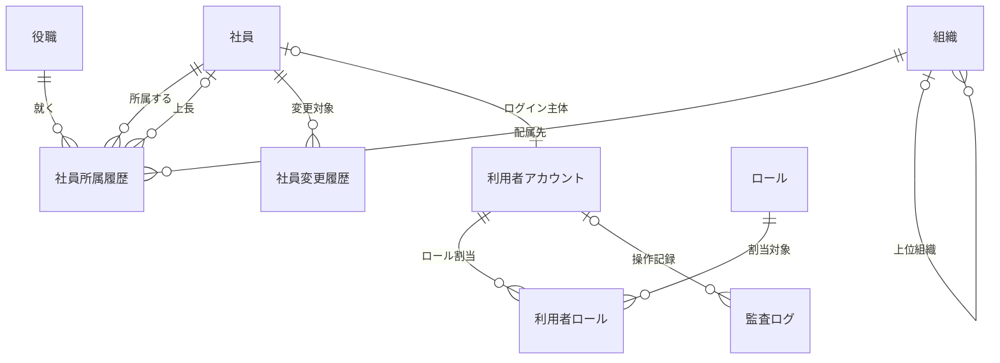
```mermaid
erDiagram
    "社員" ||--o{ "社員所属履歴" : "所属する"
    "組織" ||--o{ "社員所属履歴" : "配属先"
    "役職" ||--o{ "社員所属履歴" : "就く"
    "社員" |o--o{ "社員所属履歴" : "上長"
    "組織" |o--o{ "組織" : "上位組織"
    "社員" ||--o{ "社員変更履歴" : "変更対象"
    "社員" |o--o| "利用者アカウント" : "ログイン主体"
    "利用者アカウント" ||--o{ "利用者ロール" : "ロール割当"
    "ロール" ||--o{ "利用者ロール" : "割当対象"
    "利用者アカウント" |o--o{ "監査ログ" : "操作記録"
```

### 2.3.1 エンティティ定義

| エンティティ | 意味・役割 | 業務識別子 | 主要属性 | 主な利用UC |
|---|---|---|---|---|
| 社員 | 雇用契約のある人物の基本情報・在籍状態・退職予定を表す | 社員番号 | 姓、名、姓カナ、名カナ、メールアドレス、連絡先電話番号、入社日、退職日、退職区分、雇用区分、在籍状態 | UC-001〜UC-009、UC-014 |
| 社員所属履歴 | 社員がどの組織にどの役職・上長で所属したかの有効期間履歴を表す | 対象社員＋適用開始日 | 所属組織、役職、上長社員、適用開始日、適用終了日 | UC-001〜UC-004、UC-006、UC-009、UC-014 |
| 組織 | 組織の階層と利用可能期間を表す | 組織コード | 組織名、上位組織、有効開始日、有効終了日、利用可否 | UC-001〜UC-003、UC-006、UC-009、UC-010、UC-012 |
| 役職 | 役職の序列と利用可能期間を表す | 役職コード | 役職名、役職レベル、有効開始日、有効終了日、利用可否 | UC-001〜UC-003、UC-006、UC-009、UC-011 |
| 社員変更履歴 | 社員に対する業務上の変更概要の追記記録を表す | 対象社員＋変更日時 | 変更種別、変更概要、変更日時、変更者、実行元 | 記録: UC-001、UC-003、UC-004、UC-007、UC-012、UC-014 ／ 参照: UC-008 |
| 利用者アカウント | 外部認証主体とシステム利用状態、社員との対応を表す | 外部認証主体 | 対象社員、利用状態 | UC-005、UC-012 |
| ロール | システム上の役割(固定4種)を表す | ロールコード | ロール名、利用状態 | UC-005、UC-012 |
| 利用者ロール | 利用者へのロール割当の有効期間を表す | 利用者＋ロール＋有効開始日 | 有効開始日、有効終了日 | UC-005、UC-012 |
| 監査ログ | 誰がいつ何を操作しどんな結果になったかの証跡を表す | 発生日時＋操作＋対象 | 操作者、操作、対象種別、対象、発生日時、結果、実行元、相関ID | UC-001、UC-003〜UC-005、UC-007、UC-009〜UC-012、UC-014 |

### 2.3.2 関連定義

| 関連 | 多重度 | 意味・制約 |
|---|---|---|
| 社員 − 社員所属履歴（所属する） | 1 対 0..* | 社員は所属履歴を複数持つ。同一社員の適用期間は重複しない |
| 組織 − 社員所属履歴（配属先） | 1 対 0..* | 所属履歴は配属先組織を1つ参照する。参照期間は組織の利用可能期間に包含される |
| 役職 − 社員所属履歴（就く） | 1 対 0..* | 所属履歴は役職を1つ参照する。参照期間は役職の利用可能期間に包含される |
| 社員 − 社員所属履歴（上長） | 0..1 対 0..* | 上長は任意。本人自身を上長に指定できない |
| 組織 − 組織（上位組織） | 0..1 対 0..* | 組織は階層を構成する。循環を禁止し、上位組織の利用可能期間は下位組織の期間を包含する |
| 社員 − 社員変更履歴（変更対象） | 1 対 0..* | 社員への変更概要を追記記録し、変更しない |
| 社員 − 利用者アカウント（ログイン主体） | 0..1 対 0..1 | 社員と利用者アカウントは互いに最大1件対応する。社員と紐付かない社員外管理者のアカウントを許容する |
| 利用者アカウント − 利用者ロール（ロール割当） | 1 対 0..* | 割当は有効期間を持ち、同一ロールの現行割当を重複させない |
| ロール − 利用者ロール（割当対象） | 1 対 0..* | ロールは§2.4の利用者ロール固定4種だけとする |
| 利用者アカウント − 監査ログ（操作記録） | 0..1 対 0..* | 操作証跡を追記記録する。JOB実行および認証前失敗では操作者を特定しない |

## 2.4 共通コード定義

画面の選択肢、APIの列挙値、モジュールの妥当性検証、DB制約で共通利用する固定コードを次のとおり定義する。これらは組織・役職のような更新可能マスターではなく、設計変更時に本表と各利用箇所を同時改訂する静的な業務コードである。

| 区分種別 | コード | 表示名 | 利用条件 |
|---|---|---|---|
| 雇用区分 | `REGULAR` | 正社員 | 社員登録・基本情報更新で指定可 |
| 雇用区分 | `CONTRACT` | 契約社員 | 社員登録・基本情報更新で指定可 |
| 雇用区分 | `PART_TIME` | パート・アルバイト | 社員登録・基本情報更新で指定可 |
| 雇用区分 | `TEMPORARY` | 派遣社員 | 社員登録・基本情報更新で指定可 |
| 雇用区分 | `OTHER` | その他 | 社員登録・基本情報更新で指定可 |
| 退職区分 | `VOLUNTARY` | 自己都合 | 退職処理で指定可 |
| 退職区分 | `COMPANY` | 会社都合 | 退職処理で指定可 |
| 退職区分 | `RETIREMENT_AGE` | 定年 | 退職処理で指定可 |
| 退職区分 | `CONTRACT_END` | 契約満了 | 退職処理で指定可 |
| 退職区分 | `OTHER` | その他 | 退職処理で指定可 |
| 在籍状態 | `ACTIVE` | 在籍中 | 登録時の初期値、検索・表示・出力に使用 |
| 在籍状態 | `RETIRED` | 退職 | 退職確定後、検索・表示・出力に使用 |
| 利用者ロール | `HR` | 人事担当者 | 社員の登録・更新・異動・退職、全社員の参照、変更履歴参照、検索結果出力を担う利用者へ割当可 |
| 利用者ロール | `DEPARTMENT_MANAGER` | 部門管理者 | 管轄組織配下の社員参照と検索結果出力を担う利用者へ割当可 |
| 利用者ロール | `EMPLOYEE` | 一般社員 | 本人情報の参照と本人連絡先の更新を行う利用者へ割当可 |
| 利用者ロール | `SYSTEM_ADMIN` | システム管理者 | 全社員の参照、変更履歴参照、組織・役職・権限の管理を担う利用者へ割当可 |
| 閲覧スコープ | `ALL` | 全社員 | `HR`・`SYSTEM_ADMIN`に成立。全社員を参照・出力対象とする。優先順位は`ALL` > `ORGANIZATION` > `SELF` |
| 閲覧スコープ | `ORGANIZATION` | 管轄組織配下 | `DEPARTMENT_MANAGER`に成立。業務日時点の主所属組織とその全子孫組織の所属社員を対象とする |
| 閲覧スコープ | `SELF` | 本人 | `EMPLOYEE`に成立。操作者に紐づく本人だけを対象とする |

- 画面は本表のコードと表示名をアプリケーション定義から生成し、DBを参照して選択肢を取得しない。
- APIはコード値を受け渡し、M-002が本表との一致を業務検証する。表示名への変換は画面表示または出力データ生成時に行う。
- DBは本表のコード値をCHECK制約等で担保し、本表に定義されたコードだけを格納可能とする（物理的な制約定義は§5 データベース設計を正本とする）。
- 検索条件の`ALL`は絞り込みなしを表すAPI制御値であり、在籍状態として保存しない。
- 利用者ロールのコードと表示名は固定値とし、アプリケーション機能から追加・変更・削除しない。ロールの利用可否は有効フラグ、利用者への割当可否は割当有効期間（§2.3の利用者ロール）で制御する。ロール別の操作可否・閲覧スコープ・項目許可は§2.2の各ユースケースで定義する。


---

# 3. シーケンス設計

本節は、社員名簿管理システムの全ユースケース(UC-001〜UC-014)における論理構成要素間の連携を、正常系・代替/例外系に分けて時系列で検証する。各状態パターン(SP-x)は正常系または代替・例外系のいずれかとして、各図中のalt分岐または直後の連携定義(条件分岐表)で表現し、各図の直後の連携定義でデータ参照・更新とトランザクション境界を補足する。3.2〜3.3で社員登録(UC-001)、3.4で社員検索(UC-002)、3.5で社員異動(UC-003)、3.6で社員退職受付(UC-004)と退職日到来自動反映(UC-014)、3.7でログイン(UC-005)、3.8で社員詳細参照(UC-006)、3.9で社員基本情報更新(UC-007)、3.10で変更履歴参照(UC-008)、3.11で検索結果出力(UC-009)、3.12で組織マスター管理(UC-010)、3.13で役職マスター管理(UC-011)、3.14で権限管理(UC-012)、3.15でログアウト(UC-013)を展開する。各ユースケースのシーケンス図作成要否は§3.1.1に定める。

## 3.1 論理構成要素

§3.2〜§3.15の全`actor`・`participant`を次表に一度だけ登録する。「図中表示名」はMermaid宣言と完全一致させ、§4〜§8の設計ID・正式名称を変更せず使用する。行はアクター、画面（§4）、データベース（§5）、API（§6）、JOB（§7）、モジュール（§8）、外部システム・クライアント状態の順に、本表を正本として詳細化する章の順で並べる。

| 図中表示名 | 宣言 | 種別 | ID/参照 | 詳細正本 | 使用シーケンス | 連携責務・制約 |
|---|---|---|---|---|---|---|
| 人事担当者 | actor | アクター | HR | §1.3・§2.2・§2.4 | §3.2・§3.3・§3.5・§3.6（オンライン） | 社員登録・異動・退職を操作する |
| 認証済み利用者 | actor | アクター | 全固定ロール | §1.3・§2.2・§2.4 | §3.4・§3.8 | 認可範囲内で社員を検索・参照する |
| 人事担当者または対象社員本人 | actor | アクター | HR / EMPLOYEE | §1.3・§2.2・§2.4 | §3.9 | 許可項目に限り社員基本情報を更新する |
| 人事担当者またはシステム管理者 | actor | アクター | HR / SYSTEM_ADMIN | §1.3・§2.2・§2.4 | §3.10 | 変更履歴を参照する |
| 人事担当者または部門管理者 | actor | アクター | HR / DEPARTMENT_MANAGER | §1.3・§2.2・§2.4 | §3.11 | 認可範囲内の検索結果を出力する |
| システム管理者 | actor | アクター | SYSTEM_ADMIN | §1.3・§2.2・§2.4 | §3.12〜§3.14 | マスター・権限を管理する |
| 全利用者 | actor | アクター | 全固定ロール | §1.3・§2.2・§2.4 | §3.7・§3.15 | ログイン・ログアウトを操作する |
| SCR-001 社員検索画面 | participant | 画面 | SCR-001 | §4.3 | §3.4・§3.11 | 検索条件・一覧・出力操作を扱う |
| SCR-002 社員詳細画面 | participant | 画面 | SCR-002 | §4.4 | §3.8 | 基本情報・所属・役職・在籍状態を表示する |
| SCR-003 社員登録画面 | participant | 画面 | SCR-003 | §4.5 | §3.2・§3.3 | 登録入力と結果を扱う |
| SCR-004 社員編集画面 | participant | 画面 | SCR-004 | §4.6 | §3.9 | 基本情報の編集と競合結果を扱う |
| SCR-005 社員異動画面 | participant | 画面 | SCR-005 | §4.7 | §3.5 | 異動入力と結果を扱う |
| SCR-006 退職処理画面 | participant | 画面 | SCR-006 | §4.8 | §3.6（オンライン） | 退職入力と結果を扱う |
| SCR-007 変更履歴画面 | participant | 画面 | SCR-007 | §4.9 | §3.10 | 変更履歴を表示する |
| SCR-008 組織マスター画面 | participant | 画面 | SCR-008 | §4.10 | §3.12 | 組織管理操作を扱う |
| SCR-009 役職マスター画面 | participant | 画面 | SCR-009 | §4.11 | §3.13 | 役職管理操作を扱う |
| SCR-010 ログイン画面 | participant | 画面 | SCR-010 | §4.12 | §3.7・§3.15 | 認証情報入力と未認証状態を表示する |
| SCR-011 権限管理画面 | participant | 画面 | SCR-011 | §4.13 | §3.14 | ロール割当操作を扱う |
| 認証済み画面（SCR-001〜SCR-009・SCR-011） | participant | 画面グループ | SCR-001〜SCR-009・SCR-011 | §4.0・§4.3〜§4.11・§4.13 | §3.15 | 共通ログアウト起点と画面内個人情報の破棄対象を表す |
| Cloudflare D1 | participant | DB | Cloudflare D1 / SQLite | §2.3・§5.1・§5.2 | §3.2〜§3.14（ログアウトを除く） | §2.3の全エンティティに対応する業務9表と技術表`TX_MUTATION_GUARD`を保持する。M-006以外との直接接続を禁止する |
| Cloudflare Worker API | participant | API | API-001〜API-018 | §6.1・§6.2 | §3.2〜§3.14（オンライン） | 認証主体・HTTP構文を確定し、図中矢印に示す単一業務モジュールへ委譲する。最終認可・業務検証・DBアクセスは行わない |
| Cloudflare Cron Trigger | participant | 起動基盤 | JOB-001/Cron | §7.3.1 | §3.6（非同期） | 日次の`scheduled`イベントを起動する |
| Worker scheduledハンドラー | participant | JOBハンドラー | JOB-001/scheduled | §7.3.4〜§7.3.6 | §3.6（非同期） | 初回Queueメッセージだけを投入する |
| Cloudflare Queues | participant | メッセージ基盤 | JOB-001 Queue | §7.1・§7.3 | §3.6（非同期） | 初回・継続・再配信メッセージを1件単位で配送する |
| Worker queueハンドラー | participant | JOBハンドラー | JOB-001/queue | §7.3.4〜§7.3.6 | §3.6（非同期） | メッセージを検証し、JOB-001を1回呼び、ack・retry・継続投入を制御する |
| JOB-001 退職日到来反映 | participant | JOB | JOB-001 | §7.2・§7.3 | §3.6（非同期） | M-002/IF-07へ1チャンクを委譲する。M-006・D1・SQLへ直接アクセスしない |
| M-001 プレゼンテーション | participant | モジュール | M-001 | §8.5 | §3.2〜§3.15（オンライン・クライアント） | 画面イベントをAPIへ送り、応答を画面状態へ反映する。ログアウトだけは内部完結する |
| M-002 社員管理アプリケーション | participant | モジュール | M-002 | §8.6 | §3.2〜§3.6・§3.8〜§3.14 | ログイン・ログアウト以外のユースケース進行を制御する |
| M-003 認証・認可 | participant | モジュール | M-003 | §8.7 | §3.2〜§3.14（オンライン） | ログイン、操作権限、閲覧範囲、ロール割当妥当性を判定する |
| M-004 社員ドメイン | participant | モジュール | M-004 | §8.8 | §3.2・§3.3・§3.5・§3.6・§3.9 | 入力・状態遷移・所属期間整合を判定する |
| M-005 マスター管理 | participant | モジュール | M-005 | §8.9 | §3.2〜§3.5・§3.12〜§3.14 | 組織・役職の取得、有効性・重複・更新可否を判定する |
| M-006 D1データアクセス | participant | モジュール | M-006 | §8.10・§9 | §3.2〜§3.14（ログアウトを除く） | D1 BindingとSQLite SQLの実行を一元化する。D1へ接続できる唯一の要素 |
| M-007 監査ログ | participant | モジュール | M-007 | §8.11 | §3.2・§3.5〜§3.7・§3.9・§3.11〜§3.14 | 監査イベントを生成し、保存をM-006へ委譲する |
| M-008 外部認証アダプター | participant | モジュール | M-008 | §8.12 | §3.7 | 社内認証基盤との接続差異を吸収する。外部認証へ接続できる唯一のモジュール |
| 社内認証基盤 | participant | 外部システム | 外部認証サービス | §0.2・§1.5・§1.6・§8.12 | §3.7 | 認証情報を検証する |
| ブラウザータブ内メモリ | participant | クライアント状態 | M-001内部 | §4.0・§8.5 | §3.15 | アクセストークンと検証済み戻り先をタブ内だけに保持する |

オンライン経路は図中で「アクター→SCR→M-001→Cloudflare Worker API→M-002（ログインのみM-003）→下位モジュール→M-006→Cloudflare D1」を省略せず表す。UC-013だけはM-001内で完結し、API・JOB・M-002〜M-008・D1を使用しない。非同期経路は「Cloudflare Cron Trigger→Worker `scheduled`ハンドラー→Cloudflare Queues→Worker `queue`ハンドラー→JOB-001→M-002→M-006→Cloudflare D1」とする。API・JOBからM-006、D1、SQLへの直接接続を禁止する。

### 3.1.1 シーケンス図作成要否

§2.2の全ユースケース(UC-001〜UC-014)について、本節でシーケンス図を作成するか否かと理由を定義する。

| UC-ID | ユースケース | 図の要否 | 理由 |
|---|---|---|---|
| UC-001 | 社員を登録する | 必要 | 画面・社員管理・マスター・データ・監査が連携し、一意性確認と複数データの一体登録が必要なため |
| UC-002 | 社員を検索する | 必要 | 権限制御（閲覧範囲）と検索条件を組み合わせてデータを検索するため |
| UC-003 | 社員を異動する | 必要 | 所属履歴の期間整合性を保ちつつ現履歴終了と新履歴登録を整合更新するため |
| UC-004 | 社員を退職にする | 必要 | 社員状態と所属履歴を整合して更新し、監査を記録するため |
| UC-005 | ログインする | 必要 | 外部認証基盤連携・セッション発行・認可情報取得の連携を確認するため |
| UC-006 | 社員詳細を参照する | 必要 | 閲覧権限による表示項目の制限と対象存在確認の連携を確認するため |
| UC-007 | 社員基本情報を更新する | 必要 | 入力検証・一意性・更新競合(版数照合)の検知を伴う更新の連携を確認するため |
| UC-008 | 変更履歴を参照する | 必要 | 参照権限の判定と変更履歴の取得の連携を確認するため |
| UC-009 | 検索結果を出力する | 必要 | 出力権限・許可項目への限定と監査記録の連携を確認するため |
| UC-010 | 組織マスターを管理する | 必要 | 権限・一意性・有効期間を伴う登録/更新/無効化の連携を確認するため |
| UC-011 | 役職マスターを管理する | 必要 | 権限・一意性・有効期間を伴う登録/更新/無効化の連携を確認するため |
| UC-012 | 権限を管理する | 必要 | 対象利用者・ロール妥当性の確認とロール割当更新・監査の連携を確認するため |
| UC-013 | ログアウトする | 必要 | APIを呼ばずに進行中要求、メモリ上の認証状態、画面内個人情報を破棄して未認証状態へ収束するクライアント内順序を確認するため |
| UC-014 | 退職日到来を自動反映する | 必要 | Cron、Queues、JOB、M-002、M-006の連携、チャンク継続、冪等性、再配信、DLQを確認するため |

### 3.1.2 シーケンス・詳細設計対応

図中のAPI矢印には次表のAPI-IDを付記する。補助取得APIを含め、画面・DB・API・JOB・モジュールの詳細設計は次表から逆引きする。

| シーケンス | UC/SP | アクター／起動元 | 画面・M-001 | API | JOB | 主処理モジュール／IF | 下位モジュール | 永続化・外部 |
|---|---|---|---|---|---|---|---|---|
| §3.2 社員登録・正常系 | UC-001/SP-1・SP-2 | 人事担当者 | SCR-003 / M-001 | API-008・API-009（候補）、API-003 | なし | M-002/IF-10・IF-11・IF-03 | M-003・M-004・M-005・M-006・M-007 | Cloudflare D1 |
| §3.3 社員登録・例外系 | UC-001/SP-3〜SP-7 | 人事担当者 | SCR-003 / M-001 | API-003 | なし | M-002/IF-03 | M-003・M-004・M-005・M-006 | Cloudflare D1 |
| §3.4 社員検索 | UC-002/SP-1〜SP-4 | 認証済み利用者 | SCR-001 / M-001 | API-001・API-008・API-009 | なし | M-002/IF-01・IF-10・IF-11 | M-003・M-005・M-006 | Cloudflare D1 |
| §3.5 社員異動 | UC-003/SP-1〜SP-7 | 人事担当者 | SCR-005 / M-001 | API-001・API-002・API-005・API-008・API-009 | なし | M-002/IF-01・IF-02・IF-05・IF-10・IF-11 | M-003・M-004・M-005・M-006・M-007 | Cloudflare D1 |
| §3.6 社員退職（オンライン） | UC-004/SP-1〜SP-5 | 人事担当者 | SCR-006 / M-001 | API-002・API-006 | なし | M-002/IF-02・IF-06 | M-003・M-004・M-006・M-007 | Cloudflare D1 |
| §3.6 退職日到来反映（非同期） | UC-014/SP-1〜SP-8 | Cron Trigger / Queues | なし | なし | JOB-001 | M-002/IF-07 | M-004・M-006・M-007 | Cloudflare D1 |
| §3.7 ログイン | UC-005/SP-1〜SP-4 | 全利用者 | SCR-010 / M-001 | API-010 | なし | M-003/IF-01 | M-006・M-007・M-008 | Cloudflare D1・社内認証基盤 |
| §3.8 社員詳細参照 | UC-006/SP-1〜SP-3 | 認証済み利用者 | SCR-002 / M-001 | API-002 | なし | M-002/IF-02 | M-003・M-006 | Cloudflare D1 |
| §3.9 社員基本情報更新 | UC-007/SP-1〜SP-5 | 人事担当者／対象社員本人 | SCR-004 / M-001 | API-002・API-004 | なし | M-002/IF-02・IF-04 | M-003・M-004・M-006・M-007 | Cloudflare D1 |
| §3.10 変更履歴参照 | UC-008/SP-1〜SP-3 | 人事担当者／システム管理者 | SCR-007 / M-001 | API-002・API-007 | なし | M-002/IF-02・IF-08 | M-003・M-006 | Cloudflare D1 |
| §3.11 検索結果出力 | UC-009/SP-1〜SP-3 | 人事担当者／部門管理者 | SCR-001 / M-001 | API-018 | なし | M-002/IF-09 | M-003・M-006・M-007 | Cloudflare D1 |
| §3.12 組織マスター管理 | UC-010/SP-1〜SP-5 | システム管理者 | SCR-008 / M-001 | API-008・API-011・API-012 | なし | M-002/IF-10 | M-003・M-005・M-006・M-007 | Cloudflare D1 |
| §3.13 役職マスター管理 | UC-011/SP-1〜SP-5 | システム管理者 | SCR-009 / M-001 | API-009・API-013・API-014 | なし | M-002/IF-11 | M-003・M-005・M-006・M-007 | Cloudflare D1 |
| §3.14 権限管理 | UC-012/SP-1〜SP-6 | システム管理者 | SCR-011 / M-001 | API-001・API-008・API-015・API-016・API-017 | なし | M-002/IF-01・IF-10・IF-12 | M-003・M-005・M-006・M-007 | Cloudflare D1 |
| §3.15 ログアウト | UC-013/SP-1〜SP-4 | 全利用者 | SCR-001〜SCR-009・SCR-011→SCR-010 / M-001/IF-04 | なし | なし | M-001/IF-04 | なし | なし |

### 3.1.3 Cloudflare D1共通再試行契約

D1書込みの即時再試行は、Cloudflareが再試行推奨として示す`D1 DB reset because its code was updated.`、`Internal error while starting up D1 DB storage caused object to be reset.`、`Network connection lost.`、`Internal error in D1 DB storage caused object to be reset.`、`Cannot resolve D1 DB due to transient issue on remote node.`だけを対象とする。M-002は初回に加えて最大2回、full jitterで0〜500ms、0〜1000ms待機してbatch全体を再試行する。

書込み送信後に成否が不明な場合は、再試行前にM-006経由で対象状態とversionを読み直す。意図した状態・versionならコミット済み成功、事前状態なら未反映として再試行、どちらでもなければ競合とする。version競合、制約違反、業務条件不成立は再試行しない。過負荷、タイムアウト、CPU、メモリ、実行文予算超過は即時再試行せず、オンラインAPIでは一時障害応答、JOBではretryable属性付き`DATA_ACCESS_ERROR`としてQueue再配信へ委ねる。

## 3.2 社員登録・正常系

UC-001(状態パターン UC-001/SP-1。氏名カナを省略する UC-001/SP-2 も同一の登録フローで処理する)。入力正常・権限あり・マスター有効・重複なしのとき、社員基本情報と初期所属履歴を単一トランザクションで登録し、社員詳細を表示する。

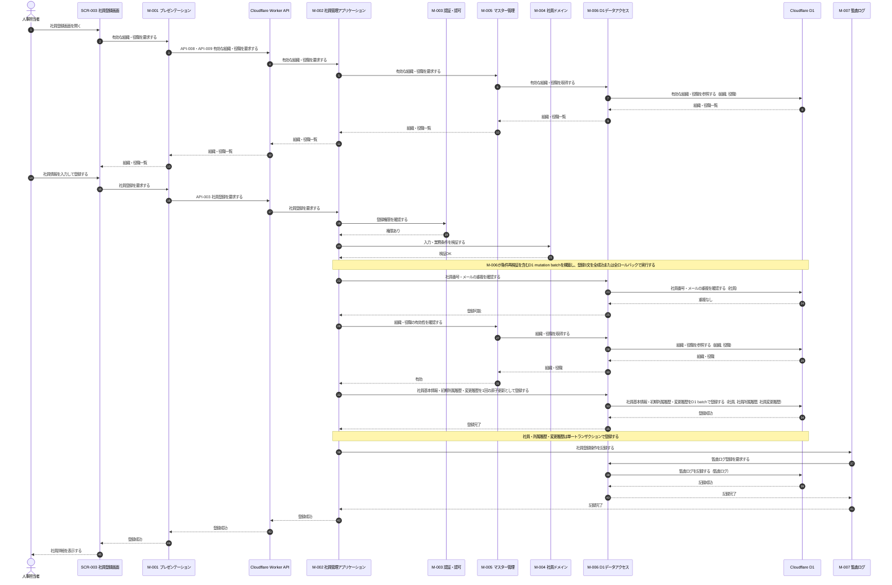
```mermaid
sequenceDiagram
    autonumber
    actor HR as 人事担当者
    participant UI as SCR-003 社員登録画面
    participant PRES as M-001 プレゼンテーション
    participant API as Cloudflare Worker API
    participant APP as M-002 社員管理アプリケーション
    participant AUTH as M-003 認証・認可
    participant MST as M-005 マスター管理
    participant DOM as M-004 社員ドメイン
    participant DATA as M-006 D1データアクセス
    participant DB as Cloudflare D1
    participant AUDIT as M-007 監査ログ

    HR->>UI: 社員登録画面を開く
    UI->>PRES: 有効な組織・役職を要求する
    PRES->>API: API-008・API-009 有効な組織・役職を要求する
    API->>APP: 有効な組織・役職を要求する
    APP->>MST: 有効な組織・役職を要求する
    MST->>DATA: 有効な組織・役職を取得する
    DATA->>DB: 有効な組織・役職を参照する（組織, 役職）
    DB-->>DATA: 組織・役職一覧
    DATA-->>MST: 組織・役職一覧
    MST-->>APP: 組織・役職一覧
    APP-->>API: 組織・役職一覧
    API-->>PRES: 組織・役職一覧
    PRES-->>UI: 組織・役職一覧
    HR->>UI: 社員情報を入力して登録する
    UI->>PRES: 社員登録を要求する
    PRES->>API: API-003 社員登録を要求する
    API->>APP: 社員登録を要求する
    APP->>AUTH: 登録権限を確認する
    AUTH-->>APP: 権限あり
    APP->>DOM: 入力・業務条件を検証する
    DOM-->>APP: 検証OK
    Note over APP,DB: M-006が条件再検証を含むD1 mutation batchを構築し、登録3文を全成功または全ロールバックで実行する
    APP->>DATA: 社員番号・メールの重複を確認する
    DATA->>DB: 社員番号・メールの重複を確認する（社員）
    DB-->>DATA: 重複なし
    DATA-->>APP: 登録可能
    APP->>MST: 組織・役職の有効性を確認する
    MST->>DATA: 組織・役職を取得する
    DATA->>DB: 組織・役職を参照する（組織, 役職）
    DB-->>DATA: 組織・役職
    DATA-->>MST: 組織・役職
    MST-->>APP: 有効
    APP->>DATA: 社員基本情報・初期所属履歴・変更履歴を1回の原子更新として登録する
    DATA->>DB: 社員基本情報・初期所属履歴・変更履歴をD1 batchで登録する（社員, 社員所属履歴, 社員変更履歴）
    DB-->>DATA: 登録成功
    DATA-->>APP: 登録完了
    Note over APP,DB: 社員・所属履歴・変更履歴は単一トランザクションで登録する
    APP->>AUDIT: 社員登録操作を記録する
    AUDIT->>DATA: 監査ログ登録を要求する
    DATA->>DB: 監査ログを記録する（監査ログ）
    DB-->>DATA: 記録成功
    DATA-->>AUDIT: 記録完了
    AUDIT-->>APP: 記録完了
    APP-->>API: 登録成功
    API-->>PRES: 登録成功
    PRES-->>UI: 登録成功
    UI-->>HR: 社員詳細を表示する
```

**連携定義**

条件分岐

| 条件ID | 判定箇所 | 条件 | 成立時 | 不成立時 | 根拠 |
|---|---|---|---|---|---|
| COND-01 | 認可機能 | 実行者が社員登録権限を持つ | 登録処理を継続する | 権限不足エラー(3.3で表現) | UC-001/SP-1 (不成立=UC-001/SP-3) |
| COND-02 | 社員ドメイン | 入力・業務条件が妥当 | 重複確認へ進む | 入力エラー(3.3で表現) | UC-001/SP-1 (不成立=UC-001/SP-4) |
| COND-03 | データアクセス | 社員番号・メールが重複しない | マスター確認へ進む | 重複エラー(3.3で表現) | UC-001/SP-1 (不成立=UC-001/SP-5,SP-6) |
| COND-04 | マスター管理機能 | 組織・役職がともに有効 | 登録を実行する | マスター無効エラー(3.3で表現) | UC-001/SP-1 (不成立=UC-001/SP-7) |

データ参照・更新

| エンティティ | CRUD | 目的 | 実行主体 |
|---|---|---|---|
| 組織 | R | 有効な組織の取得・有効性確認 | データアクセス |
| 役職 | R | 有効な役職の取得・有効性確認 | データアクセス |
| 社員 | R | 社員番号・メールアドレスの重複確認 | データアクセス |
| 社員 | C | 社員基本情報の登録(在籍状態=在籍中で登録) | データアクセス |
| 社員所属履歴 | C | 初期所属履歴の登録(適用開始日=入社日) | データアクセス |
| 社員変更履歴 | C | 登録操作の業務変更履歴記録 | データアクセス |
| 監査ログ | C | 社員登録操作の証跡記録 | データアクセス（M-007から委譲） |

トランザクション境界

| 境界ID | 開始 | 終了 | 対象更新 | ロールバック条件 | 管理主体 |
|---|---|---|---|---|---|
| TX-001 | M-006がD1 mutation batchを送信 | `batch()`成功 | 社員・社員所属履歴・社員変更履歴 | マスター条件・一意制約・参照制約またはいずれかの文が失敗した場合、D1がbatch全体をロールバック | M-002が境界を宣言しM-006が実行 |

補足事項

| 観点 | 内容 |
|---|---|
| 同期/非同期 | 画面〜登録完了まで同期。監査ログ記録は業務トランザクションと別に行う |
| 整合性 | 社員番号・メールアドレスの一意性と、入社日時点の組織・役職利用可否をSQLite制約・トリガー・条件付き文でbatch内に再検証する。再試行可否、結果不明時の確認、待機は§3.1.3の共通契約に従う |
| 監査ログ | 監査ログは業務コミット後に別トランザクションで記録する。記録失敗時も業務更新は戻さず、運用アラートを通知して成功結果を返す |

## 3.3 社員登録・入力不正/重複

UC-001 の代替・例外系(UC-001/SP-3〜SP-7)。権限確認→入力検証→重複確認→マスター有効性の順で判定し、同時に複数条件が不成立でもこの優先順で最初のエラーだけを返す。いずれかで不成立となった場合は該当エラーを表示して登録しない。

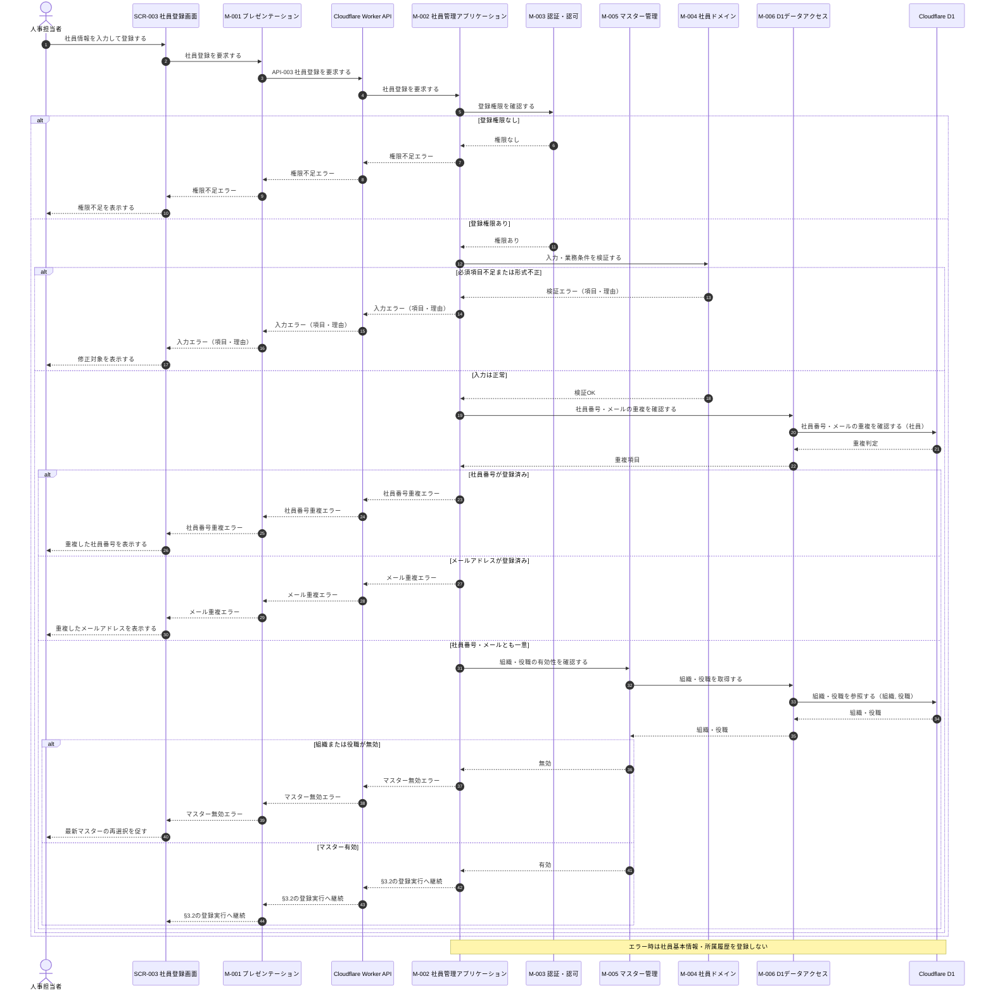
```mermaid
sequenceDiagram
    autonumber
    actor HR as 人事担当者
    participant UI as SCR-003 社員登録画面
    participant PRES as M-001 プレゼンテーション
    participant API as Cloudflare Worker API
    participant APP as M-002 社員管理アプリケーション
    participant AUTH as M-003 認証・認可
    participant MST as M-005 マスター管理
    participant DOM as M-004 社員ドメイン
    participant DATA as M-006 D1データアクセス
    participant DB as Cloudflare D1

    HR->>UI: 社員情報を入力して登録する
    UI->>PRES: 社員登録を要求する
    PRES->>API: API-003 社員登録を要求する
    API->>APP: 社員登録を要求する
    APP->>AUTH: 登録権限を確認する
    alt 登録権限なし
        AUTH-->>APP: 権限なし
        APP-->>API: 権限不足エラー
        API-->>PRES: 権限不足エラー
        PRES-->>UI: 権限不足エラー
        UI-->>HR: 権限不足を表示する
    else 登録権限あり
        AUTH-->>APP: 権限あり
        APP->>DOM: 入力・業務条件を検証する
        alt 必須項目不足または形式不正
            DOM-->>APP: 検証エラー（項目・理由）
            APP-->>API: 入力エラー（項目・理由）
            API-->>PRES: 入力エラー（項目・理由）
            PRES-->>UI: 入力エラー（項目・理由）
            UI-->>HR: 修正対象を表示する
        else 入力は正常
            DOM-->>APP: 検証OK
            APP->>DATA: 社員番号・メールの重複を確認する
            DATA->>DB: 社員番号・メールの重複を確認する（社員）
            DB-->>DATA: 重複判定
            DATA-->>APP: 重複項目
            alt 社員番号が登録済み
                APP-->>API: 社員番号重複エラー
                API-->>PRES: 社員番号重複エラー
                PRES-->>UI: 社員番号重複エラー
                UI-->>HR: 重複した社員番号を表示する
            else メールアドレスが登録済み
                APP-->>API: メール重複エラー
                API-->>PRES: メール重複エラー
                PRES-->>UI: メール重複エラー
                UI-->>HR: 重複したメールアドレスを表示する
            else 社員番号・メールとも一意
                APP->>MST: 組織・役職の有効性を確認する
                MST->>DATA: 組織・役職を取得する
                DATA->>DB: 組織・役職を参照する（組織, 役職）
                DB-->>DATA: 組織・役職
                DATA-->>MST: 組織・役職
                alt 組織または役職が無効
                    MST-->>APP: 無効
                    APP-->>API: マスター無効エラー
                    API-->>PRES: マスター無効エラー
                    PRES-->>UI: マスター無効エラー
                    UI-->>HR: 最新マスターの再選択を促す
                else マスター有効
                    MST-->>APP: 有効
                    APP-->>API: §3.2の登録実行へ継続
                    API-->>PRES: §3.2の登録実行へ継続
                    PRES-->>UI: §3.2の登録実行へ継続
                end
            end
        end
    end
    Note over APP,DB: エラー時は社員基本情報・所属履歴を登録しない
```

**状態パターン対応**

| 分岐 | 条件 | 状態パターン | 本シーケンスでの処理 |
|---|---|---|---|
| a | 登録権限なし | UC-001/SP-3 | 権限不足を表示し、登録しない |
| b | 必須項目不足または形式不正 | UC-001/SP-4 | 対象項目と理由を表示し、登録しない |
| c | 社員番号が登録済み | UC-001/SP-5 | 重複した社員番号を表示し、登録しない |
| d | メールアドレスが登録済み | UC-001/SP-6 | 重複したメールアドレスを表示し、登録しない |
| e | 組織または役職が無効 | UC-001/SP-7 | 最新マスターの再選択を促し、登録しない |
| f | 保存中に異常(TX-001失敗) | －（§2の業務状態パターン対象外） | 社員・所属履歴をともに未登録として扱う(TX-001 ロールバック。3.2 参照) |

データ参照・更新

| エンティティ | CRUD | 目的 | 実行主体 |
|---|---|---|---|
| 組織 | R | 組織の有効性確認 | データアクセス |
| 役職 | R | 役職の有効性確認 | データアクセス |
| 社員 | R | 社員番号・メールアドレスの重複確認 | データアクセス |

補足: 本シーケンスは参照のみで、いずれの分岐でも社員・所属履歴・変更履歴を登録しない(更新なし)。

## 3.4 社員検索

UC-002(状態パターン UC-002/SP-1〜SP-4)。認可機能から§2.2 UC-002で定義した閲覧スコープを取得し、検索条件と`scopeType`・操作者社員ID・許可組織ID集合・基準日を合わせて社員を検索し、全スコープ共通の安全な一覧項目だけを表示する。

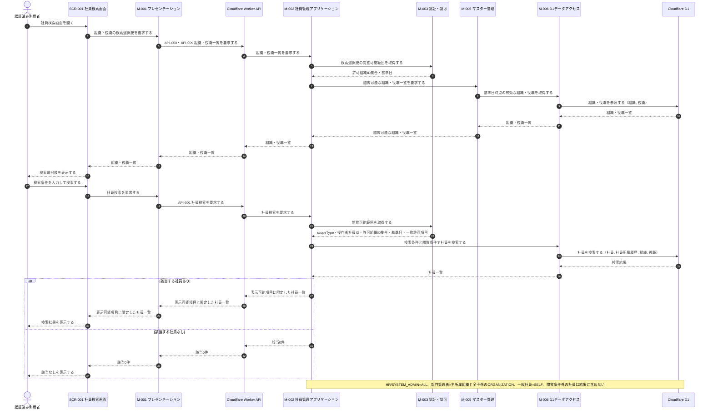
```mermaid
sequenceDiagram
    autonumber
    actor U as 認証済み利用者
    participant UI as SCR-001 社員検索画面
    participant PRES as M-001 プレゼンテーション
    participant API as Cloudflare Worker API
    participant APP as M-002 社員管理アプリケーション
    participant AUTH as M-003 認証・認可
    participant MST as M-005 マスター管理
    participant DATA as M-006 D1データアクセス
    participant DB as Cloudflare D1

    U->>UI: 社員検索画面を開く
    UI->>PRES: 組織・役職の検索選択肢を要求する
    PRES->>API: API-008・API-009 組織・役職一覧を要求する
    API->>APP: 組織・役職一覧を要求する
    APP->>AUTH: 検索選択肢の閲覧可能範囲を取得する
    AUTH-->>APP: 許可組織ID集合・基準日
    APP->>MST: 閲覧可能な組織・役職一覧を要求する
    MST->>DATA: 基準日時点の有効な組織・役職を取得する
    DATA->>DB: 組織・役職を参照する（組織, 役職）
    DB-->>DATA: 組織・役職一覧
    DATA-->>MST: 組織・役職一覧
    MST-->>APP: 閲覧可能な組織・役職一覧
    APP-->>API: 組織・役職一覧
    API-->>PRES: 組織・役職一覧
    PRES-->>UI: 組織・役職一覧
    UI-->>U: 検索選択肢を表示する
    U->>UI: 検索条件を入力して検索する
    UI->>PRES: 社員検索を要求する
    PRES->>API: API-001 社員検索を要求する
    API->>APP: 社員検索を要求する
    APP->>AUTH: 閲覧可能範囲を取得する
    AUTH-->>APP: scopeType・操作者社員ID・許可組織ID集合・基準日・一覧許可項目
    APP->>DATA: 検索条件と閲覧条件で社員を検索する
    DATA->>DB: 社員を検索する（社員, 社員所属履歴, 組織, 役職）
    DB-->>DATA: 検索結果
    DATA-->>APP: 社員一覧
    alt 該当する社員あり
        APP-->>API: 表示可能項目に限定した社員一覧
        API-->>PRES: 表示可能項目に限定した社員一覧
        PRES-->>UI: 表示可能項目に限定した社員一覧
        UI-->>U: 検索結果を表示する
    else 該当する社員なし
        APP-->>API: 該当0件
        API-->>PRES: 該当0件
        PRES-->>UI: 該当0件
        UI-->>U: 該当なしを表示する
    end
    Note over APP,DB: HR/SYSTEM_ADMIN=ALL、部門管理者=主所属組織と全子孫のORGANIZATION、一般社員=SELF。閲覧条件外の社員は結果に含めない
```

**連携定義**

条件分岐

| 条件ID | 判定箇所 | 条件 | 成立時 | 不成立時 | 根拠 |
|---|---|---|---|---|---|
| COND-01 | Cloudflare Worker API | 認証状態が有効である | 認可判定へ進む | UNAUTHENTICATEDを返しSCR-010へ遷移する | UC-002/SP-1・UC-002/SP-2 (不成立=UC-002/SP-3) |
| COND-02 | 認可機能 | 業務日時点で有効な固定ロールがあり、閲覧スコープを解決できる | 範囲内条件で検索する | ロールなし、主所属なし、本人紐付けなしを権限不足として拒否する | UC-002/SP-1 (不成立=UC-002/SP-4) |
| COND-03 | 社員管理アプリケーション | 検索結果が1件以上ある | 一覧を表示する | 該当なしを表示する | UC-002/SP-1 (不成立=UC-002/SP-2) |

データ参照・更新

| エンティティ | CRUD | 目的 | 実行主体 |
|---|---|---|---|
| 社員 | R | 検索条件・閲覧条件に一致する社員の取得 | データアクセス |
| 社員所属履歴 | R | 有効な所属・役職の付与 | データアクセス |
| 組織 | R | 検索選択肢の取得・検索結果への組織名付与 | データアクセス |
| 役職 | R | 検索選択肢の取得・検索結果への役職名付与 | データアクセス |

トランザクション境界

| 内容 |
|---|
| なし(参照のみ。更新を伴わないため) |

補足事項

| 観点 | 内容 |
|---|---|
| 性能 | 一覧は件数が多くなり得るためページング前提で取得する |
| 個人情報保護 | 閲覧条件外の社員は結果に含めず、権限に応じて返却項目を制限する |

## 3.5 社員異動

UC-003(状態パターン UC-003/SP-1〜SP-7。未来日付の異動は UC-003/SP-2 として基本フローに含み、業務日より前の遡及異動は UC-003/SP-7 として拒否する)。権限・在籍状態・異動日時点のマスターと上長有効性を確認し、異動日と既存の所属履歴の期間整合を判定したうえで、直前所属の終了、異動日以降の将来所属取消、新所属登録、変更履歴登録、社員版数更新を単一トランザクションで更新する。

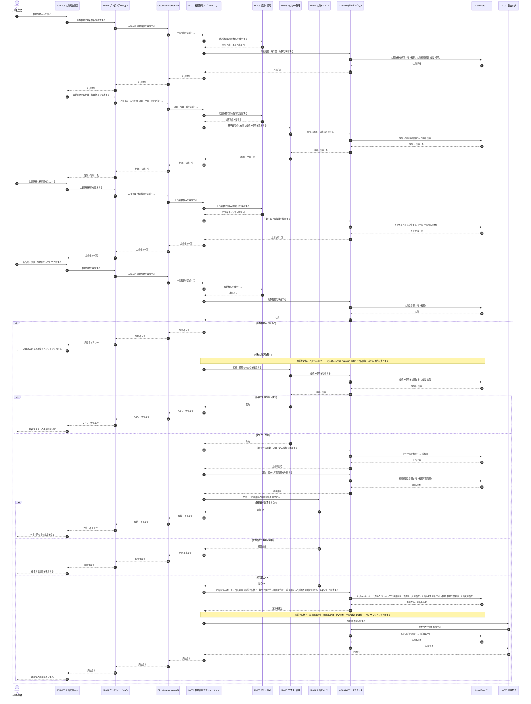
```mermaid
sequenceDiagram
    autonumber
    actor HR as 人事担当者
    participant UI as SCR-005 社員異動画面
    participant PRES as M-001 プレゼンテーション
    participant API as Cloudflare Worker API
    participant APP as M-002 社員管理アプリケーション
    participant AUTH as M-003 認証・認可
    participant MST as M-005 マスター管理
    participant DOM as M-004 社員ドメイン
    participant DATA as M-006 D1データアクセス
    participant DB as Cloudflare D1
    participant AUDIT as M-007 監査ログ

    HR->>UI: 社員異動画面を開く
    UI->>PRES: 対象社員の最新情報を要求する
    PRES->>API: API-002 社員詳細を要求する
    API->>APP: 社員詳細を要求する
    APP->>AUTH: 対象社員の参照権限を確認する
    AUTH-->>APP: 参照可能・返却可能項目
    APP->>DATA: 対象社員・現所属・版数を取得する
    DATA->>DB: 社員詳細を参照する（社員, 社員所属履歴, 組織, 役職）
    DB-->>DATA: 社員詳細
    DATA-->>APP: 社員詳細
    APP-->>API: 社員詳細
    API-->>PRES: 社員詳細
    PRES-->>UI: 社員詳細
    UI->>PRES: 異動日時点の組織・役職候補を要求する
    PRES->>API: API-008・API-009 組織・役職一覧を要求する
    API->>APP: 組織・役職一覧を要求する
    APP->>AUTH: 異動候補の参照権限を確認する
    AUTH-->>APP: 参照可能・基準日
    APP->>MST: 基準日時点の有効な組織・役職を要求する
    MST->>DATA: 有効な組織・役職を取得する
    DATA->>DB: 組織・役職を参照する（組織, 役職）
    DB-->>DATA: 組織・役職一覧
    DATA-->>MST: 組織・役職一覧
    MST-->>APP: 組織・役職一覧
    APP-->>API: 組織・役職一覧
    API-->>PRES: 組織・役職一覧
    PRES-->>UI: 組織・役職一覧
    HR->>UI: 上長候補の検索語を入力する
    UI->>PRES: 上長候補検索を要求する
    PRES->>API: API-001 社員検索を要求する
    API->>APP: 上長候補検索を要求する
    APP->>AUTH: 上長候補の閲覧可能範囲を取得する
    AUTH-->>APP: 閲覧条件・返却可能項目
    APP->>DATA: 在籍中の上長候補を検索する
    DATA->>DB: 上長候補社員を検索する（社員, 社員所属履歴）
    DB-->>DATA: 上長候補一覧
    DATA-->>APP: 上長候補一覧
    APP-->>API: 上長候補一覧
    API-->>PRES: 上長候補一覧
    PRES-->>UI: 上長候補一覧
    HR->>UI: 新所属・役職・異動日を入力して異動する
    UI->>PRES: 社員異動を要求する
    PRES->>API: API-005 社員異動を要求する
    API->>APP: 社員異動を要求する
    APP->>AUTH: 異動権限を確認する
    AUTH-->>APP: 権限あり
    APP->>DATA: 対象社員を取得する
    DATA->>DB: 社員を参照する（社員）
    DB-->>DATA: 社員
    DATA-->>APP: 社員
    alt 対象社員が退職済み
        APP-->>API: 異動不可エラー
        API-->>PRES: 異動不可エラー
        PRES-->>UI: 異動不可エラー
        UI-->>HR: 退職済みのため異動できない旨を表示する
    else 対象社員が在籍中
        Note over APP,DB: 事前判定後、社員versionガードを先頭にしたD1 mutation batchで所属置換一式を原子的に実行する
        APP->>MST: 組織・役職の有効性を確認する
        MST->>DATA: 組織・役職を取得する
        DATA->>DB: 組織・役職を参照する（組織, 役職）
        DB-->>DATA: 組織・役職
        DATA-->>MST: 組織・役職
        alt 組織または役職が無効
            MST-->>APP: 無効
            APP-->>API: マスター無効エラー
            API-->>PRES: マスター無効エラー
            PRES-->>UI: マスター無効エラー
            UI-->>HR: 最新マスターの再選択を促す
        else マスター有効
            MST-->>APP: 有効
            APP->>DATA: 指定上長の在籍・退職予定未登録を確認する
            DATA->>DB: 上長社員を参照する（社員）
            DB-->>DATA: 上長状態
            DATA-->>APP: 上長有効性
            APP->>DATA: 現在・将来の所属履歴を取得する
            DATA->>DB: 所属履歴を参照する（社員所属履歴）
            DB-->>DATA: 所属履歴
            DATA-->>APP: 所属履歴
            APP->>DOM: 異動日と既存履歴の期間整合を判定する
            alt 異動日が業務日より前
                DOM-->>APP: 異動日不正
                APP-->>API: 異動日不正エラー
                API-->>PRES: 異動日不正エラー
                PRES-->>UI: 異動日不正エラー
                UI-->>HR: 本日以降の日付指定を促す
            else 既存履歴と期間が重複
                DOM-->>APP: 期間重複
                APP-->>API: 期間重複エラー
                API-->>PRES: 期間重複エラー
                PRES-->>UI: 期間重複エラー
                UI-->>HR: 重複する期間を表示する
            else 期間整合OK
                DOM-->>APP: 整合OK
                APP->>DATA: 社員versionガード・所属置換（直前所属終了・将来所属取消・新所属登録）・変更履歴・社員版数更新を1回の原子更新として要求する
                DATA->>DB: 社員versionガード先頭のD1 batchで所属履歴を一体置換し変更履歴・社員版数を更新する（社員, 社員所属履歴, 社員変更履歴）
                DB-->>DATA: 更新成功・更新後版数
                DATA-->>APP: 更新後版数
                Note over APP,DB: 直前所属終了・将来所属取消・新所属登録・変更履歴・社員版数更新は単一トランザクションで更新する
                APP->>AUDIT: 異動操作を記録する
                AUDIT->>DATA: 監査ログ登録を要求する
                DATA->>DB: 監査ログを記録する（監査ログ）
                DB-->>DATA: 記録成功
                DATA-->>AUDIT: 記録完了
                AUDIT-->>APP: 記録完了
                APP-->>API: 異動成功
                API-->>PRES: 異動成功
                PRES-->>UI: 異動成功
                UI-->>HR: 更新後の所属を表示する
            end
        end
    end
```

**連携定義**

条件分岐

| 条件ID | 判定箇所 | 条件 | 成立時 | 不成立時 | 根拠 |
|---|---|---|---|---|---|
| COND-01 | 認可機能 | 実行者が社員異動権限を持つ | 対象社員の確認へ進む | 権限不足エラー | UC-003/SP-1 (不成立=UC-003/SP-3) |
| COND-02 | 社員管理アプリケーション | 対象社員が在籍中である | マスター確認へ進む | 異動不可エラー | UC-003/SP-1 (不成立=UC-003/SP-4) |
| COND-03 | マスター管理機能・社員管理アプリケーション | 新組織・新役職が異動日時点で有効で、指定上長が在籍中かつ退職予定未登録 | 期間整合判定へ進む | マスター・上長無効エラー | UC-003/SP-1 (不成立=UC-003/SP-5) |
| COND-04 | 社員ドメイン | 異動日が業務日以降である | 期間重複判定へ進む | 異動日不正エラー | UC-003/SP-1・SP-2 (不成立=UC-003/SP-7) |
| COND-05 | 社員ドメイン | 異動日と既存履歴に期間重複がない | 所属履歴を更新する | 期間重複エラー | UC-003/SP-1 (不成立=UC-003/SP-6) |
| COND-06 | データアクセス | 要求版数と社員の現在版数が一致する | 社員版数を更新してコミットする | 更新競合として全業務更新をロールバックする | NFR-007 / M-002/IF-05 |

データ参照・更新

| エンティティ | CRUD | 目的 | 実行主体 |
|---|---|---|---|
| 社員 | R | 初期表示用の最新情報・退職予定・版数、および退職処理時の在籍状態確認 | データアクセス |
| 組織 | R | 新組織の有効性確認 | データアクセス |
| 役職 | R | 新役職の有効性確認 | データアクセス |
| 社員所属履歴 | R | 現在・将来の履歴取得と期間整合の確認 | データアクセス |
| 社員所属履歴 | U | 現所属履歴の終了(適用終了日の設定) | データアクセス |
| 社員所属履歴 | D（論理） | 異動日以降に開始する既存将来所属の取消 | データアクセス |
| 社員所属履歴 | C | 新所属履歴の登録(適用開始日=異動日) | データアクセス |
| 社員変更履歴 | C | 異動操作の業務変更履歴記録 | データアクセス |
| 社員 | U | 要求版数を条件とする社員版数の更新 | データアクセス |
| 監査ログ | C | 異動操作の証跡記録 | データアクセス（M-007から委譲） |

トランザクション境界

| 境界ID | 開始 | 終了 | 対象更新 | ロールバック条件 | 管理主体 |
|---|---|---|---|---|---|
| TX-003 | M-006が社員versionガードを先頭にD1 mutation batchを送信 | `batch()`成功 | 社員版数・社員所属履歴(直前履歴終了・将来履歴取消・新履歴登録)・社員変更履歴 | version・マスター・上長・期間条件不成立、制約違反またはいずれかの文が失敗した場合、D1がbatch全体をロールバック | M-002が境界を宣言しM-006が実行 |

補足事項

| 観点 | 内容 |
|---|---|
| 同期/非同期 | 画面〜異動完了まで同期。監査ログ記録は業務トランザクションと別に行う |
| 競合制御 | D1単一データベースの逐次実行、先頭の社員versionガード、後続文のガード済みversion条件、SQLiteの期間重複トリガーを併用する。再試行可否、結果不明時の確認、待機は§3.1.3の共通契約に従う |
| 監査ログ | 監査ログは業務コミット後に別トランザクションで記録する。記録失敗時も異動結果は戻さず、運用アラートを通知して成功結果を返す |


## 3.6 社員退職

UC-004(状態パターン UC-004/SP-1〜SP-5。未来日付の退職は UC-004/SP-2 として退職予定を登録する)と、UC-014(状態パターン UC-014/SP-1〜SP-8)を扱う。当日以前は退職状態・所属履歴・変更履歴を即時反映し、未来日は退職予定だけを登録する。到来後はJOB-001が社員1件単位で冪等に退職確定を反映する。

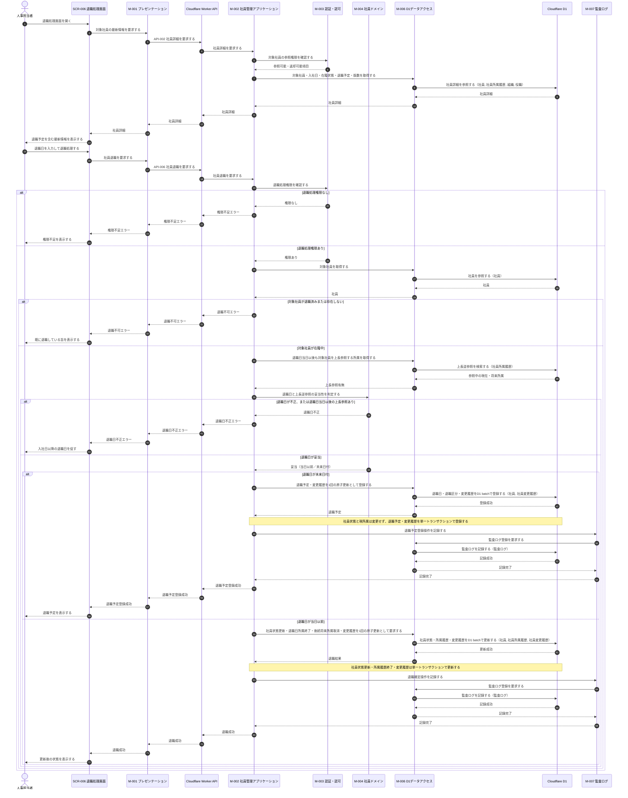
```mermaid
sequenceDiagram
    autonumber
    actor HR as 人事担当者
    participant UI as SCR-006 退職処理画面
    participant PRES as M-001 プレゼンテーション
    participant API as Cloudflare Worker API
    participant APP as M-002 社員管理アプリケーション
    participant AUTH as M-003 認証・認可
    participant DOM as M-004 社員ドメイン
    participant DATA as M-006 D1データアクセス
    participant DB as Cloudflare D1
    participant AUDIT as M-007 監査ログ

    HR->>UI: 退職処理画面を開く
    UI->>PRES: 対象社員の最新情報を要求する
    PRES->>API: API-002 社員詳細を要求する
    API->>APP: 社員詳細を要求する
    APP->>AUTH: 対象社員の参照権限を確認する
    AUTH-->>APP: 参照可能・返却可能項目
    APP->>DATA: 対象社員・入社日・在籍状態・退職予定・版数を取得する
    DATA->>DB: 社員詳細を参照する（社員, 社員所属履歴, 組織, 役職）
    DB-->>DATA: 社員詳細
    DATA-->>APP: 社員詳細
    APP-->>API: 社員詳細
    API-->>PRES: 社員詳細
    PRES-->>UI: 社員詳細
    UI-->>HR: 退職予定を含む最新情報を表示する
    HR->>UI: 退職日を入力して退職処理する
    UI->>PRES: 社員退職を要求する
    PRES->>API: API-006 社員退職を要求する
    API->>APP: 社員退職を要求する
    APP->>AUTH: 退職処理権限を確認する
    alt 退職処理権限なし
        AUTH-->>APP: 権限なし
        APP-->>API: 権限不足エラー
        API-->>PRES: 権限不足エラー
        PRES-->>UI: 権限不足エラー
        UI-->>HR: 権限不足を表示する
    else 退職処理権限あり
        AUTH-->>APP: 権限あり
        APP->>DATA: 対象社員を取得する
        DATA->>DB: 社員を参照する（社員）
        DB-->>DATA: 社員
        DATA-->>APP: 社員
        alt 対象社員が退職済みまたは存在しない
            APP-->>API: 退職不可エラー
            API-->>PRES: 退職不可エラー
            PRES-->>UI: 退職不可エラー
            UI-->>HR: 既に退職している旨を表示する
        else 対象社員が在籍中
            APP->>DATA: 退職日当日以後も対象社員を上長参照する所属を取得する
            DATA->>DB: 上長逆参照を検索する（社員所属履歴）
            DB-->>DATA: 参照中の現在・将来所属
            DATA-->>APP: 上長参照有無
            APP->>DOM: 退職日と上長逆参照の妥当性を判定する
            alt 退職日が不正、または退職日当日以後の上長参照あり
                DOM-->>APP: 退職日不正
                APP-->>API: 退職日不正エラー
                API-->>PRES: 退職日不正エラー
                PRES-->>UI: 退職日不正エラー
                UI-->>HR: 入社日以降の退職日を促す
            else 退職日が妥当
                DOM-->>APP: 妥当（当日以前／未来日付）
                alt 退職日が未来日付
                    APP->>DATA: 退職予定・変更履歴を1回の原子更新として登録する
                    DATA->>DB: 退職日・退職区分・変更履歴をD1 batchで登録する（社員, 社員変更履歴）
                    DB-->>DATA: 登録成功
                    DATA-->>APP: 退職予定
                    Note over APP,DB: 社員状態と現所属は変更せず、退職予定・変更履歴を単一トランザクションで登録する
                    APP->>AUDIT: 退職予定登録操作を記録する
                    AUDIT->>DATA: 監査ログ登録を要求する
                    DATA->>DB: 監査ログを記録する（監査ログ）
                    DB-->>DATA: 記録成功
                    DATA-->>AUDIT: 記録完了
                    AUDIT-->>APP: 記録完了
                    APP-->>API: 退職予定登録成功
                    API-->>PRES: 退職予定登録成功
                    PRES-->>UI: 退職予定登録成功
                    UI-->>HR: 退職予定を表示する
                else 退職日が当日以前
                    APP->>DATA: 社員状態更新・退職日所属終了・後続将来所属取消・変更履歴を1回の原子更新として要求する
                    DATA->>DB: 社員状態・所属履歴・変更履歴をD1 batchで更新する（社員, 社員所属履歴, 社員変更履歴）
                    DB-->>DATA: 更新成功
                    DATA-->>APP: 退職結果
                    Note over APP,DB: 社員状態更新・所属履歴終了・変更履歴は単一トランザクションで更新する
                    APP->>AUDIT: 退職確定操作を記録する
                    AUDIT->>DATA: 監査ログ登録を要求する
                    DATA->>DB: 監査ログを記録する（監査ログ）
                    DB-->>DATA: 記録成功
                    DATA-->>AUDIT: 記録完了
                    AUDIT-->>APP: 記録完了
                    APP-->>API: 退職成功
                    API-->>PRES: 退職成功
                    PRES-->>UI: 退職成功
                    UI-->>HR: 更新後の状態を表示する
                end
            end
        end
    end
```

未来日の退職予定は、退職日到来後に次の非同期経路で確定する。

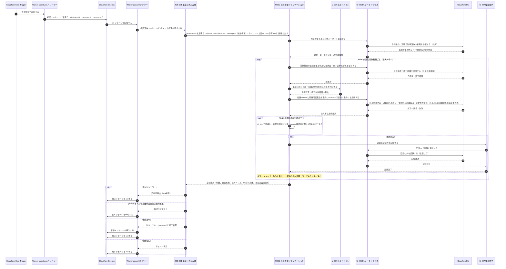
```mermaid
sequenceDiagram
    autonumber
    participant CRON as Cloudflare Cron Trigger
    participant SCHED as Worker scheduledハンドラー
    participant Q as Cloudflare Queues
    participant QUEUE as Worker queueハンドラー
    participant JOB as JOB-001 退職日到来反映
    participant APP as M-002 社員管理アプリケーション
    participant DOM as M-004 社員ドメイン
    participant DATA as M-006 D1データアクセス
    participant DB as Cloudflare D1
    participant AUDIT as M-007 監査ログ

    CRON->>SCHED: 予定時刻で起動する
    SCHED->>Q: 初回メッセージ（業務日、chainRunId、cursor=null、chunkNo=1）
    Q->>QUEUE: 1メッセージを配信する
    QUEUE->>JOB: 検証済みメッセージで1チャンク処理を要求する
    JOB->>APP: M-002/IF-07を業務日・chainRunId・chunkNo・messageId（追跡専用）・カーソル・上限40・D1予算900で1回呼び出す
    APP->>DATA: 到来対象を最大41件キーセット取得する
    DATA->>DB: 在籍中かつ退職日到来済みの社員を参照する（社員）
    DB-->>DATA: 処理対象40件以下・後続判定用41件目
    DATA-->>APP: 対象一覧・後続有無・次位置候補
    loop M-002内部の対象社員ごと（最大40件）
        APP->>DATA: 対象社員の退職予定日時点の自所属・部下逆参照所属を取得する
        DATA->>DB: 自所属群と部下所属を参照する（社員所属履歴）
        DB-->>DATA: 自所属・部下所属
        DATA-->>APP: 所属群
        APP->>DOM: 退職日区分と部下所属逆参照の非存在を再判定する
        DOM-->>APP: 退職可否・終了対象所属ID集合
        APP->>DATA: 社員versionと期待所属集合を条件にD1 batchで退職へ条件付き反映する
        DATA->>DB: 社員状態更新・退職日所属終了・後続将来所属取消・変更履歴登録（社員, 社員所属履歴, 社員変更履歴）
        DB-->>DATA: 成功・競合・失敗
        DATA-->>APP: 社員単位反映結果
        opt §3.1.3の即時再試行許可エラー
            APP->>APP: full jitterで待機し、結果不明時は状態・version確認後に最大2回追加試行する
        end
        opt 反映成功
            APP->>AUDIT: 退職確定操作を記録する
            AUDIT->>DATA: 監査ログ登録を要求する
            DATA->>DB: 監査ログを記録する（監査ログ）
            DB-->>DATA: 記録成功
            DATA-->>AUDIT: 記録完了
            AUDIT-->>APP: 記録完了
        end
        Note over APP: 成功・スキップ・失敗を集計し、個別の恒久業務エラーでも次対象へ進む
    end
    APP-->>JOB: 正常結果（件数、後続有無、次カーソル、D1実行文数）または公開例外
    alt 恒久入力エラー
        JOB-->>QUEUE: 契約不整合（ack判定）
        QUEUE->>Q: 現メッセージをackする
    else 一時障害・実行基盤障害または契約違反
        JOB-->>QUEUE: 再試行可能エラー
        QUEUE->>Q: 現メッセージをretryする
    else 後続あり
        JOB-->>QUEUE: 次カーソル・chunkNo+1と完了結果
        QUEUE->>Q: 継続メッセージを投入する
        QUEUE->>Q: 現メッセージをackする
    else 後続なし
        JOB-->>QUEUE: チェーン完了
        QUEUE->>Q: 現メッセージをackする
    end
```

**連携定義**

条件分岐

| 条件ID | 判定箇所 | 条件 | 成立時 | 不成立時 | 根拠 |
|---|---|---|---|---|---|
| COND-01 | 認可機能 | 実行者が退職処理権限を持つ | 対象社員の確認へ進む | 権限不足エラー | UC-004/SP-1 (不成立=UC-004/SP-3) |
| COND-02 | 社員管理アプリケーション | 対象社員が存在し在籍中である | 退職日妥当性の判定へ進む | 退職不可エラー | UC-004/SP-1 (不成立=UC-004/SP-4) |
| COND-03 | 社員ドメイン | 退職日が入社日以降で、対象社員を上長とする所属が退職日当日以後に有効でない | 退職更新を実行する | 退職日・上長参照不正エラー | UC-004/SP-1 (不成立=UC-004/SP-5) |
| COND-04 | 社員ドメイン | 退職日が当日以前である | 即時に退職状態へ更新する | 退職予約として登録する | UC-004/SP-1 (不成立=UC-004/SP-2) |
| COND-05 | JOB-001 | Queueメッセージのスキーマ・日付・継続位置が妥当 | M-002/IF-07を呼び出す | 業務処理せず通知して終了する | UC-014/SP-1〜SP-5 (不成立=UC-014/SP-6) |
| COND-06 | 社員管理アプリケーション | 到来対象が1件以上ある | 最大40件を社員単位で判定・反映する | 無更新でチェーンを完了する | UC-014/SP-1・SP-3〜SP-5 (不成立=UC-014/SP-2) |
| COND-07 | 社員管理アプリケーション | 後続対象がある | 継続情報をJOB-001へ返す | チェーン完了を返す | UC-014/SP-3 (不成立=UC-014/SP-1・SP-2) |
| COND-08 | データアクセス | 対象が未反映でversion・業務条件が一致する | 退職確定を原子反映する | 既反映・競合として二重更新せずスキップする | UC-014/SP-1 (不成立=UC-014/SP-4・UC-014/SP-5) |
| COND-09 | JOB-001 | M-002公開結果とD1実行文数が契約内である | 継続投入または現メッセージ完了へ進む | Queue再配信し、上限到達後はDLQへ移送する | UC-014/SP-1〜SP-5 (不成立=UC-014/SP-7、再配信上限=UC-014/SP-8) |

データ参照・更新

| エンティティ | CRUD | 目的 | 実行主体 |
|---|---|---|---|
| 社員 | R | 対象社員の取得・在籍状態の確認 | データアクセス |
| 社員 | U | 未来日は退職予定登録、当日以前または到来時は在籍状態=退職への更新 | データアクセス |
| 社員所属履歴 | U | 当日以前または退職日到来時に有効な所属履歴を終了 | データアクセス |
| 社員所属履歴 | R | 初期表示の現所属取得、および対象社員を上長とする退職日当日以後の現在・将来所属を検証 | データアクセス |
| 組織 | R | 初期表示用の現所属組織名を取得 | データアクセス |
| 役職 | R | 初期表示用の現役職名を取得 | データアクセス |
| 社員所属履歴 | D（論理） | 退職日より後に開始する対象社員自身の将来所属を取消 | データアクセス |
| 社員変更履歴 | C | 退職予定登録・退職確定の業務変更履歴記録 | データアクセス |
| 監査ログ | C | 退職操作の証跡記録 | データアクセス（M-007から委譲） |

トランザクション境界

| 境界ID | 開始 | 終了 | 対象更新 | ロールバック条件 | 管理主体 |
|---|---|---|---|---|---|
| TX-004 | M-006が退職予定用D1 mutation batchを送信 | `batch()`成功 | 社員(退職日・退職区分)・社員変更履歴 | 上長逆参照・version・状態条件不成立またはいずれかの文が失敗した場合、D1がbatch全体をロールバック | M-002が境界を宣言しM-006が実行 |
| TX-005 | M-006が即時または到来退職用D1 mutation batchを送信 | `batch()`成功 | 社員(状態・退職日)・社員所属履歴(終了日・将来取消)・社員変更履歴 | 上長逆参照・version・状態条件不成立またはいずれかの文が失敗した場合、D1が社員1件のbatch全体をロールバック | M-002が境界を宣言しM-006が実行 |

補足事項

| 観点 | 内容 |
|---|---|
| 同期/非同期 | 当日以前の退職と未来日の退職予定受付は同期。未来日の退職確定はJOB-001が日次で非同期実行する |
| 退職予定 | 未来日は退職日・退職区分だけを登録し、社員状態と現所属を維持する(UC-004/SP-2)。JOB-001による到来後の確定はUC-014を正本とする |
| 競合制御 | D1の逐次実行、対象社員のversionガード、上長逆参照を再評価する条件付き文・トリガーにより、異動・部下所属登録との競合と退職済みへの二重処理を検知する |
| 利用停止 | 社員紐付きアカウントは退職日到来以後、ログインおよび発行済みトークンの後続認可で拒否する。退職確定JOBの遅延中も業務日と退職日で拒否する |
| 監査ログ | 監査ログは業務トランザクションのコミット後にM-007→M-006で独立追記し、失敗は運用アラート対象とする |
| チャンク・予算 | `queue` invocationごとにM-002/IF-07を1回だけ呼び、最大40社員を処理する。M-006実測のD1実行文数はPaid hard limit 1,000に対する内部予算900以下とし、後続ありでは退職日・社員IDの次カーソルをQueueメッセージへ引き継ぐ |
| 内部再試行 | M-002は§3.1.3の許可エラーだけを社員単位で最大2回追加試行する。過負荷・タイムアウト・CPU・メモリ・予算超過および再試行枯渇はretryable属性付き`DATA_ACCESS_ERROR`とし、JOBが現メッセージを再配信する |
| Queue冪等性 | consumerは`max_batch_size=1`、`max_concurrency=1`、`max_retries=3`とし、規定回数後はDLQへ移送する。`chainRunId+chunkNo`を論理実行識別子とし、重複配信の正しさはversionガード・未反映条件で保証する |
| 集計契約 | M-002は非負整数の件数、後続有無、次カーソル、D1実行文数を返し、対象件数=成功件数+スキップ件数+失敗件数、失敗対象一覧件数=失敗件数、対象件数≤40、D1実行文数≤900を保証する |

## 3.7 ログイン

UC-005(状態パターン UC-005/SP-1〜SP-4)。社内認証基盤で認証情報を検証し、利用者アカウント、社員紐付きの場合の退職日未到来、ロールを確認したうえで未返却のアクセストークン候補を生成する。成功監査を記録できた場合だけ候補を利用者へ返し、生成・監査失敗時は発行しない。業務データの更新は伴わない。

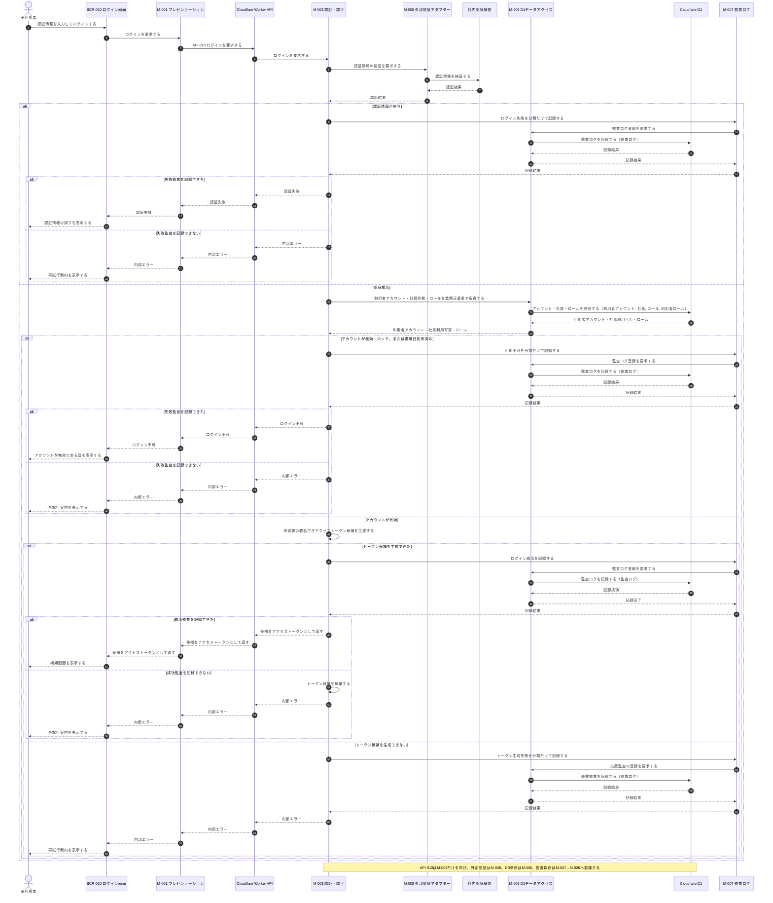
```mermaid
sequenceDiagram
    autonumber
    actor U as 全利用者
    participant UI as SCR-010 ログイン画面
    participant PRES as M-001 プレゼンテーション
    participant API as Cloudflare Worker API
    participant AUTH as M-003 認証・認可
    participant EXAUTH as M-008 外部認証アダプター
    participant IDP as 社内認証基盤
    participant DATA as M-006 D1データアクセス
    participant DB as Cloudflare D1
    participant AUDIT as M-007 監査ログ

    U->>UI: 認証情報を入力してログインする
    UI->>PRES: ログインを要求する
    PRES->>API: API-010 ログインを要求する
    API->>AUTH: ログインを要求する
    AUTH->>EXAUTH: 認証情報の検証を要求する
    EXAUTH->>IDP: 認証情報を検証する
    IDP-->>EXAUTH: 認証結果
    EXAUTH-->>AUTH: 認証結果
    alt 認証情報が誤り
        AUTH->>AUDIT: ログイン失敗を分類だけで記録する
        AUDIT->>DATA: 監査ログ登録を要求する
        DATA->>DB: 監査ログを記録する（監査ログ）
        DB-->>DATA: 記録結果
        DATA-->>AUDIT: 記録結果
        AUDIT-->>AUTH: 記録結果
        alt 失敗監査を記録できた
            AUTH-->>API: 認証失敗
            API-->>PRES: 認証失敗
            PRES-->>UI: 認証失敗
            UI-->>U: 認証情報の誤りを表示する
        else 失敗監査を記録できない
            AUTH-->>API: 内部エラー
            API-->>PRES: 内部エラー
            PRES-->>UI: 内部エラー
            UI-->>U: 再試行案内を表示する
        end
    else 認証成功
        AUTH->>DATA: 利用者アカウント・社員状態・ロールを業務日基準で取得する
        DATA->>DB: アカウント・社員・ロールを参照する（利用者アカウント, 社員, ロール, 利用者ロール）
        DB-->>DATA: 利用者アカウント・社員利用可否・ロール
        DATA-->>AUTH: 利用者アカウント・社員利用可否・ロール
        alt アカウントが無効・ロック、または退職日到来済み
            AUTH->>AUDIT: 利用不可を分類だけで記録する
            AUDIT->>DATA: 監査ログ登録を要求する
            DATA->>DB: 監査ログを記録する（監査ログ）
            DB-->>DATA: 記録結果
            DATA-->>AUDIT: 記録結果
            AUDIT-->>AUTH: 記録結果
            alt 失敗監査を記録できた
                AUTH-->>API: ログイン不可
                API-->>PRES: ログイン不可
                PRES-->>UI: ログイン不可
                UI-->>U: アカウントが無効である旨を表示する
            else 失敗監査を記録できない
                AUTH-->>API: 内部エラー
                API-->>PRES: 内部エラー
                PRES-->>UI: 内部エラー
                UI-->>U: 再試行案内を表示する
            end
        else アカウントが有効
            AUTH->>AUTH: 未返却の署名付きアクセストークン候補を生成する
            alt トークン候補を生成できた
                AUTH->>AUDIT: ログイン成功を記録する
                AUDIT->>DATA: 監査ログ登録を要求する
                DATA->>DB: 監査ログを記録する（監査ログ）
                DB-->>DATA: 記録成功
                DATA-->>AUDIT: 記録完了
                AUDIT-->>AUTH: 記録結果
                alt 成功監査を記録できた
                    AUTH-->>API: 候補をアクセストークンとして返す
                    API-->>PRES: 候補をアクセストークンとして返す
                    PRES-->>UI: 候補をアクセストークンとして返す
                    UI-->>U: 初期画面を表示する
                else 成功監査を記録できない
                    AUTH->>AUTH: トークン候補を破棄する
                    AUTH-->>API: 内部エラー
                    API-->>PRES: 内部エラー
                    PRES-->>UI: 内部エラー
                    UI-->>U: 再試行案内を表示する
                end
            else トークン候補を生成できない
                AUTH->>AUDIT: トークン生成失敗を分類だけで記録する
                AUDIT->>DATA: 失敗監査の登録を要求する
                DATA->>DB: 失敗監査を記録する（監査ログ）
                DB-->>DATA: 記録結果
                DATA-->>AUDIT: 記録結果
                AUDIT-->>AUTH: 記録結果
                AUTH-->>API: 内部エラー
                API-->>PRES: 内部エラー
                PRES-->>UI: 内部エラー
                UI-->>U: 再試行案内を表示する
            end
        end
    end
    Note over AUTH,DB: API-010はM-003だけを呼び、外部認証はM-008、DB参照はM-006、監査保存はM-007→M-006へ委譲する
```

**連携定義**

条件分岐

| 条件ID | 判定箇所 | 条件 | 成立時 | 不成立時 | 根拠 |
|---|---|---|---|---|---|
| COND-01 | 社内認証基盤 | 認証情報が正しい | アカウント有効性の確認へ進む | 認証失敗 | UC-005/SP-1 (不成立=UC-005/SP-2) |
| COND-02 | 認証・認可(M-003) | 利用者アカウントが有効で、社員紐付きの場合は業務日が退職日より前 | トークン候補生成へ進む | 失敗監査後にログイン不可を返す | UC-005/SP-1 (不成立=UC-005/SP-3) |
| COND-03 | 認証・認可(M-003) | 未返却のアクセストークン候補を生成できた | 成功監査へ進む | 可能な限り失敗監査を記録し、内部エラーを返す | UC-005/SP-1 (不成立=UC-005/SP-4) |
| COND-04 | 監査ログ機能(M-007) | ログイン成功の監査を記録できた | 生成済み候補を利用者へ返す | 候補を破棄し内部エラーを返す | UC-005/SP-1 (不成立=UC-005/SP-4) |

データ参照・更新

| エンティティ | CRUD | 目的 | 実行主体 |
|---|---|---|---|
| 利用者アカウント | R | 認証済み利用者のアカウント取得・有効性確認 | データアクセス |
| 社員 | R | 社員紐付き利用者の在籍状態・退職日到来確認 | データアクセス |
| ロール | R | 利用者に割り当てられたロールの取得 | データアクセス |
| 利用者ロール | R | 利用者とロールの対応取得 | データアクセス |
| 監査ログ | C | ログイン操作の証跡記録 | データアクセス（M-007から委譲） |

トランザクション境界

| 内容 |
|---|
| 利用者・ロールは参照のみ。成功・失敗の監査ログはM-006の独立トランザクションで記録し、記録失敗時はアクセストークンを発行しない |

補足事項

| 観点 | 内容 |
|---|---|
| 認証委譲 | 認証情報の検証は社内認証基盤(外部)へ委譲し、システムはパスワードを保持しない |
| アクセストークン | 認証成功・アカウント有効後にM-003が未返却候補を生成し、成功監査記録を満たした場合だけ利用者へ返す。生成または監査失敗時は候補を返さず破棄する。署名鍵・トークン本文をログまたはDBへ保存しない |
| アカウント無効 | 無効・ロック中のアカウントは認証成功であってもログインを許可しない(UC-005/SP-3) |
| 監査ログ | ログインの成否を監査ログに記録する。認証前で主体を特定できない失敗は実行者・対象をNULLとし、認証秘密情報を含めず失敗分類だけを記録する |

## 3.8 社員詳細参照

UC-006(状態パターン UC-006/SP-1〜SP-3)。対象社員の存在真偽だけを内部`ALL`条件で確認して取得値を破棄し、続いて§2.2 UC-006で定義した実閲覧スコープで社員・所属履歴・組織・役職を再取得する。存在しない場合と存在するが範囲外の場合を区別し、ロール・スコープ別の許可項目だけを表示する。参照のみで更新を伴わない。

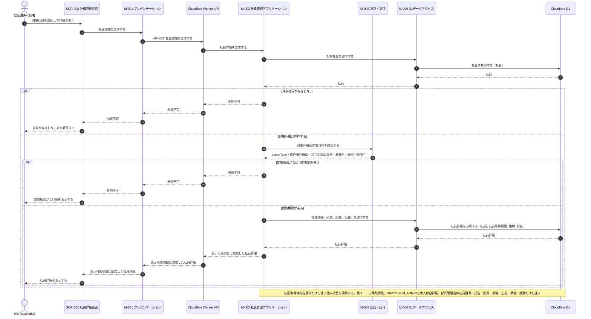
```mermaid
sequenceDiagram
    autonumber
    actor U as 認証済み利用者
    participant UI as SCR-002 社員詳細画面
    participant PRES as M-001 プレゼンテーション
    participant API as Cloudflare Worker API
    participant APP as M-002 社員管理アプリケーション
    participant AUTH as M-003 認証・認可
    participant DATA as M-006 D1データアクセス
    participant DB as Cloudflare D1

    U->>UI: 対象社員を選択して詳細を開く
    UI->>PRES: 社員詳細を要求する
    PRES->>API: API-002 社員詳細を要求する
    API->>APP: 社員詳細を要求する
    APP->>DATA: 対象社員を取得する
    DATA->>DB: 社員を参照する（社員）
    DB-->>DATA: 社員
    DATA-->>APP: 社員
    alt 対象社員が存在しない
        APP-->>API: 参照不可
        API-->>PRES: 参照不可
        PRES-->>UI: 参照不可
        UI-->>U: 対象が存在しない旨を表示する
    else 対象社員が存在する
        APP->>AUTH: 対象社員の閲覧可否を確認する
        AUTH-->>APP: scopeType・操作者社員ID・許可組織ID集合・基準日・表示可能項目
        alt 閲覧権限がない（閲覧範囲外）
            APP-->>API: 参照不可
            API-->>PRES: 参照不可
            PRES-->>UI: 参照不可
            UI-->>U: 閲覧権限がない旨を表示する
        else 閲覧権限がある
            APP->>DATA: 社員詳細（所属・組織・役職）を取得する
            DATA->>DB: 社員詳細を参照する（社員, 社員所属履歴, 組織, 役職）
            DB-->>DATA: 社員詳細
            DATA-->>APP: 社員詳細
            APP-->>API: 表示可能項目に限定した社員詳細
            API-->>PRES: 表示可能項目に限定した社員詳細
            PRES-->>UI: 表示可能項目に限定した社員詳細
            UI-->>U: 社員詳細を表示する
        end
    end
    Note over APP,DB: 初回取得は存在真偽だけに使い個人項目を破棄する。実スコープ再取得後、HR/SYSTEM_ADMINと本人は全詳細、部門管理者は社員番号・氏名・所属・役職・上長・状態・版数だけを返す
```

**連携定義**

条件分岐

| 条件ID | 判定箇所 | 条件 | 成立時 | 不成立時 | 根拠 |
|---|---|---|---|---|---|
| COND-01 | 社員管理アプリケーション | 対象社員が存在する | 閲覧権限の確認へ進む | 参照不可(存在しない) | UC-006/SP-1 (不成立=UC-006/SP-2) |
| COND-02 | 認可機能 | 実行者が対象社員の閲覧権限を持つ(閲覧範囲内) | 権限に応じた項目で詳細を表示する | 参照不可(閲覧範囲外) | UC-006/SP-1 (不成立=UC-006/SP-3) |

データ参照・更新

| エンティティ | CRUD | 目的 | 実行主体 |
|---|---|---|---|
| 社員 | R | 対象社員の存在確認・基本情報の取得 | データアクセス |
| 社員所属履歴 | R | 有効な所属・役職・在籍状態の取得 | データアクセス |
| 組織 | R | 所属組織名の付与 | データアクセス |
| 役職 | R | 役職名の付与 | データアクセス |

トランザクション境界

| 内容 |
|---|
| なし(参照のみ。更新を伴わないため) |

補足事項

| 観点 | 内容 |
|---|---|
| 個人情報保護 | `HR`・`SYSTEM_ADMIN`の`ALL`と`EMPLOYEE`本人の`SELF`は全詳細、`DEPARTMENT_MANAGER`の`ORGANIZATION`は社員ID・社員番号・氏名・所属・役職・上長・状態・版数だけを返す |
| 閲覧判定 | §2.2 UC-006の認可定義に従い、固定ロール、対象社員の基準日時点所属、操作者の主所属と全子孫、本人紐付けから閲覧可否を判定する |
| 性能 | 詳細は単一社員が対象のため、所属・組織・役職を一括で取得する |

## 3.9 社員基本情報更新

UC-007(状態パターン UC-007/SP-1〜SP-5)。`HR`は氏名・カナ・メール・電話・雇用区分、`EMPLOYEE`本人はメール・電話だけを更新でき、非許可項目が混在する要求は全体を拒否する。氏名・カナは前後空白除去・NFC・空文字・正規化後長さ/形式の順に検証し、正規化後の値で差分を判定する。メールの一意性・更新競合を確認し、社員基本情報の更新と変更履歴登録を単一トランザクションで更新する。

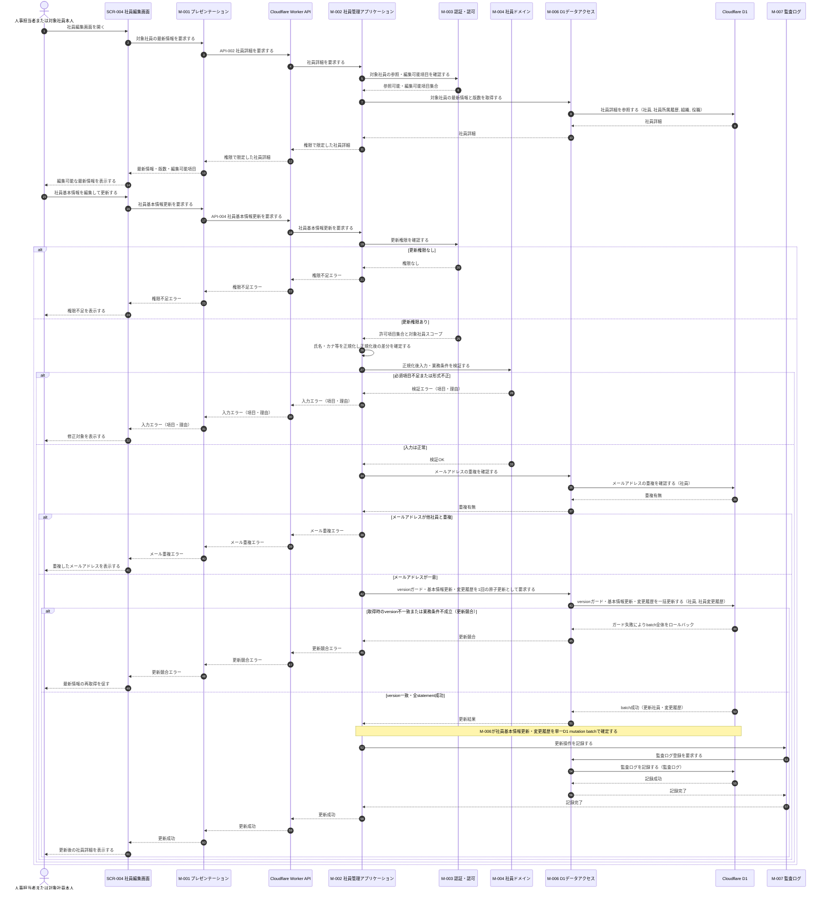
```mermaid
sequenceDiagram
    autonumber
    actor ACT as 人事担当者または対象社員本人
    participant UI as SCR-004 社員編集画面
    participant PRES as M-001 プレゼンテーション
    participant API as Cloudflare Worker API
    participant APP as M-002 社員管理アプリケーション
    participant AUTH as M-003 認証・認可
    participant DOM as M-004 社員ドメイン
    participant DATA as M-006 D1データアクセス
    participant DB as Cloudflare D1
    participant AUDIT as M-007 監査ログ

    ACT->>UI: 社員編集画面を開く
    UI->>PRES: 対象社員の最新情報を要求する
    PRES->>API: API-002 社員詳細を要求する
    API->>APP: 社員詳細を要求する
    APP->>AUTH: 対象社員の参照・編集可能項目を確認する
    AUTH-->>APP: 参照可能・編集可能項目集合
    APP->>DATA: 対象社員の最新情報と版数を取得する
    DATA->>DB: 社員詳細を参照する（社員, 社員所属履歴, 組織, 役職）
    DB-->>DATA: 社員詳細
    DATA-->>APP: 社員詳細
    APP-->>API: 権限で限定した社員詳細
    API-->>PRES: 権限で限定した社員詳細
    PRES-->>UI: 最新情報・版数・編集可能項目
    UI-->>ACT: 編集可能な最新情報を表示する
    ACT->>UI: 社員基本情報を編集して更新する
    UI->>PRES: 社員基本情報更新を要求する
    PRES->>API: API-004 社員基本情報更新を要求する
    API->>APP: 社員基本情報更新を要求する
    APP->>AUTH: 更新権限を確認する
    alt 更新権限なし
        AUTH-->>APP: 権限なし
        APP-->>API: 権限不足エラー
        API-->>PRES: 権限不足エラー
        PRES-->>UI: 権限不足エラー
        UI-->>ACT: 権限不足を表示する
    else 更新権限あり
        AUTH-->>APP: 許可項目集合と対象社員スコープ
        APP->>APP: 氏名・カナ等を正規化し正規化後の差分を確定する
        APP->>DOM: 正規化後入力・業務条件を検証する
        alt 必須項目不足または形式不正
            DOM-->>APP: 検証エラー（項目・理由）
            APP-->>API: 入力エラー（項目・理由）
            API-->>PRES: 入力エラー（項目・理由）
            PRES-->>UI: 入力エラー（項目・理由）
            UI-->>ACT: 修正対象を表示する
        else 入力は正常
            DOM-->>APP: 検証OK
            APP->>DATA: メールアドレスの重複を確認する
            DATA->>DB: メールアドレスの重複を確認する（社員）
            DB-->>DATA: 重複有無
            DATA-->>APP: 重複有無
            alt メールアドレスが他社員と重複
                APP-->>API: メール重複エラー
                API-->>PRES: メール重複エラー
                PRES-->>UI: メール重複エラー
                UI-->>ACT: 重複したメールアドレスを表示する
            else メールアドレスが一意
                APP->>DATA: versionガード・基本情報更新・変更履歴を1回の原子更新として要求する
                DATA->>DB: versionガード・基本情報更新・変更履歴を一括更新する（社員, 社員変更履歴）
                alt 取得時のversion不一致または業務条件不成立（更新競合）
                    DB-->>DATA: ガード失敗によりbatch全体をロールバック
                    DATA-->>APP: 更新競合
                    APP-->>API: 更新競合エラー
                    API-->>PRES: 更新競合エラー
                    PRES-->>UI: 更新競合エラー
                    UI-->>ACT: 最新情報の再取得を促す
                else version一致・全statement成功
                    DB-->>DATA: batch成功（更新社員・変更履歴）
                    DATA-->>APP: 更新結果
                    Note over APP,DB: M-006が社員基本情報更新・変更履歴を単一D1 mutation batchで確定する
                    APP->>AUDIT: 更新操作を記録する
                    AUDIT->>DATA: 監査ログ登録を要求する
                    DATA->>DB: 監査ログを記録する（監査ログ）
                    DB-->>DATA: 記録成功
                    DATA-->>AUDIT: 記録完了
                    AUDIT-->>APP: 記録完了
                    APP-->>API: 更新成功
                    API-->>PRES: 更新成功
                    PRES-->>UI: 更新成功
                    UI-->>ACT: 更新後の社員詳細を表示する
                end
            end
        end
    end
```

**連携定義**

条件分岐

| 条件ID | 判定箇所 | 条件 | 成立時 | 不成立時 | 根拠 |
|---|---|---|---|---|---|
| COND-01 | 認可機能 | `HR`の許可7項目、または`EMPLOYEE`本人のemail/phoneNumberだけで要求が構成される | 正規化・入力検証へ進む | 非許可項目を部分更新せず要求全体を権限不足とする | UC-007/SP-1 (不成立=UC-007/SP-2) |
| COND-02 | 社員ドメイン | 氏名・カナを前後空白除去・NFC後に空文字・長さ・形式検証し、その他入力・業務条件も妥当 | メール重複確認へ進む | 入力エラー | UC-007/SP-1 (不成立=UC-007/SP-3) |
| COND-03 | データアクセス | メールアドレスが他社員と重複しない | 更新競合の確認へ進む | メール重複エラー | UC-007/SP-1 (不成立=UC-007/SP-4) |
| COND-04 | データアクセス | 取得時の版数と現在値が一致する | 社員基本情報を更新する | 更新競合エラー(最新再取得を要求) | UC-007/SP-1 (不成立=UC-007/SP-5) |

データ参照・更新

| エンティティ | CRUD | 目的 | 実行主体 |
|---|---|---|---|
| 社員 | R | 初期表示用の最新情報・版数の取得、メールアドレス重複確認・更新競合判定 | データアクセス |
| 社員所属履歴 | R | 初期表示用の現所属を取得 | データアクセス |
| 組織 | R | 初期表示用の現所属組織名を取得 | データアクセス |
| 役職 | R | 初期表示用の現役職名を取得 | データアクセス |
| 社員 | U | 社員基本情報の更新(版数の加算を含む) | データアクセス |
| 社員変更履歴 | C | 更新操作の業務変更履歴記録 | データアクセス |
| 監査ログ | C | 更新操作の証跡記録 | データアクセス（M-007から委譲） |

トランザクション境界

| 境界ID | 開始 | 終了 | 対象更新 | ロールバック条件 | 管理主体 |
|---|---|---|---|---|---|
| TX-002 | M-006がversionガードを先頭にD1 mutation batchを送信 | `batch()`成功 | 社員(基本情報・version)・社員変更履歴 | ガード不成立、制約・トリガー違反、またはいずれかのstatement失敗時にD1がbatch全体をロールバック | M-002が論理境界を宣言しM-006が実行 |

補足事項

| 観点 | 内容 |
|---|---|
| 同期/非同期 | 画面〜更新完了まで同期。監査ログ記録は業務トランザクションと別に行う |
| 更新競合 | M-006がガードINSERTで取得時versionとDB現在versionを再照合し、不一致なら後続更新を実行せずbatchを失敗させ、最新情報の再取得を要求する(UC-007/SP-5) |
| 権限範囲 | `HR`は姓・名・姓カナ・名カナ・email・phoneNumber・employmentTypeCode、`EMPLOYEE`本人はemail・phoneNumberだけを更新できる。部門管理者・システム管理者単独では更新不可 |
| 正規化 | 姓・名・カナは前後空白除去、NFC、空文字、正規化後長さ・形式、現値との差分の順に処理し、履歴は正規化後の実変更項目だけで生成する |
| 監査ログ | 監査ログは業務コミット後に別トランザクションで記録する。記録失敗時も更新結果は戻さず、運用アラートを通知して成功結果を返す |

## 3.10 変更履歴参照

UC-008(状態パターン UC-008/SP-1〜SP-3)。認可機能で変更履歴の参照権限を確認し、権限がある場合に対象社員の変更履歴を取得して時系列で一覧表示する。参照権限がない場合は参照不可を表示し、履歴が0件の場合は該当なしを表示する。参照のみで更新は行わない。

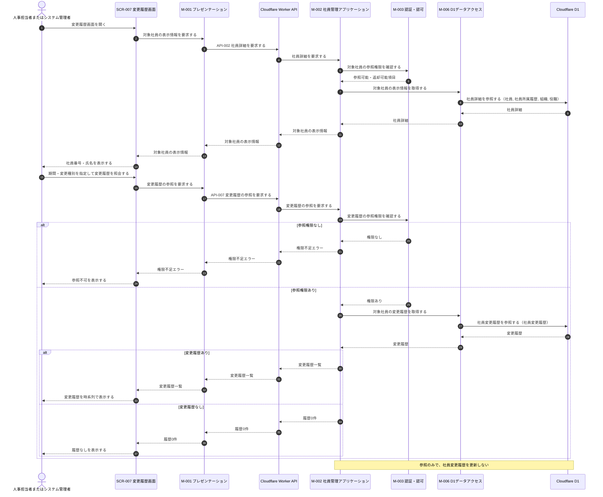
```mermaid
sequenceDiagram
    autonumber
    actor ACT as 人事担当者またはシステム管理者
    participant UI as SCR-007 変更履歴画面
    participant PRES as M-001 プレゼンテーション
    participant API as Cloudflare Worker API
    participant APP as M-002 社員管理アプリケーション
    participant AUTH as M-003 認証・認可
    participant DATA as M-006 D1データアクセス
    participant DB as Cloudflare D1

    ACT->>UI: 変更履歴画面を開く
    UI->>PRES: 対象社員の表示情報を要求する
    PRES->>API: API-002 社員詳細を要求する
    API->>APP: 社員詳細を要求する
    APP->>AUTH: 対象社員の参照権限を確認する
    AUTH-->>APP: 参照可能・返却可能項目
    APP->>DATA: 対象社員の表示情報を取得する
    DATA->>DB: 社員詳細を参照する（社員, 社員所属履歴, 組織, 役職）
    DB-->>DATA: 社員詳細
    DATA-->>APP: 社員詳細
    APP-->>API: 対象社員の表示情報
    API-->>PRES: 対象社員の表示情報
    PRES-->>UI: 対象社員の表示情報
    UI-->>ACT: 社員番号・氏名を表示する
    ACT->>UI: 期間・変更種別を指定して変更履歴を照会する
    UI->>PRES: 変更履歴の参照を要求する
    PRES->>API: API-007 変更履歴の参照を要求する
    API->>APP: 変更履歴の参照を要求する
    APP->>AUTH: 変更履歴の参照権限を確認する
    alt 参照権限なし
        AUTH-->>APP: 権限なし
        APP-->>API: 権限不足エラー
        API-->>PRES: 権限不足エラー
        PRES-->>UI: 権限不足エラー
        UI-->>ACT: 参照不可を表示する
    else 参照権限あり
        AUTH-->>APP: 権限あり
        APP->>DATA: 対象社員の変更履歴を取得する
        DATA->>DB: 社員変更履歴を参照する（社員変更履歴）
        DB-->>DATA: 変更履歴
        DATA-->>APP: 変更履歴
        alt 変更履歴あり
            APP-->>API: 変更履歴一覧
            API-->>PRES: 変更履歴一覧
            PRES-->>UI: 変更履歴一覧
            UI-->>ACT: 変更履歴を時系列で表示する
        else 変更履歴なし
            APP-->>API: 履歴0件
            API-->>PRES: 履歴0件
            PRES-->>UI: 履歴0件
            UI-->>ACT: 履歴なしを表示する
        end
    end
    Note over APP,DB: 参照のみで、社員変更履歴を更新しない
```

**連携定義**

条件分岐

| 条件ID | 判定箇所 | 条件 | 成立時 | 不成立時 | 根拠 |
|---|---|---|---|---|---|
| COND-01 | 認可機能 | 実行者が変更履歴の参照権限を持つ | 変更履歴の取得へ進む | 権限不足エラー | UC-008/SP-1 (不成立=UC-008/SP-3) |
| COND-02 | 社員管理アプリケーション | 対象社員の変更履歴が1件以上ある | 変更履歴一覧を表示する | 履歴なしを表示する | UC-008/SP-1 (不成立=UC-008/SP-2) |

データ参照・更新

| エンティティ | CRUD | 目的 | 実行主体 |
|---|---|---|---|
| 社員 | R | 初期表示用の社員番号・氏名を取得 | データアクセス |
| 社員所属履歴 | R | 初期表示用の現所属を取得 | データアクセス |
| 組織 | R | 初期表示用の現所属組織名を取得 | データアクセス |
| 役職 | R | 初期表示用の現役職名を取得 | データアクセス |
| 社員変更履歴 | R | 対象社員の変更履歴の取得 | データアクセス |

トランザクション境界

| 内容 |
|---|
| なし(参照のみ。更新を伴わないため) |

補足事項

| 観点 | 内容 |
|---|---|
| 性能 | 変更履歴は件数が多くなり得るため時系列順・ページング前提で取得する |
| 個人情報保護 | 参照権限の範囲を超える社員の変更履歴は取得対象に含めない |
| 監査ログ | 本変更履歴参照では業務監査ログを追加登録しない。相関ID・実行者・結果は個人情報を含めずアプリケーションアクセスログへ記録する |

## 3.11 検索結果出力

UC-009(状態パターン UC-009/SP-1〜SP-3)。認可機能で出力権限と閲覧可能範囲を確認し、出力条件と閲覧条件で社員を取得して、権限で許可された項目に限定した出力データを生成する。出力に成功した場合は監査ログを記録する。出力権限がない場合は出力不可を表示し、対象0件の場合は出力対象なしを通知する。

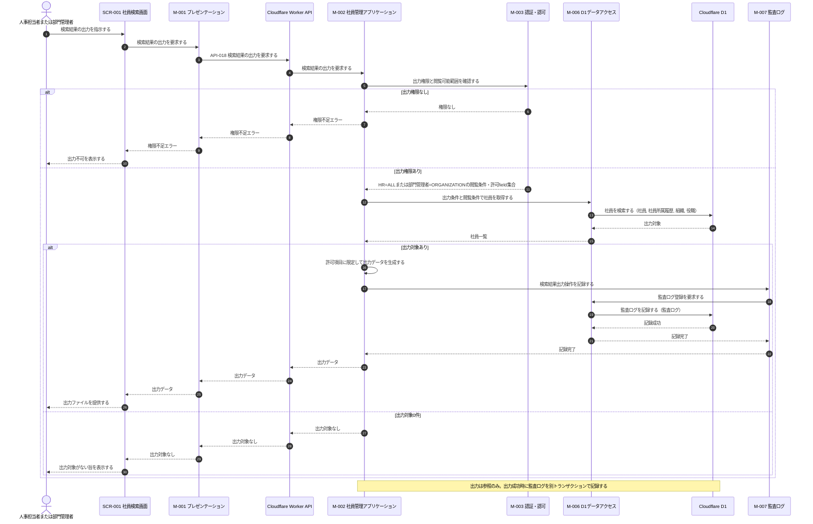
```mermaid
sequenceDiagram
    autonumber
    actor ACT as 人事担当者または部門管理者
    participant UI as SCR-001 社員検索画面
    participant PRES as M-001 プレゼンテーション
    participant API as Cloudflare Worker API
    participant APP as M-002 社員管理アプリケーション
    participant AUTH as M-003 認証・認可
    participant DATA as M-006 D1データアクセス
    participant DB as Cloudflare D1
    participant AUDIT as M-007 監査ログ

    ACT->>UI: 検索結果の出力を指示する
    UI->>PRES: 検索結果の出力を要求する
    PRES->>API: API-018 検索結果の出力を要求する
    API->>APP: 検索結果の出力を要求する
    APP->>AUTH: 出力権限と閲覧可能範囲を確認する
    alt 出力権限なし
        AUTH-->>APP: 権限なし
        APP-->>API: 権限不足エラー
        API-->>PRES: 権限不足エラー
        PRES-->>UI: 権限不足エラー
        UI-->>ACT: 出力不可を表示する
    else 出力権限あり
        AUTH-->>APP: HR=ALLまたは部門管理者=ORGANIZATIONの閲覧条件・許可field集合
        APP->>DATA: 出力条件と閲覧条件で社員を取得する
        DATA->>DB: 社員を検索する（社員, 社員所属履歴, 組織, 役職）
        DB-->>DATA: 出力対象
        DATA-->>APP: 社員一覧
        alt 出力対象あり
            APP->>APP: 許可項目に限定して出力データを生成する
            APP->>AUDIT: 検索結果出力操作を記録する
            AUDIT->>DATA: 監査ログ登録を要求する
            DATA->>DB: 監査ログを記録する（監査ログ）
            DB-->>DATA: 記録成功
            DATA-->>AUDIT: 記録完了
            AUDIT-->>APP: 記録完了
            APP-->>API: 出力データ
            API-->>PRES: 出力データ
            PRES-->>UI: 出力データ
            UI-->>ACT: 出力ファイルを提供する
        else 出力対象0件
            APP-->>API: 出力対象なし
            API-->>PRES: 出力対象なし
            PRES-->>UI: 出力対象なし
            UI-->>ACT: 出力対象がない旨を表示する
        end
    end
    Note over APP,DB: 出力は参照のみ。出力成功時に監査ログを別トランザクションで記録する
```

**連携定義**

条件分岐

| 条件ID | 判定箇所 | 条件 | 成立時 | 不成立時 | 根拠 |
|---|---|---|---|---|---|
| COND-01 | 認可機能 | 実行者が検索結果の出力権限を持つ | 出力対象の取得へ進む | 権限不足エラー | UC-009/SP-1 (不成立=UC-009/SP-3) |
| COND-02 | 社員管理アプリケーション | 出力対象が1件以上ある | 許可項目で出力データを生成し監査記録する | 出力対象なしを通知する | UC-009/SP-1 (不成立=UC-009/SP-2) |

データ参照・更新

| エンティティ | CRUD | 目的 | 実行主体 |
|---|---|---|---|
| 社員 | R | 出力条件・閲覧条件に一致する社員の取得 | データアクセス |
| 社員所属履歴 | R | 有効な所属・役職の付与 | データアクセス |
| 組織 | R | 組織名の付与 | データアクセス |
| 役職 | R | 役職名の付与 | データアクセス |
| 監査ログ | C | 検索結果出力操作の証跡記録 | データアクセス（M-007から委譲） |

トランザクション境界

| 内容 |
|---|
| 業務データの更新はなし(参照のみ)。監査ログの記録は独立した単一トランザクションで実行する |

補足事項

| 観点 | 内容 |
|---|---|
| 同期/非同期 | 画面〜出力データ提供まで同期。監査ログ記録は出力処理と別トランザクションで行う |
| 個人情報保護 | 出力項目は実行者の権限で許可された項目に限定し、閲覧条件外の社員は出力対象に含めない |
| 検索既定値 | 在籍状態は省略時`ACTIVE`とし、要求で`ALL`を明示した場合だけ全状態を対象にする |
| 監査ログ | 出力は個人情報の抽出を伴うため別トランザクションで証跡を記録する。記録失敗時は運用アラートを通知し、生成済み出力は成功として返す |

## 3.12 組織マスター管理

UC-010(状態パターン UC-010/SP-1〜SP-5。無効化は UC-010/SP-2 として基本フローに含む)。管理者権限・入力妥当性・組織コードの一意性に加え、親子期間包含、有効な子組織および現在・将来所属への影響を確認したうえで、組織の登録・更新(無効化を含む)を単一トランザクションで反映し、操作を監査ログに記録する。手動利用可否は有効期間と独立するが、参照中の階層・所属を壊す無効化や期間短縮は拒否する。


```mermaid
sequenceDiagram
    autonumber
    actor ADM as システム管理者
    participant UI as SCR-008 組織マスター画面
    participant PRES as M-001 プレゼンテーション
    participant API as Cloudflare Worker API
    participant APP as M-002 社員管理アプリケーション
    participant AUTH as M-003 認証・認可
    participant MST as M-005 マスター管理
    participant DATA as M-006 D1データアクセス
    participant DB as Cloudflare D1
    participant AUDIT as M-007 監査ログ

    ADM->>UI: 組織マスター画面を開く
    UI->>PRES: 組織一覧を要求する
    PRES->>API: API-008 組織一覧を要求する
    API->>APP: 組織一覧を要求する
    APP->>AUTH: 組織マスターの参照権限を確認する
    AUTH-->>APP: 参照可能・基準日
    APP->>MST: 組織一覧を要求する
    MST->>DATA: 組織一覧を取得する
    DATA->>DB: 組織を参照する（組織）
    DB-->>DATA: 組織一覧
    DATA-->>MST: 組織一覧
    MST-->>APP: 組織一覧
    APP-->>API: 組織一覧
    API-->>PRES: 組織一覧
    PRES-->>UI: 組織一覧
    UI-->>ADM: 組織一覧を表示する
    ADM->>UI: 組織情報を入力して登録・更新する
    UI->>PRES: 組織マスターの登録・更新を要求する
    PRES->>API: API-011・API-012 組織マスターの登録・更新を要求する
    API->>APP: 組織マスターの登録・更新を要求する
    APP->>AUTH: 組織マスターの管理者権限を確認する
    alt 管理者権限なし
        AUTH-->>APP: 権限なし
        APP-->>API: 権限不足エラー
        API-->>PRES: 権限不足エラー
        PRES-->>UI: 権限不足エラー
        UI-->>ADM: 反映不可を表示する
    else 管理者権限あり
        AUTH-->>APP: 権限あり
        APP->>MST: 入力・操作区分・期間・階層・版数・コード一意性を判定し、D1 batch用の条件を確定する
        MST->>DATA: 対象組織・同一コード・組織階層・所属参照を取得する
        DATA->>DB: 組織と現在・将来所属を参照する（組織, 社員所属履歴）
        DB-->>DATA: 現値・重複候補・階層・参照期間
        DATA-->>MST: 判定用組織データ
        alt 必須・形式・親子期間・階層・所属参照・版数が不正
            MST-->>APP: 検証エラー（項目・理由）
            APP-->>API: 入力エラー（項目・理由）
            API-->>PRES: 入力エラー（項目・理由）
            PRES-->>UI: 入力エラー（項目・理由）
            UI-->>ADM: 修正対象を表示する
        else 組織コードが重複
            MST-->>APP: 組織コード重複エラー
            APP-->>API: 組織コード重複エラー
            API-->>PRES: 組織コード重複エラー
            PRES-->>UI: 組織コード重複エラー
            UI-->>ADM: 重複した組織コードを表示する
        else 登録・更新・無効化が可能
                MST-->>APP: activeと期間を規則どおり反映したマージ済み組織情報
                APP->>DATA: 組織を登録・更新する
                DATA->>DB: 組織を登録・更新する（組織）
                DB-->>DATA: 反映成功
                DATA-->>APP: 反映結果
                Note over APP,DB: 組織versionと階層・所属参照条件を再検証する単一D1 mutation batchで更新する
                APP->>AUDIT: 組織マスター操作を記録する
                AUDIT->>DATA: 監査ログ登録を要求する
                DATA->>DB: 監査ログを記録する（監査ログ）
                DB-->>DATA: 記録成功
                DATA-->>AUDIT: 記録完了
                AUDIT-->>APP: 記録完了
                APP-->>API: 反映成功
                API-->>PRES: 反映成功
                PRES-->>UI: 反映成功
                UI-->>ADM: 反映後の組織を表示する
        end
    end
```

**連携定義**

条件分岐

| 条件ID | 判定箇所 | 条件 | 成立時 | 不成立時 | 根拠 |
|---|---|---|---|---|---|
| COND-01 | 認可機能 | 実行者が組織マスターの管理者権限を持つ | 入力検証へ進む | 権限不足エラー | UC-010/SP-1 (不成立=UC-010/SP-3) |
| COND-02 | マスター管理機能 | 必須・形式・親子期間包含・階層・有効な子組織・現在/将来所属参照・版数が妥当 | 組織コードの一意判定へ進む | 入力・期間・階層・参照・競合エラー | UC-010/SP-1 (不成立=UC-010/SP-4) |
| COND-03 | マスター管理機能 | 組織コードが一意 | 組織を登録・更新する | 組織コード重複エラー | UC-010/SP-1 (不成立=UC-010/SP-5) |
| COND-04 | マスター管理機能 | 操作が無効化指定である | 手動利用可否を即時無効化し、終了日は指定時だけ更新する | active現値を維持して登録・更新する | UC-010/SP-2 (成立=UC-010/SP-2、不成立=UC-010/SP-1) |

データ参照・更新

| エンティティ | CRUD | 目的 | 実行主体 |
|---|---|---|---|
| 組織 | R | 初期一覧取得、および組織コードの重複(一意性)確認 | データアクセス |
| 社員所属履歴 | R | 無効化・期間短縮後も現在・将来所属の参照期間が包含されることを確認 | データアクセス |
| 組織 | C | 新規組織の登録 | データアクセス |
| 組織 | U | 既存組織の更新／無効化(手動利用可否=無効、終了日は指定時だけ更新) | データアクセス |
| 監査ログ | C | 組織マスター操作の証跡記録 | データアクセス（M-007から委譲） |

トランザクション境界

| 境界ID | 開始 | 終了 | 対象更新 | ロールバック条件 | 管理主体 |
|---|---|---|---|---|---|
| TX-006 | M-006が組織version・階層・所属参照条件付きD1 mutation batchを送信 | `batch()`成功 | 組織 | 条件不成立、制約違反または登録・更新文の失敗時にD1がbatch全体をロールバック | M-002が境界を宣言しM-006が実行 |

補足事項

| 観点 | 内容 |
|---|---|
| 同期/非同期 | 画面〜反映完了まで同期。監査ログ記録は業務トランザクションと別に行う |
| 整合性 | 組織コード一意性に加え、上位組織はactive=trueかつ子の期間全体を包含する。D1の逐次実行とbatch内条件・SQLiteトリガーで循環、有効な子の孤児化、現在・将来所属の参照不能を拒否する |
| 利用可否・期間 | 指定日時点で利用可能なのは手動利用可かつ有効期間内の場合だけ。無効化・将来終了は、子組織と所属参照を壊さない場合だけ許可する |
| 監査ログ | 監査ログは業務コミット後に別トランザクションで記録する。記録失敗時も組織更新は戻さず、運用アラートを通知して成功結果を返す |

## 3.13 役職マスター管理

UC-011(状態パターン UC-011/SP-1〜SP-5。無効化は UC-011/SP-2 として基本フローに含む)。管理者権限・入力妥当性・役職コードの一意性と、現在・将来所属への影響を確認したうえで、役職の登録・更新(無効化を含む)を単一トランザクションで反映し、操作を監査ログに記録する。参照中の所属を無効にする無効化・期間短縮は拒否する。

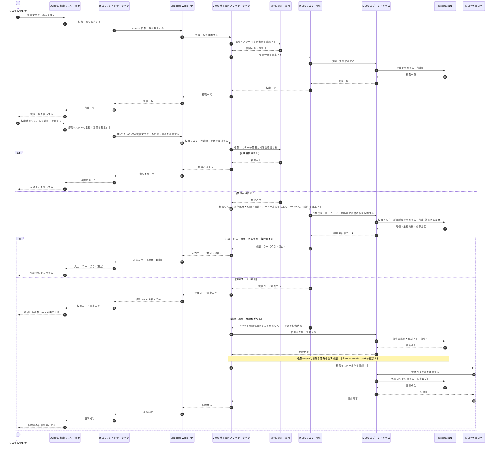
```mermaid
sequenceDiagram
    autonumber
    actor ADM as システム管理者
    participant UI as SCR-009 役職マスター画面
    participant PRES as M-001 プレゼンテーション
    participant API as Cloudflare Worker API
    participant APP as M-002 社員管理アプリケーション
    participant AUTH as M-003 認証・認可
    participant MST as M-005 マスター管理
    participant DATA as M-006 D1データアクセス
    participant DB as Cloudflare D1
    participant AUDIT as M-007 監査ログ

    ADM->>UI: 役職マスター画面を開く
    UI->>PRES: 役職一覧を要求する
    PRES->>API: API-009 役職一覧を要求する
    API->>APP: 役職一覧を要求する
    APP->>AUTH: 役職マスターの参照権限を確認する
    AUTH-->>APP: 参照可能・基準日
    APP->>MST: 役職一覧を要求する
    MST->>DATA: 役職一覧を取得する
    DATA->>DB: 役職を参照する（役職）
    DB-->>DATA: 役職一覧
    DATA-->>MST: 役職一覧
    MST-->>APP: 役職一覧
    APP-->>API: 役職一覧
    API-->>PRES: 役職一覧
    PRES-->>UI: 役職一覧
    UI-->>ADM: 役職一覧を表示する
    ADM->>UI: 役職情報を入力して登録・更新する
    UI->>PRES: 役職マスターの登録・更新を要求する
    PRES->>API: API-013・API-014 役職マスターの登録・更新を要求する
    API->>APP: 役職マスターの登録・更新を要求する
    APP->>AUTH: 役職マスターの管理者権限を確認する
    alt 管理者権限なし
        AUTH-->>APP: 権限なし
        APP-->>API: 権限不足エラー
        API-->>PRES: 権限不足エラー
        PRES-->>UI: 権限不足エラー
        UI-->>ADM: 反映不可を表示する
    else 管理者権限あり
        AUTH-->>APP: 権限あり
        APP->>MST: 役職の入力・操作区分・期間・版数・コード一意性を判定し、D1 batch用の条件を確定する
        MST->>DATA: 対象役職・同一コード・現在/将来所属参照を取得する
        DATA->>DB: 役職と現在・将来所属を参照する（役職, 社員所属履歴）
        DB-->>DATA: 現値・重複候補・参照期間
        DATA-->>MST: 判定用役職データ
        alt 必須・形式・期間・所属参照・版数が不正
            MST-->>APP: 検証エラー（項目・理由）
            APP-->>API: 入力エラー（項目・理由）
            API-->>PRES: 入力エラー（項目・理由）
            PRES-->>UI: 入力エラー（項目・理由）
            UI-->>ADM: 修正対象を表示する
        else 役職コードが重複
            MST-->>APP: 役職コード重複エラー
            APP-->>API: 役職コード重複エラー
            API-->>PRES: 役職コード重複エラー
            PRES-->>UI: 役職コード重複エラー
            UI-->>ADM: 重複した役職コードを表示する
        else 登録・更新・無効化が可能
                MST-->>APP: activeと期間を規則どおり反映したマージ済み役職情報
                APP->>DATA: 役職を登録・更新する
                DATA->>DB: 役職を登録・更新する（役職）
                DB-->>DATA: 反映成功
                DATA-->>APP: 反映結果
                Note over APP,DB: 役職versionと所属参照条件を再検証する単一D1 mutation batchで更新する
                APP->>AUDIT: 役職マスター操作を記録する
                AUDIT->>DATA: 監査ログ登録を要求する
                DATA->>DB: 監査ログを記録する（監査ログ）
                DB-->>DATA: 記録成功
                DATA-->>AUDIT: 記録完了
                AUDIT-->>APP: 記録完了
                APP-->>API: 反映成功
                API-->>PRES: 反映成功
                PRES-->>UI: 反映成功
                UI-->>ADM: 反映後の役職を表示する
        end
    end
```

**連携定義**

条件分岐

| 条件ID | 判定箇所 | 条件 | 成立時 | 不成立時 | 根拠 |
|---|---|---|---|---|---|
| COND-01 | 認可機能 | 実行者が役職マスターの管理者権限を持つ | 入力検証へ進む | 権限不足エラー | UC-011/SP-1 (不成立=UC-011/SP-3) |
| COND-02 | マスター管理機能 | 必須・形式・期間・現在/将来所属参照・版数が妥当 | 役職コードの一意判定へ進む | 入力・期間・参照・競合エラー | UC-011/SP-1 (不成立=UC-011/SP-4) |
| COND-03 | マスター管理機能 | 役職コードが一意 | 役職を登録・更新する | 役職コード重複エラー | UC-011/SP-1 (不成立=UC-011/SP-5) |
| COND-04 | マスター管理機能 | 操作が無効化指定である | 手動利用可否を即時無効化し、終了日は指定時だけ更新する | active現値を維持して登録・更新する | UC-011/SP-2 (成立=UC-011/SP-2、不成立=UC-011/SP-1) |

データ参照・更新

| エンティティ | CRUD | 目的 | 実行主体 |
|---|---|---|---|
| 役職 | R | 初期一覧取得、および役職コードの重複(一意性)確認 | データアクセス |
| 社員所属履歴 | R | 無効化・期間短縮後も現在・将来所属の参照期間が包含されることを確認 | データアクセス |
| 役職 | C | 新規役職の登録 | データアクセス |
| 役職 | U | 既存役職の更新／無効化(手動利用可否=無効、終了日は指定時だけ更新) | データアクセス |
| 監査ログ | C | 役職マスター操作の証跡記録 | データアクセス（M-007から委譲） |

トランザクション境界

| 境界ID | 開始 | 終了 | 対象更新 | ロールバック条件 | 管理主体 |
|---|---|---|---|---|---|
| TX-007 | M-006が役職version・所属参照条件付きD1 mutation batchを送信 | `batch()`成功 | 役職 | 条件不成立、制約違反または登録・更新文の失敗時にD1がbatch全体をロールバック | M-002が境界を宣言しM-006が実行 |

補足事項

| 観点 | 内容 |
|---|---|
| 同期/非同期 | 画面〜反映完了まで同期。監査ログ記録は業務トランザクションと別に行う |
| 整合性 | 役職コード一意性と現在・将来所属の参照期間包含をD1 batch内の条件付き文・SQLiteトリガーで再検証する |
| 利用可否・期間 | 指定日時点で利用可能なのは手動利用可かつ有効期間内の場合だけ。無効化・将来終了は所属参照を壊さない場合だけ許可する |
| 監査ログ | 監査ログは業務コミット後に別トランザクションで記録する。記録失敗時も役職更新は戻さず、運用アラートを通知して成功結果を返す |

## 3.14 権限管理

UC-012(状態パターン UC-012/SP-1〜SP-6)。管理者権限・対象社員と利用者アカウントの存在・アカウント有効性・指定ロール・業務日以降の有効期間の妥当性を確認したうえで、指定適用日以降を`active=true`の更新後ロール一式へ置き換える。既存の`active=false`ロール割当は参照表示し、置換時の終了・取消対象にできるが新規指定できない。ロール割当と社員変更履歴を同一トランザクションで更新し、監査ログを別トランザクションで記録する。

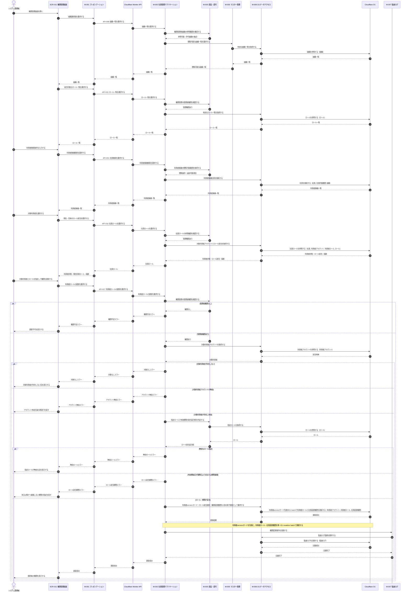
```mermaid
sequenceDiagram
    autonumber
    actor ADM as システム管理者
    participant UI as SCR-011 権限管理画面
    participant PRES as M-001 プレゼンテーション
    participant API as Cloudflare Worker API
    participant APP as M-002 社員管理アプリケーション
    participant AUTH as M-003 認証・認可
    participant MST as M-005 マスター管理
    participant DATA as M-006 D1データアクセス
    participant DB as Cloudflare D1
    participant AUDIT as M-007 監査ログ

    ADM->>UI: 権限管理画面を開く
    UI->>PRES: 組織選択肢を要求する
    PRES->>API: API-008 組織一覧を要求する
    API->>APP: 組織一覧を要求する
    APP->>AUTH: 権限管理用組織の参照権限を確認する
    AUTH-->>APP: 参照可能・許可組織ID集合
    APP->>MST: 閲覧可能な組織一覧を要求する
    MST->>DATA: 有効な組織一覧を取得する
    DATA->>DB: 組織を参照する（組織）
    DB-->>DATA: 組織一覧
    DATA-->>MST: 組織一覧
    MST-->>APP: 閲覧可能な組織一覧
    APP-->>API: 組織一覧
    API-->>PRES: 組織一覧
    PRES-->>UI: 組織一覧
    UI->>PRES: 割当可能なロール一覧を要求する
    PRES->>API: API-015 ロール一覧を要求する
    API->>APP: ロール一覧を要求する
    APP->>AUTH: 権限管理の管理者権限を確認する
    AUTH-->>APP: 管理権限あり
    APP->>DATA: 有効なロール一覧を取得する
    DATA->>DB: ロールを参照する（ロール）
    DB-->>DATA: ロール一覧
    DATA-->>APP: ロール一覧
    APP-->>API: ロール一覧
    API-->>PRES: ロール一覧
    PRES-->>UI: ロール一覧
    ADM->>UI: 利用者検索条件を入力する
    UI->>PRES: 利用者候補検索を要求する
    PRES->>API: API-001 社員検索を要求する
    API->>APP: 利用者候補検索を要求する
    APP->>AUTH: 利用者候補の閲覧可能範囲を取得する
    AUTH-->>APP: 閲覧条件・返却可能項目
    APP->>DATA: 利用者候補社員を検索する
    DATA->>DB: 社員を検索する（社員, 社員所属履歴, 組織）
    DB-->>DATA: 利用者候補一覧
    DATA-->>APP: 利用者候補一覧
    APP-->>API: 利用者候補一覧
    API-->>PRES: 利用者候補一覧
    PRES-->>UI: 利用者候補一覧
    ADM->>UI: 対象利用者を選択する
    UI->>PRES: 現在・将来のロール割当を要求する
    PRES->>API: API-016 社員ロールを要求する
    API->>APP: 社員ロールを要求する
    APP->>AUTH: 社員ロールの参照権限を確認する
    AUTH-->>APP: 管理権限あり
    APP->>DATA: 対象利用者アカウントとロール割当を取得する
    DATA->>DB: 社員ロールを参照する（社員, 利用者アカウント, 利用者ロール, ロール）
    DB-->>DATA: 利用者状態・ロール割当・版数
    DATA-->>APP: 利用者状態・ロール割当・版数
    APP-->>API: 社員ロール
    API-->>PRES: 社員ロール
    PRES-->>UI: 利用者状態・現在将来ロール・版数
    ADM->>UI: 対象利用者とロールを指定して権限を更新する
    UI->>PRES: 利用者ロールの更新を要求する
    PRES->>API: API-017 利用者ロールの更新を要求する
    API->>APP: 利用者ロールの更新を要求する
    APP->>AUTH: 権限管理の管理者権限を確認する
    alt 管理者権限なし
        AUTH-->>APP: 権限なし
        APP-->>API: 権限不足エラー
        API-->>PRES: 権限不足エラー
        PRES-->>UI: 権限不足エラー
        UI-->>ADM: 更新不可を表示する
    else 管理者権限あり
        AUTH-->>APP: 権限あり
        APP->>DATA: 対象利用者アカウントを取得する
        DATA->>DB: 利用者アカウントを参照する（利用者アカウント）
        DB-->>DATA: 該当有無
        DATA-->>APP: 対象利用者
        alt 対象利用者が存在しない
            APP-->>API: 対象なしエラー
            API-->>PRES: 対象なしエラー
            PRES-->>UI: 対象なしエラー
            UI-->>ADM: 対象利用者が存在しない旨を表示する
        else 対象利用者アカウントが無効
            APP-->>API: アカウント無効エラー
            API-->>PRES: アカウント無効エラー
            PRES-->>UI: アカウント無効エラー
            UI-->>ADM: アカウント有効化後の再実行を促す
        else 対象利用者が存在し有効
            APP->>AUTH: 指定ロールと有効期間の割当妥当性を判定する
            AUTH->>DATA: 指定ロールを取得する
            DATA->>DB: ロールを参照する（ロール）
            DB-->>DATA: ロール
            DATA-->>AUTH: ロール
            AUTH-->>APP: ロール割当妥当性
            alt 無効なロール指定
                APP-->>API: 無効ロールエラー
                API-->>PRES: 無効ロールエラー
                PRES-->>UI: 無効ロールエラー
                UI-->>ADM: 指定ロールが無効な旨を表示する
            else 有効開始日が業務日より前または期間重複
                APP-->>API: ロール割当期間エラー
                API-->>PRES: ロール割当期間エラー
                PRES-->>UI: ロール割当期間エラー
                UI-->>ADM: 本日以降かつ重複しない期間の指定を促す
            else ロール・期間が妥当
                APP->>DATA: 利用者versionガード・ロール割当更新・権限変更履歴を1回の原子更新として要求する
                DATA->>DB: 利用者versionガード先頭のD1 batchで利用者ロールと社員変更履歴を更新する（利用者アカウント, 利用者ロール, 社員変更履歴）
                DB-->>DATA: 更新成功
                DATA-->>APP: 更新結果
                Note over APP,DB: 利用者versionガードを先頭に、利用者ロール・社員変更履歴を単一D1 mutation batchで更新する
                APP->>AUDIT: 権限変更操作を記録する
                AUDIT->>DATA: 監査ログ登録を要求する
                DATA->>DB: 監査ログを記録する（監査ログ）
                DB-->>DATA: 記録成功
                DATA-->>AUDIT: 記録完了
                AUDIT-->>APP: 記録完了
                APP-->>API: 更新成功
                API-->>PRES: 更新成功
                PRES-->>UI: 更新成功
                UI-->>ADM: 更新後の権限を表示する
            end
        end
    end
```

**連携定義**

条件分岐

| 条件ID | 判定箇所 | 条件 | 成立時 | 不成立時 | 根拠 |
|---|---|---|---|---|---|
| COND-01 | 認可機能 | 実行者が権限管理の管理者権限を持つ | 対象利用者の確認へ進む | 権限不足エラー | UC-012/SP-1 (不成立=UC-012/SP-2) |
| COND-02 | 社員管理アプリケーション | 対象社員と利用者アカウントが存在する | アカウント有効性確認へ進む | 対象なしエラー | UC-012/SP-1 (不成立=UC-012/SP-3) |
| COND-03 | 社員管理アプリケーション | 対象利用者アカウントが有効である | 指定ロールの妥当性確認へ進む | アカウント無効エラー | UC-012/SP-1 (不成立=UC-012/SP-6) |
| COND-04 | 認証・認可／社員管理アプリケーション | 指定ロールが有効である | 有効期間の妥当性確認へ進む | 無効ロールエラー | UC-012/SP-1 (不成立=UC-012/SP-4) |
| COND-05 | 認証・認可／社員管理アプリケーション | 有効開始日が業務日以降で既存割当と重複しない | 利用者ロールの割当を更新する | ロール割当期間エラー | UC-012/SP-1 (不成立=UC-012/SP-5) |

データ参照・更新

| エンティティ | CRUD | 目的 | 実行主体 |
|---|---|---|---|
| 組織 | R | 利用者検索用の組織選択肢を取得 | データアクセス |
| 社員 | R | 利用者候補検索・対象社員の存在確認 | データアクセス |
| 社員所属履歴 | R | 利用者候補の現所属を取得 | データアクセス |
| 利用者アカウント | R | 対象利用者アカウントの存在・状態・版数を取得 | データアクセス |
| 利用者アカウント | U | ロール割当更新用版数の楽観ロック | データアクセス |
| ロール | R | 初期選択肢・既存割当表示の取得、および指定ロールの有効性確認 | データアクセス |
| 利用者ロール | R | 対象利用者の現在・将来ロール割当を取得 | データアクセス |
| 利用者ロール | U | 対象利用者へのロール割当の更新 | データアクセス |
| 社員変更履歴 | C | 対象社員の権限変更履歴の記録 | データアクセス |
| 監査ログ | C | 権限変更操作の証跡記録 | データアクセス（M-007から委譲） |

トランザクション境界

| 境界ID | 開始 | 終了 | 対象更新 | ロールバック条件 | 管理主体 |
|---|---|---|---|---|---|
| TX-008 | M-006が利用者versionガードを先頭にD1 mutation batchを送信 | `batch()`成功 | 利用者アカウント、利用者ロール、社員変更履歴 | version不一致、制約違反またはいずれかの文が失敗した場合にD1がbatch全体をロールバック | M-002が境界を宣言しM-006が実行 |

補足事項

| 観点 | 内容 |
|---|---|
| 同期/非同期 | 画面〜更新完了まで同期。監査ログ記録は業務トランザクションと別に行う |
| 設計状態 | 画面はSCR-011、APIはAPI-015〜017、業務処理はM-002/IF-12として詳細化済み |
| 監査ログ | 権限変更は影響が大きいため別トランザクションで証跡を記録する。記録失敗時も業務更新はロールバックせず、アラートを通知してAPIは更新成功として返す |

## 3.15 ログアウト

UC-013（状態パターン UC-013/SP-1〜SP-4）。共通ヘッダーの明示ログアウトまたは認証失効を契機に、M-001が進行中要求、ブラウザータブ内メモリのアクセストークン、検証済み戻り先、画面内個人情報を破棄し、SCR-010へ遷移する。新規API、JOB、M-002〜M-008、D1、SQLは呼び出さない。

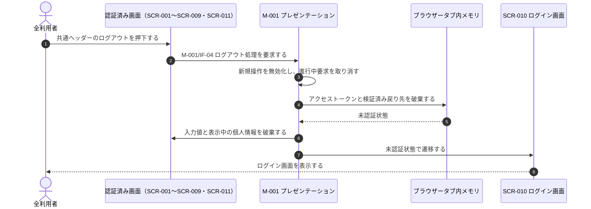
```mermaid
sequenceDiagram
    autonumber
    actor U as 全利用者
    participant UI as 認証済み画面（SCR-001〜SCR-009・SCR-011）
    participant PRES as M-001 プレゼンテーション
    participant MEM as ブラウザータブ内メモリ
    participant LOGIN as SCR-010 ログイン画面

    U->>UI: 共通ヘッダーのログアウトを押下する
    UI->>PRES: M-001/IF-04 ログアウト処理を要求する
    PRES->>PRES: 新規操作を無効化し、進行中要求を取り消す
    PRES->>MEM: アクセストークンと検証済み戻り先を破棄する
    MEM-->>PRES: 未認証状態
    PRES->>UI: 入力値と表示中の個人情報を破棄する
    PRES->>LOGIN: 未認証状態で遷移する
    LOGIN-->>U: ログイン画面を表示する
```

**連携定義**

条件分岐

| 条件ID | 判定箇所 | 条件 | 成立時 | 不成立時 | 根拠 |
|---|---|---|---|---|---|
| COND-01 | M-001 | 明示ログアウト時に認証状態が残っている | 基本フローで全状態を破棄する | 冪等に破棄を再実行してSCR-010へ遷移する | UC-013/SP-1（不成立=UC-013/SP-2） |
| COND-02 | M-001 | 起動契機がUNAUTHENTICATEDまたは期限到来である | MSG-12通知後に同じ破棄処理を行う | 明示ログアウトとして処理する | UC-013/SP-3（不成立=UC-013/SP-1） |
| COND-03 | M-001 | 起動契機がタブ終了または再読込である | メモリを引き継がず次回SCR-010から開始する | 現在タブ内でSCR-010へ遷移する | UC-013/SP-4 |

データ参照・更新

| 対象 | 操作 | 目的 | 実行主体 |
|---|---|---|---|
| 進行中API要求 | 取消 | ログアウト後の応答反映を防ぐ | M-001 |
| アクセストークン | メモリ破棄 | 認証状態を終了する | M-001 |
| 検証済み戻り先 | メモリ破棄 | ログイン後の意図しない復帰を防ぐ | M-001 |
| 画面入力・表示中個人情報 | 破棄 | 保護情報を画面に残さない | M-001 |
| Cloudflare D1 | なし | ログアウトでは永続データを参照・更新しない | - |

トランザクション境界

| 内容 |
|---|
| なし(クライアント内の冪等な状態破棄であり、API・JOB・D1トランザクションを使用しないため) |

補足事項

| 観点 | 内容 |
|---|---|
| API | ログアウトAPIは新設しない。M-001だけで完結し、M-002〜M-008を呼ばない |
| 冪等性 | 二重押下、認証失効後の明示操作、再読込をすべて同じ未認証状態へ収束させる |
| トークン保管 | アクセストークンはブラウザータブ内メモリだけに保持し、永続Web Storage、URL、DOM、ログへ保存しない |
| 遷移 | SCR-001〜SCR-009・SCR-011からSCR-010へ遷移し、認証情報・画面入力値・個人情報を戻り先へ引き継がない |

---

# 4. 画面設計

本章は社員名簿管理システムの全画面(SCR-001〜SCR-011)を詳細設計レベルで定義する。全画面を同一の9サブセクション
(基本情報、画面レイアウト、初期表示、画面項目、画面イベント、入力チェック、画面状態・表示制御、画面遷移、メッセージ一覧)で記載する。
ITM-XX と EVT-XX は画面内ローカルIDであり、他文書から参照する場合は SCR-XXX/ITM-XX、SCR-XXX/EVT-XX とする。
画面からデータベースやSQLへ直接アクセスせず、本章には物理データベース名・カラム名・SQLを記載しない。
画面ID・画面名・利用API・M-001との接続順は§3.1・§3.1.2を構成上の正本とし、本章は各画面のレイアウト・項目・イベント・状態・遷移を詳細化する。

## 4.0 共通認証・API応答制御

| 応答・事象 | 全画面共通処理 | 遷移・表示 | 個別イベント表との関係 |
|---|---|---|---|
| UNAUTHENTICATED | SCR-010以外でAPIがUNAUTHENTICATEDを返した場合、保持中のアクセストークンを破棄し、進行中要求を取消し、全操作を無効化する | MSG-12を表示してSCR-010へ遷移する。戻り先は同一オリジンかつ定義済み画面ルートと検証できたURLだけを保持し、認証情報・画面入力値・個人情報は引き継がない | 各初期表示・イベントの「その他」にはUNAUTHENTICATEDを含めない。本行を全API呼出へ優先適用する |
| ログイン後の戻り | API-010成功後、検証済み戻り先があれば1回だけ使用して破棄する | 戻り先なし・不正・権限不足の場合はSCR-001へ遷移する | SCR-010の成功遷移へ適用する |
| 相関IDありエラー | API応答のtraceIdを問い合わせ・クライアントログ相関にだけ利用し、内部例外・接続情報を表示しない | 個別画面で定義した業務エラーまたはシステムエラーを表示する | 個別イベント表のMSG・再実行制御を適用する |

- ロールコードは§2.4を、閲覧スコープ、表示項目および更新可能項目は§2.2の各ユースケースを正本とする。画面は非許可項目を非表示または表示専用とするが、ボタンや項目の非表示だけを認可手段とはせず、APIの権限判定結果を必ず適用する。
- 複数ロール時は§2.2冒頭の権限和集合とスコープ優先規則を適用する。業務日時点で有効なロールがない場合は保護画面を表示せず、SCR-001へ戻して権限不足を通知する。
- API-010が返すアクセストークンの正本はブラウザータブ内のアプリケーションメモリだけとし、`localStorage`、`sessionStorage`、IndexedDB、URL、画面項目およびクライアントログへ保存しない。SCR-010以外の全API要求へ`Authorization: Bearer <accessToken>`を付与し、期限到来、UNAUTHENTICATED、明示ログアウト、タブ終了、またはアプリケーション再読込時に破棄する。再読込後は未認証としてSCR-010から再開し、DOMへトークンを展開せず、動的HTML生成時はエスケープしてXSS対策を適用する。
- SCR-010以外の共通ヘッダーにUC-013(F-013)のログアウト操作を表示する。押下時は新規APIを呼ばず、M-001/IF-04が進行中要求を取消し、メモリ上のトークン・検証済み戻り先・画面内の個人情報を破棄してSCR-010へ遷移する。二重押下は同じ未認証状態へ収束させる。

| 共通イベントID | 適用画面 | トレース元 | 起動条件 | 呼出API | 正常終了 |
|---|---|---|---|---|---|
| EVT-COMMON-01 | SCR-001〜SCR-009、SCR-011 | UC-013(F-013) | 共通ヘッダーのログアウト押下、UNAUTHENTICATED、期限到来 | なし（M-001クライアント内完結） | 認証状態と個人情報を破棄し、SCR-010へ遷移 |

### 4.0.1 共通メッセージ一覧

| MSG ID | 種別 | 文言 | 対応ERR |
|---|---|---|---|
| MSG-12 | エラー | 認証の有効期限が切れました。再度ログインしてください。 | UNAUTHENTICATED |

共通応答制御で参照するMSGの文言は本表を正本とし、個別画面のメッセージ一覧へ重複定義しない。

### 4.0.2 画面・API・ERR・MSG横断整合

本表は各画面の基本情報・初期表示・イベントで参照する利用APIと、各§6.x.7の全エラーコード、画面が表示するMSGの対応を正逆両方向に検証した結果である。API-ID・Method・PathとERRコードは§6を、MSGは§4.0.1および各画面のメッセージ一覧を正本とする。UNAUTHENTICATEDは§4.0で共通処理するため共通行へ集約し、個別画面へ重複定義しない。

| 画面ID | API-ID | 呼出箇所 | §6 Method / Path | ERRコード | 画面側処理 | MSG-ID | 整合結果 |
|---|---|---|---|---|---|---|---|
| SCR-001〜009・SCR-011 | 各利用API | 全API呼出（初期表示・各EVT） | 各利用API（§6.2） | `UNAUTHENTICATED` | §4.0共通（認証情報破棄・進行中要求取消・SCR-010遷移） | MSG-12 | OK |
| SCR-001 | API-001 | 初期表示・EVT-01・EVT-06 | GET `/api/employees` | `VALIDATION_ERROR` | §4.3.7 条件不正 | MSG-98 | OK |
| SCR-001 | API-001 | 初期表示・EVT-01・EVT-06 | GET `/api/employees` | `FORBIDDEN` | §4.3.7 検索権限なし | MSG-99 | OK |
| SCR-001 | API-001 | 初期表示・EVT-01・EVT-06 | GET `/api/employees` | `INTERNAL_ERROR` | §4.3.7 システムエラー | MSG-13 | OK |
| SCR-001 | API-008 | 初期表示 | GET `/api/organizations` | `VALIDATION_ERROR` | §4.3.3 異常時 | MSG-98 | OK |
| SCR-001 | API-008 | 初期表示 | GET `/api/organizations` | `FORBIDDEN` | §4.3.3 異常時 | MSG-102 | OK |
| SCR-001 | API-008 | 初期表示 | GET `/api/organizations` | `INTERNAL_ERROR` | §4.3.3 異常時 | MSG-13 | OK |
| SCR-001 | API-009 | 初期表示 | GET `/api/positions` | `VALIDATION_ERROR` | §4.3.3 異常時 | MSG-98 | OK |
| SCR-001 | API-009 | 初期表示 | GET `/api/positions` | `FORBIDDEN` | §4.3.3 異常時 | MSG-102 | OK |
| SCR-001 | API-009 | 初期表示 | GET `/api/positions` | `INTERNAL_ERROR` | §4.3.3 異常時 | MSG-13 | OK |
| SCR-001 | API-018 | EVT-05 | POST `/api/employees/export` | `VALIDATION_ERROR` | §4.3.7 条件不正 | MSG-98 | OK |
| SCR-001 | API-018 | EVT-05 | POST `/api/employees/export` | `FORBIDDEN` | §4.3.7 出力権限なし | MSG-15 | OK |
| SCR-001 | API-018 | EVT-05 | POST `/api/employees/export` | `EXPORT_TARGET_EMPTY` | §4.3.5 EVT-05失敗時 | MSG-14 | OK |
| SCR-001 | API-018 | EVT-05 | POST `/api/employees/export` | `EXPORT_LIMIT_EXCEEDED` | §4.3.7 出力上限超過 | MSG-87 | OK |
| SCR-001 | API-018 | EVT-05 | POST `/api/employees/export` | `INTERNAL_ERROR` | §4.3.7 システムエラー | MSG-13 | OK |
| SCR-002 | API-002 | 初期表示・EVT-01 | GET `/api/employees/{employeeId}` | `VALIDATION_ERROR` / `EMPLOYEE_NOT_FOUND` | §4.4.7 対象不存在 | MSG-17 | OK |
| SCR-002 | API-002 | 初期表示・EVT-01 | GET `/api/employees/{employeeId}` | `FORBIDDEN` | §4.4.7 閲覧権限なし | MSG-18 | OK |
| SCR-002 | API-002 | 初期表示・EVT-01 | GET `/api/employees/{employeeId}` | `INTERNAL_ERROR` | §4.4.7 システムエラー | MSG-20 | OK |
| SCR-003 | API-003 | EVT-01 | POST `/api/employees` | `VALIDATION_ERROR` | §4.5.7 入力エラー | MSG-01 | OK |
| SCR-003 | API-003 | EVT-01 | POST `/api/employees` | `EMPLOYEE_NUMBER_DUPLICATED` | §4.5.7 社員番号重複 | MSG-02 | OK |
| SCR-003 | API-003 | EVT-01 | POST `/api/employees` | `EMAIL_DUPLICATED` | §4.5.7 メール重複 | MSG-03 | OK |
| SCR-003 | API-003 | EVT-01 | POST `/api/employees` | `MASTER_NOT_ACTIVE` | §4.5.7 マスター無効 | MSG-06 | OK |
| SCR-003 | API-003 | EVT-01 | POST `/api/employees` | `FORBIDDEN` | §4.5.7 権限エラー | MSG-07 | OK |
| SCR-003 | API-003 | EVT-01 | POST `/api/employees` | `INTERNAL_ERROR` | §4.5.7 システムエラー | MSG-08 | OK |
| SCR-003 | API-008 | 初期表示・EVT-03・EVT-04 | GET `/api/organizations` | `VALIDATION_ERROR` | §4.5.3 異常時 | MSG-01 | OK |
| SCR-003 | API-008 | 初期表示・EVT-03・EVT-04 | GET `/api/organizations` | `FORBIDDEN` | §4.5.3 異常時 | MSG-07 | OK |
| SCR-003 | API-008 | 初期表示・EVT-03・EVT-04 | GET `/api/organizations` | `INTERNAL_ERROR` | §4.5.3 異常時 | MSG-08 | OK |
| SCR-003 | API-009 | 初期表示・EVT-03・EVT-04 | GET `/api/positions` | `VALIDATION_ERROR` | §4.5.3 異常時 | MSG-01 | OK |
| SCR-003 | API-009 | 初期表示・EVT-03・EVT-04 | GET `/api/positions` | `FORBIDDEN` | §4.5.3 異常時 | MSG-07 | OK |
| SCR-003 | API-009 | 初期表示・EVT-03・EVT-04 | GET `/api/positions` | `INTERNAL_ERROR` | §4.5.3 異常時 | MSG-08 | OK |
| SCR-004 | API-002 | 初期表示・EVT-02 | GET `/api/employees/{employeeId}` | `VALIDATION_ERROR` | §4.6.3 異常時 | MSG-21 | OK |
| SCR-004 | API-002 | 初期表示・EVT-02 | GET `/api/employees/{employeeId}` | `FORBIDDEN` | §4.6.7 権限エラー | MSG-26 | OK |
| SCR-004 | API-002 | 初期表示・EVT-02 | GET `/api/employees/{employeeId}` | `EMPLOYEE_NOT_FOUND` | §4.6.7 対象不存在 | MSG-27 | OK |
| SCR-004 | API-002 | 初期表示・EVT-02 | GET `/api/employees/{employeeId}` | `INTERNAL_ERROR` | §4.6.7 システムエラー | MSG-28 | OK |
| SCR-004 | API-004 | EVT-01 | PUT `/api/employees/{employeeId}` | `VALIDATION_ERROR` | §4.6.7 入力エラー | MSG-21 | OK |
| SCR-004 | API-004 | EVT-01 | PUT `/api/employees/{employeeId}` | `EMAIL_DUPLICATED` | §4.6.7 メール重複 | MSG-22 | OK |
| SCR-004 | API-004 | EVT-01 | PUT `/api/employees/{employeeId}` | `UPDATE_CONFLICT` | §4.6.7 更新競合 | MSG-23 | OK |
| SCR-004 | API-004 | EVT-01 | PUT `/api/employees/{employeeId}` | `FORBIDDEN` | §4.6.7 権限エラー | MSG-26 | OK |
| SCR-004 | API-004 | EVT-01 | PUT `/api/employees/{employeeId}` | `EMPLOYEE_NOT_FOUND` | §4.6.7 対象不存在 | MSG-27 | OK |
| SCR-004 | API-004 | EVT-01 | PUT `/api/employees/{employeeId}` | `INTERNAL_ERROR` | §4.6.7 システムエラー | MSG-28 | OK |
| SCR-005 | API-001 | EVT-04 | GET `/api/employees` | `VALIDATION_ERROR` | §4.7.5 EVT-04失敗時 | MSG-30 | OK |
| SCR-005 | API-001 | EVT-04 | GET `/api/employees` | `FORBIDDEN` | §4.7.5 EVT-04失敗時 | MSG-37 | OK |
| SCR-005 | API-001 | EVT-04 | GET `/api/employees` | `INTERNAL_ERROR` | §4.7.5 EVT-04失敗時 | MSG-38 | OK |
| SCR-005 | API-002 | 初期表示 | GET `/api/employees/{employeeId}` | `VALIDATION_ERROR` | §4.7.3 異常時 | MSG-30 | OK |
| SCR-005 | API-002 | 初期表示 | GET `/api/employees/{employeeId}` | `FORBIDDEN` | §4.7.7 権限エラー | MSG-37 | OK |
| SCR-005 | API-002 | 初期表示 | GET `/api/employees/{employeeId}` | `EMPLOYEE_NOT_FOUND` | §4.7.7 対象外 | MSG-31 | OK |
| SCR-005 | API-002 | 初期表示 | GET `/api/employees/{employeeId}` | `INTERNAL_ERROR` | §4.7.7 システムエラー | MSG-38 | OK |
| SCR-005 | API-005 | EVT-01 | POST `/api/employees/{employeeId}/assignments` | `VALIDATION_ERROR` | §4.7.5 EVT-01失敗時 | MSG-30 | OK |
| SCR-005 | API-005 | EVT-01 | POST `/api/employees/{employeeId}/assignments` | `EMPLOYEE_NOT_FOUND` / `EMPLOYEE_ALREADY_RETIRED` | §4.7.7 対象外 | MSG-31 | OK |
| SCR-005 | API-005 | EVT-01 | POST `/api/employees/{employeeId}/assignments` | `MASTER_NOT_ACTIVE` | §4.7.7 マスター・上長無効 | MSG-32 | OK |
| SCR-005 | API-005 | EVT-01 | POST `/api/employees/{employeeId}/assignments` | `ASSIGNMENT_PERIOD_CONFLICT` / `INVALID_TRANSFER_DATE` | §4.7.7 期間重複 | MSG-33 | OK |
| SCR-005 | API-005 | EVT-01 | POST `/api/employees/{employeeId}/assignments` | `FORBIDDEN` | §4.7.7 権限エラー | MSG-37 | OK |
| SCR-005 | API-005 | EVT-01 | POST `/api/employees/{employeeId}/assignments` | `UPDATE_CONFLICT` | §4.7.7 更新競合 | MSG-88 | OK |
| SCR-005 | API-005 | EVT-01 | POST `/api/employees/{employeeId}/assignments` | `INTERNAL_ERROR` | §4.7.7 システムエラー | MSG-38 | OK |
| SCR-005 | API-008 | 初期表示・EVT-03・EVT-05 | GET `/api/organizations` | `VALIDATION_ERROR` | §4.7.3 異常時 | MSG-30 | OK |
| SCR-005 | API-008 | 初期表示・EVT-03・EVT-05 | GET `/api/organizations` | `FORBIDDEN` | §4.7.7 権限エラー | MSG-37 | OK |
| SCR-005 | API-008 | 初期表示・EVT-03・EVT-05 | GET `/api/organizations` | `INTERNAL_ERROR` | §4.7.7 システムエラー | MSG-38 | OK |
| SCR-005 | API-009 | 初期表示・EVT-03・EVT-05 | GET `/api/positions` | `VALIDATION_ERROR` | §4.7.3 異常時 | MSG-30 | OK |
| SCR-005 | API-009 | 初期表示・EVT-03・EVT-05 | GET `/api/positions` | `FORBIDDEN` | §4.7.7 権限エラー | MSG-37 | OK |
| SCR-005 | API-009 | 初期表示・EVT-03・EVT-05 | GET `/api/positions` | `INTERNAL_ERROR` | §4.7.7 システムエラー | MSG-38 | OK |
| SCR-006 | API-002 | 初期表示 | GET `/api/employees/{employeeId}` | `VALIDATION_ERROR` / `EMPLOYEE_NOT_FOUND` | §4.8.7 対象外 | MSG-41 | OK |
| SCR-006 | API-002 | 初期表示 | GET `/api/employees/{employeeId}` | `FORBIDDEN` | §4.8.7 権限エラー | MSG-45 | OK |
| SCR-006 | API-002 | 初期表示 | GET `/api/employees/{employeeId}` | `INTERNAL_ERROR` | §4.8.7 システムエラー | MSG-46 | OK |
| SCR-006 | API-006 | EVT-01 | POST `/api/employees/{employeeId}/retirement` | `VALIDATION_ERROR` / `INVALID_RETIREMENT_DATE` | §4.8.7 退職日・上長参照不正 | MSG-40 | OK |
| SCR-006 | API-006 | EVT-01 | POST `/api/employees/{employeeId}/retirement` | `EMPLOYEE_NOT_FOUND` / `EMPLOYEE_ALREADY_RETIRED` | §4.8.7 対象外 | MSG-41 | OK |
| SCR-006 | API-006 | EVT-01 | POST `/api/employees/{employeeId}/retirement` | `FORBIDDEN` | §4.8.7 権限エラー | MSG-45 | OK |
| SCR-006 | API-006 | EVT-01 | POST `/api/employees/{employeeId}/retirement` | `UPDATE_CONFLICT` | §4.8.7 更新競合 | MSG-89 | OK |
| SCR-006 | API-006 | EVT-01 | POST `/api/employees/{employeeId}/retirement` | `INTERNAL_ERROR` | §4.8.7 システムエラー | MSG-46 | OK |
| SCR-007 | API-002 | 初期表示 | GET `/api/employees/{employeeId}` | `VALIDATION_ERROR` / `EMPLOYEE_NOT_FOUND` | §4.9.7 対象不存在 | MSG-100 | OK |
| SCR-007 | API-002 | 初期表示 | GET `/api/employees/{employeeId}` | `FORBIDDEN` | §4.9.7 権限エラー | MSG-51 | OK |
| SCR-007 | API-002 | 初期表示 | GET `/api/employees/{employeeId}` | `INTERNAL_ERROR` | §4.9.7 システムエラー | MSG-52 | OK |
| SCR-007 | API-007 | 初期表示・EVT-01・EVT-04 | GET `/api/employees/{employeeId}/history` | `FORBIDDEN` | §4.9.7 権限エラー | MSG-51 | OK |
| SCR-007 | API-007 | 初期表示・EVT-01・EVT-04 | GET `/api/employees/{employeeId}/history` | `EMPLOYEE_NOT_FOUND` | §4.9.7 対象不存在 | MSG-100 | OK |
| SCR-007 | API-007 | 初期表示・EVT-01・EVT-04 | GET `/api/employees/{employeeId}/history` | `VALIDATION_ERROR` / `INTERNAL_ERROR` | §4.9.7 システムエラー | MSG-52 | OK |
| SCR-008 | API-008 | 初期表示・EVT-02〜04 | GET `/api/organizations` | `VALIDATION_ERROR` | §4.10.7 入力エラー | MSG-53 | OK |
| SCR-008 | API-008 | 初期表示・EVT-02〜04 | GET `/api/organizations` | `FORBIDDEN` | §4.10.7 権限エラー | MSG-58 | OK |
| SCR-008 | API-008 | 初期表示・EVT-02〜04 | GET `/api/organizations` | `INTERNAL_ERROR` | §4.10.7 システムエラー | MSG-59 | OK |
| SCR-008 | API-011 | EVT-02 | POST `/api/organizations` | `VALIDATION_ERROR` | §4.10.7 入力エラー | MSG-53 | OK |
| SCR-008 | API-011 | EVT-02 | POST `/api/organizations` | `ORGANIZATION_CODE_DUPLICATED` | §4.10.7 コード重複 | MSG-54 | OK |
| SCR-008 | API-011 | EVT-02 | POST `/api/organizations` | `MASTER_PERIOD_INVALID` | §4.10.7 期間不正 | MSG-91 | OK |
| SCR-008 | API-011 | EVT-02 | POST `/api/organizations` | `ORGANIZATION_HIERARCHY_CONFLICT` | §4.10.7 階層不整合 | MSG-92 | OK |
| SCR-008 | API-011 | EVT-02 | POST `/api/organizations` | `FORBIDDEN` | §4.10.7 権限エラー | MSG-58 | OK |
| SCR-008 | API-011 | EVT-02 | POST `/api/organizations` | `INTERNAL_ERROR` | §4.10.7 システムエラー | MSG-59 | OK |
| SCR-008 | API-012 | EVT-03・EVT-04 | PUT `/api/organizations/{organizationId}` | `VALIDATION_ERROR` | §4.10.7 入力エラー | MSG-53 | OK |
| SCR-008 | API-012 | EVT-03・EVT-04 | PUT `/api/organizations/{organizationId}` | `MASTER_PERIOD_INVALID` | §4.10.7 期間不正 | MSG-91 | OK |
| SCR-008 | API-012 | EVT-03・EVT-04 | PUT `/api/organizations/{organizationId}` | `ORGANIZATION_HIERARCHY_CONFLICT` | §4.10.7 階層不整合 | MSG-92 | OK |
| SCR-008 | API-012 | EVT-03・EVT-04 | PUT `/api/organizations/{organizationId}` | `ORGANIZATION_NOT_FOUND` | §4.10.7 対象不存在 | MSG-93 | OK |
| SCR-008 | API-012 | EVT-03・EVT-04 | PUT `/api/organizations/{organizationId}` | `UPDATE_CONFLICT` | §4.10.7 更新競合 | MSG-94 | OK |
| SCR-008 | API-012 | EVT-03・EVT-04 | PUT `/api/organizations/{organizationId}` | `FORBIDDEN` | §4.10.7 権限エラー | MSG-58 | OK |
| SCR-008 | API-012 | EVT-03・EVT-04 | PUT `/api/organizations/{organizationId}` | `INTERNAL_ERROR` | §4.10.7 システムエラー | MSG-59 | OK |
| SCR-009 | API-009 | 初期表示・EVT-02〜04 | GET `/api/positions` | `VALIDATION_ERROR` | §4.11.7 入力エラー | MSG-62 | OK |
| SCR-009 | API-009 | 初期表示・EVT-02〜04 | GET `/api/positions` | `FORBIDDEN` | §4.11.7 権限エラー | MSG-67 | OK |
| SCR-009 | API-009 | 初期表示・EVT-02〜04 | GET `/api/positions` | `INTERNAL_ERROR` | §4.11.7 システムエラー | MSG-68 | OK |
| SCR-009 | API-013 | EVT-02 | POST `/api/positions` | `VALIDATION_ERROR` | §4.11.7 入力エラー | MSG-62 | OK |
| SCR-009 | API-013 | EVT-02 | POST `/api/positions` | `POSITION_CODE_DUPLICATED` | §4.11.7 コード重複 | MSG-63 | OK |
| SCR-009 | API-013 | EVT-02 | POST `/api/positions` | `MASTER_PERIOD_INVALID` | §4.11.7 期間不正 | MSG-95 | OK |
| SCR-009 | API-013 | EVT-02 | POST `/api/positions` | `FORBIDDEN` | §4.11.7 権限エラー | MSG-67 | OK |
| SCR-009 | API-013 | EVT-02 | POST `/api/positions` | `INTERNAL_ERROR` | §4.11.7 システムエラー | MSG-68 | OK |
| SCR-009 | API-014 | EVT-03・EVT-04 | PUT `/api/positions/{positionId}` | `VALIDATION_ERROR` | §4.11.7 入力エラー | MSG-62 | OK |
| SCR-009 | API-014 | EVT-03・EVT-04 | PUT `/api/positions/{positionId}` | `MASTER_PERIOD_INVALID` | §4.11.7 期間不正 | MSG-95 | OK |
| SCR-009 | API-014 | EVT-03・EVT-04 | PUT `/api/positions/{positionId}` | `POSITION_NOT_FOUND` | §4.11.7 対象不存在 | MSG-96 | OK |
| SCR-009 | API-014 | EVT-03・EVT-04 | PUT `/api/positions/{positionId}` | `UPDATE_CONFLICT` | §4.11.7 更新競合 | MSG-97 | OK |
| SCR-009 | API-014 | EVT-03・EVT-04 | PUT `/api/positions/{positionId}` | `FORBIDDEN` | §4.11.7 権限エラー | MSG-67 | OK |
| SCR-009 | API-014 | EVT-03・EVT-04 | PUT `/api/positions/{positionId}` | `INTERNAL_ERROR` | §4.11.7 システムエラー | MSG-68 | OK |
| SCR-010 | API-010 | EVT-01 | POST `/api/auth/login` | `VALIDATION_ERROR` | §4.12.5 EVT-01失敗時 | MSG-71 | OK |
| SCR-010 | API-010 | EVT-01 | POST `/api/auth/login` | `AUTHENTICATION_FAILED` | §4.12.7 認証情報誤り | MSG-72 | OK |
| SCR-010 | API-010 | EVT-01 | POST `/api/auth/login` | `ACCOUNT_INACTIVE` | §4.12.7 アカウント無効・ロック | MSG-73 | OK |
| SCR-010 | API-010 | EVT-01 | POST `/api/auth/login` | `AUTHENTICATION_SERVICE_UNAVAILABLE` | §4.12.7 認証基盤利用不能 | MSG-90 | OK |
| SCR-010 | API-010 | EVT-01 | POST `/api/auth/login` | `INTERNAL_ERROR` | §4.12.7 システムエラー | MSG-75 | OK |
| SCR-011 | API-001 | EVT-01・EVT-06 | GET `/api/employees` | `VALIDATION_ERROR` | §4.13.5 EVT-01/06失敗時 | MSG-76 | OK |
| SCR-011 | API-001 | EVT-01・EVT-06 | GET `/api/employees` | `FORBIDDEN` | §4.13.7 権限エラー | MSG-81 | OK |
| SCR-011 | API-001 | EVT-01・EVT-06 | GET `/api/employees` | `INTERNAL_ERROR` | §4.13.7 システムエラー | MSG-82 | OK |
| SCR-011 | API-008 | 初期表示 | GET `/api/organizations` | `VALIDATION_ERROR` | §4.13.3 異常時 | MSG-76 | OK |
| SCR-011 | API-008 | 初期表示 | GET `/api/organizations` | `FORBIDDEN` | §4.13.7 権限エラー | MSG-81 | OK |
| SCR-011 | API-008 | 初期表示 | GET `/api/organizations` | `INTERNAL_ERROR` | §4.13.7 システムエラー | MSG-82 | OK |
| SCR-011 | API-015 | 初期表示 | GET `/api/roles` | `FORBIDDEN` | §4.13.7 権限エラー | MSG-81 | OK |
| SCR-011 | API-015 | 初期表示 | GET `/api/roles` | `INTERNAL_ERROR` | §4.13.7 システムエラー | MSG-82 | OK |
| SCR-011 | API-016 | EVT-02 | GET `/api/employees/{employeeId}/roles` | `VALIDATION_ERROR` | §4.13.5 EVT-02失敗時 | MSG-76 | OK |
| SCR-011 | API-016 | EVT-02 | GET `/api/employees/{employeeId}/roles` | `EMPLOYEE_NOT_FOUND` / `USER_ACCOUNT_NOT_FOUND` | §4.13.7 対象不存在 | MSG-77 | OK |
| SCR-011 | API-016 | EVT-02 | GET `/api/employees/{employeeId}/roles` | `FORBIDDEN` | §4.13.7 権限エラー | MSG-81 | OK |
| SCR-011 | API-016 | EVT-02 | GET `/api/employees/{employeeId}/roles` | `INTERNAL_ERROR` | §4.13.7 システムエラー | MSG-82 | OK |
| SCR-011 | API-017 | EVT-03 | PUT `/api/employees/{employeeId}/roles` | `VALIDATION_ERROR` | §4.13.5 EVT-03失敗時 | MSG-76 | OK |
| SCR-011 | API-017 | EVT-03 | PUT `/api/employees/{employeeId}/roles` | `EMPLOYEE_NOT_FOUND` / `USER_ACCOUNT_NOT_FOUND` | §4.13.7 対象不存在 | MSG-77 | OK |
| SCR-011 | API-017 | EVT-03 | PUT `/api/employees/{employeeId}/roles` | `ROLE_NOT_ACTIVE` | §4.13.7 ロール無効 | MSG-78 | OK |
| SCR-011 | API-017 | EVT-03 | PUT `/api/employees/{employeeId}/roles` | `ROLE_ASSIGNMENT_PERIOD_CONFLICT` | §4.13.7 期間不正 | MSG-85 | OK |
| SCR-011 | API-017 | EVT-03 | PUT `/api/employees/{employeeId}/roles` | `USER_ACCOUNT_INACTIVE` | §4.13.7 アカウント無効 | MSG-86 | OK |
| SCR-011 | API-017 | EVT-03 | PUT `/api/employees/{employeeId}/roles` | `UPDATE_CONFLICT` | §4.13.7 更新競合 | MSG-101 | OK |
| SCR-011 | API-017 | EVT-03 | PUT `/api/employees/{employeeId}/roles` | `FORBIDDEN` | §4.13.7 権限エラー | MSG-81 | OK |
| SCR-011 | API-017 | EVT-03 | PUT `/api/employees/{employeeId}/roles` | `INTERNAL_ERROR` | §4.13.7 システムエラー | MSG-82 | OK |

上表のとおり、利用API未使用・APIエラー未処理・生成元APIのないERR対応MSG・未定義IDはいずれも0件で、全画面で正逆両方向の対応が成立する。

## 4.1 画面一覧

| 画面ID | 画面名 | URL / ルート | 目的 | 主な利用者 | トレース元 |
|---|---|---|---|---|---|
| SCR-001 | 社員検索画面 | /employees | 権限範囲内の社員を検索し、詳細参照・登録・検索結果出力へつなぐ | 全利用者 | UC-002(F-002), UC-009(F-009) |
| SCR-002 | 社員詳細画面 | /employees/{employeeId} | 社員の基本情報・所属・役職・在籍状態を権限範囲内で参照する | 全利用者 | UC-006(F-003) |
| SCR-003 | 社員登録画面 | /employees/new | 社員基本情報と初期所属を登録する | 人事担当者 | UC-001(F-004) |
| SCR-004 | 社員編集画面 | /employees/{employeeId}/edit | 社員基本情報を競合検知付きで更新する | 人事担当者、条件付きで本人 | UC-007(F-005) |
| SCR-005 | 社員異動画面 | /employees/{employeeId}/assignments/new | 所属・役職を適用日付きで変更する | 人事担当者 | UC-003(F-006) |
| SCR-006 | 退職処理画面 | /employees/{employeeId}/retirement | 退職日を登録し退職処理または退職予約を行う | 人事担当者 | UC-004(F-007) |
| SCR-007 | 変更履歴画面 | /employees/{employeeId}/history | 社員情報の変更履歴を条件指定して参照する | 人事担当者、システム管理者 | UC-008(F-008) |
| SCR-008 | 組織マスター画面 | /admin/organizations | 組織マスターを登録・更新・無効化する | システム管理者 | UC-010(F-010) |
| SCR-009 | 役職マスター画面 | /admin/positions | 役職マスターを登録・更新・無効化する | システム管理者 | UC-011(F-011) |
| SCR-010 | ログイン画面 | /login | 社内認証基盤で認証しアクセストークンを取得する | 全利用者 | UC-005(F-001) |
| SCR-011 | 権限管理画面 | /admin/permissions | 利用者を特定しロール割当を参照・更新する | システム管理者 | UC-012(F-012) |

## 4.2 画面遷移

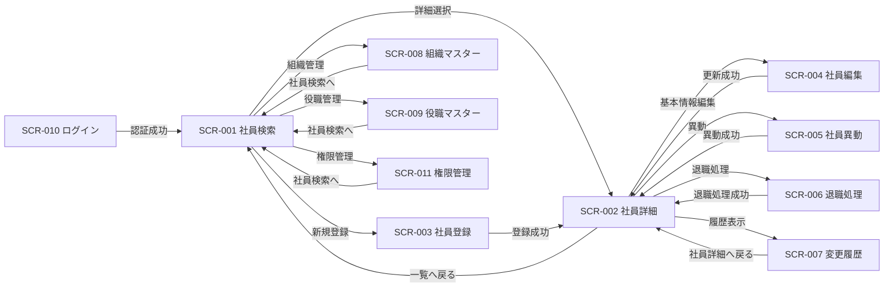
```mermaid
flowchart LR
    SCR010["SCR-010 ログイン"] -->|認証成功| SCR001["SCR-001 社員検索"]
    SCR001 -->|詳細選択| SCR002["SCR-002 社員詳細"]
    SCR001 -->|新規登録| SCR003["SCR-003 社員登録"]
    SCR002 -->|基本情報編集| SCR004["SCR-004 社員編集"]
    SCR002 -->|異動| SCR005["SCR-005 社員異動"]
    SCR002 -->|退職処理| SCR006["SCR-006 退職処理"]
    SCR002 -->|履歴表示| SCR007["SCR-007 変更履歴"]
    SCR003 -->|登録成功| SCR002
    SCR004 -->|更新成功| SCR002
    SCR005 -->|異動成功| SCR002
    SCR006 -->|退職処理成功| SCR002
    SCR002 -->|一覧へ戻る| SCR001
    SCR007 -->|社員詳細へ戻る| SCR002
    SCR008["SCR-008 組織マスター"] -->|社員検索へ| SCR001
    SCR009["SCR-009 役職マスター"] -->|社員検索へ| SCR001
    SCR011["SCR-011 権限管理"] -->|社員検索へ| SCR001
    SCR001 -->|組織管理| SCR008
    SCR001 -->|役職管理| SCR009
    SCR001 -->|権限管理| SCR011
```

## 4.3 SCR-001 社員検索画面

### 4.3.1 基本情報

| 項目 | 内容 |
|---|---|
| 画面ID | SCR-001 |
| 画面名 | 社員検索画面 |
| URL / ルート | /employees |
| 目的 | 検索条件と閲覧可能範囲に一致する社員を一覧表示し、詳細参照・登録・検索結果出力へつなぐ |
| トレース元 | UC-002(F-002), UC-009(F-009) |
| 利用可能ロール | 全利用者。新規登録・出力・管理画面への導線はロールで制御する |
| 表示契機 | SCR-010の認証成功、各業務画面からの戻り |
| 利用API | API-001, API-008, API-009, API-018 |

### 4.3.2 画面レイアウト

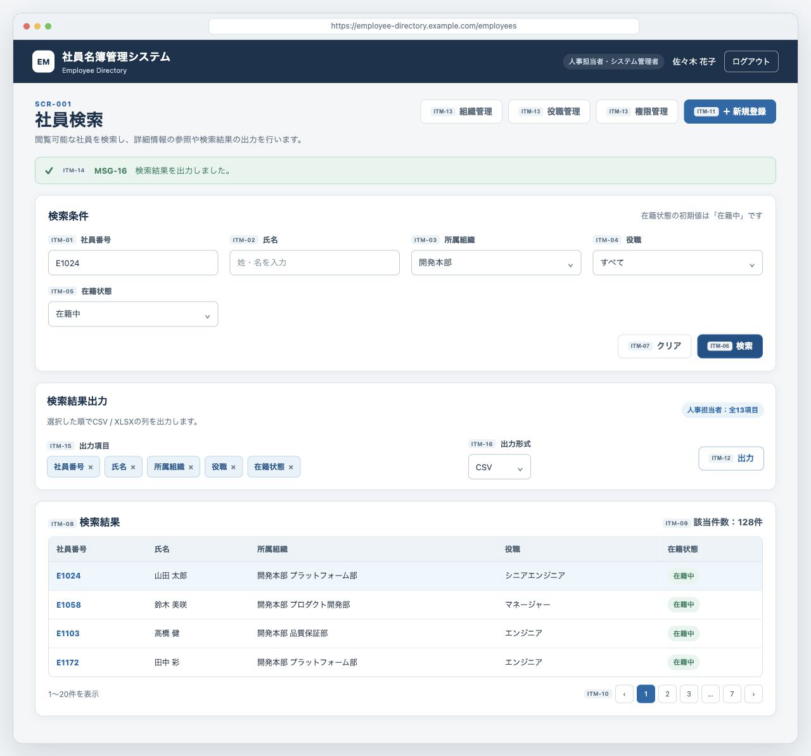

| 項目 | 内容 |
|---|---|
| 代表状態 | 人事担当者・システム管理者の複数ロールでログインし、検索結果出力が完了した状態 |
| 配置要点 | 検索条件、出力設定、結果一覧を業務順に上から配置し、主要操作とページ操作を同一視野内に置く |
| 編集可能な原本 | [SCR-001.html](社員名簿管理システム/mockups/SCR-001.html) |

### 4.3.3 初期表示

| No | 処理 | API | 正常時 | 異常時 |
|---:|---|---|---|---|
| 1 | 組織選択肢を取得する | API-008 | ITM-03へ閲覧可能な組織を設定 | 取得条件不正はMSG-98、権限不足はMSG-102、その他はMSG-13を表示しITM-03を無効化 |
| 2 | 役職選択肢を取得する | API-009 | ITM-04へ有効な役職を設定 | 取得条件不正はMSG-98、権限不足はMSG-102、その他はMSG-13を表示しITM-04を無効化 |
| 3 | 既定条件で1ページ目を検索する | API-001 | ITM-08へ一覧、ITM-09へ件数を設定 | 入力不正はMSG-98、権限不足はMSG-99、その他はMSG-13を表示 |

### 4.3.4 画面項目

| 項目ID | 項目名 | 種別 | 必須 | 入力・表示規則 |
|---|---|---|---|---|
| ITM-01 | 社員番号 | テキスト | 任意 | 半角英数字。前後空白を除去して検索条件とする |
| ITM-02 | 氏名 | テキスト | 任意 | 姓名を対象とする。前後空白を除去する |
| ITM-03 | 所属組織 | 選択 | 任意 | API-008で取得した閲覧可能な組織から選択 |
| ITM-04 | 役職 | 選択 | 任意 | API-009で取得した有効な役職から選択 |
| ITM-05 | 在籍状態 | 選択 | 任意 | §2.4の`ACTIVE`（在籍中）・`RETIRED`（退職）と検索制御値`ALL`（すべて）。初期値は`ACTIVE` |
| ITM-06 | 検索 | ボタン | ― | 検索可能状態で活性 |
| ITM-07 | クリア | ボタン | ― | 検索条件を初期値へ戻す |
| ITM-08 | 検索結果 | 一覧 | ― | 権限上表示可能な項目のみを表示。1行選択可能 |
| ITM-09 | 該当件数 | 表示 | ― | API-001の総件数を表示 |
| ITM-10 | ページ操作 | ページャー | ― | API-001のpage・pageSize・total・hasNextを保持する。1始まり、1ページ20件、最大100件 |
| ITM-11 | 新規登録 | ボタン | ― | 人事担当者だけ表示 |
| ITM-12 | 出力 | ボタン | ― | 人事担当者・部門管理者に表示。検索実行後に活性 |
| ITM-13 | 管理メニュー | リンク群 | ― | システム管理者にSCR-008、SCR-009、SCR-011への導線を表示 |
| ITM-14 | メッセージ領域 | 表示 | ― | MSG-10〜MSG-16、MSG-87、MSG-98、MSG-99、MSG-102を表示 |
| ITM-15 | 出力項目 | 複数選択 | 任意 | API-018のfieldコードを保持する。人事担当者には全13項目、部門管理者には社員番号・氏名・組織コード・組織名・役職コード・役職名・在籍状態だけを候補表示する。既定の表示順は社員番号・氏名・組織名・役職名・在籍状態。利用者が並べ替えた順を送信する |
| ITM-16 | 出力形式 | 選択 | 任意 | `CSV` / `XLSX`。初期値は`CSV` |

### 4.3.5 画面イベント

| イベントID | イベント名 | 発火条件 | 前提・入力 | API | 成功時 | 失敗時 | 多重実行防止 |
|---|---|---|---|---|---|---|---|
| EVT-01 | 検索 | ITM-06押下 | ITM-01〜05、1ページ目 | API-001 | 一覧・件数を更新。0件はMSG-10 | 入力不正はMSG-98、権限不足はMSG-99、その他はMSG-13 | 応答まで検索・ページ操作を無効化 |
| EVT-02 | 条件クリア | ITM-07押下 | なし | なし | ITM-01〜05を初期値へ戻す | ― | 連打による副作用なし |
| EVT-03 | 詳細表示 | ITM-08の行を選択 | 選択社員ID | なし | SCR-002へ遷移 | 選択解除時は遷移しない | 1回の選択で1遷移 |
| EVT-04 | 新規登録表示 | ITM-11押下 | 人事担当者であること | なし | SCR-003へ遷移 | 非表示制御により実行不可 | 遷移開始後にボタン無効化 |
| EVT-05 | 検索結果出力 | ITM-12押下 | 直近の検索条件、ITM-15、ITM-16 | API-018 | 出力データを提供しMSG-16 | 入力不正はMSG-98、0件はMSG-14、10,000件超過はMSG-87、権限不足はMSG-15、その他はMSG-13 | 応答まで出力ボタンを無効化 |
| EVT-06 | ページ切替 | ITM-10操作 | 検索条件・ページ番号・件数 | API-001 | 指定ページの一覧を表示 | 入力不正はMSG-98、権限不足はMSG-99、その他はMSG-13 | 応答までページ操作を無効化 |
| EVT-07 | 管理画面表示 | ITM-13のリンク選択 | システム管理者であること | なし | 選択したSCR-008/009/011へ遷移 | 非表示制御により実行不可 | 遷移開始後にリンク無効化 |

### 4.3.6 入力チェック

| No | 対象 | タイミング | チェック内容 | 違反時 |
|---:|---|---|---|---|
| 1 | ITM-01 | EVT-01実行時 | 半角英数字かつ100文字以内であること | MSG-98を表示し送信しない |
| 2 | ITM-02 | EVT-01実行時 | 制御文字を含まず100文字以内であること | MSG-98を表示し送信しない |
| 3 | ITM-10 | EVT-06実行時 | ページ番号は1以上、件数は1〜100 | MSG-98を表示し送信しない |
| 4 | ITM-15 | EVT-05実行時 | 1件以上、API-018で定義したfieldコード、重複なし、かつログインロールに許可された項目だけであること | 未知・重複はMSG-98を表示し送信しない。ロール非許可項目はMSG-15を表示し送信しない |
| 5 | ITM-16 | EVT-05実行時 | `CSV`または`XLSX` | MSG-98を表示し送信しない |

### 4.3.7 画面状態・表示制御

| 状態 | 条件・契機 | 入力・操作制御 | 表示内容 | 対応状態パターン |
|---|---|---|---|---|
| 初期表示 | 初期API正常 | 検索条件を編集可 | 権限内の既定一覧 | UC-002/SP-1 |
| 検索中 | EVT-01/06の応答待ち | 検索・ページ操作を無効化 | MSG-11 | UC-002/SP-1 |
| 検索結果あり | 1件以上 | 詳細選択可。権限により出力可 | 一覧と件数 | UC-002/SP-1 |
| 検索結果なし | 0件 | 詳細・出力を無効化 | MSG-10 | UC-002/SP-2, UC-009/SP-2 |
| 出力中 | EVT-05の応答待ち | 出力を無効化 | MSG-11 | UC-009/SP-1 |
| 出力上限超過 | API-018が10,000件超過 | 条件を保持し、検索条件を絞り込み可能 | MSG-87 | UC-009/SP-4 |
| 出力権限なし | API-018が権限不足 | 出力を無効化 | MSG-15 | UC-009/SP-3 |
| 検索権限なし | API-001が権限不足 | 検索・ページ操作を無効化 | MSG-99 | UC-002/SP-4 |
| 条件不正 | API-001/018が入力不正 | 条件を保持し修正可 | MSG-98 | 該当なし(入力条件不備) |
| 認証切れ | API-001が認証無効 | 全操作を無効化 | MSG-12 | UC-002/SP-3 |
| システムエラー | 技術例外 | 条件を保持し再実行可 | MSG-13 | 該当なし(技術例外) |

### 4.3.8 画面遷移

| 遷移元イベント | 遷移先 | 条件 | 引継ぎ値 |
|---|---|---|---|
| EVT-03 | SCR-002 | 検索結果行を選択 | 社員ID |
| EVT-04 | SCR-003 | 人事担当者 | なし |
| EVT-07 | SCR-008 / SCR-009 / SCR-011 | システム管理者 | 選択した管理機能 |

### 4.3.9 メッセージ一覧

| MSG ID | 種別 | 文言 | 対応ERR |
|---|---|---|---|
| MSG-10 | 情報 | 条件に一致する社員が見つかりませんでした。 | - |
| MSG-11 | 情報 | 処理中です。しばらくお待ちください。 | - |
| MSG-13 | エラー | 情報を取得できませんでした。時間をおいて再度お試しください。 | INTERNAL_ERROR |
| MSG-14 | 情報 | 出力対象の社員がありません。検索条件を変更してください。 | EXPORT_TARGET_EMPTY |
| MSG-15 | エラー | 検索結果を出力する権限がありません。 | FORBIDDEN |
| MSG-16 | 完了 | 検索結果を出力しました。 | - |
| MSG-87 | エラー | 出力対象が10,000件を超えています。検索条件を絞り込んでください。 | EXPORT_LIMIT_EXCEEDED |
| MSG-98 | エラー | 検索条件または出力条件に誤りがあります。入力内容をご確認ください。 | VALIDATION_ERROR |
| MSG-99 | エラー | 社員を検索する権限がありません。 | FORBIDDEN |
| MSG-102 | エラー | 検索条件の組織・役職候補を取得する権限がありません。 | FORBIDDEN |

## 4.4 SCR-002 社員詳細画面

### 4.4.1 基本情報

| 項目 | 内容 |
|---|---|
| 画面ID | SCR-002 |
| 画面名 | 社員詳細画面 |
| URL / ルート | /employees/{employeeId} |
| 目的 | 対象社員の基本情報・現所属・役職・在籍状態を権限に応じて表示する |
| トレース元 | UC-006(F-003) |
| 利用可能ロール | 全利用者。表示項目と操作はロール・所属・本人条件で制御する |
| 表示契機 | SCR-001の検索結果選択、登録・更新・異動・退職の正常終了 |
| 利用API | API-002 |

### 4.4.2 画面レイアウト

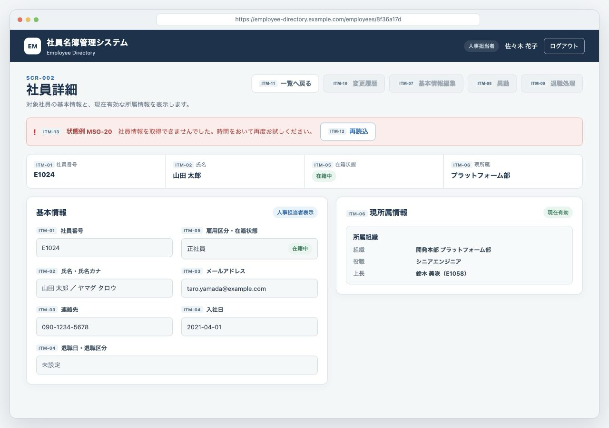

| 項目 | 内容 |
|---|---|
| 代表状態 | 人事担当者が表示済みの在籍中社員を参照中、再読込で技術例外が発生して再実行できる状態 |
| 配置要点 | 上部に業務操作、中央に基本情報、下部に現所属情報を分離し、参照情報と更新導線を明確にする |
| 編集可能な原本 | [SCR-002.html](社員名簿管理システム/mockups/SCR-002.html) |

### 4.4.3 初期表示

| No | 処理 | API | 正常時 | 異常時 |
|---:|---|---|---|---|
| 1 | URLの社員IDで詳細を取得する | API-002 | 権限上表示可能な項目を設定 | 不存在はMSG-17、権限不足はMSG-18、その他はMSG-20 |
| 2 | 利用者権限で操作導線を制御する | なし | 編集・異動・退職・履歴ボタンを表示制御 | 権限情報がない場合は操作導線を非表示 |

### 4.4.4 画面項目

| 項目ID | 項目名 | 種別 | 必須 | 入力・表示規則 |
|---|---|---|---|---|
| ITM-01 | 社員番号 | 表示 | ― | 参照権限がある場合に表示 |
| ITM-02 | 氏名・氏名カナ | 表示 | ― | 氏名は全スコープで表示する。氏名カナは`HR`・`SYSTEM_ADMIN`または`EMPLOYEE`本人だけに表示し、`DEPARTMENT_MANAGER`には表示しない |
| ITM-03 | メールアドレス・連絡先 | 表示 | ― | `HR`・`SYSTEM_ADMIN`または`EMPLOYEE`本人だけに表示し、`DEPARTMENT_MANAGER`には表示しない |
| ITM-04 | 入社日・退職日・退職区分 | 表示 | ― | `HR`・`SYSTEM_ADMIN`または`EMPLOYEE`本人だけに表示する。退職日・退職区分は設定済みの場合だけ表示し、`DEPARTMENT_MANAGER`には表示しない |
| ITM-05 | 雇用区分・在籍状態 | 表示 | ― | 在籍状態は全スコープで表示する。雇用区分は`HR`・`SYSTEM_ADMIN`または`EMPLOYEE`本人だけに表示し、§2.4のコードを表示名へ変換する |
| ITM-06 | 現所属・役職・上長 | 表示 | ― | 全スコープで現在有効な所属情報を表示する |
| ITM-07 | 基本情報編集 | ボタン | ― | `HR`、または対象社員本人である`EMPLOYEE`に表示する。`DEPARTMENT_MANAGER`と`SYSTEM_ADMIN`には表示しない |
| ITM-08 | 異動 | ボタン | ― | 人事担当者かつ在籍中の場合に表示 |
| ITM-09 | 退職処理 | ボタン | ― | 人事担当者かつ在籍中の場合に表示 |
| ITM-10 | 変更履歴 | ボタン | ― | 人事担当者・システム管理者に表示 |
| ITM-11 | 一覧へ戻る | ボタン | ― | 常時表示 |
| ITM-12 | 再読込 | ボタン | ― | 技術例外時に活性 |
| ITM-13 | メッセージ領域 | 表示 | ― | MSG-17〜MSG-20を表示 |

### 4.4.5 画面イベント

| イベントID | イベント名 | 発火条件 | 前提・入力 | API | 成功時 | 失敗時 | 多重実行防止 |
|---|---|---|---|---|---|---|---|
| EVT-01 | 詳細再読込 | ITM-12押下 | URLの社員ID | API-002 | 表示内容を更新 | 社員ID不正・不存在はMSG-17、権限不足はMSG-18、その他はMSG-20 | 応答まで再読込を無効化 |
| EVT-02 | 基本情報編集 | ITM-07押下 | 社員ID | なし | SCR-004へ遷移 | 非表示制御により実行不可 | 遷移開始後に無効化 |
| EVT-03 | 異動表示 | ITM-08押下 | 社員ID | なし | SCR-005へ遷移 | 非表示制御により実行不可 | 遷移開始後に無効化 |
| EVT-04 | 退職処理表示 | ITM-09押下 | 社員ID | なし | SCR-006へ遷移 | 非表示制御により実行不可 | 遷移開始後に無効化 |
| EVT-05 | 変更履歴表示 | ITM-10押下 | 社員ID | なし | SCR-007へ遷移 | 非表示制御により実行不可 | 遷移開始後に無効化 |
| EVT-06 | 一覧へ戻る | ITM-11押下 | なし | なし | SCR-001へ遷移 | ― | 遷移開始後に無効化 |

### 4.4.6 入力チェック

| No | 対象 | タイミング | チェック内容 | 違反時 |
|---:|---|---|---|---|
| 1 | URLの社員ID | 初期表示・EVT-01 | 値が存在し所定形式であること | MSG-17を表示しAPIを呼ばない |

### 4.4.7 画面状態・表示制御

| 状態 | 条件・契機 | 入力・操作制御 | 表示内容 | 対応状態パターン |
|---|---|---|---|---|
| 読込中 | 初期表示・EVT-01 | 全操作を無効化 | MSG-19 | UC-006/SP-1 |
| 表示 | 対象存在・権限内 | 権限と在籍状態により操作表示 | 社員詳細 | UC-006/SP-1 |
| 対象不存在 | API-002が不存在 | 一覧へ戻るだけ活性 | MSG-17 | UC-006/SP-2 |
| 閲覧権限なし | API-002が権限不足 | 一覧へ戻るだけ活性 | MSG-18 | UC-006/SP-3 |
| システムエラー | 技術例外 | 再読込・戻るを活性 | MSG-20 | 該当なし(技術例外) |

### 4.4.8 画面遷移

| 遷移元イベント | 遷移先 | 条件 | 引継ぎ値 |
|---|---|---|---|
| EVT-02 | SCR-004 | 更新権限あり | 社員ID |
| EVT-03 | SCR-005 | 人事担当者かつ在籍中 | 社員ID |
| EVT-04 | SCR-006 | 人事担当者かつ在籍中 | 社員ID |
| EVT-05 | SCR-007 | 履歴参照権限あり | 社員ID |
| EVT-06 | SCR-001 | 常時 | 直前の検索条件 |

### 4.4.9 メッセージ一覧

| MSG ID | 種別 | 文言 | 対応ERR |
|---|---|---|---|
| MSG-17 | エラー | 対象の社員が見つかりません。 | VALIDATION_ERROR / EMPLOYEE_NOT_FOUND |
| MSG-18 | エラー | この社員を参照する権限がありません。 | FORBIDDEN |
| MSG-19 | 情報 | 社員情報を読み込んでいます。 | - |
| MSG-20 | エラー | 社員情報を取得できませんでした。時間をおいて再度お試しください。 | INTERNAL_ERROR |

## 4.5 SCR-003 社員登録画面

### 4.5.1 基本情報

| 項目 | 内容 |
|---|---|
| 画面ID | SCR-003 |
| 画面名 | 社員登録画面 |
| URL / ルート | /employees/new |
| 目的 | 社員の基本情報と初期所属を一体として登録する |
| トレース元 | UC-001(F-004) |
| 利用可能ロール | 人事担当者 |
| 表示契機 | SCR-001で新規登録を選択 |
| 利用API | API-003, API-008, API-009 |

### 4.5.2 画面レイアウト

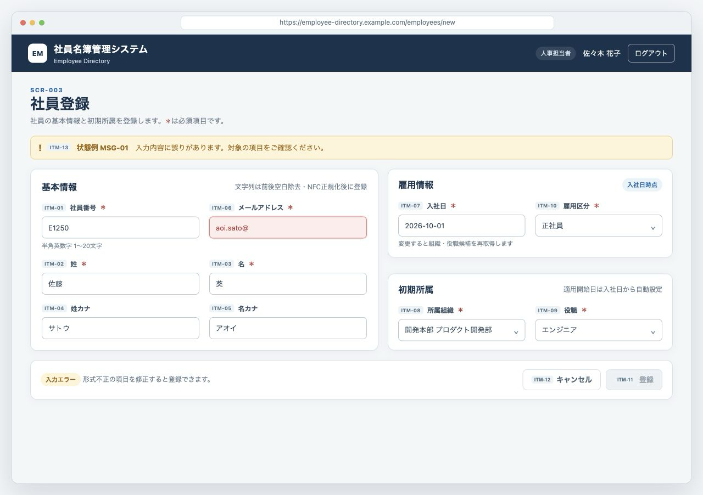

| 項目 | 内容 |
|---|---|
| 代表状態 | 人事担当者が基本情報、雇用情報、初期所属を入力し、入力不正MSGを確認している状態 |
| 配置要点 | 入力項目を基本・雇用・初期所属のカードへ分割し、キャンセルと登録を画面末尾へ集約する |
| 編集可能な原本 | [SCR-003.html](社員名簿管理システム/mockups/SCR-003.html) |

### 4.5.3 初期表示

| No | 処理 | API | 正常時 | 異常時 |
|---:|---|---|---|---|
| 1 | 入力項目を初期化する | なし | 入社日に業務日を設定する。初期所属の適用開始日は画面項目として入力させず、登録実行時の入社日から自動設定する | ― |
| 2 | 入社日時点で有効な組織を取得する | API-008 | `effectiveOn=ITM-07`、`activeOnly=true`で取得し、ITM-08へ選択肢、ITM-14へ基準日を設定 | 取得条件不正はMSG-01、権限不足はMSG-07、その他はMSG-08を表示し登録を無効化 |
| 3 | 入社日時点で有効な役職を取得する | API-009 | `effectiveOn=ITM-07`、`activeOnly=true`で取得し、ITM-09へ選択肢を設定。両候補取得成功時だけITM-14を確定 | 取得条件不正はMSG-01、権限不足はMSG-07、その他はMSG-08を表示し登録を無効化 |

### 4.5.4 画面項目

| 項目ID | 項目名 | 種別 | 必須 | 入力・表示規則 |
|---|---|---|---|---|
| ITM-01 | 社員番号 | テキスト | 必須 | 半角英数字、1〜20文字。社員番号の一意性はAPIで判定 |
| ITM-02 | 姓 | テキスト | 必須 | Unicode前後空白除去・NFC正規化後1〜100文字。正規化後の値を送信する |
| ITM-03 | 名 | テキスト | 必須 | Unicode前後空白除去・NFC正規化後1〜100文字。正規化後の値を送信する |
| ITM-04 | 姓カナ | テキスト | 任意 | 入力時はUnicode前後空白除去・NFC正規化後1〜100文字の全角カナ。未入力時は省略する |
| ITM-05 | 名カナ | テキスト | 任意 | 入力時はUnicode前後空白除去・NFC正規化後1〜100文字の全角カナ。未入力時は省略する |
| ITM-06 | メールアドレス | テキスト | 必須 | メール形式かつ254文字以内。メール一意性はAPIで判定 |
| ITM-07 | 入社日 | 日付 | 必須 | 有効な日付 |
| ITM-08 | 所属組織 | 選択 | 必須 | API-008で取得した有効な組織 |
| ITM-09 | 役職 | 選択 | 必須 | API-009で取得した有効な役職 |
| ITM-10 | 雇用区分 | 選択 | 必須 | §2.4の雇用区分5値をアプリケーション定義から表示し、対応するコードを送信する |
| ITM-11 | 登録 | ボタン | ― | 必須項目充足かつ入力可能状態で活性 |
| ITM-12 | キャンセル | ボタン | ― | 未保存の入力がある場合はMSG-09で確認 |
| ITM-13 | メッセージ領域 | 表示 | ― | MSG-01〜MSG-09を表示 |
| ITM-14 | マスター候補基準日 | 非表示保持 | 登録時必須 | API-008/009の両方を取得した`effectiveOn`を保持する。ITM-07変更時にクリアし、利用者は編集不可 |

### 4.5.5 画面イベント

| イベントID | イベント名 | 発火条件 | 前提・入力 | API | 成功時 | 失敗時 | 多重実行防止 |
|---|---|---|---|---|---|---|---|
| EVT-01 | 社員登録 | ITM-11押下 | ITM-01〜10を送信し、ITM-14がITM-07と一致すること。初期所属の適用開始日は公開API項目として送らず、API-003の呼出先がITM-07の入社日から導出する | API-003 | MSG-04表示後SCR-002へ遷移 | 入力不正はMSG-01、社員番号重複はMSG-02、メール重複はMSG-03、マスター無効はMSG-06、権限不足はMSG-07、その他はMSG-08 | 応答まで全入力・登録を無効化 |
| EVT-02 | キャンセル | ITM-12押下 | 入力変更有無 | なし | 変更なしはSCR-001、変更ありはMSG-09確認後遷移 | ― | 確認中は二重表示しない |
| EVT-03 | マスター再取得 | MSG-06表示後に再取得を選択 | 有効なITM-07を`effectiveOn`、`activeOnly=true`として指定 | API-008, API-009 | ITM-08/09の選択肢とITM-14を更新し、現在選択が候補外なら解除して登録可否を再評価 | 取得条件不正はMSG-01、権限不足はMSG-07、その他はMSG-08 | 応答まで再取得・登録を無効化 |
| EVT-04 | 入社日変更時の候補更新 | ITM-07変更後の入力離脱 | 有効なITM-07を`effectiveOn`、`activeOnly=true`として指定 | API-008, API-009 | ITM-08/09を取得し直してITM-14を設定。旧選択が候補外なら解除 | 入力不正はMSG-01、権限不足はMSG-07、その他はMSG-08 | 日付変更時に前要求を取消し、応答まで登録を無効化 |

### 4.5.6 入力チェック

| No | 対象 | タイミング | チェック内容 | 違反時 |
|---:|---|---|---|---|
| 1 | ITM-01〜03、06〜10 | EVT-01実行時 | 必須項目が入力・選択済み | MSG-01を表示し送信しない |
| 2 | ITM-01 | 入力離脱時・EVT-01 | 半角英数字で所定長以内 | MSG-01を表示し当該項目へフォーカス |
| 3 | ITM-02〜05 | 入力離脱時・EVT-01 | Unicode前後空白を除去してNFC正規化した後に検証する。姓・名は空文字不可かつ1〜100文字。カナは未入力を除き空文字不可、1〜100文字の全角カナ | MSG-01を表示し当該項目へフォーカス |
| 4 | ITM-06 | 入力離脱時・EVT-01 | メール形式 | MSG-01を表示し当該項目へフォーカス |
| 5 | ITM-07 | EVT-01実行時 | 有効な日付 | MSG-01を表示し送信しない |
| 6 | ITM-10 | EVT-01実行時 | §2.4の雇用区分コードのいずれか | MSG-01を表示し送信しない |
| 7 | ITM-14 | EVT-01実行時 | ITM-07と同じ日付でAPI-008/009の両候補を取得済み | MSG-01を表示し、EVT-04成功まで送信しない |

### 4.5.7 画面状態・表示制御

| 状態 | 条件・契機 | 入力・操作制御 | 表示内容 | 対応状態パターン |
|---|---|---|---|---|
| 初期表示・入力中 | マスター取得成功 | 編集可。必須充足で登録活性 | 入力内容・選択肢 | UC-001/SP-1, UC-001/SP-2 |
| 登録中 | EVT-01応答待ち | 全入力・登録を無効化 | MSG-05 | UC-001/SP-1, UC-001/SP-2 |
| 入力エラー | クライアント/API入力不備 | 編集可 | MSG-01 | UC-001/SP-4 |
| 社員番号重複 | API-003が社員番号重複 | ITM-01を編集可 | MSG-02 | UC-001/SP-5 |
| メール重複 | API-003がメール重複 | ITM-06を編集可 | MSG-03 | UC-001/SP-6 |
| マスター無効 | API-003がマスター無効 | ITM-08/09を再選択可 | MSG-06 | UC-001/SP-7 |
| 権限エラー | API-003が権限不足 | 入力・登録を無効化 | MSG-07 | UC-001/SP-3 |
| 登録成功 | API-003成功 | 全操作を無効化 | MSG-04 | UC-001/SP-1, UC-001/SP-2 |
| システムエラー | 技術例外 | 入力内容を保持。成功可否確認まで登録を無効化 | MSG-08 | 該当なし(技術例外) |
| マスター候補更新中 | EVT-03/04応答待ち | 組織・役職・登録を無効化 | MSG-05 | UC-001/SP-1, UC-001/SP-2 |

### 4.5.8 画面遷移

| 遷移元イベント | 遷移先 | 条件 | 引継ぎ値 |
|---|---|---|---|
| EVT-01 | SCR-002 | API-003成功 | 登録された社員ID、MSG-04 |
| EVT-02 | SCR-001 | 変更なし、またはMSG-09で破棄を確認 | 直前の検索条件 |

### 4.5.9 メッセージ一覧

| MSG ID | 種別 | 文言 | 対応ERR |
|---|---|---|---|
| MSG-01 | エラー | 入力内容に誤りがあります。対象の項目をご確認ください。 | VALIDATION_ERROR |
| MSG-02 | エラー | 入力された社員番号は既に登録されています。 | EMPLOYEE_NUMBER_DUPLICATED |
| MSG-03 | エラー | 入力されたメールアドレスは既に登録されています。 | EMAIL_DUPLICATED |
| MSG-04 | 完了 | 社員を登録しました。 | - |
| MSG-05 | 情報 | 登録処理中です。しばらくお待ちください。 | - |
| MSG-06 | エラー | 選択した組織または役職は無効です。最新の候補から選び直してください。 | MASTER_NOT_ACTIVE |
| MSG-07 | エラー | この操作を行う権限がありません。 | FORBIDDEN |
| MSG-08 | エラー | システムエラーが発生しました。時間をおいて再度お試しください。 | INTERNAL_ERROR |
| MSG-09 | 確認 | 入力内容を破棄して検索画面に戻ります。よろしいですか？ | - |

## 4.6 SCR-004 社員編集画面

### 4.6.1 基本情報

| 項目 | 内容 |
|---|---|
| 画面ID | SCR-004 |
| 画面名 | 社員編集画面 |
| URL / ルート | /employees/{employeeId}/edit |
| 目的 | 社員基本情報を権限範囲内で編集し、版数による競合検知付きで更新する |
| トレース元 | UC-007(F-005) |
| 利用可能ロール | 人事担当者。本人更新を許可する項目は一般社員本人も利用可 |
| 表示契機 | SCR-002で基本情報編集を選択 |
| 利用API | API-002, API-004 |

### 4.6.2 画面レイアウト


| 項目 | 内容 |
|---|---|
| 代表状態 | 人事担当者による更新時に競合を検知し、編集を停止して最新情報を再取得できる状態 |
| 配置要点 | 対象社員サマリーを固定的に先頭表示し、変更可能項目と更新操作をその下へまとめる |
| 編集可能な原本 | [SCR-004.html](社員名簿管理システム/mockups/SCR-004.html) |

### 4.6.3 初期表示

| No | 処理 | API | 正常時 | 異常時 |
|---:|---|---|---|---|
| 1 | 対象社員の最新情報と版数を取得する | API-002 | ITM-01〜09・ITM-14へ設定し、権限別に編集可否を設定 | 社員ID不正はMSG-21、不存在はMSG-27、権限不足はMSG-26、その他はMSG-28 |
| 2 | 初期値を変更前スナップショットとして保持する | なし | キャンセル・変更有無判定に使用 | ― |

### 4.6.4 画面項目

| 項目ID | 項目名 | 種別 | 必須 | 入力・表示規則 |
|---|---|---|---|---|
| ITM-01 | 社員番号 | 表示 | ― | 変更不可 |
| ITM-02 | 姓 | テキスト | 必須 | `HR`だけが編集可。Unicode前後空白除去・NFC正規化後1〜100文字 |
| ITM-03 | 名 | テキスト | 必須 | `HR`だけが編集可。Unicode前後空白除去・NFC正規化後1〜100文字 |
| ITM-04 | 姓カナ | テキスト | 任意 | `HR`だけが編集可。入力時はUnicode前後空白除去・NFC正規化後1〜100文字の全角カナ。既存値の消去は明示nullを送信する |
| ITM-05 | 名カナ | テキスト | 任意 | `HR`だけが編集可。入力時はUnicode前後空白除去・NFC正規化後1〜100文字の全角カナ。既存値の消去は明示nullを送信する |
| ITM-06 | メールアドレス | テキスト | 必須 | `HR`または対象社員本人の`EMPLOYEE`が編集可。前後空白除去後にメール形式と254文字以内を検証する |
| ITM-07 | 連絡先 | テキスト | 任意 | `HR`または対象社員本人の`EMPLOYEE`が編集可。前後空白除去後1〜30文字、許可文字は半角数字・`+`・`-`・半角空白・丸括弧。既存値の消去は明示nullを送信する |
| ITM-08 | 在籍状態・所属 | 表示 | ― | 参照のみ。本画面では変更しない |
| ITM-09 | 版数 | 非表示保持 | 必須 | API-002取得値をAPI-004へ送信。利用者は編集不可 |
| ITM-10 | 更新 | ボタン | ― | 変更あり、入力妥当、更新可能状態で活性 |
| ITM-11 | 最新情報再取得 | ボタン | ― | 競合時に表示 |
| ITM-12 | キャンセル | ボタン | ― | 未保存変更ありの場合はMSG-29で確認 |
| ITM-13 | メッセージ領域 | 表示 | ― | MSG-21〜MSG-29を表示 |
| ITM-14 | 雇用区分 | 選択 | 必須 | §2.4の雇用区分5値を表示する。人事担当者だけが編集でき、本人更新時は表示のみ。対応コードをAPI-004へ送信する |

### 4.6.5 画面イベント

| イベントID | イベント名 | 発火条件 | 前提・入力 | API | 成功時 | 失敗時 | 多重実行防止 |
|---|---|---|---|---|---|---|---|
| EVT-01 | 基本情報更新 | ITM-10押下 | ITM-02〜07を定義どおり正規化し、正規化後の保持値と比較して変更された許可項目、消去用null、ITM-14、ITM-09を送信する。変更のない項目は省略する | API-004 | MSG-24表示後SCR-002へ遷移 | 入力不正はMSG-21、メール重複はMSG-22、更新競合はMSG-23、権限不足はMSG-26、対象不存在はMSG-27、その他はMSG-28 | 応答まで全入力・更新を無効化 |
| EVT-02 | 最新情報再取得 | ITM-11押下 | 社員ID | API-002 | 最新値・版数を再設定し競合状態を解除 | 社員ID不正はMSG-21、不存在はMSG-27、権限不足はMSG-26、その他はMSG-28 | 応答まで再取得を無効化 |
| EVT-03 | キャンセル | ITM-12押下 | 変更有無 | なし | 変更なし、またはMSG-29確認後SCR-002へ遷移 | ― | 確認中は二重表示しない |

### 4.6.6 入力チェック

| No | 対象 | タイミング | チェック内容 | 違反時 |
|---:|---|---|---|---|
| 1 | ITM-02、03、06 | EVT-01実行時 | 必須項目が入力済み | MSG-21を表示し送信しない |
| 2 | ITM-02〜05 | 入力離脱時・EVT-01 | Unicode前後空白を除去してNFC正規化した後に検証する。姓・名は空文字不可かつ1〜100文字。カナは値指定時に空文字不可、1〜100文字の全角カナ。既存カナを空欄にした場合だけ解除用nullとする | MSG-21を表示し当該項目へフォーカス |
| 3 | ITM-06 | 入力離脱時・EVT-01 | メール形式 | MSG-21を表示し送信しない |
| 4 | ITM-07 | 入力離脱時・EVT-01 | 値指定時は前後空白除去後1〜30文字で、半角数字・`+`・`-`・半角空白・丸括弧だけ。空値は解除用nullへ変換する | MSG-21を表示し送信しない |
| 5 | ITM-02〜07、ITM-14 | EVT-01実行時 | 正規化後の値で少なくとも1項目が変更されている | 更新を実行せず操作を継続 |
| 6 | ITM-14 | EVT-01実行時 | §2.4の雇用区分コードのいずれか。本人更新では変更されていないこと | MSG-21を表示し送信しない |

### 4.6.7 画面状態・表示制御

| 状態 | 条件・契機 | 入力・操作制御 | 表示内容 | 対応状態パターン |
|---|---|---|---|---|
| 初期表示・編集中 | API-002成功 | 権限別に項目を編集可 | 最新情報 | UC-007/SP-1 |
| 更新中 | EVT-01応答待ち | 全入力・更新を無効化 | MSG-25 | UC-007/SP-1 |
| 入力エラー | 入力不備 | 編集可 | MSG-21 | UC-007/SP-3 |
| メール重複 | API-004が重複 | ITM-06を編集可 | MSG-22 | UC-007/SP-4 |
| 更新競合 | API-004が版数不一致 | 編集を無効化し再取得だけ活性 | MSG-23 | UC-007/SP-5 |
| 権限エラー | API-002/004が権限不足 | 編集・更新を無効化 | MSG-26 | UC-007/SP-2 |
| 更新成功 | API-004成功 | 全操作を無効化 | MSG-24 | UC-007/SP-1 |
| 対象不存在 | API-002が不存在 | キャンセルだけ活性 | MSG-27 | 該当なし(事前条件不成立) |
| システムエラー | 技術例外 | 入力を保持。再実行可否を応答状態で制御 | MSG-28 | 該当なし(技術例外) |

### 4.6.8 画面遷移

| 遷移元イベント | 遷移先 | 条件 | 引継ぎ値 |
|---|---|---|---|
| EVT-01 | SCR-002 | API-004成功 | 社員ID、MSG-24 |
| EVT-03 | SCR-002 | 変更なし、またはMSG-29で破棄を確認 | 社員ID |

### 4.6.9 メッセージ一覧

| MSG ID | 種別 | 文言 | 対応ERR |
|---|---|---|---|
| MSG-21 | エラー | 入力内容に誤りがあります。対象の項目をご確認ください。 | VALIDATION_ERROR |
| MSG-22 | エラー | 入力されたメールアドレスは既に登録されています。 | EMAIL_DUPLICATED |
| MSG-23 | エラー | 他の利用者による更新がありました。最新の内容を再取得してください。 | UPDATE_CONFLICT |
| MSG-24 | 完了 | 社員情報を更新しました。 | - |
| MSG-25 | 情報 | 更新処理中です。しばらくお待ちください。 | - |
| MSG-26 | エラー | 社員情報を更新する権限がありません。 | FORBIDDEN |
| MSG-27 | エラー | 対象の社員が見つかりません。 | EMPLOYEE_NOT_FOUND |
| MSG-28 | エラー | 社員情報を更新できませんでした。時間をおいて再度お試しください。 | INTERNAL_ERROR |
| MSG-29 | 確認 | 入力内容を破棄して社員詳細画面に戻ります。よろしいですか？ | - |

## 4.7 SCR-005 社員異動画面

### 4.7.1 基本情報

| 項目 | 内容 |
|---|---|
| 画面ID | SCR-005 |
| 画面名 | 社員異動画面 |
| URL / ルート | /employees/{employeeId}/assignments/new |
| 目的 | 在籍中社員の所属・役職を適用日付きで変更し、現在または将来の所属履歴を整合的に登録する |
| トレース元 | UC-003(F-006) |
| 利用可能ロール | 人事担当者 |
| 表示契機 | SCR-002で異動を選択 |
| 利用API | API-001, API-002, API-005, API-008, API-009 |

### 4.7.2 画面レイアウト

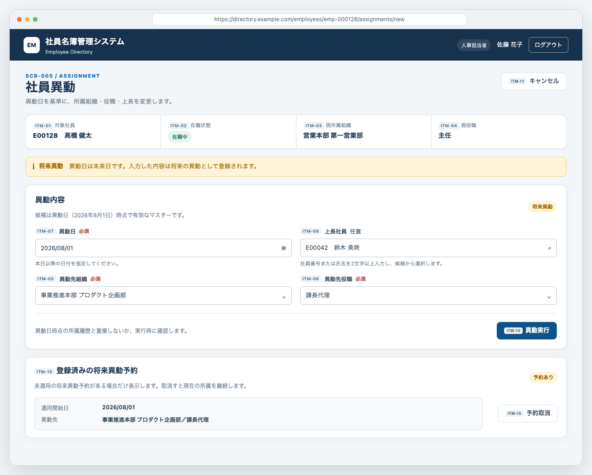

| 項目 | 内容 |
|---|---|
| 代表状態 | 人事担当者が将来日付の異動先と上長を指定している状態 |
| 配置要点 | 現在の所属情報と異動後の入力をカードで分離し、適用日による将来異動であることを明示する |
| 編集可能な原本 | [SCR-005.html](社員名簿管理システム/mockups/SCR-005.html) |

### 4.7.3 初期表示

| No | 処理 | API | 正常時 | 異常時 |
|---:|---|---|---|---|
| 1 | 対象社員・現所属・版数を取得する | API-002 | ITM-01〜04、ITM-09へ設定 | 社員ID不正はMSG-30、不存在・退職済みはMSG-31、権限不足はMSG-37、その他はMSG-38 |
| 2 | 異動日に業務日を設定する | なし | ITM-07へ初期値を設定 | ― |
| 3 | 異動日時点で有効な組織を取得する | API-008 | `effectiveOn=ITM-07`、`activeOnly=true`で取得し、ITM-05へ選択肢、ITM-14へ基準日を設定 | 取得条件不正はMSG-30、権限不足はMSG-37、その他はMSG-38を表示し異動を無効化 |
| 4 | 異動日時点で有効な役職を取得する | API-009 | `effectiveOn=ITM-07`、`activeOnly=true`で取得し、ITM-06へ選択肢を設定。両候補取得成功時だけITM-14を確定 | 取得条件不正はMSG-30、権限不足はMSG-37、その他はMSG-38を表示し異動を無効化 |

### 4.7.4 画面項目

| 項目ID | 項目名 | 種別 | 必須 | 入力・表示規則 |
|---|---|---|---|---|
| ITM-01 | 対象社員 | 表示 | ― | 社員番号・氏名を表示 |
| ITM-02 | 在籍状態 | 表示 | ― | 在籍中の場合だけ異動可 |
| ITM-03 | 現所属組織 | 表示 | ― | 現在有効な組織 |
| ITM-04 | 現役職 | 表示 | ― | 現在有効な役職 |
| ITM-05 | 異動先組織 | 選択 | 必須 | API-008で取得した有効な組織 |
| ITM-06 | 異動先役職 | 選択 | 必須 | API-009で取得した有効な役職 |
| ITM-07 | 異動日 | 日付 | 必須 | 業務日当日または未来日。当日は即時、未来日は将来異動。過去日は選択不可 |
| ITM-08 | 上長社員 | オートコンプリート | 任意 | 社員番号・氏名でAPI-001を検索し候補から選択。表示値と選択社員IDを保持する。検索候補は便宜上の在籍候補であり、退職予定未登録を含む最終妥当性はAPI-005で判定する |
| ITM-09 | 版数 | 非表示保持 | 必須 | API-002取得値をAPI-005へ送信 |
| ITM-10 | 異動実行 | ボタン | ― | 必須充足かつ入力可能状態で活性 |
| ITM-11 | キャンセル | ボタン | ― | 未保存変更ありの場合はMSG-39で確認 |
| ITM-12 | マスター再取得 | ボタン | ― | マスター無効時に表示 |
| ITM-13 | メッセージ領域 | 表示 | ― | MSG-30〜MSG-39、MSG-88を表示 |
| ITM-14 | マスター候補基準日 | 非表示保持 | 異動時必須 | API-008/009の両方を取得した`effectiveOn`を保持する。ITM-07変更時にクリアし、利用者は編集不可 |

### 4.7.5 画面イベント

| イベントID | イベント名 | 発火条件 | 前提・入力 | API | 成功時 | 失敗時 | 多重実行防止 |
|---|---|---|---|---|---|---|---|
| EVT-01 | 異動実行 | ITM-10押下 | ITM-05〜09を送信し、ITM-14がITM-07と一致すること | API-005 | 当日はMSG-34、未来日はMSG-35表示後SCR-002へ遷移 | 入力不正はMSG-30、不存在・退職済みはMSG-31、マスター無効はMSG-32、期間不正はMSG-33、権限不足はMSG-37、更新競合はMSG-88、その他はMSG-38 | 応答まで全入力・実行を無効化 |
| EVT-02 | キャンセル | ITM-11押下 | 変更有無 | なし | 変更なし、またはMSG-39確認後SCR-002へ遷移 | ― | 確認中は二重表示しない |
| EVT-03 | マスター再取得 | ITM-12押下 | 有効なITM-07を`effectiveOn`、`activeOnly=true`として指定 | API-008, API-009 | ITM-05/06とITM-14を更新し、現在選択が候補外なら解除して実行可否を再評価 | 取得条件不正はMSG-30、権限不足はMSG-37、その他はMSG-38 | 応答まで再取得・異動実行を無効化 |
| EVT-04 | 上長候補検索 | ITM-08へ2文字以上入力 | 入力文字列、在籍中。入力文字列が半角英数字だけの場合はAPI-001のemployeeNumber、それ以外はnameへ設定する | API-001 | 閲覧可能な在籍社員を候補表示し、選択時に社員IDを保持 | 0件は候補なし、入力不正はMSG-30、権限不足はMSG-37、その他はMSG-38 | 直前要求を取消し最新要求だけを反映 |
| EVT-05 | 異動日変更時の候補更新 | ITM-07変更後の入力離脱 | 有効なITM-07を`effectiveOn`、`activeOnly=true`として指定 | API-008, API-009 | ITM-05/06を取得し直してITM-14を設定。旧選択が候補外なら解除 | 入力不正はMSG-30、権限不足はMSG-37、その他はMSG-38 | 日付変更時に前要求を取消し、応答まで異動実行を無効化 |

### 4.7.6 入力チェック

| No | 対象 | タイミング | チェック内容 | 違反時 |
|---:|---|---|---|---|
| 1 | ITM-05〜07 | EVT-01実行時 | 必須項目が選択・入力済み | MSG-30を表示し送信しない |
| 2 | ITM-07 | 入力離脱時・EVT-01 | 有効な日付かつ業務日以降 | MSG-30を表示し送信しない |
| 3 | ITM-05、06、08 | EVT-01実行時 | 画面に表示した現所属とは基準日が異なる場合があるためクライアントでは実差分を判定しない。API-005が`effectiveFrom`直前の所属（未設定上長はNULL）と組織・役職・上長を比較し、上長だけの変更も含めて正本判定する | 画面では拒否せず送信し、完全同一の場合はAPI-005のVALIDATION_ERRORをMSG-30へ変換する |
| 4 | ITM-08 | 入力離脱時・EVT-01 | 入力時はAPI-001候補から社員IDが選択済みで、対象社員本人ではない | MSG-30を表示し送信しない |
| 5 | ITM-14 | EVT-01実行時 | ITM-07と同じ日付でAPI-008/009の両候補を取得済み | MSG-30を表示し、EVT-05成功まで送信しない |

### 4.7.7 画面状態・表示制御

| 状態 | 条件・契機 | 入力・操作制御 | 表示内容 | 対応状態パターン |
|---|---|---|---|---|
| 即時異動入力 | 異動日が業務日当日 | 編集可 | 現所属と入力内容 | UC-003/SP-1 |
| 将来異動入力 | 異動日が未来 | 編集可 | 将来適用である旨 | UC-003/SP-2 |
| 異動処理中 | EVT-01応答待ち | 全入力・実行を無効化 | MSG-36 | UC-003/SP-1, UC-003/SP-2 |
| 権限エラー | APIが権限不足 | 全入力・実行を無効化 | MSG-37 | UC-003/SP-3 |
| 対象外 | 不存在・退職済み | 全入力・実行を無効化 | MSG-31 | UC-003/SP-4 |
| マスター・上長無効 | API-005が組織・役職の無効、または上長の不存在・非在籍・退職予定登録済みを返す | 組織・役職候補の再取得、または上長候補の再検索・再選択を可能にする | MSG-32 | UC-003/SP-5 |
| 期間重複 | API-005が期間重複 | 異動日を編集可 | MSG-33 | UC-003/SP-6 |
| 更新競合 | API-005が版数不一致 | 入力を保持し、社員詳細から最新情報を再取得 | MSG-88 | 該当なし(同時更新) |
| 異動成功 | API-005成功 | 全操作を無効化 | MSG-34またはMSG-35 | UC-003/SP-1, UC-003/SP-2 |
| システムエラー | 技術例外 | 入力を保持し再実行可否を応答状態で制御 | MSG-38 | 該当なし(技術例外) |
| マスター候補更新中 | EVT-03/05応答待ち | 組織・役職・異動実行を無効化 | MSG-36 | UC-003/SP-1, UC-003/SP-2 |

### 4.7.8 画面遷移

| 遷移元イベント | 遷移先 | 条件 | 引継ぎ値 |
|---|---|---|---|
| EVT-01 | SCR-002 | API-005成功 | 社員ID、MSG-34またはMSG-35 |
| EVT-02 | SCR-002 | 変更なし、またはMSG-39で破棄を確認 | 社員ID |

### 4.7.9 メッセージ一覧

| MSG ID | 種別 | 文言 | 対応ERR |
|---|---|---|---|
| MSG-30 | エラー | 入力内容に誤りがあります。異動先と異動日をご確認ください。 | VALIDATION_ERROR |
| MSG-31 | エラー | 対象の社員が見つからないか、既に退職しているため異動できません。 | EMPLOYEE_NOT_FOUND / EMPLOYEE_ALREADY_RETIRED |
| MSG-32 | エラー | 選択した組織・役職、または上長は利用できません。退職予定のない在籍中の上長を最新候補から選び直してください。 | MASTER_NOT_ACTIVE |
| MSG-33 | エラー | 指定した異動日は過去日、既存の所属期間との重複、または退職予定日より後のため使用できません。 | ASSIGNMENT_PERIOD_CONFLICT / INVALID_TRANSFER_DATE |
| MSG-34 | 完了 | 社員の異動を反映しました。 | - |
| MSG-35 | 完了 | 将来の異動を登録しました。 | - |
| MSG-36 | 情報 | 異動処理中です。しばらくお待ちください。 | - |
| MSG-37 | エラー | 社員を異動する権限がありません。 | FORBIDDEN |
| MSG-38 | エラー | 異動を反映できませんでした。時間をおいて再度お試しください。 | INTERNAL_ERROR |
| MSG-39 | 確認 | 入力内容を破棄して社員詳細画面に戻ります。よろしいですか？ | - |
| MSG-88 | エラー | 他の利用者による更新がありました。社員詳細から最新の内容を再取得してください。 | UPDATE_CONFLICT |

## 4.8 SCR-006 退職処理画面

### 4.8.1 基本情報

| 項目 | 内容 |
|---|---|
| 画面ID | SCR-006 |
| 画面名 | 退職処理画面 |
| URL / ルート | /employees/{employeeId}/retirement |
| 目的 | 在籍中社員へ退職日を設定し、即時退職または将来の退職予約を登録する |
| トレース元 | UC-004(F-007) |
| 利用可能ロール | 人事担当者 |
| 表示契機 | SCR-002で退職処理を選択 |
| 利用API | API-002, API-006 |

### 4.8.2 画面レイアウト

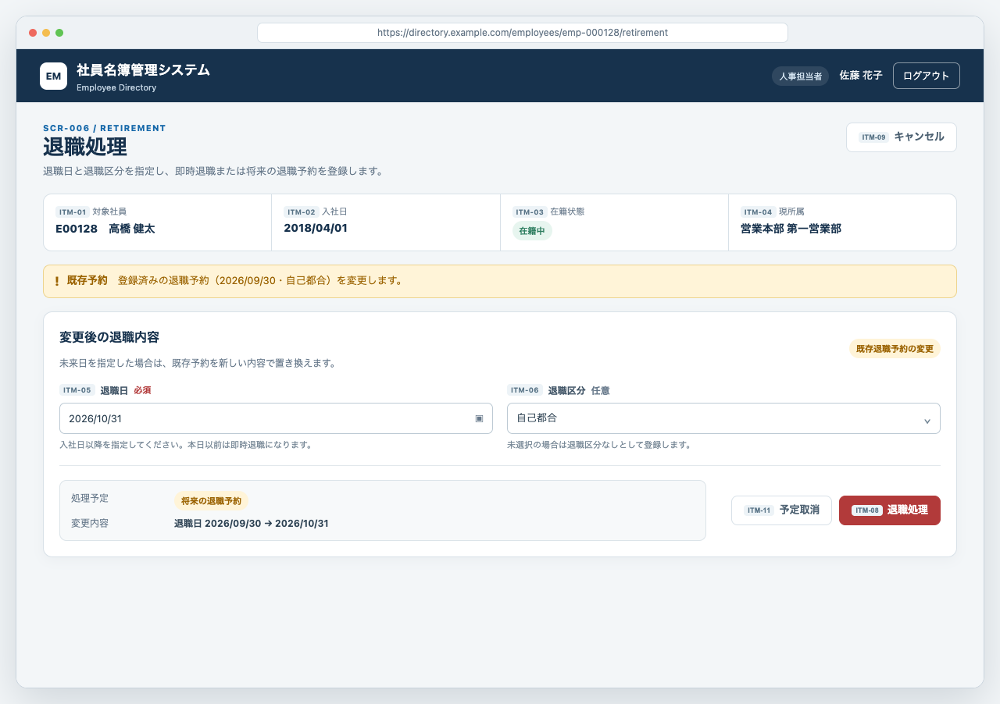

| 項目 | 内容 |
|---|---|
| 代表状態 | 人事担当者が登録済みの退職予約を未来日付の新しい内容へ変更する状態 |
| 配置要点 | 対象社員情報と退職内容を分離し、即時退職と予約の違いを注意領域で判別できるようにする |
| 編集可能な原本 | [SCR-006.html](社員名簿管理システム/mockups/SCR-006.html) |

### 4.8.3 初期表示

| No | 処理 | API | 正常時 | 異常時 |
|---:|---|---|---|---|
| 1 | 対象社員・入社日・在籍状態・版数・退職予定を取得する | API-002 | ITM-01〜04、ITM-07へ設定。`status=ACTIVE`かつ`retirementDate`がある場合（到来済み未反映を含む）はその日をITM-05、`retirementTypeCode`をITM-06へ設定して既存予約変更状態とする | 社員ID不正・不存在・退職済みはMSG-41、権限不足はMSG-45、その他はMSG-46 |
| 2 | 退職予定がない場合だけ既定値を設定する | なし | ITM-05へ業務日、ITM-06へ未選択を設定する。既存予約値を上書きしない | ― |

### 4.8.4 画面項目

| 項目ID | 項目名 | 種別 | 必須 | 入力・表示規則 |
|---|---|---|---|---|
| ITM-01 | 対象社員 | 表示 | ― | 社員番号・氏名を表示 |
| ITM-02 | 入社日 | 表示 | ― | 退職日の下限判定に使用 |
| ITM-03 | 在籍状態 | 表示 | ― | 在籍中の場合だけ処理可 |
| ITM-04 | 現所属 | 表示 | ― | 退職処理対象の現所属を表示 |
| ITM-05 | 退職日 | 日付 | 必須 | 入社日以降。当日以前は即時、未来日は退職予約 |
| ITM-06 | 退職区分 | 選択 | 任意 | §2.4の退職区分5値をアプリケーション定義から表示し、選択時は対応コード、未選択時はnullを送信する |
| ITM-07 | 版数 | 非表示保持 | 必須 | API-002取得値をAPI-006へ送信 |
| ITM-08 | 退職処理 | ボタン | ― | 必須充足かつ入力可能状態で活性。実行前にMSG-47で確認 |
| ITM-09 | キャンセル | ボタン | ― | 未保存変更ありの場合はMSG-48で確認 |
| ITM-10 | メッセージ領域 | 表示 | ― | MSG-40〜MSG-48、MSG-89、MSG-105を表示 |

### 4.8.5 画面イベント

| イベントID | イベント名 | 発火条件 | 前提・入力 | API | 成功時 | 失敗時 | 多重実行防止 |
|---|---|---|---|---|---|---|---|
| EVT-01 | 退職処理 | ITM-08押下後MSG-47またはMSG-105で確認 | ITM-05〜07。既存予約ありで退職日・区分を変える場合、当日以前への変更を含む置換内容をMSG-105へ表示する | API-006 | 当日以前はMSG-42、未来日はMSG-43表示後SCR-002へ遷移 | 入力・退職日不正はMSG-40、不存在・退職済みはMSG-41、権限不足はMSG-45、更新競合はMSG-89、その他はMSG-46 | 応答まで全入力・実行を無効化 |
| EVT-02 | キャンセル | ITM-09押下 | 変更有無 | なし | 変更なし、またはMSG-48確認後SCR-002へ遷移 | ― | 確認中は二重表示しない |

### 4.8.6 入力チェック

| No | 対象 | タイミング | チェック内容 | 違反時 |
|---:|---|---|---|---|
| 1 | ITM-05 | 入力離脱時・EVT-01 | 必須かつ有効な日付 | MSG-40を表示し送信しない |
| 2 | ITM-05 | EVT-01実行時 | ITM-02の入社日以降 | MSG-40を表示し送信しない |
| 3 | ITM-06 | EVT-01実行時 | 未指定、または§2.4の退職区分コードのいずれか | MSG-40を表示し送信しない |

### 4.8.7 画面状態・表示制御

| 状態 | 条件・契機 | 入力・操作制御 | 表示内容 | 対応状態パターン |
|---|---|---|---|---|
| 即時退職入力 | 退職日が当日以前 | 編集可 | 即時退職となる旨 | UC-004/SP-1 |
| 退職予約入力 | 退職日が未来 | 編集可 | 退職予約となる旨 | UC-004/SP-2 |
| 既存退職予約変更 | API-002が`status=ACTIVE`かつ退職日ありを返す | 既存の退職日・区分を初期表示し編集可 | 現在の予約内容、変更後が未来なら予約置換、当日以前なら予約の即時化となる旨。到来済み未反映も上書きせず表示する | UC-004/SP-2 |
| 処理中 | EVT-01応答待ち | 全入力・実行を無効化 | MSG-44 | UC-004/SP-1, UC-004/SP-2 |
| 権限エラー | APIが権限不足 | 全入力・実行を無効化 | MSG-45 | UC-004/SP-3 |
| 対象外 | 不存在・退職済み | 全入力・実行を無効化 | MSG-41 | UC-004/SP-4 |
| 退職日・上長参照不正 | 入社日前、または対象社員を上長とする所属が退職日当日以後も有効 | ITM-05を編集可。上長参照の場合は先に対象部下の異動画面で上長を変更する | MSG-40 | UC-004/SP-5 |
| 更新競合 | API-006が版数不一致 | 入力を保持し、社員詳細から最新情報を再取得 | MSG-89 | 該当なし(同時更新) |
| 処理成功 | API-006成功 | 全操作を無効化 | MSG-42またはMSG-43 | UC-004/SP-1, UC-004/SP-2 |
| システムエラー | 技術例外 | 入力を保持し再実行可否を応答状態で制御 | MSG-46 | 該当なし(技術例外) |

### 4.8.8 画面遷移

| 遷移元イベント | 遷移先 | 条件 | 引継ぎ値 |
|---|---|---|---|
| EVT-01 | SCR-002 | API-006成功 | 社員ID、MSG-42またはMSG-43 |
| EVT-02 | SCR-002 | 変更なし、またはMSG-48で破棄を確認 | 社員ID |

### 4.8.9 メッセージ一覧

| MSG ID | 種別 | 文言 | 対応ERR |
|---|---|---|---|
| MSG-40 | エラー | 退職日が不正であるか、この社員を上長とする所属が退職日当日以後も残っています。入社日以降の日付を指定し、必要な上長変更を先に完了してください。 | VALIDATION_ERROR / INVALID_RETIREMENT_DATE |
| MSG-41 | エラー | 対象の社員は既に退職しているか、見つかりません。 | VALIDATION_ERROR / EMPLOYEE_ALREADY_RETIRED / EMPLOYEE_NOT_FOUND |
| MSG-42 | 完了 | 退職処理を反映しました。 | - |
| MSG-43 | 完了 | 将来の退職を予約しました。 | - |
| MSG-44 | 情報 | 退職処理中です。しばらくお待ちください。 | - |
| MSG-45 | エラー | 退職処理を行う権限がありません。 | FORBIDDEN |
| MSG-46 | エラー | 退職処理を反映できませんでした。時間をおいて再度お試しください。 | INTERNAL_ERROR |
| MSG-47 | 確認 | 指定した退職日で退職処理を実行します。よろしいですか？ | - |
| MSG-48 | 確認 | 入力内容を破棄して社員詳細画面に戻ります。よろしいですか？ | - |
| MSG-89 | エラー | 他の利用者による更新がありました。社員詳細から最新の内容を再取得してください。 | UPDATE_CONFLICT |
| MSG-105 | 確認 | 登録済みの退職予約を表示した退職日・退職区分で置き換えます。退職日が本日以前の場合は直ちに退職を確定します。よろしいですか？ | - |

## 4.9 SCR-007 変更履歴画面

### 4.9.1 基本情報

| 項目 | 内容 |
|---|---|
| 画面ID | SCR-007 |
| 画面名 | 変更履歴画面 |
| URL / ルート | /employees/{employeeId}/history |
| 目的 | 対象社員の変更履歴を期間・変更種別で絞り込み、変更日時の新しい順に表示する |
| トレース元 | UC-008(F-008) |
| 利用可能ロール | 人事担当者、システム管理者 |
| 表示契機 | SCR-002で変更履歴を選択 |
| 利用API | API-002, API-007 |

### 4.9.2 画面レイアウト


| 項目 | 内容 |
|---|---|
| 代表状態 | 人事担当者が社員を特定し、期間・変更種別で履歴を検索した状態 |
| 配置要点 | 対象社員、絞り込み条件、履歴一覧を上から順に配置し、変更者と変更概要を一覧で比較できるようにする |
| 編集可能な原本 | [SCR-007.html](社員名簿管理システム/mockups/SCR-007.html) |

### 4.9.3 初期表示

| No | 処理 | API | 正常時 | 異常時 |
|---:|---|---|---|---|
| 1 | 検索条件を初期化する | なし | 期間を既定範囲、変更種別をすべて、ページを1、ページサイズを20に設定 | ― |
| 2 | 対象社員の表示情報を取得する | API-002 | 社員番号・氏名をITM-01へ設定 | 社員ID不正・不存在はMSG-100、権限不足はMSG-51、その他はMSG-52 |
| 3 | 初期化済みの既定期間・全変更種別・1ページ目（20件）で履歴を取得する | API-007 | 履歴を新しい順にITM-05、件数をITM-06、ページ情報をITM-11へ設定 | 0件はMSG-49、対象不存在はMSG-100、権限不足はMSG-51、その他はMSG-52 |

### 4.9.4 画面項目

| 項目ID | 項目名 | 種別 | 必須 | 入力・表示規則 |
|---|---|---|---|---|
| ITM-01 | 対象社員 | 表示 | ― | 社員番号・氏名を表示 |
| ITM-02 | 期間開始 | 日付 | 任意 | 未指定時はシステム既定の開始日。送信時はAsia/Tokyoの当日00:00をオフセット付きRFC 3339日時へ変換する |
| ITM-03 | 期間終了 | 日付 | 任意 | 未指定時は業務日の翌日。指定日のAsia/Tokyo 00:00を、検索期間の終了境界（排他）となるオフセット付きRFC 3339日時へ変換する |
| ITM-04 | 変更種別 | 選択 | 任意 | 登録・基本情報更新・異動・退職予定・退職確定・ロール更新・すべてを、API許可値REGISTER / BASIC_UPDATE / ASSIGNMENT / RETIREMENT_SCHEDULED / RETIREMENT_CONFIRMED / ROLE_UPDATEへ対応づける |
| ITM-05 | 変更履歴一覧 | 一覧 | ― | 変更日時の新しい順。変更者・種別・概要を表示 |
| ITM-06 | 該当件数 | 表示 | ― | API-007の件数を表示 |
| ITM-07 | 参照 | ボタン | ― | 入力妥当時に活性 |
| ITM-08 | 条件クリア | ボタン | ― | 条件を初期値へ戻す |
| ITM-09 | 社員詳細へ戻る | ボタン | ― | 常時表示 |
| ITM-10 | メッセージ領域 | 表示 | ― | MSG-49〜MSG-52、MSG-100を表示 |
| ITM-11 | ページ操作 | ページャー | ― | API-007のpage・pageSize・total・hasNextを保持する。1始まり、1ページ20件。前後・指定ページを操作可能 |

### 4.9.5 画面イベント

| イベントID | イベント名 | 発火条件 | 前提・入力 | API | 成功時 | 失敗時 | 多重実行防止 |
|---|---|---|---|---|---|---|---|
| EVT-01 | 履歴参照 | ITM-07押下 | 社員ID、ITM-02〜04、page=1、pageSize=20。開始・終了日はAsia/Tokyoの00:00をオフセット付きRFC 3339へ変換し、終了は排他的changedToとして送信 | API-007 | 一覧・件数・ITM-11を更新。0件はMSG-49 | 対象不存在はMSG-100、権限不足はMSG-51、入力不正・その他はMSG-52 | 応答まで参照・ページ操作を無効化 |
| EVT-02 | 条件クリア | ITM-08押下 | なし | なし | ITM-02〜04を初期値へ戻す | ― | 連打による副作用なし |
| EVT-03 | 社員詳細へ戻る | ITM-09押下 | 社員ID | なし | SCR-002へ遷移 | ― | 遷移開始後に無効化 |
| EVT-04 | ページ切替 | ITM-11操作 | 直近に確定した社員ID・ITM-02〜04、選択page、pageSize=20 | API-007 | 指定ページの一覧・件数・ITM-11を更新 | 対象不存在はMSG-100、権限不足はMSG-51、入力不正・その他はMSG-52 | 応答まで参照・ページ操作を無効化 |

### 4.9.6 入力チェック

| No | 対象 | タイミング | チェック内容 | 違反時 |
|---:|---|---|---|---|
| 1 | ITM-02、03 | EVT-01実行時 | 入力時は有効な日付 | MSG-52を表示し送信しない |
| 2 | ITM-02、03 | EVT-01実行時 | 両方を指定した場合は期間開始が期間終了より前（`changedFrom < changedTo`） | MSG-52を表示し送信しない |
| 3 | ITM-11 | EVT-04実行時 | pageは1以上の整数で、totalから算出した最終ページ以下。pageSizeは20 | MSG-52を表示し送信しない |

### 4.9.7 画面状態・表示制御

| 状態 | 条件・契機 | 入力・操作制御 | 表示内容 | 対応状態パターン |
|---|---|---|---|---|
| 参照中 | 初期表示・EVT-01/04応答待ち | 条件・参照・ページ操作を無効化 | MSG-50 | UC-008/SP-1 |
| 履歴あり | 1件以上 | 条件編集・再参照・有効ページへの切替可 | 履歴一覧、件数、現在ページ | UC-008/SP-1 |
| 履歴なし | 0件 | 条件編集・再参照可 | MSG-49 | UC-008/SP-2 |
| 権限エラー | API-007が権限不足 | 参照を無効化。戻るだけ活性 | MSG-51 | UC-008/SP-3 |
| 対象不存在 | API-007が社員不存在 | 参照を無効化。戻るだけ活性 | MSG-100 | 該当なし(事前条件不成立) |
| システムエラー | 技術例外 | 条件を保持し再参照可 | MSG-52 | 該当なし(技術例外) |

### 4.9.8 画面遷移

| 遷移元イベント | 遷移先 | 条件 | 引継ぎ値 |
|---|---|---|---|
| EVT-03 | SCR-002 | 常時 | 社員ID |

### 4.9.9 メッセージ一覧

| MSG ID | 種別 | 文言 | 対応ERR |
|---|---|---|---|
| MSG-49 | 情報 | 条件に一致する変更履歴はありません。 | - |
| MSG-50 | 情報 | 変更履歴を読み込んでいます。 | - |
| MSG-51 | エラー | 変更履歴を参照する権限がありません。 | FORBIDDEN |
| MSG-52 | エラー | 変更履歴を取得できませんでした。条件を確認するか、時間をおいて再度お試しください。 | VALIDATION_ERROR / INTERNAL_ERROR |
| MSG-100 | エラー | 対象の社員が見つかりません。 | VALIDATION_ERROR / EMPLOYEE_NOT_FOUND |

## 4.10 SCR-008 組織マスター画面

### 4.10.1 基本情報

| 項目 | 内容 |
|---|---|
| 画面ID | SCR-008 |
| 画面名 | 組織マスター画面 |
| URL / ルート | /admin/organizations |
| 目的 | 組織マスターを一覧表示し、組織コードの一意性を保って登録・更新・無効化する |
| トレース元 | UC-010(F-010) |
| 利用可能ロール | システム管理者 |
| 表示契機 | SCR-001の管理メニューで組織管理を選択 |
| 利用API | API-008, API-011, API-012 |

### 4.10.2 画面レイアウト


| 項目 | 内容 |
|---|---|
| 代表状態 | システム管理者が既存組織を一覧から選択して更新している状態 |
| 配置要点 | マスター一覧を上段、選択行の編集フォームを下段に配置し、登録・更新・無効化の操作対象を明確にする |
| 編集可能な原本 | [SCR-008.html](社員名簿管理システム/mockups/SCR-008.html) |

### 4.10.3 初期表示

| No | 処理 | API | 正常時 | 異常時 |
|---:|---|---|---|---|
| 1 | 有効・無効を含む組織一覧を取得する（`activeOnly=false`、`effectiveOn=業務日`） | API-008 | ITM-01へ組織一覧を設定 | 0件はMSG-61、取得条件不正はMSG-53、権限不足はMSG-58、その他はMSG-59 |
| 2 | 編集領域を登録モードで初期化する | なし | ITM-02〜07を初期値に設定し、ITM-14をクリアする | ― |

### 4.10.4 画面項目

| 項目ID | 項目名 | 種別 | 必須 | 入力・表示規則 |
|---|---|---|---|---|
| ITM-01 | 組織一覧 | 一覧 | ― | 組織コード・名称・上位組織・有効期間・手動利用可否・業務日時点の期間内外を別列で表示。1行選択可。選択候補として利用可能なのは手動利用可かつ指定日が有効期間内の場合だけ |
| ITM-02 | 操作モード | 表示 | ― | 新規登録 / 更新 |
| ITM-03 | 組織コード | テキスト | 必須 | 登録時編集可、更新時変更不可。半角英数字とハイフン、1〜30文字 |
| ITM-04 | 組織名 | テキスト | 必須 | 1〜200文字 |
| ITM-05 | 上位組織 | 選択 | 任意 | API-008取得結果から自己・配下を除き、ITM-06〜07の子組織有効期間全体を包含する`active=true`の組織だけを選択可能とする。ITM-06/07変更時に再評価する |
| ITM-06 | 有効開始日 | 日付 | 必須 | 有効な日付 |
| ITM-07 | 有効終了日 | 日付 | 任意 | 入力時は開始日以降。`UPDATE`では将来の期間終了を予約できる。`DISABLE`では任意で、未入力時は既存値を維持する |
| ITM-08 | 登録 | ボタン | ― | 登録モードかつ必須充足時に活性 |
| ITM-09 | 更新 | ボタン | ― | 行選択後、変更ありかつ入力妥当時に活性 |
| ITM-10 | 無効化 | ボタン | ― | 有効な組織を選択時に活性。実行前にMSG-60で確認 |
| ITM-11 | 編集取消 | ボタン | ― | 編集領域を登録モードへ戻す |
| ITM-12 | 社員検索へ戻る | ボタン | ― | 常時表示 |
| ITM-13 | メッセージ領域 | 表示 | ― | MSG-53〜MSG-61、MSG-91〜MSG-94を表示 |
| ITM-14 | 選択組織版数 | 非表示保持 | 更新・無効化時必須 | API-008の選択行versionを保持し、API-012へ送信する。利用者は編集不可 |

### 4.10.5 画面イベント

| イベントID | イベント名 | 発火条件 | 前提・入力 | API | 成功時 | 失敗時 | 多重実行防止 |
|---|---|---|---|---|---|---|---|
| EVT-01 | 組織選択 | ITM-01行選択 | 選択組織 | なし | 更新モードでITM-03〜07へ設定し、選択行versionをITM-14へ保持 | ― | 単一行選択 |
| EVT-02 | 組織登録 | ITM-08押下 | ITM-03〜07 | API-011, API-008 | MSG-55表示後、API-008を`activeOnly=false`、`effectiveOn=業務日`で再取得して登録モードへ戻る | 入力・再取得条件不正はMSG-53、コード重複はMSG-54、期間不正はMSG-91、階層不整合はMSG-92、権限不足はMSG-58、その他はMSG-59 | 一覧再取得完了まで全編集操作を無効化 |
| EVT-03 | 組織更新 | ITM-09押下 | 選択組織、`operation=UPDATE`、ITM-04〜07、ITM-14。ITM-07は値があればその終了日を送信し、空欄なら明示nullを送信して期限を解除する | API-012, API-008 | MSG-55表示後、API-008を`activeOnly=false`、`effectiveOn=業務日`で再取得し選択・ITM-14をクリア | 入力・再取得条件不正はMSG-53、期間不正はMSG-91、階層不整合はMSG-92、対象不存在はMSG-93、更新競合はMSG-94、権限不足はMSG-58、その他はMSG-59 | 一覧再取得完了まで全編集操作を無効化 |
| EVT-04 | 組織無効化 | ITM-10押下後MSG-60で確認 | 選択組織、`operation=DISABLE`、ITM-14。ITM-07は入力時だけ送信し、未入力時は省略する | API-012, API-008 | 手動利用可否を即時に無効化しMSG-56表示後、API-008を`activeOnly=false`、`effectiveOn=業務日`で再取得し選択・ITM-14をクリア | 入力・再取得条件不正はMSG-53、期間不正はMSG-91、階層不整合はMSG-92、対象不存在はMSG-93、更新競合はMSG-94、権限不足はMSG-58、その他はMSG-59 | 一覧再取得完了まで全編集操作を無効化 |
| EVT-05 | 編集取消 | ITM-11押下 | なし | なし | 登録モードへ戻し入力とITM-14を初期化 | ― | 連打による副作用なし |
| EVT-06 | 社員検索へ戻る | ITM-12押下 | なし | なし | SCR-001へ遷移 | ― | 遷移開始後に無効化 |
| EVT-07 | 上位組織候補再評価 | ITM-06またはITM-07変更後の入力離脱 | API-008で取得済みの全組織、ITM-05〜07 | なし | 子組織の更新後有効期間全体を包含し、かつ`active=true`の候補だけを再構成する。現在選択が候補外なら解除する | 日付形式不正時は候補を空にしてMSG-53 | 再評価中は登録・更新を無効化 |

### 4.10.6 入力チェック

| No | 対象 | タイミング | チェック内容 | 違反時 |
|---:|---|---|---|---|
| 1 | ITM-03、04、06 | EVT-02/03実行時 | 必須項目が入力済み | MSG-53を表示し送信しない |
| 2 | ITM-03 | 入力離脱時・EVT-02 | 半角英数字とハイフン、所定長以内 | MSG-53を表示し送信しない |
| 3 | ITM-04 | 入力離脱時・EVT-02/03 | 1〜200文字 | MSG-53を表示し送信しない |
| 4 | ITM-06、07 | EVT-02/03/04実行時 | ITM-06は登録・更新時に有効日付。ITM-07は入力時だけ有効日付かつ開始日以降。無効化時のITM-07未入力は許可する | MSG-53を表示し送信しない |
| 5 | ITM-05 | EVT-02/03実行時 | 自組織または配下組織ではなく、`active=true`かつ上位組織の有効期間がITM-06〜07の期間全体を包含する。未指定は最上位として許可する | MSG-53を表示し送信しない |
| 6 | ITM-14 | EVT-03/04実行時 | API-008から取得した1以上の整数を保持している | MSG-53を表示し、一覧再取得まで送信しない |

### 4.10.7 画面状態・表示制御

| 状態 | 条件・契機 | 入力・操作制御 | 表示内容 | 対応状態パターン |
|---|---|---|---|---|
| 登録モード | 初期表示・編集取消 | ITM-03〜07編集可、登録活性条件を評価 | 組織一覧・空の編集領域 | UC-010/SP-1 |
| 更新モード | 有効組織選択 | コード以外編集可 | 選択組織 | UC-010/SP-1 |
| 無効化確認 | EVT-04実行前 | 編集・選択を一時無効化 | MSG-60 | UC-010/SP-2 |
| 反映中 | EVT-02/03/04応答待ち | 全編集操作を無効化 | MSG-57 | UC-010/SP-1, UC-010/SP-2 |
| 権限エラー | APIが権限不足 | 全編集操作を無効化 | MSG-58 | UC-010/SP-3 |
| 入力エラー | 入力不備 | 編集可 | MSG-53 | UC-010/SP-4 |
| コード重複 | API-011が重複 | ITM-03を編集可 | MSG-54 | UC-010/SP-5 |
| 期間不正 | API-011/012が有効期間不正 | ITM-06/07を編集可 | MSG-91 | UC-010/SP-4 |
| 階層不整合 | API-011/012が上位組織不整合 | ITM-05を編集可 | MSG-92 | UC-010/SP-4 |
| 対象不存在 | API-012が組織不存在 | 一覧を再取得するまで編集・更新を無効化 | MSG-93 | 該当なし(同時削除・変更) |
| 更新競合 | API-012が版数不一致 | 一覧を再取得するまで編集・更新を無効化 | MSG-94 | 該当なし(同時更新) |
| 反映成功 | API成功 | 一覧再取得まで操作無効 | MSG-55またはMSG-56 | UC-010/SP-1, UC-010/SP-2 |
| システムエラー | 技術例外 | 入力を保持し再実行可 | MSG-59 | 該当なし(技術例外) |

### 4.10.8 画面遷移

| 遷移元イベント | 遷移先 | 条件 | 引継ぎ値 |
|---|---|---|---|
| EVT-06 | SCR-001 | 常時 | なし |

### 4.10.9 メッセージ一覧

| MSG ID | 種別 | 文言 | 対応ERR |
|---|---|---|---|
| MSG-53 | エラー | 入力内容に誤りがあります。組織情報をご確認ください。 | VALIDATION_ERROR |
| MSG-54 | エラー | 組織コードは既に登録されています。 | ORGANIZATION_CODE_DUPLICATED |
| MSG-55 | 完了 | 組織情報を登録・更新しました。 | - |
| MSG-56 | 完了 | 組織を無効化しました。 | - |
| MSG-57 | 情報 | 組織情報を反映しています。しばらくお待ちください。 | - |
| MSG-58 | エラー | 組織マスターを管理する権限がありません。 | FORBIDDEN |
| MSG-59 | エラー | 組織情報を反映できませんでした。時間をおいて再度お試しください。 | INTERNAL_ERROR |
| MSG-60 | 確認 | 選択した組織を直ちに利用不可にします。よろしいですか？ | - |
| MSG-61 | 情報 | 登録されている組織がありません。 | - |
| MSG-91 | エラー | 有効期間が不正であるか、現在・将来の所属参照期間を包含できません。参照中の所属を先に変更するか、有効期間を見直してください。 | MASTER_PERIOD_INVALID |
| MSG-92 | エラー | 上位組織が存在しない・無効・期間非包含、組織階層が循環、または有効な子組織が孤立します。親子関係と期間を見直してください。 | ORGANIZATION_HIERARCHY_CONFLICT |
| MSG-93 | エラー | 対象の組織が見つかりません。一覧を再取得してください。 | ORGANIZATION_NOT_FOUND |
| MSG-94 | エラー | 他の利用者による更新がありました。組織一覧を再取得してください。 | UPDATE_CONFLICT |

## 4.11 SCR-009 役職マスター画面

### 4.11.1 基本情報

| 項目 | 内容 |
|---|---|
| 画面ID | SCR-009 |
| 画面名 | 役職マスター画面 |
| URL / ルート | /admin/positions |
| 目的 | 役職マスターを一覧表示し、役職コードの一意性を保って登録・更新・無効化する |
| トレース元 | UC-011(F-011) |
| 利用可能ロール | システム管理者 |
| 表示契機 | SCR-001の管理メニューで役職管理を選択 |
| 利用API | API-009, API-013, API-014 |

### 4.11.2 画面レイアウト

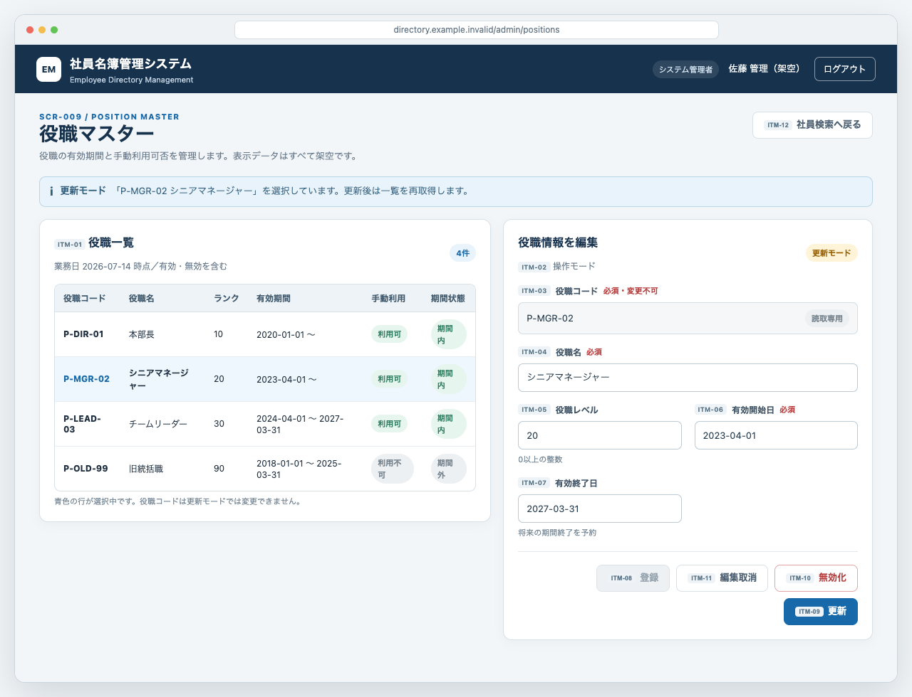

| 項目 | 内容 |
|---|---|
| 代表状態 | システム管理者が既存役職を一覧から選択して更新している状態 |
| 配置要点 | 役職一覧と編集フォームを上下に分け、表示順と有効期間を含む更新項目を一か所にまとめる |
| 編集可能な原本 | [SCR-009.html](社員名簿管理システム/mockups/SCR-009.html) |

### 4.11.3 初期表示

| No | 処理 | API | 正常時 | 異常時 |
|---:|---|---|---|---|
| 1 | 有効・無効を含む役職一覧を取得する（`activeOnly=false`、`effectiveOn=業務日`） | API-009 | ITM-01へ役職一覧を設定 | 0件はMSG-70、取得条件不正はMSG-62、権限不足はMSG-67、その他はMSG-68 |
| 2 | 編集領域を登録モードで初期化する | なし | ITM-02〜07を初期値に設定し、ITM-14をクリアする | ― |

### 4.11.4 画面項目

| 項目ID | 項目名 | 種別 | 必須 | 入力・表示規則 |
|---|---|---|---|---|
| ITM-01 | 役職一覧 | 一覧 | ― | 役職コード・名称・ランク・有効期間・手動利用可否・業務日時点の期間内外を別列で表示。1行選択可。選択候補として利用可能なのは手動利用可かつ指定日が有効期間内の場合だけ |
| ITM-02 | 操作モード | 表示 | ― | 新規登録 / 更新 |
| ITM-03 | 役職コード | テキスト | 必須 | 登録時編集可、更新時変更不可。半角英数字とハイフン、1〜30文字 |
| ITM-04 | 役職名 | テキスト | 必須 | 1〜200文字 |
| ITM-05 | 役職ランク | 数値 | 任意 | 0以上の整数 |
| ITM-06 | 有効開始日 | 日付 | 必須 | 有効な日付 |
| ITM-07 | 有効終了日 | 日付 | 任意 | 入力時は開始日以降。`UPDATE`では将来の期間終了を予約できる。`DISABLE`では任意で、未入力時は既存値を維持する |
| ITM-08 | 登録 | ボタン | ― | 登録モードかつ必須充足時に活性 |
| ITM-09 | 更新 | ボタン | ― | 行選択後、変更ありかつ入力妥当時に活性 |
| ITM-10 | 無効化 | ボタン | ― | 有効な役職を選択時に活性。実行前にMSG-69で確認 |
| ITM-11 | 編集取消 | ボタン | ― | 編集領域を登録モードへ戻す |
| ITM-12 | 社員検索へ戻る | ボタン | ― | 常時表示 |
| ITM-13 | メッセージ領域 | 表示 | ― | MSG-62〜MSG-70、MSG-95〜MSG-97を表示 |
| ITM-14 | 選択役職版数 | 非表示保持 | 更新・無効化時必須 | API-009の選択行versionを保持し、API-014へ送信する。利用者は編集不可 |

### 4.11.5 画面イベント

| イベントID | イベント名 | 発火条件 | 前提・入力 | API | 成功時 | 失敗時 | 多重実行防止 |
|---|---|---|---|---|---|---|---|
| EVT-01 | 役職選択 | ITM-01行選択 | 選択役職 | なし | 更新モードでITM-03〜07へ設定し、選択行versionをITM-14へ保持 | ― | 単一行選択 |
| EVT-02 | 役職登録 | ITM-08押下 | ITM-03〜07 | API-013, API-009 | MSG-64表示後、API-009を`activeOnly=false`、`effectiveOn=業務日`で再取得して登録モードへ戻る | 入力・再取得条件不正はMSG-62、コード重複はMSG-63、期間不正はMSG-95、権限不足はMSG-67、その他はMSG-68 | 一覧再取得完了まで全編集操作を無効化 |
| EVT-03 | 役職更新 | ITM-09押下 | 選択役職、`operation=UPDATE`、ITM-04〜07、ITM-14。ITM-07は値があればその終了日を送信し、空欄なら明示nullを送信して期限を解除する | API-014, API-009 | MSG-64表示後、API-009を`activeOnly=false`、`effectiveOn=業務日`で再取得し選択・ITM-14をクリア | 入力・再取得条件不正はMSG-62、期間不正はMSG-95、対象不存在はMSG-96、更新競合はMSG-97、権限不足はMSG-67、その他はMSG-68 | 一覧再取得完了まで全編集操作を無効化 |
| EVT-04 | 役職無効化 | ITM-10押下後MSG-69で確認 | 選択役職、`operation=DISABLE`、ITM-14。ITM-07は入力時だけ送信し、未入力時は省略する | API-014, API-009 | 手動利用可否を即時に無効化しMSG-65表示後、API-009を`activeOnly=false`、`effectiveOn=業務日`で再取得し選択・ITM-14をクリア | 入力・再取得条件不正はMSG-62、期間不正はMSG-95、対象不存在はMSG-96、更新競合はMSG-97、権限不足はMSG-67、その他はMSG-68 | 一覧再取得完了まで全編集操作を無効化 |
| EVT-05 | 編集取消 | ITM-11押下 | なし | なし | 登録モードへ戻し入力とITM-14を初期化 | ― | 連打による副作用なし |
| EVT-06 | 社員検索へ戻る | ITM-12押下 | なし | なし | SCR-001へ遷移 | ― | 遷移開始後に無効化 |

### 4.11.6 入力チェック

| No | 対象 | タイミング | チェック内容 | 違反時 |
|---:|---|---|---|---|
| 1 | ITM-03、04、06 | EVT-02/03実行時 | 必須項目が入力済み | MSG-62を表示し送信しない |
| 2 | ITM-03 | 入力離脱時・EVT-02 | 半角英数字とハイフン、所定長以内 | MSG-62を表示し送信しない |
| 3 | ITM-04 | 入力離脱時・EVT-02/03 | 1〜200文字 | MSG-62を表示し送信しない |
| 4 | ITM-05 | 入力離脱時・EVT-02/03 | 入力時は0以上の整数 | MSG-62を表示し送信しない |
| 5 | ITM-06、07 | EVT-02/03/04実行時 | ITM-06は登録・更新時に有効日付。ITM-07は入力時だけ有効日付かつ開始日以降。無効化時のITM-07未入力は許可する | MSG-62を表示し送信しない |
| 6 | ITM-14 | EVT-03/04実行時 | API-009から取得した1以上の整数を保持している | MSG-62を表示し、一覧再取得まで送信しない |

### 4.11.7 画面状態・表示制御

| 状態 | 条件・契機 | 入力・操作制御 | 表示内容 | 対応状態パターン |
|---|---|---|---|---|
| 登録モード | 初期表示・編集取消 | ITM-03〜07編集可、登録活性条件を評価 | 役職一覧・空の編集領域 | UC-011/SP-1 |
| 更新モード | 有効役職選択 | コード以外編集可 | 選択役職 | UC-011/SP-1 |
| 無効化確認 | EVT-04実行前 | 編集・選択を一時無効化 | MSG-69 | UC-011/SP-2 |
| 反映中 | EVT-02/03/04応答待ち | 全編集操作を無効化 | MSG-66 | UC-011/SP-1, UC-011/SP-2 |
| 権限エラー | APIが権限不足 | 全編集操作を無効化 | MSG-67 | UC-011/SP-3 |
| 入力エラー | 入力不備 | 編集可 | MSG-62 | UC-011/SP-4 |
| コード重複 | API-013が重複 | ITM-03を編集可 | MSG-63 | UC-011/SP-5 |
| 期間不正 | API-013/014が有効期間不正 | ITM-06/07を編集可 | MSG-95 | UC-011/SP-4 |
| 対象不存在 | API-014が役職不存在 | 一覧を再取得するまで編集・更新を無効化 | MSG-96 | 該当なし(同時削除・変更) |
| 更新競合 | API-014が版数不一致 | 一覧を再取得するまで編集・更新を無効化 | MSG-97 | 該当なし(同時更新) |
| 反映成功 | API成功 | 一覧再取得まで操作無効 | MSG-64またはMSG-65 | UC-011/SP-1, UC-011/SP-2 |
| システムエラー | 技術例外 | 入力を保持し再実行可 | MSG-68 | 該当なし(技術例外) |

### 4.11.8 画面遷移

| 遷移元イベント | 遷移先 | 条件 | 引継ぎ値 |
|---|---|---|---|
| EVT-06 | SCR-001 | 常時 | なし |

### 4.11.9 メッセージ一覧

| MSG ID | 種別 | 文言 | 対応ERR |
|---|---|---|---|
| MSG-62 | エラー | 入力内容に誤りがあります。役職情報をご確認ください。 | VALIDATION_ERROR |
| MSG-63 | エラー | 役職コードは既に登録されています。 | POSITION_CODE_DUPLICATED |
| MSG-64 | 完了 | 役職情報を登録・更新しました。 | - |
| MSG-65 | 完了 | 役職を無効化しました。 | - |
| MSG-66 | 情報 | 役職情報を反映しています。しばらくお待ちください。 | - |
| MSG-67 | エラー | 役職マスターを管理する権限がありません。 | FORBIDDEN |
| MSG-68 | エラー | 役職情報を反映できませんでした。時間をおいて再度お試しください。 | INTERNAL_ERROR |
| MSG-69 | 確認 | 選択した役職を直ちに利用不可にします。よろしいですか？ | - |
| MSG-70 | 情報 | 登録されている役職がありません。 | - |
| MSG-95 | エラー | 有効期間が不正であるか、現在・将来の所属参照期間を包含できません。参照中の所属を先に変更するか、有効期間を見直してください。 | MASTER_PERIOD_INVALID |
| MSG-96 | エラー | 対象の役職が見つかりません。一覧を再取得してください。 | POSITION_NOT_FOUND |
| MSG-97 | エラー | 他の利用者による更新がありました。役職一覧を再取得してください。 | UPDATE_CONFLICT |

## 4.12 SCR-010 ログイン画面

### 4.12.1 基本情報

| 項目 | 内容 |
|---|---|
| 画面ID | SCR-010 |
| 画面名 | ログイン画面 |
| URL / ルート | /login |
| 目的 | 社内認証基盤による認証を行い、利用者ロールを伴うアクセストークンで認証状態を確立する |
| トレース元 | UC-005(F-001) |
| 利用可能ロール | 全利用者(認証前) |
| 表示契機 | 未認証アクセス、ログアウト、アクセストークン失効 |
| 利用API | API-010 |

### 4.12.2 画面レイアウト


| 項目 | 内容 |
|---|---|
| 代表状態 | 未認証利用者がログインIDとパスワードを入力できる通常状態 |
| 配置要点 | 保護画面用ヘッダーを表示せず、認証フォームとメッセージ領域だけを中央カードへ集約する |
| 編集可能な原本 | [SCR-010.html](社員名簿管理システム/mockups/SCR-010.html) |

### 4.12.3 初期表示

| No | 処理 | API | 正常時 | 異常時 |
|---:|---|---|---|---|
| 1 | 有効なアクセストークンの有無を確認する | なし | 未認証ならログインフォームを表示。有効ならSCR-001または検証済み戻り先へ遷移 | ― |
| 2 | 戻り先URLを検証して保持する | なし | システム内の許可されたURLだけを保持 | 不正な戻り先は破棄しSCR-001を既定値とする |
| 3 | ログインIDへ初期フォーカスを設定する | なし | ITM-01を入力可能にする | ― |

### 4.12.4 画面項目

| 項目ID | 項目名 | 種別 | 必須 | 入力・表示規則 |
|---|---|---|---|---|
| ITM-01 | ログインID | テキスト | 必須 | 前後空白を除去。所定の利用者識別子形式 |
| ITM-02 | パスワード | パスワード | 必須 | 入力内容をマスクし、画面・ログへ平文表示しない |
| ITM-03 | ログイン | ボタン | ― | 必須項目充足時に活性 |
| ITM-04 | 入力クリア | ボタン | ― | 認証情報を消去 |
| ITM-05 | メッセージ領域 | 表示 | ― | MSG-71〜MSG-75、MSG-90を表示 |

### 4.12.5 画面イベント

| イベントID | イベント名 | 発火条件 | 前提・入力 | API | 成功時 | 失敗時 | 多重実行防止 |
|---|---|---|---|---|---|---|---|
| EVT-01 | ログイン | ITM-03押下またはITM-02で確定操作 | ITM-01、ITM-02 | API-010 | 認証情報入力を破棄しSCR-001または検証済み戻り先へ遷移 | 入力不正はMSG-71、認証失敗はMSG-72、アカウント無効はMSG-73、認証基盤利用不能はMSG-90、その他はMSG-75 | 応答まで全入力・ログインを無効化 |
| EVT-02 | 入力クリア | ITM-04押下 | なし | なし | ITM-01、ITM-02を消去しITM-01へフォーカス | ― | 連打による副作用なし |

### 4.12.6 入力チェック

| No | 対象 | タイミング | チェック内容 | 違反時 |
|---:|---|---|---|---|
| 1 | ITM-01、02 | EVT-01実行時 | 必須入力済み | MSG-71を表示し送信しない |
| 2 | ITM-01 | 入力離脱時・EVT-01 | 所定形式かつ254文字以内 | MSG-71を表示しITM-01へフォーカス |
| 3 | ITM-02 | EVT-01実行時 | 256文字以内 | MSG-71を表示しITM-02へフォーカス |

### 4.12.7 画面状態・表示制御

| 状態 | 条件・契機 | 入力・操作制御 | 表示内容 | 対応状態パターン |
|---|---|---|---|---|
| 入力待ち | 初期表示 | 認証情報を入力可 | ログインフォーム | UC-005/SP-1 |
| 認証中 | EVT-01応答待ち | 全入力・ログインを無効化 | MSG-74 | UC-005/SP-1 |
| 認証情報誤り | API-010が認証失敗 | ITM-02を消去し再入力可 | MSG-72 | UC-005/SP-2 |
| アカウント無効・ロック | API-010が利用不可 | 全入力・ログインを無効化 | MSG-73 | UC-005/SP-3 |
| 認証基盤利用不能 | API-010が社内認証基盤利用不能 | 認証情報を破棄し、時間をおいて再実行可 | MSG-90 | 該当なし(外部サービス障害) |
| 認証成功 | API-010成功 | 認証情報を破棄し操作不可 | 遷移処理 | UC-005/SP-1 |
| システムエラー | トークン候補の生成またはログイン成功監査の記録に失敗 | 認証情報を破棄し再入力可 | MSG-75 | UC-005/SP-4 |

### 4.12.8 画面遷移

| 遷移元イベント | 遷移先 | 条件 | 引継ぎ値 |
|---|---|---|---|
| EVT-01 | SCR-001または検証済み戻り先 | API-010成功 | 認証状態。ログインID・パスワード・トークン本文を画面遷移値として引き継がない |
| 初期表示 | SCR-001または検証済み戻り先 | 有効なアクセストークンあり | なし |

### 4.12.9 メッセージ一覧

| MSG ID | 種別 | 文言 | 対応ERR |
|---|---|---|---|
| MSG-71 | エラー | ログインIDとパスワードを入力してください。 | VALIDATION_ERROR |
| MSG-72 | エラー | ログインIDまたはパスワードが正しくありません。 | AUTHENTICATION_FAILED |
| MSG-73 | エラー | アカウントが無効またはロックされています。管理者にお問い合わせください。 | ACCOUNT_INACTIVE |
| MSG-74 | 情報 | 認証中です。しばらくお待ちください。 | - |
| MSG-75 | エラー | ログインできませんでした。時間をおいて再度お試しください。 | INTERNAL_ERROR |
| MSG-90 | エラー | 現在、社内認証基盤を利用できません。時間をおいて再度お試しください。 | AUTHENTICATION_SERVICE_UNAVAILABLE |

## 4.13 SCR-011 権限管理画面

### 4.13.1 基本情報

| 項目 | 内容 |
|---|---|
| 画面ID | SCR-011 |
| 画面名 | 権限管理画面 |
| URL / ルート | /admin/permissions |
| 目的 | 対象利用者を検索し、現在・将来のロール割当タイムラインを参照して、指定適用日以降のロール一式を更新する |
| トレース元 | UC-012(F-012) |
| 利用可能ロール | システム管理者 |
| 表示契機 | SCR-001の管理メニューで権限管理を選択 |
| 利用API | API-001, API-008, API-015, API-016, API-017 |

### 4.13.2 画面レイアウト


| 項目 | 内容 |
|---|---|
| 代表状態 | システム管理者が検索結果から利用者を選択し、現行・将来ロールを確認して更新内容を入力する状態 |
| 配置要点 | 利用者検索、候補選択、割当確認、更新入力を業務フロー順に並べ、更新対象を常に識別できるようにする |
| 編集可能な原本 | [SCR-011.html](社員名簿管理システム/mockups/SCR-011.html) |

### 4.13.3 初期表示

| No | 処理 | API | 正常時 | 異常時 |
|---:|---|---|---|---|
| 1 | 有効なロール一覧を取得する | API-015 | ITM-07へ選択肢を設定 | 権限不足はMSG-81、その他はMSG-82を表示し更新を無効化 |
| 2 | 管理者が参照可能な有効組織一覧を取得する | API-008 | ITM-03へ所属組織の選択肢を設定 | 取得条件不正はMSG-76、権限不足はMSG-81、その他はMSG-82を表示しITM-03を無効化 |
| 3 | 利用者検索条件・割当編集領域を初期化する | なし | ITM-01〜03を入力可（組織取得失敗時はITM-03を除く）、ITM-06〜09を未選択、ITM-16を空にし、ITM-14をクリア、ITM-15をpage=1・pageSize=20に初期化する | ― |

### 4.13.4 画面項目

| 項目ID | 項目名 | 種別 | 必須 | 入力・表示規則 |
|---|---|---|---|---|
| ITM-01 | 社員番号 | テキスト | 任意 | 対象利用者検索条件。半角英数字 |
| ITM-02 | 氏名 | テキスト | 任意 | 対象利用者検索条件 |
| ITM-03 | 所属組織 | 選択 | 任意 | API-008で取得した、管理者が参照可能な有効組織 |
| ITM-04 | 利用者検索 | ボタン | ― | 条件妥当時に活性 |
| ITM-05 | 利用者候補一覧 | 一覧 | ― | 社員番号・氏名・所属・在籍状態を表示。1行選択可。アカウント存在は選択後にAPI-016で確認 |
| ITM-06 | 対象利用者 | 表示 | ― | 選択した利用者の識別情報を表示 |
| ITM-07 | 更新後ロール一式 | 複数選択 | 必須 | API-015で取得した`active=true`のロールから、ITM-08以降に有効とする一式を1件以上選択する。API-016で返る`active=false`の既存ロールは選択候補にせず、更新後一式へ含めないことでITM-08時点に終了または将来予約取消となる |
| ITM-08 | 更新適用日 | 日付 | 任意 | 未指定時は業務日。指定時は業務日当日または未来日。API-017はこの日以降の現在・将来割当を更新後ロール一式で置き換える |
| ITM-09 | 更新後共通終了日 | 日付 | 任意 | ITM-07で選択した全ロールに共通する終了日。指定時はITM-08以降 |
| ITM-10 | ロール更新 | ボタン | ― | 対象選択、ロール選択、期間妥当、かつITM-08時点の割当集合または期間から変更がある場合に活性 |
| ITM-11 | 編集取消 | ボタン | ― | 未保存変更ありの場合はMSG-84で確認 |
| ITM-12 | 社員検索へ戻る | ボタン | ― | 常時表示 |
| ITM-13 | メッセージ領域 | 表示 | ― | MSG-76〜MSG-86、MSG-101、MSG-103、MSG-104を表示 |
| ITM-14 | 利用者版数 | 非表示保持 | ロール更新時必須 | API-016のversionを保持し、API-017へ送信する。利用者は編集不可 |
| ITM-15 | 利用者候補ページ操作 | ページャー | ― | API-001のpage・pageSize・total・hasNextを保持する。1始まり、1ページ20件。候補検索後に表示 |
| ITM-16 | 現在・将来ロール割当 | 一覧表示 | ― | API-016で取得し、`roles[]`をロール名・ロール利用状態（有効/無効）・有効開始日・有効終了日・業務日時点の現在/将来区分で1割当1行表示する。`active=false`も読取専用で表示し、異なる期間を1つの入力欄へ集約しない |

### 4.13.5 画面イベント

| イベントID | イベント名 | 発火条件 | 前提・入力 | API | 成功時 | 失敗時 | 多重実行防止 |
|---|---|---|---|---|---|---|---|
| EVT-01 | 利用者検索 | ITM-04押下 | ITM-01〜03、`status=ALL`、page=1、pageSize=20 | API-001 | 在籍・退職を含むITM-05へ候補、ITM-15へページ情報を設定。0件はMSG-83 | 入力不正はMSG-76、権限不足はMSG-81、その他はMSG-82 | 応答まで検索・ページ操作を無効化 |
| EVT-02 | 利用者選択 | ITM-05行選択 | 選択社員ID | API-016 | ITM-06へ対象を、ITM-16へ`active=false`を含む現在・将来の全割当を設定する。ITM-07は業務日時点で割当有効かつロール自体も`active=true`の集合、ITM-08は業務日、ITM-09は未指定で初期化し、応答versionをITM-14へ保持 | 入力不正はMSG-76、不存在はMSG-77、権限不足はMSG-81、その他はMSG-82 | 応答まで一覧選択を無効化 |
| EVT-03 | ロール更新 | ITM-10押下後、MSG-104で置換範囲を確認 | 選択社員ID、ITM-07〜09、ITM-14。確認には終了・取消対象を列挙し、`active=false`の既存ロールが除去される場合も明示する。取消時はAPIを呼ばない | API-017 | MSG-79表示後、API-016を再実行し、ITM-16・ITM-07〜09・ITM-14を最新化 | 入力不正はMSG-76、対象不存在はMSG-77、ロール無効はMSG-78、権限不足はMSG-81、期間不正はMSG-85、アカウント無効はMSG-86、更新競合はMSG-101、その他はMSG-82 | 確認中は二重表示せず、送信後は検索・選択・編集を無効化 |
| EVT-04 | 編集取消 | ITM-11押下 | 未保存変更有無 | なし | 変更なし、またはMSG-84確認後に選択前状態へ戻し、ITM-14とITM-16をクリア | ― | 確認中は二重表示しない |
| EVT-05 | 社員検索へ戻る | ITM-12押下 | なし | なし | SCR-001へ遷移 | ― | 遷移開始後に無効化 |
| EVT-06 | 利用者候補ページ切替 | ITM-15操作 | 直近に確定したITM-01〜03、`status=ALL`、選択page、pageSize=20 | API-001 | ITM-05とITM-15を指定ページで更新し、利用者選択・ITM-14・ITM-16をクリアする | 入力不正はMSG-76、権限不足はMSG-81、その他はMSG-82 | 応答まで検索・ページ操作・候補選択を無効化 |

### 4.13.6 入力チェック

| No | 対象 | タイミング | チェック内容 | 違反時 |
|---:|---|---|---|---|
| 1 | ITM-01 | EVT-01実行時 | 入力時は半角英数字・100文字以内 | MSG-76を表示し送信しない |
| 2 | ITM-02 | EVT-01実行時 | 制御文字を含まないこと | MSG-76を表示し送信しない |
| 3 | ITM-07 | EVT-03実行時 | API-015に含まれる`active=true`のロールを1件以上選択し、`active=false`の既存ロールIDを送らない | MSG-76を表示し送信しない |
| 4 | ITM-08、09 | EVT-03実行時 | 入力時は有効な日付、有効開始日は業務日以降、終了日は開始日以降 | MSG-76を表示し送信しない |
| 5 | ITM-14 | EVT-03実行時 | API-016から取得した1以上の整数を保持している | MSG-76を表示し、API-016再取得まで送信しない |
| 6 | ITM-15 | EVT-06実行時 | pageは1以上の整数で、totalから算出した最終ページ以下。pageSizeは20 | MSG-76を表示し送信しない |
| 7 | ITM-07〜09、ITM-16 | EVT-03実行時 | ITM-08時点のITM-16上のロール集合・期間と更新後入力を比較し、少なくともロール集合、開始日、終了日のいずれかに実差分がある | MSG-76を表示し送信しない |

### 4.13.7 画面状態・表示制御

| 状態 | 条件・契機 | 入力・操作制御 | 表示内容 | 対応状態パターン |
|---|---|---|---|---|
| 利用者検索待ち | 初期表示 | 検索条件を編集可。割当編集を無効化 | 検索領域 | UC-012/SP-1 |
| 利用者選択済み | API-016成功 | 更新後ロール一式・適用日・共通終了日を編集可 | 対象利用者、現在・将来割当タイムライン、更新後入力 | UC-012/SP-1 |
| 更新中 | EVT-03応答待ち | 検索・選択・編集を無効化 | MSG-80 | UC-012/SP-1 |
| 権限エラー | APIが権限不足 | 全管理操作を無効化 | MSG-81 | UC-012/SP-2 |
| 対象不存在 | API-016/017が不存在 | 割当編集を無効化し再検索可 | MSG-77 | UC-012/SP-3 |
| ロール無効 | API-017がロール無効 | ロール再取得・再選択可 | MSG-78 | UC-012/SP-4 |
| 期間不正 | API-017が過去開始日または期間重複を検出 | 有効期間を再入力可 | MSG-85 | UC-012/SP-5 |
| アカウント無効 | API-016のuserActive=false、またはAPI-017が利用者無効を検出 | 割当参照だけを許可し更新を無効化 | MSG-86 | UC-012/SP-6 |
| 更新競合 | API-017が版数不一致 | 割当編集を無効化しAPI-016で最新情報を再取得 | MSG-101 | 該当なし(同時更新) |
| 更新成功 | API-017成功 | 再取得完了まで編集を無効化 | MSG-79 | UC-012/SP-1 |
| 検索結果なし | API-001が0件 | 割当編集を無効化 | MSG-83 | 該当なし(対象未選択) |
| 利用者検索中 | EVT-01/06の応答待ち | 検索・ページ操作・候補選択を無効化 | MSG-103 | UC-012/SP-1 |
| システムエラー | 技術例外 | 入力を保持し再実行可否を応答状態で制御 | MSG-82 | 該当なし(技術例外) |

### 4.13.8 画面遷移

| 遷移元イベント | 遷移先 | 条件 | 引継ぎ値 |
|---|---|---|---|
| EVT-05 | SCR-001 | 常時 | なし |

### 4.13.9 メッセージ一覧

| MSG ID | 種別 | 文言 | 対応ERR |
|---|---|---|---|
| MSG-76 | エラー | 入力内容に誤りがあります。対象利用者と割当ロールをご確認ください。 | VALIDATION_ERROR |
| MSG-77 | エラー | 対象の社員または利用者アカウントが見つかりません。 | EMPLOYEE_NOT_FOUND / USER_ACCOUNT_NOT_FOUND |
| MSG-78 | エラー | 指定したロールは無効です。有効なロールを選択してください。 | ROLE_NOT_ACTIVE |
| MSG-79 | 完了 | 利用者のロール割当を更新しました。 | - |
| MSG-80 | 情報 | ロール割当を更新しています。しばらくお待ちください。 | - |
| MSG-81 | エラー | 権限を管理する権限がありません。 | FORBIDDEN |
| MSG-82 | エラー | 権限情報を取得・更新できませんでした。時間をおいて再度お試しください。 | INTERNAL_ERROR |
| MSG-83 | 情報 | 条件に一致する利用者が見つかりませんでした。 | - |
| MSG-84 | 確認 | 未保存のロール変更を破棄します。よろしいですか？ | - |
| MSG-85 | エラー | ロールの有効開始日は本日以降とし、既存の割当と重複しない期間を指定してください。 | ROLE_ASSIGNMENT_PERIOD_CONFLICT |
| MSG-86 | エラー | 対象の利用者アカウントは無効です。アカウントを有効化してから更新してください。 | USER_ACCOUNT_INACTIVE |
| MSG-101 | エラー | 他の利用者による更新がありました。最新のロール割当を再取得してください。 | UPDATE_CONFLICT |
| MSG-103 | 情報 | 利用者候補を検索しています。しばらくお待ちください。 | - |
| MSG-104 | 確認 | 指定した適用日以降の現在・将来ロール割当を入力したロール一式と共通期間で置き換えます。画面に列挙した終了・取消対象（無効ロールを含む）は保持されません。よろしいですか？ | - |

---

# 5. データベース設計

## 5.1 採用DBMS・物理設計方針

業務データの論理構造(エンティティ・属性・関連)は§2.3 データモデル、シーケンス上のDB要素名と接続境界は§3.1の単一participant「Cloudflare D1」を正本とし、本章はそれらのSQLite物理構造を詳細化する。M-006以外からD1へ到達する経路を追加しない。

| 項目 | 設計 |
|---|---|
| DBMS / SQL方言 | Cloudflare D1 / SQLite互換方言 |
| 実行環境 | Cloudflare Workers PaidのD1 Binding。SQL実行はM-006 D1データアクセスに限定する |
| テーブル型制約 | EMPLOYEE〜AUDIT_LOGの通常テーブルとTX_MUTATION_GUARD技術テーブルはすべて`CREATE TABLE ... STRICT`で作成する。任意導入のFTS5 virtual tableだけは`STRICT`対象外 |
| 検索機能 | 初期正本はSQLite組込み関数の`instr(lower(対象列), lower(term)) > 0`を使用する。FTS5 `trigram`は性能試験で移行基準を超えた場合だけ採用する任意候補とし、初期マイグレーションには含めない |
| 文字コード | UTF-8 |
| タイムゾーン | DB保存はUTC、業務日判定と画面表示はAsia/Tokyo。DB側の現在時刻関数を保存値に直接使用せず、M-006がUTCのISO 8601値をバインドする |
| 日付 | `TEXT`。`YYYY-MM-DD`のISO形式で保存し、文字列順を日付順として利用する。有効期間の開始日・終了日は両端を含む |
| 日時 | `TEXT`。UTCの`YYYY-MM-DDTHH:mm:ss.SSSZ`形式で保存する |
| 主キー | UUIDの正準表現を`TEXT`で保存する。Workers側のモジュールで採番して登録する |
| 真偽値 | `INTEGER NOT NULL CHECK (値 IN (0, 1))`。`1`を真、`0`を偽とする |
| JSON | `TEXT`で保存し、`json_valid()`と用途別`json_type()`をCHECKする。業務概要は`object`、更新ガードのID集合は`array`とする |
| 楽観ロック | 更新対象の`version`一致をWHERE条件に含め、成功時に1加算する |
| 論理削除 | マスター・利用者等は`deleted_at IS NULL`を有効行条件とする。社員は在籍状態で管理し物理削除しない |
| マスター利用可否 | ORGANIZATION・POSITIONの`active`は有効期間と独立した手動利用可否。指定日利用可は`active = 1 AND effective_from <= 指定日 AND (effective_to IS NULL OR 指定日 <= effective_to)`。未来開始前・期限到来後でも`active = 1`は許容する |
| 更新単位 | 参照は`first()`/`all()`、単一文更新は`run()`、複数文の業務更新はM-006がprepared statementを`D1Database.batch()`へ順番どおりに渡す。D1は全statement成功時だけ確定し、statement例外時はバッチ全体を取り消す |
| 競合制御 | D1単一DBの書込み逐次性を前提とし、分離レベル指定やロック構文は使用しない。所有者`version`ガード、DB制約、検証トリガー、更新対象ID集合の完全一致検証で事前参照後の状態変化を検出する |
| 再試行 | 即時再試行対象は§3.1.3および§7.3.5に完全一致で列挙した5エラーだけとし、指数バックオフ＋full jitterで初回後最大2回再実行する。書込結果不明は状態・versionを再読込してcommit確認後、未反映だけ再試行する。overload、timeout、CPU・memory超過は即時再試行しない。M-006は論理一時障害を返し、M-002がオンライン要求を503系、JOBをQueue再配信へ振り分ける |
| 実行予算 | Workers Paid、D1 Paid上限1,000 statement/Worker invocationに対し内部上限900、ordered placeholderは1 statement最大100個。M-006が実測statement数をM-002へ返す |
| JOB基盤 | Cron scheduledハンドラーはCloudflare Queuesへ初回メッセージを投入するだけとし、queueハンドラーが1メッセージにつきJOB-001を1回、JOB-001がM-002/IF-07を1回呼ぶ。`max_batch_size=1`、`max_concurrency=1`、`max_retries=3`、超過時はDLQへ送る |
| DBアクセス境界 | M-006 D1データアクセスだけがSQLを実行する。API・JOB・他モジュールによる直接アクセスは禁止する |

### 5.1.1 論理型・SQLite物理型マッピング

| 論理値 | SQLite物理型 | 保存形式・制約 | M-006変換時の注意 |
|---|---|---|---|
| ID（UUID） | TEXT | UUID正準表現。`length(列) = 36`・8-4-4-4-12のハイフン・英小文字16進のCHECK、PK/UNIQUE | 文字列のままバインドし数値へ変換しない |
| 文字列 | TEXT | NOT NULL、`CHECK (length(列) BETWEEN 1 AND 最大長)`、前後空白除去・NFC正規化済み | `undefined`をバインドせず、未指定とNULLを公開IFで区別する |
| 整数 | INTEGER | 範囲CHECK（`version >= 1`、`position_level >= 0`等） | JavaScriptの安全整数範囲で扱う |
| 真偽値 | INTEGER | `CHECK (列 IN (0, 1))`、1=真 / 0=偽 | M-006がBoolean⇔0/1を変換する |
| 日付 | TEXT | `YYYY-MM-DD`、`strftime('%Y-%m-%d', 列) = 列`のCHECK。有効期間は両端を含む | 比較前に同一書式へ正規化する |
| 日時 | TEXT | UTCの`YYYY-MM-DDTHH:mm:ss.SSSZ`のCHECK | M-006が確定UTC値をバインドし、DBの現在時刻関数を保存値へ使わない |
| JSON | TEXT | `json_valid(列)`と用途別`json_type(列)`（業務概要=object、更新ガードID集合=array） | stringify/parse失敗を論理データアクセス例外へ変換する |

`VARCHAR`・`UUID`・`BOOLEAN`・`DATE`・`TIMESTAMP`・`BIGINT`・配列・`JSONB`等を物理型に使用せず、型名だけで制約されたとみなさずSTRICT・NOT NULL・CHECK・UNIQUEで保存条件を実装する。

### 5.1.2 M-006 bind・物理型対応

M-006はSQL-IDごとの「固定バインド順」を唯一のbind正本とし、順序付き`?1`〜`?N`と論理入力・SQLite値型の対応を§9の各SQL表で定義する。本節は共通変換規約を示し、SQL単位の正逆照合は§9を正本とする。

| SQLite値型 | 対象論理値 | `.bind()`値の生成・NULL方針 |
|---|---|---|
| TEXT | ID・文字列・日付・日時・JSON文字列 | 正規化済み確定値を文字列でバインドする。NULL可列だけ`null`を許可し、`undefined`を渡さない |
| INTEGER | 真偽（0/1）・版数・件数・`limit`/`offset`・役職レベル | Booleanは0/1へ変換し、整数値をそのままバインドする |

- placeholderを使うSQLは`?1`から最大ordinal`?N`まで欠番なく採番し、`.bind()`引数数をNと一致させる（§9.1・§9.1.2）。
- placeholderを持たないSQLはbindなしとし、名前付き`:name` / `@name` / `$name`と匿名`?`を実SQLへ使用しない。物理列型・CHECK・NULL可否と本表のSQLite値型・変換を一致させる。

## 5.2 テーブル一覧

| テーブル名 | 論理名 | 対応エンティティ(§2.3) | 種別 | STRICT | 目的 |
|---|---|---|---|---|---|
| EMPLOYEE | 社員 | 社員 | トランザクション | Yes | 社員の基本情報、在籍状態、退職予定を保持する |
| EMPLOYEE_ASSIGNMENT | 社員所属履歴 | 社員所属履歴 | 履歴 | Yes | 所属組織・役職・上長の有効期間履歴を保持する |
| ORGANIZATION | 組織 | 組織 | マスター | Yes | 組織階層と有効期間を保持する |
| POSITION | 役職 | 役職 | マスター | Yes | 役職、役職レベル、有効期間を保持する |
| EMPLOYEE_CHANGE_HISTORY | 社員変更履歴 | 社員変更履歴 | 追記履歴 | Yes | 業務上参照する社員変更概要を保持する |
| USER_ACCOUNT | 利用者アカウント | 利用者アカウント | マスター | Yes | 外部認証主体と社員を対応付け、システム利用状態を保持する |
| ROLE | ロール | ロール | マスター | Yes | システム上の役割を保持する |
| USER_ROLE | 利用者ロール | 利用者ロール | 有効期間履歴 | Yes | 利用者へのロール割当と有効期間を保持する |
| AUDIT_LOG | 監査ログ | 監査ログ | 追記ログ | Yes | 操作証跡とログ相関情報を保持する |
| TX_MUTATION_GUARD | 更新ガード | −（技術テーブル。§2.3対象外） | 技術テーブル | Yes | 所有者版数と更新対象ID集合をD1バッチ内で再検証する。成功バッチの末尾で必ず削除する |

## 5.3 EMPLOYEE

| カラム | 論理名 | 型 | NULL | 制約・説明 |
|---|---|---|---|---|
| employee_id | 社員ID | TEXT | 不可 | PK。UUID正準表現 |
| employee_number | 社員番号 | TEXT | 不可 | 最大20文字、UNIQUE。会社内で一意 |
| last_name | 姓 | TEXT | 不可 | 最大100文字。Unicode前後空白を除去し、NFC正規化済みの空でない値を保存 |
| first_name | 名 | TEXT | 不可 | 最大100文字。Unicode前後空白を除去し、NFC正規化済みの空でない値を保存 |
| last_name_kana | 姓カナ | TEXT | 可 | 最大100文字。提供時はUnicode前後空白除去・NFC正規化済みの空でない全角カナ。消去はNULL |
| first_name_kana | 名カナ | TEXT | 可 | 最大100文字。提供時はUnicode前後空白除去・NFC正規化済みの空でない全角カナ。消去はNULL |
| email | メールアドレス | TEXT | 不可 | 最大254文字。大文字小文字を正規化した値にUNIQUE |
| phone_number | 連絡先電話番号 | TEXT | 可 | 最大30文字。前後空白を除去して保存。NULLは未登録・解除済み |
| hire_date | 入社日 | TEXT | 不可 | `YYYY-MM-DD` |
| retirement_date | 退職日 | TEXT | 可 | `YYYY-MM-DD`。未来日の場合は退職予定。到来前はstatusをACTIVEのまま保持 |
| retirement_type_code | 退職区分 | TEXT | 可 | 最大30文字。`VOLUNTARY` / `COMPANY` / `RETIREMENT_AGE` / `CONTRACT_END` / `OTHER`。未指定はNULL |
| employment_type_code | 雇用区分 | TEXT | 不可 | 最大30文字。`REGULAR` / `CONTRACT` / `PART_TIME` / `TEMPORARY` / `OTHER` |
| status | 在籍状態 | TEXT | 不可 | 最大20文字。`ACTIVE` / `RETIRED` |

## 5.4 EMPLOYEE_ASSIGNMENT

| カラム | 論理名 | 型 | NULL | 制約・説明 |
|---|---|---|---|---|
| assignment_id | 所属履歴ID | TEXT | 不可 | PK。UUID正準表現 |
| employee_id | 社員ID | TEXT | 不可 | FK → EMPLOYEE |
| organization_id | 組織ID | TEXT | 不可 | FK → ORGANIZATION |
| position_id | 役職ID | TEXT | 不可 | FK → POSITION |
| manager_employee_id | 上長社員ID | TEXT | 可 | FK → EMPLOYEE。本人自身は指定不可。初期所属はNULL |
| effective_from | 適用開始日 | TEXT | 不可 | `YYYY-MM-DD`。入社日または異動日 |
| effective_to | 適用終了日 | TEXT | 可 | `YYYY-MM-DD`。現行所属はNULL |

### 期間整合性

- 同一社員の有効期間は重複させない。
- 基準日時点の所属は`effective_from <= 基準日 AND (effective_to IS NULL OR effective_to >= 基準日)`で判定する。
- `effective_to IS NULL`は無期限の最終行を表し、将来開始の予約所属を含めて社員ごとに最大1件とする。
- 異動可否判定では基準日に有効な行だけでなく、基準日以降に終了していない現在・将来行を取得して期間重複を検証する。
- 異動時は異動日の直前に有効な所属を異動日前日で終了し、異動日以降に開始する既存の将来所属を論理削除してから新所属を登録する。これを指定日以降の将来予約置換の正本とする。
- 即時・到来退職時は退職日に有効な所属を退職日で終了し、退職日より後に開始する将来所属を論理削除する。
- 上長社員の退職日当日以後も有効となる`manager_employee_id`参照が1件でもある場合、その退職予定・確定を拒否し、部下の上長変更を先に行う。
- 所属が参照する組織・役職は所属期間全体で利用可能でなければならない。マスター無効化・期間短縮は、現在・将来所属の参照期間を外す場合に拒否する。
- 終了日がある場合は`effective_from <= effective_to`を満たす。

## 5.5 ORGANIZATION

| カラム | 論理名 | 型 | NULL | 制約・説明 |
|---|---|---|---|---|
| organization_id | 組織ID | TEXT | 不可 | PK。UUID正準表現 |
| organization_code | 組織コード | TEXT | 不可 | 最大30文字、UNIQUE |
| organization_name | 組織名 | TEXT | 不可 | 最大200文字 |
| parent_organization_id | 上位組織ID | TEXT | 可 | FK → ORGANIZATION。自組織指定不可 |
| effective_from | 有効開始日 | TEXT | 不可 | `YYYY-MM-DD` |
| effective_to | 有効終了日 | TEXT | 可 | `YYYY-MM-DD`。期限なしはNULL |
| active | 手動利用可否 | INTEGER | 不可 | `CHECK (active IN (0, 1))`。有効期間と独立。1でも未来開始前・期限到来後は指定日利用不可、DISABLE時は即時0 |

組織階層では、上位組織を指定する子組織が`active = 1`である間、上位組織も`active = 1`であり、かつ上位組織の有効期間が子組織の有効期間全体を包含しなければならない。組織更新は同一D1バッチ内の検証トリガーで階層を再帰評価し、循環に加えて、無効化・期間短縮・親変更による有効な子の孤児化を拒否する。

## 5.6 POSITION

| カラム | 論理名 | 型 | NULL | 制約・説明 |
|---|---|---|---|---|
| position_id | 役職ID | TEXT | 不可 | PK。UUID正準表現 |
| position_code | 役職コード | TEXT | 不可 | 最大30文字、UNIQUE |
| position_name | 役職名 | TEXT | 不可 | 最大200文字 |
| position_level | 役職レベル | INTEGER | 不可 | 0以上 |
| effective_from | 有効開始日 | TEXT | 不可 | `YYYY-MM-DD` |
| effective_to | 有効終了日 | TEXT | 可 | `YYYY-MM-DD`。期限なしはNULL |
| active | 手動利用可否 | INTEGER | 不可 | `CHECK (active IN (0, 1))`。有効期間と独立。1でも未来開始前・期限到来後は指定日利用不可、DISABLE時は即時0 |

## 5.7 EMPLOYEE_CHANGE_HISTORY

| カラム | 論理名 | 型 | NULL | 制約・説明 |
|---|---|---|---|---|
| history_id | 変更履歴ID | TEXT | 不可 | PK。UUID正準表現 |
| employee_id | 対象社員ID | TEXT | 不可 | FK → EMPLOYEE |
| change_type | 変更種別 | TEXT | 不可 | 最大30文字。`REGISTER` / `BASIC_UPDATE` / `ASSIGNMENT` / `RETIREMENT_SCHEDULED` / `RETIREMENT_CONFIRMED` / `ROLE_UPDATE` |
| change_summary | 変更概要 | TEXT | 不可 | `CHECK (json_valid(change_summary) AND json_type(change_summary) = 'object')`。07のschemaVersion=1契約。`schemaVersion=1`と`changes[]`（`fieldCode`,`operation`だけ）を保持し、変更前後の実値・個人情報・自由記述は保存しない |
| changed_at | 変更日時 | TEXT | 不可 | UTCのISO 8601日時 |
| changed_by | 変更者ID | TEXT | 可 | FK → USER_ACCOUNT。JOB実行時はNULL |
| source_type | 実行元種別 | TEXT | 不可 | 最大20文字。`API` / `JOB` |
| source_id | 実行元ID | TEXT | 不可 | 最大50文字。API-IDまたはJOB-ID |
| trace_id | 相関ID | TEXT | 不可 | 最大100文字。API/JOBのログ相関ID |

## 5.8 USER_ACCOUNT

| カラム | 論理名 | 型 | NULL | 制約・説明 |
|---|---|---|---|---|
| user_id | 利用者ID | TEXT | 不可 | PK。UUID正準表現 |
| employee_id | 社員ID | TEXT | 可 | FK → EMPLOYEE。一意性はIDX-014の部分UNIQUE（有効な社員行のみ）で保証する。社員外管理者はNULL可 |
| identity_subject | 外部認証主体 | TEXT | 不可 | 最大255文字、UNIQUE |
| active | 利用状態 | INTEGER | 不可 | `CHECK (active IN (0, 1))`。0の利用者はログイン不可 |

## 5.9 ROLE

| カラム | 論理名 | 型 | NULL | 制約・説明 |
|---|---|---|---|---|
| role_id | ロールID | TEXT | 不可 | PK。UUID正準表現 |
| role_code | ロールコード | TEXT | 不可 | 最大30文字、UNIQUE。§5.9.1の4コードだけを許可 |
| role_name | ロール名 | TEXT | 不可 | 最大100文字。§5.9.1の固定名称。アプリケーションから変更しない |
| active | 利用状態 | INTEGER | 不可 | `CHECK (active IN (0, 1))`。0のロールは新規割当不可 |

### 5.9.1 固定ロール初期データ

ROLEはアプリケーション管理対象の可変マスターではなく、配置時マイグレーションで次の4件を冪等に初期投入する。アプリケーションAPI・JOB・モジュールから`role_code`と`role_name`の登録・更新・削除を行わない。利用停止が必要な場合の`active`変更も承認済み運用マイグレーションで行う。

| role_code | role_name | 初期active |
|---|---|---|
| `HR` | 人事担当者 | 1 |
| `DEPARTMENT_MANAGER` | 部門管理者 | 1 |
| `EMPLOYEE` | 一般社員 | 1 |
| `SYSTEM_ADMIN` | システム管理者 | 1 |

## 5.10 USER_ROLE

| カラム | 論理名 | 型 | NULL | 制約・説明 |
|---|---|---|---|---|
| user_role_id | 利用者ロールID | TEXT | 不可 | PK。UUID正準表現 |
| user_id | 利用者ID | TEXT | 不可 | FK → USER_ACCOUNT |
| role_id | ロールID | TEXT | 不可 | FK → ROLE |
| effective_from | 有効開始日 | TEXT | 不可 | `YYYY-MM-DD` |
| effective_to | 有効終了日 | TEXT | 可 | `YYYY-MM-DD`。現行割当はNULL |

## 5.11 AUDIT_LOG

| カラム | 論理名 | 型 | NULL | 制約・説明 |
|---|---|---|---|---|
| audit_id | 監査ログID | TEXT | 不可 | PK。UUID正準表現 |
| user_id | 操作者ID | TEXT | 可 | FK → USER_ACCOUNT。JOB実行時、またはAUTHの認証前失敗で主体未特定時はNULL |
| action | 操作 | TEXT | 不可 | 最大50文字。監査対象の論理操作 |
| target_type | 対象種別 | TEXT | 不可 | 最大50文字。社員 / 組織 / 役職 / 権限 等 |
| target_id | 対象ID | TEXT | 可 | UUID正準表現。対象が特定できない失敗時、および`EMPLOYEE_EXPORT`等の単一対象を持たない集合操作の成功時はNULL |
| occurred_at | 発生日時 | TEXT | 不可 | UTCのISO 8601日時 |
| result | 結果 | TEXT | 不可 | 最大20文字。`SUCCESS` / `FAILURE` |
| trace_id | 相関ID | TEXT | 不可 | 最大100文字。API/JOB/AUTHのログ相関ID |
| source_type | 実行元種別 | TEXT | 不可 | 最大20文字。`API` / `JOB` / `AUTH` |
| source_id | 実行元ID | TEXT | 不可 | 最大50文字。API-ID、JOB-ID、または認証処理ID |
| detail_summary | 詳細概要 | TEXT | 不可 | `CHECK (json_valid(detail_summary) AND json_type(detail_summary) = 'object')`。個人情報の全内容を含めず、条件・件数・エラー分類を保持。AUTH失敗は理由分類だけを保持する |

## 5.12 制約・インデックス

| ID | 対象 | 種別 | 定義・目的 | 対応SQL-ID |
|---|---|---|---|---|
| IDX-001 | EMPLOYEE(employee_number) | UNIQUE | 社員番号の一意性 | SQL-001, SQL-002, SQL-004, SQL-005, SQL-032 |
| IDX-002 | EMPLOYEE(lower(email)) | UNIQUE | メールアドレスの大文字小文字非依存一意性 | SQL-004, SQL-005, SQL-008 |
| IDX-003 | EMPLOYEE(retirement_date, employee_id) WHERE status = 'ACTIVE' AND retirement_date IS NOT NULL AND deleted_at IS NULL | PARTIAL INDEX | JOB-001の未反映到来退職対象をキーセット順で取得する | SQL-012 |
| IDX-004 | EMPLOYEE(last_name, first_name, employee_id) | INDEX | 氏名順の安定ソート（将来の氏名順一覧向け。現行§9 SQLは社員番号順で整列するため本索引は未使用）。任意位置の部分一致は`instr()`評価のため本索引を前提としない | なし（現行未使用・将来の氏名順一覧向け） |
| IDX-005 | EMPLOYEE_ASSIGNMENT(employee_id) WHERE effective_to IS NULL AND deleted_at IS NULL | PARTIAL UNIQUE | 有効な現行所属を社員ごとに1件へ制約 | SQL-006 |
| IDX-006 | EMPLOYEE_ASSIGNMENT(employee_id, effective_from DESC) | INDEX | 所属履歴・現所属取得 | SQL-001, SQL-002, SQL-003, SQL-009, SQL-010, SQL-026, SQL-032 |
| IDX-007 | EMPLOYEE_ASSIGNMENT(organization_id, effective_from, effective_to, employee_id) WHERE deleted_at IS NULL | PARTIAL INDEX | 基準日時点の組織別社員検索 | SQL-001, SQL-002, SQL-017, SQL-032 |
| IDX-008 | ORGANIZATION(organization_code) | UNIQUE | 組織コードの一意性 | SQL-016, SQL-018, SQL-019 |
| IDX-009 | ORGANIZATION(active, effective_from, effective_to) | INDEX | 有効組織一覧 | SQL-016 |
| IDX-010 | POSITION(position_code) | UNIQUE | 役職コードの一意性 | SQL-023, SQL-024 |
| IDX-011 | POSITION(active, effective_from, effective_to) | INDEX | 有効役職一覧 | SQL-021 |
| IDX-012 | EMPLOYEE_CHANGE_HISTORY(employee_id, changed_at DESC, history_id DESC) | INDEX | 変更履歴一覧 | SQL-014, SQL-015 |
| IDX-013 | USER_ACCOUNT(identity_subject) | UNIQUE | 外部認証主体の一意性 | SQL-026 |
| IDX-014 | USER_ACCOUNT(employee_id) WHERE employee_id IS NOT NULL AND deleted_at IS NULL | PARTIAL UNIQUE | 有効な社員と利用者の1対0..1 | SQL-033 |
| IDX-015 | ROLE(role_code) | UNIQUE | ロールコードの一意性 | SQL-027 |
| IDX-016 | USER_ROLE(user_id, role_id) WHERE effective_to IS NULL AND deleted_at IS NULL | PARTIAL UNIQUE | 有効な現行ロールの重複割当防止 | SQL-030（一意制約の最終防衛） |
| IDX-017 | USER_ROLE(user_id, effective_to, effective_from) WHERE deleted_at IS NULL | PARTIAL INDEX | 現行・期間指定ロール取得 | SQL-026, SQL-028, SQL-029, SQL-030 |
| IDX-018 | AUDIT_LOG(occurred_at DESC, audit_id DESC) | INDEX | 期間監査検索（将来の監査参照UI向け。現行§9 SQLはAUDIT_LOGへSQL-031のINSERTのみで本索引は未使用） | なし（現行未使用・将来の監査参照UI向け） |
| IDX-019 | AUDIT_LOG(target_type, target_id, occurred_at DESC) | INDEX | 対象別監査検索（将来の監査参照UI向け。現行§9 SQLはAUDIT_LOGへSQL-031のINSERTのみで本索引は未使用） | なし（現行未使用・将来の監査参照UI向け） |
| IDX-020 | EMPLOYEE_ASSIGNMENT(manager_employee_id, effective_from, effective_to, employee_id) WHERE manager_employee_id IS NOT NULL AND deleted_at IS NULL | PARTIAL INDEX | 退職時の上長逆参照と将来参照検証 | SQL-009 |
| IDX-021 | EMPLOYEE_ASSIGNMENT(position_id, effective_from, effective_to, employee_id) WHERE deleted_at IS NULL | PARTIAL INDEX | 役職の無効化・期間短縮時の参照検証 | SQL-001, SQL-002, SQL-022, SQL-032 |
| IDX-022 | ORGANIZATION(parent_organization_id) WHERE deleted_at IS NULL | PARTIAL INDEX | 階層循環・子組織包含検証 | TRG-003の階層循環・子組織包含検証で使用（利用SQLなし） |

- 部分インデックスを利用するSQLは、対象インデックスと同じ論理削除・状態条件を検索条件へ含める。
- SQLiteの`TEXT`長は型名では制限されないため、最大長を持つ列はすべて`CHECK (length(列) BETWEEN 1 AND 最大長)`を持つ。NULL可の列は`列 IS NULL OR ...`とする。
- 外部キーはマイグレーションで明示し、D1で有効な外部キー検証を利用する。削除は`RESTRICT`、主キー値の更新は禁止する。
- IDX-001（employee_number）・IDX-002（lower(email)）・IDX-008（organization_code）・IDX-010（position_code）の対象表EMPLOYEE・ORGANIZATION・POSITIONは、現行§9 SQLで`deleted_at`を設定する更新（SQL-010・SQL-029はEMPLOYEE_ASSIGNMENT・USER_ROLEのみ対象）を持たず論理削除行を生成しないため無条件UNIQUEとする。SQL-004・SQL-018・SQL-023等の事前確認が持つ`deleted_at IS NULL`は将来の論理削除導入に備えた冗長条件であり、導入時はIDX-005・IDX-014・IDX-016と同じ部分UNIQUEへ揃える。

### 5.12.1 型・チェック制約

- EMPLOYEE〜AUDIT_LOGおよびTX_MUTATION_GUARDの物理DDLはすべて末尾を`) STRICT;`とする。SQLiteの`INTEGER` / `REAL` / `TEXT` / `BLOB`以外を本システムの物理型に使用せず、FTS5 virtual tableだけを例外とする。
- 以下のUUID・日付・日時の形式CHECKはEMPLOYEE〜AUDIT_LOGの業務列に適用する。技術テーブルTX_MUTATION_GUARDはM-006が生成する値だけを保持するため、STRICTと§5.13.1のDDLに明示したCHECK（`owner_type`・`operation_type`の列挙、`json_valid()`とJSON型、所有者・operationの整合）だけを持ち、`guard_id`・`pivot_date`・`created_at`へ形式CHECKを課さない。
- UUIDを保持する`TEXT`列は、`length(列) = 36`、8-4-4-4-12位置のハイフン、英小文字の16進文字だけを許可するCHECKを持つ。
- 日付`TEXT`列は`length(列) = 10`、`YYYY-MM-DD`の桁・区切り、および`strftime('%Y-%m-%d', 列) = 列`を満たすCHECKを持つ。NULL可の列はNULLを許可する。
- 日時`TEXT`列はUTCの`YYYY-MM-DDTHH:mm:ss.SSSZ`を満たすCHECKを持つ。M-006は同じ形式へ正規化した値だけをバインドする。
- 真偽列は`INTEGER CHECK (列 IN (0, 1))`とする。
- JSON列は`TEXT CHECK (json_valid(列))`を必須とし、change_summary・detail_summaryは`json_type(列) = 'object'`、更新ガードのID集合は`json_type(列) = 'array'`を追加する。
- EMPLOYEEは`retirement_date IS NULL OR hire_date <= retirement_date`を満たす。
- EMPLOYEEの`status = 'RETIRED'`では`retirement_date IS NOT NULL`を満たす。
- EMPLOYEEの`status`は`ACTIVE`または`RETIRED`のいずれかを満たす。
- EMPLOYEEは`employment_type_code IN ('REGULAR', 'CONTRACT', 'PART_TIME', 'TEMPORARY', 'OTHER')`を満たす。
- EMPLOYEEは`retirement_type_code IS NULL OR retirement_type_code IN ('VOLUNTARY', 'COMPANY', 'RETIREMENT_AGE', 'CONTRACT_END', 'OTHER')`を満たす。
- 各有効期間は終了日がある場合に`effective_from <= effective_to`を満たす。ISO日付`TEXT`のため文字列比較を使用する。
- EMPLOYEE_ASSIGNMENTは`manager_employee_id IS NULL OR manager_employee_id <> employee_id`を満たす。
- POSITIONの`position_level`は0以上とする。
- ROLEは`role_code IN ('HR', 'DEPARTMENT_MANAGER', 'EMPLOYEE', 'SYSTEM_ADMIN')`を満たす。
- EMPLOYEE_CHANGE_HISTORYの`change_type`は`REGISTER`、`BASIC_UPDATE`、`ASSIGNMENT`、`RETIREMENT_SCHEDULED`、`RETIREMENT_CONFIRMED`、`ROLE_UPDATE`のいずれか、`source_type`は`API`または`JOB`のいずれかとする。
- AUDIT_LOGの`result`は`SUCCESS`または`FAILURE`のいずれか、`source_type`は`API`、`JOB`、`AUTH`のいずれかとする。

### 5.12.2 部分一致検索とFTS5移行候補

初期正本SQLは社員番号と`last_name || ' ' || first_name`に対する`instr(lower(対象), lower(term)) > 0`である。ワイルドカード構文を使用しないため、入力値の`%`、`_`、`\`を検索演算子として解釈しない。D1の通常索引では任意位置の部分一致を高速化できないため、データ量・実測時間が非機能要件の移行基準を超えた場合に限りFTS5へ移行する。

FTS5へ移行する場合は、D1が提供するSQLite FTS5の`trigram` tokenizerを使い、次の任意マイグレーションを適用する。`employee_id`は検索語として索引化しない。この任意のFTS5 virtual table（`EMPLOYEE_SEARCH_FTS`）をFTS-001とする。FTS-001は初期不採用の任意候補のため§5.2のテーブル一覧（対象10表）には含めず、このDDLは初期マイグレーションおよび初期正本SQLにも含めない。採用する場合だけ§5.16のMIG-003で作成する。

```sql
CREATE VIRTUAL TABLE "EMPLOYEE_SEARCH_FTS" USING fts5(
    employee_id UNINDEXED,
    employee_number,
    full_name,
    tokenize = 'trigram case_sensitive 0'
);

CREATE TRIGGER "trg_employee_search_fts_ai"
AFTER INSERT ON "EMPLOYEE"
WHEN NEW.deleted_at IS NULL
BEGIN
    INSERT INTO "EMPLOYEE_SEARCH_FTS" (employee_id, employee_number, full_name)
    VALUES (NEW.employee_id, NEW.employee_number, NEW.last_name || ' ' || NEW.first_name);
END;

CREATE TRIGGER "trg_employee_search_fts_au"
AFTER UPDATE OF employee_number, last_name, first_name, deleted_at ON "EMPLOYEE"
BEGIN
    DELETE FROM "EMPLOYEE_SEARCH_FTS" WHERE employee_id = OLD.employee_id;
    INSERT INTO "EMPLOYEE_SEARCH_FTS" (employee_id, employee_number, full_name)
    SELECT NEW.employee_id, NEW.employee_number, NEW.last_name || ' ' || NEW.first_name
    WHERE NEW.deleted_at IS NULL;
END;

CREATE TRIGGER "trg_employee_search_fts_ad"
AFTER DELETE ON "EMPLOYEE"
BEGIN
    DELETE FROM "EMPLOYEE_SEARCH_FTS" WHERE employee_id = OLD.employee_id;
END;
```

FTS5採用時は正規化後3文字以上をFTS5、1～2文字を初期正本の`instr()`で検索する。切替時は有効なEMPLOYEEから全件投入し、両方式の検索結果一致を検証してからFTS5経路を開放する。本番運用でEMPLOYEEの物理削除は行わないが、マイグレーション・復旧時の索引残留を避けるためDELETE同期トリガーも定義する。

### 5.12.3 期間重複防止トリガー

終了日NULLを無限未来とみなし、両端包含で重複を判定する。D1ではINSERT用とUPDATE用を分け、該当時は`RAISE(ABORT, エラーコード)`で同一バッチ全体を失敗させる。

```sql
CREATE TRIGGER "trg_assignment_period_bi"
BEFORE INSERT ON "EMPLOYEE_ASSIGNMENT"
WHEN NEW.deleted_at IS NULL AND EXISTS (
    SELECT 1
    FROM "EMPLOYEE_ASSIGNMENT" a
    WHERE a.employee_id = NEW.employee_id
      AND a.deleted_at IS NULL
      AND a.effective_from <= coalesce(NEW.effective_to, '9999-12-31')
      AND NEW.effective_from <= coalesce(a.effective_to, '9999-12-31')
)
BEGIN
    SELECT RAISE(ABORT, 'ASSIGNMENT_PERIOD_OVERLAP');
END;

CREATE TRIGGER "trg_assignment_period_bu"
BEFORE UPDATE OF employee_id, effective_from, effective_to, deleted_at
ON "EMPLOYEE_ASSIGNMENT"
WHEN NEW.deleted_at IS NULL AND EXISTS (
    SELECT 1
    FROM "EMPLOYEE_ASSIGNMENT" a
    WHERE a.employee_id = NEW.employee_id
      AND a.assignment_id <> NEW.assignment_id
      AND a.deleted_at IS NULL
      AND a.effective_from <= coalesce(NEW.effective_to, '9999-12-31')
      AND NEW.effective_from <= coalesce(a.effective_to, '9999-12-31')
)
BEGIN
    SELECT RAISE(ABORT, 'ASSIGNMENT_PERIOD_OVERLAP');
END;

CREATE TRIGGER "trg_user_role_period_bi"
BEFORE INSERT ON "USER_ROLE"
WHEN NEW.deleted_at IS NULL AND EXISTS (
    SELECT 1
    FROM "USER_ROLE" ur
    WHERE ur.user_id = NEW.user_id
      AND ur.role_id = NEW.role_id
      AND ur.deleted_at IS NULL
      AND ur.effective_from <= coalesce(NEW.effective_to, '9999-12-31')
      AND NEW.effective_from <= coalesce(ur.effective_to, '9999-12-31')
)
BEGIN
    SELECT RAISE(ABORT, 'USER_ROLE_PERIOD_OVERLAP');
END;

CREATE TRIGGER "trg_user_role_period_bu"
BEFORE UPDATE OF user_id, role_id, effective_from, effective_to, deleted_at
ON "USER_ROLE"
WHEN NEW.deleted_at IS NULL AND EXISTS (
    SELECT 1
    FROM "USER_ROLE" ur
    WHERE ur.user_id = NEW.user_id
      AND ur.role_id = NEW.role_id
      AND ur.user_role_id <> NEW.user_role_id
      AND ur.deleted_at IS NULL
      AND ur.effective_from <= coalesce(NEW.effective_to, '9999-12-31')
      AND NEW.effective_from <= coalesce(ur.effective_to, '9999-12-31')
)
BEGIN
    SELECT RAISE(ABORT, 'USER_ROLE_PERIOD_OVERLAP');
END;
```

### 5.12.4 業務整合性トリガー

アプリケーションでの事前検証に加え、次のトリガーを最終防衛としてマイグレーションに定義する。いずれも違反時は固定エラーコードで`RAISE(ABORT, ...)`し、M-006が業務エラーへ変換する。

| Trigger-ID | タイミング・対象 | 再検証内容 | DBエラーコード |
|---|---|---|---|
| TRG-001 | EMPLOYEE_ASSIGNMENT INSERT/UPDATE | 組織・役職が`active = 1`で所属期間全体を包含すること、上長が本人以外で在籍し、上長退職日の前日までに所属が終了すること | `ASSIGNMENT_REFERENCE_INVALID` |
| TRG-002 | EMPLOYEE UPDATE retirement_date/status | 退職日当日以後に有効な部下からの上長参照がないこと | `MANAGER_REFERENCE_EXISTS` |
| TRG-003 | ORGANIZATION INSERT/UPDATE | 再帰CTEで循環がないこと、親が有効で子期間を包含すること、有効な子を孤児化しないこと、変更後条件から外れる所属参照がないこと | `ORGANIZATION_REFERENCE_INVALID` |
| TRG-004 | POSITION UPDATE | 無効化・期間短縮後の条件から外れる所属参照がないこと | `POSITION_REFERENCE_INVALID` |
| TRG-005 | USER_ROLE INSERT/UPDATE | ROLEとUSER_ACCOUNTが削除されておらず、ROLEが`active = 1`であること | `USER_ROLE_REFERENCE_INVALID` |

TRG-001とTRG-005は論理削除後の行を参照検証対象外とする。TRG-002～004は現在・将来の未削除参照を再検索し、退職、無効化、期間短縮による不整合も拒否する。トリガー内の日付比較は正規化済みISO日付`TEXT`の比較を使用する。DBエラーだけを正常系の分岐手段にはせず、M-002の事前検証結果と一致することを試験する。

次をTRG-001〜005のマイグレーション正本とする。Trigger-IDは論理ID、物理トリガー名の`_bi`/`_bu`はINSERT/UPDATE別実装を表す。

```sql
CREATE TRIGGER "trg_assignment_reference_bi"
BEFORE INSERT ON "EMPLOYEE_ASSIGNMENT"
WHEN NEW.deleted_at IS NULL AND (
    NOT EXISTS (
        SELECT 1 FROM "ORGANIZATION" o
        WHERE o.organization_id = NEW.organization_id
          AND o.active = 1 AND o.deleted_at IS NULL
          AND o.effective_from <= NEW.effective_from
          AND (o.effective_to IS NULL OR (
              NEW.effective_to IS NOT NULL
              AND o.effective_to >= NEW.effective_to
          ))
    )
    OR NOT EXISTS (
        SELECT 1 FROM "POSITION" p
        WHERE p.position_id = NEW.position_id
          AND p.active = 1 AND p.deleted_at IS NULL
          AND p.effective_from <= NEW.effective_from
          AND (p.effective_to IS NULL OR (
              NEW.effective_to IS NOT NULL
              AND p.effective_to >= NEW.effective_to
          ))
    )
    OR (NEW.manager_employee_id IS NOT NULL AND NOT EXISTS (
        SELECT 1 FROM "EMPLOYEE" m
        WHERE m.employee_id = NEW.manager_employee_id
          AND m.employee_id <> NEW.employee_id
          AND m.status = 'ACTIVE' AND m.deleted_at IS NULL
          AND m.hire_date <= NEW.effective_from
          AND (m.retirement_date IS NULL OR (
              NEW.effective_to IS NOT NULL
              AND NEW.effective_to < m.retirement_date
          ))
    ))
)
BEGIN
    SELECT RAISE(ABORT, 'ASSIGNMENT_REFERENCE_INVALID');
END;

CREATE TRIGGER "trg_assignment_reference_bu"
BEFORE UPDATE OF employee_id, organization_id, position_id,
                 manager_employee_id, effective_from, effective_to, deleted_at
ON "EMPLOYEE_ASSIGNMENT"
WHEN NEW.deleted_at IS NULL AND (
    NOT EXISTS (
        SELECT 1 FROM "ORGANIZATION" o
        WHERE o.organization_id = NEW.organization_id
          AND o.active = 1 AND o.deleted_at IS NULL
          AND o.effective_from <= NEW.effective_from
          AND (o.effective_to IS NULL OR (
              NEW.effective_to IS NOT NULL
              AND o.effective_to >= NEW.effective_to
          ))
    )
    OR NOT EXISTS (
        SELECT 1 FROM "POSITION" p
        WHERE p.position_id = NEW.position_id
          AND p.active = 1 AND p.deleted_at IS NULL
          AND p.effective_from <= NEW.effective_from
          AND (p.effective_to IS NULL OR (
              NEW.effective_to IS NOT NULL
              AND p.effective_to >= NEW.effective_to
          ))
    )
    OR (NEW.manager_employee_id IS NOT NULL AND NOT EXISTS (
        SELECT 1 FROM "EMPLOYEE" m
        WHERE m.employee_id = NEW.manager_employee_id
          AND m.employee_id <> NEW.employee_id
          AND m.status = 'ACTIVE' AND m.deleted_at IS NULL
          AND m.hire_date <= NEW.effective_from
          AND (m.retirement_date IS NULL OR (
              NEW.effective_to IS NOT NULL
              AND NEW.effective_to < m.retirement_date
          ))
    ))
)
BEGIN
    SELECT RAISE(ABORT, 'ASSIGNMENT_REFERENCE_INVALID');
END;

CREATE TRIGGER "trg_employee_manager_reference_bu"
BEFORE UPDATE OF retirement_date, status, deleted_at ON "EMPLOYEE"
WHEN NEW.retirement_date IS NOT NULL AND EXISTS (
    SELECT 1 FROM "EMPLOYEE_ASSIGNMENT" a
    WHERE a.manager_employee_id = NEW.employee_id
      AND a.deleted_at IS NULL
      AND (a.effective_to IS NULL OR a.effective_to >= NEW.retirement_date)
)
BEGIN
    SELECT RAISE(ABORT, 'MANAGER_REFERENCE_EXISTS');
END;

CREATE TRIGGER "trg_organization_reference_bi"
BEFORE INSERT ON "ORGANIZATION"
BEGIN
    SELECT CASE WHEN NEW.parent_organization_id = NEW.organization_id
        THEN RAISE(ABORT, 'ORGANIZATION_REFERENCE_INVALID') END;
    SELECT CASE WHEN NEW.deleted_at IS NULL AND NEW.active = 1
        AND NEW.parent_organization_id IS NOT NULL AND NOT EXISTS (
            SELECT 1 FROM "ORGANIZATION" parent
            WHERE parent.organization_id = NEW.parent_organization_id
              AND parent.active = 1 AND parent.deleted_at IS NULL
              AND parent.effective_from <= NEW.effective_from
              AND (parent.effective_to IS NULL OR (
                  NEW.effective_to IS NOT NULL
                  AND parent.effective_to >= NEW.effective_to
              ))
        ) THEN RAISE(ABORT, 'ORGANIZATION_REFERENCE_INVALID') END;
END;

CREATE TRIGGER "trg_organization_reference_bu"
BEFORE UPDATE OF parent_organization_id, effective_from, effective_to,
                 active, deleted_at ON "ORGANIZATION"
BEGIN
    SELECT CASE WHEN NEW.parent_organization_id = NEW.organization_id
        THEN RAISE(ABORT, 'ORGANIZATION_REFERENCE_INVALID') END;
    SELECT CASE WHEN NEW.deleted_at IS NULL AND NEW.active = 1
        AND NEW.parent_organization_id IS NOT NULL AND NOT EXISTS (
            SELECT 1 FROM "ORGANIZATION" parent
            WHERE parent.organization_id = NEW.parent_organization_id
              AND parent.active = 1 AND parent.deleted_at IS NULL
              AND parent.effective_from <= NEW.effective_from
              AND (parent.effective_to IS NULL OR (
                  NEW.effective_to IS NOT NULL
                  AND parent.effective_to >= NEW.effective_to
              ))
        ) THEN RAISE(ABORT, 'ORGANIZATION_REFERENCE_INVALID') END;
    SELECT CASE WHEN NEW.parent_organization_id IS NOT NULL AND EXISTS (
        WITH RECURSIVE ancestors(organization_id) AS (
            SELECT NEW.parent_organization_id
            UNION
            SELECT o.parent_organization_id
            FROM "ORGANIZATION" o
            JOIN ancestors a ON o.organization_id = a.organization_id
            WHERE o.parent_organization_id IS NOT NULL
              AND o.deleted_at IS NULL
        )
        SELECT 1 FROM ancestors
        WHERE organization_id = NEW.organization_id
    ) THEN RAISE(ABORT, 'ORGANIZATION_REFERENCE_INVALID') END;
    SELECT CASE WHEN EXISTS (
        SELECT 1 FROM "ORGANIZATION" child
        WHERE child.parent_organization_id = NEW.organization_id
          AND child.active = 1 AND child.deleted_at IS NULL
          AND (
              NEW.active <> 1 OR NEW.deleted_at IS NOT NULL
              OR NEW.effective_from > child.effective_from
              OR (NEW.effective_to IS NOT NULL AND (
                  child.effective_to IS NULL
                  OR NEW.effective_to < child.effective_to
              ))
          )
    ) THEN RAISE(ABORT, 'ORGANIZATION_REFERENCE_INVALID') END;
    SELECT CASE WHEN EXISTS (
        SELECT 1 FROM "EMPLOYEE_ASSIGNMENT" a
        WHERE a.organization_id = NEW.organization_id
          AND a.deleted_at IS NULL
          AND (
              NEW.active <> 1 OR NEW.deleted_at IS NOT NULL
              OR NEW.effective_from > a.effective_from
              OR (NEW.effective_to IS NOT NULL AND (
                  a.effective_to IS NULL OR NEW.effective_to < a.effective_to
              ))
          )
    ) THEN RAISE(ABORT, 'ORGANIZATION_REFERENCE_INVALID') END;
END;

CREATE TRIGGER "trg_position_reference_bu"
BEFORE UPDATE OF effective_from, effective_to, active, deleted_at ON "POSITION"
WHEN EXISTS (
    SELECT 1 FROM "EMPLOYEE_ASSIGNMENT" a
    WHERE a.position_id = NEW.position_id
      AND a.deleted_at IS NULL
      AND (
          NEW.active <> 1 OR NEW.deleted_at IS NOT NULL
          OR NEW.effective_from > a.effective_from
          OR (NEW.effective_to IS NOT NULL AND (
              a.effective_to IS NULL OR NEW.effective_to < a.effective_to
          ))
      )
)
BEGIN
    SELECT RAISE(ABORT, 'POSITION_REFERENCE_INVALID');
END;

CREATE TRIGGER "trg_user_role_reference_bi"
BEFORE INSERT ON "USER_ROLE"
WHEN NEW.deleted_at IS NULL AND (
    NOT EXISTS (
        SELECT 1 FROM "USER_ACCOUNT" ua
        WHERE ua.user_id = NEW.user_id
          AND ua.active = 1 AND ua.deleted_at IS NULL
    )
    OR NOT EXISTS (
        SELECT 1 FROM "ROLE" r
        WHERE r.role_id = NEW.role_id
          AND r.active = 1 AND r.deleted_at IS NULL
    )
)
BEGIN
    SELECT RAISE(ABORT, 'USER_ROLE_REFERENCE_INVALID');
END;

CREATE TRIGGER "trg_user_role_reference_bu"
BEFORE UPDATE OF user_id, role_id, effective_from, effective_to, deleted_at
ON "USER_ROLE"
WHEN NEW.deleted_at IS NULL AND (
    NOT EXISTS (
        SELECT 1 FROM "USER_ACCOUNT" ua
        WHERE ua.user_id = NEW.user_id
          AND ua.active = 1 AND ua.deleted_at IS NULL
    )
    OR NOT EXISTS (
        SELECT 1 FROM "ROLE" r
        WHERE r.role_id = NEW.role_id
          AND r.active = 1 AND r.deleted_at IS NULL
    )
)
BEGIN
    SELECT RAISE(ABORT, 'USER_ROLE_REFERENCE_INVALID');
END;
```

## 5.13 トランザクション境界

| TX-ID | 業務処理・公開IF | Prepared Statement順 | D1実行方式 | 成功条件 | 全体ロールバック条件 | 公開例外 |
|---|---|---|---|---|---|---|
| TX-001 | 社員登録 / M-002→M-006/IF-05 | SQL-005→SQL-006→SQL-007 | `batch()` | 重複・組織/役職有効性を満たし全Statement成功 | いずれかのStatement失敗・一意/参照/CHECK違反 | DUPLICATED、MASTER_NOT_ACTIVE、DATA_ACCESS_ERROR |
| TX-002 | 社員基本情報更新 / M-002→M-006/IF-08 | SQL-008-A(guard INSERT)→SQL-008-B(EMPLOYEE更新)→SQL-007→SQL-008-C(guard削除) | `batch()` | 所有者版数一致・全Statement成功 | guard不成立(所有者更新0件)・制約違反 | CONFLICT、EMAIL_DUPLICATED、DATA_ACCESS_ERROR |
| TX-003 | 社員異動 / M-002→M-006/IF-34 | SQL-034-A(guard)→SQL-034-B(版数更新)→SQL-010(直前終了・将来取消)→SQL-006(新所属)→SQL-007→SQL-034-C(guard削除) | `batch()` | 所有者版数一致・期間/上長条件成立・全Statement成功 | guard不成立・期間/階層/一意違反 | CONFLICT、DATA_ACCESS_ERROR |
| TX-004 | 未来日退職受付 / M-002→M-006/IF-11 | SQL-011-A(guard)→SQL-011-B(退職日・区分・版数更新)→SQL-007→SQL-011-C(guard削除) | `batch()` | 所有者版数一致・上長逆参照なし・状態条件成立 | guard不成立・上長逆参照存在・状態条件不成立 | CONFLICT、INVALID_RETIREMENT_DATE、DATA_ACCESS_ERROR |
| TX-005 | 即時・到来退職反映 / M-002→M-006/IF-13 | SQL-013-A(guard)→SQL-013-B(退職確定)→SQL-010(所属終了・将来取消)→SQL-007→SQL-013-C(guard削除) | `batch()`（社員1件ごと） | 所有者版数一致・上長逆参照なし・全Statement成功 | guard不成立・上長逆参照存在・状態条件不成立（当該社員のバッチ） | CONFLICT、INVALID_RETIREMENT_DATE、DATA_ACCESS_ERROR |
| TX-006 | 組織登録・更新 / M-002→M-006/IF-19(登録)・IF-20(更新) | 登録=SQL-019 / 更新=SQL-020-A(guard)→SQL-020-B(条件付き更新)→SQL-020-C(guard削除) | 登録=`run()` / 更新=`batch()` | 更新は所有者版数一致・親子期間/循環/所属参照条件成立 | guard不成立・循環/期間/参照違反 | CONFLICT、CODE_DUPLICATED、DATA_ACCESS_ERROR |
| TX-007 | 役職登録・更新 / M-002→M-006/IF-24(登録)・IF-25(更新) | 登録=SQL-024 / 更新=SQL-025-A(guard)→SQL-025-B(条件付き更新)→SQL-025-C(guard削除) | 登録=`run()` / 更新=`batch()` | 更新は所有者版数一致・所属参照条件成立 | guard不成立・期間/参照違反 | CONFLICT、CODE_DUPLICATED、DATA_ACCESS_ERROR |
| TX-008 | ロール割当更新 / M-002→M-006/IF-35 | SQL-035-A(guard)→SQL-035-B(USER_ACCOUNT版数更新)→SQL-029(現行終了)→SQL-030(新規登録)→SQL-007→SQL-035-C(guard削除) | `batch()` | 所有者版数一致・期間条件成立・全Statement成功 | guard不成立・期間重複(trigger)・状態条件不成立 | CONFLICT、ROLE_ASSIGNMENT_PERIOD_CONFLICT、DATA_ACCESS_ERROR |

- M-006はバッチ内statementを表の記載順にprepared statementとして配列化する。D1は同一DB内で順次実行し、全statement成功時だけ確定する。M-006からSQLの`BEGIN`、`COMMIT`、`ROLLBACK`は発行しない。
- AUDIT_LOGは業務更新の成功後に独立した単一文`run()`で追記する。
- AUDIT_LOG記録に失敗した場合、業務更新は巻き戻さず、M-007が監査記録失敗を返して運用アラート対象とする。
- 即時再試行は§3.1.3および§7.3.5に完全一致で列挙した5エラーだけを対象に、指数バックオフ＋full jitterで初回後最大2回とする。実行時・デプロイ時の追加は許可しない。書込結果不明は状態・versionをM-006経由で再参照してcommit確認後、未反映だけ新しい`guard_id`で再試行する。overload、timeout、CPU・memory超過は即時再試行せず、M-002がオンラインは503系の一時障害、JOBだけQueue再配信へ変換する。制約・トリガー・版数・集合競合は再試行しない。
- JOB-001はSQL-012を`limit + 1`で最大41件取得し、先頭40名だけを1 Worker invocationの1チャンクとして処理する。1名当たり最大21 statement、ページ取得1 statementの最悪値は`21 × 40 + 1 = 841`で、内部上限900およびD1 Paid上限1,000を下回る。41件目は処理せず`hasMore`と`nextCursor`の判定にだけ使う。
- M-006は`first()`、`all()`、`run()`、`batch()`でD1へ送信したprepared statement数を実測し、`statementCount`（互換名`queryCount`）としてM-002へ返す。900到達前に新たな社員処理を開始しない。

### 5.13.1 所有者version・更新集合ガード

事前SELECTと更新バッチの間に別要求が確定しても、古い判定結果で更新しないよう、次の技術テーブルを作成する。成功時は同じバッチの末尾で削除され、途中失敗時はバッチとともにINSERT自体が取り消されるため残留しない。

```sql
CREATE TABLE "TX_MUTATION_GUARD" (
    guard_id TEXT PRIMARY KEY,
    owner_type TEXT NOT NULL
        CHECK (owner_type IN ('NONE', 'EMPLOYEE', 'ORGANIZATION', 'POSITION', 'USER_ACCOUNT')),
    owner_id TEXT,
    expected_version INTEGER,
    operation_type TEXT NOT NULL
        CHECK (operation_type IN ('NONE', 'ASSIGNMENT_TRANSFER', 'ASSIGNMENT_RETIREMENT', 'USER_ROLE_REPLACE')),
    pivot_date TEXT,
    expected_target_ids_json TEXT NOT NULL
        CHECK (json_valid(expected_target_ids_json) AND json_type(expected_target_ids_json) = 'array'),
    retained_ids_json TEXT NOT NULL DEFAULT '[]'
        CHECK (json_valid(retained_ids_json) AND json_type(retained_ids_json) = 'array'),
    created_at TEXT NOT NULL,
    CHECK (
        (owner_type = 'NONE' AND owner_id IS NULL AND expected_version IS NULL)
        OR
        (owner_type <> 'NONE' AND owner_id IS NOT NULL AND expected_version >= 1)
    ),
    CHECK (
        (operation_type = 'NONE' AND pivot_date IS NULL)
        OR
        (operation_type <> 'NONE' AND pivot_date IS NOT NULL)
    )
) STRICT;

CREATE TRIGGER "trg_mutation_guard_owner_bi"
BEFORE INSERT ON "TX_MUTATION_GUARD"
BEGIN
    SELECT CASE
        WHEN NEW.owner_type = 'EMPLOYEE' AND NOT EXISTS (
            SELECT 1 FROM "EMPLOYEE"
            WHERE employee_id = NEW.owner_id
              AND version = NEW.expected_version
              AND deleted_at IS NULL
        ) THEN RAISE(ABORT, 'OWNER_VERSION_CONFLICT')
        WHEN NEW.owner_type = 'ORGANIZATION' AND NOT EXISTS (
            SELECT 1 FROM "ORGANIZATION"
            WHERE organization_id = NEW.owner_id
              AND version = NEW.expected_version
              AND deleted_at IS NULL
        ) THEN RAISE(ABORT, 'OWNER_VERSION_CONFLICT')
        WHEN NEW.owner_type = 'POSITION' AND NOT EXISTS (
            SELECT 1 FROM "POSITION"
            WHERE position_id = NEW.owner_id
              AND version = NEW.expected_version
              AND deleted_at IS NULL
        ) THEN RAISE(ABORT, 'OWNER_VERSION_CONFLICT')
        WHEN NEW.owner_type = 'USER_ACCOUNT' AND NOT EXISTS (
            SELECT 1 FROM "USER_ACCOUNT"
            WHERE user_id = NEW.owner_id
              AND version = NEW.expected_version
              AND deleted_at IS NULL
        ) THEN RAISE(ABORT, 'OWNER_VERSION_CONFLICT')
    END;
    SELECT CASE
        WHEN EXISTS (
            SELECT 1 FROM json_each(NEW.expected_target_ids_json) WHERE type <> 'text'
        ) OR (
            SELECT count(*) FROM json_each(NEW.expected_target_ids_json)
        ) <> (
            SELECT count(DISTINCT value) FROM json_each(NEW.expected_target_ids_json)
        ) THEN RAISE(ABORT, 'EXPECTED_SET_INVALID')
    END;
    SELECT CASE
        WHEN NEW.operation_type IN ('ASSIGNMENT_TRANSFER', 'ASSIGNMENT_RETIREMENT')
         AND NEW.owner_type <> 'EMPLOYEE'
          THEN RAISE(ABORT, 'EXPECTED_SET_INVALID')
        WHEN NEW.operation_type = 'USER_ROLE_REPLACE'
         AND NEW.owner_type <> 'USER_ACCOUNT'
          THEN RAISE(ABORT, 'EXPECTED_SET_INVALID')
        WHEN NEW.operation_type = 'NONE'
         AND json_array_length(NEW.expected_target_ids_json) <> 0
          THEN RAISE(ABORT, 'EXPECTED_SET_INVALID')
    END;
END;
```

更新集合検証トリガーは、次の集合を`expected_target_ids_json`と双方向に比較し、片側に1件でも差があれば`UPDATE_SET_CONFLICT`で中止する。`USER_ROLE_REPLACE`では`retained_ids_json`も重複なしTEXT配列として同じ要領で検証する。

| operation_type | DB内で再計算する更新対象集合 |
|---|---|
| `ASSIGNMENT_TRANSFER` | `owner_id`の未削除所属のうち、`pivot_date`前日に有効な行、または`effective_from >= pivot_date`の行 |
| `ASSIGNMENT_RETIREMENT` | `owner_id`の未削除所属のうち、`pivot_date`当日に有効な行、または`effective_from > pivot_date`の行 |
| `USER_ROLE_REPLACE` | `owner_id`の未削除ロールのうち、`effective_to IS NULL OR effective_to >= pivot_date`で、`retained_ids_json`に含まれない行 |

次のD1/SQLiteトリガーで3種類の集合を実際に双方向突合する。片方向だけの件数比較ではなく、DB集合にだけ存在するIDと期待集合にだけ存在するIDの両方を検出する。

```sql
CREATE TRIGGER "trg_mutation_guard_set_bi"
BEFORE INSERT ON "TX_MUTATION_GUARD"
WHEN NEW.operation_type <> 'NONE'
BEGIN
    SELECT CASE
        WHEN EXISTS (
            SELECT 1 FROM json_each(NEW.retained_ids_json) WHERE type <> 'text'
        ) OR (
            SELECT count(*) FROM json_each(NEW.retained_ids_json)
        ) <> (
            SELECT count(DISTINCT value) FROM json_each(NEW.retained_ids_json)
        ) THEN RAISE(ABORT, 'EXPECTED_SET_INVALID')
    END;

    SELECT CASE
        WHEN NEW.operation_type = 'ASSIGNMENT_TRANSFER' AND (
            EXISTS (
                SELECT 1
                FROM "EMPLOYEE_ASSIGNMENT" a
                WHERE a.employee_id = NEW.owner_id
                  AND a.deleted_at IS NULL
                  AND (
                      (
                          a.effective_from <= date(NEW.pivot_date, '-1 day')
                          AND (a.effective_to IS NULL OR a.effective_to >= date(NEW.pivot_date, '-1 day'))
                      )
                      OR a.effective_from >= NEW.pivot_date
                  )
                  AND NOT EXISTS (
                      SELECT 1 FROM json_each(NEW.expected_target_ids_json) j
                      WHERE CAST(j.value AS TEXT) = a.assignment_id
                  )
            )
            OR EXISTS (
                SELECT 1
                FROM json_each(NEW.expected_target_ids_json) j
                WHERE NOT EXISTS (
                    SELECT 1
                    FROM "EMPLOYEE_ASSIGNMENT" a
                    WHERE a.assignment_id = CAST(j.value AS TEXT)
                      AND a.employee_id = NEW.owner_id
                      AND a.deleted_at IS NULL
                      AND (
                          (
                              a.effective_from <= date(NEW.pivot_date, '-1 day')
                              AND (a.effective_to IS NULL OR a.effective_to >= date(NEW.pivot_date, '-1 day'))
                          )
                          OR a.effective_from >= NEW.pivot_date
                      )
                )
            )
        ) THEN RAISE(ABORT, 'UPDATE_SET_CONFLICT')

        WHEN NEW.operation_type = 'ASSIGNMENT_RETIREMENT' AND (
            EXISTS (
                SELECT 1
                FROM "EMPLOYEE_ASSIGNMENT" a
                WHERE a.employee_id = NEW.owner_id
                  AND a.deleted_at IS NULL
                  AND (
                      (
                          a.effective_from <= NEW.pivot_date
                          AND (a.effective_to IS NULL OR a.effective_to >= NEW.pivot_date)
                      )
                      OR a.effective_from > NEW.pivot_date
                  )
                  AND NOT EXISTS (
                      SELECT 1 FROM json_each(NEW.expected_target_ids_json) j
                      WHERE CAST(j.value AS TEXT) = a.assignment_id
                  )
            )
            OR EXISTS (
                SELECT 1
                FROM json_each(NEW.expected_target_ids_json) j
                WHERE NOT EXISTS (
                    SELECT 1
                    FROM "EMPLOYEE_ASSIGNMENT" a
                    WHERE a.assignment_id = CAST(j.value AS TEXT)
                      AND a.employee_id = NEW.owner_id
                      AND a.deleted_at IS NULL
                      AND (
                          (
                              a.effective_from <= NEW.pivot_date
                              AND (a.effective_to IS NULL OR a.effective_to >= NEW.pivot_date)
                          )
                          OR a.effective_from > NEW.pivot_date
                      )
                )
            )
        ) THEN RAISE(ABORT, 'UPDATE_SET_CONFLICT')

        WHEN NEW.operation_type = 'USER_ROLE_REPLACE' AND (
            EXISTS (
                SELECT 1
                FROM "USER_ROLE" ur
                WHERE ur.user_id = NEW.owner_id
                  AND ur.deleted_at IS NULL
                  AND (ur.effective_to IS NULL OR ur.effective_to >= NEW.pivot_date)
                  AND NOT EXISTS (
                      SELECT 1 FROM json_each(NEW.retained_ids_json) r
                      WHERE CAST(r.value AS TEXT) = ur.user_role_id
                  )
                  AND NOT EXISTS (
                      SELECT 1 FROM json_each(NEW.expected_target_ids_json) j
                      WHERE CAST(j.value AS TEXT) = ur.user_role_id
                  )
            )
            OR EXISTS (
                SELECT 1
                FROM json_each(NEW.expected_target_ids_json) j
                WHERE NOT EXISTS (
                    SELECT 1
                    FROM "USER_ROLE" ur
                    WHERE ur.user_role_id = CAST(j.value AS TEXT)
                      AND ur.user_id = NEW.owner_id
                      AND ur.deleted_at IS NULL
                      AND (ur.effective_to IS NULL OR ur.effective_to >= NEW.pivot_date)
                      AND NOT EXISTS (
                          SELECT 1 FROM json_each(NEW.retained_ids_json) r
                          WHERE CAST(r.value AS TEXT) = ur.user_role_id
                      )
                )
            )
        ) THEN RAISE(ABORT, 'UPDATE_SET_CONFLICT')
    END;
END;
```

M-006は集合ガード成功後のUPDATE対象を広い日付条件で再指定せず、`expected_target_ids_json`を`json_each()`で展開したIDだけに限定する。所有者の版数更新は`WHERE 主キー = owner_id AND version = expected_version`で1件だけ更新する。これにより、ガード検証後からバッチ末尾までの逐次実行中に対象集合がずれない。

バッチ成功後、M-006は所有者更新statementの件数が1件であること、guard削除も1件であることを確認する。差分更新SQL-010/SQL-029は設計上0件以上となり得るため、`RETURNING` ID集合と`expected_target_ids_json`の完全一致は求めない。基準日に既に同日終了済みの自所属が更新対象から外れる正常差分（§9.1.2・SQL-010注意）は整合性事故として扱わず、`expected_target_ids_json`に含まれ更新されなかったIDは既終了として許容する。SQL-006/SQL-007/SQL-030など呼出計画上の期待件数を持つstatementは期待件数と`results`件数を照合し、突合できない件数差だけを通常到達不能な整合性事故として記録して後続処理を停止する。業務上の競合は必ずバッチ内ガードで検出して全体を取り消す。

## 5.14 共通カラム

### 更新可能テーブル共通

EMPLOYEE、EMPLOYEE_ASSIGNMENT、ORGANIZATION、POSITION、USER_ACCOUNT、ROLE、USER_ROLEへ付与する。

| カラム | 論理名 | 型 | NULL | 制約・説明 |
|---|---|---|---|---|
| created_at | 登録日時 | TEXT | 不可 | UTCのISO 8601日時。登録時にM-006がバインド |
| created_by | 登録者ID | TEXT | 可 | UUID正準表現。JOB・システム初期データ・AUTH認証前失敗ではNULL可 |
| updated_at | 更新日時 | TEXT | 不可 | UTCのISO 8601日時。更新時にM-006がバインド |
| updated_by | 更新者ID | TEXT | 可 | UUID正準表現。JOB実行時はNULL可 |
| version | 更新バージョン | INTEGER | 不可 | `CHECK (version >= 1)`。初期値1、更新成功時に1加算 |
| deleted_at | 論理削除日時 | TEXT | 可 | UTCのISO 8601日時。NULL=有効。物理削除は禁止 |

### 追記専用テーブル共通

EMPLOYEE_CHANGE_HISTORY、AUDIT_LOGへ付与する。

| カラム | 論理名 | 型 | NULL | 制約・説明 |
|---|---|---|---|---|
| created_at | 登録日時 | TEXT | 不可 | UTCのISO 8601日時。追記時にM-006がバインド |
| created_by | 登録者ID | TEXT | 可 | UUID正準表現。JOB実行時またはAUTH認証前失敗ではNULL可 |

## 5.15 命名規則

| 対象 | 規則 |
|---|---|
| テーブル | 英大文字スネークケース、単数形。履歴は`_HISTORY`、ログは`_LOG` |
| カラム | 英小文字スネークケース |
| 主キー | `{entity}_id` |
| 外部キー | 参照先の主キー名。用途が異なる自己参照は用途を接頭する |
| 制約 | `pk_` / `fk_` / `uk_` / `ck_` + 小文字テーブル名 + 用途 |
| トリガー | `trg_` + 小文字テーブル名 + 用途 + `_bi`（INSERT前）/ `_bu`（UPDATE前）/ `_ai`（INSERT後）/ `_au`（UPDATE後） |
| インデックス | `idx_` + 小文字テーブル名 + 主要列または用途 |
| バインド変数 | 09章の実SQLはD1 ordered placeholder `?1`、`?2`…だけを使用し、Prepared Statementごとの固定バインド順でコロンなし論理入力名との対応を定義する |
| Migration ID | `MIG-`＋3桁連番。§5.16のD1 migration単位に付番する |
| 原子実行境界 | `TX-`＋3桁連番。§5.13の1回のD1バッチで確定する原子実行単位に付番する |

- SQLはテーブル名を二重引用符で囲み、本書の英大文字物理名と厳密に一致させる。
- 同じ論理パラメーターを複数箇所で使う場合も位置番号と値の対応表をPrepared Statementごとに固定し、複数構成文では各文を`?1`から欠番なく採番し直す。文字列置換でSQLを組み立てず、値はすべて`D1PreparedStatement.bind()`へ渡す。
- 文字列連結は`||`、NULL置換は`coalesce()`、日付加減算は`date(date_text, '+1 day')`または`date(date_text, '-1 day')`を使用する。
- 配列バインドは使用せず、JSON配列`TEXT`をバインドして`json_each(json_array)`で展開する。
- 現在日時はWorkers側で1要求につき一度生成し、同一バッチの全statementへ同じISO 8601文字列をバインドする。
- 列挙コードは大文字スネークケースとし、意味は機能要件・共通定義を正本とする。

## 5.16 D1 migration・検証引継ぎ

DDL・固定データ・トリガーはD1 migrationとして版管理し、Workers起動時やAPI・JOBから実行しない。migrationの適用は承認済みデプロイ工程だけが行い、アプリケーション実行時のDBアクセスは引き続きM-006だけに限定する。

| Migration ID | 適用順 | 変更内容 | 前提 | 適用後検証・期待値 | 復旧・前進修正方針 |
|---|---:|---|---|---|---|
| MIG-001 | 1 | EMPLOYEE〜AUDIT_LOGおよびTX_MUTATION_GUARDを外部キー・CHECK・UNIQUE付き`STRICT` tableとして作成する | 空DBへ最初に適用（先行migrationなし） | `pragma_table_list`で対象10表の`strict = 1`、`PRAGMA foreign_key_check`が0行 | 未公開環境はmigration取消し。本番適用後は破壊的rollbackを行わず前進修正 |
| MIG-002 | 2 | IDX-001〜IDX-022、TRG-001〜TRG-005の物理トリガー、更新集合ガードトリガーを作成し、ROLE固定4件を冪等投入する | MIG-001適用済み | index/triggerの件数と名称が本章に一致、ROLEが4件、全negative testが固定エラーで拒否 | 欠落定義を追加migrationで補完し、適用済みDDLを手作業変更しない |
| MIG-003 | 任意 | 性能移行基準を満たした場合だけFTS-001（EMPLOYEE_SEARCH_FTS）と同期トリガーを作成して再構築する | MIG-001・MIG-002適用済みかつ性能移行基準を充足 | 有効EMPLOYEE件数とFTS件数が一致し、代表検索結果がSQL-001/032の初期正本と一致 | 読取経路を初期`instr()`へ戻した後、追加migrationでFTS定義を修正 |

- ローカルD1互換SQLiteとpreview D1の両方で、全migrationを空DBへ順適用し、通常・技術テーブルが`STRICT`であることを検証する。
- 型不一致、日付形式、列挙外コード、期間重複、組織循環、参照中マスター無効化、退職予定済み上長の新規指定をnegative testに含める。
- destructiveなSQLite schema変更は、新`STRICT` table作成、データ変換、件数・制約検証、切替、旧table廃止を別migrationとして順序化する。
- 他DBMSのdumpやDDLをそのまま投入せず、SQLite物理型・CHECK・triggerへ変換してから検証する。

---

# 6. API設計

## 6.1 API共通設計

本節は社員名簿管理システムの全APIに適用する。APIは通信境界に限定し、認証情報・HTTP入力の受付、構文検証、単一の業務モジュール呼出、HTTP結果への変換だけを行う。
APIの存在、シーケンスごとのAPI-ID、M-001からの呼出順、主処理モジュールへの接続は§3.1・§3.1.2を構成上の正本とし、本章はHTTP契約と境界処理を詳細化する。

UC-013 ログアウトはM-001のクライアント内処理で完結するため、ログアウトAPIを設けない。UC-014 退職日到来反映はJOB-001からM-002/IF-07へ委譲するため、API起動経路を設けない。いずれもAPIからDBへ迂回する経路を追加しない。

| 観点 | 仕様 |
|---|---|
| 実行基盤 | Cloudflare Workersの`fetch`ハンドラー。ルーティング後も同一Worker内のAPI境界責務を適用する |
| ベースパス | `/api` |
| データ形式 | 原則 `application/json; charset=utf-8`。API-018だけはファイルを返す |
| 認証 | API-010を除き、API-010で発行したトークンを `Authorization: Bearer {token}` で受け付ける(NFR-001) |
| 認可 | API境界で認証主体を確定し、ロール・所属・対象データによる最終判定は呼出先業務モジュールへ委譲する(NFR-002) |
| 相関ID | `X-Request-ID` を受理し、未指定時は生成する。応答とモジュール呼出へ同じ値を伝播する |
| 日付・日時 | 日付は `YYYY-MM-DD`、日時はタイムゾーン付きISO 8601 |
| エラー形式 | `errorCode`、`message`、`fieldErrors[]`、`traceId` を持つ共通JSON |
| ページング | ページングを採用する個別APIでは、`page` は1始まり・既定1、`pageSize` は既定20・上限100とし、応答に `page`、`pageSize`、`total`、`hasNext` を返す |
| 更新競合 | 更新要求の `version` と現在版をモジュールで比較し、不一致時は409を返して上書きしない(NFR-007) |
| 部分更新 | 更新項目の省略は現値保持、JSONの明示nullは個別APIで解除可能としたNULL可項目だけに許可する。モジュールが現値とマージしてから更新し、APIやSQLで省略をnullへ変換しない |
| 冪等性・二重実行防止 | GETは再実行可能とする。更新系はクライアントの二重送信抑止に加え、一意制約または要求versionによる楽観ロックで二重反映を防止する。POSTの通信再送を同一結果として保証しないため、タイムアウト時は対象照会後に再操作する |
| 個人情報 | モジュールが認証主体の権限と利用目的に基づいて許可した項目だけを返す(NFR-004) |
| 依存方向 | `画面 → M-001 プレゼンテーション → Cloudflare Worker API境界 → 単一業務モジュール → M-006 → D1` とする。D1 Worker BindingはAPI境界へ渡さない |
| Binding注入 | Workerの構成境界は `env` をM-006の生成経路だけへ渡し、APIには業務モジュール公開IFだけを注入する。APIの型・引数・状態に `env.DB` またはD1オブジェクトを含めない |
| 完了保証 | 応答に必要な業務更新は業務モジュール呼出を `await` して完了後に応答する。`ctx.waitUntil()` に必須の永続化を委ねない |

### 6.1.1 API境界の責務・禁止事項

- API-001〜009およびAPI-011〜018は§6.2で完全修飾したM-002の公開IFだけを1回呼ぶ。API-010はM-003/IF-01だけを1回呼ぶ。
- 複数モジュール間の調整、業務条件判定、トランザクション、監査記録、データアクセスは呼出先モジュールが管理する。
- APIおよびJOBからDBへ直接アクセスしない。API/JOBはD1 Worker Binding `env.DB`、TBL・SQL、Prepared Statement、`batch()`を直接参照または実行しない。
- APIの処理詳細には呼出先M-ID/IF-ID、論理処理名、引数、論理結果からHTTP結果への変換だけを記載する。

### 6.1.2 共通エラーレスポンス

| 項目名 | 型 | 必須 | 説明 |
|---|---|---|---|
| errorCode | string | Yes | 機械判定用エラーコード |
| message | string | Yes | 利用者向けメッセージ |
| fieldErrors | array | Yes | 項目エラー。項目に閉じない場合は空配列 |
| fieldErrors[].field | string | No | 対象項目名 |
| fieldErrors[].reason | string | No | エラー理由コード |
| traceId | string | Yes | 問い合わせ・ログ相関用ID |

### 6.1.3 社員固定コードAPI参照表

固定コード値の唯一の正本は§2.4とし、本表はAPI入出力で用いる表記の参照表である。APIは列挙外を`VALIDATION_ERROR`として受け付けず、M-002も永続化前に同じ列挙で再検証する。

| API項目名 | NULL | §2.4の許可値 |
|---|---|---|
| employmentTypeCode | 不可 | `REGULAR` / `CONTRACT` / `PART_TIME` / `TEMPORARY` / `OTHER` |
| retirementTypeCode | 可 | `VOLUNTARY` / `COMPANY` / `RETIREMENT_AGE` / `CONTRACT_END` / `OTHER`。未指定はNULL |

### 6.1.4 認可・閲覧範囲のAPI適用

固定ロールコードの唯一の正本は§2.4、操作権限・閲覧スコープの唯一の正本は§2.2（共通規則は冒頭の段落、ロール別条件は各ユースケース）とし、APIは次の認可結果をM-002から受け取る。複数ロール時は操作権限と許可項目の和集合、閲覧スコープは`ALL > ORGANIZATION > SELF`の優先順で決定し、有効ロールが0件の利用者はすべて拒否する。

| ロールコード | データ閲覧スコープ | API利用条件・項目制御 |
|---|---|---|
| `HR` | `ALL` | API-001〜006・007・008・009・018。API-004は氏名、カナ、email、phoneNumber、employmentTypeCodeを更新可 |
| `DEPARTMENT_MANAGER` | 操作者の業務日時点の主所属組織と、その日時点で利用可能な全子孫を`ORGANIZATION` | API-001・002・008・009・018。API-004の更新権限は付与しない |
| `EMPLOYEE` | 操作者の社員IDによる`SELF` | API-001・002・008・009。API-004は本人のemailとphoneNumberのみ更新可 |
| `SYSTEM_ADMIN` | `ALL` | API-001・002・007・008・009・011〜017。API-004の更新権限とAPI-018の出力権限はこのロール単独では付与しない |

API-008は認可済み組織範囲内の候補、API-009は認証済み利用者に共通の役職候補を返す。いずれも`activeOnly=true`では指定基準日に利用可能な候補だけを返し、`activeOnly=false`は`SYSTEM_ADMIN`権限を必須とする。

社員検索・詳細・更新・出力の認可および所属参照は業務日固定とし、API-001・002・004・018に任意の`asOfDate`を設けない。API-008・009の`effectiveOn`は候補マスターの利用可否判定だけに用い、社員閲覧スコープの基準日は変更しない。

### 6.1.5 マスター利用可否の共通契約

組織・役職の`active`は有効期間と独立した手動利用可否である。指定日に選択・業務利用できる条件は`active=true AND effectiveFrom <= 指定日 AND (effectiveToは未指定 OR 指定日 <= effectiveTo)`とする。未来開始前や期限到来後でも`active=true`のレコードは存在し得る。`DISABLE`は即時に`active=false`とし、`effectiveTo`は任意として指定時のみ更新、未指定時は現値を維持する。`UPDATE`で将来の`effectiveTo`を予約できる。

## 6.2 API一覧

| API-ID | Method | Path | 目的 | 主な権限 | 呼出モジュール |
|---|---|---|---|---|---|
| API-001 | GET | `/api/employees` | 社員検索 | 認証済み利用者(権限範囲内) | M-002/IF-01 |
| API-002 | GET | `/api/employees/{employeeId}` | 社員詳細取得 | 認証済み利用者(権限範囲内) | M-002/IF-02 |
| API-003 | POST | `/api/employees` | 社員登録 | 人事担当者 | M-002/IF-03 |
| API-004 | PUT | `/api/employees/{employeeId}` | 社員基本情報更新 | 人事担当者、許可項目に限り本人 | M-002/IF-04 |
| API-005 | POST | `/api/employees/{employeeId}/assignments` | 社員異動 | 人事担当者 | M-002/IF-05 |
| API-006 | POST | `/api/employees/{employeeId}/retirement` | 退職予定登録・即時退職 | 人事担当者 | M-002/IF-06 |
| API-007 | GET | `/api/employees/{employeeId}/history` | 変更履歴取得 | 人事担当者、システム管理者 | M-002/IF-08 |
| API-008 | GET | `/api/organizations` | 組織一覧取得 | 認証済み利用者 | M-002/IF-10 |
| API-009 | GET | `/api/positions` | 役職一覧取得 | 認証済み利用者 | M-002/IF-11 |
| API-010 | POST | `/api/auth/login` | ログイン | 認証前の全利用者 | M-003/IF-01 |
| API-011 | POST | `/api/organizations` | 組織登録 | システム管理者 | M-002/IF-10 |
| API-012 | PUT | `/api/organizations/{organizationId}` | 組織更新・無効化 | システム管理者 | M-002/IF-10 |
| API-013 | POST | `/api/positions` | 役職登録 | システム管理者 | M-002/IF-11 |
| API-014 | PUT | `/api/positions/{positionId}` | 役職更新・無効化 | システム管理者 | M-002/IF-11 |
| API-015 | GET | `/api/roles` | ロール一覧取得 | システム管理者 | M-002/IF-12 |
| API-016 | GET | `/api/employees/{employeeId}/roles` | 社員ロール取得 | システム管理者 | M-002/IF-12 |
| API-017 | PUT | `/api/employees/{employeeId}/roles` | 社員ロール更新 | システム管理者 | M-002/IF-12 |
| API-018 | POST | `/api/employees/export` | 検索結果出力 | 人事担当者、部門管理者 | M-002/IF-09 |

## 6.3 API-001 社員検索

### 6.3.1 基本情報

| 項目 | 内容 |
|---|---|
| API-ID / API名 | API-001 / 社員検索 |
| Method / Path | GET `/api/employees` |
| 目的 | 検索条件と閲覧可能範囲に一致する社員をページ単位で返す |
| 実行権限 | 認証済み利用者。返却範囲・項目はロール、所属、本人条件で制御 |
| トレース元 | F-002 / UC-002 |
| 呼出モジュール | M-002/IF-01 社員検索 |
| 冪等性 / 正常応答 | あり / 200 OK |

### 6.3.2 リクエスト項目

| 項目名 | 場所 | 型 | 必須 | 説明・制約 |
|---|---|---|---|---|
| employeeNumber | query | string | No | 社員番号。100文字以内 |
| name | query | string | No | 姓名検索文字列。100文字以内 |
| organizationId | query | string | No | 組織ID |
| positionId | query | string | No | 役職ID |
| status | query | string | No | `ACTIVE` / `RETIRED` / `ALL`。既定`ACTIVE` |
| page | query | integer | No | 1以上。既定1 |
| pageSize | query | integer | No | 1〜100。既定20 |

### 6.3.3 レスポンス項目

| 項目名 | 場所 | 型 | 必須 | 説明 |
|---|---|---|---|---|
| items | body | array | Yes | 権限上返却可能な社員一覧 |
| items[].employeeId | body | string | Yes | 社員ID |
| items[].employeeNumber | body | string | Yes | 社員番号 |
| items[].displayName | body | string | Yes | 表示氏名 |
| items[].organizationName | body | string | No | 現所属組織名 |
| items[].positionName | body | string | No | 現役職名 |
| items[].status | body | string | Yes | 在籍状態 |
| page / pageSize / total / hasNext | body | integer / boolean | Yes | ページ情報 |

### 6.3.4 バリデーション

| No | 対象 | 検証内容 | 違反時エラー |
|---:|---|---|---|
| 1 | employeeNumber / name | 文字列かつ最大100文字 | VALIDATION_ERROR |
| 2 | organizationId / positionId | 指定時はUUID形式 | VALIDATION_ERROR |
| 3 | status | 許可値のいずれか | VALIDATION_ERROR |
| 4 | page / pageSize | 整数かつ許可範囲内 | VALIDATION_ERROR |

### 6.3.5 処理フロー


```mermaid
flowchart TD
  Start([開始]) --> P1["(1) 検索要求生成"] --> P2[["(2) 社員検索呼出"]] --> D1{"(3) 検索結果判定"}
  D1 -- "成功" --> P3["(4) 検索レスポンス生成"] --> End([終了])
  D1 -- "エラー" --> E1["(5) エラーレスポンス生成"] --> End
```

### 6.3.6 処理詳細

| No | 処理名 | 種別 | 処理詳細 | 呼出先公開IF・論理処理名 | 引数・参照値 | 結果変換 |
|---:|---|---|---|---|---|---|
| 1 | 検索要求生成 | 境界 | 認証主体、相関ID、検索・ページ条件から論理検索要求を生成する | - | 認証主体、query、traceId | 検索要求 |
| 2 | 社員検索呼出 | モジュール呼出 | 閲覧範囲の判定を含む検索を委譲する | M-002/IF-01 社員検索 | (1)の検索要求 | 社員一覧、件数、業務結果 |
| 3 | 検索結果判定 | 判定 | (2)の成功または業務エラーを判定する | - | (2)の結果 | 成功は(4)、エラーは(5) |
| 4 | 検索レスポンス生成 | 境界 | 許可済み項目とページ情報を200へ変換する | - | (2)の成功結果 | §6.3.3のレスポンス |
| 5 | エラーレスポンス生成 | 境界 | 業務エラーを共通形式へ変換する | - | (2)のエラー、traceId | §6.3.7のHTTPエラー |

### 6.3.7 エラー定義

| HTTP | エラーコード | 発生元 | 発生条件 | API境界の処理 |
|---:|---|---|---|---|
| 400 | VALIDATION_ERROR | API境界 | 検索・ページ条件が不正 | 共通形式へ変換 |
| 401 | UNAUTHENTICATED | API境界 | 認証情報が無効 | 共通形式へ変換 |
| 403 | FORBIDDEN | M-002/IF-01 | 検索権限がない | 共通形式へ変換 |
| 500 | INTERNAL_ERROR | API境界 / M-002/IF-01 | 想定外の内部異常 | 内部情報を隠して変換 |

## 6.4 API-002 社員詳細取得

### 6.4.1 基本情報

| 項目 | 内容 |
|---|---|
| API-ID / API名 | API-002 / 社員詳細取得 |
| Method / Path | GET `/api/employees/{employeeId}` |
| 目的 | 権限範囲内の社員基本情報・現所属・在籍状態を返す |
| 実行権限 | 認証済み利用者。対象範囲と返却項目を制御 |
| トレース元 | F-003 / UC-006 |
| 呼出モジュール | M-002/IF-02 社員詳細参照 |
| 冪等性 / 正常応答 | あり / 200 OK |

### 6.4.2 リクエスト項目

| 項目名 | 場所 | 型 | 必須 | 説明・制約 |
|---|---|---|---|---|
| employeeId | path | string | Yes | 社員ID |

### 6.4.3 レスポンス項目

| 項目名 | 場所 | 型 | 必須 | 説明 |
|---|---|---|---|---|
| employeeId / employeeNumber | body | string | Yes | 社員ID・社員番号 |
| fullName | body | string | Yes | 姓名を半角空白1文字で連結した表示氏名 |
| lastName / firstName | body | string | Yes | 氏名 |
| lastNameKana / firstNameKana | body | string | No | 氏名カナ。権限により非返却 |
| email | body | string | No | メールアドレス。権限により非返却 |
| phoneNumber | body | string | No | 連絡先電話番号。未登録または権限による非返却時は省略 |
| hireDate / retirementDate | body | string(date) | Yes / No | 入社日・退職日 |
| retirementTypeCode | body | string | No | 退職区分。未設定または権限による非返却時は省略。返却時は§2.4の許可値 |
| employmentTypeCode / status | body | string | Yes | 雇用区分・在籍状態 |
| currentAssignment | body | object | No | 基準日時点の所属。該当所属がない場合、または権限により全配下項目が非返却となる場合は省略 |
| currentAssignment.assignmentId | body | string | Yes | 所属履歴ID。現所属があり、かつ項目返却が許可された場合に返す |
| currentAssignment.organizationId | body | string | Yes | 現所属組織ID |
| currentAssignment.organizationName | body | string | No | 現所属組織名。論理削除済みマスター等で名称を解決できない場合は省略 |
| currentAssignment.positionId | body | string | Yes | 現役職ID |
| currentAssignment.positionName | body | string | No | 現役職名。論理削除済みマスター等で名称を解決できない場合は省略 |
| currentAssignment.managerEmployeeId | body | string | No | 上長社員ID。上長未設定時は省略 |
| currentAssignment.managerEmployeeName | body | string | No | 上長表示氏名。上長未設定または名称を解決できない場合は省略 |
| currentAssignment.effectiveFrom | body | string(date) | Yes | 現所属の適用開始日 |
| currentAssignment.effectiveTo | body | string(date) | No | 現所属の適用終了日。無期限は省略 |
| version | body | integer | Yes | 更新競合検知用版数 |

| 認可結果 | 返却項目 |
|---|---|
| `HR`または`SYSTEM_ADMIN` | §6.4.3の全項目 |
| `DEPARTMENT_MANAGER` | `employeeId`、`employeeNumber`、`fullName`、`currentAssignment.organizationId`、`currentAssignment.organizationName`、`currentAssignment.positionId`、`currentAssignment.positionName`、`currentAssignment.managerEmployeeId`、`currentAssignment.managerEmployeeName`、`status`、`version`。組織・役職・上長の各物理項目を論理項目`organization`、`position`、`manager`として認可し、所属履歴ID、個人連絡先、カナ、雇用区分、入退社日、所属適用開始・終了日は返さない |
| `EMPLOYEE` | 対象社員IDが本人の場合だけ§6.4.3の全項目 |

§6.4.3の必須欄は、その項目が上表で返却許可された場合の必須性を表す。上表で許可されない項目はJSONプロパティ自体を省略し、NULLやマスク文字列へ置換しない。

### 6.4.4 バリデーション

| No | 対象 | 検証内容 | 違反時エラー |
|---:|---|---|---|
| 1 | employeeId | 必須かつシステムID形式 | VALIDATION_ERROR |

### 6.4.5 処理フロー

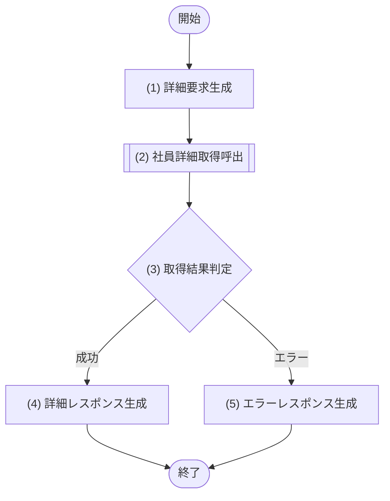
```mermaid
flowchart TD
  Start([開始]) --> P1["(1) 詳細要求生成"] --> P2[["(2) 社員詳細取得呼出"]] --> D1{"(3) 取得結果判定"}
  D1 -- "成功" --> P3["(4) 詳細レスポンス生成"] --> End([終了])
  D1 -- "エラー" --> E1["(5) エラーレスポンス生成"] --> End
```

### 6.4.6 処理詳細

| No | 処理名 | 種別 | 処理詳細 | 呼出先公開IF・論理処理名 | 引数・参照値 | 結果変換 |
|---:|---|---|---|---|---|---|
| 1 | 詳細要求生成 | 境界 | 認証主体と社員IDから論理要求を生成する | - | 認証主体、employeeId、traceId | 詳細取得要求 |
| 2 | 社員詳細取得呼出 | モジュール呼出 | 存在・閲覧範囲・返却項目判定を含む取得を委譲する | M-002/IF-02 社員詳細参照 | (1)の要求 | 社員詳細または業務エラー |
| 3 | 取得結果判定 | 判定 | (2)の結果を判定する | - | (2)の結果 | 成功は(4)、エラーは(5) |
| 4 | 詳細レスポンス生成 | 境界 | 許可済み社員詳細を200へ変換する | - | (2)の成功結果 | §6.4.3のレスポンス |
| 5 | エラーレスポンス生成 | 境界 | 不存在・権限等を共通形式へ変換する | - | (2)のエラー、traceId | §6.4.7のHTTPエラー |

### 6.4.7 エラー定義

| HTTP | エラーコード | 発生元 | 発生条件 | API境界の処理 |
|---:|---|---|---|---|
| 400 | VALIDATION_ERROR | API境界 | 社員ID形式が不正 | 共通形式へ変換 |
| 401 | UNAUTHENTICATED | API境界 | 認証情報が無効 | 共通形式へ変換 |
| 403 | FORBIDDEN | M-002/IF-02 | 対象社員を参照できない | 共通形式へ変換 |
| 404 | EMPLOYEE_NOT_FOUND | M-002/IF-02 | 対象社員が存在しない | 共通形式へ変換 |
| 500 | INTERNAL_ERROR | API境界 / M-002/IF-02 | 想定外の内部異常 | 内部情報を隠して変換 |

## 6.5 API-003 社員登録

### 6.5.1 基本情報

| 項目 | 内容 |
|---|---|
| API-ID / API名 | API-003 / 社員登録 |
| Method / Path | POST `/api/employees` |
| 目的 | 社員基本情報と初期所属を一体として登録する |
| 実行権限 | 人事担当者 |
| トレース元 | F-004 / UC-001 |
| 呼出モジュール | M-002/IF-03 社員登録 |
| 冪等性 / 正常応答 | なし（一意制約で二重登録防止） / 201 Created |

### 6.5.2 リクエスト項目

| 項目名 | 場所 | 型 | 必須 | 説明・制約 |
|---|---|---|---|---|
| employeeNumber | body | string | Yes | 社員番号。1〜20文字 |
| lastName / firstName | body | string | Yes | 姓・名。Unicode前後空白除去とNFC正規化後に各1〜100文字 |
| lastNameKana / firstNameKana | body | string | No | 提供時はUnicode前後空白除去とNFC正規化後に空でない全角カナ。各100文字以内 |
| email | body | string | Yes | メール形式。254文字以内 |
| hireDate | body | string(date) | Yes | 入社日 |
| employmentTypeCode | body | string | Yes | `REGULAR` / `CONTRACT` / `PART_TIME` / `TEMPORARY` / `OTHER` |
| initialAssignment.organizationId | body | string | Yes | 初期所属組織ID |
| initialAssignment.positionId | body | string | Yes | 初期役職ID |

初期所属の`effectiveFrom`はM-002が`hireDate`を設定し、`managerEmployeeId`はNULLを設定する。両項目は本APIの公開要求として受け付けない。

### 6.5.3 レスポンス項目

| 項目名 | 場所 | 型 | 必須 | 説明 |
|---|---|---|---|---|
| employeeId / employeeNumber | body | string | Yes | 登録社員のID・社員番号 |
| status | body | string | Yes | `ACTIVE` |
| version | body | integer | Yes | 初期版数 |
| createdAt | body | string(date-time) | Yes | 登録日時 |

### 6.5.4 バリデーション

| No | 対象 | 検証内容 | 違反時エラー |
|---:|---|---|---|
| 1 | employeeNumber / 氏名 | 必須・型を確認する。社員番号は半角英数字1〜20文字。氏名はM-002がUnicode前後空白trim → NFC → 空文字拒否 → 1〜100文字再検証 → 形式検証の順で検証する | VALIDATION_ERROR |
| 2 | 氏名カナ | 指定時はM-002が氏名と同じ正規化順で空文字、最大100文字、全角カナ形式を検証する | VALIDATION_ERROR |
| 3 | email | 必須、メール形式、最大254文字 | VALIDATION_ERROR |
| 4 | hireDate | 必須かつ日付形式。業務妥当性はモジュールで判定 | VALIDATION_ERROR |
| 5 | initialAssignment | 組織ID・役職IDが必須かつUUID形式。公開要求に開始日・上長を指定した場合は未定義項目として拒否する | VALIDATION_ERROR |
| 6 | employmentTypeCode | 必須かつ§2.4（§6.1.3 API参照表）の許可値 | VALIDATION_ERROR |

### 6.5.5 処理フロー

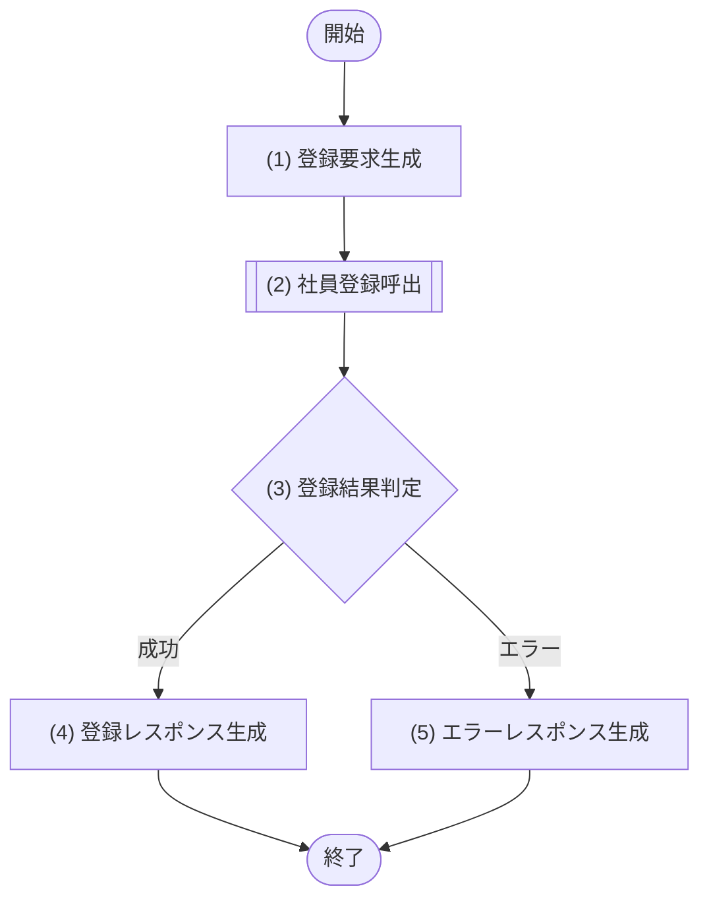
```mermaid
flowchart TD
  Start([開始]) --> P1["(1) 登録要求生成"] --> P2[["(2) 社員登録呼出"]] --> D1{"(3) 登録結果判定"}
  D1 -- "成功" --> P3["(4) 登録レスポンス生成"] --> End([終了])
  D1 -- "エラー" --> E1["(5) エラーレスポンス生成"] --> End
```

### 6.5.6 処理詳細

| No | 処理名 | 種別 | 処理詳細 | 呼出先公開IF・論理処理名 | 引数・参照値 | 結果変換 |
|---:|---|---|---|---|---|---|
| 1 | 登録要求生成 | 境界 | 認証主体、相関ID、入力項目から論理登録要求を生成する | - | 認証主体、body、traceId | 社員登録要求 |
| 2 | 社員登録呼出 | モジュール呼出 | M-002が初期所属の開始日をhireDate、上長をNULLに自動設定したうえで、認可、業務検証、一意性、マスター有効性、一体登録、履歴・監査を行う | M-002/IF-03 社員登録 | (1)の要求 | 登録社員または業務エラー |
| 3 | 登録結果判定 | 判定 | (2)の成功または業務エラーを判定する | - | (2)の結果 | 成功は(4)、エラーは(5) |
| 4 | 登録レスポンス生成 | 境界 | 登録結果を201レスポンスへ変換する | - | (2)の登録社員 | §6.5.3のレスポンス |
| 5 | エラーレスポンス生成 | 境界 | 重複・マスター無効等をHTTPエラーへ変換する | - | (2)のエラー、traceId | §6.5.7のHTTPエラー |

### 6.5.7 エラー定義

| HTTP | エラーコード | 発生元 | 発生条件 | API境界の処理 |
|---:|---|---|---|---|
| 400 | VALIDATION_ERROR | API境界 | リクエスト形式・必須・単項目制約違反 | 共通形式へ変換 |
| 401 | UNAUTHENTICATED | API境界 | 認証情報が無効 | 共通形式へ変換 |
| 403 | FORBIDDEN | M-002/IF-03 | 社員登録権限がない | 共通形式へ変換 |
| 409 | EMPLOYEE_NUMBER_DUPLICATED | M-002/IF-03 | 社員番号が登録済み | employeeNumberの項目エラーへ変換 |
| 409 | EMAIL_DUPLICATED | M-002/IF-03 | メールアドレスが登録済み | emailの項目エラーへ変換 |
| 409 | MASTER_NOT_ACTIVE | M-002/IF-03 | 組織または役職が無効 | 共通形式へ変換 |
| 500 | INTERNAL_ERROR | API境界 / M-002/IF-03 | 想定外の内部異常 | 内部情報を隠して変換 |

## 6.6 API-004 社員基本情報更新

### 6.6.1 基本情報

| 項目 | 内容 |
|---|---|
| API-ID / API名 | API-004 / 社員基本情報更新 |
| Method / Path | PUT `/api/employees/{employeeId}` |
| 目的 | 社員基本情報を版数条件付きで更新する |
| 実行権限 | `HR`は氏名・カナ・email・phoneNumber・employmentTypeCode、`EMPLOYEE`は本人のemail・phoneNumberだけ更新可。`DEPARTMENT_MANAGER`・`SYSTEM_ADMIN`にはこのロール単独で更新権限を付与しない |
| トレース元 | F-005 / UC-007 |
| 呼出モジュール | M-002/IF-04 社員基本情報更新 |
| 冪等性 / 正常応答 | 正規化・現値マージ後に実差分なしなら正常な無更新。その他はversionで二重反映防止 / 200 OK |

### 6.6.2 リクエスト項目

| 項目名 | 場所 | 型 | 必須 | 説明・制約 |
|---|---|---|---|---|
| employeeId | path | string | Yes | 社員ID |
| lastName / firstName | body | string | No | `HR`だけ指定可。Unicode前後空白除去とNFC正規化後に各1〜100文字 |
| lastNameKana / firstNameKana | body | string / null | No | `HR`だけ指定可。文字列は氏名と同じ正規化後に空でない全角カナかつ100文字以内。明示nullで消去 |
| email | body | string | No | メール形式。254文字以内 |
| phoneNumber | body | string / null | No | 連絡先電話番号。文字列は前後空白除去後1〜30文字で、半角数字・`+`・`-`・半角空白・丸括弧だけを許可する。明示的なnullで登録値を解除する |
| employmentTypeCode | body | string | No | 指定時は`REGULAR` / `CONTRACT` / `PART_TIME` / `TEMPORARY` / `OTHER` |
| version | body | integer | Yes | 取得時版数。1以上 |

### 6.6.3 レスポンス項目

| 項目名 | 場所 | 型 | 必須 | 説明 |
|---|---|---|---|---|
| employeeId | body | string | Yes | 社員ID |
| updatedFields | body | array | Yes | 更新された論理項目名 |
| version | body | integer | Yes | 更新後版数 |
| updatedAt | body | string(date-time) | Yes | 更新日時 |

### 6.6.4 バリデーション

| No | 対象 | 検証内容 | 違反時エラー |
|---:|---|---|---|
| 1 | employeeId / version | 必須、ID形式、versionは1以上 | VALIDATION_ERROR |
| 2 | 更新項目 | 1項目以上を指定する。M-002は氏名・カナの文字列をUnicode前後空白trim → NFC → 空文字拒否 → 文字数再検証 → 形式検証の順で検証し、正規化後の値で現値と差分判定する | VALIDATION_ERROR |
| 3 | email / 氏名カナ | メール形式。カナは文字列時に全角カナ形式、消去は明示nullだけを許可 | VALIDATION_ERROR |
| 4 | phoneNumber | 指定時は文字列またはnull。文字列は前後空白除去後1〜30文字、許可文字は半角数字・`+`・`-`・半角空白・丸括弧。nullは登録値の解除 | VALIDATION_ERROR |
| 5 | employmentTypeCode | 指定時は§2.4（§6.1.3 API参照表）の許可値 | VALIDATION_ERROR |

### 6.6.5 処理フロー

```mermaid
flowchart TD
  Start([開始]) --> P1["(1) 更新要求生成"] --> P2[["(2) 社員基本情報更新呼出"]] --> D1{"(3) 更新結果判定"}
  D1 -- "成功" --> P3["(4) 更新レスポンス生成"] --> End([終了])
  D1 -- "エラー" --> E1["(5) エラーレスポンス生成"] --> End
```

### 6.6.6 処理詳細

| No | 処理名 | 種別 | 処理詳細 | 呼出先公開IF・論理処理名 | 引数・参照値 | 結果変換 |
|---:|---|---|---|---|---|---|
| 1 | 更新要求生成 | 境界 | 認証主体、社員ID、更新項目、版数から論理要求を生成する | - | 認証主体、path、body、traceId | 基本情報更新要求 |
| 2 | 社員基本情報更新呼出 | モジュール呼出 | 本人条件、項目権限、一意性、版数更新、履歴・監査を委譲する | M-002/IF-04 社員基本情報更新 | (1)の要求 | 更新結果または業務エラー |
| 3 | 更新結果判定 | 判定 | (2)の結果を判定する | - | (2)の結果 | 成功は(4)、エラーは(5) |
| 4 | 更新レスポンス生成 | 境界 | 更新結果を200へ変換する | - | (2)の成功結果 | §6.6.3のレスポンス |
| 5 | エラーレスポンス生成 | 境界 | 不存在・重複・競合等をHTTPエラーへ変換する | - | (2)のエラー、traceId | §6.6.7のHTTPエラー |

### 6.6.7 エラー定義

| HTTP | エラーコード | 発生元 | 発生条件 | API境界の処理 |
|---:|---|---|---|---|
| 400 | VALIDATION_ERROR | API境界 | 入力形式または更新項目が不正 | 共通形式へ変換 |
| 401 | UNAUTHENTICATED | API境界 | 認証情報が無効 | 共通形式へ変換 |
| 403 | FORBIDDEN | M-002/IF-04 | 対象または項目を更新できない | 共通形式へ変換 |
| 404 | EMPLOYEE_NOT_FOUND | M-002/IF-04 | 対象社員が存在しない | 共通形式へ変換 |
| 409 | EMAIL_DUPLICATED | M-002/IF-04 | メールアドレスが他社員と重複 | emailの項目エラーへ変換 |
| 409 | UPDATE_CONFLICT | M-002/IF-04 | version不一致 | 最新情報の再取得を要求 |
| 500 | INTERNAL_ERROR | API境界 / M-002/IF-04 | 想定外の内部異常 | 内部情報を隠して変換 |

## 6.7 API-005 社員異動

### 6.7.1 基本情報

| 項目 | 内容 |
|---|---|
| API-ID / API名 | API-005 / 社員異動 |
| Method / Path | POST `/api/employees/{employeeId}/assignments` |
| 目的 | 所属・役職・上長を適用開始日付きで変更し、その適用日以降の既存将来所属予約を置き換える |
| 実行権限 | 人事担当者 |
| トレース元 | F-006 / UC-003 |
| 呼出モジュール | M-002/IF-05 社員異動 |
| 冪等性 / 正常応答 | なし（versionで二重異動防止） / 201 Created |

### 6.7.2 リクエスト項目

| 項目名 | 場所 | 型 | 必須 | 説明・制約 |
|---|---|---|---|---|
| employeeId | path | string | Yes | 対象社員ID |
| organizationId | body | string | Yes | 新所属組織ID |
| positionId | body | string | Yes | 新役職ID |
| managerEmployeeId | body | string | No | 新上長社員ID |
| effectiveFrom | body | string(date) | Yes | 異動日。業務日当日または未来日。過去日の遡及異動は不可 |
| version | body | integer | Yes | 対象社員の取得時版数 |

### 6.7.3 レスポンス項目

| 項目名 | 場所 | 型 | 必須 | 説明 |
|---|---|---|---|---|
| employeeId / assignmentId | body | string | Yes | 対象社員・新所属履歴ID |
| organizationId / positionId | body | string | Yes | 反映後の組織・役職ID |
| managerEmployeeId | body | string | No | 反映後の上長ID |
| effectiveFrom | body | string(date) | Yes | 適用開始日 |
| version | body | integer | Yes | 更新後社員版数 |

### 6.7.4 バリデーション

| No | 対象 | 検証内容 | 違反時エラー |
|---:|---|---|---|
| 1 | employeeId / 各ID | 社員・組織・役職IDは必須かつID形式。上長IDは指定時にID形式 | VALIDATION_ERROR |
| 2 | effectiveFrom | 必須かつ日付形式。業務日より前は業務検証で拒否する | VALIDATION_ERROR |
| 3 | version | 1以上の整数 | VALIDATION_ERROR |

### 6.7.5 処理フロー

```mermaid
flowchart TD
  Start([開始]) --> P1["(1) 異動要求生成"] --> P2[["(2) 社員異動呼出"]] --> D1{"(3) 異動結果判定"}
  D1 -- "成功" --> P3["(4) 異動レスポンス生成"] --> End([終了])
  D1 -- "エラー" --> E1["(5) エラーレスポンス生成"] --> End
```

### 6.7.6 処理詳細

| No | 処理名 | 種別 | 処理詳細 | 呼出先公開IF・論理処理名 | 引数・参照値 | 結果変換 |
|---:|---|---|---|---|---|---|
| 1 | 異動要求生成 | 境界 | 認証主体、社員ID、異動内容、版数から論理要求を生成する | - | 認証主体、path、body、traceId | 社員異動要求 |
| 2 | 社員異動呼出 | モジュール呼出 | 在籍状態、異動日時点のマスター、指定上長の在籍・退職予定未登録、期間整合、版数を検証し、異動日前日の所属終了、異動日以降に開始する既存将来所属の取消、新所属登録、履歴を一つの原子更新として行い、成功後に監査する処理を委譲する | M-002/IF-05 社員異動 | (1)の要求 | 新所属または業務エラー |
| 3 | 異動結果判定 | 判定 | (2)の結果を判定する | - | (2)の結果 | 成功は(4)、エラーは(5) |
| 4 | 異動レスポンス生成 | 境界 | 新所属を201レスポンスへ変換する | - | (2)の成功結果 | §6.7.3のレスポンス |
| 5 | エラーレスポンス生成 | 境界 | 不存在・状態・期間・競合等を変換する | - | (2)のエラー、traceId | §6.7.7のHTTPエラー |

### 6.7.7 エラー定義

| HTTP | エラーコード | 発生元 | 発生条件 | API境界の処理 |
|---:|---|---|---|---|
| 400 | VALIDATION_ERROR | API境界 / M-002/IF-05 | リクエスト形式が不正、または組織・役職・上長が`effectiveFrom`直前に有効な所属とすべて同一で実差分がない | 共通形式へ変換 |
| 401 | UNAUTHENTICATED | API境界 | 認証情報が無効 | 共通形式へ変換 |
| 403 | FORBIDDEN | M-002/IF-05 | 異動権限がない | 共通形式へ変換 |
| 404 | EMPLOYEE_NOT_FOUND | M-002/IF-05 | 対象社員が存在しない | 共通形式へ変換 |
| 409 | EMPLOYEE_ALREADY_RETIRED | M-002/IF-05 | 対象社員が退職済み | 共通形式へ変換 |
| 409 | MASTER_NOT_ACTIVE | M-002/IF-05 | 組織・役職が異動日時点で無効、または指定上長が不存在・本人・非在籍・退職予定登録済み | 共通形式へ変換 |
| 409 | ASSIGNMENT_PERIOD_CONFLICT | M-002/IF-05 | 異動日直前の所属を一意に特定できない、または将来予約置換後も所属期間が重複・不整合 | 共通形式へ変換 |
| 409 | INVALID_TRANSFER_DATE | M-002/IF-05 | 異動日が業務日より前、入社日前、または退職予定日より後 | effectiveFromの項目エラーへ変換 |
| 409 | UPDATE_CONFLICT | M-002/IF-05 | version不一致 | 最新情報の再取得を要求 |
| 500 | INTERNAL_ERROR | API境界 / M-002/IF-05 | 想定外の内部異常 | 内部情報を隠して変換 |

## 6.8 API-006 退職予定登録・即時退職

### 6.8.1 基本情報

| 項目 | 内容 |
|---|---|
| API-ID / API名 | API-006 / 退職予定登録・即時退職 |
| Method / Path | POST `/api/employees/{employeeId}/retirement` |
| 目的 | 当日以前は即時退職、未来日は退職予定として登録する |
| 実行権限 | 人事担当者 |
| トレース元 | F-007 / UC-004 |
| 呼出モジュール | M-002/IF-06 退職受付 |
| 冪等性 / 正常応答 | 未来日の退職日・退職区分が現在予定と完全同一なら正常な無更新。その他はversionで二重反映防止 / 200 OK |

### 6.8.2 リクエスト項目

| 項目名 | 場所 | 型 | 必須 | 説明・制約 |
|---|---|---|---|---|
| employeeId | path | string | Yes | 対象社員ID |
| retirementDate | body | string(date) | Yes | 退職日。未来日付可 |
| retirementTypeCode | body | string | No | `VOLUNTARY` / `COMPANY` / `RETIREMENT_AGE` / `CONTRACT_END` / `OTHER`。省略時はNULL |
| version | body | integer | Yes | 対象社員の取得時版数 |

### 6.8.3 レスポンス項目

| 項目名 | 場所 | 型 | 必須 | 説明 |
|---|---|---|---|---|
| employeeId | body | string | Yes | 対象社員ID |
| retirementDate | body | string(date) | Yes | 登録した退職日 |
| retirementMode | body | string | Yes | `IMMEDIATE` / `SCHEDULED` |
| status | body | string | Yes | 即時退職は`RETIRED`、予定登録は到来まで`ACTIVE` |
| version | body | integer | Yes | 更新後版数 |

### 6.8.4 バリデーション

| No | 対象 | 検証内容 | 違反時エラー |
|---:|---|---|---|
| 1 | employeeId | 必須かつID形式 | VALIDATION_ERROR |
| 2 | retirementDate | 必須かつ日付形式。入社日との関係はモジュールで判定 | VALIDATION_ERROR |
| 3 | retirementTypeCode | 指定時は§2.4（§6.1.3 API参照表）の許可値。省略時はNULL | VALIDATION_ERROR |
| 4 | version | 1以上の整数 | VALIDATION_ERROR |

### 6.8.5 処理フロー

```mermaid
flowchart TD
  Start([開始]) --> P1["(1) 退職要求生成"] --> P2[["(2) 退職処理呼出"]] --> D1{"(3) 退職結果判定"}
  D1 -- "成功" --> P3["(4) 退職レスポンス生成"] --> End([終了])
  D1 -- "エラー" --> E1["(5) エラーレスポンス生成"] --> End
```

### 6.8.6 処理詳細

| No | 処理名 | 種別 | 処理詳細 | 呼出先公開IF・論理処理名 | 引数・参照値 | 結果変換 |
|---:|---|---|---|---|---|---|
| 1 | 退職要求生成 | 境界 | 認証主体、社員ID、退職日、退職区分、版数から論理要求を生成する | - | 認証主体、path、body、traceId | 退職要求 |
| 2 | 退職処理呼出 | モジュール呼出 | 在籍状態、日付、版数、即時/予定分岐に加え、対象社員を上長として退職日当日以後も有効となる部下所属がないことを検証し、一体更新、履歴・監査を委譲する。該当所属がある場合は先に部下の上長変更を要求する。未来日の退職日・退職区分が現在予定と完全同一の場合は更新・履歴・監査なしの現在結果を受け取る | M-002/IF-06 退職受付 | (1)の要求 | 退職結果または業務エラー |
| 3 | 退職結果判定 | 判定 | (2)の結果を判定する | - | (2)の結果 | 成功は(4)、エラーは(5) |
| 4 | 退職レスポンス生成 | 境界 | 即時/予定と更新後状態を200へ変換する | - | (2)の成功結果 | §6.8.3のレスポンス |
| 5 | エラーレスポンス生成 | 境界 | 不存在・日付・状態・競合等を変換する | - | (2)のエラー、traceId | §6.8.7のHTTPエラー |

### 6.8.7 エラー定義

| HTTP | エラーコード | 発生元 | 発生条件 | API境界の処理 |
|---:|---|---|---|---|
| 400 | VALIDATION_ERROR | API境界 | リクエスト形式が不正 | 共通形式へ変換 |
| 400 | INVALID_RETIREMENT_DATE | M-002/IF-06 | 退職日が入社日より前、または対象社員を上長とする所属が退職日当日以後も有効であり先行する上長変更が必要 | 共通形式へ変換 |
| 401 | UNAUTHENTICATED | API境界 | 認証情報が無効 | 共通形式へ変換 |
| 403 | FORBIDDEN | M-002/IF-06 | 退職処理権限がない | 共通形式へ変換 |
| 404 | EMPLOYEE_NOT_FOUND | M-002/IF-06 | 対象社員が存在しない | 共通形式へ変換 |
| 409 | EMPLOYEE_ALREADY_RETIRED | M-002/IF-06 | 対象社員が退職済み | 共通形式へ変換 |
| 409 | UPDATE_CONFLICT | M-002/IF-06 | version不一致 | 最新情報の再取得を要求 |
| 500 | INTERNAL_ERROR | API境界 / M-002/IF-06 | 想定外の内部異常 | 内部情報を隠して変換 |

## 6.9 API-007 変更履歴取得

### 6.9.1 基本情報

| 項目 | 内容 |
|---|---|
| API-ID / API名 | API-007 / 変更履歴取得 |
| Method / Path | GET `/api/employees/{employeeId}/history` |
| 目的 | 対象社員の変更履歴を新しい順にページ単位で返す |
| 実行権限 | 人事担当者、システム管理者 |
| トレース元 | F-008 / UC-008 |
| 呼出モジュール | M-002/IF-08 変更履歴参照 |
| 冪等性 / 正常応答 | あり / 200 OK |

### 6.9.2 リクエスト項目

| 項目名 | 場所 | 型 | 必須 | 説明・制約 |
|---|---|---|---|---|
| employeeId | path | string | Yes | 対象社員ID |
| changedFrom / changedTo | query | string(date-time) | No | 変更日時の範囲。開始以上・終了未満（`changedFrom <= changedAt < changedTo`） |
| changeType | query | string | No | `REGISTER` / `BASIC_UPDATE` / `ASSIGNMENT` / `RETIREMENT_SCHEDULED` / `RETIREMENT_CONFIRMED` / `ROLE_UPDATE` |
| page | query | integer | No | 1以上。既定1 |
| pageSize | query | integer | No | 1〜100。既定20 |

### 6.9.3 レスポンス項目

| 項目名 | 場所 | 型 | 必須 | 説明 |
|---|---|---|---|---|
| items | body | array | Yes | 変更履歴一覧 |
| items[].historyId | body | string | Yes | 履歴ID |
| items[].changeType | body | string | Yes | 変更種別 |
| items[].changeSummary | body | string | Yes | M-002がschemaVersion=1の変更概要を正本順で`表示名：操作名`へ変換し、読点結合した文字列。不正・未知データは`変更内容あり` |
| items[].changedAt / changedBy | body | string | Yes | 変更日時・変更者表示。JOBは`SYSTEM(JOB-001)`、APIで社員表示名ありは氏名、社員未紐付け・論理削除済みは`SYSTEM_USER`、想定外の操作者欠落は`UNKNOWN_ACTOR`。必ず空でない文字列を返す |
| page / pageSize / total / hasNext | body | integer / boolean | Yes | ページ情報 |

### 6.9.4 バリデーション

| No | 対象 | 検証内容 | 違反時エラー |
|---:|---|---|---|
| 1 | employeeId | 必須かつID形式 | VALIDATION_ERROR |
| 2 | changedFrom / changedTo | 日時形式。両方指定時は`changedFrom < changedTo`（終了排他） | VALIDATION_ERROR |
| 3 | changeType | 指定時は許可値 | VALIDATION_ERROR |
| 4 | page / pageSize | 整数かつ許可範囲内 | VALIDATION_ERROR |

### 6.9.5 処理フロー

```mermaid
flowchart TD
  Start([開始]) --> P1["(1) 履歴要求生成"] --> P2[["(2) 変更履歴取得呼出"]] --> D1{"(3) 取得結果判定"}
  D1 -- "成功" --> P3["(4) 履歴レスポンス生成"] --> End([終了])
  D1 -- "エラー" --> E1["(5) エラーレスポンス生成"] --> End
```

### 6.9.6 処理詳細

| No | 処理名 | 種別 | 処理詳細 | 呼出先公開IF・論理処理名 | 引数・参照値 | 結果変換 |
|---:|---|---|---|---|---|---|
| 1 | 履歴要求生成 | 境界 | 認証主体、社員ID、絞り込み、ページ条件から論理要求を生成する | - | 認証主体、path、query、traceId | 変更履歴取得要求 |
| 2 | 変更履歴取得呼出 | モジュール呼出 | 参照権限・対象範囲判定を含む履歴取得を委譲する | M-002/IF-08 変更履歴参照 | (1)の要求 | 履歴一覧または業務エラー |
| 3 | 取得結果判定 | 判定 | (2)の結果を判定する | - | (2)の結果 | 成功は(4)、エラーは(5) |
| 4 | 履歴レスポンス生成 | 境界 | M-002が実値・JSON本文を除外して表示文字列化したchangeSummaryを含む履歴とページ情報を200へ変換する。0件は空配列とする | - | (2)の成功結果 | §6.9.3のレスポンス |
| 5 | エラーレスポンス生成 | 境界 | 権限・不存在等をHTTPエラーへ変換する | - | (2)のエラー、traceId | §6.9.7のHTTPエラー |

### 6.9.7 エラー定義

| HTTP | エラーコード | 発生元 | 発生条件 | API境界の処理 |
|---:|---|---|---|---|
| 400 | VALIDATION_ERROR | API境界 | 絞り込み・ページ条件が不正 | 共通形式へ変換 |
| 401 | UNAUTHENTICATED | API境界 | 認証情報が無効 | 共通形式へ変換 |
| 403 | FORBIDDEN | M-002/IF-08 | 変更履歴参照権限がない | 共通形式へ変換 |
| 404 | EMPLOYEE_NOT_FOUND | M-002/IF-08 | 対象社員が存在しない | 共通形式へ変換 |
| 500 | INTERNAL_ERROR | API境界 / M-002/IF-08 | 想定外の内部異常 | 内部情報を隠して変換 |

## 6.10 API-008 組織一覧取得

### 6.10.1 基本情報

| 項目 | 内容 |
|---|---|
| API-ID / API名 | API-008 / 組織一覧取得 |
| Method / Path | GET `/api/organizations` |
| 目的 | 認可範囲内から、指定基準日に§6.1.5の利用可能条件を満たす組織、または管理用の全組織を返す |
| 実行権限 | 認証済み利用者。無効組織を含む取得はシステム管理者のみ |
| トレース元 | F-010 / UC-010（F-002・F-004・F-006の選択肢取得にも利用） |
| 呼出モジュール | M-002/IF-10 組織管理 |
| 冪等性 / 正常応答 | あり / 200 OK |

### 6.10.2 リクエスト項目

| 項目名 | 場所 | 型 | 必須 | 説明・制約 |
|---|---|---|---|---|
| activeOnly | query | boolean | No | 既定true。falseはシステム管理者のみ |
| effectiveOn | query | string(date) | No | 有効性の基準日。既定は業務日 |

### 6.10.3 レスポンス項目

| 項目名 | 場所 | 型 | 必須 | 説明 |
|---|---|---|---|---|
| items | body | array | Yes | 組織一覧 |
| items[].organizationId / organizationCode | body | string | Yes | 組織ID・コード |
| items[].organizationName | body | string | Yes | 組織名 |
| items[].parentOrganizationId | body | string / null | Yes | 上位組織ID。最上位組織はnull。プロパティは常に返す |
| items[].effectiveFrom / effectiveTo | body | string(date) | Yes / No | 有効期間 |
| items[].active / version | body | boolean / integer | Yes | 利用状態・版数 |

### 6.10.4 バリデーション

| No | 対象 | 検証内容 | 違反時エラー |
|---:|---|---|---|
| 1 | activeOnly | boolean形式 | VALIDATION_ERROR |
| 2 | effectiveOn | 指定時は日付形式 | VALIDATION_ERROR |

### 6.10.5 処理フロー

```mermaid
flowchart TD
  Start([開始]) --> P1["(1) 組織一覧要求生成"] --> P2[["(2) 組織一覧取得呼出"]] --> D1{"(3) 取得結果判定"}
  D1 -- "成功" --> P3["(4) 一覧レスポンス生成"] --> End([終了])
  D1 -- "エラー" --> E1["(5) エラーレスポンス生成"] --> End
```

### 6.10.6 処理詳細

| No | 処理名 | 種別 | 処理詳細 | 呼出先公開IF・論理処理名 | 引数・参照値 | 結果変換 |
|---:|---|---|---|---|---|---|
| 1 | 組織一覧要求生成 | 境界 | 認証主体、基準日、利用状態から論理要求を生成する | - | 認証主体、query、traceId | 組織一覧取得要求 |
| 2 | 組織一覧取得呼出 | モジュール呼出 | 閲覧可能範囲と有効性を含む取得を委譲する | M-002/IF-10 組織管理 | (1)の要求 | 組織一覧または業務エラー |
| 3 | 取得結果判定 | 判定 | (2)の結果を判定する | - | (2)の結果 | 成功は(4)、エラーは(5) |
| 4 | 一覧レスポンス生成 | 境界 | 組織一覧を200へ変換する | - | (2)の成功結果 | §6.10.3のレスポンス |
| 5 | エラーレスポンス生成 | 境界 | 権限等をHTTPエラーへ変換する | - | (2)のエラー、traceId | §6.10.7のHTTPエラー |

### 6.10.7 エラー定義

| HTTP | エラーコード | 発生元 | 発生条件 | API境界の処理 |
|---:|---|---|---|---|
| 400 | VALIDATION_ERROR | API境界 | 基準日・利用状態条件が不正 | 共通形式へ変換 |
| 401 | UNAUTHENTICATED | API境界 | 認証情報が無効 | 共通形式へ変換 |
| 403 | FORBIDDEN | M-002/IF-10 | 無効組織を含む取得権限がない | 共通形式へ変換 |
| 500 | INTERNAL_ERROR | API境界 / M-002/IF-10 | 想定外の内部異常 | 内部情報を隠して変換 |

## 6.11 API-009 役職一覧取得

### 6.11.1 基本情報

| 項目 | 内容 |
|---|---|
| API-ID / API名 | API-009 / 役職一覧取得 |
| Method / Path | GET `/api/positions` |
| 目的 | 指定基準日に§6.1.5の利用可能条件を満たす役職、または管理用の全役職を返す |
| 実行権限 | 認証済み利用者。無効役職を含む取得はシステム管理者のみ |
| トレース元 | F-011 / UC-011（F-002・F-004・F-006の選択肢取得にも利用） |
| 呼出モジュール | M-002/IF-11 役職管理 |
| 冪等性 / 正常応答 | あり / 200 OK |

### 6.11.2 リクエスト項目

| 項目名 | 場所 | 型 | 必須 | 説明・制約 |
|---|---|---|---|---|
| activeOnly | query | boolean | No | 既定true。falseはシステム管理者のみ |
| effectiveOn | query | string(date) | No | 有効性の基準日。既定は業務日 |

### 6.11.3 レスポンス項目

| 項目名 | 場所 | 型 | 必須 | 説明 |
|---|---|---|---|---|
| items | body | array | Yes | 役職一覧 |
| items[].positionId / positionCode | body | string | Yes | 役職ID・コード |
| items[].positionName / positionLevel | body | string / integer | Yes | 役職名・ランク。ランク未指定で登録された役職は0 |
| items[].effectiveFrom / effectiveTo | body | string(date) | Yes / No | 有効期間 |
| items[].active / version | body | boolean / integer | Yes | 利用状態・版数 |

### 6.11.4 バリデーション

| No | 対象 | 検証内容 | 違反時エラー |
|---:|---|---|---|
| 1 | activeOnly | boolean形式 | VALIDATION_ERROR |
| 2 | effectiveOn | 指定時は日付形式 | VALIDATION_ERROR |

### 6.11.5 処理フロー

```mermaid
flowchart TD
  Start([開始]) --> P1["(1) 役職一覧要求生成"] --> P2[["(2) 役職一覧取得呼出"]] --> D1{"(3) 取得結果判定"}
  D1 -- "成功" --> P3["(4) 一覧レスポンス生成"] --> End([終了])
  D1 -- "エラー" --> E1["(5) エラーレスポンス生成"] --> End
```

### 6.11.6 処理詳細

| No | 処理名 | 種別 | 処理詳細 | 呼出先公開IF・論理処理名 | 引数・参照値 | 結果変換 |
|---:|---|---|---|---|---|---|
| 1 | 役職一覧要求生成 | 境界 | 認証主体、基準日、利用状態から論理要求を生成する | - | 認証主体、query、traceId | 役職一覧取得要求 |
| 2 | 役職一覧取得呼出 | モジュール呼出 | 閲覧可能範囲と有効性を含む取得を委譲する | M-002/IF-11 役職管理 | (1)の要求 | 役職一覧または業務エラー |
| 3 | 取得結果判定 | 判定 | (2)の結果を判定する | - | (2)の結果 | 成功は(4)、エラーは(5) |
| 4 | 一覧レスポンス生成 | 境界 | 役職一覧を200へ変換する | - | (2)の成功結果 | §6.11.3のレスポンス |
| 5 | エラーレスポンス生成 | 境界 | 権限等をHTTPエラーへ変換する | - | (2)のエラー、traceId | §6.11.7のHTTPエラー |

### 6.11.7 エラー定義

| HTTP | エラーコード | 発生元 | 発生条件 | API境界の処理 |
|---:|---|---|---|---|
| 400 | VALIDATION_ERROR | API境界 | 基準日・利用状態条件が不正 | 共通形式へ変換 |
| 401 | UNAUTHENTICATED | API境界 | 認証情報が無効 | 共通形式へ変換 |
| 403 | FORBIDDEN | M-002/IF-11 | 無効役職を含む取得権限がない | 共通形式へ変換 |
| 500 | INTERNAL_ERROR | API境界 / M-002/IF-11 | 想定外の内部異常 | 内部情報を隠して変換 |

## 6.12 API-010 ログイン

### 6.12.1 基本情報

| 項目 | 内容 |
|---|---|
| API-ID / API名 | API-010 / ログイン |
| Method / Path | POST `/api/auth/login` |
| 目的 | 社内認証基盤の認証結果と利用者状態を確認し、認証トークンを発行する |
| 実行権限 | 認証前の全利用者 |
| トレース元 | F-001 / UC-005 |
| 呼出モジュール | M-003/IF-01 ログイン |
| 冪等性 / 正常応答 | 永続的な業務副作用なし / 200 OK |

### 6.12.2 リクエスト項目

| 項目名 | 場所 | 型 | 必須 | 説明・制約 |
|---|---|---|---|---|
| loginId | body | string | Yes | 社内認証基盤のログイン識別子。1〜254文字 |
| password | body | string | Yes | 認証情報。1〜256文字。ログへ出力しない |

### 6.12.3 レスポンス項目

| 項目名 | 場所 | 型 | 必須 | 説明 |
|---|---|---|---|---|
| accessToken | body | string | Yes | API認証トークン |
| tokenType | body | string | Yes | `Bearer` |
| expiresAt | body | string(date-time) | Yes | 有効期限 |
| userId / employeeId | body | string | Yes / No | 利用者ID・紐付く社員ID |
| roles | body | array(string) | Yes | 有効なロールコード一覧 |

### 6.12.4 バリデーション

| No | 対象 | 検証内容 | 違反時エラー |
|---:|---|---|---|
| 1 | loginId | 必須、文字列、1〜254文字 | VALIDATION_ERROR |
| 2 | password | 必須、文字列、1〜256文字 | VALIDATION_ERROR |

### 6.12.5 処理フロー

```mermaid
flowchart TD
  Start([開始]) --> P1["(1) ログイン要求生成"] --> P2[["(2) ログイン処理呼出"]] --> D1{"(3) 認証結果判定"}
  D1 -- "成功" --> P3["(4) ログインレスポンス生成"] --> End([終了])
  D1 -- "エラー" --> E1["(5) エラーレスポンス生成"] --> End
```

### 6.12.6 処理詳細

| No | 処理名 | 種別 | 処理詳細 | 呼出先公開IF・論理処理名 | 引数・参照値 | 結果変換 |
|---:|---|---|---|---|---|---|
| 1 | ログイン要求生成 | 境界 | 相関IDと認証情報から論理要求を生成し、呼出時点のAsia/Tokyo業務日をサーバー側で付与する。認証情報はログ対象外にする | - | body、traceId、サーバー業務日 | 業務日付きログイン要求 |
| 2 | ログイン処理呼出 | モジュール呼出 | 認証情報、相関ID、業務日を渡し、外部認証、業務日時点の利用者・在籍状態、ロール取得、トークン発行、監査を委譲する | M-003/IF-01 ログイン | (1)の要求 | 認証結果または業務エラー |
| 3 | 認証結果判定 | 判定 | (2)の結果を判定する | - | (2)の結果 | 成功は(4)、エラーは(5) |
| 4 | ログインレスポンス生成 | 境界 | トークンと認証主体情報を200へ変換し、`Cache-Control: no-store`を付与する | - | (2)の成功結果 | §6.12.3のレスポンス |
| 5 | エラーレスポンス生成 | 境界 | 認証失敗・アカウント無効・外部障害を変換する | - | (2)のエラー、traceId | §6.12.7のHTTPエラー |

### 6.12.7 エラー定義

| HTTP | エラーコード | 発生元 | 発生条件 | API境界の処理 |
|---:|---|---|---|---|
| 400 | VALIDATION_ERROR | API境界 | ログイン入力が不正 | 共通形式へ変換 |
| 401 | AUTHENTICATION_FAILED | M-003/IF-01 | 認証情報が一致しない | 詳細理由を隠して変換 |
| 403 | ACCOUNT_INACTIVE | M-003/IF-01 | 利用者アカウントが無効・ロック中、有効ロールなし、または紐づく社員が非ACTIVE・退職日到来 | 共通形式へ変換 |
| 503 | AUTHENTICATION_SERVICE_UNAVAILABLE | M-003/IF-01 | 社内認証基盤が利用不能 | 再試行可能なエラーへ変換 |
| 500 | INTERNAL_ERROR | API境界 / M-003/IF-01 | 想定外の内部異常 | 内部情報を隠して変換 |

## 6.13 API-011 組織登録

### 6.13.1 基本情報

| 項目 | 内容 |
|---|---|
| API-ID / API名 | API-011 / 組織登録 |
| Method / Path | POST `/api/organizations` |
| 目的 | 組織マスターを有効期間付きで登録する |
| 実行権限 | システム管理者 |
| トレース元 | F-010 / UC-010 |
| 呼出モジュール | M-002/IF-10 組織管理 |
| 冪等性 / 正常応答 | なし（組織コード一意制約で二重登録防止） / 201 Created |

### 6.13.2 リクエスト項目

| 項目名 | 場所 | 型 | 必須 | 説明・制約 |
|---|---|---|---|---|
| organizationCode | body | string | Yes | 組織コード。半角英数字またはハイフンの1〜30文字 |
| organizationName | body | string | Yes | 組織名。1〜200文字 |
| parentOrganizationId | body | string / null | No | 上位組織ID。最上位組織は省略または明示null |
| effectiveFrom | body | string(date) | Yes | 有効開始日 |
| effectiveTo | body | string(date) | No | 有効終了日 |

### 6.13.3 レスポンス項目

| 項目名 | 場所 | 型 | 必須 | 説明 |
|---|---|---|---|---|
| organizationId / organizationCode | body | string | Yes | 組織ID・コード |
| organizationName | body | string | Yes | 組織名 |
| parentOrganizationId | body | string / null | Yes | 上位組織ID。最上位組織はnull。プロパティは常に返す |
| effectiveFrom / effectiveTo | body | string(date) | Yes / No | 有効期間 |
| active / version | body | boolean / integer | Yes | 利用状態・版数。登録時のactiveは常にtrue |
| createdAt | body | string(date-time) | Yes | 登録日時 |

### 6.13.4 バリデーション

| No | 対象 | 検証内容 | 違反時エラー |
|---:|---|---|---|
| 1 | organizationCode / organizationName | 必須・型・最大長を検証する。organizationCodeは半角英数字またはハイフンの1〜30文字、organizationNameは1〜200文字 | VALIDATION_ERROR |
| 2 | parentOrganizationId | 指定時はID形式 | VALIDATION_ERROR |
| 3 | effectiveFrom / effectiveTo | 日付形式かつ開始≦終了 | VALIDATION_ERROR |

### 6.13.5 処理フロー

```mermaid
flowchart TD
  Start([開始]) --> P1["(1) 組織登録要求生成"] --> P2[["(2) 組織登録呼出"]] --> D1{"(3) 登録結果判定"}
  D1 -- "成功" --> P3["(4) 登録レスポンス生成"] --> End([終了])
  D1 -- "エラー" --> E1["(5) エラーレスポンス生成"] --> End
```

### 6.13.6 処理詳細

| No | 処理名 | 種別 | 処理詳細 | 呼出先公開IF・論理処理名 | 引数・参照値 | 結果変換 |
|---:|---|---|---|---|---|---|
| 1 | 組織登録要求生成 | 境界 | 認証主体と組織情報から論理要求を生成する | - | 認証主体、body、traceId | 組織登録要求 |
| 2 | 組織登録呼出 | モジュール呼出 | 管理権限、コード一意性、上位組織・階層循環、有効期間を検証する。上位組織指定時は上位が`active=true`かつその有効期間が登録組織の期間全体を包含することを必須とし、登録・監査を委譲する | M-002/IF-10 組織管理 | (1)の要求 | 登録組織または業務エラー |
| 3 | 登録結果判定 | 判定 | (2)の結果を判定する | - | (2)の結果 | 成功は(4)、エラーは(5) |
| 4 | 登録レスポンス生成 | 境界 | M-002が返した登録組織と`createdAt`を201レスポンスへ変換する | - | (2)の成功結果 | §6.13.3のレスポンス |
| 5 | エラーレスポンス生成 | 境界 | 重複・期間等をHTTPエラーへ変換する | - | (2)のエラー、traceId | §6.13.7のHTTPエラー |

### 6.13.7 エラー定義

| HTTP | エラーコード | 発生元 | 発生条件 | API境界の処理 |
|---:|---|---|---|---|
| 400 | VALIDATION_ERROR | API境界 | リクエスト形式が不正 | 共通形式へ変換 |
| 400 | MASTER_PERIOD_INVALID | M-002/IF-10 | 有効期間が業務上不正 | 共通形式へ変換 |
| 401 | UNAUTHENTICATED | API境界 | 認証情報が無効 | 共通形式へ変換 |
| 403 | FORBIDDEN | M-002/IF-10 | 組織管理権限がない | 共通形式へ変換 |
| 409 | ORGANIZATION_CODE_DUPLICATED | M-002/IF-10 | 組織コードが登録済み | organizationCodeの項目エラーへ変換 |
| 409 | ORGANIZATION_HIERARCHY_CONFLICT | M-002/IF-10 | 上位組織が不存在・無効、子の有効期間全体を包含しない、または循環する | parentOrganizationIdの項目エラーへ変換 |
| 500 | INTERNAL_ERROR | API境界 / M-002/IF-10 | 想定外の内部異常 | 内部情報を隠して変換 |

## 6.14 API-012 組織更新・無効化

### 6.14.1 基本情報

| 項目 | 内容 |
|---|---|
| API-ID / API名 | API-012 / 組織更新・無効化 |
| Method / Path | PUT `/api/organizations/{organizationId}` |
| 目的 | 組織マスターを更新し、または手動利用可否を即時無効化する |
| 実行権限 | システム管理者 |
| トレース元 | F-010 / UC-010 |
| 呼出モジュール | M-002/IF-10 組織管理 |
| 冪等性 / 正常応答 | なし（versionで二重反映防止） / 200 OK |

### 6.14.2 リクエスト項目

| 項目名 | 場所 | 型 | 必須 | 説明・制約 |
|---|---|---|---|---|
| organizationId | path | string | Yes | 対象組織ID |
| operation | body | string | Yes | `UPDATE` / `DISABLE` |
| organizationName | body | string | No | 更新後名称。1〜200文字 |
| parentOrganizationId | body | string / null | No | 更新後上位組織ID。省略は現値維持、最上位へ変更する場合は明示null |
| effectiveFrom | body | string(date) | No | 更新後有効開始日。省略時は現値維持 |
| effectiveTo | body | string(date) / null | No | `UPDATE`は将来終了日の予約または明示nullによる期限解除が可能。`DISABLE`では任意で、未指定は現値維持、指定日または明示nullはその値へ更新 |
| version | body | integer | Yes | 取得時版数 |

### 6.14.3 レスポンス項目

| 項目名 | 場所 | 型 | 必須 | 説明 |
|---|---|---|---|---|
| organizationId / organizationCode | body | string | Yes | 組織ID・コード |
| organizationName | body | string | Yes | 組織名 |
| parentOrganizationId | body | string / null | Yes | 更新後上位組織ID。最上位組織はnull。プロパティは常に返す |
| effectiveFrom / effectiveTo | body | string(date) | Yes / No | 有効期間 |
| active / version | body | boolean / integer | Yes | 更新後利用状態・版数 |
| updatedAt | body | string(date-time) | Yes | 更新日時 |

### 6.14.4 バリデーション

| No | 対象 | 検証内容 | 違反時エラー |
|---:|---|---|---|
| 1 | organizationId / version | ID形式、versionは1以上 | VALIDATION_ERROR |
| 2 | operation | 許可値のいずれか | VALIDATION_ERROR |
| 3 | UPDATE時の更新項目 | 1項目以上。名称は最大長以内。組織コードは変更不可 | VALIDATION_ERROR |
| 4 | effectiveFrom / effectiveTo | 日付形式。更新後に終了日がある場合は開始≦終了。`DISABLE`でeffectiveTo指定時も同条件、未指定は許可 | VALIDATION_ERROR |
| 5 | parentOrganizationId | 指定時はID形式 | VALIDATION_ERROR |

### 6.14.5 処理フロー

```mermaid
flowchart TD
  Start([開始]) --> P1["(1) 組織更新要求生成"] --> P2[["(2) 組織更新呼出"]] --> D1{"(3) 更新結果判定"}
  D1 -- "成功" --> P3["(4) 更新レスポンス生成"] --> End([終了])
  D1 -- "エラー" --> E1["(5) エラーレスポンス生成"] --> End
```

### 6.14.6 処理詳細

| No | 処理名 | 種別 | 処理詳細 | 呼出先公開IF・論理処理名 | 引数・参照値 | 結果変換 |
|---:|---|---|---|---|---|---|
| 1 | 組織更新要求生成 | 境界 | 認証主体、組織ID、操作区分、更新内容、版数から論理要求を生成する | - | 認証主体、path、body、traceId | 組織更新要求 |
| 2 | 組織更新呼出 | モジュール呼出 | 管理権限、存在、上位組織・階層循環、有効期間、版数を検証する。更新後の親子期間包含を必須とし、無効化・期間短縮によって有効な子組織または現在・将来所属が参照不能となる場合は更新せず、更新・無効化・監査を委譲する | M-002/IF-10 組織管理 | (1)の要求 | 更新組織または業務エラー |
| 3 | 更新結果判定 | 判定 | (2)の結果を判定する | - | (2)の結果 | 成功は(4)、エラーは(5) |
| 4 | 更新レスポンス生成 | 境界 | M-002が返した更新後組織と`updatedAt`を200へ変換する | - | (2)の成功結果 | §6.14.3のレスポンス |
| 5 | エラーレスポンス生成 | 境界 | 不存在・重複・期間・競合等を変換する | - | (2)のエラー、traceId | §6.14.7のHTTPエラー |

### 6.14.7 エラー定義

| HTTP | エラーコード | 発生元 | 発生条件 | API境界の処理 |
|---:|---|---|---|---|
| 400 | VALIDATION_ERROR | API境界 | リクエスト形式が不正 | 共通形式へ変換 |
| 400 | MASTER_PERIOD_INVALID | M-002/IF-10 | 更新後有効期間が不正、または現在・将来所属の参照期間を包含しない | 共通形式へ変換 |
| 401 | UNAUTHENTICATED | API境界 | 認証情報が無効 | 共通形式へ変換 |
| 403 | FORBIDDEN | M-002/IF-10 | 組織管理権限がない | 共通形式へ変換 |
| 404 | ORGANIZATION_NOT_FOUND | M-002/IF-10 | 対象組織が存在しない | 共通形式へ変換 |
| 409 | ORGANIZATION_HIERARCHY_CONFLICT | M-002/IF-10 | 上位組織が不存在・無効、期間非包含、自己・配下を指定、または無効化・期間短縮で有効な子組織が孤児化する | parentOrganizationIdの項目エラーへ変換 |
| 409 | UPDATE_CONFLICT | M-002/IF-10 | version不一致 | 最新情報の再取得を要求 |
| 500 | INTERNAL_ERROR | API境界 / M-002/IF-10 | 想定外の内部異常 | 内部情報を隠して変換 |

## 6.15 API-013 役職登録

### 6.15.1 基本情報

| 項目 | 内容 |
|---|---|
| API-ID / API名 | API-013 / 役職登録 |
| Method / Path | POST `/api/positions` |
| 目的 | 役職マスターを有効期間付きで登録する |
| 実行権限 | システム管理者 |
| トレース元 | F-011 / UC-011 |
| 呼出モジュール | M-002/IF-11 役職管理 |
| 冪等性 / 正常応答 | なし（役職コード一意制約で二重登録防止） / 201 Created |

### 6.15.2 リクエスト項目

| 項目名 | 場所 | 型 | 必須 | 説明・制約 |
|---|---|---|---|---|
| positionCode | body | string | Yes | 役職コード。半角英数字またはハイフンの1〜30文字 |
| positionName | body | string | Yes | 役職名。1〜200文字 |
| positionLevel | body | integer | No | 0以上の役職ランク |
| effectiveFrom | body | string(date) | Yes | 有効開始日 |
| effectiveTo | body | string(date) | No | 有効終了日 |

### 6.15.3 レスポンス項目

| 項目名 | 場所 | 型 | 必須 | 説明 |
|---|---|---|---|---|
| positionId / positionCode | body | string | Yes | 役職ID・コード |
| positionName / positionLevel | body | string / integer | Yes | 役職名・ランク。登録時に省略したランクは0 |
| effectiveFrom / effectiveTo | body | string(date) | Yes / No | 有効期間 |
| active / version | body | boolean / integer | Yes | 利用状態・版数。登録時のactiveは常にtrue |
| createdAt | body | string(date-time) | Yes | 登録日時 |

### 6.15.4 バリデーション

| No | 対象 | 検証内容 | 違反時エラー |
|---:|---|---|---|
| 1 | positionCode / positionName | 必須・型・最大長を検証する。positionCodeは半角英数字またはハイフンの1〜30文字、positionNameは1〜200文字 | VALIDATION_ERROR |
| 2 | positionLevel | 指定時は0以上の整数 | VALIDATION_ERROR |
| 3 | effectiveFrom / effectiveTo | 日付形式かつ開始≦終了 | VALIDATION_ERROR |

### 6.15.5 処理フロー

```mermaid
flowchart TD
  Start([開始]) --> P1["(1) 役職登録要求生成"] --> P2[["(2) 役職登録呼出"]] --> D1{"(3) 登録結果判定"}
  D1 -- "成功" --> P3["(4) 登録レスポンス生成"] --> End([終了])
  D1 -- "エラー" --> E1["(5) エラーレスポンス生成"] --> End
```

### 6.15.6 処理詳細

| No | 処理名 | 種別 | 処理詳細 | 呼出先公開IF・論理処理名 | 引数・参照値 | 結果変換 |
|---:|---|---|---|---|---|---|
| 1 | 役職登録要求生成 | 境界 | 認証主体と役職情報から論理要求を生成する | - | 認証主体、body、traceId | 役職登録要求 |
| 2 | 役職登録呼出 | モジュール呼出 | 管理権限、コード一意性、有効期間、登録、監査を委譲する | M-002/IF-11 役職管理 | (1)の要求 | 登録役職または業務エラー |
| 3 | 登録結果判定 | 判定 | (2)の結果を判定する | - | (2)の結果 | 成功は(4)、エラーは(5) |
| 4 | 登録レスポンス生成 | 境界 | M-002が返した登録役職と`createdAt`を201レスポンスへ変換する | - | (2)の成功結果 | §6.15.3のレスポンス |
| 5 | エラーレスポンス生成 | 境界 | 重複・期間等をHTTPエラーへ変換する | - | (2)のエラー、traceId | §6.15.7のHTTPエラー |

### 6.15.7 エラー定義

| HTTP | エラーコード | 発生元 | 発生条件 | API境界の処理 |
|---:|---|---|---|---|
| 400 | VALIDATION_ERROR | API境界 | リクエスト形式が不正 | 共通形式へ変換 |
| 400 | MASTER_PERIOD_INVALID | M-002/IF-11 | 有効期間が業務上不正 | 共通形式へ変換 |
| 401 | UNAUTHENTICATED | API境界 | 認証情報が無効 | 共通形式へ変換 |
| 403 | FORBIDDEN | M-002/IF-11 | 役職管理権限がない | 共通形式へ変換 |
| 409 | POSITION_CODE_DUPLICATED | M-002/IF-11 | 役職コードが登録済み | positionCodeの項目エラーへ変換 |
| 500 | INTERNAL_ERROR | API境界 / M-002/IF-11 | 想定外の内部異常 | 内部情報を隠して変換 |

## 6.16 API-014 役職更新・無効化

### 6.16.1 基本情報

| 項目 | 内容 |
|---|---|
| API-ID / API名 | API-014 / 役職更新・無効化 |
| Method / Path | PUT `/api/positions/{positionId}` |
| 目的 | 役職マスターを更新し、または手動利用可否を即時無効化する |
| 実行権限 | システム管理者 |
| トレース元 | F-011 / UC-011 |
| 呼出モジュール | M-002/IF-11 役職管理 |
| 冪等性 / 正常応答 | なし（versionで二重反映防止） / 200 OK |

### 6.16.2 リクエスト項目

| 項目名 | 場所 | 型 | 必須 | 説明・制約 |
|---|---|---|---|---|
| positionId | path | string | Yes | 対象役職ID |
| operation | body | string | Yes | `UPDATE` / `DISABLE` |
| positionName | body | string | No | 更新後名称。1〜200文字 |
| positionLevel | body | integer | No | 更新後ランク。0以上 |
| effectiveFrom | body | string(date) | No | 更新後有効開始日。省略時は現値維持 |
| effectiveTo | body | string(date) / null | No | `UPDATE`は将来終了日の予約または明示nullによる期限解除が可能。`DISABLE`では任意で、未指定は現値維持、指定日または明示nullはその値へ更新 |
| version | body | integer | Yes | 取得時版数 |

### 6.16.3 レスポンス項目

| 項目名 | 場所 | 型 | 必須 | 説明 |
|---|---|---|---|---|
| positionId / positionCode | body | string | Yes | 役職ID・コード |
| positionName / positionLevel | body | string / integer | Yes | 役職名・ランク |
| effectiveFrom / effectiveTo | body | string(date) | Yes / No | 有効期間 |
| active / version | body | boolean / integer | Yes | 更新後利用状態・版数 |
| updatedAt | body | string(date-time) | Yes | 更新日時 |

### 6.16.4 バリデーション

| No | 対象 | 検証内容 | 違反時エラー |
|---:|---|---|---|
| 1 | positionId / version | ID形式、versionは1以上 | VALIDATION_ERROR |
| 2 | operation | 許可値のいずれか | VALIDATION_ERROR |
| 3 | UPDATE時の更新項目 | 1項目以上。名称・ランクの型と範囲を満たす。役職コードは変更不可 | VALIDATION_ERROR |
| 4 | effectiveFrom / effectiveTo | 日付形式。更新後に終了日がある場合は開始≦終了。`DISABLE`でeffectiveTo指定時も同条件、未指定は許可 | VALIDATION_ERROR |

### 6.16.5 処理フロー

```mermaid
flowchart TD
  Start([開始]) --> P1["(1) 役職更新要求生成"] --> P2[["(2) 役職更新呼出"]] --> D1{"(3) 更新結果判定"}
  D1 -- "成功" --> P3["(4) 更新レスポンス生成"] --> End([終了])
  D1 -- "エラー" --> E1["(5) エラーレスポンス生成"] --> End
```

### 6.16.6 処理詳細

| No | 処理名 | 種別 | 処理詳細 | 呼出先公開IF・論理処理名 | 引数・参照値 | 結果変換 |
|---:|---|---|---|---|---|---|
| 1 | 役職更新要求生成 | 境界 | 認証主体、役職ID、操作区分、更新内容、版数から論理要求を生成する | - | 認証主体、path、body、traceId | 役職更新要求 |
| 2 | 役職更新呼出 | モジュール呼出 | 管理権限、存在、有効期間、版数を検証する。無効化・期間短縮によって現在・将来所属が参照不能となる場合は更新せず、更新・無効化・監査を委譲する | M-002/IF-11 役職管理 | (1)の要求 | 更新役職または業務エラー |
| 3 | 更新結果判定 | 判定 | (2)の結果を判定する | - | (2)の結果 | 成功は(4)、エラーは(5) |
| 4 | 更新レスポンス生成 | 境界 | M-002が返した更新後役職と`updatedAt`を200へ変換する | - | (2)の成功結果 | §6.16.3のレスポンス |
| 5 | エラーレスポンス生成 | 境界 | 不存在・重複・期間・競合等を変換する | - | (2)のエラー、traceId | §6.16.7のHTTPエラー |

### 6.16.7 エラー定義

| HTTP | エラーコード | 発生元 | 発生条件 | API境界の処理 |
|---:|---|---|---|---|
| 400 | VALIDATION_ERROR | API境界 | リクエスト形式が不正 | 共通形式へ変換 |
| 400 | MASTER_PERIOD_INVALID | M-002/IF-11 | 更新後有効期間が不正、または現在・将来所属の参照期間を包含しない | 共通形式へ変換 |
| 401 | UNAUTHENTICATED | API境界 | 認証情報が無効 | 共通形式へ変換 |
| 403 | FORBIDDEN | M-002/IF-11 | 役職管理権限がない | 共通形式へ変換 |
| 404 | POSITION_NOT_FOUND | M-002/IF-11 | 対象役職が存在しない | 共通形式へ変換 |
| 409 | UPDATE_CONFLICT | M-002/IF-11 | version不一致 | 最新情報の再取得を要求 |
| 500 | INTERNAL_ERROR | API境界 / M-002/IF-11 | 想定外の内部異常 | 内部情報を隠して変換 |

## 6.17 API-015 ロール一覧取得

### 6.17.1 基本情報

| 項目 | 内容 |
|---|---|
| API-ID / API名 | API-015 / ロール一覧取得 |
| Method / Path | GET `/api/roles` |
| 目的 | 権限割当に利用できるロール一覧を返す |
| 実行権限 | システム管理者 |
| トレース元 | F-012 / UC-012 |
| 呼出モジュール | M-002/IF-12 ロール管理 |
| 冪等性 / 正常応答 | あり / 200 OK |

### 6.17.2 リクエスト項目

| 項目名 | 場所 | 型 | 必須 | 説明・制約 |
|---|---|---|---|---|
| - | - | - | - | 個別パラメータなし |

### 6.17.3 レスポンス項目

| 項目名 | 場所 | 型 | 必須 | 説明 |
|---|---|---|---|---|
| items | body | array | Yes | ロール一覧 |
| items[].roleId / roleCode | body | string | Yes | ロールID・コード |
| items[].roleName | body | string | Yes | ロール名 |
| items[].active | body | boolean | Yes | 利用状態 |

### 6.17.4 バリデーション

| No | 対象 | 検証内容 | 違反時エラー |
|---:|---|---|---|
| - | - | 個別バリデーションなし。共通の認証・認可だけを適用 | - |

### 6.17.5 処理フロー

```mermaid
flowchart TD
  Start([開始]) --> P1["(1) ロール一覧要求生成"] --> P2[["(2) ロール一覧取得呼出"]] --> D1{"(3) 取得結果判定"}
  D1 -- "成功" --> P3["(4) 一覧レスポンス生成"] --> End([終了])
  D1 -- "エラー" --> E1["(5) エラーレスポンス生成"] --> End
```

### 6.17.6 処理詳細

| No | 処理名 | 種別 | 処理詳細 | 呼出先公開IF・論理処理名 | 引数・参照値 | 結果変換 |
|---:|---|---|---|---|---|---|
| 1 | ロール一覧要求生成 | 境界 | 認証主体と相関IDから論理要求を生成する | - | 認証主体、traceId | ロール一覧取得要求 |
| 2 | ロール一覧取得呼出 | モジュール呼出 | 管理権限と有効性を含む一覧取得を委譲する | M-002/IF-12 ロール管理 | (1)の要求 | ロール一覧または業務エラー |
| 3 | 取得結果判定 | 判定 | (2)の結果を判定する | - | (2)の結果 | 成功は(4)、エラーは(5) |
| 4 | 一覧レスポンス生成 | 境界 | 有効ロール一覧を200へ変換する | - | (2)の成功結果 | §6.17.3のレスポンス |
| 5 | エラーレスポンス生成 | 境界 | 権限等をHTTPエラーへ変換する | - | (2)のエラー、traceId | §6.17.7のHTTPエラー |

### 6.17.7 エラー定義

| HTTP | エラーコード | 発生元 | 発生条件 | API境界の処理 |
|---:|---|---|---|---|
| 401 | UNAUTHENTICATED | API境界 | 認証情報が無効 | 共通形式へ変換 |
| 403 | FORBIDDEN | M-002/IF-12 | 権限管理権限がない | 共通形式へ変換 |
| 500 | INTERNAL_ERROR | API境界 / M-002/IF-12 | 想定外の内部異常 | 内部情報を隠して変換 |

## 6.18 API-016 社員ロール取得

### 6.18.1 基本情報

| 項目 | 内容 |
|---|---|
| API-ID / API名 | API-016 / 社員ロール取得 |
| Method / Path | GET `/api/employees/{employeeId}/roles` |
| 目的 | 対象社員に割り当てられたロールと有効期間を返す |
| 実行権限 | システム管理者 |
| トレース元 | F-012 / UC-012 |
| 呼出モジュール | M-002/IF-12 ロール管理 |
| 冪等性 / 正常応答 | あり / 200 OK |

### 6.18.2 リクエスト項目

| 項目名 | 場所 | 型 | 必須 | 説明・制約 |
|---|---|---|---|---|
| employeeId | path | string | Yes | 対象社員ID |

### 6.18.3 レスポンス項目

| 項目名 | 場所 | 型 | 必須 | 説明 |
|---|---|---|---|---|
| employeeId / userId | body | string | Yes | 社員ID・利用者ID |
| userActive | body | boolean | Yes | 利用者アカウント状態 |
| roles | body | array | Yes | ロール割当一覧 |
| roles[].roleId / roleCode / roleName | body | string | Yes | ロール識別情報 |
| roles[].active | body | boolean | Yes | ロールマスターの現在の利用状態。falseの既存割当も参照用に返すが、新しい更新後ロール一式には指定できない |
| roles[].effectiveFrom / effectiveTo | body | string(date) | Yes / No | 割当有効期間。開始日は必須、終了日なしは期限なし |
| version | body | integer | Yes | ロール割当更新競合用版数 |

### 6.18.4 バリデーション

| No | 対象 | 検証内容 | 違反時エラー |
|---:|---|---|---|
| 1 | employeeId | 必須かつID形式 | VALIDATION_ERROR |

### 6.18.5 処理フロー

```mermaid
flowchart TD
  Start([開始]) --> P1["(1) ロール取得要求生成"] --> P2[["(2) 社員ロール取得呼出"]] --> D1{"(3) 取得結果判定"}
  D1 -- "成功" --> P3["(4) ロールレスポンス生成"] --> End([終了])
  D1 -- "エラー" --> E1["(5) エラーレスポンス生成"] --> End
```

### 6.18.6 処理詳細

| No | 処理名 | 種別 | 処理詳細 | 呼出先公開IF・論理処理名 | 引数・参照値 | 結果変換 |
|---:|---|---|---|---|---|---|
| 1 | ロール取得要求生成 | 境界 | 認証主体、社員IDから論理要求を生成する | - | 認証主体、path、traceId | 社員ロール取得要求 |
| 2 | 社員ロール取得呼出 | モジュール呼出 | 管理権限、対象利用者存在、業務日時点で現在・将来の期間対象割当取得を委譲する。ロールマスターが現在`active=false`の既存割当も除外せず、`roles[].active=false`として受け取る | M-002/IF-12 ロール管理 | (1)の要求 | `active`を含むロール割当または業務エラー |
| 3 | 取得結果判定 | 判定 | (2)の結果を判定する | - | (2)の結果 | 成功は(4)、エラーは(5) |
| 4 | ロールレスポンス生成 | 境界 | 利用者状態とロール割当を200へ変換する。モジュールから受け取った`roleActive`を`roles[].active`へそのまま設定し、falseの既存割当も参照可能とする | - | (2)の成功結果 | §6.18.3のレスポンス |
| 5 | エラーレスポンス生成 | 境界 | 権限・不存在等をHTTPエラーへ変換する | - | (2)のエラー、traceId | §6.18.7のHTTPエラー |

### 6.18.7 エラー定義

| HTTP | エラーコード | 発生元 | 発生条件 | API境界の処理 |
|---:|---|---|---|---|
| 400 | VALIDATION_ERROR | API境界 | 社員IDが不正 | 共通形式へ変換 |
| 401 | UNAUTHENTICATED | API境界 | 認証情報が無効 | 共通形式へ変換 |
| 403 | FORBIDDEN | M-002/IF-12 | 権限管理権限がない | 共通形式へ変換 |
| 404 | EMPLOYEE_NOT_FOUND | M-002/IF-12 | 対象社員が存在しない | 共通形式へ変換 |
| 404 | USER_ACCOUNT_NOT_FOUND | M-002/IF-12 | 対象社員に利用者アカウントがない | 共通形式へ変換 |
| 500 | INTERNAL_ERROR | API境界 / M-002/IF-12 | 想定外の内部異常 | 内部情報を隠して変換 |

## 6.19 API-017 社員ロール更新

### 6.19.1 基本情報

| 項目 | 内容 |
|---|---|
| API-ID / API名 | API-017 / 社員ロール更新 |
| Method / Path | PUT `/api/employees/{employeeId}/roles` |
| 目的 | 指定適用日以降に有効な対象社員の現在・将来ロール割当を、共通期間を持つ更新後ロール一式へ置き換える |
| 実行権限 | システム管理者 |
| トレース元 | F-012 / UC-012 |
| 呼出モジュール | M-002/IF-12 ロール管理 |
| 冪等性 / 正常応答 | なし（versionで二重反映防止） / 200 OK |

### 6.19.2 リクエスト項目

| 項目名 | 場所 | 型 | 必須 | 説明・制約 |
|---|---|---|---|---|
| employeeId | path | string | Yes | 対象社員ID |
| roles | body | array | Yes | effectiveFrom以降の現在・将来割当を置き換える更新後ロール一式。1件以上。既存の将来予約も置換対象 |
| roles[].roleId | body | string | Yes | ロールID。同一要求内で重複不可。更新時点で`active=true`のロールだけを指定可 |
| effectiveFrom | body | string(date) | No | 更新適用日兼、更新後ロール一式の共通有効開始日。未指定は業務日、指定時は業務日以降。この日以降に開始する既存の将来割当は保持対象を除き取消し、開始済み割当は前日終了する。過去日の遡及更新は不可 |
| effectiveTo | body | string(date) | No | 更新後ロール一式の有効終了日 |
| version | body | integer | Yes | API-016で取得した版数 |

### 6.19.3 レスポンス項目

| 項目名 | 場所 | 型 | 必須 | 説明 |
|---|---|---|---|---|
| employeeId / userId | body | string | Yes | 社員ID・利用者ID |
| roles | body | array | Yes | 更新後ロール割当。構造はAPI-016の`roles[]`と同じで、各要素にロールマスターの利用状態`active`を含む |
| version | body | integer | Yes | 更新後版数 |
| updatedAt | body | string(date-time) | Yes | 変更ありは更新日時、完全同一割当で無更新の場合は現在の利用者アカウント更新日時 |

### 6.19.4 バリデーション

| No | 対象 | 検証内容 | 違反時エラー |
|---:|---|---|---|
| 1 | employeeId / version | ID形式、versionは1以上 | VALIDATION_ERROR |
| 2 | roles | 配列かつ1件以上 | VALIDATION_ERROR |
| 3 | roles[].roleId | 必須、ID形式、配列内重複なし | VALIDATION_ERROR |
| 4 | roles[].roleId | モジュールで全指定ロールの存在と`active=true`を確認する | ROLE_NOT_ACTIVE |
| 5 | effectiveFrom / effectiveTo | 指定時は日付形式かつ開始≦終了。業務日より前の開始日は業務検証で拒否する | VALIDATION_ERROR |

### 6.19.5 処理フロー

```mermaid
flowchart TD
  Start([開始]) --> P1["(1) ロール更新要求生成"] --> P2[["(2) 社員ロール更新呼出"]] --> D1{"(3) 更新結果判定"}
  D1 -- "成功" --> P3["(4) ロールレスポンス生成"] --> End([終了])
  D1 -- "エラー" --> E1["(5) エラーレスポンス生成"] --> End
```

### 6.19.6 処理詳細

| No | 処理名 | 種別 | 処理詳細 | 呼出先公開IF・論理処理名 | 引数・参照値 | 結果変換 |
|---:|---|---|---|---|---|---|
| 1 | ロール更新要求生成 | 境界 | 認証主体、社員ID、割当一式、版数から論理要求を生成する | - | 認証主体、path、body、traceId | 社員ロール更新要求 |
| 2 | 社員ロール更新呼出 | モジュール呼出 | 管理権限、対象存在、指定された全ロールの`active=true`、期間、版数を確認し、指定適用日以降の現在・将来割当を一式置換して監査する処理を委譲する。既存の`active=false`割当は新たに指定できないが、その状態を理由に処理を拒否せず終了または将来予約の論理取消対象にできる | M-002/IF-12 ロール管理 | (1)の要求 | `active`を含む更新後割当または業務エラー |
| 3 | 更新結果判定 | 判定 | (2)の結果を判定する | - | (2)の結果 | 成功は(4)、エラーは(5) |
| 4 | ロールレスポンス生成 | 境界 | 更新後割当を200へ変換する。変更ありは版数更新結果、完全同一割当は取得済み利用者アカウントの`updatedAt`を使用する | - | (2)の成功結果 | §6.19.3のレスポンス |
| 5 | エラーレスポンス生成 | 境界 | 権限・不存在・ロール無効・競合等を変換する | - | (2)のエラー、traceId | §6.19.7のHTTPエラー |

### 6.19.7 エラー定義

| HTTP | エラーコード | 発生元 | 発生条件 | API境界の処理 |
|---:|---|---|---|---|
| 400 | VALIDATION_ERROR | API境界 | 割当配列・期間等の形式が不正 | 共通形式へ変換 |
| 401 | UNAUTHENTICATED | API境界 | 認証情報が無効 | 共通形式へ変換 |
| 403 | FORBIDDEN | M-002/IF-12 | 権限管理権限がない | 共通形式へ変換 |
| 404 | EMPLOYEE_NOT_FOUND | M-002/IF-12 | 対象社員が存在しない | 共通形式へ変換 |
| 404 | USER_ACCOUNT_NOT_FOUND | M-002/IF-12 | 対象社員に利用者アカウントがない | 共通形式へ変換 |
| 409 | USER_ACCOUNT_INACTIVE | M-002/IF-12 | 対象利用者アカウントが無効 | アカウント有効化後の再実行を要求 |
| 409 | ROLE_NOT_ACTIVE | M-002/IF-12 | 指定ロールが無効または未定義 | roleIdの項目エラーへ変換 |
| 409 | ROLE_ASSIGNMENT_PERIOD_CONFLICT | M-002/IF-12 | 有効開始日が業務日より前、または同一ロールの有効期間が重複 | 共通形式へ変換 |
| 409 | UPDATE_CONFLICT | M-002/IF-12 | version不一致 | 最新情報の再取得を要求 |
| 500 | INTERNAL_ERROR | API境界 / M-002/IF-12 | 想定外の内部異常 | 内部情報を隠して変換 |

## 6.20 API-018 検索結果出力

### 6.20.1 基本情報

| 項目 | 内容 |
|---|---|
| API-ID / API名 | API-018 / 検索結果出力 |
| Method / Path | POST `/api/employees/export` |
| 目的 | 検索条件と閲覧可能範囲に一致する社員を許可項目だけでファイル出力する |
| 実行権限 | 人事担当者、部門管理者 |
| トレース元 | F-009 / UC-009 |
| 呼出モジュール | M-002/IF-09 検索結果出力 |
| 冪等性 / 正常応答 | 業務データへの副作用なし / 200 OK |

### 6.20.2 リクエスト項目

| 項目名 | 場所 | 型 | 必須 | 説明・制約 |
|---|---|---|---|---|
| employeeNumber / name | body | string | No | 社員番号・氏名条件。各100文字以内 |
| organizationId / positionId | body | string | No | 組織・役職条件 |
| status | body | string | No | `ACTIVE` / `RETIRED` / `ALL`。省略時は`ACTIVE`、`ALL`明示指定時だけ全状態 |
| fields | body | array(string) | No | §6.20.2.1の出力項目コード。省略時は標準5項目、指定時は1件以上で指定順を維持する |
| format | body | string | No | `CSV` / `XLSX`。省略時は`CSV` |

#### 6.20.2.1 fields出力定義

本表をAPI-018の項目コード、CSV/XLSXヘッダー、M-002/IF-09の論理出力との対応定義とする。NULLは空セルとし、姓名・カナは各構成値の前後空白を除いて半角空白1文字で連結する。

| fieldsコード | CSV/XLSXヘッダー | M-002/IF-09候補値 | ファイル整形 |
|---|---|---|---|
| `employeeNumber` | 社員番号 | employeeNumber | 文字列 |
| `fullName` | 氏名 | lastName、firstName | `lastName + " " + firstName` |
| `fullNameKana` | 氏名カナ | lastNameKana、firstNameKana | NULLを除いて半角空白で連結。両方NULLは空セル |
| `email` | メールアドレス | email | 文字列 |
| `phoneNumber` | 電話番号 | phoneNumber | 文字列。NULLは空セル |
| `hireDate` | 入社日 | hireDate | `YYYY-MM-DD` |
| `retirementDate` | 退職日 | retirementDate | `YYYY-MM-DD`。NULLは空セル |
| `employmentType` | 雇用区分 | employmentTypeCode | §2.4の表示名（正社員、契約社員等）へ変換 |
| `status` | 在籍状態 | status | §2.4の表示名（在籍中 / 退職）へ変換 |
| `organizationCode` | 組織コード | organizationCode | 文字列。現所属なしは空セル |
| `organizationName` | 組織名 | organizationName | 文字列。現所属なしは空セル |
| `positionCode` | 役職コード | positionCode | 文字列。現所属なしは空セル |
| `positionName` | 役職名 | positionName | 文字列。現所属なしは空セル |

| 権限・順序 | 定義 |
|---|---|
| 人事担当者 | 上表の全13項目を指定可能 |
| 部門管理者 | `employeeNumber`、`fullName`、`organizationCode`、`organizationName`、`positionCode`、`positionName`、`status`だけ指定可能 |
| fields省略時 | `employeeNumber`、`fullName`、`organizationName`、`positionName`、`status`の順 |
| fields指定時 | 要求配列の順をヘッダーと各データ行でそのまま維持 |

### 6.20.3 レスポンス項目

| 項目名 | 場所 | 型 | 必須 | 説明 |
|---|---|---|---|---|
| Content-Type | header | string | Yes | CSVまたはXLSXのメディアタイプ |
| Content-Disposition | header | string | Yes | UTF-8ファイル名を含むattachment指定 |
| X-Export-Count | header | integer | Yes | 出力件数 |
| file | body | binary | Yes | 出力ファイル本体 |

| 形式 | Content-Type | ファイル名・本体仕様 |
|---|---|---|
| CSV | `text/csv; charset=utf-8` | `employee_roster_yyyyMMdd_HHmmss.csv`（Asia/Tokyo）。UTF-8 BOM付き、ヘッダー1行、CRLF、RFC 4180の二重引用符エスケープ |
| XLSX | `application/vnd.openxmlformats-officedocument.spreadsheetml.sheet` | `employee_roster_yyyyMMdd_HHmmss.xlsx`（Asia/Tokyo）。シート名`社員名簿`、1行目をヘッダー、日付表示形式`yyyy-mm-dd` |

`Content-Disposition`は`attachment`とASCIIの`filename`に加え、同じファイル名をRFC 5987のUTF-8 `filename*`で設定する。CSVの文字列セルが`=`、`+`、`-`、`@`のいずれかで始まる場合は先頭へ`'`を付け、XLSXの文字列セルは数式ではなく文字列型として出力する。

### 6.20.4 バリデーション

| No | 対象 | 検証内容 | 違反時エラー |
|---:|---|---|---|
| 1 | 検索条件 | 型・最大長・status許可値を満たす | VALIDATION_ERROR |
| 2 | organizationId / positionId | 指定時はUUID形式 | VALIDATION_ERROR |
| 3 | fields | 指定時は配列、1件以上、§6.20.2.1の定義済み項目で重複なし。未知・重複は400 | VALIDATION_ERROR |
| 4 | fields権限 | M-002が実行者ロールの許可集合に含まれることを判定。1項目でも許可外なら403 | FORBIDDEN |
| 5 | format | 指定時は`CSV`または`XLSX` | VALIDATION_ERROR |

### 6.20.5 処理フロー

```mermaid
flowchart TD
  Start([開始]) --> P1["(1) 出力要求生成"] --> P2[["(2) 検索結果出力呼出"]] --> D1{"(3) 出力結果判定"}
  D1 -- "成功" --> P3["(4) ファイルレスポンス生成"] --> End([終了])
  D1 -- "エラー" --> E1["(5) エラーレスポンス生成"] --> End
```

### 6.20.6 処理詳細

| No | 処理名 | 種別 | 処理詳細 | 呼出先公開IF・論理処理名 | 引数・参照値 | 結果変換 |
|---:|---|---|---|---|---|---|
| 1 | 出力要求生成 | 境界 | 認証主体、検索条件、形式と、未知・重複を除外済みのfieldsを論理要求へ設定する。fields省略時は標準5項目順、指定時は要求順を保持する | - | 認証主体、body、traceId | 検索結果出力要求 |
| 2 | 検索結果出力呼出 | モジュール呼出 | 出力権限、閲覧範囲、許可項目、件数上限、ファイル生成、監査を委譲する | M-002/IF-09 検索結果出力 | (1)の要求 | ファイル・件数または業務エラー |
| 3 | 出力結果判定 | 判定 | (2)の結果を判定する | - | (2)の結果 | 成功は(4)、エラーは(5) |
| 4 | ファイルレスポンス生成 | 境界 | M-002が§6.20.2.1の対応で生成した指定順ヘッダー・行をCSVまたはXLSXのファイル本体とHTTPヘッダーへ変換する | - | (2)の成功結果 | §6.20.3のレスポンス |
| 5 | エラーレスポンス生成 | 境界 | 権限・0件・上限超過等をHTTPエラーへ変換する | - | (2)のエラー、traceId | §6.20.7のHTTPエラー |

### 6.20.7 エラー定義

| HTTP | エラーコード | 発生元 | 発生条件 | API境界の処理 |
|---:|---|---|---|---|
| 400 | VALIDATION_ERROR | API境界 | 検索条件・形式が不正、またはfieldsが未知・重複 | 共通形式へ変換 |
| 401 | UNAUTHENTICATED | API境界 | 認証情報が無効 | 共通形式へ変換 |
| 403 | FORBIDDEN | M-002/IF-09 | 出力権限がない、または許可外項目を指定 | 共通形式へ変換 |
| 404 | EXPORT_TARGET_EMPTY | M-002/IF-09 | 出力対象が0件 | 共通形式へ変換 |
| 413 | EXPORT_LIMIT_EXCEEDED | M-002/IF-09 | 出力対象が10,000件を超える | 条件の絞り込みを要求 |
| 500 | INTERNAL_ERROR | API境界 / M-002/IF-09 | 想定外の内部異常 | 内部情報を隠して変換 |

---

# 7. JOB設計

## 7.1 JOB設計方針

- JOBの存在・正式名称と「Cron Trigger→scheduledハンドラー→Queues→queueハンドラー→JOB-001→M-002」の接続順は§3.1・§3.1.2を構成上の正本とし、本章はイベント、メッセージ、ハンドラー処理を詳細化する。
- JOB-001は本番のCloudflare Workers Paidで実行する。Cron Triggerを受ける`scheduled`ハンドラーは初回メッセージをCloudflare Queuesへ投入するだけとし、`queue`ハンドラーはメッセージ検証後にJOB-001本体を1回呼ぶ。JOB-001本体がM-002/IF-07へ40社員以下の1チャンクを委譲する。
- `scheduled`・`queue`の両ハンドラーからD1 Binding `env.DB`、永続化層、物理データ構造、Prepared Statement、`batch()`、トランザクションAPIへ直接アクセスすることを禁止する。
- データの抽出・更新はM-002 社員管理アプリケーションの公開処理へ委譲する。`queue`ハンドラーは1メッセージにつきJOB-001本体を1回、JOB-001本体はM-002/IF-07を1回だけ呼び、いずれも社員単位のループを持たない。
- M-002は最大40社員を1チャンクとして処理し、M-006だけがD1の参照とmutation batchを実行する。M-002はページを連続取得せず、後続対象がある場合はJOBへ次カーソルを返す。
- 1 Worker invocationのD1実行文数を900以下とする。Paidプラン上限1000に対して100を予約し、M-006が`batch()`内の各文、参照、再試行、結果確認、監査追記をすべて実測する。
- Queue consumerは`max_batch_size=1`、`max_concurrency=1`、`max_retries=3`とする。規定回数後も失敗するメッセージは専用Dead Letter Queue（DLQ）へ移送する。
- Queueはat-least-once配信として扱う。Cron再送、Queue重複配信、継続メッセージ投入後の応答断を許容し、M-002の未反映条件とM-006の社員versionガードで二重反映を防ぐ。
- 復旧はQueueの再配信またはDLQメッセージを同一内容で再投入して行う。基準日、カーソル、件数を任意変更する手動JOB起動経路は設けない。

## 7.2 JOB一覧

| JOB-ID | JOB名 | 目的 | 起動契機 | 呼出モジュール |
|---|---|---|---|---|
| JOB-001 | 退職日到来反映 | 未来日付で登録された退職予定を、退職日到来後に分割して退職状態へ反映する | Cron Triggerによる初回Queue投入、Cloudflare Queuesによるチャンク実行・再配信 | M-002/IF-07（`queue`経路だけ） |

## 7.3 JOB-001 退職日到来反映

### 7.3.1 基本情報

| 項目 | 内容 |
|---|---|
| JOB-ID | JOB-001 |
| JOB名 | 退職日到来反映 |
| 目的 | 未来日付で登録された退職予定を、基準日の到来後に社員状態、退職日に有効な所属の終了、後続将来所属の取消、変更履歴へ整合して反映する |
| トレース元 | F-014 / UC-014（起点: F-007 / UC-004/SP-2） |
| 実行基盤 | Cloudflare Workers Paidの`scheduled`ハンドラーおよび`queue`ハンドラー |
| 起動契機 | Cron Triggerで初回メッセージを投入し、後続対象がある間はQueueメッセージを連鎖投入する。失敗時はQueue再配信、規定回数後はDLQへ移送する |
| スケジュール | Cron式`15 15 * * *`（UTC 15:15 = Asia/Tokyo 翌日00:15） |
| 業務タイムゾーン | Asia/Tokyo。Cron式と`scheduledTime`はUTCとして扱い、基準日だけをAsia/Tokyoへ変換する |
| チャンク上限 | 1メッセージ当たり40社員。変更不可の固定値とする |
| D1実行文予算 | 1 `queue` invocation当たり900文。D1 Paid上限1000に対し100文を予約する |
| 重複実行 | 排他ロックに依存せず重複を許容する。未反映条件と社員versionガードを同じmutation batchへ組み込み、業務更新と変更履歴の二重反映を防ぐ |
| 呼出モジュール | M-002/IF-07 退職日到来反映 |

### 7.3.2 起動イベント・Queueメッセージ

`scheduled`経路の入力はCloudflareが付与する値だけを使用する。

| 項目名 | データ型 | 必須 | 生成元・検証 | 用途 |
|---|---|---|---|---|
| `controller.cron` | String | Yes | `15 15 * * *`との完全一致 | 想定したCron Triggerであることの確認 |
| `scheduledTime` | Integer | Yes | Cloudflareが付与するUTC Epoch milliseconds | Asia/Tokyoの基準日とチェーン実行IDの生成 |

初回・継続・再配信で同一のQueueメッセージ形式を使用する。

| 項目名 | データ型 | 必須 | 値・検証 | 用途 |
|---|---|---|---|---|
| `schemaVersion` | Integer | Yes | `1`固定 | メッセージ互換性の確認 |
| `chainRunId` | String | Yes | `JOB-001:<businessDate>:<scheduledTime>`を同一Cronイベントから決定的に生成。1〜100文字 | 同一日次チェーンの論理実行識別とログ相関 |
| `businessDate` | String | Yes | `YYYY-MM-DD`、Asia/Tokyoの実行日以下 | この日以前の退職予定を対象にする |
| `cursor` | Object / null | Yes | 初回は`null`。継続時は`retirementDate`と`employeeId`を持つ直前チャンクの次位置 | 安定キーによる後続取得 |
| `chunkNo` | Integer | Yes | 初回`1`、継続時は直前値+1、1以上 | チャンク順序と監視 |

QueueのCloudflareメタデータである`message.id`、`attempts`、`timestamp`も構造化ログへ記録するが、業務判定やD1のキーには使用しない。メッセージにバッチサイズ、再試行回数、任意の基準日上書きは持たせない。

### 7.3.3 処理対象

| 対象 | 抽出条件 | 除外条件 | 並び順 | 処理単位 |
|---|---|---|---|---|
| 退職予定社員 | 在籍中、退職日設定済み、退職日が基準日以前、カーソルより後 | 退職済み、退職日未設定、基準日より後 | 退職日昇順、社員ID昇順 | M-002内部で最大40社員。41件目は後続有無の判定だけに使用 |

### 7.3.4 処理フロー

```mermaid
flowchart TD
  Start([開始])
  P1["(1) 起動イベント判定処理"]
  D1{"イベント種別"}
  P2["(2) 初回メッセージ投入処理"]
  P3["(3) Queueメッセージ検証処理"]
  P4[["(4) 退職日到来反映呼出処理"]]
  P5{"(5) 結果・継続判定処理"}
  P6["(6) 継続投入・運用終了処理"]
  End([終了])

  Start --> P1 --> D1
  D1 -- "scheduled" --> P2 --> End
  D1 -- "queue" --> P3 --> P4 --> P5 --> P6 --> End
  D1 -- "不明" --> End
```

### 7.3.5 処理詳細

#### (1) 起動イベント判定処理

Workerの入口でイベントを`scheduled`または`queue`に分類する。`scheduled`は(2)、`queue`は(3)へ進む。その他のイベント、Queue bindingの不一致、1回のMessageBatchに2件以上含まれる構成違反はM-002を呼び出さず例外終了し、設定不整合を通知する。どの分岐でもD1 Bindingを参照しない。

#### (2) 初回メッセージ投入処理

`controller.cron`を検証し、`scheduledTime`をAsia/Tokyoへ変換して`businessDate`を確定する。`schemaVersion=1`、同一Cronイベントなら常に同じ`JOB-001:<businessDate>:<scheduledTime>`となる`chainRunId`、`cursor=null`、`chunkNo=1`の初回メッセージを作成する。Queue Producer Bindingへの投入Promiseを直接`await`し、投入成功を確認してから`scheduled` invocationを終了する。投入失敗時は失敗を通知し、業務モジュールやD1を呼ばず例外終了する。必須投入を`ctx.waitUntil()`へ退避しない。

#### (3) Queueメッセージ検証処理

Queue consumerは受信した1メッセージのスキーマ、型、長さ、日付、`chunkNo`、カーソルの複合項目を検証する。`businessDate`がAsia/Tokyoの現在業務日より未来、`schemaVersion`が未対応、またはカーソルが不完全なら`PERMANENT_MESSAGE_ERROR`として失敗記録後に`ack()`し、再配信ループを止めて運用通知する。システム都合で検証できない場合だけ`retry()`とする。

#### (4) 退職日到来反映呼出処理

M-002/IF-07を1回だけ呼び出す。JOBは対象社員を取得せず、社員単位ループ、D1実行、トランザクション、即時再試行を行わない。

| M-ID | IF-ID | 処理名 |
|---|---|---|
| M-002 | IF-07 | 退職日到来反映 |

| 引数項目 | 値 |
|---|---|
| 業務日 | メッセージ.`businessDate` |
| チェーン実行ID | メッセージ.`chainRunId` |
| チャンク番号 | メッセージ.`chunkNo` |
| QueueメッセージID | Cloudflareメタデータ.`message.id`（追跡専用） |
| カーソル | メッセージ.`cursor` |
| チャンク上限 | `40`固定 |
| D1実行文予算 | `900`固定 |

| 結果項目 | データ型 | 契約 |
|---|---|---|
| 対象件数 | Integer | 0〜40。実際に処理判定した社員数 |
| 成功件数 | Integer | 退職確定に成功した件数 |
| スキップ件数 | Integer | 競合・既反映等により安全に無変更とした件数 |
| 失敗件数 | Integer | 業務上の恒久エラーとして分類した件数 |
| 失敗対象一覧 | Object[] | 社員ID・エラー分類・試行回数だけ。個人情報を含めず最大40件 |
| 後続有無 | Boolean | 41件目が存在する場合だけ`true` |
| 次カーソル | Object / null | 後続ありの場合は処理判定した最後の退職日・社員ID、後続なしの場合は`null` |
| D1実行文数 | Integer | M-006が当該invocationで実行した全D1文数。0〜900 |

M-002の公開例外は通常結果と混在させず、次のとおり扱う。

| M-002公開例外 | 発生条件 | retryable | JOBの扱い |
|---|---|---|---|
| `VALIDATION_ERROR` | JOB検証後もM-002の防御的入力検証で不正を検出 | No | `PERMANENT_MESSAGE_ERROR`として契約不整合を通知し、後続処理を行わず現メッセージを`ack()` |
| `DATA_ACCESS_ERROR` | 過負荷、タイムアウト、CPU・メモリ制約、実行文予算超過、再試行可能なD1一時障害 | Yes | エラー分類を記録し、正常結果として扱わず現メッセージを`retry()` |

M-002は対象取得1文に加え、1社員について参照、最大3回のmutation batch試行、結果不明時の確認参照、監査追記を含む保守的上限を21文として予約する。`1 + 21 × 40 = 841`文であり、内部予算900以内に収まる。M-006は`batch()`内の各Prepared Statementも1文として加算し、次社員の開始前に21文を予約できなければ`TRANSIENT_INFRASTRUCTURE_ERROR`を返し、M-002がretryable属性付き`DATA_ACCESS_ERROR`へ変換する。JOBはM-006の計数器へアクセスせず、M-002の公開結果だけを検証する。

書込みの即時再試行は、D1が再試行推奨として公開する次のエラー分類だけを対象とし、初回に加えて最大2回とする。

| 再試行対象エラー |
|---|
| `D1 DB reset because its code was updated.` |
| `Internal error while starting up D1 DB storage caused object to be reset.` |
| `Network connection lost.` |
| `Internal error in D1 DB storage caused object to be reset.` |
| `Cannot resolve D1 DB due to transient issue on remote node.` |

待機はfull jitterを用い、追加試行1回目は0〜500ms、2回目は0〜1000msから無作為に選ぶ。書込み送信後に結果が不明な場合は、M-002からM-006へ現在状態とversionの再読込みを依頼する。意図した状態・versionならコミット済み成功、事前状態なら未反映として再試行、どちらでもなければ競合とする。過負荷、タイムアウト、CPU、メモリ、実行文予算超過は社員単位で即時再試行せず、M-002がretryableな`DATA_ACCESS_ERROR`を返してQueueの遅延再配信へ委ねる。

#### (5) 結果・継続判定処理

M-002が`VALIDATION_ERROR`を返した場合は恒久エラー、retryableな`DATA_ACCESS_ERROR`を返した場合は再配信とし、通常結果が返った場合だけ次の順で公開結果を検証する。

| 判定順 | 条件 | 判定 |
|---|---|---|
| 1 | M-002がretryableな`DATA_ACCESS_ERROR`を返す、結果を返さない、D1実行文数が900超、または公開結果の型が不正 | 現メッセージを再配信 |
| 2 | 対象件数が0〜40でない、各件数が負、`対象件数 ≠ 成功件数 + スキップ件数 + 失敗件数`、または失敗一覧件数が不一致 | 契約違反として現メッセージを再配信 |
| 3 | 後続ありで次カーソルがない、または次カーソルが入力カーソル以下 | 契約違反として現メッセージを再配信 |
| 4 | 結果正常かつ後続あり | 継続メッセージ投入 |
| 5 | 結果正常かつ後続なし | チェーン完了 |

公開結果の契約が正常で失敗件数が1件以上の場合は、当該社員を運用通知して処理済み位置を前進させる。業務エラーでチェーン全体を繰り返さず、未反映の対象は次回の日次チェーンでも再評価される。

#### (6) 継続投入・運用終了処理

後続ありの場合は`schemaVersion`、`chainRunId`、`businessDate`を維持し、`cursor=次カーソル`、`chunkNo=入力+1`としたメッセージを同じQueueへ投入する。投入成功後だけ現メッセージを`ack()`する。投入後の応答断で現メッセージが再配信されても、M-002/M-006の冪等条件で二重反映を防ぐ。

後続なしの場合はチェーン完了を記録して`ack()`する。再配信判定の場合はエラー分類、`chainRunId`、`chunkNo`、`message.id`、試行回数を記録して`retry()`する。Cloudflare Queuesの初回配信後3回の再試行でも成功しない場合はDLQへ移送し、運用者は原因を是正してメッセージ本文を変更せず再投入する。

### 7.3.6 トランザクション・冪等性・排他

| 項目 | 設計 |
|---|---|
| トランザクション境界 | M-002/IF-07が社員1件単位の論理境界を宣言し、M-006がversion・未反映状態・上長逆参照条件付きD1 mutation batchで退職確定、所属終了、将来取消、変更履歴を実行する。JOBはD1 Bindingやトランザクションを扱わない |
| 原子性 | mutation batchのいずれかの文またはSQLite制約・トリガーが失敗した場合はD1が当該社員分を全ロールバックする。先頭ガード0件時は後続文も無変更となる条件をM-006が強制する |
| 冪等性 | 未反映条件と社員versionガード、および業務更新と変更履歴を同一mutation batchに含めることで保証する。成功済み社員はCron再送・Queue重複・DLQ再投入でも二重更新・二重履歴にならない |
| 排他 | Worker間ロックやプロセス内排他に依存しない。Queueの`max_concurrency=1`は負荷平準化に使い、正しさはD1条件付き更新で保証する |
| 結果不明 | 書込み後の通信断では必ずM-006経由で状態・versionを再確認し、コミット済みを再更新しない |

### 7.3.7 Queue構成・エラー・監視

| 観点 | 設計 |
|---|---|
| Queue Producer | `scheduled`・`queue`ハンドラーだけにQueue Producer Bindingを付与する。DB権限とは分離する |
| Queue Consumer | `max_batch_size=1`、`max_concurrency=1`、`max_retries=3`。1 MessageBatchでM-002呼出しは最大1回 |
| DLQ | JOB-001専用DLQを指定し、滞留1件以上で即時通知する。再投入時はメッセージ本文を変更しない |
| 一時障害 | §7.3.5(4)の許可リストだけをM-002が即時再試行する。それ以外の基盤障害はQueue再配信へ委ねる |
| 恒久業務エラー | 社員ID・エラー分類・試行回数だけを記録し、チャンク内の次社員へ進む。氏名、メール、電話番号をログへ出力しない |
| 再開位置 | メッセージの退職日・社員IDカーソルから再開する。失敗社員は次回日次チェーンの未反映抽出でも再評価する |
| 監視メトリクス | 初回投入成否、Queue遅延、配信試行回数、DLQ件数、チャンク所要時間、対象・成功・スキップ・失敗件数、後続有無、D1実行文数 |
| アラート条件 | Cron初回投入失敗、契約違反、失敗件数1以上、Queue再試行、DLQ滞留、D1実行文数900到達、`queue` invocation 12分超、日次チェーン開始・完了の欠落 |
| 運用ログ | `chainRunId`、`chunkNo`、`message.id`、基準日、開始/終了日時、件数、失敗対象ID、エラー分類、D1実行文数を構造化して記録する |

---

# 8. モジュール設計

社員名簿管理システムを構成する M-001〜M-008 の責務、依存関係、公開インターフェース、内部フロー、原子更新境界、競合制御を詳細設計レベルで定義する。バックエンドはCloudflare Workers Paid、データベースはCloudflare D1（SQLite互換）、非同期基盤はCloudflare Queuesとする。API・JOBからのデータベース直接アクセスを禁止し、Workerの`env.DB` D1 bindingとDB実行をM-006に一元化する。モジュールの存在・正式名称・上位からの接続順は§3.1・§3.1.2を構成上の正本とし、本章は責務・公開IF・内部処理を詳細化する。

## 8.1 論理モジュール構成

```mermaid
flowchart LR
    SCREEN["画面\nSCR-001〜SCR-011"]
    PRES["M-001\nプレゼンテーション"]
    API["Cloudflare Worker API"]
    CRON["Cloudflare Cron Trigger"]
    SCHED["Worker scheduledハンドラー"]
    QUEUE[["Cloudflare Queues"]]
    QHANDLER["Worker queueハンドラー"]
    JOB["JOB-001\n退職日到来反映"]
    APP["M-002\n社員管理アプリケーション"]
    AUTH["M-003\n認証・認可"]
    DOMAIN["M-004\n社員ドメイン"]
    MASTER["M-005\nマスター管理"]
    DATA["M-006\nD1データアクセス"]
    AUDIT["M-007\n監査ログ"]
    EXT["M-008\n外部認証アダプター"]
    SQL[["SQL"]]
    DB[("Cloudflare D1\nSQLite")]
    IDP[["社内認証基盤"]]

    SCREEN --> PRES --> API
    API -->|ログイン以外| APP
    API -->|ログイン| AUTH
    CRON --> SCHED --> QUEUE --> QHANDLER --> JOB
    JOB --> APP
    APP --> AUTH
    APP --> DOMAIN
    APP --> MASTER
    APP --> DATA
    APP --> AUDIT
    AUTH --> DATA
    AUTH --> AUDIT
    AUTH --> EXT
    MASTER --> DATA
    AUDIT --> DATA
    DATA --> SQL --> DB
    EXT --> IDP
```

## 8.2 モジュール責務

| モジュールID | モジュール名 | 主な責務 | 担当しないこと |
|---|---|---|---|
| M-001 | プレゼンテーション | 画面表示、入力受付、API 呼び出し、API 応答の画面状態への反映、クライアント内認証状態の破棄 | 業務判定、認可の最終判定、モジュール直接呼び出し、DB/SQL/TBL 参照、サーバー側トークン失効 |
| M-002 | 社員管理アプリケーション | ログイン以外の業務ユースケース制御、原子更新プランの論理境界宣言、下位モジュールの調停 | SQL 実行、`env.DB`参照、D1ステートメント生成、画面表示、外部認証基盤呼び出し |
| M-003 | 認証・認可 | ログイン制御、操作権限・閲覧範囲・ロール割当妥当性の判定 | 社員業務データ更新、SQL 実行、外部認証基盤への直接接続 |
| M-004 | 社員ドメイン | 登録・更新・異動・退職に関する業務状態・期間・版数の判定 | HTTP 制御、認可判断、SQL 実行、DB 接続 |
| M-005 | マスター管理 | 組織・役職の取得、有効性・重複・更新可否の判定 | ユースケース全体制御、SQL 実行、DB 接続 |
| M-006 | D1データアクセス | Worker D1 bindingによる全DBアクセス、原子更新、結果の論理形式への変換 | 業務ルール、認可、画面制御、外部認証 |
| M-007 | 監査ログ | 監査イベントの生成、記録要否・記録項目の決定、M-006 への保存委譲 | DB 直接保存、SQL 実行、業務データ更新 |
| M-008 | 外部認証アダプター | 社内認証基盤の呼び出し、外部応答の内部認証結果への変換 | 業務認可の最終判定、DB 接続、SQL 実行 |

## 8.3 依存・データアクセスルール

1. 画面はM-001だけを呼び、M-001はCloudflare Worker APIだけを呼び出す。画面・M-001から業務モジュール、SQL、データベース、テーブルを直接参照しない。
2. API はログイン以外を M-002、ログインを M-003 にだけ委譲する。API から M-004〜M-008 を直接呼び出さない。
3. JOB は M-002 にだけ委譲する。JOB から M-003〜M-008、SQL、データベースを直接呼び出さない。
4. API・JOB の設計書および実装には SQL-ID、TBL-ID、テーブル物理名、SQL 文、DB 接続情報を持たせない。
5. Worker の`env.DB` D1 bindingとD1実行APIを扱えるのはM-006だけとする。API・JOB・M-001〜M-005・M-007・M-008にbindingやDB実行結果を渡さない。
6. SQL-ID を記載できるのは M-006 の処理詳細だけとする。M-001〜M-005・M-007・M-008 は M-006 の公開 IF を呼び出す。
7. M-007 は監査イベントを生成するが、永続化は M-006 に委譲する。監査ログ用の別 DB・ストアにも直接接続しない。
8. M-008 だけが社内認証基盤を直接呼び出せる。M-003 は M-008 を経由する。
9. M-002は所有者の要求version、期待更新対象ID集合、業務更新、履歴を一つの原子更新プランとしてM-006へ渡す。DB上のガード構成・実行順・取消はM-006が隠蔽する。
10. 依存は上位から下位への一方向とし、循環依存を禁止する。取得・更新処理と、その結果を評価する判定処理は別ノードにする。

## 8.4 公開インターフェース一覧

| モジュール | IF ID | 公開機能名 | 呼出元 | 処理種別 |
|---|---|---|---|---|
| M-001 | IF-01 | 画面初期表示 | 画面ルーター | 表示制御 |
| M-001 | IF-02 | API 要求送信 | 画面イベント | 制御 |
| M-001 | IF-03 | API 応答反映 | API クライアント | 表示制御 |
| M-001 | IF-04 | ログアウト | 共通ヘッダー・認証失効制御 | 制御 |
| M-002 | IF-01 | 社員検索 | API | 参照 |
| M-002 | IF-02 | 社員詳細参照 | API | 参照 |
| M-002 | IF-03 | 社員登録 | API | 更新 |
| M-002 | IF-04 | 社員基本情報更新 | API | 更新 |
| M-002 | IF-05 | 社員異動 | API | 更新 |
| M-002 | IF-06 | 退職受付 | API | 更新 |
| M-002 | IF-07 | 退職日到来反映 | JOB | 更新 |
| M-002 | IF-08 | 変更履歴参照 | API | 参照 |
| M-002 | IF-09 | 検索結果出力 | API | 参照 |
| M-002 | IF-10 | 組織管理 | API | 更新 |
| M-002 | IF-11 | 役職管理 | API | 更新 |
| M-002 | IF-12 | ロール管理 | API | 更新 |
| M-003 | IF-01 | ログイン | API | 外部連携 |
| M-003 | IF-02 | 操作権限確認 | M-002 | 判定 |
| M-003 | IF-03 | 閲覧可能範囲取得 | M-002 | 参照 |
| M-003 | IF-04 | ロール割当妥当性判定 | M-002 | 判定 |
| M-004 | IF-01 | 社員登録条件判定 | M-002 | 判定 |
| M-004 | IF-02 | 社員更新可否判定 | M-002 | 判定 |
| M-004 | IF-03 | 異動期間整合性判定 | M-002 | 判定 |
| M-004 | IF-04 | 退職日区分判定 | M-002 | 判定 |
| M-005 | IF-01 | 組織一覧取得 | M-002 | 参照 |
| M-005 | IF-02 | 役職一覧取得 | M-002 | 参照 |
| M-005 | IF-03 | マスター有効性判定 | M-002 | 判定 |
| M-005 | IF-04 | 組織更新可否判定 | M-002 | 判定 |
| M-005 | IF-05 | 役職更新可否判定 | M-002 | 判定 |
| M-006 | IF-01 | 社員検索 | M-002 | 参照 |
| M-006 | IF-02 | 社員検索件数取得 | M-002 | 参照 |
| M-006 | IF-03 | 社員詳細取得 | M-002 | 参照 |
| M-006 | IF-04 | 社員一意性確認 | M-002 | 参照 |
| M-006 | IF-05 | 社員登録（TX-001合成） | M-002 | 更新 |
| M-006 | IF-08 | 社員基本情報更新（TX-002合成） | M-002 | 更新 |
| M-006 | IF-09 | 基準日所属・上長参照所属取得 | M-002 | 参照 |
| M-006 | IF-11 | 退職予定登録（TX-004合成） | M-002 | 更新 |
| M-006 | IF-12 | 到来退職対象取得 | M-002 | 参照 |
| M-006 | IF-13 | 退職確定（TX-005合成） | M-002 | 更新 |
| M-006 | IF-14 | 社員変更履歴一覧取得 | M-002 | 参照 |
| M-006 | IF-15 | 社員変更履歴件数取得 | M-002 | 参照 |
| M-006 | IF-16 | 組織一覧取得 | M-003・M-005 | 参照 |
| M-006 | IF-17 | 組織取得 | M-005 | 参照 |
| M-006 | IF-18 | 組織コード重複確認 | M-005 | 参照 |
| M-006 | IF-19 | 組織登録 | M-002 | 更新 |
| M-006 | IF-20 | 組織更新 | M-002 | 更新 |
| M-006 | IF-21 | 役職一覧取得 | M-005 | 参照 |
| M-006 | IF-22 | 役職取得 | M-005 | 参照 |
| M-006 | IF-23 | 役職コード重複確認 | M-005 | 参照 |
| M-006 | IF-24 | 役職登録 | M-002 | 更新 |
| M-006 | IF-25 | 役職更新 | M-002 | 更新 |
| M-006 | IF-26 | 認証利用者・ロール取得 | M-003 | 参照 |
| M-006 | IF-27 | 有効ロール一覧取得 | M-002・M-003 | 参照 |
| M-006 | IF-28 | 社員ロール取得 | M-002・M-003 | 参照 |
| M-006 | IF-31 | 監査ログ登録 | M-007 | 更新 |
| M-006 | IF-32 | 出力用社員検索 | M-002 | 参照 |
| M-006 | IF-33 | 社員利用者取得 | M-002 | 参照 |
| M-006 | IF-34 | 社員異動（TX-003合成） | M-002 | 更新 |
| M-006 | IF-35 | ロール割当更新（TX-008合成） | M-002 | 更新 |
| M-007 | IF-01 | 操作監査記録 | M-002・M-003 | 更新 |
| M-008 | IF-01 | 外部認証 | M-003 | 外部連携 |

## 8.5 M-001 プレゼンテーション

### 8.5.1 モジュール概要

| 項目 | 内容 |
|---|---|
| モジュールID | M-001 |
| 目的 | 画面入力を API 要求へ変換し、API 応答を画面状態へ反映し、ログアウト時はクライアント内認証状態を安全に破棄する |
| 主な呼出元 | 画面ルーター、画面イベント、API クライアント |
| 呼出可能先 | API のみ |
| 状態保持 | 画面表示中に限る入力値・処理中状態・表示メッセージ、ブラウザータブ内メモリだけに保持するアクセストークンと検証済み戻り先 |

### 8.5.2 公開インターフェース詳細

| IF | 概要 | 入力 | 出力 | 例外 |
|---|---|---|---|---|
| M-001/IF-01 画面初期表示 | 初期値・選択肢・権限に応じて画面状態を生成する | 画面ID、利用者コンテキスト、遷移引数 | 初期画面状態 | SCREEN_INITIALIZE_FAILED |
| M-001/IF-02 API要求送信 | 入力を検証し、対応 API へ一度だけ送信する | 画面ID、イベントID、入力値 | 要求受付状態 | CLIENT_VALIDATION_ERROR、REQUEST_IN_PROGRESS |
| M-001/IF-03 API応答反映 | API 応答を成功・業務エラー・システムエラー状態へ変換する | 画面ID、イベントID、API応答 | 次画面状態 | RESPONSE_MAPPING_FAILED |
| M-001/IF-04 ログアウト | 進行中要求、認証状態、戻り先、画面内個人情報を破棄して未認証状態へ収束する | 起動契機（明示／認証失効／終了・再読込） | SCR-010への未認証画面状態 | なし（破棄を再実行して安全側へ収束） |

### 8.5.3 処理フロー

```mermaid
flowchart TD
  Start([開始]) --> P1["(1) 画面状態取得処理"] --> D1{"(2) イベント判定処理"}
  D1 -- 初期表示 --> P2["(3) 初期状態生成処理"]
  D1 -- API送信 --> P3[["(4) API要求処理"]]
  D1 -- API応答 --> P4["(5) 応答状態変換処理"]
  D1 -- ログアウト・認証失効 --> P5["(6) 認証状態破棄処理"]
  P2 --> P6["(7) 処理結果"]
  P3 --> P6
  P4 --> P6
  P5 --> P6 --> End([終了])
```

### 8.5.4 処理詳細

| No | 処理名 | 対象IF | 処理内容 |
|---:|---|---|---|
| 1 | 画面状態取得処理 | IF-01〜04 | 入力された画面IDの現在状態を取得する。モジュール・DB・SQLは参照しない |
| 2 | イベント判定処理 | IF-01〜04 | 呼出契機を初期表示・API送信・API応答・ログアウト/認証失効に分類する |
| 3 | 初期状態生成処理 | IF-01 | 画面定義と遷移引数から初期画面状態を生成する。初期データが必要な場合は後続で API を呼ぶ |
| 4 | API要求処理 | IF-02 | クライアント側入力チェック後、対応 API を呼び、応答待ち中は同一イベントを無効化する |
| 5 | 応答状態変換処理 | IF-03 | HTTP結果とエラーコードを画面状態・MSG-ID・遷移先へ変換する |
| 6 | 認証状態破棄処理 | IF-04 | 新規操作を無効化して進行中要求を取消し、メモリ上のアクセストークン・検証済み戻り先・画面内個人情報を破棄する。新規APIや他モジュールを呼ばず、二重実行も同じ未認証状態へ収束させる |
| 7 | 処理結果 | IF-01〜04 | 生成した画面状態、要求受付状態、またはSCR-010への未認証画面状態を返す |

### 8.5.5 トランザクション・排他制御

| 項目 | 内容 |
|---|---|
| トランザクション | なし |
| 排他制御 | API 応答待ち中は同一イベントの再送を禁止する |
| 冪等性 | 初期表示・応答反映・ログアウトは冪等。ログアウトの二重押下や認証失効後の再実行は同じ未認証状態へ収束する。更新 API の冪等性は各 API の契約に従う |

## 8.6 M-002 社員管理アプリケーション

### 8.6.1 モジュール概要

| 項目 | 内容 |
|---|---|
| モジュールID | M-002 |
| 目的 | ログイン以外の全業務ユースケースを進行制御し、認可・業務判定・データアクセス・監査を調停する |
| 主な呼出元 | API、JOB |
| 呼出可能先 | M-003、M-004、M-005、M-006、M-007 |
| 状態保持 | なし。処理中のコンテキストは呼出単位で保持する |

### 8.6.2 公開インターフェース詳細

| IF | 概要 | 入力 | 出力 | 例外 | 原子性・競合・冪等性 |
|---|---|---|---|---|---|
| IF-01 社員検索 | 閲覧範囲内の社員を条件・ページ指定で検索し一覧と総件数を返す | 実行者、検索条件、ページ条件 | 社員一覧、総件数 | FORBIDDEN | 参照のみ |
| IF-02 社員詳細参照 | 存在確認後に閲覧範囲と権限で項目をマスクした社員詳細を返す | 実行者、社員ID | 権限でマスク済みの社員詳細 | FORBIDDEN、EMPLOYEE_NOT_FOUND | 参照のみ |
| IF-03 社員登録 | 権限・入力・重複・マスター有効性を検証し社員・初期所属・履歴を1原子更新で登録する | 実行者、社員基本情報、初期所属（組織ID・役職IDのみ） | 登録社員（createdAtを含む） | FORBIDDEN、VALIDATION_ERROR、EMPLOYEE_NUMBER_DUPLICATED、EMAIL_DUPLICATED、MASTER_NOT_ACTIVE | 社員・所属・変更履歴を一つの原子更新プラン |
| IF-04 社員基本情報更新 | 楽観ロックで基本情報を正規化・差分更新し履歴を同一原子更新で追記する | 実行者、社員ID、版数、更新内容（phoneNumberの値または明示NULLを含む） | 更新社員、updatedFields、updatedAt | FORBIDDEN、VALIDATION_ERROR、EMPLOYEE_NOT_FOUND、UPDATE_CONFLICT、EMAIL_DUPLICATED | 楽観ロック、原子更新プラン |
| IF-05 社員異動 | 楽観ロックで基準日所属終了・将来所属取消・新所属登録を1原子更新で行う | 実行者、社員ID、版数、異動内容 | 更新後所属 | FORBIDDEN、EMPLOYEE_NOT_FOUND、EMPLOYEE_ALREADY_RETIRED、UPDATE_CONFLICT、MASTER_NOT_ACTIVE、ASSIGNMENT_PERIOD_CONFLICT、INVALID_TRANSFER_DATE | 楽観ロック、原子更新プラン |
| IF-06 退職受付 | 退職日区分に応じ退職予定登録または即時退職確定を原子更新で行う | 実行者、社員ID、版数、退職日、退職区分（任意・NULL可） | 退職結果または退職予定 | FORBIDDEN、VALIDATION_ERROR、EMPLOYEE_NOT_FOUND、EMPLOYEE_ALREADY_RETIRED、UPDATE_CONFLICT、INVALID_RETIREMENT_DATE | 楽観ロック、原子更新プラン |
| IF-07 退職日到来反映 | JOBチャンクで到来退職者を1名単位に退職確定する | 業務日、chainRunId、chunkNo、messageId（追跡専用）、カーソル、statementBudget=900、固定maxItems=40 | 対象件数、成功・スキップ・失敗件数、失敗対象、hasMore、nextCursor、statementCount/queryCount | VALIDATION_ERROR、DATA_ACCESS_ERROR（retryable） | Queueメッセージ1件につき1チャンク、最大40名。chainRunId+chunkNoを論理実行識別子とする |
| IF-08 変更履歴参照 | 権限確認後に社員の変更履歴を条件・ページ指定で取得する | 実行者、社員ID、日時範囲、変更種別、ページ条件 | 履歴一覧、総件数 | FORBIDDEN、EMPLOYEE_NOT_FOUND | 参照のみ |
| IF-09 検索結果出力 | 閲覧範囲内の社員をCSV/XLSXへ出力し監査を分離記録する | 実行者、検索条件、出力項目、出力形式（CSV/XLSX） | 出力データ、件数、ファイル名、媒体種別 | VALIDATION_ERROR、FORBIDDEN、EXPORT_TARGET_EMPTY、EXPORT_LIMIT_EXCEEDED | 参照のみ、監査は分離 |
| IF-10 組織管理 | 組織の一覧参照と登録・更新・無効化を操作区分で実行する | 実行者、操作区分(一覧/登録/更新/無効化)、基準日、無効含有、組織内容 | 組織一覧、またはcreatedAt/updatedAtを含む組織 | FORBIDDEN、ORGANIZATION_NOT_FOUND、ORGANIZATION_CODE_DUPLICATED、ORGANIZATION_HIERARCHY_CONFLICT、MASTER_PERIOD_INVALID、UPDATE_CONFLICT | 一覧は参照、更新系は原子更新プラン |
| IF-11 役職管理 | 役職の一覧参照と登録・更新・無効化を操作区分で実行する | 実行者、操作区分(一覧/登録/更新/無効化)、基準日、無効含有、役職内容 | 役職一覧、またはcreatedAt/updatedAtを含む役職 | FORBIDDEN、POSITION_NOT_FOUND、POSITION_CODE_DUPLICATED、MASTER_PERIOD_INVALID、UPDATE_CONFLICT | 一覧は参照、更新系は原子更新プラン |
| IF-12 ロール管理 | ロール一覧・社員別割当の参照と割当更新を実行する | 実行者、操作区分（一覧/社員別取得/更新）、対象社員、ロール割当、適用日、要求版数 | ロール一覧または社員ロール割当結果 | FORBIDDEN、EMPLOYEE_NOT_FOUND、USER_ACCOUNT_NOT_FOUND、USER_ACCOUNT_INACTIVE、ROLE_NOT_ACTIVE、ROLE_ASSIGNMENT_PERIOD_CONFLICT、UPDATE_CONFLICT | 参照または原子更新プラン |

M-002の全原子更新（TX-001〜TX-005・TX-008）で変更履歴を含める場合は、合成公開IFの内部構成SQL（社員変更履歴登録）を通じ、§8.6.10の`change_summary schemaVersion=1`論理契約で生成する。変更前後の実値・個人情報・自由記述を含めず、変更された論理項目の`fieldCode`と`operation`だけを記録する。

### 8.6.3 IF-01 社員検索

#### 処理フロー

```mermaid
flowchart TD
  Start([開始]) --> P1[["(1) 閲覧可能範囲取得処理"]] --> P2[["(2) 社員検索処理"]] --> P3[["(3) 検索件数取得処理"]] --> P4["(4) 処理結果"] --> End([終了])
```

#### 処理詳細

| No | 処理名 | 呼出先 | 処理内容 |
|---:|---|---|---|
| 1 | 閲覧可能範囲取得処理 | M-003/IF-03 | `参照目的=EMPLOYEE_LIST`、`asOfDate=業務日`、`業務日`を渡し、実行者の`scopeType`、`actorEmployeeId`、`allowedOrganizationIds`、返却可能一覧項目を取得する |
| 2 | 社員検索処理 | M-006/IF-01 | status省略時は`ACTIVE`、`ALL`明示指定時だけ条件なし(null)へ正規化する。employeeNumber・nameはUnicode trim/NFC後のリテラル検索条件として渡す。部分一致と大文字小文字同一視はM-006公開IF契約へ委譲し、M-002ではDB表現へ変換しない。業務日固定の閲覧条件で取得する |
| 3 | 検索件数取得処理 | M-006/IF-02 | (2)と同じstatus既定値・同じ正規化済みリテラル検索条件・閲覧条件で総件数を取得する |
| 4 | 処理結果 | - | 権限で許可された項目だけを一覧・ページ情報として返す |

| 項目 | 内容 |
|---|---|
| トランザクション | 参照のみ。明示トランザクションなし |
| 排他・冪等性 | 排他なし、同一条件で冪等 |

### 8.6.4 IF-02 社員詳細参照

#### 処理フロー

```mermaid
flowchart TD
  Start([開始]) --> P1[["(1) 社員存在確認処理"]] --> D1{"(2) 存在判定処理"}
  D1 -- あり --> P2[["(3) 閲覧可能範囲取得処理"]] --> P3[["(4) 閲覧範囲付き社員詳細取得処理"]] --> D2{"(5) 閲覧可否判定処理"}
  D2 -- 可 --> P4["(6) 表示項目編集処理"] --> P5["(8) 処理結果"] --> End([終了])
  D1 -- なし --> E1["(7) 業務例外送出処理"] --> End
  D2 -- 不可 --> E1
```

#### 処理詳細

| No | 処理名 | 呼出先 | 処理内容 |
|---:|---|---|---|
| 1 | 社員存在確認処理 | M-006/IF-03 | 社員ID、`scopeType=ALL`、`allowedOrganizationIds=[]`、`actorEmployeeId=NULL`、`asOfDate=業務日`を渡して存在だけを確認する。取得行の個人項目は参照・返却せず、存在真偽へ変換した直後に取得結果を破棄する |
| 2 | 存在判定処理 | - | (1)が0行なら対象社員は不存在と判定し、(7)へ進む。1行なら(3)へ進む |
| 3 | 閲覧可能範囲取得処理 | M-003/IF-03 | `参照目的=EMPLOYEE_DETAIL`、`asOfDate=業務日`、`業務日`で、実行者が参照できる社員範囲と返却可能項目を取得する |
| 4 | 閲覧範囲付き社員詳細取得処理 | M-006/IF-03 | 社員ID、(3)の`scopeType`、`actorEmployeeId`、`allowedOrganizationIds`、`asOfDate`をすべて渡して社員詳細を再取得する |
| 5 | 閲覧可否判定処理 | - | (4)が0行なら、存在するが閲覧範囲外と判定して(7)へ進む。1行なら(6)へ進む |
| 6 | 表示項目編集処理 | - | `HR`・`SYSTEM_ADMIN`は全項目、`DEPARTMENT_MANAGER`はemployeeId・employeeNumber・fullName・organization・position・manager・status・versionだけ、`EMPLOYEE`は本人SELFの場合だけ全項目を返す。複数ロール時は許可項目の和集合とし、不許可項目は取得結果から除去して応答・ログへ出さない |
| 7 | 業務例外送出処理 | - | (2)で不存在ならEMPLOYEE_NOT_FOUND、(5)で閲覧範囲外ならFORBIDDENを送出する |
| 8 | 処理結果 | - | 権限でマスク済みの社員詳細を返す |

| 項目 | 内容 |
|---|---|
| トランザクション | 参照のみ |
| 排他・冪等性 | 排他なし、冪等 |

### 8.6.5 IF-03 社員登録

#### 処理フロー

```mermaid
flowchart TD
  Start([開始]) --> P1[["(1) 操作権限確認処理"]] --> P2[["(2) 登録条件判定処理"]] --> P3[["(3) 重複確認処理"]] --> P4[["(4) マスター有効性判定処理"]] --> D1{"(5) 登録可否判定処理"}
  D1 -- 可 --> P5[["(6) 社員登録処理"]] --> P6[["(7) 所属登録処理"]] --> P7[["(8) 変更履歴登録処理"]] --> P8[["(9) 監査記録処理"]] --> P9["(11) 処理結果"] --> End([終了])
  D1 -- 不可 --> E1["(10) 業務例外送出処理"] --> End
```

#### 処理詳細

| No | 処理名 | 呼出先 | 処理内容 |
|---:|---|---|---|
| 1 | 操作権限確認処理 | M-003/IF-02 | 社員登録権限を確認する |
| 2 | 登録条件判定処理 | M-004/IF-01 | 原子更新プランの業務境界を宣言する。`employeeNumber`は半角英数字だけの1〜20文字であることをM-002で再検証する。lastName・firstNameをUnicode前後空白trim → NFC → 空文字拒否 → 1〜100文字再検証 → 形式検証の順で正規化し、カナも提供時は同順で空文字・長さ・全角カナ形式を検証する。`employmentTypeCode`も§2.4の列挙で再検証する。そのうえで初期所属期間を`effectiveFrom=hireDate`、`effectiveTo=NULL`、`managerEmployeeId=NULL`として自動生成し、入社日・初期状態・生成期間の業務条件を判定する。公開入力にeffectiveFromまたはmanagerEmployeeIdが含まれる場合は未知項目として拒否する |
| 3 | 重複確認処理 | M-006/IF-04 | (2)の正規化済み社員番号・メールアドレスの重複状態を取得する |
| 4 | マスター有効性判定処理 | M-005/IF-03 | (3)で重複がない場合だけ、初期所属の組織ID・役職IDが入社日時点で有効か判定する |
| 5 | 登録可否判定処理 | - | 権限→入力・業務条件→社員番号/メール重複→マスター有効性の順で結果を評価し、同時に複数条件が不成立でも最初の公開エラーだけを返す。すべて成立した場合だけ登録可能と判定する |
| 6 | 社員登録処理 | M-006/IF-05 | 検証済み社員情報・初期所属・登録履歴を単一の合成公開IF（TX-001）へ渡し、1回の原子更新として依頼する。phoneNumberは未登録（NULL）とする |
| 7 | 所属登録処理 | - | (6)の合成公開IF（TX-001）が、組織ID・役職IDと(2)で自動生成した`effectiveFrom=hireDate`、`effectiveTo=NULL`、`managerEmployeeId=NULL`の初期所属を同一原子更新の内部で登録する。マスター期間と期間重複はM-006の論理結果で最終確認する |
| 8 | 変更履歴登録処理 | - | (6)の合成公開IF（TX-001）が、登録社員version=1を条件に§8.6.10のREGISTER履歴を同一原子更新の内部で追記する。全構成の成功時だけ確定する |
| 9 | 監査記録処理 | M-007/IF-01 | 業務更新成功後、登録操作の監査記録を依頼する |
| 10 | 業務例外送出処理 | - | 権限違反はFORBIDDEN、固定コード列挙外・初期所属期間等の業務入力違反はVALIDATION_ERROR、社員番号重複はEMPLOYEE_NUMBER_DUPLICATED、メール重複はEMAIL_DUPLICATED、無効マスターはMASTER_NOT_ACTIVEへ変換して送出する |
| 11 | 処理結果 | - | 登録社員ID・社員番号・状態・版数に加え、M-006/IF-05が返した`createdAt`をAPI-003の`createdAt`として返す |

| 項目 | 内容 |
|---|---|
| 原子性 | (6)〜(8)を一つの論理更新プランとし、部分成功を許さない。DB実行方式はM-006に隠蔽する |
| 排他制御 | 要求versionとM-006の原子更新結果で競合を検出する。§8.10.5の即時再試行可能な論理一時障害だけ原子更新プラン全体を初回後最大2回再試行し、一意性違反は重複例外へ変換する。監査は別依頼 |
| 冪等性 | なし。社員番号・メールアドレスの重複で再登録を防止 |

### 8.6.6 IF-04 社員基本情報更新

#### 処理フロー

```mermaid
flowchart TD
  Start([開始]) --> P1[["(1) 操作権限確認処理"]] --> P2[["(2) 社員詳細取得処理"]] --> P3["(3) 更新項目マージ処理"] --> P4[["(4) 重複確認処理"]] --> P5[["(5) 更新可否判定処理"]] --> D1{"(6) 更新実行判定処理"}
  D1 -- 変更あり --> P6[["(7) 基本情報更新処理"]] --> P7[["(8) 変更履歴登録処理"]] --> P8[["(9) 監査記録処理"]] --> P9["(11) 処理結果"] --> End([終了])
  D1 -- 変更なし --> P9
  D1 -- 不可 --> E1["(10) 業務例外送出処理"] --> End
```

#### 処理詳細

| No | 処理名 | 呼出先 | 処理内容 |
|---:|---|---|---|
| 1 | 操作権限確認処理 | M-003/IF-02 | `HR`は氏名・カナ・email・phoneNumber・employmentTypeCode、`EMPLOYEE`は本人のemail・phoneNumberだけを許可する。`HR`時は`scopeType=ALL`、`actorEmployeeId=NULL`、`allowedOrganizationIds=[]`、本人更新時は`scopeType=SELF`、`actorEmployeeId=実行者.employeeId`、`allowedOrganizationIds=[]`とし、いずれも`asOfDate=業務日`を返す。`DEPARTMENT_MANAGER`・`SYSTEM_ADMIN`単独および許可外項目は拒否する |
| 2 | 社員詳細取得処理 | M-006/IF-03 | 社員IDと(1)の`scopeType`、`actorEmployeeId`、`allowedOrganizationIds`、`asOfDate`をすべて渡し、現在の社員情報・版数・更新日時を取得する |
| 3 | 更新項目マージ処理 | - | lastName・firstNameはUnicode前後空白trim → NFC → 空文字拒否 → 1〜100文字再検証 → 形式検証、カナの文字列も同順で空文字・長さ・全角カナ形式を検証する。カナ消去は明示nullだけを許可する。要求に存在しない項目は(2)の現値を保持し、`phoneNumber`は前後空白除去後1〜30文字・許可文字を検証しNULLを解除として保持する。`employmentTypeCode`も列挙を再検証する。すべての正規化・検証後に現値と比較して`updatedFields`を生成し、その差分だけを履歴生成対象とする |
| 4 | 重複確認処理 | M-006/IF-04 | (3)の入力形式が妥当な場合だけ、変更後メールの他社員との重複を確認する |
| 5 | 更新可否判定処理 | M-004/IF-02 | (4)で重複がない場合だけ、在籍状態・更新可能項目・要求版数の整合を判定する |
| 6 | 更新実行判定処理 | - | 公開エラーは認可→入力形式・業務入力→メール重複→versionの順で評価し、同時に複数条件が不成立でも最初の1件だけを返す。(1)〜(5)の結果から不許可・変更あり・変更なしを判定し、正規化後の`updatedFields`が空なら(7)〜(9)を実行せず(11)へ進む |
| 7 | 基本情報更新処理 | M-006/IF-08 | 要求versionとマージ済み全項目、BASIC_UPDATE履歴を単一の合成公開IF（TX-002）へ渡し、1回の原子更新として依頼して更新社員・更新日時を取得する |
| 8 | 変更履歴登録処理 | - | (7)の合成公開IF（TX-002）が、BASIC_UPDATE履歴を同一原子更新の内部で追記する |
| 9 | 監査記録処理 | M-007/IF-01 | 更新成功後に監査記録を依頼する |
| 10 | 業務例外送出処理 | - | 権限・更新禁止項目はFORBIDDEN、入力形式・固定コード列挙外はVALIDATION_ERROR、不存在はEMPLOYEE_NOT_FOUND、変更後メールの重複はEMAIL_DUPLICATED、M-004のCONFLICTまたはM-006の更新0件はUPDATE_CONFLICTへ変換し、(6)の優先順で送出する |
| 11 | 処理結果 | - | 変更ありは更新後社員情報・版数・`updatedFields`・M-006/IF-08の`updatedAt`、変更なしは(2)の現在版数・更新日時と空の`updatedFields`をAPI-004へ返す |

| 項目 | 内容 |
|---|---|
| 原子性 | (7)〜(8)は一つの論理更新プラン、(9)は成功後に分離して依頼する |
| 排他制御 | 要求版数による楽観ロック。更新件数0は CONFLICT |
| 冪等性 | 同一版数の再実行は競合として更新しない |

### 8.6.7 IF-05 社員異動

#### 処理フロー

```mermaid
flowchart TD
  Start([開始]) --> P1[["(1) 操作権限・閲覧条件取得処理"]] --> P2[["(2) 社員詳細取得処理"]] --> P3[["(3) 現在・将来所属取得処理"]] --> P4[["(4) マスター有効性判定処理"]] --> P5[["(5) 上長妥当性判定処理"]] --> P6[["(6) 期間整合性判定処理"]] --> D1{"(7) 異動可否判定処理"}
  D1 -- 実差分あり・可 --> P7[["(8) 社員版数更新処理"]] --> P8[["(9) 基準日所属終了・将来所属取消処理"]] --> P9[["(10) 新所属登録処理"]] --> P10[["(11) 変更履歴登録処理"]] --> P11[["(12) 監査記録処理"]] --> P12["(14) 処理結果"] --> End([終了])
  D1 -- 実差分なし・不可 --> E1["(13) 業務例外送出処理"] --> End
  D1 -- その他不可 --> E1
```

#### 処理詳細

| No | 処理名 | 呼出先 | 処理内容 |
|---:|---|---|---|
| 1 | 操作権限・閲覧条件取得処理 | M-003/IF-02、M-003/IF-03 | `HR`の社員異動権限を確認する。対象社員・指定上長の取得条件は`scopeType=ALL`、`actorEmployeeId=NULL`、`allowedOrganizationIds=[]`、対象ごとの基準日を返し、それ以外のロールだけならFORBIDDENとする |
| 2 | 社員詳細取得処理 | M-006/IF-03 | 対象社員ID、`scopeType=ALL`、`actorEmployeeId=NULL`、`allowedOrganizationIds=[]`、`asOfDate=業務日`を渡して存在・在籍状態・退職予定日・現在版数を取得する。不存在はEMPLOYEE_NOT_FOUND、退職済みはEMPLOYEE_ALREADY_RETIREDへ変換する |
| 3 | 現在・将来所属取得処理 | M-006/IF-09 | `closeDate=effectiveFrom-1日`を算出し、対象社員ID、`asOfDate=effectiveFrom`、`includeManagedAssignments=false`を渡す。異動日の直前日に有効な自所属と異動日以後に残る自所属を通常参照で取得し、前者1件を差分比較・終了対象、後者を置換対象として社員versionとともにスナップショット化する |
| 4 | マスター有効性判定処理 | M-005/IF-03 | 異動先組織・役職が異動日時点で有効か事前判定する。実行時はM-006の原子更新結果で同条件を最終確認する |
| 5 | 上長妥当性判定処理 | M-006/IF-03 | `managerEmployeeId`未指定時は省略する。指定時は対象社員自身でなく、入社済み、ACTIVE、`retirementDate IS NULL`を必須とする。新所属は終了日なしのため、異動日が退職予定日前でも退職予定済み上長を禁止する |
| 6 | 期間整合性判定処理 | M-004/IF-03 | 異動日が業務日・入社日以降かつ退職予定日以前であること、異動日の直前日に有効な自所属が一意であることを判定してその1件を実差分比較の正本とする。直前自所属の終了日がNULLまたはcloseDateより後なら終了更新対象、既にcloseDateなら比較専用、異動日以後に開始する自所属は論理取消対象として確定する |
| 7 | 異動可否判定処理 | - | 最初に(2)の現在版数と要求versionを比較し、不一致はUPDATE_CONFLICTとする。その後、権限・在籍状態・退職予定・組織/役職マスター・上長・期間の全条件を判定する。異動日の直前に有効な所属と、要求した組織ID・役職ID・上長社員IDをNULLも区別して比較し、3項目すべて同一なら実差分なしとしてVALIDATION_ERRORへ分岐する |
| 8 | 社員版数更新処理 | M-006/IF-34 | 要求version、異動日、(3)の期待所属ID集合、closeDate、新所属、ASSIGNMENT履歴を単一の合成公開IF（TX-003）へ渡し、1回の原子更新として所有者条件付きで依頼する |
| 9 | 基準日所属終了・将来所属取消処理 | - | (8)の合成公開IF（TX-003）が、closeDateと期待所属ID集合による基準日所属終了・将来所属取消を同一原子更新の内部で実行する |
| 10 | 新所属登録処理 | - | (8)の合成公開IF（TX-003）が、異動日開始・終了日NULLの新所属を同一原子更新の内部で登録する |
| 11 | 変更履歴登録処理 | - | (8)の合成公開IF（TX-003）が、ASSIGNMENT履歴を同一原子更新の内部で追記し、部分成功を許さない |
| 12 | 監査記録処理 | M-007/IF-01 | 異動成功後に監査記録を依頼する |
| 13 | 業務例外送出処理 | - | 実差分なしはVALIDATION_ERRORとし、定義済み業務エラーを送出する。M-006の原子更新失敗を公開エラーへ変換する |
| 14 | 処理結果 | - | 更新後所属と社員版数を返す |

| 項目 | 内容 |
|---|---|
| 原子性 | (3)〜(7)は参照・判定、(8)〜(11)は一つの論理更新プラン、(12)は業務更新成功後に分離して依頼する |
| 排他制御 | 社員要求version、更新対象ID集合、マスター・上長条件を論理更新プランに含めて競合を検出する。再試行分類はM-006の結果に従う |
| 冪等性 | 現所属と組織・役職・上長がすべて同一の要求はVALIDATION_ERRORとして更新・履歴・監査を行わない。変更後に同一旧版数で再実行した場合は競合 |

### 8.6.8 IF-06 退職受付

#### 処理フロー

```mermaid
flowchart TD
  Start([開始]) --> P1[["(1) 操作権限確認処理"]] --> P2[["(2) 社員詳細取得処理"]] --> P3[["(3) 現在・将来所属取得処理"]] --> P4[["(4) 退職日区分判定処理"]] --> D1{"(5) 退職日到来判定処理"}
  D1 -- 未来日・実差分あり --> P5[["(6) 退職予定登録処理"]]
  D1 -- 未来日・実差分なし --> P10["(12) 処理結果"]
  D1 -- 当日以前 --> P6[["(7) 退職確定処理"]] --> P7[["(8) 基準日所属終了・将来所属取消処理"]]
  D1 -- 不正 --> E1["(11) 業務例外送出処理"] --> End
  P5 --> P8[["(9) 変更履歴登録処理"]]
  P7 --> P8 --> P9[["(10) 監査記録処理"]] --> P10["(12) 処理結果"] --> End([終了])
```

#### 処理詳細

| No | 処理名 | 呼出先 | 処理内容 |
|---:|---|---|---|
| 1 | 操作権限確認処理 | M-003/IF-02 | `HR`の退職処理権限を確認し、`scopeType=ALL`、`actorEmployeeId=NULL`、`allowedOrganizationIds=[]`、`asOfDate=業務日`の取得条件を確定する。それ以外のロールだけならFORBIDDENとする |
| 2 | 社員詳細取得処理 | M-006/IF-03 | 対象社員IDと(1)の`scopeType=ALL`、`actorEmployeeId=NULL`、`allowedOrganizationIds=[]`、`asOfDate=業務日`をすべて渡して存在・状態・入社日・現在の退職予定日・退職区分・版数を取得する。不存在はEMPLOYEE_NOT_FOUND、退職済みはEMPLOYEE_ALREADY_RETIREDへ変換する |
| 3 | 現在・将来所属取得処理 | M-006/IF-09 | 対象社員ID、`asOfDate=retirementDate`、`includeManagedAssignments=true`を渡し、自所属と退職日以後まで有効な部下所属を通常参照で取得する。終了対象は`effectiveFrom <= retirementDate <= effectiveTo`（終了日NULLは無期限）を満たす自所属だけとし、直前終了行を除外する。結果の自所属ID集合と部下参照件数を社員versionとともに原子更新プランの条件へ渡す |
| 4 | 退職日区分判定処理 | M-004/IF-04 | `retirementTypeCode`がNULL、または`VOLUNTARY` / `COMPANY` / `RETIREMENT_AGE` / `CONTRACT_END` / `OTHER`のいずれかであることをM-002で再検証したうえで、入社日、退職日に有効な自所属の一意性、未来/当日以前を判定する。退職日以後まで対象社員を上長として参照する部下所属が1件でもあれば、先に部下の異動・上長解除が必要としてINVALID_RETIREMENT_DATEとする。退職日より後の自所属は確定時の取消対象として許容する |
| 5 | 退職日到来判定処理 | - | 現在versionと要求versionが不一致ならUPDATE_CONFLICT。未来日の現在値と要求値が完全同一なら、(3)は参照だけなので原子更新プランを作らず(12)へ進む |
| 6 | 退職予定登録処理 | M-006/IF-11 | 要求version、退職予定、部下逆参照なしを所有者条件とする原子更新プランを依頼する |
| 7 | 退職確定処理 | M-006/IF-13 | 即時確定時、要求version、業務日、期待所属ID集合、closeDate、RETIREMENT_CONFIRMED履歴を単一の合成公開IF（TX-005）へ渡し、1回の原子更新として所有者条件付きで依頼する。予定受付は(6)のM-006/IF-11（TX-004）が担う |
| 8 | 基準日所属終了・将来所属取消処理 | - | 即時確定時、(7)の合成公開IF（TX-005）が、closeDateと期待所属ID集合による基準日所属終了・将来所属取消を同一原子更新の内部で実行する |
| 9 | 変更履歴登録処理 | - | 予定受付は(6)の合成公開IF（TX-004）がRETIREMENT_SCHEDULED履歴を、即時確定は(7)の合成公開IF（TX-005）がRETIREMENT_CONFIRMED履歴を、それぞれ同一原子更新の内部で追記する |
| 10 | 監査記録処理 | M-007/IF-01 | 退職受付の業務更新成功後に監査記録を依頼する |
| 11 | 業務例外送出処理 | - | 事前参照では更新取消処理は不要。M-006が原子更新失敗を返した場合は業務変更が未確定であることを前提に、固定コード列挙外をVALIDATION_ERROR、その他を定義済み業務エラーへ変換する |
| 12 | 処理結果 | - | 退職予定または退職確定の状態・版数を返す。未来日の完全同一再受付は現在の退職予定・状態・版数を正常な無更新結果として返す |

| 項目 | 内容 |
|---|---|
| 原子性 | (3)(4)は事前参照・判定。予定は(6)+(9)、即時は(7)〜(9)を一つの論理更新プランとし、監査は成功後に分離して依頼する |
| 排他制御 | 社員要求version、部下逆参照なし、対象ID集合を原子更新条件として競合を検出する。再試行は§8.10.5のallowlistに限定する |
| 冪等性 | 未来日の退職日・退職区分が現在の予定と完全同一なら正常な無更新とし、業務更新・履歴・監査を行わない。変更反映後に旧版数で異なる内容を再受付した場合は競合 |

### 8.6.9 IF-07 退職日到来反映

#### 処理フロー

```mermaid
flowchart TD
  Start([開始]) --> P1[["(1) 起動入力検証・到来退職対象チャンク取得処理"]] --> D1{"(2) 対象有無判定処理"}
  D1 -- なし --> P10["(12) 処理結果"] --> End([終了])
  D1 -- あり --> P2[["(3) 対象所属取得・退職条件再判定処理"]] --> P3[["(4) 退職確定処理"]] --> P4[["(5) 基準日所属終了・将来所属取消処理"]] --> P5[["(6) 変更履歴登録処理"]] --> P6[["(7) 監査記録処理"]] --> D2{"(8) 個別結果分類処理"}
  P2 -. 例外 .-> D2
  P3 -. 例外 .-> D2
  P4 -. 例外 .-> D2
  P5 -. 例外 .-> D2
  D2 -- 一時エラー・再試行可 --> P7["(9) 内部再試行処理"] --> P2
  D2 -- 成功・スキップ・失敗確定 --> D3{"(10) チャンク内次対象判定処理"}
  D3 -- あり --> P2
  D3 -- なし --> P9["(11) 継続情報生成処理"] --> P10
```

#### 処理詳細

| No | 処理名 | 呼出先 | 処理内容 |
|---:|---|---|---|
| 1 | 起動入力検証・到来退職対象チャンク取得処理 | M-006/IF-12 | chainRunId、chunkNo、statementBudget=900、業務日、両項目カーソルを検証し、maxItems=40で1回だけ呼ぶ。chainRunId+chunkNoを当該チャンクの論理実行識別子とし、messageIdは追跡にだけ使用する。先頭40件・hasMore・nextCursorを受け取り、同じinvocationで次ページを取得しない |
| 2 | 対象有無判定処理 | - | (1)の対象件数が1件以上か判定する |
| 3 | 対象所属取得・退職条件再判定処理 | M-006/IF-09、M-004/IF-04 | 対象社員ID、`asOfDate=退職予定日`、`includeManagedAssignments=true`を渡し、自所属群と退職日以後まで参照する部下所属を通常参照で取得する。終了対象は退職日当日に有効な自所属だけとし、直前終了行を除外する。部下所属が1件でもあればINVALID_RETIREMENT_DATE相当の非一時失敗とし、対象ID集合・件数・社員versionを後続の原子更新プランへ渡す |
| 4 | 退職確定処理 | M-006/IF-13 | 抽出時versionと期待所属ID集合、closeDate、RETIREMENT_CONFIRMED履歴を単一の合成公開IF（TX-005）へ渡し、当該社員1件の原子更新として所有者条件付きで依頼する |
| 5 | 基準日所属終了・将来所属取消処理 | - | (4)の合成公開IF（TX-005）が、closeDateと期待所属ID集合による基準日所属終了・将来所属取消を同一原子更新の内部で実行する |
| 6 | 変更履歴登録処理 | - | (4)の合成公開IF（TX-005）が、RETIREMENT_CONFIRMED履歴を同一原子更新の内部で追記する |
| 7 | 監査記録処理 | M-007/IF-01 | 社員更新成功後に監査記録を依頼する。監査失敗は通知し、確定済み社員処理は維持する |
| 8 | 個別結果分類処理 | - | コミット成功を成功、版数・状態競合または既反映をスキップ、一時エラーの再試行枯渇と非一時エラーを失敗へ分類する。対象件数は抽出した社員ごとに1回だけ加算する |
| 9 | 内部再試行処理 | - | §3.1.3および§7.3.5に完全一致で列挙した5エラーだけ、指数バックオフ＋full jitterで初回後最大2回再試行する。書込結果不明は社員状態/versionと履歴をM-006経由で再読込してcommit確認し、未反映だけ再試行する。overload、timeout、CPU・memory超過は即時再試行せず例外を返しQueue再配信へ委ねる |
| 10 | チャンク内次対象判定処理 | - | 確定分類に応じて成功・スキップ・失敗件数を加算し、失敗時は社員ID・エラー分類・試行回数だけを失敗対象一覧へ記録する。未処理対象があれば(3)へ戻る |
| 11 | 継続情報生成処理 | - | M-006/IF-12のhasMoreを保持し、hasMore時はnextCursorをJOB-001経由でqueueハンドラーへ返す。M-002自身は継続ページを取得しない |
| 12 | 処理結果 | - | `対象件数 = 成功件数 + スキップ件数 + 失敗件数`を検証し、hasMore、nextCursor、M-006実測statementCount/queryCountを返す。1名最大21×40名＋ページ取得1=最大841で、内部上限900を超えない。失敗対象は社員ID・分類・試行回数だけとする。過負荷、timeout、CPU・memory超過、実行文予算超過等で正常結果を確定できない場合は通常結果を返さず、retryable属性付き`DATA_ACCESS_ERROR`を公開例外として返す |

| 項目 | 内容 |
|---|---|
| 原子性 | (4)〜(6)を社員1件ごとの一つの論理更新プランとし、他社員の成否から分離する |
| 排他制御 | JOB単一consumer＋社員要求version＋上長逆参照非存在条件＋対象ID集合照合 |
| 冪等性 | 反映済み状態を抽出対象外とし、条件付き更新の競合をスキップへ分類するため、同一業務日で再実行可能 |
| Queue実行 | Workers Paid。Cron scheduledは初回メッセージ投入のみ。consumerは`max_batch_size=1`、`max_concurrency=1`、`max_retries=3`、再配信枯渇はDLQ。hasMore時だけchainRunIdを維持し、chunkNoを1加算して新messageId・nextCursorのメッセージを投入する。messageIdは配信追跡専用で業務判定に使用しない |

### 8.6.10 IF-08 変更履歴参照

#### 処理フロー

```mermaid
flowchart TD
  Start([開始]) --> P1[["(1) 操作権限確認処理"]] --> P2[["(2) 対象社員確認処理"]] --> P3[["(3) 履歴一覧取得処理"]] --> P4[["(4) 履歴件数取得処理"]] --> P5["(5) 履歴表示編集処理"] --> P6["(6) 処理結果"] --> End([終了])
```

#### 処理詳細

| No | 処理名 | 呼出先 | 処理内容 |
|---:|---|---|---|
| 1 | 操作権限確認処理 | M-003/IF-02 | `HR`または`SYSTEM_ADMIN`の履歴参照権限を確認し、`scopeType=ALL`、`actorEmployeeId=NULL`、`allowedOrganizationIds=[]`、`asOfDate=業務日`を確定する。それ以外のロールだけならFORBIDDENとする |
| 2 | 対象社員確認処理 | M-006/IF-03 | 社員IDと(1)の`scopeType`、`actorEmployeeId`、`allowedOrganizationIds`、`asOfDate`をすべて渡して対象社員の存在を確認し、不存在はEMPLOYEE_NOT_FOUNDを送出する。これにより「社員は存在するが履歴0件」と区別する |
| 3 | 履歴一覧取得処理 | M-006/IF-14 | 社員ID・日時範囲・変更種別・ページ条件で履歴を取得する |
| 4 | 履歴件数取得処理 | M-006/IF-15 | (3)と同じ絞り込み条件で総件数を取得する |
| 5 | 履歴表示編集処理 | - | M-006/IF-14が返したsourceType・changedByUserId・社員表示名を使い、sourceType=JOBは`SYSTEM(JOB-001)`、sourceType=APIかつ社員表示名ありは氏名、changedByUserIdありで社員未紐付け・論理削除済みは`SYSTEM_USER`、APIなのにchangedByUserId欠落等の想定外は`UNKNOWN_ACTOR`として運用警告を発する。changedByは必ず空でない文字列とする。change_summaryは下記schemaVersion=1契約を検証し、fieldCode正本順に`表示名：操作名`を読点結合する。不正・未知時は`変更内容あり`へ安全化して運用警告を発し、実値・JSON本文をAPIまたはログへ出力しない |
| 6 | 処理結果 | - | 変換済みchangeSummary文字列を含む編集済み履歴一覧とページ情報を返す。対象社員が存在して履歴0件の場合は空配列と総件数0を返す |

#### change_summary schemaVersion=1 論理契約

保存JSONは`{"schemaVersion":1,"changes":[...]}`だけをルート構造とし、`changes[]`は`fieldCode`と`operation`だけを持つ。変更前後の実値、氏名・連絡先等の個人情報、自由記述を保存しない。生成時は同一fieldCodeを1件に限定し、表示時は入力配列順ではなく次表のfieldCode正本順へ並べる。既存不正データに同一fieldCodeが複数ある場合は最初の1件だけを表示対象として重複を除外し、運用警告を発する。

| fieldCode正本順 | 表示名 |
|---|---|
| employeeNumber | 社員番号 |
| name | 氏名 |
| nameKana | 氏名カナ |
| email | メールアドレス |
| phoneNumber | 連絡先 |
| employmentType | 雇用区分 |
| organization | 所属組織 |
| position | 役職 |
| manager | 上長 |
| retirementDate | 退職日 |
| retirementType | 退職区分 |
| status | 在籍状態 |
| roleAssignment | ロール割当 |

| operation | 表示名 |
|---|---|
| SET | 設定 |
| UPDATED | 変更 |
| CLEARED | 解除 |
| ADDED | 追加 |
| ENDED | 終了 |
| CONFIRMED | 確定 |

#### change_summary生成規則

M-002は変更後の永続化処理を呼ぶ前に、正規化済み論理値と取得済み現値から次表の`changes[]`を生成する。各イベント内で同一`fieldCode`を重複させず、上記fieldCode正本順に並べる。実変更がない場合は業務データ更新・変更履歴登録を行わない。

| changeType | changes[]生成規則 |
|---|---|
| `REGISTER` | `employeeNumber:SET`、`name:SET`、カナ提供時だけ`nameKana:SET`、`email:SET`、`employmentType:SET`、`organization:ADDED`、`position:ADDED` |
| `BASIC_UPDATE` | 正規化後の`updatedFields`だけを対象とし、`name`、`nameKana`、`email`、`employmentType`は`UPDATED`。`phoneNumber`はNULL→値を`SET`、値→NULLを`CLEARED`、それ以外の実変更を`UPDATED` |
| `ASSIGNMENT` | `organization`・`position`は旧所属なしなら`ADDED`、旧所属ありなら`UPDATED`。`manager`はNULL→値を`SET`、値→別値を`UPDATED`、値→NULLを`CLEARED`。実差分のないfieldCodeは含めない |
| `RETIREMENT_SCHEDULED` | 退職日がNULL→値なら`retirementDate:SET`、既存予定日→別日なら`retirementDate:UPDATED`。退職区分はNULL→値を`retirementType:SET`、値→別値を`retirementType:UPDATED`、値→NULLを`retirementType:CLEARED`とし、実差分のあるfieldCodeだけを含める |
| `RETIREMENT_CONFIRMED` | `retirementDate:CONFIRMED`、`status:UPDATED`、`organization:ENDED`、`position:ENDED`を設定する。退職区分は確定直前の現値と確定値をNULLも区別して比較し、NULL→値は`retirementType:SET`、値→別値は`retirementType:UPDATED`、値→NULLは`retirementType:CLEARED`、同一値は項目なしとする |
| `ROLE_UPDATE` | ロール集合に実差分がある場合だけ`roleAssignment:UPDATED` |

| 項目 | 内容 |
|---|---|
| トランザクション | 参照のみ |
| 排他・冪等性 | 排他なし、冪等 |

### 8.6.11 IF-09 検索結果出力

#### 処理フロー

```mermaid
flowchart TD
  Start([開始]) --> P1[["(1) 閲覧可能範囲取得処理"]] --> P2[["(2) 出力社員検索処理"]] --> D1{"(3) 件数・上限判定処理"}
  D1 -- 1〜10000件 --> P3["(4) 出力データ生成処理"] --> P4[["(5) 監査記録処理"]] --> P5["(8) 処理結果"] --> End([終了])
  D1 -- 0件 --> E1["(6) 対象なし例外送出処理"] --> End
  D1 -- 10001件取得 --> E2["(7) 上限超過例外送出処理"] --> End
```

#### 処理詳細

| No | 処理名 | 呼出先 | 処理内容 |
|---:|---|---|---|
| 1 | 閲覧可能範囲取得処理 | M-003/IF-03 | `参照目的=EMPLOYEE_EXPORT`、`asOfDate=業務日`、`業務日`で出力権限と閲覧条件を取得する。`HR`は`scopeType=ALL`、`DEPARTMENT_MANAGER`は主所属＋全子孫の`scopeType=ORGANIZATION`とし、その他のロールだけならFORBIDDENとする。fieldsの未知・重複をVALIDATION_ERROR、人事担当者の全13項目または部門管理者の許可7項目に含まれない指定をFORBIDDENとする |
| 2 | 出力社員検索処理 | M-006/IF-32 | employeeNumber・nameはUnicode trim/NFC後のリテラル検索条件として渡す。部分一致はM-006公開IF契約へ委譲し、M-002ではDB表現へ変換しない。業務日固定で最大10,001件取得する |
| 3 | 件数・上限判定処理 | - | 0件、1〜10,000件、10,001件（実件数が上限超過）のいずれかを判定する |
| 4 | 出力データ生成処理 | - | 下表の候補値・ヘッダー・整形を適用し、(1)で確定した列順をヘッダーと全データ行で維持してCSV/XLSXを生成する。NULLは空セルとする |
| 5 | 監査記録処理 | M-007/IF-01 | 出力者・条件・項目・件数の監査を分離して依頼する |
| 6 | 対象なし例外送出処理 | - | EXPORT_TARGET_EMPTYを送出する |
| 7 | 上限超過例外送出処理 | - | EXPORT_LIMIT_EXCEEDEDを送出し、ファイルと成功監査ログを生成しない |
| 8 | 処理結果 | - | 出力データと件数を返す |

| fieldsコード | ヘッダー | M-006/IF-32候補値 | 整形 |
|---|---|---|---|
| employeeNumber | 社員番号 | employeeNumber | 文字列 |
| fullName | 氏名 | lastName、firstName | 前後空白除去後、半角空白1文字で連結 |
| fullNameKana | 氏名カナ | lastNameKana、firstNameKana | NULLを除いて半角空白で連結。両方NULLは空セル |
| email | メールアドレス | email | 文字列 |
| phoneNumber | 電話番号 | phoneNumber | 文字列 |
| hireDate | 入社日 | hireDate | `YYYY-MM-DD` |
| retirementDate | 退職日 | retirementDate | `YYYY-MM-DD` |
| employmentType | 雇用区分 | employmentTypeCode | §2.4の表示名（正社員、契約社員等）へ変換 |
| status | 在籍状態 | status | §2.4の表示名（在籍中 / 退職）へ変換 |
| organizationCode | 組織コード | organizationCode | 文字列 |
| organizationName | 組織名 | organizationName | 文字列 |
| positionCode | 役職コード | positionCode | 文字列 |
| positionName | 役職名 | positionName | 文字列 |

人事担当者は全13項目、部門管理者は`employeeNumber`、`fullName`、`organizationCode`、`organizationName`、`positionCode`、`positionName`、`status`だけを指定できる。fields省略時は`employeeNumber`、`fullName`、`organizationName`、`positionName`、`status`の順とする。

CSVはUTF-8 BOM付き・CRLF・RFC 4180で生成し、文字列セル先頭が`=`、`+`、`-`、`@`の場合は`'`を付ける。XLSXはシート名`社員名簿`、1行目をヘッダー、日付表示形式`yyyy-mm-dd`とし、文字列セルを数式として生成しない。ファイル名はAsia/Tokyoの生成日時による`employee_roster_yyyyMMdd_HHmmss`と拡張子で構成する。

| 項目 | 内容 |
|---|---|
| 副作用 | 業務データは参照のみ。監査は分離して依頼する |
| 排他・冪等性 | 排他なし。同一条件の再出力は可能で監査は都度記録 |

### 8.6.12 IF-10 組織管理

#### 処理フロー

```mermaid
flowchart TD
  Start([開始]) --> P1[["(1) 操作権限確認処理"]] --> D1{"(2) 操作区分判定処理"}
  D1 -- 一覧取得 --> P2[["(3) 有効組織取得処理"]] --> P7["(10) 処理結果"] --> End([終了])
  D1 -- 更新系 --> P3[["(4) 組織更新可否判定処理"]] --> D2{"(5) 更新可否・登録更新判定処理"}
  D2 -- 登録可 --> P4[["(6) 組織登録処理"]]
  D2 -- 更新・無効化可 --> P5[["(7) 組織更新処理"]]
  D2 -- 不可 --> E1["(9) 業務例外送出処理"] --> End
  P4 --> P6[["(8) 監査記録処理"]] --> P7
  P5 --> P6
```

#### 処理詳細

| No | 処理名 | 呼出先 | 処理内容 |
|---:|---|---|---|
| 1 | 操作権限確認処理 | M-003/IF-02、M-003/IF-03 | 一覧は全認証済みロールに組織参照を許可し、`参照目的=ORGANIZATION_CANDIDATE`、`asOfDate=effectiveOn（省略時は業務日）`、`業務日`でIF-03を呼ぶ。`activeOnly=true`では返されたALL/ORGANIZATION条件を使い、一般社員のSELFはIF-03で本人主所属IDのORGANIZATIONへ変換済みとする。`activeOnly=false`は`SYSTEM_ADMIN`かつ`scopeType=ALL`を必須とする。更新系は`SYSTEM_ADMIN`だけを許可する |
| 2 | 操作区分判定処理 | - | 一覧取得と登録・更新・無効化に分岐する |
| 3 | 有効組織取得処理 | M-005/IF-01 | activeOnly=1は`active=1`かつeffectiveOnが有効期間内の認可範囲組織、0は管理者向け全組織を取得する。effectiveOn省略時は業務日とする |
| 4 | 組織更新可否判定処理 | M-005/IF-04 | コード重複、親期間包含、循環、子孤児化、現在・将来所属参照を事前判定し、要求versionとマージ済み内容を原子更新条件にする |
| 5 | 更新可否・登録更新判定処理 | - | (4)の結果を評価し、登録可・更新/無効化可・不可に分岐する |
| 6 | 組織登録処理 | M-006/IF-19 | (4)で正規化した全項目と`active=1`を用いて組織を登録する。未来開始でも期限付きでもactiveは期間から導出せずtrueとし、登録日時を取得してコミットする |
| 7 | 組織更新処理 | M-006/IF-20 | (4)で現値とマージした全項目を版数条件付きで更新する。`DISABLE`は`active=0`を即時反映し、任意のeffectiveToは指定時だけ更新する。更新日時を取得してコミットする |
| 8 | 監査記録処理 | M-007/IF-01 | 業務更新成功後に監査記録を依頼する |
| 9 | 業務例外送出処理 | - | 内部判定結果とM-006の論理失敗をFORBIDDEN、ORGANIZATION_NOT_FOUND、ORGANIZATION_CODE_DUPLICATED、ORGANIZATION_HIERARCHY_CONFLICT（HTTP 409）、MASTER_PERIOD_INVALID、UPDATE_CONFLICTの公開エラーへ変換する。原子更新失敗時は業務変更が未確定であることを前提に送出する |
| 10 | 処理結果 | - | 一覧、または登録・更新後の組織を返す。API-011はM-006/IF-19の`createdAt`、API-012はM-006/IF-20の`updatedAt`をそれぞれ応答へ伝播する |

| 項目 | 内容 |
|---|---|
| 原子性 | 一覧は参照のみ。登録・更新はM-006へ一つの論理更新プランとして依頼し、監査は成功後に分離する |
| 排他制御 | 階層ロックは使用しない。組織要求version、階層・親子期間・所属参照条件を原子更新プランへ含める。§8.10.5の即時再試行可能な論理一時障害だけプラン全体を初回後最大2回再試行する |
| 冪等性 | 登録は非冪等、更新は同一版数の再実行を競合とする |

### 8.6.13 IF-11 役職管理

#### 処理フロー

```mermaid
flowchart TD
  Start([開始]) --> P1[["(1) 操作権限確認処理"]] --> D1{"(2) 操作区分判定処理"}
  D1 -- 一覧取得 --> P2[["(3) 有効役職取得処理"]] --> P7["(10) 処理結果"] --> End([終了])
  D1 -- 更新系 --> P3[["(4) 役職更新可否判定処理"]] --> D2{"(5) 更新可否・登録更新判定処理"}
  D2 -- 登録可 --> P4[["(6) 役職登録処理"]]
  D2 -- 更新・無効化可 --> P5[["(7) 役職更新処理"]]
  D2 -- 不可 --> E1["(9) 業務例外送出処理"] --> End
  P4 --> P6[["(8) 監査記録処理"]] --> P7
  P5 --> P6
```

#### 処理詳細

| No | 処理名 | 呼出先 | 処理内容 |
|---:|---|---|---|
| 1 | 操作権限確認処理 | M-003/IF-02 | 一覧は全認証済みロールに役職参照を許可し、`activeOnly=false`だけは`SYSTEM_ADMIN`を必須とする。更新系は`SYSTEM_ADMIN`の役職マスター管理権限だけを許可する |
| 2 | 操作区分判定処理 | - | 一覧取得と登録・更新・無効化に分岐する |
| 3 | 有効役職取得処理 | M-005/IF-02 | 一覧取得時、activeOnly=trueは`active=1`かつ基準日が有効期間内の役職、falseはシステム管理者向けに期間・activeを問わない全役職を取得する |
| 4 | 役職更新可否判定処理 | M-005/IF-05 | コード重複、version、有効期間、現在・将来所属参照を事前判定し、要求versionとマージ済み内容を原子更新条件にする |
| 5 | 更新可否・登録更新判定処理 | - | (4)の結果を評価し、登録可・更新/無効化可・不可に分岐する |
| 6 | 役職登録処理 | M-006/IF-24 | (4)で正規化した全項目と`active=1`を用いて役職を登録する。未来開始でも期限付きでもactiveは期間から導出せずtrueとし、登録日時を取得してコミットする |
| 7 | 役職更新処理 | M-006/IF-25 | (4)で現値とマージした全項目を版数条件付きで更新する。`DISABLE`は`active=0`を即時反映し、任意のeffectiveToは指定時だけ更新する。更新日時を取得してコミットする |
| 8 | 監査記録処理 | M-007/IF-01 | 業務更新成功後に監査記録を依頼する |
| 9 | 業務例外送出処理 | - | 内部判定結果とM-006の論理失敗をFORBIDDEN、POSITION_NOT_FOUND、POSITION_CODE_DUPLICATED、MASTER_PERIOD_INVALID、UPDATE_CONFLICTの公開エラーへ変換する |
| 10 | 処理結果 | - | 一覧、または登録・更新後の役職を返す。API-013はM-006/IF-24の`createdAt`、API-014はM-006/IF-25の`updatedAt`をそれぞれ応答へ伝播する |

| 項目 | 内容 |
|---|---|
| 原子性 | 一覧は参照のみ。登録・更新はM-006へ一つの論理更新プランとして依頼し、監査は成功後に分離する |
| 排他制御 | 役職要求version、役職期間・所属参照条件を原子更新プランへ含め、§8.10.5の即時再試行可能な論理一時障害だけプラン全体を初回後最大2回再試行する |
| 冪等性 | 登録は非冪等、更新は同一版数の再実行を競合とする |

### 8.6.14 IF-12 ロール管理

#### 処理フロー

```mermaid
flowchart TD
  Start([開始]) --> P1[["(1) 操作権限確認処理"]] --> D0{"(2) 操作区分判定処理"}
  D0 -- ロール一覧 --> P2[["(3) 有効ロール一覧取得処理"]] --> R["(14) 処理結果"] --> End([終了])
  D0 -- 社員別取得/更新 --> P3[["(4) 社員利用者取得処理"]] --> P4[["(5) 社員ロール取得処理"]] --> D1{"(6) 取得後操作判定処理"}
  D1 -- 社員別取得 --> R
  D1 -- 更新 --> P5[["(7) ロール割当妥当性判定処理"]] --> D2{"(8) 変更要否判定処理"}
  D2 -- 変更あり --> P6[["(9) 利用者版数更新処理"]] --> P7[["(10) 現ロール終了処理"]] --> P8[["(11) ロール割当登録処理"]] --> P10[["(12) 変更履歴登録処理"]] --> P11[["(13) 監査記録処理"]] --> R
  D2 -- 変更なし --> R
  D2 -- 不正 --> E1["(15) 業務例外送出処理"] --> End
```

#### 処理詳細

| No | 処理名 | 呼出先 | 処理内容 |
|---:|---|---|---|
| 1 | 操作権限確認処理 | M-003/IF-02 | ロール一覧・社員別取得・更新に必要な権限を確認する |
| 2 | 操作区分判定処理 | - | API-015はロール一覧、API-016は社員別取得、API-017は更新へ分岐する |
| 3 | 有効ロール一覧取得処理 | M-006/IF-27 | 割当可能な有効ロールを取得する |
| 4 | 社員利用者取得処理 | M-006/IF-33 | 社員と対応利用者を一括取得する。0行はEMPLOYEE_NOT_FOUND、社員行あり・利用者列NULLはUSER_ACCOUNT_NOT_FOUNDとする。API-016は無効利用者もuserActive=falseで返し、API-017はUSER_ACCOUNT_INACTIVEとして更新しない |
| 5 | 社員ロール取得処理 | M-006/IF-28 | APIから基準日を受け付けず、業務日現在の期間有効割当と将来割当を取得する。各割当の`roleActive`は無効でも0のまま保持し、更新判定に渡す。利用者の現在`updatedAt`も取得する |
| 6 | 取得後操作判定処理 | - | 社員別取得は(14)へ、更新は(7)へ進める |
| 7 | ロール割当妥当性判定処理 | M-003/IF-04 | 共通適用日が業務日以降であること、更新後ロール一式に指定された全roleIdが`active=1`であること、現在/将来割当・期間を比較する。既存の`roleActive=false`割当は不正とせず参照・終了・論理取消対象にできるが、保持・追加対象にはできない。適用日より前に開始済みの保持対象外は前日終了、適用日当日以降に開始する保持対象外の将来予約は取消し、完全一致で保持するuser_role_idと追加対象を算出する |
| 8 | 変更要否判定処理 | - | 現割当との差分と要求版数一致を判定する |
| 9 | 利用者版数更新処理 | M-006/IF-35 | 要求version、適用日、期待・保持ロールID集合、新規割当、ROLE_UPDATE履歴を単一の合成公開IF（TX-008）へ渡し、1回の原子更新として所有者条件付きで依頼する |
| 10 | 現ロール終了処理 | - | (9)の合成公開IF（TX-008）が、期待ID集合と適用日による現行ロール終了を同一原子更新の内部で実行する。差分0件は正常 |
| 11 | ロール割当登録処理 | - | (9)の合成公開IF（TX-008）が、新規割当を同一原子更新の内部で登録する |
| 12 | 変更履歴登録処理 | - | (9)の合成公開IF（TX-008）が、ROLE_UPDATE履歴を同一原子更新の内部で追記する |
| 13 | 監査記録処理 | M-007/IF-01 | ロール変更成功後に監査記録を依頼する |
| 14 | 処理結果 | - | ロール一覧、社員別割当、または更新後割当と更新後利用者版数を返す。社員別割当の`roleActive`はM-006/IF-28の値を失わずAPI境界へ返す。API-017の変更あり時はM-006/IF-35が返した`updatedAt`、完全同一割当時はM-006/IF-28が返した`userUpdatedAt`を応答へ設定する |
| 15 | 業務例外送出処理 | - | FORBIDDEN、EMPLOYEE_NOT_FOUND、USER_ACCOUNT_NOT_FOUND、USER_ACCOUNT_INACTIVE、ROLE_NOT_ACTIVE、ROLE_ASSIGNMENT_PERIOD_CONFLICT、UPDATE_CONFLICT を送出する |

| 項目 | 内容 |
|---|---|
| 原子性 | 一覧・社員別取得は参照のみ。(9)〜(12)は一つの論理更新プラン、監査は成功後に分離する |
| 排他制御 | 利用者版数の楽観ロックとロール有効期間条件で競合を検知 |
| 冪等性 | 完全同一内容は正常な無更新として現在値・現在版数を返す。変更後に旧版数で再送した場合はUPDATE_CONFLICTとする |

## 8.7 M-003 認証・認可

### 8.7.1 モジュール概要

| 項目 | 内容 |
|---|---|
| モジュールID | M-003 |
| 目的 | 外部認証結果とシステム内ロールから認証状態・操作権限・閲覧範囲を決定する |
| 主な呼出元 | API(ログインのみ)、M-002 |
| 呼出可能先 | M-006、M-007、M-008 |
| 状態保持 | 認証要求中の相関情報のみ。利用者・ロールの正本は保持しない |

### 8.7.2 公開インターフェース詳細

| IF | 概要 | 入力 | 出力 | 例外 | 原子性・競合・冪等性 |
|---|---|---|---|---|---|
| IF-01 ログイン | 外部認証結果とシステム内ロールから認証状態・トークン・有効ロールを確定する | 認証情報、相関ID、業務日 | accessToken、tokenType、expiresAt、認証済み利用者、ロール | AUTHENTICATION_FAILED、ACCOUNT_INACTIVE、AUTHENTICATION_SERVICE_UNAVAILABLE、INTERNAL_ERROR | M-006経由の参照のみ、外部呼出しタイムアウト制御 |
| IF-02 操作権限確認 | 実行者ロールと操作条件を照合し許可可否とスコープ条件を返す | 利用者、操作、対象社員/組織、要求更新項目、業務日 | 許可/不許可、理由、操作用スコープ条件 | UNAUTHENTICATED、FORBIDDEN | M-006経由の参照のみ |
| IF-03 閲覧可能範囲取得 | 参照目的ごとの閲覧スコープと返却可能項目を解決する | 利用者、参照目的、業務日、組織・役職候補だけeffectiveOn（省略時業務日） | `scopeType`、`actorEmployeeId`、`allowedOrganizationIds`、確定済みデータ基準日、返却可能項目 | UNAUTHENTICATED、FORBIDDEN | M-006経由の参照のみ |
| IF-04 ロール割当妥当性判定 | 更新後ロール一式の有効性と期間整合を判定し保持・終了・追加差分を返す | 実行者、対象利用者ID、更新後ロール一式、共通有効期間、業務日 | 割当可否、変更要否、保持/終了・取消/追加の差分 | ROLE_NOT_ACTIVE、ROLE_ASSIGNMENT_PERIOD_CONFLICT | M-006経由の参照のみ |

### 8.7.3 IF-01 ログイン

#### 処理フロー

```mermaid
flowchart TD
  Start([開始]) --> P1[["(1) 外部認証処理"]] --> D1{"(2) 外部認証結果判定処理"}
  D1 -- 成功 --> P2[["(3) 利用者・ロール取得処理"]] --> D2{"(4) 利用可否判定処理"}
  D1 -- 失敗 --> F1[["(5) ログイン失敗監査処理"]]
  P1 -. 外部認証例外 .-> F1
  P2 -. 取得例外 .-> F1
  D2 -- 利用不可 --> F1
  D2 -- 利用可 --> T1["(6) アクセストークン候補生成処理"] --> S1[["(7) ログイン成功監査処理"]] --> R1["(9) 処理結果"] --> End([終了])
  T1 -. 生成失敗 .-> F1
  F1 -- 記録成功 --> E1["(8) 認証例外変換・送出処理"] --> End
  F1 -. 監査失敗 .-> E1
  S1 -. 監査失敗 .-> E1
```

#### 処理詳細

| No | 処理名 | 呼出先 | 処理内容 |
|---:|---|---|---|
| 1 | 外部認証処理 | M-008/IF-01 | 認証情報を社内認証基盤へ渡し内部認証結果を受け取る |
| 2 | 外部認証結果判定処理 | - | (1)の認証成否、`failureReason=INVALID_CREDENTIALS / ACCOUNT_LOCKED / ACCOUNT_INACTIVE / PROVIDER_UNAVAILABLE`のいずれか、有効期限を判定する |
| 3 | 利用者・ロール取得処理 | M-006/IF-26 | 外部認証で確定した`identitySubject`、`userId=NULL`、`businessDate=業務日`、`roleAsOfDate=業務日`、`assignmentAsOfDate=業務日`を指定して有効利用者・ロールを取得する。社員に紐づく利用者は業務日時点でACTIVEかつ退職日前の場合だけ取得でき、0行は利用不可とする |
| 4 | 利用可否判定処理 | - | 利用者状態が有効で、`HR`、`DEPARTMENT_MANAGER`、`EMPLOYEE`、`SYSTEM_ADMIN`のいずれかを1件以上持ち、未知ロールコードを含まないことを判定する。未知ロールは権限へ変換せずフェイルクローズし、運用警告を発する |
| 5 | ログイン失敗監査処理 | M-007/IF-01 | 外部認証失敗・例外、利用者取得例外、利用不可、または(6)のトークン候補生成失敗の公開エラー送出前に、`sourceType=AUTH`、`result=FAILURE`で監査記録する。認証前または主体未特定なら実行者・対象IDはNULLを許可し、変更概要には失敗理由の分類だけを設定する。認証情報、外部応答本文、トークン、秘密情報、個人情報本文は含めない |
| 6 | アクセストークン候補生成処理 | - | 利用者・有効ロールの確定後、userId、employeeId、ロールコード、発行時刻、有効期限、jtiをクレームとする署名付きアクセストークン候補を生成するが、まだAPIへ返さない。有効期限は外部認証期限とシステム設定TTLの早い方、tokenTypeはBearerとする。署名秘密鍵はDBに格納せず実行環境から安全に注入し、kidによる鍵ローテーションに対応する。生成失敗は(5)で失敗監査し、秘密鍵・候補本文はログへ出力しない |
| 7 | ログイン成功監査処理 | M-007/IF-01 | (6)の候補生成成功後、`sourceType=AUTH`、`result=SUCCESS`、特定済み実行者・対象IDでログイン成功を監査記録する。記録失敗時は候補を破棄し、利用者へ返さない |
| 8 | 認証例外変換・送出処理 | - | (5)の記録成功時は、M-008の`failureReason=INVALID_CREDENTIALS`をAUTHENTICATION_FAILED、`ACCOUNT_LOCKED`または`ACCOUNT_INACTIVE`をACCOUNT_INACTIVE、`PROVIDER_UNAVAILABLE`をAUTHENTICATION_SERVICE_UNAVAILABLEへ一意に変換する。M-006/IF-26が0行で利用者無効・有効ロールなし・社員非ACTIVE・退職日到来のいずれかとなった場合もACCOUNT_INACTIVEとする。その他（トークン候補生成失敗、AUTH_RESPONSE_INVALID、利用者取得内部異常）はINTERNAL_ERRORへ変換して送出する。(5)または(7)がAUDIT_EVENT_INVALID／AUDIT_RECORD_FAILEDとなった場合もINTERNAL_ERRORを送出し、候補を破棄してアクセストークンを返さない |
| 9 | 処理結果 | - | (7)の成功後だけ、(6)の候補をaccessTokenとしてtokenType、expiresAt、認証済み利用者ID・社員ID、有効ロールコードとともにAPIへ返す |

| 項目 | 内容 |
|---|---|
| 副作用 | 利用者・ロールは参照のみ。監査記録はM-007へ依頼する |
| 排他制御 | なし。外部認証は相関IDで応答を対応づける |
| 冪等性 | 認証試行は都度評価・監査し、成功ごとに異なるjtiのトークンを発行するため非冪等 |

### 8.7.4 IF-02 操作権限確認

#### 処理フロー

```mermaid
flowchart TD
  Start([開始]) --> P1[["(1) 利用者・ロール取得処理"]] --> P2["(2) 操作条件照合処理"] --> D1{"(3) 権限判定処理"}
  D1 -- 許可 --> P3["(5) 処理結果"] --> End([終了])
  D1 -- 不許可 --> E1["(4) 権限例外送出処理"] --> End
```

#### 処理詳細

| No | 処理名 | 呼出先 | 処理内容 |
|---:|---|---|---|
| 1 | 利用者・ロール取得処理 | M-006/IF-26 | `identitySubject=NULL`、`userId=実行者.userId`、`businessDate=業務日`、`roleAsOfDate=業務日`、`assignmentAsOfDate=業務日`を指定し、実行者の有効状態・ロール・所属を取得する。0行は、トークンの有効期限内でも利用者無効・社員非ACTIVE・退職日到来を含むUNAUTHENTICATEDとする |
| 2 | 操作条件照合処理 | - | 下表の操作種別ごとの必要ロール、本人条件、許可更新項目と照合する。DB制約にかかわらず未知ロールコードを1件でも検出した場合は権限へ変換せず、運用警告対象とする |
| 3 | 権限判定処理 | - | 複数ロールの操作権限・許可項目は和集合とし、いずれかの有効ロールが条件を満たす場合だけ許可する。有効ロール0件または未知ロール検出時は拒否する |
| 4 | 権限例外送出処理 | - | FORBIDDEN または UNAUTHENTICATED を送出する |
| 5 | 処理結果 | - | 許可と判定根拠をM-002へ返す。社員基本情報更新は`HR`なら`scopeType=ALL`・`actorEmployeeId=NULL`、`EMPLOYEE`本人なら`scopeType=SELF`・`actorEmployeeId=実行者.employeeId`とし、いずれも`allowedOrganizationIds=[]`・`asOfDate=業務日`を返す。社員登録・異動・退職・履歴参照は許可時にALL条件を返す |

#### 操作権限マトリクス

| 対象API・操作 | 許可条件 |
|---|---|
| API-001 社員検索、API-002 社員詳細取得 | 4固定ロールのいずれか。データ範囲・返却項目はIF-03で制限 |
| API-003 社員登録、API-005 社員異動、API-006 退職予定登録・即時退職 | `HR`だけ |
| API-004 社員基本情報更新 | `HR`は氏名・カナ・email・phoneNumber・employmentTypeCode。`EMPLOYEE`は対象社員が本人の場合のemail・phoneNumberだけ。`DEPARTMENT_MANAGER`・`SYSTEM_ADMIN`単独は不許可 |
| API-007 変更履歴取得 | `HR`または`SYSTEM_ADMIN` |
| API-008 組織一覧取得、API-009 役職一覧取得 | activeOnly=trueは4固定ロールのいずれか。activeOnly=falseは`SYSTEM_ADMIN`だけ |
| API-011〜017 マスター・ロール管理 | `SYSTEM_ADMIN`だけ |
| API-018 検索結果出力 | `HR`または`DEPARTMENT_MANAGER`。`SYSTEM_ADMIN`・`EMPLOYEE`単独は不許可 |

| 項目 | 内容 |
|---|---|
| トランザクション | 参照のみ |
| 排他・冪等性 | 排他なし、同一認可状態では冪等 |

### 8.7.5 IF-03 閲覧可能範囲取得

#### 処理フロー

```mermaid
flowchart TD
  Start([開始]) --> P1[["(1) 利用者・ロール取得処理"]] --> P2[["(2) 組織階層取得処理"]] --> P3["(3) 閲覧条件生成処理"] --> P4["(4) 返却項目生成処理"] --> P5["(5) 処理結果"] --> End([終了])
```

#### 処理詳細

| No | 処理名 | 呼出先 | 処理内容 |
|---:|---|---|---|
| 1 | 利用者・ロール取得処理 | M-006/IF-26 | 社員検索・詳細・更新・履歴・出力では`assignmentAsOfDate=業務日`を強制し、APIに過去基準日を公開しない。組織・役職候補だけ`assignmentAsOfDate=effectiveOn（省略時業務日）`とする。`businessDate`・`roleAsOfDate`は常に業務日とし、有効ロール0件、未知ロール、退職日到来はフェイルクローズする |
| 2 | 組織階層取得処理 | M-006/IF-16 | 最大スコープが`ORGANIZATION`となる場合、または`参照目的=ORGANIZATION_CANDIDATE`の場合だけ、社員系参照は業務日、候補参照はeffectiveOnを`asOfDate`とし、`includeInactive=0`、`scopeType=ALL`で利用可能な組織階層を取得する。組織ID・上位組織IDだけを用い、部門管理者は操作者の主所属を根とする全子孫を再帰展開する |
| 3 | 閲覧条件生成処理 | - | 社員データでは`HR`・`SYSTEM_ADMIN`を`ALL`、`DEPARTMENT_MANAGER`を主所属＋(2)の全子孫による`ORGANIZATION`、`EMPLOYEE`を本人社員IDによる`SELF`とする。主所属組織が(2)の利用可能階層に存在する場合だけ主所属をルートに含め、存在しなければ許可組織集合を空とする。`参照目的=ORGANIZATION_CANDIDATE`に限り、一般社員のSELFは(2)に存在する本人の要求基準日時点主所属組織IDだけを含む`ORGANIZATION`へ変換する。複数ロールは`ALL > ORGANIZATION > SELF`、許可組織集合は和集合とする。本人社員IDなしのSELFは対象なしとする |
| 4 | 返却項目生成処理 | - | 一覧はemployeeId・employeeNumber・fullName・organization・position・status。詳細は`HR`・`SYSTEM_ADMIN`が全項目、`DEPARTMENT_MANAGER`がemployeeId・employeeNumber・fullName・organization・position・manager・status・version、`EMPLOYEE`が本人の全項目。出力は`HR`の全13項目、`DEPARTMENT_MANAGER`の許可7項目とし、複数ロールは和集合を返す |
| 5 | 処理結果 | - | `scopeType`、`actorEmployeeId`（SELF以外はNULL）、論理配列`allowedOrganizationIds`、参照目的から確定した業務日またはeffectiveOn、返却可能項目をM-002へ返す |

| 項目 | 内容 |
|---|---|
| トランザクション | 参照のみ |
| 排他・冪等性 | 排他なし、同一認可状態では冪等 |

### 8.7.6 IF-04 ロール割当妥当性判定

#### 処理フロー

```mermaid
flowchart TD
  Start([開始]) --> P1[["(1) 有効ロール取得処理"]] --> P2[["(2) 現ロール取得処理"]] --> P3["(3) 割当条件判定処理"] --> D1{"(4) 割当可否判定処理"}
  D1 -- 可 --> P4["(6) 処理結果"] --> End([終了])
  D1 -- 不可 --> E1["(5) 業務例外送出処理"] --> End
```

#### 処理詳細

| No | 処理名 | 呼出先 | 処理内容 |
|---:|---|---|---|
| 1 | 有効ロール取得処理 | M-006/IF-27 | 判定時点で新規割当可能な`active=1`ロールを取得する |
| 2 | 現ロール取得処理 | M-006/IF-28 | 対象利用者の現在・将来ロール割当をロールのactive状態付きで取得する。既存`active=0`ロールも差分計算から除外せず保持する |
| 3 | 割当条件判定処理 | - | 共通有効開始日が業務日以降であること、指定された更新後ロールがすべて`active=1`であること、期間重複・同一割当を判定する。指定ロールに`active=0`が1件でもあればROLE_NOT_ACTIVEとする。一方、既存`active=0`割当は新規指定不可だが、保持対象外として適用日前日終了または将来予約取消へ算出できる。指定適用日以降を更新後ロール一式へ置き換えるものとして、完全一致で保持するuser_role_id、適用日前日で終了する開始済み対象、論理取消する適用日当日以降の将来予約、追加対象を算出する。過去開始日はROLE_ASSIGNMENT_PERIOD_CONFLICTとする |
| 4 | 割当可否判定処理 | - | 全条件を満たすか判定する |
| 5 | 業務例外送出処理 | - | ROLE_NOT_ACTIVE、ROLE_ASSIGNMENT_PERIOD_CONFLICT を送出する |
| 6 | 処理結果 | - | 割当可否、変更要否、保持するuser_role_id配列、終了・取消対象、追加対象を返す。完全一致は正常な変更なしとして返す |

| 項目 | 内容 |
|---|---|
| トランザクション | 参照のみ。割当更新は M-002/IF-12 が行う |
| 排他・冪等性 | 排他なし、判定は冪等 |

## 8.8 M-004 社員ドメイン

### 8.8.1 モジュール概要

| 項目 | 内容 |
|---|---|
| モジュールID | M-004 |
| 目的 | 社員の登録・更新・異動・退職に関する業務条件を副作用なしで判定する |
| 主な呼出元 | M-002 |
| 呼出可能先 | なし。本サンプルでは呼出元M-002から判定に必要な取得済み情報をすべて受け取る |
| 状態保持 | なし |

### 8.8.2 公開インターフェース詳細

| IF | 概要 | 入力 | 出力 | 例外 | 原子性・競合・冪等性 |
|---|---|---|---|---|---|
| IF-01 社員登録条件判定 | 入社日・初期状態・自動生成初期所属期間が登録条件を満たすか副作用なしで判定する | 入社日、初期状態、自動生成初期所属期間（effectiveFrom=hireDate、effectiveTo=NULL、managerEmployeeId=NULL） | 登録可否、違反一覧 | INVALID_EMPLOYEE_STATE、INVALID_ASSIGNMENT_PERIOD | 参照のみ |
| IF-02 社員更新可否判定 | 現状態・要求版数・更新項目から更新可否を副作用なしで判定する | 現社員、要求版数、更新項目（phoneNumberの値または明示NULLを含む） | 更新可否、競合・禁止項目 | CONFLICT、UPDATE_NOT_ALLOWED | 参照のみ |
| IF-03 異動期間整合性判定 | 異動日と所属期間の整合性を副作用なしで判定し差分・終了日を算出する | 入社日、退職予定日、異動日、業務日、異動日前日に有効な自所属・異動日以後の自所属 | 異動可否、差分比較正本、終了更新対象、取消対象将来自所属、終了日、新開始日 | PERIOD_CONFLICT、INVALID_TRANSFER_DATE | 参照のみ |
| IF-04 退職日区分判定 | 退職日の妥当性と未来/当日以前区分を副作用なしで判定する | 入社日、現状態、退職日に有効な自所属・将来自所属、退職日以後まで対象社員を上長参照する部下所属、退職日、業務日 | 妥当性、未来/当日以前区分、終了対象自所属、取消対象将来自所属 | INVALID_RETIREMENT_DATE、ALREADY_RETIRED | 参照のみ |

### 8.8.3 共通処理フロー

M-004/IF-01〜IF-04 は、下記の副作用を持たない共通フローで処理する。各 IF の条件は 8.8.4 の対応表を正本とする。

```mermaid
flowchart TD
  Start([開始]) --> P1["(1) 入力正規化処理"] --> P2["(2) 業務条件評価処理"] --> D1{"(3) 成立判定処理"}
  D1 -- 成立 --> P3["(5) 処理結果"] --> End([終了])
  D1 -- 不成立 --> E1["(4) 業務例外送出処理"] --> End
```

### 8.8.4 処理詳細

| No | 処理名 | 対象IF | 処理内容 |
|---:|---|---|---|
| 1 | 入力正規化処理 | IF-01〜04 | 日付・状態・版数・期間を比較可能な内部論理形式に正規化する。IF-02の電話番号は前後空白を除去し、明示NULLは解除値として保持する |
| 2 | 業務条件評価処理 | IF-01 | M-002が自動生成した初期所属期間が`effectiveFrom=hireDate`、`effectiveTo=NULL`、`managerEmployeeId=NULL`であることと、初期状態が在籍中であることを評価する |
| 2 | 業務条件評価処理 | IF-02 | 現状態で更新可能な項目か、要求版数と現版数が一致するか評価する。`phoneNumber`は更新許可項目とし、値指定時は前後空白除去後1〜30文字かつ半角数字・`+`・`-`・半角空白・丸括弧だけであることを必須とし、明示NULL時は登録解除として許可する |
| 2 | 業務条件評価処理 | IF-03 | 異動日が業務日・入社日以降かつ退職予定日以前で、`closeDate=異動日-1日`に有効な自所属を一意に算出できるか評価する。その直前自所属1件を組織・役職・上長の実差分比較正本とし、終了日がNULLまたはcloseDateより後の場合だけ終了更新対象とする。異動日以後に開始する自所属は期間競合ではなく一式置換の論理取消対象として返す |
| 2 | 業務条件評価処理 | IF-04 | 退職日が入社日以降で未退職であり、`effectiveFrom <= 退職日 <= effectiveTo`（終了日NULLは無期限）を満たす自所属を一意に特定できることと業務日との前後を評価し、退職日前日に終了した行は終了対象から除外する。退職日より後の将来自所属は論理取消対象として許容するが、対象社員を上長として退職日以後まで有効な部下所属が1件でもあればINVALID_RETIREMENT_DATEとする |
| 3 | 成立判定処理 | IF-01〜04 | 対象IFの全条件が成立するか判定する |
| 4 | 業務例外送出処理 | IF-01〜04 | 各IFの例外表に対応するコードと違反項目を返す |
| 5 | 処理結果 | IF-01〜04 | 判定結果と、異動終了日・退職日区分等の算出値を返す |

### 8.8.5 トランザクション・排他制御

| 項目 | 内容 |
|---|---|
| トランザクション | なし。全IFが副作用なし |
| 排他制御 | なし。版数は入力値として評価し、実更新時の競合検知は M-006 が行う |
| 冪等性 | 全IFであり |

## 8.9 M-005 マスター管理

### 8.9.1 モジュール概要

| 項目 | 内容 |
|---|---|
| モジュールID | M-005 |
| 目的 | 組織・役職マスターの取得結果を業務日時点で評価し、有効性・重複・更新可否を返す |
| 主な呼出元 | M-002 |
| 呼出可能先 | M-006 |
| 状態保持 | なし |

### 8.9.2 公開インターフェース詳細

| IF | 概要 | 入力 | 出力 | 例外 | 原子性・競合・冪等性 |
|---|---|---|---|---|---|
| IF-01 組織一覧取得 | 基準日と有効条件に合う組織一覧を取得する | 基準日、includeInactive、閲覧条件 | 条件に合う組織一覧 | DATA_ACCESS_ERROR | 参照のみ |
| IF-02 役職一覧取得 | 基準日と有効条件に合う役職一覧を取得する | 基準日、includeInactive | 条件に合う役職一覧 | DATA_ACCESS_ERROR | 参照のみ |
| IF-03 マスター有効性判定 | 組織・役職が基準日時点で有効かを判定する | 組織ID、役職ID、基準日 | `active=1`かつ基準日がISO日付の有効期間内か、無効理由 | MASTER_NOT_ACTIVE | 参照のみ |
| IF-04 組織更新可否判定 | 組織の重複・階層・期間・版数から更新可否を判定する | 操作区分、組織内容、上位組織ID、要求版数、業務日 | 更新可否、activeと有効期間を独立評価したマージ済み全項目、原子更新で再確認する論理期待値 | ORGANIZATION_NOT_FOUND、ORGANIZATION_CODE_DUPLICATED、ORGANIZATION_HIERARCHY_CONFLICT、MASTER_PERIOD_INVALID、UPDATE_CONFLICT | 参照のみ |
| IF-05 役職更新可否判定 | 役職の重複・期間・所属参照・版数から更新可否を判定する | 操作区分、役職内容、要求版数、業務日 | 更新可否、activeと有効期間を独立評価したマージ済み全項目、原子更新で再確認する論理期待値 | POSITION_NOT_FOUND、POSITION_CODE_DUPLICATED、MASTER_PERIOD_INVALID、UPDATE_CONFLICT | 参照のみ |

### 8.9.3 共通処理フロー

```mermaid
flowchart TD
  Start([開始]) --> P1[["(1) マスターデータ取得処理"]] --> P2["(2) 基準日・重複・版数評価処理"] --> D1{"(3) 結果判定処理"}
  D1 -- 正常 --> P3["(5) 処理結果"] --> End([終了])
  D1 -- 異常 --> E1["(4) 業務例外送出処理"] --> End
```

### 8.9.4 処理詳細

| 対象IF | (1) マスターデータ取得処理の呼出先 | (2) 基準日・重複・版数評価処理 | (5) 処理結果 |
|---|---|---|---|
| IF-01 | M-006/IF-16 | effectiveOn（省略時は業務日）を渡す。includeInactive=0は`active=1`かつ期間内、1は期間・activeを問わない閲覧可能組織へ限定する | 組織一覧 |
| IF-02 | M-006/IF-21 | includeInactive=0は`active=1`かつ基準日が有効期間内の役職、trueは期間・activeを問わない役職へ限定する | 役職一覧 |
| IF-03 | M-006/IF-17、M-006/IF-22 | 両マスターが存在し、`active=1`かつ`effectiveFrom <= 基準日 <= effectiveTo`（終了日NULLは無期限）かを事前評価する。社員登録・異動ではM-006の原子更新結果で再確認する | 有効性・無効対象 |
| IF-04 | M-006/IF-16〜18 | 組織コード、親期間包含、循環、子孤児化、現在・将来所属参照を事前評価し、要求versionと期待条件を返す | 組織更新可否、マージ済み全項目 |
| IF-05 | M-006/IF-22、M-006/IF-23 | 役職コードは登録時に半角英数字・ハイフンだけの1〜30文字であることを再検証する。M-006/IF-22が返す現在・将来所属参照集計に1件以上ある場合、active=0、参照最小開始日より遅い開始日、参照最遠終了日より早い終了日、または無期限参照に対する有限終了日はMASTER_PERIOD_INVALIDとする。登録はactive=1、positionLevel省略は0とする。更新時は省略項目を現値で補完し、明示nullは有効終了日だけに許可する。`UPDATE`はactive現値を維持し将来effectiveToを許可、`DISABLE`はactive=0を即時設定してeffectiveToは指定時だけ更新・未指定時は現値維持とし、版数・期間を評価する | 役職更新可否、マージ済み全項目 |

| No | 処理名 | 処理内容 |
|---:|---|---|
| 1 | マスターデータ取得処理 | 上表の M-006 公開IFから必要なマスターデータを取得する |
| 2 | 基準日・重複・版数評価処理 | 対象IFごとの条件を取得結果に適用する。部分更新は項目の存在有無を区別し、省略値を現値で補完して全列更新用の論理値を作る |
| 3 | 結果判定処理 | 正常結果を返せるか判定する |
| 4 | 業務例外送出処理 | 対象IFに応じ、MASTER_NOT_ACTIVE、各マスターのNOT_FOUND／CODE_DUPLICATED、ORGANIZATION_HIERARCHY_CONFLICT、MASTER_PERIOD_INVALID、UPDATE_CONFLICTの該当コードを送出する |
| 5 | 処理結果 | 一覧または判定結果を M-002 へ返す |

### 8.9.5 トランザクション・排他制御

| 項目 | 内容 |
|---|---|
| 副作用 | IF-01〜05は参照・判定だけを行い、DB更新方式を扱わない |
| 排他制御 | 所有者要求version、マスター期間、所属期待集合を原子更新条件として、事前参照後の将来所属追加を含む競合を検出する |
| 冪等性 | 全IFであり |

## 8.10 M-006 D1データアクセス

### 8.10.1 モジュール概要

| 項目 | 内容 |
|---|---|
| モジュールID | M-006 |
| 目的 | 本システムで唯一 Worker `env.DB` D1 bindingを参照し、SQLite SQLをprepared statementとして実行し、論理的な入出力へ変換して返す |
| 主な呼出元 | M-002、M-003、M-005、M-007 |
| 呼出可能先 | Cloudflare D1 binding `env.DB` のみ |
| 状態保持 | Workerリクエスト中のD1 binding参照、論理更新プラン、prepared statement配列のみ。リクエスト間に保持しない |

M-006 は業務ルール・認可を判断しない。呼出元の論理条件を09章のPrepared Statement別「固定バインド順」へ対応づけ、M-006内でだけ`env.DB.prepare(sql).bind(v1, v2, ...)`を生成する。D1へ名前付きplaceholderは渡さず、各Prepared Statementの実SQLは独立してordered `?1`、`?2`…を欠番なく使う。参照は`first()` / `all()`、単一文更新は`run()`、複数文業務更新は順序固定の`batch()`で実行する。SQL-ID は本節の処理詳細だけを正本とし、API・JOB・他モジュールへ公開しない。公開IFはM-006/IF-01〜IF-35のうちIF-06・IF-07・IF-10・IF-29・IF-30を除く30件とし、除外分は合成公開IFの内部構成SQLとする。

原子更新境界（TX-001〜TX-008）はM-002がTX-IDとして業務単位で宣言し、対応する**1つのM-006合成公開IF**が全構成SQLを1回の`env.DB.batch([...])`で実行する。M-002は原子更新ごとに単一の合成公開IF（社員登録=IF-05、社員基本情報更新=IF-08、社員異動=IF-34、退職予定登録=IF-11、退職確定=IF-13、ロール割当更新=IF-35、組織更新=IF-20、役職更新=IF-25）だけを呼び、複数のM-006公開IFを連続呼出して原子更新を組み立てない。所属履歴登録（SQL-006）・社員変更履歴登録（SQL-007）・基準日所属終了/将来所属取消（SQL-010）・現行ロール終了（SQL-029）・ロール割当登録（SQL-030）は、これら合成公開IFの内部構成SQLとして§8.10.4に記載し、単独呼出できる公開IFとしては列挙しない。M-002はSQL文、D1PreparedStatement、D1Resultを受け取らない。

### 8.10.2 公開インターフェース共通契約

| 項目 | 内容 |
|---|---|
| 入力 | 各IFの論理入力、実行者、更新時は所有者ID・要求version・後続SQL用guardedVersion・期待更新対象ID集合JSON |
| 出力 | 単一結果、一覧、件数、更新件数、登録識別子、実測`statementCount`（互換名`queryCount`）のいずれか |
| 共通例外 | DATA_ACCESS_ERROR、CONSTRAINT_VIOLATION、D1_BATCH_FAILED |
| 基盤一時障害 | M-006は`TRANSIENT_DB_ERROR`、`WRITE_OUTCOME_UNKNOWN`、`TRANSIENT_INFRASTRUCTURE_ERROR`の論理分類と即時再試行可否だけをM-002へ返す。HTTP応答またはQueue再配信は選択しない |
| 更新競合 | 期待1件のversion・状態条件付き所有者更新が0件の場合だけCONFLICTへ変換する。SQL-010・SQL-029の差分一括更新は0件正常を許可し、所有者versionガードと期待ID集合照合で競合を判定する |
| 型変換 | D1のTEXT ISO日付・日時を論理Date/Instant、INTEGER 0/1をboolean、JSON TEXTを検証済み論理値へ変換する |
| 情報保護 | SQL文・接続情報・DB例外原文を上位へ返さない |

### 8.10.3 共通処理フロー

M-006の各公開IF（IF-06/07/10/29/30を除く30件）は、8.10.4 の処理一覧で指定したクエリと実行種別を、次の共通フローで実行する。合成公開IFは複数の構成SQLを1回の`batch()`で実行する。

```mermaid
flowchart TD
  Start([開始]) --> P1["(1) 実行コンテキスト検証処理"] --> P2["(2) D1ステートメント準備処理"] --> P3[["(3) SQL・バッチ実行処理"]] --> D1{"(4) 実行結果判定処理"}
  D1 -- 正常 --> P4["(5) 結果変換処理"] --> P5["(7) 処理結果"] --> End([終了])
  D1 -- 異常 --> E1["(6) データアクセス例外変換処理"] --> End
```

### 8.10.4 処理詳細（全公開IFとSQL対応）

| No | 処理名 | 処理内容 |
|---:|---|---|
| 1 | 実行コンテキスト検証処理 | 呼出元、必須入力、ISO日付・日時、JSON配列形式、所有者versionガードと後続SQLのguardedVersion対応を検証する。IF-26は`identitySubject`と`userId`のXORとbusinessDateを検証し、3個の日付bindへ同じbusinessDateを設定する |
| 2 | D1ステートメント準備処理 | M-006内でだけ`env.DB`を取得し、Prepared Statementごとに`?1`から欠番なく採番した固定SQLを`prepare()`し、09章の構成文別固定順で値を`bind()`する。JSON配列は検証済みJSON TEXTとし、SQL文に値を連結しない。1 statementの最大bind数100を超えた計画は実行前に拒否する |
| 3 | SQL・バッチ実行処理 | 参照は`first()` / `all()`、単一文DMLは`run()`、複数文業務更新は固定順のprepared statement配列を`env.DB.batch()`で実行する。D1へ送信するたび実測statement数を加算し、Worker invocation内部上限900到達前に後続を止める |
| 4 | 実行結果判定処理 | `run()`の`D1Result.results`または`batch()`各要素の`results`からRETURNING行、`meta.changes`から更新件数を取得する。所有者更新1件、guard削除1件、差分対象ID集合、一意・CHECK・トリガー違反を判定する |
| 5 | 結果変換処理 | D1のTEXT / INTEGER / NULLと行構造を上位モジュール向けの論理結果へ変換する |
| 6 | データアクセス例外変換処理 | D1がバッチ全体を取り消した制約・トリガー失敗を固定マップでCONFLICT・DUPLICATED・期間/階層例外へ変換し、基盤エラーを8.10.5の論理一時障害へ分類する。SQL・個人情報・D1内部文言は上位へ返さない |
| 7 | 処理結果 | 変換済み結果、更新件数、呼出し中の`statementCount`（`queryCount`）を返す。DB内部情報は返さない |

次表は (3) SQL・バッチ実行処理の詳細である。SQL-IDを記載する正本はこの表だけとする。

| IF | 論理処理 | 入力 | 出力 | 利用SQL | 種別 | TX・排他 |
|---|---|---|---|---|---|---|
| IF-01 | 社員検索 | リテラル検索語、業務日、閲覧条件、ページ条件 | 社員一覧 | SQL-001 社員検索 | SELECT | `all()` |
| IF-02 | 社員検索件数取得 | IF-01と同じ条件 | 総件数 | SQL-002 社員検索件数取得 | SELECT | `first()` |
| IF-03 | 社員詳細取得 | 社員ID、業務日、閲覧条件 | 社員詳細またはNULL | SQL-003 社員詳細取得 | SELECT | `first()`。過去日入力禁止 |
| IF-04 | 社員一意性確認 | 社員番号、メール、除外社員ID | 重複フラグ | SQL-004 社員一意性確認 | SELECT | `first()` |
| IF-05 | 社員登録（TX-001） | 検証済み社員情報、初期所属、登録履歴、nowUtc、実行者 | 登録社員 | SQL-005 社員登録／SQL-006 所属履歴登録／SQL-007 社員変更履歴登録 | INSERT（batch） | TX-001。SQL-005→006→007を1回の`batch()`で実行 |
| IF-08 | 社員基本情報更新（TX-002） | 社員ID、要求version、マージ済み内容、履歴 | 更新社員 | SQL-008 社員基本情報更新（内部にSQL-007 社員変更履歴登録を含む） | UPDATE（batch） | TX-002。SQL-008-A→B→SQL-007→SQL-008-Cを1回の`batch()`で実行 |
| IF-09 | 基準日所属・上長参照所属取得 | 社員ID、基準日、includeManagedAssignments | OWN/MANAGED所属 | SQL-009 基準日所属・上長参照所属取得 | SELECT | 通常参照 |
| IF-11 | 退職予定登録（TX-004） | 社員ID、予定日、区分、要求version、履歴 | 更新社員 | SQL-011 退職予定登録（内部にSQL-007 社員変更履歴登録を含む） | UPDATE（batch） | TX-004。SQL-011-A→B→SQL-007→SQL-011-Cを1回の`batch()`で実行 |
| IF-12 | 到来退職対象取得 | 業務日、limit=40、再開位置 | 最大40件、hasMore、nextCursor | SQL-012 到来退職対象取得 | SELECT | `limit+1`で最大41件取得 |
| IF-13 | 退職確定（TX-005） | 社員、退職日、業務日、要求version、期待所属ID集合、履歴 | 更新社員 | SQL-013 退職確定（内部にSQL-010 基準日所属終了・将来所属取消、SQL-007 社員変更履歴登録を含む） | UPDATE（batch） | TX-005。SQL-013-A→B→SQL-010→SQL-007→SQL-013-Cを1回の`batch()`で実行 |
| IF-14 | 社員変更履歴一覧取得 | 社員ID、範囲、種別、ページ | 履歴一覧 | SQL-014 社員変更履歴一覧取得 | SELECT | `all()` |
| IF-15 | 社員変更履歴件数取得 | IF-14と同じ条件 | 総件数 | SQL-015 社員変更履歴件数取得 | SELECT | `first()` |
| IF-16 | 組織一覧取得 | effectiveOn、includeInactive、閲覧条件 | 組織一覧 | SQL-016 組織一覧取得 | SELECT | effectiveOn省略時は業務日 |
| IF-17 | 組織取得 | 組織ID、参照基準日 | 組織・所属参照集計 | SQL-017 組織取得 | SELECT | 通常参照 |
| IF-18 | 組織コード重複確認 | コード、除外ID | 重複件数 | SQL-018 組織コード重複確認 | SELECT | `first()` |
| IF-19 | 組織登録（TX-006） | 組織内容、active=1、nowUtc | 登録組織 | SQL-019 組織登録 | INSERT | TX-006。単一文`run()`で自動コミット |
| IF-20 | 組織更新（TX-006） | 組織ID、要求version、マージ済み内容 | 更新組織 | SQL-020 組織更新 | UPDATE（batch） | TX-006。SQL-020-A→B→Cを1回の`batch()`で実行、trigger再検証 |
| IF-21 | 役職一覧取得 | effectiveOn、includeInactive | 役職一覧 | SQL-021 役職一覧取得 | SELECT | effectiveOn省略時は業務日 |
| IF-22 | 役職取得 | 役職ID、参照基準日 | 役職・所属参照集計 | SQL-022 役職取得 | SELECT | 通常参照 |
| IF-23 | 役職コード重複確認 | コード、除外ID | 重複件数 | SQL-023 役職コード重複確認 | SELECT | `first()` |
| IF-24 | 役職登録（TX-007） | 役職内容、active=1、nowUtc | 登録役職 | SQL-024 役職登録 | INSERT | TX-007。単一文`run()`で自動コミット |
| IF-25 | 役職更新（TX-007） | 役職ID、要求version、マージ済み内容 | 更新役職 | SQL-025 役職更新 | UPDATE（batch） | TX-007。SQL-025-A→B→Cを1回の`batch()`で実行、trigger再検証 |
| IF-26 | 認証利用者・ロール取得 | identitySubjectまたはuserId、業務日 | 利用者・業務日ロール・業務日所属 | SQL-026 認証利用者・ロール取得 | SELECT | 3日付bindへ同じ業務日を設定 |
| IF-27 | 有効ロール一覧取得 | なし | 有効ロール一覧 | SQL-027 有効ロール一覧取得 | SELECT | `all()` |
| IF-28 | 社員ロール取得 | 利用者ID、業務日 | 利用者version・業務日現在および将来ロール | SQL-028 社員ロール取得 | SELECT | `all()`。API基準日入力なし |
| IF-31 | 監査ログ登録 | 監査イベント、nowUtc | 登録監査 | SQL-031 監査ログ登録 | INSERT | 独立した単一文`run()` |
| IF-32 | 出力用社員検索 | リテラル検索語、業務日、閲覧条件、上限 | 出力候補 | SQL-032 出力用社員検索 | SELECT | `all()`。過去日入力禁止 |
| IF-33 | 社員利用者取得 | 社員ID | 社員・利用者存在状態 | SQL-033 社員利用者取得 | SELECT | 呼出元はM-002だけ |
| IF-34 | 社員異動（TX-003） | 社員ID、要求version、異動日、期待所属ID集合、新所属、履歴 | 更新社員version・所属 | SQL-034 社員版数更新（内部にSQL-010 基準日所属終了・将来所属取消、SQL-006 所属履歴登録、SQL-007 社員変更履歴登録を含む） | UPDATE（batch） | TX-003。SQL-034-A→B→SQL-010→SQL-006→SQL-007→SQL-034-Cを1回の`batch()`で実行 |
| IF-35 | ロール割当更新（TX-008） | 利用者ID、要求version、適用日、期待・保持ロールID集合、履歴 | 更新利用者version・割当 | SQL-035 利用者版数更新（内部にSQL-029 現行ロール終了、SQL-030 ロール割当登録、SQL-007 社員変更履歴登録を含む） | UPDATE（batch） | TX-008。SQL-035-A→B→SQL-029→SQL-030→SQL-007→SQL-035-Cを1回の`batch()`で実行 |

M-006の公開IFは参照・単一更新・原子更新（合成）の3種とする。原子更新はTX-001〜TX-008に1対1対応し、各TXは上表の単一の合成公開IF（IF-05・IF-08・IF-11・IF-13・IF-34・IF-35、および組織/役職のIF-19・IF-20・IF-24・IF-25）が全構成SQLを1回の`batch()`で実行する。所属履歴登録（SQL-006）・社員変更履歴登録（SQL-007）・基準日所属終了/将来所属取消（SQL-010）・現行ロール終了（SQL-029）・ロール割当登録（SQL-030）は合成公開IFの内部構成SQLであり、単独呼出できる公開IFとしては列挙しない（IF-06・IF-07・IF-10・IF-29・IF-30に相当する番号は欠番とする）。

#### 複数構成文の固定bind順

各構成文を別々に`prepare()`するため、構成文が変わるたびに`?1`から採番し直す。次表の引数順をそのまま`bind(v1, v2, ...)`へ渡し、SQL-ID全体を通した通し番号として扱わない。

| IF | 構成文 | M-006固定bind順 |
|---|---|---|
| IF-08 | SQL-008-A | `guardId, employeeId, expectedVersion, nowUtc` |
| IF-08 | SQL-008-B | `guardId, employeeId, expectedVersion, nowUtc, lastName, firstName, lastNameKana, firstNameKana, email, phoneNumber, employmentTypeCode, actorUserId` |
| IF-08 | SQL-008-C | `guardId` |
| IF-11 | SQL-011-A | `guardId, employeeId, expectedVersion, nowUtc` |
| IF-11 | SQL-011-B | `guardId, employeeId, expectedVersion, nowUtc, retirementDate, retirementTypeCode, actorUserId` |
| IF-11 | SQL-011-C | `guardId` |
| IF-13 | SQL-013-A | `guardId, employeeId, expectedVersion, retirementDate, expectedAssignmentIdsJson, nowUtc` |
| IF-13 | SQL-013-B | `employeeId, expectedVersion, retirementDate, retirementTypeCode, businessDate, nowUtc, actorUserId, guardId` |
| IF-13 | SQL-013-C | `guardId` |
| IF-20 | SQL-020-A | `guardId, organizationId, expectedVersion, nowUtc` |
| IF-20 | SQL-020-B | `guardId, organizationId, expectedVersion, nowUtc, organizationName, parentOrganizationId, effectiveFrom, effectiveTo, active, actorUserId` |
| IF-20 | SQL-020-C | `guardId` |
| IF-25 | SQL-025-A | `guardId, positionId, expectedVersion, nowUtc` |
| IF-25 | SQL-025-B | `guardId, positionId, expectedVersion, nowUtc, positionName, positionLevel, effectiveFrom, effectiveTo, active, actorUserId` |
| IF-25 | SQL-025-C | `guardId` |
| IF-34 | SQL-034-A | `guardId, employeeId, expectedVersion, effectiveFrom, expectedAssignmentIdsJson, nowUtc` |
| IF-34 | SQL-034-B | `employeeId, expectedVersion, nowUtc, actorUserId, guardId` |
| IF-34 | SQL-034-C | `guardId` |
| IF-35 | SQL-035-A | `guardId, userId, expectedVersion, changeEffectiveFrom, expectedUserRoleIdsJson, retainedUserRoleIdsJson, nowUtc` |
| IF-35 | SQL-035-B | `userId, expectedVersion, nowUtc, actorUserId, guardId` |
| IF-35 | SQL-035-C | `guardId` |

#### IF-32 固定候補列の結果変換

| SQL実行結果列 | M-006/IF-32論理値 | API-018利用先 |
|---|---|---|
| employee_number | employeeNumber | employeeNumber |
| last_name / first_name | lastName / firstName | fullName |
| last_name_kana / first_name_kana | lastNameKana / firstNameKana | fullNameKana |
| email | email | email |
| phone_number | phoneNumber | phoneNumber |
| hire_date | hireDate | hireDate |
| retirement_date | retirementDate | retirementDate |
| employment_type_code | employmentTypeCode | employmentType |
| status | status | status |
| organization_code | organizationCode | organizationCode |
| organization_name | organizationName | organizationName |
| position_code | positionCode | positionCode |
| position_name | positionName | positionName |

### 8.10.5 D1実行・バッチ管理

| 項目 | 内容 |
|---|---|
| 参照 | `first()` / `all()`で実行する。事前参照結果は更新保証に使わず、更新時のguard・version・制約・トリガーで再検証する |
| 単一文更新 | SQL-019、SQL-024、SQL-031は`run()`。`RETURNING`行は`D1Result.results`、更新件数は`meta.changes`から取得する |
| 複数文更新 | 09章で定義した構成文をguard INSERT→所有者version UPDATE→guarded従属SQL→guard DELETEの順に`batch()`へ渡す。全statement成功時だけ確定し、statement例外時はD1が全体を取り消す |
| 0件契約 | 所有者更新0件なら従属SQLも0件となり業務データは変わらない。SQL-010/029の0件は正常。登録不正や期間重複はCHECK/triggerのstatement例外にして部分確定を防ぐ |
| 再試行 | 即時再試行対象は§3.1.3および§7.3.5に列挙した同一の5エラーだけとし、M-002が指数バックオフ＋full jitterで初回後最大2回実行する。書込結果不明は対象状態/versionをM-006経由で再読込してcommit確認後、未反映だけ再試行する。overload、timeout、CPU・memory超過は即時再試行しない |
| 予算 | Workers Paid / D1 Paid上限1,000 statementに対し内部上限900、1 statement最大bind 100。M-006が実測`statementCount`/`queryCount`を返す |
| ログ | SQL-ID、処理時間、件数、statementCount、相関IDを記録し、SQL本文・個人情報・binding資格情報は記録しない |

即時再試行allowlistは§3.1.3および§7.3.5に完全一致で列挙した5エラーを唯一の正本とし、実行時設定・デプロイ設定・文字列部分一致で追加してはならない。M-006は原因と送信段階を論理分類してM-002へ返し、M-002だけが指数バックオフ＋full jitter、初回後最大2回の即時再試行を判断する。

| 分類 | 対応 |
|---|---|
| allowlist完全一致、送信前失敗 | M-006は`TRANSIENT_DB_ERROR`（即時再試行可）を返す。M-002が参照から更新プランを再構築し、新しいguardIdで即時再試行する |
| `Network connection lost.`等、書込送信後で結果不明 | M-006は`WRITE_OUTCOME_UNKNOWN`を返す。M-002が社員状態/version・履歴、または利用者version・割当をM-006経由で再読込してcommit確認し、期待状態なら成功確定、未反映だけ再試行、別状態なら競合とする |
| overload、timeout、CPU・memory超過 | M-006は即時再試行不可の`TRANSIENT_INFRASTRUCTURE_ERROR`を返す。M-002が呼出コンテキストで、オンライン処理は503系の一時障害、JOBはretryable属性付き`DATA_ACCESS_ERROR`へ変換する |
| CHECK・UNIQUE・trigger、version・期待集合不一致 | 業務エラーへ変換し再試行しない |

## 8.11 M-007 監査ログ

### 8.11.1 モジュール概要

| 項目 | 内容 |
|---|---|
| モジュールID | M-007 |
| 目的 | 操作コンテキストから最小限の監査イベントを生成し、M-006へ永続化を委譲する |
| 主な呼出元 | M-002、M-003 |
| 呼出可能先 | M-006 |
| 状態保持 | なし |

### 8.11.2 公開インターフェース詳細

| IF | 概要 | 入力 | 出力 | 例外 | 原子性・競合・冪等性 |
|---|---|---|---|---|---|
| IF-01 操作監査記録 | 操作コンテキストから最小限の監査イベントを生成し、業務データのコミット結果または認証結果の確定後にM-006へ永続化を委譲する | 操作種別、実行者（JOB、または`sourceType=AUTH`の認証前失敗はNULL可）、対象種別・対象ID（認証前失敗、および`targetType=EMPLOYEE_EXPORT`等の集合操作成功は対象ID NULL可）、成否、変更概要、相関ID、実行元種別・実行元ID | 監査記録ID、DBで確定した発生日時、記録結果 | AUDIT_RECORD_FAILED、AUDIT_EVENT_INVALID | 追記のみで排他・重複抑止なし。業務コミット後の記録失敗は業務結果を巻き戻さず運用アラートを発報する |

#### 処理フロー

```mermaid
flowchart TD
  Start([開始]) --> P1["(1) 監査イベント生成処理"] --> P2["(2) 必須項目判定処理"] --> D1{"(3) 記録可否判定処理"}
  D1 -- 可 --> P3[["(4) 監査ログ保存依頼処理"]] --> P4["(6) 処理結果"] --> End([終了])
  D1 -- 不可 --> E1["(5) 監査例外送出処理"] --> End
```

#### 処理詳細

| No | 処理名 | 呼出先 | 処理内容 |
|---:|---|---|---|
| 1 | 監査イベント生成処理 | - | 入力から操作主体・対象・結果・相関情報を生成し、個人情報本文を除外する。`sourceType=AUTH`かつログイン失敗時の変更概要には失敗理由の分類だけを保持し、認証情報、外部応答本文、トークン、秘密情報を含めない |
| 2 | 必須項目判定処理 | - | 操作種別、対象種別、成否、相関ID、実行元種別・実行元IDを確認する。通常のAPI実行時は実行者必須、JOB実行時および`sourceType=AUTH`で主体を特定できない認証前失敗時は実行者NULLを許可する。認証前失敗時に加え、`targetType=EMPLOYEE_EXPORT`等の単一UUIDを持たない集合操作は成功時も対象ID NULLを許可し、対象件数・条件要約を個人情報なしのdetailSummaryへ保持する。発生日時は入力させず、保存時のDB時刻を正本とする |
| 3 | 記録可否判定処理 | - | 必須項目が揃い、記録禁止情報を含まないか判定する |
| 4 | 監査ログ保存依頼処理 | M-006/IF-31 | 生成した監査イベントの保存を依頼し、DBで確定したoccurredAtを受け取る。M-007はDBへ接続しない |
| 5 | 監査例外送出処理 | - | AUDIT_EVENT_INVALID または AUDIT_RECORD_FAILED を送出する |
| 6 | 処理結果 | - | 監査記録ID、DBで確定した発生日時、記録結果を返す |

| 項目 | 内容 |
|---|---|
| 永続化 | M-006/IF-31へ監査イベントの保存を委譲する。M-007はDB実行方式を扱わない |
| 排他制御 | なし。相関ID、実行元ID、対象、DBで確定した発生日時で重複候補を追跡可能にする |
| 冪等性 | 監査は呼出しごとに追記する。重複抑止はせず、traceId・sourceId・対象・DB確定発生日時で重複候補を追跡する |
| 失敗時方針 | 業務コミット後の記録失敗は業務結果を巻き戻さず、M-002が運用アラートを発報して成功結果を返す。ログイン成功監査・失敗監査のいずれかが失敗した場合もM-003はアクセストークンを発行せず、INTERNAL_ERRORを返す |

## 8.12 M-008 外部認証アダプター

### 8.12.1 モジュール概要

| 項目 | 内容 |
|---|---|
| モジュールID | M-008 |
| 目的 | 社内認証基盤との接続差異を隔離し、外部応答を内部認証結果へ変換する |
| 主な呼出元 | M-003 |
| 呼出可能先 | 社内認証基盤のみ |
| 状態保持 | 認証要求中の相関ID・タイムアウト情報のみ |

### 8.12.2 公開インターフェース詳細

| IF | 概要 | 入力 | 出力 | 例外 | 原子性・競合・冪等性 |
|---|---|---|---|---|---|
| IF-01 外部認証 | 社内認証基盤を呼び出し、外部応答を正規化した内部認証結果へ変換する。認証秘密情報はログ・DB・上位例外へ出力しない | 認証情報、相関ID、要求元情報 | 認証成否、認証主体、有効期限、正規化`failureReason`（失敗時に`INVALID_CREDENTIALS` / `ACCOUNT_LOCKED` / `ACCOUNT_INACTIVE` / `PROVIDER_UNAVAILABLE`のいずれか、成功時NULL） | AUTH_RESPONSE_INVALID（署名・形式等の契約違反のみ。タイムアウト・接続不能・一時障害は`failureReason=PROVIDER_UNAVAILABLE`で返す） | DBアクセスなし。相関IDで要求と応答を対応づけ、再送は外部認証基盤の契約に従う |

#### 処理フロー

```mermaid
flowchart TD
  Start([開始]) --> P1["(1) 外部要求生成処理"] --> P2[["(2) 社内認証基盤呼出処理"]] --> D1{"(3) 外部応答判定処理"}
  D1 -- 正常 --> P3["(4) 内部認証結果変換処理"] --> P4["(6) 処理結果"] --> End([終了])
  D1 -- 異常 --> E1["(5) 外部認証例外変換処理"]
  E1 -- プロバイダ利用不能 --> P4
  E1 -- 契約違反 --> End
```

#### 処理詳細

| No | 処理名 | 呼出先 | 処理内容 |
|---:|---|---|---|
| 1 | 外部要求生成処理 | - | 認証情報を外部契約に沿って一時的な要求へ変換する |
| 2 | 社内認証基盤呼出処理 | 社内認証基盤 | 相関IDとタイムアウトを指定して認証を要求する |
| 3 | 外部応答判定処理 | - | 応答有無、署名・形式、認証成否、期限を判定する |
| 4 | 内部認証結果変換処理 | - | 外部主体・属性・期限を内部認証結果へ変換する。外部理由コードや文言はそのまま上位へ出さず、資格情報不一致を`INVALID_CREDENTIALS`、ロックを`ACCOUNT_LOCKED`、無効アカウントを`ACCOUNT_INACTIVE`、タイムアウト・接続不能・一時障害を`PROVIDER_UNAVAILABLE`へ正規化する。成功時の`failureReason`はNULLとする |
| 5 | 外部認証例外変換処理 | - | 外部固有のタイムアウト・接続不能・一時障害は`failureReason=PROVIDER_UNAVAILABLE`を伴う内部失敗へ変換し、署名・形式不正等の契約違反だけはAUTH_RESPONSE_INVALIDを送出する |
| 6 | 処理結果 | - | 認証成否、認証主体、有効期限、正規化`failureReason`を M-003 へ返し、一時的な認証秘密情報を破棄する |

| 項目 | 内容 |
|---|---|
| トランザクション | なし。DBアクセスなし |
| 排他制御 | なし。相関IDで要求と応答を対応づける |
| 冪等性 | 外部認証基盤の契約に従う。同一相関IDの自動再送はタイムアウト方針に従う |

## 8.13 レビュー観点

- [ ] 画面は API だけを呼び、API はログイン以外を M-002、ログインを M-003 にだけ委譲している。
- [ ] JOB は M-002 にだけ委譲している。
- [ ] API・JOB が SQL、DB、TBL を直接参照していない。
- [ ] DB 接続・SQL 実行は M-006 だけにあり、M-006の30件の公開IFと35件の利用SQLが§8.10.4の対応表どおりに紐づく（合成公開IFは複数の構成SQLを1回の`batch()`で実行。IF-06/07/10/29/30は欠番、SQL-006/007/010/029/030は合成IFの内部構成SQL）。
- [ ] SQL-ID は M-006 の処理詳細以外に記載されていない。
- [ ] M-007 は M-006/IF-31 を介して監査ログを保存し、DBへ直接接続していない。
- [ ] M-008 だけが社内認証基盤を直接呼び出している。
- [ ] M-002の検索・詳細・登録・更新・異動・退職受付・退職日到来反映・履歴・出力・組織・役職・ロール管理を全て定義している。
- [ ] 全フローの番号付きノードが同じ番号・名称の処理詳細を持つ。
- [ ] 更新系IFにトランザクション境界、ロールバック条件、排他制御、冪等性を定義している。

---

# 9. クエリ設計

## 9.1 クエリ設計方針

- SQLはCloudflare D1で利用できるSQLite構文とし、物理テーブル・カラムは5.データベース設計を正本とする。
- Workerの`env.DB` bindingを取得しSQLを実行できるのはM-006だけとする。API・JOB・M-001〜M-005・M-007・M-008はDBへ直接アクセスせず、SQL本文、SQL-ID、binding、prepared statement、D1結果を保持しない。
- 本章のSQLコードブロックはM-006が`prepare()`する実SQLである。D1が対応するordered placeholderだけを使い、Prepared Statementごとに`?1`、`?2`…を欠番なく割り当てる。複数構成文を持つSQL-IDは構成文ごとに独立して`?1`から採番し、各「固定バインド順（構成文）」を論理名との唯一の対応表とする。名前付きplaceholderへ実行時変換しない。
- 1 statementのbind上限は100個（最大`?100`）とし、M-006が実行前に検証する。本章35件の現行最大は`?13`である。
- M-006は固定SQL文字列を`env.DB.prepare(sql).bind(v1, v2, ...)`で準備し、単一参照は`first()`/`all()`、単一更新は`run()`、複数更新は`env.DB.batch([...])`で実行する。値・JSON配列・ページング値をSQL文字列へ連結しない。
- TEXT、日付、UTC日時、JSONは`TEXT`、真偽は`INTEGER`（0/1）、件数・版数は`INTEGER`としてバインドする。日付は`YYYY-MM-DD`、日時は`YYYY-MM-DDTHH:mm:ss.SSSZ`、ID配列は重複のないJSON文字列配列とする。
- 社員検索・詳細・基本情報更新・出力の基準日はM-002が確定した業務日だけを渡し、API入力で過去日を指定させない。組織・役職候補だけは`effectiveOn`（省略時は業務日）を利用できる。
- 社員番号・氏名の部分一致は`instr(lower(対象), lower(?N)) > 0`を正本とし、入力をLIKE wildcardやFTS検索式として解釈しない。FTS5は任意の性能移行であり、本章の意味論を変えない。
- 一覧は安定ソートの末尾に主キーを含める。通常一覧はLIMIT/OFFSET、JOB対象は複合条件によるキーセットカーソルを使う。
- D1は単一DB内の`batch()` statementを順次実行し、全statement成功時だけ確定し、いずれかのstatement例外時は全体を取り消す。M-006はDB接続単位の明示制御やDBロック構文を発行しない。
- 更新バッチは、既存SQL-IDの構成文として、(A) `TX_MUTATION_GUARD` INSERT、(B) 所有者version UPDATE、(C) 所有者の更新後versionとguard存在を条件にする従属更新、(D) guard DELETEの順で組み立てる。未採番SQLや上位層の隠れSQLを追加してはならない。
- ガードINSERT時のトリガーが事前取得した所有者versionと期待対象ID集合をDB現況と双方向比較する。所有者更新が0件ならすべての従属更新も0件となる。M-006は期待1件の所有者更新0件を競合へ変換し、差分更新0件は正常結果として扱う。
- 即時再試行は§3.1.3および§7.3.5に完全一致で列挙した5エラーだけを対象とし、M-002が参照からバッチ全体を初回後最大2回再実行する。書込結果不明はM-006経由の再読込でcommit確認し、overload、timeout、CPU・memory超過は即時再試行しない。制約・トリガー・業務競合も再試行しない。
- 氏名・カナはM-002でUnicode前後空白trim、NFC、空文字拒否、長さ・形式検証を済ませる。組織・役職の`active`は有効期間と独立した0/1値とする。

### 9.1.1 更新SQL-IDの構成文契約

| 対象SQL-ID | バッチ先頭の構成文 | 所有者更新 | 従属更新後の末尾構成文 |
|---|---|---|---|
| SQL-008 / 011 / 013 / 034 | 同じSQL-IDのA: EMPLOYEE所有者guard INSERT | 同じSQL-IDのB: EMPLOYEEを期待versionで更新 | 同じSQL-IDのC: guard DELETE |
| SQL-020 | SQL-020-A: ORGANIZATION所有者guard INSERT | SQL-020-B: ORGANIZATION更新 | SQL-020-C: guard DELETE |
| SQL-025 | SQL-025-A: POSITION所有者guard INSERT | SQL-025-B: POSITION更新 | SQL-025-C: guard DELETE |
| SQL-035 | SQL-035-A: USER_ACCOUNT所有者・ロール更新集合guard INSERT | SQL-035-B: USER_ACCOUNT更新 | SQL-035-C: guard DELETE |

SQL-034/013/035のCは、同じD1バッチに含むSQL-010/006/007またはSQL-029/030/007の後へ配置する。構成文A〜Cは当該SQL-IDの一部であり、IF番号を増やさない。SQL-006/007/010/029/030は`guard_id`と更新後の`guarded_version`を照合する。SQL-005を所有者とする新規登録バッチだけはguard不要で、SQL-006/007が登録直後のversion=1を確認する。

### 9.1.2 バインド値・D1結果の共通契約

各SQLの「入力」は業務入力を説明し、「固定バインド順」は実SQLが使用する業務入力・技術入力の全件を列挙する。両者に差がある場合も固定バインド順を実装正本とし、M-006以外が技術入力を生成しない。

| 論理名 | D1バインド型 | NULL | 生成・検証 |
|---|---|---|---|
| `guard_id` | TEXT | 条件付 | M-006が更新試行ごとにUUIDを生成する。SQL-005を所有者とする新規登録バッチのSQL-006/007に限りNULL可（登録直後のversion=1を確認）、他はNULL不可 |
| `guard_owner_type` | TEXT | 不可 | `EMPLOYEE`または`USER_ACCOUNT`。履歴登録時の所有者種別 |
| `guard_owner_id` | TEXT | 不可 | 履歴登録を保護する所有者ID |
| `now_utc` | TEXT | 不可 | M-006が`YYYY-MM-DDTHH:mm:ss.SSSZ`で1回生成し、同じ業務バッチ内で共用する |
| `guarded_version` | INTEGER | 不可 | M-006が`expected_version + 1`を安全な整数演算で算出する |
| `expected_assignment_ids_json` | TEXT | 不可 | SQL-009のOWN対象IDを重複なし・順序非依存のJSON文字列配列へ変換する。対象なしは`[]` |
| `expected_user_role_ids_json` | TEXT | 不可 | 終了・取消予定のUSER_ROLE IDを重複なしJSON文字列配列へ変換する。対象なしは`[]` |
| `retained_user_role_ids_json` | TEXT | 不可 | 保持するUSER_ROLE IDを重複なしJSON文字列配列へ変換する。対象なしは`[]` |
| `allowed_organization_ids_json` | TEXT | 不可 | 認可済み組織IDを重複なしJSON文字列配列へ変換する。対象なしは`[]` |
| `actor_user_id` | TEXT | 条件付 | JOBまたは認証前監査だけNULL可。それ以外は認証済み利用者ID |

M-006は参照を`first()`または`all()`、単一文DMLを`run()`、複数文業務更新を`batch()`で実行する。`RETURNING`を持つ単一文は`D1Result.results`、バッチでは対応する各`D1Result.results`から行を取得し、更新件数は`meta.changes`を正本とする。`created_at`/`updated_at`は返却行または同じ`now_utc`から構成できる。SQL-031は業務更新成功後の独立した単一文`run()`とする。

所有者更新Bは`meta.changes = 1`、guard削除Cも`meta.changes = 1`を期待する。差分更新SQL-010/029は0件以上、SQL-006/007/030は呼出計画上の期待件数と`results`件数を照合する。statement例外時はD1がバッチを取り消す。バッチ成功後の期待件数不一致は整合性事故として上位成功へ変換せず、エラーログと運用通知を行う。

## 9.2 クエリ一覧

| SQL-ID | クエリ名 | 種別 | M-006公開IF | D1実行 | 対象TBL/FTS | TX-ID・順序 |
|---|---|---|---|---|---|---|
| SQL-001 | 社員検索 | SELECT | M-006/IF-01 | `all()` | EMPLOYEE, EMPLOYEE_ASSIGNMENT, ORGANIZATION, POSITION | なし |
| SQL-002 | 社員検索件数取得 | SELECT | M-006/IF-02 | `first()` | EMPLOYEE, EMPLOYEE_ASSIGNMENT | なし |
| SQL-003 | 社員詳細取得 | SELECT | M-006/IF-03 | `first()` | EMPLOYEE, EMPLOYEE_ASSIGNMENT, ORGANIZATION, POSITION | なし |
| SQL-004 | 社員一意性確認 | SELECT | M-006/IF-04 | `first()` | EMPLOYEE | なし |
| SQL-005 | 社員登録 | INSERT | M-006/IF-05 | `batch()` | EMPLOYEE | TX-001 #1 |
| SQL-006 | 所属履歴登録 | INSERT | M-006/IF-05・IF-34（内部構成、IF-06欠番） | `batch()` | EMPLOYEE_ASSIGNMENT, TX_MUTATION_GUARD, EMPLOYEE | TX-001 #2 / TX-003 #4 |
| SQL-007 | 社員変更履歴登録 | INSERT | M-006/IF-05・IF-08・IF-11・IF-13・IF-34・IF-35（内部構成、IF-07欠番） | `batch()` | EMPLOYEE_CHANGE_HISTORY, TX_MUTATION_GUARD, EMPLOYEE, USER_ACCOUNT | TX-001 #3 / TX-002 #3 / TX-003 #5 / TX-004 #3 / TX-005 #4 / TX-008 #5 |
| SQL-008 | 社員基本情報更新 | UPDATE | M-006/IF-08 | `batch()` | EMPLOYEE, TX_MUTATION_GUARD | TX-002（A #1・B #2・C #4） |
| SQL-009 | 基準日所属・上長参照所属取得 | SELECT | M-006/IF-09 | `all()` | EMPLOYEE_ASSIGNMENT | なし |
| SQL-010 | 基準日所属終了・将来所属取消 | UPDATE | M-006/IF-13・IF-34（内部構成、IF-10欠番） | `batch()` | EMPLOYEE_ASSIGNMENT, TX_MUTATION_GUARD, EMPLOYEE | TX-003 #3 / TX-005 #3 |
| SQL-011 | 退職予定登録 | UPDATE | M-006/IF-11 | `batch()` | EMPLOYEE, TX_MUTATION_GUARD | TX-004（A #1・B #2・C #4） |
| SQL-012 | 到来退職対象取得 | SELECT | M-006/IF-12 | `all()` | EMPLOYEE | なし |
| SQL-013 | 退職確定 | UPDATE | M-006/IF-13 | `batch()` | EMPLOYEE, TX_MUTATION_GUARD | TX-005（A #1・B #2・C #5） |
| SQL-014 | 社員変更履歴一覧取得 | SELECT | M-006/IF-14 | `all()` | EMPLOYEE_CHANGE_HISTORY, USER_ACCOUNT, EMPLOYEE | なし |
| SQL-015 | 社員変更履歴件数取得 | SELECT | M-006/IF-15 | `first()` | EMPLOYEE_CHANGE_HISTORY | なし |
| SQL-016 | 組織一覧取得 | SELECT | M-006/IF-16 | `all()` | ORGANIZATION | なし |
| SQL-017 | 組織取得 | SELECT | M-006/IF-17 | `first()` | ORGANIZATION, EMPLOYEE_ASSIGNMENT | なし |
| SQL-018 | 組織コード重複確認 | SELECT | M-006/IF-18 | `first()` | ORGANIZATION | なし |
| SQL-019 | 組織登録 | INSERT | M-006/IF-19 | `run()` | ORGANIZATION | TX-006（単一文`run()`） |
| SQL-020 | 組織更新 | UPDATE | M-006/IF-20 | `batch()` | ORGANIZATION, TX_MUTATION_GUARD | TX-006（A #1・B #2・C #3） |
| SQL-021 | 役職一覧取得 | SELECT | M-006/IF-21 | `all()` | POSITION | なし |
| SQL-022 | 役職取得 | SELECT | M-006/IF-22 | `first()` | POSITION, EMPLOYEE_ASSIGNMENT | なし |
| SQL-023 | 役職コード重複確認 | SELECT | M-006/IF-23 | `first()` | POSITION | なし |
| SQL-024 | 役職登録 | INSERT | M-006/IF-24 | `run()` | POSITION | TX-007（単一文`run()`） |
| SQL-025 | 役職更新 | UPDATE | M-006/IF-25 | `batch()` | POSITION, TX_MUTATION_GUARD | TX-007（A #1・B #2・C #3） |
| SQL-026 | 認証利用者・ロール取得 | SELECT | M-006/IF-26 | `first()` | USER_ACCOUNT, EMPLOYEE, EMPLOYEE_ASSIGNMENT, USER_ROLE, ROLE | なし |
| SQL-027 | 有効ロール一覧取得 | SELECT | M-006/IF-27 | `all()` | ROLE | なし |
| SQL-028 | 社員ロール取得 | SELECT | M-006/IF-28 | `all()` | USER_ACCOUNT, USER_ROLE, ROLE | なし |
| SQL-029 | 現行ロール終了 | UPDATE | M-006/IF-35（内部構成、IF-29欠番） | `batch()` | USER_ROLE, TX_MUTATION_GUARD, USER_ACCOUNT | TX-008 #3 |
| SQL-030 | ロール割当登録 | INSERT | M-006/IF-35（内部構成、IF-30欠番） | `batch()` | USER_ROLE, TX_MUTATION_GUARD, USER_ACCOUNT | TX-008 #4 |
| SQL-031 | 監査ログ登録 | INSERT | M-006/IF-31 | `run()` | AUDIT_LOG | なし（独立`run()`） |
| SQL-032 | 出力用社員検索 | SELECT | M-006/IF-32 | `all()` | EMPLOYEE, EMPLOYEE_ASSIGNMENT, ORGANIZATION, POSITION | なし |
| SQL-033 | 社員利用者取得 | SELECT | M-006/IF-33 | `first()` | EMPLOYEE, USER_ACCOUNT | なし |
| SQL-034 | 社員版数更新 | UPDATE | M-006/IF-34 | `batch()` | EMPLOYEE, TX_MUTATION_GUARD | TX-003（A #1・B #2・C #6） |
| SQL-035 | 利用者版数更新 | UPDATE | M-006/IF-35 | `batch()` | USER_ACCOUNT, TX_MUTATION_GUARD | TX-008（A #1・B #2・C #6） |

対象TBL/FTS列は各SQLが参照する全テーブルを列挙し、更新系はTX_MUTATION_GUARDおよびversion照合先の所有者テーブル（EMPLOYEE / USER_ACCOUNT / ORGANIZATION / POSITION）を含める。TX_MUTATION_GUARDへINSERT/DELETEするguard付き更新はSQL-008 / 011 / 013 / 020 / 025 / 034 / 035の7 SQL-IDで、SQL-006 / 007 / 010 / 029 / 030はguard存在をSELECTで参照する。M-006公開IF・D1実行・TX-ID・順序は§8.10.4の処理詳細（SQL-ID記載の正本）と一致させ、内部構成SQL（SQL-006/007/010/029/030）は単独公開IFを持たず対応するIF-06/07/10/29/30を欠番とする。

## 9.3 SQL-001 社員検索

| 項目 | 内容 |
|---|---|
| 目的 | 検索条件と閲覧可能範囲に一致する社員を現所属付きでページ取得する |
| 入力 | `employee_number TEXT`（NULL可）、`name TEXT`（NULL可）、`organization_id TEXT`（NULL可）、`position_id TEXT`（NULL可）、`status TEXT`（NULL可）、`scope_type TEXT`（必須）、`actor_employee_id TEXT`（SELF時必須）、`allowed_organization_ids_json TEXT（JSON文字列配列）`（必須、対象なしは空配列）、`as_of_date TEXT（YYYY-MM-DD）`（必須）、`limit INTEGER`（1以上）、`offset INTEGER`（0以上） |
| 固定バインド順 | `?1` = `as_of_date`、`?2` = `employee_number`、`?3` = `name`、`?4` = `organization_id`、`?5` = `position_id`、`?6` = `status`、`?7` = `scope_type`、`?8` = `actor_employee_id`、`?9` = `allowed_organization_ids_json`、`?10` = `limit`、`?11` = `offset` |
| 出力 | 社員ID、社員番号、表示氏名、組織・役職、在籍状態、版数を0件以上、最大`limit`件 |
| 0件時 | 0行。空の社員一覧を返す。 |
| ソート・ページング | 社員番号、社員IDの昇順。`LIMIT/OFFSET`。 |
| 利用インデックス | IDX-001, IDX-006, IDX-007, IDX-021 |
| ロック・競合 | 読取ロックなし。閲覧範囲条件を必須適用する。 |
| 注意 | `as_of_date`にはAPI入力値ではなくM-002が確定した業務日だけを設定する。employee_number・nameはUnicode trim/NFC後のリテラル値であり、`instr(lower(...), lower(?N))`で検索する。許可組織はNULLでなくJSON空配列`[]`を使用する。 |

```sql
WITH ranked_assignment AS (
    SELECT ea.employee_id, ea.organization_id, ea.position_id,
           row_number() OVER (
               PARTITION BY ea.employee_id
               ORDER BY ea.effective_from DESC, ea.assignment_id
           ) AS rn
    FROM "EMPLOYEE_ASSIGNMENT" ea
    WHERE ea.deleted_at IS NULL
      AND ea.effective_from <= ?1
      AND (ea.effective_to IS NULL OR ea.effective_to >= ?1)
)
SELECT e.employee_id,
       e.employee_number,
       e.last_name || ' ' || e.first_name AS display_name,
       a.organization_id,
       o.organization_name,
       a.position_id,
       p.position_name,
       e.status,
       e.version
FROM "EMPLOYEE" e
LEFT JOIN ranked_assignment a
  ON a.employee_id = e.employee_id AND a.rn = 1
LEFT JOIN "ORGANIZATION" o
  ON o.organization_id = a.organization_id AND o.deleted_at IS NULL
LEFT JOIN "POSITION" p
  ON p.position_id = a.position_id AND p.deleted_at IS NULL
WHERE e.deleted_at IS NULL
  AND (?2 IS NULL
       OR instr(lower(e.employee_number), lower(?2)) > 0)
  AND (?3 IS NULL
       OR instr(lower(e.last_name || ' ' || e.first_name), lower(?3)) > 0)
  AND (?4 IS NULL OR a.organization_id = ?4)
  AND (?5 IS NULL OR a.position_id = ?5)
  AND (?6 IS NULL OR e.status = ?6)
  AND (
      ?7 = 'ALL'
      OR (?7 = 'SELF' AND e.employee_id = ?8)
      OR (
          ?7 = 'ORGANIZATION'
          AND EXISTS (
              SELECT 1
              FROM json_each(?9) j
              WHERE CAST(j.value AS TEXT) = a.organization_id
          )
      )
  )
ORDER BY e.employee_number, e.employee_id
LIMIT ?10 OFFSET ?11;
```

## 9.4 SQL-002 社員検索件数取得

| 項目 | 内容 |
|---|---|
| 目的 | SQL-001と同じ条件の総件数を取得する |
| 入力 | `employee_number TEXT`（NULL可）、`name TEXT`（NULL可）、`organization_id TEXT`（NULL可）、`position_id TEXT`（NULL可）、`status TEXT`（NULL可）、`scope_type TEXT`（必須）、`actor_employee_id TEXT`（SELF時必須）、`allowed_organization_ids_json TEXT（JSON文字列配列）`（必須、対象なしは空配列）、`as_of_date TEXT（YYYY-MM-DD）`（必須） |
| 固定バインド順 | `?1` = `as_of_date`、`?2` = `employee_number`、`?3` = `name`、`?4` = `organization_id`、`?5` = `position_id`、`?6` = `status`、`?7` = `scope_type`、`?8` = `actor_employee_id`、`?9` = `allowed_organization_ids_json` |
| 出力 | `total_count INTEGER`を1行 |
| 0件時 | 0行にはならず、該当なしは`total_count = 0`の1行。 |
| ソート・ページング | なし。 |
| 利用インデックス | IDX-001, IDX-006, IDX-007, IDX-021 |
| ロック・競合 | 読取ロックなし。SQL-001と同一の検索・閲覧範囲条件を適用する。 |
| 注意 | SQL-001からページング値だけを除き、業務日・リテラル部分一致・閲覧範囲の条件差異を作らない。 |

```sql
WITH ranked_assignment AS (
    SELECT ea.employee_id, ea.organization_id, ea.position_id,
           row_number() OVER (
               PARTITION BY ea.employee_id
               ORDER BY ea.effective_from DESC, ea.assignment_id
           ) AS rn
    FROM "EMPLOYEE_ASSIGNMENT" ea
    WHERE ea.deleted_at IS NULL
      AND ea.effective_from <= ?1
      AND (ea.effective_to IS NULL OR ea.effective_to >= ?1)
)
SELECT count(*) AS total_count
FROM "EMPLOYEE" e
LEFT JOIN ranked_assignment a
  ON a.employee_id = e.employee_id AND a.rn = 1
WHERE e.deleted_at IS NULL
  AND (?2 IS NULL
       OR instr(lower(e.employee_number), lower(?2)) > 0)
  AND (?3 IS NULL
       OR instr(lower(e.last_name || ' ' || e.first_name), lower(?3)) > 0)
  AND (?4 IS NULL OR a.organization_id = ?4)
  AND (?5 IS NULL OR a.position_id = ?5)
  AND (?6 IS NULL OR e.status = ?6)
  AND (
      ?7 = 'ALL'
      OR (?7 = 'SELF' AND e.employee_id = ?8)
      OR (
          ?7 = 'ORGANIZATION'
          AND EXISTS (
              SELECT 1
              FROM json_each(?9) j
              WHERE CAST(j.value AS TEXT) = a.organization_id
          )
      )
  );
```

## 9.5 SQL-003 社員詳細取得

| 項目 | 内容 |
|---|---|
| 目的 | 閲覧可能範囲をSQL条件で強制し、対象社員の基本情報と基準日時点の所属・役職・上長を取得する |
| 入力 | `employee_id TEXT`、`scope_type TEXT`（ALL / SELF / ORGANIZATION）、`allowed_organization_ids_json TEXT（JSON文字列配列）`（必須、対象なしは空配列）、`as_of_date TEXT（YYYY-MM-DD）`（以上必須）、`actor_employee_id TEXT`（SELF時必須） |
| 固定バインド順 | `?1` = `as_of_date`、`?2` = `employee_id`、`?3` = `scope_type`、`?4` = `actor_employee_id`、`?5` = `allowed_organization_ids_json` |
| 出力 | 社員基本情報（連絡先電話番号を含む）、現所属、役職、上長社員ID・上長表示氏名、版数、更新日時を0または1行。対象外スコープも0行 |
| 0件時 | 0行。SQL-003単独では対象不存在・閲覧範囲外の双方を表す。M-002/IF-02は`scope_type=ALL`の存在確認後、実閲覧条件で再取得して、不存在をEMPLOYEE_NOT_FOUND、存在するが範囲外をFORBIDDENへ区別する。 |
| ソート・ページング | なし。 |
| 利用インデックス | EMPLOYEE主キー、IDX-006、ORGANIZATION主キー、POSITION主キー、上長EMPLOYEE主キー |
| ロック・競合 | 読取ロックなし。閲覧範囲条件をSQL内で強制する。 |
| 注意 | M-002/IF-02の`scope_type=ALL`存在確認結果は存在真偽だけに使用し、取得した個人項目を利用・返却せず即時破棄する。その後の実スコープ再取得結果で公開コードを区別する。ほかの呼出フローでSQL-003が0行の場合は対象不存在・閲覧範囲外のいずれもあり得る。上長削除済み時の表示氏名はNULL。 |

```sql
WITH ranked_assignment AS (
    SELECT x.employee_id, x.assignment_id, x.organization_id,
           x.position_id, x.manager_employee_id,
           x.effective_from, x.effective_to,
           row_number() OVER (
               PARTITION BY x.employee_id
               ORDER BY x.effective_from DESC, x.assignment_id
           ) AS rn
    FROM "EMPLOYEE_ASSIGNMENT" x
    WHERE x.deleted_at IS NULL
      AND x.effective_from <= ?1
      AND (x.effective_to IS NULL OR x.effective_to >= ?1)
)
SELECT e.employee_id, e.employee_number, e.last_name, e.first_name,
       e.last_name_kana, e.first_name_kana, e.email, e.phone_number, e.hire_date,
       e.retirement_date, e.retirement_type_code, e.employment_type_code,
       e.status, e.version, e.updated_at,
       ea.assignment_id, ea.organization_id, o.organization_name,
       ea.position_id, p.position_name, ea.manager_employee_id,
       CASE
           WHEN manager.employee_id IS NULL THEN NULL
           ELSE manager.last_name || ' ' || manager.first_name
       END AS manager_employee_name,
       ea.effective_from, ea.effective_to
FROM "EMPLOYEE" e
LEFT JOIN ranked_assignment ea
  ON ea.employee_id = e.employee_id AND ea.rn = 1
LEFT JOIN "ORGANIZATION" o
  ON o.organization_id = ea.organization_id AND o.deleted_at IS NULL
LEFT JOIN "POSITION" p
  ON p.position_id = ea.position_id AND p.deleted_at IS NULL
LEFT JOIN "EMPLOYEE" manager
  ON manager.employee_id = ea.manager_employee_id AND manager.deleted_at IS NULL
WHERE e.employee_id = ?2
  AND e.deleted_at IS NULL
  AND (
      ?3 = 'ALL'
      OR (?3 = 'SELF' AND e.employee_id = ?4)
      OR (?3 = 'ORGANIZATION'
          AND EXISTS (
              SELECT 1
              FROM json_each(?5) j
              WHERE CAST(j.value AS TEXT) = ea.organization_id
          ))
  );
```

## 9.6 SQL-004 社員一意性確認

| 項目 | 内容 |
|---|---|
| 目的 | 社員番号とメールアドレスの重複有無を同時に確認する |
| 入力 | `employee_number TEXT`（必須）、`email TEXT`（必須）、`exclude_employee_id TEXT`（登録時NULL、更新時必須） |
| 固定バインド順 | `?1` = `exclude_employee_id`、`?2` = `employee_number`、`?3` = `email` |
| 出力 | `employee_number_duplicated INTEGER（0/1）`, `email_duplicated INTEGER（0/1）`を1行 |
| 0件時 | 0行にはならず、重複なしは両フラグ0の1行。 |
| ソート・ページング | なし。 |
| 利用インデックス | IDX-001, IDX-002 |
| ロック・競合 | 読取ロックなし。事前確認後の並行登録はIDX-001/IDX-002で最終検知する。 |
| 注意 | メールは`lower`で比較し、登録・更新SQLと同じ正規化規則を使う。 |

```sql
SELECT EXISTS (
           SELECT 1
           FROM "EMPLOYEE" e
           WHERE e.deleted_at IS NULL
             AND (?1 IS NULL
                  OR e.employee_id <> ?1)
             AND e.employee_number = ?2
       ) AS employee_number_duplicated,
       EXISTS (
           SELECT 1
           FROM "EMPLOYEE" e
           WHERE e.deleted_at IS NULL
             AND (?1 IS NULL
                  OR e.employee_id <> ?1)
             AND lower(e.email) = lower(?3)
       ) AS email_duplicated;
```

## 9.7 SQL-005 社員登録

| 項目 | 内容 |
|---|---|
| 目的 | 社員基本情報を在籍中・版数1で登録する |
| 入力 | `employee_id TEXT`、`employee_number TEXT`、`last_name TEXT`、`first_name TEXT`、`email TEXT`、`hire_date TEXT（YYYY-MM-DD）`、`employment_type_code TEXT`（`REGULAR` / `CONTRACT` / `PART_TIME` / `TEMPORARY` / `OTHER`）、`actor_user_id TEXT`（以上必須）、`last_name_kana TEXT`、`first_name_kana TEXT`（NULL可） |
| 固定バインド順 | `?1` = `employee_id`、`?2` = `employee_number`、`?3` = `last_name`、`?4` = `first_name`、`?5` = `last_name_kana`、`?6` = `first_name_kana`、`?7` = `email`、`?8` = `hire_date`、`?9` = `employment_type_code`、`?10` = `now_utc`、`?11` = `actor_user_id` |
| 出力 | 社員ID、社員番号、状態、版数、登録日時を1行 |
| 0件時 | 0行にはならない。登録不能時は制約例外。 |
| ソート・ページング | なし。 |
| 利用インデックス | IDX-001, IDX-002（一意制約検査） |
| ロック・競合 | 期待登録件数1件。IDX-001/IDX-002違反は重複業務エラーへ変換する。 |
| 注意 | employee_numberはM-002で半角英数字だけの1〜20文字に再検証した値をバインドする。メールは小文字化して保存する。氏名・カナは§9.1の正規化・検証済み値だけをバインドし、カナはNULL可。employment_type_codeはM-002で§2.4の列挙検証済み値だけをバインドし、DB CHECKを最終防衛とする。 |

```sql
INSERT INTO "EMPLOYEE" (
    employee_id, employee_number, last_name, first_name,
    last_name_kana, first_name_kana, email, hire_date,
    employment_type_code, status,
    created_at, created_by, updated_at, updated_by, version, deleted_at
) VALUES (
    ?1, ?2, ?3, ?4,
    ?5, ?6, lower(?7), ?8,
    ?9, 'ACTIVE',
    ?10, ?11, ?10, ?11, 1, NULL
)
RETURNING employee_id, employee_number, status, version, created_at;
```

## 9.8 SQL-006 所属履歴登録

| 項目 | 内容 |
|---|---|
| 目的 | 初期所属または異動後の所属履歴を登録する |
| 入力 | `assignment_id TEXT`、`employee_id TEXT`、`organization_id TEXT`、`position_id TEXT`、`effective_from TEXT（YYYY-MM-DD）`、`actor_user_id TEXT`（以上必須）、`manager_employee_id TEXT`（NULL可） |
| 固定バインド順 | `?1` = `assignment_id`、`?2` = `employee_id`、`?3` = `organization_id`、`?4` = `position_id`、`?5` = `manager_employee_id`、`?6` = `effective_from`、`?7` = `now_utc`、`?8` = `actor_user_id`、`?9` = `guard_id`、`?10` = `guarded_version` |
| 出力 | 所属履歴ID、適用開始日を1行 |
| 0件時 | guard版数不成立（異動バッチで所有者更新が0件）時は0行で、M-006が所有者更新0件を競合へ変換する。SQL-005を所有者とする登録バッチ（guard_id=NULL・version=1確認）では0行にならず、登録不能はトリガー・制約のstatement例外。 |
| ソート・ページング | なし。 |
| 利用インデックス | IDX-005、`trg_assignment_period_bi`（期間検査） |
| ロック・競合 | 期待登録件数1件。期間重複・参照不正はD1トリガーのstatement例外として業務エラーへ変換する。 |
| 注意 | 終了日なしの所属で上長を指定する場合、上長の`retirement_date`はNULLでなければならない。 |

```sql
INSERT INTO "EMPLOYEE_ASSIGNMENT" (
    assignment_id, employee_id, organization_id, position_id,
    manager_employee_id, effective_from, effective_to,
    created_at, created_by, updated_at, updated_by, version, deleted_at
) SELECT
    ?1, ?2, ?3, ?4,
    ?5, ?6, NULL,
    ?7, ?8, ?7, ?8, 1, NULL
WHERE (
      (
          ?9 IS NULL
          AND EXISTS (
              SELECT 1
              FROM "EMPLOYEE" e
              WHERE e.employee_id = ?2
                AND e.version = ?10
                AND e.deleted_at IS NULL
          )
      )
      OR EXISTS (
          SELECT 1
          FROM "TX_MUTATION_GUARD" g
          JOIN "EMPLOYEE" e
            ON e.employee_id = g.owner_id
           AND e.version = ?10
           AND e.deleted_at IS NULL
          WHERE g.guard_id = ?9
            AND g.owner_type = 'EMPLOYEE'
            AND g.owner_id = ?2
      )
  )
RETURNING assignment_id, effective_from;
```

## 9.9 SQL-007 社員変更履歴登録

| 項目 | 内容 |
|---|---|
| 目的 | 社員に対する業務変更の概要を追記する |
| 入力 | `history_id TEXT`、`employee_id TEXT`、`change_type TEXT`、`change_summary TEXT`（07のschemaVersion=1契約に適合するJSON）、`source_type TEXT`、`source_id TEXT`、`trace_id TEXT`（以上必須）、`actor_user_id TEXT`（JOB時NULL可） |
| 固定バインド順 | `?1` = `history_id`、`?2` = `employee_id`、`?3` = `change_type`、`?4` = `change_summary`、`?5` = `now_utc`、`?6` = `actor_user_id`、`?7` = `source_type`、`?8` = `source_id`、`?9` = `trace_id`、`?10` = `guard_id`、`?11` = `guard_owner_type`、`?12` = `guard_owner_id`、`?13` = `guarded_version` |
| 出力 | 変更履歴ID、変更日時を1行 |
| 0件時 | guard版数不成立（所有者更新後versionと不一致）時は0行で、M-006が所有者更新0件を競合へ変換する。SQL-005を所有者とする登録バッチ（guard_id=NULL・version=1確認）では0行にならず、登録不能はトリガー・制約のstatement例外。 |
| ソート・ページング | なし。 |
| 利用インデックス | なし（制約検査は「ロック・競合」に記載） |
| ロック・競合 | 期待登録件数1件。追記専用。 |
| 注意 | M-002がJSON妥当性と07の`schemaVersion=1`、`changes[]`の`fieldCode`・`operation`列挙を事前検証する。変更前後の実値・個人情報・自由記述を格納せず、SQLは検証済みJSONをJSON TEXTへ変換するだけとする。 |

```sql
INSERT INTO "EMPLOYEE_CHANGE_HISTORY" (
    history_id, employee_id, change_type, change_summary,
    changed_at, changed_by, source_type, source_id, trace_id,
    created_at, created_by
) SELECT
    ?1, ?2, ?3, json(?4),
    ?5, ?6, ?7, ?8, ?9,
    ?5, ?6
WHERE (
        ?10 IS NULL
        AND ?11 = 'EMPLOYEE'
        AND EXISTS (
            SELECT 1
            FROM "EMPLOYEE" e
            WHERE e.employee_id = ?12
              AND e.version = ?13
              AND e.deleted_at IS NULL
        )
    )
   OR EXISTS (
        SELECT 1
        FROM "TX_MUTATION_GUARD" g
        WHERE g.guard_id = ?10
          AND g.owner_type = ?11
          AND g.owner_id = ?12
          AND (
              (
                  g.owner_type = 'EMPLOYEE'
                  AND EXISTS (
                      SELECT 1 FROM "EMPLOYEE" e
                      WHERE e.employee_id = g.owner_id
                        AND e.version = ?13
                        AND e.deleted_at IS NULL
                  )
              )
              OR (
                  g.owner_type = 'USER_ACCOUNT'
                  AND EXISTS (
                      SELECT 1 FROM "USER_ACCOUNT" ua
                      WHERE ua.user_id = g.owner_id
                        AND ua.version = ?13
                        AND ua.deleted_at IS NULL
                  )
              )
          )
   )
RETURNING history_id, changed_at;
```

## 9.10 SQL-008 社員基本情報更新

| 項目 | 内容 |
|---|---|
| 目的 | 対象社員の基本情報を版数一致時だけ更新する |
| 入力 | `employee_id TEXT`、`last_name TEXT`、`first_name TEXT`、`email TEXT`、`employment_type_code TEXT`（`REGULAR` / `CONTRACT` / `PART_TIME` / `TEMPORARY` / `OTHER`）、`expected_version INTEGER`、`actor_user_id TEXT`（以上必須）、`last_name_kana TEXT`、`first_name_kana TEXT`、`phone_number TEXT`（NULL可。電話番号NULLは解除） |
| 固定バインド順（SQL-008-A） | `?1` = `guard_id`、`?2` = `employee_id`、`?3` = `expected_version`、`?4` = `now_utc` |
| 固定バインド順（SQL-008-B） | `?1` = `guard_id`、`?2` = `employee_id`、`?3` = `expected_version`、`?4` = `now_utc`、`?5` = `last_name`、`?6` = `first_name`、`?7` = `last_name_kana`、`?8` = `first_name_kana`、`?9` = `email`、`?10` = `phone_number`、`?11` = `employment_type_code`、`?12` = `actor_user_id` |
| 固定バインド順（SQL-008-C） | `?1` = `guard_id` |
| 出力 | 社員ID、更新後連絡先電話番号、更新後版数、更新日時を0または1行 |
| 0件時 | 0行。対象不存在または版数競合。 |
| ソート・ページング | なし。 |
| 利用インデックス | EMPLOYEE主キー、IDX-002（一意制約検査） |
| ロック・競合 | 期待更新件数1件。`version`不一致は楽観ロック競合。IDX-002違反はメール重複。 |
| 注意 | メールは小文字化する。氏名・カナは§9.1の正規化後に現値との差分確認済みの値だけを受ける。phone_numberは前後空白除去後1〜30文字かつ半角数字・`+`・`-`・半角空白・丸括弧だけで構成された値、または解除を表すNULLを受ける。employment_type_codeを含めM-002で検証済みの値だけをバインドし、SQL-007と同じD1バッチに含める。 |

```sql
-- SQL-008-A: バッチ先頭で所有者versionを再検証する。
INSERT INTO "TX_MUTATION_GUARD" (
    guard_id, owner_type, owner_id, expected_version,
    operation_type, pivot_date, expected_target_ids_json,
    retained_ids_json, created_at
) VALUES (
    ?1, 'EMPLOYEE', ?2, ?3,
    'NONE', NULL, '[]', '[]', ?4
);

-- SQL-008-B: 所有者更新。SQL-007はこの更新後versionを条件にする。
UPDATE "EMPLOYEE"
SET last_name = ?5,
    first_name = ?6,
    last_name_kana = ?7,
    first_name_kana = ?8,
    email = lower(?9),
    phone_number = ?10,
    employment_type_code = ?11,
    updated_at = ?4,
    updated_by = ?12,
    version = version + 1
WHERE employee_id = ?2
  AND version = ?3
  AND deleted_at IS NULL
  AND EXISTS (
      SELECT 1
      FROM "TX_MUTATION_GUARD" g
      WHERE g.guard_id = ?1
        AND g.owner_type = 'EMPLOYEE'
        AND g.owner_id = ?2
        AND g.expected_version = ?3
  )
RETURNING employee_id, phone_number, version, updated_at;

-- SQL-008-C: SQL-007の後に置くバッチ末尾構成文。
DELETE FROM "TX_MUTATION_GUARD"
WHERE guard_id = ?1;
```

## 9.11 SQL-009 基準日所属・上長参照所属取得

| 項目 | 内容 |
|---|---|
| 目的 | 対象社員の基準日前日に有効な自所属・基準日以後の自所属と、必要時は対象社員を上長として基準日以後まで参照する部下所属を事前取得する |
| 入力 | `employee_id TEXT`、`as_of_date TEXT（YYYY-MM-DD）`、`include_managed_assignments INTEGER（0/1）`（すべて必須） |
| 固定バインド順 | `?1` = `employee_id`、`?2` = `as_of_date`、`?3` = `include_managed_assignments` |
| 出力 | `reference_reason`（`OWN` / `MANAGED`）、所属履歴を0件以上。`OWN`は基準日前日に有効または基準日以後に開始する自所属、`MANAGED`は対象社員を上長として基準日以後まで有効な現在・将来所属 |
| 0件時 | 0行。対象となる自所属・上長参照所属なし。 |
| ソート・ページング | `reference_reason`、適用開始日、所属履歴IDの昇順。ページングなし。 |
| 利用インデックス | IDX-006、IDX-020 |
| ロック・競合 | 読取ロックなし。更新時は後続の所有者version・期待対象ID集合guardとDBトリガーが現況を再検証する。 |
| 注意 | `OWN`は`effective_to >= as_of_date-1日`または終了日NULLの行を返す。異動では基準日前日に有効な1件を差分比較・終了対象、基準日以後の行を置換対象とする。退職では基準日当日に有効な行だけを終了対象とし、前日終了行を誤認しない。`MANAGED`は終了日が基準日と同日の行も含む。M-002/M-004は`reference_reason`を混同せず、退職時に`MANAGED`が1件でもあればINVALID_RETIREMENT_DATEとする。 |

```sql
SELECT CASE
           WHEN employee_id = ?1 THEN 'OWN'
           ELSE 'MANAGED'
       END AS reference_reason,
       assignment_id, employee_id, organization_id, position_id,
       manager_employee_id, effective_from, effective_to, version
FROM "EMPLOYEE_ASSIGNMENT"
WHERE deleted_at IS NULL
  AND (
      (
          employee_id = ?1
          AND (effective_to IS NULL
               OR effective_to >= date(?2, '-1 day'))
      )
      OR (
          ?3 = 1
          AND manager_employee_id = ?1
          AND (effective_to IS NULL OR effective_to >= ?2)
      )
  )
ORDER BY reference_reason, effective_from, assignment_id;
```

## 9.12 SQL-010 基準日所属終了・将来所属取消

| 項目 | 内容 |
|---|---|
| 目的 | 対象社員の終了基準日に有効な自所属を同日終了し、それより後に開始する将来自所属を論理取消する |
| 入力 | `employee_id TEXT`、`close_date TEXT（YYYY-MM-DD）`（以上必須）、`actor_user_id TEXT`（JOB時NULL可） |
| 固定バインド順 | `?1` = `close_date`、`?2` = `now_utc`、`?3` = `actor_user_id`、`?4` = `employee_id`、`?5` = `expected_assignment_ids_json`、`?6` = `guarded_version`、`?7` = `guard_id` |
| 出力 | 所属履歴ID、`adjustment_type`（`ENDED` / `CANCELED`）、適用開始・終了日、論理削除日時、更新後版数を0件以上 |
| 0件時 | 0行。終了基準日を越える自所属・取消対象の将来自所属なし。呼出元は直前のSQL-009相当の論理結果と突合して競合または既終了を判定する。 |
| ソート・ページング | なし。 |
| 利用インデックス | IDX-006 |
| ロック・競合 | 期待更新件数0件以上。`expected_assignment_ids_json`に含まれ、guard存在と更新後社員versionを満たす行だけを更新する。0件は正常な差分なしとして扱う。 |
| 注意 | 異動は`close_date=effectiveFrom-1日`、即時・到来退職は`close_date=retirementDate`を渡す。基準日に有効な行が既に同日終了済みなら再更新せず、基準日より後の将来行だけを取消できる。履歴行を物理削除しない。 |

```sql
UPDATE "EMPLOYEE_ASSIGNMENT"
SET effective_to = CASE
        WHEN effective_from <= ?1 THEN ?1
        ELSE effective_to
    END,
    deleted_at = CASE
        WHEN effective_from > ?1 THEN ?2
        ELSE deleted_at
    END,
    updated_at = ?2,
    updated_by = ?3,
    version = version + 1
WHERE employee_id = ?4
  AND deleted_at IS NULL
  AND EXISTS (
      SELECT 1
      FROM json_each(?5) j
      WHERE CAST(j.value AS TEXT) = assignment_id
  )
  AND EXISTS (
      SELECT 1
      FROM "TX_MUTATION_GUARD" g
      JOIN "EMPLOYEE" e
        ON e.employee_id = g.owner_id
       AND e.version = ?6
       AND e.deleted_at IS NULL
      WHERE g.guard_id = ?7
        AND g.owner_type = 'EMPLOYEE'
        AND g.owner_id = ?4
  )
  AND (
      (
          effective_from <= ?1
          AND (effective_to IS NULL OR effective_to > ?1)
      )
      OR effective_from > ?1
  )
RETURNING assignment_id,
          CASE
              WHEN effective_from > ?1 THEN 'CANCELED'
              ELSE 'ENDED'
          END AS adjustment_type,
          effective_from, effective_to, deleted_at, version;
```

## 9.13 SQL-011 退職予定登録

| 項目 | 内容 |
|---|---|
| 目的 | 未来日の退職日・退職区分を在籍状態のまま登録する |
| 入力 | `employee_id TEXT`、`retirement_date TEXT（YYYY-MM-DD）`、`expected_version INTEGER`、`actor_user_id TEXT`（以上必須）、`retirement_type_code TEXT`（NULLまたは`VOLUNTARY` / `COMPANY` / `RETIREMENT_AGE` / `CONTRACT_END` / `OTHER`） |
| 固定バインド順（SQL-011-A） | `?1` = `guard_id`、`?2` = `employee_id`、`?3` = `expected_version`、`?4` = `now_utc` |
| 固定バインド順（SQL-011-B） | `?1` = `guard_id`、`?2` = `employee_id`、`?3` = `expected_version`、`?4` = `now_utc`、`?5` = `retirement_date`、`?6` = `retirement_type_code`、`?7` = `actor_user_id` |
| 固定バインド順（SQL-011-C） | `?1` = `guard_id` |
| 出力 | 社員ID、在籍状態、退職日、更新後版数を0または1行 |
| 0件時 | 0行。対象不存在、退職済み、日付不整合または版数競合。 |
| ソート・ページング | なし。 |
| 利用インデックス | EMPLOYEE主キー |
| ロック・競合 | 期待更新件数1件。在籍状態と`version`で競合検知する。 |
| 注意 | 未来日判定と退職区分の業務妥当性・§2.4列挙はM-002で検証する。退職区分はNULL可とし、DB CHECKを最終防衛とする。 |

```sql
-- SQL-011-A: バッチ先頭の所有者guard。
INSERT INTO "TX_MUTATION_GUARD" (
    guard_id, owner_type, owner_id, expected_version,
    operation_type, pivot_date, expected_target_ids_json,
    retained_ids_json, created_at
) VALUES (
    ?1, 'EMPLOYEE', ?2, ?3,
    'NONE', NULL, '[]', '[]', ?4
);

-- SQL-011-B: 退職予定を条件付き更新する。
UPDATE "EMPLOYEE"
SET retirement_date = ?5,
    retirement_type_code = ?6,
    updated_at = ?4,
    updated_by = ?7,
    version = version + 1
WHERE employee_id = ?2
  AND status = 'ACTIVE'
  AND version = ?3
  AND hire_date <= ?5
  AND deleted_at IS NULL
  AND EXISTS (
      SELECT 1
      FROM "TX_MUTATION_GUARD" g
      WHERE g.guard_id = ?1
        AND g.owner_type = 'EMPLOYEE'
        AND g.owner_id = ?2
        AND g.expected_version = ?3
  )
RETURNING employee_id, status, retirement_date, version;

-- SQL-011-C: SQL-007の後に置くバッチ末尾構成文。
DELETE FROM "TX_MUTATION_GUARD"
WHERE guard_id = ?1;
```

## 9.14 SQL-012 到来退職対象取得

| 項目 | 内容 |
|---|---|
| 目的 | M-002が処理する未反映の到来退職対象をキーセット取得する |
| 入力 | `business_date TEXT（YYYY-MM-DD）`（必須）、`cursor_retirement_date TEXT（YYYY-MM-DD）`、`cursor_employee_id TEXT`（初回は両方NULL、継続時は両方必須）、`limit INTEGER`（固定40、1以上40以下） |
| 固定バインド順 | `?1` = `business_date`、`?2` = `cursor_retirement_date`、`?3` = `cursor_employee_id`、`?4` = `limit` |
| 出力 | M-006が先頭最大40件の社員ID・退職日・退職区分・版数、`hasMore`、`nextCursor`を返す。SQL取得行は判定用1件を含め最大41件 |
| 0件時 | 0行。M-002内部のバッチ継続を終了する。 |
| ソート・ページング | 退職日、社員IDの昇順。`LIMIT (?4 + 1)`。41件目があれば`hasMore=true`とし、処理対象40件目の複合キーを`nextCursor`にする。 |
| 利用インデックス | IDX-003 |
| ロック・競合 | 読取ロックなし。多重起動は実行基盤で禁止し、後続更新で状態・版数を再検証する。 |
| 注意 | カーソル2項目は両方NULLまたは両方非NULL。41件目は処理しない。M-002/IF-07は本呼出しを1回だけ行い、同一invocation内で次ページを取得しない。 |

```sql
SELECT employee_id, retirement_date, retirement_type_code, version
FROM "EMPLOYEE"
WHERE status = 'ACTIVE'
  AND retirement_date IS NOT NULL
  AND retirement_date <= ?1
  AND deleted_at IS NULL
  AND (
      ?2 IS NULL
      OR retirement_date > ?2
      OR (
          retirement_date = ?2
          AND employee_id > ?3
      )
  )
ORDER BY retirement_date, employee_id
LIMIT (?4 + 1);
```

## 9.15 SQL-013 退職確定

| 項目 | 内容 |
|---|---|
| 目的 | 即時退職または到来退職の社員状態を条件付きで退職へ更新する |
| 入力 | `employee_id TEXT`、`retirement_date TEXT（YYYY-MM-DD）`、`business_date TEXT（YYYY-MM-DD）`、`expected_version INTEGER`（以上必須）、`retirement_type_code TEXT`（NULLまたは`VOLUNTARY` / `COMPANY` / `RETIREMENT_AGE` / `CONTRACT_END` / `OTHER`）、`actor_user_id TEXT`（JOB時NULL可） |
| 固定バインド順（SQL-013-A） | `?1` = `guard_id`、`?2` = `employee_id`、`?3` = `expected_version`、`?4` = `retirement_date`、`?5` = `expected_assignment_ids_json`、`?6` = `now_utc` |
| 固定バインド順（SQL-013-B） | `?1` = `employee_id`、`?2` = `expected_version`、`?3` = `retirement_date`、`?4` = `retirement_type_code`、`?5` = `business_date`、`?6` = `now_utc`、`?7` = `actor_user_id`、`?8` = `guard_id` |
| 固定バインド順（SQL-013-C） | `?1` = `guard_id` |
| 出力 | 社員ID、状態、退職日、更新後版数を0または1行 |
| 0件時 | 0行。対象不存在、既退職、日付不整合または版数競合。 |
| ソート・ページング | なし。 |
| 利用インデックス | EMPLOYEE主キー |
| ロック・競合 | 期待更新件数1件。在籍状態、業務日、`version`で競合検知する。 |
| 注意 | 退職区分はAPI/JOBともNULL可で、M-002が§2.4列挙を検証する。更新者はJOB実行時にNULL可。SQL-010・SQL-007と同じD1バッチに含める。 |

```sql
-- SQL-013-A: 版数と退職時所属更新集合をバッチ先頭で再検証する。
INSERT INTO "TX_MUTATION_GUARD" (
    guard_id, owner_type, owner_id, expected_version,
    operation_type, pivot_date, expected_target_ids_json,
    retained_ids_json, created_at
) VALUES (
    ?1, 'EMPLOYEE', ?2, ?3,
    'ASSIGNMENT_RETIREMENT', ?4,
    ?5, '[]', ?6
);

-- SQL-013-B: 所有者を条件付き更新する。
UPDATE "EMPLOYEE"
SET status = 'RETIRED',
    retirement_date = ?3,
    retirement_type_code = ?4,
    updated_at = ?6,
    updated_by = ?7,
    version = version + 1
WHERE employee_id = ?1
  AND status = 'ACTIVE'
  AND version = ?2
  AND hire_date <= ?3
  AND ?3 <= ?5
  AND deleted_at IS NULL
  AND EXISTS (
      SELECT 1
      FROM "TX_MUTATION_GUARD" g
      WHERE g.guard_id = ?8
        AND g.owner_type = 'EMPLOYEE'
        AND g.owner_id = ?1
        AND g.expected_version = ?2
  )
RETURNING employee_id, status, retirement_date, version;

-- SQL-013-C: SQL-010、SQL-007の後に置くバッチ末尾構成文。
DELETE FROM "TX_MUTATION_GUARD"
WHERE guard_id = ?1;
```

## 9.16 SQL-014 社員変更履歴一覧取得

| 項目 | 内容 |
|---|---|
| 目的 | 対象社員の変更履歴を新しい順にページ取得する |
| 入力 | `employee_id TEXT`、`limit INTEGER`（1以上）、`offset INTEGER`（0以上）（以上必須）、`change_type TEXT`、`from_datetime TEXT`、`to_datetime TEXT`（NULL可、両日時指定時は開始＜終了） |
| 固定バインド順 | `?1` = `employee_id`、`?2` = `change_type`、`?3` = `from_datetime`、`?4` = `to_datetime`、`?5` = `limit`、`?6` = `offset` |
| 出力 | 変更履歴ID、種別、07のschemaVersion=1契約のchange_summary JSON TEXT、日時、changed_by_user_id、変更者社員表示名、source_type、source_id、trace_id |
| 0件時 | 0行。空の変更履歴一覧を返す。 |
| ソート・ページング | 変更日時、変更履歴IDの降順。`LIMIT/OFFSET`。 |
| 利用インデックス | IDX-012 |
| ロック・競合 | 読取ロックなし。 |
| 注意 | 終了日時は排他的上限。開始日時と同時指定時は開始＜終了。change_summaryはJSON TEXTのままM-002へ返す。`changed_by_user_id`、社員表示名、source_type/source_idを、JOB=`SYSTEM(JOB-001)`、社員未紐付け・論理削除済み=`SYSTEM_USER`、想定外欠落=`UNKNOWN_ACTOR`の判定材料として返す。SQLは表示文字列を決定しない。 |

```sql
SELECT h.history_id, h.change_type, h.change_summary, h.changed_at,
       h.changed_by AS changed_by_user_id,
       CASE
           WHEN actor.employee_id IS NULL THEN NULL
           ELSE actor.last_name || ' ' || actor.first_name
       END AS changed_by_employee_name,
       h.source_type, h.source_id, h.trace_id
FROM "EMPLOYEE_CHANGE_HISTORY" h
LEFT JOIN "USER_ACCOUNT" ua
  ON ua.user_id = h.changed_by AND ua.deleted_at IS NULL
LEFT JOIN "EMPLOYEE" actor
  ON actor.employee_id = ua.employee_id AND actor.deleted_at IS NULL
WHERE h.employee_id = ?1
  AND (?2 IS NULL OR h.change_type = ?2)
  AND (?3 IS NULL OR h.changed_at >= ?3)
  AND (?4 IS NULL OR h.changed_at < ?4)
ORDER BY h.changed_at DESC, h.history_id DESC
LIMIT ?5 OFFSET ?6;
```

## 9.17 SQL-015 社員変更履歴件数取得

| 項目 | 内容 |
|---|---|
| 目的 | SQL-014と同じ条件の総件数を取得する |
| 入力 | `employee_id TEXT`（必須）、`change_type TEXT`、`from_datetime TEXT`、`to_datetime TEXT`（NULL可、両日時指定時は開始＜終了） |
| 固定バインド順 | `?1` = `employee_id`、`?2` = `change_type`、`?3` = `from_datetime`、`?4` = `to_datetime` |
| 出力 | `total_count INTEGER`を1行 |
| 0件時 | 0行にはならず、該当なしは`total_count = 0`の1行。 |
| ソート・ページング | なし。 |
| 利用インデックス | IDX-012 |
| ロック・競合 | 読取ロックなし。 |
| 注意 | SQL-014からページング値だけを除き、条件差異を作らない。 |

```sql
SELECT count(*) AS total_count
FROM "EMPLOYEE_CHANGE_HISTORY"
WHERE employee_id = ?1
  AND (?2 IS NULL OR change_type = ?2)
  AND (?3 IS NULL OR changed_at >= ?3)
  AND (?4 IS NULL OR changed_at < ?4);
```

## 9.18 SQL-016 組織一覧取得

| 項目 | 内容 |
|---|---|
| 目的 | 閲覧可能範囲内から、指定日に利用可能な組織または管理者向け全組織を取得する |
| 入力 | `as_of_date TEXT`（候補APIのeffectiveOn、省略時は業務日）、`include_inactive INTEGER（0/1）`、`scope_type TEXT`（ALL / ORGANIZATION）、`allowed_organization_ids_json TEXT`（JSON文字列配列、対象なしは`[]`）（すべて必須） |
| 固定バインド順 | `?1` = `scope_type`、`?2` = `allowed_organization_ids_json`、`?3` = `include_inactive`、`?4` = `as_of_date` |
| 出力 | 組織ID、コード、名称、上位組織、有効期間、利用状態、版数を0件以上 |
| 0件時 | 0行。閲覧可能かつ条件に合う組織なし。 |
| ソート・ページング | 組織コード、組織IDの昇順。ページングなし。 |
| 利用インデックス | ORGANIZATION主キー、IDX-008、IDX-009 |
| ロック・競合 | 読取ロックなし。組織更新の最終競合検出はSQL-020のversion guardとDBトリガーで行う。 |
| 注意 | `include_inactive=0`はactiveと期間をAND評価し、1は期間・activeを問わない。許可組織はNULLでなくJSON空配列を使う。M-003の子孫展開は要求effectiveOn、M-005の更新判定は業務日で全階層を取得する。 |

```sql
SELECT organization_id, organization_code, organization_name,
       parent_organization_id, effective_from, effective_to,
       active, version
FROM "ORGANIZATION"
WHERE deleted_at IS NULL
  AND (
      ?1 = 'ALL'
      OR (
          ?1 = 'ORGANIZATION'
          AND EXISTS (
              SELECT 1
              FROM json_each(?2) j
              WHERE CAST(j.value AS TEXT) = organization_id
          )
      )
  )
  AND (
      ?3 = 1
      OR (
          active = 1
          AND effective_from <= ?4
          AND (effective_to IS NULL OR effective_to >= ?4)
      )
  )
ORDER BY organization_code, organization_id;
```

## 9.19 SQL-017 組織取得

| 項目 | 内容 |
|---|---|
| 目的 | 組織IDで組織を1件取得し、存在・有効性と現在・将来所属による期間変更可否の判定に使用する |
| 入力 | `organization_id TEXT`、`reference_as_of_date TEXT（YYYY-MM-DD）`（すべて必須） |
| 固定バインド順 | `?1` = `reference_as_of_date`、`?2` = `organization_id` |
| 出力 | 組織情報と、参照基準日現在・将来の所属参照件数、参照最小開始日、有限の参照最遠終了日、無期限参照有無を0または1行 |
| 0件時 | 0行。対象組織不存在。 |
| ソート・ページング | なし。 |
| 利用インデックス | ORGANIZATION主キー、IDX-007 |
| ロック・競合 | 読取ロックなし。更新時はSQL-020のversion guardと組織階層・所属参照トリガーが再検証する。 |
| 注意 | 論理削除済み組織は返さない。`assignment_reference_count > 0`のとき、更新後active=0、参照最小開始日を包含しない開始日、有限の参照最遠終了日を包含しない終了日、または`has_open_ended_reference=true`に対する有限終了日はM-005がMASTER_PERIOD_INVALIDとする。 |

```sql
WITH refs AS (
    SELECT ea.organization_id,
           count(*) AS assignment_reference_count,
           min(ea.effective_from) AS reference_min_effective_from,
           max(CASE WHEN ea.effective_to IS NOT NULL
                    THEN ea.effective_to END) AS reference_max_finite_effective_to,
           max(CASE WHEN ea.effective_to IS NULL THEN 1 ELSE 0 END)
               AS has_open_ended_reference
    FROM "EMPLOYEE_ASSIGNMENT" ea
    WHERE ea.deleted_at IS NULL
      AND (ea.effective_to IS NULL
           OR ea.effective_to >= ?1)
    GROUP BY ea.organization_id
)
SELECT o.organization_id, o.organization_code, o.organization_name,
       o.parent_organization_id, o.effective_from, o.effective_to,
       o.active, o.version,
       coalesce(refs.assignment_reference_count, 0)
           AS assignment_reference_count,
       refs.reference_min_effective_from,
       refs.reference_max_finite_effective_to,
       coalesce(refs.has_open_ended_reference, 0)
           AS has_open_ended_reference
FROM "ORGANIZATION" o
LEFT JOIN refs ON refs.organization_id = o.organization_id
WHERE o.organization_id = ?2
  AND o.deleted_at IS NULL;
```

## 9.20 SQL-018 組織コード重複確認

| 項目 | 内容 |
|---|---|
| 目的 | 組織コードの重複件数を取得する |
| 入力 | `organization_code TEXT`（必須）、`exclude_organization_id TEXT`（登録時NULL、更新時必須） |
| 固定バインド順 | `?1` = `organization_code`、`?2` = `exclude_organization_id` |
| 出力 | `duplicate_count INTEGER`を1行 |
| 0件時 | 0行にはならず、重複なしは`duplicate_count = 0`の1行。 |
| ソート・ページング | なし。 |
| 利用インデックス | IDX-008 |
| ロック・競合 | 読取ロックなし。登録時のIDX-008を最終防衛とする。 |
| 注意 | 事前確認だけで一意性を保証せずIDX-008違反も処理する。 |

```sql
SELECT count(*) AS duplicate_count
FROM "ORGANIZATION"
WHERE organization_code = ?1
  AND deleted_at IS NULL
  AND (?2 IS NULL
       OR organization_id <> ?2);
```

## 9.21 SQL-019 組織登録

| 項目 | 内容 |
|---|---|
| 目的 | 組織マスターを登録する |
| 入力 | `organization_id TEXT`、`organization_code TEXT`、`organization_name TEXT`、`effective_from TEXT（YYYY-MM-DD）`、`actor_user_id TEXT`（以上必須）、`parent_organization_id TEXT`、`effective_to TEXT（YYYY-MM-DD）`（NULL可） |
| 固定バインド順 | `?1` = `organization_id`、`?2` = `organization_code`、`?3` = `organization_name`、`?4` = `parent_organization_id`、`?5` = `effective_from`、`?6` = `effective_to`、`?7` = `now_utc`、`?8` = `actor_user_id` |
| 出力 | 組織ID、コード、名称、上位組織ID、有効期間、利用状態、版数、登録日時を1行 |
| 0件時 | 0行にはならない。登録不能時は制約例外。 |
| ソート・ページング | なし。 |
| 利用インデックス | IDX-008（一意制約検査） |
| ロック・競合 | 期待登録件数1件。IDX-008違反は組織コード重複へ変換する。 |
| 注意 | organization_codeはM-005で半角英数字・ハイフンだけの1〜30文字に再検証済みの値だけを受ける。上位組織は`active=1`で親期間が子期間全体を包含する。期間・自己参照・循環は事前検証し、DBトリガーを最終防衛とする。登録時は常に`active=1`を設定する。 |

```sql
INSERT INTO "ORGANIZATION" (
    organization_id, organization_code, organization_name,
    parent_organization_id, effective_from, effective_to, active,
    created_at, created_by, updated_at, updated_by, version, deleted_at
) VALUES (
    ?1, ?2, ?3,
    ?4, ?5, ?6, 1,
    ?7, ?8, ?7, ?8, 1, NULL
)
RETURNING organization_id, organization_code, organization_name,
          parent_organization_id, effective_from, effective_to,
          active, version, created_at;
```

## 9.22 SQL-020 組織更新

| 項目 | 内容 |
|---|---|
| 目的 | 組織情報の更新・無効化を版数一致時だけ反映する |
| 入力 | `organization_id TEXT`、`organization_name TEXT`、`effective_from TEXT（YYYY-MM-DD）`、`active INTEGER（0/1）`、`expected_version INTEGER`、`actor_user_id TEXT`（以上必須）、`parent_organization_id TEXT`、`effective_to TEXT（YYYY-MM-DD）`（NULL可） |
| 固定バインド順（SQL-020-A） | `?1` = `guard_id`、`?2` = `organization_id`、`?3` = `expected_version`、`?4` = `now_utc` |
| 固定バインド順（SQL-020-B） | `?1` = `guard_id`、`?2` = `organization_id`、`?3` = `expected_version`、`?4` = `now_utc`、`?5` = `organization_name`、`?6` = `parent_organization_id`、`?7` = `effective_from`、`?8` = `effective_to`、`?9` = `active`、`?10` = `actor_user_id` |
| 固定バインド順（SQL-020-C） | `?1` = `guard_id` |
| 出力 | 組織ID、コード、名称、上位組織ID、有効期間、利用状態、更新後版数、更新日時を0または1行 |
| 0件時 | 0行。対象不存在または版数競合。 |
| ソート・ページング | なし。 |
| 利用インデックス | ORGANIZATION主キー |
| ロック・競合 | 期待更新件数1件。`version`不一致は楽観ロック競合。 |
| 注意 | 組織コードは更新しない。activeは有効期間から導出しない。M-005が親期間包含・子の孤児化・所属参照を事前検証し、DBトリガーが更新時に再検証する。`UPDATE`ではactive現値、`DISABLE`では0を渡す。 |

```sql
-- SQL-020-A: バッチ先頭の組織所有者guard。
INSERT INTO "TX_MUTATION_GUARD" (
    guard_id, owner_type, owner_id, expected_version,
    operation_type, pivot_date, expected_target_ids_json,
    retained_ids_json, created_at
) VALUES (
    ?1, 'ORGANIZATION', ?2, ?3,
    'NONE', NULL, '[]', '[]', ?4
);

-- SQL-020-B: 組織を条件付き更新する。階層・参照整合はD1 triggerが再検証する。
UPDATE "ORGANIZATION"
SET organization_name = ?5,
    parent_organization_id = ?6,
    effective_from = ?7,
    effective_to = ?8,
    active = ?9,
    updated_at = ?4,
    updated_by = ?10,
    version = version + 1
WHERE organization_id = ?2
  AND version = ?3
  AND deleted_at IS NULL
  AND EXISTS (
      SELECT 1
      FROM "TX_MUTATION_GUARD" g
      WHERE g.guard_id = ?1
        AND g.owner_type = 'ORGANIZATION'
        AND g.owner_id = ?2
        AND g.expected_version = ?3
  )
RETURNING organization_id, organization_code, organization_name,
          parent_organization_id, effective_from, effective_to,
          active, version, updated_at;

-- SQL-020-C: バッチ末尾のguard削除。
DELETE FROM "TX_MUTATION_GUARD"
WHERE guard_id = ?1;
```

## 9.23 SQL-021 役職一覧取得

| 項目 | 内容 |
|---|---|
| 目的 | 基準日に利用可能な役職、または管理者向け全役職を取得する |
| 入力 | `as_of_date TEXT（YYYY-MM-DD）`、`include_inactive INTEGER（0/1）`（すべて必須） |
| 固定バインド順 | `?1` = `include_inactive`、`?2` = `as_of_date` |
| 出力 | 役職ID、コード、名称、レベル、有効期間、利用状態、版数を0件以上 |
| 0件時 | 0行。条件に合う役職なし。 |
| ソート・ページング | 役職レベル降順、役職コード・役職ID昇順。ページングなし。 |
| 利用インデックス | IDX-011（active・有効期間で候補を絞り込む）。ORDER BYはposition_level降順が先頭のためインデックス順序では解決できず全件ソートとなる。 |
| ロック・競合 | 読取ロックなし。 |
| 注意 | `include_inactive=0`はactive=1と基準日が有効期間内の両方を必須とする。`include_inactive=1`は期間・activeを問わない。 |

```sql
SELECT position_id, position_code, position_name, position_level,
       effective_from, effective_to, active, version
FROM "POSITION"
WHERE deleted_at IS NULL
  AND (
      ?1 = 1
      OR (
          active = 1
          AND effective_from <= ?2
          AND (effective_to IS NULL OR effective_to >= ?2)
      )
  )
ORDER BY position_level DESC, position_code, position_id;
```

## 9.24 SQL-022 役職取得

| 項目 | 内容 |
|---|---|
| 目的 | 役職IDで役職を1件取得し、存在・有効性と現在・将来所属による期間変更可否の判定に使用する |
| 入力 | `position_id TEXT`、`reference_as_of_date TEXT（YYYY-MM-DD）`（すべて必須） |
| 固定バインド順 | `?1` = `reference_as_of_date`、`?2` = `position_id` |
| 出力 | 役職情報と、参照基準日現在・将来の所属参照件数、参照最小開始日、有限の参照最遠終了日、無期限参照有無を0または1行 |
| 0件時 | 0行。対象役職不存在。 |
| ソート・ページング | なし。 |
| 利用インデックス | POSITION主キー、IDX-021 |
| ロック・競合 | 読取ロックなし。更新時はSQL-025のversion guardと役職・所属参照トリガーが再検証する。 |
| 注意 | 論理削除済み役職は返さない。`assignment_reference_count > 0`のとき、更新後active=0、参照最小開始日を包含しない開始日、有限の参照最遠終了日を包含しない終了日、または`has_open_ended_reference=true`に対する有限終了日はM-005がMASTER_PERIOD_INVALIDとする。 |

```sql
WITH refs AS (
    SELECT ea.position_id,
           count(*) AS assignment_reference_count,
           min(ea.effective_from) AS reference_min_effective_from,
           max(CASE WHEN ea.effective_to IS NOT NULL
                    THEN ea.effective_to END) AS reference_max_finite_effective_to,
           max(CASE WHEN ea.effective_to IS NULL THEN 1 ELSE 0 END)
               AS has_open_ended_reference
    FROM "EMPLOYEE_ASSIGNMENT" ea
    WHERE ea.deleted_at IS NULL
      AND (ea.effective_to IS NULL
           OR ea.effective_to >= ?1)
    GROUP BY ea.position_id
)
SELECT p.position_id, p.position_code, p.position_name, p.position_level,
       p.effective_from, p.effective_to, p.active, p.version,
       coalesce(refs.assignment_reference_count, 0)
           AS assignment_reference_count,
       refs.reference_min_effective_from,
       refs.reference_max_finite_effective_to,
       coalesce(refs.has_open_ended_reference, 0)
           AS has_open_ended_reference
FROM "POSITION" p
LEFT JOIN refs ON refs.position_id = p.position_id
WHERE p.position_id = ?2
  AND p.deleted_at IS NULL;
```

## 9.25 SQL-023 役職コード重複確認

| 項目 | 内容 |
|---|---|
| 目的 | 役職コードの重複件数を取得する |
| 入力 | `position_code TEXT`（必須）、`exclude_position_id TEXT`（登録時NULL、更新時必須） |
| 固定バインド順 | `?1` = `position_code`、`?2` = `exclude_position_id` |
| 出力 | `duplicate_count INTEGER`を1行 |
| 0件時 | 0行にはならず、重複なしは`duplicate_count = 0`の1行。 |
| ソート・ページング | なし。 |
| 利用インデックス | IDX-010 |
| ロック・競合 | 読取ロックなし。登録時のIDX-010を最終防衛とする。 |
| 注意 | 事前確認だけで一意性を保証せずIDX-010違反も処理する。 |

```sql
SELECT count(*) AS duplicate_count
FROM "POSITION"
WHERE position_code = ?1
  AND deleted_at IS NULL
  AND (?2 IS NULL OR position_id <> ?2);
```

## 9.26 SQL-024 役職登録

| 項目 | 内容 |
|---|---|
| 目的 | 役職マスターを登録する |
| 入力 | `position_id TEXT`、`position_code TEXT`、`position_name TEXT`、`position_level INTEGER`、`effective_from TEXT（YYYY-MM-DD）`、`actor_user_id TEXT`（以上必須）、`effective_to TEXT（YYYY-MM-DD）`（NULL可）。position_level省略時はM-005が0へ補完する |
| 固定バインド順 | `?1` = `position_id`、`?2` = `position_code`、`?3` = `position_name`、`?4` = `position_level`、`?5` = `effective_from`、`?6` = `effective_to`、`?7` = `now_utc`、`?8` = `actor_user_id` |
| 出力 | 役職ID、コード、名称、レベル、有効期間、利用状態、版数、登録日時を1行 |
| 0件時 | 0行にはならない。登録不能時は制約例外。 |
| ソート・ページング | なし。 |
| 利用インデックス | IDX-010（一意制約検査） |
| ロック・競合 | 期待登録件数1件。IDX-010違反は役職コード重複へ変換する。 |
| 注意 | position_codeはM-005で半角英数字・ハイフンだけの1〜30文字に再検証済みの値だけを受ける。position_level省略時はM-005が0へ補完し、期間妥当性を検証する。登録時は常に`active=1`を設定する。 |

```sql
INSERT INTO "POSITION" (
    position_id, position_code, position_name, position_level,
    effective_from, effective_to, active,
    created_at, created_by, updated_at, updated_by, version, deleted_at
) VALUES (
    ?1, ?2, ?3, ?4,
    ?5, ?6, 1,
    ?7, ?8, ?7, ?8, 1, NULL
)
RETURNING position_id, position_code, position_name, position_level,
          effective_from, effective_to, active, version, created_at;
```

## 9.27 SQL-025 役職更新

| 項目 | 内容 |
|---|---|
| 目的 | 役職情報の更新・無効化を版数一致時だけ反映する |
| 入力 | `position_id TEXT`、`position_name TEXT`、`position_level INTEGER`、`effective_from TEXT（YYYY-MM-DD）`、`active INTEGER（0/1）`、`expected_version INTEGER`、`actor_user_id TEXT`（以上必須）、`effective_to TEXT（YYYY-MM-DD）`（NULL可）。position_level省略時はM-005が更新前の値を補完する |
| 固定バインド順（SQL-025-A） | `?1` = `guard_id`、`?2` = `position_id`、`?3` = `expected_version`、`?4` = `now_utc` |
| 固定バインド順（SQL-025-B） | `?1` = `guard_id`、`?2` = `position_id`、`?3` = `expected_version`、`?4` = `now_utc`、`?5` = `position_name`、`?6` = `position_level`、`?7` = `effective_from`、`?8` = `effective_to`、`?9` = `active`、`?10` = `actor_user_id` |
| 固定バインド順（SQL-025-C） | `?1` = `guard_id` |
| 出力 | 役職ID、コード、名称、レベル、有効期間、利用状態、更新後版数、更新日時を0または1行 |
| 0件時 | 0行。対象不存在または版数競合。 |
| ソート・ページング | なし。 |
| 利用インデックス | POSITION主キー |
| ロック・競合 | 期待更新件数1件。`version`不一致は楽観ロック競合。 |
| 注意 | 役職コードは更新しない。position_level省略時はM-005が更新前値を補完する。activeは有効期間から導出せず、現在・将来所属参照を外すactive=0または期間短縮を拒否する。`UPDATE`では現値、`DISABLE`では0を渡す。 |

```sql
-- SQL-025-A: バッチ先頭の役職所有者guard。
INSERT INTO "TX_MUTATION_GUARD" (
    guard_id, owner_type, owner_id, expected_version,
    operation_type, pivot_date, expected_target_ids_json,
    retained_ids_json, created_at
) VALUES (
    ?1, 'POSITION', ?2, ?3,
    'NONE', NULL, '[]', '[]', ?4
);

-- SQL-025-B: 役職を条件付き更新する。所属参照整合はD1 triggerが再検証する。
UPDATE "POSITION"
SET position_name = ?5,
    position_level = ?6,
    effective_from = ?7,
    effective_to = ?8,
    active = ?9,
    updated_at = ?4,
    updated_by = ?10,
    version = version + 1
WHERE position_id = ?2
  AND version = ?3
  AND deleted_at IS NULL
  AND EXISTS (
      SELECT 1
      FROM "TX_MUTATION_GUARD" g
      WHERE g.guard_id = ?1
        AND g.owner_type = 'POSITION'
        AND g.owner_id = ?2
        AND g.expected_version = ?3
  )
RETURNING position_id, position_code, position_name, position_level,
          effective_from, effective_to, active, version, updated_at;

-- SQL-025-C: バッチ末尾のguard削除。
DELETE FROM "TX_MUTATION_GUARD"
WHERE guard_id = ?1;
```

## 9.28 SQL-026 認証利用者・ロール取得

| 項目 | 内容 |
|---|---|
| 目的 | 外部認証主体または利用者IDの一方で有効利用者を特定し、業務日時点で在籍中の社員に紐づく場合に限り、ロール基準日の有効ロールと所属基準日の主所属を取得する |
| 入力 | `identity_subject TEXT`、`user_id TEXT`（双方NULL可だが、ちょうど一方だけ必須）、`business_date TEXT（YYYY-MM-DD）`（必須）。M-006が同じ業務日を内部論理名`role_as_of_date`と`assignment_as_of_date`へ複製する |
| 固定バインド順 | `?1` = `assignment_as_of_date`、`?2` = `role_as_of_date`、`?3` = `identity_subject`、`?4` = `user_id`、`?5` = `business_date` |
| 出力 | 利用者ID、社員ID、利用状態、版数、ロールコード配列、組織ID、役職IDを0または1行 |
| 0件時 | 0行。指定した認証主体または利用者IDに対応する有効利用者がない、紐づく社員が非ACTIVE、または業務日が退職日以降。 |
| ソート・ページング | なし。集約して利用者ごとに1行。 |
| 利用インデックス | IDX-013、USER_ACCOUNT主キー、EMPLOYEE主キー、IDX-006、IDX-017、ROLE主キー |
| ロック・競合 | 読取ロックなし。認証・認可判定用の一貫した1回の読取とする。 |
| 注意 | `identity_subject`と`user_id`はXOR条件とする。社員に紐づく利用者はACTIVEかつ退職日前だけ返し、退職日当日はJOB反映前でも0行とする。社員外管理者は在籍条件の対象外。認証・操作権限・社員閲覧範囲はいずれもロール・所属の両基準日を業務日に固定し、APIから過去基準日を受け付けない。ロールなしはJSON空配列。 |

```sql
WITH ranked_assignment AS (
    SELECT ea.employee_id, ea.organization_id, ea.position_id,
           row_number() OVER (
               PARTITION BY ea.employee_id
               ORDER BY ea.effective_from DESC, ea.assignment_id
           ) AS rn
    FROM "EMPLOYEE_ASSIGNMENT" ea
    WHERE ea.deleted_at IS NULL
      AND ea.effective_from <= ?1
      AND (ea.effective_to IS NULL
           OR ea.effective_to >= ?1)
)
SELECT ua.user_id, ua.employee_id, ua.active, ua.version,
       a.organization_id, a.position_id,
       coalesce((
           SELECT json_group_array(role_code)
           FROM (
               SELECT DISTINCT r.role_code
               FROM "USER_ROLE" ur
               JOIN "ROLE" r
                 ON r.role_id = ur.role_id
                AND r.active = 1
                AND r.deleted_at IS NULL
               WHERE ur.user_id = ua.user_id
                 AND ur.deleted_at IS NULL
                 AND ur.effective_from <= ?2
                 AND (ur.effective_to IS NULL
                      OR ur.effective_to >= ?2)
               ORDER BY r.role_code
           )
       ), json('[]')) AS role_codes_json
FROM "USER_ACCOUNT" ua
LEFT JOIN "EMPLOYEE" e
  ON e.employee_id = ua.employee_id
 AND e.deleted_at IS NULL
LEFT JOIN ranked_assignment a
  ON a.employee_id = ua.employee_id AND a.rn = 1
WHERE (
      (?3 IS NOT NULL AND ?4 IS NULL
       AND ua.identity_subject = ?3)
      OR
      (?3 IS NULL AND ?4 IS NOT NULL
       AND ua.user_id = ?4)
  )
  AND ua.active = 1
  AND ua.deleted_at IS NULL
  AND (
      ua.employee_id IS NULL
      OR (
          e.employee_id IS NOT NULL
          AND e.status = 'ACTIVE'
          AND (e.retirement_date IS NULL OR ?5 < e.retirement_date)
      )
  );
```

## 9.29 SQL-027 有効ロール一覧取得

| 項目 | 内容 |
|---|---|
| 目的 | 新規割当に利用できる有効ロールを取得する |
| 入力 | なし |
| 固定バインド順 | なし |
| 出力 | ロールID、コード、名称、利用状態、版数を0件以上 |
| 0件時 | 0行。割当可能な有効ロールなし。 |
| ソート・ページング | ロールコード、ロールIDの昇順。ページングなし。 |
| 利用インデックス | IDX-015 |
| ロック・競合 | 読取ロックなし。 |
| 注意 | `active = 1`かつ論理削除されていないロールだけを返す。 |

```sql
SELECT role_id, role_code, role_name, active, version
FROM "ROLE"
WHERE active = 1
  AND deleted_at IS NULL
ORDER BY role_code, role_id;
```

## 9.30 SQL-028 社員ロール取得

| 項目 | 内容 |
|---|---|
| 目的 | 利用者の業務日現在・将来のロール割当を取得する |
| 入力 | `user_id TEXT`、`business_date TEXT（YYYY-MM-DD）`（すべて必須） |
| 固定バインド順 | `?1` = `business_date`、`?2` = `user_id` |
| 出力 | 利用者ID、利用者版数、利用者アカウント更新日時（user_updated_at）、利用者ロールID、ロールID・コード・名称・利用状態・期間を0件以上 |
| 0件時 | 0行。利用者不存在または論理削除済み。利用者が存在し割当なしの場合はロール列NULLの1行。 |
| ソート・ページング | 適用開始日、ロールコード、利用者ロールIDの昇順。ページングなし。 |
| 利用インデックス | USER_ACCOUNT主キー、IDX-017 |
| ロック・競合 | 読取ロックなし。更新時は後続SQL-035で利用者版数を条件付き更新する。 |
| 注意 | APIから参照基準日を受け付けず、`business_date`以前に終了した行だけを除いて未来開始行も返す。割当なし時はロール列NULL。`role_active=0`も状態表示用に返す。user_updated_atは完全同一割当で更新を省略した場合のupdatedAt正本とする。 |

```sql
SELECT ua.user_id, ua.active AS user_active, ua.version AS user_version,
       ua.updated_at AS user_updated_at,
       ur.user_role_id, ur.role_id, r.role_code, r.role_name, r.active AS role_active,
       ur.effective_from, ur.effective_to
FROM "USER_ACCOUNT" ua
LEFT JOIN "USER_ROLE" ur
 ON ur.user_id = ua.user_id
 AND ur.deleted_at IS NULL
 AND (ur.effective_to IS NULL OR ur.effective_to >= ?1)
LEFT JOIN "ROLE" r
  ON r.role_id = ur.role_id AND r.deleted_at IS NULL
WHERE ua.user_id = ?2
  AND ua.deleted_at IS NULL
ORDER BY ur.effective_from, r.role_code, ur.user_role_id;
```

## 9.31 SQL-029 現行ロール終了

| 項目 | 内容 |
|---|---|
| 目的 | 変更後も保持する割当以外を一括差分更新し、開始済み行を終了、未開始行を取消する |
| 入力 | `user_id TEXT`、`expected_user_role_ids_json TEXT（JSON文字列配列）`（必須、終了・取消対象、対象なしは空配列）、`change_effective_from TEXT（YYYY-MM-DD）`、`actor_user_id TEXT`（すべて必須）。保持集合`retained_user_role_ids_json`は本SQLで使用せず、SQL-035-AのguardINSERT入力とする |
| 固定バインド順 | `?1` = `change_effective_from`、`?2` = `now_utc`、`?3` = `actor_user_id`、`?4` = `user_id`、`?5` = `expected_user_role_ids_json`、`?6` = `guarded_version`、`?7` = `guard_id` |
| 出力 | 変更した利用者ロールID、ロールID、終了日、論理削除日時、更新後版数を0件以上 |
| 0件時 | 0行。終了・取消対象の差分なし。 |
| ソート・ページング | なし。 |
| 利用インデックス | IDX-017 |
| ロック・競合 | SQL-035-B後の同じD1バッチで、期待ID集合・guard存在・更新後利用者versionを満たす行だけを更新する。0件は正常な差分なし。 |
| 注意 | 保持ID配列はNULL不可。開始日が変更適用日より前なら前日終了、同日以降なら論理削除する。 |

```sql
UPDATE "USER_ROLE"
SET effective_to = CASE
        WHEN effective_from < ?1
          THEN date(?1, '-1 day')
        ELSE effective_to
    END,
    deleted_at = CASE
        WHEN effective_from >= ?1
          THEN ?2
        ELSE deleted_at
    END,
    updated_at = ?2,
    updated_by = ?3,
    version = version + 1
WHERE user_id = ?4
  AND deleted_at IS NULL
  AND EXISTS (
      SELECT 1
      FROM json_each(?5) j
      WHERE CAST(j.value AS TEXT) = user_role_id
  )
  AND EXISTS (
      SELECT 1
      FROM "TX_MUTATION_GUARD" g
      JOIN "USER_ACCOUNT" ua
        ON ua.user_id = g.owner_id
       AND ua.version = ?6
       AND ua.deleted_at IS NULL
      WHERE g.guard_id = ?7
        AND g.owner_type = 'USER_ACCOUNT'
        AND g.owner_id = ?4
  )
RETURNING user_role_id, role_id, effective_to, deleted_at, version;
```

## 9.32 SQL-030 ロール割当登録

| 項目 | 内容 |
|---|---|
| 目的 | 指定期間と重複する同一ロール割当が存在しない場合だけ利用者へ登録する |
| 入力 | `user_role_id TEXT`、`user_id TEXT`、`role_id TEXT`、`effective_from TEXT（YYYY-MM-DD）`、`actor_user_id TEXT`（以上必須）、`effective_to TEXT（YYYY-MM-DD）`（NULL可） |
| 固定バインド順 | `?1` = `user_role_id`、`?2` = `user_id`、`?3` = `role_id`、`?4` = `effective_from`、`?5` = `effective_to`、`?6` = `now_utc`、`?7` = `actor_user_id`、`?8` = `guarded_version`、`?9` = `guard_id` |
| 出力 | 利用者ロールID、ロールID、有効期間（effective_from・effective_to）、版数を0または1行 |
| 0件時 | 0行。guard不成立（SQL-035-B後の更新後利用者version不一致による版数競合）でINSERT条件を満たさない場合。入力期間不整合・同一ロールの期間重複は0行でなく`trg_user_role_period_bi`のstatement例外としてROLE_ASSIGNMENT_PERIOD_CONFLICTへ変換する。 |
| ソート・ページング | なし。 |
| 利用インデックス | IDX-017、`trg_user_role_period_bi`（期間検査） |
| ロック・競合 | SQL-035-B後の同じD1バッチでguard存在・更新後利用者versionを条件にする。期間重複トリガー違反はROLE_ASSIGNMENT_PERIOD_CONFLICTへ変換する。 |
| 注意 | 日付範囲は両端包含。終了日NULLは無限未来として重複判定する。 |

```sql
INSERT INTO "USER_ROLE" (
    user_role_id, user_id, role_id, effective_from, effective_to,
    created_at, created_by, updated_at, updated_by, version, deleted_at
)
SELECT ?1, ?2, ?3, ?4, ?5,
       ?6, ?7, ?6, ?7, 1, NULL
WHERE EXISTS (
      SELECT 1
      FROM "TX_MUTATION_GUARD" g
      JOIN "USER_ACCOUNT" ua
        ON ua.user_id = g.owner_id
       AND ua.version = ?8
       AND ua.deleted_at IS NULL
      WHERE g.guard_id = ?9
        AND g.owner_type = 'USER_ACCOUNT'
        AND g.owner_id = ?2
  )
RETURNING user_role_id, role_id, effective_from, effective_to, version;
```

## 9.33 SQL-031 監査ログ登録

| 項目 | 内容 |
|---|---|
| 目的 | API/JOB/AUTHの操作・認証証跡を追記する |
| 入力 | `audit_id TEXT`、`action TEXT`、`target_type TEXT`、`result TEXT`、`trace_id TEXT`、`source_type TEXT`（`API` / `JOB` / `AUTH`）、`source_id TEXT`、`detail_summary TEXT`（妥当なJSON）（以上必須）、`actor_user_id TEXT`（JOBまたはAUTH認証前失敗はNULL可）、`target_id TEXT`（対象未特定時、または`target_type=EMPLOYEE_EXPORT`等の集合操作は成功時もNULL可） |
| 固定バインド順 | `?1` = `audit_id`、`?2` = `actor_user_id`、`?3` = `action`、`?4` = `target_type`、`?5` = `target_id`、`?6` = `now_utc`、`?7` = `result`、`?8` = `trace_id`、`?9` = `source_type`、`?10` = `source_id`、`?11` = `detail_summary` |
| 出力 | 監査ログID、発生日時を1行 |
| 0件時 | 0行にはならない。登録不能時は監査記録失敗。 |
| ソート・ページング | なし。 |
| 利用インデックス | なし（制約検査は「ロック・競合」に記載） |
| ロック・競合 | 期待登録件数1件。業務更新成功後に独立した単一文`run()`で実行し、失敗しても確定済み業務更新は取り消さない。 |
| 注意 | 詳細JSONに認証情報・不要な個人情報を含めない。AUTH失敗時は理由分類だけを保持し、認証前で主体・対象を特定できない場合はactor_user_id・target_idへNULLをバインドする。`target_type=EMPLOYEE_EXPORT`等の集合操作は単一対象TEXTを作らず、成功時もtarget_id=NULLとし、対象件数・条件要約をdetail_summaryへ保持する。記録失敗は運用アラート対象とし、M-003は成功/失敗いずれのログイン監査失敗でもトークンを発行しない。 |

```sql
INSERT INTO "AUDIT_LOG" (
    audit_id, user_id, action, target_type, target_id,
    occurred_at, result, trace_id, source_type, source_id,
    detail_summary, created_at, created_by
) VALUES (
    ?1, ?2, ?3, ?4, ?5,
    ?6, ?7, ?8, ?9, ?10,
    json(?11), ?6, ?2
)
RETURNING audit_id, occurred_at;
```

## 9.34 SQL-032 出力用社員検索

| 項目 | 内容 |
|---|---|
| 目的 | 閲覧範囲と検索条件に一致する社員を業務出力用の安定順で取得する |
| 入力 | `employee_number TEXT`（NULL可）、`name TEXT`（NULL可）、`organization_id TEXT`（NULL可）、`position_id TEXT`（NULL可）、`status TEXT`（NULL可）、`scope_type TEXT`（必須）、`actor_employee_id TEXT`（SELF時必須）、`allowed_organization_ids_json TEXT（JSON文字列配列）`（必須、対象なしは空配列）、`as_of_date TEXT（YYYY-MM-DD）`（必須）、`export_limit INTEGER`（1以上10000以下） |
| 固定バインド順 | `?1` = `as_of_date`、`?2` = `employee_number`、`?3` = `name`、`?4` = `organization_id`、`?5` = `position_id`、`?6` = `status`、`?7` = `scope_type`、`?8` = `actor_employee_id`、`?9` = `allowed_organization_ids_json`、`?10` = `export_limit` |
| 出力 | 社員番号、姓名、姓名カナ、メール、電話番号、入社日、退職日、雇用区分、状態、組織コード・名称、役職コード・名称を0件以上、最大`export_limit + 1`件 |
| 0件時 | 0行。出力候補なし。 |
| ソート・ページング | 社員番号、社員IDの昇順。`LIMIT (export_limit + 1)`で最大10001件。 |
| 利用インデックス | IDX-001, IDX-006, IDX-007, IDX-021 |
| ロック・競合 | 読取ロックなし。閲覧範囲条件を必須適用する。 |
| 注意 | `as_of_date`にはAPI入力でなくM-002が確定した業務日だけを設定する。10001件取得時はM-002が413相当とし、ファイルを生成しない。検索語はリテラル値として`instr()`で評価し、出力順・整形はM-002が行う。 |

```sql
WITH ranked_assignment AS (
    SELECT ea.employee_id, ea.organization_id, ea.position_id,
           row_number() OVER (
               PARTITION BY ea.employee_id
               ORDER BY ea.effective_from DESC, ea.assignment_id
           ) AS rn
    FROM "EMPLOYEE_ASSIGNMENT" ea
    WHERE ea.deleted_at IS NULL
      AND ea.effective_from <= ?1
      AND (ea.effective_to IS NULL OR ea.effective_to >= ?1)
)
SELECT e.employee_id, e.employee_number,
       e.last_name, e.first_name, e.last_name_kana, e.first_name_kana,
       e.email, e.phone_number, e.hire_date, e.retirement_date,
       e.employment_type_code, e.status,
       a.organization_id, o.organization_code, o.organization_name,
       a.position_id, p.position_code, p.position_name
FROM "EMPLOYEE" e
LEFT JOIN ranked_assignment a
  ON a.employee_id = e.employee_id AND a.rn = 1
LEFT JOIN "ORGANIZATION" o
  ON o.organization_id = a.organization_id AND o.deleted_at IS NULL
LEFT JOIN "POSITION" p
  ON p.position_id = a.position_id AND p.deleted_at IS NULL
WHERE e.deleted_at IS NULL
  AND (?2 IS NULL
       OR instr(lower(e.employee_number), lower(?2)) > 0)
  AND (?3 IS NULL
       OR instr(lower(e.last_name || ' ' || e.first_name), lower(?3)) > 0)
  AND (?4 IS NULL OR a.organization_id = ?4)
  AND (?5 IS NULL OR a.position_id = ?5)
  AND (?6 IS NULL OR e.status = ?6)
  AND (
      ?7 = 'ALL'
      OR (?7 = 'SELF' AND e.employee_id = ?8)
      OR (
          ?7 = 'ORGANIZATION'
          AND EXISTS (
              SELECT 1
              FROM json_each(?9) j
              WHERE CAST(j.value AS TEXT) = a.organization_id
          )
      )
  )
ORDER BY e.employee_number, e.employee_id
LIMIT (?10 + 1);
```

## 9.35 SQL-033 社員利用者取得

| 項目 | 内容 |
|---|---|
| 目的 | 社員の存在と、対応する利用者アカウントの存在・利用状態を1回で識別する |
| 入力 | `employee_id TEXT`（必須） |
| 固定バインド順 | `?1` = `employee_id` |
| 出力 | 社員が存在しない場合は0行。存在する場合は社員ID、社員存在フラグ、利用者存在フラグ、利用者ID、利用状態、版数を1行 |
| 0件時 | 0行。社員不存在。社員が存在して利用者なしの場合は利用者列NULLの1行。 |
| ソート・ページング | なし。 |
| 利用インデックス | EMPLOYEE主キー、IDX-014 |
| ロック・競合 | 読取ロックなし。無効利用者も状態表示用に返し、更新可否は後続で判定する。 |
| 注意 | 0行と利用者列NULLを区別し、社員不存在と利用者不存在を判定する。 |

```sql
SELECT e.employee_id,
       1 AS employee_exists,
       CASE WHEN ua.user_id IS NOT NULL THEN 1 ELSE 0 END
           AS user_account_exists,
       ua.user_id,
       ua.active,
       ua.version
FROM "EMPLOYEE" e
LEFT JOIN "USER_ACCOUNT" ua
  ON ua.employee_id = e.employee_id
 AND ua.deleted_at IS NULL
WHERE e.employee_id = ?1
  AND e.deleted_at IS NULL;
```

## 9.36 SQL-034 社員版数更新

| 項目 | 内容 |
|---|---|
| 目的 | 社員異動で所有者versionと更新対象所属集合を再検証し、社員版数を条件付き加算する |
| 入力 | `employee_id TEXT`、`expected_version INTEGER`、`effective_from TEXT（YYYY-MM-DD、異動日）`、`actor_user_id TEXT`（すべて必須） |
| 固定バインド順（SQL-034-A） | `?1` = `guard_id`、`?2` = `employee_id`、`?3` = `expected_version`、`?4` = `effective_from`、`?5` = `expected_assignment_ids_json`、`?6` = `now_utc` |
| 固定バインド順（SQL-034-B） | `?1` = `employee_id`、`?2` = `expected_version`、`?3` = `now_utc`、`?4` = `actor_user_id`、`?5` = `guard_id` |
| 固定バインド順（SQL-034-C） | `?1` = `guard_id` |
| 出力 | 社員ID、更新後版数を0または1行 |
| 0件時 | 0行。対象不存在、退職済みまたは版数競合。 |
| ソート・ページング | なし。 |
| 利用インデックス | EMPLOYEE主キー |
| ロック・競合 | 期待更新件数1件。在籍状態と`version`で競合検知する。 |
| 注意 | 社員異動専用。Aをバッチ先頭、BをSQL-010/006/007より前、Cをバッチ末尾へ配置する。Aのトリガーが期待ID集合をDB現況と双方向比較する。 |

```sql
-- SQL-034-A: 異動の所有者versionと対象所属集合をバッチ先頭で再検証する。
INSERT INTO "TX_MUTATION_GUARD" (
    guard_id, owner_type, owner_id, expected_version,
    operation_type, pivot_date, expected_target_ids_json,
    retained_ids_json, created_at
) VALUES (
    ?1, 'EMPLOYEE', ?2, ?3,
    'ASSIGNMENT_TRANSFER', ?4,
    ?5, '[]', ?6
);

-- SQL-034-B: 所有者versionを条件付き更新する。
UPDATE "EMPLOYEE"
SET updated_at = ?3,
    updated_by = ?4,
    version = version + 1
WHERE employee_id = ?1
  AND status = 'ACTIVE'
  AND version = ?2
  AND deleted_at IS NULL
  AND EXISTS (
      SELECT 1
      FROM "TX_MUTATION_GUARD" g
      WHERE g.guard_id = ?5
        AND g.owner_type = 'EMPLOYEE'
        AND g.owner_id = ?1
        AND g.expected_version = ?2
  )
RETURNING employee_id, version;

-- SQL-034-C: SQL-010、SQL-006、SQL-007の後に置くバッチ末尾構成文。
DELETE FROM "TX_MUTATION_GUARD"
WHERE guard_id = ?1;
```

## 9.37 SQL-035 利用者版数更新

| 項目 | 内容 |
|---|---|
| 目的 | ロール割当更新に先立ち、利用者versionと置換対象ID集合をD1バッチ内で再検証する |
| 入力 | `user_id TEXT`、`expected_version INTEGER`、`change_effective_from TEXT（YYYY-MM-DD、適用日）`、`actor_user_id TEXT`（すべて必須） |
| 固定バインド順（SQL-035-A） | `?1` = `guard_id`、`?2` = `user_id`、`?3` = `expected_version`、`?4` = `change_effective_from`、`?5` = `expected_user_role_ids_json`、`?6` = `retained_user_role_ids_json`、`?7` = `now_utc` |
| 固定バインド順（SQL-035-B） | `?1` = `user_id`、`?2` = `expected_version`、`?3` = `now_utc`、`?4` = `actor_user_id`、`?5` = `guard_id` |
| 固定バインド順（SQL-035-C） | `?1` = `guard_id` |
| 出力 | 利用者ID、更新後版数、更新日時を0または1行 |
| 0件時 | 0行。利用者不存在、無効利用者または版数競合。 |
| ソート・ページング | なし。 |
| 利用インデックス | USER_ACCOUNT主キー |
| ロック・競合 | SQL-035-Aのguard INSERTでversion・置換対象集合を検証し、Bの期待更新件数は1件。後続SQLは更新後versionを条件にする。 |
| 注意 | Aをバッチ先頭、BをSQL-029/030/007より前、Cをバッチ末尾へ配置する。statement例外はD1が全体を取り消す。Bが0件なら後続はすべて0件となり、M-006が更新競合へ変換する。 |

```sql
-- SQL-035-A: 利用者versionと置換対象ロール集合をバッチ先頭で再検証する。
INSERT INTO "TX_MUTATION_GUARD" (
    guard_id, owner_type, owner_id, expected_version,
    operation_type, pivot_date, expected_target_ids_json,
    retained_ids_json, created_at
) VALUES (
    ?1, 'USER_ACCOUNT', ?2, ?3,
    'USER_ROLE_REPLACE', ?4,
    ?5, ?6, ?7
);

-- SQL-035-B: 所有者versionを条件付き更新する。
UPDATE "USER_ACCOUNT"
SET updated_at = ?3,
    updated_by = ?4,
    version = version + 1
WHERE user_id = ?1
  AND version = ?2
  AND active = 1
  AND deleted_at IS NULL
  AND EXISTS (
      SELECT 1
      FROM "TX_MUTATION_GUARD" g
      WHERE g.guard_id = ?5
        AND g.owner_type = 'USER_ACCOUNT'
        AND g.owner_id = ?1
        AND g.expected_version = ?2
  )
RETURNING user_id, version, updated_at;

-- SQL-035-C: SQL-029、SQL-030、SQL-007の後に置くバッチ末尾構成文。
DELETE FROM "TX_MUTATION_GUARD"
WHERE guard_id = ?1;
```

---

# 10. 要求・設計トレーサビリティ

業務要求BR-001〜BR-008とログイン・ログアウトの根拠となるNFR-001を起点に、機能、想定される全ユースケース、シーケンス、画面、API、モジュール、JOB、SQL、DBまでの実現経路を示す。APIはCloudflare Workersの`fetch`ハンドラー、JOBはCron Triggersを受ける`scheduled`ハンドラーからCloudflare Queuesへ投入し、`queue`ハンドラーで継続する境界とする。APIはログイン以外をM-002、ログインをM-003、JOBは1メッセージにつきM-002の公開処理だけを1回呼び出し、D1 Binding `env.DB`、Prepared Statement、`batch()`、SQLはすべてM-006 D1データアクセスだけが扱う。API・JOBからM-006、D1、TBL、SQLへの直接アクセスは禁止する。

## 10.1 追跡ルール

- 正引きは「BR/NFR → F → UC → §3.x → SCR/API/JOB → M → SQL → DB」、逆引きはこの逆順で確認する。
- F-001〜F-014とUC-001〜UC-014を本表へ1回以上記載し、クライアント内完結はAPI/JOB/SQL/DBを「なし」、システム起動は画面/APIを「なし」と明示する。
- 画面初期表示に必要なマスター取得API・SQLは、その画面を利用する要求行にも併記する。
- SQL-031 監査ログ登録は監査対象の更新・出力・権限変更要求へ対応付ける。
- 「なし」は設計漏れではなく、その要求に画面、APIまたはJOBの起動境界が存在しないことを示す。

## 10.2 トレーサビリティマトリクス

| 要求(BR/NFR) | 機能(F) | ユースケース(UC) | シーケンス(SEQ) | 画面(SCR) | API | モジュール(M) | JOB | SQL | DB |
|---|---|---|---|---|---|---|---|---|---|
| BR-001 社員登録 | F-004 | UC-001 | §3.2、§3.3 | SCR-003 | API-003、API-008、API-009 | M-001、M-002、M-003、M-004、M-005、M-006、M-007 | なし | SQL-004、SQL-005、SQL-006、SQL-007、SQL-016、SQL-017、SQL-021、SQL-022、SQL-031 | EMPLOYEE、EMPLOYEE_ASSIGNMENT、ORGANIZATION、POSITION、EMPLOYEE_CHANGE_HISTORY、AUDIT_LOG |
| BR-002 権限内検索・参照 | F-002、F-003 | UC-002、UC-006 | §3.4、§3.8 | SCR-001、SCR-002 | API-001、API-002、API-008、API-009 | M-001、M-002、M-003、M-005、M-006 | なし | SQL-001、SQL-002、SQL-003、SQL-016、SQL-021 | EMPLOYEE、EMPLOYEE_ASSIGNMENT、ORGANIZATION、POSITION |
| BR-003 所属・役職変更（異動） | F-006 | UC-003 | §3.5 | SCR-005 | API-001、API-002、API-005、API-008、API-009 | M-001、M-002、M-003、M-004、M-005、M-006、M-007 | なし | SQL-001、SQL-002、SQL-003、SQL-006、SQL-007、SQL-009、SQL-010、SQL-016、SQL-017、SQL-021、SQL-022、SQL-031、SQL-034 | EMPLOYEE、EMPLOYEE_ASSIGNMENT、ORGANIZATION、POSITION、EMPLOYEE_CHANGE_HISTORY、AUDIT_LOG |
| BR-004 退職処理 | F-007、F-014 | UC-004、UC-014 | §3.6 | SCR-006（UC-014はなし） | API-002、API-006（UC-014はなし） | M-001、M-002、M-003、M-004、M-006、M-007 | JOB-001（UC-014） | SQL-003、SQL-007、SQL-009、SQL-010、SQL-011、SQL-012、SQL-013、SQL-031 | EMPLOYEE、EMPLOYEE_ASSIGNMENT、ORGANIZATION、POSITION、EMPLOYEE_CHANGE_HISTORY、AUDIT_LOG |
| BR-005 変更履歴確認 | F-008 | UC-008 | §3.10 | SCR-007 | API-002、API-007 | M-001、M-002、M-003、M-006 | なし | SQL-003、SQL-014、SQL-015（履歴登録は各更新要求行のSQL-007） | EMPLOYEE_CHANGE_HISTORY、USER_ACCOUNT、EMPLOYEE、EMPLOYEE_ASSIGNMENT、ORGANIZATION、POSITION |
| BR-006 役割別参照・更新制御 | F-001、F-005、F-012 | UC-005、UC-007、UC-012 | §3.7、§3.9、§3.14、および§3.2〜§3.14の認可確認 | SCR-004、SCR-010、SCR-011、およびSCR-001〜SCR-011へ横断適用 | API-004、API-010、API-015、API-016、API-017、およびAPI-001〜API-018へ横断適用 | M-001、M-002、M-003、M-004、M-005、M-006、M-007、M-008 | なし | SQL-001、SQL-002、SQL-003、SQL-004、SQL-007、SQL-008、SQL-016、SQL-026、SQL-027、SQL-028、SQL-029、SQL-030、SQL-031、SQL-033、SQL-035 | EMPLOYEE、EMPLOYEE_ASSIGNMENT、ORGANIZATION、POSITION、EMPLOYEE_CHANGE_HISTORY、USER_ACCOUNT、ROLE、USER_ROLE、AUDIT_LOG |
| BR-007 組織・役職マスター管理 | F-010、F-011 | UC-010、UC-011 | §3.12、§3.13 | SCR-008、SCR-009 | API-008、API-009、API-011、API-012、API-013、API-014 | M-001、M-002、M-003、M-005、M-006、M-007 | なし | SQL-016、SQL-017、SQL-018、SQL-019、SQL-020、SQL-021、SQL-022、SQL-023、SQL-024、SQL-025、SQL-031 | ORGANIZATION、POSITION、EMPLOYEE_ASSIGNMENT、AUDIT_LOG |
| BR-008 検索結果出力 | F-009 | UC-009 | §3.11 | SCR-001 | API-001、API-008、API-009、API-018 | M-001、M-002、M-003、M-006、M-007 | なし | SQL-001、SQL-002、SQL-016、SQL-021、SQL-032、SQL-031 | EMPLOYEE、EMPLOYEE_ASSIGNMENT、ORGANIZATION、POSITION、AUDIT_LOG |
| NFR-001 認証・認証解除 | F-001、F-013 | UC-005、UC-013 | §3.7、§3.15 | SCR-010、SCR-001〜SCR-009・SCR-011共通ヘッダー | API-010（UC-013はなし） | M-001、M-003、M-006、M-007、M-008（UC-013はM-001だけ） | なし | SQL-026、SQL-031（UC-013はなし） | USER_ACCOUNT、ROLE、USER_ROLE、EMPLOYEE、EMPLOYEE_ASSIGNMENT、AUDIT_LOG（UC-013はDBなし） |

## 10.3 SQL逆引き確認

| SQL範囲 | 主対応要求 | M-006公開IF |
|---|---|---|
| SQL-001〜SQL-003 | BR-002（SQL-001・SQL-002はBR-003・BR-006・BR-008、SQL-003はBR-003・BR-004・BR-005・BR-006でも使用） | M-006/IF-01〜IF-03 |
| SQL-004〜SQL-007 | BR-001（SQL-004・SQL-006・SQL-007は他更新要求でも使用） | M-006/IF-04（SQL-004）、IF-05（SQL-005〜SQL-007をTX-001で一括実行。SQL-006/007は合成IF内部構成SQL） |
| SQL-008 | BR-006（社員基本情報更新） | M-006/IF-08（TX-002。SQL-007を内包） |
| SQL-009、SQL-010 | BR-003・BR-004 | M-006/IF-09（SQL-009）。SQL-010は合成IF内部構成SQL（TX-003=IF-34、TX-005=IF-13） |
| SQL-034 | BR-003 | M-006/IF-34（社員異動 TX-003。SQL-010・SQL-006・SQL-007を内包） |
| SQL-011〜SQL-013 | BR-004（API-006/JOB-001からM-002を介して使用） | M-006/IF-11（退職予定 TX-004）、IF-12（参照）、IF-13（退職確定 TX-005。SQL-010・SQL-007を内包） |
| SQL-014、SQL-015 | BR-005 | M-006/IF-14、IF-15 |
| SQL-016〜SQL-025 | BR-007（SQL-016の組織階層・認可材料取得はBR-006、一覧・有効性確認はBR-001〜BR-003でも使用） | M-006/IF-16〜IF-25 |
| SQL-026〜SQL-030、SQL-033 | BR-006、NFR-001（SQL-026） | M-006/IF-26〜IF-28、IF-33。SQL-029・SQL-030は合成IF内部構成SQL（TX-008=IF-35） |
| SQL-031 | BR-001、BR-003、BR-004、BR-006、BR-007、BR-008、NFR-001 | M-006/IF-31 |
| SQL-032 | BR-008 | M-006/IF-32 |
| SQL-035 | BR-006（F-012 / API-017のロール更新） | M-006/IF-35（ロール割当更新 TX-008。SQL-029・SQL-030・SQL-007を内包） |

SQL-001〜SQL-035はすべて9章に個別定義があり、使用元はM-006の公開IFに限定される。API-ID・JOB-IDをSQL使用元にしない。

## 10.4 D1原子実行境界の逆引き確認

| TX-ID | 業務処理 | 主対応要求 | M-006合成公開IF | 構成SQL（batch実行順） | 失敗時 |
|---|---|---|---|---|---|
| TX-001 | 社員登録 | BR-001 | M-006/IF-05 | SQL-005→SQL-006→SQL-007 | バッチ全体を取消 |
| TX-002 | 社員基本情報更新 | BR-006 | M-006/IF-08 | SQL-008-A→B→SQL-007→SQL-008-C | バッチ全体を取消 |
| TX-003 | 社員異動 | BR-003 | M-006/IF-34 | SQL-034-A→B→SQL-010→SQL-006→SQL-007→SQL-034-C | バッチ全体を取消 |
| TX-004 | 未来日退職受付 | BR-004 | M-006/IF-11 | SQL-011-A→B→SQL-007→SQL-011-C | バッチ全体を取消 |
| TX-005 | 即時・到来退職反映 | BR-004 | M-006/IF-13 | SQL-013-A→B→SQL-010→SQL-007→SQL-013-C | 当該社員のバッチ全体を取消 |
| TX-006 | 組織登録・更新 | BR-007 | M-006/IF-19（登録）、IF-20（更新） | 登録=SQL-019（単一run）／更新=SQL-020-A→B→C | バッチ全体を取消 |
| TX-007 | 役職登録・更新 | BR-007 | M-006/IF-24（登録）、IF-25（更新） | 登録=SQL-024（単一run）／更新=SQL-025-A→B→C | バッチ全体を取消 |
| TX-008 | ロール割当更新 | BR-006 | M-006/IF-35 | SQL-035-A→B→SQL-029→SQL-030→SQL-007→SQL-035-C | バッチ全体を取消 |

TX-001〜TX-008は5章§5.13・3章の各シーケンス・8章§8.10.4・9章の各SQLと同一の実行順・構成SQLで一致する。各TXは単一のM-006合成公開IFが1回の`env.DB.batch()`（TX-006/007の登録は単一文`run()`）で実行し、M-002は複数の公開IFを連続呼出して原子更新を組み立てない。

## 10.5 JOB継続チェーン逆引き確認

| JOB-ID | 起動・継続経路 | 唯一の業務呼出先 | messageパラメータ契約 | 冪等キー | 対応要求 |
|---|---|---|---|---|---|
| JOB-001 退職日到来反映 | Cron Trigger `15 15 * * *`（UTC）→`scheduled`→Cloudflare Queues→`queue` | M-002/IF-07 退職日到来反映を1メッセージにつき1回 | businessDate、chainRunId、chunkNo、cursor（retirementDate＋employeeId）。チャンク上限40・D1実行文予算900はメッセージに持たせず、M-002/IF-07へ固定引数として渡す | chainRunId＋chunkNo（messageIdは配信追跡専用）。反映済み状態を抽出対象外とし社員versionガードで条件付き更新するため同一業務日で再実行可能 | BR-004（F-014 / UC-014） |

JOB-001はCron Triggerが初回メッセージを投入し、`hasMore`時はchainRunIdを維持してchunkNoを1加算した継続メッセージを投入する。再配信枯渇はDLQへ送る。反映本体はTX-005（即時・到来退職反映）を社員1件ごとのbatchで実行する。

## 10.6 プラットフォーム要件の追跡

| 要求 | 実行境界 | データアクセス境界 | 永続化・SQL | 運用構成 |
|---|---|---|---|---|
| NFR-009 Cloudflare Workers Paid / D1 / Queues | API-001〜API-018=`fetch`、JOB-001=`scheduled`→Queue→`queue` | M-006だけがD1 Binding `env.DB`を保持し、`prepare().bind()`と`batch()`を実行 | 5章のCloudflare D1スキーマ、9章のSQLite互換SQL-001〜SQL-035、1 invocation 900文以内 | Wrangler環境別D1/Queue/DLQ Binding、Cron式`15 15 * * *`（UTC）、consumer 1件・並列1・再試行3回、40社員/チャンク |

NFR-009は0章のアーキテクチャ、1章の制約、3章の実行経路、5章のDB設計、6章のAPI境界、7章のJOB、8章のM-006、9章のクエリ、12章の引継ぎ、13章の落とし込みで同一構成として追跡する。

---

# 11. 設計レビュー用チェックリスト

0〜13章を詳細設計として確定する際に使用する。レビュー開始時点では全項目を未チェックとし、全観点の適合、指摘解消、未定・要確認・TBDゼロを確定条件とする。

## 11.1 全体・上流設計

- [ ] 0〜13章の章番号、章名、READMEのリンク、本文中の節参照が一致しているか
- [ ] OBJ-001〜OBJ-005、BR-001〜BR-008、NFR-001〜NFR-009がF-001〜F-014、UC-001〜UC-014または設計制約へ対応しているか
- [ ] F-001〜F-014の全件がUC一覧へ1回以上現れ、UC-001〜UC-014の一覧と個別定義が一対一で、利用者操作・クライアント共通操作・定期/非同期起動に未定義UCがないか
- [ ] §2.3の9エンティティと関連がUC-001〜UC-014の入出力データを網羅し、日本語論理名だけで定義され、物理テーブル・型・制約が混在していないか
- [ ] UC-001〜UC-014に対応機能、主アクター、事前条件、事後条件、入力、出力、基本・代替・例外フロー、状態パターンが定義されているか
- [ ] UC-001〜UC-014の全UC-IDが§3.1.1で重複・欠落なくシーケンス図要否を判定され、10章のトレーサビリティへ1回以上現れるか
- [ ] §3.2〜§3.15がUC-001〜UC-014の正常・代替・例外・状態パターンを網羅しているか
- [ ] §3.1の全actor/participantと全シーケンス図の宣言が宣言種別・図中表示名で完全一致し、§3.1.2からSCR・API・M/IF・JOB・Cloudflare D1へ正逆に追跡できるか
- [ ] §3.1の行がアクター、画面(§4)、DB(§5)、API(§6)、JOB(§7)、モジュール(§8)、外部システム・クライアント状態の章順に並び、D1往路メッセージのエンティティ名が§2.3と一致しているか
- [ ] 全オンライン図が「アクター→SCR→M-001→Cloudflare Worker API→M-002（ログインはM-003）」を省略せず、全API要求矢印に§3.1.2と一致するAPI-IDがあるか
- [ ] JOB図がCron Trigger、scheduledハンドラー、Queues、queueハンドラー、JOB-001本体、M-002を分離し、API・JOBからM-006/D1への直接矢印がないか
- [ ] シーケンスのAPI境界、M-002、M-003、M-004、M-005、M-006、M-007、M-008の責務が8章と一致しているか
- [ ] 更新処理の認可、業務判定、データ更新、変更履歴、監査、ロールバックの順序が識別できるか
- [ ] 一覧にあるIDの個別設計が存在し、個別設計にあるIDを一覧から逆引きできるか
- [ ] §2.4の固定ロール4種、§2.2冒頭のロールなしDENY・操作権限の和集合・`ALL > ORGANIZATION > SELF`・組織子孫・本人判定、および§2.2各UCの項目許可が3〜10章で同じ意味になっているか
- [ ] 未定、要確認、TBD、未定義ID、参照切れ、旧章番号が残っていないか

## 11.2 画面設計

- [ ] SCR-001〜SCR-011の全画面に、基本情報、初期表示、画面項目、イベント、入力チェック、状態・表示制御、画面遷移、メッセージの8項目が定義されているか
- [ ] 各画面のトレース元UC・SPと対応APIが、2章・4章・6章・10章で一致しているか
- [ ] 各画面項目に項目ID、種別、必須、編集可否、桁・形式、初期値、表示条件、対応API項目が定義されているか
- [ ] 初期表示で呼び出すAPIの順序、ローディング、0件、認証切れ、マスター取得失敗時の状態が定義されているか
- [ ] 各イベントに起動条件、事前状態、送信項目、呼出API、成功時、業務エラー時、システムエラー時、二重操作防止が定義されているか
- [ ] SCR-003〜SCR-006、SCR-008、SCR-009、SCR-011の入力チェックがAPI側バリデーションと矛盾していないか
- [ ] 人事担当者、部門管理者、一般社員、システム管理者ごとの表示・編集・実行可否がBR-006/NFR-002と一致しているか
- [ ] SCR-001の0件・ページング・出力、SCR-002の未検出、更新系画面の競合・成功後遷移が定義されているか
- [ ] 4章に定義した全MSG-IDに重複がなく、表示契機、表示位置、表示後操作、対応APIエラーが各イベント・状態と一致しているか
- [ ] 全画面共通メッセージは§4.0.1、画面固有メッセージは各画面のメッセージ一覧に一意に定義されているか
- [ ] SCR-001〜SCR-009・SCR-011の共通ログアウトがUC-013(F-013)とM-001/IF-04へ対応し、新規APIを呼ばず認証状態・戻り先・画面内個人情報を破棄してSCR-010へ冪等に遷移するか
- [ ] 画面からM-001〜M-008、DB、TBL、SQLへの直接参照がなく、APIだけを介して業務処理を要求しているか
- [ ] 雇用区分・退職区分・在籍状態が§2.4のコード・表示名と一致し、SCR-001の出力項目がAPI-018のロール別候補・既定順・送信順と一致しているか
- [ ] SCR-001・SCR-007・SCR-011でAPIページングの2ページ目以降へ到達でき、SCR-003・SCR-005の組織・役職候補が入社日・異動日の変更時に同じ`effectiveOn`で再取得されるか
- [ ] SCR-003・SCR-004の氏名が前後空白除去・NFC・空文字・正規化後長さの順で検証され、SCR-008・SCR-009が手動利用可否と期間内外、即時無効化と将来終了予約を区別しているか

## 11.3 API設計

- [ ] API-001〜API-018の一覧にMethod、Path、目的、主な権限、呼出モジュールが定義されているか
- [ ] API-001〜API-018の各個別設計に基本情報、リクエスト、レスポンス、バリデーション、処理フロー、処理詳細、エラー定義があるか
- [ ] リクエスト・レスポンスの各項目に名称、場所、型、必須、桁・形式、制約、権限による返却可否が定義されているか
- [ ] 認証、認可、入力検証、相関ID付与、単一の上位モジュール呼出し、応答変換の順序が処理フローで識別できるか
- [ ] 各APIの処理フロー番号・処理名と処理詳細番号・処理名が一対一で一致しているか
- [ ] API-001〜API-009、API-011〜API-018がM-002、API-010がM-003の定義済み公開IFをM-ID/IF-IDで一意に指定し、各公開IFを1回だけ呼び出しているか
- [ ] API-001・API-007のページング・安定ソート・0件、API-018の出力件数・許可項目が定義されているか
- [ ] API-003〜API-006、API-011〜API-014、API-017の競合、一意性、冪等性、更新結果が定義されているか
- [ ] 400・401・403・404・409・422・500系と業務エラーコードが区別され、内部例外・SQL・接続情報を応答へ含めないか
- [ ] APIからDB、TBL、SQL、DBクライアント、トランザクションAPIへの直接参照・直接アクセスがないか
- [ ] API-001〜API-018がCloudflare Workersの`fetch`ハンドラーで実行され、APIコードがD1 Binding `env.DB`、`prepare()`、`bind()`、`batch()`を保持・呼出ししていないか
- [ ] API-018のfieldコード、ヘッダー、論理取得項目、NULL・表示整形、ロール別許可集合、既定順・要求順が一意に定義されているか
- [ ] API-018のCSV/XLSXについてContent-Type、ファイル名、BOM・改行・エスケープ、シート・セル型、数式注入防止が定義されているか
- [ ] API-018のstatusは省略時`ACTIVE`、`ALL`明示時だけ全状態となり、API-001の既定値と整合しているか
- [ ] API-002のロール・スコープ別返却項目、API-004のロール別更新可能項目、非許可項目混在時の要求全体拒否が§2.2のUC-006・UC-007の定義と一致しているか
- [ ] API-003/004の氏名正規化後検証と、API-008/009/012/014の手動利用可否・有効期間・即時無効化契約が画面・モジュール・SQLと一致しているか
- [ ] API-003・API-011・API-013のcreatedAt、API-004・API-012・API-014・API-017のupdatedAtが永続化結果から伝播しているか

## 11.4 データベース設計

- [ ] 永続DBがCloudflare D1、SQL方言がSQLite互換、文字コードがUTF-8として0章・1章・3章・5章・7〜13章で一貫しているか
- [ ] UUID文字列表現・日時・日付・JSONが`TEXT`、Booleanが`INTEGER`の0/1として定義され、UTC日時のISO 8601表現とAsia/Tokyo業務日の変換境界が一貫しているか
- [ ] EMPLOYEE〜AUDIT_LOGとTX_MUTATION_GUARDがSQLite `STRICT` tableとしてmigrationに定義され、FTS5 virtual tableだけが例外であることを`pragma_table_list.strict`で検証しているか
- [ ] EMPLOYEE、EMPLOYEE_ASSIGNMENT、ORGANIZATION、POSITION、EMPLOYEE_CHANGE_HISTORY、USER_ACCOUNT、ROLE、USER_ROLE、AUDIT_LOGと技術テーブルTX_MUTATION_GUARDの全カラム・用途・ライフサイクルが定義されているか
- [ ] §5.2の業務9表が§2.3の9エンティティへ1対1で対応し(TX_MUTATION_GUARDは「−」)、対応のないエンティティ・テーブルが残っていないか
- [ ] 社員番号とメールの一意性、現行所属1件、所属期間非重複、現行ロール非重複、退職状態のチェック制約を保証できるか
- [ ] FK、更新者・更新日時・version、履歴のsource_type/source_id/trace_id、監査ログの保持項目が定義されているか
- [ ] IDX定義、PK・UNIQUE索引、CHECK・FK・SQLiteトリガーがSQL-001〜SQL-035の検索条件、結合、ソート、期間競合条件、JOB-001抽出と不変条件を支援しているか
- [ ] EMPLOYEE_CHANGE_HISTORYとAUDIT_LOGの責務が分離され、個人情報の全値を監査ログへ保存しないか
- [ ] D1 Binding `env.DB`を受け取り、Prepared Statementの生成・バインド・実行と`batch()`を行える主体がM-006だけであると3章・5〜10章・13章に明記されているか
- [ ] employment_type_code・retirement_type_code・statusのCHECK制約が§2.4の固定コードとNULL可否に一致しているか
- [ ] ROLEのコードが`HR`・`DEPARTMENT_MANAGER`・`EMPLOYEE`・`SYSTEM_ADMIN`に制約され、スキーマ移行で冪等に初期投入され、アプリケーションからコード・名称を変更できないか
- [ ] ORGANIZATION・POSITIONのactiveが手動利用可否、有効期間が日付範囲として独立し、指定日時点の利用可否条件と即時無効化がAPI・モジュール・SQLに一致しているか
- [ ] 将来所属が参照する組織・役職・上長、組織の親子期間包含、退職時の上長逆参照が後続更新でも破られないか
- [ ] D1の逐次実行、mutation `batch()`、owner行のversionガード、条件付き更新、UNIQUE/CHECK/FK/SQLiteトリガーにより、事前参照から更新までのTOCTOUを検知・拒否できるか
- [ ] D1 `batch()`の全成功・全ロールバック境界、Cloudflareが再試行推奨とする明示的エラーだけへの初回＋最大2回の再試行、full jitter、書込み結果不明時の状態・version再確認が定義されているか
- [ ] 過負荷、タイムアウト、CPU、メモリ、D1実行文予算超過を即時再試行対象にせず、オンラインAPIの一時障害またはJOBのQueue再配信へ分類しているか

## 11.5 モジュール設計

- [ ] M-001〜M-008の目的、責務、非責務、主な呼出元、呼出可能先、状態保持が定義されているか
- [ ] 各公開IFに入力、出力、例外、処理種別、トランザクション・排他・冪等性が定義されているか
- [ ] M-001〜M-008の処理フロー番号・処理名と処理詳細番号・処理名が一致し、処理と判定が分離されているか
- [ ] M-002がユースケースとトランザクション、M-003が認証・認可、M-004が社員業務規則、M-005がマスター判定を担当しているか
- [ ] M-007が監査イベントを生成して保存をM-006へ委譲し、M-008が社内認証基盤依存を隔離しているか
- [ ] M-006だけがD1 Binding `env.DB`、`prepare().bind()`、`batch()`、TBL参照、SQL実行、D1例外変換を行い、M-001〜M-005・M-007・M-008にSQL-IDが公開されていないか
- [ ] MOD→SQLの正引きでM-006の各公開IF（30件、IF-06/07/10/29/30は欠番）から§8.10.4の利用SQLを特定できるか（合成公開IFは複数の構成SQLを内包）
- [ ] SQL→MODの逆引きでSQL-001〜SQL-035の使用元がM-006の公開IFへ戻るか（内部構成SQLは合成公開IFへ、SQL-007等は複数の合成IFで共有）
- [ ] 社員登録、基本情報更新、異動、退職、ロール更新のD1 mutation batch境界、versionガード、期待変更件数、ロールバック条件が処理詳細に定義されているか
- [ ] 業務更新コミット後の監査ログ別トランザクション方針と、監査失敗時の応答・運用記録が一貫しているか
- [ ] M-002が雇用区分・退職区分とAPI-018のロール別field許可を検証し、M-006が返すcreatedAt・updatedAtをAPI契約まで伝播しているか
- [ ] EMPLOYEE_CHANGE_HISTORYのschemaVersion=1概要がfieldCode・operationだけを保存し、M-002が正本順の表示文字列へ変換して不正JSONを安全化しているか
- [ ] M-003が4固定ロールから操作権限、`ALL` / `ORGANIZATION` / `SELF`、全子孫組織、本人性、複数ロール、ロールなしDENYを決定し、M-002が全M-006/IF-03呼出へ4つのスコープ条件を渡しているか
- [ ] REGISTER・BASIC_UPDATE・ASSIGNMENT・RETIREMENT_SCHEDULED・RETIREMENT_CONFIRMED・ROLE_UPDATEのfieldCode/operation、重複排除、固定順、実変更なし時の非生成が定義されているか
- [ ] changedByが社員紐付けなし・論理削除済み操作者やJOBでも必須文字列となり、想定外欠落時に安全な代替と運用警告を行うか
- [ ] 氏名正規化の順序と正規化後差分による履歴生成、マスターの即時無効化・終了日現値保持がM-002からM-006まで一貫しているか
- [ ] 将来所属置換、上長逆参照、マスター参照期間、組織階層条件を同一D1 mutation batchの条件付きSQL・SQLiteトリガーで再検証し、TOCTOUを防いでいるか
- [ ] 1つの原子更新を複数M-006公開IFの逐次呼出で表現せず、単一の合成公開IF内で全Prepared Statementを事前bindして1回だけ`batch()`しているか
- [ ] M-002/IF-07が1回最大40社員の単一チャンクだけを処理し、M-006実測のD1実行文数、後続有無、次カーソルを返し、同一invocationでページを繰り返し取得していないか

## 11.6 JOB設計

- [ ] JOB-001に目的、F-014/UC-014と起点F-007/UC-004/SP-2のトレース、Workers Paid、`scheduled`→Cloudflare Queues→`queue`、Cron式`15 15 * * *`（UTC）、Asia/Tokyo業務日が定義されているか
- [ ] CronイベントとQueueメッセージの`schemaVersion`、`chainRunId`、`businessDate`、カーソル、`chunkNo`の型、必須、生成元、検証、用途が定義され、同一Cronイベントから同じ`chainRunId`を生成し、任意の手動バッチサイズ・基準日上書きを持たないか
- [ ] 在籍中・退職日到来済みという対象条件、除外条件、社員1件単位、退職日・社員IDの安定順、41件取得・40件処理による後続判定が定義されているか
- [ ] JOB-001の処理フロー(1)〜(6)と処理詳細(1)〜(6)の番号・名称・分岐が一対一で一致しているか
- [ ] `queue`経路が1メッセージにつきM-002/IF-07を1回だけ呼び、対象ループ、社員単位再試行、D1 Binding、トランザクションを持たず、カーソルをモジュールの入出力としてだけ扱っているか
- [ ] M-002/IF-07とM-006が社員1件単位のD1 mutation batch、条件付き更新、版数競合、既反映スキップにより、Cron再送、Queue重複配信、DLQ再投入を冪等に処理できるか
- [ ] M-002が明示的な再試行許可エラーだけをfull jitter付きで最大2回追加試行し、書込み結果不明時に状態・versionを確認し、過負荷・タイムアウト等をretryable属性付き`DATA_ACCESS_ERROR`へ分類するか
- [ ] M-002/IF-07の公開例外が`VALIDATION_ERROR`とretryableな`DATA_ACCESS_ERROR`に限定され、JOBが前者を恒久エラーとして通知・`ack()`、後者を`retry()`へ重複なく割り当てているか
- [ ] 対象件数=成功件数+スキップ件数+失敗件数、失敗対象一覧件数=失敗件数、対象件数≤40、D1実行文数≤900、後続有無と次カーソルの整合をJOBが検証しているか
- [ ] D1 Paid上限1000、内部予算900、最悪841文（1+21×40）、次社員開始前の予約確認が5章・7〜9章で一致しているか
- [ ] queueハンドラーの`max_batch_size=1`、`max_concurrency=1`、`max_retries=3`、DLQ、必須Queue投入の直接`await`、継続投入成功後の`ack()`、システム障害時の`retry()`が定義されているか
- [ ] 初回投入、Queue遅延、配信試行、DLQ、対象・成功・スキップ・失敗件数、D1実行文数、12分超過、日次チェーン開始・完了の監視・通知が定義されているか
- [ ] JOB-001からD1 Binding `env.DB`、DB、TBL、SQL-012、SQL-013を含むSQL、Prepared Statement、`batch()`への直接参照・直接アクセスがないか

## 11.7 クエリ設計

- [ ] SQL-001〜SQL-035の一覧にクエリ名、SELECT/INSERT/UPDATE、使用元M-006、対象テーブルが定義されているか
- [ ] SQL-001〜SQL-035の各個別設計に基本情報、入力パラメータ、SQL本文、出力、実行・性能・競合があるか
- [ ] 全入力値が型付きバインド変数であり、値の文字列連結や未検証の動的ORDER BYを使用していないか
- [ ] 各SQL本文がD1対応の順序付きplaceholder `?NNN`だけを使用し、各文の番号が`?1`〜`?100`の範囲で1から欠番なく連続し、未定義番号がなく、入力表・M-006の`.bind(...)`引数数・最大番号が一致しているか
- [ ] SQL-001〜SQL-035がCloudflare D1で利用可能なSQLite構文だけを使用し、PostgreSQL固有の型・演算子・ロック・拡張を含まないか
- [ ] SQL-001・SQL-002・SQL-032が`instr(lower(...), lower(?NNN))`で正規化済み検索語をリテラル部分一致させ、`%`・`_`・`\`をワイルドカードとして解釈しない契約がM-002と一致しているか
- [ ] SQL-001・SQL-002、SQL-014・SQL-015の検索条件が対になり、件数と一覧の権限条件が一致しているか
- [ ] SQL-001、SQL-012、SQL-014、SQL-032に安定ソート、ページングまたはキーセット、0件時、利用索引が定義されているか
- [ ] SQL-005〜SQL-008、SQL-010、SQL-011、SQL-013、SQL-019、SQL-020、SQL-024、SQL-025、SQL-029〜SQL-031、SQL-034、SQL-035に期待更新件数とTX参加が定義されているか
- [ ] SQL-008、SQL-011、SQL-013、SQL-020、SQL-025、SQL-034、SQL-035のversion・業務条件不成立による更新0件時の競合扱いが定義され、SQL-010・SQL-029の正常な0件を競合と誤判定しないか
- [ ] SQL本文のテーブル・カラム・SQLite格納型・制約と、利用索引・トリガーが5章と一致しているか
- [ ] SQL-001〜SQL-035の使用元がすべてM-006であり、API-ID・JOB-ID・M-006以外のM-IDが使用元になっていないか
- [ ] M-006の公開IF→利用SQLと、SQL→公開IFの双方向対応が§8.10.4・§9.2・§10.3どおりに整合するか（IF-06/07/10/29/30は欠番、SQL-006/007/010/029/030は合成IF内部構成として複数IFで共有）
- [ ] SQL-005・SQL-019・SQL-024のcreatedAt、SQL-008・SQL-020・SQL-025・SQL-028・SQL-035のupdatedAtが各M-006出力契約と一致し、SQL-032がAPI-018の全候補項目を固定射影で返しているか
- [ ] SQL-005・SQL-008へ渡す氏名がM-002で正規化・再検証済みで、SQL-016/021の候補条件とSQL-020/025の即時無効化・任意終了日保持が共通契約と一致しているか

## 11.8 章間トレース・アーキテクチャ

- [ ] BR-001〜BR-008とNFR-001が10章に各1行以上存在し、F・UC・§3・SCR・API・M・JOB・SQL・DBへ具体IDで追跡できるか
- [ ] SCR-001〜SCR-011、API-001〜API-018、M-001〜M-008、JOB-001、SQL-001〜SQL-035を対応BRへ逆引きできるか
- [ ] BR-004の未来日退職がF-007/UC-004/SP-2からF-014/UC-014、§3.6、SCR-006、API-006、JOB-001、M-002、M-006、SQL-011〜SQL-013へ連続して追跡できるか
- [ ] BR-006の権限更新がF-012、UC-012、§3.14、SCR-011、API-017、M-002・M-003・M-006、SQL-029・SQL-030・SQL-035、USER_ACCOUNT・USER_ROLEへ連続して追跡できるか
- [ ] API/JOB → 上位業務モジュール → M-006 → SQL → D1の許可経路が3章、6章、7〜10章、13章で一致しているか
- [ ] NFR-009のCloudflare Workers Paid、Cron Triggers、Queues、D1、Queue/DLQ/D1 Binding、40社員・900文予算の構成が0章・1章・3章・5〜13章で同じ意味になっているか
- [ ] APIまたはJOBからDB・TBL・SQLへの直接依存が、一覧、図、処理フロー、処理詳細のいずれにも存在しないか
- [ ] SQLを実行する主体がM-006だけであり、MOD→SQLとSQL→MODの双方向マッピングが一致しているか
- [ ] SQL-001〜SQL-035の逆引きが10.3から対応BRとM-006の公開IF（合成公開IFは複数SQLを内包）へ欠落なく戻るか

---

# 12. 詳細設計への引継ぎ事項

4章の画面、5章のDB、6章のAPI、7章のJOB、8章のモジュール、9章のSQLは詳細レベルで確定済みとし、後続工程へ仕様の再定義を引き継がない。本番バックエンドはCloudflare Workers Paid、永続DBはCloudflare D1（SQLite互換）、定期実行はCron TriggersからCloudflare Queuesへ分割投入する構成で確定している。残る引継ぎ対象は、製品内の実装選択や環境値に依存する次の4分類だけとする。

## 12.1 引継ぎ対象

| 引継ぎ分類 | 後続工程で確定する事項 | 入力・制約 | 完了条件 |
|---|---|---|---|
| 言語・フレームワーク | WorkersコードとWebクライアントの採用言語、Workerルーティング方式、主要ライブラリの製品・バージョン、依存管理、ビルド方式 | Cloudflare Workersランタイム、Web標準`fetch`/`scheduled`/`queue`ハンドラー、D1 Binding API、Queues API、製品サポート期限、脆弱性管理基準 | 採用製品一覧、`compatibility_date`、バージョン固定、更新・廃止方針、ビルド再現手順が承認済み |
| 運用環境 | 開発・試験・本番のCloudflareアカウント/環境、Worker route、D1 database、Queue/DLQ、社内認証接続、Secrets、ログ・メトリクス、配備、バックアップ・復旧設定 | NFR-001〜NFR-005・NFR-009、本番Workers Paid、D1 Binding名`DB`、Queue Producer/Consumer/DLQ Binding、consumer `max_batch_size=1`・`max_concurrency=1`・`max_retries=3`、Cron式`15 15 * * *`（UTC）、UTC保存・Asia/Tokyo業務日、固定ロール4件を投入するD1 migration | Wrangler設定、環境差分表、Binding・Secrets権限一覧、Queue/DLQ再投入手順、migration・初期化・配備・監視・復旧手順が運用レビュー済み |
| 容量・実行計画 | 社員・所属履歴・変更履歴・監査ログの初期件数と増加率、ピーク要求数、D1データベース容量、代表検索と更新の`EXPLAIN QUERY PLAN`、JOB-001の処理時間・Queue遅延の検証 | NFR-006・NFR-009、5章の索引・トリガー、SQL-001〜SQL-035、D1 Paidの1000文/invocation・100 bind parameters/文、内部予算900文、40社員/チャンク、保守的最悪841文、12分超過アラート | 容量算定根拠、代表データ、性能目標、D1実行文数・Queue遅延の監視値、実行計画確認手順、閾値、DB分割・増強判断基準が性能レビュー済み |
| 試験実装 | Workers/D1/Queuesのローカル・統合試験、テストデータ生成・匿名化、外部認証モック、時刻固定、競合・再配信試験、CI実行、証跡・カバレッジ収集 | BR-001〜BR-008の受入条件、UC-001〜UC-014のSP/ALT/EXC、UC-013のクライアント内認証状態破棄、UC-014の退職日到来反映、§2.2の認可（冒頭共通規則・各UC条件）、氏名正規化、全変更履歴イベント、将来所属置換、上長逆参照、組織親子期間包含、マスター参照期間、退職日到来時の認証拒否、D1 `batch()`の原子性・version競合・結果不明時確認、Queue重複・継続・再試行・DLQ、11章の全レビュー観点 | BR・UC・SCR・API・M・JOB・SQLのIDに紐づく試験ケース、D1 migration適用結果、Queue重複配信・継続・DLQ再投入試験、自動実行結果、未実施理由、完了判定が品質レビュー済み |

## 12.2 引継ぎ境界

- SCR-001〜SCR-011、API-001〜API-018、M-001〜M-008、JOB-001、SQL-001〜SQL-035は後続工程の実装入力であり、引継ぎ先でID・処理・契約・SQLを再設計しない。
- 実装・性能測定・試験で設計の不足または矛盾を検出した場合は、引継ぎ表へ未定事項として追加せず、該当設計章と10章トレーサビリティ・13章落とし込み関係を変更管理により同期改訂する。
- 後続工程で新しいSCR/API/M/JOB/SQL-IDが必要になった場合は、実装内だけで追加せず、要求とトレーサビリティを含む設計変更として審査する。
- §2.2（冒頭の共通認可規則および各UCのロール別条件）で定義した認可規則、構造化変更履歴の生成規則、文字列正規化順序、組織・役職の手動利用可否と有効期間、将来予約・逆参照・階層の時間整合、M-006だけが実行する条件付きD1 mutation batchは確定済み仕様であり、フレームワーク都合で別規則へ読み替えない。
- API/JOBへD1 Bindingを注入しない。Workerのエントリーポイントで受け取る`env.DB`はcomposition rootからM-006の実装だけへ渡し、API/JOB/M-001〜M-005/M-007/M-008へ公開しない。
- `scheduled`/`queue`にはQueue Bindingだけを公開し、M-006にはD1 Bindingだけを公開する。Queueメッセージは`schemaVersion=1`、`chainRunId`、`businessDate`、退職日・社員IDカーソル、`chunkNo`の確定済み契約から変更しない。
- D1 Prepared Statementは順序付き`?NNN`だけを使用し、各文の最大番号を100以下、1から欠番なし、入力表・`.bind(...)`引数数と一致させる。この検査をCIに組み込む。
- D1 migrationsは開発・試験・本番へ同じ順序で適用し、通常・技術テーブルの`STRICT`指定、スキーマ変更、索引・トリガー、固定ロール初期データをコードと同じ変更管理に含める。適用後は`pragma_table_list.strict`と`PRAGMA foreign_key_check`を自動検証する。
- D1 migrationsは配置パイプラインの構成管理権限でだけ実行する。これは稼働中アプリケーションのDBアクセス主体ではなく、API・JOBや業務モジュールの迂回経路として使用しない。
- Cloudflareのplan・limit・version等の変動値は確定値として扱わず、確認日と公式参照元を§12.3の確認記録に残し、変更を検知した場合は該当設計章を変更管理により改訂する。

## 12.3 Cloudflare現行値・再試行分類の確認記録

| 確認対象 | 設計基準値 | 確認日 | 公式参照・変更時アクション |
|---|---|---|---|
| D1 queries / Worker invocation | Workers Paid上限1,000、内部予算900、保守的最悪841文 | 2026-07-14 | Cloudflare D1 Limitsをrelease/deploy前に再確認し、変更時は§5〜§13を変更管理 |
| D1 bound parameters / query | 100（順序付き`?1`〜`?100`） | 2026-07-14 | D1 Limits / Prepared Statementsを再確認 |
| Queue consumer | `max_batch_size=1`・`max_concurrency=1`・`max_retries=3`・DLQ必須、Cron `15 15 * * *`（UTC）、40社員/チャンク | 2026-07-14 | Wrangler実値・dashboard・deploy後readbackを§7と照合 |
| retryable allowlist | §3.1.3・§7.3.5(4)完全一致の5エラー（`D1 DB reset because its code was updated.`／`Internal error while starting up D1 DB storage caused object to be reset.`／`Network connection lost.`／`Internal error in D1 DB storage caused object to be reset.`／`Cannot resolve D1 DB due to transient issue on remote node.`） | 2026-07-14 | 公式D1 error/retry guidanceのURL・版を記録し、未列挙エラーを即時再試行しない |
| backoff | exponential backoff + full jitter、初回後最大2回（1回目0〜500ms、2回目0〜1000ms） | 2026-07-14 | 単体・障害注入試験で待機範囲とstatement計数を検証 |

書込み結果不明時の対象状態・version再読込み、過負荷・timeout・CPU・memory・実行文予算超過時の非即時再試行とQueue再配信、DLQ復旧手順を試験項目へ含める。

---

# 13. 設計の落とし込み関係

画面、API、JOBの両起動経路を持つBR-004 退職処理を代表例として、要求からDBまでの落とし込みを示す。

## 13.1 BR-004の落とし込み

~~~text
要求定義        BR-004 人事担当者は退職処理を行える
        ▼
機能・UC        F-007 退職処理 / UC-004 社員を退職にする
                SP-1 当日以前: 即時退職
                SP-2 未来日: 退職予定を登録
                F-014 退職日到来反映 / UC-014 退職日到来を自動反映する
        ▼
シーケンス      §3.6 社員退職
                認可 → 社員・version取得 → 自身所属/上長逆参照検証 → 退職日区分判定
                → version・逆参照条件付きD1 batch → 予定登録または即時確定
                → 退職日所属終了/後続将来取消 → 変更履歴 → 監査
        ▼
実行境界        オンライン: SCR-006 → M-001 → Cloudflare Workers fetch → API-006 退職予定登録・即時退職
                定期処理:   UC-014 → Cloudflare Cron Trigger → Worker scheduledハンドラー → Cloudflare Queues
                            → Worker queueハンドラー → JOB-001 退職日到来反映（最大40社員/メッセージ）
        ▼ API-006は要求ごとにM-002/IF-06、JOB-001はQueueメッセージごとにM-002/IF-07を1回だけ呼び出す
業務モジュール  M-002/IF-06 退職受付 / M-002/IF-07 退職日到来反映
                ├─ M-003 認証・認可
                ├─ M-004 社員ドメイン
                ├─ M-007 監査ログ ─────────┐
                └─ M-006 D1データアクセス ◀┘
        ▼ M-006だけがenv.DBを保持し、SQLをprepare・bind・実行する
クエリ          SQL-003 社員詳細取得
                SQL-007 社員変更履歴登録
                SQL-009 基準日所属・上長参照所属取得
                SQL-010 基準日所属終了・将来所属取消
                SQL-011 退職予定登録
                SQL-012 到来退職対象取得
                SQL-013 退職確定
                SQL-031 監査ログ登録
        ▼
データベース    Cloudflare D1（SQLite互換）
                EMPLOYEE
                EMPLOYEE_ASSIGNMENT
                EMPLOYEE_CHANGE_HISTORY
                AUDIT_LOG
~~~

## 13.2 データアクセス境界

- オンライン経路は「SCR-006 → M-001 → Cloudflare Workers `fetch` → API-006 → M-002/IF-06」、定期経路は「Cloudflare Cron Trigger → Worker `scheduled`ハンドラー → Cloudflare Queues → Worker `queue`ハンドラー → JOB-001 → M-002/IF-07」とする。`scheduled`は初回投入だけ、`queue`は1メッセージ・最大40社員の1チャンクだけを担当する。
- API-006とJOB-001はD1 Binding `env.DB`、Prepared Statement、`batch()`、TBL、SQL-ID、トランザクションを扱わない。両者からD1・SQLへの直接アクセスは禁止する。
- M-002、M-003、M-004、M-007は論理的な公開IFで連携し、DBデータが必要な場合はM-006の公開IFへ委譲する。
- composition rootだけがWorker環境からD1 Bindingを取り出してM-006実装を構築し、M-006だけが`env.DB.prepare(...).bind(...)`と`env.DB.batch(...)`によりSQL-003、SQL-007、SQL-009〜SQL-013、SQL-031を実行する。
- 更新処理はM-002が論理境界を宣言し、M-006が社員versionガードと業務条件を含むD1 mutation batchを全成功または全ロールバックで実行する。即時再試行はCloudflareが再試行推奨とする明示的エラーだけを対象にfull jitter付きで初回+最大2回とし、書込み結果不明時はM-006経由で状態・versionを再確認する。過負荷・タイムアウト・CPU・メモリ・実行文予算超過は即時再試行せず、定期経路ではQueue再配信へ委ねる。
- `queue` invocationはD1実行文数900以下（Paid上限1000）、対象40社員以下、保守的最悪841文とする。後続ありではM-002がJOB-001経由で返す退職日・社員IDカーソルをqueueハンドラーが次メッセージへ引き継ぎ、1件・並列1・再試行3回、失敗後はDLQとする。
- BR-001〜BR-008の全経路は10章、実装基盤・運用環境・容量・試験実装の引継ぎは12章を正本とする。
- NFR-001のログアウト経路は「共通ヘッダー／認証失効 → UC-013(F-013) → §3.15 → M-001/IF-04 → SCR-010」で完結し、API・JOB・M-006・SQL・D1を使用しない。

## 13.3 認可済み参照条件の伝播

- 社員検索は「SCR-001 → M-001 → API-001 → M-002/IF-01 → M-003/IF-03 → M-006/IF-26・IF-16 → M-003/IF-03 → M-002/IF-01 → M-006/IF-01・IF-02」とする。社員詳細は同じ認可往復後にM-002/IF-02がM-006/IF-03を、存在確認用`ALL`と実スコープ用の順で呼ぶ。
- M-003/IF-03は§2.4の固定ロールと§2.2の各UC認可定義から`ALL` / `ORGANIZATION` / `SELF`、操作者社員ID、許可組織ID集合、認可基準日、返却可能項目を確定する。社員検索・詳細・更新・出力の認可基準日は呼出時点のAsia/Tokyo業務日に固定し、部門管理者の許可組織集合はその日の主所属組織と全子孫である。組織・役職候補取得の`effectiveOn`を過去・未来の認可範囲へ流用しない。
- M-002は認可結果を縮小してよいが拡張せず、`scopeType`、操作者社員ID、許可組織ID集合、認可基準日をM-006へすべて渡す。M-006は9章の固定マッピングで論理項目をD1対応の順序付きパラメータ`?NNN`へ変換して`.bind(...)`し、独自に認可範囲を追加しない。
- APIやJOBは認可用データを取得するためにもM-006を直接呼ばない。M-006/IF-26・IF-16はM-003からの認可材料取得、M-006/IF-01〜IF-03はM-002からの業務データ取得であり、呼出主体と目的を分離する。

## 13.4 D1原子実行の落とし込み

~~~text
業務原子境界    M-002/IF-07 が TX-005 を宣言
        ▼ 1つの論理commandを1回呼出
データアクセス  M-006/IF-13 退職確定
        ▼ 全Statementを事前にprepare・bind
クエリ順        SQL-013-A #1 → SQL-013-B #2 → SQL-010 #3 → SQL-007 #4 → SQL-013-C #5
        ▼ env.DB.batch([...]) を1回実行
D1              全Statement成功時だけ確定 / 1件失敗時はbatch全体ロールバック
~~~

- 1つのTX-005を複数M-006公開IFの逐次呼出で組み立てず、M-002/IF-07がM-006/IF-13を社員1件につき1回だけ呼ぶ。§3.6、§5、§8、§9.15、§10でM-006 IF、SQL順、成功条件、全体失敗条件を一致させる。
- batch成功後の上位判定でロールバックできると仮定せず、社員version・在籍状態・退職日範囲・上長逆参照0件・期待所属ID集合一致の不可分条件は、SQL-013-Bのversion・status・hire_date・business_date条件付きDML、SQL-013-AのTX_MUTATION_GUARD参照とトリガーによる期待ID集合検証、EMPLOYEE_ASSIGNMENTの制約・期間トリガー、または同一batch内の失敗可能Statementで保証する。

## 13.5 順序付きbindの落とし込み

| M-006 IF | SQL-ID | bind順 | placeholder | 論理入力 | `.bind()`引数 | SQLite値型 |
|---|---|---:|---|---|---|---|
| M-006/IF-13 | SQL-013-A | 1 | `?1` | guard_id | 第1引数 `guardId` | TEXT |
| M-006/IF-13 | SQL-013-A | 2 | `?2` | employee_id | 第2引数 `employeeId` | TEXT |
| M-006/IF-13 | SQL-013-A | 3 | `?3` | expected_version | 第3引数 `expectedVersion` | INTEGER |
| M-006/IF-13 | SQL-013-A | 4 | `?4` | retirement_date | 第4引数 `retirementDate` | TEXT |
| M-006/IF-13 | SQL-013-A | 5 | `?5` | expected_assignment_ids_json | 第5引数 `expectedAssignmentIdsJson` | TEXT |
| M-006/IF-13 | SQL-013-A | 6 | `?6` | now_utc | 第6引数 `nowUtc` | TEXT |
| M-006/IF-13 | SQL-013-B | 1 | `?1` | employee_id | 第1引数 `employeeId` | TEXT |
| M-006/IF-13 | SQL-013-B | 2 | `?2` | expected_version | 第2引数 `expectedVersion` | INTEGER |
| M-006/IF-13 | SQL-013-B | 3 | `?3` | retirement_date | 第3引数 `retirementDate` | TEXT |
| M-006/IF-13 | SQL-013-B | 4 | `?4` | retirement_type_code | 第4引数 `retirementTypeCode`（NULL可） | TEXT |
| M-006/IF-13 | SQL-013-B | 5 | `?5` | business_date | 第5引数 `businessDate` | TEXT |
| M-006/IF-13 | SQL-013-B | 6 | `?6` | now_utc | 第6引数 `nowUtc` | TEXT |
| M-006/IF-13 | SQL-013-B | 7 | `?7` | actor_user_id | 第7引数 `actorUserId`（JOB時NULL） | TEXT |
| M-006/IF-13 | SQL-013-B | 8 | `?8` | guard_id | 第8引数 `guardId` | TEXT |
| M-006/IF-13 | SQL-013-C | 1 | `?1` | guard_id | 第1引数 `guardId` | TEXT |

- §9.15の全placeholderとM-006/IF-13処理詳細を正逆照合し、各構成文で`?1`から最大ordinalまで欠番なし、全値定義済み、最大ordinal=bind定義数=`.bind()`引数数とする。同一batchのSQL-010は§9.12、SQL-007は§9.9の固定バインド順に従う。名前付き`:name`/`@name`/`$name`と匿名`?`を実SQLに使わず、配列/object/`undefined`を直接bindしない。

## 13.6 Cron・Queue・JOB継続の落とし込み

~~~text
Cron Trigger      `15 15 * * *`（UTC 15:15 = Asia/Tokyo 翌日00:15）
        ▼ scheduled() は初回messageだけを生成・投入
Cloudflare Queue  cursor=null / chainRunId=JOB-001:<businessDate>:<scheduledTime> / chunkNo=1 / businessDate
        ▼ max_batch_size=1・max_concurrency=1
queueハンドラー   JOB-001 退職日到来反映 を1 messageにつき1回呼出
        ▼ JOB本体が業務処理を委譲
JOB-001           M-002/IF-07 を1回呼出
        ▼ maxItems=40・statementBudget=900
M-002/IF-07       対象・成功・スキップ・失敗件数・次cursor・hasMore・Statement実測数
        ▼ 永続化はM-006公開IFだけ
M-006 → D1        Paid hard limit 1,000 / invocation・保守的最悪841文
        ▼ 続きあり: 同じchainRunId/businessDate、chunkNo+1、次cursor
Cloudflare Queue  次message投入確定後に現messageをack
~~~

| 障害 | 落とし込み |
|---|---|
| retryable allowlist一致 | M-006内で§3.1.3の5エラーだけを上限付きexponential backoff + full jitterで初回後最大2回。未解消はQueue redelivery |
| 書込み結果不明 | M-006が社員状態・versionを再読込みし、確定状態を判定してから再試行可否を決める |
| 過負荷 / timeout / CPU / memory / 実行文予算超過 | 同一invocationで即時再試行せず`DATA_ACCESS_ERROR`（retryable）でQueue redelivery |
| 再配信上限 | `max_retries=3`、その後DLQ。復旧はbusinessDateと冪等キーを維持しメッセージ本文を変更せず再投入 |
| 重複 | `chainRunId + chunkNo`、社員version、未反映条件で無害化 |

§3.1.1、§3.1.3、§3.6、§7.3、§8.6.9、§10、§11、§12と本節で、メッセージ項目、40件、900/1,000 Statement、Queue設定、retry/DLQ規則を一致させる。
