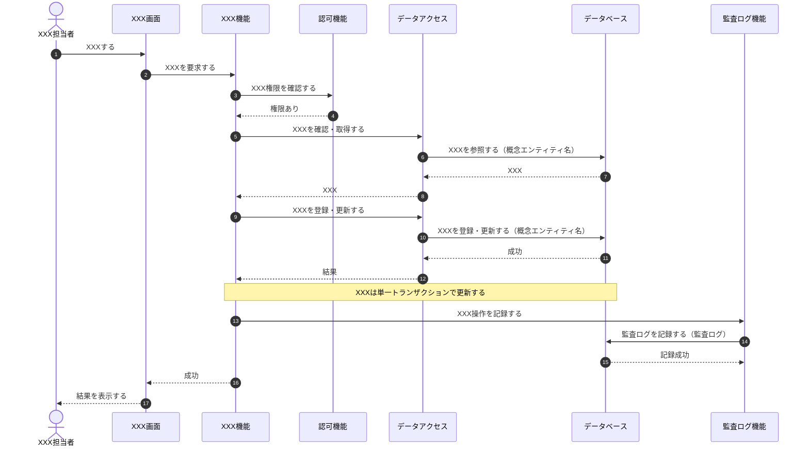
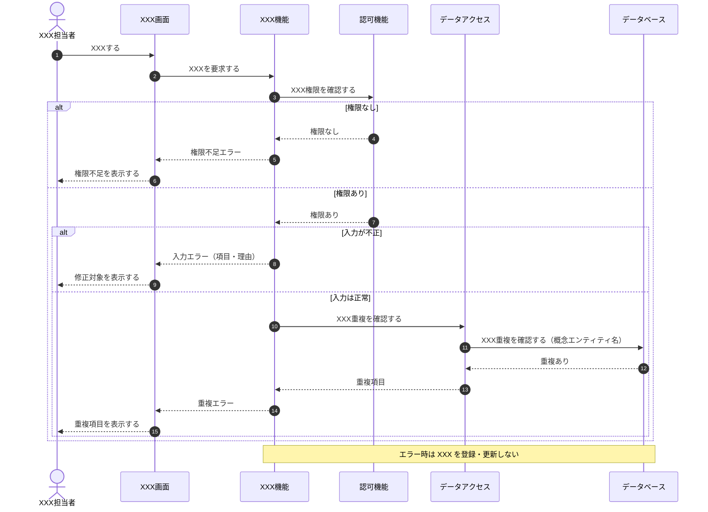
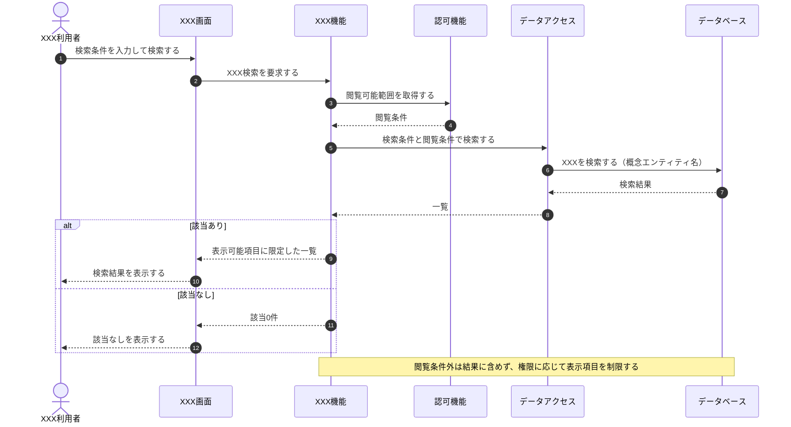
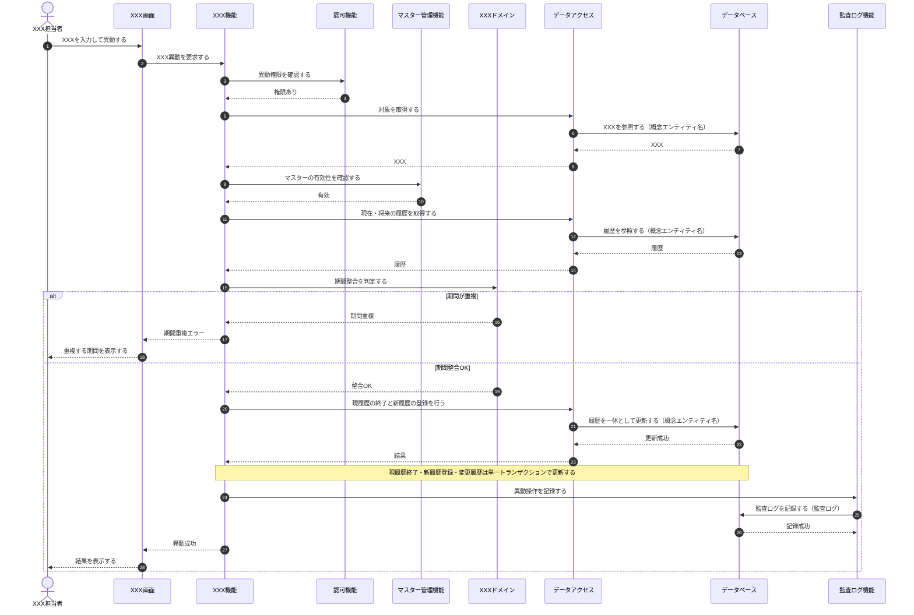

[← テンプレート一覧](README.md)

<!-- 本節は統合設計書「3. シーケンス設計」のテンプレート版。各サブセクション直上の定義ルールコメント(定義内容/定義する条件/項目説明/定義ルール)に従い、空欄プレースホルダを実データで置き換えて使う -->
<!-- シーケンスは連携順序・受け渡し・条件分岐・結果返却の正本。各要素(画面/API/モジュール/データモデル)の詳細仕様は個別節を正本とし、本節へ再記載しない -->
<!-- DBは単一のparticipant「データベース」(alias DB)に集約する。データベースへ向かう往路メッセージの末尾に、参照する概念エンティティ名を全角括弧で列挙する(復路には付けない)。物理テーブル名・カラム名・SQL・メソッド名は書かない -->
<!-- エラー・メッセージは責務レベルの動詞で書く。具体的なERR-ID・MSG-ID・文言・HTTPステータスは図に書かない(採番・文言は §5 API設計/§画面設計 で定義し、トレーサビリティで対応付ける) -->

<!--
【3. シーケンス設計】
定義内容: 主要ユースケースにおける論理構成要素間の連携を、正常系・代替/例外系に分けて時系列(Mermaid sequenceDiagram)で定義し、連携定義(条件分岐・データ参照更新・トランザクション境界)で補足する。
定義する条件: 複数要素の連携・分岐・トランザクションを伴うUCで必須。静的表示・単純CRUDは省略可(§2.4に省略理由を記す)。
項目説明:
- 3.1 論理構成要素: 図に登場するアクター・画面(SCR)・機能/モジュール(M)・データベース・監査などを | 構成要素 | 種別 | ID/参照 | 役割 | で列挙する。
- 3.2〜 各シーケンス: 正常系・代替/例外系を Mermaid sequenceDiagram で示し、直後に連携定義(条件分岐・データ参照更新・トランザクション境界・補足事項)を表で補足する。
定義ルール:
- 各図の直後の条件分岐「根拠」列に、対象UCの状態パターンを完全修飾(UC-XXX/SP-x)で示し、正常/代替/例外の分岐と双方向に網羅する(SP-x の定義は §2.2 が正本)。
- DBは単一participant「データベース」(alias DB)に集約し、往路メッセージ末尾に参照する概念エンティティ名を全角括弧で列挙する(復路には付けない)。
- メッセージは業務上の動詞で書く。物理テーブル名・カラム名・SQL・メソッド名・具体的なERR-ID/MSG-ID・HTTPステータスは図に書かない。
-->
# 3. シーケンス設計

<!--
【3 節冒頭】
定義内容: 本節が扱うシーケンスの範囲と、各主要ユースケースの正常・代替・例外系の割り当てを1〜3行で示す。
定義する条件: 全体で必須。
定義ルール:
- 主要ユースケース(UC-XXX)を根拠とし、上位要件にない振る舞いを追加しない。
- 各状態パターン(UC-XXX/SP-x)は 正常系 / 代替・例外系 のいずれかで表現し、各シーケンス直後の連携定義(条件分岐)の根拠列に完全修飾で紐付ける。
-->

本節は、主要ユースケース XXX の連携(利用者・画面・機能・データアクセス・データベース・監査)を時系列に検証する。各状態パターンは正常系または代替・例外系のいずれかで表現し、各図の直後の連携定義でデータ参照・更新とトランザクション境界を補足する。

<!--
【3.1 論理構成要素】
定義内容: 本節の各シーケンス図に登場する論理構成要素と、本設計での連携責務を一覧化する。
定義する条件: 本節で必須。
項目説明:
- 構成要素: 図に登場する論理要素の日本語名(具体ロール名・画面名・機能名)。
- 種別: アクター / 画面 / 機能 / データアクセス / DB / 監査 のいずれか。
- ID/参照: 対応する設計ID(画面=SCR-XXX、機能=M-XXX)。アクター・DBは「-」。
- 役割: このシーケンス群での連携責務のみを記載する。
定義ルール:
- ロール差がある場合、アクターは「利用者」でなく具体的なロール名にする。
- データベースは単一の「データベース」要素に集約し、データモデルごとに要素を分けない。役割欄に保持する概念エンティティ名(日本語)を列挙する。
- 物理名(英語テーブル名・カラム名・メソッド名)は書かない。概念エンティティは日本語名で表す。
- 役割はこのシーケンスでの連携責務だけを記載する(詳細仕様は各節の正本を参照)。
-->
## 3.1 論理構成要素

| 構成要素 | 種別 | ID/参照 | 役割 |
|---|---|---|---|
| XXX担当者 | アクター | - |  |
| XXX利用者 | アクター | - |  |
| XXX画面 | 画面 | SCR-XXX |  |
| XXX機能 | 機能 | M-XXX |  |
| 認可機能 | 機能 | M-XXX |  |
| データアクセス | データアクセス | M-XXX |  |
| データベース | DB | - | XXX・YYYを保持する |
| 監査ログ機能 | 監査 | M-XXX |  |

<!--
【3.2 <対象>・正常系】
定義内容: 対象ユースケースの正常系(状態パターン SP-1)の連携を、Mermaid sequenceDiagram で時系列に定義し、直後に連携定義を補足する。
定義する条件: 各主要UCで必須。
項目説明:
- 図: autonumber を付し、actor/participant で論理要素を宣言し、往路→復路の連携を業務上の動詞で記す。
- 連携定義: 条件分岐 / データ参照・更新 / トランザクション境界 を小表で補足する。
定義ルール:
- participant は 利用者/画面/機能/データアクセス/DB/監査 等の論理要素とし、データベースは単一 participant(alias DB)に集約する。
- データベースへの往路メッセージ末尾に、参照する概念エンティティ名を全角括弧で列挙する(復路には付けない)。
- メッセージは業務上の動詞にし、変数操作・具体的SQL・物理メソッド名・具体的ERR-ID/MSG-ID・HTTPステータスは書かない。
- 認可確認は更新処理より前に置く。複数エンティティ更新は単一トランザクションとし、トランザクション境界表に記す。
- 本図が表現する状態パターン(UC-XXX/SP-1)を連携定義(条件分岐)の根拠列に完全修飾で記す。
-->
## 3.2 XXX・正常系

**連携定義**

条件分岐

| 条件ID | 判定箇所 | 条件 | 成立時 | 不成立時 | 根拠 |
|---|---|---|---|---|---|
| COND-01 | XXX機能 |  |  | (3.3で表現) | UC-XXX/SP-1 (不成立=SP-x) |

データ参照・更新

| エンティティ | CRUD | 目的 | 実行主体 |
|---|---|---|---|
| XXX | R / C / U / D |  | データアクセス |

トランザクション境界

| 境界ID | 開始 | 終了 | 対象更新 | ロールバック条件 | 管理主体 |
|---|---|---|---|---|---|
| TX-01 |  | COMMIT |  | いずれかの更新に失敗(UC-XXX/SP-x) | XXX機能 |

<!--
【3.3 <対象>・入力不正/重複(代替・例外系)】
定義内容: 対象ユースケースの代替・例外系(権限・入力・マスター・重複・保存異常など)を、alt 分岐を用いた Mermaid sequenceDiagram で定義し、直後に状態パターン対応表を補足する。
定義する条件: 対象UCに代替・例外がある場合に必須(なければ理由を記載)。
項目説明:
- 図: alt/else で各失敗分岐を表現し、正常系(3.2)と同じ判定順で並べる。
- 状態パターン対応: 各分岐がどの状態パターン(UC-XXX/SP-x)に対応し、どの処理を行うかを表で示す。
定義ルール:
- 1つの状態パターンに1つの分岐を対応させ、束ね表現(「または」で複数条件を1分岐)を避ける。
- エラーは責務レベルの動詞で書き、具体的ERR-ID/MSG-ID/文言/HTTPステータスを図に書かない。
- 例外時にデータを更新しないこと(中途半端なデータを残さないこと)を Note で明示する。
-->
## 3.3 XXX・入力不正/重複

**状態パターン対応**

| 分岐 | 条件 | 状態パターン | 本シーケンスでの処理 |
|---|---|---|---|
| a |  | UC-XXX/SP-x |  |

<!--
【3.4 <対象>・検索(参照系)】
定義内容: 対象ユースケースの検索・参照連携を Mermaid sequenceDiagram で定義し、直後に連携定義を補足する。
定義する条件: 検索・参照系UCで必須。
項目説明:
- 図: 認可(閲覧可能範囲)取得→条件検索→表示項目の限定→表示、の順で記す。
- 連携定義: 条件分岐 / データ参照・更新 / トランザクション境界(参照のみは理由付きで「なし」)。
定義ルール:
- 認可(閲覧可能範囲)取得を検索より前に置く。閲覧条件外は結果に含めないことを表現する。
- 個人情報保護のため、権限に応じて表示項目を制限することを Note で明示する。
- 参照のみでトランザクション更新がない場合は、トランザクション境界を理由付きで「なし」とする。
-->
## 3.4 XXX・検索

**連携定義**

条件分岐

| 条件ID | 判定箇所 | 条件 | 成立時 | 不成立時 | 根拠 |
|---|---|---|---|---|---|
| COND-01 | XXX機能 |  |  |  | UC-XXX/SP-x |

データ参照・更新

| エンティティ | CRUD | 目的 | 実行主体 |
|---|---|---|---|
| XXX | R |  | データアクセス |

トランザクション境界

| 内容 |
|---|
| なし(参照のみ。更新を伴わないため) |

<!--
【3.5 <対象>・異動(期間整合)】
定義内容: 対象ユースケースの更新連携(履歴の期間整合を伴うもの)を Mermaid sequenceDiagram で定義し、直後に連携定義を補足する。
定義する条件: 履歴の期間整合・複数エンティティ更新を伴うUCで必須。
項目説明:
- 図: 権限確認→対象状態確認→マスター有効性→期間整合判定→履歴の終了と新規登録→変更履歴・監査、の順で記す。
- 連携定義: 条件分岐(各失敗を状態パターンに紐付け) / データ参照・更新 / トランザクション境界。
定義ルール:
- 期間整合の判定(既存履歴との重複がないこと)を明示的なステップとして置く。
- 現履歴の終了と新履歴の登録・変更履歴を単一トランザクションで更新し、トランザクション境界表に記す。
- 監査ログは業務トランザクションと別に記録することを補足に記す。
-->
## 3.5 XXX・異動

**連携定義**

条件分岐

| 条件ID | 判定箇所 | 条件 | 成立時 | 不成立時 | 根拠 |
|---|---|---|---|---|---|
| COND-01 | XXX機能 |  |  |  | UC-XXX/SP-x |

データ参照・更新

| エンティティ | CRUD | 目的 | 実行主体 |
|---|---|---|---|
| XXX | R / U / C |  | データアクセス |

トランザクション境界

| 境界ID | 開始 | 終了 | 対象更新 | ロールバック条件 | 管理主体 |
|---|---|---|---|---|---|
| TX-01 |  | COMMIT |  |  | XXX機能 |

補足事項

| 観点 | 内容 |
|---|---|
| 同期/非同期 |  |
| 排他制御 |  |
| 監査ログ |  |
