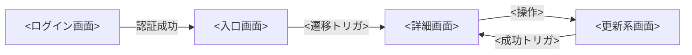

[← テンプレート一覧](README.md)

<!-- 本節は統合設計書「4. 画面設計」のテンプレート版。各セクション/サブセクション直上の HTMLコメント(定義内容 / 定義する条件 / 項目説明 / 定義ルール)を読んでから該当セクションを記入する。 -->
<!-- モック画像は本統合文書では省略し、項目表(4.3.2)と状態表(4.3.3)で画面構成を示す。モックは詳細設計で作成する。 -->
<!-- 表示文言は各画面の「メッセージ一覧」節に MSG-XX としてインライン定義し、本文各所では MSG-XX で参照する(文言の重複記載は禁止)。 -->

<!--
【4. 画面設計】
定義内容: システムが提供する画面の一覧・遷移と、代表画面の基本情報・項目・状態・操作仕様・メッセージを定義する。シーケンス(§3)のユーザー操作・入力・API呼出契機・表示を画面へ具体化する。
定義する条件: 画面を持つシステムで必須。
項目説明:
- 4.1 画面一覧: 画面を | 画面ID(SCR-XXX) | 画面名 | 目的 | 主な利用者 | で列挙する。
- 4.2 画面遷移: 画面間の遷移をフローチャート(Mermaid)で示す。
- 4.3 代表画面: 画面基本情報・画面項目(ITM-XX)・画面状態(対応状態パターンSP-xを併記)・操作仕様・メッセージ一覧(MSG-XX)を定義する。
- 4.4 その他の主要画面: 主要項目を表で示す。
定義ルール:
- 画面ID(SCR-XXX)は採番の最大値+1。トレース元のUC(FR/UC)と対応させる。
- 状態パターン(SP-x)は §2.2 を正本として完全修飾 UC-XXX/SP-x で参照する(画面側で再定義しない)。
- 表示文言は「メッセージ一覧」節に MSG-XX でインライン定義し、本文では MSG-XX で参照する(文言の重複記載は禁止)。
- モックは詳細設計で作成する。APIの内部処理・DB構造は書かない。
-->
# 4. 画面設計

<!--
【4.1 画面一覧】
定義内容: 本システムの全画面を一覧化し、識別情報・目的・主な利用者を示す。
定義する条件: 画面設計節で必須。全画面(SCR-XXX)を1行ずつ記載する。
項目説明:
- 画面ID: 画面の識別子(SCR-XXX の連番)。
- 画面名: 画面の日本語名称。
- 目的: 画面の役割(1行)。
- 主な利用者: 画面を主に利用するロール。
定義ルール:
- 画面ID は SCR-XXX の連番。全画面を漏れなく記載する。
- 主な利用者はロール名で記載する(人事担当者 / 部門管理者 / 一般社員 / システム管理者 / 全利用者)。
- 個別画面の詳細(項目・状態・操作・メッセージ)は 4.3 以降で定義する。
-->
## 4.1 画面一覧

| 画面ID | 画面名 | 目的 | 主な利用者 |
|---|---|---|---|
| SCR-001 |  |  |  |
| SCR-XXX |  |  |  |

<!--
【4.2 画面遷移】
定義内容: 画面間の遷移関係を図で示し、どの操作でどの画面へ遷移するかを俯瞰する。
定義する条件: 画面設計節で必須。主要な画面遷移を Mermaid flowchart で記載する。
項目説明:
- ノード: 画面(画面名)。ノードIDは SCR-XXX に対応させる。
- エッジラベル: 遷移のトリガ(操作・イベント・処理結果)。
定義ルール:
- Mermaid flowchart で記載する。ノードは画面名、エッジラベルは遷移トリガとする。
- 遷移の起点(ログイン後の入口)と、登録・更新・異動・退職の成功後の戻り先を明示する。
- 個々のイベント詳細(呼び出しAPI・成否時挙動)は各画面の操作仕様(4.3.4)で定義し、図には書かない。
-->
## 4.2 画面遷移

<!--
【4.3 <代表画面名>】
定義内容: 代表画面を現行粒度(基本情報・項目・状態・操作・メッセージ)で詳細定義する。
定義する条件: 登録・更新など入力を伴う代表画面で定義する。サブ節は 4.3.1〜4.3.5 で構成する。
項目説明:
- 4.3.1 画面基本情報 / 4.3.2 画面項目 / 4.3.3 画面状態 / 4.3.4 操作仕様 / 4.3.5 メッセージ一覧。
定義ルール:
- モック画像は本統合文書では省略し、項目表(4.3.2)と状態表(4.3.3)で画面構成を示す。モックは詳細設計で作成する。
- トレース元のシステムユースケース(UC-XXX)・呼び出しAPI(API-XXX)を明記し、詳細仕様は再掲しない。
- 物理名(英語のテーブル名・カラム名・メソッド名)は書かない。制約は日本語の業務名で表す(例: 社員番号の一意性)。
- 表示文言は 4.3.5 に MSG-XX として定義し、本文各所では MSG-XX で参照する(文言の重複記載は禁止)。
-->
## 4.3 <代表画面名>

<!--
【4.3.1 画面基本情報】
定義内容: この画面の識別情報と属性(ID・名称・目的・トレース元・権限・表示契機・呼び出しAPI・正常終了)を示す。
定義する条件: 詳細定義する画面で必須。
項目説明:
- 画面ID: 画面の識別子(SCR-XXX)。
- 画面名: 画面の日本語名称。
- 目的: 画面の役割(1〜3行)。
- トレース元: 実現するシステムユースケースの完全修飾ID(UC-XXX、対応機能 F-XXX)。
- 表示権限: 画面を利用できるロール。
- 表示契機: 画面が表示される契機(遷移元・操作)。
- 呼び出しAPI: 初期表示・主操作で呼び出す API-ID。
- 正常終了: 主操作成功時の遷移先(SCR-XXX)。
定義ルール:
- 画面ID は SCR-XXX、トレース元は UC-XXX、呼び出しAPI は API-XXX、遷移先は SCR-XXX で参照する。
- 表示権限はロール名を明記する。
-->
### 4.3.1 画面基本情報

| 項目 | 内容 |
|---|---|
| 画面ID | SCR-XXX |
| 画面名 |  |
| 目的 | (1〜3行) |
| トレース元 | UC-XXX(F-XXX) |
| 表示権限 |  |
| 表示契機 |  |
| 呼び出しAPI | 初期表示: API-XXX / 主操作: API-XXX |
| 正常終了 | SCR-XXX へ遷移 |

<!--
【4.3.2 画面項目】
定義内容: 画面に配置する各項目(入力・表示・ボタン)の一覧と属性を示す。
定義する条件: 画面に項目がある場合に定義する。項目ごとに1行を記載する。
項目説明:
- 項目ID: 画面内で一意な項目ID(ITM-XX の連番)。
- 項目名: 項目の日本語表示名。
- 種別: 項目の種類(テキスト / 選択 / 日付 / ボタン / 表示 / 一覧 / 操作 など)。
- 必須: 入力必須か(必須 / 任意 / ―)。ボタン・表示は「―」。
- 入力・表示規則: 入力形式・選択元(API-XXX)・活性条件・業務制約などの規則。
定義ルール:
- 項目ID は ITM-XX の連番で画面内一意とする。物理名(英語カラム名)は書かない。
- 選択肢が区分値の場合は共通コード定義を参照し、値・表示名を再記載しない。選択元がマスターの場合は取得APIを API-XXX で示す。
- 一意性など業務制約は日本語の業務名で表す(例: 社員番号の一意性)。UI部品・レイアウト詳細は詳細設計で定義する。
-->
### 4.3.2 画面項目

| 項目ID | 項目名 | 種別 | 必須 | 入力・表示規則 |
|---|---|---|---|---|
| ITM-01 |  | テキスト / 選択 / 日付 / ボタン / 表示 | 必須 / 任意 / ― |  |

<!--
【4.3.3 画面状態】
定義内容: 画面が取りうる状態ごとに、入力可否・主操作ボタンの活性・主な表示を示し、トレース元UCの状態パターン(SP-x)と対応付ける。
定義する条件: 状態遷移を持つ画面で定義する。状態ごとに1行を記載する。
項目説明:
- 状態: 画面状態の名称(初期表示 / 入力中 / 処理中 / 各エラー / 成功 など)。
- 入力項目: その状態での入力可否(編集可 / 編集不可)。
- 主操作ボタン: 主操作ボタンの活性状態(活性 / 無効 / 条件付き活性)。
- 主な表示: その状態で表示する内容(MSG-XX を参照)。
- 対応状態パターン: 対応するシステムユースケースの状態パターン(UC-XXX/SP-x)。
定義ルール:
- 主な表示に文言を出す場合は 4.3.5 の MSG-XX を参照し、文言を再記載しない。
- 全ての正常・代替・例外に対応する状態を網羅し、対応状態パターン列で UC-XXX/SP-x と双方向に対応付ける。
- 一意制約違反(重複)・権限不足・システムエラーなど、代替/例外フローに対応する状態を漏れなく記載する。
-->
### 4.3.3 画面状態

| 状態 | 入力項目 | 主操作ボタン | 主な表示 | 対応状態パターン |
|---|---|---|---|---|
| <状態名> | 編集可 / 編集不可 | 活性 / 無効 / 条件付き活性 | MSG-XX 等 | UC-XXX/SP-X |

<!--
【4.3.4 操作仕様】
定義内容: 主操作(登録・更新など)の手順を、入力チェック・API呼び出し・成否時の状態遷移・表示メッセージの順で示す。
定義する条件: 操作を伴う画面で定義する。操作ごとに手順を番号付きで記載する。
項目説明:
- 手順: 利用者操作 → クライアント側チェック → API呼び出し(API-XXX) → 応答別の状態遷移(4.3.3)・表示(MSG-XX)。
定義ルール:
- クライアント側チェックのみ本節に記載し、サーバ側バリデーションは API 設計(5章)に定義する。
- 呼び出しAPIは API-XXX、遷移先は SCR-XXX、表示文言は MSG-XX で参照する(文言は再記載しない)。
- 二重送信防止(応答待ち中の入力・ボタン無効化)、応答不明時の再操作抑止を必ず記載する。
- 業務エラー(入力不備・重複・マスター無効・権限不足)とシステムエラーを区別して手順化する。
-->
### 4.3.4 操作仕様

#### <操作名>

1. 利用者が必須項目(ITM-XX)を入力する。
2. クライアント側チェックを行い、違反時は入力エラー状態(MSG-XX)とし送信しない。
3. API-XXX を呼び出す。応答待ち中は入力・主操作ボタンを無効化し二重送信を防止する。
4. <業務エラー応答時の状態遷移・表示(MSG-XX)>。
5. <権限不足応答時の状態遷移・表示(MSG-XX)>。
6. 成功時は SCR-XXX へ遷移し、MSG-XX を表示する。
7. 応答不明・システムエラー時は MSG-XX を表示し、再操作による重複を防止する。

<!--
【4.3.5 メッセージ一覧】
定義内容: この画面で表示するメッセージ(完了・確認・警告・エラー・情報)を MSG-XX としてインライン定義する。本文各所(4.3.3・4.3.4)からは MSG-XX で参照する。
定義する条件: 画面に表示するメッセージがある場合に定義する。無ければ行に「なし」を記載する。
項目説明:
- MSG ID: メッセージの識別子(MSG-XX の連番)。
- 種別: メッセージの種類(完了 / 確認 / 警告 / エラー / 情報)。
- 文言: 実際に画面表示する文言。この節を正本とし、本文では MSG-XX で参照する。
- 対応ERR: エラーメッセージの場合、契機となる 5章 API設計のエラーコード。エラー起因でなければ「-」。
定義ルール:
- 文言はこの節にのみ記載し、本文の他セクションでは MSG-XX で参照する(文言の重複記載は禁止)。
- 対応ERR には、その MSG が表示される契機となる 5章 のエラーコードを記載する(エラー起因でなければ「-」)。
-->
### 4.3.5 メッセージ一覧

| MSG ID | 種別 | 文言 | 対応ERR |
|---|---|---|---|
| MSG-XX | 完了 / 確認 / 警告 / エラー / 情報 |  | <エラーコード> / - |

<!--
【4.4 <検索画面名>】
定義内容: 検索系代表画面の基本情報と主要項目を示す。
定義する条件: 一覧検索を行う代表画面で定義する。
項目説明:
- 基本情報: 画面ID・画面名・目的・トレース元(UC-XXX)・表示権限・呼び出しAPI。
- 主要項目: 項目ID / 項目名 / 種別 / 説明。
定義ルール:
- 検索条件・一覧・遷移操作・出力を主要項目として列挙する。選択元マスターは取得API(API-XXX)を示す。
- 権限による表示範囲の制御方針を明記する(表示可能項目・閲覧可能範囲)。詳細な検索方式・レイアウトは詳細設計で定義する。
-->
## 4.4 <検索画面名>

| 項目 | 内容 |
|---|---|
| 画面ID | SCR-XXX |
| 画面名 |  |
| 目的 | (1〜2行) |
| トレース元 | UC-XXX(F-XXX) |
| 表示権限 |  |
| 呼び出しAPI | 初期表示: API-XXX / 検索: API-XXX |

| 項目ID | 項目名 | 種別 | 説明 |
|---|---|---|---|
| ITM-01 |  | 入力 / 選択 / ボタン / 一覧 / 操作 |  |
