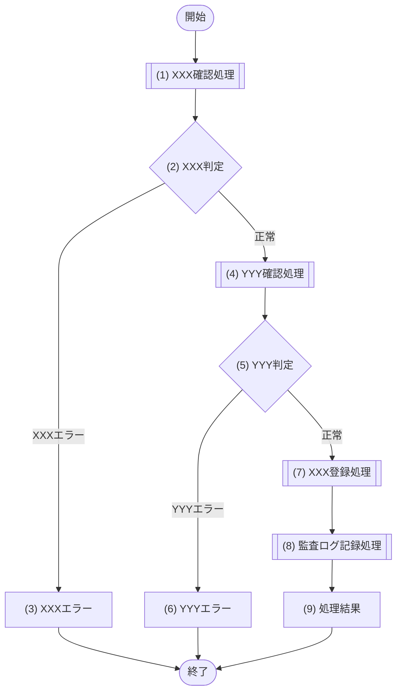

[← テンプレート一覧](README.md)

<!-- 本節は統合設計書「5. API設計」のテンプレート版。各見出し(##/###)直上のコメントに「定義内容(そのセクションの意味)」「定義する条件」「項目説明(各列・各項目の意味)」「定義ルール」をセットで記載する。編集時はコメントを読んでから該当セクションの空欄プレースホルダを埋める -->
<!-- API設計は、上位のシステムユースケース(F-XXX/UC-XX)と業務要求(BR-XXX)・非機能要求(NFR-XXX)を根拠に、各APIの入出力・認可・エラー・処理フローを物理仕様へ具体化する。認証・認可・入力バリデーションは全API共通の前処理として個別APIの処理フロー外で行い、個別処理フローには業務処理(存在確認・重複・マスター有効性・保存・監査など)のみを記載する -->
<!-- §5 では JSON のキー名・APIパスなど、API仕様上必要な物理名の使用を可とする(§6 データベース設計以外での物理名禁止の例外)。それ以外の内部メソッド名・カラム物理名は書かない -->

<!--
【5. API設計】
定義内容: システムが提供するAPIの設計方針・一覧と、代表APIの入出力・処理フロー・エラー定義・更新競合方針を定義する。シーケンス(§3)の呼出元・要求/応答・認可・呼び出すモジュール・トランザクション責務をAPI仕様へ具体化する。
定義する条件: APIを持つシステムで必須。
項目説明:
- 5.1 API設計方針: 認証・認可・個人情報返却・エラー区別・ページング等の共通方針を箇条書きで示す。
- 5.2 API一覧: | API-ID | Method | Path | 目的 | 主な権限 | で列挙する。
- 5.3 代表API: 基本情報・リクエスト/レスポンス例・処理フロー(Mermaid)・エラー定義を定義する。
- 5.4 検索系API: リクエストパラメーター・レスポンス概要・ページングを定義する。
- 5.5 更新競合方針: バージョン比較等による競合検知方針を示す。
定義ルール:
- API-ID は採番の最大値+1。メソッド・パスは実装と一致させる。トレース元のUCと対応させる。
- 処理フローは、認証・認可・入力バリデーションを共通前処理として個別フロー外とし、業務処理(存在確認・重複・マスター有効性・保存・監査)のみを判定/処理/エラー/処理結果ノードで表す。
- §5 では JSON のキー名・APIパスなど API仕様上必要な物理名を可とする(§6以外での物理名禁止の例外)。内部メソッド名・カラム物理名は書かない。
-->
# 5. API設計

<!--
【5.1 API設計方針】
定義内容: 本システムの全APIに共通して適用する設計上の方針を、箇条書きで列挙する。
定義する条件: 必須。
項目説明:
- 各項目: 認証・認可・個人情報保護・エラー区別・更新競合・ページング・監査・物理形式など、API横断で守る方針を1項目1ポイントで記載する。
定義ルール:
- 方針は非機能要求(NFR-XXX)・業務要求(BR-XXX)と対応づけて記載する。
- 実装方式・フレームワーク・具体的なライブラリ名は書かず、詳細設計で確定する旨にとどめる。
-->
## 5.1 API設計方針

- (認証に関する方針を記載する)
- (認可に関する方針を記載する)
- (個人情報の返却に関する方針を記載する)
- (業務エラーとシステムエラーの区別に関する方針を記載する)
- (更新競合検知に関する方針を記載する)
- (一覧APIのページングに関する方針を記載する)
- (監査記録に関する方針を記載する)
- (物理形式・詳細設計への引継ぎに関する方針を記載する)

<!--
【5.2 API一覧】
定義内容: 本システムが提供する全APIを一覧化し、識別子・HTTPメソッド・パス・目的・主な権限を示す。
定義する条件: 必須。
項目説明:
- API-ID: APIの識別子(API-XXX 連番)。ID台帳と厳密一致させる。
- Method: HTTPメソッド(GET / POST / PUT / PATCH / DELETE)。1エンドポイントで複数メソッドを持つ場合は「POST・PUT」のように併記する。
- Path: エンドポイントのURLパス。パスパラメータは `{xxxId}` で示す。
- 目的: APIの目的(体言止めで簡潔に)。
- 主な権限: 呼び出しを許可する主なロール、または認可条件(認証前/認証済み利用者/特定ロール)。
定義ルール:
- API-ID・Path・Method は実装およびID台帳と一致させる。
- 認可の詳細(ロール別可否・本人条件)は各API §5.3.1 基本情報および権限設計を正本とし、本一覧には主な権限のみ記載する。
-->
## 5.2 API一覧

| API-ID | Method | Path | 目的 | 主な権限 |
|---|---|---|---|---|
| API-XXX | GET / POST / PUT | `/api/xxx` |  |  |
| API-XXX | GET | `/api/xxx/{xxxId}` |  |  |

<!--
【5.3 XXX API】(代表APIの詳細)
定義内容: 代表となる個別API1件について、基本情報・リクエスト/レスポンス例・処理フロー・エラー定義を現行粒度で詳細化する。
定義する条件: 登録・更新など副作用を持ち、業務処理の分岐・エラーが複数あるAPIを代表として1件詳細化する。
構成: 5.3.1 基本情報 / 5.3.2 リクエスト例 / 5.3.3 正常レスポンス例 / 5.3.4 エラーレスポンス例 / 5.3.5 処理フロー / 5.3.6 エラー定義。
定義ルール(セクション共通):
- JSON例はAPI仕様上のキー名(物理名)を用いてよい。値はサンプル値を用いる。
- 認証・認可・入力バリデーションは共通前処理のため §5.3.5 処理フローには記載せず、業務処理のみを記載する。
-->
## 5.3 XXX API

<!--
【5.3.1 基本情報】
定義内容: このAPIの識別情報と属性(ID・メソッド・パス・目的・権限・トレース元・冪等性・正常応答・主な業務エラー)を一覧で示す。
定義する条件: 詳細化する代表APIで必須。
項目説明:
- API-ID / Method / Path: §5.2 API一覧と一致させる。
- 目的: APIの目的(1〜2行)。
- 実行権限: このAPIを実行できるロール(本人条件がある場合は併記)。
- トレース元: このAPIが実現するシステムユースケースの完全修飾ID(F-XXX / UC-XX)。
- 冪等性: 同一リクエスト再送時の安全性(あり / なし。なしの場合は二重登録防止手段を記載)。
- 正常応答: 成功時のHTTPステータス(200 / 201 / 204)。
- 主な業務エラー: このAPI固有の業務エラーの要約。
定義ルール:
- トレース元は F-XXX / UC-XX の完全修飾IDで記載し、ID台帳と一致させる。
-->
### 5.3.1 基本情報

| 項目 | 内容 |
|---|---|
| API-ID | API-XXX |
| Method | POST / PUT |
| Path | `/api/xxx` |
| 目的 |  |
| 実行権限 |  |
| トレース元 | F-XXX / UC-XX |
| 冪等性 | あり / なし(なしの場合は二重登録防止手段を記載) |
| 正常応答 | 200 / 201 / 204 |
| 主な業務エラー |  |

<!--
【5.3.2 リクエスト例】
定義内容: このAPIへ送信するリクエストボディのJSON例を示す。
定義する条件: リクエストボディを受け取るAPIで定義する。ボディが無い場合は「なし」と記載する。
項目説明:
- JSON: 実際に送信する形のサンプル。ネスト構造はオブジェクトで表現する。
定義ルール:
- キー名はAPI仕様上の物理名でよい。値はサンプル値とし、実データを固定値として断定しない。
- 項目ごとの型・必須・制約はバリデーション設計(共通前処理)を正本とし、本例では構造の提示にとどめる。
-->
### 5.3.2 リクエスト例

```json
{
  "xxx": "XXX",
  "nested": {
    "yyy": "YYY"
  }
}
```

<!--
【5.3.3 正常レスポンス例】
定義内容: このAPIが成功したときに返すレスポンスボディのJSON例を示す。
定義する条件: 成功時にボディを返すAPIで定義する。204等でボディが無い場合はHTTPステータスのみ記載する。
項目説明:
- JSON: 成功時に返す形のサンプル。更新競合検知に用いるバージョン等を含める場合は記載する。
定義ルール:
- キー名はAPI仕様上の物理名でよい。
- 個人情報は利用目的に必要な項目のみを返す方針(§5.1)に沿った項目構成とする。
-->
### 5.3.3 正常レスポンス例

```json
{
  "xxxId": "XXX",
  "status": "XXX",
  "version": 1
}
```

<!--
【5.3.4 エラーレスポンス例】
定義内容: このAPIが業務エラー時に返すエラーレスポンスボディのJSON例を示す。
定義する条件: 業務エラーを返すAPIで定義する。
項目説明:
- errorCode: エラーコード(§5.3.6 エラー定義のコード)。
- message: 利用者向けメッセージ。
- fieldErrors[]: 項目単位のエラー明細(field / reason)。項目に閉じないエラーは空配列でよい。
- traceId: 問い合わせ・ログ相関に用いる追跡ID。
定義ルール:
- エラーコードは §5.3.6 エラー定義と一致させる。
- エラー応答に内部構造・スタックトレース・機密情報を含めない。
-->
### 5.3.4 エラーレスポンス例

```json
{
  "errorCode": "XXX_ERROR",
  "message": "XXX",
  "fieldErrors": [
    { "field": "xxx", "reason": "XXX" }
  ],
  "traceId": "trace-XXX"
}
```

<!--
【5.3.5 処理フロー】
定義内容: このAPIの業務処理の流れ(開始から終了まで、分岐と各処理の順序)を mermaid フローチャート(flowchart TD)で俯瞰する。
定義する条件: 詳細化する代表APIで必須。
項目説明(フロー要素):
- 開始 / 終了: フローの開始・終了ノード([開始] / [終了])。
- 呼び出しノード [["(n) 処理名"]]: モジュール(M-XXX)へ委譲する処理(存在確認・重複確認・マスター有効性確認・保存・監査記録など)。二重角括弧(サブルーチン形状)で記す。
- 処理ノード ["(n) 処理名"]: 委譲を伴わない内部処理、および末尾の「処理結果」ブロック。矩形で記す。
- 判定ノード {"(n) 判定名"}: 連番付きの分岐。
- エラーノード ["(n) XXXエラー"]: エラーレスポンスを返却する終端ステップ(番号付き矩形)。名称はトリガとなる判定・処理の観点＋「エラー」。
- エッジラベル: 分岐結果(正常 / エラー観点など)。
定義ルール:
- 認証・認可・入力バリデーション(必須・型・形式・単項目制約・項目間相関)は全API共通の前処理として本フローに記載しない。
- 業務処理(存在確認・重複・マスター有効性・保存・監査など DB参照や業務ルールを伴う処理)から開始する。
- 処理の結果を見て分岐する場合は、処理ノードから直接分岐させず、処理の直後に判定ノードを置く(処理と判定を分ける)。
- 各ノードはフローチャートの出現順に (1)(2)… で通し番号を付ける。エラーノード・処理結果もこの連番に含める。
- ノード・エッジラベルには処理名・判定結果だけを短く記載し、呼び出し先・ステータス値・詳細は書かない。
- フロー直下の補足表で、各ノードの種別・内容・呼出モジュールを対応づける(粒度確保のため)。
-->
### 5.3.5 処理フロー

認証・認可・入力バリデーションは全APIの共通前処理として本フローの前段で実施するため、本フローには業務処理のみを示す。



| ノード | 種別 | 内容 | 呼出モジュール |
|---|---|---|---|
| (1) XXX確認処理 | 処理 |  | M-XXX |
| (2) XXX判定 | 判定 |  | ― |
| (3) XXXエラー | エラー |  | ― |
| (4) YYY確認処理 | 処理 |  | M-XXX |
| (5) YYY判定 | 判定 |  | ― |
| (6) YYYエラー | エラー |  | ― |
| (7) XXX登録処理 | 処理 |  | M-XXX |
| (8) 監査ログ記録処理 | 処理 |  | M-XXX |
| (9) 処理結果 | 処理結果 |  | ― |

<!--
【5.3.6 エラー定義】
定義内容: このAPIが返すエラーを、HTTPステータス・エラーコード・意味の対応で一覧化する。
定義する条件: 詳細化する代表APIで必須。
項目説明:
- HTTP: 返却するHTTPステータスコード。
- エラーコード: レスポンスボディの errorCode に設定するコード。
- 意味: エラーの発生条件・意味。
定義ルール:
- 共通前処理で返すエラー(未認証・権限なし・入力不正)と、このAPI固有の業務エラーの双方を記載する。
- HTTPステータスは意味に整合させる(入力=400、未認証=401、権限=403、競合・重複=409、内部異常=500 など)。
-->
### 5.3.6 エラー定義

| HTTP | エラーコード | 意味 |
|---:|---|---|
| 400 | VALIDATION_ERROR |  |
| 401 | UNAUTHENTICATED |  |
| 403 | FORBIDDEN |  |
| 409 | XXX_DUPLICATED |  |
| 500 | INTERNAL_ERROR |  |

<!--
【5.4 XXX検索API】(一覧取得APIの詳細)
定義内容: 代表となる一覧取得API1件について、リクエストパラメーター・レスポンス概要・ページングを示す。
定義する条件: 一覧取得APIがある場合に1件詳細化する。
構成: リクエストパラメーター表 / レスポンス概要(JSON) / ページング。
項目説明:
- リクエストパラメーター表: パラメーター名 / 必須 / 説明。検索条件・ページング用パラメータを含める。
- レスポンス概要: items配列＋ページング情報のJSON例。
- ページング: 既定値・上限・返却する件数情報の方針。
定義ルール:
- 検索条件は権限範囲内に限定する方針(§5.1)を反映する。
- ページングのパラメータ名・既定値・上限を明示する。
-->
## 5.4 XXX検索API

### リクエストパラメーター

| パラメーター | 必須 | 説明 |
|---|---:|---|
| xxx | 任意 |  |
| page | 任意 | ページ番号(1始まり) |
| pageSize | 任意 | 1ページの件数(既定XX、上限XX) |

### レスポンス概要

```json
{
  "items": [
    { "xxxId": "XXX", "displayName": "XXX", "status": "XXX" }
  ],
  "page": 1,
  "pageSize": 20,
  "total": 0,
  "hasNext": false
}
```

### ページング

- (ページング用パラメータ・既定値・上限・返却する件数情報の方針を記載する)

<!--
【5.5 更新競合方針】
定義内容: 更新系APIにおける同時更新(競合更新)の検知方針を定義する。
定義する条件: 更新系API(更新・異動・退職など状態を変えるAPI)がある場合に必須。
項目説明:
- 検知方法: 競合を検知する手段(バージョン比較など)。
- 対象API: 競合検知を適用するAPI。
- 競合時の応答: 競合検知時に返すHTTPステータス・エラーコードと利用者への要求(再取得など)。
定義ルール:
- 取得時と更新時のバージョンを比較して競合を検知する方針を記載する。
- 競合時は上書きせず、最新情報の再取得を要求する方針とする。
-->
## 5.5 更新競合方針

(更新系APIの競合更新検知方針を記載する。取得時のバージョンと更新時のバージョンを比較し、他の利用者による更新があれば競合として扱う旨を定義する)

| 対象API | 検知方法 | 競合時の応答 |
|---|---|---|
| API-XXX |  |  |
