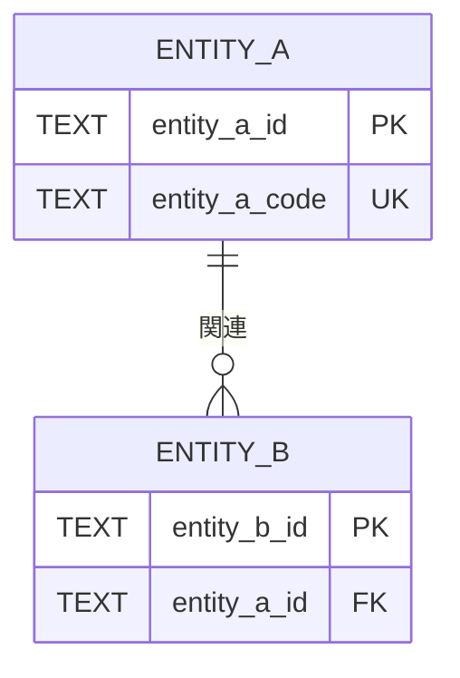

[← テンプレート一覧](README.md)

<!-- 本節は統合設計書「6. データベース設計」の詳細テンプレート。Cloudflare D1（SQLite）の全テーブル、物理カラム、制約、インデックス、trigger、FTS5、原子実行境界、migrationを確定する。 -->
<!-- テーブル・カラム・DDLの正本は本節、M-006が実行するランタイムSQL本文の正本は§9とする。D1 bindingへのアクセスはM-006だけに許可し、API・JOB・他モジュールからの直接・間接アクセスを禁止する。 -->

# 6. データベース設計

<!-- 必須。D1/SQLiteで固定する事項と環境差分を分離し、PostgreSQL等の別DBMSを前提とする型・演算子・拡張・ロックを混在させない。 -->
## 6.1 採用DBMS・物理設計方針

| 項目 | 設計 |
|---|---|
| DBMS / SQL方言 | Cloudflare D1 / SQLite SQL |
| Workers binding | binding名は `DB`。`env.DB`を受領・参照できるのはM-006だけとし、環境別database ID・preview IDは§12で管理する |
| 実行API | M-006だけがD1 Workers Binding APIの `prepare()`、`bind()`、`first()` / `all()` / `run()` / `raw()`、`batch()`を使用する |
| 本番plan・実行予算 | Cloudflare Workers Paid。D1のhard limitは1 Worker invocation当たり1,000 Statement、Queue consumerの内部予算は900 Statementとする。`batch()`内の各Statement、再読込み、即時再試行も1件ずつ実測値へ加算し、残り100件を制御・障害確認用に予約する |
| bind上限 | 1 Statement当たり最大100値。placeholderを使うSQLは `?1`〜`?N`（`1 <= N <= 100`）を欠番なく定義し、`.bind()`引数数をNと一致させる |
| 文字コード | UTF-8。文字列の業務正規化規則は§7、検索用正規化・照合規則は本節と§9で一致させる |
| 物理型 | SQLiteの `INTEGER` / `REAL` / `TEXT` / `BLOB` / `NULL`だけを使用し、原則 `STRICT` tableとする |
| 日付・日時 | 日付は `TEXT` の `YYYY-MM-DD`、日時はUTC正規化した `TEXT` のISO 8601とする。書式、精度、比較・ソート可能性、生成主体を列ごとに定義する |
| 主キー | 原則アプリケーション生成の不変IDを `TEXT` で保持し、形式 `CHECK` と一意性を定義する。採番方式をテーブルごとに記載する |
| 真偽値 | `INTEGER NOT NULL CHECK (value IN (0, 1))`。Workersとの境界でBooleanと0/1の変換をM-006に集約する |
| JSON | 必要時だけ `TEXT` で保持し、`CHECK (json_valid(column))`、許可構造、NULL方針、検索・index方針を定義する |
| 外部キー | 全参照関係に `FOREIGN KEY` と `ON DELETE` / `ON UPDATE` 方針を定義する。D1の外部キー検査を無効化するランタイム処理は禁止する |
| 楽観ロック | `version INTEGER`を条件付きUPDATEのWHEREへ含め、D1結果の変更行数1を成功、0を競合としてM-006から論理例外へ変換する |
| 論理削除 | 必要性、削除日時、検索除外条件、UNIQUE/INDEXへの影響をテーブル単位で定義する。安易に全表へ付与しない |
| 原子実行 | 単一StatementはD1の自動コミット。複数Statementを不可分にする場合は、M-006がPrepared Statementを構築・bindし、1回の `env.DB.batch()` で実行する |
| 競合・整合性 | 条件付きDML、UNIQUE、FOREIGN KEY、CHECK、trigger、冪等キーで保証する。`FOR UPDATE`、advisory lock、分離レベル、SERIALIZABLE、排他制約を前提にしない |
| DBアクセス境界 | `API / JOB → 業務モジュール → M-006 → env.DB → SQL-ID → D1`。API・JOB・M-006以外のモジュールはD1オブジェクト、TBL-ID、SQL-ID、物理名を受領しない |

### 6.1.1 論理型・SQLite物理型マッピング

| 論理値 | SQLite物理型 | 保存形式・制約 | Workers/M-006変換時の注意 |
|---|---|---|---|
| ID | TEXT | 採番方式に対応する長さ・文字集合のCHECK、PK/UNIQUE | 文字列のままbindし、数値へ暗黙変換しない |
| 文字列 | TEXT | NOT NULL、最大長、空文字可否、正規化済み条件 | `undefined`をbindしない。省略とNULLを公開IFで区別する |
| 整数 | INTEGER | 最小・最大のCHECK | JavaScriptの安全な整数範囲を超える値はNumberで扱わず、採用しないかTEXT方針を明記する |
| 小数 | REAL / INTEGER | 許容誤差を認める値だけREAL。金額等は最小単位のINTEGERを優先 | NaN、Infinityを許可しない |
| 真偽値 | INTEGER | `CHECK (column IN (0, 1))` | M-006でBoolean ⇔ 0/1を変換する |
| 日付 | TEXT | `YYYY-MM-DD`、NOT NULL/NULL、範囲CHECK | 比較前に同一書式へ正規化する |
| 日時 | TEXT | UTC ISO 8601、精度固定 | APIのタイムゾーン付き値を業務モジュールで正規化し、M-006は確定値をbindする |
| バイナリ | BLOB | サイズ上限・用途 | D1へは `ArrayBuffer` としてbindし、typed array等はM-006で事前変換する |
| JSON | TEXT | `json_valid`と必要なキー・型のCHECK/trigger | stringify/parse失敗を論理的なデータアクセス例外へ変換する |

`VARCHAR`、`UUID`、`BOOLEAN`、`DATE`、`TIMESTAMP(TZ)`、`BIGINT`、配列、`JSONB`等を物理型として記載しない。型名だけで制約されたとみなさず、`STRICT`、NOT NULL、CHECK、UNIQUE等で保存条件を実装する。

### 6.1.2 M-006 bind・物理型対応

| M-006公開IF | SQL-ID | bind順 | placeholder | 論理入力 | `.bind()`引数位置 | SQLite値型 | NULL/変換 |
|---|---|---:|---|---|---|---|---|
| M-006/IF-XX | SQL-XXX | 1 | `?1` | input.xxx | 第1引数 `xxxValue` | TEXT | 不可、<正規化> |
| M-006/IF-XX | SQL-XXX | 2 | `?2` | input.yyy | 第2引数 `yyyValue` | INTEGER | 可 / 不可、<0/1変換等> |

§9のSQL単位表を正本として全bind値を正逆照合する。placeholderを使うSQLは `?1`から最大ordinal `?N`までを連続させ、`?0`、`?101`以上、欠番、表だけにある値、本文だけにある値を禁止する。同じplaceholderの本文内再利用は許可するが、Nは最大ordinal、`.bind()`引数数はNとする。placeholderを使わないSQLはbind表を「なし」とし、`.bind()`を呼ばない。M-006は `.bind(xxxValue, yyyValue)` の固定順で渡し、名前付き`:name`/`@name`/`$name`と匿名`?`を実SQLへ使用しない。物理列型、CHECK、NULL可否と本表のSQLite値型・変換を一致させる。

## 6.2 論理データモデル

<!-- 必須。全テーブル・主要キー・多重度をMermaid erDiagramで示す。共通カラムは省略可。型はD1/SQLiteの物理型を使用する。 -->

## 6.3 テーブル一覧

<!-- 必須。ER図、DDL、SQL、M-006の参照対象を正逆照合し、全テーブルとFTS virtual tableを過不足なく列挙する。 -->

| TBL-ID | テーブル・virtual table物理名 | 論理名 | 種別 | `STRICT` | 目的 |
|---|---|---|---|---|---|
| TBL-XXX | entity_a |  | マスター / トランザクション / 履歴 / ログ | Yes / FTS5のため対象外 |  |

<!-- 6.4以降のテーブル定義ブロックを全テーブル分繰り返す。代表表だけでなく、DDL・SQLが参照する全カラムを定義する。 -->
## 6.4 TBL-XXX `{テーブル物理名}`

### 6.4.1 基本情報

| 項目 | 内容 |
|---|---|
| TBL-ID / 論理名 | TBL-XXX / <論理名> |
| 目的 / 種別 | <目的> / マスター・トランザクション・履歴・ログ |
| DDL | `CREATE TABLE ... STRICT`。完全なDDLまたはmigration参照を記載 |
| 更新主体 | M-006の対象IF、SQL-ID |
| 保持・削除 | 保持期間、論理/物理削除、個人情報廃棄方針 |

### 6.4.2 カラム定義

| カラム | 論理名 | SQLite型 | NULL | DEFAULT | 制約・保存形式 |
|---|---|---|---|---|---|
| entity_id | エンティティID | TEXT | 不可 | なし | PK、ID形式CHECK |
| entity_code | エンティティコード | TEXT | 不可 | なし | UNIQUE、最大長・空文字CHECK |
| is_active | 手動利用可否 | INTEGER | 不可 | `1` | `CHECK (is_active IN (0, 1))` |
| effective_from | 有効開始日 | TEXT | 不可 | なし | `YYYY-MM-DD` |
| effective_to | 有効終了日 | TEXT | 可 | `NULL` | 期限なしはNULL、`effective_from <= effective_to` |

### 6.4.3 キー・参照・不変条件

| 制約ID | 種別 | 対象・条件 | 違反時のM-006論理結果 |
|---|---|---|---|
| PK-XXX | PRIMARY KEY | `(entity_id)` | DATA_CONSTRAINT_VIOLATION |
| UQ-XXX | UNIQUE | `(entity_code)`または部分/式UNIQUE | DUPLICATE_ENTITY |
| FK-XXX | FOREIGN KEY | `(parent_id) REFERENCES parent(parent_id)`、削除動作 | RELATED_ENTITY_NOT_FOUND / DATA_CONSTRAINT_VIOLATION |
| CK-XXX | CHECK | <列挙値、範囲、日付順、自己参照禁止> | DATA_CONSTRAINT_VIOLATION |
| TRG-XXX | TRIGGER | <複数行・期間・階層等の不変条件。違反時は `RAISE(ABORT, '<stable-code>')`> | <業務例外コード> |

#### 期間・階層整合性（該当する場合）

- 同一所有者の期間重複は、期間重複を検出するINSERT/UPDATE triggerまたは競合を起こす一意なモデルで保証する。PostgreSQLの排他制約・範囲型は使用しない。
- 終了日がある場合は `effective_from <= effective_to` とし、同一の正規化書式で比較する。
- 手動利用可否と有効期間を独立させ、指定日時点の利用可能条件、即時無効化、将来終了予約、終了日未指定時の現値保持をSQL-IDと同期する。
- 参照期間をマスター有効期間が包含する不変条件、マスターの無効化・期間短縮時の拒否/連動方針をtriggerまたは同一batch内の失敗可能Statementで保証する。
- 階層マスターは親子期間包含、親無効化時の子方針、循環禁止を定義し、複数更新を1回のD1 batchへ含める。

### 6.4.4 固定コード初期データ（該当する場合）

| コード | 表示名 | 初期利用可否 | 変更規則 |
|---|---|---|---|
| `<FIXED_CODE>` | <表示名> | 1 / 0 | <コード・名称変更、無効化の可否> |

- §2.5/§2.6の全固定コードをmigrationで冪等投入し、環境別手作業を前提にしない。既存行不一致時の上書き/失敗方針を定義する。
- 固定コードのCHECK、初期データ、モジュール検証、API契約を同時に変更する。

<!-- 全テーブル定義後に、制約・インデックス・triggerを一意のIDで一覧化する。 -->
## 6.X 制約・インデックス・trigger一覧

| ID | 対象 | 種別 | SQLite DDL・条件 | 対応SQL-ID / 目的 |
|---|---|---|---|---|
| IDX-XXX | entity_a(entity_code) | INDEX / UNIQUE / PARTIAL / EXPRESSION | `CREATE ... INDEX ...`、列順、照合、`WHERE`、式を完全記載 | SQL-XXX / <目的> |
| TRG-XXX | entity_history | BEFORE INSERT / UPDATE / DELETE | 発火条件、参照範囲、`RAISE(ABORT, '<stable-code>')`を完全記載 | SQL-XXX / 期間重複防止等 |

- 部分indexはWHERE述語、式indexは実際の式、複合indexは列順とASC/DESCを記載し、§9のWHERE/ORDER BYと一致させる。
- D1/SQLiteで利用できないDB固有拡張、演算子クラス、GIN/GiST、排他制約を記載しない。
- triggerの安定エラー文字列をM-006の例外変換表に登録し、API/JOBがD1の生エラーを受け取らないようにする。

## 6.X FTS5設計（全文検索を使う場合）

| 項目 | 設計 |
|---|---|
| FTS-ID / virtual table | FTS-XXX / `<name>_fts` |
| DDL | `CREATE VIRTUAL TABLE ... USING fts5(...)` の完全定義 |
| 検索対象・非対象 | 対象列、個人情報、権限により検索不可とする列 |
| tokenizer / 正規化 | tokenizer設定、Unicode・大小文字・記号・部分一致の意味 |
| content同期 | content table、INSERT/UPDATE/DELETE triggerまたはM-006 batch内同期SQL |
| 検索SQL | `MATCH`を用いるSQL-ID、ランキング、同順位順、ページング |
| 再構築 | migration・復旧時のrebuild手順と検証件数 |

全文検索を使わない場合は「不採用」と理由を記載する。Unicodeを含む大文字小文字非区別検索を、SQLite `LIKE`だけで同等とみなさない。

## 6.X D1原子実行境界

<!-- 複数Statementを不可分にする全処理を列挙し、§3、§7、§9のTX-IDと一致させる。 -->

| TX-ID | 業務処理・公開IF | Prepared Statement順 | D1実行方式 | 成功条件 | 全体ロールバック条件 | 公開例外 |
|---|---|---|---|---|---|---|
| TX-XXX | M-XXX/IF-XX | SQL-XXX → SQL-YYY → SQL-ZZZ | M-006が1回の `env.DB.batch()` で実行 | 全Statement成功。原子性に必要なguardは不成立時に同じbatch内でSQLエラーとなる | いずれかのStatement/制約/trigger/guard失敗 | <論理例外> |

- D1 batchへ渡す全StatementをM-006が事前に `prepare().bind()` し、定義順に実行する。失敗時はbatch全体がロールバックされ、API/JOBはbatchを直接開始・終了しない。
- 後続Statementのbind値はbatch開始前に確定する。先行StatementのRETURNING/D1結果を受け取ってから同じbatchの後続Statementへbindする設計は禁止し、必要なID・日時・操作tokenは事前生成するか、SQLiteのtrigger等でDB内連携する。
- batch成功後のアプリケーション判定では、すでに完了したbatchをロールバックできない。変更行数0等を原子性のguardにする場合、その不成立が同じbatch内でconstraint/trigger/guard StatementのSQLエラーになる実装を定義する。単なる成功結果の `changes=0` を後から判定して全体ロールバックできるとは記載しない。
- 単一Statementの処理はTX-IDを「なし（単一Statement・自動コミット）」とし、明示的な `BEGIN` / `COMMIT` / `ROLLBACK` SQLをランタイム設計へ混在させない。

## 6.X 共通カラム

<!-- 更新可能テーブルと追記専用テーブルで適用列を分ける。列を持たないテーブルへ機械的に追加しない。 -->

### 更新可能テーブル共通

| カラム | 論理名 | SQLite型 | NULL | 制約・保存形式 |
|---|---|---|---|---|
| created_at | 登録日時 | TEXT | 不可 | UTC ISO 8601、精度固定 |
| created_by | 登録者ID | TEXT | 可 | ID形式CHECK、システム処理はNULL等の規則 |
| updated_at | 更新日時 | TEXT | 不可 | UTC ISO 8601、精度固定 |
| updated_by | 更新者ID | TEXT | 可 | ID形式CHECK |
| version | 更新バージョン | INTEGER | 不可 | 初期値1、`version >= 1`、条件付き更新成功時に1加算、JS安全整数上限を超えない運用 |
| deleted_at | 論理削除日時 | TEXT | 可 | UTC ISO 8601、NULL=有効。採用テーブルだけに付与 |

### 追記専用テーブル共通

| カラム | 論理名 | SQLite型 | NULL | 制約・保存形式 |
|---|---|---|---|---|
| created_at | 登録日時 | TEXT | 不可 | UTC ISO 8601、精度固定 |
| created_by | 登録者ID | TEXT | 可 | ID形式CHECK |

## 6.X migration・検証

| Migration ID | 適用順 | 変更DDL・初期データ | 前提 | 検証SQL/期待値 | 復旧・前進修正方針 |
|---|---:|---|---|---|---|
| MIG-XXX | 1 |  |  | SQL-XXX / <期待値> |  |

- DDL・固定データはD1 migrationとして版管理し、Workers起動時またはAPI/JOBから実行しない。環境別適用手順と適用履歴は§12で定義する。
- destructiveなSQLite schema変更は、退避table作成、データ変換、件数・制約検証、切替、旧table処理まで順序を定義する。
- PostgreSQL dump等をそのままD1へ投入せず、SQLite互換DDL・型・値へ変換して検証する。

## 6.X 命名規則

| 対象 | 規則 |
|---|---|
| テーブル / virtual table |  |
| カラム |  |
| 主キー / 外部キー |  |
| CHECK / UNIQUE / trigger |  |
| インデックス |  |
| Migration ID | MIG-XXX |
| 原子実行境界 | TX-XXX |
| バインドplaceholder | §9で順序付き `?1`, `?2`, ... を使用 |
