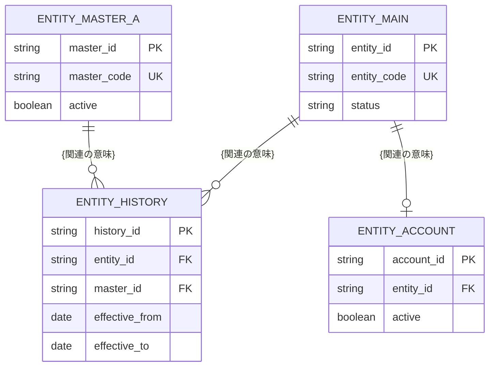

[← テンプレート一覧](README.md)

<!-- 本節(統合設計書 第6節)はデータベース設計の正本。物理名(英語のテーブル名・カラム名)を記載してよい唯一の節(§5 API のパス・JSONキーを除く)。他節では物理名を書かない -->
<!-- 記載粒度: 論理データモデル(erDiagram)→テーブル一覧→主要テーブルのカラム定義→制約・インデックス方針→トランザクション境界→共通カラム→命名規則の順で、実装判断できる粒度まで具体化する -->
<!-- 型は基本設計レベルの「型の例」を示す(DDL・文字長・照合順序・物理配置・実行計画は詳細設計で確定)。共通カラム(created_at/created_by/updated_at/updated_by/version/deleted_at)は §6.7 が正本とし、各テーブル定義(§6.3/§6.4 等)で再掲しない。主キー(xxx_id)は共通カラムに含めず各テーブルで定義する -->
<!-- 各見出し(#/##)直上のコメントに「定義内容 / 定義する条件 / 項目説明 / 定義ルール」をセットで記載する。編集時はコメントを読んでから該当セクションを埋める -->

<!--
【6. データベース設計】
定義内容: システムが扱うデータの論理データモデル・テーブル定義・制約/インデックス方針・トランザクション境界・共通カラム・命名規則を定義する。概念データモデル・シーケンスが前提とするデータを物理構造へ具体化する。
定義する条件: 永続データを持つシステムで必須。
項目説明:
- 6.1 論理データモデル: エンティティと関連を erDiagram(Mermaid)で示す。
- 6.2 テーブル一覧: | テーブル名 | 論理名 | 目的 | で列挙する。
- 6.3〜 主要テーブル: | カラム | 論理名 | 型の例 | NULL | 制約・説明 | で定義する。
- 6.5 制約・インデックス方針 / 6.6 トランザクション境界 / 6.7 共通カラム / 6.8 命名規則。
定義ルール:
- 本節は物理名(英語のテーブル名・カラム名)を記載してよい唯一の節(§5 のパス・JSONキーを除く)。
- 型は基本設計レベルの「型の例」を示す(DDL・文字長・照合順序・物理配置・実行計画は詳細設計で確定)。
- 共通カラムは §6.7 を正本とし、各テーブル定義で再掲しない。主キーは各テーブルで定義する。
-->
# 6. データベース設計

<!--
【6.1 論理データモデル】
定義内容: システムが取り扱う全エンティティ(テーブル)と、その間の物理リレーション・多重度を Mermaid erDiagram で俯瞰する。
定義する条件: 必須。全テーブルを1つの図で示す。
項目説明:
- エンティティ(テーブル): 物理名で記載する。§6.2 テーブル一覧と1対1で対応する。
- 属性ブロック: 各テーブルの主要カラムを「型 物理名 キー種別」で列挙する。キー種別は PK(主キー) / FK(外部キー) / UK(一意キー)。
- 関連: テーブル間の線と、関連の意味(ラベル)。
- 多重度: Mermaid 記法(||--o{ = 1:N、||--o| = 1:0..1、}o--o{ = M:N)で表す。
定義ルール:
- 共通カラム(§6.7)は本図に記載しない。主キー・外部キー・一意キー・関連理解に必要な主要カラムのみ記載する。
- 全カラム・制約・インデックスの正本は §6.2〜§6.5。本図で網羅しない。
- 関連ラベルは業務上の意味で書き、物理外部キー名を書かない(外部キーは属性ブロックの FK で示す)。
-->
## 6.1 論理データモデル

<!--
【6.2 テーブル一覧】
定義内容: システムの全テーブルを、物理名・論理名・目的の一覧で示す。
定義する条件: 必須。§6.1 のエンティティを漏れなく列挙する。
項目説明:
- テーブル名: 実装上のテーブル物理名。
- 論理名: テーブルの日本語表示名。
- 目的: そのテーブルが保持する情報・役割(1行)。
定義ルール:
- §6.1 の erDiagram に現れるエンティティと過不足なく一致させる。
- マスタ・トランザクション・履歴・中間テーブルなど種別が分かる目的記述にする。
-->
## 6.2 テーブル一覧

| テーブル名 | 論理名 | 目的 |
|---|---|---|
| XXXXX | XXXXX | XXXXX |
| XXXXX | XXXXX | XXXXX |

<!--
【6.3 {主要テーブルA}】
定義内容: 主要テーブルのカラムを、論理名・型の例・NULL可否・制約/説明まで含めて定義する。
定義する条件: システムの中核テーブルに対して定義する。
項目説明:
- カラム: カラムの物理名。
- 論理名: カラムの日本語表示名。
- 型の例: 基本設計レベルの型の例(UUID / VARCHAR / DATE / TIMESTAMP / INTEGER / BOOLEAN 等)。
- NULL: NULL を許可するか(可 / 不可)。
- 制約・説明: PK/UNIQUE/FK(参照先)/区分値/デフォルト/意味など、そのカラムに効く制約と補足。
定義ルール:
- 主キー(xxx_id)は先頭に PK として記載する。共通カラム(§6.7)は再掲しない。
- 外部キーは「FK → 参照先テーブル」を制約・説明列に記載する。単一カラム一意は UNIQUE を制約列に記載する(複合一意・複合インデックスは §6.5)。
- 区分値カラムは取り得る代表値または「定義済みコード」を制約・説明列に記載する。
-->
## 6.3 {主要テーブルA}

| カラム | 論理名 | 型の例 | NULL | 制約・説明 |
|---|---|---|---|---|
| xxxxx_id | XXXXX | UUID | 不可 | PK |
| xxxxx | XXXXX | VARCHAR | 不可 | UNIQUE / FK → XXXXX / 区分値 等 |
| xxxxx | XXXXX | XXXXX | 可 |  |

<!--
【6.4 {主要テーブルB}】
定義内容: 履歴/明細など期間・整合性が重要な主要テーブルのカラム定義と、期間整合性ルールを定義する。
定義する条件: 有効期間や複数レコード間の整合が必要なテーブルに対して定義する。
項目説明:
- カラム表: §6.3 と同一形式。
- 期間整合性: 同一親に対する期間の重複禁止・接続・終了などのルールを箇条書きで示す。
定義ルール:
- カラム表の形式・ルールは §6.3 に従う。
- 期間整合性は、重複禁止・現行有効レコードの表現(終了日 NULL 等)・接続方法(隙間/重複を作らない)・大小関係を1ポイント1項目で列挙する。大小・前後の比較は ≦ / ＜ / ＞ / ≧ で表す。
-->
## 6.4 {主要テーブルB}

| カラム | 論理名 | 型の例 | NULL | 制約・説明 |
|---|---|---|---|---|
| xxxxx_id | XXXXX | UUID | 不可 | PK |
| xxxxx_id | XXXXX | UUID | 不可 | FK → XXXXX |
| effective_from | XXXXX | DATE | 不可 |  |
| effective_to | XXXXX | DATE | 可 | 現に有効なレコードは NULL |

### 期間整合性

- {同一親について有効期間が重複するレコードを登録しない、等}
- {現に有効なレコードは終了日を NULL とし、親ごとに最大1件、等}
- {接続・終了・大小関係のルール}

<!--
【6.5 主な制約・インデックス方針】
定義内容: 一意制約・外部キー・チェック・検索用インデックスなど、主要な制約とインデックスの方針を対象別に示す。
定義する条件: 必須。一意性・整合性・検索性能に効く制約/インデックスを列挙する。
項目説明:
- 対象: 制約/インデックスをかけるテーブル・カラム(複合は列を順に列挙)。
- 方針: 一意制約 / 外部キー / チェック制約 / 検索用インデックス など、その目的。
定義ルール:
- 一意性(業務識別子)・整合性(期間・状態)・検索性能(一覧/期間/対象別)の観点を網羅する。
- 詳細なインデックス構成・実行計画・物理配置は詳細設計で確定する旨を前提とし、本節は方針にとどめる。
-->
## 6.5 主な制約・インデックス方針

| 対象 | 方針 |
|---|---|
| XXXXX.xxxxx | 一意制約 |
| XXXXX (xxxxx, xxxxx) | XXXXX用インデックス |

<!--
【6.6 トランザクション境界】
定義内容: 複数テーブルにまたがる業務処理を、1つの業務トランザクションとして扱う単位と原子性ルールで示す。
定義する条件: 複数テーブルを整合させて更新する主要ユースケースに対して定義する。
項目説明:
- 順序: トランザクション内の処理順。
- 処理: 各ステップで行う登録・更新の内容。
- 対象テーブル: そのステップが更新するテーブル物理名。
- 補足: 原子性(全成功/全ロールバック)・監査ログの扱い(分離するか)などの注記。
定義ルール:
- ユースケース単位に見出し(###)を分け、処理を表で示したうえで原子性・監査ログの扱いを箇条書きで補足する。
- 監査ログ等の証跡系を業務トランザクションと分離するか一体とするかを明記し、「未定/要確認」を残さない。
-->
## 6.6 トランザクション境界

### {ユースケースA} トランザクション

| 順序 | 処理 | 対象テーブル |
|---|---|---|
| 1 | XXXXX | XXXXX |
| 2 | XXXXX | XXXXX |

- {原子性ルール(全成功またはロールバック)}
- {監査ログ等の証跡系の扱い}

<!--
【6.7 共通カラム】
定義内容: 全テーブルに一律で付与する共通カラムを一括定義する。本節を共通カラムの正本とし、各テーブル定義で再掲しない。
定義する条件: 必須。少なくとも作成・更新の記録カラムと楽観ロック用カラムを定義する。
項目説明:
- カラム: 共通カラムの物理名。
- 論理名: 日本語表示名。
- 型の例: 基本設計レベルの型の例。
- NULL: NULL を許可するか(可 / 不可)。
- 制約・説明: 値の意味・設定タイミング・論理削除規約など。
定義ルール:
- 共通カラムは全テーブルに一律付与し、各テーブル定義(§6.3/§6.4 等)には再掲しない旨を明記する。
- 主キー(xxx_id)は共通カラムに含めず各テーブルで定義する。
- 論理削除カラムは「NULL=有効 / 値あり=削除」の規約を説明列に明記する。楽観ロック用カラムは更新のたびに増加する旨を明記する。
-->
## 6.7 共通カラム

全テーブルに共通で付与するカラムを本節で一括定義し、各テーブル定義(§6.3/§6.4 等)では再掲しない。主キー(xxx_id)は共通カラムに含めず各テーブルで定義する。

| カラム | 論理名 | 型の例 | NULL | 制約・説明 |
|---|---|---|---|---|
| created_at | 登録日時 | TIMESTAMP | 不可 | XXXXX |
| created_by | 登録者 | VARCHAR | 不可 | XXXXX |
| updated_at | 更新日時 | TIMESTAMP | 不可 | XXXXX |
| updated_by | 更新者 | VARCHAR | 不可 | XXXXX |
| version | 更新バージョン | INTEGER | 不可 | 楽観ロック。更新のたびに +1 |
| deleted_at | 論理削除日時 | TIMESTAMP | 可 | NULL=有効 / 値あり=削除 |

<!--
【6.8 命名規則】
定義内容: テーブル・カラム・主キー・外部キー・一意キー・区分値・論理名の物理命名規則の要点と、型方針を示す。
定義する条件: 必須。DB設計に着手する前に確定する。
項目説明:
- 対象: 命名規則を定める物理オブジェクトの種別。
- 規則: その対象の命名パターン(大文字/小文字・区切り・単数/複数・接尾辞など)。
定義ルール:
- テーブル物理名・カラム物理名・主キー・外部キー・一意キー・区分値カラム・論理名の規則を対象別に示す。
- 型方針は本書が基本設計レベルであることを明記し、DDL・文字長・照合順序・物理型を詳細設計で確定する前提を添える。
-->
## 6.8 命名規則

| 対象 | 規則 |
|---|---|
| テーブル(物理名) | XXXXX |
| カラム(物理名) | XXXXX |
| 主キー | XXXXX |
| 外部キー | XXXXX |
| 一意キー | XXXXX |
| 区分値カラム | XXXXX |
| 論理名 | XXXXX |

- 型方針: 本書は基本設計レベルのため型は「型の例」({UUID / VARCHAR / DATE / TIMESTAMP / INTEGER / BOOLEAN 等})で示す。DDL・文字長・文字種・照合順序・物理型は詳細設計で確定する。
