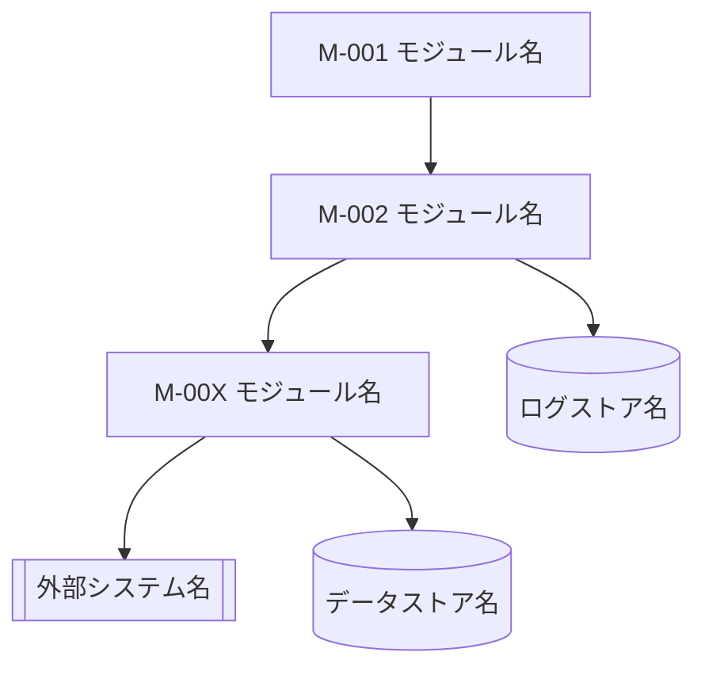

[← テンプレート一覧](README.md)

<!--
【7. モジュール設計】
定義内容: 対象システムを構成する論理モジュールの一覧・責務・依存関係・連携・公開機能を、物理実装(クラス・メソッド)へ踏み込まず論理レベルで定義する節。概要設計(責務・境界)を実装単位となる論理モジュールへ具体化し、個別モジュール設計(MOD-XXX)の入口となる俯瞰を与える。
定義する条件: 全システムで必須。
構成: ## 7.1 論理モジュール構成 / ## 7.2 モジュール責務 / ## 7.3 依存ルール / ## 7.4 (主要ユースケース)におけるモジュール連携 / ## 7.5 モジュール公開機能 を配置する。
項目説明:
- 7.1 論理モジュール構成: モジュール(M-XXX)と外部要素(DB・ログストア・外部認証基盤)の依存関係図(mermaid flowchart)。
- 7.2 モジュール責務: 各モジュールの主な責務と担当しないこと(非責務)。
- 7.3 依存ルール: モジュール間の呼び出し・依存に関する制約(箇条書き)。
- 7.4 (主要ユースケース)におけるモジュール連携: 代表ユースケースでのモジュール呼び出し順序。
- 7.5 モジュール公開機能: 各モジュールが外部へ公開する機能の例。
定義ルール:
- モジュールIDは M-XXX の連番。採番はモジュール一覧の最大値+1、欠番の再利用は禁止。
- 物理名(英語のクラス名・メソッド名・テーブル名)は書かず、論理責務・論理名で記述する。
- 個別モジュールの内部処理・インターフェース詳細はモジュール設計(MOD-XXX)を正本とし、本節では論理構成と責務のみを示す。
- 責務・連携はシーケンス設計・概要設計(責務・境界)と矛盾しないように記述する。
-->
# 7. モジュール設計

<!--
【7.1 論理モジュール構成】
定義内容: 対象システムを構成する論理モジュール(M-XXX)と、モジュールが依存する外部要素(データベース・ログストア・外部認証基盤)の依存関係を mermaid flowchart で示す。
定義する条件: 全システムで必須。
項目説明:
- ノード: 各論理モジュール(M-XXX)・データストア(円柱形状)・外部システム(サブルーチン形状)。
- エッジ: 呼び出し(依存)方向。上位モジュールから下位モジュールへの一方向で表す。
定義ルール:
- ノードにはモジュールID(M-XXX)とモジュール名を記載する。
- データストアは円柱形状 [( )]、外部システムはサブルーチン形状 [[ ]] で表す。
- 依存は一方向とし、下位から上位への循環依存を描かない。
- 物理製品名・物理スキーマ名は書かない。
-->
## 7.1 論理モジュール構成

<!--
【7.2 モジュール責務】
定義内容: 各モジュールの主な責務と、あえて担当しないこと(非責務)を一覧で示す。
定義する条件: 全システムで必須。全モジュール(M-XXX)を1行ずつ定義する。
項目説明:
- モジュールID: モジュールの識別子(M-XXX)。
- モジュール名: モジュールの論理名。
- 主な責務: そのモジュールが受け持つ役割・処理範囲。
- 担当しないこと: 他モジュールへ委譲し、本モジュールでは扱わない責務(非責務)。
定義ルール:
- 責務・非責務は論理レベルで記述し、物理名(クラス・メソッド)を書かない。
- 責務の重複を避け、1つの責務は1モジュールに置く(概要設計の責務・境界と一致させる)。
-->
## 7.2 モジュール責務

| モジュールID | モジュール名 | 主な責務 | 担当しないこと |
|---|---|---|---|
| M-XXX |  |  |  |

<!--
【7.3 依存ルール】
定義内容: モジュール間の呼び出し・依存に関して守るべき制約を箇条書きで示す。
定義する条件: 全システムで必須。
項目説明:
- 各項目: 「どのモジュールが何をしてよい／してはならないか」の依存制約を1項目1ルールで記載する。
定義ルール:
- 依存方向・委譲・隔離・循環依存の禁止など、7.1 の構成図と矛盾しないルールを記載する。
- モジュールは ID とモジュール名で参照する。
-->
## 7.3 依存ルール

- （依存制約を1項目1ルールで記載する）
- （委譲・隔離・循環依存の禁止などを記載する）

<!--
【7.4 (主要ユースケース)におけるモジュール連携】
定義内容: 代表的なユースケースにおける、モジュール間の呼び出し順序・呼出元・呼出先・目的を一覧で示す。
定義する条件: 複数モジュールが連携する代表ユースケース(登録など)で定義する。
項目説明:
- 順序: 呼び出しの実行順(連番)。
- 呼出元 ／ 呼出先: 呼び出すモジュール ／ 呼び出されるモジュール(ID＋名称)。
- 目的: その呼び出しで達成すること(論理レベル)。
定義ルール:
- 対象ユースケースの基本フロー(正常系)に沿って順序を並べる。
- 連携の詳細(条件分岐・例外・データ項目)はシーケンス設計・各モジュール設計を正本とし、本表では目的のみを示す。
-->
## 7.4 (主要ユースケース)におけるモジュール連携

| 順序 | 呼出元 | 呼出先 | 目的 |
|---:|---|---|---|
| 1 |  |  |  |

<!--
【7.5 モジュール公開機能】
定義内容: 各モジュールが外部(他モジュール・上位層)へ公開する機能の例を一覧で示す。
定義する条件: 全システムで必須。全モジュール(M-XXX)を対象とする。
項目説明:
- モジュール: モジュール(ID＋名称)。
- 公開機能の例: そのモジュールが公開する主な機能(論理名)。
定義ルール:
- 公開機能は論理名(「〜取得」「〜確認」等)で記述し、物理メソッド名・引数・戻り値の詳細は書かない(詳細は各モジュール設計 MOD-XXX を正本とする)。
-->
## 7.5 モジュール公開機能

| モジュール | 公開機能の例 |
|---|---|
| M-XXX |  |
