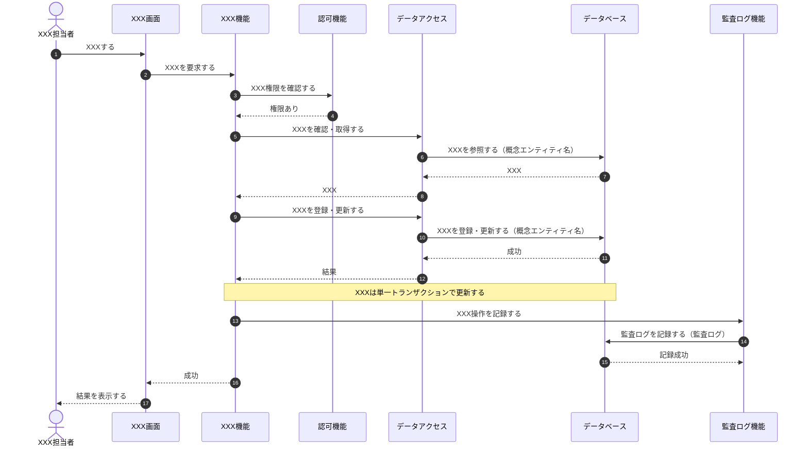
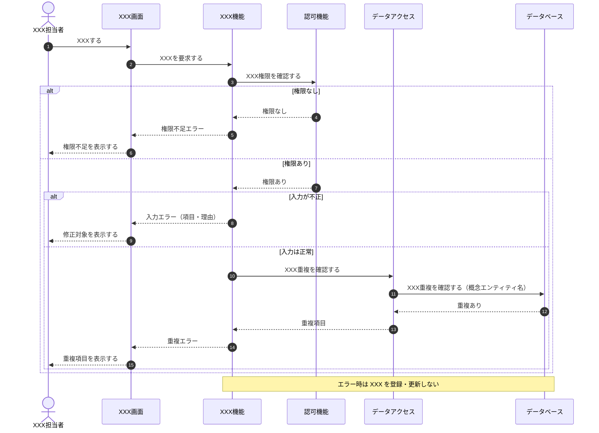
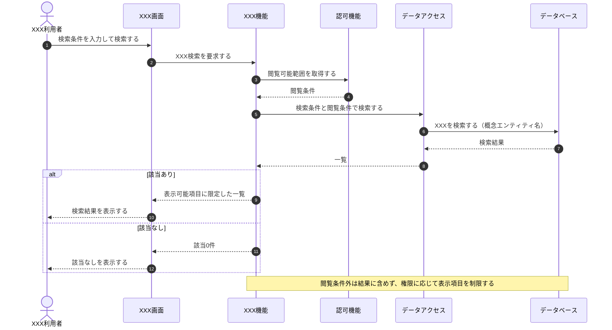
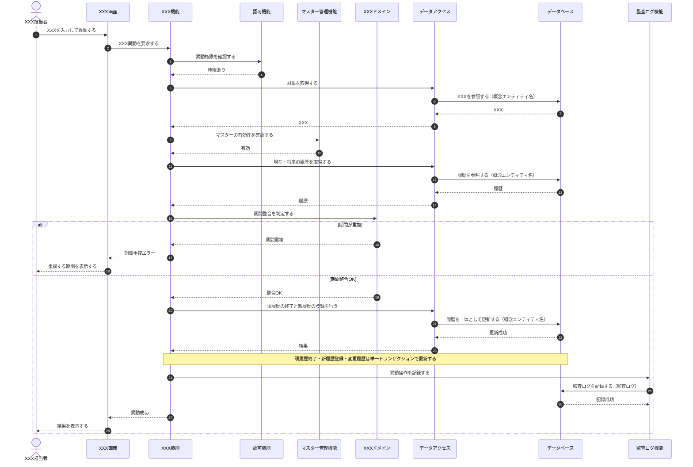
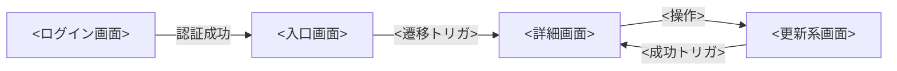
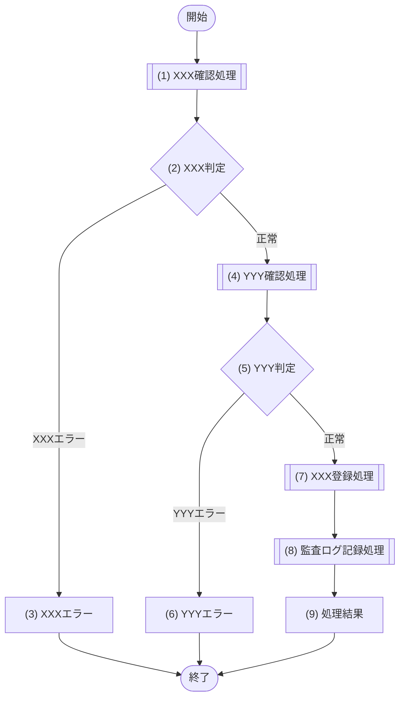
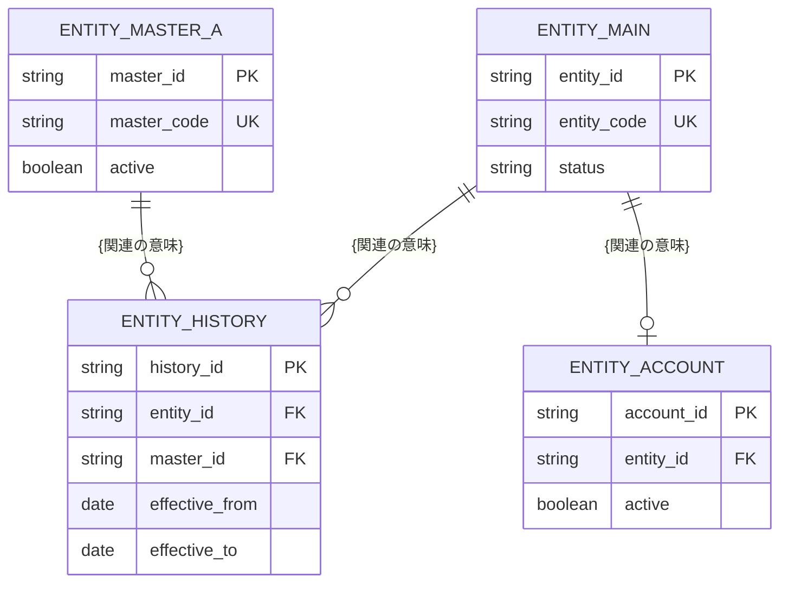
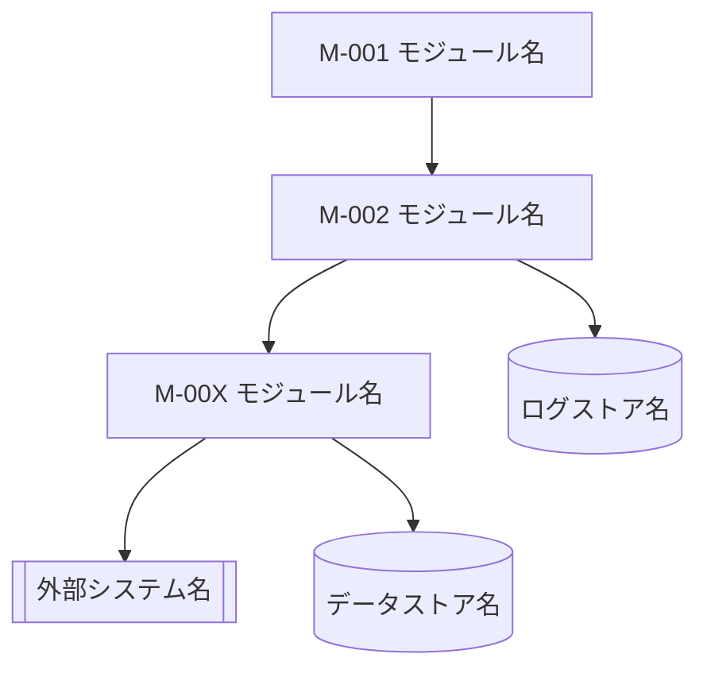

<!--
本テンプレートは、要求定義〜機能設計（シーケンス・画面・API・データベース・モジュール）を単一文書へ統合して記述するための雛形（正本）である。
- コピーして「<システム名>_統合設計書.md」として使用する。
- 各セクション/サブセクション直上の HTMLコメント（定義内容 / 定義する条件 / 項目説明 / 定義ルール）を読んでから該当セクションを埋める。
- 記入例は 社員名簿管理システム_統合設計書.md を参照する。
- セクション 0 → 11 の順に埋める。上流（要求・機能要件）を確定してから下流（設計）を具体化する。
- 図は Mermaid（sequenceDiagram / flowchart / erDiagram）で記述する。物理名（英語のテーブル名・カラム名・メソッド名）はデータベース設計（§6）と API のパス・JSONキー（§5）以外では書かない。
-->
# 統合設計書 テンプレート

## 目次

| No | セクション | 定義するもの |
|---|---|---|
| 0 | はじめに | 本書の目的、前提、基本設計と詳細設計の境界 |
| 1 | 要求定義 | 背景・課題、目的、利用者と役割、業務要求、非機能要求、制約、対象範囲 |
| 2 | 機能要件 | 機能一覧、主要ユースケース、機能要求詳細、シーケンス要否 |
| 3 | シーケンス設計 | 論理構成要素、主要ユースケースの連携シーケンス |
| 4 | 画面設計 | 画面一覧、画面遷移、代表画面の詳細 |
| 5 | API設計 | 方針、API一覧、代表APIの詳細、更新競合方針 |
| 6 | データベース設計 | 論理データモデル、テーブル定義、制約、トランザクション境界 |
| 7 | モジュール設計 | 論理モジュール構成、責務、依存、連携、公開機能 |
| 8 | 要求・設計トレーサビリティ | 要求→機能→設計の対応 |
| 9 | 設計レビュー用チェックリスト | 成果物種別ごとのレビュー観点 |
| 10 | 詳細設計への引継ぎ事項 | 詳細設計で確定する事項 |
| 11 | 設計の落とし込み関係 | 要求から各設計への落とし込みの流れ |

---

<!-- 本書は要求定義〜モジュール設計を単一文書へ統合した「統合設計書」。0.はじめに 〜 11.落とし込み関係 の全12章構成。本ファイルは第0章【はじめに】のテンプレートである -->
<!-- はじめに(§0)は、本書の目的・サンプルとしての前提・基本設計と詳細設計の境界を示し、以降の章(要求定義〜落とし込み関係)を読むための枠組みと工程分担の目安を与える。個別のFR/NFR/UC/SCR/API/TBL/MOD詳細は各章が正本のため、§0では概観のみを示し、IDや詳細仕様を再記載しない -->
<!-- 各見出し(#/##)直上のコメントに「定義内容(そのセクションの意味)」「定義する条件」「項目説明(各列・各項目の意味)」「定義ルール」をセットで記載する。編集時はコメントを読んでから該当セクションを埋める -->

<!--
【0. はじめに】
定義内容: 本統合設計書の目的・前提・基本設計と詳細設計の境界を示し、読み手に本書全体の枠組みと工程分担の目安を与える章。
定義する条件: 全統合設計書で必須。冒頭(第0章)に置く。
項目説明:
- 0.1 本書の目的 / 0.2 サンプルとしての前提 / 0.3 基本設計と詳細設計の境界 の3サブ節で構成する。
定義ルール:
- §0では個別章(1〜11)の内容を先取りして詳細記載しない。概観と読み方のみを示す。
- 会社・組織・対象・権限・業務フロー・画面・API・データがすべて架空である旨を明記する。
-->
# 0. はじめに

<!--
【0.1 本書の目的】
定義内容: 本書が対象とするシステムと、統合する設計成果物、および成果物間の落とし込み関係を示す目的を記載する。
定義する条件: 全統合設計書で必須。
項目説明:
- 目的本文: 対象システム名と、本書が統合する設計成果物の範囲(要求定義〜モジュール設計)を1〜3行で示す。
- 成果物リスト: 本書が統合する設計成果物を番号付きで列挙する。
- 落とし込み補足: 成果物を個別に記載するだけでなく、上流(要求)から下流(モジュール・DB)への落とし込み関係を示す旨と、記載粒度の水準を述べる。
定義ルール:
- 成果物リストは本書の章立て(要求定義〜モジュール設計)と対応させる。
- 落とし込み関係の詳細(トレース表)は第11章が正本。ここでは示す旨のみ述べ、対応表を再掲しない。
- 記載粒度の水準(状態パターン・代替/例外フロー・エラー・DB制約・処理フロー等)を1行で示す。
-->
## 0.1 本書の目的

本書は、架空の「(対象システム名)」を対象に、(統合する設計成果物の範囲を1〜3行)を単一文書へ統合し、各設計成果物が相互にどのようにつながるかを示す統合設計書である。統合する設計成果物は次のとおり。

1. (成果物1)
2. (成果物2)
3. (成果物3)
4. (成果物4)
5. (成果物5)
6. (成果物6)
7. (成果物7)

本書は各成果物を個別に記載するだけでなく、(上流ID)から(下流ID)へ落とし込む関係を第11章「設計の落とし込み関係」で示す。記載粒度は、(状態パターン・代替/例外フロー・エラー一覧・DB制約・処理フロー 等)まで引き上げる。

<!--
【0.2 サンプルとしての前提】
定義内容: 本書が架空サンプルであることと、対象システム・主な利用者・対象業務・認証・対象外・設計粒度の前提を表で示す。
定義する条件: 全統合設計書で必須。
項目説明:
- 前提表: 「項目」列に前提の観点、「前提」列に内容を記載する。
  - 対象システム: 本書が扱うシステム名。
  - 主な利用者: 利用者ロール。
  - 対象業務: システム化する業務の範囲。
  - 認証: 認証方式の前提。
  - 対象外: システム化しない業務。
  - 設計粒度: 本書の設計レベル。
定義ルール:
- 会社・組織・対象・権限・業務フロー・画面・API・データがすべて架空である旨を表の直前に1行で明記する。
- 対象/対象外は §1(要求定義)の対象範囲と矛盾させない。
-->
## 0.2 サンプルとしての前提

本書に記載する会社・組織・(対象)・権限・業務フロー・画面・API・データはすべて架空である。

| 項目 | 前提 |
|---|---|
| 対象システム |  |
| 主な利用者 |  |
| 対象業務 |  |
| 認証 |  |
| 対象外 |  |
| 設計粒度 |  |

<!--
【0.3 基本設計と詳細設計の境界】
定義内容: 設計対象(画面/API/DB/モジュール/シーケンス)ごとに、本書で定義する内容と詳細設計で定義する内容の境界を表で示す。
定義する条件: 全統合設計書で必須。
項目説明:
- 対象: 設計対象の種別(画面/API/DB/モジュール/シーケンス)。
- 本書で定義する内容: 本書(基本設計相当)が扱う範囲。
- 詳細設計で定義する内容: 詳細設計以降へ委ねる範囲。
定義ルール:
- 対象は本書の設計章(§3〜§7)の設計対象と対応させる。
- 境界表の直後に、単一文書へ統合した様式であり境界表は工程分担の目安である旨を1行注記する。
-->
## 0.3 基本設計と詳細設計の境界

| 対象 | 本書で定義する内容 | 詳細設計で定義する内容 |
|---|---|---|
| 画面 |  |  |
| API |  |  |
| DB |  |  |
| モジュール |  |  |
| シーケンス |  |  |

※本書は単一文書へ統合した様式であり、境界表は工程分担の目安を示す。


---

<!-- 統合設計書 第1節【要求定義】のテンプレート。利用者・管理者・組織が対象システムに求めること(why / want)を定義する。後続工程のID(機能F・画面SCR・API・DB・モジュール等)は参照せず、設計詳細(画面項目・API仕様・DB項目・処理ロジック・実装方式)は書かない。 -->
<!-- 各セクション直上のコメントに「定義内容(そのセクションの意味)」「定義する条件」「項目説明(各列・各項目の意味)」「定義ルール」をセットで記載する。編集時はコメントを読んでから該当セクションを埋める。本文は空欄プレースホルダ(| BR-XXX | | 等)にする。 -->

<!--
【1. 要求定義】
定義内容: 対象システムの背景・課題、システム化の目的、利用者と役割、業務要求、非機能要求、制約、対象範囲を定義し、以降の全設計の起点(要求ベースライン)を一意に定める。
定義する条件: 全プロジェクトで必須。
項目説明: 1.1〜1.7 の各サブ節で、背景/目的(OBJ)/利用者/業務要求(BR)/非機能要求(NFR)/制約/対象範囲を扱う。
定義ルール:
- 見出しは「# 1. 要求定義」(H1)開始、サブ節は「## 1.x」。
- 要求レベルの why(なぜ)/want(何がほしい)のみを書き、how(画面・API・DB・処理・技術名)は書かない。
- OBJ・BR・NFR・利用者ロール名は全節で厳密一致させ、本節で新しいIDを発明しない。
- 一覧・項目・条件はテーブル、複数ポイントの説明は箇条書き(- )で書く。
-->
# 1. 要求定義

<!--
【1.1 背景・課題】
定義内容: システム化前の現状で発生している課題・非効率・リスクを箇条書きで示す。
定義する条件: 全プロジェクトで必須。
項目説明: 各項目=現状で発生している課題・非効率・リスクを1件1行で記載する。
定義ルール:
- 課題は利用者・組織の観点で記載する。解決手段(システム機能・実装方式)や後続工程ID(OBJ/BR/F/SCR等)は書かない。
- 1.2 システム化の目的(OBJ)と対応が取れる粒度で記載する(課題→目的でトレースできること)。
- 1件1行で、事実として確認できた課題のみを記載する(推測で埋めない)。
-->
## 1.1 背景・課題

- （現状の課題1をプレースホルダとして記載。例: 情報が分散し最新版を特定しにくい）
- （現状の課題2）
- （現状の課題3）

<!--
【1.2 システム化の目的】
定義内容: 1.1 の背景・課題を解決するために、システム化で達成する目的を一覧で示す。
定義する条件: 全プロジェクトで必須。
項目説明:
- 目的ID: この目的の識別子(OBJ-XXX 連番)。
- 目的: システム化により達成したい状態(1行)。
定義ルール:
- 1.1 の課題と対応が取れること(課題を解決する目的になっていること)。
- 達成したい状態(what/why)のみを書き、手段・実装方式(how)は書かない。
- OBJ-ID は連番、欠番の再利用は禁止。全節で同一IDを参照する。
-->
## 1.2 システム化の目的

| 目的ID | 目的 |
|---|---|
| OBJ-XXX |  |

<!--
【1.3 利用者と役割】
定義内容: システムを利用する利用者(ロール)と、その利用目的・権限範囲を示す。
定義する条件: 全プロジェクトで必須。
項目説明:
- 利用者: ロール名。
- 主な利用目的: そのロールがシステムで達成したいこと。
- 主な権限: 業務観点での参照・更新可能範囲。
定義ルール:
- 権限は業務観点で記載する(実装上の認可制御(認可方式・画面/API制御)は要件・設計で定義するため書かない)。
- ロール名は全節で厳密一致させる。
-->
## 1.3 利用者と役割

| 利用者 | 主な利用目的 | 主な権限 |
|---|---|---|
| （ロール名） |  |  |

<!--
【1.4 業務要求】
定義内容: 利用者・組織が対象システムに求める業務上の要求を、優先度・受入条件とともに一覧化する。
定義する条件: 全プロジェクトで必須。
項目説明:
- 要求ID: この業務要求の識別子(BR-XXX 連番)。
- 業務要求: 利用者・組織が求めること(1行、主語=ロールで記載)。
- 優先度: 必須/任意 等の区分。
- 受入条件の概要: 要求の充足を判断できる条件(テスト可能な表現)。
定義ルール:
- 要求レベルの why(なぜ)/want(何がほしい)のみを書く。画面・API・DB・処理方式は書かない。
- 受入条件は「〜されること/〜できること」の充足可否を判断できる粒度で書く。
- BR-ID は連番、欠番の再利用は禁止。全節で同一IDを参照する。
-->
## 1.4 業務要求

| 要求ID | 業務要求 | 優先度 | 受入条件の概要 |
|---|---|---:|---|
| BR-XXX |  |  |  |

<!--
【1.5 非機能要求】
定義内容: 機能横断または特定機能に対する品質要求(セキュリティ・認可・監査・個人情報保護・可用性・性能・整合性・保守性など)を分類ごとに一覧化する。
定義する条件: 全プロジェクトで必須。
項目説明:
- 要求ID: この非機能要求の識別子(NFR-XXX 連番)。
- 分類: 品質特性の分類(セキュリティ/認可/監査/性能 等)。
- 要求: 満たすべき品質(1行)。
定義ルール:
- 要求レベルの品質基準を記載し、実装方式・技術名(how)は書かない(具体的な達成基準・測定条件は要件定義のNFRで詳細化する)。
- NFR-ID は連番、欠番の再利用は禁止。全節で同一IDを参照する。
-->
## 1.5 非機能要求

| 要求ID | 分類 | 要求 |
|---|---|---|
| NFR-XXX |  |  |

<!--
【1.6 制約】
定義内容: 要求が成り立つための前提・制約・範囲上の取り決めを箇条書きで示す。
定義する条件: 制約がある場合に定義する。無ければ「なし」と記載する。
項目説明: 各項目=システム・データ・運用・外部連携に関する制約や取り決めを1件1行で記載する。
定義ルール:
- 実装方式・技術名は書かない(要求レベルの制約のみ)。
- データの保持方針(履歴・状態管理・一意性など)や外部前提(認証基盤の利用など)を記載する。
-->
## 1.6 制約

- （制約1をプレースホルダとして記載。例: ○○は一意とする）
- （制約2）
- （制約3）

<!--
【1.7 対象範囲】
定義内容: 本システムが対象とする業務範囲(対象)と、対象としない業務範囲(対象外)を明示する。
定義する条件: 全プロジェクトで必須。
項目説明:
- 対象: 本システムで実現する業務。
- 対象外: 本システムで実現しない業務(別システム・手作業で行うもの)。
定義ルール:
- 対象外を必ず明記し、スコープを一意にする(対象外の記載漏れを残さない)。
- 業務範囲(what)で記載し、機能ID・実装方式は書かない。
-->
## 1.7 対象範囲

### 対象

- （対象とする業務1）
- （対象とする業務2）

### 対象外

- （対象外とする業務1）
- （対象外とする業務2）


---

<!-- 本節は統合設計書「第2節 機能要件」のテンプレート版。各セクション/サブセクション直上のHTMLコメントに「定義内容 / 定義する条件 / 項目説明 / 定義ルール」をセットで記載する。編集時はコメントを読んでから該当セクションを埋める。本文は空欄プレースホルダ(<...>・XXX・例示行)とし、実データは記入サンプル版側で埋める。 -->
<!-- 見出しは本節「# 2. 機能要件」(H1)開始、サブは「## 2.x」、ユースケースは「### 【UC-XXX】…」(H3)。担当節(第2節)以外の内容は書かない。一覧・項目・条件・分岐・処理は必ずテーブルで書く。物理名(英語のテーブル名・カラム名・メソッド名)は書かない(振る舞いとデータのみ)。 -->

<!--
【2. 機能要件】
定義内容: システムが提供する機能の一覧と、主要な利用者・システムの振る舞い(ユースケース)、代表機能の機能要求詳細、シーケンス図作成要否を定義する。要求定義(§1)を実現する「何をするか」を、設計詳細(how)を含めずに定義する。
定義する条件: 全システムで必須。
項目説明:
- 2.1 機能一覧: 提供する機能を | 機能ID(F-XXX) | 機能名 | 概要 | 主な利用者 | で列挙する。
- 2.2 主要ユースケース: 代表的な機能の振る舞いを UC 単位(### 【UC-XXX】)で定義する。UC記載様式(主アクター/目的/事前条件/起動契機/正常終了/異常終了)＋事前/事後条件・入力/出力データ・状態パターン(SP-x)・基本/代替(ALT)/例外(EXC)フローで構成する。
- 2.3 機能要求詳細: 代表機能が満たすべき機能要求を | 要件ID | 要件 | で列挙する。
- 2.4 シーケンス図作成要否: 各UCについて図の要否と理由を定義する。
定義ルール:
- 機能ID(F-XXX)・UC-XXX は一覧の最大値+1で採番し、欠番を再利用しない。他節からは UC-XXX を完全修飾で参照する。
- 状態パターン(SP-x)は正常(基本フロー)を SP-1 とし、代替(ALT)・例外(EXC)を続けて判定優先順に採番する。すべてのSPが基本/ALT/EXCフローのいずれかに対応し、すべてのALT/EXCがいずれかのSPから参照されるよう双方向に網羅する(SP-x は §2.2 を正本とし、§3 シーケンス・§4 画面から完全修飾 UC-XXX/SP-x で参照する)。
- 画面項目・API仕様・DB構造・処理ロジックなどの設計詳細は書かない(振る舞いとデータのみ)。物理名は書かない。
-->
# 2. 機能要件

本システムが提供する機能の一覧、主要ユースケースの振る舞い、＜代表機能＞の機能要求詳細、シーケンス図作成要否を定義する。画面項目・API仕様・DB構造・処理ロジックなどの設計詳細は書かない(それらは後続の節で定義する)。

<!--
【2.1 機能一覧】
定義内容: 本システムが提供する機能を、機能ID・機能名・概要・主な利用者の一覧で示す。
定義する条件: 全システムで必須。
項目説明:
- 機能ID: 機能の識別子(F-XXX 連番)。他節(画面/API/ユースケース)からはこのIDで参照する。
- 機能名: 機能の日本語名称。
- 概要: 機能が提供する内容(1行)。
- 主な利用者: その機能を主に利用する利用者ロール(人事担当者/部門管理者/一般社員/システム管理者/全利用者)。
定義ルール:
- 機能IDは F-XXX の連番。採番は最大値+1、欠番の再利用は禁止。
- 概要は1行で簡潔に書く。画面項目・API・DB項目・処理ロジックは書かない。
- 主な利用者は要件レベルの粗い利用者区分のみ記載する(画面のロール制御・APIの認可仕様は書かない)。
-->
## 2.1 機能一覧

| 機能ID | 機能名 | 概要 | 主な利用者 |
|---|---|---|---|
| F-XXX | <機能名> | <機能の内容を1行で> | <主な利用者> |

<!--
【2.2 主要ユースケース】
定義内容: 主要な機能を実現する、利用者とシステムの具体的な振る舞い(シナリオ)と扱うデータを、ユースケース単位で定義する。
定義する条件: 詳細トレースの対象となる代表ユースケースがある場合に定義する。
項目説明(各UCの構成):
- 見出し: 「### 【UC-XXX】<ユースケース名>（<対象>向け）」。UC IDは全体で一意な連番(UC-001, UC-002 …)。SCR / API はこのIDを「トレース元」として参照する。<対象>は主アクター。
- 概要ヘッダ表: 主アクター / 目的 / 事前条件(要約) / 起動契機 / 正常終了 / 異常終了 の6行で、ユースケースを俯瞰する。
- 事前条件: 開始前に成立している状態。事後条件: 正常完了後に成立している状態。(それぞれ別テーブル)
- 入力データ: この振る舞いが扱う入力(情報/要否/内容)。出力データ: 結果として提供する出力(情報/内容)。(それぞれ別テーブル)
- 状態パターン(SP-x): 振る舞いの分岐を左右するエンティティの状態区分・主要な入力条件の組み合わせ(パターン)を、判定優先順のマトリクスで定義する。列=状態軸＋結果(事後状態)＋対応フロー。各パターンは対応する1つのフロー(基本フロー/ALT-x/EXC-x)を持つ。
- 基本フロー: 正常系のStep順の 操作/処理・結果。代替フロー(ALT-x): 正常系から外れるが目的を達成する別シナリオ。例外フロー(EXC-x): エラーで処理が中断するシナリオ(発生Step・条件・エラーメッセージ・対応)。
定義ルール:
- 各UCは「### 【UC-XXX】…」で並べ、UC間は水平線(---)で区切る。UCが1つでも本形式に従う。
- 各UC内の 概要ヘッダ表・事前条件・事後条件・入力データ・出力データ・状態パターン・各フローは、それぞれ太字ラベル＋テーブルで個別に記載する。
- 状態パターンは 出力データの直後・基本フローの前に「**状態パターン**」ラベル＋テーブルで配置する。列は「主要な状態軸」＋「結果(事後状態)」＋「対応フロー」とし、行を状態の組み合わせ(パターン)として判定優先順に並べる。判定に無関係な軸は「－」(不問)と書く。
- 状態パターンとフローは双方向に網羅する。すべてのパターンは対応フロー(基本フロー/ALT-x/EXC-x)を1つ持ち、すべてのALT-x/EXC-xはいずれかのパターンから参照される(パターンの追加が代替・例外フローの網羅漏れを検出する装置になる)。
- 状態値・区分は要件レベルの日本語名で書く(設計層IDは参照しない)。ローカルID(SP-x/ALT-x/EXC-x)は連番を維持し欠番の再利用は禁止。他節からは UC-XXX/SP-1・UC-XXX/ALT-1・UC-XXX/EXC-1 と完全修飾して参照する。
- ALTの分岐Step・EXCの発生Stepは基本フローのStep番号に対応させる。
- 例外フローは1行1条件で個別に定義し(複合条件を「または」で束ねない)、各行に業務レベルのエラーメッセージ(利用者に伝える内容)を記載する。画面固有のMSG表示仕様は画面設計側で定義する。
- 画面項目定義・APIパラメータ・DB構造などの設計詳細は書かない(振る舞いとデータのみ)。
- 複数UCは下の「### 【UC-XXX】…」ブロックをUC単位で連番追加し(UC-001, UC-002 …)、UC間を --- で区切る。
-->
## 2.2 主要ユースケース

主要な機能を実現する利用者・システムの振る舞いを、ユースケース単位で定義する。

### 【UC-XXX】<ユースケース名>（<対象>向け）
<このユースケースの概要を1行で記載する>

| 項目 | 内容 |
|---|---|
| 主アクター | <主アクター> |
| 目的 | <このユースケースで達成する業務目的> |
| 事前条件 | <開始前に成立している状態の要約> |
| 起動契機 | <利用者/システムがこの振る舞いを開始するきっかけ> |
| 正常終了 | <正常完了時の結果> |
| 異常終了 | <中断・拒否時の扱い> |

**事前条件**

| No | 条件 |
|---|---|
| 1 | <開始前に成立している条件> |

**事後条件**

| No | 条件 |
|---|---|
| 1 | <正常完了後に成立している条件> |

**入力データ**

| 情報 | 要否 | 内容 |
|---|---|---|
| <入力情報> | 必須／任意 | <内容> |

**出力データ**

| 情報 | 内容 |
|---|---|
| <出力情報> | <内容> |

**状態パターン**

| パターンID | <状態軸1> | <状態軸2> | 結果(事後状態) | 対応フロー |
|---|---|---|---|---|
| SP-1 | <値> | <値> | <事後状態> | 基本フロー／ALT-x／EXC-x |

**基本フロー**

| Step | アクター | 操作/処理 | 結果 |
|---|---|---|---|
| 1 | <アクター> | <操作/処理> | <結果> |

**代替フロー**

| ALT ID | 分岐Step | 条件 | フロー |
|---|---|---|---|
| ALT-1 | <Step> | <条件> | <目的を達成する別シナリオ> |

**例外フロー**

| EXC ID | 発生Step | 条件 | エラーメッセージ | 対応 |
|---|---|---|---|---|
| EXC-1 | <Step> | <1行1条件> | <業務レベルのエラーメッセージ> | <対応> |

<!-- 上の「### 【UC-XXX】…」ブロックを UC 単位で連番追加し(UC-001, UC-002 …)、UC間を --- で区切る。 -->

<!--
【2.3 機能要求詳細：社員登録】
定義内容: 代表機能(社員登録)が満たすべき機能要求を、要件ID・要件の一覧で定義する。テストの合否判定に使える粒度で書く。
定義する条件: 詳細な機能要求を明文化する代表機能について定義する。
項目説明:
- 要件ID: 機能要求の識別子(FR-REG-XXX 連番)。
- 要件: 満たすべき機能上の要求(1行、検証可能な粒度)。
定義ルール:
- 要件IDは FR-REG-XXX の連番。欠番の再利用は禁止。
- 1行1要件で、達成可否を判定できる粒度で記載する。
- 画面項目・API仕様・DB構造・処理ロジックの実装詳細は書かない(業務レベルの what のみ)。
- 対応する状態パターン・フロー(2.2)と矛盾させない。
-->
## 2.3 機能要求詳細：<代表機能名>

| 要件ID | 要件 |
|---|---|
| FR-REG-XXX | <満たすべき機能要求(検証可能な粒度)> |

<!--
【2.4 シーケンス図作成要否】
定義内容: 各ユースケースについて、シーケンス設計(第3節)でシーケンス図を作成するか否かと、その理由を定義する。
定義する条件: 全システムで必須(主要ユースケースを対象に判定する)。
項目説明:
- UC-ID: 対象ユースケース(2.2 のUC-XXX を参照)。
- ユースケース: ユースケースの呼称。
- 図の要否: 必要／不要。
- 理由: 要否の判断根拠(連携の複雑さ・整合性の必要性・画面内完結など)。
定義ルール:
- UC-IDは 2.2 で定義済みのIDのみを用いる(新規IDを発明しない)。
- 複数の論理構成要素が連携する、複数データを整合更新する、権限制御と条件を組み合わせる等は「必要」とする。
- 画面内で完結し画面設計で表現できるものは「不要」とし、理由を記載する。
-->
## 2.4 シーケンス図作成要否

| UC-ID | ユースケース | 図の要否 | 理由 |
|---|---|---|---|
| UC-XXX | <ユースケース名> | 必要／不要 | <要否の判断根拠> |


---

<!-- 本節は統合設計書「3. シーケンス設計」のテンプレート版。各サブセクション直上の定義ルールコメント(定義内容/定義する条件/項目説明/定義ルール)に従い、空欄プレースホルダを実データで置き換えて使う -->
<!-- シーケンスは連携順序・受け渡し・条件分岐・結果返却の正本。各要素(画面/API/モジュール/データモデル)の詳細仕様は個別節を正本とし、本節へ再記載しない -->
<!-- DBは単一のparticipant「データベース」(alias DB)に集約する。データベースへ向かう往路メッセージの末尾に、参照する概念エンティティ名を全角括弧で列挙する(復路には付けない)。物理テーブル名・カラム名・SQL・メソッド名は書かない -->
<!-- エラー・メッセージは責務レベルの動詞で書く。具体的なERR-ID・MSG-ID・文言・HTTPステータスは図に書かない(採番・文言は §5 API設計/§画面設計 で定義し、トレーサビリティで対応付ける) -->

<!--
【3. シーケンス設計】
定義内容: 主要ユースケースにおける論理構成要素間の連携を、正常系・代替/例外系に分けて時系列(Mermaid sequenceDiagram)で定義し、連携定義(条件分岐・データ参照更新・トランザクション境界)で補足する。
定義する条件: 複数要素の連携・分岐・トランザクションを伴うUCで必須。静的表示・単純CRUDは省略可(§2.4に省略理由を記す)。
項目説明:
- 3.1 論理構成要素: 図に登場するアクター・画面(SCR)・機能/モジュール(M)・データベース・監査などを | 構成要素 | 種別 | ID/参照 | 役割 | で列挙する。
- 3.2〜 各シーケンス: 正常系・代替/例外系を Mermaid sequenceDiagram で示し、直後に連携定義(条件分岐・データ参照更新・トランザクション境界・補足事項)を表で補足する。
定義ルール:
- 各図の直後の条件分岐「根拠」列に、対象UCの状態パターンを完全修飾(UC-XXX/SP-x)で示し、正常/代替/例外の分岐と双方向に網羅する(SP-x の定義は §2.2 が正本)。
- DBは単一participant「データベース」(alias DB)に集約し、往路メッセージ末尾に参照する概念エンティティ名を全角括弧で列挙する(復路には付けない)。
- メッセージは業務上の動詞で書く。物理テーブル名・カラム名・SQL・メソッド名・具体的なERR-ID/MSG-ID・HTTPステータスは図に書かない。
-->
# 3. シーケンス設計

<!--
【3 節冒頭】
定義内容: 本節が扱うシーケンスの範囲と、各主要ユースケースの正常・代替・例外系の割り当てを1〜3行で示す。
定義する条件: 全体で必須。
定義ルール:
- 主要ユースケース(UC-XXX)を根拠とし、上位要件にない振る舞いを追加しない。
- 各状態パターン(UC-XXX/SP-x)は 正常系 / 代替・例外系 のいずれかで表現し、各シーケンス直後の連携定義(条件分岐)の根拠列に完全修飾で紐付ける。
-->

本節は、主要ユースケース XXX の連携(利用者・画面・機能・データアクセス・データベース・監査)を時系列に検証する。各状態パターンは正常系または代替・例外系のいずれかで表現し、各図の直後の連携定義でデータ参照・更新とトランザクション境界を補足する。

<!--
【3.1 論理構成要素】
定義内容: 本節の各シーケンス図に登場する論理構成要素と、本設計での連携責務を一覧化する。
定義する条件: 本節で必須。
項目説明:
- 構成要素: 図に登場する論理要素の日本語名(具体ロール名・画面名・機能名)。
- 種別: アクター / 画面 / 機能 / データアクセス / DB / 監査 のいずれか。
- ID/参照: 対応する設計ID(画面=SCR-XXX、機能=M-XXX)。アクター・DBは「-」。
- 役割: このシーケンス群での連携責務のみを記載する。
定義ルール:
- ロール差がある場合、アクターは「利用者」でなく具体的なロール名にする。
- データベースは単一の「データベース」要素に集約し、データモデルごとに要素を分けない。役割欄に保持する概念エンティティ名(日本語)を列挙する。
- 物理名(英語テーブル名・カラム名・メソッド名)は書かない。概念エンティティは日本語名で表す。
- 役割はこのシーケンスでの連携責務だけを記載する(詳細仕様は各節の正本を参照)。
-->
## 3.1 論理構成要素

| 構成要素 | 種別 | ID/参照 | 役割 |
|---|---|---|---|
| XXX担当者 | アクター | - |  |
| XXX利用者 | アクター | - |  |
| XXX画面 | 画面 | SCR-XXX |  |
| XXX機能 | 機能 | M-XXX |  |
| 認可機能 | 機能 | M-XXX |  |
| データアクセス | データアクセス | M-XXX |  |
| データベース | DB | - | XXX・YYYを保持する |
| 監査ログ機能 | 監査 | M-XXX |  |

<!--
【3.2 <対象>・正常系】
定義内容: 対象ユースケースの正常系(状態パターン SP-1)の連携を、Mermaid sequenceDiagram で時系列に定義し、直後に連携定義を補足する。
定義する条件: 各主要UCで必須。
項目説明:
- 図: autonumber を付し、actor/participant で論理要素を宣言し、往路→復路の連携を業務上の動詞で記す。
- 連携定義: 条件分岐 / データ参照・更新 / トランザクション境界 を小表で補足する。
定義ルール:
- participant は 利用者/画面/機能/データアクセス/DB/監査 等の論理要素とし、データベースは単一 participant(alias DB)に集約する。
- データベースへの往路メッセージ末尾に、参照する概念エンティティ名を全角括弧で列挙する(復路には付けない)。
- メッセージは業務上の動詞にし、変数操作・具体的SQL・物理メソッド名・具体的ERR-ID/MSG-ID・HTTPステータスは書かない。
- 認可確認は更新処理より前に置く。複数エンティティ更新は単一トランザクションとし、トランザクション境界表に記す。
- 本図が表現する状態パターン(UC-XXX/SP-1)を連携定義(条件分岐)の根拠列に完全修飾で記す。
-->
## 3.2 XXX・正常系



**連携定義**

条件分岐

| 条件ID | 判定箇所 | 条件 | 成立時 | 不成立時 | 根拠 |
|---|---|---|---|---|---|
| COND-01 | XXX機能 |  |  | (3.3で表現) | UC-XXX/SP-1 (不成立=SP-x) |

データ参照・更新

| エンティティ | CRUD | 目的 | 実行主体 |
|---|---|---|---|
| XXX | R / C / U / D |  | データアクセス |

トランザクション境界

| 境界ID | 開始 | 終了 | 対象更新 | ロールバック条件 | 管理主体 |
|---|---|---|---|---|---|
| TX-01 |  | COMMIT |  | いずれかの更新に失敗(UC-XXX/SP-x) | XXX機能 |

<!--
【3.3 <対象>・入力不正/重複(代替・例外系)】
定義内容: 対象ユースケースの代替・例外系(権限・入力・マスター・重複・保存異常など)を、alt 分岐を用いた Mermaid sequenceDiagram で定義し、直後に状態パターン対応表を補足する。
定義する条件: 対象UCに代替・例外がある場合に必須(なければ理由を記載)。
項目説明:
- 図: alt/else で各失敗分岐を表現し、正常系(3.2)と同じ判定順で並べる。
- 状態パターン対応: 各分岐がどの状態パターン(UC-XXX/SP-x)に対応し、どの処理を行うかを表で示す。
定義ルール:
- 1つの状態パターンに1つの分岐を対応させ、束ね表現(「または」で複数条件を1分岐)を避ける。
- エラーは責務レベルの動詞で書き、具体的ERR-ID/MSG-ID/文言/HTTPステータスを図に書かない。
- 例外時にデータを更新しないこと(中途半端なデータを残さないこと)を Note で明示する。
-->
## 3.3 XXX・入力不正/重複



**状態パターン対応**

| 分岐 | 条件 | 状態パターン | 本シーケンスでの処理 |
|---|---|---|---|
| a |  | UC-XXX/SP-x |  |

<!--
【3.4 <対象>・検索(参照系)】
定義内容: 対象ユースケースの検索・参照連携を Mermaid sequenceDiagram で定義し、直後に連携定義を補足する。
定義する条件: 検索・参照系UCで必須。
項目説明:
- 図: 認可(閲覧可能範囲)取得→条件検索→表示項目の限定→表示、の順で記す。
- 連携定義: 条件分岐 / データ参照・更新 / トランザクション境界(参照のみは理由付きで「なし」)。
定義ルール:
- 認可(閲覧可能範囲)取得を検索より前に置く。閲覧条件外は結果に含めないことを表現する。
- 個人情報保護のため、権限に応じて表示項目を制限することを Note で明示する。
- 参照のみでトランザクション更新がない場合は、トランザクション境界を理由付きで「なし」とする。
-->
## 3.4 XXX・検索



**連携定義**

条件分岐

| 条件ID | 判定箇所 | 条件 | 成立時 | 不成立時 | 根拠 |
|---|---|---|---|---|---|
| COND-01 | XXX機能 |  |  |  | UC-XXX/SP-x |

データ参照・更新

| エンティティ | CRUD | 目的 | 実行主体 |
|---|---|---|---|
| XXX | R |  | データアクセス |

トランザクション境界

| 内容 |
|---|
| なし(参照のみ。更新を伴わないため) |

<!--
【3.5 <対象>・異動(期間整合)】
定義内容: 対象ユースケースの更新連携(履歴の期間整合を伴うもの)を Mermaid sequenceDiagram で定義し、直後に連携定義を補足する。
定義する条件: 履歴の期間整合・複数エンティティ更新を伴うUCで必須。
項目説明:
- 図: 権限確認→対象状態確認→マスター有効性→期間整合判定→履歴の終了と新規登録→変更履歴・監査、の順で記す。
- 連携定義: 条件分岐(各失敗を状態パターンに紐付け) / データ参照・更新 / トランザクション境界。
定義ルール:
- 期間整合の判定(既存履歴との重複がないこと)を明示的なステップとして置く。
- 現履歴の終了と新履歴の登録・変更履歴を単一トランザクションで更新し、トランザクション境界表に記す。
- 監査ログは業務トランザクションと別に記録することを補足に記す。
-->
## 3.5 XXX・異動



**連携定義**

条件分岐

| 条件ID | 判定箇所 | 条件 | 成立時 | 不成立時 | 根拠 |
|---|---|---|---|---|---|
| COND-01 | XXX機能 |  |  |  | UC-XXX/SP-x |

データ参照・更新

| エンティティ | CRUD | 目的 | 実行主体 |
|---|---|---|---|
| XXX | R / U / C |  | データアクセス |

トランザクション境界

| 境界ID | 開始 | 終了 | 対象更新 | ロールバック条件 | 管理主体 |
|---|---|---|---|---|---|
| TX-01 |  | COMMIT |  |  | XXX機能 |

補足事項

| 観点 | 内容 |
|---|---|
| 同期/非同期 |  |
| 排他制御 |  |
| 監査ログ |  |


---

<!-- 本節は統合設計書「4. 画面設計」のテンプレート版。各セクション/サブセクション直上の HTMLコメント(定義内容 / 定義する条件 / 項目説明 / 定義ルール)を読んでから該当セクションを記入する。 -->
<!-- モック画像は本統合文書では省略し、項目表(4.3.2)と状態表(4.3.3)で画面構成を示す。モックは詳細設計で作成する。 -->
<!-- 表示文言は各画面の「メッセージ一覧」節に MSG-XX としてインライン定義し、本文各所では MSG-XX で参照する(文言の重複記載は禁止)。 -->

<!--
【4. 画面設計】
定義内容: システムが提供する画面の一覧・遷移と、代表画面の基本情報・項目・状態・操作仕様・メッセージを定義する。シーケンス(§3)のユーザー操作・入力・API呼出契機・表示を画面へ具体化する。
定義する条件: 画面を持つシステムで必須。
項目説明:
- 4.1 画面一覧: 画面を | 画面ID(SCR-XXX) | 画面名 | 目的 | 主な利用者 | で列挙する。
- 4.2 画面遷移: 画面間の遷移をフローチャート(Mermaid)で示す。
- 4.3 代表画面: 画面基本情報・画面項目(ITM-XX)・画面状態(対応状態パターンSP-xを併記)・操作仕様・メッセージ一覧(MSG-XX)を定義する。
- 4.4 その他の主要画面: 主要項目を表で示す。
定義ルール:
- 画面ID(SCR-XXX)は採番の最大値+1。トレース元のUC(FR/UC)と対応させる。
- 状態パターン(SP-x)は §2.2 を正本として完全修飾 UC-XXX/SP-x で参照する(画面側で再定義しない)。
- 表示文言は「メッセージ一覧」節に MSG-XX でインライン定義し、本文では MSG-XX で参照する(文言の重複記載は禁止)。
- モックは詳細設計で作成する。APIの内部処理・DB構造は書かない。
-->
# 4. 画面設計

<!--
【4.1 画面一覧】
定義内容: 本システムの全画面を一覧化し、識別情報・目的・主な利用者を示す。
定義する条件: 画面設計節で必須。全画面(SCR-XXX)を1行ずつ記載する。
項目説明:
- 画面ID: 画面の識別子(SCR-XXX の連番)。
- 画面名: 画面の日本語名称。
- 目的: 画面の役割(1行)。
- 主な利用者: 画面を主に利用するロール。
定義ルール:
- 画面ID は SCR-XXX の連番。全画面を漏れなく記載する。
- 主な利用者はロール名で記載する(人事担当者 / 部門管理者 / 一般社員 / システム管理者 / 全利用者)。
- 個別画面の詳細(項目・状態・操作・メッセージ)は 4.3 以降で定義する。
-->
## 4.1 画面一覧

| 画面ID | 画面名 | 目的 | 主な利用者 |
|---|---|---|---|
| SCR-001 |  |  |  |
| SCR-XXX |  |  |  |

<!--
【4.2 画面遷移】
定義内容: 画面間の遷移関係を図で示し、どの操作でどの画面へ遷移するかを俯瞰する。
定義する条件: 画面設計節で必須。主要な画面遷移を Mermaid flowchart で記載する。
項目説明:
- ノード: 画面(画面名)。ノードIDは SCR-XXX に対応させる。
- エッジラベル: 遷移のトリガ(操作・イベント・処理結果)。
定義ルール:
- Mermaid flowchart で記載する。ノードは画面名、エッジラベルは遷移トリガとする。
- 遷移の起点(ログイン後の入口)と、登録・更新・異動・退職の成功後の戻り先を明示する。
- 個々のイベント詳細(呼び出しAPI・成否時挙動)は各画面の操作仕様(4.3.4)で定義し、図には書かない。
-->
## 4.2 画面遷移



<!--
【4.3 <代表画面名>】
定義内容: 代表画面を現行粒度(基本情報・項目・状態・操作・メッセージ)で詳細定義する。
定義する条件: 登録・更新など入力を伴う代表画面で定義する。サブ節は 4.3.1〜4.3.5 で構成する。
項目説明:
- 4.3.1 画面基本情報 / 4.3.2 画面項目 / 4.3.3 画面状態 / 4.3.4 操作仕様 / 4.3.5 メッセージ一覧。
定義ルール:
- モック画像は本統合文書では省略し、項目表(4.3.2)と状態表(4.3.3)で画面構成を示す。モックは詳細設計で作成する。
- トレース元のシステムユースケース(UC-XXX)・呼び出しAPI(API-XXX)を明記し、詳細仕様は再掲しない。
- 物理名(英語のテーブル名・カラム名・メソッド名)は書かない。制約は日本語の業務名で表す(例: 社員番号の一意性)。
- 表示文言は 4.3.5 に MSG-XX として定義し、本文各所では MSG-XX で参照する(文言の重複記載は禁止)。
-->
## 4.3 <代表画面名>

<!--
【4.3.1 画面基本情報】
定義内容: この画面の識別情報と属性(ID・名称・目的・トレース元・権限・表示契機・呼び出しAPI・正常終了)を示す。
定義する条件: 詳細定義する画面で必須。
項目説明:
- 画面ID: 画面の識別子(SCR-XXX)。
- 画面名: 画面の日本語名称。
- 目的: 画面の役割(1〜3行)。
- トレース元: 実現するシステムユースケースの完全修飾ID(UC-XXX、対応機能 F-XXX)。
- 表示権限: 画面を利用できるロール。
- 表示契機: 画面が表示される契機(遷移元・操作)。
- 呼び出しAPI: 初期表示・主操作で呼び出す API-ID。
- 正常終了: 主操作成功時の遷移先(SCR-XXX)。
定義ルール:
- 画面ID は SCR-XXX、トレース元は UC-XXX、呼び出しAPI は API-XXX、遷移先は SCR-XXX で参照する。
- 表示権限はロール名を明記する。
-->
### 4.3.1 画面基本情報

| 項目 | 内容 |
|---|---|
| 画面ID | SCR-XXX |
| 画面名 |  |
| 目的 | (1〜3行) |
| トレース元 | UC-XXX(F-XXX) |
| 表示権限 |  |
| 表示契機 |  |
| 呼び出しAPI | 初期表示: API-XXX / 主操作: API-XXX |
| 正常終了 | SCR-XXX へ遷移 |

<!--
【4.3.2 画面項目】
定義内容: 画面に配置する各項目(入力・表示・ボタン)の一覧と属性を示す。
定義する条件: 画面に項目がある場合に定義する。項目ごとに1行を記載する。
項目説明:
- 項目ID: 画面内で一意な項目ID(ITM-XX の連番)。
- 項目名: 項目の日本語表示名。
- 種別: 項目の種類(テキスト / 選択 / 日付 / ボタン / 表示 / 一覧 / 操作 など)。
- 必須: 入力必須か(必須 / 任意 / ―)。ボタン・表示は「―」。
- 入力・表示規則: 入力形式・選択元(API-XXX)・活性条件・業務制約などの規則。
定義ルール:
- 項目ID は ITM-XX の連番で画面内一意とする。物理名(英語カラム名)は書かない。
- 選択肢が区分値の場合は共通コード定義を参照し、値・表示名を再記載しない。選択元がマスターの場合は取得APIを API-XXX で示す。
- 一意性など業務制約は日本語の業務名で表す(例: 社員番号の一意性)。UI部品・レイアウト詳細は詳細設計で定義する。
-->
### 4.3.2 画面項目

| 項目ID | 項目名 | 種別 | 必須 | 入力・表示規則 |
|---|---|---|---|---|
| ITM-01 |  | テキスト / 選択 / 日付 / ボタン / 表示 | 必須 / 任意 / ― |  |

<!--
【4.3.3 画面状態】
定義内容: 画面が取りうる状態ごとに、入力可否・主操作ボタンの活性・主な表示を示し、トレース元UCの状態パターン(SP-x)と対応付ける。
定義する条件: 状態遷移を持つ画面で定義する。状態ごとに1行を記載する。
項目説明:
- 状態: 画面状態の名称(初期表示 / 入力中 / 処理中 / 各エラー / 成功 など)。
- 入力項目: その状態での入力可否(編集可 / 編集不可)。
- 主操作ボタン: 主操作ボタンの活性状態(活性 / 無効 / 条件付き活性)。
- 主な表示: その状態で表示する内容(MSG-XX を参照)。
- 対応状態パターン: 対応するシステムユースケースの状態パターン(UC-XXX/SP-x)。
定義ルール:
- 主な表示に文言を出す場合は 4.3.5 の MSG-XX を参照し、文言を再記載しない。
- 全ての正常・代替・例外に対応する状態を網羅し、対応状態パターン列で UC-XXX/SP-x と双方向に対応付ける。
- 一意制約違反(重複)・権限不足・システムエラーなど、代替/例外フローに対応する状態を漏れなく記載する。
-->
### 4.3.3 画面状態

| 状態 | 入力項目 | 主操作ボタン | 主な表示 | 対応状態パターン |
|---|---|---|---|---|
| <状態名> | 編集可 / 編集不可 | 活性 / 無効 / 条件付き活性 | MSG-XX 等 | UC-XXX/SP-X |

<!--
【4.3.4 操作仕様】
定義内容: 主操作(登録・更新など)の手順を、入力チェック・API呼び出し・成否時の状態遷移・表示メッセージの順で示す。
定義する条件: 操作を伴う画面で定義する。操作ごとに手順を番号付きで記載する。
項目説明:
- 手順: 利用者操作 → クライアント側チェック → API呼び出し(API-XXX) → 応答別の状態遷移(4.3.3)・表示(MSG-XX)。
定義ルール:
- クライアント側チェックのみ本節に記載し、サーバ側バリデーションは API 設計(5章)に定義する。
- 呼び出しAPIは API-XXX、遷移先は SCR-XXX、表示文言は MSG-XX で参照する(文言は再記載しない)。
- 二重送信防止(応答待ち中の入力・ボタン無効化)、応答不明時の再操作抑止を必ず記載する。
- 業務エラー(入力不備・重複・マスター無効・権限不足)とシステムエラーを区別して手順化する。
-->
### 4.3.4 操作仕様

#### <操作名>

1. 利用者が必須項目(ITM-XX)を入力する。
2. クライアント側チェックを行い、違反時は入力エラー状態(MSG-XX)とし送信しない。
3. API-XXX を呼び出す。応答待ち中は入力・主操作ボタンを無効化し二重送信を防止する。
4. <業務エラー応答時の状態遷移・表示(MSG-XX)>。
5. <権限不足応答時の状態遷移・表示(MSG-XX)>。
6. 成功時は SCR-XXX へ遷移し、MSG-XX を表示する。
7. 応答不明・システムエラー時は MSG-XX を表示し、再操作による重複を防止する。

<!--
【4.3.5 メッセージ一覧】
定義内容: この画面で表示するメッセージ(完了・確認・警告・エラー・情報)を MSG-XX としてインライン定義する。本文各所(4.3.3・4.3.4)からは MSG-XX で参照する。
定義する条件: 画面に表示するメッセージがある場合に定義する。無ければ行に「なし」を記載する。
項目説明:
- MSG ID: メッセージの識別子(MSG-XX の連番)。
- 種別: メッセージの種類(完了 / 確認 / 警告 / エラー / 情報)。
- 文言: 実際に画面表示する文言。この節を正本とし、本文では MSG-XX で参照する。
- 対応ERR: エラーメッセージの場合、契機となる 5章 API設計のエラーコード。エラー起因でなければ「-」。
定義ルール:
- 文言はこの節にのみ記載し、本文の他セクションでは MSG-XX で参照する(文言の重複記載は禁止)。
- 対応ERR には、その MSG が表示される契機となる 5章 のエラーコードを記載する(エラー起因でなければ「-」)。
-->
### 4.3.5 メッセージ一覧

| MSG ID | 種別 | 文言 | 対応ERR |
|---|---|---|---|
| MSG-XX | 完了 / 確認 / 警告 / エラー / 情報 |  | <エラーコード> / - |

<!--
【4.4 <検索画面名>】
定義内容: 検索系代表画面の基本情報と主要項目を示す。
定義する条件: 一覧検索を行う代表画面で定義する。
項目説明:
- 基本情報: 画面ID・画面名・目的・トレース元(UC-XXX)・表示権限・呼び出しAPI。
- 主要項目: 項目ID / 項目名 / 種別 / 説明。
定義ルール:
- 検索条件・一覧・遷移操作・出力を主要項目として列挙する。選択元マスターは取得API(API-XXX)を示す。
- 権限による表示範囲の制御方針を明記する(表示可能項目・閲覧可能範囲)。詳細な検索方式・レイアウトは詳細設計で定義する。
-->
## 4.4 <検索画面名>

| 項目 | 内容 |
|---|---|
| 画面ID | SCR-XXX |
| 画面名 |  |
| 目的 | (1〜2行) |
| トレース元 | UC-XXX(F-XXX) |
| 表示権限 |  |
| 呼び出しAPI | 初期表示: API-XXX / 検索: API-XXX |

| 項目ID | 項目名 | 種別 | 説明 |
|---|---|---|---|
| ITM-01 |  | 入力 / 選択 / ボタン / 一覧 / 操作 |  |


---

<!-- 本節は統合設計書「5. API設計」のテンプレート版。各見出し(##/###)直上のコメントに「定義内容(そのセクションの意味)」「定義する条件」「項目説明(各列・各項目の意味)」「定義ルール」をセットで記載する。編集時はコメントを読んでから該当セクションの空欄プレースホルダを埋める -->
<!-- API設計は、上位のシステムユースケース(F-XXX/UC-XX)と業務要求(BR-XXX)・非機能要求(NFR-XXX)を根拠に、各APIの入出力・認可・エラー・処理フローを物理仕様へ具体化する。認証・認可・入力バリデーションは全API共通の前処理として個別APIの処理フロー外で行い、個別処理フローには業務処理(存在確認・重複・マスター有効性・保存・監査など)のみを記載する -->
<!-- §5 では JSON のキー名・APIパスなど、API仕様上必要な物理名の使用を可とする(§6 データベース設計以外での物理名禁止の例外)。それ以外の内部メソッド名・カラム物理名は書かない -->

<!--
【5. API設計】
定義内容: システムが提供するAPIの設計方針・一覧と、代表APIの入出力・処理フロー・エラー定義・更新競合方針を定義する。シーケンス(§3)の呼出元・要求/応答・認可・呼び出すモジュール・トランザクション責務をAPI仕様へ具体化する。
定義する条件: APIを持つシステムで必須。
項目説明:
- 5.1 API設計方針: 認証・認可・個人情報返却・エラー区別・ページング等の共通方針を箇条書きで示す。
- 5.2 API一覧: | API-ID | Method | Path | 目的 | 主な権限 | で列挙する。
- 5.3 代表API: 基本情報・リクエスト/レスポンス例・処理フロー(Mermaid)・エラー定義を定義する。
- 5.4 検索系API: リクエストパラメーター・レスポンス概要・ページングを定義する。
- 5.5 更新競合方針: バージョン比較等による競合検知方針を示す。
定義ルール:
- API-ID は採番の最大値+1。メソッド・パスは実装と一致させる。トレース元のUCと対応させる。
- 処理フローは、認証・認可・入力バリデーションを共通前処理として個別フロー外とし、業務処理(存在確認・重複・マスター有効性・保存・監査)のみを判定/処理/エラー/処理結果ノードで表す。
- §5 では JSON のキー名・APIパスなど API仕様上必要な物理名を可とする(§6以外での物理名禁止の例外)。内部メソッド名・カラム物理名は書かない。
-->
# 5. API設計

<!--
【5.1 API設計方針】
定義内容: 本システムの全APIに共通して適用する設計上の方針を、箇条書きで列挙する。
定義する条件: 必須。
項目説明:
- 各項目: 認証・認可・個人情報保護・エラー区別・更新競合・ページング・監査・物理形式など、API横断で守る方針を1項目1ポイントで記載する。
定義ルール:
- 方針は非機能要求(NFR-XXX)・業務要求(BR-XXX)と対応づけて記載する。
- 実装方式・フレームワーク・具体的なライブラリ名は書かず、詳細設計で確定する旨にとどめる。
-->
## 5.1 API設計方針

- (認証に関する方針を記載する)
- (認可に関する方針を記載する)
- (個人情報の返却に関する方針を記載する)
- (業務エラーとシステムエラーの区別に関する方針を記載する)
- (更新競合検知に関する方針を記載する)
- (一覧APIのページングに関する方針を記載する)
- (監査記録に関する方針を記載する)
- (物理形式・詳細設計への引継ぎに関する方針を記載する)

<!--
【5.2 API一覧】
定義内容: 本システムが提供する全APIを一覧化し、識別子・HTTPメソッド・パス・目的・主な権限を示す。
定義する条件: 必須。
項目説明:
- API-ID: APIの識別子(API-XXX 連番)。ID台帳と厳密一致させる。
- Method: HTTPメソッド(GET / POST / PUT / PATCH / DELETE)。1エンドポイントで複数メソッドを持つ場合は「POST・PUT」のように併記する。
- Path: エンドポイントのURLパス。パスパラメータは `{xxxId}` で示す。
- 目的: APIの目的(体言止めで簡潔に)。
- 主な権限: 呼び出しを許可する主なロール、または認可条件(認証前/認証済み利用者/特定ロール)。
定義ルール:
- API-ID・Path・Method は実装およびID台帳と一致させる。
- 認可の詳細(ロール別可否・本人条件)は各API §5.3.1 基本情報および権限設計を正本とし、本一覧には主な権限のみ記載する。
-->
## 5.2 API一覧

| API-ID | Method | Path | 目的 | 主な権限 |
|---|---|---|---|---|
| API-XXX | GET / POST / PUT | `/api/xxx` |  |  |
| API-XXX | GET | `/api/xxx/{xxxId}` |  |  |

<!--
【5.3 XXX API】(代表APIの詳細)
定義内容: 代表となる個別API1件について、基本情報・リクエスト/レスポンス例・処理フロー・エラー定義を現行粒度で詳細化する。
定義する条件: 登録・更新など副作用を持ち、業務処理の分岐・エラーが複数あるAPIを代表として1件詳細化する。
構成: 5.3.1 基本情報 / 5.3.2 リクエスト例 / 5.3.3 正常レスポンス例 / 5.3.4 エラーレスポンス例 / 5.3.5 処理フロー / 5.3.6 エラー定義。
定義ルール(セクション共通):
- JSON例はAPI仕様上のキー名(物理名)を用いてよい。値はサンプル値を用いる。
- 認証・認可・入力バリデーションは共通前処理のため §5.3.5 処理フローには記載せず、業務処理のみを記載する。
-->
## 5.3 XXX API

<!--
【5.3.1 基本情報】
定義内容: このAPIの識別情報と属性(ID・メソッド・パス・目的・権限・トレース元・冪等性・正常応答・主な業務エラー)を一覧で示す。
定義する条件: 詳細化する代表APIで必須。
項目説明:
- API-ID / Method / Path: §5.2 API一覧と一致させる。
- 目的: APIの目的(1〜2行)。
- 実行権限: このAPIを実行できるロール(本人条件がある場合は併記)。
- トレース元: このAPIが実現するシステムユースケースの完全修飾ID(F-XXX / UC-XX)。
- 冪等性: 同一リクエスト再送時の安全性(あり / なし。なしの場合は二重登録防止手段を記載)。
- 正常応答: 成功時のHTTPステータス(200 / 201 / 204)。
- 主な業務エラー: このAPI固有の業務エラーの要約。
定義ルール:
- トレース元は F-XXX / UC-XX の完全修飾IDで記載し、ID台帳と一致させる。
-->
### 5.3.1 基本情報

| 項目 | 内容 |
|---|---|
| API-ID | API-XXX |
| Method | POST / PUT |
| Path | `/api/xxx` |
| 目的 |  |
| 実行権限 |  |
| トレース元 | F-XXX / UC-XX |
| 冪等性 | あり / なし(なしの場合は二重登録防止手段を記載) |
| 正常応答 | 200 / 201 / 204 |
| 主な業務エラー |  |

<!--
【5.3.2 リクエスト例】
定義内容: このAPIへ送信するリクエストボディのJSON例を示す。
定義する条件: リクエストボディを受け取るAPIで定義する。ボディが無い場合は「なし」と記載する。
項目説明:
- JSON: 実際に送信する形のサンプル。ネスト構造はオブジェクトで表現する。
定義ルール:
- キー名はAPI仕様上の物理名でよい。値はサンプル値とし、実データを固定値として断定しない。
- 項目ごとの型・必須・制約はバリデーション設計(共通前処理)を正本とし、本例では構造の提示にとどめる。
-->
### 5.3.2 リクエスト例

```json
{
  "xxx": "XXX",
  "nested": {
    "yyy": "YYY"
  }
}
```

<!--
【5.3.3 正常レスポンス例】
定義内容: このAPIが成功したときに返すレスポンスボディのJSON例を示す。
定義する条件: 成功時にボディを返すAPIで定義する。204等でボディが無い場合はHTTPステータスのみ記載する。
項目説明:
- JSON: 成功時に返す形のサンプル。更新競合検知に用いるバージョン等を含める場合は記載する。
定義ルール:
- キー名はAPI仕様上の物理名でよい。
- 個人情報は利用目的に必要な項目のみを返す方針(§5.1)に沿った項目構成とする。
-->
### 5.3.3 正常レスポンス例

```json
{
  "xxxId": "XXX",
  "status": "XXX",
  "version": 1
}
```

<!--
【5.3.4 エラーレスポンス例】
定義内容: このAPIが業務エラー時に返すエラーレスポンスボディのJSON例を示す。
定義する条件: 業務エラーを返すAPIで定義する。
項目説明:
- errorCode: エラーコード(§5.3.6 エラー定義のコード)。
- message: 利用者向けメッセージ。
- fieldErrors[]: 項目単位のエラー明細(field / reason)。項目に閉じないエラーは空配列でよい。
- traceId: 問い合わせ・ログ相関に用いる追跡ID。
定義ルール:
- エラーコードは §5.3.6 エラー定義と一致させる。
- エラー応答に内部構造・スタックトレース・機密情報を含めない。
-->
### 5.3.4 エラーレスポンス例

```json
{
  "errorCode": "XXX_ERROR",
  "message": "XXX",
  "fieldErrors": [
    { "field": "xxx", "reason": "XXX" }
  ],
  "traceId": "trace-XXX"
}
```

<!--
【5.3.5 処理フロー】
定義内容: このAPIの業務処理の流れ(開始から終了まで、分岐と各処理の順序)を mermaid フローチャート(flowchart TD)で俯瞰する。
定義する条件: 詳細化する代表APIで必須。
項目説明(フロー要素):
- 開始 / 終了: フローの開始・終了ノード([開始] / [終了])。
- 呼び出しノード [["(n) 処理名"]]: モジュール(M-XXX)へ委譲する処理(存在確認・重複確認・マスター有効性確認・保存・監査記録など)。二重角括弧(サブルーチン形状)で記す。
- 処理ノード ["(n) 処理名"]: 委譲を伴わない内部処理、および末尾の「処理結果」ブロック。矩形で記す。
- 判定ノード {"(n) 判定名"}: 連番付きの分岐。
- エラーノード ["(n) XXXエラー"]: エラーレスポンスを返却する終端ステップ(番号付き矩形)。名称はトリガとなる判定・処理の観点＋「エラー」。
- エッジラベル: 分岐結果(正常 / エラー観点など)。
定義ルール:
- 認証・認可・入力バリデーション(必須・型・形式・単項目制約・項目間相関)は全API共通の前処理として本フローに記載しない。
- 業務処理(存在確認・重複・マスター有効性・保存・監査など DB参照や業務ルールを伴う処理)から開始する。
- 処理の結果を見て分岐する場合は、処理ノードから直接分岐させず、処理の直後に判定ノードを置く(処理と判定を分ける)。
- 各ノードはフローチャートの出現順に (1)(2)… で通し番号を付ける。エラーノード・処理結果もこの連番に含める。
- ノード・エッジラベルには処理名・判定結果だけを短く記載し、呼び出し先・ステータス値・詳細は書かない。
- フロー直下の補足表で、各ノードの種別・内容・呼出モジュールを対応づける(粒度確保のため)。
-->
### 5.3.5 処理フロー

認証・認可・入力バリデーションは全APIの共通前処理として本フローの前段で実施するため、本フローには業務処理のみを示す。



| ノード | 種別 | 内容 | 呼出モジュール |
|---|---|---|---|
| (1) XXX確認処理 | 処理 |  | M-XXX |
| (2) XXX判定 | 判定 |  | ― |
| (3) XXXエラー | エラー |  | ― |
| (4) YYY確認処理 | 処理 |  | M-XXX |
| (5) YYY判定 | 判定 |  | ― |
| (6) YYYエラー | エラー |  | ― |
| (7) XXX登録処理 | 処理 |  | M-XXX |
| (8) 監査ログ記録処理 | 処理 |  | M-XXX |
| (9) 処理結果 | 処理結果 |  | ― |

<!--
【5.3.6 エラー定義】
定義内容: このAPIが返すエラーを、HTTPステータス・エラーコード・意味の対応で一覧化する。
定義する条件: 詳細化する代表APIで必須。
項目説明:
- HTTP: 返却するHTTPステータスコード。
- エラーコード: レスポンスボディの errorCode に設定するコード。
- 意味: エラーの発生条件・意味。
定義ルール:
- 共通前処理で返すエラー(未認証・権限なし・入力不正)と、このAPI固有の業務エラーの双方を記載する。
- HTTPステータスは意味に整合させる(入力=400、未認証=401、権限=403、競合・重複=409、内部異常=500 など)。
-->
### 5.3.6 エラー定義

| HTTP | エラーコード | 意味 |
|---:|---|---|
| 400 | VALIDATION_ERROR |  |
| 401 | UNAUTHENTICATED |  |
| 403 | FORBIDDEN |  |
| 409 | XXX_DUPLICATED |  |
| 500 | INTERNAL_ERROR |  |

<!--
【5.4 XXX検索API】(一覧取得APIの詳細)
定義内容: 代表となる一覧取得API1件について、リクエストパラメーター・レスポンス概要・ページングを示す。
定義する条件: 一覧取得APIがある場合に1件詳細化する。
構成: リクエストパラメーター表 / レスポンス概要(JSON) / ページング。
項目説明:
- リクエストパラメーター表: パラメーター名 / 必須 / 説明。検索条件・ページング用パラメータを含める。
- レスポンス概要: items配列＋ページング情報のJSON例。
- ページング: 既定値・上限・返却する件数情報の方針。
定義ルール:
- 検索条件は権限範囲内に限定する方針(§5.1)を反映する。
- ページングのパラメータ名・既定値・上限を明示する。
-->
## 5.4 XXX検索API

### リクエストパラメーター

| パラメーター | 必須 | 説明 |
|---|---:|---|
| xxx | 任意 |  |
| page | 任意 | ページ番号(1始まり) |
| pageSize | 任意 | 1ページの件数(既定XX、上限XX) |

### レスポンス概要

```json
{
  "items": [
    { "xxxId": "XXX", "displayName": "XXX", "status": "XXX" }
  ],
  "page": 1,
  "pageSize": 20,
  "total": 0,
  "hasNext": false
}
```

### ページング

- (ページング用パラメータ・既定値・上限・返却する件数情報の方針を記載する)

<!--
【5.5 更新競合方針】
定義内容: 更新系APIにおける同時更新(競合更新)の検知方針を定義する。
定義する条件: 更新系API(更新・異動・退職など状態を変えるAPI)がある場合に必須。
項目説明:
- 検知方法: 競合を検知する手段(バージョン比較など)。
- 対象API: 競合検知を適用するAPI。
- 競合時の応答: 競合検知時に返すHTTPステータス・エラーコードと利用者への要求(再取得など)。
定義ルール:
- 取得時と更新時のバージョンを比較して競合を検知する方針を記載する。
- 競合時は上書きせず、最新情報の再取得を要求する方針とする。
-->
## 5.5 更新競合方針

(更新系APIの競合更新検知方針を記載する。取得時のバージョンと更新時のバージョンを比較し、他の利用者による更新があれば競合として扱う旨を定義する)

| 対象API | 検知方法 | 競合時の応答 |
|---|---|---|
| API-XXX |  |  |


---

<!-- 本節(統合設計書 第6節)はデータベース設計の正本。物理名(英語のテーブル名・カラム名)を記載してよい唯一の節(§5 API のパス・JSONキーを除く)。他節では物理名を書かない -->
<!-- 記載粒度: 論理データモデル(erDiagram)→テーブル一覧→主要テーブルのカラム定義→制約・インデックス方針→トランザクション境界→共通カラム→命名規則の順で、実装判断できる粒度まで具体化する -->
<!-- 型は基本設計レベルの「型の例」を示す(DDL・文字長・照合順序・物理配置・実行計画は詳細設計で確定)。共通カラム(created_at/created_by/updated_at/updated_by/version/deleted_at)は §6.7 が正本とし、各テーブル定義(§6.3/§6.4 等)で再掲しない。主キー(xxx_id)は共通カラムに含めず各テーブルで定義する -->
<!-- 各見出し(#/##)直上のコメントに「定義内容 / 定義する条件 / 項目説明 / 定義ルール」をセットで記載する。編集時はコメントを読んでから該当セクションを埋める -->

<!--
【6. データベース設計】
定義内容: システムが扱うデータの論理データモデル・テーブル定義・制約/インデックス方針・トランザクション境界・共通カラム・命名規則を定義する。概念データモデル・シーケンスが前提とするデータを物理構造へ具体化する。
定義する条件: 永続データを持つシステムで必須。
項目説明:
- 6.1 論理データモデル: エンティティと関連を erDiagram(Mermaid)で示す。
- 6.2 テーブル一覧: | テーブル名 | 論理名 | 目的 | で列挙する。
- 6.3〜 主要テーブル: | カラム | 論理名 | 型の例 | NULL | 制約・説明 | で定義する。
- 6.5 制約・インデックス方針 / 6.6 トランザクション境界 / 6.7 共通カラム / 6.8 命名規則。
定義ルール:
- 本節は物理名(英語のテーブル名・カラム名)を記載してよい唯一の節(§5 のパス・JSONキーを除く)。
- 型は基本設計レベルの「型の例」を示す(DDL・文字長・照合順序・物理配置・実行計画は詳細設計で確定)。
- 共通カラムは §6.7 を正本とし、各テーブル定義で再掲しない。主キーは各テーブルで定義する。
-->
# 6. データベース設計

<!--
【6.1 論理データモデル】
定義内容: システムが取り扱う全エンティティ(テーブル)と、その間の物理リレーション・多重度を Mermaid erDiagram で俯瞰する。
定義する条件: 必須。全テーブルを1つの図で示す。
項目説明:
- エンティティ(テーブル): 物理名で記載する。§6.2 テーブル一覧と1対1で対応する。
- 属性ブロック: 各テーブルの主要カラムを「型 物理名 キー種別」で列挙する。キー種別は PK(主キー) / FK(外部キー) / UK(一意キー)。
- 関連: テーブル間の線と、関連の意味(ラベル)。
- 多重度: Mermaid 記法(||--o{ = 1:N、||--o| = 1:0..1、}o--o{ = M:N)で表す。
定義ルール:
- 共通カラム(§6.7)は本図に記載しない。主キー・外部キー・一意キー・関連理解に必要な主要カラムのみ記載する。
- 全カラム・制約・インデックスの正本は §6.2〜§6.5。本図で網羅しない。
- 関連ラベルは業務上の意味で書き、物理外部キー名を書かない(外部キーは属性ブロックの FK で示す)。
-->
## 6.1 論理データモデル



<!--
【6.2 テーブル一覧】
定義内容: システムの全テーブルを、物理名・論理名・目的の一覧で示す。
定義する条件: 必須。§6.1 のエンティティを漏れなく列挙する。
項目説明:
- テーブル名: 実装上のテーブル物理名。
- 論理名: テーブルの日本語表示名。
- 目的: そのテーブルが保持する情報・役割(1行)。
定義ルール:
- §6.1 の erDiagram に現れるエンティティと過不足なく一致させる。
- マスタ・トランザクション・履歴・中間テーブルなど種別が分かる目的記述にする。
-->
## 6.2 テーブル一覧

| テーブル名 | 論理名 | 目的 |
|---|---|---|
| XXXXX | XXXXX | XXXXX |
| XXXXX | XXXXX | XXXXX |

<!--
【6.3 {主要テーブルA}】
定義内容: 主要テーブルのカラムを、論理名・型の例・NULL可否・制約/説明まで含めて定義する。
定義する条件: システムの中核テーブルに対して定義する。
項目説明:
- カラム: カラムの物理名。
- 論理名: カラムの日本語表示名。
- 型の例: 基本設計レベルの型の例(UUID / VARCHAR / DATE / TIMESTAMP / INTEGER / BOOLEAN 等)。
- NULL: NULL を許可するか(可 / 不可)。
- 制約・説明: PK/UNIQUE/FK(参照先)/区分値/デフォルト/意味など、そのカラムに効く制約と補足。
定義ルール:
- 主キー(xxx_id)は先頭に PK として記載する。共通カラム(§6.7)は再掲しない。
- 外部キーは「FK → 参照先テーブル」を制約・説明列に記載する。単一カラム一意は UNIQUE を制約列に記載する(複合一意・複合インデックスは §6.5)。
- 区分値カラムは取り得る代表値または「定義済みコード」を制約・説明列に記載する。
-->
## 6.3 {主要テーブルA}

| カラム | 論理名 | 型の例 | NULL | 制約・説明 |
|---|---|---|---|---|
| xxxxx_id | XXXXX | UUID | 不可 | PK |
| xxxxx | XXXXX | VARCHAR | 不可 | UNIQUE / FK → XXXXX / 区分値 等 |
| xxxxx | XXXXX | XXXXX | 可 |  |

<!--
【6.4 {主要テーブルB}】
定義内容: 履歴/明細など期間・整合性が重要な主要テーブルのカラム定義と、期間整合性ルールを定義する。
定義する条件: 有効期間や複数レコード間の整合が必要なテーブルに対して定義する。
項目説明:
- カラム表: §6.3 と同一形式。
- 期間整合性: 同一親に対する期間の重複禁止・接続・終了などのルールを箇条書きで示す。
定義ルール:
- カラム表の形式・ルールは §6.3 に従う。
- 期間整合性は、重複禁止・現行有効レコードの表現(終了日 NULL 等)・接続方法(隙間/重複を作らない)・大小関係を1ポイント1項目で列挙する。大小・前後の比較は ≦ / ＜ / ＞ / ≧ で表す。
-->
## 6.4 {主要テーブルB}

| カラム | 論理名 | 型の例 | NULL | 制約・説明 |
|---|---|---|---|---|
| xxxxx_id | XXXXX | UUID | 不可 | PK |
| xxxxx_id | XXXXX | UUID | 不可 | FK → XXXXX |
| effective_from | XXXXX | DATE | 不可 |  |
| effective_to | XXXXX | DATE | 可 | 現に有効なレコードは NULL |

### 期間整合性

- {同一親について有効期間が重複するレコードを登録しない、等}
- {現に有効なレコードは終了日を NULL とし、親ごとに最大1件、等}
- {接続・終了・大小関係のルール}

<!--
【6.5 主な制約・インデックス方針】
定義内容: 一意制約・外部キー・チェック・検索用インデックスなど、主要な制約とインデックスの方針を対象別に示す。
定義する条件: 必須。一意性・整合性・検索性能に効く制約/インデックスを列挙する。
項目説明:
- 対象: 制約/インデックスをかけるテーブル・カラム(複合は列を順に列挙)。
- 方針: 一意制約 / 外部キー / チェック制約 / 検索用インデックス など、その目的。
定義ルール:
- 一意性(業務識別子)・整合性(期間・状態)・検索性能(一覧/期間/対象別)の観点を網羅する。
- 詳細なインデックス構成・実行計画・物理配置は詳細設計で確定する旨を前提とし、本節は方針にとどめる。
-->
## 6.5 主な制約・インデックス方針

| 対象 | 方針 |
|---|---|
| XXXXX.xxxxx | 一意制約 |
| XXXXX (xxxxx, xxxxx) | XXXXX用インデックス |

<!--
【6.6 トランザクション境界】
定義内容: 複数テーブルにまたがる業務処理を、1つの業務トランザクションとして扱う単位と原子性ルールで示す。
定義する条件: 複数テーブルを整合させて更新する主要ユースケースに対して定義する。
項目説明:
- 順序: トランザクション内の処理順。
- 処理: 各ステップで行う登録・更新の内容。
- 対象テーブル: そのステップが更新するテーブル物理名。
- 補足: 原子性(全成功/全ロールバック)・監査ログの扱い(分離するか)などの注記。
定義ルール:
- ユースケース単位に見出し(###)を分け、処理を表で示したうえで原子性・監査ログの扱いを箇条書きで補足する。
- 監査ログ等の証跡系を業務トランザクションと分離するか一体とするかを明記し、「未定/要確認」を残さない。
-->
## 6.6 トランザクション境界

### {ユースケースA} トランザクション

| 順序 | 処理 | 対象テーブル |
|---|---|---|
| 1 | XXXXX | XXXXX |
| 2 | XXXXX | XXXXX |

- {原子性ルール(全成功またはロールバック)}
- {監査ログ等の証跡系の扱い}

<!--
【6.7 共通カラム】
定義内容: 全テーブルに一律で付与する共通カラムを一括定義する。本節を共通カラムの正本とし、各テーブル定義で再掲しない。
定義する条件: 必須。少なくとも作成・更新の記録カラムと楽観ロック用カラムを定義する。
項目説明:
- カラム: 共通カラムの物理名。
- 論理名: 日本語表示名。
- 型の例: 基本設計レベルの型の例。
- NULL: NULL を許可するか(可 / 不可)。
- 制約・説明: 値の意味・設定タイミング・論理削除規約など。
定義ルール:
- 共通カラムは全テーブルに一律付与し、各テーブル定義(§6.3/§6.4 等)には再掲しない旨を明記する。
- 主キー(xxx_id)は共通カラムに含めず各テーブルで定義する。
- 論理削除カラムは「NULL=有効 / 値あり=削除」の規約を説明列に明記する。楽観ロック用カラムは更新のたびに増加する旨を明記する。
-->
## 6.7 共通カラム

全テーブルに共通で付与するカラムを本節で一括定義し、各テーブル定義(§6.3/§6.4 等)では再掲しない。主キー(xxx_id)は共通カラムに含めず各テーブルで定義する。

| カラム | 論理名 | 型の例 | NULL | 制約・説明 |
|---|---|---|---|---|
| created_at | 登録日時 | TIMESTAMP | 不可 | XXXXX |
| created_by | 登録者 | VARCHAR | 不可 | XXXXX |
| updated_at | 更新日時 | TIMESTAMP | 不可 | XXXXX |
| updated_by | 更新者 | VARCHAR | 不可 | XXXXX |
| version | 更新バージョン | INTEGER | 不可 | 楽観ロック。更新のたびに +1 |
| deleted_at | 論理削除日時 | TIMESTAMP | 可 | NULL=有効 / 値あり=削除 |

<!--
【6.8 命名規則】
定義内容: テーブル・カラム・主キー・外部キー・一意キー・区分値・論理名の物理命名規則の要点と、型方針を示す。
定義する条件: 必須。DB設計に着手する前に確定する。
項目説明:
- 対象: 命名規則を定める物理オブジェクトの種別。
- 規則: その対象の命名パターン(大文字/小文字・区切り・単数/複数・接尾辞など)。
定義ルール:
- テーブル物理名・カラム物理名・主キー・外部キー・一意キー・区分値カラム・論理名の規則を対象別に示す。
- 型方針は本書が基本設計レベルであることを明記し、DDL・文字長・照合順序・物理型を詳細設計で確定する前提を添える。
-->
## 6.8 命名規則

| 対象 | 規則 |
|---|---|
| テーブル(物理名) | XXXXX |
| カラム(物理名) | XXXXX |
| 主キー | XXXXX |
| 外部キー | XXXXX |
| 一意キー | XXXXX |
| 区分値カラム | XXXXX |
| 論理名 | XXXXX |

- 型方針: 本書は基本設計レベルのため型は「型の例」({UUID / VARCHAR / DATE / TIMESTAMP / INTEGER / BOOLEAN 等})で示す。DDL・文字長・文字種・照合順序・物理型は詳細設計で確定する。


---

<!--
【7. モジュール設計】
定義内容: 対象システムを構成する論理モジュールの一覧・責務・依存関係・連携・公開機能を、物理実装(クラス・メソッド)へ踏み込まず論理レベルで定義する節。概要設計(責務・境界)を実装単位となる論理モジュールへ具体化し、個別モジュール設計(MOD-XXX)の入口となる俯瞰を与える。
定義する条件: 全システムで必須。
構成: ## 7.1 論理モジュール構成 / ## 7.2 モジュール責務 / ## 7.3 依存ルール / ## 7.4 (主要ユースケース)におけるモジュール連携 / ## 7.5 モジュール公開機能 を配置する。
項目説明:
- 7.1 論理モジュール構成: モジュール(M-XXX)と外部要素(DB・ログストア・外部認証基盤)の依存関係図(mermaid flowchart)。
- 7.2 モジュール責務: 各モジュールの主な責務と担当しないこと(非責務)。
- 7.3 依存ルール: モジュール間の呼び出し・依存に関する制約(箇条書き)。
- 7.4 (主要ユースケース)におけるモジュール連携: 代表ユースケースでのモジュール呼び出し順序。
- 7.5 モジュール公開機能: 各モジュールが外部へ公開する機能の例。
定義ルール:
- モジュールIDは M-XXX の連番。採番はモジュール一覧の最大値+1、欠番の再利用は禁止。
- 物理名(英語のクラス名・メソッド名・テーブル名)は書かず、論理責務・論理名で記述する。
- 個別モジュールの内部処理・インターフェース詳細はモジュール設計(MOD-XXX)を正本とし、本節では論理構成と責務のみを示す。
- 責務・連携はシーケンス設計・概要設計(責務・境界)と矛盾しないように記述する。
-->
# 7. モジュール設計

<!--
【7.1 論理モジュール構成】
定義内容: 対象システムを構成する論理モジュール(M-XXX)と、モジュールが依存する外部要素(データベース・ログストア・外部認証基盤)の依存関係を mermaid flowchart で示す。
定義する条件: 全システムで必須。
項目説明:
- ノード: 各論理モジュール(M-XXX)・データストア(円柱形状)・外部システム(サブルーチン形状)。
- エッジ: 呼び出し(依存)方向。上位モジュールから下位モジュールへの一方向で表す。
定義ルール:
- ノードにはモジュールID(M-XXX)とモジュール名を記載する。
- データストアは円柱形状 [( )]、外部システムはサブルーチン形状 [[ ]] で表す。
- 依存は一方向とし、下位から上位への循環依存を描かない。
- 物理製品名・物理スキーマ名は書かない。
-->
## 7.1 論理モジュール構成



<!--
【7.2 モジュール責務】
定義内容: 各モジュールの主な責務と、あえて担当しないこと(非責務)を一覧で示す。
定義する条件: 全システムで必須。全モジュール(M-XXX)を1行ずつ定義する。
項目説明:
- モジュールID: モジュールの識別子(M-XXX)。
- モジュール名: モジュールの論理名。
- 主な責務: そのモジュールが受け持つ役割・処理範囲。
- 担当しないこと: 他モジュールへ委譲し、本モジュールでは扱わない責務(非責務)。
定義ルール:
- 責務・非責務は論理レベルで記述し、物理名(クラス・メソッド)を書かない。
- 責務の重複を避け、1つの責務は1モジュールに置く(概要設計の責務・境界と一致させる)。
-->
## 7.2 モジュール責務

| モジュールID | モジュール名 | 主な責務 | 担当しないこと |
|---|---|---|---|
| M-XXX |  |  |  |

<!--
【7.3 依存ルール】
定義内容: モジュール間の呼び出し・依存に関して守るべき制約を箇条書きで示す。
定義する条件: 全システムで必須。
項目説明:
- 各項目: 「どのモジュールが何をしてよい／してはならないか」の依存制約を1項目1ルールで記載する。
定義ルール:
- 依存方向・委譲・隔離・循環依存の禁止など、7.1 の構成図と矛盾しないルールを記載する。
- モジュールは ID とモジュール名で参照する。
-->
## 7.3 依存ルール

- （依存制約を1項目1ルールで記載する）
- （委譲・隔離・循環依存の禁止などを記載する）

<!--
【7.4 (主要ユースケース)におけるモジュール連携】
定義内容: 代表的なユースケースにおける、モジュール間の呼び出し順序・呼出元・呼出先・目的を一覧で示す。
定義する条件: 複数モジュールが連携する代表ユースケース(登録など)で定義する。
項目説明:
- 順序: 呼び出しの実行順(連番)。
- 呼出元 ／ 呼出先: 呼び出すモジュール ／ 呼び出されるモジュール(ID＋名称)。
- 目的: その呼び出しで達成すること(論理レベル)。
定義ルール:
- 対象ユースケースの基本フロー(正常系)に沿って順序を並べる。
- 連携の詳細(条件分岐・例外・データ項目)はシーケンス設計・各モジュール設計を正本とし、本表では目的のみを示す。
-->
## 7.4 (主要ユースケース)におけるモジュール連携

| 順序 | 呼出元 | 呼出先 | 目的 |
|---:|---|---|---|
| 1 |  |  |  |

<!--
【7.5 モジュール公開機能】
定義内容: 各モジュールが外部(他モジュール・上位層)へ公開する機能の例を一覧で示す。
定義する条件: 全システムで必須。全モジュール(M-XXX)を対象とする。
項目説明:
- モジュール: モジュール(ID＋名称)。
- 公開機能の例: そのモジュールが公開する主な機能(論理名)。
定義ルール:
- 公開機能は論理名(「〜取得」「〜確認」等)で記述し、物理メソッド名・引数・戻り値の詳細は書かない(詳細は各モジュール設計 MOD-XXX を正本とする)。
-->
## 7.5 モジュール公開機能

| モジュール | 公開機能の例 |
|---|---|
| M-XXX |  |


---

<!-- 統合設計書 第8〜11節(要求・設計トレーサビリティ / 設計レビュー用チェックリスト / 詳細設計への引継ぎ事項 / 設計の落とし込み関係)テンプレート版 -->
<!-- 各セクション/サブセクション直上のコメントに「定義内容」「定義する条件」「項目説明」「定義ルール」をセットで記載する。本文は空欄プレースホルダ(XXX・例示行)とし、実データは記入サンプル版(S8.sample.md)側に書く -->

<!--
【8. 要求・設計トレーサビリティ】
定義内容: 業務要求(BR)を起点に、機能・シーケンス・画面・API・DB・モジュールへの落とし込みを1枚のマトリクスで俯瞰する代表対応表。上流(要求)からも下流(各設計)からも追跡できるようにする。
定義する条件: 各設計成果物(機能・シーケンス・画面・API・DB・モジュール)が揃った段階で作成・更新する。網羅一覧ではなく代表業務要求の行に集約する。
項目説明:
- 業務要求: 経路の起点となる BR-ID と業務要求名。1行1起点。
- 機能: 実現する F-ID(と代表 UC-ID)。
- シーケンス: 対応するシーケンス設計の節番号(§3.x)。UC-ID を併記して同定を安定させる。
- 画面: 対応する SCR-ID。複数はカンマ区切り。
- API: 対応する API-ID。複数はカンマ区切り。
- DB: 対応するテーブル/エンティティ名。
- モジュール: 関与する M-ID の範囲。
定義ルール:
- 代表業務要求(BR-001〜006)を1行1起点で記載し、全 ID を網羅列挙しない(網羅の正本は各設計・各 index)。
- ID はスパインの ID 台帳に厳密一致させ、新規 ID を発明しない。実在または予約済み ID に限る。
- 該当が横断的で広範な行(役割別アクセス制御など)は「全機能」「全画面」「全API」等の範囲表現とし、詳細の正本は各設計とする。
- 本表を対応関係の代表ビューとし、各設計本文の直接根拠・依存 ID と矛盾させない。
-->
# 8. 要求・設計トレーサビリティ

| 業務要求 | 機能 | シーケンス | 画面 | API | DB | モジュール |
|---|---|---|---|---|---|---|
| BR-XXX ○○ | F-XXX、UC-XXX | §3.x(UC-XXX) | SCR-XXX | API-XXX | XXXX、XXXX | M-XXX〜M-XXX |
| BR-XXX ○○ | F-XXX、UC-XXX | §3.x(UC-XXX) | SCR-XXX | API-XXX | XXXX | M-XXX〜M-XXX |

---

<!--
【9. 設計レビュー用チェックリスト】
定義内容: 各設計成果物を「レビュー中」→「確定」へ遷移させる際に確認するレビュー観点を、成果物種別ごとにチェックボックス(- [ ])で列挙する。
定義する条件: 各成果物の確定前レビューで必須。9.1〜9.6 の該当成果物種別の観点を上から順に判定する。
項目説明:
- 9.1〜9.6: 成果物種別(要求・機能 / シーケンス / 画面 / API / データベース / モジュール)ごとの観点群。
- 各行: `- [ ]` 形式で1観点1行。判定は OK(チェック)/NG(未チェック＋指摘)。
定義ルール:
- 観点は OK/NG を判定できる問い(検証可能な形)で書く。全観点パスかつ「未定」「要確認」ゼロを確定条件とする。
- 成果物固有の必須要素(認可・冪等・エラー参照・一意制約・期間整合・責務分離・監査記録など)を確認する観点を含める。
- 実装コードでなく本設計書の記述で判定できる観点を並べる(詳細設計で確定する事項は §10 へ回す)。
-->
# 9. 設計レビュー用チェックリスト

<!--
【9.1 要求・機能】
定義内容: 要求定義(OBJ/BR/NFR)・機能要件(F/UC)の成果物に対するレビュー観点。
定義する条件: 要求・機能を確定する前のレビューで必須。
項目説明: 各行=要求・機能の網羅性/一貫性/受入条件の検証可能性を確認する `- [ ]` 観点。
定義ルール: 目的・対象範囲・対象外・主アクター・事前/事後条件・基本/代替/例外フロー・状態パターンの網羅を確認する観点を並べる。実装詳細は書かない。
-->
## 9.1 要求・機能

- [ ] (要求・機能のレビュー観点をここに列挙する。例: 目的と対象範囲・対象外が明確か)
- [ ] XXXX

<!--
【9.2 シーケンス】
定義内容: シーケンス設計(§3)の成果物に対するレビュー観点。
定義する条件: シーケンス設計を確定する前のレビューで必須。
項目説明: 各行=責務分離/認可順序/整合性/トランザクション境界/例外時のデータ整合を確認する `- [ ]` 観点。
定義ルール: 認可確認の位置、複数テーブル更新のトランザクション境界、状態パターン(SP)の分岐網羅、監査記録の有無を確認する観点を並べる。
-->
## 9.2 シーケンス

- [ ] (シーケンスのレビュー観点をここに列挙する。例: 認可確認が更新処理より前にあるか)
- [ ] XXXX

<!--
【9.3 画面】
定義内容: 画面設計(SCR)の成果物に対するレビュー観点。
定義する条件: 画面設計を確定する前のレビューで必須。
項目説明: 各行=項目の追跡可能性/権限・状態による操作可否/エラー区別/二重操作防止を確認する `- [ ]` 観点。
定義ルール: 表示権限・画面状態・入力/重複/競合/システムエラーの区別・0件時・不要な個人情報の非表示を確認する観点を並べる。
-->
## 9.3 画面

- [ ] (画面のレビュー観点をここに列挙する。例: 画面状態による操作可否が明確か)
- [ ] XXXX

<!--
【9.4 API】
定義内容: API設計(API)の成果物に対するレビュー観点。
定義する条件: API設計を確定する前のレビューで必須。
項目説明: 各行=認証・認可/エラー区別/更新競合/ページング/個人情報制限を確認する `- [ ]` 観点。
定義ルール: 認証・認可の API 側実施、業務/システムエラーの区別とエラーコード参照、更新競合検知、一覧のページングを確認する観点を並べる。
-->
## 9.4 API

- [ ] (APIのレビュー観点をここに列挙する。例: 認証・認可がAPI側でも実施されるか)
- [ ] XXXX

<!--
【9.5 データベース】
定義内容: データベース設計(テーブル/制約)の成果物に対するレビュー観点。
定義する条件: データベース設計を確定する前のレビューで必須。
項目説明: 各行=一意性/期間整合/状態管理/監査分離/更新管理/FK挙動を確認する `- [ ]` 観点。
定義ルール: 一意制約、履歴の期間重複防止、物理削除でなく状態管理、監査ログと業務履歴の分離、更新者/日時/バージョン記録、FK削除時挙動を確認する観点を並べる。
-->
## 9.5 データベース

- [ ] (データベースのレビュー観点をここに列挙する。例: 一意性がDB制約で保証されるか)
- [ ] XXXX

<!--
【9.6 モジュール】
定義内容: モジュール設計(M)の成果物に対するレビュー観点。
定義する条件: モジュール設計を確定する前のレビューで必須。
項目説明: 各行=責務分離/認可責務/外部依存の隔離/非責務の明確化を確認する `- [ ]` 観点。
定義ルール: プレゼンテーションのDB直接操作禁止、業務ルールの集約、認可責務、外部認証基盤依存のアダプター隔離、各モジュールの担当外定義を確認する観点を並べる。
-->
## 9.6 モジュール

- [ ] (モジュールのレビュー観点をここに列挙する。例: 各モジュールの担当外が定義されているか)
- [ ] XXXX

---

<!--
【10. 詳細設計への引継ぎ事項】
定義内容: 本基本設計を入力として詳細設計で決定する事項を、対象成果物ごとに整理する引継ぎ表。
定義する条件: 基本設計から詳細設計へ移行する際に必須。
項目説明:
- 対象: 引き継ぐ設計対象(画面/API/DB/モジュール/認可/トランザクション/試験など)。
- 詳細設計で決定する事項: 本基本設計では未確定で、詳細設計で確定する内容。
定義ルール:
- 本基本設計で確定済みの内容は再掲せず、詳細設計で「決めること」だけを書く。
- 0章の「基本設計/詳細設計の境界」と整合させ、詳細設計の責務範囲を越えない。
- 対象はスパインの成果物 ID(SCR/API/DB/M/NFR 等)で示し、新規 ID を発明しない。
-->
# 10. 詳細設計への引継ぎ事項

| 対象 | 詳細設計で決定する事項 |
|---|---|
| XXXX(SCR-XXX 等) | XXXX |
| XXXX(API-XXX 等) | XXXX |
| XXXX | XXXX |

---

<!--
【11. 設計の落とし込み関係】
定義内容: 要求→機能→シーケンス→(画面/API/DB/モジュール)→詳細設計 という落とし込みの流れを1枚の text ブロック図で示し、1行で補足する。代表業務要求1件を縦串で辿る。
定義する条件: 全設計成果物が揃い、落とし込みの全体像を俯瞰する段階で作成する。
項目説明:
- text ブロック図: 各層のラベルと代表 ID(BR/F/UC/SCR/API/テーブル/M)を段階順に並べ、矢印(▼)でつなぐ。画面/API/DB/モジュールはシーケンスを共通入力に並行展開する束として1つの枠にまとめる。
- 補足: 直列でなく並行して具体化し相互整合を確認する旨を1行で述べる。
定義ルール:
- 代表業務要求(BR-001 等)1件を選び、上流から詳細設計まで縦に辿れるようにする。
- ID はスパインの ID 台帳に厳密一致させる。
- 画面/API/DB/モジュールは完全な直列でなく、シーケンスを共通入力とする並行展開として描く。
-->
# 11. 設計の落とし込み関係

```text
要求定義        BR-XXX ○○ (OBJ-XXX)
        ▼
機能要件        F-XXX ○○ / UC-XXX(基本フロー・ALT・EXC・SP)
        ▼
シーケンス設計(§3)
  <連携順序: 認可確認 → 入力・業務条件検証 → … → 保存 → 監査記録>
        ▼
  ┌── シーケンス設計を共通入力に並行展開 ──
   画面設計    SCR-XXX ○○画面
   API設計     API-XXX METHOD /api/xxxx
   DB設計      XXXX / XXXX
   モジュール  M-XXX〜M-XXX
  └───────────────────────────
        ▼
詳細設計・実装・試験(§10 引継ぎ事項)
```

(画面・API・DB・モジュールは完全な直列ではなく、シーケンス設計を共通の入力として並行して具体化し、相互に整合を確認する旨を1行で補足する)


---

