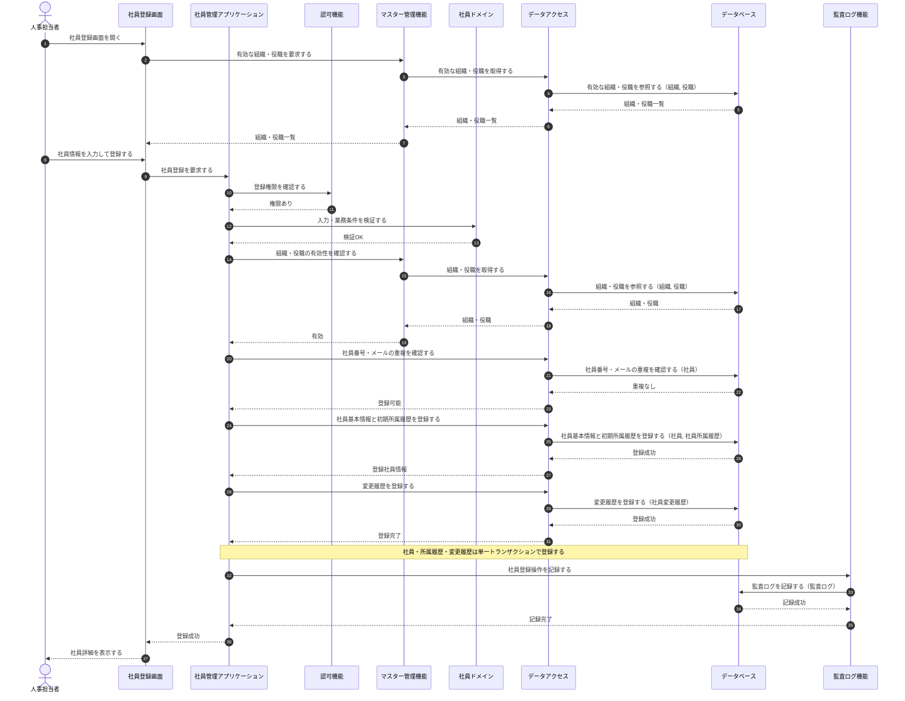
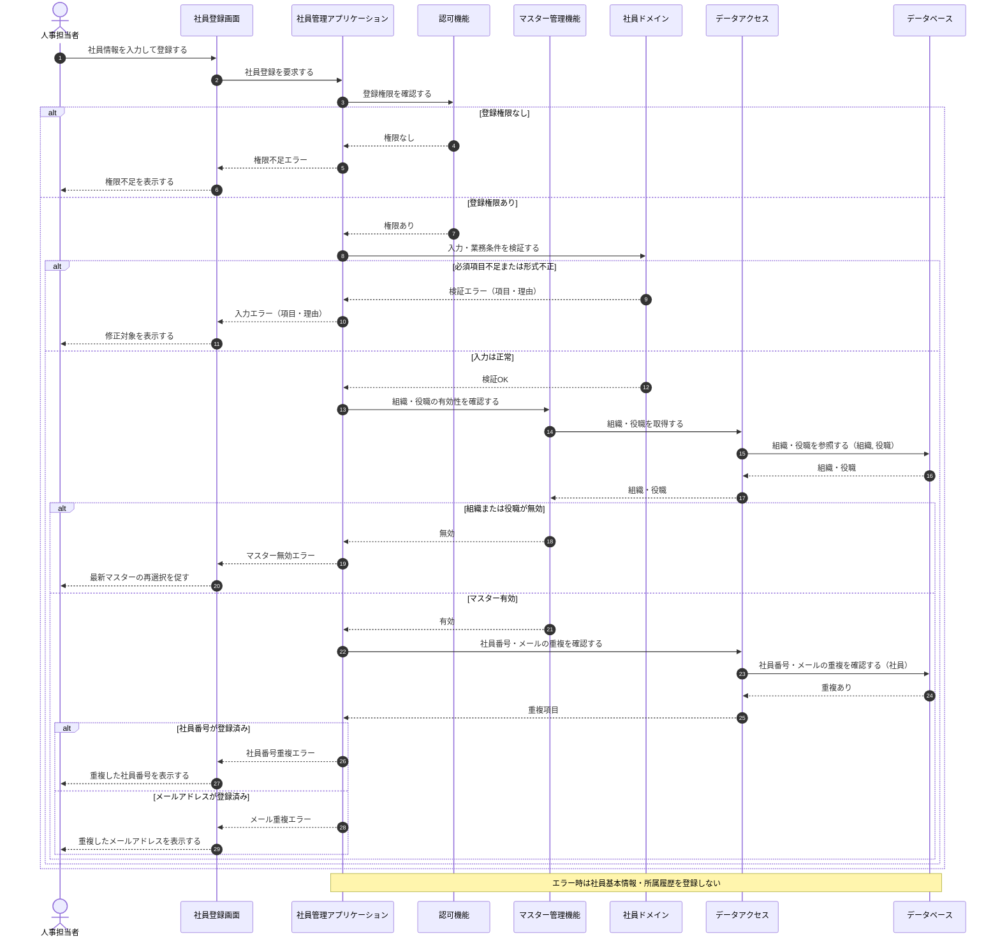
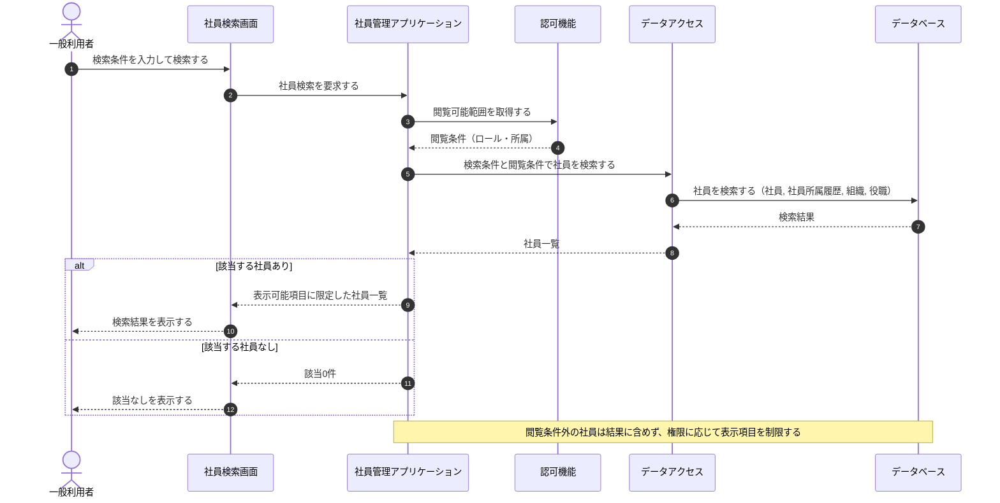
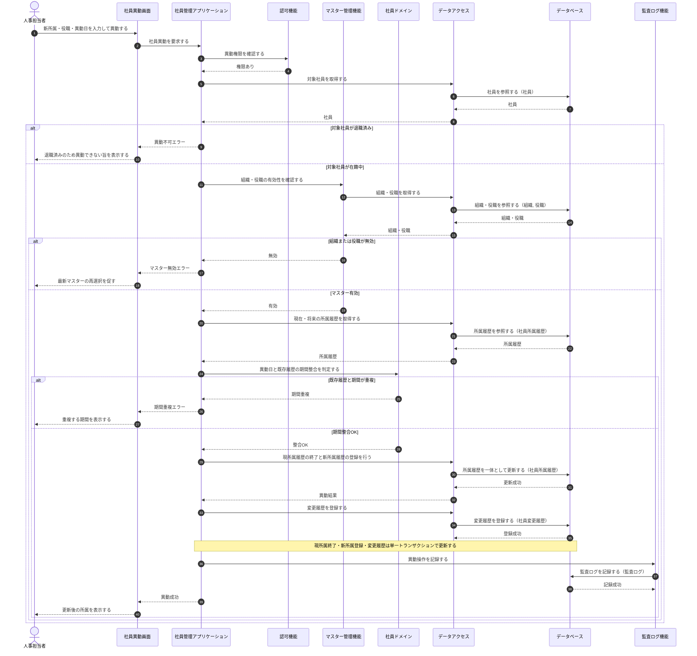

[← 設計書一覧（社員名簿管理システム）](README.md)

# 3. シーケンス設計

本節は、社員名簿管理システムの主要ユースケース(UC-001 社員を登録する / UC-002 社員を検索する / UC-003 社員を異動する)における論理構成要素間の連携を、正常系・代替/例外系に分けて時系列で検証する。各状態パターン(SP-x)は正常系または代替・例外系のいずれかで表現し、各図の直後の連携定義でデータ参照・更新とトランザクション境界を補足する。退職処理(UC-004)は所属履歴終了・状態更新の連携が社員異動(3.5)と同型のため、本節では代表として登録・検索・異動を展開する。

## 3.1 論理構成要素

| 構成要素 | 種別 | ID/参照 | 役割 |
|---|---|---|---|
| 人事担当者 | アクター | - | 社員の登録・異動・退職処理の操作者 |
| 一般利用者 | アクター | - | 権限範囲内での社員検索・参照の操作者(人事担当者/部門管理者/一般社員) |
| 社員登録画面 | 画面 | SCR-003 | 登録情報の入力受付、入力エラー・登録結果の表示 |
| 社員検索画面 | 画面 | SCR-001 | 検索条件入力、一覧表示、詳細画面への遷移 |
| 社員異動画面 | 画面 | SCR-005 | 新所属・役職・異動日の入力受付、異動結果の表示 |
| 社員管理アプリケーション | 機能 | M-002 | 登録・検索・異動ユースケース全体の進行制御 |
| 認可機能 | 機能 | M-003 | ロール・所属・対象データに基づく操作可否と閲覧可能範囲の判定 |
| マスター管理機能 | 機能 | M-005 | 組織・役職の参照と有効性の確認 |
| 社員ドメイン | 機能 | M-004 | 入力・業務条件の検証、在籍状態・所属期間整合の判定 |
| データアクセス | データアクセス | M-006 | 社員・所属履歴・マスター・変更履歴の参照/登録/更新 |
| データベース | DB | - | 社員・社員所属履歴・組織・役職・社員変更履歴・監査ログを保持する |
| 監査ログ機能 | 監査 | M-007 | 登録・異動・退職などの操作証跡の記録 |

## 3.2 社員登録・正常系

UC-001(状態パターン UC-001/SP-1。氏名カナを省略する UC-001/SP-2 も同一の登録フローで処理する)。入力正常・権限あり・マスター有効・重複なしのとき、社員基本情報と初期所属履歴を単一トランザクションで登録し、社員詳細を表示する。

**連携定義**

条件分岐

| 条件ID | 判定箇所 | 条件 | 成立時 | 不成立時 | 根拠 |
|---|---|---|---|---|---|
| COND-01 | 認可機能 | 実行者が社員登録権限を持つ | 登録処理を継続する | 権限不足エラー(3.3で表現) | UC-001/SP-1 (不成立=UC-001/SP-3) |
| COND-02 | 社員ドメイン | 入力・業務条件が妥当 | マスター確認へ進む | 入力エラー(3.3で表現) | UC-001/SP-1 (不成立=UC-001/SP-4) |
| COND-03 | マスター管理機能 | 組織・役職がともに有効 | 重複確認へ進む | マスター無効エラー(3.3で表現) | UC-001/SP-1 (不成立=UC-001/SP-7) |
| COND-04 | データアクセス | 社員番号・メールが重複しない | 登録を実行する | 重複エラー(3.3で表現) | UC-001/SP-1 (不成立=UC-001/SP-5,SP-6) |

データ参照・更新

| エンティティ | CRUD | 目的 | 実行主体 |
|---|---|---|---|
| 組織 | R | 有効な組織の取得・有効性確認 | データアクセス |
| 役職 | R | 有効な役職の取得・有効性確認 | データアクセス |
| 社員 | R | 社員番号・メールアドレスの重複確認 | データアクセス |
| 社員 | C | 社員基本情報の登録(在籍状態=在籍中で登録) | データアクセス |
| 社員所属履歴 | C | 初期所属履歴の登録(適用開始日=入社日) | データアクセス |
| 社員変更履歴 | C | 登録操作の業務変更履歴記録 | データアクセス |
| 監査ログ | C | 社員登録操作の証跡記録 | 監査ログ機能 |

トランザクション境界

| 境界ID | 開始 | 終了 | 対象更新 | ロールバック条件 | 管理主体 |
|---|---|---|---|---|---|
| TX-01 | 社員基本情報の登録開始 | COMMIT | 社員・社員所属履歴・社員変更履歴 | いずれかの登録に失敗した場合にロールバック | 社員管理アプリケーション |

補足事項

| 観点 | 内容 |
|---|---|
| 同期/非同期 | 画面〜登録完了まで同期。監査ログ記録は業務トランザクションと別に行う |
| 整合性 | 社員番号・メールアドレスの一意性はデータベースの一意制約でも担保する(重複確認と二重防御) |
| 監査ログ | 監査ログの記録は別トランザクションとし、失敗時の扱いは運用設計/詳細設計で確定する |

## 3.3 社員登録・入力不正/重複

UC-001 の代替・例外系(UC-001/SP-3〜SP-7)。権限確認→入力検証→マスター有効性→重複確認の順で判定し、いずれかで不成立となった場合は該当エラーを表示して登録しない。

**状態パターン対応**

| 分岐 | 条件 | 状態パターン | 本シーケンスでの処理 |
|---|---|---|---|
| a | 登録権限なし | UC-001/SP-3 | 権限不足を表示し、登録しない |
| b | 必須項目不足または形式不正 | UC-001/SP-4 | 対象項目と理由を表示し、登録しない |
| c | 組織または役職が無効 | UC-001/SP-7 | 最新マスターの再選択を促し、登録しない |
| d | 社員番号が登録済み | UC-001/SP-5 | 重複した社員番号を表示し、登録しない |
| e | メールアドレスが登録済み | UC-001/SP-6 | 重複したメールアドレスを表示し、登録しない |
| f | 保存中に異常(TX-01失敗) | －（§2の業務状態パターン対象外） | 社員・所属履歴をともに未登録として扱う(TX-01 ロールバック。3.2 参照) |

データ参照・更新

| エンティティ | CRUD | 目的 | 実行主体 |
|---|---|---|---|
| 組織 | R | 組織の有効性確認 | データアクセス |
| 役職 | R | 役職の有効性確認 | データアクセス |
| 社員 | R | 社員番号・メールアドレスの重複確認 | データアクセス |

補足: 本シーケンスは参照のみで、いずれの分岐でも社員・所属履歴・変更履歴を登録しない(更新なし)。

## 3.4 社員検索

UC-002(状態パターン UC-002/SP-1・SP-2)。認可機能から閲覧可能範囲を取得し、検索条件と閲覧条件を合わせて社員を検索し、権限に応じた表示項目に限定して一覧を表示する。

**連携定義**

条件分岐

| 条件ID | 判定箇所 | 条件 | 成立時 | 不成立時 | 根拠 |
|---|---|---|---|---|---|
| COND-01 | 認可機能 | 実行者の閲覧可能範囲を取得できる | 範囲内条件で検索する | (認証済みのため常に取得) | UC-002/SP-1 |
| COND-02 | 社員管理アプリケーション | 検索結果が1件以上ある | 一覧を表示する | 該当なしを表示する | UC-002/SP-1 (不成立=UC-002/SP-2) |

データ参照・更新

| エンティティ | CRUD | 目的 | 実行主体 |
|---|---|---|---|
| 社員 | R | 検索条件・閲覧条件に一致する社員の取得 | データアクセス |
| 社員所属履歴 | R | 有効な所属・役職の付与 | データアクセス |
| 組織 | R | 組織名の付与 | データアクセス |
| 役職 | R | 役職名の付与 | データアクセス |

トランザクション境界

| 内容 |
|---|
| なし(参照のみ。更新を伴わないため) |

補足事項

| 観点 | 内容 |
|---|---|
| 性能 | 一覧は件数が多くなり得るためページング前提で取得する |
| 個人情報保護 | 閲覧条件外の社員は結果に含めず、権限に応じて返却項目を制限する |

## 3.5 社員異動

UC-003(状態パターン UC-003/SP-1〜SP-6。未来日付の異動は UC-003/SP-2 として基本フローに含む)。権限・在籍状態・マスター有効性を確認し、異動日と既存の所属履歴の期間整合を判定したうえで、現所属履歴の終了と新所属履歴の登録を単一トランザクションで更新する。

**連携定義**

条件分岐

| 条件ID | 判定箇所 | 条件 | 成立時 | 不成立時 | 根拠 |
|---|---|---|---|---|---|
| COND-01 | 認可機能 | 実行者が社員異動権限を持つ | 対象社員の確認へ進む | 権限不足エラー | UC-003/SP-1 (不成立=UC-003/SP-3) |
| COND-02 | 社員管理アプリケーション | 対象社員が在籍中である | マスター確認へ進む | 異動不可エラー | UC-003/SP-1 (不成立=UC-003/SP-4) |
| COND-03 | マスター管理機能 | 新組織・新役職がともに有効 | 期間整合判定へ進む | マスター無効エラー | UC-003/SP-1 (不成立=UC-003/SP-5) |
| COND-04 | 社員ドメイン | 異動日と既存履歴に期間重複がない | 所属履歴を更新する | 期間重複エラー | UC-003/SP-1 (不成立=UC-003/SP-6) |

データ参照・更新

| エンティティ | CRUD | 目的 | 実行主体 |
|---|---|---|---|
| 社員 | R | 対象社員の取得・在籍状態の確認 | データアクセス |
| 組織 | R | 新組織の有効性確認 | データアクセス |
| 役職 | R | 新役職の有効性確認 | データアクセス |
| 社員所属履歴 | R | 現在・将来の履歴取得と期間整合の確認 | データアクセス |
| 社員所属履歴 | U | 現所属履歴の終了(適用終了日の設定) | データアクセス |
| 社員所属履歴 | C | 新所属履歴の登録(適用開始日=異動日) | データアクセス |
| 社員変更履歴 | C | 異動操作の業務変更履歴記録 | データアクセス |
| 監査ログ | C | 異動操作の証跡記録 | 監査ログ機能 |

トランザクション境界

| 境界ID | 開始 | 終了 | 対象更新 | ロールバック条件 | 管理主体 |
|---|---|---|---|---|---|
| TX-01 | 現所属履歴の終了開始 | COMMIT | 社員所属履歴(現履歴終了・新履歴登録)・社員変更履歴 | いずれかの更新に失敗、または期間整合違反を検出 | 社員管理アプリケーション |

補足事項

| 観点 | 内容 |
|---|---|
| 同期/非同期 | 画面〜異動完了まで同期。監査ログ記録は業務トランザクションと別に行う |
| 排他制御 | 同一社員の所属履歴は有効期間が重複しないよう整合判定を行い、更新競合を検知する |
| 監査ログ | 監査ログの記録は別トランザクションとし、失敗時の扱いは運用設計/詳細設計で確定する |
