[← 設計書一覧（社員名簿管理システム）](README.md)

# 3. シーケンス設計

本節は、社員名簿管理システムの全ユースケース(UC-001〜UC-012)における論理構成要素間の連携を、正常系・代替/例外系に分けて時系列で検証する。各状態パターン(SP-x)は正常系または代替・例外系のいずれかで表現し、各図の直後の連携定義でデータ参照・更新とトランザクション境界を補足する。3.2〜3.3で社員登録(UC-001)、3.4で社員検索(UC-002)、3.5で社員異動(UC-003)、3.6で社員退職(UC-004)、3.7でログイン(UC-005)、3.8で社員詳細参照(UC-006)、3.9で社員基本情報更新(UC-007)、3.10で変更履歴参照(UC-008)、3.11で検索結果出力(UC-009)、3.12で組織マスター管理(UC-010)、3.13で役職マスター管理(UC-011)、3.14で権限管理(UC-012)を展開する。

## 3.1 論理構成要素

| 構成要素 | 種別 | ID/参照 | 役割 |
|---|---|---|---|
| 人事担当者 | アクター | - | 社員の登録・更新・異動・退職・出力の操作者 |
| 一般利用者 | アクター | - | 権限範囲内での社員検索・詳細参照の操作者(部門管理者/一般社員) |
| システム管理者 | アクター | - | マスター・権限・変更履歴の管理操作者 |
| 利用者 | アクター | - | ログイン等、ロール横断で行う操作の全利用者(全ロール共通) |
| ログイン画面 | 画面 | SCR-010 | 認証情報の入力受付、ログイン結果の表示 |
| 社員検索画面 | 画面 | SCR-001 | 検索条件入力、一覧表示、検索結果出力、詳細画面への遷移 |
| 社員詳細画面 | 画面 | SCR-002 | 社員の基本情報・所属・履歴の参照表示 |
| 社員登録画面 | 画面 | SCR-003 | 登録情報の入力受付、入力エラー・登録結果の表示 |
| 社員編集画面 | 画面 | SCR-004 | 基本情報の編集受付、更新結果・競合の表示 |
| 社員異動画面 | 画面 | SCR-005 | 新所属・役職・異動日の入力受付、異動結果の表示 |
| 退職処理画面 | 画面 | SCR-006 | 退職日の入力受付、退職結果の表示 |
| 変更履歴画面 | 画面 | SCR-007 | 社員の変更履歴の参照表示 |
| 組織マスター画面 | 画面 | SCR-008 | 組織の登録・変更・無効化の操作受付 |
| 役職マスター画面 | 画面 | SCR-009 | 役職の登録・変更・無効化の操作受付 |
| 権限管理画面 | 画面 | (詳細設計で採番) | ロール割当の操作受付 |
| 社員管理アプリケーション | 機能 | M-002 | 各ユースケース全体の進行制御 |
| 認可機能 | 機能 | M-003 | 認証状態・ロール・対象範囲に基づく操作可否/閲覧範囲の判定、ロール割当 |
| 社員ドメイン | 機能 | M-004 | 入力・業務条件の検証、状態遷移・所属期間整合の判定 |
| マスター管理機能 | 機能 | M-005 | 組織・役職の参照・有効性確認・登録更新 |
| データアクセス | データアクセス | M-006 | 各エンティティの参照/登録/更新 |
| 監査ログ機能 | 監査 | M-007 | 操作証跡の記録 |
| 外部認証アダプター | 機能 | M-008 | 社内認証基盤との接続差異の吸収 |
| 社内認証基盤 | 外部 | - | 認証情報の検証(外部サービス) |
| データベース | DB | - | 全エンティティ(社員・社員所属履歴・組織・役職・社員変更履歴・利用者アカウント・ロール・利用者ロール・監査ログ)を保持する |

## 3.2 社員登録・正常系

UC-001(状態パターン UC-001/SP-1。氏名カナを省略する UC-001/SP-2 も同一の登録フローで処理する)。入力正常・権限あり・マスター有効・重複なしのとき、社員基本情報と初期所属履歴を単一トランザクションで登録し、社員詳細を表示する。

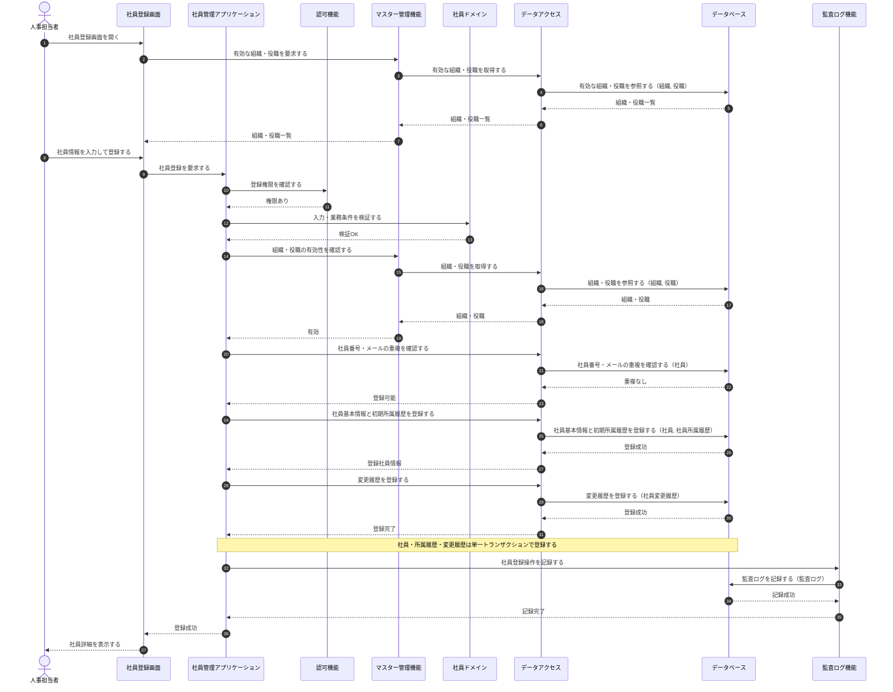

**連携定義**

条件分岐

| 条件ID | 判定箇所 | 条件 | 成立時 | 不成立時 | 根拠 |
|---|---|---|---|---|---|
| COND-01 | 認可機能 | 実行者が社員登録権限を持つ | 登録処理を継続する | 権限不足エラー(3.3で表現) | UC-001/SP-1 (不成立=UC-001/SP-3) |
| COND-02 | 社員ドメイン | 入力・業務条件が妥当 | マスター確認へ進む | 入力エラー(3.3で表現) | UC-001/SP-1 (不成立=UC-001/SP-4) |
| COND-03 | マスター管理機能 | 組織・役職がともに有効 | 重複確認へ進む | マスター無効エラー(3.3で表現) | UC-001/SP-1 (不成立=UC-001/SP-7) |
| COND-04 | データアクセス | 社員番号・メールが重複しない | 登録を実行する | 重複エラー(3.3で表現) | UC-001/SP-1 (不成立=UC-001/SP-5,SP-6) |

データ参照・更新

| エンティティ | CRUD | 目的 | 実行主体 |
|---|---|---|---|
| 組織 | R | 有効な組織の取得・有効性確認 | データアクセス |
| 役職 | R | 有効な役職の取得・有効性確認 | データアクセス |
| 社員 | R | 社員番号・メールアドレスの重複確認 | データアクセス |
| 社員 | C | 社員基本情報の登録(在籍状態=在籍中で登録) | データアクセス |
| 社員所属履歴 | C | 初期所属履歴の登録(適用開始日=入社日) | データアクセス |
| 社員変更履歴 | C | 登録操作の業務変更履歴記録 | データアクセス |
| 監査ログ | C | 社員登録操作の証跡記録 | 監査ログ機能 |

トランザクション境界

| 境界ID | 開始 | 終了 | 対象更新 | ロールバック条件 | 管理主体 |
|---|---|---|---|---|---|
| TX-01 | 社員基本情報の登録開始 | COMMIT | 社員・社員所属履歴・社員変更履歴 | いずれかの登録に失敗した場合にロールバック | 社員管理アプリケーション |

補足事項

| 観点 | 内容 |
|---|---|
| 同期/非同期 | 画面〜登録完了まで同期。監査ログ記録は業務トランザクションと別に行う |
| 整合性 | 社員番号・メールアドレスの一意性はデータベースの一意制約でも担保する(重複確認と二重防御) |
| 監査ログ | 監査ログの記録は別トランザクションとし、失敗時の扱いは運用設計/詳細設計で確定する |

## 3.3 社員登録・入力不正/重複

UC-001 の代替・例外系(UC-001/SP-3〜SP-7)。権限確認→入力検証→マスター有効性→重複確認の順で判定し、いずれかで不成立となった場合は該当エラーを表示して登録しない。

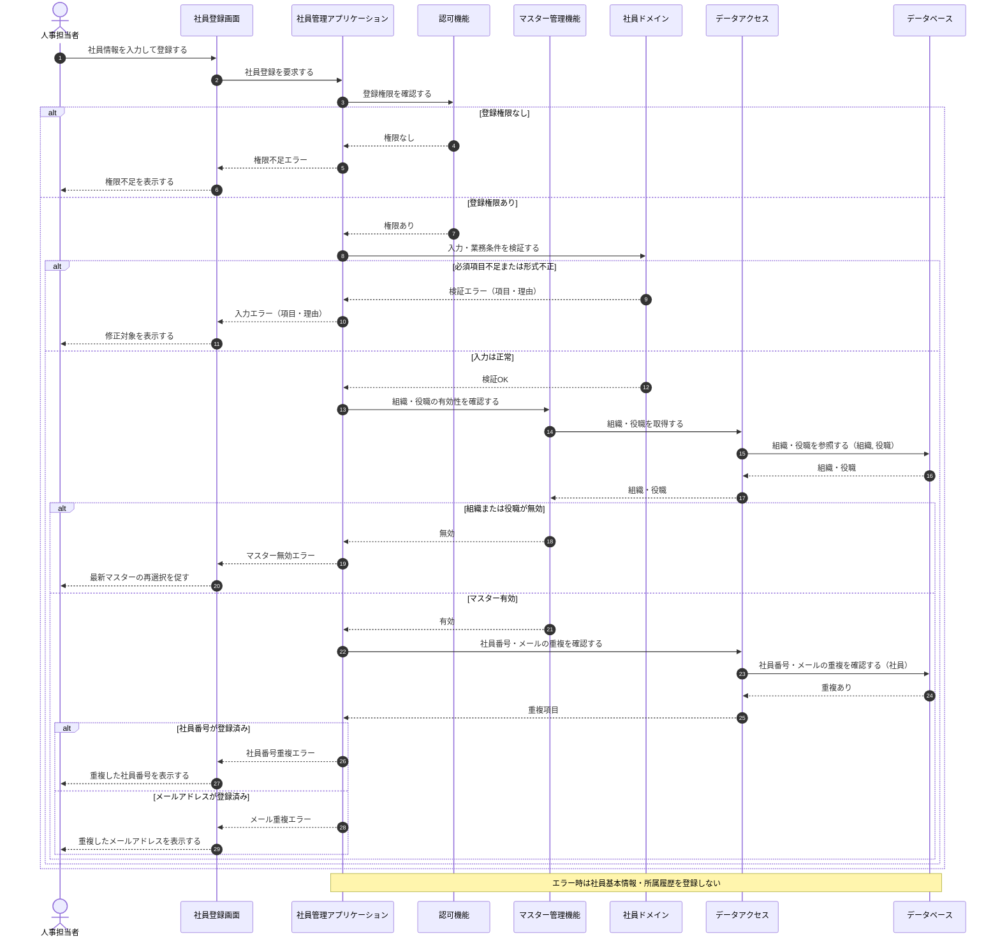

**状態パターン対応**

| 分岐 | 条件 | 状態パターン | 本シーケンスでの処理 |
|---|---|---|---|
| a | 登録権限なし | UC-001/SP-3 | 権限不足を表示し、登録しない |
| b | 必須項目不足または形式不正 | UC-001/SP-4 | 対象項目と理由を表示し、登録しない |
| c | 組織または役職が無効 | UC-001/SP-7 | 最新マスターの再選択を促し、登録しない |
| d | 社員番号が登録済み | UC-001/SP-5 | 重複した社員番号を表示し、登録しない |
| e | メールアドレスが登録済み | UC-001/SP-6 | 重複したメールアドレスを表示し、登録しない |
| f | 保存中に異常(TX-01失敗) | －（§2の業務状態パターン対象外） | 社員・所属履歴をともに未登録として扱う(TX-01 ロールバック。3.2 参照) |

データ参照・更新

| エンティティ | CRUD | 目的 | 実行主体 |
|---|---|---|---|
| 組織 | R | 組織の有効性確認 | データアクセス |
| 役職 | R | 役職の有効性確認 | データアクセス |
| 社員 | R | 社員番号・メールアドレスの重複確認 | データアクセス |

補足: 本シーケンスは参照のみで、いずれの分岐でも社員・所属履歴・変更履歴を登録しない(更新なし)。

## 3.4 社員検索

UC-002(状態パターン UC-002/SP-1・SP-2)。認可機能から閲覧可能範囲を取得し、検索条件と閲覧条件を合わせて社員を検索し、権限に応じた表示項目に限定して一覧を表示する。

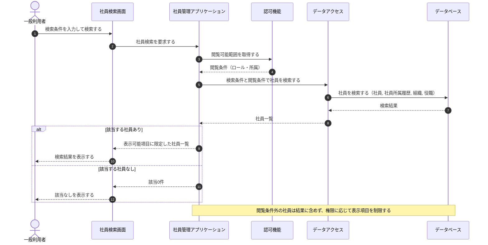

**連携定義**

条件分岐

| 条件ID | 判定箇所 | 条件 | 成立時 | 不成立時 | 根拠 |
|---|---|---|---|---|---|
| COND-01 | 認可機能 | 実行者の閲覧可能範囲を取得できる | 範囲内条件で検索する | (認証済みのため常に取得) | UC-002/SP-1 |
| COND-02 | 社員管理アプリケーション | 検索結果が1件以上ある | 一覧を表示する | 該当なしを表示する | UC-002/SP-1 (不成立=UC-002/SP-2) |

データ参照・更新

| エンティティ | CRUD | 目的 | 実行主体 |
|---|---|---|---|
| 社員 | R | 検索条件・閲覧条件に一致する社員の取得 | データアクセス |
| 社員所属履歴 | R | 有効な所属・役職の付与 | データアクセス |
| 組織 | R | 組織名の付与 | データアクセス |
| 役職 | R | 役職名の付与 | データアクセス |

トランザクション境界

| 内容 |
|---|
| なし(参照のみ。更新を伴わないため) |

補足事項

| 観点 | 内容 |
|---|---|
| 性能 | 一覧は件数が多くなり得るためページング前提で取得する |
| 個人情報保護 | 閲覧条件外の社員は結果に含めず、権限に応じて返却項目を制限する |

## 3.5 社員異動

UC-003(状態パターン UC-003/SP-1〜SP-6。未来日付の異動は UC-003/SP-2 として基本フローに含む)。権限・在籍状態・マスター有効性を確認し、異動日と既存の所属履歴の期間整合を判定したうえで、現所属履歴の終了と新所属履歴の登録を単一トランザクションで更新する。

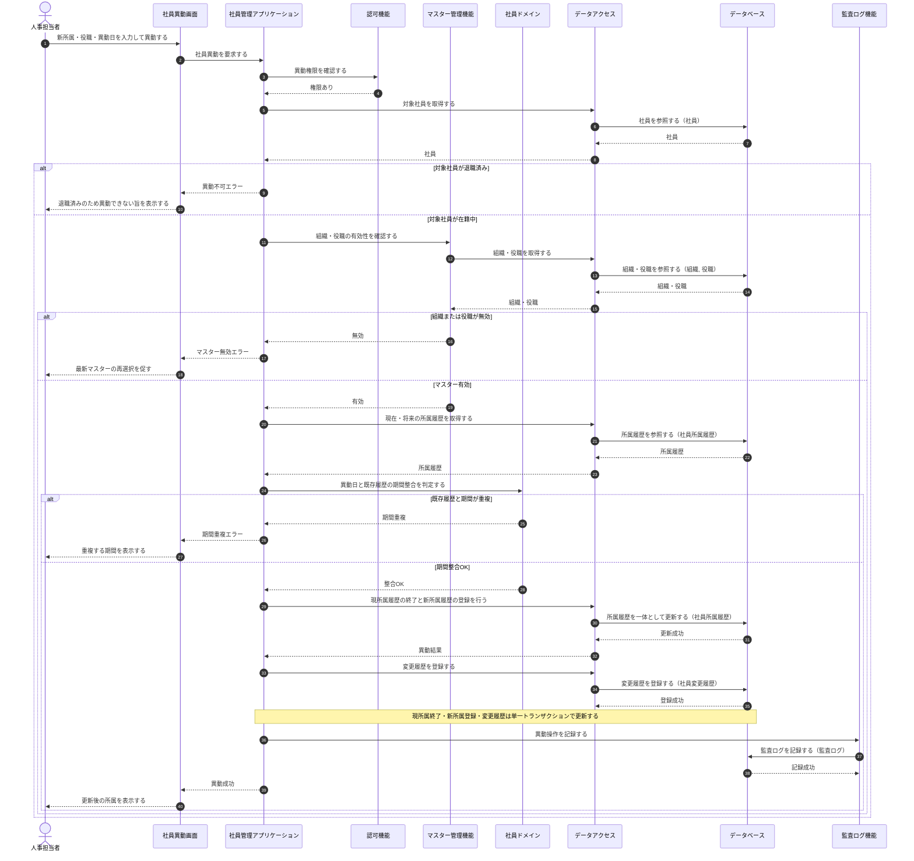

**連携定義**

条件分岐

| 条件ID | 判定箇所 | 条件 | 成立時 | 不成立時 | 根拠 |
|---|---|---|---|---|---|
| COND-01 | 認可機能 | 実行者が社員異動権限を持つ | 対象社員の確認へ進む | 権限不足エラー | UC-003/SP-1 (不成立=UC-003/SP-3) |
| COND-02 | 社員管理アプリケーション | 対象社員が在籍中である | マスター確認へ進む | 異動不可エラー | UC-003/SP-1 (不成立=UC-003/SP-4) |
| COND-03 | マスター管理機能 | 新組織・新役職がともに有効 | 期間整合判定へ進む | マスター無効エラー | UC-003/SP-1 (不成立=UC-003/SP-5) |
| COND-04 | 社員ドメイン | 異動日と既存履歴に期間重複がない | 所属履歴を更新する | 期間重複エラー | UC-003/SP-1 (不成立=UC-003/SP-6) |

データ参照・更新

| エンティティ | CRUD | 目的 | 実行主体 |
|---|---|---|---|
| 社員 | R | 対象社員の取得・在籍状態の確認 | データアクセス |
| 組織 | R | 新組織の有効性確認 | データアクセス |
| 役職 | R | 新役職の有効性確認 | データアクセス |
| 社員所属履歴 | R | 現在・将来の履歴取得と期間整合の確認 | データアクセス |
| 社員所属履歴 | U | 現所属履歴の終了(適用終了日の設定) | データアクセス |
| 社員所属履歴 | C | 新所属履歴の登録(適用開始日=異動日) | データアクセス |
| 社員変更履歴 | C | 異動操作の業務変更履歴記録 | データアクセス |
| 監査ログ | C | 異動操作の証跡記録 | 監査ログ機能 |

トランザクション境界

| 境界ID | 開始 | 終了 | 対象更新 | ロールバック条件 | 管理主体 |
|---|---|---|---|---|---|
| TX-01 | 現所属履歴の終了開始 | COMMIT | 社員所属履歴(現履歴終了・新履歴登録)・社員変更履歴 | いずれかの更新に失敗、または期間整合違反を検出 | 社員管理アプリケーション |

補足事項

| 観点 | 内容 |
|---|---|
| 同期/非同期 | 画面〜異動完了まで同期。監査ログ記録は業務トランザクションと別に行う |
| 排他制御 | 同一社員の所属履歴は有効期間が重複しないよう整合判定を行い、更新競合を検知する |
| 監査ログ | 監査ログの記録は別トランザクションとし、失敗時の扱いは運用設計/詳細設計で確定する |

## 3.6 社員退職

UC-004(状態パターン UC-004/SP-1〜SP-5。未来日付の退職は UC-004/SP-2 として退職予約で登録する)。退職処理権限・対象社員の在籍状態・退職日の妥当性を確認し、社員状態の退職への更新・有効な所属履歴の退職日終了・変更履歴登録を単一トランザクションで更新する。

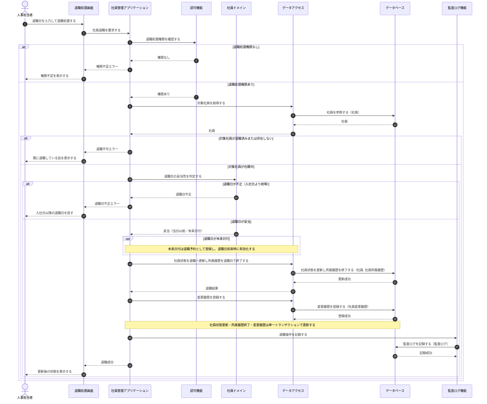

**連携定義**

条件分岐

| 条件ID | 判定箇所 | 条件 | 成立時 | 不成立時 | 根拠 |
|---|---|---|---|---|---|
| COND-01 | 認可機能 | 実行者が退職処理権限を持つ | 対象社員の確認へ進む | 権限不足エラー | UC-004/SP-1 (不成立=UC-004/SP-3) |
| COND-02 | 社員管理アプリケーション | 対象社員が存在し在籍中である | 退職日妥当性の判定へ進む | 退職不可エラー | UC-004/SP-1 (不成立=UC-004/SP-4) |
| COND-03 | 社員ドメイン | 退職日が妥当(入社日以降) | 退職更新を実行する | 退職日不正エラー | UC-004/SP-1 (不成立=UC-004/SP-5) |
| COND-04 | 社員ドメイン | 退職日が当日以前である | 即時に退職状態へ更新する | 退職予約として登録する | UC-004/SP-1 (不成立=UC-004/SP-2) |

データ参照・更新

| エンティティ | CRUD | 目的 | 実行主体 |
|---|---|---|---|
| 社員 | R | 対象社員の取得・在籍状態の確認 | データアクセス |
| 社員 | U | 在籍状態=退職への更新・退職日の登録 | データアクセス |
| 社員所属履歴 | U | 有効な所属履歴の退職日での終了 | データアクセス |
| 社員変更履歴 | C | 退職操作の業務変更履歴記録 | データアクセス |
| 監査ログ | C | 退職操作の証跡記録 | 監査ログ機能 |

トランザクション境界

| 境界ID | 開始 | 終了 | 対象更新 | ロールバック条件 | 管理主体 |
|---|---|---|---|---|---|
| TX-01 | 社員状態の退職更新開始 | COMMIT | 社員(状態・退職日)・社員所属履歴(退職日終了)・社員変更履歴 | いずれかの更新に失敗した場合にロールバック | 社員管理アプリケーション |

補足事項

| 観点 | 内容 |
|---|---|
| 同期/非同期 | 画面〜退職完了まで同期。監査ログ記録は業務トランザクションと別に行う |
| 退職予約 | 退職日が未来日付の場合は退職予約として退職日・状態変更を登録し、退職日到来時に有効化する(UC-004/SP-2) |
| 排他制御 | 対象社員の版数照合と在籍状態の確認により、退職済みへの二重処理・更新競合を検知する |
| 監査ログ | 監査ログの記録は別トランザクションとし、失敗時の扱いは運用設計/詳細設計で確定する |

## 3.7 ログイン

UC-005(状態パターン UC-005/SP-1〜SP-3)。社内認証基盤で認証情報を検証し、利用者アカウントの有効性とロールを確認したうえでセッションを発行し、ログインを監査ログに記録する。業務データの更新は伴わない。

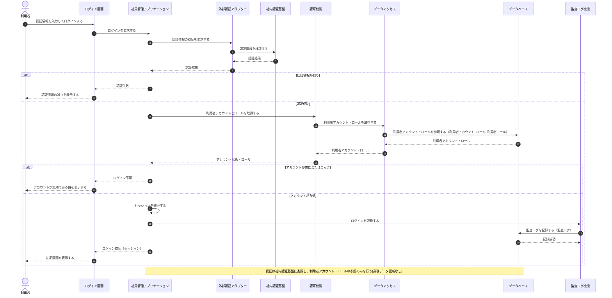

**連携定義**

条件分岐

| 条件ID | 判定箇所 | 条件 | 成立時 | 不成立時 | 根拠 |
|---|---|---|---|---|---|
| COND-01 | 社内認証基盤 | 認証情報が正しい | アカウント有効性の確認へ進む | 認証失敗 | UC-005/SP-1 (不成立=UC-005/SP-2) |
| COND-02 | 認可機能 | 利用者アカウントが有効(無効・ロックでない) | セッションを発行しログインを許可する | ログイン不可 | UC-005/SP-1 (不成立=UC-005/SP-3) |

データ参照・更新

| エンティティ | CRUD | 目的 | 実行主体 |
|---|---|---|---|
| 利用者アカウント | R | 認証済み利用者のアカウント取得・有効性確認 | データアクセス |
| ロール | R | 利用者に割り当てられたロールの取得 | データアクセス |
| 利用者ロール | R | 利用者とロールの対応取得 | データアクセス |
| 監査ログ | C | ログイン操作の証跡記録 | 監査ログ機能 |

トランザクション境界

| 内容 |
|---|
| なし(参照のみ。セッション発行・監査ログ記録は業務データ更新を伴わないため別扱いとする) |

補足事項

| 観点 | 内容 |
|---|---|
| 認証委譲 | 認証情報の検証は社内認証基盤(外部)へ委譲し、システムはパスワードを保持しない |
| セッション | 認証成功かつアカウント有効時にセッションを発行し、以降の操作の認証状態とする |
| アカウント無効 | 無効・ロック中のアカウントは認証成功であってもログインを許可しない(UC-005/SP-3) |
| 監査ログ | ログインの成否は監査ログに記録し、業務トランザクションと別に行う |

## 3.8 社員詳細参照

UC-006(状態パターン UC-006/SP-1〜SP-3)。対象社員の存在と実行者の閲覧権限を確認したうえで、社員・所属履歴・組織・役職を参照し、権限に応じた表示項目に限定して詳細を表示する。参照のみで更新を伴わない。

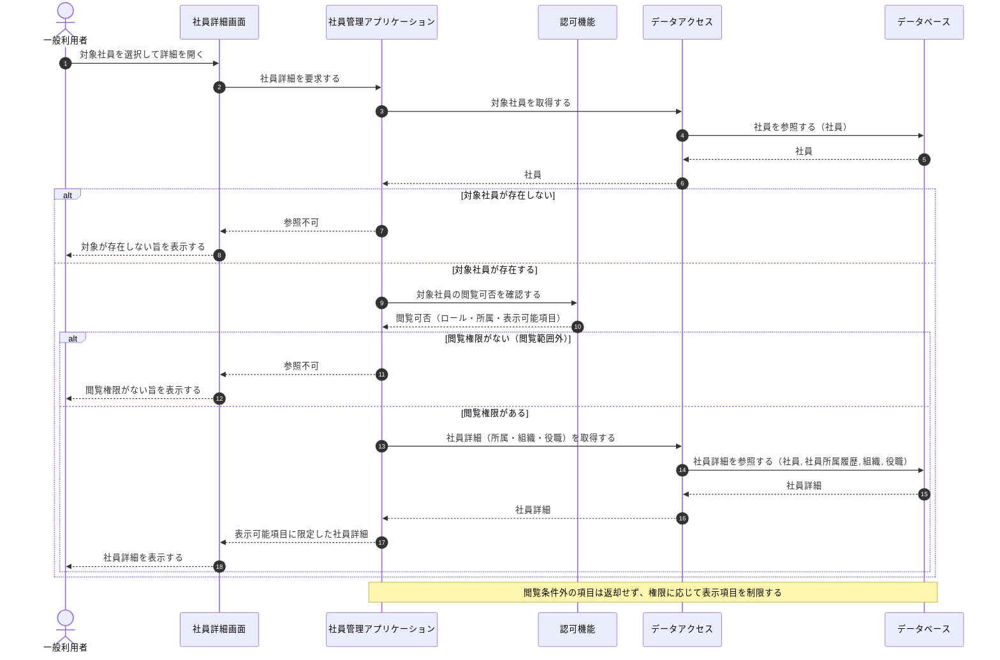

**連携定義**

条件分岐

| 条件ID | 判定箇所 | 条件 | 成立時 | 不成立時 | 根拠 |
|---|---|---|---|---|---|
| COND-01 | 社員管理アプリケーション | 対象社員が存在する | 閲覧権限の確認へ進む | 参照不可(存在しない) | UC-006/SP-1 (不成立=UC-006/SP-2) |
| COND-02 | 認可機能 | 実行者が対象社員の閲覧権限を持つ(閲覧範囲内) | 権限に応じた項目で詳細を表示する | 参照不可(閲覧範囲外) | UC-006/SP-1 (不成立=UC-006/SP-3) |

データ参照・更新

| エンティティ | CRUD | 目的 | 実行主体 |
|---|---|---|---|
| 社員 | R | 対象社員の存在確認・基本情報の取得 | データアクセス |
| 社員所属履歴 | R | 有効な所属・役職・在籍状態の取得 | データアクセス |
| 組織 | R | 所属組織名の付与 | データアクセス |
| 役職 | R | 役職名の付与 | データアクセス |

トランザクション境界

| 内容 |
|---|
| なし(参照のみ。更新を伴わないため) |

補足事項

| 観点 | 内容 |
|---|---|
| 個人情報保護 | 閲覧権限に応じて表示項目を制限し、範囲外の項目は詳細に含めない |
| 閲覧判定 | 対象社員の所属・在籍状態と実行者のロール・所属から閲覧可否を判定する |
| 性能 | 詳細は単一社員が対象のため、所属・組織・役職を一括で取得する |

## 3.9 社員基本情報更新

UC-007(状態パターン UC-007/SP-1〜SP-5)。更新権限・入力妥当性・メールアドレスの一意性・更新競合を確認し、社員基本情報の更新と変更履歴登録を単一トランザクションで更新する。取得時の版数と現在値が不一致の場合は更新せず、最新情報の再取得を要求する。

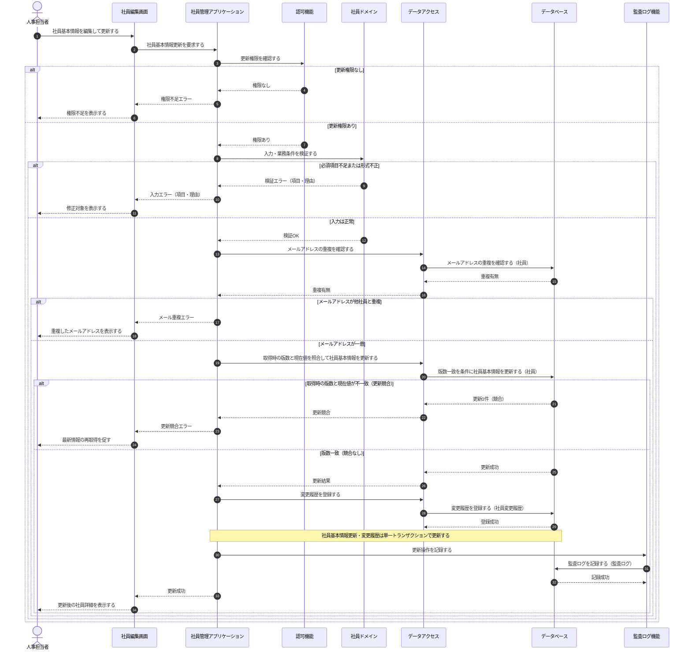

**連携定義**

条件分岐

| 条件ID | 判定箇所 | 条件 | 成立時 | 不成立時 | 根拠 |
|---|---|---|---|---|---|
| COND-01 | 認可機能 | 実行者が社員基本情報の更新権限を持つ | 入力検証へ進む | 権限不足エラー | UC-007/SP-1 (不成立=UC-007/SP-2) |
| COND-02 | 社員ドメイン | 入力・業務条件が妥当 | メール重複確認へ進む | 入力エラー | UC-007/SP-1 (不成立=UC-007/SP-3) |
| COND-03 | データアクセス | メールアドレスが他社員と重複しない | 更新競合の確認へ進む | メール重複エラー | UC-007/SP-1 (不成立=UC-007/SP-4) |
| COND-04 | データアクセス | 取得時の版数と現在値が一致する | 社員基本情報を更新する | 更新競合エラー(最新再取得を要求) | UC-007/SP-1 (不成立=UC-007/SP-5) |

データ参照・更新

| エンティティ | CRUD | 目的 | 実行主体 |
|---|---|---|---|
| 社員 | R | メールアドレスの重複確認・更新競合(版数照合)の判定 | データアクセス |
| 社員 | U | 社員基本情報の更新(版数の加算を含む) | データアクセス |
| 社員変更履歴 | C | 更新操作の業務変更履歴記録 | データアクセス |
| 監査ログ | C | 更新操作の証跡記録 | 監査ログ機能 |

トランザクション境界

| 境界ID | 開始 | 終了 | 対象更新 | ロールバック条件 | 管理主体 |
|---|---|---|---|---|---|
| TX-01 | 社員基本情報の更新開始 | COMMIT | 社員(基本情報・版数)・社員変更履歴 | 取得時の版数と不一致(更新競合)を検出、またはいずれかの更新に失敗 | 社員管理アプリケーション |

補足事項

| 観点 | 内容 |
|---|---|
| 同期/非同期 | 画面〜更新完了まで同期。監査ログ記録は業務トランザクションと別に行う |
| 更新競合 | 取得時の版数と現在値を照合して競合を検知し、不一致の場合は更新せず最新情報の再取得を要求する(UC-007/SP-5) |
| 権限範囲 | 更新権限は人事担当者に加え、条件を満たす本人にも限定的に付与する |
| 監査ログ | 監査ログの記録は別トランザクションとし、失敗時の扱いは運用設計/詳細設計で確定する |

## 3.10 変更履歴参照

UC-008(状態パターン UC-008/SP-1〜SP-3)。認可機能で変更履歴の参照権限を確認し、権限がある場合に対象社員の変更履歴を取得して時系列で一覧表示する。参照権限がない場合は参照不可を表示し、履歴が0件の場合は該当なしを表示する。参照のみで更新は行わない。

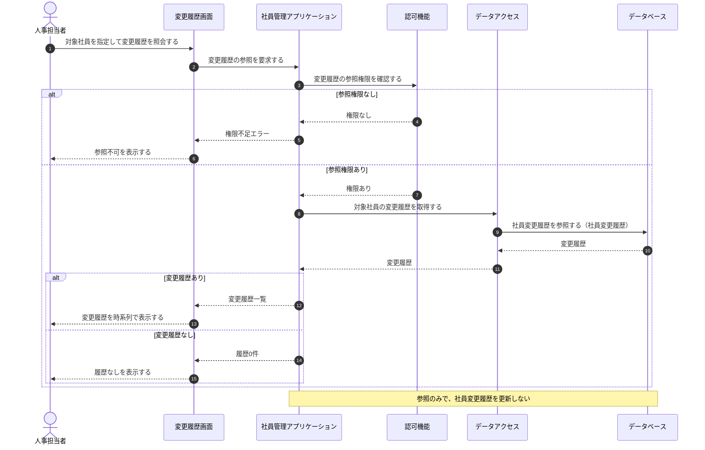

**連携定義**

条件分岐

| 条件ID | 判定箇所 | 条件 | 成立時 | 不成立時 | 根拠 |
|---|---|---|---|---|---|
| COND-01 | 認可機能 | 実行者が変更履歴の参照権限を持つ | 変更履歴の取得へ進む | 権限不足エラー | UC-008/SP-1 (不成立=UC-008/SP-3) |
| COND-02 | 社員管理アプリケーション | 対象社員の変更履歴が1件以上ある | 変更履歴一覧を表示する | 履歴なしを表示する | UC-008/SP-1 (不成立=UC-008/SP-2) |

データ参照・更新

| エンティティ | CRUD | 目的 | 実行主体 |
|---|---|---|---|
| 社員変更履歴 | R | 対象社員の変更履歴の取得 | データアクセス |

トランザクション境界

| 内容 |
|---|
| なし(参照のみ。更新を伴わないため) |

補足事項

| 観点 | 内容 |
|---|---|
| 性能 | 変更履歴は件数が多くなり得るため時系列順・ページング前提で取得する |
| 個人情報保護 | 参照権限の範囲を超える社員の変更履歴は取得対象に含めない |
| 監査ログ | 参照操作の証跡記録の要否は運用設計/詳細設計で確定する |

## 3.11 検索結果出力

UC-009(状態パターン UC-009/SP-1〜SP-3)。認可機能で出力権限と閲覧可能範囲を確認し、出力条件と閲覧条件で社員を取得して、権限で許可された項目に限定した出力データを生成する。出力に成功した場合は監査ログを記録する。出力権限がない場合は出力不可を表示し、対象0件の場合は出力対象なしを通知する。

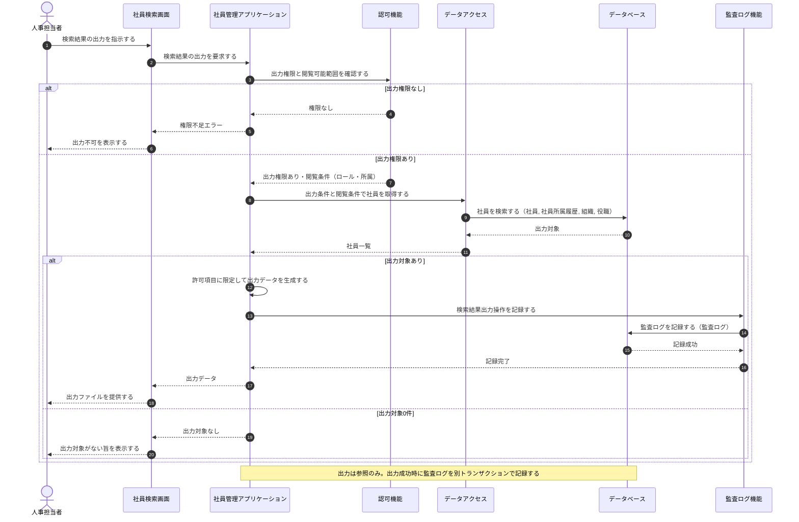

**連携定義**

条件分岐

| 条件ID | 判定箇所 | 条件 | 成立時 | 不成立時 | 根拠 |
|---|---|---|---|---|---|
| COND-01 | 認可機能 | 実行者が検索結果の出力権限を持つ | 出力対象の取得へ進む | 権限不足エラー | UC-009/SP-1 (不成立=UC-009/SP-3) |
| COND-02 | 社員管理アプリケーション | 出力対象が1件以上ある | 許可項目で出力データを生成し監査記録する | 出力対象なしを通知する | UC-009/SP-1 (不成立=UC-009/SP-2) |

データ参照・更新

| エンティティ | CRUD | 目的 | 実行主体 |
|---|---|---|---|
| 社員 | R | 出力条件・閲覧条件に一致する社員の取得 | データアクセス |
| 社員所属履歴 | R | 有効な所属・役職の付与 | データアクセス |
| 組織 | R | 組織名の付与 | データアクセス |
| 役職 | R | 役職名の付与 | データアクセス |
| 監査ログ | C | 検索結果出力操作の証跡記録 | 監査ログ機能 |

トランザクション境界

| 内容 |
|---|
| 業務データの更新はなし(参照のみ)。監査ログの記録は独立した単一トランザクションで実行する |

補足事項

| 観点 | 内容 |
|---|---|
| 同期/非同期 | 画面〜出力データ提供まで同期。監査ログ記録は出力処理と別トランザクションで行う |
| 個人情報保護 | 出力項目は実行者の権限で許可された項目に限定し、閲覧条件外の社員は出力対象に含めない |
| 監査ログ | 出力は個人情報の抽出を伴うため証跡を記録する。記録失敗時の扱いは運用設計/詳細設計で確定する |

## 3.12 組織マスター管理

UC-010(状態パターン UC-010/SP-1〜SP-5。無効化は UC-010/SP-2 として基本フローに含む)。管理者権限・入力妥当性・組織コードの一意性を確認したうえで、組織の登録・更新(無効化を含む)を単一トランザクションで反映し、操作を監査ログに記録する。無効化は物理削除せず、有効期間の終了と利用状態の無効化で表現し、既存の参照・履歴を保持する。

**連携定義**

条件分岐

| 条件ID | 判定箇所 | 条件 | 成立時 | 不成立時 | 根拠 |
|---|---|---|---|---|---|
| COND-01 | 認可機能 | 実行者が組織マスターの管理者権限を持つ | 入力検証へ進む | 権限不足エラー | UC-010/SP-1 (不成立=UC-010/SP-3) |
| COND-02 | 社員ドメイン | 組織情報の入力が妥当 | 組織コードの一意確認へ進む | 入力エラー | UC-010/SP-1 (不成立=UC-010/SP-4) |
| COND-03 | マスター管理機能 | 組織コードが一意 | 組織を登録・更新する | 組織コード重複エラー | UC-010/SP-1 (不成立=UC-010/SP-5) |
| COND-04 | 社員管理アプリケーション | 操作が無効化指定である | 有効期間終了・利用状態の無効化を反映する | 入力値どおりに登録・更新する | UC-010/SP-2 (成立=UC-010/SP-2、不成立=UC-010/SP-1) |

データ参照・更新

| エンティティ | CRUD | 目的 | 実行主体 |
|---|---|---|---|
| 組織 | R | 組織コードの重複(一意性)確認 | データアクセス |
| 組織 | C | 新規組織の登録 | データアクセス |
| 組織 | U | 既存組織の更新／無効化(有効期間の終了・利用状態=無効) | データアクセス |
| 監査ログ | C | 組織マスター操作の証跡記録 | 監査ログ機能 |

トランザクション境界

| 境界ID | 開始 | 終了 | 対象更新 | ロールバック条件 | 管理主体 |
|---|---|---|---|---|---|
| TX-01 | 組織の登録・更新開始 | COMMIT | 組織 | 組織の登録・更新に失敗した場合にロールバック | 社員管理アプリケーション |

補足事項

| 観点 | 内容 |
|---|---|
| 同期/非同期 | 画面〜反映完了まで同期。監査ログ記録は業務トランザクションと別に行う |
| 整合性 | 組織コードの一意性はデータベースの一意制約でも担保する(重複確認と二重防御) |
| 無効化 | 無効化は物理削除せず、有効期間の終了と利用状態の無効化で表現し、既存の参照・履歴を保持する |
| 監査ログ | 監査ログの記録は別トランザクションとし、失敗時の扱いは運用設計/詳細設計で確定する |

## 3.13 役職マスター管理

UC-011(状態パターン UC-011/SP-1〜SP-5。無効化は UC-011/SP-2 として基本フローに含む)。管理者権限・入力妥当性・役職コードの一意性を確認したうえで、役職の登録・更新(無効化を含む)を単一トランザクションで反映し、操作を監査ログに記録する。組織マスター管理(3.12)と同型で、対象マスターと一意キーが役職・役職コードに変わる。無効化は物理削除せず、有効期間の終了と利用状態の無効化で表現する。

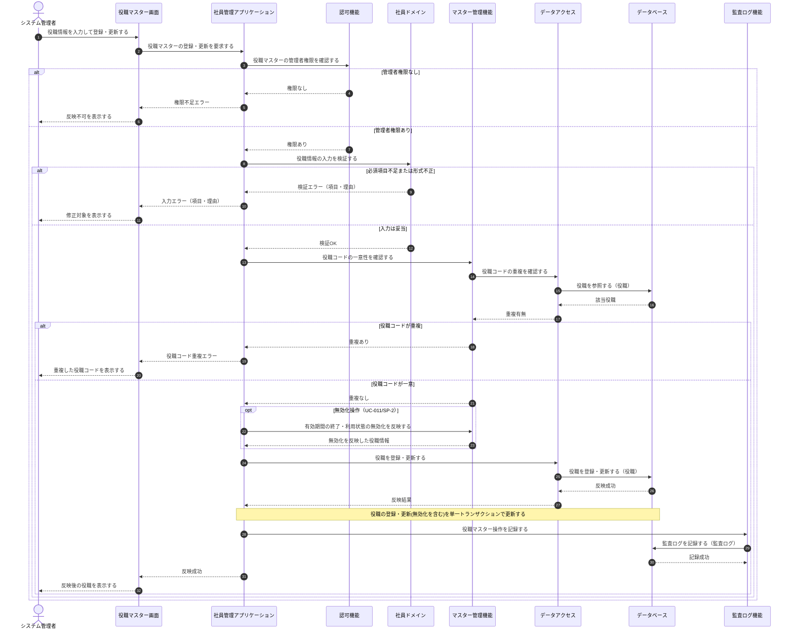

**連携定義**

条件分岐

| 条件ID | 判定箇所 | 条件 | 成立時 | 不成立時 | 根拠 |
|---|---|---|---|---|---|
| COND-01 | 認可機能 | 実行者が役職マスターの管理者権限を持つ | 入力検証へ進む | 権限不足エラー | UC-011/SP-1 (不成立=UC-011/SP-3) |
| COND-02 | 社員ドメイン | 役職情報の入力が妥当 | 役職コードの一意確認へ進む | 入力エラー | UC-011/SP-1 (不成立=UC-011/SP-4) |
| COND-03 | マスター管理機能 | 役職コードが一意 | 役職を登録・更新する | 役職コード重複エラー | UC-011/SP-1 (不成立=UC-011/SP-5) |
| COND-04 | 社員管理アプリケーション | 操作が無効化指定である | 有効期間終了・利用状態の無効化を反映する | 入力値どおりに登録・更新する | UC-011/SP-2 (成立=UC-011/SP-2、不成立=UC-011/SP-1) |

データ参照・更新

| エンティティ | CRUD | 目的 | 実行主体 |
|---|---|---|---|
| 役職 | R | 役職コードの重複(一意性)確認 | データアクセス |
| 役職 | C | 新規役職の登録 | データアクセス |
| 役職 | U | 既存役職の更新／無効化(有効期間の終了・利用状態=無効) | データアクセス |
| 監査ログ | C | 役職マスター操作の証跡記録 | 監査ログ機能 |

トランザクション境界

| 境界ID | 開始 | 終了 | 対象更新 | ロールバック条件 | 管理主体 |
|---|---|---|---|---|---|
| TX-01 | 役職の登録・更新開始 | COMMIT | 役職 | 役職の登録・更新に失敗した場合にロールバック | 社員管理アプリケーション |

補足事項

| 観点 | 内容 |
|---|---|
| 同期/非同期 | 画面〜反映完了まで同期。監査ログ記録は業務トランザクションと別に行う |
| 整合性 | 役職コードの一意性はデータベースの一意制約でも担保する(重複確認と二重防御) |
| 無効化 | 無効化は物理削除せず、有効期間の終了と利用状態の無効化で表現し、既存の参照・履歴を保持する |
| 監査ログ | 監査ログの記録は別トランザクションとし、失敗時の扱いは運用設計/詳細設計で確定する |

## 3.14 権限管理

UC-012(状態パターン UC-012/SP-1〜SP-4)。管理者権限・対象利用者の存在・指定ロールの妥当性を確認したうえで、対象利用者へのロール割当を更新し監査ログを記録する。本UCの画面(権限管理画面)およびAPIは未採番であり、画面ID・API・項目は詳細設計で採番・確定する。

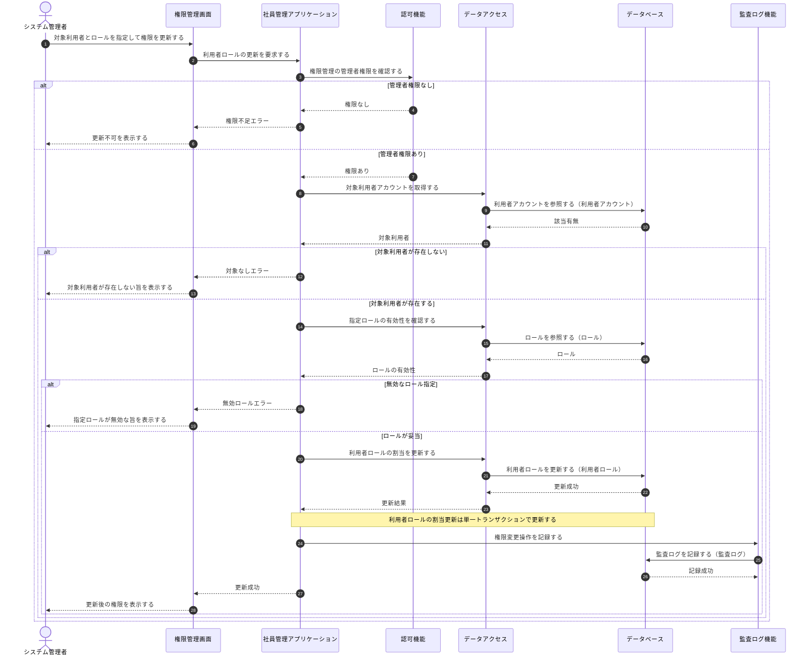

**連携定義**

条件分岐

| 条件ID | 判定箇所 | 条件 | 成立時 | 不成立時 | 根拠 |
|---|---|---|---|---|---|
| COND-01 | 認可機能 | 実行者が権限管理の管理者権限を持つ | 対象利用者の確認へ進む | 権限不足エラー | UC-012/SP-1 (不成立=UC-012/SP-2) |
| COND-02 | 社員管理アプリケーション | 対象利用者アカウントが存在する | 指定ロールの妥当性確認へ進む | 対象なしエラー | UC-012/SP-1 (不成立=UC-012/SP-3) |
| COND-03 | 社員管理アプリケーション | 指定ロールが有効である | 利用者ロールの割当を更新する | 無効ロールエラー | UC-012/SP-1 (不成立=UC-012/SP-4) |

データ参照・更新

| エンティティ | CRUD | 目的 | 実行主体 |
|---|---|---|---|
| 利用者アカウント | R | 対象利用者アカウントの存在確認 | データアクセス |
| ロール | R | 指定ロールの有効性確認 | データアクセス |
| 利用者ロール | U | 対象利用者へのロール割当の更新 | データアクセス |
| 監査ログ | C | 権限変更操作の証跡記録 | 監査ログ機能 |

トランザクション境界

| 境界ID | 開始 | 終了 | 対象更新 | ロールバック条件 | 管理主体 |
|---|---|---|---|---|---|
| TX-01 | 利用者ロールの割当更新開始 | COMMIT | 利用者ロール | 割当の更新に失敗した場合にロールバック | 社員管理アプリケーション |

補足事項

| 観点 | 内容 |
|---|---|
| 同期/非同期 | 画面〜更新完了まで同期。監査ログ記録は業務トランザクションと別に行う |
| 設計状態 | 本UCの画面(権限管理画面)・APIは未採番。画面ID・API・項目は詳細設計で採番・確定する |
| 監査ログ | 権限変更は影響が大きいため証跡を記録する。記録失敗時の扱いは運用設計/詳細設計で確定する |
