[← 設計書一覧（社員名簿管理システム）](README.md)

# 3. シーケンス設計

本節は、社員名簿管理システムの全ユースケース(UC-001〜UC-012)における論理構成要素間の連携を、正常系・代替/例外系に分けて時系列で検証する。各状態パターン(SP-x)は正常系または代替・例外系のいずれかで表現し、各図の直後の連携定義でデータ参照・更新とトランザクション境界を補足する。3.2〜3.3で社員登録(UC-001)、3.4で社員検索(UC-002)、3.5で社員異動(UC-003)、3.6で社員退職(UC-004)、3.7でログイン(UC-005)、3.8で社員詳細参照(UC-006)、3.9で社員基本情報更新(UC-007)、3.10で変更履歴参照(UC-008)、3.11で検索結果出力(UC-009)、3.12で組織マスター管理(UC-010)、3.13で役職マスター管理(UC-011)、3.14で権限管理(UC-012)を展開する。

## 3.1 論理構成要素

| 構成要素 | 種別 | ID/参照 | 役割 |
|---|---|---|---|
| 人事担当者 | アクター | - | 社員の登録・更新・異動・退職・出力の操作者 |
| 一般利用者 | アクター | - | 権限範囲内での社員検索・詳細参照の操作者(部門管理者/一般社員) |
| システム管理者 | アクター | - | マスター・権限・変更履歴の管理操作者 |
| 利用者 | アクター | - | ログイン等、ロール横断で行う操作の全利用者(全ロール共通) |
| ログイン画面 | 画面 | SCR-010 | 認証情報の入力受付、ログイン結果の表示 |
| 社員検索画面 | 画面 | SCR-001 | 検索条件入力、一覧表示、検索結果出力、詳細画面への遷移 |
| 社員詳細画面 | 画面 | SCR-002 | 社員の基本情報・所属・履歴の参照表示 |
| 社員登録画面 | 画面 | SCR-003 | 登録情報の入力受付、入力エラー・登録結果の表示 |
| 社員編集画面 | 画面 | SCR-004 | 基本情報の編集受付、更新結果・競合の表示 |
| 社員異動画面 | 画面 | SCR-005 | 新所属・役職・異動日の入力受付、異動結果の表示 |
| 退職処理画面 | 画面 | SCR-006 | 退職日の入力受付、退職結果の表示 |
| 変更履歴画面 | 画面 | SCR-007 | 社員の変更履歴の参照表示 |
| 組織マスター画面 | 画面 | SCR-008 | 組織の登録・変更・無効化の操作受付 |
| 役職マスター画面 | 画面 | SCR-009 | 役職の登録・変更・無効化の操作受付 |
| 権限管理画面 | 画面 | SCR-011 | ロール割当の操作受付 |
| API境界 | API | API-001〜API-018 | Cloudflare Workersの`fetch`ハンドラーでHTTP入出力、共通認証認可、入力検証、単一モジュール呼出し、結果変換を行う。D1 Binding・DB・SQLへはアクセスしない |
| 退職日到来反映JOB | JOB | JOB-001 | Cron Triggerを受けた`scheduled`ハンドラーが初回Queueメッセージを投入し、`queue`ハンドラーが最大40社員の処理をM-002へ委譲する。D1 Binding・DB・SQLへはアクセスしない |
| 社員管理アプリケーション | 機能 | M-002 | 各ユースケース全体の進行制御 |
| 認可機能 | 機能 | M-003 | 認証状態・ロール・対象範囲に基づく操作可否/閲覧範囲の判定、ロール割当 |
| 社員ドメイン | 機能 | M-004 | 入力・業務条件の検証、状態遷移・所属期間整合の判定 |
| マスター管理機能 | 機能 | M-005 | 組織・役職の参照・有効性確認・登録更新 |
| データアクセス | データアクセス | M-006 | D1 Worker Binding `env.DB`、Prepared Statement、`batch()`を用いた各エンティティの参照/登録/更新 |
| 監査ログ機能 | 監査 | M-007 | 操作証跡の記録 |
| 外部認証アダプター | 機能 | M-008 | 社内認証基盤との接続差異の吸収 |
| 社内認証基盤 | 外部 | - | 認証情報の検証(外部サービス) |
| データベース | DB | Cloudflare D1 | SQLite互換形式で全エンティティ(社員・社員所属履歴・組織・役職・社員変更履歴・利用者アカウント・ロール・利用者ロール・監査ログ)を保持する |

各シーケンス図は業務連携を読みやすくするためAPI境界を省略しているが、実装時の呼出経路は必ず「画面→Cloudflare Worker API→M-002（ログインのみM-003）→下位モジュール→M-006→D1 Binding→SQL→D1」とする。JOB-001は「Cloudflare Cron Trigger→Worker `scheduled`→Cloudflare Queues→Worker `queue`→JOB-001→M-002→M-006→D1 Binding→SQL→D1」とし、API・JOBからBinding・DB・SQLへ直接アクセスしない。`scheduled`は初回メッセージ投入だけ、`queue`は1メッセージ・最大40社員・M-002/IF-07の1回呼出しだけを担当する。

### 3.1.1 Cloudflare D1共通再試行契約

D1書込みの即時再試行は、Cloudflareが再試行推奨として示す`D1 DB reset because its code was updated.`、`Internal error while starting up D1 DB storage caused object to be reset.`、`Network connection lost.`、`Internal error in D1 DB storage caused object to be reset.`、`Cannot resolve D1 DB due to transient issue on remote node.`だけを対象とする。M-002は初回に加えて最大2回、full jitterで0〜500ms、0〜1000ms待機してbatch全体を再試行する。

書込み送信後に成否が不明な場合は、再試行前にM-006経由で対象状態とversionを読み直す。意図した状態・versionならコミット済み成功、事前状態なら未反映として再試行、どちらでもなければ競合とする。version競合、制約違反、業務条件不成立は再試行しない。過負荷、タイムアウト、CPU、メモリ、実行文予算超過は即時再試行せず、オンラインAPIでは一時障害応答、JOBではretryable属性付き`DATA_ACCESS_ERROR`としてQueue再配信へ委ねる。

## 3.2 社員登録・正常系

UC-001(状態パターン UC-001/SP-1。氏名カナを省略する UC-001/SP-2 も同一の登録フローで処理する)。入力正常・権限あり・マスター有効・重複なしのとき、社員基本情報と初期所属履歴を単一トランザクションで登録し、社員詳細を表示する。

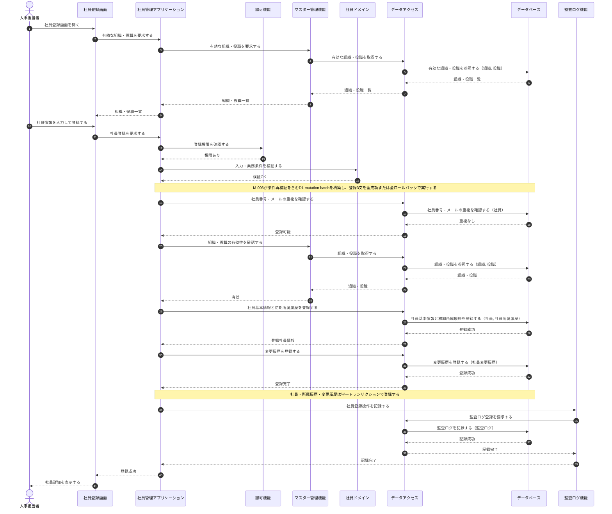

**連携定義**

条件分岐

| 条件ID | 判定箇所 | 条件 | 成立時 | 不成立時 | 根拠 |
|---|---|---|---|---|---|
| COND-01 | 認可機能 | 実行者が社員登録権限を持つ | 登録処理を継続する | 権限不足エラー(3.3で表現) | UC-001/SP-1 (不成立=UC-001/SP-3) |
| COND-02 | 社員ドメイン | 入力・業務条件が妥当 | 重複確認へ進む | 入力エラー(3.3で表現) | UC-001/SP-1 (不成立=UC-001/SP-4) |
| COND-03 | データアクセス | 社員番号・メールが重複しない | マスター確認へ進む | 重複エラー(3.3で表現) | UC-001/SP-1 (不成立=UC-001/SP-5,SP-6) |
| COND-04 | マスター管理機能 | 組織・役職がともに有効 | 登録を実行する | マスター無効エラー(3.3で表現) | UC-001/SP-1 (不成立=UC-001/SP-7) |

データ参照・更新

| エンティティ | CRUD | 目的 | 実行主体 |
|---|---|---|---|
| 組織 | R | 有効な組織の取得・有効性確認 | データアクセス |
| 役職 | R | 有効な役職の取得・有効性確認 | データアクセス |
| 社員 | R | 社員番号・メールアドレスの重複確認 | データアクセス |
| 社員 | C | 社員基本情報の登録(在籍状態=在籍中で登録) | データアクセス |
| 社員所属履歴 | C | 初期所属履歴の登録(適用開始日=入社日) | データアクセス |
| 社員変更履歴 | C | 登録操作の業務変更履歴記録 | データアクセス |
| 監査ログ | C | 社員登録操作の証跡記録 | データアクセス（M-007から委譲） |

トランザクション境界

| 境界ID | 開始 | 終了 | 対象更新 | ロールバック条件 | 管理主体 |
|---|---|---|---|---|---|
| TX-001 | M-006がD1 mutation batchを送信 | `batch()`成功 | 社員・社員所属履歴・社員変更履歴 | マスター条件・一意制約・参照制約またはいずれかの文が失敗した場合、D1がbatch全体をロールバック | M-002が境界を宣言しM-006が実行 |

補足事項

| 観点 | 内容 |
|---|---|
| 同期/非同期 | 画面〜登録完了まで同期。監査ログ記録は業務トランザクションと別に行う |
| 整合性 | 社員番号・メールアドレスの一意性と、入社日時点の組織・役職利用可否をSQLite制約・トリガー・条件付き文でbatch内に再検証する。再試行可否、結果不明時の確認、待機は§3.1.1の共通契約に従う |
| 監査ログ | 監査ログは業務コミット後に別トランザクションで記録する。記録失敗時も業務更新は戻さず、運用アラートを通知して成功結果を返す |

## 3.3 社員登録・入力不正/重複

UC-001 の代替・例外系(UC-001/SP-3〜SP-7)。権限確認→入力検証→重複確認→マスター有効性の順で判定し、同時に複数条件が不成立でもこの優先順で最初のエラーだけを返す。いずれかで不成立となった場合は該当エラーを表示して登録しない。

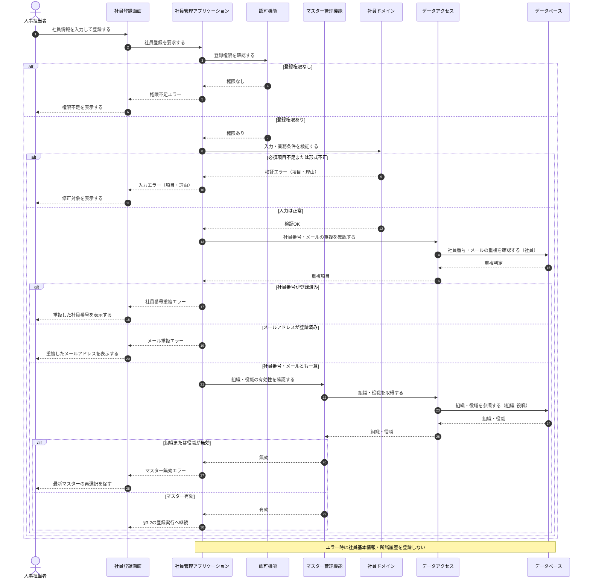

**状態パターン対応**

| 分岐 | 条件 | 状態パターン | 本シーケンスでの処理 |
|---|---|---|---|
| a | 登録権限なし | UC-001/SP-3 | 権限不足を表示し、登録しない |
| b | 必須項目不足または形式不正 | UC-001/SP-4 | 対象項目と理由を表示し、登録しない |
| c | 社員番号が登録済み | UC-001/SP-5 | 重複した社員番号を表示し、登録しない |
| d | メールアドレスが登録済み | UC-001/SP-6 | 重複したメールアドレスを表示し、登録しない |
| e | 組織または役職が無効 | UC-001/SP-7 | 最新マスターの再選択を促し、登録しない |
| f | 保存中に異常(TX-001失敗) | －（§2の業務状態パターン対象外） | 社員・所属履歴をともに未登録として扱う(TX-001 ロールバック。3.2 参照) |

データ参照・更新

| エンティティ | CRUD | 目的 | 実行主体 |
|---|---|---|---|
| 組織 | R | 組織の有効性確認 | データアクセス |
| 役職 | R | 役職の有効性確認 | データアクセス |
| 社員 | R | 社員番号・メールアドレスの重複確認 | データアクセス |

補足: 本シーケンスは参照のみで、いずれの分岐でも社員・所属履歴・変更履歴を登録しない(更新なし)。

## 3.4 社員検索

UC-002(状態パターン UC-002/SP-1・SP-2)。認可機能から§2.6の閲覧スコープを取得し、検索条件と`scopeType`・操作者社員ID・許可組織ID集合・基準日を合わせて社員を検索し、全スコープ共通の安全な一覧項目だけを表示する。

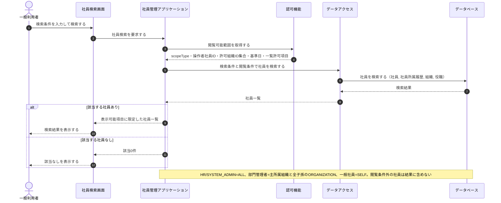

**連携定義**

条件分岐

| 条件ID | 判定箇所 | 条件 | 成立時 | 不成立時 | 根拠 |
|---|---|---|---|---|---|
| COND-01 | 認可機能 | 業務日時点で有効な固定ロールがあり、閲覧スコープを解決できる | 範囲内条件で検索する | ロールなし、主所属なし、本人紐付けなしを権限不足として拒否する | UC-002/SP-1 |
| COND-02 | 社員管理アプリケーション | 検索結果が1件以上ある | 一覧を表示する | 該当なしを表示する | UC-002/SP-1 (不成立=UC-002/SP-2) |

データ参照・更新

| エンティティ | CRUD | 目的 | 実行主体 |
|---|---|---|---|
| 社員 | R | 検索条件・閲覧条件に一致する社員の取得 | データアクセス |
| 社員所属履歴 | R | 有効な所属・役職の付与 | データアクセス |
| 組織 | R | 組織名の付与 | データアクセス |
| 役職 | R | 役職名の付与 | データアクセス |

トランザクション境界

| 内容 |
|---|
| なし(参照のみ。更新を伴わないため) |

補足事項

| 観点 | 内容 |
|---|---|
| 性能 | 一覧は件数が多くなり得るためページング前提で取得する |
| 個人情報保護 | 閲覧条件外の社員は結果に含めず、権限に応じて返却項目を制限する |

## 3.5 社員異動

UC-003(状態パターン UC-003/SP-1〜SP-7。未来日付の異動は UC-003/SP-2 として基本フローに含み、業務日より前の遡及異動は UC-003/SP-7 として拒否する)。権限・在籍状態・異動日時点のマスターと上長有効性を確認し、異動日と既存の所属履歴の期間整合を判定したうえで、直前所属の終了、異動日以降の将来所属取消、新所属登録、変更履歴登録、社員版数更新を単一トランザクションで更新する。

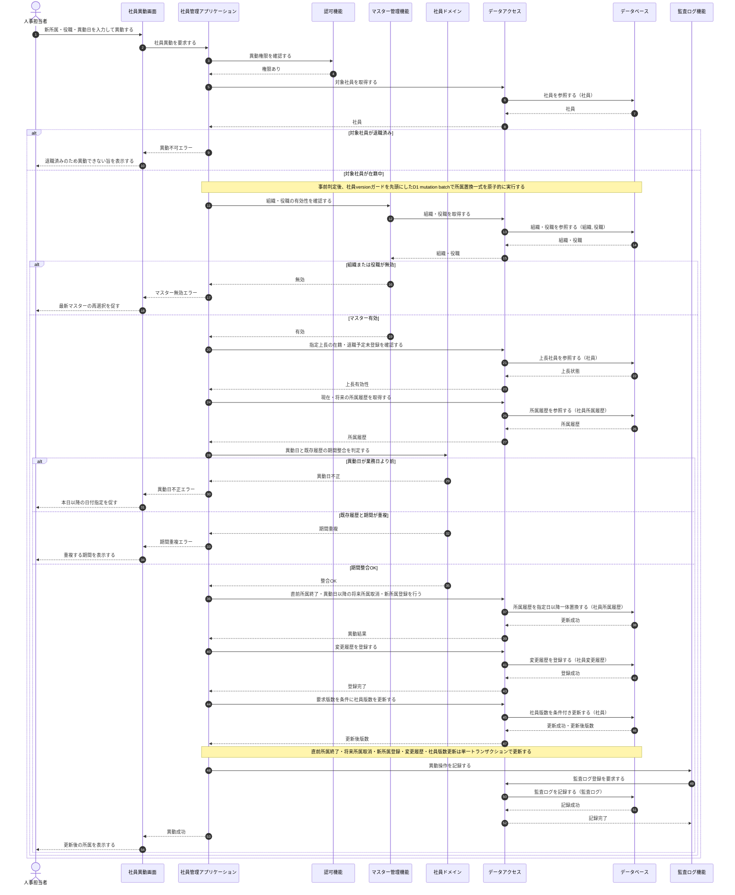

**連携定義**

条件分岐

| 条件ID | 判定箇所 | 条件 | 成立時 | 不成立時 | 根拠 |
|---|---|---|---|---|---|
| COND-01 | 認可機能 | 実行者が社員異動権限を持つ | 対象社員の確認へ進む | 権限不足エラー | UC-003/SP-1 (不成立=UC-003/SP-3) |
| COND-02 | 社員管理アプリケーション | 対象社員が在籍中である | マスター確認へ進む | 異動不可エラー | UC-003/SP-1 (不成立=UC-003/SP-4) |
| COND-03 | マスター管理機能・社員管理アプリケーション | 新組織・新役職が異動日時点で有効で、指定上長が在籍中かつ退職予定未登録 | 期間整合判定へ進む | マスター・上長無効エラー | UC-003/SP-1 (不成立=UC-003/SP-5) |
| COND-04 | 社員ドメイン | 異動日が業務日以降である | 期間重複判定へ進む | 異動日不正エラー | UC-003/SP-1・SP-2 (不成立=UC-003/SP-7) |
| COND-05 | 社員ドメイン | 異動日と既存履歴に期間重複がない | 所属履歴を更新する | 期間重複エラー | UC-003/SP-1 (不成立=UC-003/SP-6) |
| COND-06 | データアクセス | 要求版数と社員の現在版数が一致する | 社員版数を更新してコミットする | 更新競合として全業務更新をロールバックする | NFR-007 / M-002/IF-05 |

データ参照・更新

| エンティティ | CRUD | 目的 | 実行主体 |
|---|---|---|---|
| 社員 | R | 対象社員の取得・在籍状態の確認 | データアクセス |
| 組織 | R | 新組織の有効性確認 | データアクセス |
| 役職 | R | 新役職の有効性確認 | データアクセス |
| 社員所属履歴 | R | 現在・将来の履歴取得と期間整合の確認 | データアクセス |
| 社員所属履歴 | U | 現所属履歴の終了(適用終了日の設定) | データアクセス |
| 社員所属履歴 | D（論理） | 異動日以降に開始する既存将来所属の取消 | データアクセス |
| 社員所属履歴 | C | 新所属履歴の登録(適用開始日=異動日) | データアクセス |
| 社員変更履歴 | C | 異動操作の業務変更履歴記録 | データアクセス |
| 社員 | U | 要求版数を条件とする社員版数の更新 | データアクセス |
| 監査ログ | C | 異動操作の証跡記録 | データアクセス（M-007から委譲） |

トランザクション境界

| 境界ID | 開始 | 終了 | 対象更新 | ロールバック条件 | 管理主体 |
|---|---|---|---|---|---|
| TX-003 | M-006が社員versionガードを先頭にD1 mutation batchを送信 | `batch()`成功 | 社員版数・社員所属履歴(直前履歴終了・将来履歴取消・新履歴登録)・社員変更履歴 | version・マスター・上長・期間条件不成立、制約違反またはいずれかの文が失敗した場合、D1がbatch全体をロールバック | M-002が境界を宣言しM-006が実行 |

補足事項

| 観点 | 内容 |
|---|---|
| 同期/非同期 | 画面〜異動完了まで同期。監査ログ記録は業務トランザクションと別に行う |
| 競合制御 | D1単一データベースの逐次実行、先頭の社員versionガード、後続文のガード済みversion条件、SQLiteの期間重複トリガーを併用する。再試行可否、結果不明時の確認、待機は§3.1.1の共通契約に従う |
| 監査ログ | 監査ログは業務コミット後に別トランザクションで記録する。記録失敗時も異動結果は戻さず、運用アラートを通知して成功結果を返す |

## 3.6 社員退職

UC-004(状態パターン UC-004/SP-1〜SP-5。未来日付の退職は UC-004/SP-2 として退職予定を登録する)。当日以前は退職状態・所属履歴・変更履歴を即時反映し、未来日は退職予定だけを登録してJOB-001が到来後に社員1件単位で退職確定を反映する。

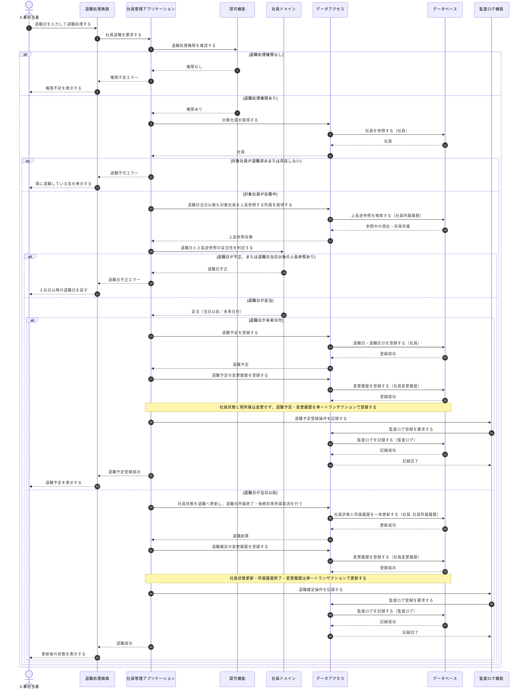

未来日の退職予定は、退職日到来後に次の非同期経路で確定する。

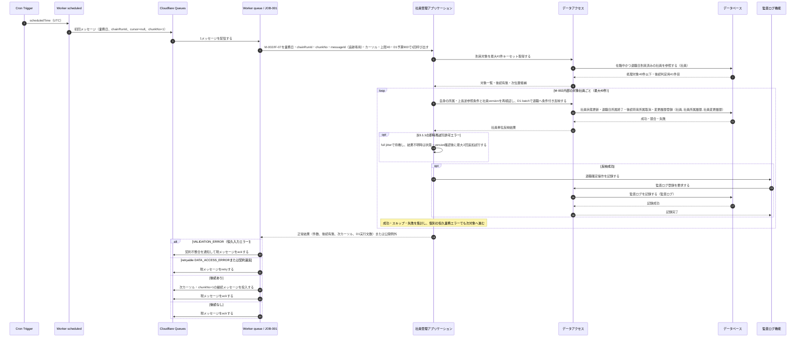

**連携定義**

条件分岐

| 条件ID | 判定箇所 | 条件 | 成立時 | 不成立時 | 根拠 |
|---|---|---|---|---|---|
| COND-01 | 認可機能 | 実行者が退職処理権限を持つ | 対象社員の確認へ進む | 権限不足エラー | UC-004/SP-1 (不成立=UC-004/SP-3) |
| COND-02 | 社員管理アプリケーション | 対象社員が存在し在籍中である | 退職日妥当性の判定へ進む | 退職不可エラー | UC-004/SP-1 (不成立=UC-004/SP-4) |
| COND-03 | 社員ドメイン | 退職日が入社日以降で、対象社員を上長とする所属が退職日当日以後に有効でない | 退職更新を実行する | 退職日・上長参照不正エラー | UC-004/SP-1 (不成立=UC-004/SP-5) |
| COND-04 | 社員ドメイン | 退職日が当日以前である | 即時に退職状態へ更新する | 退職予約として登録する | UC-004/SP-1 (不成立=UC-004/SP-2) |

データ参照・更新

| エンティティ | CRUD | 目的 | 実行主体 |
|---|---|---|---|
| 社員 | R | 対象社員の取得・在籍状態の確認 | データアクセス |
| 社員 | U | 未来日は退職予定登録、当日以前または到来時は在籍状態=退職への更新 | データアクセス |
| 社員所属履歴 | U | 当日以前または退職日到来時に有効な所属履歴を終了 | データアクセス |
| 社員所属履歴 | R | 対象社員を上長とする退職日当日以後の現在・将来所属を検証 | データアクセス |
| 社員所属履歴 | D（論理） | 退職日より後に開始する対象社員自身の将来所属を取消 | データアクセス |
| 社員変更履歴 | C | 退職予定登録・退職確定の業務変更履歴記録 | データアクセス |
| 監査ログ | C | 退職操作の証跡記録 | データアクセス（M-007から委譲） |

トランザクション境界

| 境界ID | 開始 | 終了 | 対象更新 | ロールバック条件 | 管理主体 |
|---|---|---|---|---|---|
| TX-004 | M-006が退職予定用D1 mutation batchを送信 | `batch()`成功 | 社員(退職日・退職区分)・社員変更履歴 | 上長逆参照・version・状態条件不成立またはいずれかの文が失敗した場合、D1がbatch全体をロールバック | M-002が境界を宣言しM-006が実行 |
| TX-005 | M-006が即時または到来退職用D1 mutation batchを送信 | `batch()`成功 | 社員(状態・退職日)・社員所属履歴(終了日・将来取消)・社員変更履歴 | 上長逆参照・version・状態条件不成立またはいずれかの文が失敗した場合、D1が社員1件のbatch全体をロールバック | M-002が境界を宣言しM-006が実行 |

補足事項

| 観点 | 内容 |
|---|---|
| 同期/非同期 | 当日以前の退職と未来日の退職予定受付は同期。未来日の退職確定はJOB-001が日次で非同期実行する |
| 退職予定 | 未来日は退職日・退職区分だけを登録し、社員状態と現所属を維持する。JOB-001が到来後に確定する(UC-004/SP-2) |
| 競合制御 | D1の逐次実行、対象社員のversionガード、上長逆参照を再評価する条件付き文・トリガーにより、異動・部下所属登録との競合と退職済みへの二重処理を検知する |
| 利用停止 | 社員紐付きアカウントは退職日到来以後、ログインおよび発行済みトークンの後続認可で拒否する。退職確定JOBの遅延中も業務日と退職日で拒否する |
| 監査ログ | 監査ログは業務トランザクションのコミット後にM-007→M-006で独立追記し、失敗は運用アラート対象とする |
| チャンク・予算 | `queue` invocationごとにM-002/IF-07を1回だけ呼び、最大40社員を処理する。M-006実測のD1実行文数は900以下とし、後続ありでは退職日・社員IDの次カーソルをQueueメッセージへ引き継ぐ |
| 内部再試行 | M-002は§3.1.1の許可エラーだけを社員単位で最大2回追加試行する。過負荷・タイムアウト・CPU・メモリ・予算超過および再試行枯渇はretryable属性付き`DATA_ACCESS_ERROR`とし、JOBが現メッセージを再配信する |
| Queue冪等性 | consumerは`max_batch_size=1`、`max_concurrency=1`、`max_retries=3`とし、規定回数後はDLQへ移送する。`chainRunId+chunkNo`を論理実行識別子とし、重複配信の正しさはversionガード・未反映条件で保証する |
| 集計契約 | M-002は非負整数の件数、後続有無、次カーソル、D1実行文数を返し、対象件数=成功件数+スキップ件数+失敗件数、失敗対象一覧件数=失敗件数、対象件数≤40、D1実行文数≤900を保証する |

## 3.7 ログイン

UC-005(状態パターン UC-005/SP-1〜SP-3)。社内認証基盤で認証情報を検証し、利用者アカウント、社員紐付きの場合の退職日未到来、ロールを確認したうえで未返却のアクセストークン候補を生成する。成功監査を記録できた場合だけ候補を利用者へ返し、生成・監査失敗時は発行しない。業務データの更新は伴わない。

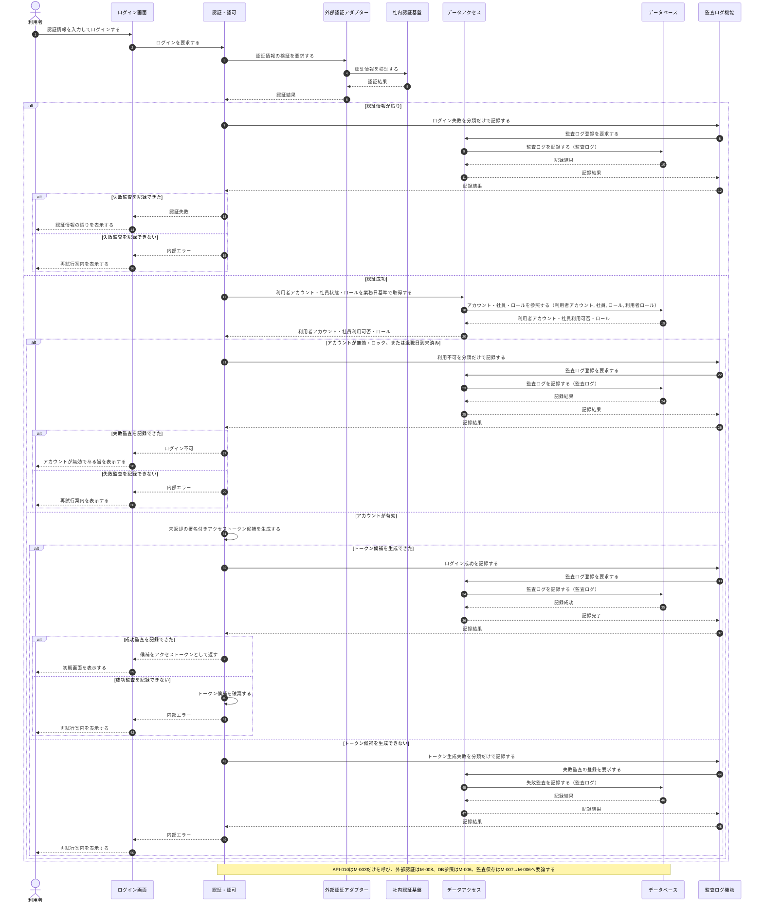

**連携定義**

条件分岐

| 条件ID | 判定箇所 | 条件 | 成立時 | 不成立時 | 根拠 |
|---|---|---|---|---|---|
| COND-01 | 社内認証基盤 | 認証情報が正しい | アカウント有効性の確認へ進む | 認証失敗 | UC-005/SP-1 (不成立=UC-005/SP-2) |
| COND-02 | 認証・認可(M-003) | 利用者アカウントが有効で、社員紐付きの場合は業務日が退職日より前 | トークン候補生成へ進む | 失敗監査後にログイン不可を返す | UC-005/SP-1 (不成立=UC-005/SP-3) |
| COND-03 | 認証・認可(M-003) | 未返却のアクセストークン候補を生成できた | 成功監査へ進む | 可能な限り失敗監査を記録し、内部エラーを返す | 該当なし（技術例外） |
| COND-04 | 監査ログ機能(M-007) | ログイン結果を記録できた | 成功時は生成済み候補を利用者へ返し、失敗時は対応する公開エラーを返す | 候補を破棄し内部エラーを返す | 該当なし（技術例外） |

データ参照・更新

| エンティティ | CRUD | 目的 | 実行主体 |
|---|---|---|---|
| 利用者アカウント | R | 認証済み利用者のアカウント取得・有効性確認 | データアクセス |
| 社員 | R | 社員紐付き利用者の在籍状態・退職日到来確認 | データアクセス |
| ロール | R | 利用者に割り当てられたロールの取得 | データアクセス |
| 利用者ロール | R | 利用者とロールの対応取得 | データアクセス |
| 監査ログ | C | ログイン操作の証跡記録 | データアクセス（M-007から委譲） |

トランザクション境界

| 内容 |
|---|
| 利用者・ロールは参照のみ。成功・失敗の監査ログはM-006の独立トランザクションで記録し、記録失敗時はアクセストークンを発行しない |

補足事項

| 観点 | 内容 |
|---|---|
| 認証委譲 | 認証情報の検証は社内認証基盤(外部)へ委譲し、システムはパスワードを保持しない |
| アクセストークン | 認証成功・アカウント有効後にM-003が未返却候補を生成し、成功監査記録を満たした場合だけ利用者へ返す。生成または監査失敗時は候補を返さず破棄する。署名鍵・トークン本文をログまたはDBへ保存しない |
| アカウント無効 | 無効・ロック中のアカウントは認証成功であってもログインを許可しない(UC-005/SP-3) |
| 監査ログ | ログインの成否を監査ログに記録する。認証前で主体を特定できない失敗は実行者・対象をNULLとし、認証秘密情報を含めず失敗分類だけを記録する |

## 3.8 社員詳細参照

UC-006(状態パターン UC-006/SP-1〜SP-3)。対象社員の存在真偽だけを内部`ALL`条件で確認して取得値を破棄し、続いて§2.6の実閲覧スコープで社員・所属履歴・組織・役職を再取得する。存在しない場合と存在するが範囲外の場合を区別し、ロール・スコープ別の許可項目だけを表示する。参照のみで更新を伴わない。

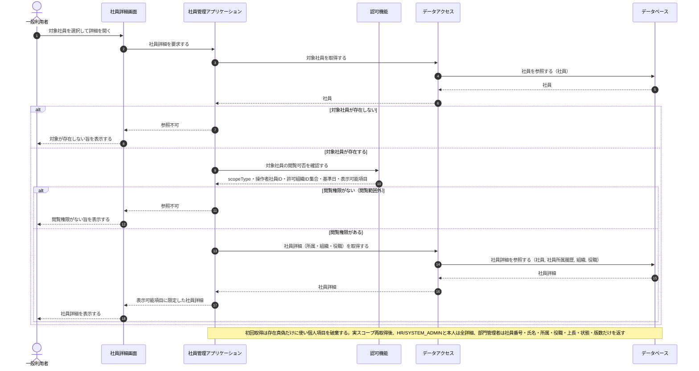

**連携定義**

条件分岐

| 条件ID | 判定箇所 | 条件 | 成立時 | 不成立時 | 根拠 |
|---|---|---|---|---|---|
| COND-01 | 社員管理アプリケーション | 対象社員が存在する | 閲覧権限の確認へ進む | 参照不可(存在しない) | UC-006/SP-1 (不成立=UC-006/SP-2) |
| COND-02 | 認可機能 | 実行者が対象社員の閲覧権限を持つ(閲覧範囲内) | 権限に応じた項目で詳細を表示する | 参照不可(閲覧範囲外) | UC-006/SP-1 (不成立=UC-006/SP-3) |

データ参照・更新

| エンティティ | CRUD | 目的 | 実行主体 |
|---|---|---|---|
| 社員 | R | 対象社員の存在確認・基本情報の取得 | データアクセス |
| 社員所属履歴 | R | 有効な所属・役職・在籍状態の取得 | データアクセス |
| 組織 | R | 所属組織名の付与 | データアクセス |
| 役職 | R | 役職名の付与 | データアクセス |

トランザクション境界

| 内容 |
|---|
| なし(参照のみ。更新を伴わないため) |

補足事項

| 観点 | 内容 |
|---|---|
| 個人情報保護 | `HR`・`SYSTEM_ADMIN`の`ALL`と`EMPLOYEE`本人の`SELF`は全詳細、`DEPARTMENT_MANAGER`の`ORGANIZATION`は社員ID・社員番号・氏名・所属・役職・上長・状態・版数だけを返す |
| 閲覧判定 | §2.6に従い、固定ロール、対象社員の基準日時点所属、操作者の主所属と全子孫、本人紐付けから閲覧可否を判定する |
| 性能 | 詳細は単一社員が対象のため、所属・組織・役職を一括で取得する |

## 3.9 社員基本情報更新

UC-007(状態パターン UC-007/SP-1〜SP-5)。`HR`は氏名・カナ・メール・電話・雇用区分、`EMPLOYEE`本人はメール・電話だけを更新でき、非許可項目が混在する要求は全体を拒否する。氏名・カナは前後空白除去・NFC・空文字・正規化後長さ/形式の順に検証し、正規化後の値で差分を判定する。メールの一意性・更新競合を確認し、社員基本情報の更新と変更履歴登録を単一トランザクションで更新する。

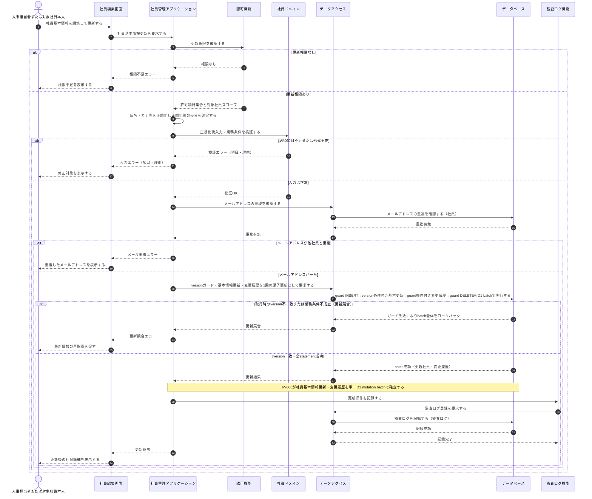

**連携定義**

条件分岐

| 条件ID | 判定箇所 | 条件 | 成立時 | 不成立時 | 根拠 |
|---|---|---|---|---|---|
| COND-01 | 認可機能 | `HR`の許可7項目、または`EMPLOYEE`本人のemail/phoneNumberだけで要求が構成される | 正規化・入力検証へ進む | 非許可項目を部分更新せず要求全体を権限不足とする | UC-007/SP-1 (不成立=UC-007/SP-2) |
| COND-02 | 社員ドメイン | 氏名・カナを前後空白除去・NFC後に空文字・長さ・形式検証し、その他入力・業務条件も妥当 | メール重複確認へ進む | 入力エラー | UC-007/SP-1 (不成立=UC-007/SP-3) |
| COND-03 | データアクセス | メールアドレスが他社員と重複しない | 更新競合の確認へ進む | メール重複エラー | UC-007/SP-1 (不成立=UC-007/SP-4) |
| COND-04 | データアクセス | 取得時の版数と現在値が一致する | 社員基本情報を更新する | 更新競合エラー(最新再取得を要求) | UC-007/SP-1 (不成立=UC-007/SP-5) |

データ参照・更新

| エンティティ | CRUD | 目的 | 実行主体 |
|---|---|---|---|
| 社員 | R | メールアドレスの重複確認・更新競合(版数照合)の判定 | データアクセス |
| 社員 | U | 社員基本情報の更新(版数の加算を含む) | データアクセス |
| 社員変更履歴 | C | 更新操作の業務変更履歴記録 | データアクセス |
| 監査ログ | C | 更新操作の証跡記録 | データアクセス（M-007から委譲） |

トランザクション境界

| 境界ID | 開始 | 終了 | 対象更新 | ロールバック条件 | 管理主体 |
|---|---|---|---|---|---|
| TX-002 | M-006がversionガードを先頭にD1 mutation batchを送信 | `batch()`成功 | 社員(基本情報・version)・社員変更履歴 | ガード不成立、制約・トリガー違反、またはいずれかのstatement失敗時にD1がbatch全体をロールバック | M-002が論理境界を宣言しM-006が実行 |

補足事項

| 観点 | 内容 |
|---|---|
| 同期/非同期 | 画面〜更新完了まで同期。監査ログ記録は業務トランザクションと別に行う |
| 更新競合 | M-006がガードINSERTで取得時versionとDB現在versionを再照合し、不一致なら後続更新を実行せずbatchを失敗させ、最新情報の再取得を要求する(UC-007/SP-5) |
| 権限範囲 | `HR`は姓・名・姓カナ・名カナ・email・phoneNumber・employmentTypeCode、`EMPLOYEE`本人はemail・phoneNumberだけを更新できる。部門管理者・システム管理者単独では更新不可 |
| 正規化 | 姓・名・カナは前後空白除去、NFC、空文字、正規化後長さ・形式、現値との差分の順に処理し、履歴は正規化後の実変更項目だけで生成する |
| 監査ログ | 監査ログは業務コミット後に別トランザクションで記録する。記録失敗時も更新結果は戻さず、運用アラートを通知して成功結果を返す |

## 3.10 変更履歴参照

UC-008(状態パターン UC-008/SP-1〜SP-3)。認可機能で変更履歴の参照権限を確認し、権限がある場合に対象社員の変更履歴を取得して時系列で一覧表示する。参照権限がない場合は参照不可を表示し、履歴が0件の場合は該当なしを表示する。参照のみで更新は行わない。

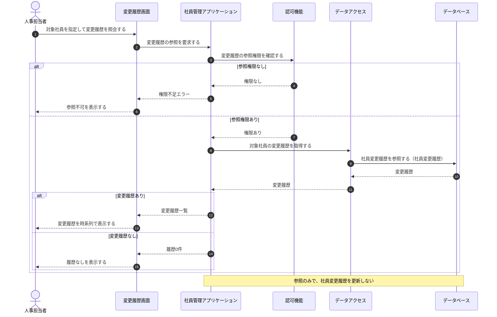

**連携定義**

条件分岐

| 条件ID | 判定箇所 | 条件 | 成立時 | 不成立時 | 根拠 |
|---|---|---|---|---|---|
| COND-01 | 認可機能 | 実行者が変更履歴の参照権限を持つ | 変更履歴の取得へ進む | 権限不足エラー | UC-008/SP-1 (不成立=UC-008/SP-3) |
| COND-02 | 社員管理アプリケーション | 対象社員の変更履歴が1件以上ある | 変更履歴一覧を表示する | 履歴なしを表示する | UC-008/SP-1 (不成立=UC-008/SP-2) |

データ参照・更新

| エンティティ | CRUD | 目的 | 実行主体 |
|---|---|---|---|
| 社員変更履歴 | R | 対象社員の変更履歴の取得 | データアクセス |

トランザクション境界

| 内容 |
|---|
| なし(参照のみ。更新を伴わないため) |

補足事項

| 観点 | 内容 |
|---|---|
| 性能 | 変更履歴は件数が多くなり得るため時系列順・ページング前提で取得する |
| 個人情報保護 | 参照権限の範囲を超える社員の変更履歴は取得対象に含めない |
| 監査ログ | 本変更履歴参照では業務監査ログを追加登録しない。相関ID・実行者・結果は個人情報を含めずアプリケーションアクセスログへ記録する |

## 3.11 検索結果出力

UC-009(状態パターン UC-009/SP-1〜SP-3)。認可機能で出力権限と閲覧可能範囲を確認し、出力条件と閲覧条件で社員を取得して、権限で許可された項目に限定した出力データを生成する。出力に成功した場合は監査ログを記録する。出力権限がない場合は出力不可を表示し、対象0件の場合は出力対象なしを通知する。

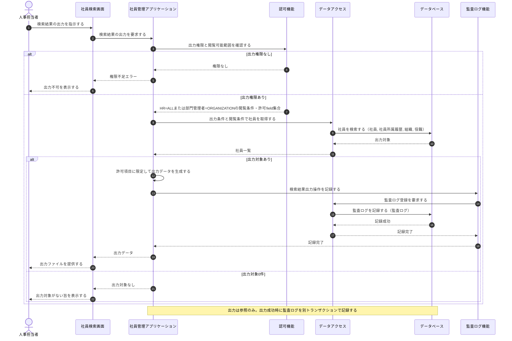

**連携定義**

条件分岐

| 条件ID | 判定箇所 | 条件 | 成立時 | 不成立時 | 根拠 |
|---|---|---|---|---|---|
| COND-01 | 認可機能 | 実行者が検索結果の出力権限を持つ | 出力対象の取得へ進む | 権限不足エラー | UC-009/SP-1 (不成立=UC-009/SP-3) |
| COND-02 | 社員管理アプリケーション | 出力対象が1件以上ある | 許可項目で出力データを生成し監査記録する | 出力対象なしを通知する | UC-009/SP-1 (不成立=UC-009/SP-2) |

データ参照・更新

| エンティティ | CRUD | 目的 | 実行主体 |
|---|---|---|---|
| 社員 | R | 出力条件・閲覧条件に一致する社員の取得 | データアクセス |
| 社員所属履歴 | R | 有効な所属・役職の付与 | データアクセス |
| 組織 | R | 組織名の付与 | データアクセス |
| 役職 | R | 役職名の付与 | データアクセス |
| 監査ログ | C | 検索結果出力操作の証跡記録 | データアクセス（M-007から委譲） |

トランザクション境界

| 内容 |
|---|
| 業務データの更新はなし(参照のみ)。監査ログの記録は独立した単一トランザクションで実行する |

補足事項

| 観点 | 内容 |
|---|---|
| 同期/非同期 | 画面〜出力データ提供まで同期。監査ログ記録は出力処理と別トランザクションで行う |
| 個人情報保護 | 出力項目は実行者の権限で許可された項目に限定し、閲覧条件外の社員は出力対象に含めない |
| 検索既定値 | 在籍状態は省略時`ACTIVE`とし、要求で`ALL`を明示した場合だけ全状態を対象にする |
| 監査ログ | 出力は個人情報の抽出を伴うため別トランザクションで証跡を記録する。記録失敗時は運用アラートを通知し、生成済み出力は成功として返す |

## 3.12 組織マスター管理

UC-010(状態パターン UC-010/SP-1〜SP-5。無効化は UC-010/SP-2 として基本フローに含む)。管理者権限・入力妥当性・組織コードの一意性に加え、親子期間包含、有効な子組織および現在・将来所属への影響を確認したうえで、組織の登録・更新(無効化を含む)を単一トランザクションで反映し、操作を監査ログに記録する。手動利用可否は有効期間と独立するが、参照中の階層・所属を壊す無効化や期間短縮は拒否する。

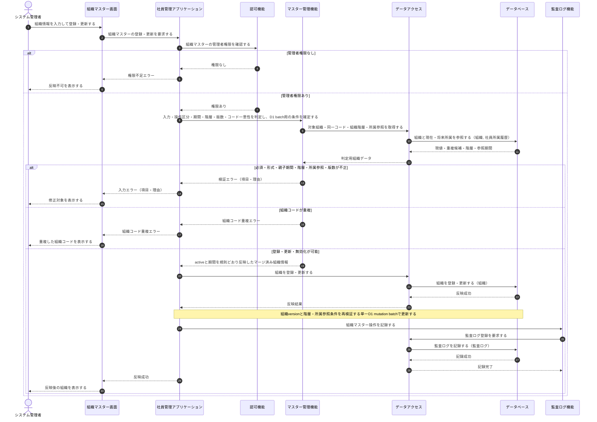

**連携定義**

条件分岐

| 条件ID | 判定箇所 | 条件 | 成立時 | 不成立時 | 根拠 |
|---|---|---|---|---|---|
| COND-01 | 認可機能 | 実行者が組織マスターの管理者権限を持つ | 入力検証へ進む | 権限不足エラー | UC-010/SP-1 (不成立=UC-010/SP-3) |
| COND-02 | マスター管理機能 | 必須・形式・親子期間包含・階層・有効な子組織・現在/将来所属参照・版数が妥当 | 組織コードの一意判定へ進む | 入力・期間・階層・参照・競合エラー | UC-010/SP-1 (不成立=UC-010/SP-4) |
| COND-03 | マスター管理機能 | 組織コードが一意 | 組織を登録・更新する | 組織コード重複エラー | UC-010/SP-1 (不成立=UC-010/SP-5) |
| COND-04 | マスター管理機能 | 操作が無効化指定である | 手動利用可否を即時無効化し、終了日は指定時だけ更新する | active現値を維持して登録・更新する | UC-010/SP-2 (成立=UC-010/SP-2、不成立=UC-010/SP-1) |

データ参照・更新

| エンティティ | CRUD | 目的 | 実行主体 |
|---|---|---|---|
| 組織 | R | 組織コードの重複(一意性)確認 | データアクセス |
| 社員所属履歴 | R | 無効化・期間短縮後も現在・将来所属の参照期間が包含されることを確認 | データアクセス |
| 組織 | C | 新規組織の登録 | データアクセス |
| 組織 | U | 既存組織の更新／無効化(手動利用可否=無効、終了日は指定時だけ更新) | データアクセス |
| 監査ログ | C | 組織マスター操作の証跡記録 | データアクセス（M-007から委譲） |

トランザクション境界

| 境界ID | 開始 | 終了 | 対象更新 | ロールバック条件 | 管理主体 |
|---|---|---|---|---|---|
| TX-006 | M-006が組織version・階層・所属参照条件付きD1 mutation batchを送信 | `batch()`成功 | 組織 | 条件不成立、制約違反または登録・更新文の失敗時にD1がbatch全体をロールバック | M-002が境界を宣言しM-006が実行 |

補足事項

| 観点 | 内容 |
|---|---|
| 同期/非同期 | 画面〜反映完了まで同期。監査ログ記録は業務トランザクションと別に行う |
| 整合性 | 組織コード一意性に加え、上位組織はactive=trueかつ子の期間全体を包含する。D1の逐次実行とbatch内条件・SQLiteトリガーで循環、有効な子の孤児化、現在・将来所属の参照不能を拒否する |
| 利用可否・期間 | 指定日時点で利用可能なのは手動利用可かつ有効期間内の場合だけ。無効化・将来終了は、子組織と所属参照を壊さない場合だけ許可する |
| 監査ログ | 監査ログは業務コミット後に別トランザクションで記録する。記録失敗時も組織更新は戻さず、運用アラートを通知して成功結果を返す |

## 3.13 役職マスター管理

UC-011(状態パターン UC-011/SP-1〜SP-5。無効化は UC-011/SP-2 として基本フローに含む)。管理者権限・入力妥当性・役職コードの一意性と、現在・将来所属への影響を確認したうえで、役職の登録・更新(無効化を含む)を単一トランザクションで反映し、操作を監査ログに記録する。参照中の所属を無効にする無効化・期間短縮は拒否する。

**連携定義**

条件分岐

| 条件ID | 判定箇所 | 条件 | 成立時 | 不成立時 | 根拠 |
|---|---|---|---|---|---|
| COND-01 | 認可機能 | 実行者が役職マスターの管理者権限を持つ | 入力検証へ進む | 権限不足エラー | UC-011/SP-1 (不成立=UC-011/SP-3) |
| COND-02 | マスター管理機能 | 必須・形式・期間・現在/将来所属参照・版数が妥当 | 役職コードの一意判定へ進む | 入力・期間・参照・競合エラー | UC-011/SP-1 (不成立=UC-011/SP-4) |
| COND-03 | マスター管理機能 | 役職コードが一意 | 役職を登録・更新する | 役職コード重複エラー | UC-011/SP-1 (不成立=UC-011/SP-5) |
| COND-04 | マスター管理機能 | 操作が無効化指定である | 手動利用可否を即時無効化し、終了日は指定時だけ更新する | active現値を維持して登録・更新する | UC-011/SP-2 (成立=UC-011/SP-2、不成立=UC-011/SP-1) |

データ参照・更新

| エンティティ | CRUD | 目的 | 実行主体 |
|---|---|---|---|
| 役職 | R | 役職コードの重複(一意性)確認 | データアクセス |
| 社員所属履歴 | R | 無効化・期間短縮後も現在・将来所属の参照期間が包含されることを確認 | データアクセス |
| 役職 | C | 新規役職の登録 | データアクセス |
| 役職 | U | 既存役職の更新／無効化(手動利用可否=無効、終了日は指定時だけ更新) | データアクセス |
| 監査ログ | C | 役職マスター操作の証跡記録 | データアクセス（M-007から委譲） |

トランザクション境界

| 境界ID | 開始 | 終了 | 対象更新 | ロールバック条件 | 管理主体 |
|---|---|---|---|---|---|
| TX-007 | M-006が役職version・所属参照条件付きD1 mutation batchを送信 | `batch()`成功 | 役職 | 条件不成立、制約違反または登録・更新文の失敗時にD1がbatch全体をロールバック | M-002が境界を宣言しM-006が実行 |

補足事項

| 観点 | 内容 |
|---|---|
| 同期/非同期 | 画面〜反映完了まで同期。監査ログ記録は業務トランザクションと別に行う |
| 整合性 | 役職コード一意性と現在・将来所属の参照期間包含をD1 batch内の条件付き文・SQLiteトリガーで再検証する |
| 利用可否・期間 | 指定日時点で利用可能なのは手動利用可かつ有効期間内の場合だけ。無効化・将来終了は所属参照を壊さない場合だけ許可する |
| 監査ログ | 監査ログは業務コミット後に別トランザクションで記録する。記録失敗時も役職更新は戻さず、運用アラートを通知して成功結果を返す |

## 3.14 権限管理

UC-012(状態パターン UC-012/SP-1〜SP-6)。管理者権限・対象社員と利用者アカウントの存在・アカウント有効性・指定ロール・業務日以降の有効期間の妥当性を確認したうえで、指定適用日以降を`active=true`の更新後ロール一式へ置き換える。既存の`active=false`ロール割当は参照表示し、置換時の終了・取消対象にできるが新規指定できない。ロール割当と社員変更履歴を同一トランザクションで更新し、監査ログを別トランザクションで記録する。

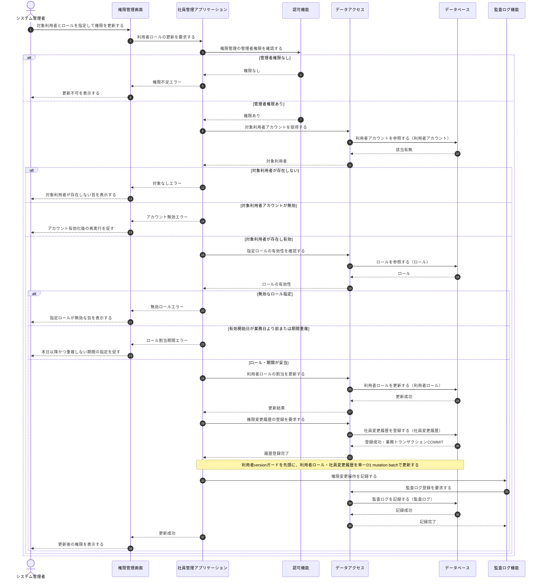

**連携定義**

条件分岐

| 条件ID | 判定箇所 | 条件 | 成立時 | 不成立時 | 根拠 |
|---|---|---|---|---|---|
| COND-01 | 認可機能 | 実行者が権限管理の管理者権限を持つ | 対象利用者の確認へ進む | 権限不足エラー | UC-012/SP-1 (不成立=UC-012/SP-2) |
| COND-02 | 社員管理アプリケーション | 対象社員と利用者アカウントが存在する | アカウント有効性確認へ進む | 対象なしエラー | UC-012/SP-1 (不成立=UC-012/SP-3) |
| COND-03 | 社員管理アプリケーション | 対象利用者アカウントが有効である | 指定ロールの妥当性確認へ進む | アカウント無効エラー | UC-012/SP-1 (不成立=UC-012/SP-6) |
| COND-04 | 社員管理アプリケーション | 指定ロールが有効である | 有効期間の妥当性確認へ進む | 無効ロールエラー | UC-012/SP-1 (不成立=UC-012/SP-4) |
| COND-05 | 認証・認可／社員管理アプリケーション | 有効開始日が業務日以降で既存割当と重複しない | 利用者ロールの割当を更新する | ロール割当期間エラー | UC-012/SP-1 (不成立=UC-012/SP-5) |

データ参照・更新

| エンティティ | CRUD | 目的 | 実行主体 |
|---|---|---|---|
| 利用者アカウント | R | 対象利用者アカウントの存在確認 | データアクセス |
| 利用者アカウント | U | ロール割当更新用版数の楽観ロック | データアクセス |
| ロール | R | 指定ロールの有効性確認 | データアクセス |
| 利用者ロール | U | 対象利用者へのロール割当の更新 | データアクセス |
| 社員変更履歴 | C | 対象社員の権限変更履歴の記録 | データアクセス |
| 監査ログ | C | 権限変更操作の証跡記録 | データアクセス（M-007から委譲） |

トランザクション境界

| 境界ID | 開始 | 終了 | 対象更新 | ロールバック条件 | 管理主体 |
|---|---|---|---|---|---|
| TX-008 | M-006が利用者versionガードを先頭にD1 mutation batchを送信 | `batch()`成功 | 利用者アカウント、利用者ロール、社員変更履歴 | version不一致、制約違反またはいずれかの文が失敗した場合にD1がbatch全体をロールバック | M-002が境界を宣言しM-006が実行 |

補足事項

| 観点 | 内容 |
|---|---|
| 同期/非同期 | 画面〜更新完了まで同期。監査ログ記録は業務トランザクションと別に行う |
| 設計状態 | 画面はSCR-011、APIはAPI-015〜017、業務処理はM-002/IF-12として詳細化済み |
| 監査ログ | 権限変更は影響が大きいため別トランザクションで証跡を記録する。記録失敗時も業務更新はロールバックせず、アラートを通知してAPIは更新成功として返す |
