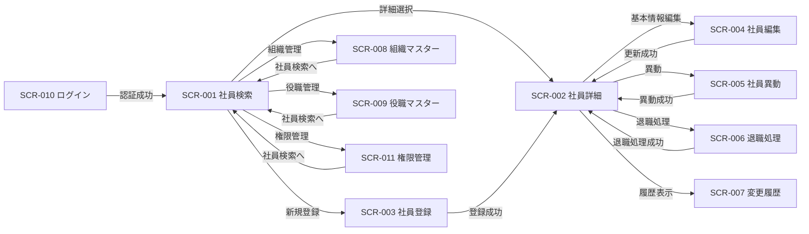
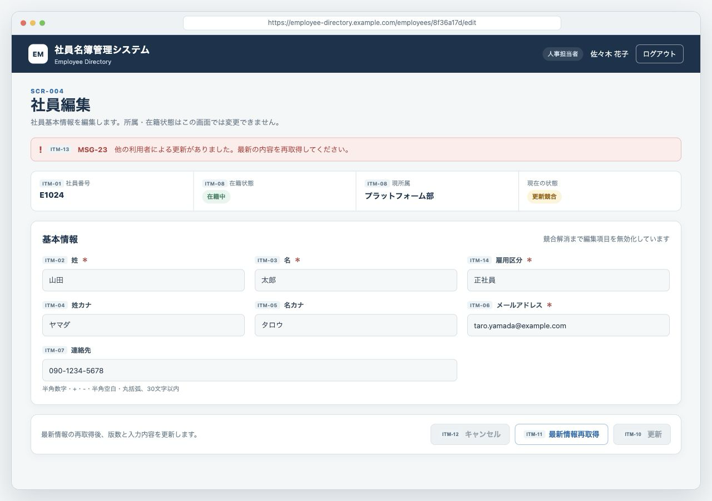
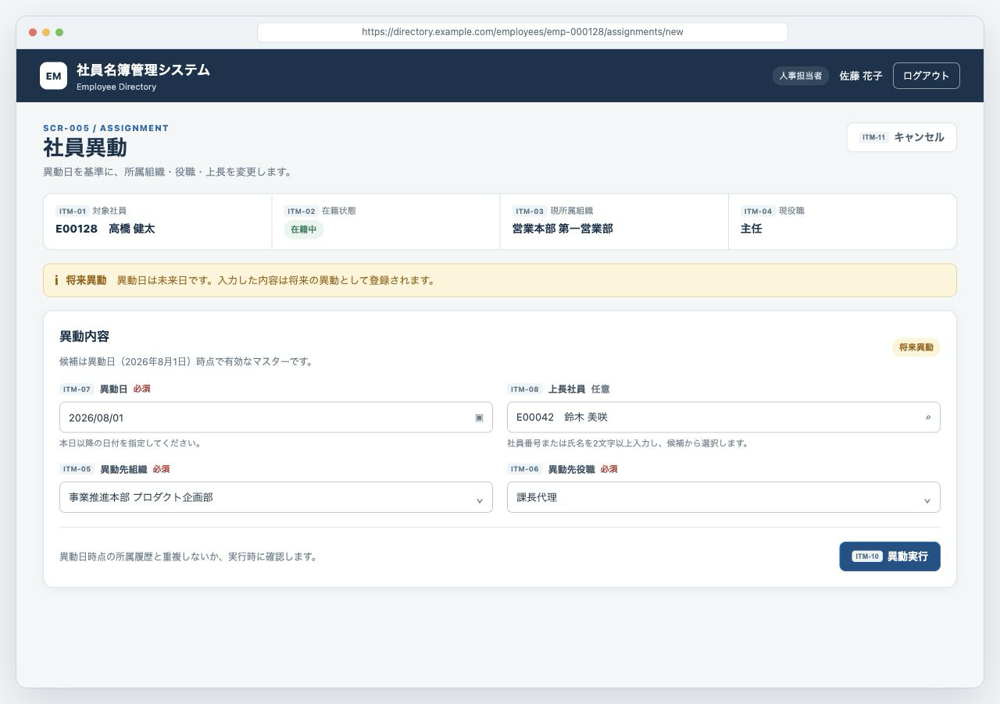
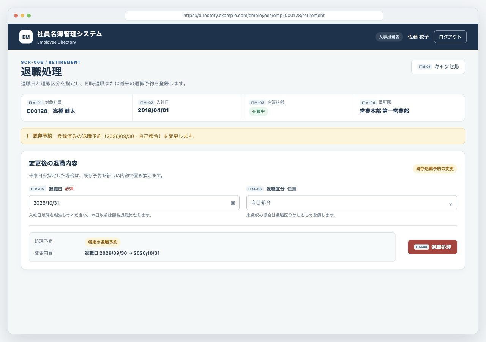
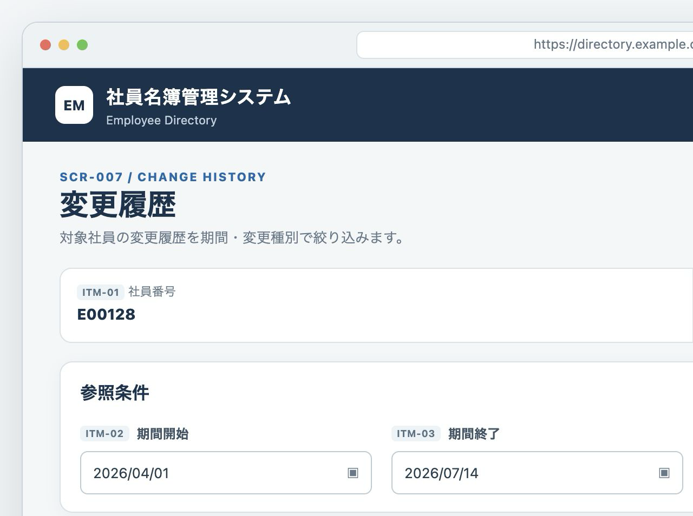
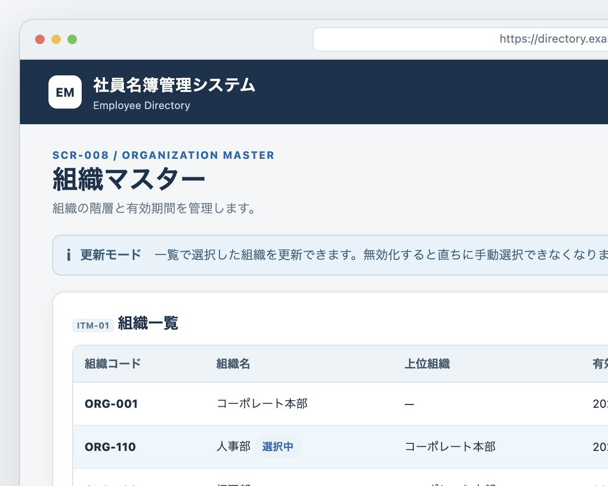
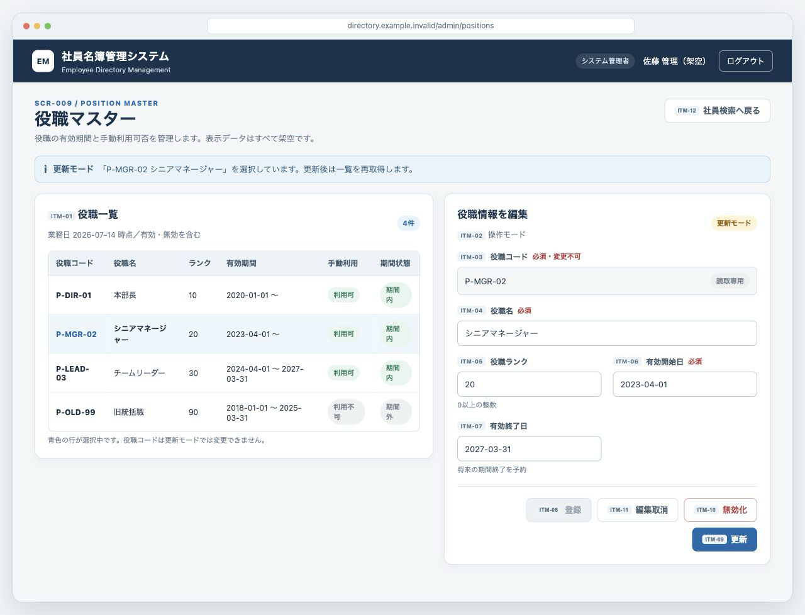
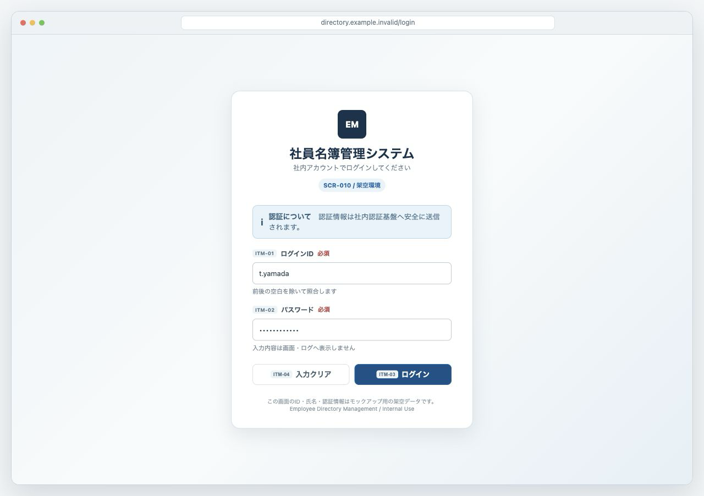
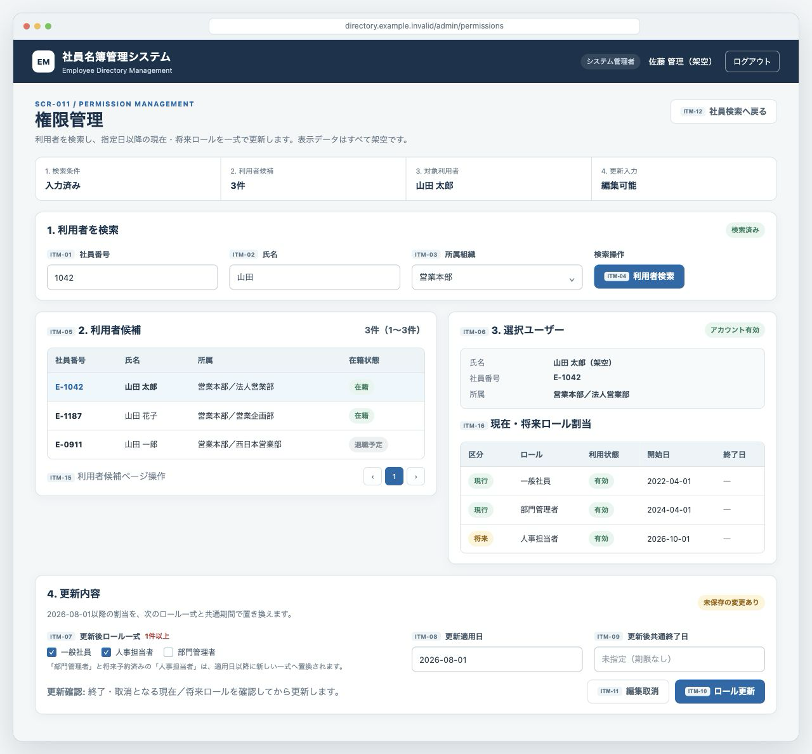

[← 設計書一覧（社員名簿管理システム）](README.md)

# 4. 画面設計

本章は社員名簿管理システムの全画面(SCR-001〜SCR-011)を詳細設計レベルで定義する。全画面を同一の9サブセクション
(基本情報、画面レイアウト、初期表示、画面項目、画面イベント、入力チェック、画面状態・表示制御、画面遷移、メッセージ一覧)で記載する。
ITM-XX と EVT-XX は画面内ローカルIDであり、他文書から参照する場合は SCR-XXX/ITM-XX、SCR-XXX/EVT-XX とする。
画面からデータベースやSQLへ直接アクセスせず、本章には物理データベース名・カラム名・SQLを記載しない。

## 4.0 共通API応答制御

| 応答・事象 | 全画面共通処理 | 遷移・表示 | 個別イベント表との関係 |
|---|---|---|---|
| UNAUTHENTICATED | SCR-010以外でAPIがUNAUTHENTICATEDを返した場合、保持中のアクセストークンを破棄し、進行中要求を取消し、全操作を無効化する | MSG-12を表示してSCR-010へ遷移する。戻り先は同一オリジンかつ定義済み画面ルートと検証できたURLだけを保持し、認証情報・画面入力値・個人情報は引き継がない | 各初期表示・イベントの「その他」にはUNAUTHENTICATEDを含めない。本行を全API呼出へ優先適用する |
| ログイン後の戻り | API-010成功後、検証済み戻り先があれば1回だけ使用して破棄する | 戻り先なし・不正・権限不足の場合はSCR-001へ遷移する | SCR-010の成功遷移へ適用する |
| 相関IDありエラー | API応答のtraceIdを問い合わせ・クライアントログ相関にだけ利用し、内部例外・接続情報を表示しない | 個別画面で定義した業務エラーまたはシステムエラーを表示する | 個別イベント表のMSG・再実行制御を適用する |

- ロールコード、閲覧スコープ、表示項目および更新可能項目は§2.6を正本とする。画面は非許可項目を非表示または表示専用とするが、ボタンや項目の非表示だけを認可手段とはせず、APIの権限判定結果を必ず適用する。
- 複数ロール時は§2.6の権限和集合とスコープ優先規則を適用する。業務日時点で有効なロールがない場合は保護画面を表示せず、SCR-001へ戻して権限不足を通知する。
- API-010が返すアクセストークンの正本はブラウザータブ内のアプリケーションメモリだけとし、`localStorage`、`sessionStorage`、IndexedDB、URL、画面項目およびクライアントログへ保存しない。SCR-010以外の全API要求へ`Authorization: Bearer <accessToken>`を付与し、期限到来、UNAUTHENTICATED、明示ログアウト、タブ終了、またはアプリケーション再読込時に破棄する。再読込後は未認証としてSCR-010から再開し、DOMへトークンを展開せず、動的HTML生成時はエスケープしてXSS対策を適用する。
- SCR-010以外の共通ヘッダーにログアウト操作を表示する。押下時は新規APIを呼ばず、進行中要求を取消し、メモリ上のトークン・検証済み戻り先・画面内の個人情報を破棄してSCR-010へ遷移する。二重押下は同じ未認証状態へ収束させる。

### 4.0.1 共通メッセージ一覧

| MSG ID | 種別 | 文言 | 対応ERR |
|---|---|---|---|
| MSG-12 | エラー | 認証の有効期限が切れました。再度ログインしてください。 | UNAUTHENTICATED |

共通応答制御で参照するMSGの文言は本表を正本とし、個別画面のメッセージ一覧へ重複定義しない。

## 4.1 画面一覧

| 画面ID | 画面名 | URL / ルート | 目的 | 主な利用者 | トレース元 |
|---|---|---|---|---|---|
| SCR-001 | 社員検索画面 | /employees | 権限範囲内の社員を検索し、詳細参照・登録・検索結果出力へつなぐ | 全利用者 | UC-002(F-002), UC-009(F-009) |
| SCR-002 | 社員詳細画面 | /employees/{employeeId} | 社員の基本情報・所属・役職・在籍状態を権限範囲内で参照する | 全利用者 | UC-006(F-003) |
| SCR-003 | 社員登録画面 | /employees/new | 社員基本情報と初期所属を登録する | 人事担当者 | UC-001(F-004) |
| SCR-004 | 社員編集画面 | /employees/{employeeId}/edit | 社員基本情報を競合検知付きで更新する | 人事担当者、条件付きで本人 | UC-007(F-005) |
| SCR-005 | 社員異動画面 | /employees/{employeeId}/assignments/new | 所属・役職を適用日付きで変更する | 人事担当者 | UC-003(F-006) |
| SCR-006 | 退職処理画面 | /employees/{employeeId}/retirement | 退職日を登録し退職処理または退職予約を行う | 人事担当者 | UC-004(F-007) |
| SCR-007 | 変更履歴画面 | /employees/{employeeId}/history | 社員情報の変更履歴を条件指定して参照する | 人事担当者、システム管理者 | UC-008(F-008) |
| SCR-008 | 組織マスター画面 | /admin/organizations | 組織マスターを登録・更新・無効化する | システム管理者 | UC-010(F-010) |
| SCR-009 | 役職マスター画面 | /admin/positions | 役職マスターを登録・更新・無効化する | システム管理者 | UC-011(F-011) |
| SCR-010 | ログイン画面 | /login | 社内認証基盤で認証しアクセストークンを取得する | 全利用者 | UC-005(F-001) |
| SCR-011 | 権限管理画面 | /admin/permissions | 利用者を特定しロール割当を参照・更新する | システム管理者 | UC-012(F-012) |

## 4.2 画面遷移

## 4.3 SCR-001 社員検索画面

### 4.3.1 基本情報

| 項目 | 内容 |
|---|---|
| 画面ID | SCR-001 |
| 画面名 | 社員検索画面 |
| URL / ルート | /employees |
| 目的 | 検索条件と閲覧可能範囲に一致する社員を一覧表示し、詳細参照・登録・検索結果出力へつなぐ |
| トレース元 | UC-002(F-002), UC-009(F-009) |
| 利用可能ロール | 全利用者。新規登録・出力・管理画面への導線はロールで制御する |
| 表示契機 | SCR-010の認証成功、各業務画面からの戻り |
| 利用API | API-001, API-008, API-009, API-018 |

### 4.3.2 画面レイアウト

| 項目 | 内容 |
|---|---|
| 代表状態 | 人事担当者・システム管理者の複数ロールでログインし、検索結果出力が完了した状態 |
| 配置要点 | 検索条件、出力設定、結果一覧を業務順に上から配置し、主要操作とページ操作を同一視野内に置く |
| 編集可能な原本 | [SCR-001.html](mockups/SCR-001.html) |

### 4.3.3 初期表示

| No | 処理 | API | 正常時 | 異常時 |
|---:|---|---|---|---|
| 1 | 組織選択肢を取得する | API-008 | ITM-03へ閲覧可能な組織を設定 | 取得条件不正はMSG-98、権限不足はMSG-102、認証切れはMSG-12、その他はMSG-13を表示しITM-03を無効化 |
| 2 | 役職選択肢を取得する | API-009 | ITM-04へ有効な役職を設定 | 取得条件不正はMSG-98、権限不足はMSG-102、認証切れはMSG-12、その他はMSG-13を表示しITM-04を無効化 |
| 3 | 既定条件で1ページ目を検索する | API-001 | ITM-08へ一覧、ITM-09へ件数を設定 | 入力不正はMSG-98、権限不足はMSG-99、認証切れはMSG-12、その他はMSG-13を表示 |

### 4.3.4 画面項目

| 項目ID | 項目名 | 種別 | 必須 | 入力・表示規則 |
|---|---|---|---|---|
| ITM-01 | 社員番号 | テキスト | 任意 | 半角英数字。前後空白を除去して検索条件とする |
| ITM-02 | 氏名 | テキスト | 任意 | 姓名を対象とする。前後空白を除去する |
| ITM-03 | 所属組織 | 選択 | 任意 | API-008で取得した閲覧可能な組織から選択 |
| ITM-04 | 役職 | 選択 | 任意 | API-009で取得した有効な役職から選択 |
| ITM-05 | 在籍状態 | 選択 | 任意 | §2.5の`ACTIVE`（在籍中）・`RETIRED`（退職）と検索制御値`ALL`（すべて）。初期値は`ACTIVE` |
| ITM-06 | 検索 | ボタン | ― | 検索可能状態で活性 |
| ITM-07 | クリア | ボタン | ― | 検索条件を初期値へ戻す |
| ITM-08 | 検索結果 | 一覧 | ― | 権限上表示可能な項目のみを表示。1行選択可能 |
| ITM-09 | 該当件数 | 表示 | ― | API-001の総件数を表示 |
| ITM-10 | ページ操作 | ページャー | ― | 1始まり。1ページ20件、最大100件 |
| ITM-11 | 新規登録 | ボタン | ― | 人事担当者だけ表示 |
| ITM-12 | 出力 | ボタン | ― | 人事担当者・部門管理者に表示。検索実行後に活性 |
| ITM-13 | 管理メニュー | リンク群 | ― | システム管理者にSCR-008、SCR-009、SCR-011への導線を表示 |
| ITM-14 | メッセージ領域 | 表示 | ― | MSG-10〜MSG-16、MSG-87、MSG-98、MSG-99、MSG-102を表示 |
| ITM-15 | 出力項目 | 複数選択 | 任意 | API-018のfieldコードを保持する。人事担当者には全13項目、部門管理者には社員番号・氏名・組織コード・所属組織・役職コード・役職・在籍状態だけを候補表示する。既定の表示順は社員番号・氏名・所属組織・役職・在籍状態。利用者が並べ替えた順を送信する |
| ITM-16 | 出力形式 | 選択 | 任意 | `CSV` / `XLSX`。初期値は`CSV` |

### 4.3.5 画面イベント

| イベントID | イベント名 | 発火条件 | 前提・入力 | API | 成功時 | 失敗時 | 多重実行防止 |
|---|---|---|---|---|---|---|---|
| EVT-01 | 検索 | ITM-06押下 | ITM-01〜05、1ページ目 | API-001 | 一覧・件数を更新。0件はMSG-10 | 入力不正はMSG-98、権限不足はMSG-99、認証切れはMSG-12、その他はMSG-13 | 応答まで検索・ページ操作を無効化 |
| EVT-02 | 条件クリア | ITM-07押下 | なし | なし | ITM-01〜05を初期値へ戻す | ― | 連打による副作用なし |
| EVT-03 | 詳細表示 | ITM-08の行を選択 | 選択社員ID | なし | SCR-002へ遷移 | 選択解除時は遷移しない | 1回の選択で1遷移 |
| EVT-04 | 新規登録表示 | ITM-11押下 | 人事担当者であること | なし | SCR-003へ遷移 | 非表示制御により実行不可 | 遷移開始後にボタン無効化 |
| EVT-05 | 検索結果出力 | ITM-12押下 | 直近の検索条件、ITM-15、ITM-16 | API-018 | 出力データを提供しMSG-16 | 入力不正はMSG-98、0件はMSG-14、10,000件超過はMSG-87、権限不足はMSG-15、認証切れはMSG-12、その他はMSG-13 | 応答まで出力ボタンを無効化 |
| EVT-06 | ページ切替 | ITM-10操作 | 検索条件・ページ番号・件数 | API-001 | 指定ページの一覧を表示 | 入力不正はMSG-98、権限不足はMSG-99、認証切れはMSG-12、その他はMSG-13 | 応答までページ操作を無効化 |
| EVT-07 | 管理画面表示 | ITM-13のリンク選択 | システム管理者であること | なし | 選択したSCR-008/009/011へ遷移 | 非表示制御により実行不可 | 遷移開始後にリンク無効化 |

### 4.3.6 入力チェック

| No | 対象 | タイミング | チェック内容 | 違反時 |
|---:|---|---|---|---|
| 1 | ITM-01 | EVT-01実行時 | 半角英数字であること | MSG-98を表示し送信しない |
| 2 | ITM-02 | EVT-01実行時 | 制御文字を含まないこと | MSG-98を表示し送信しない |
| 3 | ITM-10 | EVT-06実行時 | ページ番号は1以上、件数は1〜100 | MSG-98を表示し送信しない |
| 4 | ITM-15 | EVT-05実行時 | 1件以上、API-018で定義したfieldコード、重複なし、かつログインロールに許可された項目だけであること | 未知・重複はMSG-98を表示し送信しない。ロール非許可項目はMSG-15を表示し送信しない |
| 5 | ITM-16 | EVT-05実行時 | `CSV`または`XLSX` | MSG-98を表示し送信しない |

### 4.3.7 画面状態・表示制御

| 状態 | 条件・契機 | 入力・操作制御 | 表示内容 | 対応状態パターン |
|---|---|---|---|---|
| 初期表示 | 初期API正常 | 検索条件を編集可 | 権限内の既定一覧 | UC-002/SP-1 |
| 検索中 | EVT-01/06の応答待ち | 検索・ページ操作を無効化 | MSG-11 | UC-002/SP-1 |
| 検索結果あり | 1件以上 | 詳細選択可。権限により出力可 | 一覧と件数 | UC-002/SP-1 |
| 検索結果なし | 0件 | 詳細・出力を無効化 | MSG-10 | UC-002/SP-2, UC-009/SP-2 |
| 出力中 | EVT-05の応答待ち | 出力を無効化 | MSG-11 | UC-009/SP-1 |
| 出力上限超過 | API-018が10,000件超過 | 条件を保持し、検索条件を絞り込み可能 | MSG-87 | 該当なし(出力上限超過) |
| 出力権限なし | API-018が権限不足 | 出力を無効化 | MSG-15 | UC-009/SP-3 |
| 検索権限なし | API-001が権限不足 | 検索・ページ操作を無効化 | MSG-99 | 該当なし(検索権限不足) |
| 条件不正 | API-001/018が入力不正 | 条件を保持し修正可 | MSG-98 | 該当なし(入力条件不備) |
| 認証切れ | API-001が認証無効 | 全操作を無効化 | MSG-12 | UC-002/SP-3 |
| システムエラー | 技術例外 | 条件を保持し再実行可 | MSG-13 | 該当なし(技術例外) |

### 4.3.8 画面遷移

| 遷移元イベント | 遷移先 | 条件 | 引継ぎ値 |
|---|---|---|---|
| EVT-03 | SCR-002 | 検索結果行を選択 | 社員ID |
| EVT-04 | SCR-003 | 人事担当者 | なし |
| EVT-07 | SCR-008 / SCR-009 / SCR-011 | システム管理者 | 選択した管理機能 |
| 認証切れ | SCR-010 | MSG-12確認後 | 戻り先URL |

### 4.3.9 メッセージ一覧

| MSG ID | 種別 | 文言 | 対応ERR |
|---|---|---|---|
| MSG-10 | 情報 | 条件に一致する社員が見つかりませんでした。 | - |
| MSG-11 | 情報 | 処理中です。しばらくお待ちください。 | - |
| MSG-13 | エラー | 情報を取得できませんでした。時間をおいて再度お試しください。 | INTERNAL_ERROR |
| MSG-14 | 情報 | 出力対象の社員がありません。検索条件を変更してください。 | EXPORT_TARGET_EMPTY |
| MSG-15 | エラー | 検索結果を出力する権限がありません。 | FORBIDDEN |
| MSG-16 | 完了 | 検索結果を出力しました。 | - |
| MSG-87 | エラー | 出力対象が10,000件を超えています。検索条件を絞り込んでください。 | EXPORT_LIMIT_EXCEEDED |
| MSG-98 | エラー | 検索条件または出力条件に誤りがあります。入力内容をご確認ください。 | VALIDATION_ERROR |
| MSG-99 | エラー | 社員を検索する権限がありません。 | FORBIDDEN |
| MSG-102 | エラー | 検索条件の組織・役職候補を取得する権限がありません。 | FORBIDDEN |

## 4.4 SCR-002 社員詳細画面

### 4.4.1 基本情報

| 項目 | 内容 |
|---|---|
| 画面ID | SCR-002 |
| 画面名 | 社員詳細画面 |
| URL / ルート | /employees/{employeeId} |
| 目的 | 対象社員の基本情報・現所属・役職・在籍状態を権限に応じて表示する |
| トレース元 | UC-006(F-003) |
| 利用可能ロール | 全利用者。表示項目と操作はロール・所属・本人条件で制御する |
| 表示契機 | SCR-001の検索結果選択、登録・更新・異動・退職の正常終了 |
| 利用API | API-002 |

### 4.4.2 画面レイアウト

| 項目 | 内容 |
|---|---|
| 代表状態 | 人事担当者が表示済みの在籍中社員を参照中、再読込で技術例外が発生して再実行できる状態 |
| 配置要点 | 上部に業務操作、中央に基本情報、下部に現所属情報を分離し、参照情報と更新導線を明確にする |
| 編集可能な原本 | [SCR-002.html](mockups/SCR-002.html) |

### 4.4.3 初期表示

| No | 処理 | API | 正常時 | 異常時 |
|---:|---|---|---|---|
| 1 | URLの社員IDで詳細を取得する | API-002 | 権限上表示可能な項目を設定 | 不存在はMSG-17、権限不足はMSG-18、その他はMSG-20 |
| 2 | 利用者権限で操作導線を制御する | なし | 編集・異動・退職・履歴ボタンを表示制御 | 権限情報がない場合は操作導線を非表示 |

### 4.4.4 画面項目

| 項目ID | 項目名 | 種別 | 必須 | 入力・表示規則 |
|---|---|---|---|---|
| ITM-01 | 社員番号 | 表示 | ― | 参照権限がある場合に表示 |
| ITM-02 | 氏名・氏名カナ | 表示 | ― | 氏名は全スコープで表示する。氏名カナは`HR`・`SYSTEM_ADMIN`または`EMPLOYEE`本人だけに表示し、`DEPARTMENT_MANAGER`には表示しない |
| ITM-03 | メールアドレス・連絡先 | 表示 | ― | `HR`・`SYSTEM_ADMIN`または`EMPLOYEE`本人だけに表示し、`DEPARTMENT_MANAGER`には表示しない |
| ITM-04 | 入社日・退職日・退職区分 | 表示 | ― | `HR`・`SYSTEM_ADMIN`または`EMPLOYEE`本人だけに表示する。退職日・退職区分は設定済みの場合だけ表示し、`DEPARTMENT_MANAGER`には表示しない |
| ITM-05 | 雇用区分・在籍状態 | 表示 | ― | 在籍状態は全スコープで表示する。雇用区分は`HR`・`SYSTEM_ADMIN`または`EMPLOYEE`本人だけに表示し、§2.5のコードを表示名へ変換する |
| ITM-06 | 現所属・役職・上長 | 表示 | ― | 全スコープで現在有効な所属情報を表示する |
| ITM-07 | 基本情報編集 | ボタン | ― | `HR`、または対象社員本人である`EMPLOYEE`に表示する。`DEPARTMENT_MANAGER`と`SYSTEM_ADMIN`には表示しない |
| ITM-08 | 異動 | ボタン | ― | 人事担当者かつ在籍中の場合に表示 |
| ITM-09 | 退職処理 | ボタン | ― | 人事担当者かつ在籍中の場合に表示 |
| ITM-10 | 変更履歴 | ボタン | ― | 人事担当者・システム管理者に表示 |
| ITM-11 | 一覧へ戻る | ボタン | ― | 常時表示 |
| ITM-12 | 再読込 | ボタン | ― | 技術例外時に活性 |
| ITM-13 | メッセージ領域 | 表示 | ― | MSG-17〜MSG-20を表示 |

### 4.4.5 画面イベント

| イベントID | イベント名 | 発火条件 | 前提・入力 | API | 成功時 | 失敗時 | 多重実行防止 |
|---|---|---|---|---|---|---|---|
| EVT-01 | 詳細再読込 | ITM-12押下 | URLの社員ID | API-002 | 表示内容を更新 | 社員ID不正・不存在はMSG-17、権限不足はMSG-18、その他はMSG-20 | 応答まで再読込を無効化 |
| EVT-02 | 基本情報編集 | ITM-07押下 | 社員ID | なし | SCR-004へ遷移 | 非表示制御により実行不可 | 遷移開始後に無効化 |
| EVT-03 | 異動表示 | ITM-08押下 | 社員ID | なし | SCR-005へ遷移 | 非表示制御により実行不可 | 遷移開始後に無効化 |
| EVT-04 | 退職処理表示 | ITM-09押下 | 社員ID | なし | SCR-006へ遷移 | 非表示制御により実行不可 | 遷移開始後に無効化 |
| EVT-05 | 変更履歴表示 | ITM-10押下 | 社員ID | なし | SCR-007へ遷移 | 非表示制御により実行不可 | 遷移開始後に無効化 |
| EVT-06 | 一覧へ戻る | ITM-11押下 | なし | なし | SCR-001へ遷移 | ― | 遷移開始後に無効化 |

### 4.4.6 入力チェック

| No | 対象 | タイミング | チェック内容 | 違反時 |
|---:|---|---|---|---|
| 1 | URLの社員ID | 初期表示・EVT-01 | 値が存在し所定形式であること | MSG-17を表示しAPIを呼ばない |

### 4.4.7 画面状態・表示制御

| 状態 | 条件・契機 | 入力・操作制御 | 表示内容 | 対応状態パターン |
|---|---|---|---|---|
| 読込中 | 初期表示・EVT-01 | 全操作を無効化 | MSG-19 | UC-006/SP-1 |
| 表示 | 対象存在・権限内 | 権限と在籍状態により操作表示 | 社員詳細 | UC-006/SP-1 |
| 対象不存在 | API-002が不存在 | 一覧へ戻るだけ活性 | MSG-17 | UC-006/SP-2 |
| 閲覧権限なし | API-002が権限不足 | 一覧へ戻るだけ活性 | MSG-18 | UC-006/SP-3 |
| システムエラー | 技術例外 | 再読込・戻るを活性 | MSG-20 | 該当なし(技術例外) |

### 4.4.8 画面遷移

| 遷移元イベント | 遷移先 | 条件 | 引継ぎ値 |
|---|---|---|---|
| EVT-02 | SCR-004 | 更新権限あり | 社員ID |
| EVT-03 | SCR-005 | 人事担当者かつ在籍中 | 社員ID |
| EVT-04 | SCR-006 | 人事担当者かつ在籍中 | 社員ID |
| EVT-05 | SCR-007 | 履歴参照権限あり | 社員ID |
| EVT-06 | SCR-001 | 常時 | 直前の検索条件 |

### 4.4.9 メッセージ一覧

| MSG ID | 種別 | 文言 | 対応ERR |
|---|---|---|---|
| MSG-17 | エラー | 対象の社員が見つかりません。 | VALIDATION_ERROR / EMPLOYEE_NOT_FOUND |
| MSG-18 | エラー | この社員を参照する権限がありません。 | FORBIDDEN |
| MSG-19 | 情報 | 社員情報を読み込んでいます。 | - |
| MSG-20 | エラー | 社員情報を取得できませんでした。時間をおいて再度お試しください。 | INTERNAL_ERROR |

## 4.5 SCR-003 社員登録画面

### 4.5.1 基本情報

| 項目 | 内容 |
|---|---|
| 画面ID | SCR-003 |
| 画面名 | 社員登録画面 |
| URL / ルート | /employees/new |
| 目的 | 社員の基本情報と初期所属を一体として登録する |
| トレース元 | UC-001(F-004) |
| 利用可能ロール | 人事担当者 |
| 表示契機 | SCR-001で新規登録を選択 |
| 利用API | API-003, API-008, API-009 |

### 4.5.2 画面レイアウト

| 項目 | 内容 |
|---|---|
| 代表状態 | 人事担当者が基本情報、雇用情報、初期所属を入力し、入力不正MSGを確認している状態 |
| 配置要点 | 入力項目を基本・雇用・初期所属のカードへ分割し、キャンセルと登録を画面末尾へ集約する |
| 編集可能な原本 | [SCR-003.html](mockups/SCR-003.html) |

### 4.5.3 初期表示

| No | 処理 | API | 正常時 | 異常時 |
|---:|---|---|---|---|
| 1 | 入力項目を初期化する | なし | 入社日に業務日を設定する。初期所属の適用開始日は画面項目として入力させず、登録実行時の入社日から自動設定する | ― |
| 2 | 入社日時点で有効な組織を取得する | API-008 | `effectiveOn=ITM-07`、`activeOnly=true`で取得し、ITM-08へ選択肢、ITM-14へ基準日を設定 | 取得条件不正はMSG-01、権限不足はMSG-07、その他はMSG-08を表示し登録を無効化 |
| 3 | 入社日時点で有効な役職を取得する | API-009 | `effectiveOn=ITM-07`、`activeOnly=true`で取得し、ITM-09へ選択肢を設定。両候補取得成功時だけITM-14を確定 | 取得条件不正はMSG-01、権限不足はMSG-07、その他はMSG-08を表示し登録を無効化 |

### 4.5.4 画面項目

| 項目ID | 項目名 | 種別 | 必須 | 入力・表示規則 |
|---|---|---|---|---|
| ITM-01 | 社員番号 | テキスト | 必須 | 半角英数字、1〜20文字。社員番号の一意性はAPIで判定 |
| ITM-02 | 姓 | テキスト | 必須 | Unicode前後空白除去・NFC正規化後1〜100文字。正規化後の値を送信する |
| ITM-03 | 名 | テキスト | 必須 | Unicode前後空白除去・NFC正規化後1〜100文字。正規化後の値を送信する |
| ITM-04 | 姓カナ | テキスト | 任意 | 入力時はUnicode前後空白除去・NFC正規化後1〜100文字の全角カナ。未入力時は省略する |
| ITM-05 | 名カナ | テキスト | 任意 | 入力時はUnicode前後空白除去・NFC正規化後1〜100文字の全角カナ。未入力時は省略する |
| ITM-06 | メールアドレス | テキスト | 必須 | メール形式。メール一意性はAPIで判定 |
| ITM-07 | 入社日 | 日付 | 必須 | 有効な日付 |
| ITM-08 | 所属組織 | 選択 | 必須 | API-008で取得した有効な組織 |
| ITM-09 | 役職 | 選択 | 必須 | API-009で取得した有効な役職 |
| ITM-10 | 雇用区分 | 選択 | 必須 | §2.5の雇用区分5値をアプリケーション定義から表示し、対応するコードを送信する |
| ITM-11 | 登録 | ボタン | ― | 必須項目充足かつ入力可能状態で活性 |
| ITM-12 | キャンセル | ボタン | ― | 未保存の入力がある場合はMSG-09で確認 |
| ITM-13 | メッセージ領域 | 表示 | ― | MSG-01〜MSG-09を表示 |
| ITM-14 | マスター候補基準日 | 非表示保持 | 登録時必須 | API-008/009の両方を取得した`effectiveOn`を保持する。ITM-07変更時にクリアし、利用者は編集不可 |

### 4.5.5 画面イベント

| イベントID | イベント名 | 発火条件 | 前提・入力 | API | 成功時 | 失敗時 | 多重実行防止 |
|---|---|---|---|---|---|---|---|
| EVT-01 | 社員登録 | ITM-11押下 | ITM-01〜10を送信し、ITM-14がITM-07と一致すること。初期所属の適用開始日は公開API項目として送らず、API-003の呼出先がITM-07の入社日から導出する | API-003 | MSG-04表示後SCR-002へ遷移 | 入力不正はMSG-01、社員番号重複はMSG-02、メール重複はMSG-03、マスター無効はMSG-06、権限不足はMSG-07、その他はMSG-08 | 応答まで全入力・登録を無効化 |
| EVT-02 | キャンセル | ITM-12押下 | 入力変更有無 | なし | 変更なしはSCR-001、変更ありはMSG-09確認後遷移 | ― | 確認中は二重表示しない |
| EVT-03 | マスター再取得 | MSG-06表示後に再取得を選択 | 有効なITM-07を`effectiveOn`、`activeOnly=true`として指定 | API-008, API-009 | ITM-08/09の選択肢とITM-14を更新し、現在選択が候補外なら解除して登録可否を再評価 | 取得条件不正はMSG-01、権限不足はMSG-07、その他はMSG-08 | 応答まで再取得・登録を無効化 |
| EVT-04 | 入社日変更時の候補更新 | ITM-07変更後の入力離脱 | 有効なITM-07を`effectiveOn`、`activeOnly=true`として指定 | API-008, API-009 | ITM-08/09を取得し直してITM-14を設定。旧選択が候補外なら解除 | 入力不正はMSG-01、権限不足はMSG-07、その他はMSG-08 | 日付変更時に前要求を取消し、応答まで登録を無効化 |

### 4.5.6 入力チェック

| No | 対象 | タイミング | チェック内容 | 違反時 |
|---:|---|---|---|---|
| 1 | ITM-01〜03、06〜10 | EVT-01実行時 | 必須項目が入力・選択済み | MSG-01を表示し送信しない |
| 2 | ITM-01 | 入力離脱時・EVT-01 | 半角英数字で所定長以内 | MSG-01を表示し当該項目へフォーカス |
| 3 | ITM-02〜05 | 入力離脱時・EVT-01 | Unicode前後空白を除去してNFC正規化した後に検証する。姓・名は空文字不可かつ1〜100文字。カナは未入力を除き空文字不可、1〜100文字の全角カナ | MSG-01を表示し当該項目へフォーカス |
| 4 | ITM-06 | 入力離脱時・EVT-01 | メール形式 | MSG-01を表示し当該項目へフォーカス |
| 5 | ITM-07 | EVT-01実行時 | 有効な日付 | MSG-01を表示し送信しない |
| 6 | ITM-10 | EVT-01実行時 | §2.5の雇用区分コードのいずれか | MSG-01を表示し送信しない |
| 7 | ITM-14 | EVT-01実行時 | ITM-07と同じ日付でAPI-008/009の両候補を取得済み | MSG-01を表示し、EVT-04成功まで送信しない |

### 4.5.7 画面状態・表示制御

| 状態 | 条件・契機 | 入力・操作制御 | 表示内容 | 対応状態パターン |
|---|---|---|---|---|
| 初期表示・入力中 | マスター取得成功 | 編集可。必須充足で登録活性 | 入力内容・選択肢 | UC-001/SP-1, UC-001/SP-2 |
| 登録中 | EVT-01応答待ち | 全入力・登録を無効化 | MSG-05 | UC-001/SP-1, UC-001/SP-2 |
| 入力エラー | クライアント/API入力不備 | 編集可 | MSG-01 | UC-001/SP-4 |
| 社員番号重複 | API-003が社員番号重複 | ITM-01を編集可 | MSG-02 | UC-001/SP-5 |
| メール重複 | API-003がメール重複 | ITM-06を編集可 | MSG-03 | UC-001/SP-6 |
| マスター無効 | API-003がマスター無効 | ITM-08/09を再選択可 | MSG-06 | UC-001/SP-7 |
| 権限エラー | API-003が権限不足 | 入力・登録を無効化 | MSG-07 | UC-001/SP-3 |
| 登録成功 | API-003成功 | 全操作を無効化 | MSG-04 | UC-001/SP-1, UC-001/SP-2 |
| システムエラー | 技術例外 | 入力内容を保持。成功可否確認まで登録を無効化 | MSG-08 | 該当なし(技術例外) |
| マスター候補更新中 | EVT-03/04応答待ち | 組織・役職・登録を無効化 | MSG-05 | UC-001/SP-1, UC-001/SP-2 |

### 4.5.8 画面遷移

| 遷移元イベント | 遷移先 | 条件 | 引継ぎ値 |
|---|---|---|---|
| EVT-01 | SCR-002 | API-003成功 | 登録された社員ID、MSG-04 |
| EVT-02 | SCR-001 | 変更なし、またはMSG-09で破棄を確認 | 直前の検索条件 |

### 4.5.9 メッセージ一覧

| MSG ID | 種別 | 文言 | 対応ERR |
|---|---|---|---|
| MSG-01 | エラー | 入力内容に誤りがあります。対象の項目をご確認ください。 | VALIDATION_ERROR |
| MSG-02 | エラー | 入力された社員番号は既に登録されています。 | EMPLOYEE_NUMBER_DUPLICATED |
| MSG-03 | エラー | 入力されたメールアドレスは既に登録されています。 | EMAIL_DUPLICATED |
| MSG-04 | 完了 | 社員を登録しました。 | - |
| MSG-05 | 情報 | 登録処理中です。しばらくお待ちください。 | - |
| MSG-06 | エラー | 選択した組織または役職は無効です。最新の候補から選び直してください。 | MASTER_NOT_ACTIVE |
| MSG-07 | エラー | この操作を行う権限がありません。 | FORBIDDEN |
| MSG-08 | エラー | システムエラーが発生しました。時間をおいて再度お試しください。 | INTERNAL_ERROR |
| MSG-09 | 確認 | 入力内容を破棄して検索画面に戻ります。よろしいですか？ | - |

## 4.6 SCR-004 社員編集画面

### 4.6.1 基本情報

| 項目 | 内容 |
|---|---|
| 画面ID | SCR-004 |
| 画面名 | 社員編集画面 |
| URL / ルート | /employees/{employeeId}/edit |
| 目的 | 社員基本情報を権限範囲内で編集し、版数による競合検知付きで更新する |
| トレース元 | UC-007(F-005) |
| 利用可能ロール | 人事担当者。本人更新を許可する項目は一般社員本人も利用可 |
| 表示契機 | SCR-002で基本情報編集を選択 |
| 利用API | API-002, API-004 |

### 4.6.2 画面レイアウト

| 項目 | 内容 |
|---|---|
| 代表状態 | 人事担当者による更新時に競合を検知し、編集を停止して最新情報を再取得できる状態 |
| 配置要点 | 対象社員サマリーを固定的に先頭表示し、変更可能項目と更新操作をその下へまとめる |
| 編集可能な原本 | [SCR-004.html](mockups/SCR-004.html) |

### 4.6.3 初期表示

| No | 処理 | API | 正常時 | 異常時 |
|---:|---|---|---|---|
| 1 | 対象社員の最新情報と版数を取得する | API-002 | ITM-01〜09・ITM-14へ設定し、権限別に編集可否を設定 | 社員ID不正はMSG-21、不存在はMSG-27、権限不足はMSG-26、その他はMSG-28 |
| 2 | 初期値を変更前スナップショットとして保持する | なし | キャンセル・変更有無判定に使用 | ― |

### 4.6.4 画面項目

| 項目ID | 項目名 | 種別 | 必須 | 入力・表示規則 |
|---|---|---|---|---|
| ITM-01 | 社員番号 | 表示 | ― | 変更不可 |
| ITM-02 | 姓 | テキスト | 必須 | `HR`だけが編集可。Unicode前後空白除去・NFC正規化後1〜100文字 |
| ITM-03 | 名 | テキスト | 必須 | `HR`だけが編集可。Unicode前後空白除去・NFC正規化後1〜100文字 |
| ITM-04 | 姓カナ | テキスト | 任意 | `HR`だけが編集可。入力時はUnicode前後空白除去・NFC正規化後1〜100文字の全角カナ。既存値の消去は明示nullを送信する |
| ITM-05 | 名カナ | テキスト | 任意 | `HR`だけが編集可。入力時はUnicode前後空白除去・NFC正規化後1〜100文字の全角カナ。既存値の消去は明示nullを送信する |
| ITM-06 | メールアドレス | テキスト | 必須 | `HR`または対象社員本人の`EMPLOYEE`が編集可。前後空白除去後にメール形式を検証する |
| ITM-07 | 連絡先 | テキスト | 任意 | `HR`または対象社員本人の`EMPLOYEE`が編集可。前後空白除去後1〜30文字、許可文字は半角数字・`+`・`-`・半角空白・丸括弧。既存値の消去は明示nullを送信する |
| ITM-08 | 在籍状態・所属 | 表示 | ― | 参照のみ。本画面では変更しない |
| ITM-09 | 版数 | 非表示保持 | 必須 | API-002取得値をAPI-004へ送信。利用者は編集不可 |
| ITM-10 | 更新 | ボタン | ― | 変更あり、入力妥当、更新可能状態で活性 |
| ITM-11 | 最新情報再取得 | ボタン | ― | 競合時に表示 |
| ITM-12 | キャンセル | ボタン | ― | 未保存変更ありの場合はMSG-29で確認 |
| ITM-13 | メッセージ領域 | 表示 | ― | MSG-21〜MSG-29を表示 |
| ITM-14 | 雇用区分 | 選択 | 必須 | §2.5の雇用区分5値を表示する。人事担当者だけが編集でき、本人更新時は表示のみ。対応コードをAPI-004へ送信する |

### 4.6.5 画面イベント

| イベントID | イベント名 | 発火条件 | 前提・入力 | API | 成功時 | 失敗時 | 多重実行防止 |
|---|---|---|---|---|---|---|---|
| EVT-01 | 基本情報更新 | ITM-10押下 | ITM-02〜07を定義どおり正規化し、正規化後の保持値と比較して変更された許可項目、消去用null、ITM-14、ITM-09を送信する。変更のない項目は省略する | API-004 | MSG-24表示後SCR-002へ遷移 | 入力不正はMSG-21、メール重複はMSG-22、更新競合はMSG-23、権限不足はMSG-26、対象不存在はMSG-27、その他はMSG-28 | 応答まで全入力・更新を無効化 |
| EVT-02 | 最新情報再取得 | ITM-11押下 | 社員ID | API-002 | 最新値・版数を再設定し競合状態を解除 | 社員ID不正はMSG-21、不存在はMSG-27、権限不足はMSG-26、その他はMSG-28 | 応答まで再取得を無効化 |
| EVT-03 | キャンセル | ITM-12押下 | 変更有無 | なし | 変更なし、またはMSG-29確認後SCR-002へ遷移 | ― | 確認中は二重表示しない |

### 4.6.6 入力チェック

| No | 対象 | タイミング | チェック内容 | 違反時 |
|---:|---|---|---|---|
| 1 | ITM-02、03、06 | EVT-01実行時 | 必須項目が入力済み | MSG-21を表示し送信しない |
| 2 | ITM-02〜05 | 入力離脱時・EVT-01 | Unicode前後空白を除去してNFC正規化した後に検証する。姓・名は空文字不可かつ1〜100文字。カナは値指定時に空文字不可、1〜100文字の全角カナ。既存カナを空欄にした場合だけ解除用nullとする | MSG-21を表示し当該項目へフォーカス |
| 3 | ITM-06 | 入力離脱時・EVT-01 | メール形式 | MSG-21を表示し送信しない |
| 4 | ITM-07 | 入力離脱時・EVT-01 | 値指定時は前後空白除去後1〜30文字で、半角数字・`+`・`-`・半角空白・丸括弧だけ。空値は解除用nullへ変換する | MSG-21を表示し送信しない |
| 5 | ITM-02〜07、ITM-14 | EVT-01実行時 | 正規化後の値で少なくとも1項目が変更されている | 更新を実行せず操作を継続 |
| 6 | ITM-14 | EVT-01実行時 | §2.5の雇用区分コードのいずれか。本人更新では変更されていないこと | MSG-21を表示し送信しない |

### 4.6.7 画面状態・表示制御

| 状態 | 条件・契機 | 入力・操作制御 | 表示内容 | 対応状態パターン |
|---|---|---|---|---|
| 初期表示・編集中 | API-002成功 | 権限別に項目を編集可 | 最新情報 | UC-007/SP-1 |
| 更新中 | EVT-01応答待ち | 全入力・更新を無効化 | MSG-25 | UC-007/SP-1 |
| 入力エラー | 入力不備 | 編集可 | MSG-21 | UC-007/SP-3 |
| メール重複 | API-004が重複 | ITM-06を編集可 | MSG-22 | UC-007/SP-4 |
| 更新競合 | API-004が版数不一致 | 編集を無効化し再取得だけ活性 | MSG-23 | UC-007/SP-5 |
| 権限エラー | API-002/004が権限不足 | 編集・更新を無効化 | MSG-26 | UC-007/SP-2 |
| 更新成功 | API-004成功 | 全操作を無効化 | MSG-24 | UC-007/SP-1 |
| 対象不存在 | API-002が不存在 | キャンセルだけ活性 | MSG-27 | 該当なし(事前条件不成立) |
| システムエラー | 技術例外 | 入力を保持。再実行可否を応答状態で制御 | MSG-28 | 該当なし(技術例外) |

### 4.6.8 画面遷移

| 遷移元イベント | 遷移先 | 条件 | 引継ぎ値 |
|---|---|---|---|
| EVT-01 | SCR-002 | API-004成功 | 社員ID、MSG-24 |
| EVT-03 | SCR-002 | 変更なし、またはMSG-29で破棄を確認 | 社員ID |

### 4.6.9 メッセージ一覧

| MSG ID | 種別 | 文言 | 対応ERR |
|---|---|---|---|
| MSG-21 | エラー | 入力内容に誤りがあります。対象の項目をご確認ください。 | VALIDATION_ERROR |
| MSG-22 | エラー | 入力されたメールアドレスは既に登録されています。 | EMAIL_DUPLICATED |
| MSG-23 | エラー | 他の利用者による更新がありました。最新の内容を再取得してください。 | UPDATE_CONFLICT |
| MSG-24 | 完了 | 社員情報を更新しました。 | - |
| MSG-25 | 情報 | 更新処理中です。しばらくお待ちください。 | - |
| MSG-26 | エラー | 社員情報を更新する権限がありません。 | FORBIDDEN |
| MSG-27 | エラー | 対象の社員が見つかりません。 | EMPLOYEE_NOT_FOUND |
| MSG-28 | エラー | 社員情報を更新できませんでした。時間をおいて再度お試しください。 | INTERNAL_ERROR |
| MSG-29 | 確認 | 入力内容を破棄して社員詳細画面に戻ります。よろしいですか？ | - |

## 4.7 SCR-005 社員異動画面

### 4.7.1 基本情報

| 項目 | 内容 |
|---|---|
| 画面ID | SCR-005 |
| 画面名 | 社員異動画面 |
| URL / ルート | /employees/{employeeId}/assignments/new |
| 目的 | 在籍中社員の所属・役職を適用日付きで変更し、現在または将来の所属履歴を整合的に登録する |
| トレース元 | UC-003(F-006) |
| 利用可能ロール | 人事担当者 |
| 表示契機 | SCR-002で異動を選択 |
| 利用API | API-001, API-002, API-005, API-008, API-009 |

### 4.7.2 画面レイアウト

| 項目 | 内容 |
|---|---|
| 代表状態 | 人事担当者が将来日付の異動先と上長を指定している状態 |
| 配置要点 | 現在の所属情報と異動後の入力をカードで分離し、適用日による将来異動であることを明示する |
| 編集可能な原本 | [SCR-005.html](mockups/SCR-005.html) |

### 4.7.3 初期表示

| No | 処理 | API | 正常時 | 異常時 |
|---:|---|---|---|---|
| 1 | 対象社員・現所属・版数を取得する | API-002 | ITM-01〜04、ITM-09へ設定 | 社員ID不正はMSG-30、不存在・退職済みはMSG-31、権限不足はMSG-37、その他はMSG-38 |
| 2 | 異動日に業務日を設定する | なし | ITM-07へ初期値を設定 | ― |
| 3 | 異動日時点で有効な組織を取得する | API-008 | `effectiveOn=ITM-07`、`activeOnly=true`で取得し、ITM-05へ選択肢、ITM-14へ基準日を設定 | 取得条件不正はMSG-30、権限不足はMSG-37、その他はMSG-38を表示し異動を無効化 |
| 4 | 異動日時点で有効な役職を取得する | API-009 | `effectiveOn=ITM-07`、`activeOnly=true`で取得し、ITM-06へ選択肢を設定。両候補取得成功時だけITM-14を確定 | 取得条件不正はMSG-30、権限不足はMSG-37、その他はMSG-38を表示し異動を無効化 |

### 4.7.4 画面項目

| 項目ID | 項目名 | 種別 | 必須 | 入力・表示規則 |
|---|---|---|---|---|
| ITM-01 | 対象社員 | 表示 | ― | 社員番号・氏名を表示 |
| ITM-02 | 在籍状態 | 表示 | ― | 在籍中の場合だけ異動可 |
| ITM-03 | 現所属組織 | 表示 | ― | 現在有効な組織 |
| ITM-04 | 現役職 | 表示 | ― | 現在有効な役職 |
| ITM-05 | 異動先組織 | 選択 | 必須 | API-008で取得した有効な組織 |
| ITM-06 | 異動先役職 | 選択 | 必須 | API-009で取得した有効な役職 |
| ITM-07 | 異動日 | 日付 | 必須 | 業務日当日または未来日。当日は即時、未来日は将来異動。過去日は選択不可 |
| ITM-08 | 上長社員 | オートコンプリート | 任意 | 社員番号・氏名でAPI-001を検索し候補から選択。表示値と選択社員IDを保持する。検索候補は便宜上の在籍候補であり、退職予定未登録を含む最終妥当性はAPI-005で判定する |
| ITM-09 | 版数 | 非表示保持 | 必須 | API-002取得値をAPI-005へ送信 |
| ITM-10 | 異動実行 | ボタン | ― | 必須充足かつ入力可能状態で活性 |
| ITM-11 | キャンセル | ボタン | ― | 未保存変更ありの場合はMSG-39で確認 |
| ITM-12 | マスター再取得 | ボタン | ― | マスター無効時に表示 |
| ITM-13 | メッセージ領域 | 表示 | ― | MSG-30〜MSG-39、MSG-88を表示 |
| ITM-14 | マスター候補基準日 | 非表示保持 | 異動時必須 | API-008/009の両方を取得した`effectiveOn`を保持する。ITM-07変更時にクリアし、利用者は編集不可 |

### 4.7.5 画面イベント

| イベントID | イベント名 | 発火条件 | 前提・入力 | API | 成功時 | 失敗時 | 多重実行防止 |
|---|---|---|---|---|---|---|---|
| EVT-01 | 異動実行 | ITM-10押下 | ITM-05〜09を送信し、ITM-14がITM-07と一致すること | API-005 | 当日はMSG-34、未来日はMSG-35表示後SCR-002へ遷移 | 入力不正はMSG-30、不存在・退職済みはMSG-31、マスター無効はMSG-32、期間不正はMSG-33、権限不足はMSG-37、更新競合はMSG-88、その他はMSG-38 | 応答まで全入力・実行を無効化 |
| EVT-02 | キャンセル | ITM-11押下 | 変更有無 | なし | 変更なし、またはMSG-39確認後SCR-002へ遷移 | ― | 確認中は二重表示しない |
| EVT-03 | マスター再取得 | ITM-12押下 | 有効なITM-07を`effectiveOn`、`activeOnly=true`として指定 | API-008, API-009 | ITM-05/06とITM-14を更新し、現在選択が候補外なら解除して実行可否を再評価 | 取得条件不正はMSG-30、権限不足はMSG-37、その他はMSG-38 | 応答まで再取得・異動実行を無効化 |
| EVT-04 | 上長候補検索 | ITM-08へ2文字以上入力 | 入力文字列、在籍中 | API-001 | 閲覧可能な在籍社員を候補表示し、選択時に社員IDを保持 | 0件は候補なし、入力不正はMSG-30、権限不足はMSG-37、その他はMSG-38 | 直前要求を取消し最新要求だけを反映 |
| EVT-05 | 異動日変更時の候補更新 | ITM-07変更後の入力離脱 | 有効なITM-07を`effectiveOn`、`activeOnly=true`として指定 | API-008, API-009 | ITM-05/06を取得し直してITM-14を設定。旧選択が候補外なら解除 | 入力不正はMSG-30、権限不足はMSG-37、その他はMSG-38 | 日付変更時に前要求を取消し、応答まで異動実行を無効化 |

### 4.7.6 入力チェック

| No | 対象 | タイミング | チェック内容 | 違反時 |
|---:|---|---|---|---|
| 1 | ITM-05〜07 | EVT-01実行時 | 必須項目が選択・入力済み | MSG-30を表示し送信しない |
| 2 | ITM-07 | 入力離脱時・EVT-01 | 有効な日付かつ業務日以降 | MSG-30を表示し送信しない |
| 3 | ITM-05、06、08 | EVT-01実行時 | 画面に表示した現所属とは基準日が異なる場合があるためクライアントでは実差分を判定しない。API-005が`effectiveFrom`直前の所属（未設定上長はNULL）と組織・役職・上長を比較し、上長だけの変更も含めて正本判定する | 画面では拒否せず送信し、完全同一の場合はAPI-005のVALIDATION_ERRORをMSG-30へ変換する |
| 4 | ITM-08 | 入力離脱時・EVT-01 | 入力時はAPI-001候補から社員IDが選択済みで、対象社員本人ではない | MSG-30を表示し送信しない |
| 5 | ITM-14 | EVT-01実行時 | ITM-07と同じ日付でAPI-008/009の両候補を取得済み | MSG-30を表示し、EVT-05成功まで送信しない |

### 4.7.7 画面状態・表示制御

| 状態 | 条件・契機 | 入力・操作制御 | 表示内容 | 対応状態パターン |
|---|---|---|---|---|
| 即時異動入力 | 異動日が業務日当日 | 編集可 | 現所属と入力内容 | UC-003/SP-1 |
| 将来異動入力 | 異動日が未来 | 編集可 | 将来適用である旨 | UC-003/SP-2 |
| 異動処理中 | EVT-01応答待ち | 全入力・実行を無効化 | MSG-36 | UC-003/SP-1, UC-003/SP-2 |
| 権限エラー | APIが権限不足 | 全入力・実行を無効化 | MSG-37 | UC-003/SP-3 |
| 対象外 | 不存在・退職済み | 全入力・実行を無効化 | MSG-31 | UC-003/SP-4 |
| マスター・上長無効 | API-005が組織・役職の無効、または上長の不存在・非在籍・退職予定登録済みを返す | 組織・役職候補の再取得、または上長候補の再検索・再選択を可能にする | MSG-32 | UC-003/SP-5 |
| 期間重複 | API-005が期間重複 | 異動日を編集可 | MSG-33 | UC-003/SP-6 |
| 更新競合 | API-005が版数不一致 | 入力を保持し、社員詳細から最新情報を再取得 | MSG-88 | 該当なし(同時更新) |
| 異動成功 | API-005成功 | 全操作を無効化 | MSG-34またはMSG-35 | UC-003/SP-1, UC-003/SP-2 |
| システムエラー | 技術例外 | 入力を保持し再実行可否を応答状態で制御 | MSG-38 | 該当なし(技術例外) |
| マスター候補更新中 | EVT-03/05応答待ち | 組織・役職・異動実行を無効化 | MSG-36 | UC-003/SP-1, UC-003/SP-2 |

### 4.7.8 画面遷移

| 遷移元イベント | 遷移先 | 条件 | 引継ぎ値 |
|---|---|---|---|
| EVT-01 | SCR-002 | API-005成功 | 社員ID、MSG-34またはMSG-35 |
| EVT-02 | SCR-002 | 変更なし、またはMSG-39で破棄を確認 | 社員ID |

### 4.7.9 メッセージ一覧

| MSG ID | 種別 | 文言 | 対応ERR |
|---|---|---|---|
| MSG-30 | エラー | 入力内容に誤りがあります。異動先と異動日をご確認ください。 | VALIDATION_ERROR |
| MSG-31 | エラー | 対象の社員が見つからないか、既に退職しているため異動できません。 | EMPLOYEE_NOT_FOUND / EMPLOYEE_ALREADY_RETIRED |
| MSG-32 | エラー | 選択した組織・役職、または上長は利用できません。退職予定のない在籍中の上長を最新候補から選び直してください。 | MASTER_NOT_ACTIVE |
| MSG-33 | エラー | 指定した異動日は過去日、既存の所属期間との重複、または退職予定日より後のため使用できません。 | ASSIGNMENT_PERIOD_CONFLICT / INVALID_TRANSFER_DATE |
| MSG-34 | 完了 | 社員の異動を反映しました。 | - |
| MSG-35 | 完了 | 将来の異動を登録しました。 | - |
| MSG-36 | 情報 | 異動処理中です。しばらくお待ちください。 | - |
| MSG-37 | エラー | 社員を異動する権限がありません。 | FORBIDDEN |
| MSG-38 | エラー | 異動を反映できませんでした。時間をおいて再度お試しください。 | INTERNAL_ERROR |
| MSG-39 | 確認 | 入力内容を破棄して社員詳細画面に戻ります。よろしいですか？ | - |
| MSG-88 | エラー | 他の利用者による更新がありました。社員詳細から最新の内容を再取得してください。 | UPDATE_CONFLICT |

## 4.8 SCR-006 退職処理画面

### 4.8.1 基本情報

| 項目 | 内容 |
|---|---|
| 画面ID | SCR-006 |
| 画面名 | 退職処理画面 |
| URL / ルート | /employees/{employeeId}/retirement |
| 目的 | 在籍中社員へ退職日を設定し、即時退職または将来の退職予約を登録する |
| トレース元 | UC-004(F-007) |
| 利用可能ロール | 人事担当者 |
| 表示契機 | SCR-002で退職処理を選択 |
| 利用API | API-002, API-006 |

### 4.8.2 画面レイアウト

| 項目 | 内容 |
|---|---|
| 代表状態 | 人事担当者が登録済みの退職予約を未来日付の新しい内容へ変更する状態 |
| 配置要点 | 対象社員情報と退職内容を分離し、即時退職と予約の違いを注意領域で判別できるようにする |
| 編集可能な原本 | [SCR-006.html](mockups/SCR-006.html) |

### 4.8.3 初期表示

| No | 処理 | API | 正常時 | 異常時 |
|---:|---|---|---|---|
| 1 | 対象社員・入社日・在籍状態・版数・退職予定を取得する | API-002 | ITM-01〜04、ITM-07へ設定。`status=ACTIVE`かつ`retirementDate`がある場合（到来済み未反映を含む）はその日をITM-05、`retirementTypeCode`をITM-06へ設定して既存予約変更状態とする | 社員ID不正・不存在・退職済みはMSG-41、権限不足はMSG-45、その他はMSG-46 |
| 2 | 退職予定がない場合だけ既定値を設定する | なし | ITM-05へ業務日、ITM-06へ未選択を設定する。既存予約値を上書きしない | ― |

### 4.8.4 画面項目

| 項目ID | 項目名 | 種別 | 必須 | 入力・表示規則 |
|---|---|---|---|---|
| ITM-01 | 対象社員 | 表示 | ― | 社員番号・氏名を表示 |
| ITM-02 | 入社日 | 表示 | ― | 退職日の下限判定に使用 |
| ITM-03 | 在籍状態 | 表示 | ― | 在籍中の場合だけ処理可 |
| ITM-04 | 現所属 | 表示 | ― | 退職処理対象の現所属を表示 |
| ITM-05 | 退職日 | 日付 | 必須 | 入社日以降。当日以前は即時、未来日は退職予約 |
| ITM-06 | 退職区分 | 選択 | 任意 | §2.5の退職区分5値をアプリケーション定義から表示し、選択時は対応コード、未選択時はnullを送信する |
| ITM-07 | 版数 | 非表示保持 | 必須 | API-002取得値をAPI-006へ送信 |
| ITM-08 | 退職処理 | ボタン | ― | 必須充足かつ入力可能状態で活性。実行前にMSG-47で確認 |
| ITM-09 | キャンセル | ボタン | ― | 未保存変更ありの場合はMSG-48で確認 |
| ITM-10 | メッセージ領域 | 表示 | ― | MSG-40〜MSG-48、MSG-89、MSG-105を表示 |

### 4.8.5 画面イベント

| イベントID | イベント名 | 発火条件 | 前提・入力 | API | 成功時 | 失敗時 | 多重実行防止 |
|---|---|---|---|---|---|---|---|
| EVT-01 | 退職処理 | ITM-08押下後MSG-47またはMSG-105で確認 | ITM-05〜07。既存予約ありで退職日・区分を変える場合、当日以前への変更を含む置換内容をMSG-105へ表示する | API-006 | 当日以前はMSG-42、未来日はMSG-43表示後SCR-002へ遷移 | 入力・退職日不正はMSG-40、不存在・退職済みはMSG-41、権限不足はMSG-45、更新競合はMSG-89、その他はMSG-46 | 応答まで全入力・実行を無効化 |
| EVT-02 | キャンセル | ITM-09押下 | 変更有無 | なし | 変更なし、またはMSG-48確認後SCR-002へ遷移 | ― | 確認中は二重表示しない |

### 4.8.6 入力チェック

| No | 対象 | タイミング | チェック内容 | 違反時 |
|---:|---|---|---|---|
| 1 | ITM-05 | 入力離脱時・EVT-01 | 必須かつ有効な日付 | MSG-40を表示し送信しない |
| 2 | ITM-05 | EVT-01実行時 | ITM-02の入社日以降 | MSG-40を表示し送信しない |
| 3 | ITM-06 | EVT-01実行時 | 未指定、または§2.5の退職区分コードのいずれか | MSG-40を表示し送信しない |

### 4.8.7 画面状態・表示制御

| 状態 | 条件・契機 | 入力・操作制御 | 表示内容 | 対応状態パターン |
|---|---|---|---|---|
| 即時退職入力 | 退職日が当日以前 | 編集可 | 即時退職となる旨 | UC-004/SP-1 |
| 退職予約入力 | 退職日が未来 | 編集可 | 退職予約となる旨 | UC-004/SP-2 |
| 既存退職予約変更 | API-002が`status=ACTIVE`かつ退職日ありを返す | 既存の退職日・区分を初期表示し編集可 | 現在の予約内容、変更後が未来なら予約置換、当日以前なら予約の即時化となる旨。到来済み未反映も上書きせず表示する | UC-004/SP-2 |
| 処理中 | EVT-01応答待ち | 全入力・実行を無効化 | MSG-44 | UC-004/SP-1, UC-004/SP-2 |
| 権限エラー | APIが権限不足 | 全入力・実行を無効化 | MSG-45 | UC-004/SP-3 |
| 対象外 | 不存在・退職済み | 全入力・実行を無効化 | MSG-41 | UC-004/SP-4 |
| 退職日・上長参照不正 | 入社日前、または対象社員を上長とする所属が退職日当日以後も有効 | ITM-05を編集可。上長参照の場合は先に対象部下の異動画面で上長を変更する | MSG-40 | UC-004/SP-5 |
| 更新競合 | API-006が版数不一致 | 入力を保持し、社員詳細から最新情報を再取得 | MSG-89 | 該当なし(同時更新) |
| 処理成功 | API-006成功 | 全操作を無効化 | MSG-42またはMSG-43 | UC-004/SP-1, UC-004/SP-2 |
| システムエラー | 技術例外 | 入力を保持し再実行可否を応答状態で制御 | MSG-46 | 該当なし(技術例外) |

### 4.8.8 画面遷移

| 遷移元イベント | 遷移先 | 条件 | 引継ぎ値 |
|---|---|---|---|
| EVT-01 | SCR-002 | API-006成功 | 社員ID、MSG-42またはMSG-43 |
| EVT-02 | SCR-002 | 変更なし、またはMSG-48で破棄を確認 | 社員ID |

### 4.8.9 メッセージ一覧

| MSG ID | 種別 | 文言 | 対応ERR |
|---|---|---|---|
| MSG-40 | エラー | 退職日が不正であるか、この社員を上長とする所属が退職日当日以後も残っています。入社日以降の日付を指定し、必要な上長変更を先に完了してください。 | VALIDATION_ERROR / INVALID_RETIREMENT_DATE |
| MSG-41 | エラー | 対象の社員は既に退職しているか、見つかりません。 | VALIDATION_ERROR / EMPLOYEE_ALREADY_RETIRED / EMPLOYEE_NOT_FOUND |
| MSG-42 | 完了 | 退職処理を反映しました。 | - |
| MSG-43 | 完了 | 将来の退職を予約しました。 | - |
| MSG-44 | 情報 | 退職処理中です。しばらくお待ちください。 | - |
| MSG-45 | エラー | 退職処理を行う権限がありません。 | FORBIDDEN |
| MSG-46 | エラー | 退職処理を反映できませんでした。時間をおいて再度お試しください。 | INTERNAL_ERROR |
| MSG-47 | 確認 | 指定した退職日で退職処理を実行します。よろしいですか？ | - |
| MSG-48 | 確認 | 入力内容を破棄して社員詳細画面に戻ります。よろしいですか？ | - |
| MSG-89 | エラー | 他の利用者による更新がありました。社員詳細から最新の内容を再取得してください。 | UPDATE_CONFLICT |
| MSG-105 | 確認 | 登録済みの退職予約を表示した退職日・退職区分で置き換えます。退職日が本日以前の場合は直ちに退職を確定します。よろしいですか？ | - |

## 4.9 SCR-007 変更履歴画面

### 4.9.1 基本情報

| 項目 | 内容 |
|---|---|
| 画面ID | SCR-007 |
| 画面名 | 変更履歴画面 |
| URL / ルート | /employees/{employeeId}/history |
| 目的 | 対象社員の変更履歴を期間・変更種別で絞り込み、変更日時の新しい順に表示する |
| トレース元 | UC-008(F-008) |
| 利用可能ロール | 人事担当者、システム管理者 |
| 表示契機 | SCR-002で変更履歴を選択 |
| 利用API | API-002, API-007 |

### 4.9.2 画面レイアウト

| 項目 | 内容 |
|---|---|
| 代表状態 | 人事担当者が社員を特定し、期間・変更種別で履歴を検索した状態 |
| 配置要点 | 対象社員、絞り込み条件、履歴一覧を上から順に配置し、変更者と変更概要を一覧で比較できるようにする |
| 編集可能な原本 | [SCR-007.html](mockups/SCR-007.html) |

### 4.9.3 初期表示

| No | 処理 | API | 正常時 | 異常時 |
|---:|---|---|---|---|
| 1 | 検索条件を初期化する | なし | 期間を既定範囲、変更種別をすべて、ページを1、ページサイズを20に設定 | ― |
| 2 | 対象社員の表示情報を取得する | API-002 | 社員番号・氏名をITM-01へ設定 | 社員ID不正・不存在はMSG-100、権限不足はMSG-51、その他はMSG-52 |
| 3 | 初期化済みの既定期間・全変更種別・1ページ目（20件）で履歴を取得する | API-007 | 履歴を新しい順にITM-05、件数をITM-06、ページ情報をITM-11へ設定 | 0件はMSG-49、対象不存在はMSG-100、権限不足はMSG-51、その他はMSG-52 |

### 4.9.4 画面項目

| 項目ID | 項目名 | 種別 | 必須 | 入力・表示規則 |
|---|---|---|---|---|
| ITM-01 | 対象社員 | 表示 | ― | 社員番号・氏名を表示 |
| ITM-02 | 期間開始 | 日付 | 任意 | 未指定時はシステム既定の開始日。送信時はAsia/Tokyoの当日00:00をオフセット付きRFC 3339日時へ変換する |
| ITM-03 | 期間終了 | 日付 | 任意 | 未指定時は業務日の翌日。指定日のAsia/Tokyo 00:00を、検索期間の終了境界（排他）となるオフセット付きRFC 3339日時へ変換する |
| ITM-04 | 変更種別 | 選択 | 任意 | 登録・基本情報更新・異動・退職予定・退職確定・ロール更新・すべてを、API許可値REGISTER / BASIC_UPDATE / ASSIGNMENT / RETIREMENT_SCHEDULED / RETIREMENT_CONFIRMED / ROLE_UPDATEへ対応づける |
| ITM-05 | 変更履歴一覧 | 一覧 | ― | 変更日時の新しい順。変更者・種別・概要を表示 |
| ITM-06 | 該当件数 | 表示 | ― | API-007の件数を表示 |
| ITM-07 | 参照 | ボタン | ― | 入力妥当時に活性 |
| ITM-08 | 条件クリア | ボタン | ― | 条件を初期値へ戻す |
| ITM-09 | 社員詳細へ戻る | ボタン | ― | 常時表示 |
| ITM-10 | メッセージ領域 | 表示 | ― | MSG-49〜MSG-52、MSG-100を表示 |
| ITM-11 | ページ操作 | ページャー | ― | API-007のpage・pageSize・total・hasNextを保持する。1始まり、1ページ20件。前後・指定ページを操作可能 |

### 4.9.5 画面イベント

| イベントID | イベント名 | 発火条件 | 前提・入力 | API | 成功時 | 失敗時 | 多重実行防止 |
|---|---|---|---|---|---|---|---|
| EVT-01 | 履歴参照 | ITM-07押下 | 社員ID、ITM-02〜04、page=1、pageSize=20。開始・終了日はAsia/Tokyoの00:00をオフセット付きRFC 3339へ変換し、終了は排他的changedToとして送信 | API-007 | 一覧・件数・ITM-11を更新。0件はMSG-49 | 対象不存在はMSG-100、権限不足はMSG-51、入力不正・その他はMSG-52 | 応答まで参照・ページ操作を無効化 |
| EVT-02 | 条件クリア | ITM-08押下 | なし | なし | ITM-02〜04を初期値へ戻す | ― | 連打による副作用なし |
| EVT-03 | 社員詳細へ戻る | ITM-09押下 | 社員ID | なし | SCR-002へ遷移 | ― | 遷移開始後に無効化 |
| EVT-04 | ページ切替 | ITM-11操作 | 直近に確定した社員ID・ITM-02〜04、選択page、pageSize=20 | API-007 | 指定ページの一覧・件数・ITM-11を更新 | 対象不存在はMSG-100、権限不足はMSG-51、入力不正・その他はMSG-52 | 応答まで参照・ページ操作を無効化 |

### 4.9.6 入力チェック

| No | 対象 | タイミング | チェック内容 | 違反時 |
|---:|---|---|---|---|
| 1 | ITM-02、03 | EVT-01実行時 | 入力時は有効な日付 | MSG-52を表示し送信しない |
| 2 | ITM-02、03 | EVT-01実行時 | 両方を指定した場合は期間開始が期間終了より前（`changedFrom < changedTo`） | MSG-52を表示し送信しない |
| 3 | ITM-11 | EVT-04実行時 | pageは1以上の整数で、totalから算出した最終ページ以下。pageSizeは20 | MSG-52を表示し送信しない |

### 4.9.7 画面状態・表示制御

| 状態 | 条件・契機 | 入力・操作制御 | 表示内容 | 対応状態パターン |
|---|---|---|---|---|
| 参照中 | 初期表示・EVT-01/04応答待ち | 条件・参照・ページ操作を無効化 | MSG-50 | UC-008/SP-1 |
| 履歴あり | 1件以上 | 条件編集・再参照・有効ページへの切替可 | 履歴一覧、件数、現在ページ | UC-008/SP-1 |
| 履歴なし | 0件 | 条件編集・再参照可 | MSG-49 | UC-008/SP-2 |
| 権限エラー | API-007が権限不足 | 参照を無効化。戻るだけ活性 | MSG-51 | UC-008/SP-3 |
| 対象不存在 | API-007が社員不存在 | 参照を無効化。戻るだけ活性 | MSG-100 | 該当なし(事前条件不成立) |
| システムエラー | 技術例外 | 条件を保持し再参照可 | MSG-52 | 該当なし(技術例外) |

### 4.9.8 画面遷移

| 遷移元イベント | 遷移先 | 条件 | 引継ぎ値 |
|---|---|---|---|
| EVT-03 | SCR-002 | 常時 | 社員ID |

### 4.9.9 メッセージ一覧

| MSG ID | 種別 | 文言 | 対応ERR |
|---|---|---|---|
| MSG-49 | 情報 | 条件に一致する変更履歴はありません。 | - |
| MSG-50 | 情報 | 変更履歴を読み込んでいます。 | - |
| MSG-51 | エラー | 変更履歴を参照する権限がありません。 | FORBIDDEN |
| MSG-52 | エラー | 変更履歴を取得できませんでした。条件を確認するか、時間をおいて再度お試しください。 | VALIDATION_ERROR / INTERNAL_ERROR |
| MSG-100 | エラー | 対象の社員が見つかりません。 | EMPLOYEE_NOT_FOUND |

## 4.10 SCR-008 組織マスター画面

### 4.10.1 基本情報

| 項目 | 内容 |
|---|---|
| 画面ID | SCR-008 |
| 画面名 | 組織マスター画面 |
| URL / ルート | /admin/organizations |
| 目的 | 組織マスターを一覧表示し、組織コードの一意性を保って登録・更新・無効化する |
| トレース元 | UC-010(F-010) |
| 利用可能ロール | システム管理者 |
| 表示契機 | SCR-001の管理メニューで組織管理を選択 |
| 利用API | API-008, API-011, API-012 |

### 4.10.2 画面レイアウト

| 項目 | 内容 |
|---|---|
| 代表状態 | システム管理者が既存組織を一覧から選択して更新している状態 |
| 配置要点 | マスター一覧を上段、選択行の編集フォームを下段に配置し、登録・更新・無効化の操作対象を明確にする |
| 編集可能な原本 | [SCR-008.html](mockups/SCR-008.html) |

### 4.10.3 初期表示

| No | 処理 | API | 正常時 | 異常時 |
|---:|---|---|---|---|
| 1 | 有効・無効を含む組織一覧を取得する（`activeOnly=false`、`effectiveOn=業務日`） | API-008 | ITM-01へ組織一覧を設定 | 0件はMSG-61、取得条件不正はMSG-53、権限不足はMSG-58、その他はMSG-59 |
| 2 | 編集領域を登録モードで初期化する | なし | ITM-02〜07を初期値に設定し、ITM-14をクリアする | ― |

### 4.10.4 画面項目

| 項目ID | 項目名 | 種別 | 必須 | 入力・表示規則 |
|---|---|---|---|---|
| ITM-01 | 組織一覧 | 一覧 | ― | 組織コード・名称・上位組織・有効期間・手動利用可否・業務日時点の期間内外を別列で表示。1行選択可。選択候補として利用可能なのは手動利用可かつ指定日が有効期間内の場合だけ |
| ITM-02 | 操作モード | 表示 | ― | 新規登録 / 更新 |
| ITM-03 | 組織コード | テキスト | 必須 | 登録時編集可、更新時変更不可。半角英数字とハイフン、1〜30文字 |
| ITM-04 | 組織名 | テキスト | 必須 | 1〜200文字 |
| ITM-05 | 上位組織 | 選択 | 任意 | API-008取得結果から自己・配下を除き、ITM-06〜07の子組織有効期間全体を包含する`active=true`の組織だけを選択可能とする。ITM-06/07変更時に再評価する |
| ITM-06 | 有効開始日 | 日付 | 必須 | 有効な日付 |
| ITM-07 | 有効終了日 | 日付 | 任意 | 入力時は開始日以降。`UPDATE`では将来の期間終了を予約できる。`DISABLE`では任意で、未入力時は既存値を維持する |
| ITM-08 | 登録 | ボタン | ― | 登録モードかつ必須充足時に活性 |
| ITM-09 | 更新 | ボタン | ― | 行選択後、変更ありかつ入力妥当時に活性 |
| ITM-10 | 無効化 | ボタン | ― | 有効な組織を選択時に活性。実行前にMSG-60で確認 |
| ITM-11 | 編集取消 | ボタン | ― | 編集領域を登録モードへ戻す |
| ITM-12 | 社員検索へ戻る | ボタン | ― | 常時表示 |
| ITM-13 | メッセージ領域 | 表示 | ― | MSG-53〜MSG-61、MSG-91〜MSG-94を表示 |
| ITM-14 | 選択組織版数 | 非表示保持 | 更新・無効化時必須 | API-008の選択行versionを保持し、API-012へ送信する。利用者は編集不可 |

### 4.10.5 画面イベント

| イベントID | イベント名 | 発火条件 | 前提・入力 | API | 成功時 | 失敗時 | 多重実行防止 |
|---|---|---|---|---|---|---|---|
| EVT-01 | 組織選択 | ITM-01行選択 | 選択組織 | なし | 更新モードでITM-03〜07へ設定し、選択行versionをITM-14へ保持 | ― | 単一行選択 |
| EVT-02 | 組織登録 | ITM-08押下 | ITM-03〜07 | API-011, API-008 | MSG-55表示後、API-008を`activeOnly=false`、`effectiveOn=業務日`で再取得して登録モードへ戻る | 入力・再取得条件不正はMSG-53、コード重複はMSG-54、期間不正はMSG-91、階層不整合はMSG-92、権限不足はMSG-58、その他はMSG-59 | 一覧再取得完了まで全編集操作を無効化 |
| EVT-03 | 組織更新 | ITM-09押下 | 選択組織、`operation=UPDATE`、ITM-04〜07、ITM-14 | API-012, API-008 | MSG-55表示後、API-008を`activeOnly=false`、`effectiveOn=業務日`で再取得し選択・ITM-14をクリア | 入力・再取得条件不正はMSG-53、期間不正はMSG-91、階層不整合はMSG-92、対象不存在はMSG-93、更新競合はMSG-94、権限不足はMSG-58、その他はMSG-59 | 一覧再取得完了まで全編集操作を無効化 |
| EVT-04 | 組織無効化 | ITM-10押下後MSG-60で確認 | 選択組織、`operation=DISABLE`、ITM-14。ITM-07は入力時だけ送信し、未入力時は省略する | API-012, API-008 | 手動利用可否を即時に無効化しMSG-56表示後、API-008を`activeOnly=false`、`effectiveOn=業務日`で再取得し選択・ITM-14をクリア | 入力・再取得条件不正はMSG-53、期間不正はMSG-91、階層不整合はMSG-92、対象不存在はMSG-93、更新競合はMSG-94、権限不足はMSG-58、その他はMSG-59 | 一覧再取得完了まで全編集操作を無効化 |
| EVT-05 | 編集取消 | ITM-11押下 | なし | なし | 登録モードへ戻し入力とITM-14を初期化 | ― | 連打による副作用なし |
| EVT-06 | 社員検索へ戻る | ITM-12押下 | なし | なし | SCR-001へ遷移 | ― | 遷移開始後に無効化 |
| EVT-07 | 上位組織候補再評価 | ITM-06またはITM-07変更後の入力離脱 | API-008で取得済みの全組織、ITM-05〜07 | なし | 子組織の更新後有効期間全体を包含し、かつ`active=true`の候補だけを再構成する。現在選択が候補外なら解除する | 日付形式不正時は候補を空にしてMSG-53 | 再評価中は登録・更新を無効化 |

### 4.10.6 入力チェック

| No | 対象 | タイミング | チェック内容 | 違反時 |
|---:|---|---|---|---|
| 1 | ITM-03、04、06 | EVT-02/03実行時 | 必須項目が入力済み | MSG-53を表示し送信しない |
| 2 | ITM-03 | 入力離脱時・EVT-02 | 半角英数字とハイフン、所定長以内 | MSG-53を表示し送信しない |
| 3 | ITM-04 | 入力離脱時・EVT-02/03 | 1〜200文字 | MSG-53を表示し送信しない |
| 4 | ITM-06、07 | EVT-02/03/04実行時 | ITM-06は登録・更新時に有効日付。ITM-07は入力時だけ有効日付かつ開始日以降。無効化時のITM-07未入力は許可する | MSG-53を表示し送信しない |
| 5 | ITM-05 | EVT-02/03実行時 | 自組織または配下組織ではなく、`active=true`かつ上位組織の有効期間がITM-06〜07の期間全体を包含する。未指定は最上位として許可する | MSG-53を表示し送信しない |
| 6 | ITM-14 | EVT-03/04実行時 | API-008から取得した1以上の整数を保持している | MSG-53を表示し、一覧再取得まで送信しない |

### 4.10.7 画面状態・表示制御

| 状態 | 条件・契機 | 入力・操作制御 | 表示内容 | 対応状態パターン |
|---|---|---|---|---|
| 登録モード | 初期表示・編集取消 | ITM-03〜07編集可、登録活性条件を評価 | 組織一覧・空の編集領域 | UC-010/SP-1 |
| 更新モード | 有効組織選択 | コード以外編集可 | 選択組織 | UC-010/SP-1 |
| 無効化確認 | EVT-04実行前 | 編集・選択を一時無効化 | MSG-60 | UC-010/SP-2 |
| 反映中 | EVT-02/03/04応答待ち | 全編集操作を無効化 | MSG-57 | UC-010/SP-1, UC-010/SP-2 |
| 権限エラー | APIが権限不足 | 全編集操作を無効化 | MSG-58 | UC-010/SP-3 |
| 入力エラー | 入力不備 | 編集可 | MSG-53 | UC-010/SP-4 |
| コード重複 | API-011が重複 | ITM-03を編集可 | MSG-54 | UC-010/SP-5 |
| 期間不正 | API-011/012が有効期間不正 | ITM-06/07を編集可 | MSG-91 | 該当なし(マスター期間不整合) |
| 階層不整合 | API-011/012が上位組織不整合 | ITM-05を編集可 | MSG-92 | 該当なし(組織階層不整合) |
| 対象不存在 | API-012が組織不存在 | 一覧を再取得するまで編集・更新を無効化 | MSG-93 | 該当なし(同時削除・変更) |
| 更新競合 | API-012が版数不一致 | 一覧を再取得するまで編集・更新を無効化 | MSG-94 | 該当なし(同時更新) |
| 反映成功 | API成功 | 一覧再取得まで操作無効 | MSG-55またはMSG-56 | UC-010/SP-1, UC-010/SP-2 |
| システムエラー | 技術例外 | 入力を保持し再実行可 | MSG-59 | 該当なし(技術例外) |

### 4.10.8 画面遷移

| 遷移元イベント | 遷移先 | 条件 | 引継ぎ値 |
|---|---|---|---|
| EVT-06 | SCR-001 | 常時 | なし |

### 4.10.9 メッセージ一覧

| MSG ID | 種別 | 文言 | 対応ERR |
|---|---|---|---|
| MSG-53 | エラー | 入力内容に誤りがあります。組織情報をご確認ください。 | VALIDATION_ERROR |
| MSG-54 | エラー | 組織コードは既に登録されています。 | ORGANIZATION_CODE_DUPLICATED |
| MSG-55 | 完了 | 組織情報を登録・更新しました。 | - |
| MSG-56 | 完了 | 組織を無効化しました。 | - |
| MSG-57 | 情報 | 組織情報を反映しています。しばらくお待ちください。 | - |
| MSG-58 | エラー | 組織マスターを管理する権限がありません。 | FORBIDDEN |
| MSG-59 | エラー | 組織情報を反映できませんでした。時間をおいて再度お試しください。 | INTERNAL_ERROR |
| MSG-60 | 確認 | 選択した組織を直ちに利用不可にします。よろしいですか？ | - |
| MSG-61 | 情報 | 登録されている組織がありません。 | - |
| MSG-91 | エラー | 有効期間が不正であるか、現在・将来の所属参照期間を包含できません。参照中の所属を先に変更するか、有効期間を見直してください。 | MASTER_PERIOD_INVALID |
| MSG-92 | エラー | 上位組織が存在しない・無効・期間非包含、組織階層が循環、または有効な子組織が孤立します。親子関係と期間を見直してください。 | ORGANIZATION_HIERARCHY_CONFLICT |
| MSG-93 | エラー | 対象の組織が見つかりません。一覧を再取得してください。 | ORGANIZATION_NOT_FOUND |
| MSG-94 | エラー | 他の利用者による更新がありました。組織一覧を再取得してください。 | UPDATE_CONFLICT |

## 4.11 SCR-009 役職マスター画面

### 4.11.1 基本情報

| 項目 | 内容 |
|---|---|
| 画面ID | SCR-009 |
| 画面名 | 役職マスター画面 |
| URL / ルート | /admin/positions |
| 目的 | 役職マスターを一覧表示し、役職コードの一意性を保って登録・更新・無効化する |
| トレース元 | UC-011(F-011) |
| 利用可能ロール | システム管理者 |
| 表示契機 | SCR-001の管理メニューで役職管理を選択 |
| 利用API | API-009, API-013, API-014 |

### 4.11.2 画面レイアウト

| 項目 | 内容 |
|---|---|
| 代表状態 | システム管理者が既存役職を一覧から選択して更新している状態 |
| 配置要点 | 役職一覧と編集フォームを上下に分け、表示順と有効期間を含む更新項目を一か所にまとめる |
| 編集可能な原本 | [SCR-009.html](mockups/SCR-009.html) |

### 4.11.3 初期表示

| No | 処理 | API | 正常時 | 異常時 |
|---:|---|---|---|---|
| 1 | 有効・無効を含む役職一覧を取得する（`activeOnly=false`、`effectiveOn=業務日`） | API-009 | ITM-01へ役職一覧を設定 | 0件はMSG-70、取得条件不正はMSG-62、権限不足はMSG-67、その他はMSG-68 |
| 2 | 編集領域を登録モードで初期化する | なし | ITM-02〜07を初期値に設定し、ITM-14をクリアする | ― |

### 4.11.4 画面項目

| 項目ID | 項目名 | 種別 | 必須 | 入力・表示規則 |
|---|---|---|---|---|
| ITM-01 | 役職一覧 | 一覧 | ― | 役職コード・名称・ランク・有効期間・手動利用可否・業務日時点の期間内外を別列で表示。1行選択可。選択候補として利用可能なのは手動利用可かつ指定日が有効期間内の場合だけ |
| ITM-02 | 操作モード | 表示 | ― | 新規登録 / 更新 |
| ITM-03 | 役職コード | テキスト | 必須 | 登録時編集可、更新時変更不可。半角英数字とハイフン、1〜30文字 |
| ITM-04 | 役職名 | テキスト | 必須 | 1〜200文字 |
| ITM-05 | 役職ランク | 数値 | 任意 | 0以上の整数 |
| ITM-06 | 有効開始日 | 日付 | 必須 | 有効な日付 |
| ITM-07 | 有効終了日 | 日付 | 任意 | 入力時は開始日以降。`UPDATE`では将来の期間終了を予約できる。`DISABLE`では任意で、未入力時は既存値を維持する |
| ITM-08 | 登録 | ボタン | ― | 登録モードかつ必須充足時に活性 |
| ITM-09 | 更新 | ボタン | ― | 行選択後、変更ありかつ入力妥当時に活性 |
| ITM-10 | 無効化 | ボタン | ― | 有効な役職を選択時に活性。実行前にMSG-69で確認 |
| ITM-11 | 編集取消 | ボタン | ― | 編集領域を登録モードへ戻す |
| ITM-12 | 社員検索へ戻る | ボタン | ― | 常時表示 |
| ITM-13 | メッセージ領域 | 表示 | ― | MSG-62〜MSG-70、MSG-95〜MSG-97を表示 |
| ITM-14 | 選択役職版数 | 非表示保持 | 更新・無効化時必須 | API-009の選択行versionを保持し、API-014へ送信する。利用者は編集不可 |

### 4.11.5 画面イベント

| イベントID | イベント名 | 発火条件 | 前提・入力 | API | 成功時 | 失敗時 | 多重実行防止 |
|---|---|---|---|---|---|---|---|
| EVT-01 | 役職選択 | ITM-01行選択 | 選択役職 | なし | 更新モードでITM-03〜07へ設定し、選択行versionをITM-14へ保持 | ― | 単一行選択 |
| EVT-02 | 役職登録 | ITM-08押下 | ITM-03〜07 | API-013, API-009 | MSG-64表示後、API-009を`activeOnly=false`、`effectiveOn=業務日`で再取得して登録モードへ戻る | 入力・再取得条件不正はMSG-62、コード重複はMSG-63、期間不正はMSG-95、権限不足はMSG-67、その他はMSG-68 | 一覧再取得完了まで全編集操作を無効化 |
| EVT-03 | 役職更新 | ITM-09押下 | 選択役職、`operation=UPDATE`、ITM-04〜07、ITM-14 | API-014, API-009 | MSG-64表示後、API-009を`activeOnly=false`、`effectiveOn=業務日`で再取得し選択・ITM-14をクリア | 入力・再取得条件不正はMSG-62、期間不正はMSG-95、対象不存在はMSG-96、更新競合はMSG-97、権限不足はMSG-67、その他はMSG-68 | 一覧再取得完了まで全編集操作を無効化 |
| EVT-04 | 役職無効化 | ITM-10押下後MSG-69で確認 | 選択役職、`operation=DISABLE`、ITM-14。ITM-07は入力時だけ送信し、未入力時は省略する | API-014, API-009 | 手動利用可否を即時に無効化しMSG-65表示後、API-009を`activeOnly=false`、`effectiveOn=業務日`で再取得し選択・ITM-14をクリア | 入力・再取得条件不正はMSG-62、期間不正はMSG-95、対象不存在はMSG-96、更新競合はMSG-97、権限不足はMSG-67、その他はMSG-68 | 一覧再取得完了まで全編集操作を無効化 |
| EVT-05 | 編集取消 | ITM-11押下 | なし | なし | 登録モードへ戻し入力とITM-14を初期化 | ― | 連打による副作用なし |
| EVT-06 | 社員検索へ戻る | ITM-12押下 | なし | なし | SCR-001へ遷移 | ― | 遷移開始後に無効化 |

### 4.11.6 入力チェック

| No | 対象 | タイミング | チェック内容 | 違反時 |
|---:|---|---|---|---|
| 1 | ITM-03、04、06 | EVT-02/03実行時 | 必須項目が入力済み | MSG-62を表示し送信しない |
| 2 | ITM-03 | 入力離脱時・EVT-02 | 半角英数字とハイフン、所定長以内 | MSG-62を表示し送信しない |
| 3 | ITM-04 | 入力離脱時・EVT-02/03 | 1〜200文字 | MSG-62を表示し送信しない |
| 4 | ITM-05 | 入力離脱時・EVT-02/03 | 入力時は0以上の整数 | MSG-62を表示し送信しない |
| 5 | ITM-06、07 | EVT-02/03/04実行時 | ITM-06は登録・更新時に有効日付。ITM-07は入力時だけ有効日付かつ開始日以降。無効化時のITM-07未入力は許可する | MSG-62を表示し送信しない |
| 6 | ITM-14 | EVT-03/04実行時 | API-009から取得した1以上の整数を保持している | MSG-62を表示し、一覧再取得まで送信しない |

### 4.11.7 画面状態・表示制御

| 状態 | 条件・契機 | 入力・操作制御 | 表示内容 | 対応状態パターン |
|---|---|---|---|---|
| 登録モード | 初期表示・編集取消 | ITM-03〜07編集可、登録活性条件を評価 | 役職一覧・空の編集領域 | UC-011/SP-1 |
| 更新モード | 有効役職選択 | コード以外編集可 | 選択役職 | UC-011/SP-1 |
| 無効化確認 | EVT-04実行前 | 編集・選択を一時無効化 | MSG-69 | UC-011/SP-2 |
| 反映中 | EVT-02/03/04応答待ち | 全編集操作を無効化 | MSG-66 | UC-011/SP-1, UC-011/SP-2 |
| 権限エラー | APIが権限不足 | 全編集操作を無効化 | MSG-67 | UC-011/SP-3 |
| 入力エラー | 入力不備 | 編集可 | MSG-62 | UC-011/SP-4 |
| コード重複 | API-013が重複 | ITM-03を編集可 | MSG-63 | UC-011/SP-5 |
| 期間不正 | API-013/014が有効期間不正 | ITM-06/07を編集可 | MSG-95 | 該当なし(マスター期間不整合) |
| 対象不存在 | API-014が役職不存在 | 一覧を再取得するまで編集・更新を無効化 | MSG-96 | 該当なし(同時削除・変更) |
| 更新競合 | API-014が版数不一致 | 一覧を再取得するまで編集・更新を無効化 | MSG-97 | 該当なし(同時更新) |
| 反映成功 | API成功 | 一覧再取得まで操作無効 | MSG-64またはMSG-65 | UC-011/SP-1, UC-011/SP-2 |
| システムエラー | 技術例外 | 入力を保持し再実行可 | MSG-68 | 該当なし(技術例外) |

### 4.11.8 画面遷移

| 遷移元イベント | 遷移先 | 条件 | 引継ぎ値 |
|---|---|---|---|
| EVT-06 | SCR-001 | 常時 | なし |

### 4.11.9 メッセージ一覧

| MSG ID | 種別 | 文言 | 対応ERR |
|---|---|---|---|
| MSG-62 | エラー | 入力内容に誤りがあります。役職情報をご確認ください。 | VALIDATION_ERROR |
| MSG-63 | エラー | 役職コードは既に登録されています。 | POSITION_CODE_DUPLICATED |
| MSG-64 | 完了 | 役職情報を登録・更新しました。 | - |
| MSG-65 | 完了 | 役職を無効化しました。 | - |
| MSG-66 | 情報 | 役職情報を反映しています。しばらくお待ちください。 | - |
| MSG-67 | エラー | 役職マスターを管理する権限がありません。 | FORBIDDEN |
| MSG-68 | エラー | 役職情報を反映できませんでした。時間をおいて再度お試しください。 | INTERNAL_ERROR |
| MSG-69 | 確認 | 選択した役職を直ちに利用不可にします。よろしいですか？ | - |
| MSG-70 | 情報 | 登録されている役職がありません。 | - |
| MSG-95 | エラー | 有効期間が不正であるか、現在・将来の所属参照期間を包含できません。参照中の所属を先に変更するか、有効期間を見直してください。 | MASTER_PERIOD_INVALID |
| MSG-96 | エラー | 対象の役職が見つかりません。一覧を再取得してください。 | POSITION_NOT_FOUND |
| MSG-97 | エラー | 他の利用者による更新がありました。役職一覧を再取得してください。 | UPDATE_CONFLICT |

## 4.12 SCR-010 ログイン画面

### 4.12.1 基本情報

| 項目 | 内容 |
|---|---|
| 画面ID | SCR-010 |
| 画面名 | ログイン画面 |
| URL / ルート | /login |
| 目的 | 社内認証基盤による認証を行い、利用者ロールを伴うアクセストークンで認証状態を確立する |
| トレース元 | UC-005(F-001) |
| 利用可能ロール | 全利用者(認証前) |
| 表示契機 | 未認証アクセス、ログアウト、アクセストークン失効 |
| 利用API | API-010 |

### 4.12.2 画面レイアウト

| 項目 | 内容 |
|---|---|
| 代表状態 | 未認証利用者がログインIDとパスワードを入力できる通常状態 |
| 配置要点 | 保護画面用ヘッダーを表示せず、認証フォームとメッセージ領域だけを中央カードへ集約する |
| 編集可能な原本 | [SCR-010.html](mockups/SCR-010.html) |

### 4.12.3 初期表示

| No | 処理 | API | 正常時 | 異常時 |
|---:|---|---|---|---|
| 1 | 有効なアクセストークンの有無を確認する | なし | 未認証ならログインフォームを表示。有効ならSCR-001または検証済み戻り先へ遷移 | ― |
| 2 | 戻り先URLを検証して保持する | なし | システム内の許可されたURLだけを保持 | 不正な戻り先は破棄しSCR-001を既定値とする |
| 3 | ログインIDへ初期フォーカスを設定する | なし | ITM-01を入力可能にする | ― |

### 4.12.4 画面項目

| 項目ID | 項目名 | 種別 | 必須 | 入力・表示規則 |
|---|---|---|---|---|
| ITM-01 | ログインID | テキスト | 必須 | 前後空白を除去。所定の利用者識別子形式 |
| ITM-02 | パスワード | パスワード | 必須 | 入力内容をマスクし、画面・ログへ平文表示しない |
| ITM-03 | ログイン | ボタン | ― | 必須項目充足時に活性 |
| ITM-04 | 入力クリア | ボタン | ― | 認証情報を消去 |
| ITM-05 | メッセージ領域 | 表示 | ― | MSG-71〜MSG-75、MSG-90を表示 |

### 4.12.5 画面イベント

| イベントID | イベント名 | 発火条件 | 前提・入力 | API | 成功時 | 失敗時 | 多重実行防止 |
|---|---|---|---|---|---|---|---|
| EVT-01 | ログイン | ITM-03押下またはITM-02で確定操作 | ITM-01、ITM-02 | API-010 | 認証情報入力を破棄しSCR-001または検証済み戻り先へ遷移 | 入力不正はMSG-71、認証失敗はMSG-72、アカウント無効はMSG-73、認証基盤利用不能はMSG-90、その他はMSG-75 | 応答まで全入力・ログインを無効化 |
| EVT-02 | 入力クリア | ITM-04押下 | なし | なし | ITM-01、ITM-02を消去しITM-01へフォーカス | ― | 連打による副作用なし |

### 4.12.6 入力チェック

| No | 対象 | タイミング | チェック内容 | 違反時 |
|---:|---|---|---|---|
| 1 | ITM-01、02 | EVT-01実行時 | 必須入力済み | MSG-71を表示し送信しない |
| 2 | ITM-01 | 入力離脱時・EVT-01 | 所定形式・最大長以内 | MSG-71を表示しITM-01へフォーカス |
| 3 | ITM-02 | EVT-01実行時 | 最大長以内 | MSG-71を表示しITM-02へフォーカス |

### 4.12.7 画面状態・表示制御

| 状態 | 条件・契機 | 入力・操作制御 | 表示内容 | 対応状態パターン |
|---|---|---|---|---|
| 入力待ち | 初期表示 | 認証情報を入力可 | ログインフォーム | UC-005/SP-1 |
| 認証中 | EVT-01応答待ち | 全入力・ログインを無効化 | MSG-74 | UC-005/SP-1 |
| 認証情報誤り | API-010が認証失敗 | ITM-02を消去し再入力可 | MSG-72 | UC-005/SP-2 |
| アカウント無効・ロック | API-010が利用不可 | 全入力・ログインを無効化 | MSG-73 | UC-005/SP-3 |
| 認証基盤利用不能 | API-010が社内認証基盤利用不能 | 認証情報を破棄し、時間をおいて再実行可 | MSG-90 | 該当なし(外部サービス障害) |
| 認証成功 | API-010成功 | 認証情報を破棄し操作不可 | 遷移処理 | UC-005/SP-1 |
| システムエラー | 認証基盤利用不能以外の技術例外 | 認証情報を破棄し再入力可 | MSG-75 | 該当なし(技術例外) |

### 4.12.8 画面遷移

| 遷移元イベント | 遷移先 | 条件 | 引継ぎ値 |
|---|---|---|---|
| EVT-01 | SCR-001または検証済み戻り先 | API-010成功 | 認証状態。ログインID・パスワード・トークン本文を画面遷移値として引き継がない |
| 初期表示 | SCR-001または検証済み戻り先 | 有効なアクセストークンあり | なし |

### 4.12.9 メッセージ一覧

| MSG ID | 種別 | 文言 | 対応ERR |
|---|---|---|---|
| MSG-71 | エラー | ログインIDとパスワードを入力してください。 | VALIDATION_ERROR |
| MSG-72 | エラー | ログインIDまたはパスワードが正しくありません。 | AUTHENTICATION_FAILED |
| MSG-73 | エラー | アカウントが無効またはロックされています。管理者にお問い合わせください。 | ACCOUNT_INACTIVE |
| MSG-74 | 情報 | 認証中です。しばらくお待ちください。 | - |
| MSG-75 | エラー | ログインできませんでした。時間をおいて再度お試しください。 | INTERNAL_ERROR |
| MSG-90 | エラー | 現在、社内認証基盤を利用できません。時間をおいて再度お試しください。 | AUTHENTICATION_SERVICE_UNAVAILABLE |

## 4.13 SCR-011 権限管理画面

### 4.13.1 基本情報

| 項目 | 内容 |
|---|---|
| 画面ID | SCR-011 |
| 画面名 | 権限管理画面 |
| URL / ルート | /admin/permissions |
| 目的 | 対象利用者を検索し、現在・将来のロール割当タイムラインを参照して、指定適用日以降のロール一式を更新する |
| トレース元 | UC-012(F-012) |
| 利用可能ロール | システム管理者 |
| 表示契機 | SCR-001の管理メニューで権限管理を選択 |
| 利用API | API-001, API-008, API-015, API-016, API-017 |

### 4.13.2 画面レイアウト

| 項目 | 内容 |
|---|---|
| 代表状態 | システム管理者が検索結果から利用者を選択し、現行・将来ロールを確認して更新内容を入力する状態 |
| 配置要点 | 利用者検索、候補選択、割当確認、更新入力を業務フロー順に並べ、更新対象を常に識別できるようにする |
| 編集可能な原本 | [SCR-011.html](mockups/SCR-011.html) |

### 4.13.3 初期表示

| No | 処理 | API | 正常時 | 異常時 |
|---:|---|---|---|---|
| 1 | 有効なロール一覧を取得する | API-015 | ITM-07へ選択肢を設定 | 権限不足はMSG-81、その他はMSG-82を表示し更新を無効化 |
| 2 | 管理者が参照可能な有効組織一覧を取得する | API-008 | ITM-03へ所属組織の選択肢を設定 | 取得条件不正はMSG-76、権限不足はMSG-81、その他はMSG-82を表示しITM-03を無効化 |
| 3 | 利用者検索条件・割当編集領域を初期化する | なし | ITM-01〜03を入力可（組織取得失敗時はITM-03を除く）、ITM-06〜09を未選択、ITM-16を空にし、ITM-14をクリア、ITM-15をpage=1・pageSize=20に初期化する | ― |

### 4.13.4 画面項目

| 項目ID | 項目名 | 種別 | 必須 | 入力・表示規則 |
|---|---|---|---|---|
| ITM-01 | 社員番号 | テキスト | 任意 | 対象利用者検索条件。半角英数字 |
| ITM-02 | 氏名 | テキスト | 任意 | 対象利用者検索条件 |
| ITM-03 | 所属組織 | 選択 | 任意 | API-008で取得した、管理者が参照可能な有効組織 |
| ITM-04 | 利用者検索 | ボタン | ― | 条件妥当時に活性 |
| ITM-05 | 利用者候補一覧 | 一覧 | ― | 社員番号・氏名・所属・在籍状態を表示。1行選択可。アカウント存在は選択後にAPI-016で確認 |
| ITM-06 | 対象利用者 | 表示 | ― | 選択した利用者の識別情報を表示 |
| ITM-07 | 更新後ロール一式 | 複数選択 | 必須 | API-015で取得した`active=true`のロールから、ITM-08以降に有効とする一式を1件以上選択する。API-016で返る`active=false`の既存ロールは選択候補にせず、更新後一式へ含めないことでITM-08時点に終了または将来予約取消となる |
| ITM-08 | 更新適用日 | 日付 | 任意 | 未指定時は業務日。指定時は業務日当日または未来日。API-017はこの日以降の現在・将来割当を更新後ロール一式で置き換える |
| ITM-09 | 更新後共通終了日 | 日付 | 任意 | ITM-07で選択した全ロールに共通する終了日。指定時はITM-08以降 |
| ITM-10 | ロール更新 | ボタン | ― | 対象選択、ロール選択、期間妥当、かつITM-08時点の割当集合または期間から変更がある場合に活性 |
| ITM-11 | 編集取消 | ボタン | ― | 未保存変更ありの場合はMSG-84で確認 |
| ITM-12 | 社員検索へ戻る | ボタン | ― | 常時表示 |
| ITM-13 | メッセージ領域 | 表示 | ― | MSG-76〜MSG-86、MSG-101、MSG-103、MSG-104を表示 |
| ITM-14 | 利用者版数 | 非表示保持 | ロール更新時必須 | API-016のversionを保持し、API-017へ送信する。利用者は編集不可 |
| ITM-15 | 利用者候補ページ操作 | ページャー | ― | API-001のpage・pageSize・total・hasNextを保持する。1始まり、1ページ20件。候補検索後に表示 |
| ITM-16 | 現在・将来ロール割当 | 一覧表示 | ― | API-016を`effectiveOn`未指定で取得し、`roles[]`をロール名・ロール利用状態（有効/無効）・有効開始日・有効終了日・業務日時点の現在/将来区分で1割当1行表示する。`active=false`も読取専用で表示し、異なる期間を1つの入力欄へ集約しない |

### 4.13.5 画面イベント

| イベントID | イベント名 | 発火条件 | 前提・入力 | API | 成功時 | 失敗時 | 多重実行防止 |
|---|---|---|---|---|---|---|---|
| EVT-01 | 利用者検索 | ITM-04押下 | ITM-01〜03、`status=ALL`、page=1、pageSize=20 | API-001 | 在籍・退職を含むITM-05へ候補、ITM-15へページ情報を設定。0件はMSG-83 | 入力不正はMSG-76、権限不足はMSG-81、その他はMSG-82 | 応答まで検索・ページ操作を無効化 |
| EVT-02 | 利用者選択 | ITM-05行選択 | 選択社員ID、`effectiveOn`未指定 | API-016 | ITM-06へ対象を、ITM-16へ`active=false`を含む現在・将来の全割当を設定する。ITM-07は業務日時点で割当有効かつロール自体も`active=true`の集合、ITM-08は業務日、ITM-09は未指定で初期化し、応答versionをITM-14へ保持 | 入力不正はMSG-76、不存在はMSG-77、権限不足はMSG-81、その他はMSG-82 | 応答まで一覧選択を無効化 |
| EVT-03 | ロール更新 | ITM-10押下後、MSG-104で置換範囲を確認 | 選択社員ID、ITM-07〜09、ITM-14。確認には終了・取消対象を列挙し、`active=false`の既存ロールが除去される場合も明示する。取消時はAPIを呼ばない | API-017 | MSG-79表示後、API-016を`effectiveOn`未指定で再実行し、ITM-16・ITM-07〜09・ITM-14を最新化 | 入力不正はMSG-76、対象不存在はMSG-77、ロール無効はMSG-78、権限不足はMSG-81、期間不正はMSG-85、アカウント無効はMSG-86、更新競合はMSG-101、その他はMSG-82 | 確認中は二重表示せず、送信後は検索・選択・編集を無効化 |
| EVT-04 | 編集取消 | ITM-11押下 | 未保存変更有無 | なし | 変更なし、またはMSG-84確認後に選択前状態へ戻し、ITM-14とITM-16をクリア | ― | 確認中は二重表示しない |
| EVT-05 | 社員検索へ戻る | ITM-12押下 | なし | なし | SCR-001へ遷移 | ― | 遷移開始後に無効化 |
| EVT-06 | 利用者候補ページ切替 | ITM-15操作 | 直近に確定したITM-01〜03、`status=ALL`、選択page、pageSize=20 | API-001 | ITM-05とITM-15を指定ページで更新し、利用者選択・ITM-14・ITM-16をクリアする | 入力不正はMSG-76、権限不足はMSG-81、その他はMSG-82 | 応答まで検索・ページ操作・候補選択を無効化 |

### 4.13.6 入力チェック

| No | 対象 | タイミング | チェック内容 | 違反時 |
|---:|---|---|---|---|
| 1 | ITM-01 | EVT-01実行時 | 入力時は半角英数字・所定長以内 | MSG-76を表示し送信しない |
| 2 | ITM-02 | EVT-01実行時 | 制御文字を含まないこと | MSG-76を表示し送信しない |
| 3 | ITM-07 | EVT-03実行時 | API-015に含まれる`active=true`のロールを1件以上選択し、`active=false`の既存ロールIDを送らない | MSG-76を表示し送信しない |
| 4 | ITM-08、09 | EVT-03実行時 | 入力時は有効な日付、有効開始日は業務日以降、終了日は開始日以降 | MSG-76を表示し送信しない |
| 5 | ITM-14 | EVT-03実行時 | API-016から取得した1以上の整数を保持している | MSG-76を表示し、API-016再取得まで送信しない |
| 6 | ITM-15 | EVT-06実行時 | pageは1以上の整数で、totalから算出した最終ページ以下。pageSizeは20 | MSG-76を表示し送信しない |
| 7 | ITM-07〜09、ITM-16 | EVT-03実行時 | ITM-08時点のITM-16上のロール集合・期間と更新後入力を比較し、少なくともロール集合、開始日、終了日のいずれかに実差分がある | MSG-76を表示し送信しない |

### 4.13.7 画面状態・表示制御

| 状態 | 条件・契機 | 入力・操作制御 | 表示内容 | 対応状態パターン |
|---|---|---|---|---|
| 利用者検索待ち | 初期表示 | 検索条件を編集可。割当編集を無効化 | 検索領域 | UC-012/SP-1 |
| 利用者選択済み | API-016成功 | 更新後ロール一式・適用日・共通終了日を編集可 | 対象利用者、現在・将来割当タイムライン、更新後入力 | UC-012/SP-1 |
| 更新中 | EVT-03応答待ち | 検索・選択・編集を無効化 | MSG-80 | UC-012/SP-1 |
| 権限エラー | APIが権限不足 | 全管理操作を無効化 | MSG-81 | UC-012/SP-2 |
| 対象不存在 | API-016/017が不存在 | 割当編集を無効化し再検索可 | MSG-77 | UC-012/SP-3 |
| ロール無効 | API-017がロール無効 | ロール再取得・再選択可 | MSG-78 | UC-012/SP-4 |
| 期間不正 | API-017が過去開始日または期間重複を検出 | 有効期間を再入力可 | MSG-85 | UC-012/SP-5 |
| アカウント無効 | API-016のuserActive=false、またはAPI-017が利用者無効を検出 | 割当参照だけを許可し更新を無効化 | MSG-86 | UC-012/SP-6 |
| 更新競合 | API-017が版数不一致 | 割当編集を無効化しAPI-016で最新情報を再取得 | MSG-101 | 該当なし(同時更新) |
| 更新成功 | API-017成功 | 再取得完了まで編集を無効化 | MSG-79 | UC-012/SP-1 |
| 検索結果なし | API-001が0件 | 割当編集を無効化 | MSG-83 | 該当なし(対象未選択) |
| 利用者検索中 | EVT-01/06の応答待ち | 検索・ページ操作・候補選択を無効化 | MSG-103 | UC-012/SP-1 |
| システムエラー | 技術例外 | 入力を保持し再実行可否を応答状態で制御 | MSG-82 | 該当なし(技術例外) |

### 4.13.8 画面遷移

| 遷移元イベント | 遷移先 | 条件 | 引継ぎ値 |
|---|---|---|---|
| EVT-05 | SCR-001 | 常時 | なし |

### 4.13.9 メッセージ一覧

| MSG ID | 種別 | 文言 | 対応ERR |
|---|---|---|---|
| MSG-76 | エラー | 入力内容に誤りがあります。対象利用者と割当ロールをご確認ください。 | VALIDATION_ERROR |
| MSG-77 | エラー | 対象の社員または利用者アカウントが見つかりません。 | EMPLOYEE_NOT_FOUND / USER_ACCOUNT_NOT_FOUND |
| MSG-78 | エラー | 指定したロールは無効です。有効なロールを選択してください。 | ROLE_NOT_ACTIVE |
| MSG-79 | 完了 | 利用者のロール割当を更新しました。 | - |
| MSG-80 | 情報 | ロール割当を更新しています。しばらくお待ちください。 | - |
| MSG-81 | エラー | 権限を管理する権限がありません。 | FORBIDDEN |
| MSG-82 | エラー | 権限情報を取得・更新できませんでした。時間をおいて再度お試しください。 | INTERNAL_ERROR |
| MSG-83 | 情報 | 条件に一致する利用者が見つかりませんでした。 | - |
| MSG-84 | 確認 | 未保存のロール変更を破棄します。よろしいですか？ | - |
| MSG-85 | エラー | ロールの有効開始日は本日以降とし、既存の割当と重複しない期間を指定してください。 | ROLE_ASSIGNMENT_PERIOD_CONFLICT |
| MSG-86 | エラー | 対象の利用者アカウントは無効です。アカウントを有効化してから更新してください。 | USER_ACCOUNT_INACTIVE |
| MSG-104 | 確認 | 指定した適用日以降の現在・将来ロール割当を入力したロール一式と共通期間で置き換えます。画面に列挙した終了・取消対象（無効ロールを含む）は保持されません。よろしいですか？ | - |
| MSG-101 | エラー | 他の利用者による更新がありました。最新のロール割当を再取得してください。 | UPDATE_CONFLICT |
| MSG-103 | 情報 | 利用者候補を検索しています。しばらくお待ちください。 | - |
