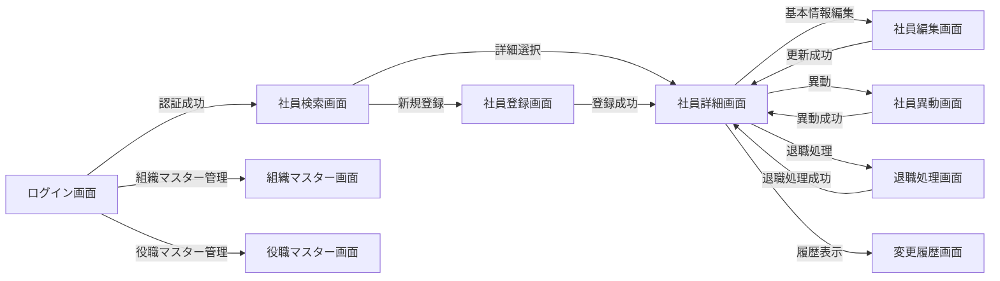

[← 設計書一覧（社員名簿管理システム）](README.md)

# 4. 画面設計

本節は社員名簿管理システムの画面(SCR-001〜SCR-010)を定義する。モック画像は詳細設計で作成し、本節は項目表・状態表で画面構成を示す。表示文言は各画面の「メッセージ一覧」節に MSG-XX として定義し、本文では MSG-XX で参照する。

## 4.1 画面一覧

| 画面ID | 画面名 | 目的 | 主な利用者 |
|---|---|---|---|
| SCR-001 | 社員検索画面 | 条件を指定して閲覧可能な社員を検索し、一覧表示・詳細画面へ遷移する | 全利用者 |
| SCR-002 | 社員詳細画面 | 社員の基本情報・所属・役職・在籍状態・履歴入口を参照する | 全利用者 |
| SCR-003 | 社員登録画面 | 新しい社員の基本情報と初期所属を登録する | 人事担当者 |
| SCR-004 | 社員編集画面 | 社員の基本情報を更新する | 人事担当者、条件付きで一般社員(本人) |
| SCR-005 | 社員異動画面 | 所属・役職を有効日付きで変更する | 人事担当者 |
| SCR-006 | 退職処理画面 | 退職日を登録し在籍状態を退職へ変更する | 人事担当者 |
| SCR-007 | 変更履歴画面 | 社員情報の変更履歴を参照する | 人事担当者、システム管理者 |
| SCR-008 | 組織マスター画面 | 組織マスターを登録・変更・無効化する | システム管理者 |
| SCR-009 | 役職マスター画面 | 役職マスターを登録・変更・無効化する | システム管理者 |
| SCR-010 | ログイン画面 | 社内認証基盤を利用してシステムへログインする | 全利用者 |

## 4.2 画面遷移

## 4.3 社員登録画面

SCR-003 を代表画面として現行粒度で定義する。モック画像は詳細設計で作成し、本節は項目表(4.3.2)と状態表(4.3.3)で画面構成を示す。

### 4.3.1 画面基本情報

| 項目 | 内容 |
|---|---|
| 画面ID | SCR-003 |
| 画面名 | 社員登録画面 |
| 目的 | 社員の基本情報と初期所属(組織・役職)を一体として登録する |
| トレース元 | UC-001 社員を登録する(F-004) |
| 表示権限 | 人事担当者 |
| 表示契機 | 社員検索画面(SCR-001)で「新規登録」を選択 |
| 呼び出しAPI | 初期表示: API-008 組織マスター取得、API-009 役職マスター取得 / 登録: API-003 社員登録 |
| 正常終了 | 登録した社員の社員詳細画面(SCR-002)へ遷移 |

### 4.3.2 画面項目

| 項目ID | 項目名 | 種別 | 必須 | 入力・表示規則 |
|---|---|---|---|---|
| ITM-01 | 社員番号 | テキスト | 必須 | 所定形式(半角英数)。社員番号の一意性により登録済みの番号は不可 |
| ITM-02 | 姓 | テキスト | 必須 | 最大長は詳細設計で定義 |
| ITM-03 | 名 | テキスト | 必須 | 最大長は詳細設計で定義 |
| ITM-04 | 姓カナ | テキスト | 任意 | 全角カナ形式 |
| ITM-05 | 名カナ | テキスト | 任意 | 全角カナ形式 |
| ITM-06 | メールアドレス | テキスト | 必須 | メール形式。メールアドレスの一意性により登録済みのアドレスは不可 |
| ITM-07 | 入社日 | 日付 | 必須 | 有効な日付。許容範囲は詳細設計で定義 |
| ITM-08 | 所属組織 | 選択 | 必須 | 有効な組織から選択(API-008で取得) |
| ITM-09 | 役職 | 選択 | 必須 | 有効な役職から選択(API-009で取得) |
| ITM-10 | 雇用区分 | 選択 | 必須 | 共通コード定義の雇用区分から選択 |
| ITM-11 | 登録 | ボタン | ― | 必須項目充足かつ入力可能状態で活性。押下でAPI-003を呼び出す |
| ITM-12 | キャンセル | ボタン | ― | 未保存の入力を破棄し検索画面(SCR-001)へ戻る。押下時にMSG-09で確認 |
| ITM-13 | メッセージ表示 | 表示 | ― | 登録結果・エラー(MSG-01〜MSG-08)を表示 |

### 4.3.3 画面状態

| 状態 | 入力項目 | 登録ボタン | 主な表示 | 対応状態パターン |
|---|---|---|---|---|
| 初期表示 | 編集可 | 必須充足時に活性 | 初期値・組織/役職選択肢 | UC-001/SP-1 |
| 入力中 | 編集可 | 必須充足時に活性 | 入力内容 | UC-001/SP-1 |
| 登録確認中 | 編集不可 | 無効 | 処理中表示(MSG-05) | UC-001/SP-1 |
| 入力エラー | 編集可 | 修正後に活性 | 対象項目と理由(MSG-01) | UC-001/SP-4 |
| 重複エラー | 編集可 | 修正後に活性 | 重複項目(MSG-02 / MSG-03) | UC-001/SP-5・SP-6 |
| マスター無効 | 編集可 | 再選択後に活性 | 再選択案内(MSG-06) | UC-001/SP-7 |
| 登録成功 | 編集不可 | 無効 | 成功表示(MSG-04)後にSCR-002へ遷移 | UC-001/SP-1 |
| 権限エラー | 編集不可 | 無効 | 権限不足(MSG-07) | UC-001/SP-3 |
| システムエラー | 編集可 | 無効 | 一般化エラー(MSG-08) | －（§2の業務状態パターン対象外） |

状態パターン(SP-x)の定義は §2 機能要件 の UC-001 を正本とする。本画面の状態は UC-001/SP-1〜SP-7 に対応し、重複エラーは社員番号(SP-5)・メールアドレス(SP-6)に分かれる(いずれも §6 データベース設計の一意制約で担保)。システムエラーは業務状態パターンに含めず、保存失敗時は TX-01 のロールバック(§3.2)で扱う。

### 4.3.4 操作仕様

#### 登録手順

1. 利用者が必須項目(ITM-01〜ITM-10)を入力する。画面は必須充足で登録ボタン(ITM-11)を活性化する。
2. 登録ボタン押下でクライアント側入力チェック(形式・必須)を行う。違反時は入力エラー状態とし、対象項目にMSG-01を表示して送信しない。
3. チェック通過後、API-003(社員登録)を呼び出す。応答待ちの間は登録確認中状態とし、入力と登録ボタンを無効化して二重送信を防止する(MSG-05を表示)。
4. 社員番号またはメールアドレスの重複応答時は重複エラー状態とし、該当項目にMSG-02(社員番号)またはMSG-03(メールアドレス)を表示する。
5. 組織・役職が無効の応答時はマスター無効状態とし、MSG-06で最新候補からの再選択を促す(選択肢をAPI-008 / API-009で再取得)。
6. 権限不足の応答時は権限エラー状態とし、MSG-07を表示する。
7. 登録成功(201)時は登録成功状態とし、MSG-04を表示後、登録した社員の詳細画面(SCR-002)へ遷移する。
8. 応答不明・通信断・システムエラー時はシステムエラー状態とし、MSG-08を表示する。再登録による重複を防ぐため、成功可否の確認を促す。

### 4.3.5 メッセージ一覧

| MSG ID | 種別 | 文言 | 対応ERR |
|---|---|---|---|
| MSG-01 | エラー | 入力内容に誤りがあります。対象の項目をご確認ください。 | VALIDATION_ERROR |
| MSG-02 | エラー | 入力された社員番号は既に登録されています。 | EMPLOYEE_NUMBER_DUPLICATED |
| MSG-03 | エラー | 入力されたメールアドレスは既に登録されています。 | EMAIL_DUPLICATED |
| MSG-04 | 完了 | 社員を登録しました。 | - |
| MSG-05 | 情報 | 登録処理中です。しばらくお待ちください。 | - |
| MSG-06 | エラー | 選択した組織または役職は無効です。最新の候補から選び直してください。 | MASTER_NOT_ACTIVE |
| MSG-07 | エラー | この操作を行う権限がありません。 | FORBIDDEN |
| MSG-08 | エラー | システムエラーが発生しました。時間をおいて再度お試しください。 | INTERNAL_ERROR |
| MSG-09 | 確認 | 入力内容を破棄して検索画面に戻ります。よろしいですか？ | - |

対応ERR は §5 API設計(API-003 社員登録)のエラーコードを参照する。

## 4.4 社員検索画面

SCR-001 の基本情報と主要項目を示す。

| 項目 | 内容 |
|---|---|
| 画面ID | SCR-001 |
| 画面名 | 社員検索画面 |
| 目的 | 条件を指定して閲覧可能な社員を検索し、一覧表示・詳細遷移・結果出力を行う |
| トレース元 | UC-002 社員を検索する(F-002) |
| 表示権限 | 全利用者(表示範囲はロール・所属で制御) |
| 呼び出しAPI | 初期表示: API-008 組織マスター取得、API-009 役職マスター取得 / 検索: API-001 社員検索 |

| 項目ID | 項目名 | 種別 | 説明 |
|---|---|---|---|
| ITM-01 | 社員番号 | 入力 | 完全一致/部分一致の方針は詳細設計で定義 |
| ITM-02 | 氏名 | 入力 | 姓名を対象に検索 |
| ITM-03 | 所属組織 | 選択 | 閲覧可能な組織から選択(API-008で取得) |
| ITM-04 | 役職 | 選択 | 有効な役職から選択(API-009で取得) |
| ITM-05 | 在籍状態 | 選択 | 在籍中 / 退職 / すべて(共通コード定義の在籍状態) |
| ITM-06 | 検索 | ボタン | 押下でAPI-001を呼び出し、権限範囲内の社員を検索 |
| ITM-07 | クリア | ボタン | 検索条件を初期状態に戻す |
| ITM-08 | 検索結果一覧 | 一覧 | 権限上表示可能な項目のみ表示。ページングあり |
| ITM-09 | 詳細 | 操作 | 選択した社員の詳細画面(SCR-002)へ遷移 |
| ITM-10 | 出力 | ボタン | 許可された項目を出力(F-009。出力方式は詳細設計で定義) |
