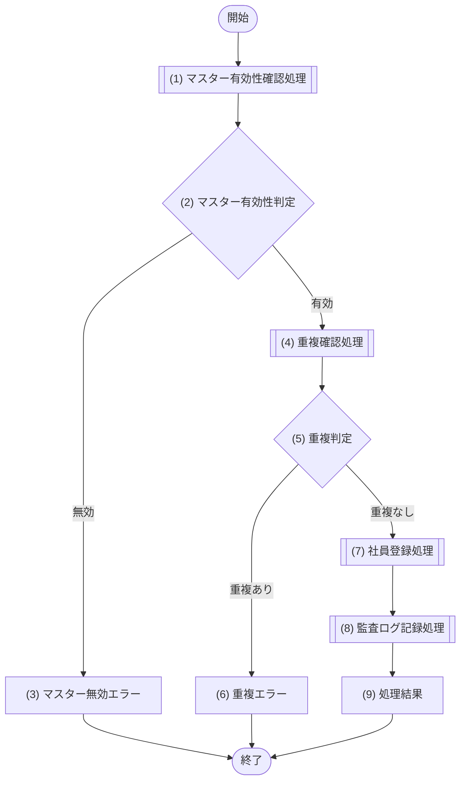

[← 設計書一覧（社員名簿管理システム）](README.md)

# 5. API設計

## 5.1 API設計方針

- すべてのAPI呼び出しで、社内認証基盤による認証済み利用者であることを確認する(NFR-001)。
- 操作対象・操作種別ごとに、利用者ロール(人事担当者・部門管理者・一般社員・システム管理者)と対象データ範囲に基づいて認可を行う(NFR-002)。
- 個人情報は利用目的に必要な項目だけを返却し、ロールに応じて返却項目を制限する(NFR-004)。
- 登録・更新系APIでは、業務エラー(入力不正・重複・マスター無効・状態不整合)とシステムエラー(内部異常)を区別して応答する。
- 更新系API(社員基本情報更新・社員異動・退職処理)では、更新競合を検知できるバージョン情報を使用する(NFR-007)。
- 一覧取得APIではページングを使用し、大量データでも業務上支障のない応答とする(NFR-006)。
- 登録・更新・異動・退職・権限変更など状態を変える操作は、監査ログへ記録する(NFR-003)。
- APIの物理形式はJSONを想定し、認証方式・完全なリクエスト/レスポンススキーマ・フレームワーク設定は詳細設計で確定する。

## 5.2 API一覧

| API-ID | Method | Path | 目的 | 主な権限 |
|---|---|---|---|---|
| API-001 | GET | `/api/employees` | 社員検索 | 認証済み利用者(権限範囲内) |
| API-002 | GET | `/api/employees/{employeeId}` | 社員詳細取得 | 認証済み利用者(権限範囲内) |
| API-003 | POST | `/api/employees` | 社員登録 | 人事担当者 |
| API-004 | PUT | `/api/employees/{employeeId}` | 社員基本情報更新 | 人事担当者、条件付きで本人 |
| API-005 | POST | `/api/employees/{employeeId}/assignments` | 社員異動 | 人事担当者 |
| API-006 | POST | `/api/employees/{employeeId}/retirement` | 退職処理 | 人事担当者 |
| API-007 | GET | `/api/employees/{employeeId}/history` | 変更履歴取得 | 人事担当者、システム管理者 |
| API-008 | GET | `/api/organizations` | 組織マスター取得 | 認証済み利用者 |
| API-009 | GET | `/api/positions` | 役職マスター取得 | 認証済み利用者 |
| API-010 | POST | `/api/auth/login` | ログイン | 認証前(全利用者) |
| API-011 | POST・PUT | `/api/organizations` | 組織マスター管理 | システム管理者 |
| API-012 | POST・PUT | `/api/positions` | 役職マスター管理 | システム管理者 |

## 5.3 社員登録API

### 5.3.1 基本情報

| 項目 | 内容 |
|---|---|
| API-ID | API-003 |
| Method | POST |
| Path | `/api/employees` |
| 目的 | 社員基本情報と初期所属を登録する |
| 実行権限 | 人事担当者 |
| トレース元 | F-004 / UC-001 社員を登録する |
| 冪等性 | なし(社員番号・メールアドレスの一意制約と重複確認で二重登録を防止する) |
| 正常応答 | 201 Created |
| 主な業務エラー | 入力不正、社員番号重複、メールアドレス重複、無効な組織・役職 |

### 5.3.2 リクエスト例

```json
{
  "employeeNumber": "E000123",
  "lastName": "山田",
  "firstName": "太郎",
  "lastNameKana": "ヤマダ",
  "firstNameKana": "タロウ",
  "email": "taro.yamada@example.invalid",
  "hireDate": "2026-07-01",
  "employmentTypeCode": "REGULAR",
  "initialAssignment": {
    "organizationId": "org-001",
    "positionId": "pos-010",
    "effectiveFrom": "2026-07-01"
  }
}
```

### 5.3.3 正常レスポンス例

```json
{
  "employeeId": "emp-0123",
  "employeeNumber": "E000123",
  "status": "ACTIVE",
  "version": 1,
  "createdAt": "2026-07-01T09:00:00+09:00"
}
```

### 5.3.4 エラーレスポンス例

```json
{
  "errorCode": "EMPLOYEE_NUMBER_DUPLICATED",
  "message": "社員番号は既に登録されています。",
  "fieldErrors": [
    { "field": "employeeNumber", "reason": "duplicated" }
  ],
  "traceId": "trace-sample-001"
}
```

### 5.3.5 処理フロー

認証・認可・入力バリデーション(必須・形式・範囲・項目間整合性)は全APIの共通前処理として本フローの前段で実施するため、本フローには社員登録の業務処理(マスター有効性確認・重複確認・社員と初期所属の保存・監査ログ記録)のみを示す。処理の結果を見て分岐する箇所は、処理ノードの直後に判定ノードを置き、処理と判定を分ける。社員基本情報と初期所属履歴は一つの業務トランザクションとして一体で保存する。



| ノード | 種別 | 内容 | 呼出モジュール |
|---|---|---|---|
| (1) マスター有効性確認処理 | 処理 | 初期所属の組織・役職が有効なマスターか確認する | M-005 マスター管理 |
| (2) マスター有効性判定 | 判定 | (1)の結果が有効=次へ / 無効=(3)へ | ― |
| (3) マスター無効エラー | エラー | MASTER_NOT_ACTIVE を返却し、最新マスターの再選択を促す | ― |
| (4) 重複確認処理 | 処理 | 社員番号・メールアドレスの登録済み有無を確認する | M-006 データアクセス |
| (5) 重複判定 | 判定 | (4)の結果が重複なし=次へ / 重複あり=(6)へ | ― |
| (6) 重複エラー | エラー | 社員番号重複は EMPLOYEE_NUMBER_DUPLICATED、メール重複は EMAIL_DUPLICATED を返却する | ― |
| (7) 社員登録処理 | 処理 | 社員基本情報と初期所属履歴を一体として保存し、在籍状態を ACTIVE、version を 1 とする | M-004 社員ドメイン / M-006 データアクセス |
| (8) 監査ログ記録処理 | 処理 | 登録者・登録日時・対象社員・操作概要を監査ログへ記録する | M-007 監査ログ |
| (9) 処理結果 | 処理結果 | 登録した社員情報(employeeId・employeeNumber・status・version・createdAt)を 201 で返却する | ― |

### 5.3.6 エラー定義

| HTTP | エラーコード | 意味 |
|---:|---|---|
| 400 | VALIDATION_ERROR | 必須・形式・範囲・項目間整合性の入力エラー(共通前処理で検知) |
| 401 | UNAUTHENTICATED | 未認証(共通前処理で検知) |
| 403 | FORBIDDEN | 社員登録権限なし(共通前処理で検知) |
| 409 | EMPLOYEE_NUMBER_DUPLICATED | 社員番号が登録済み |
| 409 | EMAIL_DUPLICATED | メールアドレスが登録済み |
| 409 | MASTER_NOT_ACTIVE | 指定した組織または役職が無効 |
| 500 | INTERNAL_ERROR | 想定外の内部異常 |

## 5.4 社員検索API

社員検索API(API-001)は、検索条件と利用者の閲覧可能範囲を組み合わせて社員を検索し、権限上表示可能な項目のみを一覧で返す。大量件数に備えてページングを使用する。

### リクエストパラメーター

| パラメーター | 必須 | 説明 |
|---|---:|---|
| employeeNumber | 任意 | 社員番号(完全一致・部分一致の方針は詳細設計で確定) |
| name | 任意 | 氏名(姓名を対象に検索) |
| organizationId | 任意 | 組織ID(閲覧可能な組織から指定) |
| positionId | 任意 | 役職ID |
| status | 任意 | 在籍状態(ACTIVE / RETIRED / ALL) |
| page | 任意 | ページ番号(1始まり、既定1) |
| pageSize | 任意 | 1ページの件数(既定20、上限100) |

### レスポンス概要

```json
{
  "items": [
    {
      "employeeId": "emp-0123",
      "employeeNumber": "E000123",
      "displayName": "山田 太郎",
      "organizationName": "開発部",
      "positionName": "担当",
      "status": "ACTIVE"
    }
  ],
  "page": 1,
  "pageSize": 20,
  "total": 128,
  "hasNext": true
}
```

### ページング

- クエリパラメータ `page`(ページ番号、1始まり、既定1)と `pageSize`(1ページの件数、既定20、上限100)で範囲を指定する。
- レスポンスには `page`・`pageSize` に加え、総件数 `total` と次ページ有無 `hasNext` を返し、画面のページ送りに用いる。
- 個人情報保護(NFR-004)に基づき、items には利用者の権限上表示可能な項目のみを含める。

## 5.5 更新競合方針

社員情報を更新する系のAPIは、取得時に受け取ったバージョンと更新時のバージョンを比較して競合更新を検知する。既に他の利用者が更新しており、バージョンが一致しない場合は競合として扱い、更新を行わず最新情報の再取得を要求する。バージョンは更新成功のたびに加算する(NFR-007 整合性)。

| 対象API | 検知方法 | 競合時の応答 |
|---|---|---|
| API-004 社員基本情報更新 | 取得時 version と更新要求の version を比較 | 409 CONFLICT を返し、最新情報の再取得を要求する |
| API-005 社員異動 | 対象社員の version 比較に加え、所属履歴の期間重複を確認 | 409 CONFLICT を返し、最新の所属状況の再確認を要求する |
| API-006 退職処理 | 対象社員の version 比較と在籍状態の確認 | 409 CONFLICT を返し、最新の在籍状態の再取得を要求する |
