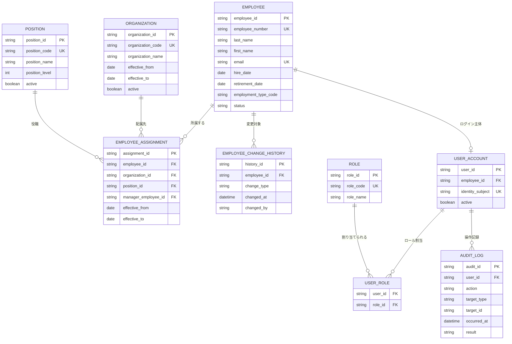

[← 設計書一覧（社員名簿管理システム）](README.md)

# 6. データベース設計

## 6.1 論理データモデル

社員名簿管理システムが取り扱う9エンティティと、その物理リレーション・多重度を示す。共通カラム(§6.7)は本図に記載しない。

## 6.2 テーブル一覧

| テーブル名 | 論理名 | 目的 |
|---|---|---|
| EMPLOYEE | 社員 | 社員の基本情報と在籍状態を保持する |
| EMPLOYEE_ASSIGNMENT | 社員所属履歴 | 所属組織・役職・上長の有効期間履歴を保持する |
| ORGANIZATION | 組織 | 組織マスターを有効期間付きで保持する |
| POSITION | 役職 | 役職マスターを保持する |
| EMPLOYEE_CHANGE_HISTORY | 社員変更履歴 | 業務上参照する変更概要(登録・更新・異動・退職)を保持する |
| USER_ACCOUNT | 利用者アカウント | 認証主体とシステム利用状態を保持する |
| ROLE | ロール | システム上の役割を保持する |
| USER_ROLE | 利用者ロール | 利用者とロールの割当を保持する中間テーブル |
| AUDIT_LOG | 監査ログ | 操作証跡を保持する |

## 6.3 EMPLOYEE

| カラム | 論理名 | 型の例 | NULL | 制約・説明 |
|---|---|---|---|---|
| employee_id | 社員ID | UUID | 不可 | PK。システム内部識別子 |
| employee_number | 社員番号 | VARCHAR | 不可 | UNIQUE。会社内で一意の業務識別子 |
| last_name | 姓 | VARCHAR | 不可 |  |
| first_name | 名 | VARCHAR | 不可 |  |
| last_name_kana | 姓カナ | VARCHAR | 可 | カナ形式 |
| first_name_kana | 名カナ | VARCHAR | 可 | カナ形式 |
| email | メールアドレス | VARCHAR | 不可 | UNIQUE。所定のメール形式 |
| hire_date | 入社日 | DATE | 不可 |  |
| retirement_date | 退職日 | DATE | 可 | 在籍中は NULL。退職処理で設定 |
| employment_type_code | 雇用区分 | VARCHAR | 不可 | 定義済みコード(正社員・契約・派遣 等) |
| status | 在籍状態 | VARCHAR | 不可 | 定義済みコード。ACTIVE(在籍中) / RETIRED(退職)。物理削除せず状態で管理 |

## 6.4 EMPLOYEE_ASSIGNMENT

| カラム | 論理名 | 型の例 | NULL | 制約・説明 |
|---|---|---|---|---|
| assignment_id | 所属履歴ID | UUID | 不可 | PK |
| employee_id | 社員ID | UUID | 不可 | FK → EMPLOYEE |
| organization_id | 組織ID | UUID | 不可 | FK → ORGANIZATION |
| position_id | 役職ID | UUID | 不可 | FK → POSITION |
| manager_employee_id | 上長社員ID | UUID | 可 | FK → EMPLOYEE(自己参照) |
| effective_from | 適用開始日 | DATE | 不可 | 異動日・入社日 |
| effective_to | 適用終了日 | DATE | 可 | 現に有効な履歴は NULL |

### 期間整合性

- 同一社員について、有効期間(effective_from 〜 effective_to)が重複する所属履歴を登録しない。
- 現に有効な所属履歴は effective_to を NULL とし、社員ごとに最大1件とする。
- 異動時は、現履歴の effective_to を新履歴の effective_from の前日に設定し、期間の隙間・重複を作らない。
- 退職時は、退職日(EMPLOYEE.retirement_date)に基づいて有効な所属履歴の effective_to を設定する。
- effective_to が非 NULL のとき、effective_from ≦ effective_to を満たす。

## 6.5 主な制約・インデックス方針

| 対象 | 方針 |
|---|---|
| EMPLOYEE.employee_number | 一意制約(社員番号の会社内一意) |
| EMPLOYEE.email | 一意制約(メールアドレスの一意) |
| EMPLOYEE.status | 在籍状態での一覧・検索用インデックス |
| EMPLOYEE_ASSIGNMENT (employee_id, effective_from) | 社員別の所属履歴検索・期間整合性確認用インデックス |
| EMPLOYEE_ASSIGNMENT.organization_id | 組織別社員検索用インデックス |
| EMPLOYEE_ASSIGNMENT 現有効所属(effective_to IS NULL) | 社員ごとに現有効所属を1件に制約(部分一意インデックス。詳細実装は詳細設計) |
| ORGANIZATION.organization_code | 一意制約(組織コードの一意) |
| POSITION.position_code | 一意制約(役職コードの一意) |
| EMPLOYEE_CHANGE_HISTORY (employee_id, changed_at) | 社員別の変更履歴検索用インデックス |
| USER_ACCOUNT.identity_subject | 一意制約(認証主体の一意) |
| USER_ROLE (user_id, role_id) | 複合主キー(利用者×ロールの重複割当防止) |
| ROLE.role_code | 一意制約(ロールコードの一意) |
| AUDIT_LOG.occurred_at | 期間検索用インデックス |
| AUDIT_LOG (target_type, target_id) | 対象別監査検索用インデックス |

## 6.6 トランザクション境界

### 社員登録トランザクション(UC-001)

| 順序 | 処理 | 対象テーブル |
|---|---|---|
| 1 | 社員基本情報の登録 | EMPLOYEE |
| 2 | 初期所属履歴の登録 | EMPLOYEE_ASSIGNMENT |
| 3 | 変更履歴(登録)の記録 | EMPLOYEE_CHANGE_HISTORY |

- 上記1〜3を単一の業務トランザクションとして扱い、いずれかが失敗した場合は全体を未登録(ロールバック)とする。
- 監査ログ(AUDIT_LOG)は業務トランザクションと分離し、コミット成功後に記録する。監査ログの保存失敗は業務トランザクションを巻き戻さない。

### 社員異動トランザクション(UC-003)

| 順序 | 処理 | 対象テーブル |
|---|---|---|
| 1 | 現所属履歴の終了日設定 | EMPLOYEE_ASSIGNMENT |
| 2 | 新所属履歴の登録 | EMPLOYEE_ASSIGNMENT |
| 3 | 変更履歴(異動)の記録 | EMPLOYEE_CHANGE_HISTORY |

- 上記1〜3を単一の業務トランザクションとして扱い、期間整合性(§6.4)を満たす形でコミットする。いずれかが失敗した場合は全体をロールバックする。
- 退職処理(UC-004)も同様に、EMPLOYEE の状態・退職日更新と有効所属履歴の終了・変更履歴記録を単一トランザクションで扱う。
- 監査ログ(AUDIT_LOG)は業務トランザクションと分離し、コミット成功後に記録する。

## 6.7 共通カラム

全テーブルに共通で付与するカラムを本節で一括定義し、各テーブル定義(§6.3/§6.4 等)では再掲しない。主キー(xxx_id)は共通カラムに含めず各テーブルで定義する。

| カラム | 論理名 | 型の例 | NULL | 制約・説明 |
|---|---|---|---|---|
| created_at | 登録日時 | TIMESTAMP | 不可 | レコード登録日時 |
| created_by | 登録者 | VARCHAR | 不可 | 登録操作を行った利用者 |
| updated_at | 更新日時 | TIMESTAMP | 不可 | レコード更新日時 |
| updated_by | 更新者 | VARCHAR | 不可 | 更新操作を行った利用者 |
| version | 更新バージョン | INTEGER | 不可 | 楽観ロックによる競合更新検知。更新のたびに +1 |
| deleted_at | 論理削除日時 | TIMESTAMP | 可 | NULL=有効 / 値あり=削除。物理削除せず状態管理するテーブルに付与 |

## 6.8 命名規則

| 対象 | 規則 |
|---|---|
| テーブル(物理名) | 英大文字スネークケース・単数形(例: EMPLOYEE)。履歴テーブルは末尾に _HISTORY、中間テーブルは関連する名詞を連結(例: USER_ROLE) |
| カラム(物理名) | 英小文字スネークケース(例: employee_number) |
| 主キー | {エンティティ}_id の単一カラム(例: employee_id)。値は UUID |
| 外部キー | {参照先エンティティ}_id(例: organization_id)。自己参照は用途を接頭(例: manager_employee_id) |
| 一意キー | 業務識別子カラムに UNIQUE(例: employee_number, email, organization_code) |
| 区分値カラム | {対象}_code または status(例: employment_type_code, status)。取り得る値は要件・共通定義に従う |
| 論理名 | 日本語の表示名(例: EMPLOYEE=社員、EMPLOYEE_ASSIGNMENT=社員所属履歴) |

- 型方針: 本書は基本設計レベルのため型は「型の例」(UUID / VARCHAR / DATE / TIMESTAMP / INTEGER / BOOLEAN)で示す。DDL・文字長・文字種・照合順序・物理型・外部キー削除規則は詳細設計で確定する。
