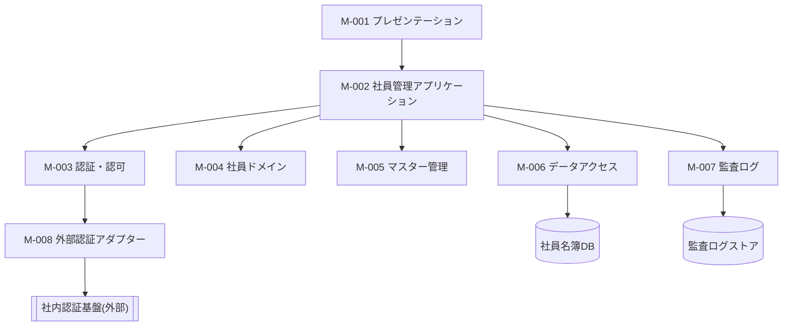

[← 設計書一覧（社員名簿管理システム）](README.md)

# 7. モジュール設計

社員名簿管理システムを構成する論理モジュール(M-001〜M-008)の構成・責務・依存関係・連携・公開機能を論理レベルで定義する。各モジュールの内部処理・インターフェース詳細は詳細設計で定義し、本節では論理モジュール(M-001〜M-008)の責務・境界の俯瞰を示す。

## 7.1 論理モジュール構成

社員名簿管理システムを8つの論理モジュールに分割し、上位のプレゼンテーションから下位のデータアクセスへ向かう一方向依存で構成する。データベース・監査ログストア・社内認証基盤は外部要素として示す。

## 7.2 モジュール責務

| モジュールID | モジュール名 | 主な責務 | 担当しないこと |
|---|---|---|---|
| M-001 | プレゼンテーション | 画面表示、入力受付、API呼出し、表示用データ変換、画面状態制御 | 業務ルール判定、DB直接操作、認可の最終判定 |
| M-002 | 社員管理アプリケーション | 登録・検索・参照・更新・異動・退職の各ユースケースの進行制御、トランザクション境界の管理、下位モジュールへの委譲 | 画面レイアウト、クエリ実行、業務ルールの実装 |
| M-003 | 認証・認可 | 認証済み主体の確認、ロール・所属・対象データに基づく操作可否判定、閲覧可能範囲の算出 | 社員業務ルール、画面表示、業務データの永続化 |
| M-004 | 社員ドメイン | 社員番号・メールアドレス一意性、在籍状態遷移、異動期間整合性など社員業務ルールの適用 | HTTP制御、画面表示、DB接続、認可判断 |
| M-005 | マスター管理 | 組織・役職マスターの参照、有効性判定、有効な選択肢の提供 | 社員ユースケース全体の制御、認可判断、社員データの更新 |
| M-006 | データアクセス | 社員・所属履歴・組織・役職・変更履歴の永続化と検索 | 認可判断、業務ルール判定、画面表示 |
| M-007 | 監査ログ | 操作証跡の生成・保存、対象別・期間別の監査ログ検索 | 業務データの更新、業務ルール判定 |
| M-008 | 外部認証アダプター | 社内認証基盤との接続差異の吸収、認証結果の内部形式への変換 | 社員情報管理、認可判定、業務データの永続化 |

## 7.3 依存ルール

- プレゼンテーション(M-001)はデータアクセス(M-006)・社員ドメイン(M-004)を直接呼び出さず、必ず社員管理アプリケーション(M-002)を経由する。
- 社員管理アプリケーション(M-002)はユースケースの進行順序とトランザクション境界を制御するが、業務判定は社員ドメイン(M-004)・認可(M-003)へ委譲し、業務ルールを重複実装しない。
- 社員ドメイン(M-004)は画面・HTTP・DB製品・外部サービスへ依存しない。
- データアクセス(M-006)は業務上の権限や業務ルールを独自判断しない。
- 認可(M-003)は画面表示制御だけでなく、API実行時にも必ず操作可否を確認する(NFR-002)。
- 社内認証基盤への依存は外部認証アダプター(M-008)に隔離し、他モジュールは認証基盤の接続仕様を直接参照しない(NFR-001)。
- 監査ログ(M-007)へ個人情報の全内容を複製せず、操作証跡に必要な範囲のみ記録する(NFR-003、NFR-004)。
- 依存方向は上位(M-001)から下位(M-006)への一方向とし、下位モジュールが上位モジュールを呼び出す循環依存を作らない。

## 7.4 社員登録におけるモジュール連携

UC-001(社員を登録する)の基本フローに沿った、モジュール間の呼び出し順序を示す。

| 順序 | 呼出元 | 呼出先 | 目的 |
|---:|---|---|---|
| 1 | プレゼンテーション(M-001) | 社員管理アプリケーション(M-002) | 入力された社員情報とともに社員登録要求を渡す |
| 2 | 社員管理アプリケーション(M-002) | 認証・認可(M-003) | 実行者が社員登録権限を持つか確認する |
| 3 | 社員管理アプリケーション(M-002) | 社員ドメイン(M-004) | 必須項目・形式・業務条件を検証する |
| 4 | 社員管理アプリケーション(M-002) | マスター管理(M-005) | 指定された所属組織・役職の有効性を確認する |
| 5 | 社員管理アプリケーション(M-002) | データアクセス(M-006) | 社員番号・メールアドレスの重複を確認する |
| 6 | 社員管理アプリケーション(M-002) | データアクセス(M-006) | 社員基本情報と初期所属履歴を一体として保存する |
| 7 | 社員管理アプリケーション(M-002) | データアクセス(M-006) | 社員変更履歴を記録する |
| 8 | 社員管理アプリケーション(M-002) | 監査ログ(M-007) | 社員登録操作の証跡を記録する |
| 9 | 社員管理アプリケーション(M-002) | プレゼンテーション(M-001) | 登録結果(登録した社員情報)を返す |

## 7.5 モジュール公開機能

| モジュール | 公開機能の例 |
|---|---|
| プレゼンテーション(M-001) | 画面表示、入力受付、登録・更新結果表示、エラー表示、表示用データ変換 |
| 社員管理アプリケーション(M-002) | 社員登録、社員検索、社員詳細参照、社員基本情報更新、社員異動、退職処理、変更履歴参照 |
| 認証・認可(M-003) | 認証状態確認、操作権限確認、閲覧可能範囲取得 |
| 社員ドメイン(M-004) | 社員登録条件検証、在籍状態遷移判定、所属期間整合性判定 |
| マスター管理(M-005) | 有効組織取得、有効役職取得、マスター有効性確認 |
| データアクセス(M-006) | 社員検索、社員取得、重複確認、社員保存、所属履歴保存、変更履歴保存 |
| 監査ログ(M-007) | 操作成功記録、操作失敗記録、対象別・期間別ログ検索 |
| 外部認証アダプター(M-008) | 認証要求、認証結果変換 |
