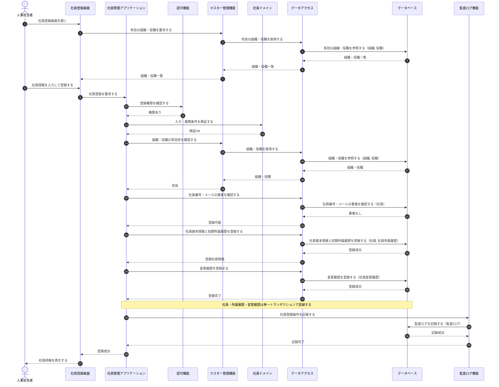
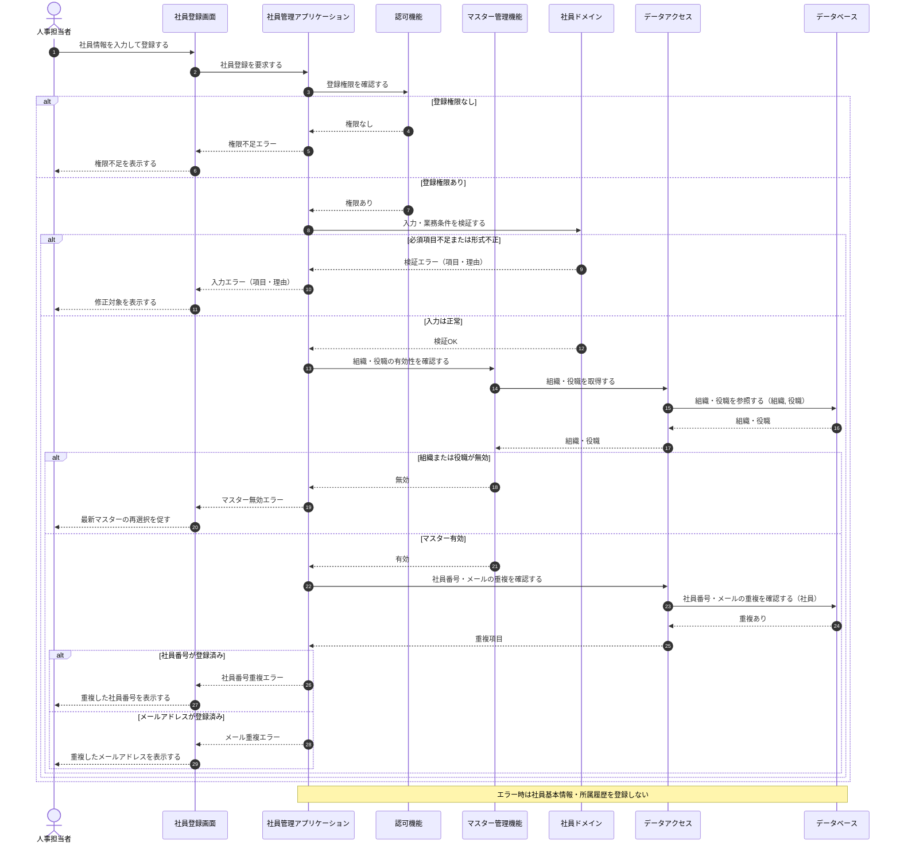
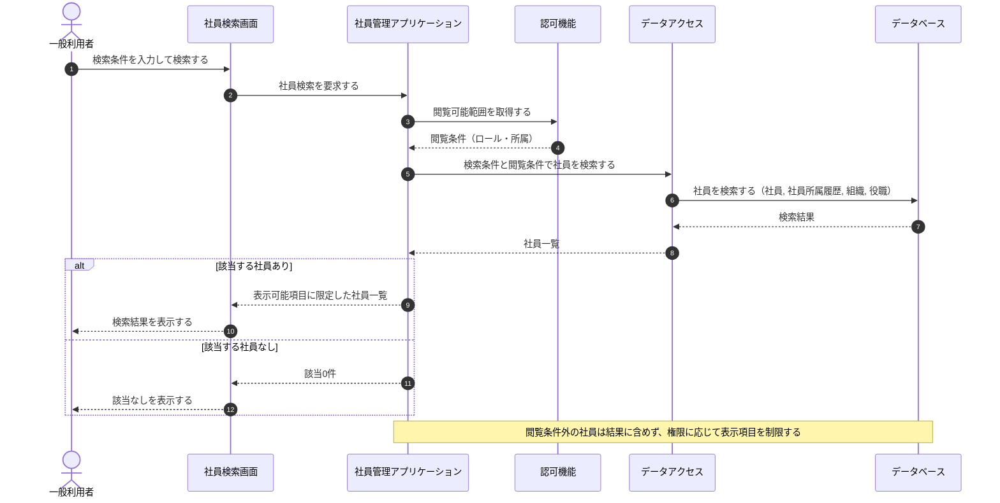
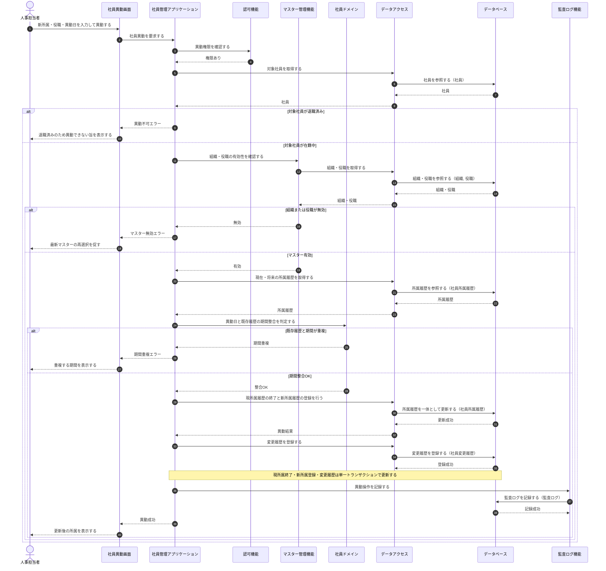
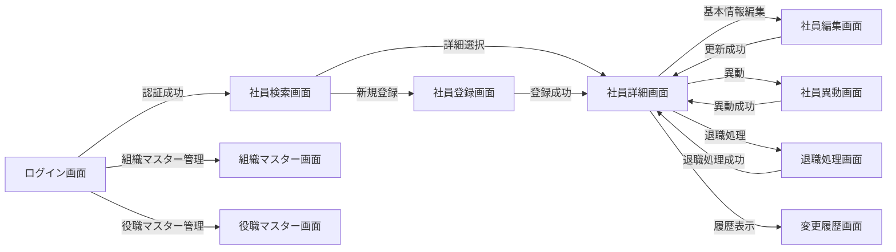
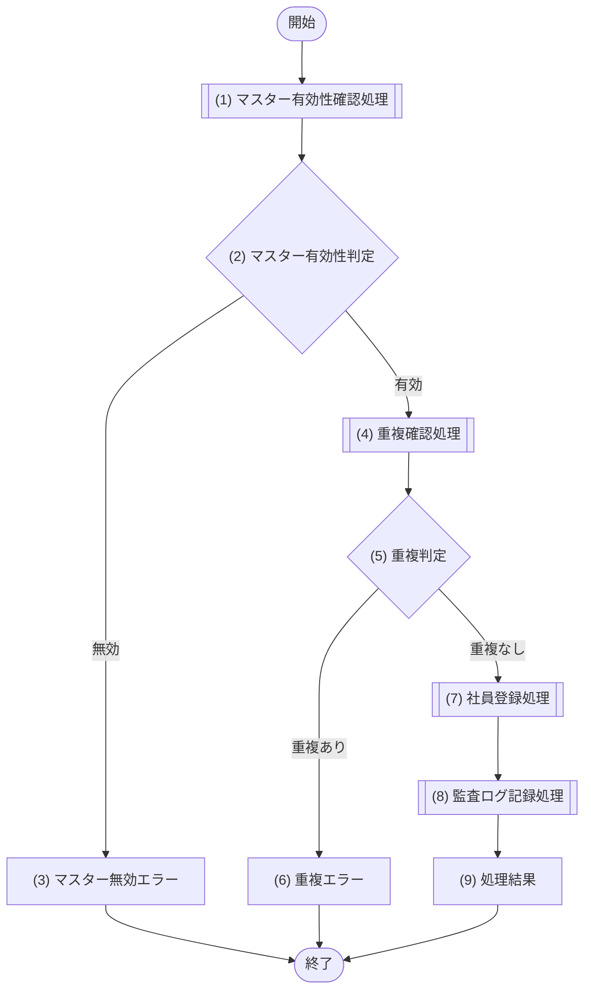
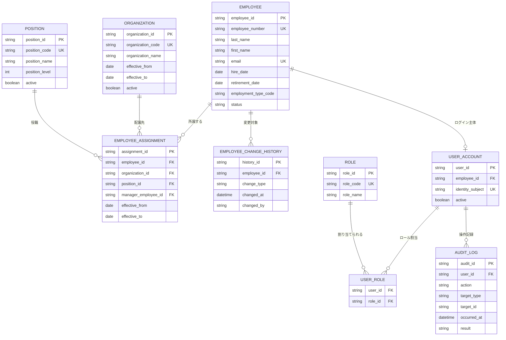
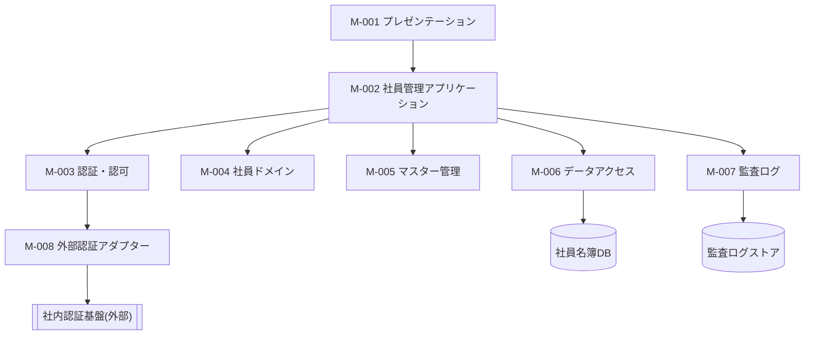

# 社員名簿管理システム 統合設計書

架空の「社員名簿管理システム」を題材に、要求定義から機能設計（シーケンス・画面・API・データベース・モジュール）までを **1つの文書に統合** した設計書のサンプルである。本書のフォーマットは [統合設計書テンプレート](テンプレート_統合設計書.md) に従う。会社・組織・社員・権限・業務フロー・画面・API・データはすべて架空である。

## 目次

| No | セクション | 主な内容 |
|---|---|---|
| 0 | はじめに | 本書の目的、前提、基本設計と詳細設計の境界 |
| 1 | 要求定義 | 背景・課題、目的(OBJ)、利用者と役割、業務要求(BR)、非機能要求(NFR)、制約、対象範囲 |
| 2 | 機能要件 | 機能一覧(F)、主要ユースケース(UC)、機能要求詳細、シーケンス要否 |
| 3 | シーケンス設計 | 論理構成要素、主要 UC の連携シーケンス |
| 4 | 画面設計 | 画面一覧(SCR)、画面遷移、代表画面の詳細 |
| 5 | API設計 | 方針、API一覧(API)、代表 API の詳細、更新競合方針 |
| 6 | データベース設計 | 論理データモデル、テーブル定義、制約、トランザクション境界 |
| 7 | モジュール設計 | 論理モジュール構成(M)、責務、依存、連携、公開機能 |
| 8 | 要求・設計トレーサビリティ | 要求→機能→設計の対応 |
| 9 | 設計レビュー用チェックリスト | 成果物種別ごとのレビュー観点 |
| 10 | 詳細設計への引継ぎ事項 | 詳細設計で確定する事項 |
| 11 | 設計の落とし込み関係 | 要求から各設計への落とし込みの流れ |

---

# 0. はじめに

## 0.1 本書の目的

本書は、架空の「社員名簿管理システム(Employee Roster Management System)」を対象に、要求定義からモジュール設計までを単一文書へ統合し、各設計成果物が相互にどのようにつながるかを示す統合設計書である。統合する設計成果物は次のとおり。

1. 要求定義(システム化の目的・業務要求・非機能要求)
2. 機能要件(機能一覧・システムユースケース)
3. シーケンス設計
4. 画面設計
5. API設計
6. データベース設計
7. モジュール設計

本書は各成果物を個別に記載するだけでなく、業務要求(BR)から機能(F)、システムユースケース(UC)、画面(SCR)、API、データベース(エンティティ)、モジュール(M)へ落とし込む関係を第11章「設計の落とし込み関係」で示す。記載粒度は、状態パターン(SP-x)、代替・例外フロー(ALT/EXC)、エラー一覧、DB制約、処理フローまで引き上げる。

## 0.2 サンプルとしての前提

本書に記載する会社・組織・社員・権限・業務フロー・画面・API・データはすべて架空である。

| 項目 | 前提 |
|---|---|
| 対象システム | 社員名簿管理システム(Employee Roster Management System) |
| 主な利用者 | 人事担当者、部門管理者、一般社員、システム管理者 |
| 対象業務 | 社員の名簿情報(基本情報・所属・役職・在籍状態)の登録・検索・参照・更新・異動・退職処理・変更履歴・監査 |
| 認証 | 社内認証基盤(外部認証)を利用する想定 |
| 対象外 | 給与計算、勤怠計算、採用選考、評価査定、社会保険手続 |
| 設計粒度 | 基本設計レベル(状態パターン・代替/例外フロー・エラー・DB制約・処理フローを含む) |

## 0.3 基本設計と詳細設計の境界

| 対象 | 本書で定義する内容 | 詳細設計で定義する内容 |
|---|---|---|
| 画面 | 目的、主要項目、操作、状態、遷移、画面内バリデーションとメッセージ | UI部品、イベント、Binding、詳細レイアウト、画面遷移アニメーション |
| API | 目的、エンドポイント、主要入出力、認証・認可、エラー | 実装クラス、内部処理、フレームワーク設定、シリアライズ詳細 |
| DB | 論理・主要物理構造、主キー、外部キー、一意制約、インデックス方針 | DDL、詳細インデックス、物理配置、パーティション、実行計画 |
| モジュール | 論理モジュール(M-001〜M-008)、責務、依存関係、公開機能 | クラス、メソッド、アルゴリズム、DIレイヤ構成 |
| シーケンス | 論理構成要素間の主要な連携、代替・例外・状態パターン分岐 | 内部メソッド呼出し、例外実装、トランザクション実装、リトライ実装 |

※本書は単一文書へ統合した様式であり、境界表は工程分担の目安を示す。


---

# 1. 要求定義

## 1.1 背景・課題

社員名簿情報が複数の表計算ファイルや部門ごとの個別台帳で分散管理されており、現状では次の課題があるものとする。

- 情報の最新版を特定しにくく、どの台帳が正となるか不明確である
- 同一社員の情報が複数箇所に重複し、氏名・所属・連絡先の値が不一致になっている
- 異動時の所属変更が関連資料へ反映されず、組織情報が最新化されないことがある
- 閲覧・更新の権限が統一されておらず、個人情報保護の観点で問題がある
- 誰がいつ何を変更したかを追跡できず、監査・照会への対応に手間がかかる
- 社員検索や組織別一覧の作成に手作業が発生し、非効率である

## 1.2 システム化の目的

| 目的ID | 目的 |
|---|---|
| OBJ-001 | 社員情報を一元管理し、常に正しい最新情報を参照できるようにする |
| OBJ-002 | 社員の登録・異動・退職に伴う情報更新の手順を標準化する |
| OBJ-003 | 利用者の役割に応じて閲覧・更新可能な情報を制御する |
| OBJ-004 | 社員情報の変更履歴を記録し、追跡・監査を可能にする |
| OBJ-005 | 条件検索および組織別一覧の作成を効率化する |

## 1.3 利用者と役割

| 利用者 | 主な利用目的 | 主な権限 |
|---|---|---|
| 人事担当者 | 社員情報の登録・変更・異動・退職処理 | 全社員の基本情報を登録・更新可能 |
| 部門管理者 | 自部門社員の確認・一部項目の更新 | 自部門社員を参照可能、一部項目のみ更新可能 |
| 一般社員 | 自身の登録情報の確認 | 自身の情報を参照可能、一部自己申告項目のみ更新可能 |
| システム管理者 | 組織・役職マスター、権限、システム設定の管理 | システム管理機能(マスター管理・権限管理)を利用可能 |

## 1.4 業務要求

| 要求ID | 業務要求 | 優先度 | 受入条件の概要 |
|---|---|---:|---|
| BR-001 | 人事担当者は新しい社員を登録できること | 必須 | 必須情報を入力すると社員が一意に登録され、初期所属が記録される |
| BR-002 | 利用者は権限の範囲内で社員を検索・参照できること | 必須 | 検索条件に一致し、かつ閲覧可能な社員のみが表示される |
| BR-003 | 人事担当者は社員の所属・役職を変更(異動)できること | 必須 | 指定日を基準に異動履歴が記録され、旧所属は有効期間付きで保持される |
| BR-004 | 人事担当者は退職処理を行えること | 必須 | 退職日と社員状態(退職)が記録され、所属履歴が終了する |
| BR-005 | 利用者は社員情報の変更履歴を確認できること | 必須 | 変更日時、変更者、対象、変更概要を確認できる |
| BR-006 | 利用者の役割に応じて参照・更新を制御できること | 必須 | 許可されていない情報の参照・操作ができない |
| BR-007 | システム管理者は組織・役職マスターを管理できること | 必須 | 組織・役職を有効期間と利用状態付きで登録・変更・無効化できる |
| BR-008 | 利用者は検索結果を業務利用可能な形式で出力できること | 任意 | 権限上許可された項目のみが出力される |

## 1.5 非機能要求

| 要求ID | 分類 | 要求 |
|---|---|---|
| NFR-001 | セキュリティ | 社内認証基盤で認証された利用者のみがシステムを利用できること |
| NFR-002 | 認可 | ロール、所属、対象データに基づいて操作可否を判定すること |
| NFR-003 | 監査 | 登録・更新・異動・退職・権限変更などの操作を証跡として記録すること |
| NFR-004 | 個人情報保護 | 利用目的に不要な個人情報を表示・出力しないこと |
| NFR-005 | 可用性 | 業務時間中の利用を前提とし、障害時に復旧可能であること |
| NFR-006 | 性能 | 通常の検索条件に対し、業務上支障のない応答時間で結果を返すこと |
| NFR-007 | 整合性 | 社員番号、メールアドレスなどの一意性を保証すること |
| NFR-008 | 保守性 | 画面、業務ルール、データアクセスの責務を分離し、変更容易性を確保すること |

## 1.6 制約

- 社員番号は会社内で一意とする。
- 社員の所属履歴は上書きせず、有効期間付きで保持する。
- 退職済み社員の社員情報は物理削除せず、社員状態で管理する。
- 個人情報へのアクセスは最小権限とする。
- 監査ログは業務データの変更履歴とは別に管理する。
- 認証は社内認証基盤を利用し、システム独自の認証方式は設けない。

## 1.7 対象範囲

### 対象

- 社員基本情報の登録・管理
- 社員検索・参照
- 所属・役職管理
- 異動履歴管理
- 退職処理
- 変更履歴・監査ログの参照
- ロール・権限制御
- 組織・役職マスター管理
- 検索結果の出力

### 対象外

- 給与計算
- 勤怠計算
- 採用選考
- 評価査定(人事評価)
- 社会保険手続


---

# 2. 機能要件

社員名簿管理システムが提供する機能の一覧、主要ユースケースの振る舞い、社員登録の機能要求詳細、シーケンス図作成要否を定義する。画面項目・API仕様・DB構造・処理ロジックなどの設計詳細は後続の節で定義する。

## 2.1 機能一覧

| 機能ID | 機能名 | 概要 | 主な利用者 |
|---|---|---|---|
| F-001 | ログイン | 社内認証基盤を利用してシステムへログインする | 全利用者 |
| F-002 | 社員検索 | 条件を指定して閲覧可能な社員を検索する | 全利用者 |
| F-003 | 社員詳細参照 | 社員の基本情報・所属・役職・在籍状態を参照する | 全利用者 |
| F-004 | 社員登録 | 新しい社員の基本情報と初期所属を登録する | 人事担当者 |
| F-005 | 社員基本情報更新 | 氏名・連絡先などの社員基本情報を更新する | 人事担当者、条件付きで本人 |
| F-006 | 社員異動 | 所属・役職・上長を有効日付きで変更する | 人事担当者 |
| F-007 | 退職処理 | 退職日を登録し、社員状態を退職へ変更する | 人事担当者 |
| F-008 | 変更履歴参照 | 社員情報の変更履歴を参照する | 人事担当者、システム管理者 |
| F-009 | 検索結果出力 | 検索結果を許可された項目で出力する | 人事担当者、部門管理者 |
| F-010 | 組織マスター管理 | 組織の登録・変更・無効化を行う | システム管理者 |
| F-011 | 役職マスター管理 | 役職の登録・変更・無効化を行う | システム管理者 |
| F-012 | 権限管理 | 利用者へロールを割り当てる | システム管理者 |

## 2.2 主要ユースケース

社員名簿管理システムの主要な機能を実現する利用者・システムの振る舞いを、ユースケース単位で定義する。

### 【UC-001】社員を登録する（人事担当者向け）
入社する社員の基本情報と初期所属を、一意性・マスター有効性を確認したうえで登録する（F-004）。

| 項目 | 内容 |
|---|---|
| 主アクター | 人事担当者 |
| 目的 | 入社する社員の基本情報と初期所属を登録する |
| 事前条件 | 人事担当者として認証済みで登録権限を持ち、選択対象の組織・役職マスターが有効であること |
| 起動契機 | 人事担当者が社員登録を選択する |
| 正常終了 | 社員基本情報と初期所属履歴が登録され、社員詳細を表示する |
| 異常終了 | 登録せず、入力不備・一意性違反・マスター無効・権限不足を通知する |

**事前条件**

| No | 条件 |
|---|---|
| 1 | 人事担当者として社内認証基盤で認証済みであること |
| 2 | 社員登録の権限を保有していること |
| 3 | 選択対象の組織・役職マスターが有効に存在すること |

**事後条件**

| No | 条件 |
|---|---|
| 1 | 社員基本情報が在籍中の状態で登録される |
| 2 | 初期所属履歴（所属組織・役職・適用開始日）が登録される |
| 3 | 登録内容が変更履歴に記録される |
| 4 | 登録操作が監査ログに記録される |

**入力データ**

| 情報 | 要否 | 内容 |
|---|---|---|
| 社員番号 | 必須 | 会社内で一意な業務識別子 |
| 氏名（姓・名） | 必須 | 社員の氏名 |
| 氏名カナ（姓・名） | 任意 | 社員の氏名カナ |
| メールアドレス | 必須 | 所定形式かつ一意 |
| 入社日 | 必須 | 有効な日付 |
| 雇用区分 | 必須 | 定義済み区分から選択 |
| 所属組織 | 必須 | 有効な組織から選択 |
| 役職 | 必須 | 有効な役職から選択 |

**出力データ**

| 情報 | 内容 |
|---|---|
| 登録結果 | 登録の成否 |
| 社員詳細 | 登録された社員の基本情報・初期所属 |
| エラー内容 | 入力不備・重複・マスター無効・権限不足などの理由 |

**状態パターン**

| パターンID | 実行権限 | 入力妥当性 | 一意性（社員番号・メール） | マスター有効性 | 任意項目（カナ） | 結果(事後状態) | 対応フロー |
|---|---|---|---|---|---|---|---|
| SP-1 | あり | 妥当 | 一意 | 有効 | 入力 | 在籍中で登録 | 基本フロー |
| SP-2 | あり | 妥当 | 一意 | 有効 | 省略 | 在籍中で登録 | ALT-1 |
| SP-3 | なし | － | － | － | － | 未登録 | EXC-1 |
| SP-4 | あり | 不備あり | － | － | － | 未登録 | EXC-2 |
| SP-5 | あり | 妥当 | 社員番号が重複 | － | － | 未登録 | EXC-3 |
| SP-6 | あり | 妥当 | メールが重複 | － | － | 未登録 | EXC-4 |
| SP-7 | あり | 妥当 | 一意 | 無効 | － | 未登録 | EXC-5 |

**基本フロー**

| Step | アクター | 操作/処理 | 結果 |
|---|---|---|---|
| 1 | 人事担当者 | 社員登録画面を開く | 登録フォームが表示される |
| 2 | システム | 有効な組織・役職マスターを取得する | 選択肢が表示される |
| 3 | 人事担当者 | 社員情報を入力し登録を指示する | 入力内容が送信される |
| 4 | システム | 実行権限を確認する | 権限ありと判定 |
| 5 | システム | 入力値の形式・必須項目を検証する | 妥当と判定 |
| 6 | システム | 社員番号・メールアドレスの重複を確認する | 重複なしと判定 |
| 7 | システム | 組織・役職マスターの有効性を確認する | 有効と判定 |
| 8 | システム | 社員基本情報を在籍中で登録する | 社員が登録される |
| 9 | システム | 初期所属履歴を登録する | 所属履歴が登録される |
| 10 | システム | 変更履歴・監査ログを記録する | 記録される |
| 11 | システム | 登録結果を表示する | 社員詳細が表示される |

**代替フロー**

| ALT ID | 分岐Step | 条件 | フロー |
|---|---|---|---|
| ALT-1 | 3 | 任意項目（氏名カナ）を入力せずに登録した | 任意項目を未設定として扱い、基本フローStep4以降を継続して登録する |

**例外フロー**

| EXC ID | 発生Step | 条件 | エラーメッセージ | 対応 |
|---|---|---|---|---|
| EXC-1 | 4 | 実行権限がない | 社員を登録する権限がありません。 | 登録せず処理を中断する |
| EXC-2 | 5 | 必須項目の未入力または形式不正 | 入力内容に誤りがあります。対象項目をご確認ください。 | 対象項目と理由を表示し、登録しない |
| EXC-3 | 6 | 社員番号が既に登録済み | 社員番号は既に登録されています。 | 重複を表示し、登録しない |
| EXC-4 | 6 | メールアドレスが既に登録済み | メールアドレスは既に登録されています。 | 重複を表示し、登録しない |
| EXC-5 | 7 | 選択した組織または役職が無効 | 選択した組織または役職は現在無効です。最新の内容を選択してください。 | 再選択を促し、登録しない |

---

### 【UC-002】社員を検索する（全利用者向け）
利用者が条件を指定し、閲覧権限の範囲内で社員を検索して一覧表示する（F-002）。

| 項目 | 内容 |
|---|---|
| 主アクター | 全利用者（人事担当者・部門管理者・一般社員・システム管理者） |
| 目的 | 権限範囲内の社員を条件検索する |
| 事前条件 | 認証済みで、閲覧可能な範囲が定まっていること |
| 起動契機 | 利用者が検索条件を入力し検索を実行する |
| 正常終了 | 条件と権限に一致する社員一覧を表示する |
| 異常終了 | 検索を実行せず、認証切れを通知する（該当0件は0件として通知する） |

**事前条件**

| No | 条件 |
|---|---|
| 1 | 利用者が社内認証基盤で認証済みであること |
| 2 | 利用者に閲覧可能な範囲（ロール・所属）が定まっていること |

**事後条件**

| No | 条件 |
|---|---|
| 1 | 条件と閲覧権限に一致する社員一覧が表示される |
| 2 | 表示項目は利用者ロールに応じて表示可能な項目に限定される |

**入力データ**

| 情報 | 要否 | 内容 |
|---|---|---|
| 社員番号 | 任意 | 検索キーの社員番号 |
| 氏名 | 任意 | 姓名を対象とした検索キー |
| 所属組織 | 任意 | 閲覧可能な組織から選択 |
| 役職 | 任意 | 役職から選択 |
| 在籍状態 | 任意 | 在籍中・退職・すべて |

**出力データ**

| 情報 | 内容 |
|---|---|
| 社員一覧 | 条件・権限に一致する社員の一覧（表示可能項目に限定） |
| 該当件数 | 条件に一致した件数 |
| メッセージ | 該当なし・認証切れなどの通知 |

**状態パターン**

| パターンID | 認証状態 | 閲覧権限内の該当 | 結果(事後状態) | 対応フロー |
|---|---|---|---|---|
| SP-1 | 有効 | 該当あり | 権限内の社員一覧を表示 | 基本フロー |
| SP-2 | 有効 | 該当なし（条件不一致または全件権限外） | 0件を表示 | ALT-1 |
| SP-3 | 無効（セッション切れ等） | － | 検索不可 | EXC-1 |

**基本フロー**

| Step | アクター | 操作/処理 | 結果 |
|---|---|---|---|
| 1 | 利用者 | 社員検索画面で検索条件を入力し検索を実行する | 条件が送信される |
| 2 | システム | 認証状態を確認する | 認証有効と判定 |
| 3 | システム | 利用者の閲覧可能範囲を取得する | 閲覧条件が定まる |
| 4 | システム | 検索条件と閲覧条件で社員を検索する | 該当社員が抽出される |
| 5 | システム | 表示可能項目に限定した一覧を生成する | 一覧が生成される |
| 6 | システム | 検索結果を表示する | 社員一覧と該当件数が表示される |

**代替フロー**

| ALT ID | 分岐Step | 条件 | フロー |
|---|---|---|---|
| ALT-1 | 4 | 条件・権限に一致する社員が存在しない | 0件である旨を表示し、一覧を空で返す |

**例外フロー**

| EXC ID | 発生Step | 条件 | エラーメッセージ | 対応 |
|---|---|---|---|---|
| EXC-1 | 2 | 認証が無効（セッション切れ等） | セッションの有効期限が切れました。再度ログインしてください。 | 検索を実行せず、ログインへ誘導する |

---

### 【UC-003】社員を異動する（人事担当者向け）
在籍中の社員の所属・役職を、指定日を基準に履歴として整合的に変更する（F-006）。

| 項目 | 内容 |
|---|---|
| 主アクター | 人事担当者 |
| 目的 | 指定日付で社員の所属・役職を変更する |
| 事前条件 | 異動権限を持ち、対象社員が在籍中で、異動先の組織・役職マスターが有効であること |
| 起動契機 | 人事担当者が社員異動を選択する |
| 正常終了 | 現所属履歴を終了し、新しい所属履歴を登録する |
| 異常終了 | 更新せず、権限不足・退職済み・マスター無効・期間重複を通知する |

**事前条件**

| No | 条件 |
|---|---|
| 1 | 人事担当者として認証済みで、異動の権限を保有していること |
| 2 | 対象社員が存在し、在籍中であること |
| 3 | 異動先の組織・役職マスターが有効であること |

**事後条件**

| No | 条件 |
|---|---|
| 1 | 現所属履歴が異動日の前日で終了する |
| 2 | 異動日を開始日とする新しい所属履歴が登録される |
| 3 | 異動内容が変更履歴に記録される |
| 4 | 異動操作が監査ログに記録される |

**入力データ**

| 情報 | 要否 | 内容 |
|---|---|---|
| 対象社員 | 必須 | 異動対象の社員 |
| 異動先組織 | 必須 | 有効な組織から選択 |
| 異動先役職 | 必須 | 有効な役職から選択 |
| 異動日（適用開始日） | 必須 | 有効な日付 |
| 上長社員 | 任意 | 異動先の上長 |

**出力データ**

| 情報 | 内容 |
|---|---|
| 異動結果 | 異動の成否 |
| 更新後所属 | 異動後の所属・役職 |
| エラー内容 | 権限不足・退職済み・マスター無効・期間重複の理由 |

**状態パターン**

| パターンID | 実行権限 | 対象社員状態 | マスター有効性 | 期間整合性 | 異動日区分 | 結果(事後状態) | 対応フロー |
|---|---|---|---|---|---|---|---|
| SP-1 | あり | 在籍中 | 有効 | 整合 | 当日以前 | 所属履歴を更新 | 基本フロー |
| SP-2 | あり | 在籍中 | 有効 | 整合 | 未来日付 | 将来の所属履歴として登録 | ALT-1 |
| SP-3 | なし | － | － | － | － | 未更新 | EXC-1 |
| SP-4 | あり | 退職済み／存在しない | － | － | － | 未更新 | EXC-2 |
| SP-5 | あり | 在籍中 | 無効 | － | － | 未更新 | EXC-3 |
| SP-6 | あり | 在籍中 | 有効 | 重複あり | － | 未更新 | EXC-4 |

**基本フロー**

| Step | アクター | 操作/処理 | 結果 |
|---|---|---|---|
| 1 | 人事担当者 | 社員異動画面で異動先・異動日を入力し異動を指示する | 入力が送信される |
| 2 | システム | 実行権限を確認する | 権限ありと判定 |
| 3 | システム | 対象社員の在籍状態を確認する | 在籍中と判定 |
| 4 | システム | 異動先組織・役職マスターの有効性を確認する | 有効と判定 |
| 5 | システム | 所属履歴の期間重複を確認する | 重複なしと判定 |
| 6 | システム | 現所属履歴を異動日前日で終了する | 現履歴が終了する |
| 7 | システム | 異動日を開始日とする新所属履歴を登録する | 新履歴が登録される |
| 8 | システム | 変更履歴・監査ログを記録する | 記録される |
| 9 | システム | 更新後の所属を表示する | 異動結果が表示される |

**代替フロー**

| ALT ID | 分岐Step | 条件 | フロー |
|---|---|---|---|
| ALT-1 | 5 | 異動日が未来日付である | 現所属を異動日前日で終了予約し、新所属を将来の適用開始日で登録する（基本フローStep6以降に相当） |

**例外フロー**

| EXC ID | 発生Step | 条件 | エラーメッセージ | 対応 |
|---|---|---|---|---|
| EXC-1 | 2 | 実行権限がない | 社員を異動する権限がありません。 | 更新せず処理を中断する |
| EXC-2 | 3 | 対象社員が退職済み（または存在しない） | 対象の社員は在籍していないため異動できません。 | 更新しない |
| EXC-3 | 4 | 異動先の組織または役職が無効 | 選択した組織または役職は現在無効です。 | 再選択を促し、更新しない |
| EXC-4 | 5 | 所属履歴の有効期間が重複する | 指定した異動日は既存の所属期間と重複します。 | 更新しない |

---

### 【UC-004】社員を退職にする（人事担当者向け）
在籍中の社員に退職日を登録し、社員状態を退職へ変更して所属履歴を終了する（F-007）。

| 項目 | 内容 |
|---|---|
| 主アクター | 人事担当者 |
| 目的 | 退職日を登録して社員状態を退職へ変更する |
| 事前条件 | 退職処理権限を持ち、対象社員が在籍中であること |
| 起動契機 | 人事担当者が退職処理を選択する |
| 正常終了 | 社員状態・退職日・所属履歴終了日・監査ログが登録される |
| 異常終了 | 更新せず、権限不足・退職済み・不正な退職日を通知する |

**事前条件**

| No | 条件 |
|---|---|
| 1 | 人事担当者として認証済みで、退職処理の権限を保有していること |
| 2 | 対象社員が存在し、在籍中であること |

**事後条件**

| No | 条件 |
|---|---|
| 1 | 社員状態が退職に変更される |
| 2 | 退職日が登録される |
| 3 | 有効な所属履歴が退職日で終了する |
| 4 | 退職内容が変更履歴・監査ログに記録される |

**入力データ**

| 情報 | 要否 | 内容 |
|---|---|---|
| 対象社員 | 必須 | 退職対象の社員 |
| 退職日 | 必須 | 有効な日付（入社日以降） |
| 退職区分 | 任意 | 自己都合・会社都合などの区分 |

**出力データ**

| 情報 | 内容 |
|---|---|
| 退職結果 | 退職処理の成否 |
| 更新後状態 | 退職状態・退職日 |
| エラー内容 | 権限不足・退職済み・不正な退職日の理由 |

**状態パターン**

| パターンID | 実行権限 | 対象社員状態 | 退職日妥当性 | 退職日区分 | 結果(事後状態) | 対応フロー |
|---|---|---|---|---|---|---|
| SP-1 | あり | 在籍中 | 妥当 | 当日以前 | 退職状態で更新 | 基本フロー |
| SP-2 | あり | 在籍中 | 妥当 | 未来日付 | 退職予約として登録 | ALT-1 |
| SP-3 | なし | － | － | － | 未更新 | EXC-1 |
| SP-4 | あり | 退職済み／存在しない | － | － | 未更新 | EXC-2 |
| SP-5 | あり | 在籍中 | 不正（入社日より前等） | － | 未更新 | EXC-3 |

**基本フロー**

| Step | アクター | 操作/処理 | 結果 |
|---|---|---|---|
| 1 | 人事担当者 | 退職処理画面で退職日を入力し退職処理を指示する | 入力が送信される |
| 2 | システム | 実行権限を確認する | 権限ありと判定 |
| 3 | システム | 対象社員の在籍状態を確認する | 在籍中と判定 |
| 4 | システム | 退職日の妥当性を確認する | 妥当と判定 |
| 5 | システム | 社員状態を退職に変更し退職日を登録する | 状態が退職になる |
| 6 | システム | 有効な所属履歴を退職日で終了する | 所属履歴が終了する |
| 7 | システム | 変更履歴・監査ログを記録する | 記録される |
| 8 | システム | 更新後の状態を表示する | 退職結果が表示される |

**代替フロー**

| ALT ID | 分岐Step | 条件 | フロー |
|---|---|---|---|
| ALT-1 | 4 | 退職日が未来日付である | 退職予約として退職日・状態変更を登録し、退職日到来時に有効化する（基本フローStep5以降に相当） |

**例外フロー**

| EXC ID | 発生Step | 条件 | エラーメッセージ | 対応 |
|---|---|---|---|---|
| EXC-1 | 2 | 実行権限がない | 退職処理を行う権限がありません。 | 更新せず処理を中断する |
| EXC-2 | 3 | 対象社員が既に退職済み（または存在しない） | 対象の社員は既に退職しています。 | 更新しない |
| EXC-3 | 4 | 退職日が不正（入社日より前等） | 退職日が不正です。入社日以降の日付を指定してください。 | 更新しない |

## 2.3 機能要求詳細：社員登録

| 要件ID | 要件 |
|---|---|
| FR-REG-001 | 社員番号は必須であり、会社内で一意であること |
| FR-REG-002 | 氏名（姓・名）は必須であること |
| FR-REG-003 | メールアドレスは必須であり、所定形式かつ一意であること |
| FR-REG-004 | 入社日は必須であること |
| FR-REG-005 | 初期所属組織は有効な組織から選択すること |
| FR-REG-006 | 初期役職は有効な役職から選択すること |
| FR-REG-007 | 登録時の社員状態を在籍中とすること |
| FR-REG-008 | 社員基本情報と初期所属履歴を一体として登録すること |
| FR-REG-009 | 登録者・登録日時・対象社員・操作概要を変更履歴および監査ログへ記録すること |
| FR-REG-010 | 権限のない利用者は社員登録を実行できないこと |

## 2.4 シーケンス図作成要否

| UC-ID | ユースケース | 図の要否 | 理由 |
|---|---|---|---|
| UC-001 | 社員を登録する | 必要 | 画面・社員管理・マスター・データ・監査が連携し、一意性確認と複数データの一体登録が必要なため |
| UC-002 | 社員を検索する | 必要 | 権限制御（閲覧範囲）と検索条件を組み合わせてデータを検索するため |
| UC-003 | 社員を異動する | 必要 | 所属履歴の期間整合性を保ちつつ現履歴終了と新履歴登録を整合更新するため |
| UC-004 | 社員を退職にする | 必要 | 社員状態と所属履歴を整合して更新し、監査を記録するため |


---

# 3. シーケンス設計

本節は、社員名簿管理システムの主要ユースケース(UC-001 社員を登録する / UC-002 社員を検索する / UC-003 社員を異動する)における論理構成要素間の連携を、正常系・代替/例外系に分けて時系列で検証する。各状態パターン(SP-x)は正常系または代替・例外系のいずれかで表現し、各図の直後の連携定義でデータ参照・更新とトランザクション境界を補足する。退職処理(UC-004)は所属履歴終了・状態更新の連携が社員異動(3.5)と同型のため、本節では代表として登録・検索・異動を展開する。

## 3.1 論理構成要素

| 構成要素 | 種別 | ID/参照 | 役割 |
|---|---|---|---|
| 人事担当者 | アクター | - | 社員の登録・異動・退職処理の操作者 |
| 一般利用者 | アクター | - | 権限範囲内での社員検索・参照の操作者(人事担当者/部門管理者/一般社員) |
| 社員登録画面 | 画面 | SCR-003 | 登録情報の入力受付、入力エラー・登録結果の表示 |
| 社員検索画面 | 画面 | SCR-001 | 検索条件入力、一覧表示、詳細画面への遷移 |
| 社員異動画面 | 画面 | SCR-005 | 新所属・役職・異動日の入力受付、異動結果の表示 |
| 社員管理アプリケーション | 機能 | M-002 | 登録・検索・異動ユースケース全体の進行制御 |
| 認可機能 | 機能 | M-003 | ロール・所属・対象データに基づく操作可否と閲覧可能範囲の判定 |
| マスター管理機能 | 機能 | M-005 | 組織・役職の参照と有効性の確認 |
| 社員ドメイン | 機能 | M-004 | 入力・業務条件の検証、在籍状態・所属期間整合の判定 |
| データアクセス | データアクセス | M-006 | 社員・所属履歴・マスター・変更履歴の参照/登録/更新 |
| データベース | DB | - | 社員・社員所属履歴・組織・役職・社員変更履歴・監査ログを保持する |
| 監査ログ機能 | 監査 | M-007 | 登録・異動・退職などの操作証跡の記録 |

## 3.2 社員登録・正常系

UC-001(状態パターン UC-001/SP-1。氏名カナを省略する UC-001/SP-2 も同一の登録フローで処理する)。入力正常・権限あり・マスター有効・重複なしのとき、社員基本情報と初期所属履歴を単一トランザクションで登録し、社員詳細を表示する。



**連携定義**

条件分岐

| 条件ID | 判定箇所 | 条件 | 成立時 | 不成立時 | 根拠 |
|---|---|---|---|---|---|
| COND-01 | 認可機能 | 実行者が社員登録権限を持つ | 登録処理を継続する | 権限不足エラー(3.3で表現) | UC-001/SP-1 (不成立=UC-001/SP-3) |
| COND-02 | 社員ドメイン | 入力・業務条件が妥当 | マスター確認へ進む | 入力エラー(3.3で表現) | UC-001/SP-1 (不成立=UC-001/SP-4) |
| COND-03 | マスター管理機能 | 組織・役職がともに有効 | 重複確認へ進む | マスター無効エラー(3.3で表現) | UC-001/SP-1 (不成立=UC-001/SP-7) |
| COND-04 | データアクセス | 社員番号・メールが重複しない | 登録を実行する | 重複エラー(3.3で表現) | UC-001/SP-1 (不成立=UC-001/SP-5,SP-6) |

データ参照・更新

| エンティティ | CRUD | 目的 | 実行主体 |
|---|---|---|---|
| 組織 | R | 有効な組織の取得・有効性確認 | データアクセス |
| 役職 | R | 有効な役職の取得・有効性確認 | データアクセス |
| 社員 | R | 社員番号・メールアドレスの重複確認 | データアクセス |
| 社員 | C | 社員基本情報の登録(在籍状態=在籍中で登録) | データアクセス |
| 社員所属履歴 | C | 初期所属履歴の登録(適用開始日=入社日) | データアクセス |
| 社員変更履歴 | C | 登録操作の業務変更履歴記録 | データアクセス |
| 監査ログ | C | 社員登録操作の証跡記録 | 監査ログ機能 |

トランザクション境界

| 境界ID | 開始 | 終了 | 対象更新 | ロールバック条件 | 管理主体 |
|---|---|---|---|---|---|
| TX-01 | 社員基本情報の登録開始 | COMMIT | 社員・社員所属履歴・社員変更履歴 | いずれかの登録に失敗した場合にロールバック | 社員管理アプリケーション |

補足事項

| 観点 | 内容 |
|---|---|
| 同期/非同期 | 画面〜登録完了まで同期。監査ログ記録は業務トランザクションと別に行う |
| 整合性 | 社員番号・メールアドレスの一意性はデータベースの一意制約でも担保する(重複確認と二重防御) |
| 監査ログ | 監査ログの記録は別トランザクションとし、失敗時の扱いは運用設計/詳細設計で確定する |

## 3.3 社員登録・入力不正/重複

UC-001 の代替・例外系(UC-001/SP-3〜SP-7)。権限確認→入力検証→マスター有効性→重複確認の順で判定し、いずれかで不成立となった場合は該当エラーを表示して登録しない。



**状態パターン対応**

| 分岐 | 条件 | 状態パターン | 本シーケンスでの処理 |
|---|---|---|---|
| a | 登録権限なし | UC-001/SP-3 | 権限不足を表示し、登録しない |
| b | 必須項目不足または形式不正 | UC-001/SP-4 | 対象項目と理由を表示し、登録しない |
| c | 組織または役職が無効 | UC-001/SP-7 | 最新マスターの再選択を促し、登録しない |
| d | 社員番号が登録済み | UC-001/SP-5 | 重複した社員番号を表示し、登録しない |
| e | メールアドレスが登録済み | UC-001/SP-6 | 重複したメールアドレスを表示し、登録しない |
| f | 保存中に異常(TX-01失敗) | －（§2の業務状態パターン対象外） | 社員・所属履歴をともに未登録として扱う(TX-01 ロールバック。3.2 参照) |

データ参照・更新

| エンティティ | CRUD | 目的 | 実行主体 |
|---|---|---|---|
| 組織 | R | 組織の有効性確認 | データアクセス |
| 役職 | R | 役職の有効性確認 | データアクセス |
| 社員 | R | 社員番号・メールアドレスの重複確認 | データアクセス |

補足: 本シーケンスは参照のみで、いずれの分岐でも社員・所属履歴・変更履歴を登録しない(更新なし)。

## 3.4 社員検索

UC-002(状態パターン UC-002/SP-1・SP-2)。認可機能から閲覧可能範囲を取得し、検索条件と閲覧条件を合わせて社員を検索し、権限に応じた表示項目に限定して一覧を表示する。



**連携定義**

条件分岐

| 条件ID | 判定箇所 | 条件 | 成立時 | 不成立時 | 根拠 |
|---|---|---|---|---|---|
| COND-01 | 認可機能 | 実行者の閲覧可能範囲を取得できる | 範囲内条件で検索する | (認証済みのため常に取得) | UC-002/SP-1 |
| COND-02 | 社員管理アプリケーション | 検索結果が1件以上ある | 一覧を表示する | 該当なしを表示する | UC-002/SP-1 (不成立=UC-002/SP-2) |

データ参照・更新

| エンティティ | CRUD | 目的 | 実行主体 |
|---|---|---|---|
| 社員 | R | 検索条件・閲覧条件に一致する社員の取得 | データアクセス |
| 社員所属履歴 | R | 有効な所属・役職の付与 | データアクセス |
| 組織 | R | 組織名の付与 | データアクセス |
| 役職 | R | 役職名の付与 | データアクセス |

トランザクション境界

| 内容 |
|---|
| なし(参照のみ。更新を伴わないため) |

補足事項

| 観点 | 内容 |
|---|---|
| 性能 | 一覧は件数が多くなり得るためページング前提で取得する |
| 個人情報保護 | 閲覧条件外の社員は結果に含めず、権限に応じて返却項目を制限する |

## 3.5 社員異動

UC-003(状態パターン UC-003/SP-1〜SP-6。未来日付の異動は UC-003/SP-2 として基本フローに含む)。権限・在籍状態・マスター有効性を確認し、異動日と既存の所属履歴の期間整合を判定したうえで、現所属履歴の終了と新所属履歴の登録を単一トランザクションで更新する。



**連携定義**

条件分岐

| 条件ID | 判定箇所 | 条件 | 成立時 | 不成立時 | 根拠 |
|---|---|---|---|---|---|
| COND-01 | 認可機能 | 実行者が社員異動権限を持つ | 対象社員の確認へ進む | 権限不足エラー | UC-003/SP-1 (不成立=UC-003/SP-3) |
| COND-02 | 社員管理アプリケーション | 対象社員が在籍中である | マスター確認へ進む | 異動不可エラー | UC-003/SP-1 (不成立=UC-003/SP-4) |
| COND-03 | マスター管理機能 | 新組織・新役職がともに有効 | 期間整合判定へ進む | マスター無効エラー | UC-003/SP-1 (不成立=UC-003/SP-5) |
| COND-04 | 社員ドメイン | 異動日と既存履歴に期間重複がない | 所属履歴を更新する | 期間重複エラー | UC-003/SP-1 (不成立=UC-003/SP-6) |

データ参照・更新

| エンティティ | CRUD | 目的 | 実行主体 |
|---|---|---|---|
| 社員 | R | 対象社員の取得・在籍状態の確認 | データアクセス |
| 組織 | R | 新組織の有効性確認 | データアクセス |
| 役職 | R | 新役職の有効性確認 | データアクセス |
| 社員所属履歴 | R | 現在・将来の履歴取得と期間整合の確認 | データアクセス |
| 社員所属履歴 | U | 現所属履歴の終了(適用終了日の設定) | データアクセス |
| 社員所属履歴 | C | 新所属履歴の登録(適用開始日=異動日) | データアクセス |
| 社員変更履歴 | C | 異動操作の業務変更履歴記録 | データアクセス |
| 監査ログ | C | 異動操作の証跡記録 | 監査ログ機能 |

トランザクション境界

| 境界ID | 開始 | 終了 | 対象更新 | ロールバック条件 | 管理主体 |
|---|---|---|---|---|---|
| TX-01 | 現所属履歴の終了開始 | COMMIT | 社員所属履歴(現履歴終了・新履歴登録)・社員変更履歴 | いずれかの更新に失敗、または期間整合違反を検出 | 社員管理アプリケーション |

補足事項

| 観点 | 内容 |
|---|---|
| 同期/非同期 | 画面〜異動完了まで同期。監査ログ記録は業務トランザクションと別に行う |
| 排他制御 | 同一社員の所属履歴は有効期間が重複しないよう整合判定を行い、更新競合を検知する |
| 監査ログ | 監査ログの記録は別トランザクションとし、失敗時の扱いは運用設計/詳細設計で確定する |


---

# 4. 画面設計

本節は社員名簿管理システムの画面(SCR-001〜SCR-010)を定義する。モック画像は詳細設計で作成し、本節は項目表・状態表で画面構成を示す。表示文言は各画面の「メッセージ一覧」節に MSG-XX として定義し、本文では MSG-XX で参照する。

## 4.1 画面一覧

| 画面ID | 画面名 | 目的 | 主な利用者 |
|---|---|---|---|
| SCR-001 | 社員検索画面 | 条件を指定して閲覧可能な社員を検索し、一覧表示・詳細画面へ遷移する | 全利用者 |
| SCR-002 | 社員詳細画面 | 社員の基本情報・所属・役職・在籍状態・履歴入口を参照する | 全利用者 |
| SCR-003 | 社員登録画面 | 新しい社員の基本情報と初期所属を登録する | 人事担当者 |
| SCR-004 | 社員編集画面 | 社員の基本情報を更新する | 人事担当者、条件付きで一般社員(本人) |
| SCR-005 | 社員異動画面 | 所属・役職を有効日付きで変更する | 人事担当者 |
| SCR-006 | 退職処理画面 | 退職日を登録し在籍状態を退職へ変更する | 人事担当者 |
| SCR-007 | 変更履歴画面 | 社員情報の変更履歴を参照する | 人事担当者、システム管理者 |
| SCR-008 | 組織マスター画面 | 組織マスターを登録・変更・無効化する | システム管理者 |
| SCR-009 | 役職マスター画面 | 役職マスターを登録・変更・無効化する | システム管理者 |
| SCR-010 | ログイン画面 | 社内認証基盤を利用してシステムへログインする | 全利用者 |

## 4.2 画面遷移



## 4.3 社員登録画面

SCR-003 を代表画面として現行粒度で定義する。モック画像は詳細設計で作成し、本節は項目表(4.3.2)と状態表(4.3.3)で画面構成を示す。

### 4.3.1 画面基本情報

| 項目 | 内容 |
|---|---|
| 画面ID | SCR-003 |
| 画面名 | 社員登録画面 |
| 目的 | 社員の基本情報と初期所属(組織・役職)を一体として登録する |
| トレース元 | UC-001 社員を登録する(F-004) |
| 表示権限 | 人事担当者 |
| 表示契機 | 社員検索画面(SCR-001)で「新規登録」を選択 |
| 呼び出しAPI | 初期表示: API-008 組織マスター取得、API-009 役職マスター取得 / 登録: API-003 社員登録 |
| 正常終了 | 登録した社員の社員詳細画面(SCR-002)へ遷移 |

### 4.3.2 画面項目

| 項目ID | 項目名 | 種別 | 必須 | 入力・表示規則 |
|---|---|---|---|---|
| ITM-01 | 社員番号 | テキスト | 必須 | 所定形式(半角英数)。社員番号の一意性により登録済みの番号は不可 |
| ITM-02 | 姓 | テキスト | 必須 | 最大長は詳細設計で定義 |
| ITM-03 | 名 | テキスト | 必須 | 最大長は詳細設計で定義 |
| ITM-04 | 姓カナ | テキスト | 任意 | 全角カナ形式 |
| ITM-05 | 名カナ | テキスト | 任意 | 全角カナ形式 |
| ITM-06 | メールアドレス | テキスト | 必須 | メール形式。メールアドレスの一意性により登録済みのアドレスは不可 |
| ITM-07 | 入社日 | 日付 | 必須 | 有効な日付。許容範囲は詳細設計で定義 |
| ITM-08 | 所属組織 | 選択 | 必須 | 有効な組織から選択(API-008で取得) |
| ITM-09 | 役職 | 選択 | 必須 | 有効な役職から選択(API-009で取得) |
| ITM-10 | 雇用区分 | 選択 | 必須 | 共通コード定義の雇用区分から選択 |
| ITM-11 | 登録 | ボタン | ― | 必須項目充足かつ入力可能状態で活性。押下でAPI-003を呼び出す |
| ITM-12 | キャンセル | ボタン | ― | 未保存の入力を破棄し検索画面(SCR-001)へ戻る。押下時にMSG-09で確認 |
| ITM-13 | メッセージ表示 | 表示 | ― | 登録結果・エラー(MSG-01〜MSG-08)を表示 |

### 4.3.3 画面状態

| 状態 | 入力項目 | 登録ボタン | 主な表示 | 対応状態パターン |
|---|---|---|---|---|
| 初期表示 | 編集可 | 必須充足時に活性 | 初期値・組織/役職選択肢 | UC-001/SP-1 |
| 入力中 | 編集可 | 必須充足時に活性 | 入力内容 | UC-001/SP-1 |
| 登録確認中 | 編集不可 | 無効 | 処理中表示(MSG-05) | UC-001/SP-1 |
| 入力エラー | 編集可 | 修正後に活性 | 対象項目と理由(MSG-01) | UC-001/SP-4 |
| 重複エラー | 編集可 | 修正後に活性 | 重複項目(MSG-02 / MSG-03) | UC-001/SP-5・SP-6 |
| マスター無効 | 編集可 | 再選択後に活性 | 再選択案内(MSG-06) | UC-001/SP-7 |
| 登録成功 | 編集不可 | 無効 | 成功表示(MSG-04)後にSCR-002へ遷移 | UC-001/SP-1 |
| 権限エラー | 編集不可 | 無効 | 権限不足(MSG-07) | UC-001/SP-3 |
| システムエラー | 編集可 | 無効 | 一般化エラー(MSG-08) | －（§2の業務状態パターン対象外） |

状態パターン(SP-x)の定義は §2 機能要件 の UC-001 を正本とする。本画面の状態は UC-001/SP-1〜SP-7 に対応し、重複エラーは社員番号(SP-5)・メールアドレス(SP-6)に分かれる(いずれも §6 データベース設計の一意制約で担保)。システムエラーは業務状態パターンに含めず、保存失敗時は TX-01 のロールバック(§3.2)で扱う。

### 4.3.4 操作仕様

#### 登録手順

1. 利用者が必須項目(ITM-01〜ITM-10)を入力する。画面は必須充足で登録ボタン(ITM-11)を活性化する。
2. 登録ボタン押下でクライアント側入力チェック(形式・必須)を行う。違反時は入力エラー状態とし、対象項目にMSG-01を表示して送信しない。
3. チェック通過後、API-003(社員登録)を呼び出す。応答待ちの間は登録確認中状態とし、入力と登録ボタンを無効化して二重送信を防止する(MSG-05を表示)。
4. 社員番号またはメールアドレスの重複応答時は重複エラー状態とし、該当項目にMSG-02(社員番号)またはMSG-03(メールアドレス)を表示する。
5. 組織・役職が無効の応答時はマスター無効状態とし、MSG-06で最新候補からの再選択を促す(選択肢をAPI-008 / API-009で再取得)。
6. 権限不足の応答時は権限エラー状態とし、MSG-07を表示する。
7. 登録成功(201)時は登録成功状態とし、MSG-04を表示後、登録した社員の詳細画面(SCR-002)へ遷移する。
8. 応答不明・通信断・システムエラー時はシステムエラー状態とし、MSG-08を表示する。再登録による重複を防ぐため、成功可否の確認を促す。

### 4.3.5 メッセージ一覧

| MSG ID | 種別 | 文言 | 対応ERR |
|---|---|---|---|
| MSG-01 | エラー | 入力内容に誤りがあります。対象の項目をご確認ください。 | VALIDATION_ERROR |
| MSG-02 | エラー | 入力された社員番号は既に登録されています。 | EMPLOYEE_NUMBER_DUPLICATED |
| MSG-03 | エラー | 入力されたメールアドレスは既に登録されています。 | EMAIL_DUPLICATED |
| MSG-04 | 完了 | 社員を登録しました。 | - |
| MSG-05 | 情報 | 登録処理中です。しばらくお待ちください。 | - |
| MSG-06 | エラー | 選択した組織または役職は無効です。最新の候補から選び直してください。 | MASTER_NOT_ACTIVE |
| MSG-07 | エラー | この操作を行う権限がありません。 | FORBIDDEN |
| MSG-08 | エラー | システムエラーが発生しました。時間をおいて再度お試しください。 | INTERNAL_ERROR |
| MSG-09 | 確認 | 入力内容を破棄して検索画面に戻ります。よろしいですか？ | - |

対応ERR は §5 API設計(API-003 社員登録)のエラーコードを参照する。

## 4.4 社員検索画面

SCR-001 の基本情報と主要項目を示す。

| 項目 | 内容 |
|---|---|
| 画面ID | SCR-001 |
| 画面名 | 社員検索画面 |
| 目的 | 条件を指定して閲覧可能な社員を検索し、一覧表示・詳細遷移・結果出力を行う |
| トレース元 | UC-002 社員を検索する(F-002) |
| 表示権限 | 全利用者(表示範囲はロール・所属で制御) |
| 呼び出しAPI | 初期表示: API-008 組織マスター取得、API-009 役職マスター取得 / 検索: API-001 社員検索 |

| 項目ID | 項目名 | 種別 | 説明 |
|---|---|---|---|
| ITM-01 | 社員番号 | 入力 | 完全一致/部分一致の方針は詳細設計で定義 |
| ITM-02 | 氏名 | 入力 | 姓名を対象に検索 |
| ITM-03 | 所属組織 | 選択 | 閲覧可能な組織から選択(API-008で取得) |
| ITM-04 | 役職 | 選択 | 有効な役職から選択(API-009で取得) |
| ITM-05 | 在籍状態 | 選択 | 在籍中 / 退職 / すべて(共通コード定義の在籍状態) |
| ITM-06 | 検索 | ボタン | 押下でAPI-001を呼び出し、権限範囲内の社員を検索 |
| ITM-07 | クリア | ボタン | 検索条件を初期状態に戻す |
| ITM-08 | 検索結果一覧 | 一覧 | 権限上表示可能な項目のみ表示。ページングあり |
| ITM-09 | 詳細 | 操作 | 選択した社員の詳細画面(SCR-002)へ遷移 |
| ITM-10 | 出力 | ボタン | 許可された項目を出力(F-009。出力方式は詳細設計で定義) |


---

# 5. API設計

## 5.1 API設計方針

- すべてのAPI呼び出しで、社内認証基盤による認証済み利用者であることを確認する(NFR-001)。
- 操作対象・操作種別ごとに、利用者ロール(人事担当者・部門管理者・一般社員・システム管理者)と対象データ範囲に基づいて認可を行う(NFR-002)。
- 個人情報は利用目的に必要な項目だけを返却し、ロールに応じて返却項目を制限する(NFR-004)。
- 登録・更新系APIでは、業務エラー(入力不正・重複・マスター無効・状態不整合)とシステムエラー(内部異常)を区別して応答する。
- 更新系API(社員基本情報更新・社員異動・退職処理)では、更新競合を検知できるバージョン情報を使用する(NFR-007)。
- 一覧取得APIではページングを使用し、大量データでも業務上支障のない応答とする(NFR-006)。
- 登録・更新・異動・退職・権限変更など状態を変える操作は、監査ログへ記録する(NFR-003)。
- APIの物理形式はJSONを想定し、認証方式・完全なリクエスト/レスポンススキーマ・フレームワーク設定は詳細設計で確定する。

## 5.2 API一覧

| API-ID | Method | Path | 目的 | 主な権限 |
|---|---|---|---|---|
| API-001 | GET | `/api/employees` | 社員検索 | 認証済み利用者(権限範囲内) |
| API-002 | GET | `/api/employees/{employeeId}` | 社員詳細取得 | 認証済み利用者(権限範囲内) |
| API-003 | POST | `/api/employees` | 社員登録 | 人事担当者 |
| API-004 | PUT | `/api/employees/{employeeId}` | 社員基本情報更新 | 人事担当者、条件付きで本人 |
| API-005 | POST | `/api/employees/{employeeId}/assignments` | 社員異動 | 人事担当者 |
| API-006 | POST | `/api/employees/{employeeId}/retirement` | 退職処理 | 人事担当者 |
| API-007 | GET | `/api/employees/{employeeId}/history` | 変更履歴取得 | 人事担当者、システム管理者 |
| API-008 | GET | `/api/organizations` | 組織マスター取得 | 認証済み利用者 |
| API-009 | GET | `/api/positions` | 役職マスター取得 | 認証済み利用者 |
| API-010 | POST | `/api/auth/login` | ログイン | 認証前(全利用者) |
| API-011 | POST・PUT | `/api/organizations` | 組織マスター管理 | システム管理者 |
| API-012 | POST・PUT | `/api/positions` | 役職マスター管理 | システム管理者 |

## 5.3 社員登録API

### 5.3.1 基本情報

| 項目 | 内容 |
|---|---|
| API-ID | API-003 |
| Method | POST |
| Path | `/api/employees` |
| 目的 | 社員基本情報と初期所属を登録する |
| 実行権限 | 人事担当者 |
| トレース元 | F-004 / UC-001 社員を登録する |
| 冪等性 | なし(社員番号・メールアドレスの一意制約と重複確認で二重登録を防止する) |
| 正常応答 | 201 Created |
| 主な業務エラー | 入力不正、社員番号重複、メールアドレス重複、無効な組織・役職 |

### 5.3.2 リクエスト例

```json
{
  "employeeNumber": "E000123",
  "lastName": "山田",
  "firstName": "太郎",
  "lastNameKana": "ヤマダ",
  "firstNameKana": "タロウ",
  "email": "taro.yamada@example.invalid",
  "hireDate": "2026-07-01",
  "employmentTypeCode": "REGULAR",
  "initialAssignment": {
    "organizationId": "org-001",
    "positionId": "pos-010",
    "effectiveFrom": "2026-07-01"
  }
}
```

### 5.3.3 正常レスポンス例

```json
{
  "employeeId": "emp-0123",
  "employeeNumber": "E000123",
  "status": "ACTIVE",
  "version": 1,
  "createdAt": "2026-07-01T09:00:00+09:00"
}
```

### 5.3.4 エラーレスポンス例

```json
{
  "errorCode": "EMPLOYEE_NUMBER_DUPLICATED",
  "message": "社員番号は既に登録されています。",
  "fieldErrors": [
    { "field": "employeeNumber", "reason": "duplicated" }
  ],
  "traceId": "trace-sample-001"
}
```

### 5.3.5 処理フロー

認証・認可・入力バリデーション(必須・形式・範囲・項目間整合性)は全APIの共通前処理として本フローの前段で実施するため、本フローには社員登録の業務処理(マスター有効性確認・重複確認・社員と初期所属の保存・監査ログ記録)のみを示す。処理の結果を見て分岐する箇所は、処理ノードの直後に判定ノードを置き、処理と判定を分ける。社員基本情報と初期所属履歴は一つの業務トランザクションとして一体で保存する。



| ノード | 種別 | 内容 | 呼出モジュール |
|---|---|---|---|
| (1) マスター有効性確認処理 | 処理 | 初期所属の組織・役職が有効なマスターか確認する | M-005 マスター管理 |
| (2) マスター有効性判定 | 判定 | (1)の結果が有効=次へ / 無効=(3)へ | ― |
| (3) マスター無効エラー | エラー | MASTER_NOT_ACTIVE を返却し、最新マスターの再選択を促す | ― |
| (4) 重複確認処理 | 処理 | 社員番号・メールアドレスの登録済み有無を確認する | M-006 データアクセス |
| (5) 重複判定 | 判定 | (4)の結果が重複なし=次へ / 重複あり=(6)へ | ― |
| (6) 重複エラー | エラー | 社員番号重複は EMPLOYEE_NUMBER_DUPLICATED、メール重複は EMAIL_DUPLICATED を返却する | ― |
| (7) 社員登録処理 | 処理 | 社員基本情報と初期所属履歴を一体として保存し、在籍状態を ACTIVE、version を 1 とする | M-004 社員ドメイン / M-006 データアクセス |
| (8) 監査ログ記録処理 | 処理 | 登録者・登録日時・対象社員・操作概要を監査ログへ記録する | M-007 監査ログ |
| (9) 処理結果 | 処理結果 | 登録した社員情報(employeeId・employeeNumber・status・version・createdAt)を 201 で返却する | ― |

### 5.3.6 エラー定義

| HTTP | エラーコード | 意味 |
|---:|---|---|
| 400 | VALIDATION_ERROR | 必須・形式・範囲・項目間整合性の入力エラー(共通前処理で検知) |
| 401 | UNAUTHENTICATED | 未認証(共通前処理で検知) |
| 403 | FORBIDDEN | 社員登録権限なし(共通前処理で検知) |
| 409 | EMPLOYEE_NUMBER_DUPLICATED | 社員番号が登録済み |
| 409 | EMAIL_DUPLICATED | メールアドレスが登録済み |
| 409 | MASTER_NOT_ACTIVE | 指定した組織または役職が無効 |
| 500 | INTERNAL_ERROR | 想定外の内部異常 |

## 5.4 社員検索API

社員検索API(API-001)は、検索条件と利用者の閲覧可能範囲を組み合わせて社員を検索し、権限上表示可能な項目のみを一覧で返す。大量件数に備えてページングを使用する。

### リクエストパラメーター

| パラメーター | 必須 | 説明 |
|---|---:|---|
| employeeNumber | 任意 | 社員番号(完全一致・部分一致の方針は詳細設計で確定) |
| name | 任意 | 氏名(姓名を対象に検索) |
| organizationId | 任意 | 組織ID(閲覧可能な組織から指定) |
| positionId | 任意 | 役職ID |
| status | 任意 | 在籍状態(ACTIVE / RETIRED / ALL) |
| page | 任意 | ページ番号(1始まり、既定1) |
| pageSize | 任意 | 1ページの件数(既定20、上限100) |

### レスポンス概要

```json
{
  "items": [
    {
      "employeeId": "emp-0123",
      "employeeNumber": "E000123",
      "displayName": "山田 太郎",
      "organizationName": "開発部",
      "positionName": "担当",
      "status": "ACTIVE"
    }
  ],
  "page": 1,
  "pageSize": 20,
  "total": 128,
  "hasNext": true
}
```

### ページング

- クエリパラメータ `page`(ページ番号、1始まり、既定1)と `pageSize`(1ページの件数、既定20、上限100)で範囲を指定する。
- レスポンスには `page`・`pageSize` に加え、総件数 `total` と次ページ有無 `hasNext` を返し、画面のページ送りに用いる。
- 個人情報保護(NFR-004)に基づき、items には利用者の権限上表示可能な項目のみを含める。

## 5.5 更新競合方針

社員情報を更新する系のAPIは、取得時に受け取ったバージョンと更新時のバージョンを比較して競合更新を検知する。既に他の利用者が更新しており、バージョンが一致しない場合は競合として扱い、更新を行わず最新情報の再取得を要求する。バージョンは更新成功のたびに加算する(NFR-007 整合性)。

| 対象API | 検知方法 | 競合時の応答 |
|---|---|---|
| API-004 社員基本情報更新 | 取得時 version と更新要求の version を比較 | 409 CONFLICT を返し、最新情報の再取得を要求する |
| API-005 社員異動 | 対象社員の version 比較に加え、所属履歴の期間重複を確認 | 409 CONFLICT を返し、最新の所属状況の再確認を要求する |
| API-006 退職処理 | 対象社員の version 比較と在籍状態の確認 | 409 CONFLICT を返し、最新の在籍状態の再取得を要求する |


---

# 6. データベース設計

## 6.1 論理データモデル

社員名簿管理システムが取り扱う9エンティティと、その物理リレーション・多重度を示す。共通カラム(§6.7)は本図に記載しない。



## 6.2 テーブル一覧

| テーブル名 | 論理名 | 目的 |
|---|---|---|
| EMPLOYEE | 社員 | 社員の基本情報と在籍状態を保持する |
| EMPLOYEE_ASSIGNMENT | 社員所属履歴 | 所属組織・役職・上長の有効期間履歴を保持する |
| ORGANIZATION | 組織 | 組織マスターを有効期間付きで保持する |
| POSITION | 役職 | 役職マスターを保持する |
| EMPLOYEE_CHANGE_HISTORY | 社員変更履歴 | 業務上参照する変更概要(登録・更新・異動・退職)を保持する |
| USER_ACCOUNT | 利用者アカウント | 認証主体とシステム利用状態を保持する |
| ROLE | ロール | システム上の役割を保持する |
| USER_ROLE | 利用者ロール | 利用者とロールの割当を保持する中間テーブル |
| AUDIT_LOG | 監査ログ | 操作証跡を保持する |

## 6.3 EMPLOYEE

| カラム | 論理名 | 型の例 | NULL | 制約・説明 |
|---|---|---|---|---|
| employee_id | 社員ID | UUID | 不可 | PK。システム内部識別子 |
| employee_number | 社員番号 | VARCHAR | 不可 | UNIQUE。会社内で一意の業務識別子 |
| last_name | 姓 | VARCHAR | 不可 |  |
| first_name | 名 | VARCHAR | 不可 |  |
| last_name_kana | 姓カナ | VARCHAR | 可 | カナ形式 |
| first_name_kana | 名カナ | VARCHAR | 可 | カナ形式 |
| email | メールアドレス | VARCHAR | 不可 | UNIQUE。所定のメール形式 |
| hire_date | 入社日 | DATE | 不可 |  |
| retirement_date | 退職日 | DATE | 可 | 在籍中は NULL。退職処理で設定 |
| employment_type_code | 雇用区分 | VARCHAR | 不可 | 定義済みコード(正社員・契約・派遣 等) |
| status | 在籍状態 | VARCHAR | 不可 | 定義済みコード。ACTIVE(在籍中) / RETIRED(退職)。物理削除せず状態で管理 |

## 6.4 EMPLOYEE_ASSIGNMENT

| カラム | 論理名 | 型の例 | NULL | 制約・説明 |
|---|---|---|---|---|
| assignment_id | 所属履歴ID | UUID | 不可 | PK |
| employee_id | 社員ID | UUID | 不可 | FK → EMPLOYEE |
| organization_id | 組織ID | UUID | 不可 | FK → ORGANIZATION |
| position_id | 役職ID | UUID | 不可 | FK → POSITION |
| manager_employee_id | 上長社員ID | UUID | 可 | FK → EMPLOYEE(自己参照) |
| effective_from | 適用開始日 | DATE | 不可 | 異動日・入社日 |
| effective_to | 適用終了日 | DATE | 可 | 現に有効な履歴は NULL |

### 期間整合性

- 同一社員について、有効期間(effective_from 〜 effective_to)が重複する所属履歴を登録しない。
- 現に有効な所属履歴は effective_to を NULL とし、社員ごとに最大1件とする。
- 異動時は、現履歴の effective_to を新履歴の effective_from の前日に設定し、期間の隙間・重複を作らない。
- 退職時は、退職日(EMPLOYEE.retirement_date)に基づいて有効な所属履歴の effective_to を設定する。
- effective_to が非 NULL のとき、effective_from ≦ effective_to を満たす。

## 6.5 主な制約・インデックス方針

| 対象 | 方針 |
|---|---|
| EMPLOYEE.employee_number | 一意制約(社員番号の会社内一意) |
| EMPLOYEE.email | 一意制約(メールアドレスの一意) |
| EMPLOYEE.status | 在籍状態での一覧・検索用インデックス |
| EMPLOYEE_ASSIGNMENT (employee_id, effective_from) | 社員別の所属履歴検索・期間整合性確認用インデックス |
| EMPLOYEE_ASSIGNMENT.organization_id | 組織別社員検索用インデックス |
| EMPLOYEE_ASSIGNMENT 現有効所属(effective_to IS NULL) | 社員ごとに現有効所属を1件に制約(部分一意インデックス。詳細実装は詳細設計) |
| ORGANIZATION.organization_code | 一意制約(組織コードの一意) |
| POSITION.position_code | 一意制約(役職コードの一意) |
| EMPLOYEE_CHANGE_HISTORY (employee_id, changed_at) | 社員別の変更履歴検索用インデックス |
| USER_ACCOUNT.identity_subject | 一意制約(認証主体の一意) |
| USER_ROLE (user_id, role_id) | 複合主キー(利用者×ロールの重複割当防止) |
| ROLE.role_code | 一意制約(ロールコードの一意) |
| AUDIT_LOG.occurred_at | 期間検索用インデックス |
| AUDIT_LOG (target_type, target_id) | 対象別監査検索用インデックス |

## 6.6 トランザクション境界

### 社員登録トランザクション(UC-001)

| 順序 | 処理 | 対象テーブル |
|---|---|---|
| 1 | 社員基本情報の登録 | EMPLOYEE |
| 2 | 初期所属履歴の登録 | EMPLOYEE_ASSIGNMENT |
| 3 | 変更履歴(登録)の記録 | EMPLOYEE_CHANGE_HISTORY |

- 上記1〜3を単一の業務トランザクションとして扱い、いずれかが失敗した場合は全体を未登録(ロールバック)とする。
- 監査ログ(AUDIT_LOG)は業務トランザクションと分離し、コミット成功後に記録する。監査ログの保存失敗は業務トランザクションを巻き戻さない。

### 社員異動トランザクション(UC-003)

| 順序 | 処理 | 対象テーブル |
|---|---|---|
| 1 | 現所属履歴の終了日設定 | EMPLOYEE_ASSIGNMENT |
| 2 | 新所属履歴の登録 | EMPLOYEE_ASSIGNMENT |
| 3 | 変更履歴(異動)の記録 | EMPLOYEE_CHANGE_HISTORY |

- 上記1〜3を単一の業務トランザクションとして扱い、期間整合性(§6.4)を満たす形でコミットする。いずれかが失敗した場合は全体をロールバックする。
- 退職処理(UC-004)も同様に、EMPLOYEE の状態・退職日更新と有効所属履歴の終了・変更履歴記録を単一トランザクションで扱う。
- 監査ログ(AUDIT_LOG)は業務トランザクションと分離し、コミット成功後に記録する。

## 6.7 共通カラム

全テーブルに共通で付与するカラムを本節で一括定義し、各テーブル定義(§6.3/§6.4 等)では再掲しない。主キー(xxx_id)は共通カラムに含めず各テーブルで定義する。

| カラム | 論理名 | 型の例 | NULL | 制約・説明 |
|---|---|---|---|---|
| created_at | 登録日時 | TIMESTAMP | 不可 | レコード登録日時 |
| created_by | 登録者 | VARCHAR | 不可 | 登録操作を行った利用者 |
| updated_at | 更新日時 | TIMESTAMP | 不可 | レコード更新日時 |
| updated_by | 更新者 | VARCHAR | 不可 | 更新操作を行った利用者 |
| version | 更新バージョン | INTEGER | 不可 | 楽観ロックによる競合更新検知。更新のたびに +1 |
| deleted_at | 論理削除日時 | TIMESTAMP | 可 | NULL=有効 / 値あり=削除。物理削除せず状態管理するテーブルに付与 |

## 6.8 命名規則

| 対象 | 規則 |
|---|---|
| テーブル(物理名) | 英大文字スネークケース・単数形(例: EMPLOYEE)。履歴テーブルは末尾に _HISTORY、中間テーブルは関連する名詞を連結(例: USER_ROLE) |
| カラム(物理名) | 英小文字スネークケース(例: employee_number) |
| 主キー | {エンティティ}_id の単一カラム(例: employee_id)。値は UUID |
| 外部キー | {参照先エンティティ}_id(例: organization_id)。自己参照は用途を接頭(例: manager_employee_id) |
| 一意キー | 業務識別子カラムに UNIQUE(例: employee_number, email, organization_code) |
| 区分値カラム | {対象}_code または status(例: employment_type_code, status)。取り得る値は要件・共通定義に従う |
| 論理名 | 日本語の表示名(例: EMPLOYEE=社員、EMPLOYEE_ASSIGNMENT=社員所属履歴) |

- 型方針: 本書は基本設計レベルのため型は「型の例」(UUID / VARCHAR / DATE / TIMESTAMP / INTEGER / BOOLEAN)で示す。DDL・文字長・文字種・照合順序・物理型・外部キー削除規則は詳細設計で確定する。


---

# 7. モジュール設計

社員名簿管理システムを構成する論理モジュール(M-001〜M-008)の構成・責務・依存関係・連携・公開機能を論理レベルで定義する。各モジュールの内部処理・インターフェース詳細は詳細設計で定義し、本節では論理モジュール(M-001〜M-008)の責務・境界の俯瞰を示す。

## 7.1 論理モジュール構成

社員名簿管理システムを8つの論理モジュールに分割し、上位のプレゼンテーションから下位のデータアクセスへ向かう一方向依存で構成する。データベース・監査ログストア・社内認証基盤は外部要素として示す。



## 7.2 モジュール責務

| モジュールID | モジュール名 | 主な責務 | 担当しないこと |
|---|---|---|---|
| M-001 | プレゼンテーション | 画面表示、入力受付、API呼出し、表示用データ変換、画面状態制御 | 業務ルール判定、DB直接操作、認可の最終判定 |
| M-002 | 社員管理アプリケーション | 登録・検索・参照・更新・異動・退職の各ユースケースの進行制御、トランザクション境界の管理、下位モジュールへの委譲 | 画面レイアウト、クエリ実行、業務ルールの実装 |
| M-003 | 認証・認可 | 認証済み主体の確認、ロール・所属・対象データに基づく操作可否判定、閲覧可能範囲の算出 | 社員業務ルール、画面表示、業務データの永続化 |
| M-004 | 社員ドメイン | 社員番号・メールアドレス一意性、在籍状態遷移、異動期間整合性など社員業務ルールの適用 | HTTP制御、画面表示、DB接続、認可判断 |
| M-005 | マスター管理 | 組織・役職マスターの参照、有効性判定、有効な選択肢の提供 | 社員ユースケース全体の制御、認可判断、社員データの更新 |
| M-006 | データアクセス | 社員・所属履歴・組織・役職・変更履歴の永続化と検索 | 認可判断、業務ルール判定、画面表示 |
| M-007 | 監査ログ | 操作証跡の生成・保存、対象別・期間別の監査ログ検索 | 業務データの更新、業務ルール判定 |
| M-008 | 外部認証アダプター | 社内認証基盤との接続差異の吸収、認証結果の内部形式への変換 | 社員情報管理、認可判定、業務データの永続化 |

## 7.3 依存ルール

- プレゼンテーション(M-001)はデータアクセス(M-006)・社員ドメイン(M-004)を直接呼び出さず、必ず社員管理アプリケーション(M-002)を経由する。
- 社員管理アプリケーション(M-002)はユースケースの進行順序とトランザクション境界を制御するが、業務判定は社員ドメイン(M-004)・認可(M-003)へ委譲し、業務ルールを重複実装しない。
- 社員ドメイン(M-004)は画面・HTTP・DB製品・外部サービスへ依存しない。
- データアクセス(M-006)は業務上の権限や業務ルールを独自判断しない。
- 認可(M-003)は画面表示制御だけでなく、API実行時にも必ず操作可否を確認する(NFR-002)。
- 社内認証基盤への依存は外部認証アダプター(M-008)に隔離し、他モジュールは認証基盤の接続仕様を直接参照しない(NFR-001)。
- 監査ログ(M-007)へ個人情報の全内容を複製せず、操作証跡に必要な範囲のみ記録する(NFR-003、NFR-004)。
- 依存方向は上位(M-001)から下位(M-006)への一方向とし、下位モジュールが上位モジュールを呼び出す循環依存を作らない。

## 7.4 社員登録におけるモジュール連携

UC-001(社員を登録する)の基本フローに沿った、モジュール間の呼び出し順序を示す。

| 順序 | 呼出元 | 呼出先 | 目的 |
|---:|---|---|---|
| 1 | プレゼンテーション(M-001) | 社員管理アプリケーション(M-002) | 入力された社員情報とともに社員登録要求を渡す |
| 2 | 社員管理アプリケーション(M-002) | 認証・認可(M-003) | 実行者が社員登録権限を持つか確認する |
| 3 | 社員管理アプリケーション(M-002) | 社員ドメイン(M-004) | 必須項目・形式・業務条件を検証する |
| 4 | 社員管理アプリケーション(M-002) | マスター管理(M-005) | 指定された所属組織・役職の有効性を確認する |
| 5 | 社員管理アプリケーション(M-002) | データアクセス(M-006) | 社員番号・メールアドレスの重複を確認する |
| 6 | 社員管理アプリケーション(M-002) | データアクセス(M-006) | 社員基本情報と初期所属履歴を一体として保存する |
| 7 | 社員管理アプリケーション(M-002) | データアクセス(M-006) | 社員変更履歴を記録する |
| 8 | 社員管理アプリケーション(M-002) | 監査ログ(M-007) | 社員登録操作の証跡を記録する |
| 9 | 社員管理アプリケーション(M-002) | プレゼンテーション(M-001) | 登録結果(登録した社員情報)を返す |

## 7.5 モジュール公開機能

| モジュール | 公開機能の例 |
|---|---|
| プレゼンテーション(M-001) | 画面表示、入力受付、登録・更新結果表示、エラー表示、表示用データ変換 |
| 社員管理アプリケーション(M-002) | 社員登録、社員検索、社員詳細参照、社員基本情報更新、社員異動、退職処理、変更履歴参照 |
| 認証・認可(M-003) | 認証状態確認、操作権限確認、閲覧可能範囲取得 |
| 社員ドメイン(M-004) | 社員登録条件検証、在籍状態遷移判定、所属期間整合性判定 |
| マスター管理(M-005) | 有効組織取得、有効役職取得、マスター有効性確認 |
| データアクセス(M-006) | 社員検索、社員取得、重複確認、社員保存、所属履歴保存、変更履歴保存 |
| 監査ログ(M-007) | 操作成功記録、操作失敗記録、対象別・期間別ログ検索 |
| 外部認証アダプター(M-008) | 認証要求、認証結果変換 |


---

# 8. 要求・設計トレーサビリティ

業務要求(BR)を起点に、機能・シーケンス・画面・API・DB・モジュールへの落とし込みを代表行で1枚に集約する。網羅一覧は各設計・各 index を正本とし、本表は上流・下流双方からの追跡ビューとする。

| 業務要求 | 機能 | シーケンス | 画面 | API | DB | モジュール |
|---|---|---|---|---|---|---|
| BR-001 社員登録 | F-004、UC-001 | §3.2・3.3(UC-001) | SCR-003 | API-003 | EMPLOYEE、EMPLOYEE_ASSIGNMENT、EMPLOYEE_CHANGE_HISTORY、AUDIT_LOG | M-001〜M-007 |
| BR-002 権限内検索・参照 | F-002、F-003、UC-002 | §3.4(UC-002) | SCR-001、SCR-002 | API-001、API-002 | EMPLOYEE、EMPLOYEE_ASSIGNMENT、ORGANIZATION、POSITION | M-001〜M-006 |
| BR-003 所属・役職変更(異動・履歴) | F-006、UC-003 | §3.5(UC-003) | SCR-005 | API-005 | EMPLOYEE_ASSIGNMENT、ORGANIZATION、POSITION、EMPLOYEE_CHANGE_HISTORY、AUDIT_LOG | M-001〜M-007 |
| BR-004 退職処理 | F-007、UC-004 | §3.5 準拠(UC-004 は社員異動と同型のため図省略) | SCR-006 | API-006 | EMPLOYEE、EMPLOYEE_ASSIGNMENT、EMPLOYEE_CHANGE_HISTORY、AUDIT_LOG | M-001〜M-007 |
| BR-005 変更履歴確認 | F-008 | §3.2〜3.5 各更新シーケンスの履歴記録 | SCR-007 | API-007 | EMPLOYEE_CHANGE_HISTORY、AUDIT_LOG | M-002、M-006、M-007 |
| BR-006 役割別参照・更新制御 | F-001、F-012、全機能に適用 | 各シーケンスの認可確認(NFR-002) | 全画面(SCR-001〜010) | 全API(API-001〜012) | USER_ACCOUNT、ROLE、USER_ROLE、AUDIT_LOG | M-003、M-008 |

- BR-007 組織・役職マスター管理(F-010・F-011 / SCR-008・SCR-009 / API-008・API-009・API-011・API-012 / ORGANIZATION・POSITION / M-005・M-006)、BR-008 検索結果出力(F-009 / SCR-001 / API-001 / M-001・M-002)は上表の代表行に準じる。網羅対応は各設計の index を正本とする。

---

# 9. 設計レビュー用チェックリスト

各設計成果物を「レビュー中」→「確定」へ遷移させる際に確認する。全観点パスかつ「未定」「要確認」ゼロを確定条件とする。

## 9.1 要求・機能

- [ ] 目的(OBJ-001〜005)と対象範囲・対象外(給与計算・勤怠計算・採用選考・評価査定・社会保険手続)が明確か
- [ ] 各機能(F-001〜F-012)に主アクター・事前条件・正常終了・異常終了が定義されているか
- [ ] 主要ユースケース(UC-001〜UC-004)に基本フロー・代替フロー(ALT)・例外フロー(EXC)・状態パターン(SP)が網羅されているか
- [ ] 業務要求(BR-001〜BR-008)の受入条件が検証可能な形で書かれているか
- [ ] 個人情報保護(NFR-004)に反し、利用目的に不要な個人情報を扱う要求になっていないか
- [ ] 役割別アクセス制御(OBJ-003 / NFR-002)が全機能・全ロール(人事担当者・部門管理者・一般社員・システム管理者)へ一貫して適用されているか
- [ ] 一意性(NFR-007)・監査(NFR-003)・変更履歴(OBJ-004)の要求が機能へ落とし込まれているか

## 9.2 シーケンス

- [ ] 画面・アプリケーション・認可・社員ドメイン・マスター・データアクセス・監査の責務が分離されているか
- [ ] 認可確認(NFR-002)が登録・更新・異動・退職の更新処理より前に実行されているか
- [ ] 社員番号・メールアドレスの重複確認とDB一意制約(NFR-007)の両方を考慮しているか
- [ ] 社員登録(UC-001)で社員基本情報と初期所属履歴を一体トランザクションとして保存しているか
- [ ] 例外フロー(EXC 保存失敗・権限不足)で中途半端なデータが残らないことが表現されているか
- [ ] 社員異動(UC-003)の所属履歴の有効期間重複防止(SP 期間重複・退職済み対象)が分岐で網羅されているか
- [ ] 各更新シーケンスに監査ログ記録(NFR-003)と変更履歴記録(OBJ-004)が含まれているか
- [ ] 共通処理(認可確認・監査記録)を各図へ過剰に重複展開していないか

## 9.3 画面

- [ ] 各画面項目が要求(BR)・API・DBと追跡可能か
- [ ] 表示権限と画面状態(初期表示・入力中・処理中・入力エラー・重複エラー・登録成功・システムエラー)による操作可否が定義されているか
- [ ] 入力エラー・重複エラー・更新競合・システムエラーを区別して表示するか
- [ ] 登録・更新処理中の入力/ボタン無効化により二重登録を防止しているか
- [ ] 検索結果0件時の表示、および権限上表示不可な個人情報項目の非表示(NFR-004)が定義されているか
- [ ] 初期表示・API失敗時・遷移(登録/更新/異動/退職成功時に社員詳細画面 SCR-002 へ)が定義されているか

## 9.4 API

- [ ] 認証(NFR-001)・認可(NFR-002)がAPI側(API-001〜012)でも実施されるか
- [ ] 業務エラーとシステムエラーを区別し、エラーがエラーコード(例: EMPLOYEE_NUMBER_DUPLICATED / EMAIL_DUPLICATED / MASTER_NOT_ACTIVE)で定義されているか
- [ ] 更新系API(API-004 更新・API-005 異動・API-006 退職)がバージョンによる更新競合を検知できるか
- [ ] 一覧取得API(API-001 社員検索)にページングがあるか
- [ ] 個人情報(NFR-004)の返却項目を利用者ロールに応じて制限できるか
- [ ] エラー応答に内部構造・スタックトレース・機密情報を含めていないか

## 9.5 データベース

- [ ] 社員番号(employee_number)・メールアドレス(email)の一意性(NFR-007)がDB一意制約で保証されるか
- [ ] 所属履歴(EMPLOYEE_ASSIGNMENT)の有効期間(effective_from / effective_to)の重複を防止できるか
- [ ] 退職を物理削除でなく在籍状態(status)と退職日(retirement_date)で状態管理しているか
- [ ] 監査ログ(AUDIT_LOG)と業務変更履歴(EMPLOYEE_CHANGE_HISTORY)の役割が分離されているか
- [ ] 更新者・更新日時・更新バージョン(version)を記録し、競合更新を検知できるか
- [ ] 外部キー(EMPLOYEE_ASSIGNMENT→EMPLOYEE / ORGANIZATION / POSITION 等)の削除時挙動が定義されているか
- [ ] 個人情報の保存目的・保持範囲(NFR-004)が明確で、最小権限で保護されるか

## 9.6 モジュール

- [ ] プレゼンテーション(M-001)がデータアクセス(M-006)・DBを直接操作していないか
- [ ] 業務ルール(社員番号・在籍状態・異動期間整合)が画面・データアクセスへ分散せず社員ドメイン(M-004)に集約されているか
- [ ] 認可(M-003)の責務が明確で、画面表示制御だけでなくAPI実行時にも必ず確認されるか
- [ ] 社内認証基盤への依存が外部認証アダプター(M-008)に隔離されているか
- [ ] 各モジュール(M-001〜M-008)に担当しないこと(非責務)が定義されているか
- [ ] 監査ログ(M-007)へ個人情報の全内容を複製していないか

---

# 10. 詳細設計への引継ぎ事項

本基本設計を入力として、以下を詳細設計で決定する。本基本設計で確定済みの内容は再掲せず、詳細設計で決めることのみを示す。

| 対象 | 詳細設計で決定する事項 |
|---|---|
| 画面(SCR-001〜010) | UI部品・レイアウト・フォーカス制御・入力補助・イベントバインディング・画面遷移の実装詳細 |
| API(API-001〜012) | 完全なリクエスト/レスポンススキーマ、認証方式・トークン検証・CSRF等の実装対策 |
| 認可(NFR-002 / M-003) | ロール(人事担当者・部門管理者・一般社員・システム管理者)×操作×対象データの権限マトリクス完全版 |
| データベース(EMPLOYEE 他) | 各カラムの最大長・文字種・照合順序、DDL、外部キーの削除/更新規則、物理配置 |
| 所属履歴(EMPLOYEE_ASSIGNMENT) | 有効期間重複防止の実装方式(排他制約またはアプリケーション制御)とインデックス構成 |
| 性能(NFR-006) | 一覧・検索のインデックス構成、ページング実装、応答時間の検証方法 |
| トランザクション(社員登録・異動・退職) | 分離レベル、監査ログ(AUDIT_LOG)保存失敗時の制御方針(監査要件と可用性の両立) |
| 監査・ログ(NFR-003) | 監査ログの保存期間・バックアップ・アーカイブ・削除方針 |
| 更新競合(version) | バージョン比較の実装と、競合時の最新情報再取得フロー |
| モジュール(M-001〜008) | モジュール内部のクラス・メソッド・アルゴリズム・例外設計 |
| 外部認証(M-008) | 社内認証基盤との接続プロトコル・接続差異の吸収・エラー/タイムアウト処理 |
| 試験 | 単体試験・結合試験・システム試験の詳細ケース |

---

# 11. 設計の落とし込み関係

代表として BR-001 社員登録を、要求から詳細設計まで縦串で辿る。

```text
要求定義        BR-001 社員を登録できる (OBJ-001 一元管理 / OBJ-002 標準化)
        ▼
機能要件        F-004 社員登録 / UC-001 社員を登録する
                基本フロー ・ ALT(入力不正・社員番号重複・メール重複・マスター無効)
                ・ EXC(保存失敗・権限不足) ・ SP(在籍/一意性)
        ▼
シーケンス設計(§3)
  認可確認(NFR-002) → 入力・業務条件検証 → 組織・役職マスター有効性確認
  → 社員番号・メール重複確認 → 社員基本情報＋初期所属履歴を一体保存 → 監査ログ記録
        ▼
  ┌── シーケンス設計を共通入力に並行展開 ──
   画面設計    SCR-003 社員登録画面 (入力項目・画面状態・操作・入力/重複エラー表示)
   API設計     API-003 POST /api/employees (入出力・認証/認可・更新競合・エラーコード)
   DB設計      EMPLOYEE / EMPLOYEE_ASSIGNMENT (一意制約・所属履歴期間・監査/変更履歴)
   モジュール  M-001〜M-007 (プレゼン・アプリ・認可・ドメイン・マスター・データ・監査)
  └──────────────────────────────────────
        ▼
詳細設計・実装・試験(§10 引継ぎ事項)
```

画面・API・DB・モジュールは完全な直列ではなく、シーケンス設計(§3)を共通の入力として並行して具体化し、相互に整合を確認する。


---

